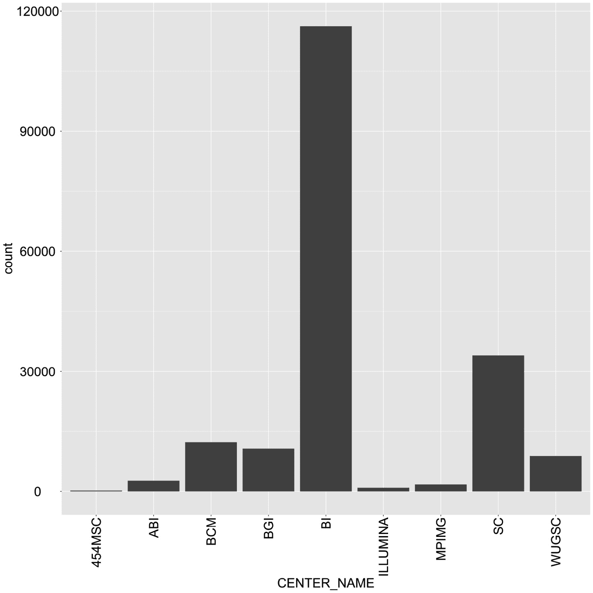
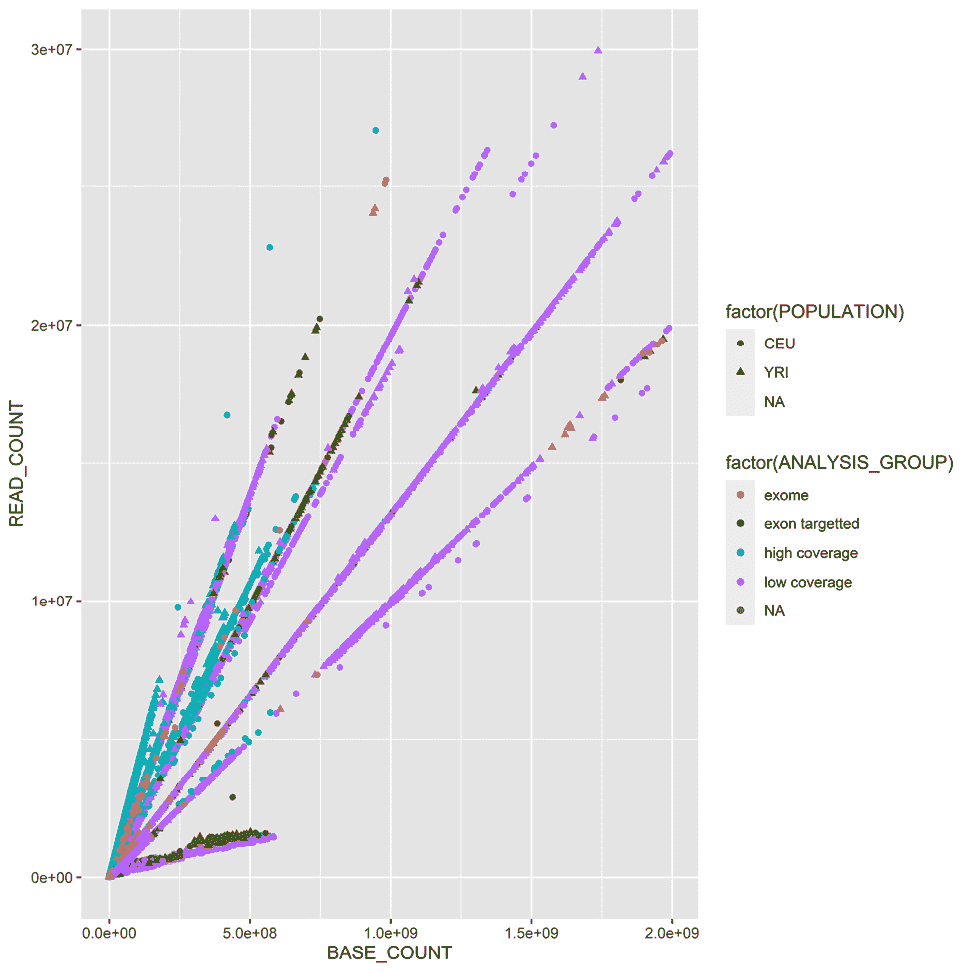

# 1

# Python 及周边软件生态

我们将从安装本书大部分内容所需的基本软件开始。这将包括 **Python** 发行版、一些基本的 Python 库和外部生物信息学软件。在这里，我们也将看看 Python 之外的世界。在生物信息学和大数据领域， **R** 也是主要玩家；因此，您将学习如何通过 **rpy2** 与它交互，这是一个 Python/R 桥。此外，我们将探索 **IPython** 框架(通过 Jupyter Lab)可以给我们带来的优势，以便有效地与 r 接口。这一章将为我们将在本书剩余部分中执行的所有计算生物学奠定基础。

由于不同的用户有不同的需求，我们将介绍两种不同的软件安装方法。一种方法是使用 Anaconda Python([http://docs.continuum.io/anaconda/](http://docs.continuum.io/anaconda/))发行版，另一种安装软件的方法是通过 Docker(这是一种基于共享相同操作系统内核的容器的服务器虚拟化方法；请参考 https://www.docker.com/)。这仍然会为您安装 Anaconda，但是是在一个容器中。如果您使用的是基于 Windows 的操作系统，强烈建议您考虑更换操作系统或通过 Windows 上的一些现有选项使用 Docker。在 macOS 上，虽然 Docker 也是可用的，但你也许可以在本地安装大部分软件。学习使用本地发行版(Anaconda 或其他)比 Docker 容易，但是考虑到 Python 中的包管理可能很复杂，Docker 映像提供了一定程度的稳定性。

在本章中，我们将介绍以下配方:

*   用 Anaconda 安装所需的软件
*   用 Docker 安装所需的软件
*   通过`rpy2`与 R 接口
*   和 Jupyter 一起表演 R 魔术

# 使用 Anaconda 安装所需的基础软件

在开始之前，我们需要安装一些基本的必备软件。接下来的部分将带您了解软件以及安装它们所需的步骤。每一章和部分可能都有额外的要求——我们会在本书的过程中明确这些要求。另一种开始的方法是使用 Docker 食谱，之后一切都会通过 Docker 容器为您处理。

如果您已经在使用不同的 Python 发行版，强烈建议您考虑 Anaconda，因为它已经成为数据科学和生物信息学的事实上的标准。同样，允许你安装来自**https://bioconda.github.io/**([T6)的](https://bioconda.github.io/)发行版软件。

## 准备就绪

Python 可以在不同的环境上运行。例如，你可以在Java 虚拟机 ( **JVM** )中使用 Python(通过 **Jython** 或)。NET via **IronPython** )。然而，在这里，我们不仅关注 Python，还关注围绕它的完整的软件生态。因此，我们将使用标准( **CPython** )实现，因为 JVM 和。NET 版本的存在主要是为了与这些平台的本地库进行交互。

对于我们的代码，我们将使用 Python 3.10。如果你从 Python 和生物信息学开始，任何操作系统都可以。但是在这里，我们主要关心的是中级到高级的用法。因此，虽然你可能会使用 Windows 和 macOS，但大多数的重型分析将在 Linux 上完成(可能是在 T2 的高性能计算集群或 T4 的高性能计算集群上)。**下一代测序** ( **NGS** )数据分析和复杂的机器学习大多在 Linux 集群上进行。

如果你在 Windows 上，你应该考虑升级到 Linux 来进行你的生物信息学工作，因为大多数现代生物信息学软件不能在 Windows 上运行。请注意，macOS 将适用于几乎所有的分析，除非您计划使用计算机集群，这可能是基于 Linux 的。

如果您使用的是 Windows 或 macOS，并且不容易访问 Linux，请不要担心。现代虚拟化软件(如 **VirtualBox** 和 **Docker** )将会拯救你，它将允许你在你的操作系统上安装一个虚拟 Linux。如果您正在使用 Windows，并且决定进行本地化而不使用 Anaconda，那么请谨慎选择库；如果您为所有东西(包括 Python 本身)安装 32 位版本，您可能会更安全。

注意

如果您使用的是 Windows，许多工具将不可用。

生物信息学和数据科学正以极快的速度发展；这不仅仅是炒作，这是现实。安装软件库时，选择版本可能会很棘手。根据您拥有的代码，它可能无法与一些旧版本一起工作，或者甚至无法与新版本一起工作。希望您使用的任何代码都能指出正确的依赖关系——尽管这并不能保证。在本书中，我们将修正所有软件包的精确版本，并且我们将确保代码将与它们一起工作。很自然，代码可能需要与其他包版本一起调整。

为这本书开发的软件可以从 https://github . com/packt publishing/Bioinformatics-with-Python-Cookbook-third-edition 获得。要访问它，您需要安装 Git。习惯 Git 可能是个好主意，因为许多科学计算软件都是用它开发的。

在正确安装 Python 堆栈之前，您需要安装您将与之交互操作的所有外部非 Python 软件。每一章的列表都会有所不同，所有特定章节的包都会在它们各自的章节中解释。幸运的是，从这本书的前几版开始，大多数生物信息学软件已经可以通过 Bioconda 项目获得；因此，安装通常很容易。

你将需要安装一些开发编译器和库，这些都是免费的。在 Ubuntu 上，考虑安装build-essential 包(`apt-get install build-essential`)，在 macOS 上，考虑**Xcode**([https://developer.apple.com/xcode/](https://developer.apple.com/xcode/))。

在下表中，您会发现使用 Python 开发生物信息学最重要的软件列表:

<colgroup><col> <col> <col> <col></colgroup> 
| **名称** | **应用** | **网址** | **目的** |
| 木星计划 | 所有章节 | https://jupyter.org/ | 交互式计算 |
| 熊猫 | 所有章节 | https://pandas.pydata.org/ | 数据处理 |
| NumPy | 所有章节 | http://www.numpy.org/ | 阵列/矩阵处理 |
| 我的天啊 | 所有章节 | https://www.scipy.org/ | 科学计算 |
| 生物 python | 所有章节 | https://biopython.org/ | 生物信息学图书馆 |
| 希伯恩 | 所有章节 | http://seaborn.pydata.org/ | 统计图表库 |
| 稀有 | 生物信息学和统计学 | https://www.r-project.org/ | 统计计算语言 |
| rpy2 | r 连通性 | https://rpy2.readthedocs.io | r 接口 |
| PyVCF | 鼻胃管吸出 | https://pyvcf.readthedocs.io | VCF 加工 |

<colgroup><col> <col> <col> <col></colgroup> 
| 我留下来 | 鼻胃管吸出 | https://github.com/pysam-developers/pysam | SAM/BAM 处理 |
| HTSeq | NGS/基因组 | https://htseq.readthedocs.io | NGS 加工 |
| 树木 | 系统发育学 | https://dendropy.org/ | 系统发育学 |
| PyMol | 蛋白基因组学 | https://pymol.org | 分子可视化 |
| scikit-learn | 机器学习 | http://scikit-learn.org | 机器学习库 |
| Cython | 大数据 | http://cython.org/ | 高性能 |
| Numba | 大数据 | https://numba.pydata.org/ | 高性能 |
| Dask | 大数据 | http://dask.pydata.org | 并行处理 |

图 1.1-显示在生物信息学中有用的各种软件包的表格

我们将使用`pandas`来处理大部分表格数据。另一种选择是只使用标准 Python。`pandas`在数据科学中已经变得如此普遍，以至于用它来处理所有的表格数据可能是有意义的(如果它适合内存的话)。

我们所有的工作都将在 Jupyter 项目中进行，即 Jupyter 实验室。Jupyter 已经成为编写交互式数据分析脚本的事实上的 T2 标准。不幸的是，Jupyter 笔记本的默认格式是基于 JSON 的。这种格式难以阅读，难以比较，并且需要导出以输入到普通的 Python 解释器中。为了避免这个问题，我们将使用`jupytext`([https://jupytext.readthedocs.io/](https://jupytext.readthedocs.io/))扩展 Jupyter，这允许我们将 Jupyter 笔记本保存为普通的 Python 程序。

## 怎么做...

为了让开始，请看下面的步骤:

1.  从从 https://www.anaconda.com/products/individual.下载 Anaconda 发行版开始，我们将使用 21.05 版本，尽管您可能对最新版本没有问题。您可以接受所有安装的默认设置，但是您可能希望确保`conda`二进制文件在您的路径中(不要忘记打开一个新窗口以便可以更新路径)。如果您有另一个 Python 发行版，请小心使用您的`PYTHONPATH`和现有的 Python 库。最好还是不要设置你的`PYTHONPATH`。尽可能卸载所有其他 Python 版本和已安装的 Python 库。
2.  我们去图书馆吧。我们现在将使用`biopython=1.70`创建一个名为`bioinformatics_base`的新`conda`环境，如下面的命令所示:

    ```py
    conda create -n bioinformatics_base python=3.10
    ```

3.  让我们激活环境，如下:

    ```py
    conda activate bioinformatics_base
    ```

4.  让我们将`bioconda`和`conda-forge`频道添加到我们的信号源列表:

    ```py
    conda config --add channels bioconda
    conda config --add channels conda-forge
    ```

5.  另外，安装基本软件包:

    ```py
    conda install \
    biopython==1.79 \
    jupyterlab==3.2.1 \
    jupytext==1.13 \
    matplotlib==3.4.3 \
    numpy==1.21.3 \
    pandas==1.3.4 \
    scipy==1.7.1
    ```

6.  现在，让我们保存我们的环境，以便我们稍后可以重用它来在其他机器上创建新的环境，或者如果您需要清理基础环境:

    ```py
    conda list –explicit > bioinformatics_base.txt
    ```

7.  我们甚至可以从`conda` :

    ```py
    conda install rpy2 r-essentials r-gridextra
    ```

    安装 R

注意`r-essentials`安装了很多 R 包，包括我们后面会用到的 ggplot2。此外，我们安装了`r-gridextra`，因为我们将在笔记本中使用它。

## 还有更多...

如果您不想使用 Anaconda，您可以使用您选择的任何发行版通过`pip`安装许多 Python 库。你可能需要相当多的编译器和构建工具——不仅是 C 编译器，还有 C++和 Fortran。

我们将不使用我们在前面步骤中创建的环境。相反，我们将把它作为一个基础来克隆工作环境。这是因为使用 Python 进行环境管理——即使有了`conda`包系统的帮助——仍然会非常痛苦。因此，我们将创造一个干净的环境，如果我们的开发环境变得难以管理，我们永远不会破坏这个环境。

比如，假设你想用`scikit-learn`创造一个机器学习的环境。您可以执行以下操作:

1.  使用以下内容创建原始环境的克隆:

    ```py
    conda create -n scikit-learn --clone bioinformatics_base
    ```

2.  添加`scikit-learn` :

    ```py
    conda activate scikit-learn
    conda install scikit-learn
    ```

在 JupyterLab 中，我们应该用笔记本打开 jupytext 文件，而不是文本编辑器。由于 jupytext 文件与 Python 文件具有相同的扩展名——这是一个特性，而不是一个错误——默认情况下，JupyterLab 将使用普通的文本编辑器。当我们打开一个 jupytext 文件时，我们需要覆盖缺省值。打开后右键选择**笔记本**，如下截图所示:


图 1.2–在笔记本中打开一个 jupytext 文件

我们的 jupytext 文件不会保存图形输出，这对于本书来说已经足够了。如果你想要一个带有图像的版本，可以使用配对笔记本。更多详情，请查看 Jupytext 页面(【https://github.com/mwouts/jupytext】T2)。

警告

由于我们的代码是要在 Jupyter 中运行的，所以在本书中，我不会多次使用`print`来输出内容，因为单元格的最后一行会自动呈现。如果你不用笔记本，记得做一个`print`。

# 用 Docker 安装所需软件

Docker 是实现操作系统级虚拟化最广泛使用的框架。这项技术允许你拥有一个独立的容器:一个比虚拟机更轻的层，但仍然允许你划分软件。这基本上隔离了所有的进程，让人感觉每个容器都是一个虚拟机。

Docker 在开发领域的两个极端都能很好地工作:它是为学习目的设置本书内容的一种便利方式，并且可以成为您在复杂环境中部署应用程序的首选平台。这个配方是前一个配方的替代方案。

然而，对于长期的开发环境来说，遵循前面的方法可能是您的最佳途径，尽管它可能需要更费力的初始设置。

## 准备就绪

如果你在 Linux 上，你要做的第一件事就是安装 Docker。最安全的解决方案是从 https://www.docker.com/获得最新版本。虽然您的 Linux 发行版可能有一个 Docker 包，但它可能太旧了，而且有很多错误。

如果你是 Windows 或者 macOS 上的，不要绝望；看看 Docker 网站。有各种各样的选择可以拯救你，但没有明确的公式，因为 Docker 在这些平台上进步很快。运行我们的 64 位虚拟机需要一台相当新的计算机。如果您有任何问题，请重新启动您的机器，并确保 BIOS、VT-X 或 AMD-V 已启用。至少，你需要 6 GB 的内存，最好更多。

注意

这将需要从互联网上下载大量内容，因此请确保您有足够的带宽。还有，做好长时间等待的准备。

## 怎么做...

要开始，请按照下列步骤操作:

1.  在 Docker shell 上使用以下命令:

    ```py
    docker build -t bio https://raw.githubusercontent.com/PacktPublishing/Bioinformatics-with-Python-Cookbook-third-edition/main/docker/main/Dockerfile
    ```

在 Linux 上，您需要拥有 root 权限或者被添加到 Docker Unix 组。

1.  现在您已经准备好运行容器了，如下所示:

    ```py
    docker run -ti -p 9875:9875 -v YOUR_DIRECTORY:/data bio
    ```

2.  用操作系统上的目录替换`YOUR_DIRECTORY`。这将在您的主机操作系统和 Docker 容器之间共享。`YOUR_DIRECTORY`将在`/data`的容器中看到，反之亦然。

`-p 9875:9875`将容器的 TCP 端口`9875`暴露在主机端口`9875`上。

尤其是在 Windows 上(也许在 macOS 上)，确保你的目录在 Docker shell 环境中是可见的。如果没有，请查看 Docker 官方文档，了解如何公开目录。

1.  现在，您可以使用该系统了。将你的浏览器指向`http://localhost:9875`，你应该会得到 Jupyter 环境。

如果这个在 Windows 上不工作，检查官方 Docker 文档([https://docs.docker.com/](https://docs.docker.com/))关于如何暴露端口。

## 参见

以下也值得了解:

*   Docker 是使用最广泛的容器化软件，最近使用量有了巨大的增长。你可以在 https://www.docker.com/了解更多。
*   出于安全考虑，Docker 的替代品是 **rkt** ，在[https://coreos.com/rkt/](https://coreos.com/rkt/)可以找到。
*   如果你不能使用 Docker，例如，如果你没有必要的权限，就像大多数计算机集群的情况一样，那么看看 https://www.sylabs.io/singularity/ T2 的奇点。

# 通过 rpy2 与 R 接口

如果有一些你需要的功能，而你在 Python 库中找不到，你的第一个调用端口是检查它的是否在 R 中实现了，对于统计方法，R 仍然是最完整的框架；此外，一些生物信息学功能在 R 中只有*才有*，并且可能作为属于 Bioconductor 项目的软件包提供。

**rpy2** 提供了一个从 Python 到 r 的声明性接口。正如你将看到的，你将能够编写非常优雅的 Python 代码来执行接口过程。为了显示接口(并尝试最常见的 R 数据结构之一 DataFrame 和最流行的 R 库之一`ggplot2`)，我们将从人类 1000 基因组计划(【http://www.1000genomes.org/】)下载它的元数据。这不是一本关于 R 的书，但是我们想提供一些有趣且实用的例子。

## 准备就绪

你需要从 1，000 个基因组序列索引中获取元数据文件。请查看[https://github . com/packt publishing/Bioinformatics-with-Python-Cookbook-third-edition/blob/main/datasets . py](https://github.com/PacktPublishing/Bioinformatics-with-Python-Cookbook-third-edition/blob/main/Datasets.py)，下载`sequence.index`文件。如果你用的是 Jupyter 笔记本，打开`Chapter01/Interfacing_R.py`文件，简单地执行上面的`wget`命令。

这个文件包含项目中所有 FASTQ 文件的信息(在接下来的章节中，我们将使用人类 1，000 基因组项目中的数据)。这包括 FASTQ 文件、样品 ID、原始群体和每个泳道的重要统计信息，如读取次数和读取的 DNA 碱基数。

要设置 Anaconda，可以运行以下命令:

```py
conda create -n bioinformatics_r --clone bioinformatics_base
conda activate bioinformatics_r
conda install r-ggplot2=3.3.5 r-lazyeval r-gridextra rpy2
```

使用 Docker，您可以运行以下内容:

```py
docker run -ti -p 9875:9875 -v YOUR_DIRECTORY:/data tiagoantao/bioinformatics_r
```

现在我们可以开始了。

## 怎么做...

要开始使用,请遵循以下步骤:

1.  我们先来做一些导入:

    ```py
    import os
    from IPython.display import Image
    import rpy2.robjects as robjects
    import rpy2.robjects.lib.ggplot2 as ggplot2
    from rpy2.robjects.functions import SignatureTranslatedFunction
    import pandas as pd
    import rpy2.robjects as ro
    from rpy2.robjects import pandas2ri
    from rpy2.robjects import local_converter
    ```

我们将在 Python 端使用`pandas`。r 数据帧很好地映射到`pandas`。

1.  我们将使用 R 的`read.delim`函数:

    ```py
    read_delim = robjects.r('read.delim')
    seq_data = read_delim('sequence.index', header=True, stringsAsFactors=False)
    #In R:
    # seq.data <- read.delim('sequence.index', header=TRUE, stringsAsFactors=FALSE)
    ```

    从我们的文件中读取数据

导入后我们做的第一件事是访问`read.delim` R 函数，它允许您读取文件。R 语言规范允许你在对象名中加点。所以我们要把一个函数名转换成`read_delim`。然后，我们称函数名为 proper 请注意以下高度声明性的特性。首先，大多数原子对象，比如字符串，可以不经过转换就被传递。其次，参数名可以无缝转换(除了点号问题)。最后，对象在 Python 命名空间中可用(然而，对象实际上在 R 命名空间中不可用；我们稍后将进一步讨论这一点)。

作为参考，我已经包含了相应的 R 代码。我希望这是一个简单的转换。`seq_data`对象是一个数据帧。如果你知道 basic R 或`pandas`，你可能知道这种类型的数据结构。如果不是，那么这本质上就是一个表，也就是一系列行，其中每一列都具有相同的类型。

1.  让我们对该数据帧进行基本检查，如下:

    ```py
    print('This dataframe has %d columns and %d rows' %
    (seq_data.ncol, seq_data.nrow))
    print(seq_data.colnames)
    #In R:
    # print(colnames(seq.data))
    # print(nrow(seq.data))
    # print(ncol(seq.data))
    ```

再次注意代码的相似性。

1.  你甚至可以使用下面的代码混合风格:

    ```py
    my_cols = robjects.r.ncol(seq_data)
    print(my_cols)
    ```

可以直接调用 R 函数；在这种情况下，如果他们的名字中没有点，我们将调用`ncol`;但是，要小心。这将显示一个输出，不是 26(列数)，而是[26]，这是一个由`26`元素组成的向量。这是因为，默认情况下，R 中的大多数操作都返回向量。如果你想要的列数，你必须执行`my_cols[0]`。此外，谈到陷阱，注意 R 数组索引是从 1 开始的，而 Python 是从 0 开始的。

1.  现在，我们需要执行一些数据清理。例如，一些列应该被解释为数字，但是它们却被读为字符串:

    ```py
    as_integer = robjects.r('as.integer')
    match = robjects.r.match
    my_col = match('READ_COUNT', seq_data.colnames)[0] # vector returned
    print('Type of read count before as.integer: %s' % seq_data[my_col - 1].rclass[0])
    seq_data[my_col - 1] = as_integer(seq_data[my_col - 1])
    print('Type of read count after as.integer: %s' % seq_data[my_col - 1].rclass[0])
    ```

`match`函数有点类似于 Python 列表中的`index`方法。正如所料，它返回一个向量，这样我们就可以提取`0`元素。它也是 1 索引的，所以我们在 Python 上工作时减去 1。`as_integer`函数将把一列转换成整数。第一次打印将显示字符串(即被`"`包围的值)，而第二次打印将显示数字。

1.  我们需要多按摩一下这张桌子；这方面的细节可以在笔记本里找到。这里，我们将最终把数据帧转换成 R(记住，虽然它是一个 R 对象，但它实际上在 Python 名称空间上是可见的):

    ```py
    robjects.r.assign('seq.data', seq_data)
    ```

这个将在 R 名称空间中创建一个名为`seq.data`的变量，其中包含来自 Python 名称空间的数据帧的内容。请注意，在此操作之后，两个对象将是独立的(如果您更改了其中一个，它将不会反映在另一个中)。

注意

虽然您可以在 Python 上执行绘图，但 R 具有默认的内置绘图功能(这里我们将忽略)。它还有一个名为 T0 的库，实现了图形 T3 的 T2 语法(一种指定统计图表的声明性语言)。

1.  关于我们基于人类 1，000 个基因组项目的具体例子，首先，我们将绘制具有中心名称分布的直方图，其中产生了所有测序泳道。为此，我们将使用`ggplot` :

    ```py
    from rpy2.robjects.functions import SignatureTranslatedFunction
    ggplot2.theme = SignatureTranslatedFunction(ggplot2.theme, init_prm_translate = {'axis_text_x': 'axis.text.x'})
    bar = ggplot2.ggplot(seq_data) + ggplot2.geom_bar() + ggplot2.aes_string(x='CENTER_NAME') + ggplot2.theme(axis_text_x=ggplot2.element_text(angle=90, hjust=1))
    robjects.r.png('out.png', type='cairo-png')
    bar.plot()
    dev_off = robjects.r('dev.off')
    dev_off()
    ```

第二行有点无趣，但却是一段重要的样板代码。我们将要调用的 R 函数中的一个有一个名字中带点的参数。因为 Python 函数调用不能这样，所以我们必须将函数主题中的`axis.text.x` R 参数名映射到`axis_text_r` Python 名。我们用猴子修补它(也就是说，我们用自己的修补版本替换`ggplot2.theme`)。

然后，我们画出图表本身。当我们向图表添加特性时，请注意`ggplot2`的声明性。首先，我们指定`seq_data`数据帧，然后我们使用一个叫做`geom_bar`的柱状图。接下来，我们注释`x`变量(`CENTER_NAME`)。最后，我们通过改变主题来旋转 x 轴*的文本。我们通过关闭 R 打印设备来完成此操作。*

1.  现在，我们可以在 Jupyter 笔记本中打印图像:

    ```py
    Image(filename='out.png')
    ```

生成了以下图表:



图 1.3–gg plot 2 生成的中心名称直方图，负责对来自 1，000 基因组项目的人类基因组数据的泳道进行测序

1.  作为最后一个示例，我们现在将使用人类 1，000 个基因组项目(我们将彻底使用该项目的数据摘要，可以在 [*第 3 章*](03.html#_idTextAnchor068) 、*下一代测序的*使用现代序列格式*配方中看到)为约鲁班人(`YRI`)和具有北欧和西欧血统的犹他州居民(`CEU`)的所有测序泳道绘制一个读计数和碱基计数散点图此外，我们对不同类型测序之间的差异感兴趣(例如，外显子组覆盖、高覆盖和低覆盖)。首先，我们生成一个只有`YRI`和`CEU`通道的数据帧，并限制最大基址和读取计数:

    ```py
    robjects.r('yri_ceu <- seq.data[seq.data$POPULATION %in% c("YRI", "CEU") & seq.data$BASE_COUNT < 2E9 & seq.data$READ_COUNT < 3E7, ]')
    yri_ceu = robjects.r('yri_ceu')
    ```* 
2.  现在我们准备绘图:

    ```py
    scatter = ggplot2.ggplot(yri_ceu) + ggplot2.aes_string(x='BASE_COUNT', y='READ_COUNT', shape='factor(POPULATION)', col='factor(ANALYSIS_GROUP)') + ggplot2.geom_point()
    robjects.r.png('out.png')
    scatter.plot()
    ```

希望这个例子(请参考下面的截图)能让我们清楚地了解图形方法的语法的力量。我们将从声明数据框架和使用的图表类型开始(即由`geom_point`实现的散点图)。

请注意，表达每个点的形状取决于`POPULATION`变量，颜色取决于`ANALYSIS_GROUP`变量是多么容易:



图 1.4–gg plot 2 生成的散点图，带有所有测序泳道读数的碱基和读数计数；每个点的颜色和形状反映了分类数据(群体和排序数据的类型)

1.  因为R 数据帧与和`pandas`非常接近，所以在两者之间进行转换是有意义的，因为这是由`rpy2` :

    ```py
    import rpy2.robjects as ro
    from rpy2.robjects import pandas2ri
    from rpy2.robjects.conversion import localconverter 
    with localconverter(ro.default_converter + pandas2ri.converter):
      pd_yri_ceu = ro.conversion.rpy2py(yri_ceu)
    del pd_yri_ceu['PAIRED_FASTQ']
    with localconverter(ro.default_converter + pandas2ri.converter):
      no_paired = ro.conversion.py2rpy(pd_yri_ceu)
    robjects.r.assign('no.paired', no_paired)
    robjects.r("print(colnames(no.paired))")
    ```

    支持的

我们从导入必要的转换模块开始—`rpy2`提供了许多将数据从 R 转换成 Python 的策略。这里，我们关注的是数据帧转换。然后我们转换 R 数据帧(注意，我们转换的是 R 名称空间中的`yri_ceu`，而不是 Python 名称空间中的那个)。我们在`pandas`数据帧上删除指示配对 FASTQ 文件名称的列，并将其复制回 R 名称空间。如果您打印新的 R 数据帧的列名，您将会看到`PAIRED_FASTQ`不见了。

## 还有更多...

值得重复的是，Python 软件生态的进步正在以极快的速度发生。这意味着，如果某个功能目前还不可用，它可能会在不久的将来发布。因此，如果您正在开发一个新项目，在使用 R 包中的功能之前，一定要检查 Python 前沿的最新发展。

生物导体项目中有大量的生物信息学 R 包([http://www.bioconductor.org/](http://www.bioconductor.org/))。这可能是您在生物信息学功能的 R 世界中的第一个停靠站。不过注意很多 R 生物信息学包并不在 Bioconductor 上，所以一定要在**综合 R 档案网** ( **CRAN** )(参考 CRAN 在[http://cran.rproject.org/](http://cran.rproject.org/))上搜索更广泛的 R 包。

Python 有很多绘图库。Matplotlib 是最常见的库，但是您还有很多其他选择。在 R 的上下文中，值得注意的是有一个类似于 ggplot2 的 Python 实现，它基于图表的图形描述语言的语法，而且——令人惊讶的是——这叫做`ggplot`!([http://yhat.github.io/ggpy/](http://yhat.github.io/ggpy/))。

## 参见

要了解有关这些主题的更多信息，请参考以下资源:

*   有大量关于 R 的教程和书籍；查看 R 网页([http://www.r-project.org/](http://www.r-project.org/))获取文档。
*   对于生物导体，查看位于[http://manuals.bioinformatics.ucr.edu/home/R_BioCondManual](http://manuals.bioinformatics.ucr.edu/home/R_BioCondManual)的文件。
*   如果您与 NGS 合作，您可能还想看看在 http://manuals.bioinformatics.ucr.edu/home/ht-seq[使用 Bioconductor 进行高通量序列分析。](http://manuals.bioinformatics.ucr.edu/home/ht-seq)
*   `rpy`库文档是您通向 R 的 Python 门户，可以在 https://rpy2.bitbucket.io/的[找到。](https://rpy2.bitbucket.io/)
*   斯普林格的利兰·威尔金森在一本名为《T2 图形语法》的书中描述了图形语法的方法。
*   在数据结构方面，可以在`pandas`库中找到与 R 类似的功能。你可以在 http://pandas.pydata.org/pandas-docs/dev/tutorials.xhtml 找到一些教程。奥莱利媒体公司的韦斯·麦金尼所著的《用于数据分析的 *Python》一书也是一个可以考虑的选择。在下一章，我们将讨论熊猫，并在整本书中使用它。*

# 与朱庇特一起表演魔术

与标准 Python 相比，Jupyter 提供了相当多的额外特性。在这些特性中，它提供了一个名为 **magics** 的可扩展命令框架(实际上，这只适用于 Jupyter 的 IPython 内核，因为它实际上是一个 IPython 特性，但才是我们所关心的)。魔法允许你以许多有用的方式扩展语言。您可以使用一些神奇的函数来处理 R。正如您将在我们的示例中看到的，它使 R 接口变得更加容易和更具声明性。这份食谱不会引入任何新的 R 功能，但希望它能清楚地表明 IPython 如何在这方面成为科学计算的一个重要生产力提升。

## 准备就绪

您需要遵循先前*准备好*的步骤*通过 rpy2* 配方与 R 接口。笔记本是`Chapter01/R_magic.py`。笔记本比这里介绍的食谱更完整，包括更多的图表示例。为了简洁起见，我们将只关注使用魔法与 R 交互的基本构造。如果您正在使用 Docker，您可以使用以下内容:

```py
docker run -ti -p 9875:9875 -v YOUR_DIRECTORY:/data tiagoantao/bioinformatics_r
```

## 怎么做...

这个配方是对前一个配方的积极简化，因为它展示了 R magics 的简洁和优雅:

1.  你需要做的第一件事是加载 R magics 和`ggplot2` :

    ```py
    import rpy2.robjects as robjects
    import rpy2.robjects.lib.ggplot2 as ggplot2
    %load_ext rpy2.ipython
    ```

注意，`%`启动了一个特定于 IPython 的指令。举个简单的例子，你可以在 Jupyter 单元格上写`%R print(c(1, 2))`。

看看不使用`robjects`包执行 R 代码有多容易。其实，`rpy2`是被用来看引擎盖下的。

1.  让来读一下在上一个菜谱中下载的`sequence.index`文件:

    ```py
    %%R
    seq.data <- read.delim('sequence.index', header=TRUE, stringsAsFactors=FALSE)
    seq.data$READ_COUNT <- as.integer(seq.data$READ_COUNT)
    seq.data$BASE_COUNT <- as.integer(seq.data$BASE_COUNT)
    ```

然后，您可以使用`%%R`(注意双`%%`)指定整个单元格应该被解释为 R 代码。

1.  我们现在可以将变量转移到 Python 名称空间:

    ```py
    seq_data = %R seq.data
    print(type(seq_data))  # pandas dataframe!
    ```

数据帧的类型不是标准的 Python 对象，而是一个`pandas`数据帧。这与之前版本的 R magic 界面有所不同。

1.  因为我们有一个`pandas`数据框架，我们可以使用`pandas`接口:

    ```py
    my_col = list(seq_data.columns).index("CENTER_NAME")
    seq_data['CENTER_NAME'] = seq_data['CENTER_NAME'].apply(lambda` x: x.upper())
    ```

    很容易地对它进行操作
2.  让我们把这个数据帧放回 R 名称空间，如下:

    ```py
    %R -i seq_data
    %R print(colnames(seq_data))
    ```

`-i`参数通知 magic 系统，Python 空间后面的变量将被复制到 R 名称空间中。第二行只是显示数据帧确实在 r 中可用。我们使用的名称不同于原来的——它是`seq_data`,而不是`seq.data`。

1.  让我们做一些最后的清理(更多细节，见之前的配方)并打印和之前一样的条形图:

    ```py
    %%R
    bar <- ggplot(seq_data) +  aes(factor(CENTER_NAME)) + geom_bar() + theme(axis.text.x = element_text(angle = 90, hjust = 1))
    print(bar)
    ```

此外，R magic 系统允许您减少代码，因为它改变了 R 与 IPython 的交互行为。例如，在之前配方的`ggplot2`代码中，你不需要使用`.png`和`dev.off` R 函数，因为魔法系统会为你处理这些。当你告诉 R 打印一个图表时，它会神奇地出现在你的笔记本或图形控制台上。

## 还有更多...

随着时间的推移，R magics 的界面似乎已经发生了很大的变化。比如这本书第一版的 R 代码我就更新过几次。DataFrame 赋值的当前版本返回`pandas`对象，这是一个主要的变化。

## 参见

有关更多信息，请查看以下链接:

*   有关 IPython magics 的基本说明，请参见[https://IPython . readthedocs . io/en/stable/interactive/magics . XHTML](https://ipython.readthedocs.io/en/stable/interactive/magics.xhtml)。
*   IPython 的第三方扩展列表，包括神奇的扩展，可以在[https://github.com/ipython/ipython/wiki/Extensions-Index](https://github.com/ipython/ipython/wiki/Extensions-Index)找到。