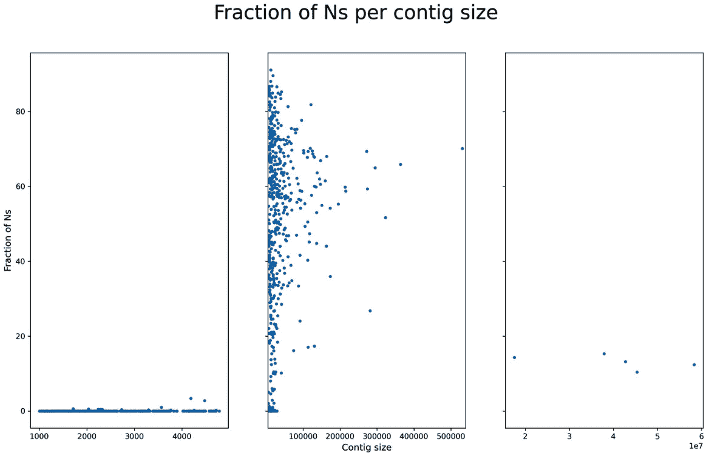
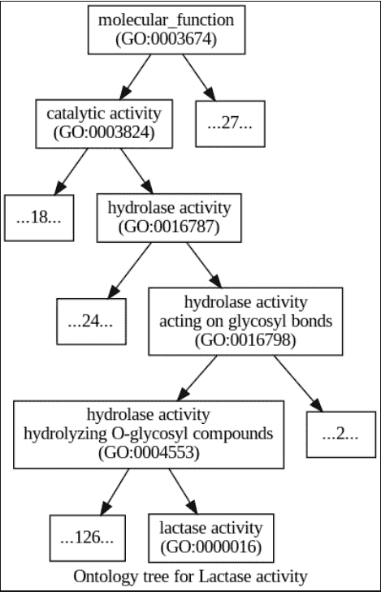

# 5

# 研究基因组

计算生物学中的许多任务都依赖于参考基因组的存在。如果你正在进行序列比对，寻找基因，或研究种群的遗传学，你将直接或间接地使用一个参考基因组。在这一章中，我们将开发一些处理参考基因组和处理不同质量的参考的方法，这些质量可以从高质量(高质量，我们仅指基因组组装的状态，这是本章的重点)，如人类基因组，到非模式物种的问题。我们还将学习如何处理基因组注释(使用将为我们指出基因组中有趣特征的数据库)并使用注释信息提取序列数据。我们也将尝试寻找一些跨物种的基因直向同源物。最后，我们将访问一个**基因本体** ( **GO** )数据库。

在本章中，我们将介绍以下配方:

*   使用高质量的参考基因组
*   处理低质量的参考基因组
*   遍历基因组注释
*   使用注释从参考中提取基因
*   使用 Ensembl REST API 查找直系同源词
*   从 Ensembl 中检索基因本体信息

# 技术要求

如果您通过 Docker 运行本章内容，您可以使用`tiagoantao/bioinformatics_genomes`图像。如果您正在使用 Anaconda，本章所需的软件将在每个相关章节中介绍。

# 使用高质量的参考基因组

在这份食谱中，你将学到一些操作参考基因组的通用技术。作为一个说明性的例子，我们将研究 GC 含量——恶性疟原虫中基于鸟嘌呤-胞嘧啶的基因组部分，恶性疟原虫是导致疟疾的最重要的寄生虫物种。参考基因组通常以 FASTA 文件的形式提供。

## 准备就绪

生物基因组的大小差异很大，从 9.7 kbp 的艾滋病毒等病毒，到 9.7 kbp 的大肠杆菌等细菌，到分布在 14 条染色体、线粒体和顶体上的 22 Mbp 的原生动物，如分布在 22 条常染色体、X/Y 染色体和线粒体上的恶性疟原虫等原生动物，到具有三条常染色体、一条线粒体和 X/Y 性染色体的果蝇，再到分布在 22 条常染色体、X/Y 染色体和线粒体上的三对 Gbp 的人类一路上，你有不同的倍性和性染色体组织。

小费

如你所见，不同的生物有非常不同的基因组大小。这种差异可以有几个数量级。这可能会对您的编程风格产生重大影响。处理大基因组需要你在记忆方面更加保守。不幸的是，更大的基因组将受益于速度更高效的编程技术(因为你有更多的数据要分析)；这些是相互矛盾的要求。一般的规则是，对于更大的基因组，你必须更加注意效率(速度和内存)。

为了减轻这个食谱的负担，我们将使用来自恶性疟原虫的小真核基因组。这个基因组仍然具有许多较大基因组的典型特征(例如，多条染色体)。因此，这是复杂性和大小之间的一个很好的折衷。请注意，有了像*恶性疟原虫*那么大的基因组，将整个基因组加载到内存中就有可能进行许多操作。然而，我们选择了一种可以用于更大基因组(例如，哺乳动物)的编程风格，这样您就可以以更通用的方式使用这种方法，但也可以随意对像这样的小基因组使用更占用内存的方法。

我们会使用你在 [*第一章*](01.html#_idTextAnchor020)*Python 以及周边软件生态*中安装的 Biopython。像往常一样，这份食谱可以在本书的 Jupyter 笔记本中以`Chapter05/Reference_Genome.py`的名称获得，在本书的代码包中。我们需要下载参考基因组——你可以在上述笔记本中找到最新的位置。为了在这个食谱的最后生成图表，我们需要`reportlab`:

```py
conda install -c bioconda reportlab
```

现在，我们准备开始了。

## 怎么做...

请遵循以下步骤:

1.  我们将从检查参考基因组的 FASTA 文件中所有序列的描述开始:

    ```py
    from Bio import SeqIO
    genome_name = 'PlasmoDB-9.3_Pfalciparum3D7_Genome.fasta'
    recs = SeqIO.parse(genome_name, 'fasta')
    for rec in recs:
        print(rec.description)
    ```

这段代码看起来应该和上一章很熟悉， [*第三章*](03.html#_idTextAnchor068) ，*下一代测序*。让我们来看看部分输出:


图 5.1–显示恶性疟原虫参考基因组 FASTA 描述的输出

不同的基因组参考文献会有不同的描述行，但它们通常会包含重要的信息。在这个例子中，你可以看到我们有染色体、线粒体和原生质体。我们也可以查看染色体大小，但是我们将从序列长度中取值。

1.  让我们解析描述行来提取染色体号。我们将从序列中检索染色体大小，并在窗口基础上计算染色体间的`GC`含量:

    ```py
    from Bio import SeqUtils
    recs = SeqIO.parse(genome_name, 'fasta')
    chrom_sizes = {}
    chrom_GC = {}
    block_size = 50000
    min_GC = 100.0
    max_GC = 0.0
    for rec in recs:
        if rec.description.find('SO=chromosome') == -1:
            continue
        chrom = int(rec.description.split('_')[1])
        chrom_GC[chrom] = []
        size = len(rec.seq)
        chrom_sizes[chrom] = size
        num_blocks = size // block_size + 1
        for block in range(num_blocks):
            start = block_size * block
            if block == num_blocks - 1:
                end = size
            else:
                end = block_size + start + 1
            block_seq = rec.seq[start:end]
            block_GC = SeqUtils.GC(block_seq)
            if block_GC < min_GC:
                min_GC = block_GC
            if block_GC > max_GC:
                max_GC = block_GC
            chrom_GC[chrom].append(block_GC)
    print(min_GC, max_GC)
    ```

这里，我们对所有染色体进行了窗口分析，类似于我们在 [*第 3 章*](03.html#_idTextAnchor068) 、*下一代测序*中所做的。我们从定义一个 50 kbp 大小的窗口开始。这对于恶性疟原虫来说是合适的，但是对于染色体数量级与此不同的基因组来说，你需要考虑其他的值。

请注意，我们正在重新读取文件。对于如此小的基因组，对整个基因组进行内存加载是可行的(在*步骤 1* )。无论如何，请随意为小基因组尝试这种编程风格——它更快！然而，我们的代码被设计用于更大的基因组。

1.  注意在`for`循环中，我们通过解析描述的`SO`条目忽略了线粒体和顶质体。`chrom_sizes`字典将保持染色体的大小。

`chrom_GC`字典是我们最感兴趣的数据结构，它将包含每个 50 kbp 窗口的`GC`内容的片段的列表。因此，对于大小为 640，851 bp 的染色体 1，将有 14 个条目，因为该染色体的大小为 14 个 50 kbp 的块。

请注意恶性疟原虫基因组的两个不同寻常的特征:基因组富含 AT——也就是说，缺乏 GC。因此，你得到的数字会很低。此外，染色体根据大小排序(这很常见)，但从最小的大小开始。通常的惯例是从最大的尺寸开始(比如人类的基因组)。

1.  现在，让我们创建一个`GC`分布的基因组图。我们将为`GC`内容使用蓝色阴影。然而，对于高异常值，我们将使用红色阴影。对于低异常值，我们将使用黄色的阴影:

    ```py
    from reportlab.lib import colors
    from reportlab.lib.units import cm
    from Bio.Graphics import BasicChromosome
    chroms = list(chrom_sizes.keys())
    chroms.sort()
    biggest_chrom = max(chrom_sizes.values())
    my_genome = BasicChromosome.Organism(output_format="png")
    my_genome.page_size = (29.7*cm, 21*cm)
    telomere_length = 10
    bottom_GC = 17.5
    top_GC = 22.0
    for chrom in chroms:
        chrom_size = chrom_sizes[chrom]
        chrom_representation = BasicChromosome.Chromosome ('Cr %d' % chrom)
        chrom_representation.scale_num = biggest_chrom
        tel = BasicChromosome.TelomereSegment()
        tel.scale = telomere_length
        chrom_representation.add(tel)
        num_blocks = len(chrom_GC[chrom])
        for block, gc in enumerate(chrom_GC[chrom]):
            my_GC = chrom_GC[chrom][block]
            body = BasicChromosome.ChromosomeSegment()
            if my_GC > top_GC:
                body.fill_color = colors.Color(1, 0, 0)
            elif my_GC < bottom_GC:
                body.fill_color = colors.Color(1, 1, 0)
            else:
                my_color = (my_GC - bottom_GC) / (top_GC -bottom_GC)
                body.fill_color = colors.Color(my_color,my_color, 1)
            if block < num_blocks - 1:
                body.scale = block_size
            else:
                body.scale = chrom_size % block_size
            chrom_representation.add(body)
        tel = BasicChromosome.TelomereSegment(inverted=True)
        tel.scale = telomere_length
        chrom_representation.add(tel)
        my_genome.add(chrom_representation)
    my_genome.draw('falciparum.png', 'Plasmodium falciparum')
    ```

第一行将`keys`方法的返回转换成一个列表。这在 Python 2 中是多余的，但在 Python 3 中不是，在 Python 3 中,`keys`方法有一个特定的`dict_keys`返回类型。

我们按顺序画出染色体(因此排序)。我们需要最大染色体的大小(在*恶性疟原虫*中为 14)，以确保染色体的大小以正确的比例打印出来(变量`biggest_chrom`)。

然后，我们创建一个具有 PNG 输出的有机体的 A4 大小的表示。注意我们画的是非常小的 10 bp 的端粒。这将产生一个类似矩形的染色体。你可以让端粒变大，给它们一个圆形的代表，或者你可能有一个更好的想法，为你的物种使用正确的端粒大小。

我们声明任何低于 17.5%或高于 22.0%的`GC`含量都将被视为异常值。请记住，对于大多数其他物种来说，这将会高得多。

然后，我们打印这些染色体:它们以端粒为界，由 50 kbp 的染色体片段组成(最后一个片段的大小与余数相同)。每个段将被涂成蓝色，红绿成分基于两个异常值之间的线性归一化。每个染色体片段要么是 50 kbp，要么可能更小，如果它是染色体的最后一个。输出如下图所示:


图 5.2-恶性疟原虫的 14 条染色体，用 GC 含量进行颜色编码(红色超过 22%，黄色低于 17%，蓝色阴影代表两个数字之间的线性梯度)

小费

在 python 成为如此流行的语言之前，Biopython 代码就已经发展了。过去，图书馆的可用性相当有限。`reportlab`的用法可以看作是一个遗留问题。我建议您从中学到足够的知识，并将其用于 Biopython。如果你打算学习一个 Python 的现代绘图库，那么旗手就是 Matplotlib，正如我们在 [*第二章*](02.html#_idTextAnchor040) *中了解到的，了解 NumPy、pandas、Arrow 和 Matplotlib* 。替代方案包括 Bokeh、HoloViews 或 Python 版本的 ggplot(甚至更复杂的可视化替代方案，如 Mayavi、**可视化工具包** ( **VTK** )，甚至 Blender API)。

1.  最后，您可以在笔记本中内联打印图像:

    ```py
    from IPython.core.display import Image
    Image("falciparum.png")
    ```

这就完成了这个食谱！

## 还有更多...

*恶性疟原虫*是一个合理的真核生物的例子，它具有小基因组，允许你进行具有足够特征的小数据练习，同时对大多数真核生物仍然有用。当然，没有性染色体(如人类的 X/Y)，但这些应该很容易处理，因为参考基因组不处理倍性问题。

*恶性疟原虫*确实有线粒体，但限于篇幅我们在这里不做处理。Biopython 确实有打印环形基因组的功能，你也可以用它来打印细菌。至于细菌和病毒，这些基因组更容易处理，因为它们非常小。

## 参见

您可以从以下资源中了解更多信息:

*   你可以在[http://www.ensembl.org/info/data/ftp/index.xhtml](http://www.ensembl.org/info/data/ftp/index.xhtml)的恩森布尔找到许多模式生物的参考基因组。
*   和往常一样，**国家生物技术信息中心** ( **NCBI** )也在[http://www.ncbi.nlm.nih.gov/genome/browse/](http://www.ncbi.nlm.nih.gov/genome/browse/)提供了一份基因组的大名单。
*   有很多网站致力于一个单一的有机体(或一组相关的有机体)。除了你从其下载了*恶性疟原虫*基因组的 PlasmoDB([http://plasmodb.org/plasmo/](http://plasmodb.org/plasmo/))之外，你将在疾病载体的下一个配方中找到vector base([https://www.vectorbase.org/](https://www.vectorbase.org/))。果蝇的 fly base([http://flybase.org/](http://flybase.org/))也值得一提，但是不要忘记搜索你感兴趣的生物。

# 处理低质量的基因组参考

不幸的是，并不是所有的参考基因组都具有恶性疟原虫 T2 的品质。除了一些模式物种(例如，人类，或常见的果蝇*黑腹果蝇*和少数其他物种)，大多数参考基因组可以使用一些改进。在这个食谱中，我们将学习如何处理低质量的参考基因组。

## 准备就绪

为了与疟疾主题保持一致，我们将使用两种蚊子的参考基因组，这两种蚊子是疟疾的传播媒介:*冈比亚按蚊*(这是疟疾最重要的传播媒介，可以在撒哈拉以南非洲找到)和*萎缩按蚊*(欧洲的一种疟疾传播媒介，虽然这种疾病在欧洲已经被根除，但这种传播媒介仍然存在)。*冈比亚按蚊*基因组质量合理。大多数染色体已经被绘制出来，尽管 Y 染色体还需要一些工作。有一个相当大的未知染色体，可能由 X 和 Y 染色体以及中肠微生物群组成。这个基因组有合理数量的未被调用的位置(也就是说，你会发现 *N* s 而不是 ACTGs)。萎缩按蚊的基因组仍然是支架形式。不幸的是，这是你会发现许多非模式物种。

请注意，我们将增加一点赌注。按蚊的基因组比恶性疟原虫 T2 的基因组大一个数量级(但仍然比大多数哺乳动物小一个数量级)。

我们会使用你在 [*第一章*](01.html#_idTextAnchor020)*Python 以及周边软件生态*中安装的 Biopython。像往常一样，这个食谱可以在本书的 Jupyter 笔记本的`Chapter05/Low_Quality.py`中找到，在本书的代码包中。在笔记本的开始，你可以找到两个基因组的最新位置，以及下载它们的代码。

## 怎么做...

请遵循以下步骤:

1.  让我们首先列出冈比亚按蚊基因组*的染色体:

    ```py
    import gzip
    from Bio import SeqIO
    gambiae_name = 'gambiae.fa.gz'
    atroparvus_name = 'atroparvus.fa.gz'
    recs = SeqIO.parse(gzip.open(gambiae_name, 'rt', encoding='utf-8'), 'fasta')
    for rec in recs:
        print(rec.description)
    ```* 

这将产生一个输出，其中包括生物体染色体(以及一些未绘制的超大陆):

```py
AgamP4_2L | organism=Anopheles_gambiae_PEST | version=AgamP4 | length=49364325 | SO=chromosome
AgamP4_2R | organism=Anopheles_gambiae_PEST | version=AgamP4 | length=61545105 | SO=chromosome
AgamP4_3L | organism=Anopheles_gambiae_PEST | version=AgamP4 | length=41963435 | SO=chromosome
AgamP4_3R | organism=Anopheles_gambiae_PEST | version=AgamP4 | length=53200684 | SO=chromosome
AgamP4_X | organism=Anopheles_gambiae_PEST | version=AgamP4 | length=24393108 | SO=chromosome
AgamP4_Y_unplaced | organism=Anopheles_gambiae_PEST | version=AgamP4 | length=237045 | SO=chromosome
AgamP4_Mt | organism=Anopheles_gambiae_PEST | version=AgamP4 | length=15363 | SO=mitochondrial_chromosome
```

代码非常简单。我们使用`gzip`模块，因为较大基因组的文件通常是压缩的。我们可以看到四个染色体臂(`2L`、`2R`、`3L`和`3R`)、线粒体(`Mt`)、`X`染色体和`Y`染色体，其中非常小，其名称几乎表明它可能不处于最佳状态。此外，未知(`UNKN`)染色体是参考基因组的一大部分，相当于一个染色体臂。

不要用*微小按蚊*来做这个；否则，由于脚手架状态，您将获得一千多个条目。

1.  现在，让我们检查*冈比亚按蚊*基因组:

    ```py
    recs = SeqIO.parse(gzip.open(gambiae_name, 'rt', encoding='utf-8'), 'fasta')
    chrom_Ns = {}
    chrom_sizes = {}
    for rec in recs:
        if rec.description.find('supercontig') > -1:
            continue
        print(rec.description, rec.id, rec)
        chrom = rec.id.split('_')[1]
        if chrom in ['UNKN']:
            continue
        chrom_Ns[chrom] = []
        on_N = False
        curr_size = 0
        for pos, nuc in enumerate(rec.seq):
            if nuc in ['N', 'n']:
                curr_size += 1
                on_N = True
            else:
                if on_N:
                    chrom_Ns[chrom].append(curr_size)
                    curr_size = 0
                on_N = False
        if on_N:
            chrom_Ns[chrom].append(curr_size)
        chrom_sizes[chrom] = len(rec.seq)
    for chrom, Ns in chrom_Ns.items():
        size = chrom_sizes[chrom]
        if len(Ns) > 0:
            max_Ns = max(Ns)
        else:
            max_Ns = 'NA'
        print(f'{chrom} ({size}): %Ns ({round(100 * sum(Ns) / size, 1)}), num Ns: {len(Ns)}, max N: {max_Ns}')
    ```

    的未计算位置(`Ns`)及其分布

前面的代码需要一些时间来运行，所以请耐心等待；我们将检查每一对常染色体碱基。像往常一样，我们将重新打开并重新读取文件以节省内存。

我们有两个字典:一个包含染色体大小，另一个包含`Ns`游程大小的分布。为了计算`Ns`的行程，我们必须遍历所有的常染色体(注意`N`位置开始和结束的时间)。然后，我们必须打印出`Ns`分布的基本统计数据:

```py
2L (49364325): %Ns (1.7), num Ns: 957, max N: 28884
2R (61545105): %Ns (2.3), num Ns: 1658, max N: 36427
3L (41963435): %Ns (2.9), num Ns: 1272, max N: 31063
3R (53200684): %Ns (1.8), num Ns: 1128, max N: 24292
X (24393108): %Ns (4.1), num Ns: 1287, max N: 21132
Y (237045): %Ns (43.0), num Ns: 63, max N: 7957
Mt (15363): %Ns (0.0), num Ns: 0, max N: NA
```

所以，对于`2L`染色体臂(大小为 49 Mbp)，1.7%是`N`调用除以`957`运行。最大的跑分是`28884` bps。请注意，`X`染色体具有最高比例的`Ns`位置。

1.  现在，让我们把注意力转向*萎缩按蚊*的基因组。让我们数一下脚手架的数量，以及脚手架尺寸的分布:

    ```py
    import numpy as np
    recs = SeqIO.parse(gzip.open(atroparvus_name, 'rt', encoding='utf-8'), 'fasta')
    sizes = []
    size_N = []
    for rec in recs:
        size = len(rec.seq)
        sizes.append(size)
        count_N = 0
        for nuc in rec.seq:
            if nuc in ['n', 'N']:
                count_N += 1
        size_N.append((size, count_N / size))
    print(len(sizes), np.median(sizes), np.mean(sizes),
          max(sizes), min(sizes),
          np.percentile(sizes, 10), np.percentile(sizes, 90))
    ```

这段代码类似于我们之前看到的，但是我们使用 NumPy 打印了稍微详细一些的统计数据，所以我们得到了以下结果:

```py
1320 7811.5 170678.2 58369459 1004 1537.1 39644.7
```

因此，我们有`1371`个支架(相对于*冈比亚按蚊*基因组上的 7 个条目),其中值为`7811.5`(T2 的平均值)。最大的支架是 5.8 Mbp，最小的支架是 1,004 bp。尺寸的第十百分位数是`1537.1`，而第九十百分位数是`39644.7`。

1.  最后，让我们绘制支架的分数——即`N`——作为其尺寸的函数:

    ```py
    import matplotlib.pyplot as plt
    small_split = 4800
    large_split = 540000
    fig, axs = plt.subplots(1, 3, figsize=(16, 9), squeeze=False, sharey=True)
    xs, ys = zip(*[(x, 100 * y) for x, y in size_N if x <= small_split])
    axs[0, 0].plot(xs, ys, '.')
    xs, ys = zip(*[(x, 100 * y) for x, y in size_N if x > small_split and x <= large_split])
    axs[0, 1].plot(xs, ys, '.')
    axs[0, 1].set_xlim(small_split, large_split)
    xs, ys = zip(*[(x, 100 * y) for x, y in size_N if x > large_split])
    axs[0, 2].plot(xs, ys, '.')
    axs[0, 0].set_ylabel('Fraction of Ns', fontsize=12)
    axs[0, 1].set_xlabel('Contig size', fontsize=12)
    fig.suptitle('Fraction of Ns per contig size', fontsize=26)
    ```

前面的代码将生成下图所示的输出，其中我们根据支架大小将图分成三部分:一部分用于小于 4,800 bp 的支架，一部分用于 4800 到 540,000 bp 的支架，一部分用于更大的支架。对于小型支架，`Ns`的分数非常低(总是低于 3.5%)；对于中型支架，差异较大(大小在 0%和 90%以上)，对于最大的支架，差异较小(在 0%和 25%之间):



图 5.3-支架的 N 分数与其尺寸的函数关系

## 还有更多...

有时，参考基因组携带额外的信息。例如，*冈比亚按蚊*基因组被软屏蔽。这意味着在基因组上运行了一些程序来识别低复杂性区域(这些区域通常更难以分析)。这可以通过大写来说明:ACTG 将是高复杂度的，而 actg 将是低复杂度的。

有许多支架的参考基因组不仅仅是一个不方便的争论。例如，非常小的支架(比如 2,000 bp 以下)在使用校准器时可能会有作图问题(例如**布伦斯-惠勒校准器** ( **BWA** ))，特别是在极端情况下(大多数支架在其极端情况下都会有作图问题，但如果支架很小，这些问题在支架中的比例会大得多)。如果您正在使用这样的参考基因组进行比对，您将需要考虑在绘制小支架时忽略配对信息(假设您有配对末端读数)，或者至少测量支架大小对您的比对器性能的影响。在任何情况下，总的想法是，你应该小心，因为脚手架的大小和数量会不时地露出它们丑陋的头。

对于这些基因组，仅识别出完全模糊性(`N`)。注意，其他基因组组装会给你一个介于总的**模糊性和确定性** ( **ACTG** )之间的中间代码。

## 参见

以下是一些资源，您可以从中了解更多信息:

*   像 RepeatMasker 这样的工具可以用来寻找低复杂度的基因组区域。查看[http://www.repeatmasker.org/](http://www.repeatmasker.org/)了解更多信息。
*   IUPAC 歧义代码在处理其他基因组时可能是有用的。查看[http://www.bioinformatics.org/sms/iupac.xhtml](http://www.bioinformatics.org/sms/iupac.xhtml)了解更多信息。

# 遍历基因组注释

拥有一个基因组序列是有趣的，但是我们想要从中提取特征，比如基因、外显子和编码序列。这种类型的注释信息在**通用特征格式** ( **GFF** )和**通用传输格式** ( **GTF** )文件中可用。在这个菜谱中，我们将学习如何解析和分析 GFF 文件，同时以冈比亚按蚊*基因组的注释为例。*

## 准备就绪

使用本书的代码包中提供的`Chapter05/Annotations.py`笔记本文件。我们将使用的 GFF 文件的最新位置可以在笔记本的顶部找到。

您需要安装`gffutils`:

```py
conda install -c bioconda gffutils
```

现在，我们准备开始了。

## 怎么做...

请遵循以下步骤:

1.  让我们首先基于我们的 GFF 文件:

    ```py
    import gffutils
    import sqlite3
    try:
        db = gffutils.create_db('gambiae.gff.gz', 'ag.db')
    except sqlite3.OperationalError:
        db = gffutils.FeatureDB('ag.db')
    ```

    用`gffutils`创建一个注释数据库

`gffutils`库创建了一个 SQLite 数据库来高效地存储注释。这里，我们将尝试使用来创建数据库，但是如果它已经存在，我们将使用现有的数据库。这一步可能很耗时。

1.  现在，让我们列出所有可用的功能类型并进行计数:

    ```py
    print(list(db.featuretypes()))
    for feat_type in db.featuretypes():
        print(feat_type, db.count_features_of_type(feat_type))
    ```

这些特征将包括重叠群、基因、外显子、转录本等等。注意，我们将使用`gffutils`包的`featuretypes`函数。它将返回一个生成器，但是我们将把它转换成一个列表(在这里这样做是安全的)。

1.  让我们列出所有的序列号:

    ```py
    seqids = set()
    for e in db.all_features():
        seqids.add(e.seqid)
    for seqid in seqids:
        print(seqid)
    ```

这将向我们展示所有染色体臂和性染色体、线粒体和未知染色体的注释信息。

1.  现在，我们来提取每条染色体的很多有用信息，比如基因数量，每个基因的转录本数量，外显子数量等等:

    ```py
    from collections import defaultdict
    num_mRNAs = defaultdict(int)
    num_exons = defaultdict(int)
    max_exons = 0
    max_span = 0
    for seqid in seqids:
        cnt = 0
        for gene in db.region(seqid=seqid, featuretype='protein_coding_gene'):
            cnt += 1
            span = abs(gene.start - gene.end) # strand
            if span > max_span:
                max_span = span
                max_span_gene = gene
            my_mRNAs = list(db.children(gene, featuretype='mRNA'))
            num_mRNAs[len(my_mRNAs)] += 1
            if len(my_mRNAs) == 0:
                exon_check = [gene]
            else:
                exon_check = my_mRNAs
            for check in exon_check:
                my_exons = list(db.children(check, featuretype='exon'))
                num_exons[len(my_exons)] += 1
                if len(my_exons) > max_exons:
                    max_exons = len(my_exons)
                    max_exons_gene = gene
        print(f'seqid {seqid}, number of genes {cnt}')
    print('Max number of exons: %s (%d)' % (max_exons_gene.id, max_exons))
    print('Max span: %s (%d)' % (max_span_gene.id, max_span))
    print(num_mRNAs)
    print(num_exons)
    ```

我们将遍历所有 seqids，同时提取所有蛋白质编码基因(使用`region`)。在每个基因中，我们计算可供选择的转录物的数量。如果没有(注意，这可能是注释问题，而不是生物学问题)，我们计算外显子(`children`)。如果有几个转录本，我们计算每个转录本的外显子。我们还考虑了跨度大小，以检查跨越最大区域的基因。

我们按照类似的程序找到基因和最大数量的外显子。最后，我们打印一个字典，其中包含每个基因的可选转录本数量的分布(`num_mRNAs`)和每个转录本的外显子数量的分布(`num_exons`)。

## 还有更多...

GFF/GTF 格式有许多变体。有不同的 GFF 版本和许多非官方的变化。如果可能，选择 GFF 版本 3。然而，丑陋的事实是，你会发现处理文件非常困难。图书馆尽最大努力去适应这一点。事实上，这个库的大部分文档都与帮助你处理各种尴尬的变化有关(参考 https://pythonhosted.org/gffutils/examples.xhtml[)。](https://pythonhosted.org/gffutils/examples.xhtml)

使用`gffutils`还有一个替代方法(要么是因为你的 GFF 文件很奇怪，要么是因为你不喜欢库接口或它对 SQL 后端的依赖)。手动解析文件。如果你看看它的格式，你会发现它并不复杂。如果您只是执行一次性操作，那么手动解析可能就足够了。当然，从长远来看，一次性操作往往没那么好。

另外，请注意注释的质量往往变化很大。随着质量的提高，复杂性也在增加。只需查看人工注释中的一个例子。你可以预期，随着时间的推移，随着我们对有机体知识的发展，注释的质量和复杂性将会增加。

## 参见

以下是一些资源，您可以从中了解更多信息:

*   在 https://www.sanger.ac.uk/resources/software/gff/spec.xhtml 的[可以找到 GFF 的规格](https://www.sanger.ac.uk/resources/software/gff/spec.xhtml)。
*   在 http://gmod.org/wiki/GFF3 的[可以找到对 GFF 格式最好的](http://gmod.org/wiki/GFF3)解释，以及最常见的版本和 GTF。

# 使用注释从参考中提取基因

在这份食谱中，我们将学习如何在注释文件的帮助下提取基因序列，以获得其相对于参考 FASTA 的坐标。我们将使用冈比亚按蚊的*基因组，以及它的注释文件(按照前两个食谱)。首先，我们将提取**电压门控钠通道** ( **VGSC** )基因，该基因涉及对杀虫剂的抗性。*

## 准备就绪

如果你已经遵循了前两个食谱，你将准备好了。如果没有，下载*冈比亚按蚊* FASTA 文件，以及 GTF 文件。您还需要准备`gffutils`数据库:

```py
import gffutils
import sqlite3
try:
    db = gffutils.create_db('gambiae.gff.gz', 'ag.db')
except sqlite3.OperationalError:
    db = gffutils.FeatureDB('ag.db')
```

像往常一样，你会在`Chapter05/Getting_Gene.py`笔记本文件中找到所有这些。

## 怎么做...

请遵循以下步骤:

1.  让我们从检索我们基因的注释信息开始:

    ```py
    import gzip
    from Bio import Seq, SeqIO
    gene_id = 'AGAP004707'
    gene = db[gene_id]
    print(gene)
    print(gene.seqid, gene.strand)
    ```

`gene_id`是从 VectorBase 中检索到的，vector base 是一个疾病媒介基因组学的在线数据库。对于其他特定的情况，你需要知道你的基因的 ID(这将取决于物种和数据库)。输出如下所示:

```py
AgamP4_2L       VEuPathDB       protein_coding_gene     2358158 2431617 .       +       .       ID=AGAP004707;Name=para;description=voltage-gated sodium channel
AgamP4_2L + 
```

请注意，该基因位于`2L`染色体臂上，并以正向编码(即`+`链)。

1.  我们先把`2L`染色体手臂的序列保存在内存中(只是单个染色体，所以我们就放纵一下):

    ```py
    recs = SeqIO.parse(gzip.open('gambiae.fa.gz', 'rt', encoding='utf-8'), 'fasta')
    for rec in recs:
        print(rec.description)
        if rec.id == gene.seqid:
            my_seq = rec.seq
            break
    ```

输出如下:

```py
AgamP4_2L | organism=Anopheles_gambiae_PEST | version=AgamP4 | length=49364325 | SO=chromosome
```

1.  让我们创建一个函数来为一个列表`CDSs` :

    ```py
    def get_sequence(chrom_seq, CDSs, strand):
        seq = Seq.Seq('')
        for CDS in CDSs:
            my_cds = Seq.Seq(str(my_seq[CDS.start - 1:CDS.end]))
            seq += my_cds
        return seq if strand == '+' else seq.reverse_complement()
    ```

    构建一个基因序列

这个函数将接收一个染色体序列(在我们的例子中是`2L`臂)、一个编码序列列表(从注释文件中检索)和一个链。

我们必须非常小心序列的开始和结束(注意 GFF 文件是从 1 开始的，而 Python 数组是从 0 开始的)。最后，如果链是负的，我们返回反向的互补。

1.  虽然我们手头有`gene_id`，但我们只想要该基因三个可用转录本中的一个，所以我们需要选择一个:

    ```py
    mRNAs = db.children(gene, featuretype='mRNA')
    for mRNA in mRNAs:
        print(mRNA.id)
        if mRNA.id.endswith('RA'):
            break
    ```

2.  现在，让我们得到我们的转录本的编码序列，然后得到基因序列，并翻译它:

    ```py
    CDSs = db.children(mRNA, featuretype='CDS', order_by='start')
    gene_seq = get_sequence(my_seq, CDSs, gene.strand)
    print(len(gene_seq), gene_seq)
    prot = gene_seq.translate()
    print(len(prot), prot)
    ```

3.  让我们得到负链方向编码的基因。我们将只取 VGSC(恰好是负链)旁边的基因:

    ```py
    reverse_transcript_id = 'AGAP004708-RA'
    reverse_CDSs = db.children(reverse_transcript_id, featuretype='CDS', order_by='start')
    reverse_seq = get_sequence(my_seq, reverse_CDSs, '-')
    print(len(reverse_seq), reverse_seq)
    reverse_prot = reverse_seq.translate()
    print(len(reverse_prot), reverse_prot)
    ```

在这里，我避免了获取关于基因的所有信息，只是硬编码了转录本 ID。关键是你应该确保你的代码能够工作，不管它是什么样的。

## 还有更多...

这是一个简单的方法，它运用了本章和第三章*下一代测序*中介绍的几个概念。虽然它在概念上微不足道，但不幸的是它充满了陷阱。

小费

当使用不同的数据库时，确保基因组装配版本是同步的。使用不同的版本将是一个严重且潜在的潜在缺陷。记住不同的版本(至少在主版本号上)有不同的坐标。例如，人类基因组第 36 号染色体上的 1，234 位可能指的是与第 38 号染色体上的 1，234 位不同的 SNP。对于人类数据，你可能会在 build 36 上找到很多芯片，在 build 37 上找到大量全基因组序列，而最近的人类组装是 build 38。以我们的*按蚊*为例，你会有第 3 和第 4 个版本。大多数物种都会这样。所以，要注意！

Python 中的 0 索引数组与 1 索引基因组数据库之间也存在问题。尽管如此，请注意一些基因组数据库也可能是 0 索引的。

还有两个混淆的来源:转录本和基因选择，就像在更丰富的注释数据库中一样。这里，您将有几个可供选择的抄本(如果您想查看一个丰富到令人困惑的数据库，请参考人工注释数据库)。此外，与编码序列相比，标记有`exon`的字段将包含更多信息。为此，您将需要 CDS 字段。

最后，还有一个链的问题，在这里你要根据反向互补来翻译。

## 参见

以下是一些资源，您可以从中了解更多信息:

*   你可以在 http://www.ensembl.org/info/data/mysql.xhtml 的[下载 Ensembl 的 MySQL 表格。](http://www.ensembl.org/info/data/mysql.xhtml)
*   http://genome.ucsc.edu/的[可以找到 UCSC 基因组浏览器](http://genome.ucsc.edu/)。请务必查看 http://hgdownload.soe.ucsc.edu/downloads.xhtml 的[下载区。](http://hgdownload.soe.ucsc.edu/downloads.xhtml)
*   参照基因组，你可以在 http://www.ensembl.org/info/data/ftp/index.xhtml 的恩森布尔找到模式生物的 GTF。
*   关于 CDSs 和外显子的简单解释可以在[https://www.biostars.org/p/65162/](https://www.biostars.org/p/65162/)找到。

# 使用 Ensembl REST API 查找直系同源词

在这份食谱中，我们将学习如何寻找某个基因的直系同源物。这个简单的食谱不仅将介绍正字法检索，还将介绍如何在 web 上使用 REST APIs 来访问生物学数据。最后，但同样重要的是，它将介绍如何使用编程 API 访问 Ensembl 数据库。

在我们的例子中，我们将试图找到人类**乳糖酶** ( **LCT** )基因在`horse`基因组上的任何直系同源物。

## 准备就绪

这个食谱不需要任何预先下载的数据，但是由于我们使用网络应用编程接口，将需要互联网接入。可以传输的数据量将会受到限制。

我们还将利用`requests`库来访问 Ensembl。request API 是一个易于使用的 web 请求包装器。当然，您可以使用标准的 Python 库，但是这些库要麻烦得多。

和往常一样，你可以在`Chapter05/Orthology.py`笔记本文件中找到这个内容。

## 怎么做...

请遵循以下步骤:

1.  我们将首先创建一个支持函数来执行一个 web 请求:

    ```py
    import requests
    ensembl_server = 'http://rest.ensembl.org'
    def do_request(server, service, *args, **kwargs):
        url_params = ''
        for a in args:
            if a is not None:
                url_params += '/' + a
        req = requests.get('%s/%s%s' % (server, service, url_params), params=kwargs, headers={'Content-Type': 'application/json'})
        if not req.ok:
            req.raise_for_status()
        return req.json()
    ```

我们从导入`requests`库并指定根 URL 开始。然后，我们创建一个简单的函数，它将接受被调用的功能(参见下面的例子)并生成一个完整的 URL。它还将添加可选参数，并将有效负载指定为 JSON 类型(只是为了获得一个默认的 JSON 答案)。它将以 JSON 格式返回响应。这通常是列表和字典的嵌套 Python 数据结构。

1.  然后，我们会检查服务器上所有可用的物种，写这本书的时候是 110 左右:

    ```py
    answer = do_request(ensembl_server, 'info/species')
    for i, sp in enumerate(answer['species']):
        print(i, sp['name'])
    ```

注意，这将为 REST 请求构建一个以前缀`http://rest.ensembl.org/info/species`开头的 URL。顺便说一下，前面的链接在你的浏览器上不起作用；它应该只通过 REST API 来使用。

1.  现在，让我们试着在服务器上找到任何与人类数据相关的`HGNC`数据库:

    ```py
    ext_dbs = do_request(ensembl_server, 'info/external_dbs', 'homo_sapiens', filter='HGNC%')
    print(ext_dbs)
    ```

我们将搜索限制在与人类相关的数据库(`homo_sapiens`)。我们还从`HGNC`开始过滤数据库(这种过滤使用 SQL 符号)。`HGNC`是雨果数据库。我们希望确保它是可用的，因为 HUGO 数据库负责管理人类基因名称并维护我们的 LCT 标识符。

1.  现在我们知道 LCT 标识符可能是可用的，我们想要检索基因的 Ensembl ID，如下面的代码所示:

    ```py
    answer = do_request(ensembl_server, 'lookup/symbol', 'homo_sapiens', 'LCT')
    print(answer)
    lct_id = answer['id']
    ```

小费

您现在可能已经知道，不同的数据库对于同一个对象会有不同的 id。我们需要将我们的 LCT 标识符解析为 Ensembl ID。当您处理与相同对象相关的外部数据库时，数据库之间的 ID 转换可能是您的首要任务。

1.  仅供参考，我们现在可以得到包含基因的区域的序列。请注意，这可能是整个间隔，因此如果您想要恢复基因，您将不得不使用类似于我们在之前的配方中使用的程序:

    ```py
    lct_seq = do_request(ensembl_server, 'sequence/id', lct_id)
    print(lct_seq)
    ```

2.  我们还可以检查 Ensembl 已知的其他数据库；参考以下基因:

    ```py
    lct_xrefs = do_request(ensembl_server, 'xrefs/id', lct_id)
    for xref in lct_xrefs:
        print(xref['db_display_name'])
        print(xref)
    ```

你会发现不同种类的数据库，比如**脊椎动物基因组注释** ( **织女星**)项目、UniProt(见 [*第八章*](08.html#_idTextAnchor209) 、*使用蛋白质数据库*)和 WikiGene。

1.  让我们得到这个基因在`horse`基因组上的直系同源物:

    ```py
    hom_response = do_request(ensembl_server, 'homology/id', lct_id, type='orthologues', sequence='none')
    homologies = hom_response['data'][0]['homologies']
    for homology in homologies:
        print(homology['target']['species'])
        if homology['target']['species'] != 'equus_caballus':
            continue
        print(homology)
        print(homology['taxonomy_level'])
        horse_id = homology['target']['id']
    ```

我们可以通过在`do_request`上指定一个`target_species`参数来直接获得`horse`基因组的直系同源物。但是，此代码允许您检查所有可用的正字法。

你会得到关于一个直向同源物的相当多的信息，比如直向同源物的分类级别(boreoutheria——胎盘哺乳动物是人类和马之间最接近的系统发育级别)，直向同源物的 Ensembl ID，dN/dS 比率(非同义突变到同义突变)，以及序列间差异的雪茄串(参考上一章， [*第三章*](03.html#_idTextAnchor068) ，*下一代测序*)。默认情况下，您还将获得直向同源序列的对齐，但是我已经将其移除以清除输出。

1.  最后，让我们寻找`horse_id` Ensembl 记录:

    ```py
    horse_req = do_request(ensembl_server, 'lookup/id', horse_id)
    print(horse_req)
    ```

从这一点开始，你可以使用之前的配方方法来探索 LCT `horse`直系同源词。

## 还有更多...

你可以在[http://rest.ensembl.org/](http://rest.ensembl.org/)找到所有可用功能的详细解释。这包括所有的接口和 Python 代码片段，以及其他语言。

如果您对旁注感兴趣，可以很容易地从前面的食谱中检索到这些信息。在对`homology/id`的调用上，只需用`paralogues`替换类型即可。

如果你听说过 Ensembl，你可能听说过 UCSC 的一种替代服务:基因组浏览器([http://genome.ucsc.edu/](http://genome.ucsc.edu/))。从用户界面的角度来看，它们处于同一层次。从编程的角度来说，Ensembl 可能更成熟。访问 NCBI Entrez 数据库在 [*第 3 章*](03.html#_idTextAnchor068) 、*下一代测序*中有所介绍。

以编程方式与 Ensembl 交互的另一个完全不同的策略是下载原始表，并将它们注入本地 MySQL 数据库。请注意，这本身就是一项艰巨的任务(您可能只想加载非常小的一部分表)。但是，如果您打算大量使用，您可能需要考虑创建数据库的一部分的本地版本。如果是这种情况，您可能需要重新考虑 UCSC 的替代方案，因为从本地数据库的角度来看，它和 Ensembl 一样好。

# 从 Ensembl 中检索基因本体信息

在这个菜谱中，您将通过查询 Ensembl REST API 再次学习如何使用基因本体信息。基因本体是受控的词汇，用于注释基因和基因产物。这些以概念树的形式提供(更一般的概念位于层次结构的顶端)。基因本体论有三个领域:细胞成分、分子功能和生物过程。

## 准备就绪

和前面的方法一样，我们不需要任何预先下载的数据，但是因为我们使用 web APIs，所以需要互联网访问。将要传输的数据量将是有限的。

和往常一样，你可以在`Chapter05/Gene_Ontology.py`笔记本文件中找到这个内容。我们将使用`do_request`函数，它是在前面的配方的*步骤 1* 中定义的(*使用 Ensembl REST API* 查找直系同源)。为了绘制围棋树，我们将使用`pygraphviz`，一个图形绘制库:

```py
conda install pygraphviz
```

好的，我们都准备好了。

## 怎么做...

请遵循以下步骤:

1.  让我们从检索与 LCT 基因相关的所有 GO 术语开始(在前面的菜谱中，您已经学习了如何检索 Ensembl ID)。请记住，您将需要上一个配方中的`do_request`函数:

    ```py
    lct_id = 'ENSG00000115850'
    refs = do_request(ensembl_server, 'xrefs/id', lct_id,external_db='GO', all_levels='1')
    print(len(refs))
    print(refs[0].keys())
    for ref in refs:
        go_id = ref['primary_id']
        details = do_request(ensembl_server, 'ontology/id', go_id)
        print('%s %s %s' % (go_id, details['namespace'], ref['description']))
        print('%s\n' % details['definition'])
    ```

请注意每个术语的自由格式定义和不同的名称空间。循环中的前两个报告项如下(运行时可能会改变，因为数据库可能已经更新):

```py
GO:0000016 molecular_function lactase activity
 "Catalysis of the reaction: lactose + H2O = D-glucose + D-galactose." [EC:3.2.1.108]

 GO:0004553 molecular_function hydrolase activity, hydrolyzing O-glycosyl compounds
 "Catalysis of the hydrolysis of any O-glycosyl bond." [GOC:mah]
```

1.  让我们专注于`lactase activity`的分子功能，并检索关于它的更详细的信息(下面的`go_id`来自上一步):

    ```py
    go_id = 'GO:0000016'
    my_data = do_request(ensembl_server, 'ontology/id', go_id)
    for k, v in my_data.items():
        if k == 'parents':
            for parent in v:
                print(parent)
                parent_id = parent['accession']
        else:
            print('%s: %s' % (k, str(v)))
    parent_data = do_request(ensembl_server, 'ontology/id', parent_id)
    print(parent_id, len(parent_data['children']))
    ```

我们打印`lactase activity`记录(当前是 GO 树分子函数的一个节点)并检索一个潜在父节点列表。此记录有一个单亲。我们检索它并打印孩子的数量。

1.  让我们检索`lactase activity`分子函数的所有通用术语(同样，父代和所有其他祖先):

    ```py
    refs = do_request(ensembl_server, 'ontology/ancestors/chart', go_id)
    for go, entry in refs.items():
        print(go)
        term = entry['term']
        print('%s %s' % (term['name'], term['definition']))
        is_a = entry.get('is_a', [])
        print('\t is a: %s\n' % ', '.join([x['accession'] for x in is_a]))
    ```

我们通过遵循`is_a`关系来检索`ancestor`列表(请参考*中的 GO 站点，另请参见*部分，了解有关可能关系类型的更多详细信息)。

1.  让我们定义一个函数，它将为一个术语创建一个具有祖先关系的字典，以及成对返回的每个术语的一些摘要信息:

    ```py
    def get_upper(go_id):
        parents = {}
        node_data = {}
        refs = do_request(ensembl_server, 'ontology/ancestors/chart', go_id)
        for ref, entry in refs.items():
            my_data = do_request(ensembl_server, 'ontology/id', ref)
            node_data[ref] = {'name': entry['term']['name'], 'children': my_data['children']}
            try:
                parents[ref] = [x['accession'] for x in entry['is_a']]
            except KeyError:
                pass  # Top of hierarchy
        return parents, node_data
    ```

2.  最后，我们将打印出`lactase activity`术语的关系树。为此，我们将使用`pygraphivz`库:

    ```py
    parents, node_data = get_upper(go_id)
    import pygraphviz as pgv
    g = pgv.AGraph(directed=True)
    for ofs, ofs_parents in parents.items():
        ofs_text = '%s\n(%s)' % (node_data[ofs]['name'].replace(', ', '\n'), ofs)
        for parent in ofs_parents:
            parent_text = '%s\n(%s)' % (node_data[parent]['name'].replace(', ', '\n'), parent)
            children = node_data[parent]['children']
            if len(children) < 3:
                for child in children:
                    if child['accession'] in node_data:
                        continue
                    g.add_edge(parent_text, child['accession'])
            else:
                g.add_edge(parent_text, '...%d...' % (len(children) - 1))
            g.add_edge(parent_text, ofs_text)
    print(g)
    g.graph_attr['label']='Ontology tree for Lactase activity'
    g.node_attr['shape']='rectangle'
    g.layout(prog='dot')
    g.draw('graph.png')
    ```

下面的输出显示了`lactase activity`术语的本体树:



图 5.4–术语“乳糖酶活性”的本体树(顶部的术语更通用)；树的顶端是分子 _ 功能；对于所有的祖先节点，还会记录额外后代的数量(如果少于三个，则进行枚举)

## 还有更多...

如果你对基因本体论感兴趣，你的主要停靠站将是[http://geneontology.org](http://geneontology.org)，在那里你将找到更多关于这个主题的信息。除了`molecular_function`，基因本体还有一个*生物过程*和一个*细胞成分*。在我们的食谱中，我们遵循了等级关系*是一个*，但是其他的确实部分存在。例如，“线粒体核糖体”(GO:0005761)是一种细胞成分，是“线粒体基质”的一部分(参见[http://amigo . gene ontology . org/amigo/term/GO:0005761 # display-lineage-tab](http://amigo.geneontology.org/amigo/term/GO:0005761#display-lineage-tab)并点击**图形视图**)。

与前面的方法一样，您可以下载基因本体数据库的 MySQL 转储(您可能更喜欢以那种方式与数据交互)。关于这一点，见[http://geneontology.org/page/download-go-annotations](http://geneontology.org/page/download-go-annotations)。同样，希望分配一些时间来理解关系数据库模式。此外，请注意，Graphviz 有许多绘制树和图的替代方法。我们将在本书的后面回到这个话题。

## 参见

以下是一些资源，您可以从中了解更多信息:

*   如前所述，基因本体的主要资源是 http://geneontology.org。
*   为了可视化，我们使用了`pygraphviz`库，它是 Graphviz(【http://www.graphviz.org】T2)之上的一个包装器。
*   围棋数据有非常好的用户界面，比如 AmiGO([http://amigo.geneontology.org](http://amigo.geneontology.org))和quick GO([http://www.ebi.ac.uk/QuickGO/](http://www.ebi.ac.uk/QuickGO/))。
*   用 GO 进行的最常见的分析之一是基因富集分析，以检查某些 GO 术语在某个基因组中是过表达还是低表达。[geneontology.org](http://geneontology.org)服务器使用黑豹([http://go.pantherdb.org/](http://go.pantherdb.org/))，但也有其他替代方案(比如大卫，在[http://david.abcc.ncifcrf.gov/](http://david.abcc.ncifcrf.gov/))。