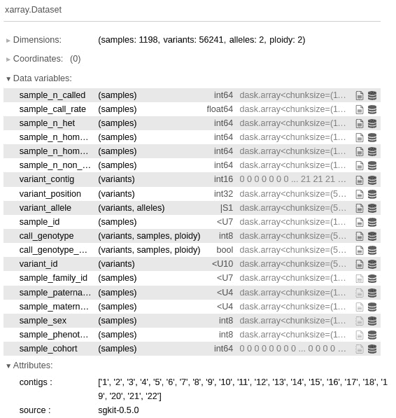
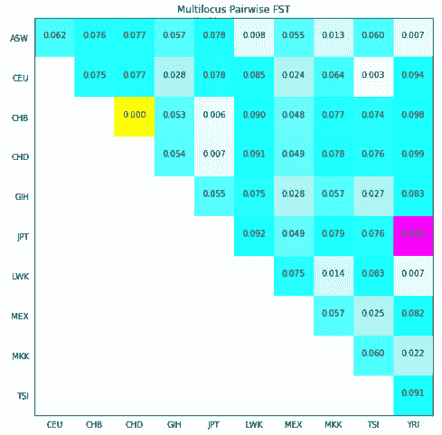
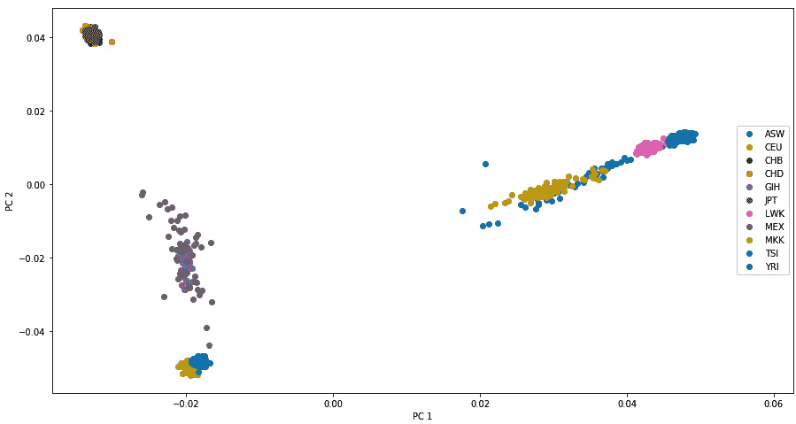
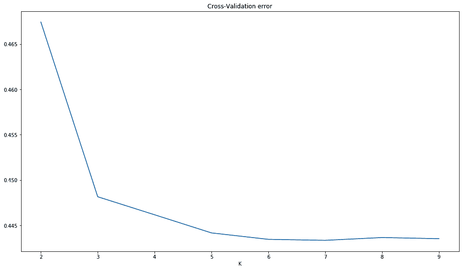

# 六、群体遗传学

群体遗传学是在选择、漂移、突变和迁移的基础上研究群体中等位基因频率的变化。前几章主要关注数据处理和清理；这是第一章，我们将实际推断有趣的生物学结果。

有许多基于序列数据的有趣的群体遗传学分析，但由于我们已经有了相当多的处理序列数据的方法，我们将把注意力转移到其他地方。此外，我们将不涵盖基因组结构变异，如**拷贝数变异** ( **CNVs** )或倒位。我们将集中分析 SNP 数据，这是最常见的数据类型之一。我们将使用 Python 执行许多标准的群体遗传分析，例如使用**固定指数** ( **FST** )计算 F 统计量、**主成分分析** ( **PCA** )，以及研究群体结构。

我们将主要使用 Python 作为一种脚本语言，将执行必要计算的应用程序粘合在一起，这是一种老式的做事方式。话虽如此，由于 Python 软件生态仍在发展，你至少可以使用 scikit-learn 在 Python 中执行 PCA，正如我们将在 [*第 11 章*](11.html#_idTextAnchor272) 中看到的。

群体遗传学数据没有默认的文件格式。这个领域令人沮丧的现实是，有大量的格式，其中大多数是为特定的应用程序开发的；因此，没有一个是普遍适用的。一些创建更通用的格式(或者仅仅是一个支持多种格式的文件转换器)的努力取得了有限的成功。此外，随着我们对基因组学知识的增加，我们无论如何都会需要新的格式(例如，支持某种以前未知的基因组结构变异)。在这里，我们将与 PLINK([https://www.cog-genomics.org/plink/2.0/](https://www.cog-genomics.org/plink/2.0/))一起工作，它最初是为了用人类数据执行**全基因组关联研究** ( **GWAS** )而开发的，但它有更多的应用。如果你有**下一代测序** ( **NGS** )数据，你可能会质疑，为什么不用**变体调用格式** ( **VCF** )？嗯，VCF 文件通常被注释以帮助测序分析，这在这个阶段你并不需要(你现在应该有一个过滤的数据集)。如果你把你的**单核苷酸多态性** ( **SNP** )调用从 VCF 转换到 PLINK，你将得到大约 95%的大小缩减(这是与压缩的 VCF 相比)。更重要的是，处理一个 VCF 文件的计算成本(想想处理所有这些高度结构化的文本)比其他两种格式的成本要大得多。如果使用 Docker，使用图片 tiagoantao/bio informatics _ pop gen。

在本章中，我们将介绍以下配方:

*   使用 PLINK 管理数据集
*   利用 sgkit 和 xarray 进行群体遗传学分析
*   使用 sgkit 探索数据集
*   分析人口结构
*   执行 PCA
*   混合研究种群结构

首先，让我们从讨论文件格式问题开始，然后继续讨论有趣的数据分析。

# 使用 PLINK 管理数据集

这里，我们将使用 PLINK 管理我们的数据集。我们将创建我们的主数据集(来自 HapMap 项目)的子集，这些子集适合于在下面的食谱中进行分析。

警告

请注意，PLINK 和任何类似的程序都不是为它们的文件格式开发的。可能没有为群体遗传学数据创建默认文件标准的目标。在这个领域中，您需要准备好从一种格式到另一种格式的转换(对于这一点，Python 是非常合适的)，因为您将使用的每个应用程序可能都有自己古怪的需求。从这份食谱中学到的最重要的一点是，使用的不是格式，尽管这些是相关的，而是一种“文件转换心态”。除此之外，这个方法中的一些步骤也传达了真正的分析技术，你可能想考虑使用，例如，子采样或**连锁不平衡-** ( **LD-** )修剪。

## 准备就绪

在本章中，我们将使用来自国际单体型图项目的数据。你可能还记得，我们在第三章 、*下一代测序*中使用了来自 1000 个基因组项目的数据，并且 HapMap 项目在许多方面是 1000 个基因组项目的前身；基因分型取代了全基因组测序。HapMap 项目的大多数样本在 1，000 个基因组项目中使用，所以如果你已经阅读了 [*第 3 章*](03.html#_idTextAnchor068) 、*下一代测序*中的配方，你将已经对数据集(包括可用群体)有了一个概念。我就不多介绍数据集了，不过你可以参考 [*第三章*](03.html#_idTextAnchor068) ，*下一代测序*，还有课程的 HapMap 网站([https://www . genome . gov/10001688/international-hap map-project](https://www.genome.gov/10001688/international-hapmap-project))了解更多信息。请记住，我们有全球不同人群中许多个体的基因分型数据。我们将用这些人群的首字母缩写来称呼他们。以下是摘自[http://www . Sanger . AC . uk/resources/downloads/human/hapmap 3 . XHTML](http://www.sanger.ac.uk/resources/downloads/human/hapmap3.xhtml)的列表:

<colgroup><col> <col></colgroup> 
| **缩写** | **人口** |
| 科学工作者协会(Association of Scientific Workers) | 美国西南部的非洲血统 |
| CEU | 犹他州居民与北欧和西欧血统从 CEPH 收集 |
| CHB | 中国北京的汉族人 |
| 冠心病 | 科罗拉多州丹佛市的华人 |
| GIH | 德克萨斯州休斯顿的古吉拉特印第安人 |
| 发动机尾喷管温度(jet pipe temperature) | 日本东京的日本人 |
| LWK | 肯尼亚韦布耶的卢赫亚 |
| MXL | 加利福尼亚洛杉矶的墨西哥血统 |
| MKK | 肯尼亚金亚瓦的马赛人 |
| tonspersquareinch 每平方英寸吨数 | 意大利的托斯卡尼 |
| YRI | 尼日利亚伊巴丹的约鲁巴语 |

表 6.1 -基因组计划中的人群

注意

我们将使用来自 HapMap 项目的数据，该项目实际上已被 1000 基因组项目所取代。为了用 Python 教授群体遗传学编程技术，HapMap 项目数据集比 1，000 基因组项目更易于管理，因为数据要小得多。HapMap 样本是 1，000 个基因组样本的子集。如果你从事人类群体遗传学的研究，强烈建议你使用 1000 个基因组项目作为基础数据集。

这将需要相当大的下载量(大约 1 GB ),并且必须解压缩。确保您有大约 20 GB 的磁盘空间用于本章。这些文件可以在[https://FTP . NCBI . NLM . NIH . gov/hap map/genetics/hap map 3 _ R3/plink _ format/](https://ftp.ncbi.nlm.nih.gov/hapmap/genotypes/hapmap3_r3/plink_format/)找到。

使用以下命令解压缩 PLINK 文件:

```py
bunzip2 hapmap3_r3_b36_fwd.consensus.qc.poly.map.gz
bunzip2 hapmap3_r3_b36_fwd.consensus.qc.poly.ped.gz
```

现在，我们有 PLINK 文件；图谱文件包含基因组中标记位置的信息，而 PED 文件包含每个个体的实际标记，以及一些谱系信息。我们还下载了一个包含每个人信息的元数据文件。看看这些文件，熟悉一下。像往常一样，这也可以在`Chapter06/Data_Formats.py`笔记本文件中找到，在那里一切都已经处理好了。

最后，这个食谱的大部分将大量使用 PLINK([https://www.cog-genomics.org/plink/2.0/](https://www.cog-genomics.org/plink/2.0/))。Python 将主要用作调用 PLINK 的粘合语言。

## 怎么做...

看看下面的步骤:

1.  让我们获取样本的元数据。我们将加载每个样本的总体，并记录数据集中其他个体的后代:

    ```py
    from collections import defaultdict
    f = open('relationships_w_pops_041510.txt')
    pop_ind = defaultdict(list)
    f.readline() # header
    offspring = []
    for l in f:
        toks = l.rstrip().split('\t')
        fam_id = toks[0]
        ind_id = toks[1]
        mom = toks[2]
        dad = toks[3]
        if mom != '0' or dad != '0':
            offspring.append((fam_id, ind_id))
        pop = toks[-1]
    pop_ind[pop].append((fam_id, ind_id))
    f.close()
    ```

这将加载一个字典，其中人口是键(`CEU`、`YRI`等等)，其值是人口中的个体列表。这本字典也将储存关于这个个体是否是另一个个体的后代的信息。每个人都由家族和个人 ID(可在 PLINK 文件中找到的信息)标识。HapMap 项目提供的文件是一个简单的制表符分隔的文件，处理起来并不困难。当我们使用标准的 Python 文本处理来读取文件时，这是一个 pandas 会有所帮助的典型例子。

这里有一点很重要:该信息在一个单独的特别文件中提供的原因是 PLINK 格式没有提供群体结构(该格式只提供 PLINK 设计的案例和控制信息)。这不是这种格式的缺陷，因为它从未被设计成支持标准的群体遗传学研究(这是一种 GWAS 工具)。然而，这是群体遗传学中数据格式的一个普遍特征:无论你最终使用哪一种，都会有一些重要的东西丢失。

我们将在本章的其他菜谱中使用这些元数据。我们还将在元数据和 PLINK 文件之间执行一些一致性分析，但是我们将把它推迟到下一个配方。

1.  现在，让我们以标记数量的 10%和 1%对数据集进行二次抽样，如下:

    ```py
    import os
    os.system('plink2 --pedmap hapmap3_r3_b36_fwd.consensus.qc.poly --out hapmap10 --thin 0.1 --geno 0.1 --export ped')
    os.system('plink2 --pedmap hapmap3_r3_b36_fwd.consensus.qc.poly --out hapmap1 --thin 0.01 --geno 0.1 --export ped')
    ```

使用 Jupyter Notebook，您可以这样做:

```py
!plink2 --pedmap hapmap3_r3_b36_fwd.consensus.qc.poly --out hapmap10 --thin 0.1 --geno 0.1 --export ped
!plink2 --pedmap hapmap3_r3_b36_fwd.consensus.qc.poly --out hapmap1 --thin 0.01 --geno 0.1 --export ped
```

请注意微妙之处，您不会真正获得 1%或 10%的数据；每个标记都有 1%或 10%的机会被选中，因此您将获得大约 1%或 10%的标记。

显然，由于过程是随机的，不同的运行将产生不同的标记子集。这将对未来产生重要影响。如果您想要复制完全相同的结果，您仍然可以使用`--seed`选项。

我们还将删除所有基因分型率低于 90%的 SNP(使用`--geno 0.1`参数)。

注意

这段代码中的 Python 并没有什么特别之处，但是有两个原因可能会让您想要对数据进行子采样。首先，如果您正在对自己的数据集执行探索性分析，您可能希望从较小的版本开始，因为这样更容易处理。此外，您将对您的数据有一个更广阔的视野。第二，有些分析方法可能不需要你所有的数据(事实上，有些方法甚至不能使用你所有的数据)。不过要非常小心最后一点；也就是说，对于您用来分析数据的每种方法，请确保您了解您想要回答的科学问题的数据要求。通常情况下，输入太多数据可能没问题(即使你付出了时间和内存代价)，但是输入太少会导致不可靠的结果。

1.  现在，让我们生成仅包含常染色体的子集(也就是说，让我们移除性染色体和线粒体)，如下:

    ```py
    def get_non_auto_SNPs(map_file, exclude_file):
        f = open(map_file)
        w = open(exclude_file, 'w')
        for l in f:
            toks = l.rstrip().split('\t')
            try:
                chrom = int(toks[0])
            except ValueError:
                rs = toks[1]
                w.write('%s\n' % rs)
        w.close()
    get_non_auto_SNPs('hapmap1.map', 'exclude1.txt')
    get_non_auto_SNPs('hapmap10.map', 'exclude10.txt')
    os.system('plink2 –-pedmap hapmap1 --out hapmap1_auto --exclude exclude1.txt --export ped')
    os.system('plink2 --pedmap hapmap10 --out hapmap10_auto --exclude exclude10.txt --export ped')
    ```

2.  让我们创建一个函数，生成一个包含所有不属于常染色体的 SNP 的列表。对于人类数据，这意味着所有非数字染色体。如果你使用另一个物种，小心你的染色体编码，因为 PLINK 是面向人类数据的。如果你的物种是二倍体，有少于 23 个常染色体，和一个性别决定系统，也就是 X/Y，这将是直截了当的；如果没有，参考[https://www.cog-genomics.org/plink2/input#allow_extra_chr](https://www.cog-genomics.org/plink2/input#allow_extra_chr)的一些替代方案(如`--allow-extra-chr`旗)。
3.  然后，我们为 10%和 1%的子样本数据集(前缀为`hapmap10_auto`和`hapmap1_auto`)创建仅自动染色体 PLINK 文件。
4.  让我们创建一些没有后代的数据集。大多数群体遗传分析都需要这些，这在一定程度上需要不相关的个体:

    ```py
    os.system('plink2 --pedmap hapmap10_auto --filter-founders --out hapmap10_auto_noofs --export ped')
    ```

注意

这一步代表了大多数群体遗传分析需要样本在一定程度上不相关的事实。显然，当我们知道一些后代在 HapMap 中时，我们删除它们。

但是，请注意，对于您的数据集，您应该比这更精确。例如，运行`plink --genome`或使用另一个程序来检测相关的个人。这里的基本点是，你必须付出一些努力来检测你的样本中的相关个体；这不是一项微不足道的任务。

1.  我们还将生成一个 LD-pruned 数据集，如许多 PCA 和混合算法所要求的，如下:

    ```py
    os.system('plink2 --pedmap hapmap10_auto_noofs --indep-pairwise 50 10 0.1 --out keep --export ped')
    os.system('plink2 --pedmap hapmap10_auto_noofs --extract keep.prune.in --recode --out hapmap10_auto_noofs_ld --export ped')
    ```

第一步是生成一个标记列表，如果数据集被 LD-pruned，则保留该列表。这使用了一个`50` SNPs 的滑动窗口，每次前进`10` SNPs，切割值为`0.1`。第二步从之前生成的列表中提取 SNP。

1.  让我们用不同的格式记录几个案例:

    ```py
    os.system('plink2 --file hapmap10_auto_noofs_ld --recode12 tab --out hapmap10_auto_noofs_ld_12 --export ped 12')
    os.system('plink2 --make-bed --file hapmap10_auto_noofs_ld --out hapmap10_auto_noofs_ld')
    ```

第一个操作将把使用来自 ACTG 的核苷酸字母的 PLINK 格式转换成另一种格式，后者用`1`和`2`记录等位基因。稍后我们将在*执行 PCA* 配方时使用这个。

第二个操作以二进制格式记录文件。如果您在 PLINK 内部工作(使用 PLINK 的许多有用操作)，二进制格式可能是最合适的格式(例如，提供较小的文件大小)。我们将在混合配方中使用它。

1.  我们还将提取单个染色体(`2`)进行分析。我们将从自动染色体数据集开始，该数据集已经以 10%进行了二次抽样:

    ```py
    os.system('plink2 --pedmap hapmap10_auto_noofs --chr 2 --out hapmap10_auto_noofs_2 --export ped')
    ```

## 还有更多...

您可能希望创建不同的数据集进行分析的原因有很多。您可能希望对数据进行一些快速的初步探索，例如，如果您计划使用的分析算法对输入有一些数据格式要求或约束，如标记的数量或个体之间的关系。您可能会有很多子集需要分析(除非您的数据集非常小，例如，一个微卫星数据集)。

这似乎是一个小问题，但它不是:在文件命名时要非常小心(注意，我在生成文件名时遵循了一些简单的约定)。确保文件的名称提供了关于子集选项的一些信息。当您执行下游分析时，您将希望确保您选择了正确的数据集；最重要的是，您希望您的数据集管理灵活可靠。可能发生的最糟糕的事情是，您使用不符合软件要求的约束的错误数据集创建分析。

我们使用的 LD-pruning 对于人类分析来说有些标准，但是一定要检查参数，特别是如果您使用非人类数据的话。

我们下载的 HapMap 文件基于参考基因组的旧版本(build 36)。如前一章所述， [*第五章*](05.html#_idTextAnchor122) ，*使用基因组*，如果您打算使用这个文件进行更多的分析，请务必使用 build 36 中的注释。

该配方为后续配方奠定了基础，其结果将被广泛使用。

## 参见

*   LD 上的维基百科页面[http://en.wikipedia.org/wiki/Linkage_disequilibrium](http://en.wikipedia.org/wiki/Linkage_disequilibrium)是一个很好的起点。
*   PLINK[https://www.cog-genomics.org/plink/2.0/](https://www.cog-genomics.org/plink/2.0/)的网站记录非常完整，这是许多遗传学软件所缺乏的。

# 利用 sgkit 对 xarray 进行群体遗传学分析

Sgkit 是做群体遗传学分析的最先进的 Python 库。这是一个现代的实现，利用了 Python 中几乎所有的基础数据科学库。当我说几乎所有的时候，我并没有夸大其词；它使用 NumPy，pandas，xarray，Zarr 和 Dask。NumPy 和熊猫是在 [*第二章*](02.html#_idTextAnchor040) 中介绍的。这里，我们将介绍 xarray 作为 sgkit 的主要数据容器。因为我觉得我不能要求你对数据工程库有一个极端的了解，所以我将忽略 Dask 部分(主要是通过将 Dask 结构视为等价的 NumPy 结构)。你可以在 [*第 11 章*](11.html#_idTextAnchor272) 中找到更多关于内存外 Dask 数据结构的高级细节。

## 准备就绪

您将需要运行前面的配方，因为这个配方需要它的输出:我们将使用其中一个 PLINK 数据集。您需要安装 sgkit。

通常，这在`Chapter06/Sgkit.py`笔记本文件中是可用的，但是它仍然需要您运行先前的笔记本文件，以便生成所需的文件。

## 怎么做...

看看下面的步骤:

1.  让我们加载在前面的配方中生成的`hapmap10_auto_noofs_ld`数据集:

    ```py
    import numpy as np
    from sgkit.io import plink
    data = plink.read_plink(path='hapmap10_auto_noofs_ld', fam_sep='\t')
    ```

请记住，我们正在加载一组 PLINK 文件。事实证明，sgkit 为这些数据创建了非常丰富和结构化的表示。该表示基于 xarray 数据集。

1.  让我们检查一下我们的数据结构——如果您在笔记本电脑中，只需输入以下内容:

    ```py
    data
    ```

`sgkit`-如果在笔记本中-将生成以下表示:


图 6.1-sgkit 为我们的 PLINK 文件加载的 xarray 数据的概述

`data`是一个 xarray 数据集。xarray 数据集本质上是一个字典，其中每个值都是一个 Dask 数组。出于我们的目的，您可以假设它是一个 NumPy 数组。在这种情况下，我们可以看到我们有 **1198** 样本的 **56241** 变体。我们每个变体有 **2** 个等位基因，倍性为 **2** 。

在笔记本中，我们可以展开每个条目。在我们的例子中，我们扩展了`call_genotype`。这是一个三维数组，有`variants`、`samples`和`ploidy`个维度。数组的类型是`int8`。在此之后，我们可以找到一些与条目、`mixed_ploidy`和注释相关的元数据。最后，您对 Dask 实现进行了总结。**数组**列显示了数组的大小和形状的详细信息。对于**块**列，参见 [*第 11 章*](11.html#_idTextAnchor272)——但是你现在可以放心地忽略它。

1.  另一种获得摘要信息的方法是检查`dims`字段:

    ```py
    print(data.dims)
    ```

    ，如果您不使用笔记本，这种方法尤其有用

输出应该是不言自明的:

```py
Frozen({'variants': 56241, 'alleles': 2, 'samples': 1198, 'ploidy': 2})
```

1.  让我们提取一些关于样本的信息:

    ```py
    print(len(data.sample_id.values))
    print(data.sample_id.values)
    print(data.sample_family_id.values)
    print(data.sample_sex.values)
    ```

输出如下所示:

```py
1198
['NA19916' 'NA19835' 'NA20282' ... 'NA18915' 'NA19250' 'NA19124']
['2431' '2424' '2469' ... 'Y029' 'Y113' 'Y076']
[1 2 2 ... 1 2 1]
```

我们有`1198`样品。第一个样本 ID 为`NA19916`，家庭 ID 为`2431`，性别为`1`(男)。请记住，如果将 PLINK 作为数据源，样本 ID 不足以作为主键(相同的样本 ID 可以有不同的样本)。主键是样品 ID 和样品系列 ID 的组合。

小费

您可能已经注意到，我们将`.values`添加到所有的数据字段中:这实际上是将一个懒惰的 Dask 数组呈现为一个物化的 NumPy 数组。目前，我建议你忽略它，但如果你在阅读完 [*第 11 章*](11.html#_idTextAnchor272) ，`.values`类似于 Dask 中的`compute`方法。

这个调用并不麻烦——我们的代码工作的原因是我们的数据集足够小，可以放入内存，这对我们的教学例子来说非常好。但是如果你有一个非常大的数据集，前面的代码就太天真了。还是那句话， [*第十一章*](11.html#_idTextAnchor272) 会帮你搞定。目前，这种简单是教学用的。

1.  在我们查看变量数据之前，我们必须知道 sgkit 如何存储`contigs` :

    ```py
    print(data.contigs)
    ```

输出如下所示:

```py
['1', '2', '3', '4', '5', '6', '7', '8', '9', '10', '11', '12', '13', '14', '15', '16', '17', '18', '19', '20', '21', '22']
```

这里的`contigs`是人类常染色体(如果你的数据是基于大多数其他物种，你就没那么幸运了——你可能会有一些丑陋的标识符)。

1.  现在，让我们来看看这些变体:

    ```py
    print(len(data.variant_contig.values))
    print(data.variant_contig.values)
    print(data.variant_position.values)
    print(data.variant_allele.values)
    print(data.variant_id.values)
    ```

以下是输出的节略版本:

```py
56241
[ 0  0  0 ... 21 21 21]
[  557616   782343   908247 ... 49528105 49531259 49559741]
[[b'G' b'A']
 ...
 [b'C' b'A']]
['rs11510103' 'rs2905036' 'rs13303118' ... 'rs11705587' 'rs7284680'
 'rs2238837']
```

我们有`56241`变种。`contig`索引是`0`，如果你看前面配方的步骤，它就是染色体`1`。该变体位于`557616`(相对于人类基因组的第 36 个)位置，并可能具有等位基因`G`和`A`。它有一个 SNP ID`rs11510103`。

1.  最后，我们来看一下`genotype`的数据:

    ```py
    call_genotype = data.call_genotype.values
    print(call_genotype.shape)
    first_individual = call_genotype[:,0,:]
    first_variant = call_genotype[0,:,:]
    first_variant_of_first_individual = call_genotype[0,0,:]
    print(first_variant_of_first_individual)
    print(data.sample_family_id.values[0], data.sample_id.values[0])
    print(data.variant_allele.values[0])
    ```

`call_genotype`具有 56，241 x 1，1198，2 的形状，这是其标注尺寸的变体、样本和倍性。

为了获得第一个个体的所有变量，你需要关注第二维度。为了得到第一个变量的所有样本，你需要关注第一维。

如果您打印第一个人的详细信息(样本和家族 ID)，您将得到`2431`和`NA19916`——正如预期的那样，与前面样本研究中的第一个案例完全一样。

## 还有更多...

这个食谱主要是对 xarray 的介绍，伪装成 sgkit 教程。关于哈维还有很多要说的——一定要看看 https://docs.xarray.dev/。值得重申的是，xarray 依赖于大量的 Python 数据科学库，我们暂时忽略了 Dask。

# 使用 sgkit 探索数据集

在这个菜谱中，我们将对我们生成的数据集之一进行初步探索性分析。现在我们对 xarray 有了一些基本的了解，我们可以实际尝试做一些数据分析。在这个配方中，我们将忽略人口结构，这个问题我们将在下一个配方中再讨论。

## 准备就绪

您需要运行第一个配方，并且应该有可用的`hapmap10_auto_noofs_ld`文件。有一个笔记本文件里有这个食谱，叫做`Chapter06/Exploratory_Analysis.py`。您将需要为之前的制作方法安装的软件。

## 怎么做...

看看下面的步骤:

1.  我们从用 sgkit 加载 PLINK 数据开始，正如前面的配方

    ```py
    import numpy as np
    import xarray as xr
    import sgkit as sg
    from sgkit.io import plink

    data = plink.read_plink(path='hapmap10_auto_noofs_ld', fam_sep='\t')
    ```

    中的
2.  让我们向 sgkit 要`variant_stats` :

    ```py
    variant_stats = sg.variant_stats(data)
    variant_stats
    ```

输出如下所示:


图 6.2-SG kit 的 variant_stats 提供的变量统计数据

1.  现在让我们看看统计数据，`variant_call_rate` :

    ```py
    variant_stats.variant_call_rate.to_series().describe()
    ```

这里要解开的比看起来的要多。最基本的部分是`to_series()`调用。Sgkit 将向您返回一个熊猫系列——请记住，sgkit 与 Python 数据科学库高度集成。获得 Series 对象后，您可以调用 Pandas `describe`函数并获得以下内容:

```py
count    56241.000000
mean         0.997198
std          0.003922
min          0.964107
25%          0.996661
50%          0.998331
75%          1.000000
max          1.000000
Name: variant_call_rate, dtype: float64
```

我们的变量调用率相当好，这并不令人震惊，因为我们正在查看数组数据——如果你有一个基于 NGS 的数据集，你会得到更糟糕的数字。

1.  现在让我们来看看样本统计:

    ```py
    sample_stats = sg.sample_stats(data)
    sample_stats
    ```

同样，sgkit 提供了大量现成的样本统计信息:



图 6.3 -通过调用 sample_stats 获得的样本统计数据

1.  现在我们将让来看一下样本看涨期权价格:

    ```py
    sample_stats.sample_call_rate.to_series().hist()
    ```

这一次，我们绘制了样本调用率的直方图。同样，sgkit 通过利用 Pandas 免费获得此功能:


图 6.4 -样本呼叫率直方图

## 还有更多...

事实是，对于群体基因分析来说，没有什么能打败 R；绝对鼓励你去看看现有的群体遗传学 R 库。别忘了还有一个 Python-R 桥，在 [*第一章*](01.html#_idTextAnchor020) 、 *Python 以及周边的软件生态*中讨论过。

如果在更大的数据集上进行，这里介绍的大部分分析在计算上将是昂贵的。事实上，sgkit 已经准备好处理这个问题，因为它利用了 Dask。在这个阶段引入 Dask 会太复杂，但是对于大型数据集， [*第 11 章*](11.html#_idTextAnchor272) 将讨论解决这些问题的方法。

## 参见

*   统计遗传学的 R 包列表可在[http://cran.r-project.org/web/views/Genetics.xhtml](http://cran.r-project.org/web/views/Genetics.xhtml)获得。
*   如果你需要了解更多关于群体遗传学的知识，我推荐《群体遗传学原理》这本书，作者是*的丹尼尔·l·哈特尔和*的安德鲁·g·克拉克。**

# 分析人口结构

之前，我们用 sgkit 引入了数据分析，忽略了群体结构。大多数数据集，包括我们正在使用的数据集，实际上都有一个群体结构。Sgkit 提供了用群体结构分析基因组数据集的功能，这就是我们在这里要研究的内容。

## 准备就绪

您需要运行第一个配方，并且应该下载我们生成的`hapmap10_auto_noofs_ld`数据和原始群体元数据`relationships_w_pops_041510.txt`文件。有一个笔记本文件，里面有`06_PopGen/Pop_Stats.py`的配方。

## 怎么做...

看看下面的步骤:

1.  首先，让我们用 sgkit:

    ```py
    from collections import defaultdict
    from pprint import pprint
    import numpy as np
    import matplotlib.pyplot as plt
    import seaborn as sns
    import pandas as pd
    import xarray as xr
    import sgkit as sg
    from sgkit.io import plink

    data = plink.read_plink(path='hapmap10_auto_noofs_ld', fam_sep='\t')
    ```

    加载 PLINK 数据
2.  现在，让我们加载将个人分配给群体的数据:

    ```py
    f = open('relationships_w_pops_041510.txt')
    pop_ind = defaultdict(list)
    f.readline()  # header
    for line in f:
        toks = line.rstrip().split('\t')
        fam_id = toks[0]
        ind_id = toks[1]
        pop = toks[-1]
        pop_ind[pop].append((fam_id, ind_id))
    pops = list(pop_ind.keys())
    ```

我们以字典`pop_ind`结束，其中的键是人口代码，值是样本列表。请记住，样本主键是系列 ID 和样本 ID。

我们在`pops`变量中也有一个群体列表。

1.  我们现在需要通知 sgkit 每个样本属于哪个人群或组群:

    ```py
    def assign_cohort(pops, pop_ind, sample_family_id, sample_id):
        cohort = []
        for fid, sid in zip(sample_family_id, sample_id):
            processed = False
            for i, pop in enumerate(pops):
                if (fid, sid) in pop_ind[pop]:
                    processed = True
                    cohort.append(i)
                    break
            if not processed:
                raise Exception(f'Not processed {fid}, {sid}')
        return cohort
    cohort = assign_cohort(pops, pop_ind, data.sample_family_id.values, data.sample_id.values)
    data['sample_cohort'] = xr.DataArray(
        cohort, dims='samples')
    ```

记住SG kit 中的每个样本在一个数组中都有一个位置。因此，我们必须创建一个数组，其中的每个元素都指向样本中的特定人群或群体。`assign_cohort`函数就是这样做的:它获取我们从`relationships`文件加载的元数据和来自 sgkit 文件的样本列表，并获取每个样本的人口指数。

1.  现在我们已经将人口信息结构加载到 sgkit 数据集中，我们可以开始计算人口或群组级别的统计数据。让我们从获得每个群体的单态基因座数量开始:

    ```py
    cohort_allele_frequency = sg.cohort_allele_frequencies(data)['cohort_allele_frequency'].values
    monom = {}
    for i, pop in enumerate(pops):
        monom[pop] = len(list(filter(lambda x: x, np.isin(cohort_allele_frequency[:, i, 0], [0, 1]))))
    pprint(monom)
    ```

我们首先要求 sgkit 计算每个群体或人群的等位基因频率。之后，我们筛选每个群体中第一个等位基因的等位基因频率为`0`或`1`的所有基因座(即其中一个等位基因是固定的)。最后，我们打印它。顺便提一下，我们使用`pprint.pprint`函数使看起来更好一些(如果你想以可读的方式呈现输出，这个函数对于更复杂的结构非常有用):

```py
{'ASW': 3332,
 'CEU': 8910,
 'CHB': 11130,
 'CHD': 12321,
 'GIH': 8960,
 'JPT': 13043,
 'LWK': 3979,
 'MEX': 6502,
 'MKK': 3490,
 'TSI': 8601,
 'YRI': 5172}
```

1.  让我们得到每个群体所有基因座的最小等位基因频率。这仍然是基于`cohort_allele_frequency`的——所以不需要再次调用 sgkit】

我们为每个种群创建 Pandas `Series`对象，因为这允许很多有用的功能，比如绘图。

1.  我们现在将打印`YRI`和`JPT`人口的 MAF 直方图。我们将为此利用 Pandas 和 Matplotlib:

    ```py
    maf_plot, maf_ax = plt.subplots(nrows=2, sharey=True)
    mafs['YRI'].hist(ax=maf_ax[0], bins=50)
    maf_ax[0].set_title('*YRI*')
    mafs['JPT'].hist(ax=maf_ax[1], bins=50)
    maf_ax[1].set_title('*JPT*')
    maf_ax[1].set_xlabel('MAF')
    ```

我们让 Pandas 生成直方图，并将结果放入 Matplotlib 图中。结果如下:


图 6.5-YRI 和 JPT 人口的 MAF 直方图

1.  我们现在将专注于计算 FST。FST 是一种广泛使用的统计数据，试图代表由群体结构产生的遗传变异。让我们用 sgkit 来计算一下:

    ```py
    fst = sg.Fst(data)
    fst = fst.assign_coords({"cohorts_0": pops, "cohorts_1": pops})
    ```

第一行计算`fst`，在这种情况下，它将跨群组或人群成对`fst`。第二行使用 xarray 坐标特性为每个群组指定名称。这使得它更容易和更具宣示性。

1.  让我们比较一下`CEU`和`CHB`人口与`CHB`和`CHD` :

    ```py
    remove_nan = lambda data: filter(lambda x: not np.isnan(x), data)
    ceu_chb = pd.Series(remove_nan(fst.stat_Fst.sel(cohorts_0='CEU', cohorts_1='CHB').values))
    chb_chd = pd.Series(remove_nan(fst.stat_Fst.sel(cohorts_0='CHB', cohorts_1='CHD').values))
    ceu_chb.describe()
    chb_chd.describe()
    ```

    人口之间的`fst`

我们从`stat_FST`中获取由`sel`函数返回的成对结果，用它来比较和创建熊猫系列。请注意，我们可以通过名称来引用群体，因为我们在上一步中已经准备好了坐标。

1.  让我们根据多位点成对 FST 绘制群体间的距离矩阵。在此之前，我们将准备计算:

    ```py
    mean_fst = {}
    for i, pop_i in enumerate(pops):
        for j, pop_j in enumerate(pops):
            if j <= i:
                continue
            pair_fst = pd.Series(remove_nan(fst.stat_Fst.sel(cohorts_0=pop_i, cohorts_1=pop_j).values))
            mean = pair_fst.mean()
            mean_fst[(pop_i, pop_j)] = mean
    min_pair = min(mean_fst.values())
    max_pair = max(mean_fst.values())
    ```

我们计算人口对的所有 FST 值。这段代码的执行对时间和内存的要求很高，因为我们实际上需要 Dask 执行大量的计算来呈现我们的 NumPy 数组。

1.  现在，我们可以对所有群体的平均 FST 进行成对绘制:

    ```py
    sns.set_style("white")
    num_pops = len(pops)
    arr = np.ones((num_pops - 1, num_pops - 1, 3), dtype=float)
    fig = plt.figure(figsize=(16, 9))
    ax = fig.add_subplot(111)
    for row in range(num_pops - 1):
        pop_i = pops[row]
        for col in range(row + 1, num_pops):
            pop_j = pops[col]
            val = mean_fst[(pop_i, pop_j)]
            norm_val = (val - min_pair) / (max_pair - min_pair)
            ax.text(col - 1, row, '%.3f' % val, ha='center')
            if norm_val == 0.0:
                arr[row, col - 1, 0] = 1
                arr[row, col - 1, 1] = 1
                arr[row, col - 1, 2] = 0
            elif norm_val == 1.0:
                arr[row, col - 1, 0] = 1
                arr[row, col - 1, 1] = 0
                arr[row, col - 1, 2] = 1
            else:
                arr[row, col - 1, 0] = 1 - norm_val
                arr[row, col - 1, 1] = 1
                arr[row, col - 1, 2] = 1
    ax.imshow(arr, interpolation='none')
    ax.set_title('Multilocus Pairwise FST')
    ax.set_xticks(range(num_pops - 1))
    ax.set_xticklabels(pops[1:])
    ax.set_yticks(range(num_pops - 1))
    ax.set_yticklabels(pops[:-1])
    ```

在下图中，我们将绘制一个上三角矩阵，其中一个单元格的背景色代表微分的度量；白色表示差异较小(FST 较低)，蓝色表示差异较大(FST 较高)。 **CHB** 和 **CHD** 之间的最小值用黄色表示， **JPT** 和 **YRI** 之间的最大值用洋红色表示。每个细胞上的值是这两个群体之间成对 FST 的平均值:



图 6.6-hap map 项目中所有常染色体的 11 个群体的平均成对 FST

## 参见

*   F-statistics 是一个非常复杂的话题，所以我将首先带你去位于 http://en.wikipedia.org/wiki/F-statistics T2 的维基百科页面。
*   在 http://www.nature.com/nrg/journal/v10/n9/abs/nrg2611.xhtml[的*自然评论遗传学*中的霍尔辛格和威尔的论文(*地理结构群体中的遗传学:定义、估计和解释 FST* )中可以找到一个很好的解释。](http://www.nature.com/nrg/journal/v10/n9/abs/nrg2611.xhtml)

# 执行 PCA

PCA 是一种统计过程，用于将多个变量的维数降低到线性不相关的较小子集。它在群体遗传学中的实际应用有助于被研究个体之间关系的可视化。

虽然本章中的大多数方法都使用 Python 作为一种*粘合语言* (Python 调用实际上完成大部分工作的外部应用程序)，但对于 PCA，我们有一个选择:我们可以使用外部应用程序(例如，EIGENSOFT SmartPCA)或使用 scikit-learn 并在 Python 上执行所有操作。在这个食谱中，我们将使用 SmartPCA 对于使用 scikit-learn 的本机机器学习体验，请参见第 10 章*。*

小费

您实际上有第三种选择:使用 sgkit。然而，我想告诉你如何执行计算的替代方案。这有两个很好的理由。首先，您可能不喜欢使用 sgkit——虽然我推荐它，但我不想强迫它——其次，您可能需要运行 sgkit 中没有实现的替代方法。PCA 实际上是这方面的一个很好的例子:一篇论文的审稿人可能要求您运行一个已发布并广泛使用的方法，如 EIGENSOFT SmartPCA。

## 准备就绪

为了使用`hapmap10_auto_noofs_ld_12` PLINK 文件(等位基因被重新编码为`1`和`2`，您需要运行第一个配方。PCA 需要 LD-修剪标记；我们不会冒险在这里使用后代，因为它可能会使结果有偏差。我们将使用带有等位基因`1`和`2`的重新编码的 PLINK 文件，因为这使得用 SmartPCA 和 scikit-learn 进行处理更容易。

我有一个简单的库来帮助一些基因组处理。你可以在 https://github.com/tiagoantao/pygenomics 找到这个代码。您可以使用以下命令安装它:

```py
pip install pygenomics
```

对于这个食谱，你将需要下载 eigen soft([http://www.hsph.harvard.edu/alkes-price/software/](http://www.hsph.harvard.edu/alkes-price/software/))，其中包括我们将使用的 SmartPCA 应用程序。

在`Chapter06/PCA.py`配方中有一个笔记本文件，但是您仍然需要运行第一个配方。

## 怎么做...

看看下面的步骤:

1.  让我们加载元数据，如下:

    ```py
    f = open('relationships_w_pops_041510.txt')
    ind_pop = {}
    f.readline() # header
    for l in f:
        toks = l.rstrip().split('\t')
        fam_id = toks[0]
        ind_id = toks[1]
        pop = toks[-1]
        ind_pop['/'.join([fam_id, ind_id])] = pop
    f.close()
    ind_pop['2469/NA20281'] = ind_pop['2805/NA20281']
    ```

在这种情况下，我们将添加一个与 PLINK 文件中可用内容一致的条目。

1.  让我们将 PLINK 文件转换成 EIGENSOFT 格式:

    ```py
    from genomics.popgen.plink.convert import to_eigen
    to_eigen('hapmap10_auto_noofs_ld_12', 'hapmap10_auto_noofs_ld_12')
    ```

这使用了一个我写的函数来从 PLINK 转换到 EIGENSOFT 格式。这主要是文本操作——并不是最激动人心的代码。

1.  现在，我们将运行`SmartPCA`并解析其结果，如下所示:

    ```py
    from genomics.popgen.pca import smart
    ctrl = smart.SmartPCAController('hapmap10_auto_noofs_ld_12')
    ctrl.run()
    wei, wei_perc, ind_comp = smart.parse_evec('hapmap10_auto_noofs_ld_12.evec', 'hapmap10_auto_noofs_ld_12.eval')
    ```

同样，这个将使用来自`pygenomics`的几个函数来控制`SmartPCA`，然后解析输出。该代码是这种操作的典型代码，当您被邀请检查它时，它非常简单。

`parse`函数将返回 PCA 权重(我们不会使用，但您应该检查)、归一化权重，然后是每个人的主成分(通常直到 PC `10`)。

1.  然后，我们绘制 PC `1`和 PC `2`，如下面的代码所示:

    ```py
    from genomics.popgen.pca import plot
    plot.render_pca(ind_comp, 1, 2, cluster=ind_pop)
    ```

这将产生下图。我们将提供绘图功能和从元数据中检索的人口信息，这允许您用不同的颜色绘制每个人口。结果与已发表的结果非常相似；我们会发现四组。大多数亚洲人口位于顶部，非洲人口位于右侧，欧洲人口位于底部。另外两个混合种群( **GIH** 和**墨西哥**)位于中间:



图 6.7-smart PCA 产生的 HapMap 数据的 PC 1 和 PC 2

注意

注意，PCA 图可以在运行的任何轴上对称，因为信号无关紧要。重要的是聚类应该是相同的，并且个体(和这些聚类)之间的距离应该是相似的。

## 还有更多...

这里一个有趣的问题是你应该使用哪种方法——smart PCA 还是 scikit-learn，我们会在 [*第十章*](10.html#_idTextAnchor255) 中用到。结果是相似的，所以如果您正在执行自己的分析，您可以自由选择。然而，如果你在科学杂志上发表你的结果，SmartPCA 可能是一个更安全的选择，因为它是基于遗传学领域的软件发表的；评论家可能会喜欢这个。

## 参见

*   可能普及了 PCA 在遗传学中的应用的论文是 11 月 bre 等人的*Genes mirror geography within Europe*on*Nature*，其中欧洲人的 PCA 几乎完美地映射到欧洲地图上。这个可以在[http://www . nature . com/nature/journal/v 456/n 7218/ABS/nature 07331 . XHTML](http://www.nature.com/nature/journal/v456/n7218/abs/nature07331.xhtml)找到。请注意，没有任何关于 PCA 的内容可以保证它会映射到地理特征(只需提前检查我们的 PCA)。
*   http://journals.plos.org/plosgenetics/article?[的 Patterson 等人的*种群结构和特征分析*、 *PLoS 遗传学*中描述了 SmartPCAid = 10.1371/journal . pgen . 0020190](http://journals.plos.org/plosgenetics/article?id=10.1371/journal.pgen.0020190)。
*   关于 PCA 含义的讨论可以在麦克维恩在 http://journals.plos.org/plosgenetics/article?[发表的关于*主成分分析的系谱解释*、 *PLoS Genetics* 的论文中找到 id = 10.1371/journal . pgen . 1000686](http://journals.plos.org/plosgenetics/article?id=10.1371/journal.pgen.1000686)。

# 用混合物研究种群结构

人口遗传学中一个典型的分析是由程序结构([https://web.stanford.edu/group/pritchardlab/structure.xhtml](https://web.stanford.edu/group/pritchardlab/structure.xhtml))推广的，用于研究人口结构。这种类型的软件用于推断存在多少种群(或多少祖先种群产生了当前种群)，并识别潜在的移民和混合个体。这个结构是在相当一段时间以前开发的，当时进行基因分型的标记要少得多(当时，这主要是少数微卫星)，并且开发了更快的版本，包括来自同一实验室的一个叫做`fastStructure`([http://rajanil.github.io/fastStructure/](http://rajanil.github.io/fastStructure/))。在这里，我们将使用 Python 与加州大学洛杉矶分校开发的相同类型的程序接口，该程序被称为混合程序([https://dalexander.github.io/admixture/download.xhtml](https://dalexander.github.io/admixture/download.xhtml))。

## 准备就绪

为了使用`hapmap10_auto_noofs_ld`二进制 PLINK 文件，您需要运行第一个配方。同样，我们将使用 10%的被 LD 修剪过的没有后代的常染色体的二次抽样。

正如在前面的食谱中，你将使用的`pygenomics`库来帮助；你可以在 https://github.com/tiagoantao/pygenomics 找到这些代码文件。您可以使用以下命令安装它:

```py
pip install pygenomics
```

理论上，对于这个食谱，你需要下载混合物([https://www.genetics.ucla.edu/software/admixture/](https://www.genetics.ucla.edu/software/admixture/))。然而，在这种情况下，我将在我们将使用的 HapMap 数据上提供运行混合物的输出，因为运行混合物需要很多时间。您可以使用可用的结果或自己运行混合物。在`Chapter06/Admixture.py`配方中有一个笔记本文件，但是你仍然需要先运行配方。

## 怎么做...

看看下面的步骤:

1.  首先，让我们定义我们感兴趣的`k`(一些祖先种群)范围，如下:

    ```py
    k_range = range(2, 10)  # 2..9
    ```

2.  让我们为所有的`k`运行混合(或者，您可以跳过这一步，使用提供的示例数据):

    ```py
    for k in k_range:
        os.system('admixture --cv=10 hapmap10_auto_noofs_ld.bed %d > admix.%d' % (k, k))
    ```

注意

这是运行混合物最糟糕的方式，如果你这样做的话，可能要花 3 个多小时。这是因为它将按顺序运行从`2`到`9`的所有`k`。有两件事可以加快速度:使用混合提供的多线程选项(`-j`)，或者并行运行几个应用程序。这里，我必须假设一个最坏的情况，即您只有一个可用的内核和线程，但是您应该能够通过并行化更有效地运行它。我们将在第十一章 中详细讨论这个问题。

1.  我们将需要 PLINK 文件中个人的顺序，因为混合输出个人结果的顺序是:

    ```py
    f = open('hapmap10_auto_noofs_ld.fam')
    ind_order = []
    for l in f:
        toks = l.rstrip().replace(' ', '\t').split('\t')
        fam_id = toks[0]
        ind_id = toks[1]
        ind_order.append((fam_id, ind_id))
    f.close()
    ```

2.  交叉验证误差给出了“最佳”的度量`k`，如下:

    ```py
    import matplotlib.pyplot as plt
    CVs = []
    for k in k_range:
        f = open('admix.%d' % k)
        for l in f:
            if l.find('CV error') > -1:
                CVs.append(float(l.rstrip().split(' ')[-1]))
                break
        f.close()
    fig = plt.figure(figsize=(16, 9))
    ax = fig.add_subplot(111)
    ax.set_title('Cross-Validation error')
    ax.set_xlabel('K')
    ax.plot(k_range, CVs)
    ```

下面的图绘制了`2`的 a `K`和`9`之间的`CV`，越低越好。从这张图中可以清楚地看出，我们也许应该运行更多的`K`(实际上，我们有 11 个种群；如果不是更多，我们应该至少运行到 11)，但由于计算成本，我们停在`9`。

关于是否存在“最佳”这种东西，这将是一场非常技术性的辩论。现代科学文献表明，可能不存在一个“最佳”`K`；这些结果值得做一些解释。我认为在你继续解释`K`结果之前，意识到这一点很重要:



图 6.8-K 的误差

1.  我们将需要的元数据人口信息:

    ```py
    f = open('relationships_w_pops_041510.txt')
    pop_ind = defaultdict(list)
    f.readline() # header
    for l in f:
       toks = l.rstrip().split('\t')
       fam_id = toks[0]
       ind_id = toks[1]
       if (fam_id, ind_id) not in ind_order:
          continue
       mom = toks[2]
       dad = toks[3]
       if mom != '0' or dad != '0':
          continue
     pop = toks[-1]
     pop_ind[pop].append((fam_id, ind_id))
    f.close()
    ```

我们将忽略不在 PLINK 文件中的个人。

1.  让我们加载单个组件，如下:

    ```py
    def load_Q(fname, ind_order):
        ind_comps = {}
        f = open(fname)
        for i, l in enumerate(f):
            comps = [float(x) for x in l.rstrip().split(' ')]
            ind_comps[ind_order[i]] = comps
        f.close()
        return ind_comps
    comps = {}
    for k in k_range:
        comps[k] = load_Q('hapmap10_auto_noofs_ld.%d.Q' % k, ind_order)
    ```

混合生成一个包含每个个体的祖先组件的文件(例如，查看任何生成的`Q`文件)；你决定要研究的`k`的数量会有多少组件。这里，我们将为我们研究的所有`k`加载`Q`文件，并将它们存储在一个字典中，其中个人 ID 是键。

1.  然后，我们对个体进行聚类，如下:

    ```py
    from genomics.popgen.admix import cluster
    ordering = {}
    for k in k_range:
        ordering[k] = cluster(comps[k], pop_ind)
    ```

记住个体通过混合被赋予了祖先群体的成分；我们希望按照祖先组件的相似性对它们进行排序(而不是按照它们在 PLINK 文件中的顺序)。这不是一个简单的练习，需要一个聚类算法。

此外，我们不想订购所有产品；我们希望在每个群体中对它们进行排序，然后相应地对每个群体进行排序。

为此，我在[https://github . com/tiagoantao/py genomics/blob/master/genomics/pop gen/mixed/_ _ init _ _ 上提供了一些集群代码。py](https://github.com/tiagoantao/pygenomics/blob/master/genomics/popgen/admix/__init__.py) 。这远非完美，但允许您执行一些看起来合理的绘图。我的代码利用了 SciPy 集群代码。我建议你看一看(顺便说一句，对它进行改进并不十分困难)。

1.  有了合理的个体顺序，我们现在可以画出混合物:

    ```py
    from genomics.popgen.admix import plot
    plot.single(comps[4], ordering[4])
    fig = plt.figure(figsize=(16, 9))
    plot.stacked(comps, ordering[7], fig)
    ```

这将产生两个图表；第二个图表如下图所示(第一个图表实际上是从上往下数第三个混合物图的变体)。

`K` = `4`的第一个数字要求每个人的组件及其顺序。它将绘制所有个体，按人口排序和划分。

第二个图表将执行一组从`K` = `2`到`9`的混合物堆积图。它需要一个`figure`物体(因为该图的尺寸可以随着您需要的堆叠混合物的数量而变化)。个人订单通常会遵循其中一个`K`(我们在这里选择了`7`中的一个`K`)。

请注意，所有的`K`都值得进行一些解释(例如，`K` = `2`将非洲人口与其他人分开，`K` = `3`将欧洲人口分开，并显示了 **GIH** 和**墨西哥**的混合):


图 6.9-hap map 示例的堆积混合图(K 在 2 和 9 之间)

## 还有更多...

不幸的是，你不能运行一个混合物的实例来得到一个结果。最佳实践是实际运行 100 个实例，并获得具有最佳对数似然性的实例(在混合输出中报告)。显然，我不能要求你为这个食谱的 7 个不同的`K`中的每一个运行 100 个实例(我们正在谈论两周的计算)，但是如果你想要有可发布的结果，你可能需要来执行这个。运行这个需要一个集群(或者至少是一个非常好的机器)。您可以使用 Python 检查输出并选择最佳对数似然。在为每个`K`选择了具有最佳对数似然的结果后，您可以很容易地应用这个方法来绘制输出。