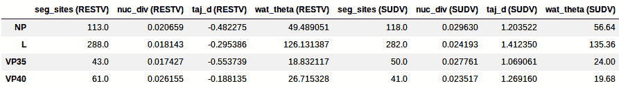
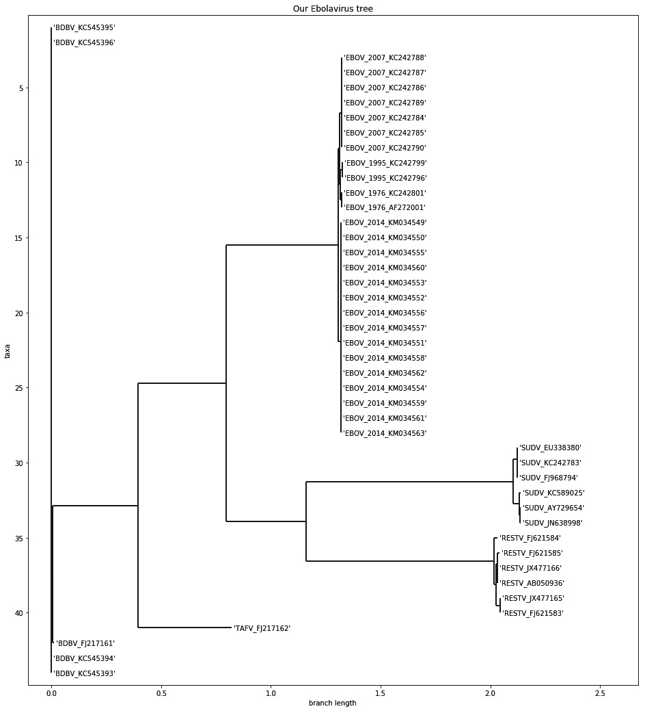
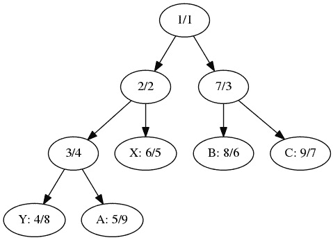

# 七、系统发育学

系统发育学是分子测序的应用，用于研究生物之间的进化关系。说明这一过程的典型方法是使用系统进化树。从基因组数据计算这些树是一个活跃的研究领域，具有许多现实世界的应用。

在本书中，我们将把提到的实用方法提升到一个新的水平:这里的大多数食谱都受到了最近一项关于埃博拉病毒的研究的启发，该研究研究了最近在非洲爆发的埃博拉病毒。这项研究名为*基因组监测，阐明了 2014 年埃博拉病毒爆发*期间的起源和传播，作者 *Gire 等人*，发表在*科学*上。在[https://pubmed.ncbi.nlm.nih.gov/25214632/](https://pubmed.ncbi.nlm.nih.gov/25214632/)有售。在这里，我们将尝试遵循类似的方法，以达到类似的论文结果。

在这一章中，我们将使用 DendroPy(一个系统发育库)和 Biopython。Docker 映像包括所有必要的软件。

在本章中，我们将介绍以下配方:

*   为系统发育分析准备数据集
*   对齐遗传和基因组数据
*   比较序列
*   重建系统进化树
*   递归地玩树
*   可视化系统发育数据

# 准备用于系统发育分析的数据集

在这个菜谱中，我们将下载并准备用于我们分析的数据集。该数据集包含埃博拉病毒的完整基因组。我们将使用 DendroPy 来下载和准备数据。

## 准备就绪

我们将从 GenBank 下载完整的基因组；这些基因组是从各种埃博拉疫情中收集的，包括 2014 年爆发的几次疫情。请注意，有几种病毒会导致埃博拉病毒病；2014 年疫情涉及的物种(EBOV 病毒，正式名称为扎伊尔埃博拉病毒)是最常见的，但这种疾病是由埃博拉病毒属的更多物种引起的；另外四种也以序列形式提供。你可以在[https://en.wikipedia.org/wiki/Ebolavirus](https://en.wikipedia.org/wiki/Ebolavirus)了解更多。

如果您已经阅读了前面的章节，您可能会对这里涉及的潜在数据大小感到恐慌；这根本不是问题，因为这些病毒的基因组大小都在 19 kbp 左右。所以，我们大约 100 个基因组实际上很轻。

为了进行这个分析，我们需要安装`dendropy`。如果您正在使用 Anaconda，请执行以下操作:

```py
conda install –c bioconda dendropy
```

像往常一样，这个信息可以在相应的 Jupyter 笔记本文件中找到，该文件可以在`Chapter07/Exploration.py`找到。

## 怎么做...

看看下面的步骤:

1.  首先，让我们从使用树复制指定我们的数据源开始，如下:

    ```py
    import dendropy
    from dendropy.interop import genbank
    def get_ebov_2014_sources():
        #EBOV_2014
        #yield 'EBOV_2014', genbank.GenBankDna(id_range=(233036, 233118), prefix='KM')
        yield 'EBOV_2014', genbank.GenBankDna(id_range=(34549, 34563), prefix='KM0')
    def get_other_ebov_sources():
        #EBOV other
        yield 'EBOV_1976', genbank.GenBankDna(ids=['AF272001', 'KC242801'])
        yield 'EBOV_1995', genbank.GenBankDna(ids=['KC242796', 'KC242799'])
        yield 'EBOV_2007', genbank.GenBankDna(id_range=(84, 90), prefix='KC2427')
    def get_other_ebolavirus_sources():
        #BDBV
        yield 'BDBV', genbank.GenBankDna(id_range=(3, 6), prefix='KC54539')
        yield 'BDBV', genbank.GenBankDna(ids=['FJ217161']) #RESTV
        yield 'RESTV', genbank.GenBankDna(ids=['AB050936', 'JX477165', 'JX477166',  'FJ621583', 'FJ621584', 'FJ621585'])
        #SUDV
        yield 'SUDV', genbank.GenBankDna(ids=['KC242783', 'AY729654', 'EU338380', 'JN638998', 'FJ968794', 'KC589025', 'JN638998'])
        #yield 'SUDV', genbank.GenBankDna(id_range=(89, 92), prefix='KC5453')
        #TAFV
        yield 'TAFV', genbank.GenBankDna(ids=['FJ217162'])
    ```

这里，我们有三个函数:一个检索最近一次 EBOV 爆发的数据，另一个检索以前 EBOV 爆发的数据，还有一个检索其他物种爆发的数据。

注意，DendroPy GenBank 接口提供了几种不同的方式来指定要检索的记录列表或范围。一些行被注释掉了。这些包括下载更多基因组的代码。出于我们的目的，我们将下载的子集就足够了。

1.  现在，我们将创建一组 FASTA 文件；我们将在这里和未来的食谱中使用这些文件:

    ```py
    other = open('other.fasta', 'w')
    sampled = open('sample.fasta', 'w')
    for species, recs in get_other_ebolavirus_sources():
        tn = dendropy.TaxonNamespace()
        char_mat = recs.generate_char_matrix(taxon_namespace=tn,
            gb_to_taxon_fn=lambda gb: tn.require_taxon(label='%s_%s' % (species, gb.accession)))
        char_mat.write_to_stream(other, 'fasta')
        char_mat.write_to_stream(sampled, 'fasta')
    other.close()
    ebov_2014 = open('ebov_2014.fasta', 'w')
    ebov = open('ebov.fasta', 'w')
    for species, recs in get_ebov_2014_sources():
        tn = dendropy.TaxonNamespace()
        char_mat = recs.generate_char_matrix(taxon_namespace=tn,
            gb_to_taxon_fn=lambda gb: tn.require_taxon(label='EBOV_2014_%s' % gb.accession))
        char_mat.write_to_stream(ebov_2014, 'fasta')
        char_mat.write_to_stream(sampled, 'fasta')
        char_mat.write_to_stream(ebov, 'fasta')
    ebov_2014.close()
    ebov_2007 = open('ebov_2007.fasta', 'w')
    for species, recs in get_other_ebov_sources():
        tn = dendropy.TaxonNamespace()
        char_mat = recs.generate_char_matrix(taxon_namespace=tn,
            gb_to_taxon_fn=lambda gb: tn.require_taxon(label='%s_%s' % (species, gb.accession)))
        char_mat.write_to_stream(ebov, 'fasta')
        char_mat.write_to_stream(sampled, 'fasta')
        if species == 'EBOV_2007':
            char_mat.write_to_stream(ebov_2007, 'fasta')
    ebov.close()
    ebov_2007.close()
    sampled.close()
    ```

我们将生成几个不同的 FASTA 文件，这些文件要么包括所有基因组，要么只包括 2014 年爆发的 EBOV 样本。在这一章中，我们将主要对所有基因组使用`sample.fasta`文件。

注意使用`dendropy`函数来创建 FASTA 文件，这些文件是通过转换从 GenBank 记录中检索的。FASTA 文件中每个序列的 ID 由 lambda 函数产生，该函数使用物种和年份以及 GenBank 登录号。

1.  让我们提取病毒中的四个基因(总共七个 T2 基因中的四个基因)，如下:

    ```py
    my_genes = ['NP', 'L', 'VP35', 'VP40']
    def dump_genes(species, recs, g_dls, p_hdls):
        for rec in recs:
            for feature in rec.feature_table:
                if feature.key == 'CDS':
                    gene_name = None
                    for qual in feature.qualifiers:
                        if qual.name == 'gene':
                            if qual.value in my_genes:
                                gene_name = qual.value
                        elif qual.name == 'translation':
                            protein_translation = qual.value
                    if gene_name is not None:
                        locs = feature.location.split('.')
                        start, end = int(locs[0]), int(locs[-1])
                        g_hdls[gene_name].write('>%s_%s\n' % (species, rec.accession))
                        p_hdls[gene_name].write('>%s_%s\n' % (species, rec.accession))
                        g_hdls[gene_name].write('%s\n' % rec.sequence_text[start - 1 : end])
                        p_hdls[gene_name].write('%s\n' % protein_translation)
    g_hdls = {}
    p_hdls = {}
    for gene in my_genes:
        g_hdls[gene] = open('%s.fasta' % gene, 'w')
        p_hdls[gene] = open('%s_P.fasta' % gene, 'w')
    for species, recs in get_other_ebolavirus_sources():
        if species in ['RESTV', 'SUDV']:
            dump_genes(species, recs, g_hdls, p_hdls)
    for gene in my_genes:
        g_hdls[gene].close()
        p_hdls[gene].close()
    ```

我们从搜索所有基因特征的第一个 GenBank 记录开始(请参考 [*第三章*](03.html#_idTextAnchor068)*下一代测序*，或**国家生物技术信息中心** ( **NCBI** )文档了解更多细节；虽然我们在这里将使用 DendroPy 而不是 Biopython，但概念是相似的)并写入 FASTA 文件以提取基因。我们把每个基因放在不同的文件中，只取两种病毒。我们还得到翻译的蛋白质，这些蛋白质可以在每个基因的记录中找到。

1.  让我们创建一个函数来从比对中获取基本的统计信息，如下:

    ```py
    def describe_seqs(seqs):
        print('Number of sequences: %d' % len(seqs.taxon_namespace))
        print('First 10 taxon sets: %s' % ' '.join([taxon.label for taxon in seqs.taxon_namespace[:10]]))
        lens = []
        for tax, seq in seqs.items():
            lens.append(len([x for x in seq.symbols_as_list() if x != '-']))
        print('Genome length: min %d, mean %.1f, max %d' % (min(lens), sum(lens) / len(lens), max(lens)))
    ```

我们的函数获取一个`DnaCharacterMatrix`树类，并计算分类群的数量。然后，我们提取每个序列的所有氨基酸(我们排除了由`-`确定的缺口)来计算长度并报告最小、平均和最大大小。关于 API 的更多细节，请看一下树图文档。

1.  让我们检查 EBOV 基因组的序列并计算基本的统计数据，如前面所示:

    ```py
    ebov_seqs = dendropy.DnaCharacterMatrix.get_from_path('ebov.fasta', schema='fasta', data_type='dna')
    print('EBOV')
    describe_seqs(ebov_seqs)
    del ebov_seqs
    ```

然后我们调用一个函数，得到 25 个最小大小为 18，700，平均大小为 18，925.2，最大大小为 18，959 的序列。与真核生物相比，这是一个很小的基因组。

注意，在最后，内存结构被删除了。这是因为内存占用仍然相当大(DendroPy 是一个纯 Python 库，在速度和内存方面有一些成本)。当你加载完整的基因组时，要小心你的内存使用。

1.  现在，让我们检查另一个伊波拉病毒的基因组文件，并统计不同物种的数量:

    ```py
    print('ebolavirus sequences')
    ebolav_seqs = dendropy.DnaCharacterMatrix.get_from_path('other.fasta', schema='fasta', data_type='dna')
    describe_seqs(ebolav_seqs)
    from collections import defaultdict
    species = defaultdict(int)
    for taxon in ebolav_seqs.taxon_namespace:
        toks = taxon.label.split('_')
        my_species = toks[0]
        if my_species == 'EBOV':
            ident = '%s (%s)' % (my_species, toks[1])
        else:
            ident = my_species
        species[ident] += 1
    for my_species, cnt in species.items():
        print("%20s: %d" % (my_species, cnt))
    del ebolav_seqs
    ```

每个分类单元的名称前缀代表该物种，我们利用它来填充计数字典。

接下来详细说明了物种和 EBOV 分类的输出(图例为 Bundibugyo 病毒=BDBV，Tai 森林病毒=TAFV，苏丹病毒=SUDV，Reston 病毒= RESTV 我们有 1 个 TAFV，6 个 SUDV，6 个 RESTV，5 个 BDBV)。

1.  我们来提取病毒中一个基因的基本统计:

    ```py
    gene_length = {}
    my_genes = ['NP', 'L', 'VP35', 'VP40']
    for name in my_genes:
        gene_name = name.split('.')[0]
        seqs =    
    dendropy.DnaCharacterMatrix.get_from_path('%s.fasta' % name, schema='fasta', data_type='dna')
        gene_length[gene_name] = []
        for tax, seq in seqs.items():
            gene_length[gene_name].append(len([x for x in  seq.symbols_as_list() if x != '-'])
    for gene, lens in gene_length.items():
        print ('%6s: %d' % (gene, sum(lens) / len(lens)))
    ```

这允许您对基本基因信息(即名称和平均大小)有一个概述，如下所示:

```py
NP: 2218
L: 6636
VP35: 990
VP40: 988
```

## 还有更多...

这里的大部分工作可能都可以用 Biopython 来完成，但是 DendroPy 还有额外的功能，我们将在后面的食谱中探讨。此外，您将会发现，它对于某些任务(比如文件解析)更加健壮。更重要的是，您应该考虑使用另一个 Python 库来执行种系发生学。它叫做 ETE，在 http://etetoolkit.org/ T2 有售。

## 参见

*   美国疾病控制中心在 https://www.cdc.gov/vhf/ebola/history/summaries.xhtml 有一个很好的关于埃博拉病毒疾病的介绍页。
*   系统发育学中的参考应用是乔·费尔森斯坦的 *Phylip* ，可以在 http://evolution.genetics.washington.edu/phylip.xhtml 的[找到。](http://evolution.genetics.washington.edu/phylip.xhtml)
*   我们将在未来的食谱中使用 Nexus 和 Newick 格式([http://evolution . genetics . Washington . edu/phylip/new icktree . XHTML](http://evolution.genetics.washington.edu/phylip/newicktree.xhtml))，但也要查看 PhyloXML 格式(【http://en.wikipedia.org/wiki/PhyloXML】)。

# 比对遗传和基因组数据

在我们能够进行任何系统发育分析之前，我们需要比对我们的遗传和基因组数据。这里，我们将使用 maft(【http://mafft.cbrc.jp/alignment/software/】)对进行基因组分析。基因分析将使用肌肉进行([http://www.drive5.com/muscle/](http://www.drive5.com/muscle/))。

## 准备就绪

要执行基因组比对，您需要安装 MAFFT。此外，为了进行基因比对，将使用肌肉。此外，我们将使用 trimAl([http://trimal.cgenomics.org/](http://trimal.cgenomics.org/))以自动方式去除虚假序列和排列不良的区域。所有包装均可从 Bioconda 获得:

```py
conda install –c bioconda mafft trimal muscle=3.8
```

通常，这些信息可以在`Chapter07/Alignment.py`的相应 Jupyter 笔记本文件中找到。您需要事先运行上一个笔记本，因为它将生成此处需要的文件。在本章中，我们将使用 Biopython。

## 怎么做...

看看下面的步骤:

1.  现在，我们将运行 MAFFT 来比对基因组，如下面的代码所示。这个任务是 CPU 密集型和内存密集型的，需要相当长的时间:

    ```py
    from Bio.Align.Applications import MafftCommandline
    mafft_cline = MafftCommandline(input='sample.fasta', ep=0.123, reorder=True, maxiterate=1000, localpair=True)
    print(mafft_cline)
    stdout, stderr = mafft_cline()
    with open('align.fasta', 'w') as w:
        w.write(stdout)
    ```

前的参数与论文补充材料中规定的参数相同。我们将使用 Biopython 接口来调用 MAFFT。

1.  让我们使用 trimAl 来修剪序列，如下:

    ```py
    os.system('trimal -automated1 -in align.fasta -out trim.fasta -fasta')
    ```

在这里，我们只是使用`os.system`调用应用程序。`-automated1`参数来自补充材料。

1.  此外，我们可以运行`MUSCLE`来排列蛋白质:

    ```py
    from Bio.Align.Applications import MuscleCommandline
    my_genes = ['NP', 'L', 'VP35', 'VP40']
    for gene in my_genes:
        muscle_cline = MuscleCommandline(input='%s_P.fasta' % gene)
        print(muscle_cline)
        stdout, stderr = muscle_cline()
        with open('%s_P_align.fasta' % gene, 'w') as w:
        w.write(stdout)
    ```

我们使用 Biopython 来调用外部应用程序。这里，我们将比对一组蛋白质。

请注意，为了让对分子进化进行一些分析，我们必须比较对齐的基因，而不是蛋白质(例如，比较同义和非同义突变)。然而，我们只是排列了蛋白质。因此，我们必须将比对转换成基因序列形式。

1.  让我们通过找到对应于每个氨基酸的三个核苷酸来排列基因:

    ```py
    from Bio import SeqIO
    from Bio.Seq import Seq
    from Bio.SeqRecord import SeqRecord
    for gene in my_genes:
        gene_seqs = {}
        unal_gene = SeqIO.parse('%s.fasta' % gene, 'fasta')
        for rec in unal_gene:
            gene_seqs[rec.id] = rec.seq
        al_prot = SeqIO.parse('%s_P_align.fasta' % gene, 'fasta')
        al_genes = []
        for protein in al_prot:
            my_id = protein.id
            seq = ''
            pos = 0
            for c in protein.seq:
                if c == '-':
                    seq += '---'
                else:
                    seq += str(gene_seqs[my_id][pos:pos + 3])
                    pos += 3
            al_genes.append(SeqRecord(Seq(seq), id=my_id))
        SeqIO.write(al_genes, '%s_align.fasta' % gene, 'fasta')
    ```

编码得到蛋白质和基因编码。如果在蛋白质中发现一个缺口，则写三个缺口；如果发现一种氨基酸，就写出该基因相应的核苷酸。

# 比较序列

这里，我们将比较我们在之前的配方中比对的序列。我们将进行全基因和全基因组的比较。

## 准备就绪

我们将使用 DendroPy 并需要前两个配方的结果。通常，这些信息可在`Chapter07/Comparison.py`的相应笔记本中找到。

## 怎么做...

看看下面的步骤:

1.  让我们开始分析基因数据。为简单起见，我们将仅使用扩展数据集中可获得的埃博拉病毒属的另外两个物种的数据，即莱斯顿病毒(`RESTV`)和苏丹病毒(`SUDV` ):

    ```py
    import os
    from collections import OrderedDict
    import dendropy
    from dendropy.calculate import popgenstat
    genes_species = OrderedDict()
    my_species = ['RESTV', 'SUDV']
    my_genes = ['NP', 'L', 'VP35', 'VP40']
    for name in my_genes:
        gene_name = name.split('.')[0]
        char_mat = dendropy.DnaCharacterMatrix.get_from_path('%s_align.fasta' % name, 'fasta')
        genes_species[gene_name] = {}

        for species in my_species:
            genes_species[gene_name][species] = dendropy.DnaCharacterMatrix()
        for taxon, char_map in char_mat.items():
            species = taxon.label.split('_')[0]
            if species in my_species:
                genes_species[gene_name][species].taxon_namespace.add_taxon(taxon)
                genes_species[gene_name][species][taxon] = char_map
    ```

我们得到四个基因,存储在第一个配方中，并在第二个配方中对齐。

我们加载所有文件(FASTA 格式的)并创建一个包含所有基因的字典。每个条目都是一个包含 RESTV 或 SUDV 种类的字典，包括所有的读数。这不是很多数据，只是少数基因。

1.  让我们打印所有四个基因的一些基本信息，例如分离位点的数量(`seg_sites`)、核苷酸多样性(`nuc_div`)、田岛的 D ( `taj_d`)和沃特森的θ(`wat_theta`)(查看*还有更多...*本食谱中关于这些统计数据的链接:

    ```py
    import numpy as np
    import pandas as pd
    summary = np.ndarray(shape=(len(genes_species), 4 * len(my_species)))
    stats = ['seg_sites', 'nuc_div', 'taj_d', 'wat_theta']
    for row, (gene, species_data) in enumerate(genes_species.items()):
        for col_base, species in enumerate(my_species):
            summary[row, col_base * 4] = popgenstat.num_segregating_sites(species_data[species])
            summary[row, col_base * 4 + 1] = popgenstat.nucleotide_diversity(species_data[species])
            summary[row, col_base * 4 + 2] = popgenstat.tajimas_d(species_data[species])
            summary[row, col_base * 4 + 3] = popgenstat.wattersons_theta(species_data[species])
    columns = []
    for species in my_species:
        columns.extend(['%s (%s)' % (stat, species) for stat in stats])
    df = pd.DataFrame(summary, index=genes_species.keys(), columns=columns)
    df # vs print(df)
    ```

2.  首先，让我们看看输出，然后我们将解释如何构建它:



图 7.1–病毒数据集的数据框架

我使用了一个`pandas` DataFrame 来打印结果，因为它真的是为处理这样的操作而定制的。我们将用一个 NumPy 多维数组初始化我们的数据框架，该数组有四行(基因)和四个统计数据乘以两个物种。

统计数据，如分离位点的数量、核苷酸多样性、Tajima’s D 和 Watterson’s theta，由 DendroPy 计算。注意数组中单个数据点的位置(坐标计算)。

看最后一行:如果你在 Jupyter 中，只需在末尾加上`df`就能显示数据帧和单元格输出。如果你不在笔记本里，就用`print(df)`(你也可以在笔记本里执行这个，但是看起来不会那么好看)。

1.  现在，让我们提取类似的信息，但是是全基因组的，而不仅仅是全基因的。在这种情况下，我们将使用两次 EBOV 暴发(2007 年和 2014 年)的子样本。我们将执行一个函数来显示基本统计数据，如下:

    ```py
    def do_basic_popgen(seqs):
        num_seg_sites = popgenstat.num_segregating_sites(seqs)
        avg_pair = popgenstat.average_number_of_pairwise_differences(seqs)
        nuc_div = popgenstat.nucleotide_diversity(seqs)
        print('Segregating sites: %d, Avg pairwise diffs: %.2f, Nucleotide diversity %.6f' % (num_seg_sites, avg_pair, nuc_div))
        print("Watterson's theta: %s" % popgenstat.wattersons_theta(seqs))
        print("Tajima's D: %s" % popgenstat.tajimas_d(seqs))
    ```

到目前为止，根据前面的例子，这个函数应该很容易理解。

1.  现在，让我们适当地抽取数据的一个子样本，并输出统计信息:

    ```py
    ebov_seqs = dendropy.DnaCharacterMatrix.get_from_path(
        'trim.fasta', schema='fasta', data_type='dna')
    sl_2014 = []
    drc_2007 = []
    ebov2007_set = dendropy.DnaCharacterMatrix()
    ebov2014_set = dendropy.DnaCharacterMatrix()
    for taxon, char_map in ebov_seqs.items():
        print(taxon.label)
        if taxon.label.startswith('EBOV_2014') and len(sl_2014) < 8:
            sl_2014.append(char_map)
            ebov2014_set.taxon_namespace.add_taxon(taxon)
            ebov2014_set[taxon] = char_map
        elif taxon.label.startswith('EBOV_2007'):
            drc_2007.append(char_map)
            ebov2007_set.taxon_namespace.add_taxon(taxon)
            ebov2007_set[taxon] = char_map
            #ebov2007_set.extend_map({taxon: char_map})
    del ebov_seqs
    print('2007 outbreak:')
    print('Number of individuals: %s' % len(ebov2007_set.taxon_set))
    do_basic_popgen(ebov2007_set)
    print('\n2014 outbreak:')
    print('Number of individuals: %s' % len(ebov2014_set.taxon_set))
    do_basic_popgen(ebov2014_set)
    ```

在这里，我们将构建两个数据集的两个版本:2014 年爆发和 2007 年爆发。我们将生成一个版本作为`DnaCharacterMatrix`，另一个作为列表。我们将在本食谱的末尾使用这个列表版本。

由于 2014 年 EBOV 爆发的数据集很大，我们对其进行了二次抽样，只有 8 个人，这与 2007 年爆发的数据集具有可比性。

同样，我们删除`ebov_seqs`数据结构以节省内存(这些是基因组，不仅仅是基因)。

如果对 GenBank 上可用的 2014 年疫情的完整数据集(99 个样本)执行这一分析，请准备好等待相当长的时间。

输出如下所示:

```py
2007 outbreak:
Number of individuals: 7
Segregating sites: 25, Avg pairwise diffs: 7.71, Nucleotide diversity 0.000412
Watterson's theta: 10.204081632653063
Tajima's D: -1.383114157484101
2014 outbreak:
Number of individuals: 8
Segregating sites: 6, Avg pairwise diffs: 2.79, Nucleotide diversity 0.000149
Watterson's theta: 2.31404958677686
Tajima's D: 0.9501208027581887
```

1.  最后，我们对 2007 年和 2014 年的两个子集进行一些统计分析，如下:

    ```py
    pair_stats = popgenstat.PopulationPairSummaryStatistics(sl_2014, drc_2007)
    print('Average number of pairwise differences irrespective of population: %.2f' % pair_stats.average_number_of_pairwise_differences)
    print('Average number of pairwise differences between populations: %.2f' % pair_stats.average_number_of_pairwise_differences_between)
    print('Average number of pairwise differences within populations: %.2f' % pair_stats.average_number_of_pairwise_differences_within)
    print('Average number of net pairwise differences : %.2f' % pair_stats.average_number_of_pairwise_differences_net)
    print('Number of segregating sites: %d' % pair_stats.num_segregating_sites)
    print("Watterson's theta: %.2f" % pair_stats.wattersons_theta)
    print("Wakeley's Psi: %.3f" % pair_stats.wakeleys_psi)
    print("Tajima's D: %.2f" % pair_stats.tajimas_d)
    ```

请注意，我们将在这里执行一些稍微不同的操作；我们将要求 DendroPy ( `popgenstat.PopulationPairSummaryStatistics`)直接比较两个群体，这样我们得到以下结果:

```py
Average number of pairwise differences irrespective of population: 284.46
Average number of pairwise differences between populations: 535.82
Average number of pairwise differences within populations: 10.50
Average number of net pairwise differences : 525.32
Number of segregating sites: 549
Watterson's theta: 168.84
Wakeley's Psi: 0.308
Tajima's D: 3.05
```

现在隔离点的数量要大得多，因为我们正在处理来自两个不同人群的数据，这两个人群有合理的差异。人群中成对差异的平均数相当大。正如预期的那样，这比不考虑人口信息的人口平均数要大得多。

## 还有更多...

如果你想获得许多系统发育和群体遗传学公式，包括这里使用的公式，我强烈建议你获得 Arlequin 软件套件的手册([http://cmpg.unibe.ch/software/arlequin35/](http://cmpg.unibe.ch/software/arlequin35/))。如果您不使用 Arlequin 来执行数据分析，其手册可能是实现公式的最佳参考。这个免费文档可能比我记得的任何一本书都有更多关于公式实现的相关细节。

# 重建系统进化树

这里，我们将为所有埃博拉物种的比对数据集构建系统发生树。我们将遵循一个与论文中使用的程序非常相似的程序。

## 准备就绪

这个食谱需要 RAxML，一个基于最大似然推理大型系统树的程序，你可以在 http://sco.h-its.org/exelixis/software.xhtml[查看。Bioconda 也包括它，但它被命名为`raxml`。注意，这个二进制文件叫做`raxmlHPC`。您可以执行以下命令来安装它:](http://sco.h-its.org/exelixis/software.xhtml)

```py
conda install –c bioconda raxml
```

前面的代码很简单，但是执行起来需要时间，因为它将调用 RAxML(这是计算密集型的)。如果您选择使用树型接口，它也可能会占用大量内存。我们将与 RAxML、DendroPy 和 Biopython 交互，让您选择使用哪个接口；DendroPy 为您提供了一种访问结果的简单方法，而 Biopython 对内存的要求较低。尽管在本章的后面有可视化的方法，我们还是会在这里绘制一个生成的树。

通常，这些信息可在`Chapter07/Reconstruction.py`的相应笔记本中找到。您将需要上一个食谱的输出来完成这个。

## 怎么做...

看看下面的步骤:

1.  对于 DendroPy，我们将首先加载数据，然后重建 genus 数据集，如下所示:

    ```py
    import os
    import shutil
    import dendropy
    from dendropy.interop import raxml
    ebola_data = dendropy.DnaCharacterMatrix.get_from_path('trim.fasta', 'fasta')
    rx = raxml.RaxmlRunner()
    ebola_tree = rx.estimate_tree(ebola_data, ['-m', 'GTRGAMMA', '-N', '10'])
    print('RAxML temporary directory %s:' % rx.working_dir_path)
    del ebola_data
    ```

请记住，这种数据结构的大小相当大；因此，请确保您有足够的内存来加载它(至少 10 GB)。

准备好等待一段时间。根据您的计算机，这可能需要一个多小时。如果需要更长时间，考虑重新启动这个过程，因为有时可能会出现 RAxML 错误。

我们将使用 GTRΓ核苷酸替代模型运行 RAxML，如论文中所述。我们将只进行 10 次重复以加快结果，但你可能需要做更多，比如 100 次。在这个过程的最后，我们将从内存中删除基因组数据，因为它占用了大量内存。

`ebola_data`变量将有最好的 RAxML 树，包括距离。`RaxmlRunner`对象将可以访问 RAxML 生成的其他信息。让我们打印出 DendroPy 将执行 RAxML 的目录。如果你检查这个目录，你会发现很多文件。由于 RAxML 返回的是最佳树，您可能希望忽略所有这些文件，但是我们将在另一个 Biopython 步骤中稍微讨论一下这个问题。

1.  我们将保存树木以备将来分析；在我们的例子中，这将是一个可视化，如下面的代码所示:

    ```py
    ebola_tree.write_to_path('my_ebola.nex', 'nexus')
    ```

我们将把序列写入一个 NEXUS 文件，因为我们需要存储拓扑信息。FASTA 在这里是不够的。

1.  让我们形象化我们的属树，如下:

    ```py
    import matplotlib.pyplot as plt
    from Bio import Phylo
    my_ebola_tree = Phylo.read('my_ebola.nex', 'nexus')
    my_ebola_tree.name = 'Our Ebolavirus tree'
    fig = plt.figure(figsize=(16, 18))
    ax = fig.add_subplot(1, 1, 1)
    Phylo.draw(my_ebola_tree, axes=ax)
    ```

我们将推迟对这段代码的解释，直到我们以后找到合适的方法，但是如果你看下面的图表并与论文中的结果进行比较，你会清楚地看到它看起来像是朝着正确的方向迈出了一步。例如，来自同一物种的所有个体聚集在一起。

你会注意到 trimAl 改变了序列的名称，例如，增加了它们的大小。这很容易解决；我们将在*可视化系统发育数据*配方中处理这个问题:



图 7.2–我们用 RAxML 为所有埃博拉病毒生成的系统进化树

1.  让我们通过 Biopython 用 RAxML 重建进化树。Biopython 接口的声明性较低，但比 DendroPy 更节省内存。因此，在运行它之后，处理输出将是您的责任，而 DendroPy 会自动返回最佳树，如下面的代码所示:

    ```py
    import random
    import shutil
    from Bio.Phylo.Applications import RaxmlCommandline
    raxml_cline = RaxmlCommandline(sequences='trim.fasta', model='GTRGAMMA', name='biopython', num_replicates='10', parsimony_seed=random.randint(0, sys.maxsize), working_dir=os.getcwd() + os.sep + 'bp_rx')
    print(raxml_cline)
    try:
        os.mkdir('bp_rx')
    except OSError:
        shutil.rmtree('bp_rx')
        os.mkdir('bp_rx')
    out, err = raxml_cline()
    ```

与 Biopython 相比，DendroPy 有一个更加声明性的接口，所以你可以处理一些额外的事情。您应该指定种子(如果您不这样做，Biopython 将设置一个固定的默认值 10，000)和工作目录。对于 RAxML，工作目录规范需要绝对路径。

1.  让我们来看看 Biopython 运行的结果。虽然对于 DendroPy 和 Biopython 来说，RAxML 输出是相同的(除了随机性)，但是 DendroPy 抽象了一些东西。使用 Biopython，您需要自己处理结果。您也可以使用树状视图来执行此操作；但是，在这种情况下，它是可选的:

    ```py
    from Bio import Phylo
    biopython_tree = Phylo.read('bp_rx/RAxML_bestTree.biopython', 'newick')
    ```

前面的代码将从 RAxML 运行中读取最佳树。文件的名称附加了您在上一步中指定的项目名称(在本例中为`biopython`)。

看一下`bp_rx`目录的内容；在这里，您将找到 RAxML 的所有输出，包括所有 10 个备选树。

## 还有更多...

虽然这本书的目的不是教系统发育分析，但知道为什么我们不检查树拓扑中的一致性和支持信息是很重要的。您应该在您的数据集中对此进行研究。更多信息请参考[http://www . geol . UMD . edu/~ tholtz/G331/lectures/clad istics 5 . pdf](http://www.geol.umd.edu/~tholtz/G331/lectures/cladistics5.pdf)。

# 递归地玩树

这不是一本关于 Python 编程的书，因为主题非常广泛。话虽如此，Python 入门书籍详细讨论递归编程的情况并不多见。通常，递归编程技术非常适合处理树。这也是使用函数式编程方言的必要编程策略，在执行并发处理时非常有用。这在处理非常大的数据集时很常见。

树的系统发育概念与计算机科学中的概念略有不同。系统发生树可以是有根的(如果是，那么它们是正常的树数据结构)或者无根的，使它们成为无向无环图。此外，系统树的边上可以有权重。因此，在阅读文档时要注意这一点；如果文本是由系统发育学家写的，你可以期待树(有根和无根)，而大多数其他文档将使用无向无环图来表示无根树。在这个菜谱中，我们将假设所有的树都是有根的。

最后，请注意，虽然这个方法主要是为了帮助您理解递归算法和树状结构，但最后一部分实际上是非常实用的，也是下一个方法的基础。

## 准备就绪

你需要有以前配方的文件。和往常一样，你可以在`Chapter07/Trees.py`笔记本文件中找到这个内容。这里，我们将使用 DendroPy 的树表示。请注意，与其他树表示和库(无论是否系统发育)相比，这些代码的大部分很容易推广。

## 怎么做...

看看下面的步骤:

1.  首先，让我们加载所有埃博拉病毒的 RAxML 生成树，如下:

    ```py
    import dendropy
    ebola_raxml = dendropy.Tree.get_from_path('my_ebola.nex', 'nexus')
    ```

2.  然后，我们需要来计算每个节点的级别(到根节点的距离):

    ```py
    def compute_level(node, level=0):
        for child in node.child_nodes():
            compute_level(child, level + 1)
        if node.taxon is not None:
            print("%s: %d %d" % (node.taxon, node.level(), level))
    compute_level(ebola_raxml.seed_node)
    ```

DendroPy 的节点表示有一个 level 方法(用于比较)，但这里的重点是引入一个递归算法，所以无论如何我们都会实现。

注意函数是如何工作的；用`seed_node`调用它(它是根节点，因为代码是在假设我们正在处理有根的树的情况下工作的)。根节点的默认级别是`0`。然后，该函数将为其所有子节点调用自身，级别增加一级。然后，对于不是叶子的每个节点(也就是说，它在树的内部)，调用将被重复，并且这将递归直到我们到达叶子节点。

对于叶节点，我们打印级别(我们可以对内部节点做同样的事情)并显示由 DendroPy 的内部函数计算的相同信息。

1.  现在，让我们计算每个节点的高度。节点的高度是从该节点开始的最大向下路径(到叶子)的边数，如下:

    ```py
    def compute_height(node):
        children = node.child_nodes()
        if len(children) == 0:
            height = 0
        else:
        height = 1 + max(map(lambda x: compute_height(x), children))
        desc = node.taxon or 'Internal'
        print("%s: %d %d" % (desc, height, node.level()))
        return height
    compute_height(ebola_raxml.seed_node)
    ```

这里，我们将使用相同的递归策略，但是每个节点将把它的高度返回给它的父节点。如果节点是叶子，那么高度是`0`；如果不是，那么就是`1`加上它整个后代的最大高度。

注意，我们使用 lambda 函数上的 map 来获取当前节点的所有子节点的高度。然后，我们选择最大值(`max`函数在这里执行一个`reduce`操作，因为它汇总了所有报告的值)。如果您将此与 MapReduce 框架联系起来，那么您是正确的；他们的灵感来自于这样的函数式编程方言。

1.  现在，让我们计算每个节点的后代数量。到现在为止，这应该很容易理解:

    ```py
    def compute_nofs(node):
        children = node.child_nodes()
        nofs = len(children)
        map(lambda x: compute_nofs(x), children)
        desc = node.taxon or 'Internal'
        print("%s: %d %d" % (desc, nofs, node.level()))
    compute_nofs(ebola_raxml.seed_node)
    ```

2.  现在我们将打印所有的叶子(这显然是微不足道的):

    ```py
    def print_nodes(node):
        for child in node.child_nodes():
            print_nodes(child)
        if node.taxon is not None:
            print('%s (%d)' % (node.taxon, node.level()))
    print_nodes(ebola_raxml.seed_node)
    ```

注意，到目前为止我们开发的所有函数都在树上强加了一个非常清晰的遍历模式。它调用它的第一个后代，然后那个后代会调用它们的后代，以此类推；只有在这之后，函数才能以深度优先的模式调用它的下一个后代。然而，我们可以用不同的方式做事。

1.  现在，让我们以广度优先的方式打印叶节点，也就是说，我们将首先打印最低级别(更靠近根)的叶，如下:

    ```py
    from collections import deque
    def print_breadth(tree):
        queue = deque()
        queue.append(tree.seed_node)
        while len(queue) > 0:
            process_node = queue.popleft()
            if process_node.taxon is not None:
                print('%s (%d)' % (process_node.taxon, process_node.level()))
            else:
                for child in process_node.child_nodes():
                    queue.append(child)
    print_breadth(ebola_raxml)
    ```

在我们解释这个算法之前，让我们看看这次运行的结果与前一次相比有多大的不同。首先，看一下下图。如果按深度优先顺序打印节点，会得到 Y，A，X，B，C，但如果执行一次先呼吸遍历，会得到 X，B，C，Y，A，树遍历会对节点的访问方式产生影响；通常情况下，这很重要。

关于前面的代码，在这里，我们将使用完全不同的方法，因为我们将执行迭代算法。我们将使用一个**先进先出** ( **FIFO** )队列来帮助我们的节点排序。注意 Python 的 deque 可以和 FIFO 一样高效的使用，也可以用在**后进先出** ( **LIFO** )中。这是因为当你在两个极端操作时，它实现了一个有效的数据结构。

该算法从将根节点放入队列开始。当队列不为空时，我们将把节点放在前面。如果它是一个内部节点，我们将把它的所有子节点放入队列中。

我们将重复前面的步骤，直到队列为空。我鼓励你拿起笔和纸，通过执行下图所示的示例来看看这是如何工作的。代码很小，但却很重要:



图 7.3-拜访一棵树；第一个数字表示访问该节点的顺序，即深度优先，而第二个数字表示广度优先

1.  让我们回到真正的数据集。由于我们有太多的数据要可视化，我们将生成一个精简的版本，其中我们删除了具有单一物种的子树(在 EBOV 的情况下，它们具有相同的爆发)。我们还将对树进行分层，即按照子节点的数量排序:

    ```py
    from copy import deepcopy
    simple_ebola = deepcopy(ebola_raxml)
    def simplify_tree(node):
        prefs = set()
        for leaf in node.leaf_nodes():
            my_toks = leaf.taxon.label.split(' ')
            if my_toks[0] == 'EBOV':
                prefs.add('EBOV' + my_toks[1])
            else:
                prefs.add(my_toks[0])
        if len(prefs) == 1:
            print(prefs, len(node.leaf_nodes()))
            node.taxon = dendropy.Taxon(label=list(prefs)[0])
            node.set_child_nodes([])
        else:
            for child in node.child_nodes():
                simplify_tree(child)
    simplify_tree(simple_ebola.seed_node)
    simple_ebola.ladderize()
    simple_ebola.write_to_path('ebola_simple.nex', 'nexus')
    ```

我们将执行树结构的深层复制。由于我们的函数和分层是破坏性的(它们将改变树)，我们将希望保持原来的树。

DendroPy 能够枚举所有的叶节点(在这个阶段，一个很好的练习是编写一个函数来执行这个操作)。有了这个功能，我们将获得某个节点的所有叶子。如果它们与 EBOV 的情况具有相同的物种和爆发年份，我们将删除所有子节点、叶子和内部子树节点。

如果它们不属于同一个物种，我们会递归下去，直到发生这种情况。最坏的情况是，当你已经在一个叶节点时，该算法简单地解析为当前节点的种类。

## 还有更多...

有大量关于树和数据结构的计算机科学文献；如果你想了解更多，维基百科在 http://en.wikipedia.org/wiki/Tree_%28data_structure%29 提供了很棒的介绍。

注意，作为 Python 方言，不鼓励使用`lambda`函数和`map`；你可以在 http://www.artima.com/weblogs/viewpost.jsp?thread=98196[的吉多·范·罗苏姆那里读到一些(旧的)关于这个问题的观点。我在这里介绍它是因为它是函数式和递归编程中非常常见的一种语言。更常见的方言将基于一系列的理解。](http://www.artima.com/weblogs/viewpost.jsp?thread=98196)

在任何情况下，基于使用`map`和`reduce`操作的函数式方言都是 MapReduce 框架的概念基础，您可以使用 Hadoop、Disco 或 Spark 等框架来执行高性能的生物信息学计算。

# 可视化系统发育数据

在这份食谱中，我们将讨论如何可视化系统进化树。DendroPy 只有基于绘制文本 ASCII 树的简单可视化机制，但是 Biopython 有相当丰富的基础设施，我们将在这里利用它。

## 准备就绪

这将要求你完成所有先前的食谱。请记住，我们有整个埃博拉病毒属的文件，包括 RAxML 树。此外，简化的属版本将在之前的配方中生成。和往常一样，你可以在`Chapter07/Visualization.py`笔记本文件中找到这个内容。

## 怎么做...

看看下面的步骤:

1.  让我们加载所有的系统发育数据:

    ```py
    from copy import deepcopy
    from Bio import Phylo
    ebola_tree = Phylo.read('my_ebola.nex', 'nexus')
    ebola_tree.name = 'Ebolavirus tree'
    ebola_simple_tree = Phylo.read('ebola_simple.nex', 'nexus')
    ebola_simple_tree.name = 'Ebolavirus simplified tree'
    ```

对于我们阅读的所有树，我们将更改树的名称，因为名称将在以后打印出来。

1.  现在，我们可以画出树的 ASCII 表示:

    ```py
    Phylo.draw_ascii(ebola_simple_tree)
    Phylo.draw_ascii(ebola_tree)
    ```

简化的属树的 ASCII 表示如下图所示。这里，我们不会打印完整的版本，因为它需要几页纸。但是如果您运行前面的代码，您将能够看到它实际上是非常可读的:


图 7.4–简化的埃博拉病毒数据集的 ASCII 表示

1.  `Bio.Phylo`允许通过使用`matplotlib`作为后端来图形化表示树:

    ```py
    import matplotlib.pyplot as plt
    fig = plt.figure(figsize=(16, 22))
    ax = fig.add_subplot(111)
    Phylo.draw(ebola_simple_tree, branch_labels=lambda c: c.branch_length if c.branch_length > 0.02 else None, axes=ax)
    ```

在这种情况下，我们将打印边上的分支长度，但我们将删除所有小于 0.02 的长度，以避免混乱。这样做的结果如下图所示:


图 7.5–基于 matplotlib 的简化数据集版本，增加了分支长度

1.  现在我们将绘制完整的数据集，但是我们将对树的每一位进行不同的着色。如果一个子树只有一个单一的病毒种类，它就会有自己的颜色。EBOV 将有两种颜色，即一种用于 2014 年爆发，另一种用于其他爆发，如下:

    ```py
    fig = plt.figure(figsize=(16, 22))
    ax = fig.add_subplot(111)
    from collections import OrderedDict
    my_colors = OrderedDict({
    'EBOV_2014': 'red',
    'EBOV': 'magenta',
    'BDBV': 'cyan',
    'SUDV': 'blue',
    'RESTV' : 'green',
    'TAFV' : 'yellow'
    })
    def get_color(name):
        for pref, color in my_colors.items():
            if name.find(pref) > -1:
                return color
        return 'grey'
    def color_tree(node, fun_color=get_color):
        if node.is_terminal():
            node.color = fun_color(node.name)
        else:
            my_children = set()
            for child in node.clades:
                color_tree(child, fun_color)
                my_children.add(child.color.to_hex())
            if len(my_children) == 1:
                node.color = child.color
            else:
                node.color = 'grey'
    ebola_color_tree = deepcopy(ebola_tree)
    color_tree(ebola_color_tree.root)
    Phylo.draw(ebola_color_tree, axes=ax, label_func=lambda x: x.name.split(' ')[0][1:] if x.name is not None else None)
    ```

这是一个树遍历算法，与上一个配方中的算法没有什么不同。作为递归算法，它的工作方式如下。如果节点是一片叶子，它将根据其种类(或 EBOV 爆发年份)获得一种颜色。如果它是一个内部节点，并且它下面的所有后代节点都是同一物种，那么它将获得该物种的颜色；如果在那之后有几个物种，它将被涂成灰色。其实颜色功能是可以改的，以后也会改。仅使用边缘颜色(标签将以黑色打印)。

请注意，就清晰的视觉外观而言，梯形化(在前面的树型方法中执行)非常有帮助。

我们也深抄属树来着色一份拷贝；记住前面的方法，一些树遍历函数可以改变状态，在这种情况下，我们希望保留一个没有任何着色的版本。

注意使用 lambda 函数来清除 trimAl 更改的名称，如下图所示:


图 7.6-带有完整埃博拉病毒数据集的分层彩色系统进化树

## 还有更多...

树和图形可视化是一个复杂的主题；可以说，在这里，树的可视化是严格的，但远不美观。DendroPy 的另一个选择是 ETE([http://etetoolkit.org/](http://etetoolkit.org/))，它有更多的可视化特性。绘制树和图的一般备选方案有胞景([https://cytoscape.org/](https://cytoscape.org/))和格菲([http://gephi.github.io/](http://gephi.github.io/))。如果你想了解更多关于渲染树和图的算法，可以查看 http://en.wikipedia.org/wiki/Graph_drawing 的维基百科页面，了解这个有趣话题的介绍。

但是，注意不要用形式来换取实质。例如，这本书的前一版使用图形渲染库对系统进化树进行了漂亮的渲染。虽然这显然是那一章中最美丽的图像，但它在分支长度方面有误导性。