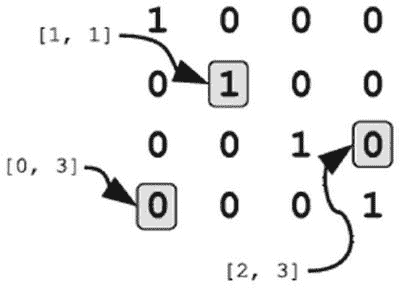
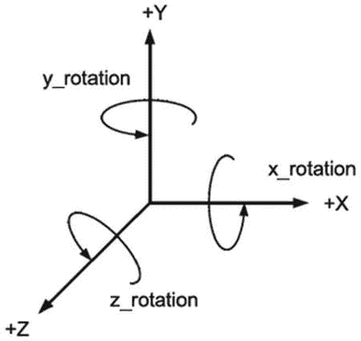
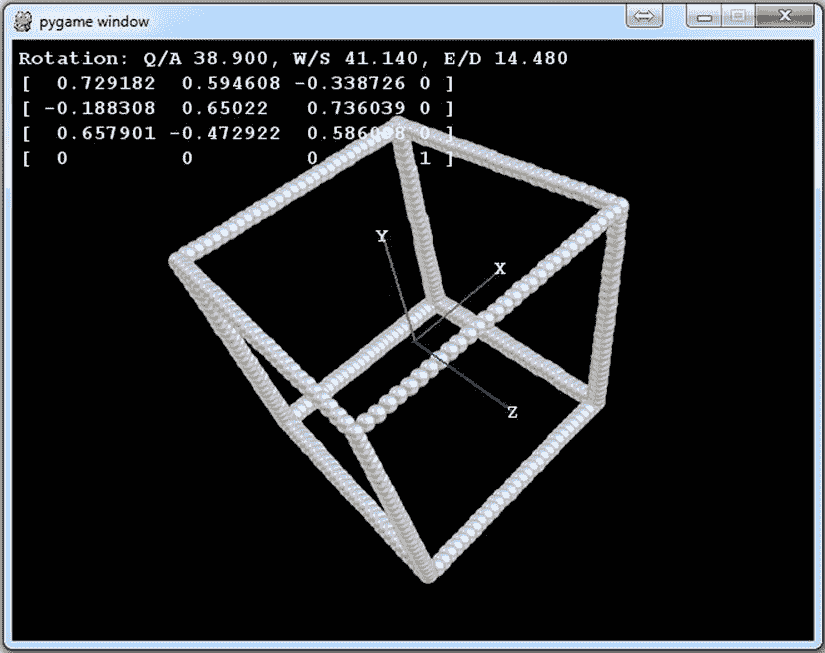
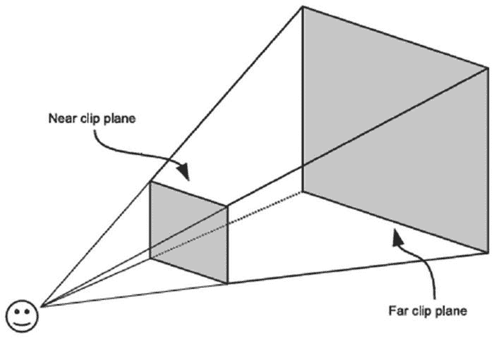
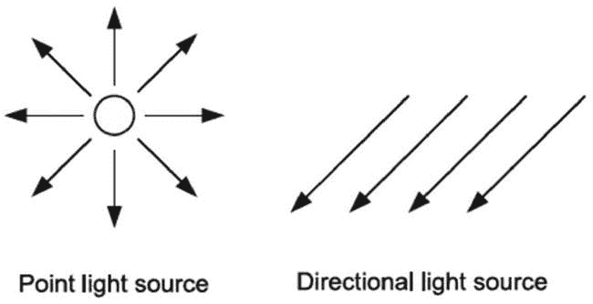
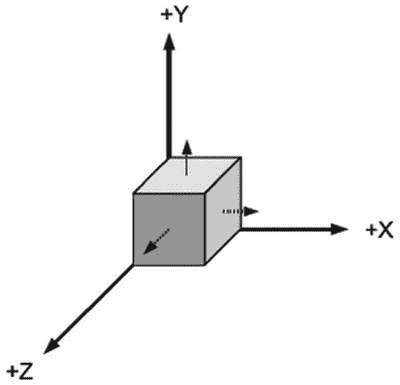
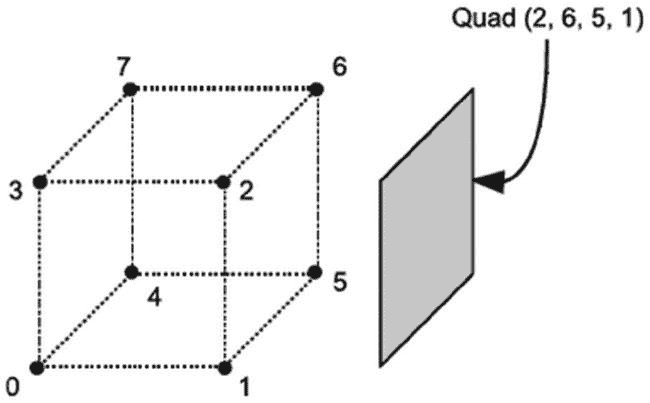
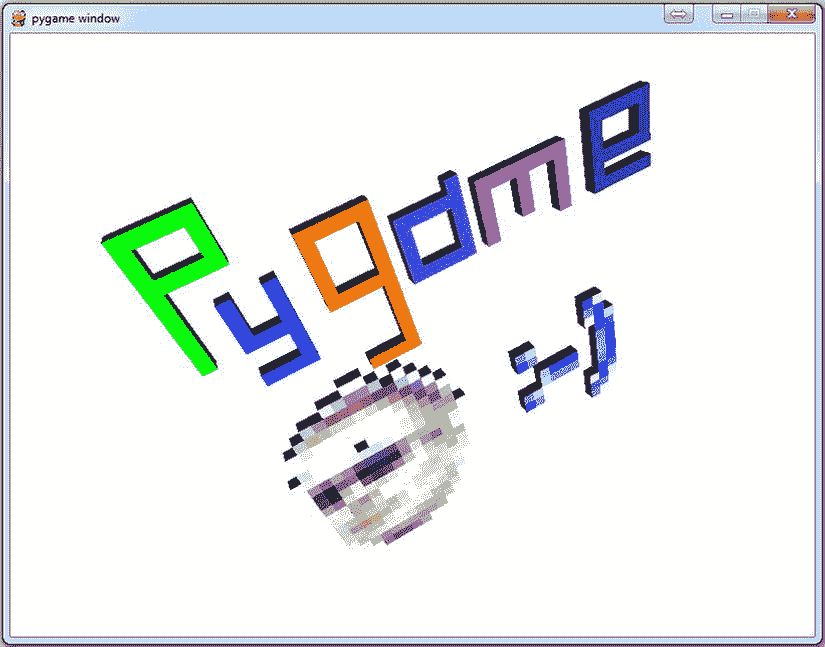

# 九、探索第三维度

您已经看到了如何在三维空间中获取一个点，然后*将它投影到屏幕上*，以便可以对其进行渲染。投影只是渲染 3D 场景过程的一部分；您还需要操纵游戏中的点来逐帧更新场景。本章介绍了*矩阵*，这是一种数学捷径，用于操纵游戏中物体的位置和方向。

您还将了解如何使用 Pygame 和 OpenGL 来访问显卡的 3D 图形功能，从而创建令人印象深刻的视觉效果，与商业游戏不相上下。

什么是矩阵？

早在电影《T1》之前，数学家和游戏程序员就已经在使用矩阵了。矩阵是任意大小的数字网格，但在 3D 图形中，最有用的矩阵是 4 × 4 矩阵。本节介绍如何使用矩阵在 3D 世界中定位对象。

描述一个 3D 物体在游戏中的样子需要一些不同的信息，但是它的基本形状是由一系列的点定义的。在前一章中，我们通过沿着立方体的边缘构建一系列点来创建一个立方体的模型。更典型地，游戏模型的点数列表是从用专用软件创建的文件中读取的。无论模型是如何创建的，它都必须被放置在游戏世界中的某个位置，指向适当的方向，并且可能被缩放到新的大小。3D 模型中点的这些*变换*是用矩阵完成的。

理解矩阵如何工作需要大量的数学知识，这超出了本书的范围。幸运的是，你不需要知道它们是如何工作的就能使用它们。更重要的是理解矩阵的作用，以及它们如何与屏幕上的 3D 图形相关联。这是教科书中通常没有涉及到的内容，也可能是矩阵有一点神秘的名声的原因。让我们来看一个矩阵，并试着理解它。下面是一种最简单的矩阵:

```py
[ 1 0 0 0 ]
[ 0 1 0 0 ]
[ 0 0 1 0 ]
[ 0 0 0 1 ]
```

这个矩阵由排列成四行四列的 16 个数字组成。对于 3D 图形中使用的大多数矩阵，只有前三列不同；第四列将由三个零后跟一个 1 组成。

 **注意**矩阵可以包含任意数量的行和列，但是当我在本书中使用词语*矩阵*时，我指的是 4 × 4 矩阵，通常用于 3D 图形。

前三行表示 3D 空间中的一个轴，它只是指向变换的 x、y 和 z 方向的三个向量。将这三个向量想象成向右、*向上*和*向前*有助于避免与 x、y 和 z 轴混淆。这些矢量总是相对于被变换的对象。例如，如果游戏角色是一个人形男性，那么矩阵可能在他胸部中央的某个地方。右向量将从他的右臂指向外，上向量将从他的头顶指向外，而前向量将通过他的胸部指向前。

第四行是矩阵*平移*，这是坐标(0，0，0)将结束的位置，如果用这个矩阵进行变换的话。因为大多数 3D 对象都是围绕原点建模的，所以您可以将平移视为对象变换后的位置。

如果我们用这个矩阵改造一辆坦克，它会在哪里结束？嗯，平移是(0，0，0)，所以它会在屏幕的中央。*右*向量是(1，0，0)，这意味着坦克的右侧面向 x 轴的方向。*向上*向量为(0，1，0)，面向屏幕正 y 方向的顶部。最后，*向前*向量是(0，0，1)，这将使坦克炮塔直接指向屏幕外。见[图 9-1](#Fig1) 了解矩阵各部分的分解。


[图 9-1](#_Fig1) 。矩阵的组成

 **注**有些书显示矩阵的行和列是翻转的，这样翻译的部分在右列而不是底行。游戏程序员通常使用与本书相同的约定，因为以这种方式在内存中存储矩阵会更有效。

使用矩阵类

游戏对象库包含一个名为`Matrix44`的类，我们可以使用 Pygame。让我们在交互式解释器中试验一下。以下代码显示了如何导入 Matrix44 并开始使用它:

```py
>>> from gameobjects.matrix44 import *
>>> identity = Matrix44()
>>> print(identity)
```

第一行从`gameobjects.matrix44`模块导入`Matrix44`类。第二行创建了一个`Matrix44`对象，默认为单位矩阵，并将其命名为`identity`。第三行将 identity 的值打印到控制台，产生以下输出:

```py
[ 1 0 0 0 ]
[ 0 1 0 0 ]
[ 0 0 1 0 ]
[ 0 0 0 1 ]
```

让我们看看如果我们用单位矩阵来变换一个点会发生什么。下面的代码创建了一个元组(1.0，2.0，3.0)，我们将使用它来表示一个点(这里也可以使用一个`Vector3`对象)。然后，它使用 matrix 对象的`transform`函数来转换该点，并将结果作为另一个元组返回:

```py
>>> p1 = (1.0, 2.0, 3.0)
>>> identity.transform(p1)
```

这会产生以下输出:

```py
(1.0, 2.0, 3.0)
```

返回的点与`p1`相同，这是我们期望从单位矩阵中得到的。其他矩阵有更有趣(也更有用)的效果，我们将在本章介绍。

小型元件

可以单独访问矩阵的组件(参见[图 9-2](#Fig2) )。您可以使用索引运算符(`[]`)访问单个值，该运算符获取矩阵中您感兴趣的值的行和列。例如，`matrix[3, 1]`返回第 3 行第 1 列的值，而`matrix[3, 1] = 2.0`会将该值设置为 2.0。这个值实际上是矩阵的平移部分的 y 分量，所以改变它将改变一个物体在地面上的高度。



[图 9-2](#_Fig2) 。小型元件

可以通过调用`get_row`方法提取矩阵的各个行，该方法将行作为一个四值元组返回。例如，`matrix.get_row(0)`返回第零行(第一行，x 轴)，而`matrix.get_row(3)`返回最后一行。还有一个等效的`set_row`方法，它接受您想要设置的行的索引，以及一个最多四个值的序列，以复制到该行中。与`Matrix44`类的大多数方法一样，`get_row`和`set_row`处理`Vector3`对象和内置类型。

`Matrix44`类还包含许多可以用来检索行的属性，这比使用行索引更直观。例如，您可以使用属性`m.translate`，而不是使用`m.get_row(3)`来检索矩阵的翻译部分，这具有相同的效果。您也可以用`m.translate = (1, 2, 3)`替换`m.set_row(3, (1, 2, 3))`—两者都会将第 3 行的前三个值设置为`(1, 2, 3)`。[表 9-1](#Tab1) 列出了可用于访问矩阵中行的属性。

[表 9-1](#_Tab1) 。Matrix44 对象的行属性

| 

矩阵属性

 | 

别名

 |
| --- | --- |
| `x_axis` | 第 0 行 |
| `y_axis` | 第一行 |
| `z_axis` | 第 2 行 |
| `right` | 第 0 行 |
| `up` | 第一行 |
| `forward` | 第 2 行 |
| `translate` | 第三排 |

您还可以使用`get_column`和`set_column`来获取和设置矩阵的列，它们的工作方式与 row 方法相同。它们可能没那么有用，因为列不能像行那样提供那么多相关信息。`get_column`的一个用途是检查右列是否为(0，0，0，1)，因为其他任何东西都可能表明代码中有错误。清单 9-1 是一个如何检查矩阵有效性的例子。它使用 Python 的`assert`关键字来检查矩阵的第 3 列。如果第三列是(0，0，0，1)，那么什么都不会发生；否则，Python 会抛出一个`AssertionError`。您不应该捕捉这些类型的异常；它们是 Python 告诉你代码有问题，你应该调查问题的方式。

 **提示**试着养成写断言条件的习惯。它们是早期捕捉代码中问题的好方法。如果想让 Python 忽略代码中的 assert 语句，用`python –O`调用脚本。

[***清单 9-1***](#_list1) 。检查矩阵是否有效

```py
from gameobjects.matrix44 import *

identity = Matrix44()
print(identity)
p1 = (1.0, 2.0, 3.0)
identity.transform(p1)

assert identity.get_column(3) == (0, 0, 0, 1), "Something is wrong with this matrix!"
```

翻译矩阵

一个*平移矩阵*是一个矩阵，它将一个矢量添加到被变换的点上。如果我们用一个转换矩阵来转换一个 3D 模型的点，它将移动这个模型，使它的中心在世界上一个新的坐标上。您可以通过调用`Matrix44.translation`来创建一个平移矩阵，它将平移向量作为三个值。下面的代码创建并显示一个翻译矩阵 :

```py
>>> p1 = (1.0, 2.0, 3.0)
>>> translation = Matrix44.translation(10, 5, 2)
>>> print(translation)
>>> translation.transform(p1)
```

这会产生以下输出:

```py
[  1 0 0 0 ]
[  0 1 0 0 ]
[  0 0 1 0 ]
[ 10 5 2 1 ]
```

转换矩阵的前三行与单位矩阵相同；平移向量存储在最后一行。当`p1`被变换时，它的分量被添加到平移中——与向量相加的方式相同。3D 游戏中的每个对象都必须被翻译；否则，一切都将位于屏幕的中心！

操纵矩阵平移是移动 3D 对象的主要方式。您可以将矩阵的平移行视为对象的坐标，并用基于时间的移动来更新它。清单 9-2 是一个基于当前速度向前移动 3D 模型(这里是坦克)的例子。

[***清单 9-2***](#_list2) 。移动 3D 对象的示例

```py
tank_heading = Vector3(tank_matrix.forward)
tank_matrix.translation += tank_heading * tank_speed * time_passed
```

清单 9-2 中的第一行获取坦克的航向。假设坦克的移动方向与它所指向的方向相同，那么它的前进方向与其`forward`向量(z 轴)相同。第二行通过将坦克的前进方向乘以坦克的速度和经过的时间来计算坦克自上一帧以来移动的距离。然后将得到的向量添加到矩阵平移中。如果在每一帧都这样做，坦克会在它指向的方向上平稳移动。

 **注意**如果矩阵没有缩放，您只能将正向矢量视为一个方向(见下一节)。如果有，那么你必须将前向向量规范化，使它的长度为 1。如果[清单 9-2](#list2) 中的坦克被缩放，你可以用`Vector3(tank_matrix.forward).get_normalized()`计算前进方向。

标度矩阵

比例矩阵 用于改变 3D 对象的大小，可以在游戏中创建有用的效果。例如，如果你有一个生存恐怖游戏，里面有许多僵尸在一个荒凉的城市游荡，如果它们的大小完全相同，看起来可能会有点奇怪。高度上的一点变化会让成群的亡灵看起来更有说服力。比例也可以随时间变化以产生其他视觉效果；快速缩放一个红色球体，让它吞没一个敌人，然后慢慢消失，可以产生一个取悦大众的火球效果。

下面的代码创建了一个缩放矩阵，它将对象的维度加倍。当我们用它来变换`p1`时，我们得到了一个具有两倍于原始分量的点:

```py
>>> scale = Matrix44.scale(2.0)
>>> print(scale)
>>> scale.transform(p1)
```

这会产生以下输出:

```py
[ 2 0 0 0 ]
[ 0 2 0 0 ]
[ 0 0 2 0 ]
[ 0 0 0 1 ]
```

比例值也可以小于 1，这将使模型更小。例如，`Matrix44.scale(0.5)`将创建一个矩阵，使一个三维对象的一半大小。

 **注意**如果你创建一个负比例值的比例矩阵，它会产生翻转一切的效果，使左变成右，上变成下，前变成后！

您还可以为每个轴创建一个具有三个不同值的缩放矩阵，从而在每个方向上以不同的方式缩放对象。例如，`Matrix44.scale(2.0, 0.5, 3.0)`将创建一个矩阵，使一个对象的宽度增加一倍，高度增加一半，深度增加三倍！您不太可能经常需要它，但它可能很有用。例如，要模拟汽车轮胎中的灰尘，可以不均匀地缩放灰尘云的模型，使其看起来像是轮胎扬起的。

要推断矩阵的比例，请查看左上角 3 × 3 值中的轴向量。在未缩放的矩阵中，轴的每个向量的长度为 1。对于比例矩阵，每个向量的长度(即幅度)是对应轴的比例。比如`scale`矩阵中的第一个轴向量是(2，0，0)，长度为 2。在所有矩阵中，长度可能不像这样明显，因此这段代码演示了如何寻找 x 轴的刻度:

```py
>>> x_axis_vector = Vector3(scale.x_axis)
>>> print(x_axis_vector.get_magnitude())
```

这会产生以下结果:

```py
2.0
```

旋转矩阵

3D 游戏中的每一个物体都必须在某个点旋转，这样它才能面向合适的方向。大多数东西都面向它们移动的方向，但是你可以将 3D 对象定向到任何你想要的方向。旋转也是吸引注意力的好方法。比如*加电*(弹药，额外生命等。)经常围绕 y 轴旋转，因此它们从背景景色中脱颖而出。

最简单的旋转矩阵是围绕 x、y 或 z 轴的旋转，你可以用`Matrix44`中的`x_rotation`、`y_rotation`和`z_rotation`类方法创建它(参见[图 9-3](#Fig3) )。



[图 9-3](#_Fig3) 。旋转矩阵

为了预测一个点将向哪个方向旋转，想象你自己沿着旋转轴看。正转*逆时针*，负转*顺时针*。让我们在交互式解释器中试验一下。我们将在(0，10，0)，–45 度绕 z 轴旋转一个点(见[图 9-4](#Fig4) )。

```py
>>> z_rotate = Matrix44.z_rotation(radians(–45))
>>> print(z_rotate)
>>> a = (0, 10, 0)
>>> z_rotate.transform(a)
```

这将显示一个 z 旋转矩阵，以及使用它来平移点(0，10，0)的结果:

```py
[ 0.707107     -0.707107        0       0 ]
[ 0.707107      0.707107        0       0 ]
[ 0                    0        1       0 ]
[ 0                    0        0       1 ]
```

如果原始点是指针在 12 点钟的末端，那么变换后的点将位于 1 和 2 之间的中间位置。


[图 9-4](#_Fig4) 。绕 z 轴的旋转

当使用 3D 旋转时，我发现为我的头部可视化一个轴很有帮助，其中(0，0，0)在我大脑的某个地方。x 轴指向我右耳外，y 轴指向我头顶，z 轴指向我鼻子外。如果我绕着 x 轴旋转我的头，我会上下点头。绕 y 轴旋转会让我向左或向右转头。围绕 z 轴的旋转会让我好奇的把头从一边倾斜到另一边。或者，当你考虑旋转时，你可以用你的拇指和前两个手指指向每个轴的正方向，并实际旋转你的手。

矩阵乘法

通常在一个游戏中，你需要对一个 3D 物体进行多次变换。对于一个坦克游戏，你可能想要*平移*到世界上的一个位置，然后*旋转*到它前进的方向。你可以用两个矩阵来改造坦克，但是也可以通过使用*矩阵乘法* 来创建一个具有组合效果的单一矩阵。当你把一个矩阵乘以另一个矩阵时，你得到的是一个完成两种变换的矩阵。让我们通过将两个平移矩阵相乘来测试一下:

```py
>>> translate1 = Matrix44.translation(5, 10, 2)
>>> translate2 = Matrix44.translation(-7, 2, 4)
>>> print(translate1 * translate2)
```

这将打印出`translate1`乘以`translate2`的结果:

```py
[ 1     0       0       0 ]
[ 0     1       0       0 ]
[ 0     0       1       0 ]
[ –2    12      6       1 ]
```

结果也是一个翻译矩阵。矩阵中最后一行(翻译部分)是(–2，12，6)，这是由(5，10，2)和(–7，2，4)翻译的组合效果。矩阵不需要属于相同的类型就可以相乘。让我们试着用一个旋转矩阵乘以一个平移矩阵。下面的代码创建了两个矩阵`translate`和`rotate`，以及一个矩阵`translate_rotate`，它具有两种效果:

```py
>>> translate = Matrix44.translation(5, 10, 0)
>>> rotate = Matrix44.y_rotation(radians(45))
>>> translate_rotate = translate * rotate
>>> print(translate_rotate)
```

这将显示两个矩阵相乘的结果:

```py
[ 0.707107      0       -0.707107       0 ]
[ 0             1       0               0 ]
[ 0.707107      0       0.707107        0 ]
[ 5             10      0               1 ]
```

如果我们用`translate_rotate`变换一辆坦克，它会把它放在坐标(5，10，0)上，绕 y 轴旋转 45 度。

虽然矩阵乘法类似于数字相乘，但有一个显著的区别:乘法的顺序很重要。对于数字，A*B 的结果与 B*A 相同，但如果 A 和 B 是矩阵，这就不成立。我们生成的`translate_rotate`矩阵首先将对象平移到(5，10，0)，然后围绕其中心点旋转它。如果我们以相反的顺序做乘法，得到的矩阵将会不同。下面的代码演示了这一点:

```py
>>> rotate_translate = rotate * translate
>>> print(rotate_translate)
```

这将显示以下矩阵:

```py
[ 0.707107      0       -0.707107       0 ]
[ 0             1       0               0 ]
[ 0.707107      0       0.707107        0 ]
[ 3.535534      10      -3.535534       1 ]
```

如您所见，这导致了不同的矩阵。如果我们用`rotate_translate`转换一个模型，它将首先围绕 y 轴旋转它，然后*然后*平移它，但是因为平移是相对于旋转发生的，所以物体将会在完全不同的地方结束。作为一个经验法则，你应该先做平移，然后是旋转，这样你就可以预测物体的最终位置。

行动矩阵

目前的理论已经足够了；现在让我们运用矩阵和变换的知识来做一个有趣的演示。当你运行[清单 9-3](#list3) 时，你会看到另一个立方体的边缘被精灵渲染。用于转换立方体的矩阵显示在屏幕的左上角。最初的转换是单位矩阵，它将立方体直接放在屏幕的中间，z 轴朝向你。如果我们有一个坦克模型，而不是一个立方体，那么它将在屏幕外面向*，面向你。*

按下 Q 和 A 键，围绕 x 轴旋转立方体；按 W 和 S 使其绕 y 轴旋转；按 E 和 D 键可以绕 z 轴旋转。当立方体旋转时，生成的变换矩阵被显示出来(见[图 9-5](#Fig5) )。查看创建矩阵的代码(粗体);它首先创建一个 x 旋转，然后乘以 y 旋转，再乘以 z 旋转。



[图 9-5](#_Fig5) 。实际的 3D 转换

 **提示**创建关于所有三个轴的变换的一个更快的方法是使用`xyz_rotation`函数，它需要三个角度。

[***清单 9-3***](#_list3) 。矩阵变换在行动(rotation3d.py)

```py
import pygame
from pygame.locals import *
from gameobjects.vector3 import Vector3
from gameobjects.matrix44 import Matrix44 as Matrix
from math import *
from random import randint

SCREEN_SIZE =  (640, 480)
CUBE_SIZE = 300

def calculate_viewing_distance(fov, screen_width):

    d = (screen_width/2.0) / tan(fov/2.0)
    return d

def run():

    pygame.init()
    screen = pygame.display.set_mode(SCREEN_SIZE, 0)

    font = pygame.font.SysFont("courier new", 16, True)

    ball = pygame.image.load("ball.png").convert_alpha()

    points = []

    fov = 75\. # Field of view
    viewing_distance = calculate_viewing_distance(radians(fov), SCREEN_SIZE[0])

    # Create a list of points along the edge of a cube
    for x in range(0, CUBE_SIZE+1, 10):
        edge_x = x == 0 or x == CUBE_SIZE

        for y in range(0, CUBE_SIZE+1, 10):
            edge_y = y == 0 or y == CUBE_SIZE

            for z in range(0, CUBE_SIZE+1, 10):
                edge_z = z == 0 or z == CUBE_SIZE

                if sum((edge_x, edge_y, edge_z)) >= 2:

                    point_x = float(x) - CUBE_SIZE/2
                    point_y = float(y) - CUBE_SIZE/2
                    point_z = float(z) - CUBE_SIZE/2

                    points.append(Vector3(point_x, point_y, point_z))

    def point_z(point):
        return point[2]

    center_x, center_y = SCREEN_SIZE
    center_x /= 2
    center_y /= 2

    ball_w, ball_h = ball.get_size()
    ball_center_x = ball_w / 2
    ball_center_y = ball_h / 2

    camera_position = Vector3(0.0, 0.0, 600.)

    rotation = Vector3()
    rotation_speed = Vector3(radians(20), radians(20), radians(20))

    clock = pygame.time.Clock()

    # Some colors for drawing
    red = (255, 0, 0)
    green = (0, 255, 0)
    blue = (0, 0, 255)
    white = (255, 255, 255)

    # Labels for the axes
    x_surface = font.render("X", True, white)
    y_surface = font.render("Y", True, white)
    z_surface = font.render("Z", True, white)

    while True:

        for event in pygame.event.get():
            if event.type == QUIT:
                pygame.quit()
                quit()

        screen.fill((0, 0, 0))

        time_passed = clock.tick()
        time_passed_seconds = time_passed / 1000.

        rotation_direction = Vector3()

        #Adjust the rotation direction depending on key presses
        pressed_keys = pygame.key.get_pressed()

        if pressed_keys[K_q]:
            rotation_direction.x = +1.0
        elif pressed_keys[K_a]:
            rotation_direction.x = -1.0

        if pressed_keys[K_w]:
            rotation_direction.y = +1.0
        elif pressed_keys[K_s]:
            rotation_direction.y = -1.0

        if pressed_keys[K_e]:
            rotation_direction.z = +1.0
        elif pressed_keys[K_d]:
            rotation_direction.z = -1.0

        # Apply time based movement to rotation
        rotation += rotation_direction * rotation_speed * time_passed_seconds

        # Build the rotation matrix
        rotation_matrix = Matrix.x_rotation(rotation.x)
        rotation_matrix *= Matrix.y_rotation(rotation.y)
        rotation_matrix *= Matrix.z_rotation(rotation.z)

        transformed_points = []

        # Transform all the points and adjust for camera position
        for point in points:

            p = rotation_matrix.transform_vec3(point) - camera_position

            transformed_points.append(p)

        transformed_points.sort(key=point_z)

        # Perspective project and blit all the points
        for x, y, z in transformed_points:

            if z < 0:
                x = center_x + x * -viewing_distance / z
                y = center_y + -y * -viewing_distance / z

                screen.blit(ball, (x-ball_center_x, y-ball_center_y))

        # Function to draw a single axes, see below
        def draw_axis(color, axis, label):

            axis = rotation_matrix.transform_vec3(axis * 150.)
            SCREEN_SIZE =  (640, 480)
            center_x = SCREEN_SIZE[0] / 2.0
            center_y = SCREEN_SIZE[1] / 2.0
            x, y, z = axis - camera_position

            x = center_x + x * -viewing_distance / z
            y = center_y + -y * -viewing_distance / z

            pygame.draw.line(screen, color, (center_x, center_y), (x, y), 2)

            w, h = label.get_size()
            screen.blit(label, (x-w/2, y-h/2))

        # Draw the x, y and z axes
        x_axis = Vector3(1, 0, 0)
        y_axis = Vector3(0, 1, 0)
        z_axis = Vector3(0, 0, 1)

        draw_axis(red, x_axis, x_surface)
        draw_axis(green, y_axis, y_surface)
        draw_axis(blue, z_axis, z_surface)

        # Display rotation information on screen
        degrees_txt = tuple(degrees(r) for r in rotation)
        rotation_txt = "Rotation: Q/A %.3f, W/S %.3f, E/D %.3f" % degrees_txt
        txt_surface = font.render(rotation_txt, True, white)
        screen.blit(txt_surface, (5, 5))

        # Displat the rotation matrix on screen
        matrix_txt = str(rotation_matrix)
        txt_y = 25
        for line in matrix_txt.split('\n'):
            txt_surface = font.render(line, True, white)
            screen.blit(txt_surface, (5, txt_y))
            txt_y += 20

        pygame.display.update()

if __name__ == "__main__":
    run()

```

清单 9-3 中的矩阵将立方体的点转换到它们在屏幕上的最终位置。游戏在渲染 3D 世界的过程中会进行许多这样的转换，并且拥有比 2D 精灵更复杂的图形。在接下来的部分，你将学习如何*连接*模型中的点，并使用光照来创建立体的 3D 模型。

OpenGL 简介

今天的图形卡配备了专用于绘制 3D 图形的芯片，但情况并非总是如此；在家用电脑上 3D 游戏的早期，程序员必须编写代码来绘制每个游戏的图形。在软件中绘制多边形(游戏中使用的形状)非常耗时，因为处理器必须单独计算每个像素。当具有 3D 加速功能的显卡变得流行时，它们释放了处理器来处理游戏的其他方面，如人工智能，从而产生了外观更好、游戏性更丰富的游戏。

OpenGL 是一个应用编程接口(API ),用于处理图形卡的 3D 功能。还有其他的 3D API，但是我们将使用 OpenGL，因为它很好地支持跨平台；OpenGL 驱动的游戏可以在许多不同的计算机和控制台上运行。它默认安装在 Pygame 运行的所有主要平台上，通常作为图形驱动的一部分。

在 Pygame 中使用 OpenGL 有一个缺点。对于一个 OpenGL 游戏，你不能从一个表面 blit 到屏幕上，或者用任何`pygame.draw`函数直接画到屏幕上。你*可以*使用任何其他不画到屏幕上的 Pygame 模块，比如`pygame.key`、`pygame.time`和`pygame.image`。使用 OpenGL 时，Pygame 脚本的事件循环和一般结构不会改变，因此您仍然可以应用在前面章节中学到的知识。

安装 PyOpenGL

虽然 OpenGL 可能已经安装在您的系统上，但是您仍然需要安装 PyOpenGL，这是一个用 Python 语言连接您计算机上的 OpenGL 驱动程序的模块。你可以用 pip 安装 PyOpenGL，方法是打开 cmd.exe、bash 或者你碰巧使用的 shell，然后做:

```py
pip install PyOpenGL
```

有关 PyOpenGL 的更多信息，请访问该项目的网站`http://pyopengl.sourceforge.net/`。关于 OpenGL 的最新消息，请看`http://www.opengl.org/` `.`

 **提示** Easy Install 是一个非常有用的工具，因为它可以自动找到并安装大量的 Python 模块。

正在初始化 OpenGL

PyOpenGL 模块由许多函数组成，这些函数可以用一行代码导入:

```py
from OpenGL.GL import *
```

这一行导入的是以`gl`开头的 OpenGL 函数，比如`glVertex`，我们后面会讲到。要开始在 PyGame 中使用 PyOpenGL，您几乎总是需要以下导入:

```py
from OpenGL.GL import *
from OpenGL.GLU import *
import pygame
from pygame.locals import *
```

包含一些我们将要使用的屏幕定义，OpenGL。GL 和 OpenGL。GLU 是 OpenGL 的核心模块。

在使用这些模块中的任何函数之前，您必须首先告诉 Pygame 创建一个 OpenGL 显示表面。虽然这个表面不同于典型的 2D 显示表面，但它是用`pygame.display.set_mode`函数以通常的方式创建的。下面一行创建了一个名为`screen`的 640 × 480 的 OpenGL 表面:

```py
screen = pygame.display.set_mode((640, 480), HWSURFACE|OPENGL|DOUBLEBUF)
```

`OPENGL`标志告诉 Pygame 创建一个 OpenGL 表面；`HWSURFACE`在硬件中创建，对加速 3D 很重要；而`DOUBLEBUF`使其双缓冲，减少闪烁。您可能还想添加`FULLSCREEN`来扩展显示以填充整个屏幕，但在开发时以窗口模式工作会很方便。

OpenGL 优先

OpenGL 包含几个矩阵，应用于你在屏幕上绘制的坐标。最常用的两种叫做`GL_PROJECTION`和`GL_MODELVIEW`。投影矩阵(`GL_PROJECTION`)获取一个 3D 坐标，并将其投影到 2D 空间，以便将其渲染到屏幕上。在我们的 3D 实验中，我们一直在手动进行这一步——它基本上是乘以*视角距离*并除以 z 分量。*模型视图*矩阵实际上是两个矩阵的组合:*模型*矩阵变换(平移、缩放、旋转等。)模型在世界中的位置和*视图*矩阵调整对象相对于摄像机(通常是玩家角色的视点)。

调整显示大小

在我们开始在屏幕上绘制任何东西之前，我们首先必须告诉 OpenGL 显示器的尺寸，并设置好`GL_PROJECTION`和`GL_MODELVIEW`矩阵(见[清单 9-4](#list4) )。

[***清单 9-4***](#_list4) 。调整视口大小

```py
def resize(width, height):
    glViewport(0, 0, width, height)
    glMatrixMode(GL_PROJECTION)
    glLoadIdentity()
    gluPerspective(60, float(width)/height, 1, 10000)
    glMatrixMode(GL_MODELVIEW)
    glLoadIdentity()
```

[清单 9-4](#list4) 中的`resize`函数获取屏幕的宽度和高度，并且应该在显示初始化或屏幕尺寸改变时调用。对`glViewport`的调用告诉 OpenGL 我们要使用坐标为(0，0)的屏幕区域，大小为(`width`，`height`)，也就是整个屏幕。下一行调用`glMatrixMode(GL_PROJECTION)`，它告诉 OpenGL 所有进一步的矩阵调用都将应用于投影矩阵。接下来是对`glLoadIdentity`的调用，它将投影矩阵重置为 identity，以及对`gluPerspective`(来自 GLU 库)的调用，它设置一个标准的透视投影矩阵。这个函数有四个参数:摄像机的视野，长宽比(宽度除以高度)，然后是近剪裁平面和远剪裁平面。这些剪裁平面定义了可以“看见”的距离范围；玩家看不到任何超出这个范围的东西。3D 屏幕中的可视区域被称为可视*平截头体* (参见[图 9-6](#Fig6) )，它类似于顶部被切掉一部分的金字塔。



[图 9-6](#_Fig6) 。观察平截头体

正在初始化 OpenGL 功能

`resize`函数足以开始使用 OpenGL 函数来渲染屏幕，但是我们应该设置一些其他的东西来使它更有趣(参见[清单 9-5](#list5) )。

[***清单 9-5***](#_list5) 。正在初始化 OpenGL

```py
def init():

    glEnable(GL_DEPTH_TEST)
    glClearColor(1.0, 1.0, 1.0, 0.0)

    glShadeModel(GL_FLAT)
    glEnable(GL_COLOR_MATERIAL)

    glEnable(GL_LIGHTING)
    glEnable(GL_LIGHT0)
    glLight(GL_LIGHT0, GL_POSITION, (0, 1, 1, 0))
```

`init`函数做的第一件事是用`GL_DEPTH_TEST`调用`glEnable`，它告诉 OpenGL 启用 *Z 缓冲区*。这确保了远离相机的对象不会被绘制在靠近相机的对象上，而不管我们在代码中绘制它们的顺序如何。

`glEnable`函数用于启用 OpenGL 特性，`glDisable`用于禁用 OpenGL 特性。这两个函数都采用以`GL_`开头的大写常量之一。我们将在本书中介绍一些你可以在游戏中使用的元素，但是完整的列表请参见 OpenGL 文档。

`init`中的第二行设置了*的清晰颜色*，这是屏幕上未绘制部分的颜色(相当于在 2D 示例代码中自动调用`screen.fill`)。在 OpenGL 中，颜色以红色、绿色、蓝色和 alpha 分量的四个值给出，但不是 0 到 255 之间的值，而是使用 0 到 1 之间的值。

函数中的其余行初始化 OpenGL 的照明功能，该功能根据 3D 世界中大量灯光的位置自动为 3D 对象着色。对`glShadeModel`的调用将着色模型设置为`GL_FLAT`，用于着色多面物体，如立方体或任何有边缘表面的物体。阴影模型的另一个设置是`GL_SMOOTH`，它更适合给弯曲的物体加阴影。对`glEnable(GL_COLOR_MATERIAL)`的调用告诉 OpenGL 我们想要启用*材质*，这是定义表面如何与光源交互的设置。例如，我们可以通过调整其材质属性，使球体看起来像大理石一样高度抛光，或者像一块水果一样柔软。

清单 9-5 的剩余部分启用照明(`glEnable(GL_LIGHTING)`)和零照明(`glEnable(GL_LIGHT0)`)。在 OpenGL 中你可以打开许多不同的灯；它们被编号为`GL_LIGHT0`、`GL_LIGHT1`、`GL_LIGHT2`等等。在一个游戏中，你至少要有一个灯光(可能是太阳的)，和其他的灯光，比如头灯，灯，或者特效。例如，在火球效果中放置光源将确保它照亮周围的地形。

最后一行将灯光零点的位置设置为(0，1，1，0)。这个元组中的前三个值是光线的 x、y 和 z 坐标；最后一个值告诉 OpenGL 使其成为一个*方向*光，这将创建一个具有平行光线的光源，类似于太阳。如果最后一个值是 1，OpenGL 创建一个点光源，看起来像一个特写镜头，如灯泡，蜡烛，或等离子火球。点光源和定向光源的区别见[图 9-7](#Fig7) 。

 **提示**你可以通过`glGetInteger(GL_MAX_LIGHTS)`获得你的 OpenGL 驱动支持的灯光数量。通常您会得到八个，但它会根据您的平台而有所不同。



[图 9-7](#_Fig7) 。OpenGL 光源

三维绘图

现在我们已经初始化了 OpenGL 并创建了光源，我们可以开始绘制 3D 形状了。OpenGL 支持许多可以用来构建 3D 场景的*图元*，比如点、线和三角形。根据原语的类型和启用的 OpenGL 特性，每一个都需要一些信息。正因为如此，在 2D Pygame 中，每个原语没有单一的函数。这些信息是在一些函数调用中给出的，当 OpenGL 获得了所有需要的信息后，它就可以绘制图元了。

要在 OpenGL 中绘制一个图元，首先调用`glBegin`，用一个图元常量(见[表 9-2](#Tab2) )。接下来，向 OpenGL 发送绘制图元所需的信息。它至少需要一些 3D 点，用`glVertex`函数指定(一个*顶点*是形成形状的一部分的点)，但是你可以给它其他信息，比如用`glColor`函数给它颜色。一旦给出了所有的信息，调用`glEnd`，它告诉 OpenGL 所有的信息都已经提供了，可以用它来绘制图元。

 **注意**对`glVertex`的调用应该总是在一个顶点的其他信息被给出之后。

表 9-2 。OpenGL 图元

| 

常数

 | 

原始的

 |
| --- | --- |
| `GL_POINTS` | 画点 |
| `GL_LINES` | 绘制单独的线条 |
| `GL_LINE_STRIP` | 绘制连接线 |
| `GL_LINE_LOOP` | 绘制连接线，最后一个点连接到第一个点 |
| `GL_TRIANGLES` | 绘制三角形 |
| `GL_TRIANGLE_STRIPS` | 绘制三角形，其中每个附加顶点与前面两个顶点形成一个新的三角形 |
| `GL_QUADS` | 绘制四边形(有四个顶点的形状) |
| `GL_QUAD_STRIP` | 绘制四边形条带，其中每两个顶点都与前两个顶点相连 |
| `GL_POLYGON` | 绘制多边形(具有任意数量顶点的形状) |

清单 9-6 是一个如何用 OpenGL 绘制红色方块的例子。第一行告诉 OpenGL 你想画四边形(有四个点的形状)。下一行发送红色(1.0，0.0，0.0)，所以在下一次调用`glColor`之前，所有顶点都是红色的。对`glVertex`的四次调用发送了正方形每个角的坐标，最后，对`glEnd`的调用告诉 OpenGL 你已经完成了顶点信息的发送。有了四个顶点，OpenGL 可以绘制一个四边形，但是如果你给它更多的顶点，它会为你发送的每四个顶点绘制一个四边形。

[***清单 9-6***](#_list6) 。绘制红色方块的伪代码

```py
glBegin(GL_QUADS)
glColor(1.0, 0.0, 0.0) # Red
glVertex(100.0, 100.0, 0.0) # Top left
glVertex(200.0, 100.0, 0.0) # Top right
glVertex(200.0, 200.0, 0.0) # Bottom right
glVertex(100.0, 200.0, 0.0) # Bottom left

glEnd()
```

标准

如果您启用了 OpenGL 光照，您将需要发送一条称为*法线*的图元附加信息，它是一个面向 3D 形状外部的单位向量(长度为 1.0 的向量)。该向量对于计算场景中灯光的明暗度是必需的。例如，如果你在屏幕中心有一个立方体沿轴对齐，正面的法线是(0，0，1)，因为它正对着 z 轴，而右边的法线是(1，0，0)，因为它正对着 x 轴(见[图 9-8](#Fig8) )。

要向 OpenGL 发送一个法线，使用`glNormal3d`函数，它为法线向量取三个值，或者使用`glNormal3dv`函数，它取三个值的*序列*。例如，如果清单 9-6 中的正方形是一个立方体的正面，你可以用`glNormal3d(0, 0, 1)`或`glNormal3dv(front_vector)`设置法线。后者很有用，因为它可以和`Vector3`对象一起使用。如果你使用平面阴影(`glShadeModel(GL_FLAT)`)，你将需要每个面一个法线。对于平滑着色(`glShadeModel(GL_SMOOTH)`)，你需要提供一个每个顶点的法线。



[图 9-8](#_Fig8) 。立方体的法线

显示列表

如果你有很多图元要画——这是 3D 游戏的典型情况——那么进行所有必要的调用来把它们都画出来会很慢。一次将许多图元发送到 OpenGL 比一次发送一个更快。有几种方法可以做到这一点，但最简单的方法之一是使用*显示列表*。

你可以把一个显示列表想象成一些已经被记录下来的 OpenGL 函数调用，并且可以以最高速度回放。要创建显示列表，首先调用`glGenLists(1)`，它返回一个`id`值来标识显示列表。然后用`id`和常量`GL_COMPILE`调用`glNewList`，开始*编译*显示列表。当你完成发送原语到 OpenGL 后，调用`glEndList`结束编译过程。一旦你编译了显示列表，用`id`调用`glCallList`以最大速度绘制记录的图元。显示列表可以让你创建和商业产品一样快的游戏，所以养成使用它们的习惯是个好主意！清单 9-7 是一个如何创建一个显示列表来绘制坦克模型的例子。它假设有一个函数`draw_tank`，该函数将图元发送到 OpenGL。

一旦你创建了一个显示列表，你可以通过在每次调用`glCallList(tank_display_id)`之前设置不同的变换矩阵，在同一个场景中多次绘制它。

[***清单 9-7***](#_list7) 。创建显示列表

```py
# Create a display list
tank_display_list = glGenLists(1)
glNewList(tank_display_list, GL_COMPILE)

draw_tank()

# End the display list
glEndList()
```

存储 3D 模型

3D 对象是图元的集合，通常是三角形或四边形，它们构成了更大形状的一部分。例如，可以用六个四边形创建一个立方体，每边一个。更复杂的形状，尤其是像人或长着虫眼的外星人这样的有机形状，需要更多的图元来创建。存储模型最有效的方法是保存一个顶点列表，以及关于使用哪些点来绘制面(图元)的附加信息。例如，一个立方体可以存储为六个顶点(每个角一个)，而面将作为四个索引存储到列表中(见[图 9-9](#Fig9) )。

这是模型在 3D 编辑软件生成的文件中的典型存储方式。虽然有各种不同的格式，但它们都包含一个顶点列表和一个连接顶点和图元的索引列表。我们将在本书的后面讨论如何阅读这些模型。



[图 9-9](#_Fig9) 。面和顶点

观看 OpenGL 的运行

我们在一章中已经讲了足够多的理论；让我们把我们所学的付诸实践。我们将使用 OpenGL 创建一个非常简单的由立方体组成的世界，并给玩家飞行和探索的能力。

当你运行[清单 9-8](#list8) 时，你会发现自己置身于一个五颜六色的迷宫。使用左右光标键左右平移，使用 Q 和 A 键前后移动。效果很像第一人称射击游戏，但如果你按下向上或向下光标键，你会发现你实际上可以在 3D 世界的上方或下方飞行(见[图 9-10](#Fig10) )。如果你按 Z 或 X 键，你也可以*滚动*摄像机。

那么这个世界是怎么创造的呢？清单 9-8 中[的`Map`类读入一个小位图(`map.png`)并遍历每个像素。当它找到一个非白色像素时，它会在 3D 中的相应点创建一个彩色立方体。`Cube`类包含一个顶点、法线和*法线索引*的列表，这些索引定义了立方体的每条边使用了哪些顶点，它使用这些信息来绘制六条边。](#list8)

整个世界通过一个单独的摄像机矩阵(`camera_matrix`)进行变换，当用户按下按键时，该矩阵被修改。当用户旋转相机时，该矩阵乘以旋转矩阵，并且平移行被调整以向前和向后移动相机。旋转和平移都使用熟悉的基于时间的计算来提供一致的速度。

在渲染 3D 世界之前，我们必须将相机矩阵发送到 OpenGL。下面的代码行*上传*相机矩阵到 OpenGL:

```py
glLoadMatrixd(camera_matrix.get_inverse().to_opengl())
```

`get_inverse`函数返回矩阵的*逆*，这是一个与原始矩阵完全相反的矩阵。我们之所以用反的，而不是原的，是因为我们想把世界上的一切都转换成相对于相机的。换句话说，如果你正直视一个物体，并把头转向右边，那么这个物体现在在你视野的左边*T4。相机矩阵也一样；世界正以相反的方式转变。*

`Matrix44`的`to_opengl`函数将矩阵转换为单个列表，这是`glLostMatrixd`将矩阵发送到 OpenGL 所需的格式。一旦发送了矩阵，3D 世界中的一切都将被转换成与摄像机相关。

 **注意**这可能看起来有点奇怪，但是当你在一个 3D 世界里移动相机时，你实际上是在改变世界而不是相机！



[图 9-10](#_Fig10) 。立方体世界

[***清单 9-8***](#_list8) 。在立方体世界飞来飞去！(firstopengl.py)

```py
from math import radians

from OpenGL.GL import *
from OpenGL.GLU import *

import pygame
from pygame.locals import *

from gameobjects.matrix44 import *
from gameobjects.vector3 import *

SCREEN_SIZE = (800, 600)

def resize(width, height):

    glViewport(0, 0, width, height)
    glMatrixMode(GL_PROJECTION)
    glLoadIdentity()
    gluPerspective(60.0, float(width)/height, .1, 1000.)
    glMatrixMode(GL_MODELVIEW)
    glLoadIdentity()

def init():

    glEnable(GL_DEPTH_TEST)

    glShadeModel(GL_FLAT)
    glClearColor(1.0, 1.0, 1.0, 0.0)

    glEnable(GL_COLOR_MATERIAL)

    glEnable(GL_LIGHTING)
    glEnable(GL_LIGHT0)
    glLight(GL_LIGHT0, GL_POSITION,  (0, 1, 1, 0))

class Cube(object):

    def __init__(self, position, color):

        self.position = position
        self.color = color

    # Cube information

    num_faces = 6

    vertices = [ (0.0, 0.0, 1.0),
                 (1.0, 0.0, 1.0),
                 (1.0, 1.0, 1.0),
                 (0.0, 1.0, 1.0),
                 (0.0, 0.0, 0.0),
                 (1.0, 0.0, 0.0),
                 (1.0, 1.0, 0.0),
                 (0.0, 1.0, 0.0) ]

    normals = [ (0.0, 0.0, +1.0),  # front
                (0.0, 0.0, -1.0),  # back
                (+1.0, 0.0, 0.0),  # right
                (-1.0, 0.0, 0.0),  # left
                (0.0, +1.0, 0.0),  # top
                (0.0, -1.0, 0.0) ] # bottom

    vertex_indices = [ (0, 1, 2, 3),  # front
                       (4, 5, 6, 7),  # back
                       (1, 5, 6, 2),  # right
                       (0, 4, 7, 3),  # left
                       (3, 2, 6, 7),  # top
                       (0, 1, 5, 4) ] # bottom

    def render(self):

        # Set the cube color, applies to all vertices till next call
        glColor( self.color )

        # Adjust all the vertices so that the cube is at self.position
        vertices = []
        for v in self.vertices:
            vertices.append( tuple(Vector3(v)+ self.position) )

        # Draw all 6 faces of the cube
        glBegin(GL_QUADS)

        for face:no in range(self.num_faces):

            glNormal3dv( self.normals[face:no] )

            v1, v2, v3, v4 = self.vertex_indices[face:no]

            glVertex( vertices[v1] )
            glVertex( vertices[v2] )
            glVertex( vertices[v3] )
            glVertex( vertices[v4] )

        glEnd()

class Map(object):

    def __init__(self):

        map_surface = pygame.image.load("map.png")
        map_surface.lock()

        w, h = map_surface.get_size()

        self.cubes = []

        # Create a cube for every non-white pixel
        for y in range(h):
            for x in range(w):

                r, g, b, a = map_surface.get_at((x, y))

                if (r, g, b) != (255, 255, 255):

                    gl_col = (r/255.0, g/255.0, b/255.0)
                    position = (float(x), 0.0, float(y))
                    cube = Cube( position, gl_col )
                    self.cubes.append(cube)

        map_surface.unlock()

        self.display_list = None

    def render(self):

        if self.display_list is None:

            # Create a display list
            self.display_list = glGenLists(1)
            glNewList(self.display_list, GL_COMPILE)

            # Draw the cubes
            for cube in self.cubes:
                cube.render()

            # End the display list
            glEndList()

        else:

            # Render the display list
            glCallList(self.display_list)

def run():

    pygame.init()
    screen = pygame.display.set_mode(SCREEN_SIZE, HWSURFACE|OPENGL|DOUBLEBUF)

    resize(*SCREEN_SIZE)
    init()

    clock = pygame.time.Clock()

    # This object renders the 'map'
    map = Map()

    # Camera transform matrix
    camera_matrix = Matrix44()
    camera_matrix.translate = (10.0, .6, 10.0)

    # Initialize speeds and directions
    rotation_direction = Vector3()
    rotation_speed = radians(90.0)
    movement_direction = Vector3()
    movement_speed = 5.0

    while True:

        for event in pygame.event.get():
            if event.type == QUIT:
                pygame.quit()
        quit()
            if event.type == KEYUP and event.key == K_ESCAPE:
                pygame.quit()
        quit()

        # Clear the screen, and z-buffer
        glClear(GL_COLOR_BUFFER_BIT | GL_DEPTH_BUFFER_BIT);

        time_passed = clock.tick()
        time_passed_seconds = time_passed / 1000.

        pressed = pygame.key.get_pressed()

        # Reset rotation and movement directions
        rotation_direction.set(0.0, 0.0, 0.0)
        movement_direction.set(0.0, 0.0, 0.0)

        # Modify direction vectors for key presses
        if pressed[K_LEFT]:
            rotation_direction.y = +1.0
        elif pressed[K_RIGHT]:
            rotation_direction.y = -1.0
        if pressed[K_UP]:
            rotation_direction.x = -1.0
        elif pressed[K_DOWN]:
            rotation_direction.x = +1.0
        if pressed[K_z]:
            rotation_direction.z = -1.0
        elif pressed[K_x]:
            rotation_direction.z = +1.0
        if pressed[K_q]:
            movement_direction.z = -1.0
        elif pressed[K_a]:
            movement_direction.z = +1.0

        # Calculate rotation matrix and multiply by camera matrix
        rotation = rotation_direction * rotation_speed * time_passed_seconds
        rotation_matrix = Matrix44.xyz_rotation(*rotation)
        camera_matrix *= rotation_matrix

        # Calcluate movment and add it to camera matrix translate
        heading = Vector3(camera_matrix.forward)
        movement = heading * movement_direction.z * movement_speed
        camera_matrix.translate += movement * time_passed_seconds

        # Upload the inverse camera matrix to OpenGL
        glLoadMatrixd(camera_matrix.get_inverse().to_opengl())

        # Light must be transformed as well
        glLight(GL_LIGHT0, GL_POSITION,  (0, 1.5, 1, 0))

        # Render the map
        map.render()

        # Show the screen
        pygame.display.flip()

if __name__ == "__main__":
    run()
```

摘要

这一章我们已经讲了很多内容。我们从矩阵开始，这是一个重要的话题，因为它们在 3D 游戏中无处不在，包括手持设备和游戏机。处理矩阵的数学可能很吓人，但是如果你使用一个预建的矩阵类，比如`gameobjects.Matrix44`，你不需要知道它们如何工作的细节(大多数游戏程序员不是数学家)！更重要的是，你知道如何结合平移，旋转和缩放来操纵游戏中的对象。从矩阵的数字网格中可视化矩阵也是一项有用的技能，如果你的游戏出了问题，它将帮助你修复错误。

您还学习了如何使用 OpenGL 创建 3D 视觉效果。OpenGL 是一个庞大而强大的 API，我们只是触及了它的一部分。我们介绍了如何存储 3D 模型并将其发送到 OpenGL 进行渲染的基础知识，即使启用了更多的 OpenGL 功能，我们也可以利用这些知识。后面的章节将描述如何添加纹理和透明度，以创建真正令人印象深刻的视觉效果！

清单 9-8 是任何 OpenGL 实验的良好起点。尝试调整一些值来产生不同的效果，或者给*立方体世界*添加更多有趣的形状。你甚至可以通过增加几个敌人把它变成一个游戏(见[第 7 章](07.html))。

在下一章中，我们将暂时离开 3D，探索如何在 Pygame 中使用声音。