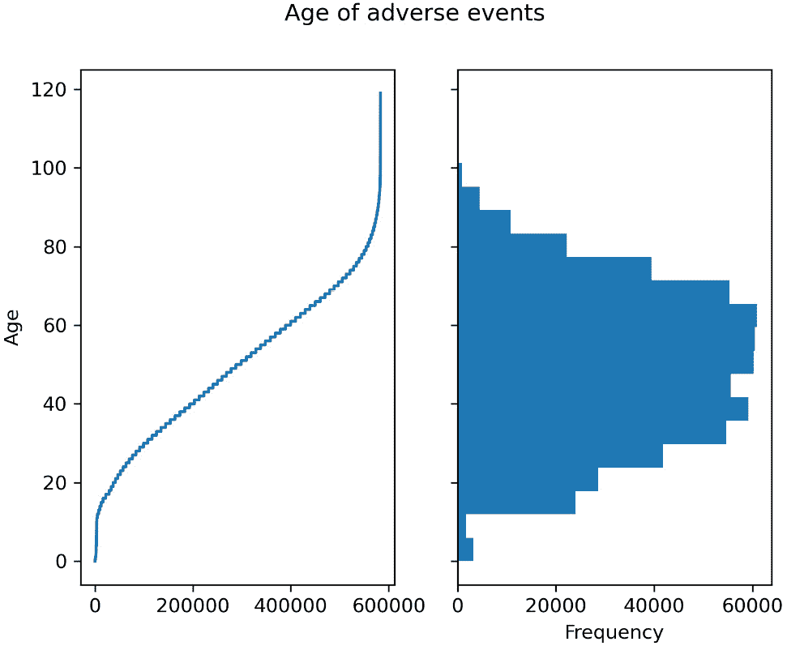
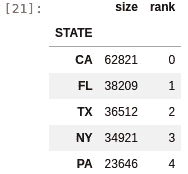
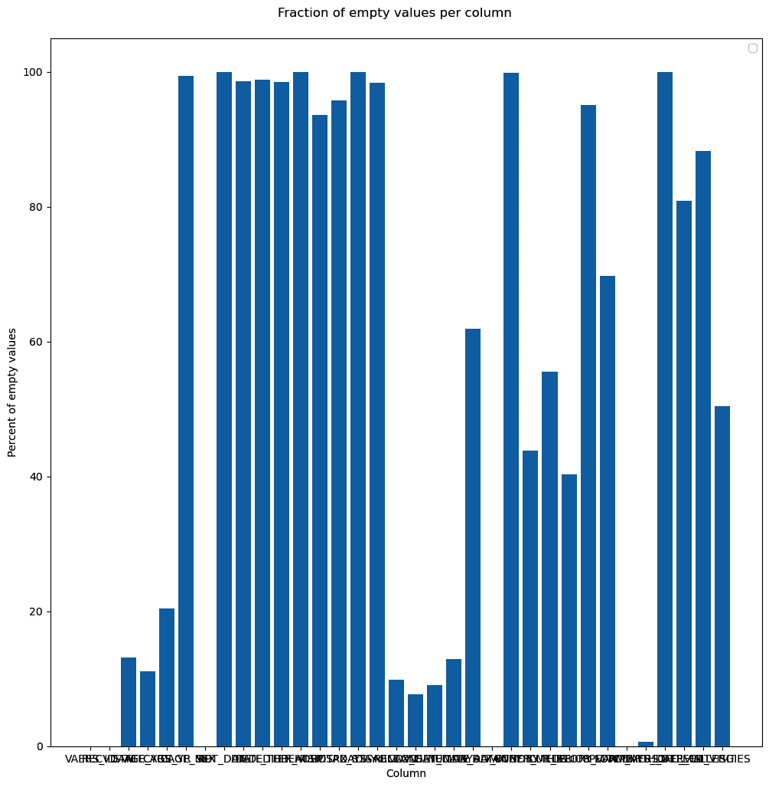

# 二、了解 NumPy、pandas、Arrow 和 Matplotlib

Python 最大的优势之一是它丰富的高质量科学和数据处理库。所有这些的核心是 **NumPy** ，它提供了高效的数组和矩阵支持。在 NumPy 上面，我们可以找到几乎所有的科学图书馆。例如，在我们的领域，有**生物制药**。但是其他通用数据分析库也可以用于我们的领域。例如，**熊猫**是处理表格数据的事实上的*标准。最近， **Apache Arrow** 提供了一些 pandas 功能的高效实现，以及语言互操作性。最后， **Matplotlib** 是 Python 空间中最常见的绘图库，适合科学计算。虽然这些是具有广泛适用性的通用库，但它们是生物信息学处理的基础，所以我们将在本章研究它们。*

我们将从熊猫开始，因为它提供了一个具有广泛实用性的高级库。然后，我们将介绍 Arrow，我们将只在支持熊猫的范围内使用它。之后，我们将讨论 NumPy，它是我们所做的几乎所有事情背后的主力。最后，我们将介绍 Matplotlib。

我们的食谱是非常入门的——这些图书馆中的每一个都很容易占据一整本书，但是食谱应该足以帮助你阅读这本书。如果您正在使用 Docker，并且因为所有这些库都是数据分析的基础，它们可以在来自 [*第 1 章*](01.html#_idTextAnchor020) 的`tiagoantao/bioinformatics_base` Docker 图像中找到。

在本章中，我们将介绍以下配方:

*   用熊猫来处理疫苗不良事件
*   处理加入熊猫数据框架的陷阱
*   减少熊猫数据帧的内存使用
*   用 Apache Arrow 加速 pandas 处理
*   理解 NumPy 是 Python 数据科学和生物信息学背后的引擎
*   介绍用于图表生成的 Matplotlib

# 利用熊猫处理疫苗不良事件

我们将用一个具体的生物信息学数据分析例子来介绍熊猫:我们将研究来自**疫苗不良事件报告系统** ( **VAERS** 、[https://vaers.hhs.gov/](https://vaers.hhs.gov/))的数据。由美国卫生与公众服务部维护的 VAERS 包括一个追溯到 1990 年的疫苗不良事件数据库。

VAERS 让数据以**逗号分隔值** ( **CSV** )格式可用。 CSV 格式非常简单，甚至可以用简单的文本编辑器(小心非常大的文件，因为它们可能会使您的编辑器崩溃)或 Excel 等电子表格打开。熊猫可以很容易地用这种格式工作。

## 准备就绪

首先，我们需要下载数据。在 https://vaers.hhs.gov/data/datasets.xhtml 有售。请下载 ZIP 文件:我们将使用 2021 文件；不要只下载一个 CSV 文件。下载完文件后，解压，然后用`gzip –9 *csv`单独重新压缩所有文件，节省磁盘空间。

您可以使用文本编辑器随意查看这些文件，或者最好使用诸如`less`(对于压缩文件使用`zless`)之类的工具。你可以在[https://vaers . hhs . gov/docs/VAERSDataUseGuide _ en _ September 2021 . pdf](https://vaers.hhs.gov/docs/VAERSDataUseGuide_en_September2021.pdf)找到文件内容的文档。

如果您正在使用笔记本，它们的开头会提供代码，以便您可以负责必要的处理。如果你用的是 Docker，基本镜像就够了。

代码可以在`Chapter02/Pandas_Basic.py`中找到。

## 怎么做...

请遵循以下步骤:

1.  让我们从加载主数据文件和收集基本统计数据开始:

    ```py
    vdata = pd.read_csv(
        "2021VAERSDATA.csv.gz", encoding="iso-8859-1")
    vdata.columns
    vdata.dtypes
    vdata.shape
    ```

我们从加载数据开始。在大多数情况下，不需要担心默认的文本编码，UTF-8，将工作，但在这种情况下，文本编码是`legacy iso-8859-1`。然后，我们打印列名，以`VAERS_ID`、`RECVDATE`、`STATE`、`AGE_YRS`等开始。它们包括对应于每一列的 35 个条目。然后，我们打印每一列的类型。以下是最初的几个条目:

```py
VAERS_ID          int64
RECVDATE         object
STATE            object
AGE_YRS         float64
CAGE_YR         float64
CAGE_MO         float64
SEX              object
```

通过这样做，我们得到数据的形状:`(654986, 35)`。这意味着 654，986 行和 35 列。您可以使用前面的任何策略来获得您需要的关于表元数据的信息。

1.  现在，我们来探究一下数据:

    ```py
    vdata.iloc[0]
    vdata = vdata.set_index("VAERS_ID")
    vdata.loc[916600]
    vdata.head(3)
    vdata.iloc[:3]
    vdata.iloc[:5, 2:4]
    ```

我们可以通过许多方式来查看数据。我们将根据位置从检查第一行开始。以下是节略版:

```py
VAERS_ID                                       916600
RECVDATE                                       01/01/2021
STATE                                          TX
AGE_YRS                                        33.0
CAGE_YR                                        33.0
CAGE_MO                                        NaN
SEX                                            F
…
TODAYS_DATE                                          01/01/2021
BIRTH_DEFECT                                  NaN
OFC_VISIT                                     Y
ER_ED_VISIT                                       NaN
ALLERGIES                                       Pcn and bee venom
```

在我们通过`VAERS_ID`索引之后，我们可以使用一个 ID 来获得一行。我们可以使用 916600(这是前面记录中的 ID)并获得相同的结果。

然后，我们检索前三个行。请注意我们可以用两种不同的方式来做到这一点:

*   使用`head`方法
*   使用更通用的数组规范；也就是`iloc[:3]`

最后，我们检索前五行，但只检索第二和第三列–`iloc[:5, 2:4]`。以下是输出:

```py
 AGE_YRS  CAGE_YR
VAERS_ID 
916600       33.0     33.0
916601       73.0     73.0
916602       23.0     23.0
916603       58.0     58.0
916604       47.0     47.0
```

1.  现在让我们做一些基本的计算，即计算数据集中的最大年龄:

    ```py
    vdata["AGE_YRS"].max()
    vdata.AGE_YRS.max()
    ```

最大值为 119 年。比结果更重要的是，注意访问访问列的两种方言`AGE_YRS`(作为字典键和作为对象字段)。

1.  现在，让我们画出相关的年龄:

    ```py
    vdata["AGE_YRS"].sort_values().plot(use_index=False)
    vdata["AGE_YRS"].plot.hist(bins=20) 
    ```

这将生成两个图(在下面的步骤中显示了一个压缩版本)。我们在这里使用 pandas 绘图机器，它在下面使用 Matplotib。

1.  虽然我们已经有了使用 Matplotlib 制作图表的完整方法(*介绍用于图表生成的 Matplotlib*)，但是让我们通过直接使用它来先睹为快:

    ```py
    import matplotlib.pylot as plt
    fig, ax = plt.subplots(1, 2, sharey=True)
    fig.suptitle("Age of adverse events")
    vdata["AGE_YRS"].sort_values().plot(
        use_index=False, ax=ax[0],
        xlabel="Obervation", ylabel="Age")
    vdata["AGE_YRS"].plot.hist(bins=20, orientation="horizontal")
    ```

这包括前面步骤中的两个数字。以下是输出:



图 2.1–左侧–每次观察不良反应的年龄；右图——显示年龄分布的直方图

1.  我们也可以采取非图形化的、更的分析方法，比如统计每年的事件:

    ```py
    vdata["AGE_YRS"].dropna().apply(lambda x: int(x)).value_counts()
    ```

输出如下所示:

```py
50     11006
65     10948
60     10616
51     10513
58     10362
 ...
```

1.  现在，让我们看看死了多少人:

    ```py
    vdata.DIED.value_counts(dropna=False)
    vdata["is_dead"] = (vdata.DIED == "Y")
    ```

计数的输出如下:

```py
NaN    646450
Y        8536
Name: DIED, dtype: int64
```

请注意，`DIED`的类型是*而不是*布尔值。有一个布尔特征的布尔表示更具有说明性，所以我们为它创建了`is_dead`。

小费

这里，我们假设 NaN 被解释为`False`。总的来说，对南的解读要慎重。这可能意味着`False`或者仅仅意味着——在大多数情况下——缺乏数据。如果是那样的话，就不应该改成`False`。

1.  现在，让我们将死亡的个体数据与所涉及的疫苗类型联系起来:

    ```py
    dead = vdata[vdata.is_dead]
    vax = pd.read_csv("2021VAERSVAX.csv.gz", encoding="iso-8859-1").set_index("VAERS_ID")
    vax.groupby("VAX_TYPE").size().sort_values()
    vax19 = vax[vax.VAX_TYPE == "COVID19"]
    vax19_dead = dead.join(vax19)
    ```

在我们获得仅包含死亡的数据帧后，我们必须读取包含疫苗信息的数据。首先要对疫苗的种类及其不良事件做一些探索性分析。以下是节略输出:

```py
 …
HPV9         1506
FLU4         3342
UNK          7941
VARZOS      11034
COVID19    648723
```

之后，我们必须只选择与 COVID 相关的疫苗，并将它们与个人数据结合起来。

1.  最后，让我们来看看在死亡方面被过度代表的前 10 个 COVID 疫苗批次，以及美国有多少个州受到每个批次的影响:

    ```py
    baddies = vax19_dead.groupby("VAX_LOT").size().sort_values(ascending=False)
    for I, (lot, cnt) in enumerate(baddies.items()):
        print(lot, cnt, len(vax19_dead[vax19_dead.VAX_LOT == lot].groupby""STAT"")))
        if i == 10:
            break
    ```

输出如下所示:

```py
Unknown 254 34
EN6201 120 30
EN5318 102 26
EN6200 101 22
EN6198 90 23
039K20A 89 13
EL3248 87 17
EL9261 86 21
EM9810 84 21
EL9269 76 18
EN6202 75 18
```

这就结束了这个食谱！

## 还有更多...

前面关于疫苗和批次的数据不完全正确；我们将在下一个菜谱中介绍一些数据分析陷阱。

在*介绍用于图表生成的 Matplotlib*配方中，我们将介绍 Matplotlib，一个为 pandas 绘图提供后端的图表库。它是 Python 数据分析生态系统的基础组件。

## 参见

以下是一些可能有用的额外信息:

*   虽然这一章的前三个食谱足以支持你看完这本书，但网上还有很多内容可以帮助你了解熊猫。您可以从主用户指南开始，该指南可在[https://pandas.pydata.org/docs/user_guide/index.xhtml](https://pandas.pydata.org/docs/user_guide/index.xhtml)获得。
*   如果您需要绘制数据，不要忘记查看指南的可视化部分，因为它特别有用:[https://pandas . pydata . org/docs/user _ guide/visualization . XHTML](https://pandas.pydata.org/docs/user_guide/visualization.xhtml)。

# 应对加入熊猫数据框架的陷阱

前一个食谱是一个旋风之旅，介绍了熊猫，并展示了我们将在本书中使用的大多数功能。关于熊猫的详尽讨论需要一本完整的书，在这本食谱中，以及在下一本食谱中，我们将讨论影响数据分析的主题，这些主题在文献中很少讨论，但非常重要。

在这份食谱中，我们将讨论一些通过连接处理相关数据帧的陷阱:事实证明，许多数据分析错误是由于不小心连接数据而引入的。我们将在这里介绍减少此类问题的技术。

## 准备就绪

我们将使用与前一个配方中相同的数据，但是我们将稍微混淆一下，以便我们可以讨论典型的数据分析缺陷。我们将再次把主要不良事件表与疫苗接种表结合起来，但我们将从每个表中随机抽取 90%的数据。例如，这模拟了你只有不完整信息的情况。这是表之间的连接没有直观明显结果的许多例子之一。

通过随机抽取 90%的数据，使用以下代码准备我们的文件:

```py
vdata = pd.read_csv("2021VAERSDATA.csv.gz", encoding="iso-8859-1")
vdata.sample(frac=0.9).to_csv("vdata_sample.csv.gz", index=False)
vax = pd.read_csv("2021VAERSVAX.csv.gz", encoding="iso-8859-1")
vax.sample(frac=0.9).to_csv("vax_sample.csv.gz", index=False)
```

因为这段代码涉及随机抽样，所以您将得到的结果将与这里报告的结果不同。如果你想得到同样的结果，我已经提供了我在`Chapter02`目录中使用的文件。该配方的代码可在`Chapter02/Pandas_Join.py`中找到。

## 怎么做...

请遵循以下步骤:

1.  让我们从做个体和疫苗表的内部连接开始:

    ```py
    vdata = pd.read_csv("vdata_sample.csv.gz")
    vax = pd.read_csv("vax_sample.csv.gz")
    vdata_with_vax = vdata.join(
        vax.set_index("VAERS_ID"),
        on="VAERS_ID",
        how="inner")
    len(vdata), len(vax), len(vdata_with_vax)
    ```

该代码的`len`输出为个人数据 589，487，疫苗接种数据 620，361，连接数据 558，220。这表明一些个体和疫苗数据没有被捕获。

1.  让我们找到没有被以下连接捕获的数据:

    ```py
    lost_vdata = vdata.loc[~vdata.index.isin(vdata_with_vax.index)]
    lost_vdata
    lost_vax = vax[~vax["VAERS_ID"].isin(vdata.index)]
    lost_vax
    ```

您将看到 56，524 行个人数据未连接，而有 62，141 行接种数据。

1.  还有其他连接数据的方法。默认方式是通过执行左外连接:

    ```py
    vdata_with_vax_left = vdata.join(
        vax.set_index("VAERS_ID"),
        on="VAERS_ID")
    vdata_with_vax_left.groupby("VAERS_ID").size().sort_values()
    ```

左外连接确保左表上的所有行总是被表示出来。如果右边没有行，那么所有右边的列都将用`None`值填充。

警告

有一个警告，你应该小心。请记住，左边的表格`vdata`——每个`VAERS_ID`有一个条目。当您离开 join 时，可能会出现左侧重复多次的情况。例如，我们之前做的`groupby`操作显示 962303 的`VAERS_ID`有 11 个条目。这是正确的，但是不正确的预期并不少见，即在左侧的每行输出中仍然有一行。这是因为左连接返回 1 个或多个左条目，而上面的内连接返回 0 个或 1 个条目，有时我们希望正好有 1 个条目。确保总是根据条目的数量来测试您想要的输出。

1.  还有一个右连接。让我们将 COVID 疫苗-左表-与死亡事件-右表连接起来:

    ```py
    dead = vdata[vdata.DIED == "Y"]
    vax19 = vax[vax.VAX_TYPE == "COVID19"]
    vax19_dead = vax19.join(dead.set_index("VAERS_ID"), on="VAERS_ID", how="right")
    len(vax19), len(dead), len(vax19_dead)
    len(vax19_dead[vax19_dead.VAERS_ID.duplicated()])
    len(vax19_dead) - len(dead)
    ```

如您所料，右连接将确保右表上的所有行都被表示出来。因此，我们最终得到 583，817 个 COVID 条目，7，670 个死条目，以及 8，624 个右连接条目。

我们还检查连接表上重复条目的数量，我们得到 954。如果我们从连接的表中减去死表的长度，我们也会得到 954。确保在进行连接时有这样的检查。

1.  最后，我们将重新讨论有问题的 COVID 批次计算，因为我们现在知道我们可能会过度计算批次:

    ```py
    vax19_dead["STATE"] = vax19_dead["STATE"].str.upper()
    dead_lot = vax19_dead[["VAERS_ID", "VAX_LOT", "STATE"]].set_index(["VAERS_ID", "VAX_LOT"])
    dead_lot_clean = dead_lot[~dead_lot.index.duplicated()]
    dead_lot_clean = dead_lot_clean.reset_index()
    dead_lot_clean[dead_lot_clean.VAERS_ID.isna()]
    baddies = dead_lot_clean.groupby("VAX_LOT").size().sort_values(ascending=False)
    for i, (lot, cnt) in enumerate(baddies.items()):
        print(lot, cnt, len(dead_lot_clean[dead_lot_clean.VAX_LOT == lot].groupby("STATE")))
        if i == 10:
            break
    ```

请注意，我们在这里使用的策略确保了不会出现重复:首先，我们将列的数量限制在我们将要使用的数量，然后我们删除重复的索引并清空`VAERS_ID`。这确保了`VAERS_ID`、`VAX_LOT`对不会重复，并且没有批次与 id 相关联。

## 还有更多...

除了左连接、内连接和右连接，还有其他类型的连接。最值得注意的是外部连接，它确保两个表中的所有条目都有表示。

确保您的连接有测试和断言:一个非常常见的错误是对连接的行为有错误的预期。您还应该确保要连接的列上没有空值，因为它们会产生大量多余的元组。

# 减少熊猫数据帧的内存使用

当您处理大量信息时——例如，当分析全基因组测序数据时——内存使用可能会成为您分析的一个限制。事实证明，从记忆的角度来看，天真的熊猫并不是很有效率，我们可以大大减少它的消耗。

在这个食谱中，我们将重新访问我们的 VAERS 数据，并研究几种减少熊猫内存使用的方法。这些变化的影响可能是巨大的:在许多情况下，减少内存消耗可能意味着能够使用 pandas 或需要更替代和复杂的方法，如 Dask 或 Spark。

## 准备就绪

我们将使用第一个配方的数据。如果你已经运行过了，你就万事俱备了；如果没有，请遵循那里讨论的步骤。你可以在`Chapter02/Pandas_Memory.py`中找到这段代码。

## 怎么做……

请遵循以下步骤:

1.  首先，让我们加载数据并检查数据帧的大小:

    ```py
    import numpy as np
    import pandas as pd
    vdata = pd.read_csv("2021VAERSDATA.csv.gz", encoding="iso-8859-1")
    vdata.info(memory_usage="deep")
    ```

下面是输出的一个删节版本:

```py
RangeIndex: 654986 entries, 0 to 654985
Data columns (total 35 columns):
#   Column        Non-Null Count   Dtype 
---  ------        --------------   ----- 
0   VAERS_ID      654986 non-null  int64 
2   STATE         572236 non-null  object 
3   AGE_YRS       583424 non-null  float64
6   SEX           654986 non-null  object 
8   SYMPTOM_TEXT  654828 non-null  object 
9   DIED          8536 non-null    object 
31  BIRTH_DEFECT  383 non-null     object 
34  ALLERGIES     330630 non-null  object 
dtypes: float64(5), int64(2), object(28)
memory usage: 1.3 GB
```

这里，我们有关于行数和每行的类型和非空值的信息。最后，我们可以看到数据帧需要 1.3 GB 的巨大空间。

1.  我们还可以检查每一列的大小:

    ```py
    for name in vdata.columns:
        col_bytes = vdata[name].memory_usage(index=False, deep=True)
        col_type = vdata[name].dtype
        print(
            name,
            col_type, col_bytes // (1024 ** 2))
    ```

下面是输出的一个删节版本:

```py
VAERS_ID int64 4
STATE object 34
AGE_YRS float64 4
SEX object 36
RPT_DATE object 20
SYMPTOM_TEXT object 442
DIED object 20
ALLERGIES object 34
```

`SYMPTOM_TEXT`占用 442 MB，所以我们整个表的 1/3。

1.  现在，让我们看看`DIED`列。我们能找到更有效的表达方式吗？

    ```py
    vdata.DIED.memory_usage(index=False, deep=True)
    vdata.DIED.fillna(False).astype(bool).memory_usage(index=False, deep=True)
    ```

原始列占用 21，181，488 字节，而我们的压缩表示占用 656，986 字节。那就少了 32 倍！

1.  那`STATE`栏呢？我们能做得更好吗？

    ```py
    vdata["STATE"] = vdata.STATE.str.upper()
    states = list(vdata["STATE"].unique())
    vdata["encoded_state"] = vdata.STATE.apply(lambda state: states.index(state))
    vdata["encoded_state"] = vdata["encoded_state"].astype(np.uint8)
    vdata["STATE"].memory_usage(index=False, deep=True)
    vdata["encoded_state"].memory_usage(index=False, deep=True)
    ```

这里，我们将文本列`STATE`转换为数字列`encoded_state`。这个数字是州名在列表状态中的位置。我们用这个号码来查找州列表。原始列占用大约 36 MB，而编码列占用 0.6 MB。

作为这种方法的替代，你可以看看熊猫的分类变量。我更喜欢使用它们，因为它们有更广泛的应用。

1.  当我们*加载*数据时，我们可以应用这些优化，所以让我们为此做好准备。但是现在，我们有一个先有鸡还是先有蛋的问题:为了能够知道状态表的内容，我们必须先通过一次来获得状态列表，就像这样:

    ```py
    states = list(pd.read_csv(
        "vdata_sample.csv.gz",
        converters={
           "STATE": lambda state: state.upper()
        },
        usecols=["STATE"]
    )["STATE"].unique())
    ```

我们有一个简单地返回大写状态的转换器。我们只返回`STATE`列以节省内存和处理时间。最后，我们从 DataFrame 的中得到`STATE`列(它只有一列)。

1.  最终的优化是*而不是*加载数据。想象一下，我们不需要`SYMPTOM_TEXT`——那是大约 1/3 的数据。那样的话，我们可以跳过它。下面是最终版本:

    ```py
    vdata = pd.read_csv(
        "vdata_sample.csv.gz",
        index_col="VAERS_ID",
        converters={
           "DIED": lambda died: died == "Y",
           "STATE": lambda state: states.index(state.upper())
        },
        usecols=lambda name: name != "SYMPTOM_TEXT"
    )
    vdata["STATE"] = vdata["STATE"].astype(np.uint8)
    vdata.info(memory_usage="deep") 
    ```

我们现在是 714 MB，比原来的一半多一点。通过将我们用于`STATE`和`DIED`的方法应用于所有其他列，这仍然可以大大减少。

## 参见

以下是一些可能有用的额外信息:

*   如果您愿意使用一个支持库来帮助 Python 处理，请查看 Apache Arrow 上的下一个方法，它将允许您节省额外的内存以提高内存效率。
*   如果您最终得到的数据帧占用的内存超过了您在单台机器上可用的内存，那么您必须加快游戏的速度，使用分块技术——我们不会在 Pandas 的上下文中介绍这一点——或者可以自动处理大量数据的技术。Dask，我们将在第 11 章*中讨论，Dask 和 Zarr* 的并行处理，允许你使用一个类似熊猫的接口来处理大于内存的数据集。

# 用 Apache Arrow 加速熊猫加工

当处理大量数据时，比如在全基因组测序中，pandas 既慢又耗内存。Apache Arrow 为几个 pandas 操作提供了更快、更节省内存的实现，并且可以与之互操作。

Apache Arrow 是由 pandas 的创始人 Wes McKinney 共同创建的一个项目，它有几个目标，包括以语言无关的方式处理表格数据，这允许语言互操作性，同时提供内存和计算高效的实现。这里，我们只关注第二部分:提高大数据处理的效率。我们将用一种综合的方式来对待熊猫。

这里，我们将再次使用 VAERS 数据，并展示如何使用 Apache Arrow 来加速 pandas 数据加载并减少内存消耗。

## 准备就绪

同样，我们将使用第一个配方的数据。确保你下载并准备了它，正如在*使用熊猫处理疫苗不良事件*食谱的*准备*部分所解释的。代码可在`Chapter02/Arrow.py`中找到。

## 怎么做...

请遵循以下步骤:

1.  让我们从使用 pandas 和 Arrow:

    ```py
    import gzip
    import pandas as pd
    from pyarrow import csv
    import pyarrow.compute as pc 
    vdata_pd = pd.read_csv("2021VAERSDATA.csv.gz", encoding="iso-8859-1")
    columns = list(vdata_pd.columns)
    vdata_pd.info(memory_usage="deep") 
    vdata_arrow = csv.read_csv("2021VAERSDATA.csv.gz")
    tot_bytes = sum([
        vdata_arrow[name].nbytes
        for name in vdata_arrow.column_names])
    print(f"Total {tot_bytes // (1024 ** 2)} MB")
    ```

    加载数据开始

pandas 需要 1.3 GB，而 Arrow 需要 614 MB:不到内存的一半。对于像这样的大文件，这可能意味着能够在内存中处理数据或者需要找到另一种解决方案，比如 Dask。虽然 Arrow 中的一些函数与熊猫有相似的名字(例如，`read_csv`)，但这并不是最常见的。例如，请注意我们计算数据帧总大小的方式:通过获得每一列的大小并执行求和，这是一种不同于 pandas 的方法。

1.  让我们对推断出的类型做一个并排的比较:

    ```py
    for name in vdata_arrow.column_names:
        arr_bytes = vdata_arrow[name].nbytes
        arr_type = vdata_arrow[name].type
        pd_bytes = vdata_pd[name].memory_usage(index=False, deep=True)
        pd_type = vdata_pd[name].dtype
        print(
            name,
            arr_type, arr_bytes // (1024 ** 2),
            pd_type, pd_bytes // (1024 ** 2),)
    ```

下面是输出的一个删节版本:

```py
VAERS_ID int64 4 int64 4
RECVDATE string 8 object 41
STATE string 3 object 34
CAGE_YR int64 5 float64 4
SEX string 3 object 36
RPT_DATE string 2 object 20
DIED string 2 object 20
L_THREAT string 2 object 20
ER_VISIT string 2 object 19
HOSPITAL string 2 object 20
HOSPDAYS int64 5 float64 4
```

正如您所看到的，Arrow 通常在类型推断方面更加具体，这也是内存使用率显著降低的主要原因之一。

1.  现在，让我们做一个时间性能比较:

    ```py
    %timeit pd.read_csv("2021VAERSDATA.csv.gz", encoding="iso-8859-1")
    %timeit csv.read_csv("2021VAERSDATA.csv.gz")
    ```

在我的电脑上，结果如下:

```py
7.36 s ± 201 ms per loop (mean ± std. dev. of 7 runs, 1 loop each)
2.28 s ± 70.7 ms per loop (mean ± std. dev. of 7 runs, 1 loop each)
```

Arrow 的实现速度快了三倍。您计算机上的结果会有所不同，因为这取决于硬件。

1.  让我们在不加载`SYMPTOM_TEXT`列的情况下重复内存占用比较。这是一个更公平的比较，因为大多数数值数据集往往没有很大的文本列:

    ```py
    vdata_pd = pd.read_csv("2021VAERSDATA.csv.gz", encoding="iso-8859-1", usecols=lambda x: x != "SYMPTOM_TEXT")
    vdata_pd.info(memory_usage="deep")
    columns.remove("SYMPTOM_TEXT")
    vdata_arrow = csv.read_csv(
        "2021VAERSDATA.csv.gz",
         convert_options=csv.ConvertOptions(include_columns=columns))
    vdata_arrow.nbytes
    ```

pandas 需要 847 MB，而 Arrow 需要 205 MB:少了四倍。

1.  我们的目标是使用 Arrow 将数据加载到 pandas 中。为此，我们需要转换数据结构:

    ```py
    vdata = vdata_arrow.to_pandas()
    vdata.info(memory_usage="deep")
    ```

这里有两点非常重要:Arrow 创建的 pandas 表示只使用了 1 GB，而 pandas 表示来自其原生的`read_csv`，是 1.3 GB。这意味着，即使您使用 pandas 来处理数据，Arrow 也可以创建一个更紧凑的表示。

前面的代码有一个关于内存消耗的问题:当转换器运行时，它将需要内存来保存熊猫和箭头表示，因此违背了使用更少内存的目的。Arrow 可以在创建熊猫版本时自毁其表示，从而解决问题。这条线是`vdata = vdata_arrow.to_pandas(self_destruct=True)`。

## 还有更多...

如果你有一个熊猫不能处理的非常大的数据帧，甚至在它被 Arrow 加载之后，那么 Arrow 可能会做所有的处理，因为它也有一个计算引擎。也就是说，在撰写本文时，Arrow 的引擎在功能上远不如 pandas 完善。记住 Arrow 还有许多其他的特性，比如语言互操作性，但是我们不会在本书中用到它们。

# 了解 NumPy 作为 Python 数据科学和生物信息学背后的引擎

您的大部分分析都会使用 NumPy，即使您没有明确地使用它。NumPy 是一个数组操作库，位于 pandas、Matplotlib、Biopython 和 scikit-learn 等库之后。虽然您的许多生物信息学工作可能不需要直接使用 NumPy，但是您应该知道它的存在，因为它支持您所做的几乎所有事情，即使只是通过其他库间接支持。

在这个菜谱中，我们将使用 VAERS 数据来展示 NumPy 是如何支持我们使用的许多核心库的。这是一个非常简单的关于这个库的介绍，所以你会意识到它的存在，并且它是几乎所有事情的幕后推手。我们的例子将从美国五个有更多不利影响的州提取病例数，将它们分成年龄组:0 到 19 岁，20 到 39 岁，直到 100 到 119 岁。

## 准备就绪

我们将再次使用第一个食谱中的数据，所以要确保它是可用的。它的代码可以在`Chapter02/NumPy.py`中找到。

## 怎么做……

请遵循以下步骤:

1.  让我们从装载熊猫的数据开始，减少数据，使它只与美国前五个州相关:

    ```py
    import numpy as np
    import pandas as pd
    import matplotlib.pyplot as plt
    vdata = pd.read_csv(
        "2021VAERSDATA.csv.gz", encoding="iso-8859-1")
    vdata["STATE"] = vdata["STATE"].str.upper()
    top_states = pd.DataFrame({
        "size": vdata.groupby("STATE").size().sort_values(ascending=False).head(5)}).reset_index()
    top_states["rank"] = top_states.index
    top_states = top_states.set_index("STATE")
    top_vdata = vdata[vdata["STATE"].isin(top_states.index)]
    top_vdata["state_code"] = top_vdata["STATE"].apply(
        lambda state: top_states["rank"].at[state]
    ).astype(np.uint8)
    top_vdata = top_vdata[top_vdata["AGE_YRS"].notna()]
    top_vdata.loc[:,"AGE_YRS"] = top_vdata["AGE_YRS"].astype(int)
    top_states
    ```

顶级状态如下。这个等级将在以后用于构建一个 NumPy 矩阵:



图 2.2–美国出现负面影响最多的州

1.  现在，让我们提取两个 NumPy 数组，其中包含年龄和状态数据:

    ```py
    age_state = top_vdata[["state_code", "AGE_YRS"]]
    age_state["state_code"]
    state_code_arr = age_state["state_code"].values
    type(state_code_arr), state_code_arr.shape, state_code_arr.dtype
    age_arr = age_state["AGE_YRS"].values
    type(age_arr), age_arr.shape, age_arr.dtype
    ```

请注意，作为熊猫基础的数据是 NumPy 数据(对两个系列的`values`调用返回 NumPy 类型)。此外，你可能还记得熊猫有像`.shape`或`.dtype`这样的属性:这些属性的灵感来自于 NumPy，它们的行为是一样的。

1.  现在，让我们从头开始创建一个 NumPy 矩阵(一个 2D 数组)，其中每行代表一个州，每列代表一个年龄组:

    ```py
    age_state_mat = np.zeros((5,6), dtype=np.uint64)
    for row in age_state.itertuples():
        age_state_mat[row.state_code, row.AGE_YRS//20] += 1
    age_state_mat
    ```

该数组有五行(每个州一行)和六列(每个年龄组一列)。数组中的所有单元格必须具有相同的类型。

我们用零初始化数组。有许多方法可以初始化数组，但是如果你有一个非常大的数组，初始化它可能要花很多时间。有时，根据您的任务，数组在开始时为空可能没问题(意味着它是用随机垃圾初始化的)。那样的话，用`np.empty`会快很多。我们在这里使用 pandas 迭代:从 pandas 的角度来看，这不是最好的方法，但是我们希望使 NumPy 部分非常明确。

1.  我们可以很容易地提取一行数据——在我们的例子中，是一个州的数据。这同样适用于列。让我们看看加州的数据，然后是 0-19 岁年龄组:

    ```py
    cal = age_state_mat[0,:]
    kids = age_state_mat[:,0]
    ```

注意提取行或列的语法。鉴于 pandas 从 NumPy 复制了语法，并且我们在以前的食谱中也遇到过，所以你应该对它很熟悉。

1.  现在，让我们计算一个新的矩阵，其中有每个年龄组的病例比例:

    ```py
    def compute_frac(arr_1d):
        return arr_1d / arr_1d.sum()
    frac_age_stat_mat = np.apply_along_axis(compute_frac, 1, age_state_mat)
    ```

最后一行将`compute_frac`函数应用于所有行。`compute_frac`获取单个行并返回一个新行，其中所有元素除以总和。

1.  现在，让我们创建一个新的矩阵，作为一个百分比而不是分数——仅仅是因为它读起来更好:

    ```py
    perc_age_stat_mat = frac_age_stat_mat * 100
    perc_age_stat_mat = perc_age_stat_mat.astype(np.uint8)
    perc_age_stat_mat
    ```

第一行只是将 2D 数组的所有元素乘以 100。Matplotlib 足够智能，可以遍历不同的数组结构。如果用任意维数的数组表示，这一行将会起作用，并且会完全按照预期的那样工作。

结果如下:


图 2.3-代表美国五个病例最多的州的疫苗不良反应分布的矩阵

1.  最后，让我们使用 Matplotlib:

    ```py
    fig = plt.figure()
    ax = fig.add_subplot()
    ax.matshow(perc_age_stat_mat, cmap=plt.get_cmap("Greys"))
    ax.set_yticks(range(5))
    ax.set_yticklabels(top_states.index)
    ax.set_xticks(range(6))
    ax.set_xticklabels(["0-19", "20-39", "40-59", "60-79", "80-99", "100-119"])
    fig.savefig("matrix.png")
    ```

    创建矩阵的图形表示

不要在 Matplotlib 代码上花太多时间——我们将在下一个菜谱中讨论它。这里的基本要点是，您可以将 NumPy 数据结构传递给 Matplotlib。Matplotlib 和熊猫一样，都是基于 NumPy 的。

## 参见

以下是一些可能有用的额外信息:

*   NumPy 有比我们在这里讨论的更多的特性。有很多关于它们的书籍和教程。官方文档是一个很好的起点:[https://numpy.org/doc/stable/](https://numpy.org/doc/stable/)。
*   NumPy 有许多重要的问题需要发现，但可能最重要的问题之一是广播:NumPy 接受不同结构的数组并正确操作的能力。详情请见[https://numpy.org/doc/stable/user/theory.broadcasting.xhtml](https://numpy.org/doc/stable/user/theory.broadcasting.xhtml)。

# 引入 Matplotlib 用于图表生成

Matplotlib 是用于生成图表的最常见的 Python 库。还有更现代的选择，比如以网络为中心的**散景**，但是 Matplotlib 的优势不仅在于它是最广泛可用的和广泛记录的图表库，而且在计算生物学领域，我们想要一个既以网络为中心又以纸张为中心的图表库。这是因为我们的许多图表将提交给科学杂志，这些杂志同样关注这两种格式。Matplotlib 可以为我们处理这些。

这个食谱中的许多例子也可以直接用 pandas 来完成(因此间接用 Matplotlib)，但是这里的要点是练习 Matplotlib。

我们将再次使用 VAERS 数据绘制一些关于数据帧元数据的信息，并总结流行病学数据。

## 准备就绪

同样，我们将使用第一个配方中的数据。代码可以在`Chapter02/Matplotlib.py`中找到。

## 怎么做...

请遵循以下步骤:

1.  我们要做的第一件事是绘制每列的空值部分:

    ```py
    import numpy as np
    import pandas as pd
    import matplotlib as mpl
    import matplotlib.pyplot as plt
    vdata = pd.read_csv(
        "2021VAERSDATA.csv.gz", encoding="iso-8859-1",
        usecols=lambda name: name != "SYMPTOM_TEXT")
    num_rows = len(vdata)
    perc_nan = {}
    for col_name in vdata.columns:
        num_nans = len(vdata[col_name][vdata[col_name].isna()])
        perc_nan[col_name] = 100 * num_nans / num_rows
    labels = perc_nan.keys()
    bar_values = list(perc_nan.values())
    x_positions = np.arange(len(labels))
    ```

`labels`是我们正在分析的列名,`bar_values`是空值的分数，`x_positions`是我们接下来要绘制的条形图上的条形的位置。

1.  下面是条形图第一个版本的代码:

    ```py
    fig = plt.figure()
    fig.suptitle("Fraction of empty values per column")
    ax = fig.add_subplot()
    ax.bar(x_positions, bar_values)
    ax.set_ylabel("Percent of empty values")
    ax.set_ylabel("Column")
    ax.set_xticks(x_positions)
    ax.set_xticklabels(labels)
    ax.legend()
    fig.savefig("naive_chart.png")
    ```

我们首先创建一个带有标题的人物对象。该图将有一个包含条形图的子图。我们还设置了几个标签，并且只使用默认值。这是令人悲伤的结果:



图 2.4–我们的第一次图表尝试，只是使用了默认值

1.  当然，我们可以做得更好。让我们格式化图表实质上更多:

    ```py
    fig = plt.figure(figsize=(16, 9), tight_layout=True, dpi=600)
    fig.suptitle("Fraction of empty values per column", fontsize="48")
    ax = fig.add_subplot()
    b1 = ax.bar(x_positions, bar_values)
    ax.set_ylabel("Percent of empty values", fontsize="xx-large")
    ax.set_xticks(x_positions)
    ax.set_xticklabels(labels, rotation=45, ha="right")
    ax.set_ylim(0, 100)
    ax.set_xlim(-0.5, len(labels))
    for i, x in enumerate(x_positions):
        ax.text(
            x, 2, "%.1f" % bar_values[i], rotation=90,
            va="bottom", ha="center",
            backgroundcolor="white")
    fig.text(0.2, 0.01, "Column", fontsize="xx-large")
    fig.savefig("cleaner_chart.png")
    ```

我们做的第一件事是为 Matplotlib 设置一个更大的图形，以提供更紧凑的布局。我们将的 *x* 轴刻度标签旋转 45 度，这样它们会更合适。我们也把数值标在横条上。最后，我们没有一个标准 *x* 轴标签，因为它会在刻度标签的顶部。相反，我们显式地编写文本。注意，图形的坐标系可以和子图的坐标系完全不同——比如比较`ax.text`和`fig.text`的坐标。结果如下:


图 2.5–我们的第二次图表尝试，同时注意布局

1.  现在，我们将根据单个图形上的四个图对我们的数据进行一些汇总分析。我们将绘制涉及死亡的疫苗、施用和死亡之间的天数、随时间推移的死亡人数以及死亡人数最多的 10 个州的性别:

    ```py
    dead = vdata[vdata.DIED == "Y"]
    vax = pd.read_csv("2021VAERSVAX.csv.gz", encoding="iso-8859-1").set_index("VAERS_ID")
    vax_dead = dead.join(vax, on="VAERS_ID", how="inner")
    dead_counts = vax_dead["VAX_TYPE"].value_counts()
    large_values = dead_counts[dead_counts >= 10]
    other_sum = dead_counts[dead_counts < 10].sum()
    large_values = large_values.append(pd.Series({"OTHER": other_sum}))
    distance_df = vax_dead[vax_dead.DATEDIED.notna() & vax_dead.VAX_DATE.notna()]
    distance_df["DATEDIED"] = pd.to_datetime(distance_df["DATEDIED"])
    distance_df["VAX_DATE"] = pd.to_datetime(distance_df["VAX_DATE"])
    distance_df = distance_df[distance_df.DATEDIED >= "2021"]
    distance_df = distance_df[distance_df.VAX_DATE >= "2021"]
    distance_df = distance_df[distance_df.DATEDIED >= distance_df.VAX_DATE]
    time_distances = distance_df["DATEDIED"] - distance_df["VAX_DATE"]
    time_distances_d = time_distances.astype(int) / (10**9 * 60 * 60 * 24)
    date_died = pd.to_datetime(vax_dead[vax_dead.DATEDIED.notna()]["DATEDIED"])
    date_died = date_died[date_died >= "2021"]
    date_died_counts = date_died.value_counts().sort_index()
    cum_deaths = date_died_counts.cumsum()
    state_dead = vax_dead[vax_dead["STATE"].notna()][["STATE", "SEX"]]
    top_states = sorted(state_dead["STATE"].value_counts().head(10).index)
    top_state_dead = state_dead[state_dead["STATE"].isin(top_states)].groupby(["STATE", "SEX"]).size()#.reset_index()
    top_state_dead.loc["MN", "U"] = 0  # XXXX
    top_state_dead = top_state_dead.sort_index().reset_index()
    top_state_females = top_state_dead[top_state_dead.SEX == "F"][0]
    top_state_males = top_state_dead[top_state_dead.SEX == "M"][0]
    top_state_unk = top_state_dead[top_state_dead.SEX == "U"][0]
    ```

前面的代码是严格基于 pandas 的，是为绘图活动准备的。

1.  以下代码同时绘制所有信息。我们将会有四个 2 乘 2 格式的支线剧情:

    ```py
    fig, ((vax_cnt, time_dist), (death_time, state_reps)) = plt.subplots(
        2, 2,
        figsize=(16, 9), tight_layout=True)
    vax_cnt.set_title("Vaccines involved in deaths")
    wedges, texts = vax_cnt.pie(large_values)
    vax_cnt.legend(wedges, large_values.index, loc="lower left")
    time_dist.hist(time_distances_d, bins=50)
    time_dist.set_title("Days between vaccine administration and death")
    time_dist.set_xlabel("Days")
    time_dist.set_ylabel("Observations")
    death_time.plot(date_died_counts.index, date_died_counts, ".")
    death_time.set_title("Deaths over time")
    death_time.set_ylabel("Daily deaths")
    death_time.set_xlabel("Date")
    tw = death_time.twinx()
    tw.plot(cum_deaths.index, cum_deaths)
    tw.set_ylabel("Cummulative deaths")
    state_reps.set_title("Deaths per state stratified by sex") state_reps.bar(top_states, top_state_females, label="Females")
    state_reps.bar(top_states, top_state_males, label="Males", bottom=top_state_females)
    state_reps.bar(top_states, top_state_unk, label="Unknown",
                   bottom=top_state_females.values + top_state_males.values)
    state_reps.legend()
    state_reps.set_xlabel("State")
    state_reps.set_ylabel("Deaths")
    fig.savefig("summary.png")
    ```

我们从创建一个有 2x2 支线剧情的人物开始。`subplots`函数返回 figure 对象和四个轴对象，我们可以用它们来创建图表。请注意，图例位于饼图中，我们在时间距离图上使用了双轴，并且我们有一种方法来计算每个州的死亡人数图表上的堆叠条形图。结果如下:


图 2.6-总结疫苗数据的四个组合图表

## 还有更多...

Matplotlib 有两个界面可以使用——一个较老的界面，设计类似于 MATLAB，和一个更强大的**面向对象的** ( **OO** )界面。尽量避免两者混淆。使用面向对象的接口可能更经得起未来的考验。类似 MATLAB 的界面在`matplotlib.pyplot`模块下面。让事情变得混乱的是，面向对象接口的入口点在那个模块中——也就是说，`matplotlib.pyplot.figure`和`matplotlib.pyplot.subplots`。

## 参见

以下是一些可能有用的额外信息:

*   Matplolib 的文档非常非常好。例如，有一个可视化示例库，其中包含生成每个示例的代码的链接。这可以在[https://matplotlib.org/stable/gallery/index.xhtml](https://matplotlib.org/stable/gallery/index.xhtml)找到。API 文档通常非常完整。
*   改善 Matplotlib 图表外观的另一种方法是使用 Seaborn 库。Seaborn 的主要目的是添加统计可视化工件，但作为副作用，当导入时，它会将 Matplotlib 的默认值更改为更容易接受的值。我们将在本书中使用 Seaborn 查看下一章提供的情节。