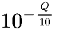
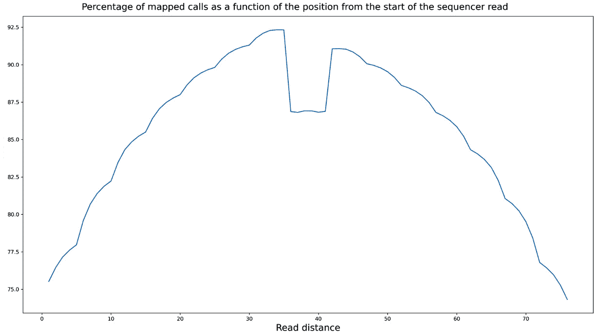
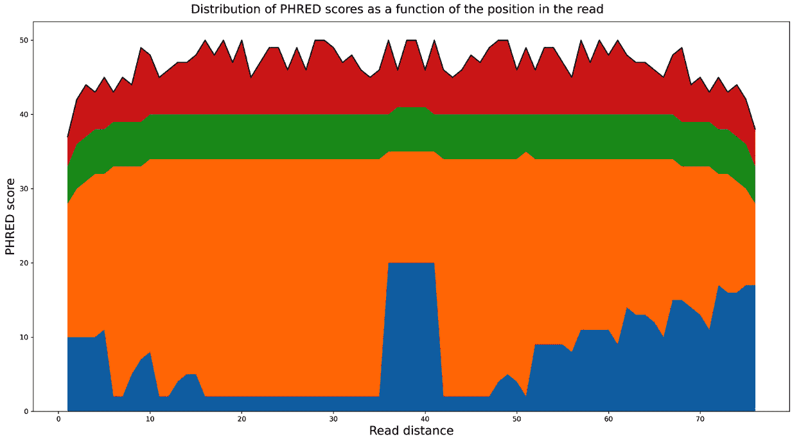

# 三、下一代测序

下一代测序 ( **NGS** )是本世纪生命科学的基础技术发展之一。**全基因组测序** ( **WGS** )，**限制性位点相关 DNA 测序** ( **RAD-Seq** )，**核糖核酸测序** ( **RNA-Seq** )，**染色质免疫沉淀测序** ( **ChIP-Seq** )，以及其他几种技术被常规用于研究重要的生物学问题。这些也被称为高通量测序技术，这是有充分理由的:它们产生了大量需要处理的数据。NGS 是计算生物学成为大数据学科的主要原因。最重要的是，这是一个需要强大的生物信息学技术的领域。

在这里，我们不会讨论每一个单独的 NGS 技术*本身*(这将需要一整本书)。我们将使用现有的 WGS 数据集——1000 个基因组项目——来说明分析基因组数据所需的最常见步骤。这里介绍的配方将很容易适用于其他基因组测序方法。其中一些也可用于转录组分析(例如 RNA-Seq)。这些配方也是独立于物种的，所以你可以将它们应用于任何其他有测序数据的物种。处理不同物种数据的最大差异与基因组大小、多样性和参考基因组的质量有关(如果你的物种存在参考基因组的话)。这些不会对 NGS 处理的自动化 Python 部分产生太大影响。无论如何，我们将在 [*第五章*](05.html#_idTextAnchor122) 、*与基因组一起工作*中讨论不同的基因组。

由于这不是一本入门书，所以希望你至少知道什么是 **FASTA** ( **FASTA** )、FASTQ、**二进制比对图** ( **BAM** )、以及**变体调用格式** ( **VCF** )文件。我还将使用基本的基因组术语，但不介绍它(如外显子组、非同义突变等)。您需要熟悉基本的 Python。我们将利用这些知识介绍 Python 中的基本库来执行 NGS 分析。在这里，我们将遵循标准生物信息学管道的流程。

然而，在我们深入研究来自真实项目的真实数据之前，让我们熟悉一下访问现有的基因组数据库和基本的序列处理——这是暴风雨前的一个简单开端。

如果您通过 Docker 运行内容，您可以使用`tiagoantao/bioinformatics_ngs`图像。如果您使用的是 Anaconda Python，本章所需的软件将在每一个菜谱中介绍。

在本章中，我们将介绍以下配方:

*   访问 GenBank 并在国家生物技术信息中心的数据库中移动
*   执行基本序列分析
*   使用现代序列格式
*   使用路线数据
*   从 VCF 文件中提取数据
*   研究基因组可达性，过滤**单核苷酸多态性** ( **SNP** )数据
*   用 HTSeq 处理 NGS 数据

# 访问 GenBank 并在 NCBI 数据库中移动

虽然你可能有自己的数据要分析，但你可能需要现有的基因组数据集。在这里，我们将研究如何从 NCBI 访问这样的数据库。我们不会只讨论 GenBank，还会讨论 NCBI 的其他数据库。许多人(错误地)将整套 NCBI 数据库称为 GenBank，但 NCBI 包括核苷酸数据库和许多其他数据库，例如 PubMed。

由于测序分析是一个很长的主题，并且这本书的目标是中级到高级用户，我们不会对一个核心上不太复杂的主题进行详尽的讨论。

尽管如此，这是我们将在本章末尾看到的更复杂的食谱的一个很好的热身。

## 准备就绪

我们会使用你在 [*第一章*](01.html#_idTextAnchor020)*Python 以及周边软件生态*中安装的 Biopython。Biopython 提供了一个与 NCBI 提供的数据检索系统`Entrez`的接口。

该配方可在`Chapter03/Accessing_Databases.py`文件中获得。

小费

你将从 NCBI 访问一个现场**应用编程接口** ( **API** )。请注意，系统的性能在一天中可能会有所不同。此外，在使用它的时候，你应该是一个“好公民”。你会在[https://www.ncbi.nlm.nih.gov/books/NBK25497/#chapter2.找到一些推荐用法指南和要求](https://www.ncbi.nlm.nih.gov/books/NBK25497/#chapter2.Usage_Guidelines_and_Requiremen)。值得注意的是，您需要在查询中指定一个电子邮件地址。您应该尽量避免在高峰时段(美国东部时间周一至周五上午 9:00 至下午 5:00)出现大量请求(100 个或更多)，并且每秒发布的查询不要超过三个(Biopython 会为您处理这些问题)。这不仅是良好的公民身份，而且如果你过度使用 NCBI 的服务器，你还有被屏蔽的风险(这是给出真实电子邮件地址的好理由，因为 NCBI 可能会试图联系你)。

## 怎么做...

现在，让我们看看如何从 NCBI 数据库中搜索和获取数据:

1.  我们将从导入相关模块和配置电子邮件地址开始:

    ```py
    from Bio import Entrez, SeqIO
    Entrez.email = 'put@your.email.here'
    ```

我们还将模块导入到流程序列中。不要忘记输入正确的电子邮件地址。

1.  我们将在`nucleotide`数据库

    ```py
    handle = Entrez.esearch(db='nucleotide', term='CRT[Gene Name] AND "Plasmodium falciparum"[Organism]')
    rec_list = Entrez.read(handle)
    if int(rec_list['RetMax']) < int(rec_list['Count']):
        handle = Entrez.esearch(db='nucleotide', term='CRT[Gene Name] AND "Plasmodium falciparum"[Organism]', retmax=rec_list['Count'])
        rec_list = Entrez.read(handle)
    ```

    中`Plasmodium falciparum`(导致最致命形式疟疾的寄生虫)中寻找**氯喹抗性转运蛋白** ( **CRT** )基因

我们将在`nucleotide`数据库中搜索我们的基因和生物体(关于搜索字符串的语法，请查看 NCBI 网站)。然后，我们将读取返回的结果。请注意，标准的搜索将记录引用的数量限制为 20 个，因此如果有更多，您可能希望使用增加的最大限制来重复查询。在我们的例子中，我们实际上将使用`retmax`覆盖默认限制。`Entrez`系统提供了相当多的复杂方法来检索大量结果(更多信息，请查看 Biopython 或 NCBI·恩特雷兹的文档)。尽管您现在拥有了所有记录的**标识符**(**id**)，但是您仍然需要正确地检索记录。

1.  现在，让我们尝试检索所有这些记录。下面的查询将从 GenBank 下载所有匹配的核苷酸序列，在写这本书的时候是 1374。你可能不会一直想这么做:

    ```py
    id_list = rec_list['IdList']
    hdl = Entrez.efetch(db='nucleotide', id=id_list, rettype='gb')
    ```

好吧，既然这样，那就去做吧。但是，使用这种技术时要小心，因为您将检索大量完整的记录，其中一些记录内部会有相当大的序列。你冒着下载大量数据的风险(这对你和 NCBI 服务器来说都是一种压力)。

有几种方法可以解决这个问题。一种方法是进行更严格的查询和/或一次只下载几个，当你找到你需要的时候就停下来。精确的策略将取决于你想要达到的目标。无论如何，我们将检索 GenBank 格式的记录列表(包括序列，加上许多有趣的元数据)。

1.  让我们读取并解析结果:

    ```py
    recs = list(SeqIO.parse(hdl, 'gb'))
    ```

注意我们已经将一个迭代器(`SeqIO.parse`的结果)转换成了一个列表。这样做的好处是，我们可以根据需要多次使用结果(例如，多次迭代)，而无需在服务器上重复查询。

如果您计划多次迭代，这将节省时间、带宽和服务器的使用。缺点是它将为所有记录分配内存。这不适用于非常大的数据集；你可能不想像第五章 、*中的 [*那样在全基因组范围内进行这种转换。我们将在本书的最后一部分回到这个话题。如果你在做交互式计算，你可能更喜欢有一个列表(这样你可以多次分析和试验)，但是如果你在开发一个库，迭代器可能是最好的方法。*](05.html#_idTextAnchor122)*

1.  我们现在只关注一张唱片。只有当您使用完全相同的前面的查询:

    ```py
    for rec in recs:
        if rec.name == 'KM288867':
            break
    print(rec.name)
    print(rec.description)
    ```

    时，这才会起作用

`rec`变量现在有了我们感兴趣的记录。`rec.description`文件将包含它的可读描述。

1.  现在，让我们提取一些序列特征，这些特征包含序列上的`gene`产品和`exon`位置等信息:

    ```py
    for feature in rec.features:
         if feature.type == 'gene':
             print(feature.qualifiers['gene'])
         elif feature.type == 'exon':
             loc = feature.location
             print(loc.start, loc.end, loc.strand)
         else:
             print('not processed:\n%s' % feature)
    ```

如果`feature.type`的值是`gene`，我们将打印它的名字，它将在`qualifiers`字典中。我们也将打印所有外显子的位置。外显子，作为具有所有特征的，在这个序列中有位置:一个起点，一个终点，以及它们被读取的链。虽然我们的外显子的所有起始和结束位置都是`ExactPosition`，但是请注意，Biopython 支持许多其他类型的位置。一类位置是`BeforePosition`，指定一个定位点在某个序列位置之前。另一类位置是`BetweenPosition`，给出某个位置开始/结束的间隔。职位类型比较多；这些只是一些例子。

坐标将以这样一种方式指定，即您将能够轻松地从带有范围的 Python 数组中检索序列，因此一般来说，开始将比记录上的值早一个，结束将是相等的。坐标系统的问题将在未来的食谱中重新讨论。

对于其他特征类型，我们简单地打印它们。请注意，当您打印时，Biopython 将提供该功能的人类可读版本。

1.  我们现在将查看记录上的注释，其中大部分是与序列位置不相关的元数据:

    ```py
    for name, value in rec.annotations.items():
        print('%s=%s' % (name, value))
    ```

注意，有些值不是字符串；它们可以是数字，甚至是列表(例如，分类法注释就是一个列表)。

1.  最后但同样重要的是，您可以访问一条基本信息——序列:

    ```py
    print(len(rec.seq))
    ```

序列对象将是我们下一个配方的主题。

## 还有更多...

在 NCBI 有更多的数据库。如果您正在处理 NGS 数据，您可能会想要检查**序列读取档案** ( **SRA** )数据库(以前称为**短读取档案**)。SNP 数据库包含关于 SNP 的信息，而蛋白质数据库包含蛋白质序列，等等。Entrez 中数据库的完整列表链接在*中，参见本菜谱的*部分。

另一个你可能已经知道的关于 NCBI 的数据库是 PubMed，它包括一个科学和医学引文、摘要、甚至全文的列表。你也可以通过 Biopython 访问它。此外，GenBank 记录通常包含 PubMed 的链接。例如，我们可以对以前的记录执行此操作，如下所示:

```py
from Bio import Medline
refs = rec.annotations['references']
for ref in refs:
    if ref.pubmed_id != '':
        print(ref.pubmed_id)
        handle = Entrez.efetch(db='pubmed', id=[ref.pubmed_id], rettype='medline', retmode='text')
        records = Medline.parse(handle)
        for med_rec in records:
            for k, v in med_rec.items():
                print('%s: %s' % (k, v))
```

这将获取所有引用注释，检查它们是否有 PubMed ID，然后访问 PubMed 数据库来检索记录，解析它们，然后打印它们。

每个记录的输出是一个 Python 字典。注意，在一个典型的 GenBank 记录中有许多对外部数据库的引用。

当然，还有很多 NCBI 之外的其他生物数据库，比如恩森布尔(【http://www.ensembl.org】)和**加州大学圣克鲁斯分校** ( **UCSC** )基因组生物信息学([http://genome.ucsc.edu/](http://genome.ucsc.edu/))。Python 对这些数据库的支持会有很大不同。

如果没有对基本局部比对搜索工具 ( **BLAST** )的引用，一本关于生物数据库的入门食谱将是不完整的。BLAST 是一种评估序列相似性的算法。NCBI 提供一项服务，允许你将你感兴趣的序列与它自己的数据库进行比较。当然，你可以使用你当地的 BLAST 数据库，而不是使用 NCBI 的服务。Biopython 为此提供了广泛的支持，但由于这太过初级，我将只向您推荐 Biopython 教程。

## 参见

这些附加信息也很有用:

*   你可以在[http://biopython.org/DIST/docs/tutorial/Tutorial.xhtml](http://biopython.org/DIST/docs/tutorial/Tutorial.xhtml)找到更多关于 Biopython 教程的例子。
*   在 http://www.ncbi.nlm.nih.gov/gquery/可以找到可访问的 NCBI 数据库列表。
*   一个很棒的**问答** ( **Q & A** )网站是 Biostars([http://www.biostars.org](http://www.biostars.org))，在那里你可以找到关于数据库和序列分析问题的帮助；你可以将它用于本书的所有内容，而不仅仅是这个食谱。

# 执行基本序列分析

我们现在将做一些 DNA 序列的基本分析。我们将使用 FASTA 文件并进行一些操作，比如反向互补或转录。和前面的菜谱一样，我们将使用你在 [*第一章*](01.html#_idTextAnchor020)*Python 以及周边软件生态*中安装的 Biopython。这两个配方为您提供了必要的介绍性构件，我们将使用它们执行所有现代 NGS 分析，然后在本章和第 5 章[](05.html#_idTextAnchor122)*、*中进行基因组处理*。*

 *## 准备就绪

该配方的代码可在`Chapter03/Basic_Sequence_Processing.py`中找到。我们将以人类的**乳糖酶** ( **LCT** )基因为例；您可以通过使用`Entrez`研究界面，利用您从之前的配方中获得的知识来获得此信息:

```py
from Bio import Entrez, SeqIO, SeqRecord
Entrez.email = "your@email.here"
hdl = Entrez.efetch(db='nucleotide', id=['NM_002299'], rettype='gb') # Lactase gene
gb_rec = SeqIO.read(hdl, 'gb')
```

现在我们有了 GenBank 记录，让我们提取基因序列。记录还不止这些，但让我们先找到基因的精确位置:

```py
for feature in gb_rec.features:
    if feature.type == 'CDS':
        location = feature.location  # Note translation existing
cds = SeqRecord.SeqRecord(gb_rec.seq[location.start:location.end], 'NM_002299', description='LCT CDS only')
```

我们的示例序列可在 Biopython 序列记录中找到。

## 怎么做...

让我们看一看下面的步骤:

1.  由于我们感兴趣的序列在 Biopython sequence 对象中是可用的，所以让我们首先将它保存到本地磁盘上的 FASTA 文件中:

    ```py
    from Bio import SeqIO
    w_hdl = open('example.fasta', 'w')
    SeqIO.write([cds], w_hdl, 'fasta')
    w_hdl.close()
    ```

`SeqIO.write`函数接受要写入的序列列表(在我们的例子中，只有一个)。小心这个习语。如果你想写很多序列(你可以用 NGS 轻松地写几百万)，不要使用列表(如前面的代码片段所示)，因为这将分配大量的内存。在每次写操作中，对序列的子集使用迭代器或`SeqIO.write`函数几次。

1.  在大多数情况下，你实际上会有序列在磁盘上，所以你会有兴趣去读它:

    ```py
    recs = SeqIO.parse('example.fasta', 'fasta')
    for rec in recs:
        seq = rec.seq
        print(rec.description)
        print(seq[:10])
    ```

这里，我们关心的是处理单个序列，但是 FASTA 文件可以包含多个记录。Python 习语来执行这个是相当容易的。要读取 FASTA 文件，只需使用标准的迭代技术，如下面的代码片段所示。对于我们的示例，前面的代码将打印以下输出:

```py
NM_002299 LCT CDS only
 ATGGAGCTGT
```

注意，我们打印了`seq[:10]`。序列对象可以使用典型的数组切片来获取序列的一部分。

1.  因为我们现在有一个明确的 DNA，我们可以转录它如下:

    ```py
    rna = seq.transcribe()
    print(rna)
    ```

2.  最后，我们可以把我们的基因翻译成蛋白质:

    ```py
    prot = seq.translate()
    print(prot)
    ```

现在，我们有了基因的氨基酸序列。

## 还有更多...

关于 Biopython 中的序列管理，还可以说得更多，但这主要是介绍性材料，您可以在 Biopython 教程中找到。我认为让您体验一下序列管理是很重要的，主要是为了完成的目的。为了支持那些可能在生物信息学的其他领域有一些经验但刚刚开始序列分析的人，有几点你应该知道:

*   当你进行 RNA 翻译以获得蛋白质时，一定要使用正确的遗传密码。即使你在和“普通”生物(比如人类)一起工作，记住线粒体遗传密码是不同的。
*   Biopython 的`Seq`对象比这里显示的更加灵活。关于一些好的例子，请参考 Biopython 教程。然而，这个食谱对于我们需要用 FASTQ 文件做的工作来说已经足够了(见下一个食谱)。
*   为了处理与链相关的问题，正如预期的那样，有一些序列函数，如`reverse_complement`。
*   我们开始的 GenBank 记录包含了大量关于该序列的元数据信息，所以一定要探索它。

## 参见

*   Biopython 已知的遗传密码是由 NCBI 指定的，可在 http://www.ncbi.nlm.nih.gov/Taxonomy/Utils/wprintgc.cgi 获得。
*   和前面的食谱一样，Biopython 教程是你的主要停靠站，可以在[http://biopython.org/DIST/docs/tutorial/Tutorial.xhtml](http://biopython.org/DIST/docs/tutorial/Tutorial.xhtml)找到。
*   请务必在[http://biopython.org/wiki/SeqIO](http://biopython.org/wiki/SeqIO)查看 Biopython SeqIO 页面。

# 使用现代序列格式

在这里，我们将使用 FASTQ 文件，这是现代测序仪使用的标准格式输出。你将学习如何处理每个碱基的质量分数，并考虑来自不同测序机器和数据库的输出差异。这是第一个将使用来自人类 1000 个基因组项目的真实数据(大数据)的配方。我们将从项目的简要描述开始。

## 准备就绪

人类 1，000 基因组计划旨在对世界范围内的人类基因变异进行编目，并利用现代测序技术进行 WGS。该项目公开了所有数据,包括测序仪的输出、序列比对和 SNP 调用，以及许多其他工件。“1000 个基因组”这个名称实际上是用词不当，因为它目前包括了 2500 多个样本。这些样本被分成数百个种群，跨越整个星球。我们将主要使用来自四个人群的数据:**非洲约鲁巴人**(**YRI**)**拥有北欧和西欧血统的犹他州居民**(**CEU**)**在东京的日本人** ( **JPT** )和**在北京的汉族人** ( **CHB** )。我们选择这些特定人群的原因是他们是第一批来自 HapMap 的人群，hap map 是一个有着相似目标的老项目。他们使用基因分型阵列来发现更多关于这个子集的质量。我们将在 [*第六章*](06.html#_idTextAnchor154)*群体遗传学*中重温 1000 个基因组和单体型图项目。

小费

下一代数据集通常非常大。因为我们将使用真实的数据，你将下载的一些文件将会很大。虽然我已经尽可能地选择了最小的实例，但是您仍然需要良好的网络连接和相当大的磁盘空间。等待下载可能是这个食谱中最大的障碍，但是数据管理对 NGS 来说是一个严重的问题。在现实生活中，您将需要为数据传输安排时间、分配磁盘空间(这在财务上可能很昂贵)，并考虑备份策略。NGS 最常见的初始错误是认为这些问题微不足道，但事实并非如此。像将一组 BAM 文件复制到网络，甚至复制到您的计算机这样的操作将会变得令人头痛。做好准备。下载大文件后，最起码要检查一下大小是否正确。一些数据库提供**消息摘要 5** ( **MD5** )校验和。您可以使用 md5sum 等工具将这些校验和与您下载的文件中的校验和进行比较。

下载数据的说明在笔记本的顶部，如`Chapter03/Working_with_FASTQ.py`的第一个单元格所示。这是一个相当小的文件(27 **兆字节** ( **兆字节**))，代表一个约鲁巴人女性(`NA18489`)的部分测序数据。如果你参考 1000 个基因组项目，你会发现绝大多数 FASTQ 文件都要大得多(大了两个数量级)。

FASTQ 序列文件的处理将主要使用 Biopython 来执行。

## 怎么做...

在我们开始编码之前，让我们看一下 FASTQ 文件，其中有许多记录，如下面的代码片段所示:

```py
@SRR003258.1 30443AAXX:1:1:1053:1999 length=51
 ACCCCCCCCCACCCCCCCCCCCCCCCCCCCCCCCCCCACACACACCAACAC
 +
 =IIIIIIIII5IIIIIII>IIII+GIIIIIIIIIIIIII(IIIII01&III
```

*第 1 行*以`@`开始，后面是序列 ID 和描述字符串。描述字符串会因序列器或数据库来源而异，但通常会服从自动解析。

第二行是测序的 DNA，就像 FASTA 文件一样。第三行是一个`+`符号，有时第一行是描述行。

第四行包含在第二行读取的每个碱基的质量值。每个字母给一个 Phred 质量分数([http://en.wikipedia.org/wiki/Phred_quality_score](http://en.wikipedia.org/wiki/Phred_quality_score))编码，它给每个读数分配一个错误概率。这种编码在不同平台之间会有所不同。请务必在您的特定平台上检查这一点。

让我们来看看以下步骤:

1.  让我们打开文件:

    ```py
    import gzip
    from Bio import SeqIO
    recs = SeqIO.parse(gzip.open('SRR003265.filt.fastq.gz'),'rt', encoding='utf-8'), 'fastq')
    rec = next(recs)
    print(rec.id, rec.description, rec.seq)
    print(rec.letter_annotations)
    ```

我们将打开一个 **GNU ZIP** ( **GZIP** )文件，这样我们就可以使用 Python `gzip`模块了。我们还将指定`fastq`格式。请注意，这种格式的一些变化会影响 Phred 质量分数的解释。您可能希望指定稍微不同的格式。所有格式参见[http://biopython.org/wiki/SeqIO](http://biopython.org/wiki/SeqIO)。

小费

你应该通常以压缩格式存储你的 FASTQ 文件。因为这些是文本文件，所以您不仅获得了大量的磁盘空间，还可能获得一些处理时间。虽然解压缩是一个缓慢的过程，但它仍然比从磁盘读取大得多的(未压缩的)文件要快。

我们将先前配方中的标准字段和质量分数打印到`rec.letter_annotations`中。只要我们选择了正确的解析器，Biopython 就会将所有 Phred 编码字母转换成对数分数，我们很快就会用到。

现在，*不要这样做:*

```py
recs = list(recs) # do not do it!
```

虽然这可能适用于一些 FASTA 文件(以及这个非常小的 FASTQ 文件)，但是如果您执行类似这样的操作，您将分配内存，以便可以在内存中加载完整的文件。对于一个普通的 FASTQ 文件，这是使你的计算机崩溃的最好方法。作为一个规则，总是迭代你的文件。如果您必须对它执行几个操作，您有两个主要的选择。第一种选择是执行一次迭代或者一次执行所有操作。第二种选择是多次打开一个文件并重复迭代。

1.  现在，让我们来看看核苷酸的分布读数:

    ```py
    from collections import defaultdict
    recs = SeqIO.parse(gzip.open('SRR003265.filt.fastq.gz', 'rt', encoding='utf-8'), 'fastq')
    cnt = defaultdict(int)
    for rec in recs:
        for letter in rec.seq:
            cnt[letter] += 1
    tot = sum(cnt.values())
    for letter, cnt in cnt.items():
        print('%s: %.2f %d' % (letter, 100\. * cnt / tot, cnt))
    ```

我们将重新打开该文件，并使用`defaultdict`来维护 FASTQ 文件中的核苷酸参考计数。如果您从未使用过这种 Python 标准字典类型，您可能会考虑使用它，因为它消除了初始化字典条目的需要，并为每种类型假定默认值。

注意

`N`通话有剩余号码。在这些呼叫中，序列发生器报告一个未知碱基。在我们的 FASTQ 文件示例中，我们有一点作弊，因为我们使用了一个过滤文件(调用`N`的比例将非常低)。预计从序列器中出来的文件中会有更多的`N`调用。事实上，你甚至可以期待更多关于`N`叫声的空间分布。

1.  让我们根据它们的读取位置来绘制`N`的分布:

    ```py
    import seaborn as sns
    import matplotlib.pyplot as plt
    recs = SeqIO.parse(gzip.open('SRR003265.filt.fastq.gz', 'rt', encoding='utf-8'), 'fastq')
    n_cnt = defaultdict(int)
    for rec in recs:
        for i, letter in enumerate(rec.seq):
            pos = i + 1
            if letter == 'N':
                n_cnt[pos] += 1
    seq_len = max(n_cnt.keys())
    positions = range(1, seq_len + 1)
    fig, ax = plt.subplots(figsize=(16,9))
    ax.plot(positions, [n_cnt[x] for x in positions])
    fig.suptitle('Number of N calls as a function of the distance from the start of the sequencer read')
    ax.set_xlim(1, seq_len)
    ax.set_xlabel('Read distance')
    ax.set_ylabel('Number of N Calls')
    ```

我们导入了`seaborn`库。尽管在这一点上我们没有明确地使用它，但是这个库的优点是让`matplotlib`图看起来更好，因为它调整了默认的`matplotlib`样式。

然后，我们再次打开文件进行解析(记住，您不使用列表，而是再次迭代)。我们遍历文件并获得对`N`的任何引用的位置。然后，我们将`N` s 的分布绘制成距离序列起点的函数:


图 3.1–N 次调用的次数与从序列器读取开始的距离的函数关系

您将看到直到位置`25`，没有错误。这不是典型序列器输出的结果。我们的示例文件已经被过滤，1000 个基因组过滤规则强制要求在位置`25`之前不能出现`N`调用。

虽然我们无法研究位置`25`之前数据集中`N` s 的行为(您可以随意使用您自己的未过滤 FASTQ 文件来查看`N` s 如何在读取位置上分布)，但我们可以看到，在位置`25`之后，分布远非均匀。这里有一个重要的教训，即未调用碱基的数量取决于位置。那么，阅读的质量如何呢？

1.  我们来研究一下 Phred 分数的分布(也就是我们阅读的质量):

    ```py
    recs = SeqIO.parse(gzip.open('SRR003265.filt.fastq.gz', 'rt', encoding='utf-8'), 'fastq')
    cnt_qual = defaultdict(int)
    for rec in recs:
        for i, qual in enumerate(rec.letter_annotations['phred_quality']):
            if i < 25:
                continue
            cnt_qual[qual] += 1
    tot = sum(cnt_qual.values())
    for qual, cnt in cnt_qual.items():
        print('%d: %.2f %d' % (qual, 100\. * cnt / tot, cnt))
    ```

我们将从(再次)重新打开文件并初始化默认字典开始。然后我们得到`phred_quality`字母注释，但是我们从一开始就忽略了长达 24 个**碱基对** ( **bp** )的测序位置(由于我们的 FASTQ 文件的过滤，如果您有一个未过滤的文件，您可能想要放弃这个规则)。我们将质量分数添加到默认字典中，最后打印出来。

注意

简单提醒一下， Phred 质量分数是准确呼叫概率的对数表示。这个概率给定为。因此，10 的 *Q* 代表 90%的呼叫准确率，20 代表 99%的呼叫准确率，30 将是 99.9%。对于我们的文件，最大准确率将是 99.99%(40)。在某些情况下，值 60 是可能的(99.9999%的准确性)。

1.  更有趣的是，我们可以根据他们的阅读位置来绘制质量的分布:

    ```py
    recs = SeqIO.parse(gzip.open('SRR003265.filt.fastq.gz', 'rt', encoding='utf-8'), 'fastq')
    qual_pos = defaultdict(list)
    for rec in recs:
        for i, qual in enumerate(rec.letter_annotations['phred_quality']):
            if i < 25 or qual == 40:
               continue
            pos = i + 1
            qual_pos[pos].append(qual)
    vps = []
    poses = list(qual_pos.keys())
    poses.sort()
    for pos in poses:
        vps.append(qual_pos[pos])
    fig, ax = plt.subplots(figsize=(16,9))
    sns.boxplot(data=vps, ax=ax)
    ax.set_xticklabels([str(x) for x in range(26, max(qual_pos.keys()) + 1)])
    ax.set_xlabel('Read distance')
    ax.set_ylabel('PHRED score')
    fig.suptitle('Distribution of PHRED scores as a function of read distance')
    ```

在这种情况下，我们将忽略从一开始就被排序为`25` bp 的两个位置(同样，如果您有未过滤的测序数据，请删除此规则)和该文件的最高质量分数(`40`)。但是，在您的情况下，您可以考虑以最大值开始绘图分析。您可能需要检查音序器硬件的最大可能值。一般来说，由于大多数呼叫可以以最高质量执行，如果您试图了解质量问题所在，您可能希望删除它们。

注意我们使用的是`seaborn`的`boxplot`功能；我们使用这个只是因为输出看起来比标准的`matplotlib`的`boxplot`函数稍微好一点。如果你不想依赖`seaborn`，就使用股票`matplotlib`功能。这种情况下，你会调用`ax.boxplot(vps)`而不是`sns.boxplot(data=vps, ax=ax)`。

正如所料，分布并不均匀，如下图所示:


图 3.2–ph red 分数的分布，作为从测序仪读数开始的距离的函数

## 还有更多...

尽管不可能讨论序列器文件输出的所有变化，但成对端读取值得一提，因为它们很常见，需要不同的处理方法。使用成对末端测序，DNA 片段的两端都被测序，中间有一个缺口(称为插入片段)。这种情况下会产生两个文件:`X_1.FASTQ`和`X_2.FASTQ`。两个文件将具有相同的顺序和完全相同的序列数。第一个序列将与第一个序列`X_2`成对出现在`X_1`中，依此类推。关于编程技术，如果您想保留配对信息，您可以执行如下操作:

```py
f1 = gzip.open('X_1.filt.fastq.gz', 'rt, enconding='utf-8')
f2 = gzip.open('X_2.filt.fastq.gz', 'rt, enconding='utf-8')
recs1 = SeqIO.parse(f1, 'fastq')
recs2 = SeqIO.parse(f2, 'fastq')
cnt = 0
for rec1, rec2 in zip(recs1, recs2):
    cnt +=1
print('Number of pairs: %d' % cnt)
```

前面的代码按顺序读取所有的线对，并且只计算线对的数量。您可能想做更多的事情，但是这公开了一种基于 Python `zip`函数的方言，允许您同时遍历两个文件。记得用你的`FASTQ`前缀替换`X`。

最后，如果你正在对人类基因组进行测序，你可能想要使用来自完整基因组学的测序数据。在这种情况下，请阅读下一个食谱中的*还有更多…* 部分，在那里我们将简要讨论完整的基因组数据。

## 参见

以下是一些包含更多信息的链接:

*   FASTQ 格式的维基百科页面信息量很大([http://en.wikipedia.org/wiki/FASTQ_format](http://en.wikipedia.org/wiki/FASTQ_format))。
*   你可以在 http://www.1000genomes.org/找到关于 1000 个基因组项目的更多信息。
*   有关 Phred 质量分数的信息可在[http://en.wikipedia.org/wiki/Phred_quality_score](http://en.wikipedia.org/wiki/Phred_quality_score)找到。
*   Illumina 在[https://www . illumina . com/science/technology/next-generation-sequencing/paired-end-vs-single-read-sequencing . XHTML](https://www.illumina.com/science/technology/next-generation-sequencing/paired-end-vs-single-read-sequencing.xhtml)提供了一个很好的关于配对末端阅读的介绍页面。
*   Medvedev 等人关于 nature methods 的论文*利用下一代测序发现结构变异的计算方法*([http://www . nature . com/nmeth/journal/V6/n11s/ABS/nmeth . 1374 . XHTML](http://www.nature.com/nmeth/journal/v6/n11s/abs/nmeth.1374.xhtml))；请注意，这不是开放访问。

# 使用校准数据

在你从测序仪收到你的数据后，你通常会使用工具，如**布伦斯-惠勒比对器** ( `bwa`)将你的序列与参考基因组进行比对。大多数用户都有自己物种的参考基因组。你可以在 [*第 5 章*](05.html#_idTextAnchor122) 、*使用基因组*中阅读更多关于参考基因组的内容。

比对数据最常见的表示是**序列比对图** ( **山姆**)格式。由于这些文件大部分都很大，你可能会使用它的压缩版本(BAM)。压缩格式是可索引的，用于极快的随机访问(例如，快速找到染色体某一部分的比对)。注意，BAM 文件需要一个索引，通常由 SAMtools 的`tabix`实用程序创建。SAMtools 可能是使用最广泛的操作 SAM/BAM 文件的工具。

## 准备就绪

正如在前面的食谱中所讨论的，我们将使用来自 1000 个基因组项目的数据。我们将对女性`NA18489`的 20 号染色体使用外显子组比对。这才 312 MB。这个个体的全外显子组比对是 14.2 **千兆字节** ( **GB** )，全基因组比对(在 4x 的低覆盖率下)是 40.1 GB。该数据是成对的末端，读数为 76 bp。这在今天很常见，但是处理起来稍微复杂一些。我们会考虑这一点。如果你的数据没有配对，就把下面的菜谱适当简化一下。

`Chapter03/Working_with_BAM.py`顶部的单元格会为你下载数据。你想要的文件是`NA18490_20_exome.bam`和`NA18490_20_exome.bam.bai`。

我们将使用`pysam`，一个 SAMtools C API 的 Python 包装器。您可以使用以下命令安装它:

```py
conda install –c bioconda pysam
```

好的——我们开始吧。

## 怎么做...

在开始编码之前，注意你可以使用`samtools view -h`检查 BAM 文件(这是如果你安装了 SAMtools，我们推荐，甚至如果你使用**基因组分析工具包** ( **GATK** )或其他用于变量调用的工具)。我们建议您查看一下头文件和前几条记录。SAM 格式太复杂，无法在此描述。互联网上有大量关于它的信息；尽管如此，有时，这些头文件中隐藏着一些非常有趣的信息。

小费

NGS 中最复杂的操作之一是从原始序列数据生成良好的比对文件。这不仅调用了对齐器，还清理了数据。现在，在高质量 BAM 文件的`@PG`头文件中，您会发现大多数——如果不是全部——用于生成该 BAM 文件的过程的实际命令行。在我们的示例 BAM 文件中，您将找到运行 bwa、SAMtools、GATK IndelRealigner 和 Picard 应用程序套件来清理数据所需的所有信息。请记住，虽然您可以轻松地生成 BAM 文件，但是它后面的程序在 BAM 输入的正确性方面会非常挑剔。例如，如果您使用 GATK 的变体调用程序来生成基因型调用，则必须对文件进行大范围的清理。因此，其他 BAM 文件的头文件可以为您提供生成自己的文件的最佳方式。最后一个建议是，如果你不处理人类数据，试着为你的物种找到好的 bam，因为给定程序的参数可能略有不同。此外，如果您使用 WGS 数据以外的数据，请检查相似类型的测序数据。

让我们看一看下面的步骤:

1.  让我们检查一下头文件:

    ```py
    import pysam
    bam = pysam.AlignmentFile('NA18489.chrom20.ILLUMINA.bwa.YRI.exome.20121211.bam', 'rb')
    headers = bam.header
    for record_type, records in headers.items():
        print (record_type)
        for i, record in enumerate(records):
            if type(record) == dict:
                print('\t%d' % (i + 1))
                for field, value in record.items():
                    print('\t\t%s\t%s' % (field, value))
            else:
                print('\t\t%s' % record)
    ```

头表示为一个字典(其中键是`record_type`)。由于同一个`record_type`可能有多个实例，所以字典的值是一个列表(其中每个元素都是一个字典，或者有时是一个包含标签/值对的字符串)。

1.  我们现在将检查单个记录。每条记录的数据量相当复杂。这里，我们将关注成对末端阅读的一些基本领域。查看 SAM 文件规范和`pysam` API 文档了解更多详情:

    ```py
    for rec in bam:
        if rec.cigarstring.find('M') > -1 and rec.cigarstring.find('S') > -1 and not rec.is_unmapped and not rec.mate_is_unmapped:
        break
    print(rec.query_name, rec.reference_id, bam.getrname(rec.reference_id), rec.reference_start, rec.reference_end)
    print(rec.cigarstring)
    print(rec.query_alignment_start, rec.query_alignment_end, rec.query_alignment_length)
    print(rec.next_reference_id, rec.next_reference_start,rec.template_length)
    print(rec.is_paired, rec.is_proper_pair, rec.is_unmapped, rec.mapping_quality)
    print(rec.query_qualities)
    print(rec.query_alignment_qualities)
    print(rec.query_sequence)
    ```

请注意，BAM 文件对象可以在其记录上迭代。我们将遍历它，直到我们找到一个记录，它的**简洁的特质间隙对齐报告** ( **雪茄**)字符串包含一个火柴和一个软夹子。

雪茄线给出了单个碱基排列的指示。序列中被剪切的部分是对齐器未能对齐的部分(但没有从序列中去除)。我们还需要读数、其配对 ID 和位置(配对的，因为我们有配对的末端读数),它们被映射到参考基因组。

首先，我们打印查询模板名称，后面跟着引用 ID。引用 ID 是一个指针，指向引用查找表中给定引用的序列名称。举个例子就能说明这一点。对于这个 BAM 文件上的所有记录，引用 ID 是`19`(一个无信息的数字)，但是如果应用`bam.getrname(19)`，就会得到`20`，这是染色体的名称。因此，不要混淆参考 ID(在本例中为`19`)和染色体名称(`20`)。随后是参考起点和参考终点。`pysam`是从 0 开始的，不是从 1 开始的，所以当你把坐标转换到其他库的时候要小心。您会注意到本例的起点和终点分别是 59，996 和 60，048，这意味着 52 个碱基的比对。当读取大小为 76 时，为什么只有 52 个碱基(还记得这个 BAM 文件中使用的读取大小吗)?答案可以在雪茄串上找到，在我们的例子中是`52M24S`，它是 52 个碱基的匹配，然后是 24 个碱基的软剪辑。

然后，我们打印对齐的起点和终点，并计算其长度。顺便说一下，你可以通过观察雪茄绳来计算。它从 0 开始(因为读取的第一部分被映射)并在 52 结束。长度又是 76。

现在，我们查询 mate(只有在有成对末端读取的情况下才会这样做)。我们得到它的引用 ID(如前面的代码片段所示)、它的起始位置以及两对之间的距离度量。只有当配偶双方都映射到同一条染色体上时，这种距离的度量才有意义。

然后，我们绘制该序列的 Phred 分数(参考之前的配方，*使用现代序列格式*，关于 Phred 分数)，然后仅绘制比对部分的 ph red 分数。最后，我们打印序列(不要忘记这样做！).这是完整的序列，不是剪辑过的序列(当然可以用前面的坐标来剪辑)。

1.  现在，让我们在 BAM 文件中的序列子集中绘制成功作图位置的分布:

    ```py
    import seaborn as sns
    import matplotlib.pyplot as plt
    counts = [0] * 76
    for n, rec in enumerate(bam.fetch('20', 0, 10000000)):
        for i in range(rec.query_alignment_start, rec.query_alignment_end):
            counts[i] += 1
    freqs = [x / (n + 1.) for x in counts]
    fig, ax = plt.subplots(figsize=(16,9))
    ax.plot(range(1, 77), freqs)
    ax.set_xlabel('Read distance')
    ax.set_ylabel('PHRED score')
    fig.suptitle('Percentage of mapped calls as a function of the position from the start of the sequencer read')
    ```

我们将开始初始化一个数组来保存整个`76`位置的计数。注意，然后我们只获取 20 号染色体在 0 号和 10 号位置**兆碱基对** ( **Mbp** )之间的记录。我们将只使用染色体的一小部分。对于这些类型的获取操作，拥有一个索引(由`tabix`生成)是非常重要的；执行的速度会完全不同。

我们遍历 10 Mbp 边界内的所有记录。对于每个边界，我们得到对齐的开始和结束，并增加对齐的位置之间的可映射性的计数器。最后，我们将其转换为频率，然后绘制出来，如下面的屏幕截图所示:



图 3.3–从序列器读取开始，作为位置函数的映射调用百分比

很明显，可映射性的分布远不是均匀的；极端情况更糟，中间有所下降。

1.  最后，让我们得到 Phred 分数在读数映射部分的分布。正如你可能会怀疑的，这可能不会是统一的:

    ```py
    from collections import defaultdict
    import numpy as np
    phreds = defaultdict(list)
    for rec in bam.fetch('20', 0, None):
        for i in range(rec.query_alignment_start, rec.query_alignment_end):
            phreds[i].append(rec.query_qualities[i])
    maxs = [max(phreds[i]) for i in range(76)]
    tops = [np.percentile(phreds[i], 95) for i in range(76)]
    medians = [np.percentile(phreds[i], 50) for i in range(76)]
    bottoms = [np.percentile(phreds[i], 5) for i in range(76)]
    medians_fig = [x - y for x, y in zip(medians, bottoms)]
    tops_fig = [x - y for x, y in zip(tops, medians)]
    maxs_fig = [x - y for x, y in zip(maxs, tops)]
    fig, ax = plt.subplots(figsize=(16,9))
    ax.stackplot(range(1, 77), (bottoms, medians_fig,tops_fig))
    ax.plot(range(1, 77), maxs, 'k-')
    ax.set_xlabel('Read distance')
    ax.set_ylabel('PHRED score')
    fig.suptitle('Distribution of PHRED scores as a function of the position in the read')
    ```

这里，我们再次使用默认字典，允许您使用一些初始化代码。我们现在从头到尾取数据，并在字典中创建一个 Phred 分数列表，该列表的索引是序列读取中的相对位置。

然后我们使用 NumPy 计算第 95、第 50(中间值)和第 5 个百分点，以及每个位置的最大质量分数。对于大多数计算生物学分析，拥有数据的统计汇总视图是很常见的。因此，您可能不仅熟悉百分位数计算，还熟悉计算均值、标准差、最大值和最小值的其他 Pythonic 方法。

最后，我们将绘制每个职位的 Phred 分数分布的堆积图。由于`matplotlib`期望堆栈的方式，我们必须用`stackplot`调用之前的值减去下百分位的值。我们可以使用底部百分位数的列表，但是我们必须修正中间值和顶部，如下所示:



图 3.4–ph red 分数的分布，作为读数中位置的函数；底部的蓝色从 0 到第 5 个百分点；绿色到中间值，红色到第 95 百分位，紫色到最大值

## 还有更多...

虽然我们将在本章的*研究基因组可及性和筛选 SNP 数据*方法中讨论数据筛选，但我们的目的不是详细解释 SAM 格式或给出数据筛选的详细过程。这个任务需要一本自己的书，但是有了`pysam`的基础知识，您可以浏览 SAM/BAM 文件。然而，在本章的最后一个方法中，我们将从 BAM 文件中提取全基因组的指标(通过代表 BAM 文件指标的 VCF 文件上的注释),以了解我们数据集的整体质量。

您可能需要处理非常大的数据文件。某些 BAM 处理可能会花费太多时间。减少计算时间的第一种方法是二次采样。例如，如果以 10%进行二次抽样，就会忽略 10 条记录中的 9 条。对于许多任务，例如为 BAM 文件的质量评估所做的一些分析，百分之十(甚至百分之一)的二次抽样就足以获得文件质量的要点。

如果你使用人类数据，你可能会在 Complete Genomics 得到你的数据。在这种情况下，校准文件会有所不同。尽管 Complete Genomics 提供了转换成标准格式的工具，但如果你使用它自己的数据，你可能会得到更好的服务。

## 参见

可以在以下链接中找到更多信息:

*   SAM/BAM 格式在[http://samtools.github.io/hts-specs/SAMv1.pdf](http://samtools.github.io/hts-specs/SAMv1.pdf)进行了描述。
*   你可以在位于[http://genome.sph.umich.edu/wiki/SAM](http://genome.sph.umich.edu/wiki/SAM)的阿贝卡西集团维基页面上找到关于 SAM 格式的介绍性解释。
*   如果你真的需要从 BAM 文件中获取复杂的统计数据，Alistair Miles 的`pysamstats`库是你的停靠港，在 https://github.com/alimanfoo/pysamstats。
*   为了将你的原始序列数据转换成比对数据，你需要一个比对器；应用最广泛的是 BWA([http://bio-bwa.sourceforge.net/](http://bio-bwa.sourceforge.net/))。
*   Picard(肯定是指*星际旅行:下一代*)是清理 BAM 文件最常用的工具；参考 http://broadinstitute.github.io/picard/的[。](http://broadinstitute.github.io/picard/)
*   用于序列分析的技术论坛被称为*SEQanswers*([http://seqanswers.com/](http://seqanswers.com/))。
*   我想在这里重复一下关于 Biostars 的建议(在前一个配方中提到过，*使用现代序列格式*)；它是一个信息宝库，在 http://www.biostars.org/的[有一个非常友好的社区。](http://www.biostars.org/)
*   如果你有完整的基因组学数据，看看 http://www.completegenomics.com/customer-support/faqs/[的**常见问题** ( **常见问题**)。](http://www.completegenomics.com/customer-support/faqs/)

# 从 VCF 文件中提取数据

在运行基因型调用者(例如 GATK 或 SAMtools)后，你将有一个 VCF 文件报告关于基因组变异的，比如 SNPs、**插入/缺失** ( **INDELs** )、**拷贝数变异** ( **CNVs** )等等。在这个配方中，我们将通过`cyvcf2`模块讨论 VCF 加工。

## 准备就绪

虽然《NGS》讲的都是大数据，但我可以要求你下载多少作为这本书的数据集是有限制的。我相信 2 到 20 GB 的数据对于一个教程来说要求太高了。虽然这个 OOM 中有 1000 个带有真实注释的 VCF 基因组文件，但我们希望在这里使用更少的数据。幸运的是，生物信息学社区已经开发了允许部分下载数据的工具。作为 SAMtools/ `htslib`包的一部分(【http://www.htslib.org/】)你可以下载`tabix`和`bgzip`，它们会负责数据管理。在命令行上，执行以下操作:

```py
tabix -fh ftp://ftp-
trace.ncbi.nih.gov/1000genomes/ftp/release/20130502/supporting/vcf_with_sample_level_annotation/ALL.chr22.phase3_shapeit2_mvncall_integrated_v5_extra_anno.20130502.genotypes.vcf.gz 22:1-17000000 | bgzip -c > genotypes.vcf.gz
tabix -p vcf genotypes.vcf.gz
```

第一行将部分下载 1000 个基因组项目的 22 号染色体的 VCF 文件(高达 17 Mbp)。然后，`bgzip`会压缩它。

第二行将创建一个索引，我们将需要它来直接访问基因组的一部分。像往常一样，在一个笔记本中有这样做的代码(`Chapter03/Working_with_VCF.py`文件)。

您需要安装`cyvcf2`:

```py
conda install –c bioconda cyvcf2
```

小费

如果您有冲突解决问题，您可以尝试使用`pip`来代替。这是你会发现自己用`conda`做的最后一招，因为它不能解决包依赖，这是经常发生的事情。你可以执行`pip install cyvcf2`。

## 怎么做...

看一看下面的步骤:

1.  让我们从检查每条记录可以获得的信息开始:

    ```py
    from cyvcf2 import VCF
    v = VCF('genotypes.vcf.gz')
    rec = next(v)
    print('Variant Level information')
    info = rec.INFO
    for info in rec.INFO:
        print(info)
    print('Sample Level information')
    for fmt in rec.FORMAT:
        print(fmt)
    ```

我们首先检查每个记录可用的注释(记住每个记录编码一个变体，如 SNP、CNV、INDELs 等，以及每个样本中该变体的状态)。在变异(记录)水平，我们发现`AC`—被调用基因型中的`ALT`等位基因总数、`AF`—估计的等位基因频率、`NS`—有数据的样本数、`AN`—被调用基因型中的等位基因总数、`DP`—总读取深度。还有其他的，但它们大多是针对 1000 个基因组项目的(在这里，我们将尝试尽可能地通用)。您自己的数据集可能有更多注释(或者没有注释)。

在样本级别，这个文件中只有两个注释:`GT`—基因型，和`DP`—每个样本的读取深度。您有每个变量(总)的读取深度和每个样本的读取深度；一定不要混淆两者。

1.  现在我们知道了什么信息是可用的，让我们检查一个单独的 VCF 记录:

    ```py
    v = VCF('genotypes.vcf.gz')
    samples = v.samples
    print(len(samples))
    variant = next(v)
    print(variant.CHROM, variant.POS, variant.ID, variant.REF, variant.ALT, variant.QUAL, variant.FILTER)
    print(variant.INFO)
    print(variant.FORMAT)
    print(variant.is_snp)
    str_alleles = variant.gt_bases[0]
    alleles = variant.genotypes[0][0:2]
    is_phased = variant.genotypes[0][2]
    print(str_alleles, alleles, is_phased)
    print(variant.format('DP')[0])
    ```

我们将从检索标准信息开始:染色体、位置、ID、参考碱基(通常只有一个)和备选碱基(可以有多个，但作为第一种过滤方法，通常只接受单个`ALT`，例如，只接受双等位基因 SNPs)、质量(如您所料，Phred-scaled)和过滤器状态。关于过滤器状态，记住无论 VCF 的文件说什么，你可能仍然想要应用额外的过滤器(在下一个食谱中，*研究基因组可及性和过滤 SNP 数据*)。

然后我们打印附加的变量级信息(`AC`、`AS`、`AF`、`AN`、`DP`等等)，接着是样本格式(在本例中是`DP`和`GT`)。最后，我们计算样本的数量，并检查单个样本，以检查它是否是针对此变体调用的。此外，还包括报道的等位基因、杂合性和分期状态(这个数据集恰好是分期的，这并不常见)。

1.  让我们检查一次变异的类型和非双碱基 SNP 的数量:

    ```py
    from collections import defaultdict
    f = VCF('genotypes.vcf.gz')
    my_type = defaultdict(int)
    num_alts = defaultdict(int)
    for variant in f:
        my_type[variant.var_type, variant.var_subtype] += 1
        if variant.var_type == 'snp':
            num_alts[len(variant.ALT)] += 1
    print(my_type)
    ```

我们现在将使用现在通用的 Python 默认字典。我们发现这个数据集有 INDELs、CNVs，当然还有 SNPs(大约三分之二是转换，三分之一是颠换)。有剩余数量(79)的三等位基因 SNPs。

## 还有更多...

本食谱的目的是让你快速掌握`cyvcf2`模块。在这个阶段，您应该对这个 API 很熟悉了。我们不会在用法细节上花太多时间，因为这将是下一个诀窍的主要目的:使用 VCF 模块来研究你的变体调用的质量。

虽然`cyvcf2`非常快，但处理基于文本的 VCF 文件仍然需要很多时间。处理这个问题有两个主要策略。一种策略是并行处理，我们将在最后一章 [*第九章*](09.html#_idTextAnchor237)*生物信息管道*中讨论。第二个策略是转换成更有效的格式；我们将在第六章 、*群体遗传学*中提供一个这样的例子。请注意，VCF 开发者正在开发一个**二进制变体调用格式** ( **BCF** )版本来处理这些问题的一部分([http://www . 1000 genomes . org/wiki/analysis/Variant-Call-Format/BCF-Binary-vcf-version-2](http://www.1000genomes.org/wiki/analysis/variant-call-format/bcf-binary-vcf-version-2))。

## 参见

一些有用的链接如下:

*   在 http://samtools.github.io/hts-specs/VCFv4.2.pdf 可以得到 VCF 的规格。
*   GATK 是使用最广泛的变体调用者之一；详情请查看[https://www.broadinstitute.org/gatk/](https://www.broadinstitute.org/gatk/)。
*   SAMtools 和`htslib`用于变量调用和 SAM/BAM 管理；详情请看[http://htslib.org](http://htslib.org)。

# 研究基因组可及性和筛选 SNP 数据

虽然之前的方法侧重于给出 Python 库的概述，以处理比对和变体调用数据，但在本方法中，我们将专注于在头脑中清楚地使用它们。

如果您正在使用 NGS 数据，那么您要分析的最重要的文件很可能是 VCF 文件，它是由基因型调用者如 SAMtools、`mpileup`或 GATK 生成的。您的 VCF 通话质量可能需要评估和过滤。在这里，我们将建立一个框架来过滤 SNP 数据。我们将为您提供评估数据质量的程序，而不是为您提供过滤规则(一般情况下不可能完成的任务)。有了这个，你可以设计自己的过滤器。

## 准备就绪

在最好的情况下，您有一个应用了适当过滤器的 VCF 文件。如果是这种情况，您可以继续使用您的文件。注意，所有的 VCF 文件都有一个`FILTER`列，但是这并不意味着所有合适的过滤器都被应用了。你必须确保你的数据得到了适当的过滤。

在第二种情况下，这是最常见的情况之一，您的文件将有未过滤的数据，但您将有足够的注释，并可以应用硬过滤器(不需要编程过滤)。如果你有一个 GATK 注释文件，请参考[http://gatkforums . broadinstitute . org/discussion/2806/how to-apply-hard-filters-to-a-call-set](http://gatkforums.broadinstitute.org/discussion/2806/howto-apply-hard-filters-to-a-call-set)。

在第三种情况下，您有一个 VCF 文件，其中包含您需要的所有注释，但您可能希望应用更灵活的过滤器(例如，“如果读取深度> 20，如果贴图质量> 30，则接受；否则，如果贴图质量> 40，则接受”)。

在第四种情况下，您的 VCF 文件没有所有必需的注释，您必须重新访问您的 BAM 文件(或者甚至其他信息源)。在这种情况下，最好的解决方案是找到尽可能多的额外信息，并用所需的注释创建一个新的 VCF 文件。一些基因型调用者(如 GATK)允许您指定想要的注释；你可能还想使用额外的程序来提供更多的注释。例如，**SNP eff**([http://snpeff.sourceforge.net/](http://snpeff.sourceforge.net/))会用它们的效果预测来注释你的 SNP(例如，如果它们在外显子中，它们是编码的还是非编码的？).

不可能提供一个明确的方法，因为它会随着你的测序数据类型、你的研究种类、你对错误的容忍度以及其他变量而变化。我们能做的是提供一组典型的分析，以便进行高质量的过滤。

在这个食谱中，我们不会使用来自人类 1，000 基因组计划的数据。我们想要*脏的*，未过滤的数据，有许多可以用来过滤它的公共注释。我们将使用冈比亚按蚊 1，000 基因组项目(按蚊是一种蚊子媒介，参与传播导致疟疾的寄生虫)的数据，该项目提供过滤和未过滤的数据。你可以在 http://www.malariagen.net/projects/vector/ag1000g 的[找到更多关于这个项目的信息。](http://www.malariagen.net/projects/vector/ag1000g)

我们将得到大约 100 只蚊子的染色体着丝粒的一部分(T1 ),随后是该染色体的中间部分(T2 )(并标记两者):

```py
tabix -fh ftp://ngs.sanger.ac.uk/production/ag1000g/phase1/preview/ag1000g.AC.phase1.AR1.vcf.gz 3L:1-200000 |bgzip -c > centro.vcf.gz
tabix -fh ftp://ngs.sanger.ac.uk/production/ag1000g/phase1/preview/ag1000g.AC.phase1.AR1.vcf.gz 3L:21000001-21200000 |bgzip -c > standard.vcf.gz
tabix -p vcf centro.vcf.gz
tabix -p vcf standard.vcf.gz
```

如果链接不起作用，请务必查看[https://github . com/packt publishing/Bioinformatics-with-Python-Cookbook-third-edition/blob/main/datasets . py](https://github.com/PacktPublishing/Bioinformatics-with-Python-Cookbook-third-edition/blob/main/Datasets.py)获取更新。像往常一样，下载这些数据的代码可以在`Chapter02/Filtering_SNPs.ipynb`笔记本中找到。

最后，对这个食谱提出一个警告:这里的 Python 水平会比平常稍微复杂一些。我们编写的代码越通用，您就越容易在特定情况下重用它。我们将广泛使用函数式编程技术(`lambda`函数)和`partial`函数应用。

## 怎么做...

看看下面的步骤:

1.  让我们从开始，在两个文件中绘制跨基因组的变异分布:

    ```py
    from collections import defaultdict
    import functools
    import numpy as np
    import seaborn as sns
    import matplotlib.pyplot as plt
    from cyvcf2 import VCF
    def do_window(recs, size, fun):
        start = None
        win_res = []
        for rec in recs:
            if not rec.is_snp or len(rec.ALT) > 1:
                continue
            if start is None:
                start = rec.POS
            my_win = 1 + (rec.POS - start) // size
            while len(win_res) < my_win:
                win_res.append([])
            win_res[my_win - 1].extend(fun(rec))
        return win_res
    wins = {}
    size = 2000
    names = ['centro.vcf.gz', 'standard.vcf.gz']
    for name in names:
     recs = VCF(name)
     wins[name] = do_window(recs, size, lambda x: [1])
    ```

我们将从执行所需的导入开始(和往常一样，如果您没有使用 IPython 笔记本，记得删除第一行)。在我解释这个函数之前，请注意我们在做什么。

对于这两个文件，我们将计算窗口统计。我们将把包含 200，000 bp 数据的文件分成大小为 2，000 的窗口(100 个窗口)。我们每发现一个双等位基因 SNP，就会在`window`函数中给这个窗口相关的列表加 1。

`window`函数将获取一个 VCF 记录(一个非双等位基因透镜`(rec.ALT) == 1`的`rec.is_snp` SNP)，确定该记录所属的窗口(通过按大小执行`rec.POS`的整数除法)，并通过作为`fun`参数传递给它的函数扩展该窗口的结果列表(在我们的示例中，该参数仅为 1)。

所以，现在我们有一个 100 个元素的列表(每个元素代表 2000 个 bp)。每个元素将是另一个列表，对于找到的每个双等位基因 SNP，该列表将具有 1。

因此，如果在第一个 2,000 bp 中有 200 个 SNP，列表的第一个元素将有 200 个。

1.  我们继续，如下:

    ```py
    def apply_win_funs(wins, funs):
        fun_results = []
        for win in wins:
            my_funs = {}
            for name, fun in funs.items():
                try:
                    my_funs[name] = fun(win)
                except:
                    my_funs[name] = None
            fun_results.append(my_funs)
        return fun_results
    stats = {}
    fig, ax = plt.subplots(figsize=(16, 9))
    for name, nwins in wins.items():
        stats[name] = apply_win_funs(nwins, {'sum': sum})
        x_lim = [i * size for i in range(len(stats[name]))]
        ax.plot(x_lim, [x['sum'] for x in stats[name]], label=name)
    ax.legend()
    ax.set_xlabel('Genomic location in the downloaded segment')
    ax.set_ylabel('Number of variant sites (bi-allelic SNPs)')
    fig.suptitle('Number of bi-allelic SNPs along the genome', fontsize='xx-large')
    ```

在这里，我们为我们的 100 个窗口中的每一个执行包含统计信息的绘图。`apply_win_funs`将为每个窗口计算一组统计数据。在这种情况下，它将对窗口中的所有数字求和。记住，每当我们发现一个 SNP，我们就在窗口列表中加 1。这意味着如果我们有 200 个 SNP，我们将有 200 个；因此，对它们求和将得出 200。

因此，我们能够以一种明显复杂的方式计算每个窗口中 SNPs 的数量。为什么我们要用这种策略做事，很快就会变得很明显。然而，现在，让我们检查两个文件的计算结果,如下面的截图所示:


图 3.5-着丝粒附近(橙色)和染色体中间(蓝色)200 千碱基对(kbp)区域的 2,000 bp 大小的双等位基因 SNP 分布窗口的数量；这两个区域都来自 3L 按蚊 1000 基因组项目中的大约 100 只乌干达蚊子的染色体

小费

注意着丝粒中的 SNPs 数量比染色体中部的少。这是意料之中的，因为在染色体中调用变体比在中间调用更困难。此外，着丝粒中的基因组多样性可能更少。如果你习惯于人类或其他哺乳动物，你会发现变种的密度高得令人讨厌——对你来说就是蚊子！

1.  让我们看一下样本级注释。我们将检查映射质量零(参见[https://www . broadinstitute . org/gatk/guide/tool docs/org _ broadinstitute _ gatk _ tools _ walkers _ annotator _ mappingqualityzerobysample . PHP](https://www.broadinstitute.org/gatk/guide/tooldocs/org_broadinstitute_gatk_tools_walkers_annotator_MappingQualityZeroBySample.php))，这是一个衡量调用此变体所涉及的序列如何清楚地映射到此位置的指标。注意，在变量级别还有一个`MQ0`注释:

    ```py
    mq0_wins = {}
    size = 5000
    def get_sample(rec, annot, my_type):
        return [v for v in rec.format(annot) if v > np.iinfo(my_type).min]
    for vcf_name in vcf_names:
        recs = vcf.Reader(filename=vcf_name)
        mq0_wins[vcf_name] = do_window(recs, size, functools.partial(get_sample, annot='MQ0', my_type=np.int32))
    ```

通过查看最后一个`for`开始检查这个；我们将通过从每个记录中读取`MQ0`注释来执行窗口分析。我们通过调用`get_sample`函数来实现这一点，该函数将返回我们首选的注释(在本例中为`MQ0`),该注释已被转换为某种类型(`my_type=np.int32`)。这里我们使用`partial`应用函数。Python 允许您指定一个函数的一些参数，并等待稍后指定其他参数。注意，这里最复杂的是函数式编程风格。另外，请注意，这使得计算其他样本级注释变得非常容易。把`MQ0`换成`AB`、`AD`、`GQ`就行了，以此类推。您会立即得到该注释的计算结果。如果注释不是整数类型，没有问题；改编`my_type`就好。如果你不习惯这种编程风格，那么它是一种很难的编程风格，但是你很快就会收获它的好处。

1.  现在，让我们打印每个窗口(在本例中，大小为 5000)的中间值和前 75 个百分位数:

    ```py
    stats = {}
    colors = ['b', 'g']
    i = 0
    fig, ax = plt.subplots(figsize=(16, 9))
    for name, nwins in mq0_wins.items():
        stats[name] = apply_win_funs(nwins, {'median':np.median, '75': functools.partial(np.percentile, q=75)})
        x_lim = [j * size for j in range(len(stats[name]))]
        ax.plot(x_lim, [x['median'] for x in stats[name]], label=name, color=colors[i])
        ax.plot(x_lim, [x['75'] for x in stats[name]], '--', color=colors[i])
        i += 1
    ax.legend()
    ax.set_xlabel('Genomic location in the downloaded segment')
    ax.set_ylabel('MQ0')
    fig.suptitle('Distribution of MQ0 along the genome', fontsize='xx-large')
    ```

注意，我们现在有两个不同的关于`apply_win_funs`的统计数据(百分位数和中位数)。同样，我们将函数作为参数传递(`np.median`和`np.percentile`)，在`np.percentile`上完成`partial`函数应用。结果看起来像这样:


图 3.6–样本 SNP 的 MQ0 的中位数(实线)和第 75 百分位(虚线)，分布在着丝粒附近(蓝色)和染色体中间(绿色)200 kbp 区域的 5,000 bp 大小的窗口上；这两个区域都来自按蚊 1000 基因组项目中大约 100 只乌干达蚊子的 3L 染色体

对于`standard.vcf.gz`文件，中间值`MQ0`是`0`(它被绘制在最底部，几乎看不见)。这很好，因为它表明大多数与变体命名相关的序列都清晰地映射到基因组的这个区域。对于`centro.vcf.gz`文件，`MQ0`质量较差。此外，在一些区域，基因分型者根本找不到任何变异(因此图表不完整)。

1.  让我们用样本水平的注释 **DP** 来比较杂合性。这里，我们将对每个 SNP 的**样本读取深度** ( **DP** )绘制杂合性调用的分数。首先，我们将解释结果，然后解释生成它的代码。

下面的屏幕截图显示了在某一深度杂合的呼叫比例:


图 3.7–实线代表在某一深度计算的杂合位点调用的分数；橙色的是着丝粒区；蓝色是“标准”区域；虚线表示每个深度的样本调用次数；这两个区域都来自按蚊 1000 基因组项目中大约 100 只乌干达蚊子的 3L 染色体

在前面的截图中，有两点需要考虑。在非常低的深度，杂合子的比例是有偏差的——在这种情况下，更低。这是有意义的，因为每个位置的读数不允许您对样品中两个等位基因的存在做出正确的估计。因此，您不应该信任深度非常低的调用。

不出所料，着丝粒内的呼叫次数远低于着丝粒外。着丝粒外 SNP 的分布遵循一种常见的模式，这种模式在许多数据集中是可以预期的。

这里显示了的代码:

```py
def get_sample_relation(recs, f1, f2):
    rel = defaultdict(int)
    for rec in recs:
        if not rec.is_snp:
             continue
        for pos in range(len(rec.genotypes)):
            v1 = f1(rec, pos)
            v2 = f2(rec, pos)
            if v1 is None or v2 == np.iinfo(type(v2)).min:
                continue  # We ignore Nones
            rel[(v1, v2)] += 1
            # careful with the size, floats: round?
        #break
    return rel get_sample_relation(recs, f1, f2):
rels = {}
for vcf_name in vcf_names:
    recs = VCF(filename=vcf_name)
    rels[vcf_name] = get_sample_relation(
        recs,
        lambda rec, pos: 1 if rec.genotypes[pos][0] != rec.genotypes[pos][1] else 0,
        lambda rec, pos: rec.format('DP')[pos][0])
```

从寻找`for`循环开始。同样，我们使用函数式编程；`get_sample_relation`函数将遍历所有 SNP 记录，并应用两个函数参数。第一个参数决定杂合性，而第二个参数获得样本`DP`(记住还有一个`DP`的变体)。

现在，由于代码如此复杂，我选择了一个由`get_sample_relation`返回的简单数据结构:一个字典，其中的关键字是一对结果(在本例中是杂合性和`DP`)以及共享这两个值的 SNP 的总和。有更优雅的数据结构，有不同的权衡。为此，有 SciPy 稀疏矩阵、pandas 数据框架，或者您可以考虑 PyTables。这里的基本点是有一个足够通用的框架来计算几个样本注释之间的关系。

另外，要注意几个标注的维度空间。例如，如果您的注释是 float 类型的，您可能必须对它进行舍入(否则，您的数据结构的大小可能会变得太大)。

1.  现在，让我们看看绘图代码。让我们分两部分来执行。下面是第一部分:

    ```py
    def plot_hz_rel(dps, ax, ax2, name, rel):
        frac_hz = []
        cnt_dp = []
        for dp in dps:
            hz = 0.0
            cnt = 0
            for khz, kdp in rel.keys():
                if kdp != dp:
                    continue
                cnt += rel[(khz, dp)]
                if khz == 1:
                    hz += rel[(khz, dp)]
            frac_hz.append(hz / cnt)
            cnt_dp.append(cnt)
        ax.plot(dps, frac_hz, label=name)
        ax2.plot(dps, cnt_dp, '--', label=name)
    ```

该函数将采用由`get_sample_relation`生成的数据结构，期望键元组的第一个参数是杂合性状态(`0`=纯合子，`1`=杂合子)，第二个参数是`DP`。这样，它将生成两条线:一条是样本分数(在某一深度是杂合子),另一条是 SNP 计数。

1.  现在，让我们调用这个函数:

    ```py
    fig, ax = plt.subplots(figsize=(16, 9))
    ax2 = ax.twinx()
    for name, rel in rels.items():
        dps = list(set([x[1] for x in rel.keys()]))
    dps.sort()
    plot_hz_rel(dps, ax, ax2, name, rel)
    ax.set_xlim(0, 75)
    ax.set_ylim(0, 0.2)
    ax2.set_ylabel('Quantity of calls')
    ax.set_ylabel('Fraction of Heterozygote calls')
    ax.set_xlabel('Sample Read Depth (DP)')
    ax.legend()
    fig.suptitle('Number of calls per depth and fraction of calls which are Hz', fontsize='xx-large')
    ```

这里，我们将使用两个轴。在左手边，我们将有杂合 SNPs 的分数。在右边，我们会有 SNP 的数量。然后我们为两个数据文件调用`plot_hz_rel`。剩下的就是标准的`matplotlib`代码了。

1.  最后，让我们将`DP`变体与分类变体级注释(`EFF`)进行比较。`EFF`是由 SnpEff 提供的，它告诉我们(除了许多其他事情之外)SNP 的类型(例如，基因间、内含子、编码同义和编码非同义)。按蚊数据集提供了这一有用的注释。让我们从提取变量级注释和函数式编程风格开始:

    ```py
    def get_variant_relation(recs, f1, f2):
        rel = defaultdict(int)
        for rec in recs:
            if not rec.is_snp:
                continue
        try:
            v1 = f1(rec)
            v2 = f2(rec)
            if v1 is None or v2 is None:
                continue # We ignore Nones
            rel[(v1, v2)] += 1
        except:
            pass
        return rel
    ```

这里的编程风格类似于`get_sample_relation`，但我们不会深究任何样本。现在，我们定义将使用的效果类型，并将其效果转换为整数(因为这将允许我们将其用作索引—例如，矩阵)。现在，考虑编码一个分类变量:

```py
accepted_eff = ['INTERGENIC', 'INTRON', 'NON_SYNONYMOUS_CODING', 'SYNONYMOUS_CODING']
def eff_to_int(rec):
    try:
        annot = rec.INFO['EFF']
        master_type = annot.split('(')[0]
        return accepted_eff.index(master_type)
    except ValueError:
        return len(accepted_eff)
```

1.  我们现在将遍历文件；现在你应该清楚这种风格了:

    ```py
    eff_mq0s = {}
    for vcf_name in vcf_names:
        recs = VCF(filename=vcf_name)
        eff_mq0s[vcf_name] = get_variant_relation(recs, lambda r: eff_to_int(r), lambda r: int(r.INFO['DP']))
    ```

2.  最后，我们使用 SNP 效应绘制了`DP`的分布:

    ```py
    fig, ax = plt.subplots(figsize=(16,9))
    vcf_name = 'standard.vcf.gz'
    bp_vals = [[] for x in range(len(accepted_eff) + 1)]
    for k, cnt in eff_mq0s[vcf_name].items():
        my_eff, mq0 = k
        bp_vals[my_eff].extend([mq0] * cnt)
    sns.boxplot(data=bp_vals, sym='', ax=ax)
    ax.set_xticklabels(accepted_eff + ['OTHER'])
    ax.set_ylabel('DP (variant)')
    fig.suptitle('Distribution of variant DP per SNP type', fontsize='xx-large')
    ```

这里，我们只是为非着丝粒文件打印一个`boxplot`，如下图所示。结果与预期一致:编码区的 SNP 可能更有深度，因为它们位于比基因间 SNP 更容易调用的更复杂的区域；


图 3.8–不同 SNP 效应的变异阅读深度分布的箱线图

## 还有更多...

过滤单核苷酸多态性和其他基因组特征的整个问题将需要一本自己的书。这种方法将取决于您拥有的测序数据类型、样本数量和潜在的额外信息(例如，样本中的谱系)。

这份食谱实际上非常复杂，但它的某些部分非常幼稚(在一份简单的食谱中，我能强加给你的复杂性是有限度的)。例如，窗口代码不支持重叠窗口。此外，数据结构过于简单。然而，我希望它们能让你了解处理基因组高通量测序数据的一般策略。更多内容可以在 [*第四章*](04.html#_idTextAnchor104)*高级 NGS 处理*中阅读。

## 参见

更多信息可通过以下链接找到:

*   有许多过滤规则，但我想提醒您注意合理的良好覆盖(明显高于 10 倍)的必要性。参见 *Meynert et al.* ，*全基因组和外显子组测序中的变异体检测灵敏度和偏倚*，在[http://www.biomedcentral.com/1471-2105/15/247/](http://www.biomedcentral.com/1471-2105/15/247/)。
*   `bcbio-nextgen`是一个基于 Python 的管道，用于高通量测序分析，值得一试([https://bcbio-nextgen.readthedocs.org](https://bcbio-nextgen.readthedocs.org))。

# 用 HTSeq 处理 NGS 数据

HTSeq([https://HTSeq . readthedocs . io](https://htseq.readthedocs.io))是一个用于处理 NGS 数据的备选库。HTSeq 提供的大多数功能实际上都可以在本书涵盖的其他库中获得，但是您应该知道它是处理 NGS 数据的另一种方式。HTSeq 支持 FASTA、FASTQ、SAM(通过`pysam`)、VCF、**通用特征格式** ( **GFF** )和**浏览器可扩展数据** ( **床**)文件格式。它还包括一组用于处理(绘制的)基因组数据的抽象，包括基因组位置和间隔或比对等概念。对这个库的特性进行全面的检查超出了我们的范围，所以我们将集中讨论一小部分特性。我们将借此机会介绍 BED 文件格式。

BED 格式允许指定注释轨迹的特征。它有许多用途，但通常将 BED 文件加载到基因组浏览器中以可视化特征。每行至少包括位置信息(染色体、起点和终点)以及可选字段，如名称或链。关于这种形式的全部细节可以在[https://genome.ucsc.edu/FAQ/FAQformat.xhtml#format1](https://genome.ucsc.edu/FAQ/FAQformat.xhtml#format1)找到。

## 准备就绪

我们简单的示例将使用来自人类基因组中 LCT 基因所在区域的数据。LCT 基因编码乳糖酶，一种参与乳糖消化的酶。

我们将从 Ensembl 获取这些信息。去 http://uswest.ensembl.org/Homo_sapiens/Gene/Summary?的[db =核心；g = ensg 000000115850](http://uswest.ensembl.org/Homo_sapiens/Gene/Summary?db=core;g=ENSG00000115850)并选择**导出数据**。**输出**格式应为**床格式**。**基因信息**要选(如果愿意可以多选)。为了方便起见，在`Chapter03`目录中有一个名为`LCT.bed`的下载文件。

这个代码的笔记本叫做`Chapter03/Processing_BED_with_HTSeq.py`。

在我们开始之前看一下文件。此处提供了该文件的几行示例:

```py
track name=gene description="Gene information"
 2       135836529       135837180       ENSE00002202258 0       -
 2       135833110       135833190       ENSE00001660765 0       -
 2       135789570       135789798       NM_002299.2.16  0       -
 2       135787844       135788544       NM_002299.2.17  0       -
 2       135836529       135837169       CCDS2178.117    0       -
 2       135833110       135833190       CCDS2178.116    0       -
```

第四个列是特性名称。这将因文件而异，你将不得不每次都检查它。然而，在我们的例子中，似乎很明显我们有 Ensembl 外显子(`ENSE`...)，GenBank 记录(`NM` _...)，以及来自**共有编码序列** ( **CCDS** )数据库([https://www.ncbi.nlm.nih.gov/CCDS/CcdsBrowse.cgi](https://www.ncbi.nlm.nih.gov/CCDS/CcdsBrowse.cgi))的编码区信息(`CCDS`)。

您需要安装 HTSeq:

```py
conda install –c bioconda htseq
```

现在，我们可以开始了。

## 怎么做...

看看下面的步骤:

1.  我们将首先为我们的文件设置一个阅读器。记住这个文件已经提供给你了，应该在你当前的工作目录:

    ```py
    from collections import defaultdict
    import re
    import HTSeq
    lct_bed = HTSeq.BED_Reader('LCT.bed')
    ```

2.  我们现在将通过名称提取所有类型的特征:

    ```py
    feature_types = defaultdict(int)
    for rec in lct_bed:
        last_rec = rec
        feature_types[re.search('([A-Z]+)', rec.name).group(0)] += 1
    print(feature_types)
    ```

记住这段代码是特定于我们的例子的。你必须使它适应你的情况。

小费

你会发现前面的代码使用了一个**正则表达式** ( **regex** )。小心使用正则表达式，因为它们会生成难以维护的只读代码。你可能有更好的选择。无论如何，正则表达式是存在的，你会不时地发现它们。

我们案例的输出如下所示:

```py
defaultdict(<class 'int'>, {'ENSE': 27, 'NM': 17, 'CCDS': 17})
```

1.  我们存储了最后一条记录，以便我们可以检查它:

    ```py
    print(last_rec)
    print(last_rec.name)
    print(type(last_rec))
    interval = last_rec.iv
    print(interval)
    print(type(interval))
    ```

有许多字段可用，最著名的是`name`和`interval`。对于前面的代码，输出如下所示:

```py
<GenomicFeature: BED line 'CCDS2178.11' at 2: 135788543 -> 135788322 (strand '-')>
 CCDS2178.11
 <class 'HTSeq.GenomicFeature'>
 2:[135788323,135788544)/-
 <class 'HTSeq._HTSeq.GenomicInterval'>
```

1.  让我们更深入地挖掘区间:

    ```py
    print(interval.chrom, interval.start, interval.end)
    print(interval.strand)
    print(interval.length)
    print(interval.start_d)
    print(interval.start_as_pos)
    print(type(interval.start_as_pos))
    ```

输出如下所示:

```py
2 135788323 135788544
 -
 221
 135788543
 2:135788323/-
 <class 'HTSeq._HTSeq.GenomicPosition'>
```

注意基因组的位置(染色体，开始和结束)。最复杂的问题是如何处理这个问题。如果特征编码在负链中，你必须小心处理。HTSeq 提供了`start_d`和`end_d`字段来帮助您完成这个任务(也就是说，如果链是负的，那么它们的起点和终点将会相反)。

最后，让我们从我们的编码区域(CCDS 记录)中提取一些统计数据。我们将使用 CCDS，因为它可能比这里的策划数据库更好:

```py
exon_start = None
exon_end = None
sizes = []
for rec in lct_bed:
    if not rec.name.startswith('CCDS'):
        continue
    interval = rec.iv
    exon_start = min(interval.start, exon_start or interval.start)
    exon_end = max(interval.length, exon_end or interval.end)
    sizes.append(interval.length)
sizes.sort()
print("Num exons: %d / Begin: %d / End %d" % (len(sizes), exon_start, exon_end))
print("Smaller exon: %d / Larger exon: %d / Mean size: %.1f" % (sizes[0], sizes[-1], sum(sizes)/len(sizes)))
```

输出应该是不言自明的:

```py
Num exons: 17 / Begin: 135788323 / End 135837169
 Smaller exon: 79 / Larger exon: 1551 / Mean size: 340.2
```

## 还有更多...

床的形式可以比这更复杂一点。此外，前面的代码基于关于我们文件内容的非常具体的前提。然而，这个例子应该足以让你开始。即使在最坏的情况下，床的格式也不是很复杂。

HTSeq 有比这多得多的功能，但是这个配方主要是作为整个包的起点。HTSeq 具有一些功能，可以作为我们到目前为止讨论过的大多数食谱的替代方案。*