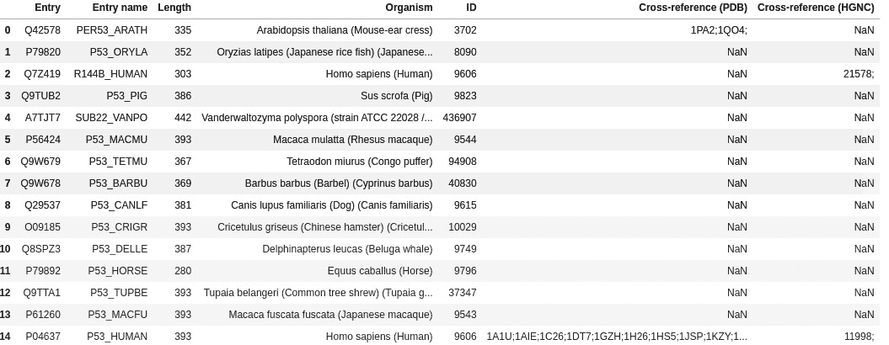
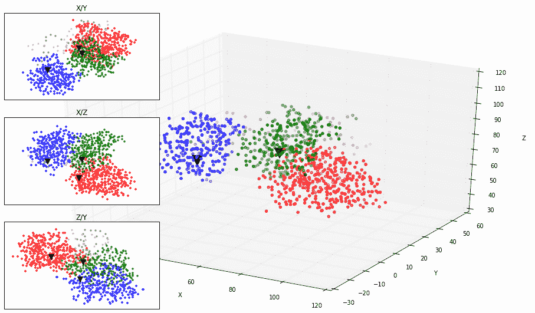
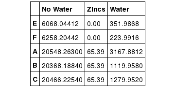
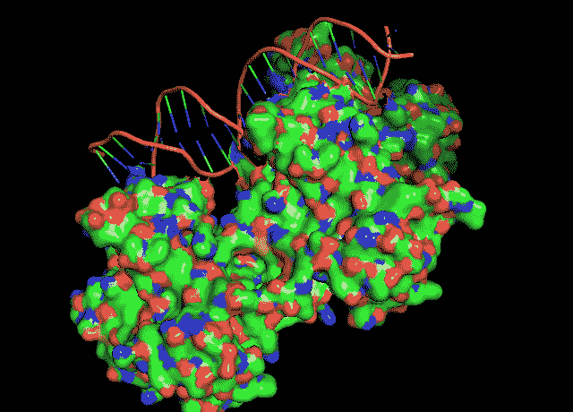

# 八、使用蛋白质数据库

蛋白质组学是对蛋白质的研究，包括它们的功能和结构。该领域的主要目标之一是表征蛋白质的三维结构。蛋白质组学领域最广为人知的计算资源之一是**蛋白质数据库** ( **PDB** )，这是一个拥有大生物分子结构数据的存储库。当然，许多数据库反而关注蛋白质一级结构；这些有点类似于我们在 [*第二章*](02.html#_idTextAnchor040) 、*了解 NumPy、pandas、Arrow 和 Matplotlib* 中看到的基因组数据库。

在本章中，我们将主要关注处理来自 PDB 的数据。我们将看看如何解析 PDB 文件，执行一些几何计算，并可视化分子。我们将使用旧的 PDB 文件格式，因为从概念上讲，它允许您在稳定的环境中执行大多数必要的操作。话虽如此，预定取代 PDB 格式的较新的 mmCIF 也将出现在用 Biopython 方法解析 mmCIF 文件的*中。我们将使用 Biopython 并引入 PyMOL 进行可视化。我们不会在这里讨论分子对接，因为这可能更适合一本关于化学信息学的书。*

在本章中，我们将使用一个蛋白质的经典例子:肿瘤蛋白 p53，一种参与细胞周期调节(例如，凋亡)的蛋白质。这种蛋白质与癌症高度相关。网上有大量关于这种蛋白质的信息。

让我们从你现在应该更熟悉的东西开始:访问数据库，特别是蛋白质的一级结构(如氨基酸序列)。

在本章中，我们将介绍以下配方:

*   在多个数据库中查找蛋白质
*   介绍生物。物理数据库
*   从 PDB 文件中提取更多信息
*   在 PDB 文件上计算分子距离
*   执行几何运算
*   使用 PyMOL 制作动画
*   用 Biopython 解析 mmCIF 文件

# 在多个数据库中寻找一种蛋白质

在我们开始执行更多的结构生物学之前，我们将看看如何访问现有的蛋白质组数据库，如 UniProt。我们将在 UniProt 中查询我们感兴趣的基因 *TP53* ，并从那里获取它。

## 准备就绪

为了访问数据，我们将使用 Biopython 和 REST API(我们在第 5 章 、*使用基因组*中使用了类似的方法)和`requests`库来访问 web APIs。`requests` API 是一个易于使用的 web 请求包装器，可以使用标准的 Python 机制安装(例如，`pip`和`conda`)。你可以在`Chapter08/Intro.py`的笔记本文件中找到这个内容。

## 怎么做...

看看下面的步骤:

1.  首先，让我们定义一个函数在 UniProt 上执行 REST 查询，如下:

    ```py
    import requests
    server = 'http://www.uniprot.org/uniprot'
    def do_request(server, ID='', **kwargs):
        params = ''
        req = requests.get('%s/%s%s' % (server, ID, params), params=kwargs)
        if not req.ok:
            req.raise_for_status()
        return req
    ```

2.  我们现在可以查询所有已经审核过的`p53`基因:

    ```py
    req = do_request(server, query='gene:p53 AND reviewed:yes', format='tab',
     columns='id,entry name,length,organism,organism-id,database(PDB),database(HGNC)',
     limit='50')
    ```

我们将查询`p53`基因，并请求查看所有已审核的条目(如手动管理的)。输出将是表格格式。我们将要求最多 50 个结果，指定所需的列。

我们可以将输出限制为人类数据，但是在这个例子中，让我们包括所有可用的物种。

1.  让我们检查一下结果，如下:

    ```py
    import pandas as pd
    import io
    uniprot_list = pd.read_table(io.StringIO(req.text))
    uniprot_list.rename(columns={'Organism ID': 'ID'}, inplace=True)
    print(uniprot_list)
    ```

我们使用`pandas`来简化制表符分隔的列表的处理和漂亮的打印。笔记本的节略输出如下:



图 8.1 -有 TP53 蛋白的物种简表

1.  现在，我们可以获得人类`p53`的 ID，并使用 Biopython 来检索和解析`SwissProt`记录:

    ```py
    from Bio import ExPASy, SwissProt
    p53_human = uniprot_list[
        (uniprot_list.ID == 9606) &
        (uniprot_list['Entry name'].str.contains('P53'))]['Entry'].iloc[0] 
    handle = ExPASy.get_sprot_raw(p53_human)
    sp_rec = SwissProt.read(handle)
    ```

然后我们使用 Biopython 的`SwissProt`模块来解析记录。`9606`是人类的 NCBI 分类代码。

通常，如果您的网络服务出现错误，可能是网络或服务器问题。如果是这种情况，请稍后重试。

1.  我们来看看`p53`的记录，如下:

    ```py
    print(sp_rec.entry_name, sp_rec.sequence_length, sp_rec.gene_name)
    print(sp_rec.description)
    print(sp_rec.organism, sp_rec.seqinfo)
    print(sp_rec.sequence)
    print(sp_rec.comments)
    print(sp_rec.keywords)
    ```

输出如下:

```py
P53_HUMAN 393 Name=TP53; Synonyms=P53;
 RecName: Full=Cellular tumor antigen p53; AltName: Full=Antigen NY-CO-13; AltName: Full=Phosphoprotein p53; AltName: Full=Tumor suppressor p53;
 Homo sapiens (Human). (393, 43653, 'AD5C149FD8106131')
 MEEPQSDPSVEPPLSQETFSDLWKLLPENNVLSPLPSQAMDDLMLSPDDIEQWFTED PGPDEAPRMPEAAPPVAPAPAAPTPAAPAPAPSWPLSSSVPSQKTYQGSYGFRLGF LHSGTAKSVTCTYSPALNKMFCQLAKTCPVQLWVDSTPPPGTRVRAMAIYKQSQHM TEVVRRCPHHERCSDSDGLAPPQHLIRVEGNLRVEYLDDRNTFRHSVVVPYEPPEVG SDCTTIHYNYMCNSSCMGGMNRRPILTIITLEDSSGNLLGRNSFEVRVCACPGRDRR TEEENLRKKGEPHHELPPGSTKRALPNNTSSSPQPKKKPLDGEYFTLQIRGRERFEM FRELNEALELKDAQAGKEPGGSRAHSSHLKSKKGQSTSRHKKLMFKTEGPDSD
```

1.  深入查看前面的记录会发现很多非常有趣的信息，特别是关于特征、**基因本体** ( **GO** )和数据库`cross_references` :

    ```py
    from collections import defaultdict
    done_features = set()
    print(len(sp_rec.features))
    for feature in sp_rec.features:
        if feature[0] in done_features:
            continue
        else:
            done_features.add(feature[0])
            print(feature)
    print(len(sp_rec.cross_references))
    per_source = defaultdict(list)
    for xref in sp_rec.cross_references:
        source = xref[0]
        per_source[source].append(xref[1:])
    print(per_source.keys())
    done_GOs = set()
    print(len(per_source['GO']))
    for annot in per_source['GO']:
        if annot[1][0] in done_GOs:
            continue
        else:
            done_GOs.add(annot[1][0])
            print(annot)
    ```

注意我们甚至没有在这里打印所有的信息，只是一个摘要。我们打印了序列的许多特征，每种类型一个例子，许多外部数据库引用，加上被引用的数据库，许多 GO 条目，以及三个例子。目前，仅这种蛋白质就有 1509 个特征、923 个外部参考和 173 个 GO 术语。这里是一个高度删节版的输出:

```py
Total features: 1509
type: CHAIN
location: [0:393]
id: PRO_0000185703
qualifiers:
 Key: note, Value: Cellular tumor antigen p53
type: DNA_BIND
location: [101:292]
qualifiers:
type: REGION
location: [0:320]
qualifiers:
 Key: evidence, Value: ECO:0000269|PubMed:25732823
 Key: note, Value: Interaction with CCAR2
[...]
Cross references:  923
dict_keys(['EMBL', 'CCDS', 'PIR', 'RefSeq', 'PDB', 'PDBsum', 'BMRB', 'SMR', 'BioGRID', 'ComplexPortal', 'CORUM', 'DIP', 'ELM', 'IntAct', 'MINT', 'STRING', 'BindingDB', 'ChEMBL', 'DrugBank', 'MoonDB', 'TCDB', 'GlyGen', 'iPTMnet', 'MetOSite', 'PhosphoSitePlus', 'BioMuta', 'DMDM', 'SWISS-2DPAGE', 'CPTAC', 'EPD', 'jPOST', 'MassIVE', 'MaxQB', 'PaxDb', 'PeptideAtlas', 'PRIDE', 'ProteomicsDB', 'ABCD', 'Antibodypedia', 'CPTC', 'DNASU', 'Ensembl', 'GeneID', 'KEGG', 'MANE-Select', 'UCSC', 'CTD', 'DisGeNET', 'GeneCards', 'GeneReviews', 'HGNC', 'HPA', 'MalaCards', 'MIM', 'neXtProt', 'OpenTargets', 'Orphanet', 'PharmGKB', 'VEuPathDB', 'eggNOG', 'GeneTree', 'InParanoid', 'OMA', 'OrthoDB', 'PhylomeDB', 'TreeFam', 'PathwayCommons', 'Reactome', 'SABIO-RK', 'SignaLink', 'SIGNOR', 'BioGRID-ORCS', 'ChiTaRS', 'EvolutionaryTrace', 'GeneWiki', 'GenomeRNAi', 'Pharos', 'PRO', 'Proteomes', 'RNAct', 'Bgee', 'ExpressionAtlas', 'Genevisible', 'GO', 'CDD', 'DisProt', 'Gene3D', 'IDEAL', 'InterPro', 'PANTHER', 'Pfam', 'PRINTS', 'SUPFAM', 'PROSITE'])
Annotation SOURCES: 173
('GO:0005813', 'C:centrosome', 'IDA:UniProtKB')
('GO:0036310', 'F:ATP-dependent DNA/DNA annealing activity', 'IDA:UniProtKB')
('GO:0006914', 'P:autophagy', 'IMP:CAFA')
```

## 还有更多

还有更多关于蛋白质信息的数据库——其中一些在前面的记录中提到过。您可以探索其结果，尝试在其他地方找到数据。关于 UniProt 的 REST 接口的详细信息，请参考[http://www.uniprot.org/help/programmatic_access](http://www.uniprot.org/help/programmatic_access)。

# 介绍简历。物理数据库

在这里，我们将介绍 Biopython 的`PDB`模块，用于处理 PDB。我们将使用代表部分`p53`蛋白质的三个模型。你可以在 http://www.rcsb.org/pdb/101/motm.do?momID=31[和](http://www.rcsb.org/pdb/101/motm.do?momID=31)阅读更多关于和`p53`的文件。

## 准备就绪

您应该已经知道模型、链、剩余和原子对象的基本数据模型。在[http://bio python . org/wiki/The _ bio python _ Structural _ bio informatics _ FAQ](http://biopython.org/wiki/The_Biopython_Structural_Bioinformatics_FAQ)可以找到关于 *Biopython 的结构生物信息学 FAQ* 的一个很好的解释。

你可以在`Chapter08/PDB.py`笔记本文件里找到这个内容。

在我们将下载的三个模型中，`1TUP`模型是将在剩余的食谱中使用的模型。花些时间研究一下这个模型，因为它会在以后对你有所帮助。

## 怎么做...

看看下面的步骤:

1.  首先，让我们检索我们感兴趣的模型，如下:

    ```py
    from Bio import PDB
    repository = PDB.PDBList()
    repository.retrieve_pdb_file('1TUP', pdir='.', file_format='pdb')
    repository.retrieve_pdb_file('1OLG', pdir='.', file_format='pdb')
    repository.retrieve_pdb_file('1YCQ', pdir='.', file_format='pdb')
    ```

注意，`Bio.PDB`会帮你下载文件。此外，这些下载只有在没有本地副本的情况下才会发生。

1.  让我们解析我们的记录，如下面的代码所示:

    ```py
    parser = PDB.PDBParser()
    p53_1tup = parser.get_structure('P 53 - DNA Binding', 'pdb1tup.ent')
    p53_1olg = parser.get_structure('P 53 - Tetramerization', 'pdb1olg.ent')
    p53_1ycq = parser.get_structure('P 53 - Transactivation', 'pdb1ycq.ent')
    ```

您可能会收到一些关于文件内容的警告。这些通常不会有问题。

1.  让我们检查一下我们的标题，如下:

    ```py
    def print_pdb_headers(headers, indent=0):
       ind_text = ' ' * indent
       for header, content in headers.items():
           if type(content) == dict:
              print('\n%s%20s:' % (ind_text, header))
              print_pdb_headers(content, indent + 4)
              print()
           elif type(content) == list:
              print('%s%20s:' % (ind_text, header))
              for elem in content:
                  print('%s%21s %s' % (ind_text, '->', elem))
          else:
              print('%s%20s: %s' % (ind_text, header, content))
    print_pdb_headers(p53_1tup.header)
    ```

头被解析为字典的字典。因此，我们将使用递归函数来解析它们。这个函数将增加缩进以方便阅读，并用前缀`->`注释元素列表。递归函数的例子，参考上一章 [*第七章*](07.html#_idTextAnchor183)*种系学*。关于 Python 中递归的高级讨论，请阅读最后一章 [*第 12 章*](12.html#_idTextAnchor294) 、*生物信息学函数编程*。简短的输出如下:

```py
 name: tumor suppressor p53 complexed with dna
 head: antitumor protein/dna
 idcode: 1TUP
 deposition_date: 1995-07-11
 release_date: 1995-07-11
 structure_method: x-ray diffraction
 resolution: 2.2
 structure_reference:
 -> n.p.pavletich,k.a.chambers,c.o.pabo the dna-binding domain of p53 contains the four conserved regions and the major mutation hot spots genes dev. v. 7 2556 1993 issn 0890-9369 
 author: Y.Cho,S.Gorina,P.D.Jeffrey,N.P.Pavletich
 compound:
 2:
 misc: 
 molecule: dna (5'-d(*ap*tp*ap*ap*tp*tp*gp*gp*gp*cp*ap*ap*gp*tp*cp*tp*a p*gp*gp*ap*a)-3') 
 chain: f
 engineered: yes
has_missing_residues: True
 missing_residues:
 -> {'model': None, 'res_name': 'ARG', 'chain': 'A', 'ssseq': 290, 'insertion': None}
keywords: antigen p53, antitumor protein/dna complex
 journal: AUTH   Y.CHO,S.GORINA,P.D.JEFFREY,N.P.PAVLETICHTITL   CRYSTAL STRUCTURE OF A P53 TUMOR SUPPRESSOR-DNATITL 2 COMPLEX: UNDERSTANDING TUMORIGENIC MUTATIONS.REF    SCIENCE57
```

1.  我们想知道这些文件上每个链的内容；为此，我们来看看`COMPND`记录:

    ```py
    print(p53_1tup.header['compound'])
    print(p53_1olg.header['compound'])
    print(p53_1ycq.header['compound'])
    ```

这将返回前面代码中打印的所有复合头。不幸的是，这不是获取链信息的最佳方式。另一种方法是获取`DBREF`记录，但是 Biopython 的解析器目前无法访问这些记录。说到这里，使用`grep`这样的工具会很容易提取出这些信息。

注意，对于`1TUP`模型，链`A`、`B`和`C`来自蛋白质，而链`E`和`F`来自 DNA。这个信息将来会有用的。

1.  让我们对每个`PDB`文件进行自顶向下的分析。现在，让我们得到所有的链，残基的数量，和每个链的原子，如下:

    ```py
    def describe_model(name, pdb):
    print()
    for model in pdb:
        for chain in model:
            print('%s - Chain: %s. Number of residues: %d. Number of atoms: %d.' %
                  (name, chain.id, len(chain), len(list(chain.get_atoms()))))
    describe_model('1TUP', p53_1tup)
    describe_model('1OLG', p53_1olg)
    describe_model('1YCQ', p53_1ycq)
    ```

我们将在后面的菜谱中执行自底向上的方法。以下是`1TUP`的输出:

```py
1TUP - Chain: E. Number of residues: 43\. Number of atoms: 442.
1TUP - Chain: F. Number of residues: 35\. Number of atoms: 449.
1TUP - Chain: A. Number of residues: 395\. Number of atoms: 1734.
1TUP - Chain: B. Number of residues: 265\. Number of atoms: 1593.
1TUP - Chain: C. Number of residues: 276\. Number of atoms: 1610.

1OLG - Chain: A. Number of residues: 42\. Number of atoms: 698.
1OLG - Chain: B. Number of residues: 42\. Number of atoms: 698.
1OLG - Chain: C. Number of residues: 42\. Number of atoms: 698.
1OLG - Chain: D. Number of residues: 42\. Number of atoms: 698.

1YCQ - Chain: A. Number of residues: 123\. Number of atoms: 741.
1YCQ - Chain: B. Number of residues: 16\. Number of atoms: 100.
```

1.  让我们在`1TUP`模型中得到除水以外的所有非标准残留物(`HETATM`)，如下面的代码所示:

    ```py
    for residue in p53_1tup.get_residues():
        if residue.id[0] in [' ', 'W']:
            continue
    print(residue.id)
    ```

我们有三个锌，每个蛋白质链一个。

1.  我们来看一个残:

    ```py
    res = next(p53_1tup[0]['A'].get_residues())
    print(res)
    for atom in res:
        print(atom, atom.serial_number, atom.element)
    p53_1tup[0]['A'][94]['CA']
    ```

这将打印出某个残留物中的所有原子:

```py
<Residue SER het=  resseq=94 icode= >
 <Atom N> 858 N
 <Atom CA> 859 C
 <Atom C> 860 C
 <Atom O> 861 O
 <Atom CB> 862 C
 <Atom OG> 863 O
 <Atom CA>
```

注意最后一句话。它只是向您展示，您可以通过解析模型、链、剩余，最后是原子，来直接访问原子。

1.  最后，让我们将蛋白质片段导出到 FASTA 文件，如下:

    ```py
    from Bio.SeqIO import PdbIO, FastaIO
    def get_fasta(pdb_file, fasta_file, transfer_ids=None):
        fasta_writer = FastaIO.FastaWriter(fasta_file)
        fasta_writer.write_header()
        for rec in PdbIO.PdbSeqresIterator(pdb_file):
            if len(rec.seq) == 0:
                continue
            if transfer_ids is not None and rec.id not in transfer_ids:
                continue
            print(rec.id, rec.seq, len(rec.seq))
            fasta_writer.write_record(rec)

    get_fasta(open('pdb1tup.ent'), open('1tup.fasta', 'w'), transfer_ids=['1TUP:B'])
    get_fasta(open('pdb1olg.ent'), open('1olg.fasta', 'w'), transfer_ids=['1OLG:B'])
    get_fasta(open('pdb1ycq.ent'), open('1ycq.fasta', 'w'), transfer_ids=['1YCQ:B'])
    ```

如果你检查蛋白质链，你会看到它们在每个模型中都是相等的，所以我们只输出一个。在`1YCQ`的情况下，我们导出最小的一个，因为最大的一个与`p53`无关。如你所见，在这里，我们使用的是`Bio.SeqIO`，而不是`Bio.PDB`。

## 还有更多

PDB 语法分析器不完整。不太可能很快看到完整的解析器，因为社区正在迁移到 mmCIF 格式。

虽然未来是 mmCIF 格式([http://mmcif.wwpdb.org/](http://mmcif.wwpdb.org/))，但 PDB 文件依然存在。从概念上讲，解析文件后，许多操作都是相似的。

# 从 PDB 文件中提取更多信息

在这里，我们将继续探索由`Bio.PDB`从 PDB 文件产生的记录结构。

## 准备就绪

有关我们正在使用的 PDB 模型的一般信息，请参考之前的配方。

你可以在`Chapter08/Stats.py`笔记本文件里找到这个内容。

## 怎么做...

我们将按照以下步骤开始:

1.  首先我们检索一下`1TUP`，如下:

    ```py
    from Bio import PDB
    repository = PDB.PDBList()
    parser = PDB.PDBParser()
    repository.retrieve_pdb_file('1TUP', pdir='.', file_format='pdb') p53_1tup = parser.get_structure('P 53', 'pdb1tup.ent')
    ```

2.  然后，提取一些原子相关的统计:

    ```py
    from collections import defaultdict
    atom_cnt = defaultdict(int)
    atom_chain = defaultdict(int)
    atom_res_types = defaultdict(int)
    for atom in p53_1tup.get_atoms():
        my_residue = atom.parent
        my_chain = my_residue.parent
        atom_chain[my_chain.id] += 1
        if my_residue.resname != 'HOH':
            atom_cnt[atom.element] += 1
        atom_res_types[my_residue.resname] += 1
    print(dict(atom_res_types))
    print(dict(atom_chain))
    print(dict(atom_cnt))
    ```

这将打印原子的残基类型、每条链的原子数以及每种元素的数量，如下所示:

```py
{' DT': 257, ' DC': 152, ' DA': 270, ' DG': 176, 'HOH': 384, 'SER': 323, 'VAL': 315, 'PRO': 294, 'GLN': 189, 'LYS': 135, 'THR': 294, 'TYR': 288, 'GLY': 156, 'PHE': 165, 'ARG': 561, 'LEU': 336, 'HIS': 210, 'ALA': 105, 'CYS': 180, 'ASN': 216, 'MET': 144, 'TRP': 42, 'ASP': 192, 'ILE': 144, 'GLU': 297, ' ZN': 3}
 {'E': 442, 'F': 449, 'A': 1734, 'B': 1593, 'C': 1610}
 {'O': 1114, 'C': 3238, 'N': 1001, 'P': 40, 'S': 48, 'ZN': 3}
```

注意前面的残基数并不是恰当的残基数，而是某个残基类型被引用的次数(加起来是原子数，不是残基)。

请注意水(`W`)、核苷酸(`DA`、`DC`、`DG`和`DT`)和锌(`ZN`)残基，它们添加到氨基酸残基中。

1.  现在，让我们计算每个残基的实例数和每个链的残基数:

    ```py
    res_types = defaultdict(int)
    res_per_chain = defaultdict(int)
    for residue in p53_1tup.get_residues():
    res_types[residue.resname] += 1
    res_per_chain[residue.parent.id] +=1
    print(dict(res_types))
    print(dict(res_per_chain))
    ```

以下是输出:

```py
{' DT': 13, ' DC': 8, ' DA': 13, ' DG': 8, 'HOH': 384, 'SER': 54, 'VAL': 45, 'PRO': 42, 'GLN': 21, 'LYS': 15, 'THR': 42, 'TYR': 24, 'GLY': 39, 'PHE': 15, 'ARG': 51, 'LEU': 42, 'HIS': 21, 'ALA': 21, 'CYS': 30, 'ASN': 27, 'MET': 18, 'TRP': 3, 'ASP': 24, 'ILE': 18, 'GLU': 33, ' ZN': 3}
 {'E': 43, 'F': 35, 'A': 395, 'B': 265, 'C': 276}
```

1.  我们还可以得到一组原子的界限:

    ```py
    import sys
    def get_bounds(my_atoms):
        my_min = [sys.maxsize] * 3
        my_max = [-sys.maxsize] * 3
        for atom in my_atoms:
            for i, coord in enumerate(atom.coord):
                if coord < my_min[i]:
                    my_min[i] = coord
                if coord > my_max[i]:
                    my_max[i] = coord
        return my_min, my_max
    chain_bounds = {}
    for chain in p53_1tup.get_chains():
        print(chain.id, get_bounds(chain.get_atoms()))
        chain_bounds[chain.id] = get_bounds(chain.get_atoms())
    print(get_bounds(p53_1tup.get_atoms()))
    ```

一组原子可以是一个整体模型，一条链，一个残基，或者任何你感兴趣的子集。在这种情况下，我们将打印所有链和整个模型的边界。数字不能如此直观地表达出来，所以我们会用更多的图形来表达。

1.  为了获得每个链的大小的概念，一个图可能比前面代码中的数字更能提供信息:

    ```py
    import matplotlib.pyplot as plt
    from mpl_toolkits.mplot3d import Axes3D
    fig = plt.figure(figsize=(16, 9))
    ax3d = fig.add_subplot(111, projection='3d')
    ax_xy = fig.add_subplot(331)
    ax_xy.set_title('X/Y')
    ax_xz = fig.add_subplot(334)
    ax_xz.set_title('X/Z')
    ax_zy = fig.add_subplot(337)
    ax_zy.set_title('Z/Y')
    color = {'A': 'r', 'B': 'g', 'C': 'b', 'E': '0.5', 'F': '0.75'}
    zx, zy, zz = [], [], []
    for chain in p53_1tup.get_chains():
        xs, ys, zs = [], [], []
        for residue in chain.get_residues():
            ref_atom = next(residue.get_iterator())
            x, y, z = ref_atom.coord
            if ref_atom.element == 'ZN':
                zx.append(x)
                zy.append(y)
                zz.append(z)
                continue
            xs.append(x)
            ys.append(y)
            zs.append(z)
        ax3d.scatter(xs, ys, zs, color=color[chain.id])
        ax_xy.scatter(xs, ys, marker='.', color=color[chain.id])
        ax_xz.scatter(xs, zs, marker='.', color=color[chain.id])
        ax_zy.scatter(zs, ys, marker='.', color=color[chain.id])
    ax3d.set_xlabel('X')
    ax3d.set_ylabel('Y')
    ax3d.set_zlabel('Z')
    ax3d.scatter(zx, zy, zz, color='k', marker='v', s=300)
    ax_xy.scatter(zx, zy, color='k', marker='v', s=80)
    ax_xz.scatter(zx, zz, color='k', marker='v', s=80)
    ax_zy.scatter(zz, zy, color='k', marker='v', s=80)
    for ax in [ax_xy, ax_xz, ax_zy]:
        ax.get_yaxis().set_visible(False)
        ax.get_xaxis().set_visible(False)
    ```

有大量的分子可视化工具。事实上，我们稍后将讨论 PyMOL。但是，`matplotlib`对于简单的可视化来说已经足够了。关于`matplotlib`最重要的一点是它很稳定，非常容易集成到可靠的产品代码中。

在下面的图表中，我们绘制了一个链的三维图，DNA 用灰色表示，蛋白质链用不同的颜色表示。我们还在下图的左侧绘制了平面投影( **X/Y** 、 **X/Z** 和 **Z/Y** ):



图 8.2 -蛋白质链的空间分布-主图是一个 3D 图，左边的子图是平面图(X/Y、X/Z 和 Z/Y)

# 在 PDB 文件上计算分子距离

在这里，我们将在`1TUP`模型的中找到更接近三个锌的原子。我们将考虑到这些锌的几个距离。我们将借此机会讨论算法的性能。

## 准备就绪

你可以在`Chapter08/Distance.py`笔记本文件里找到这个内容。

## 怎么做...

看看下面的步骤:

1.  让我们加载我们的模型，如下:

    ```py
    from Bio import PDB
    repository = PDB.PDBList()
    parser = PDB.PDBParser()
    repository.retrieve_pdb_file('1TUP', pdir='.', file_format='pdb')
    p53_1tup = parser.get_structure('P 53', 'pdb1tup.ent')
    ```

2.  我们现在将得到我们的 zincs，稍后我们将进行比较:

    ```py
    zns = []for atom in p53_1tup.get_atoms():
    if atom.element == 'ZN':
    zns.append(atom)
    for zn in zns:
        print(zn, zn.coord)
    ```

你应该看到三个锌原子。

1.  现在，让我们定义一个函数来得到一个原子和一组其他原子之间的距离，如下:

    ```py
    import math
    def get_closest_atoms(pdb_struct, ref_atom, distance):
        atoms = {}
        rx, ry, rz = ref_atom.coord
        for atom in pdb_struct.get_atoms():
            if atom == ref_atom:
                continue
            x, y, z = atom.coord
            my_dist = math.sqrt((x - rx)**2 + (y - ry)**2 + (z - rz)**2)
            if my_dist < distance:
                atoms[atom] = my_dist
        return atoms
    ```

我们得到参考原子的坐标，然后迭代我们想要的比较列表。如果一个原子足够近，它会被添加到`return`列表中。

1.  我们现在计算我们的锌附近的原子，对于我们的模型来说，它们的距离可以达到 4 ng strm:

    ```py
    for zn in zns:
        print()
        print(zn.coord)
        atoms = get_closest_atoms(p53_1tup, zn, 4)
        for atom, distance in atoms.items():
            print(atom.element, distance, atom.coord)
    ```

这里，我们显示了第一个锌的结果，包括元素、距离和坐标:

```py
[58.108 23.242 57.424]
 C 3.4080117696286854 [57.77  21.214 60.142]
 S 2.3262243799594877 [57.065 21.452 58.482]
 C 3.4566537492335123 [58.886 20.867 55.036]
 C 3.064120559761192 [58.047 22.038 54.607]
 N 1.9918273537290707 [57.755 23.073 55.471]
 C 2.9243719601324525 [56.993 23.943 54.813]
 C 3.857729198122736 [61.148 25.061 55.897]
 C 3.62725094648044 [61.61  24.087 57.001]
 S 2.2789209624943494 [60.317 23.318 57.979]
 C 3.087214470667822 [57.205 25.099 59.719]
 S 2.2253158446520818 [56.914 25.054 57.917]
```

我们只有三个 zincs，所以计算量大大减少了。然而，想象我们有更多的原子，或者我们正在对集合中的所有原子进行成对比较(记住，在成对的情况下，比较的数量随着原子数量的二次方增长)。虽然我们的案例很小，但是预测用例并不难，而更多的比较会花费很多时间。我们将很快回到这个话题。

1.  让我们看看随着距离的增加，我们得到了多少个原子:

    ```py
    for distance in [1, 2, 4, 8, 16, 32, 64, 128]:
        my_atoms = []
        for zn in zns:
            atoms = get_closest_atoms(p53_1tup, zn, distance)
            my_atoms.append(len(atoms))
        print(distance, my_atoms)
    ```

结果如下:

```py
1 [0, 0, 0]
2 [1, 0, 0]
4 [11, 11, 12]
8 [109, 113, 106]
16 [523, 721, 487]
32 [2381, 3493, 2053]
64 [5800, 5827, 5501]
128 [5827, 5827, 5827]
```

1.  正如我们之前看到的一样，这个特定的案例并不十分昂贵，但我们还是来计时吧:

    ```py
    import timeit
    nexecs = 10
    print(timeit.timeit('get_closest_atoms(p53_1tup, zns[0], 4.0)',
          'from __main__ import get_closest_atoms, p53_1tup, zns',
          number=nexecs) / nexecs * 1000)
    ```

这里，我们将使用`timeit`模块执行这个函数 10 次，然后以毫秒为单位打印结果。我们将该函数作为一个字符串传递，然后传递另一个带有必要导入的字符串，以使该函数工作。在笔记本上，你可能意识到了`%timeit`的魔力，以及在这种情况下它如何让你的生活变得更加轻松。在测试代码的机器上，这大约需要 40 毫秒。显然，在你的电脑上，你会得到一些不同的结果。

1.  我们能做得更好吗？让我们考虑一个不同的`distance`函数，如下面的代码所示:

    ```py
    def get_closest_alternative(pdb_struct, ref_atom, distance):
        atoms = {}
        rx, ry, rz = ref_atom.coord
        for atom in pdb_struct.get_atoms():
            if atom == ref_atom:
                continue
            x, y, z = atom.coord
            if abs(x - rx) > distance or abs(y - ry) > distance or abs(z - rz) > distance:
                continue
            my_dist = math.sqrt((x - rx)**2 + (y - ry)**2 + (z - rz)**2)
            if my_dist < distance:
                atoms[atom] = my_dist
        return atoms
    ```

所以，我们用最初的函数加上一个非常简单的距离函数`if`。这样做的理由是平方根的计算成本，也许还有浮点幂运算，非常昂贵，所以我们会尽量避免。但是，对于任何维度上所有比目标距离更近的原子，这个函数的代价会更大。

1.  现在，让我们来对抗它:

    ```py
    print(timeit.timeit('get_closest_alternative(p53_1tup, zns[0], 4.0)',
          'from __main__ import get_closest_alternative, p53_1tup, zns',
          number=nexecs) / nexecs * 1000)
    ```

在我们在前一个例子中使用的同一台机器上，它需要 16 毫秒，这意味着它大约快了三倍。

1.  然而，这样总是更好吗？我们来比较一下不同距离的成本，如下:

    ```py
    print('Standard')
    for distance in [1, 4, 16, 64, 128]:
        print(timeit.timeit('get_closest_atoms(p53_1tup, zns[0], distance)',
              'from __main__ import get_closest_atoms, p53_1tup, zns, distance',
              number=nexecs) / nexecs * 1000)
    print('Optimized')
    for distance in [1, 4, 16, 64, 128]:
        print(timeit.timeit('get_closest_alternative(p53_1tup, zns[0], distance)',
              'from __main__ import get_closest_alternative, p53_1tup, zns, distance',
              number=nexecs) / nexecs * 1000)
    ```

结果是下面的输出中显示的:

```py
Standard
 85.08649739999328
 86.50681579999855
 86.79630599999655
 96.95437099999253
 96.21982420001132
 Optimized
 30.253444099980698
 32.69531210000878
 52.965772600009586
 142.53310030001103
 141.26269519999823
```

请注意，标准版本的成本基本不变，而优化版本的成本则根据最近原子的距离而变化；距离越大，使用额外的`if`加上平方根计算的情况就越多，使得函数的开销更大。

这里更重要的一点是，你可以使用智能计算的快捷方式来编码更有效的函数，但是复杂性成本可能会发生质的变化。在前一种情况下，我建议当你试图寻找最近的原子时，第二个函数对所有现实和有趣的情况都更有效。然而，在设计你自己版本的优化算法时，你必须小心。

# 执行几何运算

我们现在将使用几何信息执行计算，包括计算链条和整个模型的质心。

## 准备就绪

你可以在`Chapter08/Mass.py`笔记本文件里找到这个内容。

## 怎么做...

让我们来看看以下步骤:

1.  首先，让我们检索数据:

    ```py
    from Bio import PDB
    repository = PDB.PDBList()
    parser = PDB.PDBParser()
    repository.retrieve_pdb_file('1TUP', pdir='.', file_format='pdb')
    p53_1tup = parser.get_structure('P 53', 'pdb1tup.ent')
    ```

2.  然后，让我们用下面的代码回忆一下残基的类型:

    ```py
    my_residues = set()
    for residue in p53_1tup.get_residues():
        my_residues.add(residue.id[0])
    print(my_residues)
    ```

所以，我们有`H_ ZN`(锌)`W`(水)，是`HETATM`型；绝大多数是标准的 PDB 原子。

1.  让我们用下面的代码计算所有链条、锌和水的质量:

    ```py
    def get_mass(atoms, accept_fun=lambda atom: atom.parent.id[0] != 'W'):
        return sum([atom.mass for atom in atoms if accept_fun(atom)])
    chain_names = [chain.id for chain in p53_1tup.get_chains()]
    my_mass = np.ndarray((len(chain_names), 3))
    for i, chain in enumerate(p53_1tup.get_chains()):
        my_mass[i, 0] = get_mass(chain.get_atoms())
        my_mass[i, 1] = get_mass(chain.get_atoms(),
            accept_fun=lambda atom: atom.parent.id[0] not in [' ', 'W'])
        my_mass[i, 2] = get_mass(chain.get_atoms(),
            accept_fun=lambda atom: atom.parent.id[0] == 'W')
    masses = pd.DataFrame(my_mass, index=chain_names, columns=['No Water','Zincs', 'Water'])
    print(masses)
    ```

`get_mass`函数返回列表中通过验收标准函数的所有原子的质量。这里，默认的验收标准包括不成为水残留物。

然后我们计算所有链的质量。我们有三种版本:只有氨基酸、锌和水。在这个模型中，锌只检测每个链上的一个原子。输出如下所示:



图 8.3 -所有蛋白质链的质量

1.  让我们计算模型的几何中心和质心，如下:

    ```py
    def get_center(atoms,
        weight_fun=lambda atom: 1 if atom.parent.id[0] != 'W' else 0):
        xsum = ysum = zsum = 0.0
        acum = 0.0
        for atom in atoms:
            x, y, z = atom.coord
            weight = weight_fun(atom)
            acum += weight
            xsum += weight * x
            ysum += weight * y
            zsum += weight * z
        return xsum / acum, ysum / acum, zsum / acum
    print(get_center(p53_1tup.get_atoms()))
    print(get_center(p53_1tup.get_atoms(),
        weight_fun=lambda atom: atom.mass if atom.parent.id[0] != 'W' else 0))
    ```

首先，我们定义一个权函数来获得中心的坐标。默认函数将所有的原子视为平等的，只要它们不是水的残留物。

然后，我们通过用每个原子等于其质量的值重新定义`weight`函数来计算几何中心和质心。计算几何中心，不考虑其分子量。

例如，您可能想要计算没有 DNA 链的蛋白质的质心。

1.  让我们计算每个链条的质心和几何中心，如下:

    ```py
    my_center = np.ndarray((len(chain_names), 6))
    for i, chain in enumerate(p53_1tup.get_chains()):
        x, y, z = get_center(chain.get_atoms())
        my_center[i, 0] = x
        my_center[i, 1] = y
        my_center[i, 2] = z
        x, y, z = get_center(chain.get_atoms(),
            weight_fun=lambda atom: atom.mass if atom.parent.id[0] != 'W' else 0)
        my_center[i, 3] = x
        my_center[i, 4] = y
        my_center[i, 5] = z
    weights = pd.DataFrame(my_center, index=chain_names,
        columns=['X', 'Y', 'Z', 'X (Mass)', 'Y (Mass)', 'Z (Mass)'])
    print(weights)
    ```

结果是这里显示的:


图 8.4 -每个蛋白质链的质心和几何中心

## 还有更多

虽然这不是一本基于蛋白质结构测定技术的书，但重要的是要记住 X 射线结晶学方法不能检测氢，所以计算残留物的质量可能是基于非常不准确的模型；更多信息请参考[http://www . umass . edu/microbio/chime/PE _ beta/PE/prot expl/help _ hyd . htm](http://www.umass.edu/microbio/chime/pe_beta/pe/protexpl/help_hyd.htm)。

# 使用 PyMOL 制作动画

这里，我们将制作一个 p53 `1TUP`模型的视频。为此，我们将使用 PyMOL 可视化库。我们将通过围绕 p53 `1TUP`模型移动然后放大来开始我们的动画；当我们放大时，我们会改变渲染策略，以便您可以更深入地看到模型。你可以找到你将在[https://odysee.com/@Python:8/protein_video:8](https://odysee.com/@Python:8/protein_video:8%20)制作的视频版本。

## 准备就绪

这个食谱将以 Python 脚本的形式呈现，而不是以笔记本的形式。这主要是因为输出不是交互式的，而是一组需要进一步后期处理的图像文件。

你需要安装PyMOL(【http://www.pymol.org】T2)。在 Debian、Ubuntu 或 Linux 上，可以使用`apt-get install pymol`命令。如果你使用 Conda，我建议不要使用它，因为依赖性很容易解决——此外，你将安装一个需要许可证的 30 天试用版，而上面的版本是完全开源的。如果你没有使用 Debian 或 Linux，我建议你安装适用于你的操作系统的开源版本。

PyMOL 与其说是一个 Python 库，不如说是一个交互式程序，所以我强烈建议您在继续学习之前先尝试一下。这会很有趣的！这个菜谱的代码作为脚本可以在 GitHub 仓库中找到，还有本章的笔记本文件，在`Chapter08`。我们将在这个食谱中使用`PyMol_Movie.py`文件。

## 怎么做...

看看下面的步骤:

1.  让我们初始化和检索我们的 PDB 模型，并准备渲染，如下:

    ```py
    import pymol
    from pymol import cmd
    #pymol.pymol_argv = ['pymol', '-qc'] # Quiet / no GUI
    pymol.finish_launching()
    cmd.fetch('1TUP', async=False)
    cmd.disable('all')
    cmd.enable('1TUP')
    cmd.hide('all')
    cmd.show('sphere', 'name zn')
    ```

注意,`pymol_argv`行使代码保持沉默。在第一次执行时，您可能想注释掉它并查看用户界面。

对于电影渲染，这将派上用场(我们很快就会看到)。作为一个库，PyMOL 很难使用。例如，在导入之后，您必须调用`finish_launching`。然后，我们获取我们的 PDB 文件。

接下来是一组 PyMOL 命令。许多交互式使用的网络指南对于理解正在发生的事情非常有用。在这里，我们将启用所有的模型进行查看，隐藏所有的模型(因为默认的视图是线条，这还不够好)，然后使锌作为球体可见。

在这个阶段，除了锌，其他都是看不见的。

1.  为了渲染我们的模型，我们将使用三个场景，如下:

    ```py
    cmd.show('surface', 'chain A+B+C')
    cmd.show('cartoon', 'chain E+F')
    cmd.scene('S0', action='store', view=0, frame=0, animate=-1)
    cmd.show('cartoon')
    cmd.hide('surface')
    cmd.scene('S1', action='store', view=0, frame=0, animate=-1)
    cmd.hide('cartoon', 'chain A+B+C')
    cmd.show('mesh', 'chain A')
    cmd.show('sticks', 'chain A+B+C')
    cmd.scene('S2', action='store', view=0, frame=0, animate=-1)
    ```

我们需要定义两个场景。一个场景对应于我们在蛋白质周围移动(基于表面，因此不透明)，另一个场景对应于我们潜入(基于卡通)。DNA 总是被渲染成卡通。

我们还定义了第三个场景，当我们在最后缩小时。蛋白质将会呈现为棒状，我们在链 A 上添加了一个网格，这样与 DNA 的关系就变得更加清晰了。

1.  让我们定义我们视频的基本参数，如下:

    ```py
    cmd.set('ray_trace_frames', 0)
    cmd.mset(1, 500)
    ```

我们定义默认的光线跟踪算法。这一行不需要在那里，但是尝试将数量增加到`1`、`2`或`3`，并做好大量等待的准备。

只有在打开了 OpenGL 界面(带有 GUI)的情况下，才能使用`0`，因此，对于这个快速版本，您需要打开 GUI(`pymol_argv`应该按原样注释)。

然后我们通知 PyMOL 我们将有 500 个帧。

1.  在的前 150 帧中，我们使用初始场景移动。我们在模型周围移动一点，然后使用下面的代码向 DNA 靠近:

    ```py
    cmd.frame(0)
    cmd.scene('S0')
    cmd.mview()
    cmd.frame(60)
    cmd.set_view((-0.175534308,   -0.331560850,   -0.926960170,
                 0.541812420,     0.753615797,   -0.372158051,
                 0.821965039,    -0.567564785,    0.047358301,
                 0.000000000,     0.000000000, -249.619018555,
                 58.625568390,   15.602619171,   77.781631470,
                 196.801528931, 302.436492920,  -20.000000000))
    cmd.mview()
    cmd.frame(90)
    cmd.set_view((-0.175534308,   -0.331560850,   -0.926960170,
                  0.541812420,    0.753615797,   -0.372158051,
                  0.821965039,   -0.567564785,    0.047358301,
                  -0.000067875,    0.000017881, -249.615447998,
                  54.029174805,   26.956727982,   77.124832153,
                 196.801528931,  302.436492920,  -20.000000000))
    cmd.mview()
    cmd.frame(150)
    cmd.set_view((-0.175534308,   -0.331560850,   -0.926960170,
                  0.541812420,    0.753615797,   -0.372158051,
                  0.821965039,   -0.567564785,    0.047358301,
                  -0.000067875,    0.000017881,  -55.406421661,
                  54.029174805,   26.956727982,   77.124832153,
                  2.592475891,  108.227416992,  -20.000000000))
    cmd.mview()
    ```

我们定义三点:前两个与 DNA 对齐，最后一个点进入。我们通过在交互模式下使用 PyMOL、使用鼠标和键盘导航以及使用`get_view`命令来获得坐标(所有这些数字),该命令将返回可以剪切和粘贴的坐标。

第一个帧如下:



图 8.5 -第 0 帧和场景 DS0

1.  我们现在改变场景，为进入蛋白质内部做准备:

    ```py
    cmd.frame(200)
    cmd.scene('S1')
    cmd.mview()
    ```

下面的截图显示了当前位置:


图 8.6 -第 200 帧附近的 DNA 分子和场景 S1

1.  我们将移动到蛋白质内部，并在最后使用下面的代码改变场景:

    ```py
    cmd.frame(350)
    cmd.scene('S1')
    cmd.set_view((0.395763457,   -0.173441306,    0.901825786,
                  0.915456235,    0.152441502,   -0.372427106,
                 -0.072881661,    0.972972929,    0.219108686,
                  0.000070953,    0.000013039,  -37.689743042,
                 57.748500824,   14.325904846,   77.241867065,
                 -15.123448372,   90.511535645,  -20.000000000))
    cmd.mview()
    cmd.frame(351)
    cmd.scene('S2')
    cmd.mview()
    ```

我们现在完全在里面了，如下面的截图所示:


图 8.7 -第 350 帧-场景 S1 即将换成 S2

1.  最后我们让 PyMOL 回到原来的位置，然后播放，保存，退出:

    ```py
    cmd.frame(500)
    cmd.scene('S2')
    cmd.mview()
    cmd.mplay()
    cmd.mpng('p53_1tup')
    cmd.quit()
    ```

这将生成 500 个前缀为`p53_1tup`的 PNG 文件。

这是一个接近结尾的帧(450):


图 8.8 -第 450 帧和场景 S2

## 还有更多

YouTube 视频是在 Linux 上使用`ffmpeg`以每秒`15`帧生成的，如下所示:

```py
ffmpeg -r 15 -f image2 -start_number 1 -i "p53_1tup%04d.png" example.mp4
```

有很多应用程序可以用来从图像生成视频。PyMOL 可以生成 MPEG，但是它需要安装额外的库。

PyMOL 被创建为从其控制台交互使用(可以用 Python 扩展)。反过来使用它(在没有 GUI 的情况下从 Python 导入)可能会很复杂和令人沮丧。PyMOL 启动一个单独的线程来呈现异步工作的图像。

例如，这意味着您的代码可能位于与呈现器不同的位置。我已经将另一个名为`PyMol_Intro.py`的脚本放在了 GitHub 库中；您将看到第二个 PNG 调用将在第一个调用完成之前开始。尝试脚本代码，看看您期望它如何运行，以及它实际上是如何运行的。

在[http://www.pymolwiki.org/index.php/MovieSchool](http://www.pymolwiki.org/index.php/MovieSchool)有大量从 GUI 角度看 PyMOL 的好文档。如果你想拍电影，这是一个很好的起点，而[http://www.pymolwiki.org](http://www.pymolwiki.org)是一个信息宝库。

# 使用 Biopython 解析 mmCIF 文件

mmCIF 文件格式很可能是未来。Biopython 还没有完整的功能来使用它，但我们会看看目前存在的功能。

## 准备就绪

由于`Bio.PDB`不能自动下载 mmCIF 文件，您需要获取您的蛋白质文件并将其重命名为`1tup.cif`。这个可以在`1TUP.cif`下的[https://github . com/packt publishing/Bioinformatics-with-Python-Cookbook-third-Edition/blob/master/datasets . py](https://github.com/PacktPublishing/Bioinformatics-with-Python-Cookbook-third-Edition/blob/master/Datasets.py)找到。

你可以在`Chapter08/mmCIF.py`笔记本文件里找到这个内容。

## 怎么做...

看看下面的步骤:

1.  让我们解析一下文件。我们只是用 MMCIF 解析器代替 PDB 解析器:

    ```py
    from Bio import PDB
    parser = PDB.MMCIFParser()
    p53_1tup = parser.get_structure('P53', '1tup.cif')
    ```

2.  让我们检查以下链条:

    ```py
    def describe_model(name, pdb):
        print()
        for model in p53_1tup:
            for chain in model:
                print('%s - Chain: %s. Number of residues: %d. Number of atoms: %d.' %
                      (name, chain.id, len(chain), len(list(chain.get_atoms()))))
    describe_model('1TUP', p53_1tup)
    ```

输出如下所示:

```py
1TUP - Chain: E. Number of residues: 43\. Number of atoms: 442.
1TUP - Chain: F. Number of residues: 35\. Number of atoms: 449.
1TUP - Chain: A. Number of residues: 395\. Number of atoms: 1734.
1TUP - Chain: B. Number of residues: 265\. Number of atoms: 1593.
1TUP - Chain: C. Number of residues: 276\. Number of atoms: 1610.
```

1.  许多字段在解析的结构中不可用，但是仍然可以通过使用较低级别的字典来检索这些字段，如下:

    ```py
    mmcif_dict = PDB.MMCIF2Dict.MMCIF2Dict('1tup.cif')
    for k, v in mmcif_dict.items():
        print(k, v)
        print()
    ```

不幸的是，这个列表很大，需要一些后期处理才能让理解它，但是它是可用的。

## 还有更多

您仍然拥有 Biopython 提供的 mmCIF 文件中的所有模型信息，因此解析器仍然非常有用。我们可以期待`mmCIF`解析器比`PDB`解析器有更多的发展。

PDB 的开发者在 http://mmcif . wwpdb . org/docs/SW-examples/Python/html/index . XHTML 提供了一个 Python 库。