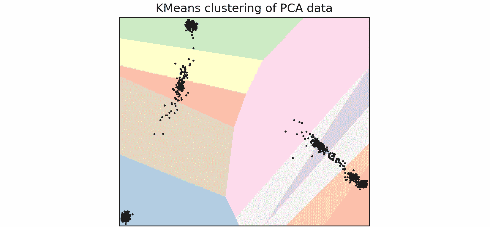
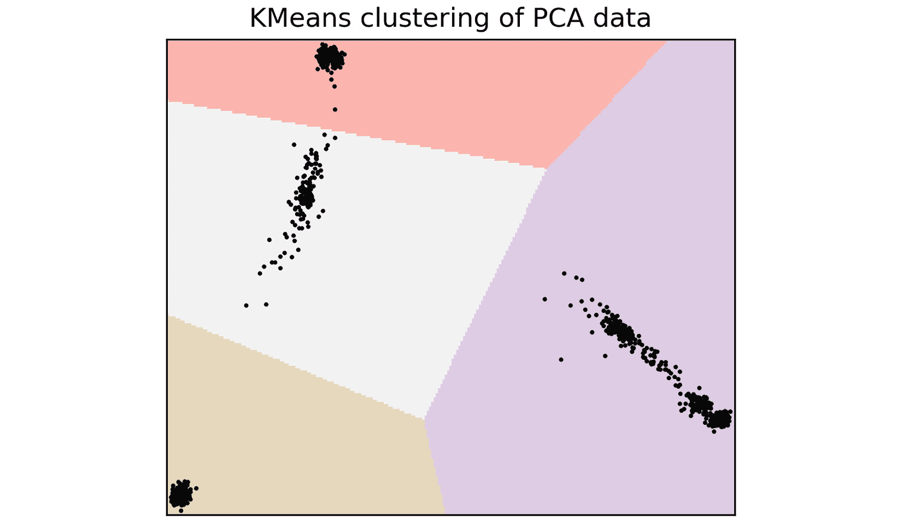
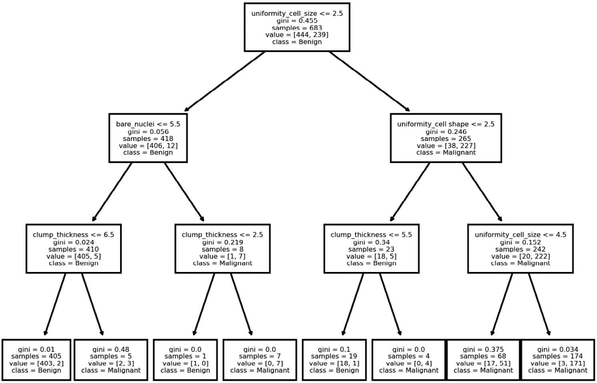

# 十、用于生物信息学的机器学习

机器学习在各种各样的环境中使用，计算生物学也不例外。机器学习在该领域有无数的应用，可能最古老和最著名的是使用**主成分分析** ( **PCA** )利用基因组学研究人口结构。由于这是一个新兴领域，因此还有许多其他潜在的应用。在这一章中，我们将从生物信息学的角度介绍机器学习的概念。

鉴于机器学习是一个非常复杂的主题，可以很容易地写满一本书，这里我们打算采取一种直观的方法，让你大致了解一些机器学习技术如何有助于解决生物学问题。如果您发现这些技术有用，您将理解基本概念，并可以继续阅读更详细的文献。

如果你正在使用 Docker，并且因为本章中的所有库都是数据分析的基础，它们都可以在 Docker 镜像`tiagoantao/bioinformatics_ml`中找到。

在本章中，我们将介绍以下配方:

*   介绍 sci kit-通过 PCA 示例学习
*   使用 PCA 上的聚类对样本进行分类
*   利用决策树探索乳腺癌特征
*   使用随机森林预测乳腺癌结果

# 介绍 sci kit-通过 PCA 示例学习

PCA 是一种统计程序,用于将多个变量的维度降低到一个更小的线性不相关的子集。在 [*第 6 章*](06.html#_idTextAnchor154) 中，我们看到了一个基于使用外部应用的 PCA 实现。在这个菜谱中，我们将为群体遗传学实现相同的 PCA，但将使用`scikit-learn`库。Scikit-learn 是用于机器学习的基本 Python 库之一，本菜谱是对该库的介绍。PCA 是一种无监督的机器学习形式——我们不提供关于样本类别的信息。我们将在本章的其他配方中讨论监督技术。

提醒一下，我们将从 HapMap 项目中计算 11 个人类群体的 PCA。

## 准备就绪

您将需要运行第六章 中 [*的第一个配方，以便生成`hapmap10_auto_noofs_ld_12` PLINK 文件(等位基因记录为 1 和 2)。从群体遗传学的角度来看，我们需要 LD-pruned 标记来产生可靠的 PCA。我们不会冒险在这里使用后代，因为它可能会使结果有偏差。我们的菜谱将需要`pygenomics`库，可以使用以下命令安装它:*](06.html#_idTextAnchor154)

```py
pip install pygenomics
```

代码在`Chapter10/PCA.py`笔记本里。

## 怎么做...

看看下面的步骤:

1.  我们从加载样本的元数据开始。在我们的例子中，我们将加载每个样本所属的人群:

    ```py
    import os
    from sklearn.decomposition import PCA
    import numpy as np
    from genomics.popgen.pca import plot
    f = open('../Chapter06/relationships_w_pops_041510.txt')
    ind_pop = {}
    f.readline()  # header
    for l in f:
        toks = l.rstrip().split('\t')
        fam_id = toks[0]
        ind_id = toks[1]
        pop = toks[-1]
        ind_pop['/'.join([fam_id, ind_id])] = pop
    f.close()
    ```

2.  我们现在得到个体的顺序以及我们将要处理的 SNP 的数量:

    ```py
    f = open('../Chapter06/hapmap10_auto_noofs_ld_12.ped')
    ninds = 0
    ind_order = []
    for line in f:
        ninds += 1
        toks = line[:100].replace(' ', '\t').split('\t')
        fam_id = toks[0]
        ind_id = toks[1]
        ind_order.append('%s/%s' % (fam_id, ind_id))
    nsnps = (len(line.replace(' ', '\t').split('\t')) - 6) // 2
    f.close()
    ```

3.  我们创建了一个数组，它将被送到 PCA:

    ```py
    pca_array = np.empty((ninds, nsnps), dtype=int)
    print(pca_array.shape)
    f = open('../Chapter06/hapmap10_auto_noofs_ld_12.ped')
    for ind, line in enumerate(f):
        snps = line.replace(' ', '\t').split('\t')[6:]
        for pos in range(len(snps) // 2):
            a1 = int(snps[2 * pos])
            a2 = int(snps[2 * pos])
            my_code = a1 + a2 - 2
            pca_array[ind, pos] = my_code
    f.close()
    ```

4.  最后，我们用多达八个分量计算 PCA 。然后，我们使用`transform`方法获得所有样本的 8-D 坐标。

    ```py
    my_pca = PCA(n_components=8)
    my_pca.fit(pca_array)
    trans = my_pca.transform(pca_array)
    ```

5.  最后，我们绘制 PCA:

    ```py
    sc_ind_comp = {}
    for i, ind_pca in enumerate(trans):
        sc_ind_comp[ind_order[i]] = ind_pca
    plot.render_pca_eight(sc_ind_comp, cluster=ind_pop)
    ```


图 10.1-scikit-learn 生成的数据集的 PC1 到 PC8

## 还有更多...

对于在科学期刊上发表的，我会推荐使用第六章[*中的配方，仅仅因为它是基于一个已发表的且备受推崇的方法。也就是说，这段代码的结果在性质上是相似的，并且以非常相似的方式对数据进行聚类(如果与第 6 章*](06.html#_idTextAnchor154) 的 [*图进行比较，垂直轴上方向的反转与解释 PCA 图无关)。*](06.html#_idTextAnchor154)

# 利用 PCA 上的聚类对样本进行分类

基因组学中的主成分分析让我们看到样本是如何聚集的。在许多情况下，来自同一人群的个体会出现在图表的同一区域。但是我们想更进一步，预测新个体在群体中的位置。为了做到这一点，我们将从 PCA 数据开始，因为它可以降维——使数据处理更容易——然后应用 K-Means 聚类算法来预测新样本的位置。我们将使用与上面食谱中相同的数据集。我们将使用除一个样本之外的所有样本来训练算法，然后我们将预测剩余样本的位置。

k 均值聚类可以是监督算法的一个例子。在这些类型的算法中，我们需要一个训练数据集，以便算法能够学习。在训练算法之后，它将能够为新的样本预测某个结果。在我们的例子中，我们希望能够预测人口数量。

警告

当前的食谱旨在温和地介绍监督算法及其背后的概念。我们训练算法的方式远非最佳。正确训练监督算法的问题将在本章的最后一个配方中提到。

## 准备就绪

我们将使用与之前配方中相同的数据。该配方的代码可在`Chapter10/Clustering.py`中找到。

## 怎么做...

让我们来看看:

1.  我们首先加载人口信息——这类似于我们在前面的配方中所做的:

    ```py
    import os
    import matplotlib.pyplot as plt
    from sklearn.cluster import KMeans
    from sklearn.decomposition import PCA
    import numpy as np
    from genomics.popgen.pca import plot
    f = open('../Chapter06/relationships_w_pops_041510.txt')
    ind_pop = {}
    f.readline()  # header
    for l in f:
        toks = l.rstrip().split('\t')
        fam_id = toks[0]
        ind_id = toks[1]
        pop = toks[-1]
        ind_pop['/'.join([fam_id, ind_id])] = pop
    f.close()

    f = open('../Chapter06/hapmap10_auto_noofs_ld_12.ped')
    ninds = 0
    ind_order = []
    for line in f:
        ninds += 1
        toks = line[:100].replace(' ', '\t').split('\t') #  for speed
        fam_id = toks[0]
        ind_id = toks[1]
        ind_order.append('%s/%s' % (fam_id, ind_id))
    nsnps = (len(line.replace(' ', '\t').split('\t')) - 6) // 2
    print (nsnps)
    f.close()
    ```

2.  我们现在将所有样本数据——SNP——加载到一个 NumPy 数组中:

    ```py
    all_array = np.empty((ninds, nsnps), dtype=int)
    f = open('../Chapter06/hapmap10_auto_noofs_ld_12.ped')
    for ind, line in enumerate(f):
        snps = line.replace(' ', '\t').split('\t')[6:]
        for pos in range(len(snps) // 2):
            a1 = int(snps[2 * pos])
            a2 = int(snps[2 * pos])
            my_code = a1 + a2 - 2
            all_array[ind, pos] = my_code
    f.close()
    ```

3.  我们将数组分成两个数据集，即除了一个个体之外的所有个体的训练案例，以及用单个个体进行测试的案例:

    ```py
    predict_case = all_array[-1, :]
    pca_array = all_array[:-1,:]

    last_ind = ind_order[-1]
    last_ind, ind_pop[last_ind]
    ```

我们的测试案例是个体 Y076/NA19124，我们知道他属于约鲁巴人。

1.  我们现在计算将用于 K 均值聚类的训练集的 PCA:

    ```py
    my_pca = PCA(n_components=2)
    my_pca.fit(pca_array)
    trans = my_pca.transform(pca_array)

    sc_ind_comp = {}
    for i, ind_pca in enumerate(trans):
        sc_ind_comp[ind_order[i]] = ind_pca
    plot.render_pca(sc_ind_comp, cluster=ind_pop)
    ```

下面是输出，这将有助于检查聚类结果:


图 10.2 - PC1 和 PC2 带有颜色编码的人口

1.  在我们开始计算 K-means 聚类之前，让我们编写一个函数，通过运行算法

    ```py
    def plot_kmeans_pca(trans, kmeans):
        x_min, x_max = trans[:, 0].min() - 1, trans[:, 0].max() + 1
        y_min, y_max = trans[:, 1].min() - 1, trans[:, 1].max() + 1
        mesh_x, mesh_y = np.meshgrid(np.arange(x_min, x_max, 0.5), np.arange(y_min, y_max, 0.5))

        k_surface = kmeans.predict(np.c_[mesh_x.ravel(), mesh_y.ravel()]).reshape(mesh_x.shape)
        fig, ax = plt.subplots(1,1, dpi=300)
        ax.imshow(
            k_surface, origin="lower", cmap=plt.cm.Pastel1,
            extent=(mesh_x.min(), mesh_x.max(), mesh_y.min(), mesh_y.max()),
        )
        ax.plot(trans[:, 0], trans[:, 1], "k.", markersize=2)
        ax.set_title("KMeans clustering of PCA data")
        ax.set_xlim(x_min, x_max)
        ax.set_ylim(y_min, y_max)
        ax.set_xticks(())
        ax.set_yticks(())
        return ax
    ```

    来绘制聚类表面
2.  现在让我们用样本来拟合算法。因为我们有 11 个群体，所以我们将为 11 个集群进行训练:

    ```py
    kmeans11 = KMeans(n_clusters=11).fit(trans)
    plot_kmeans_pca(trans, kmeans11)
    ```

这里是输出:



图 10.3-11 个集群的集群表面

如果您与这里的图进行比较，您可以直观地看到聚类没有什么意义:它没有很好地映射到已知的人口。有人可能会认为这种具有 11 个聚类的聚类算法不是很有用。

小费

scikit-learn 中实现了许多其他聚类算法，在一些场景中，它们可能比 K-means 执行得更好。你可以在 https://scikit-learn.org/stable/modules/clustering.xhtml 找到它们。值得怀疑的是，在这个特定的情况下，对于 11 个集群来说，任何替代方案都不会有更好的表现。

1.  虽然看起来 K-means 聚类不能解析 11 个群体，但是如果我们使用不同数量的聚类，它仍然可以提供一些预测。简单地看一下图表，我们可以看到四个独立的区块。如果我们使用四个集群会有什么结果？

    ```py
    kmeans4 = KMeans(n_clusters=4).fit(trans)
    plot_kmeans_pca(trans, kmeans4)
    ```

以下是输出:



图 10.4 -四个集群的集群表面

这四个团体现在基本上是清楚的。但是它们有直观意义吗？如果是这样，我们可以利用这种聚类方法。事实上，他们有。左边的聚类由非洲人组成，最上面的聚类是欧洲人，最下面的是东亚人。中间的一个是最神秘的，因为它包含古吉拉特人和墨西哥人的后裔，但这种混合最初来自 PCA，而不是由聚类本身引起的。

1.  让我们看看预测在我们忽略的单个情况下表现如何:

    ```py
    pca_predict = my_pca.transform([predict_case])
    kmeans4.predict(pca_predict)
    ```

我们的样本预计在第 1 类。我们现在需要更深入一点。

1.  让我们找出集群 1 是什么意思。我们从训练集中取出最后一个人，他也是一个约鲁巴人，然后看看他被分配到哪个集群:

    ```py
    last_train = ind_order[-2]
    last_train, ind_pop[last_train]
    kmeans4.predict(trans)[0]
    ```

它确实是簇 1，所以预测是正确的。

## 还有更多...

值得重申的是，我们正在努力实现对机器学习的直观理解。在这个阶段，你应该已经掌握了你能从监督学习中获得什么，以及聚类算法的示例用法。关于训练机器学习算法的程序还有很多要说的，我们将在最后一个食谱中部分揭示。

# 使用决策树探索乳腺癌特征

当我们收到一个数据集时，我们面临的第一个问题是决定开始分析什么。刚开始时，常常会有一种不知该先做什么的失落感。这里，我们将介绍一种基于决策树的探索性方法。决策树的最大优势在于，它们将为我们提供构建决策树的规则，让我们初步了解数据的情况。

在这个例子中，我们将使用来自乳腺癌患者的特征观察数据集。具有 699 个数据条目的数据集包括诸如凝块厚度、细胞大小的均匀性或染色质类型的信息。结果是良性或恶性肿瘤。这些特征用从 0 到 10 的值进行编码。有关该项目的更多信息，请访问 http://archive . ics . UCI . edu/ml/datasets/breast+cancer+Wisconsin+% 28 diagnostic % 29。

## 准备就绪

我们将下载数据和文档:

```py
wget http://archive.ics.uci.edu/ml/machine-learning-databases/breast-cancer-wisconsin/breast-cancer-wisconsin.data
wget http://archive.ics.uci.edu/ml/machine-learning-databases/breast-cancer-wisconsin/breast-cancer-wisconsin.names
```

数据文件被格式化为 CSV 文件。关于内容的信息可以在第二个下载的文件中找到。

该配方的代码可在`Chapter10/Decision_Tree.py`中找到。

## 怎么做...

请遵循以下步骤:

1.  我们做的第一件事是删除一小部分数据不完整的个体:

    ```py
    import numpy as np
    import matplotlib.pyplot as plt
    import pandas as pd
    from sklearn import tree
    f = open('breast-cancer-wisconsin.data')
    w = open('clean.data', 'w')
    for line in f:
        if line.find('?') > -1:
            continue
        w.write(line)
    f.close()
    w.close()
    ```

小费

在这种情况下，删除数据不完整的个人就足够了，因为他们只是数据集的一小部分，我们只是在做探索性分析。对于大量缺失的情况，或者当我们试图做一些更严格的事情时，您将不得不使用一些方法来处理缺失的数据，我们在这里不做探讨。

1.  我们现在要读取数据，给所有列命名:

    ```py
    column_names = [
        'sample_id', 'clump_thickness', 'uniformity_cell_size',
        'uniformity_cell shape', 'marginal_adhesion',
        'single_epithelial_cell_size', 'bare_nuclei',
        'bland_chromatin', 'normal_nucleoli', 'mitoses',
        'class'
    ]
    samples = pd.read_csv('clean.data', header=None, names=column_names, index_col=0)
    ```

2.  我们现在将从结果中分离特征，并使用 0 和 1 对结果进行重新编码:

    ```py
    training_input = samples.iloc[:,:-1]
    target = samples.iloc[:,-1].apply(lambda x: 0 if x == 2 else 1)
    ```

3.  现在让我们基于这个数据创建一个最大深度为 3 的决策树:

    ```py
    clf = tree.DecisionTreeClassifier(max_depth=3)
    clf.fit(training_input, target)
    ```

4.  让我们先来看看哪些特性是最重要的:

    ```py
    importances = pd.Series(
        clf.feature_importances_ * 100,
        index=training_input.columns).sort_values(ascending=False)
    importances
    ```

以下是按重要性排序的特性:

```py
uniformity_cell_size           83.972870
uniformity_cell shape           7.592903
bare_nuclei                     4.310045
clump_thickness                 4.124183
marginal_adhesion               0.000000
single_epithelial_cell_size     0.000000
bland_chromatin                 0.000000
normal_nucleoli                 0.000000
mitoses                         0.000000
```

记住这只是探索性的分析。在下一个食谱中，我们将努力产生更可靠的排名。底部特征为零的原因是我们要求最大深度为 3，在这种情况下，可能没有使用所有特征。

1.  我们可以对我们实现的准确性做一些本地分析:

    ```py
    100 * clf.score(training_input, target)
    ```

我们得到了 96%的性能。我们不应该用它自己的训练集来测试算法，因为这是相当循环的。我们将在下一个食谱中再次讨论这个问题。

1.  最后，让我们绘制决策树:

    ```py
    fig, ax = plt.subplots(1, dpi=300)
    tree.plot_tree(clf,ax=ax, feature_names=training_input.columns, class_names=['Benign', 'Malignant'])
    ```

此产生以下输出:



图 10.5 -乳腺癌数据集的决策树

让我们从根节点开始:它有一个标准`uniformity_cell_size < 2.5`和一个良性分类。分割树的主要特征是单元大小的一致性。在顶部节点的良性分类简单地来自于数据集上的大多数样本是良性的这一事实。现在从根开始看右边的节点:它有 265 个样本，其中大部分是恶性的，标准为`uniformity_cell_shape < 2.5`。

这些规则允许您对驱动数据集的因素有一个初步的理解。决策树不是很精确，所以把它们作为你的第一步。

# 使用随机森林预测乳腺癌结果

我们现在将使用随机森林来预测一些患者的结果。随机森林是一种集成方法(它将使用其他机器学习算法的几个实例)，使用许多决策树来得出关于数据的可靠结论。我们将使用与上一个食谱相同的例子:乳腺癌的特征和结果。

这个食谱有两个主要目标:向你介绍随机森林和关于机器学习算法训练的问题。

## 准备就绪

该配方的代码可在`Chapter10/Random_Forest.py`中找到。

## 怎么做……

看一下代码:

1.  和上一个配方一样，我们从剔除缺失信息的样本开始:

    ```py
    import pandas as pd
    import numpy as np
    import pandas as pd
    from sklearn.ensemble import RandomForestClassifier
    from sklearn.model_selection import train_test_split
    from sklearn.tree import export_graphviz
    f = open('breast-cancer-wisconsin.data')
    w = open('clean.data', 'w')
    for line in f:
        if line.find('?') > -1:
            continue
        w.write(line)
    f.close()
    w.close()
    ```

2.  我们现在加载清理后的数据:

    ```py
    column_names = [
        'sample_id', 'clump_thickness', 'uniformity_cell_size',
        'uniformity_cell shape', 'marginal_adhesion',
        'single_epithelial_cell_size', 'bare_nuclei',
        'bland_chromatin', 'normal_nucleoli', 'mitoses',
        'class'
    ]
    samples = pd.read_csv('clean.data', header=None, names=column_names, index_col=0)
    samples

    ```

3.  我们在特征和结果中分离读取的数据:

    ```py
    training_input = samples.iloc[:, :-1]
    target = samples.iloc[:, -1]
    ```

4.  我们创建一个分类器，并使数据适合它:

    ```py
    clf = RandomForestClassifier(max_depth=3, n_estimators=200)
    clf.fit(training_input, target)
    ```

这里最重要的参数是`n_estimators`:我们要求森林由 200 棵树构成。

1.  我们现在将的特征按照重要性排序:

    ```py
    importances = pd.Series(
        clf.feature_importances_ * 100,
        index=training_input.columns).sort_values(ascending=False)
    importances
    ```

以下是输出:

```py
uniformity_cell_size           30.422515
uniformity_cell shape          21.522259
bare_nuclei                    18.410346
single_epithelial_cell_size    10.959655
bland_chromatin                 9.600714
clump_thickness                 3.619585
normal_nucleoli                 3.549669
marginal_adhesion               1.721133
mitoses                         0.194124
```

结果是不确定的，这意味着您可能会有不同的结果。此外，请注意，随机森林与前一个配方中的决策树有很大不同。这是预料之中的，因为决策树是一个单一的估计器，其中森林重 200 棵树，并且更可靠。

1.  我们可以给这个案例打分:

    ```py
    clf.score(training_input, target)
    ```

我得到 97.95%的成绩。由于算法是随机的，您可能会得到稍微不同的值。正如我们在前面的食谱中所说的，从训练集中获得分数是非常循环的，远远不是最佳实践。

1.  为了让更真实地了解算法的准确性，我们需要将数据分成两部分——训练集和测试集:

    ```py
    for test_size in [0.01, 0.1, 0.2, 0.5, 0.8, 0.9, 0.99]:
        X_train, X_test, y_train, y_test = train_test_split(
            trainning_input, target, test_size=test_size)
        tclf = RandomForestClassifier(max_depth=3)
        tclf.fit(X_train, y_train)
        score = tclf.score(X_test, y_test)
        print(f'{1 - test_size:.1%} {score:.2%}')
    ```

输出如下(请记住，您将获得不同的值):

```py
99.0% 71.43%
90.0% 94.20%
80.0% 97.81%
50.0% 97.66%
20.0% 96.89%
10.0% 94.80%
1.0% 92.02%
```

如果你只用 1%的数据训练，你只能得到 71%的准确率，而如果你用更多的数据训练，准确率会超过 90%。请注意，准确性不会随着训练集的大小单调增加。决定训练集的大小是一件复杂的事情，各种问题会导致意想不到的副作用。

## 还有更多...

我们只是触及了训练和测试机器学习算法的表面。例如，监督数据集通常分为 3 个，而不是 2 个(训练、测试和交叉验证)。为了训练你的算法和更多类型的算法，你需要考虑更多的问题。在这一章中，我们试图发展基本的直觉来理解机器学习，但如果你打算遵循这条路线，这只不过是你的起点。