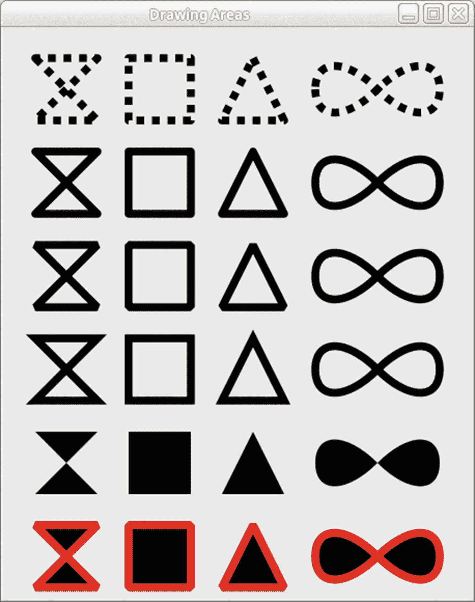
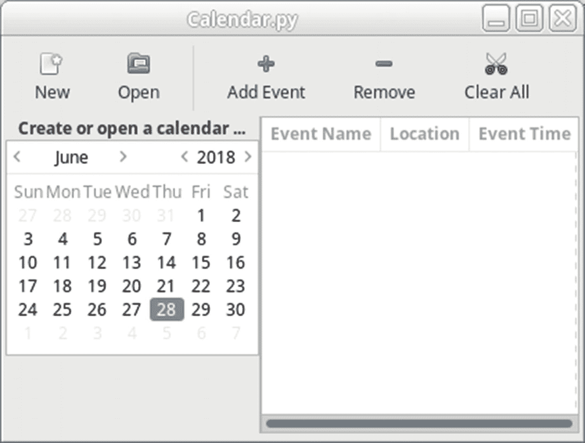
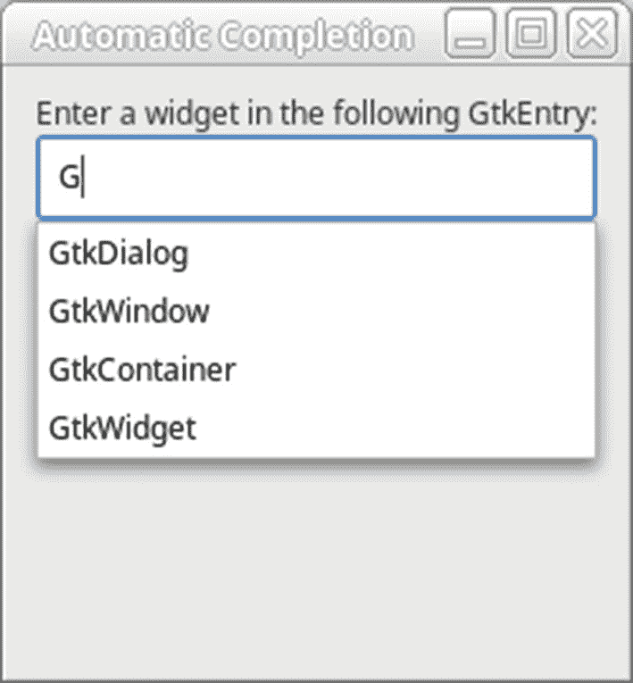

# 十三、更多 GTK 部件

到目前为止，你已经学会了这本书要教你的几乎所有东西。然而，有许多小部件不太适合前面的章节。因此，本章涵盖了这些小部件。

前两个小部件用于绘图，命名为`Gtk.DrawingArea`和`Gtk.Layout`。这两个窗口小部件非常相似，除了`Gtk.Layout`窗口小部件允许你在其中嵌入任意的窗口小部件，还可以使用函数来绘图。

此外，您还将了解支持自动完成和日历的`Gtk.Entry`小部件。最后，向您介绍了 GTK+ 2.10 中添加的小部件，包括状态图标、打印支持和最近文件管理器。

在本章中，您将学习以下内容。

*   如何使用绘图小工具`Gtk.DrawingArea`和`Gtk.Layout`

*   如何使用`Gtk.Calendar`小部件来跟踪一年中几个月的信息

*   如何使用 GTK+ 2.10 中引入的提供最近文件跟踪、打印支持和状态图标的小部件

*   如何通过应用`Gtk.EntryCompletion`对象在`Gtk.Entry`小部件中实现自动完成

## 绘制小部件

`Gtk.DrawingArea`只提供一个方法`Gtk.DrawingArea.new()`，它不接受任何参数，返回一个新的绘图区小工具。

```py
Gtk.DrawingArea.new()

```

要开始使用小部件，您只需要使用父小部件`Gdk.Window`提供的在区域上绘图。记住一个`Gdk.Window`对象也是一个`Gdk.Drawable`对象。

`Gtk.DrawingArea`的一个优势是它来源于`Gtk.Widget`，这意味着它可以连接到 GDK 事件。您希望将绘图区域连接到许多事件。您首先要连接到 realize，这样您就可以处理小部件实例化时需要执行的任何任务，比如创建 GDK 资源。当您必须处理小部件大小的变化时,`"configure-event"`信号会通知您。另外，`"expose-event"`允许您在暴露之前隐藏的部分时重新绘制小部件。`"expose-event"`信号尤其重要，因为如果你想让绘图区域的内容在`"expose-event"`回调中保持不变，你必须重新绘制它的内容。最后，您可以连接到按钮和鼠标点击事件，以便用户可以与小部件交互。

### 注意

要接收某些类型的事件，您需要将它们添加到受`widget.add_events()`支持的小部件事件列表中。此外，为了接收用户的键盘输入，您需要设置`widget.set_can_focus(True)`标志，因为只有聚焦的小部件可以检测按键。

### 绘图区域示例

清单 [13-1](#PC2) 使用`Gtk.DrawingArea`小部件实现了一个简单的绘图程序。自从引入 GTK+ 3 以来，Cairo 绘图库已经取代了 GTK+ 早期版本中使用的旧绘图原语。这个库与旧的图元不同，它使用矢量图形来绘制形状，而不是使用手绘技术。矢量图形很有趣，因为它们在调整大小或变换时不会失去清晰度。

图 [13-1](#Fig1) 是这个应用的截图。



图 13-1

带有用鼠标绘制的文本的绘图区域小工具

虽然这是一个非常简单的程序，但是它展示了如何与`Gtk.DrawingArea`小部件交互。

```py
#!/usr/bin/python3

import sys
import cairo
import gi
gi.require_version('Gtk', '3.0')
from gi.repository import Gtk, Gdk
SIZE = 30

class AppWindow(Gtk.ApplicationWindow):

    def __init__(self, *args, **kwargs):
        super().__init__(*args, **kwargs)
        self.set_size_request(450, 550)
        drawingarea = Gtk.DrawingArea()
        self.add(drawingarea)
        drawingarea.connect('draw', self.draw)

    def triangle(self, ctx):
        ctx.move_to(SIZE, 0)
        ctx.rel_line_to(SIZE, 2 * SIZE)
        ctx.rel_line_to(-2 * SIZE, 0)
        ctx.close_path()

    def square(self, ctx):
        ctx.move_to(0, 0)
        ctx.rel_line_to(2 * SIZE, 0)
        ctx.rel_line_to(0, 2 * SIZE)
        ctx.rel_line_to(-2 * SIZE, 0)
        ctx.close_path()

    def bowtie(self, ctx):
        ctx.move_to(0, 0)
        ctx.rel_line_to(2 * SIZE, 2 * SIZE)
        ctx.rel_line_to(-2 * SIZE, 0)
        ctx.rel_line_to(2 * SIZE, -2 * SIZE)
        ctx.close_path()

    def inf(self, ctx):
        ctx.move_to(0, SIZE)
        ctx.rel_curve_to(0, SIZE, SIZE, SIZE, 2 * SIZE, 0)
        ctx.rel_curve_to(SIZE, -SIZE, 2 * SIZE, -SIZE, 2 * SIZE, 0)
        ctx.rel_curve_to(0, SIZE, -SIZE, SIZE, -2 * SIZE, 0)
        ctx.rel_curve_to(-SIZE, -SIZE, -2 * SIZE, -SIZE, -2 * SIZE, 0)
        ctx.close_path()

    def draw_shapes(self, ctx, x, y, fill):
        ctx.save()
        ctx.new_path()
        ctx.translate(x + SIZE, y + SIZE)
        self.bowtie(ctx)
        if fill:
            ctx.fill()
        else:
            ctx.stroke()
        ctx.new_path()
        ctx.translate(3 * SIZE, 0)
        self.square(ctx)
        if fill:
            ctx.fill()
        else:
            ctx.stroke()
        ctx.new_path()
        ctx.translate(3 * SIZE, 0)
        self.triangle(ctx)
        if fill:
            ctx.fill()
        else:
            ctx.stroke()
        ctx.new_path()
        ctx.translate(3 * SIZE, 0)
        self.inf(ctx)
        if fill:
            ctx.fill()
        else:
            ctx.stroke()
        ctx.restore()

    def fill_shapes(self, ctx, x, y):
        self.draw_shapes(ctx, x, y, True)

    def stroke_shapes(self, ctx, x, y):
        self.draw_shapes(ctx, x, y, False)

    def draw(self, da, ctx):
        ctx.set_source_rgb(0, 0, 0)
        ctx.set_line_width(SIZE / 4)
        ctx.set_tolerance(0.1)
        ctx.set_line_join(cairo.LINE_JOIN_ROUND)
        ctx.set_dash([SIZE / 4.0, SIZE / 4.0], 0)
        self.stroke_shapes(ctx, 0, 0)
        ctx.set_dash([], 0)
        self.stroke_shapes(ctx, 0, 3 * SIZE)
        ctx.set_line_join(cairo.LINE_JOIN_BEVEL)
        self.stroke_shapes(ctx, 0, 6 * SIZE)
        ctx.set_line_join(cairo.LINE_JOIN_MITER)
        self.stroke_shapes(ctx, 0, 9 * SIZE)
        self.fill_shapes(ctx, 0, 12 * SIZE)
        ctx.set_line_join(cairo.LINE_JOIN_BEVEL)
        self.fill_shapes(ctx, 0, 15 * SIZE)
        ctx.set_source_rgb(1, 0, 0)
        self.stroke_shapes(ctx, 0, 15 * SIZE)

class Application(Gtk.Application):

    def __init__(self, *args, **kwargs):
        super().__init__(*args, application_id="org.example.myapp",**kwargs)
        self.window = None

    def do_activate(self):
        if not self.window:
            self.window = AppWindow(application=self, title="Drawing Areas")
        self.window.show_all()
        self.window.present()

if __name__ == "__main__":
    app = Application()
    app.run(sys.argv)

Listing 13-1The Drawing Area Widget

```

理解如何使用 Cairo 的最好方法是想象你是一个艺术家，正在用画笔在画布上画出一个形状。

首先，你可以选择画笔的一些特征。你可以选择画笔的粗细和你想要的颜色。您也可以选择画笔笔尖的形状。你可以选择圆形或方形。

一旦你选择了画笔，你就可以开始绘画了。在描述你想要呈现的形象时，你必须非常精确。

首先，决定你想把画笔放在画布上的什么地方。您可以通过提供 x 和 y 坐标来实现这一点。接下来，定义您希望画笔描边看起来是什么样子——弧线、直线等等。最后，再次通过提供 x 和 y 坐标来定义您希望笔画结束的点。三角形和正方形非常好做！

通过使用 Cairo 的 Python 接口，使用上述主题的变体和一些附加内容生成更复杂的图形，如填充(着色)、变换(放大、移动)等。

几乎所有的工作都围绕着使用`cairo.Context`(或 Cairo C API 中的`cairo_t`)。这是您向其发送绘图命令的对象。有几个选项可以用不同的方式初始化这个对象。

非常重要的一点是，要知道你描述你的图形的坐标和你*显示*你的图形的坐标是不同的。做演示时，你事先在透明醋酸纤维上画画，然后在高射投影仪上显示出来。Cairo 称之为用户空间坐标的透明醋酸盐和设备空间坐标的投影图像。

当初始化 Cairo 上下文对象时，我们告诉它应该如何显示我们的描述。为此，我们提供了一个转换矩阵。修改变换矩阵会导致一些非常有趣的结果。

Cairo 最强大的特性之一是它可以输出许多不同格式的图形(它可以使用多个后端)。为了打印，我们可以让 Cairo 将我们的图形翻译成 postscript 发送给打印机。对于屏幕显示，Cairo 可以将我们的图形转换成 gtk 可以理解的硬件加速渲染！它有许多更重要和有用的目标后端。在初始化`cairo.Context`时，我们设置它的目标后端，提供一些细节(比如颜色深度和大小)，如下例所示。

### 布局小部件

除了`Gtk.DrawingArea`，GTK+ 还提供了另一个画图小部件，名为`Gtk.Layout`。这个小部件实际上是一个容器，与`Gtk.DrawingArea`的不同之处在于，它不仅支持绘图原语，还支持子小部件。此外，`Gtk.Layout`本身提供了滚动支持，所以在添加到滚动窗口时不需要视口。

### 注意

布局需要注意的一个重要区别是你应该绘制到`Gtk.Layout`的 bin_window 成员，而不是`Gtk.Widget`的窗口。例如，您需要绘制到父二进制窗口，而不是布局窗口。你可以通过调用`layout.get_bin_window()`方法获得二进制窗口。这允许子部件被正确地嵌入到部件中。

新的`Gtk.Layout`小部件是用`Gtk.Layout.new()`创建的，它接受水平和垂直调整。如果您将`None`传递给两个函数参数，就会为您创建调整。由于`Gtk.Layout`有原生的滚动支持，当你需要使用滚动窗口时，它比`Gtk.DrawingArea`有用得多。

然而，`Gtk.Layout`确实增加了一些开销，因为它也能够包含小部件。正因为如此，如果你只需要在小部件的`Gdk.Window`上画画的话，`Gtk.DrawingArea`是更好的选择。

使用`layout.put()`将子部件添加到一个`Gtk.Layout`容器中，它将子部件放置在容器的左上角。由于`Gtk.Layout`是直接从`Gtk.Container`派生出来的，所以它能够支持多个子节点。

```py
layout.put(child_widget, x, y)

```

稍后可以调用`layout.move()`将子小部件重新定位到`Gtk.Layout`容器中的另一个位置。

### 警告

因为您将子部件放置在特定的水平和垂直位置，`Gtk.Layout`呈现出与`Gtk.Fixed`相同的问题。使用布局小部件时，您需要小心这些！你可以在第 [4](04.html) 章的“固定容器”一节中阅读更多关于`Gtk.Fixed`小部件问题的内容。

最后，如果您想要强制布局为特定的大小，您可以向`layout.set_size()`发送新的宽度和高度参数。您应该使用此方法而不是`layout.set_size_request()`，因为它也调整调整参数。

```py
layout.set_size(width, height)

```

此外，与大小请求不同，布局大小函数需要无符号数字。这意味着您必须为布局小部件指定一个绝对大小。这个大小应该是布局的总大小，包括窗口小部件在屏幕上不可见的部分，因为它们超出了滚动区域的边界！`Gtk.Layout`小工具的大小默认为 100×100 像素。

## 日历

GTK+ 提供了`Gtk.Calendar`小部件，这是一个显示日历中一个月的小部件。它允许用户使用滚动箭头在月份和年份之间移动，如图 [13-2](#Fig2) 所示。您还可以显示所选年份的日名称和周编号的三个字母缩写。



图 13-2

Gtk。日历小部件

使用`Gtk.Calendar.new()`创建新的`Gtk.Calendar`小部件。默认情况下，选择当前日期。因此，计算机存储的当前月份和年份也会显示出来。您可以使用`calendar.get_date()`检索所选日期，或者使用`calendar.select_day()`选择新的日期。要取消选择当前选定的日期，您应该使用日期值为零的`calendar.select_day()`。

为了定制`Gtk.Calendar`小部件的显示方式以及它与用户的交互方式，您应该使用`calendar.set_display_options()`来设置一个由`Gtk.CalendarDisplayOptions`值组成的按位列表。以下是此枚举的非预定值。

*   `Gtk.CalendarDisplayOptions.SHOW_HEADING`:如果设置，显示月份和年份的名称。

*   `Gtk.CalendarDisplayOptions.SHOW_DAY_NAMES`:如果设置，则在相应的日期栏上方显示每一天的三个字母的缩写。它们呈现在标题和主日历内容之间。

*   `Gtk.CalendarDisplayOptions.SHOW_DETAILS`:提供详细信息时，仅显示 a。参见`calendar.set_detail_func()`。

*   `Gtk.CalendarDisplayOptions.NO_MONTH_CHANGE`:阻止用户更改日历的当前月份。如果没有设置这个标志，您将看到允许您转到下个月或上个月的箭头。默认情况下，箭头处于启用状态。

*   `Gtk.CalendarDisplayOptions.SHOW_WEEK_NUMBERS`:沿日历左侧显示当年的周数。默认情况下，周数是隐藏的。

除了选择一天之外，您还可以用`calendar.mark_day()`一次标记任意多天。如果成功标记了日期，该函数将返回`True`。

```py
calendar.mark_day(day)

```

有两种信号可用于检测用户何时选择一天。当用户用鼠标或键盘选择新的一天时，发出第一个信号`"day-selected"`。当用户双击选择某一天时，会发出`"day-selected-double-click"`信号。这意味着在大多数情况下，您不应该需要带有`Gtk.Calendar`小部件的`"button-press-event"`信号。

## 打印支持

GTK+ 2.10 引入了许多新的小部件和对象，为这个库增加了打印支持。虽然这个 API 中有许多对象，但在大多数情况下，您只需要直接与`Gtk.PrintOperation`交互，这是一个可以跨多个平台使用的高级打印 API。它充当处理大多数打印操作的前端接口。

在本节中，我们实现了一个应用，它打印用户在`Gtk.FileChooserButton`小部件中选择的文本文件的内容。图 [13-3](#Fig3) 是 Linux 系统上默认打印对话框的截图。用户使用`Gtk.FileChooserButton`小部件从磁盘中选择一个文件，然后单击主窗口中的打印按钮打开该对话框。


图 13-3

打印对话框

清单 [13-2](#PC6) 从为应用定义必要的数据结构和设置用户界面开始。`PrintData`类保存关于当前打印作业的信息，这有助于呈现最终产品。`Widgets`是一个简单的结构，在回调方法中提供对多个小部件和打印作业信息的访问。

```py
#!/usr/bin/python3

import sys
import math
from os.path import expanduser
import gi
gi.require_version('Gtk', '3.0')
gi.require_version('PangoCairo', '1.0')
from gi.repository import Gtk, cairo, Pango, PangoCairo

class Widgets:

    def __init__(self):
        self.window = None
        self.chooser = None
        self.data = None
        self.settings = Gtk.PrintSettings.new()

class PrintData:

    def __init__(self):
        self.filename = None
        self.fontsize = None
        self.lines_per_page = None
        self.lines = None
        self.total_lines = None
        self.total_pages = None

class AppWindow(Gtk.ApplicationWindow):

    def __init__(self, *args, **kwargs):
        super().__init__(*args, **kwargs)
        self.HEADER_HEIGHT = 20.0
        self.HEADER_GAP = 8.5
        w = Widgets()
        w.window = self
        self.set_border_width(10)
        w.chooser = Gtk.FileChooserButton.new ("Select a File",
                                               Gtk.FileChooserAction.OPEN)
        w.chooser.set_current_folder(expanduser("~"))
        print = Gtk.Button.new_with_label("Print")
        print.connect("clicked", self.print_file, w)
        hbox = Gtk.Box.new(Gtk.Orientation.HORIZONTAL, 5)
        hbox.pack_start(w.chooser, False, False, 0)
        hbox.pack_start(print, False, False, 0)
        self.add(hbox)

    def print_file(self, button, w):
        filename = w.chooser.get_filename()
        if filename == None:
            return
        operation = Gtk.PrintOperation.new()
        if w.settings != None:
            operation.set_print_settings(w.settings)
        w.data = PrintData()
        w.data.filename = filename
        w.data.font_size = 10.0
        operation.connect("begin_print", self.begin_print, w)
        operation.connect("draw_page", self.draw_page, w)
        operation.connect("end_print", self.end_print, w)
        res = operation.run(Gtk.PrintOperationAction.PRINT_DIALOG,
                                     w.window)
        if res == Gtk.PrintOperationResult.APPLY:
            if w.settings != None:
                w.settings = None
            settings = operation.get_print_settings()
        elif res == Gtk.PrintOperationResult.ERROR:
            dialog = Gtk.MessageDialog.new(w.window,
                                           Gtk.DialogFlags.DESTROY_WITH_PARENT,
                                           Gtk.MessageType.ERROR,
                                           Gtk.ButtonsType.S_CLOSE,
                                           "Print operation error.")
            dialog.run()
            dialog.destroy()

    def begin_print(self, operation, context, w):
        w.data.lines = []
        f = open(w.data.filename)
        for line in f:
            w.data.lines.append(line)
        f.close()
        w.data.total_lines = len(w.data.lines)

        height = context.get_height() - self.HEADER_HEIGHT –
        self.HEADER_GAP w.data.lines_per_page = math.floor(height /
        (w.data.font_size + 3)) w.data.total_pages =
        (w.data.total_lines - 1) / w.data.lines_per_page+1
        operation.set_n_pages(w.data.total_pages)

    def draw_page(self, operation, context, page_nr, w):
        cr = context.get_cairo_context()
        width = context.get_width()
        layout = context.create_pango_layout()
        desc = Pango.font_description_from_string("Monospace")
        desc.set_size(w.data.font_size * Pango.SCALE)
        layout.set_font_description(desc)
        layout.set_text(w.data.filename, -1)
        layout.set_width(-1)
        layout.set_alignment(Pango.Alignment.LEFT)
        (width, height) = layout.get_size()
        text_height = height / Pango.SCALE
        cr.move_to(0, (self.HEADER_HEIGHT - text_height) / 2)
        PangoCairo.show_layout(cr, layout)
        page_str = "%d of %d" % (page_nr + 1, w.data.total_pages)
        layout.set_text(page_str, -1)
        (width, height) = layout.get_size()
        layout.set_alignment(Pango.Alignment.RIGHT)
        cr.move_to(width - (width / Pango.SCALE),
                     (self.HEADER_HEIGHT - text_height) / 2)
        PangoCairo.show_layout(cr, layout)
        cr.move_to(0, self.HEADER_HEIGHT + self.HEADER_GAP)
        line = page_nr * w.data.lines_per_page
         i = 0
        while i < w.data.lines_per_page and line <
         w.data.total_lines:
            layout.set_text(w.data.lines[line], -1)
            PangoCairo.show_layout(cr, layout)
            cr.rel_move_to(0, w.data.font_size + 3)
            line += 1
            i += 1

    def end_print(self, operation, context, w):
        w.data.lines = None
        w.data = None

class Application(Gtk.Application):

    def __init__(self, *args, **kwargs):
        super().__init__(*args, application_id="org.example.myapp",
                         **kwargs)
        self.window = None

    def do_activate(self):
        if not self.window:
            self.window = AppWindow(application=self,
                                    title="Calendar")
            self.window.show_all()
            self.window.present()

if __name__ == "__main__":
    app = Application()
    app.run(sys.argv)

Listing 13-2GTK+ Printing Example

```

在清单 [13-2](#PC6) 中的`AppWindow`类的顶部定义了两个值，称为`HEADER_HEIGHT`和`HEADER_GAP`。`HEADER_HEIGHT`是可用于呈现标题文本的空间量。这将显示信息，如文件名和页码。`HEADER_GAP`是在页眉和实际页面内容之间放置填充。

`PrintData`类存储关于当前打印作业的信息。这包括文件在磁盘上的位置、字体大小、单页上可以呈现的行数、文件内容、总行数和总页数。

### 打印操作

下一步是实现点击打印按钮时运行的`print_file`回调方法。该方法在清单 [13-2](#PC6) 中实现。它负责创建`PrintData`，连接所有必要的信号，并创建打印操作。

打印的第一步是创建一个新的打印操作，这是通过调用`Gtk.PrintOperation.new()`来完成的。`Gtk.PrintOperation`的独特之处在于它使用平台的本地打印对话框(如果有的话)。在像 UNIX 这样不提供这种对话框的平台上，使用`Gtk.PrintUnixDialog`或 GNOME 对话框。

### 注意

对于大多数应用，您应该尽可能使用`Gtk.PrintOperation`方法，而不是直接与打印对象交互。`Gtk.PrintOperation`是作为独立于平台的打印解决方案创建的，如果没有大量的代码，就无法轻松地重新实施。

下一步是调用`operation.set_print_settings()`将打印设置应用到操作中。在这个应用中，`Gtk.PrintSettings`对象作为属性存储在`Widgets`类实例中。如果打印操作成功，您应该存储当前的打印设置，以便这些相同的设置可以应用于将来的打印作业。

然后，通过分配一个新实例来设置`PrintData`类。文件名被设置为`Gtk.FileChooserButton`中当前选中的文件，该文件已经被确认存在。打印字体大小也设置为 10.0 磅。在文本编辑应用中，你通常会从`Gtk.TextView`的当前字体中检索这个字体。在更复杂的打印应用中，整个文档中的字体大小可能会有所不同，但这只是一个简单的示例，只是为了帮助您入门。

接下来，我们连接三个`Gtk.PrintOperation`信号，这将在本节稍后详细讨论。简而言之，`begin_print`是在页面渲染之前调用的，可以用来设置页数，做必要的准备。打印作业中的每一页都要调用`draw_page`信号，这样才能呈现出来。最后，在打印操作完成后调用`end_print`信号，而不管它是成功还是失败。这个回调方法在打印作业之后进行清理。在整个印刷操作中可以使用许多其他信号。完整列表见附录 b。

一旦设置好打印操作，下一步就是通过调用`operation.run()`开始打印。此方法用于定义打印操作执行的任务。

```py
operation.run(action, parent)

```

下面列表中显示的`Gtk.PrintOperationAction`枚举定义了打印操作执行的打印任务。要打印文档，您应该使用`Gtk.PrintOperationAction.PRINT_DIALOG`。

*   `Gtk.PrintOperationAction.ERROR`:打印操作中出现某种错误。

*   `Gtk.PrintOperationAction.PREVIEW`:预览以当前设置执行的打印作业。它使用与打印操作相同的回调函数进行渲染，因此启动并运行它应该不需要太多工作。

*   `Gtk.PrintOperationAction.PRINT`:使用当前打印设置开始打印，不显示打印对话框。只有当您百分之百确定用户同意此操作时，您才应该这样做。例如，您应该已经向用户显示了一个确认对话框。

*   `Gtk.PrintOperationAction.EXPORTPRINT`:将打印作业导出到文件。要使用此设置，您必须在运行操作之前设置 export-filename 属性。

`operation.run()`的最后两个参数允许你定义一个父窗口用于打印对话框，使用 None 忽略这个参数。该函数直到所有页面都被渲染并发送到打印机后才返回。

当函数返回控制时，它返回一个`Gtk.PrintOperationResult`枚举值。这些值指示您下一步应该执行什么任务，以及打印操作是成功还是失败。下面的列表中显示了四个枚举值。

*   `Gtk.PrintOperationResult.ERROR`:打印操作中出现某种错误。

*   `Gtk.PrintOperationResult.APPLY`:打印设置被更改。因此，应该立即存储它们，以免丢失更改。

*   `Gtk.PrintOperationResult.CANCEL`:用户取消了打印操作，您不应保存对打印设置的更改。

*   `Gtk.PrintOperationResult.PROGRESS`:打印操作尚未完成。只有在异步运行任务时，才能获得该值。

可以异步运行打印操作，这意味着`operation.run()`可能会在页面呈现之前返回。这是用`operation.set_allow_async()`设定的。你要注意，不是所有的平台都允许这个操作，所以你要做好这个不行的准备！

如果异步运行打印操作，可以使用 done 信号在打印完成时检索通知。此时，您得到了打印操作结果，您需要相应地处理它。

处理完打印操作结果后，如果设置了错误并且存在错误，还应该处理结果错误。

在附录 e 中可以找到`Gtk.PrintError`域名下可能出现的错误的完整列表。

`Gtk.PrintOperation`提供的一个独特功能是能够在打印操作运行时显示进度对话框。这个默认是关闭的，但是可以用`operation.set_show_progress()`打开。如果您允许用户同时运行多个打印操作，这尤其有用。

```py
operation.set_show_progress(boolean)

```

有时可能需要取消当前的打印作业，这可以通过调用`operation.cancel()`来完成。这个函数通常在`begin_print`、`paginate`或`draw_page`回调方法中使用。它还允许您提供一个取消按钮，以便用户可以在活动的打印操作中间停止。

```py
operation_cancel()

```

也可以为打印作业指定一个唯一的名称，以便在外部打印监控应用中识别它。打印作业以`operation.set_job_name()`命名。如果未设置，GTK+ 会自动为打印作业指定一个名称，并相应地对连续的打印作业进行编号。

如果您正在异步运行打印作业，您可能想要检索打印作业的当前状态。通过调用`operation.get_status()`，返回一个`Gtk.PrintStatus`枚举值，它给出了关于打印作业状态的更多信息。以下是可能的打印作业状态值列表。

*   `Gtk.PrintStatus.INITIAL`:打印操作尚未开始。当打印对话框仍然可见时，将返回此状态，因为这是默认的初始值。

*   `Gtk.PrintStatus.PREPARING`:打印操作被分割成页，发出开始打印信号。

*   页面正在被渲染。这在发出绘图页信号时设置。此时没有数据发送到打印机。

*   `Gtk.PrintStatus.SENDING_DATA`:关于打印作业的数据正在发送到打印机。

*   `Gtk.PrintStatus.PENDING`:所有的数据都已发送到打印机，但作业尚未处理。打印机有可能停止工作。

*   打印过程中出现了一个问题。例如，打印机可能缺纸，或者可能卡纸。

*   `Gtk.PrintStatus.PRINTING`:打印机当前正在处理打印作业。

*   `Gtk.PrintStatus.FINISHED`:打印作业已成功完成。

*   `Gtk.PrintStatus.FINISHED_ABORTED`:打印作业被中止。除非您再次运行该作业，否则不会采取进一步的操作。

由`operation.get_status()`返回的值可以在应用中使用，因为它是一个数值。然而，GTK+ 还提供了用`operation.get_status_string()`检索字符串的能力，这是一个人类可读的打印作业状态描述。它用于调试输出或向用户显示有关打印作业的更多信息。例如，它可以显示在状态栏或消息对话框中。

### 开始打印操作

既然打印操作已经设置好了，是时候实现必要的信号回调方法了。当用户开始打印时，会发出“开始打印”信号，这意味着从用户的角度来看，所有设置都已完成。

在清单 [13-2](#PC6) 中，`begin_print`回调方法首先检索文件的内容，并将其分成若干行。然后计算总行数，可以检索页数。

要计算打印操作所需的页数，您需要计算每页可以呈现多少行。用`context.get_height()`检索每个页面的总高度，存储在一个`Gtk.PrintContext`对象中。`Gtk.PrintContext`存储关于如何绘制页面的信息。例如，它存储页面设置、宽度和高度尺寸以及两个方向上每英寸的点数。我们将在本章后面的`draw_page`回调方法中进行更详细的讨论。

一旦获得了可用于呈现文本的页面总高度，下一步就是将该高度除以文本的字体大小，再加上每行之间要添加的 3 个像素的间距。`floor()`函数向下舍入每页的行数，这样就不会在整个页面的底部出现剪裁。

一旦你知道了每页的行数，你就可以计算出页数。然后，您必须在这个回调方法结束时将这个值发送给`operation.set_n_pages()`。使用页数是为了让 GTK+ 知道调用`draw_page`回调方法的次数。该值必须设置为正值，以便在更改默认值–1 之前不会开始渲染。

### 呈现页面

下一步是实现`draw_page`回调方法，需要呈现的每个页面都会调用一次。这个回调方法需要引入一个名为 Cairo 的库。它是一个矢量图形库，除了其他功能之外，还可以呈现打印操作。

清单 [13-2](#PC6) 从用`context.get_cairo_context()`检索当前`Gtk.PrintContext`的 Cairo 绘图上下文开始。返回的上下文对象呈现打印内容，然后将其应用于`PangoLayout`。

在这个回调方法的开始，我们还需要从`Gtk.PrintContext`中检索另外两个值。第一个是`context.get_width()`，返回文档的宽度。请注意，我们不需要检索页面的高度，因为我们已经计算了适合每页的行数。如果文本比页面宽，则会被裁剪。您必须修改这个示例，以避免剪切文档。

### 警告

由`Gtk.PrintContext`返回的宽度以像素为单位。您需要小心，因为不同的函数可能会使用不同的比例，如 Pango 单位或点！

下一步是用`context.create_pango_layout()`创建一个`PangoLayout`，用于打印上下文。您应该以这种方式为打印操作创建 Pango 布局，因为打印上下文已经应用了正确的字体度量。

该函数执行的下一个操作是将文件名添加到页面的左上角。首先，`layout.set_text()`将布局存储的当前文本设置为文件名。布局的宽度设置为–1，这样文件名就不会在正斜杠字符处换行。文本也与布局左侧的`layout.set_alignment()`对齐。

现在文本已经添加到布局中，`cr.move_to()`将 Cairo 上下文中的当前点移动到页面的左侧和页眉的中心。请注意，`PangoLayout`的高度必须先降低一个`Pango.SCALE`的系数！

```py
cairo.move_to(x, y)

```

接下来，我们调用`cr.show_layout()`在 Cairo 上下文上绘制`PangoLayout`。布局的左上角呈现在 Cairo 上下文中的当前点。这就是为什么首先需要用`cr.move_to()`移动到想要的位置。

```py
cairo.show_layout(layout)

```

在呈现文件名之后，相同的方法将页数添加到每个页面的右上角。你应该再次注意到由`PangoLayout`返回的宽度必须被`Pango.SCALE`缩小，这样它就可以和其他的 Cairo 值使用相同的单位。

下一步是呈现当前页面的所有行。我们首先移动到页面的左边，标题下面的单元。然后，用`cr.show_layout()`将每一行递增地呈现给 Cairo 上下文。值得注意的一点是，循环中的光标位置是用`cr.rel_move_to()`移动的。

```py
cairo.rel_move_to(dx, dy)

```

这个函数相对于前一个位置移动当前位置。因此，在呈现一行之后，当前位置向下移动一行，这等于文本的字体大小，因为字体是等宽的。

### 小费

通过相对于前一个位置移动光标，很容易在每行文本和相邻文本之间添加任意数量的间距，只要在计算`begin_print`回调方法中的页数时已经考虑了这个额外的高度。

当使用 GTK+ 开发时，您可以使用整个 Cairo 库。更多的基础知识将在本章的“开罗绘画背景”一节中介绍；但是，如果您在自己的应用中实现打印，您应该花时间从 Cairo API 文档中了解更多关于这个库的信息。

### 完成打印操作

在所有页面都被渲染后，发出`"end-print"`信号。清单 [13-2](#PC6) 显示了用于信号的`end_print`回调方法。它重置`PrintData`实例的修改属性。

## 开罗绘画背景

Cairo 是一个图形渲染库，在整个 GTK+ 库中使用。在这本书的上下文中，Cairo 在打印操作期间呈现页面。本节将向您介绍 Pycairo 库以及一些与它们相关的类和绘图方法。

GTK+ 中打印操作的页面被呈现为 Cairo 上下文对象。此对象允许您呈现文本、绘制各种形状和线条，以及用颜色填充裁剪区域。让我们来看看 Cairo 提供的几个用于操作 Cairo 绘图上下文的方法。

### 绘制路径

Cairo 上下文中的形状是用路径呈现的。用`cairo.new_path()`创建一个新路径。然后，您可以使用`cairo.copy_path()`检索新路径的副本，并向该路径添加新的线条和形状。

```py
cairo.copy_path()

```

为绘制路径提供了许多功能，如表 [13-1](#Tab1) 所列。关于每个函数的更多信息可以在 Cairo API 文档中找到。

表 13-1

Cairo 路径绘制方法

<colgroup><col class="tcol1 align-left"> <col class="tcol2 align-left"></colgroup> 
| 

方法

 | 

描述

 |
| --- | --- |
| `cairo.arc()` | 在当前路径中绘制弧线。您必须提供弧的半径、其中心的水平和垂直位置，以及以弧度表示的曲线的开始和结束角度。 |
| `cairo.curve_to()` | 在当前路径中创建一条贝塞尔曲线。您必须提供曲线的终点位置和计算曲线的两个控制点。 |
| `cairo.line_to()` | 从当前位置到指定点画一条线。如果初始点不存在，则简单地移动当前位置。 |
| `cairo.move_to()` | 移动到上下文中的新位置，这将创建一个新子路径。 |
| `cairo.rectangle()` | 在当前路径中绘制一个矩形。您必须提供矩形左上角的坐标、宽度和高度。 |
| `cairo.rel_curve_to()` | 该功能与`cairo.curve_to()`相同，只是它是相对于当前位置绘制的。 |
| `cairo.rel_line_to()` | 该功能与`cairo.line_to()`相同，只是它是相对于当前位置绘制的。 |
| `cairo.rel_move_to()` | 该功能与`cairo.move_to()`相同，只是它是相对于当前位置绘制的。 |

当您完成一个子路径时，您可以用`cairo.path_close()`关闭它。这会封闭当前路径，以便在必要时可以用颜色填充。

### 渲染选项

在源上进行绘图操作所使用的当前颜色是`cairo.set_source_rgb()`。在设置新颜色之前，将一直使用该颜色。除了选择颜色，您还可以使用`cairo.set_source_rgba()`，它接受第五个 alpha 参数。每个颜色参数都是一个介于 0.0 和 1.0 之间的浮点数。

移动到特定点并设置源颜色后，可以用`cairo.fill()`填充当前路径，它只接受上下文。或者，你可以用`cairo.fill_extents()`填充一个矩形区域。此函数计算角点为(x1，y1)和(x2，y2)的区域，填充这些点之间的所有区域，这些区域也包含在当前路径中。

```py
cairo.fill_extents(x1, y1, x2, y2)

```

绘制操作(如曲线)会导致边缘变得参差不齐。为了解决这个问题，Cairo 用`cairo.set_antialias()`为图形提供了抗锯齿功能。

```py
cairo.set_antialias(antialias)

```

抗锯齿设置由`cairo.Antialias`枚举提供。下面是此枚举提供的值列表。

*   `cairo.Antialias.DEFAULT`:使用默认的抗锯齿算法。

*   `cairo.Antialias.NONE`:不发生抗锯齿；取而代之的是使用 alpha 蒙版。

*   `cairo.Antialias.GRAY`:仅使用单一颜色进行抗锯齿。这种颜色不一定是灰色，而是根据前景色和背景色选择的。

*   `cairo.Antialias.SUBPIXEL`:使用 LCD 屏幕提供的子像素阴影。

这只是对开罗绘画背景的一个简短介绍。关于 Cairo 的更多信息，您可以参考位于 [`www.cairographics.org`](http://www.cairographics.org) 的其 API 文档。

## 最近的文件

在 GTK+ 2.10 中，引入了一个新的 API，允许您跨应用跟踪最近打开的文件。在本节中，我们将在简单的文本编辑应用中实现这一功能。这个带有最近文件选择器的应用如图 [13-4](#Fig4) 所示。稍后，在本章的练习中，您将为您的文本编辑器添加最近文件支持。


图 13-4

最近文件选择器对话框

清单 [13-3](#PC16) 中的代码设置了文本编辑应用。两个按钮允许您使用`Gtk.FileChooserDialog`打开现有文件并保存您的更改。

然后，有一个`Gtk.MenuToolButton`提供了两个功能。点击该按钮时，会显示一个`Gtk.RecentChooserDialog`，允许您从列表中选择一个最近的文件。`Gtk.MenuToolButton`小部件中的菜单属于`Gtk.RecentChooserMenu`类型，它显示了最近的十个文件。

```py
#!/usr/bin/python3

import sys
import urllib
from urllib.request import pathname2url
import os
import gi
gi.require_version('Gtk', '3.0')
from gi.repository import Gtk, Pango

class Widgets():

    def __init__(self):
        self.window = None
        self.textview = None
        self.recent = None

class AppWindow(Gtk.ApplicationWindow):

    def __init__(self, *args, **kwargs):
        super().__init__(*args, **kwargs)
        w = Widgets()
        w.window = self
        self.set_border_width(5)
        self.set_size_request(600, 400)
        w.textview = Gtk.TextView.new()
        fd = Pango.font_description_from_string("Monospace 10")
        self.modify_font(fd)
        swin = Gtk.ScrolledWindow.new(None, None)
        openbutton = Gtk.Button.new_with_label("open")
        save = Gtk.Button.new_with_label("Save")
        icon_theme = Gtk.IconTheme.get_default()
        icon = icon_theme.load_icon("document-open", -1,
                                    Gtk.IconLookupFlags.FORCE_SIZE)
        image = Gtk.Image.new_from_pixbuf(icon)
        w.recent = Gtk.MenuToolButton.new(image, "Recent Files")
        manager = Gtk.RecentManager.get_default()
        menu = Gtk.RecentChooserMenu.new_for_manager(manager)
        w.recent.set_menu(menu)
        menu.set_show_not_found(False)
        menu.set_local_only(True)
        menu.set_limit(10)
        menu.set_sort_type(Gtk.RecentSortType.MRU)
        menu.connect("selection-done", self.menu_activated, w)
        openbutton.connect("clicked", self.open_file, w)
        save.connect("clicked", self.save_file, w)
        w.recent.connect("clicked", self.open_recent_file, w)
        hbox = Gtk.Box.new(Gtk.Orientation.HORIZONTAL, 5)
        hbox.pack_start(openbutton, False, False, 0)
        hbox.pack_start(save, False, False, 0)
        hbox.pack_start(w.recent, False, False, 0)
        vbox = Gtk.Box.new(Gtk.Orientation.VERTICAL, 5)
        swin.add(w.textview)
        vbox.pack_start(hbox, False, False, 0)
        vbox.pack_start(swin, True, True, 0)
        w.window.add(vbox)

    def save_file(self, save, w):
        filename = w.window.get_title()
        buffer = w.textview.get_buffer()
        (start, end) = buffer.get_bounds()
        content = buffer.get_text(start, end, False)
        f = open(filename, 'w')
        f.write(content)
        f.close()

    def menu_activated(self, menu, w):
        filename = menu.get_current_uri()
        if filename != None:
            fn = os.path.basename(filename)
            f = open(fn, 'r')
            contents = f.read()
            f.close()
            w.window.set_title(fn)
            buffer = w.textview.get_buffer()
            buffer.set_text(content, -1)
        else:
            print("The file '%s' could not be read!" % filename)

    def open_file(self, openbutton, w):
        dialog = Gtk.FileChooserDialog(title="Open File", parent=w.window,
                                       action=Gtk.FileChooserAction.OPEN,
                                       buttons=("Cancel", Gtk.ResponseType.CANCEL,"Open", Gtk.ResponseType.OK))
        if dialog.run() == Gtk.ResponseType.OK:
            filename = dialog.get_filename()
            content = ""
            f = open(filename, 'r')
            content = f.read()
            f.close()
            if len(content) > 0:

                # Create a new recently used
                resource. data = Gtk.RecentData()
                data.display_name = None
                data.description = None
                data.mime_type = "text/plain"
                data.app_name =
                os.path.basename(__file__)
                data.app_exec = " " + data.app_name +
                "%u" #data.groups = ["testapp", None]
                data.is_private = False
                url = pathname2url(filename)
                # Add the recently used resource to the default
                recent manager. manager =
                Gtk.RecentManager.get_default()
                result = manager.add_full(url, data)
                # Load the file and set the filename as the title of
                the window. w.window.set_title(filename)
                buffer =
                w.textview.get_buffer()
                buffer.set_text(content,-1)
        dialog.destroy()

    def open_recent_file(self, recent, w):
        manager = Gtk.RecentManager.get_default()
        dialog = Gtk.RecentChooserDialog(title="Open Recent File",
                                         parent=w.window,
                                         recent_manager=manager,
                                         buttons=("Cancel",
                                         Gtk.ResponseType.CANCEL,
                                         "Open",
                                         Gtk.ResponseType.OK))

        # Add a filter that will display all of the files in
        the dialog. filter = Gtk.RecentFilter.new()
        filter.set_name("All Files")
        filter.add_pattern("*") dialog.add_filter(filter)
        # Add another filter that will only display plain
        text files. filter = Gtk.RecentFilter.new()
        filter.set_name("Plain Text")
        filter.add_mime_type("text/plain")
        dialog.add_filter(filter)
        dialog.set_show_not_found(False)
        dialog.set_local_only(True)
        dialog.set_limit(10)
        dialog.set_sort_type(Gtk.RecentSortType.MRU)
        if dialog.run() == Gtk.ResponseType.OK:
            filename = dialog.get_current_uri()
            if filename != None:
                   # Remove the "file://" prefix from the beginning of the
                   # URI if it exists.
                   content = ""
                   fn = os.path.basename(filename)
                   f = open(fn, 'r')
                   contents = f.read()
                   f.close()
                   if len(content) > 0:
                       w.window.set_title(fn)
                       buffer = w.textview.get_buffer()
                       buffer.set_text(content, -1)
                   else:
                       print("The file '%s' could not be read!" % filename)
        dialog.destroy()

class Application(Gtk.Application):

    def __init__(self, *args, **kwargs):
        super().__init__(*args, application_id="org.example.myapp",
                         **kwargs)
        self.window = None

    def do_activate(self):
        if not self.window:
            self.window = AppWindow(application=self, title="Recent Files")
        self.window.show_all()
        self.window.present()

if __name__ == "__main__":
    app = Application()
    app.run(sys.argv)

Listing 13-3Remembering Recently Opened Files

```

名为`Gtk.RecentManager`的中央类处理最近的文件信息。从头开始创建自己的文件是可能的，但是如果您想在应用之间共享最近的文件，您可以使用`Gtk.RecentManager.get_default()`检索默认文件。这允许你与应用共享最近的文件，比如 gedit，GNOME 最近的文档菜单，以及其他利用`Gtk.RecentManager` API 的应用。

接下来，我们从默认的`Gtk.RecentManager`创建一个新的`Gtk.RecentChooserMenu`小部件。该菜单显示最近的文件，并对用`Gtk.RecentChooserMenu.new_for_manager()`创建的菜单项进行编号。默认情况下，文件没有编号，但是可以通过将“显示编号”设置为`True`或调用`menu.set_show_numbers()`来更改该属性。

`Gtk.RecentChooserMenu`实现了`Gtk.RecentChooser`接口，它提供了与小部件交互所需的功能。在清单 [13-3](#PC16) 中，许多`Gtk.RecentChooser`属性定制了菜单。这些也适用于实现`Gtk.RecentChooser`接口的另外两个小部件:`Gtk.RecentChooserDialog`和`Gtk.RecentChooserWidget`。

列表中最近的文件在添加后可能已经被删除。在这种情况下，您可能不想在列表中显示它们。您可以使用`rchooser.set_show_not_found()`隐藏不再存在的最近文件。此属性仅适用于位于本地计算机上的文件。

### 小费

实际上，您可能希望向用户显示找不到的文件。如果用户选择了一个不存在的文件，在通知用户问题后，您可以轻松地将其从列表中删除。

默认情况下，只显示本地文件，这意味着它们有一个`file://`统一资源标识符(URI)前缀。URI 是指基于前缀的事物，如文件位置或互联网地址。仅使用前缀`file://`可以保证它们位于本地机器上。您可以将该属性设置为`False`,以显示位于远程位置的最新文件。您应该注意，如果远程文件不再存在，它们不会被过滤掉！

如果列表中包含大量最近的文件，您可能不想在菜单中列出所有这些文件。有一百个项目的菜单是相当大的！因此，您可以使用`recentchooser.set_limit()`设置菜单中显示的最近项目的最大数量。

```py
recentchooser.set_limit(limit)

```

当您设置元素数量限制时，显示哪些文件取决于您用`recentchooser.set_sort_type()`定义的排序类型。默认情况下，这被设置为`Gtk.RecentSortType.NONE`。以下是`Gtk.RecentSortType`枚举中的可用值。

*   `Gtk.RecentSortType.NONE`:最近的文件列表根本不排序，按照它们出现的顺序返回。当您限制显示的元素数量时，不应该使用这种方法，因为您无法预测将显示哪些文件！

*   `Gtk.RecentSortType.MRU`:将最近添加的文件排在列表的第一位。这很可能是您想要使用的排序方法，因为它将最新的文件放在列表的开头。

*   `Gtk.RecentSortType.LRU`:将最近最少添加的文件排在列表的第一位。

*   `Gtk.RecentSortType.CUSTOM`:使用自定义排序功能对最近的文件进行排序。要使用这个，你需要`recentmanager.set_sort_func()`来定义排序方法。

此示例的最后一部分以指定的名称保存文件。当在这个文本编辑器中打开一个文件时，窗口标题被设置为文件名。该文件名用于保存文件。因此，要小心，因为这个简单的文本编辑器不能用来创建新文件！

### 最近选择菜单

您已经了解了`Gtk.RecentChooserMenu`小部件。清单 [13-3](#PC16) 实现了与其连接的`"selection-done"`回调方法。该函数检索选定的 URI 并打开文件(如果存在)。

您可以使用`recentchooser.get_current_uri()`检索当前选择的最近文件，因为只能选择一个项目。因为我们将菜单限制为只显示本地文件，所以我们需要从 URI 中删除前缀`file://`。如果您允许显示远程文件，您可能需要从 URI 中删除不同的前缀，例如`http://`。您可以使用 Python 方法`os.path.basename()`删除 URI 前缀。

```py
os.path.basename(filename)
os.path.basename(filename)

```

前缀删除后，我们尝试打开文件。如果文件被成功打开，则窗口标题被设置为文件名，并且文件被打开；否则，将向用户显示文件无法打开的警告。

### 添加最近的文件

当按下打开按钮时，我们希望允许用户从`Gtk.FileChooserDialog`中选择要打开的文件。如果文件被打开，它将被添加到默认的`Gtk.RecentManager`。

如果文件成功打开，`recentmanager.add_full()`会将其作为新的最近项目添加到默认的`Gtk.RecentManager`中。要使用这种方法，您需要两件物品。首先，您需要 URI，它是通过将文件名附加到`file://`来表示它是一个本地文件而创建的。这个文件名可以用从`url`导入的`pathname2url()`构建。

```py
pathname2url(filepath)

```

其次，你需要一个`Gtk.RecentData`类的实例。这个类的内容是一组属性，描述将文件信息存储到`Gtk.RecentManager`所需的数据。`display_name`显示一个简称而不是文件名，`description`是文件的简短描述。这两个值都可以安全地设置为`None`。

然后，您必须指定文件的 MIME 类型、应用的名称以及用于打开文件的命令行。您的应用的名称可以通过调用 Python 库方法`os.path.basename(__file__)`来检索。有很多方法可以获得程序名，但是你也可以安全地将其设置为`None`。

接下来，groups 是指定资源属于哪个组的字符串列表。您可以使用它来过滤掉不属于特定组的文件。

最后一个成员`is_private`指定该资源是否可用于未注册它的应用。通过将此设置为`True`，您可以阻止其他使用`Gtk.RecentManager` API 的应用显示这个最近的文件。

一旦构建了`Gtk.RecentData`实例，它就可以和最近的文件 URI 一起作为新资源添加到`recentmanager.add_full()`中。您还可以使用`recentmanager.add_item()`添加一个新的最近项目，这会为您创建一个`Gtk.RecentData`对象。

要删除最近的项目，请调用`recentmanager.remove_item()`。如果具有指定 URI 的文件被成功删除，该函数返回`True`。如果不是，则在`Gtk.RecentManagerError`域下设置一个错误。您也可以使用`recentmanager.purge_items()`从列表中删除所有最近的项目。

```py
recentmanagerremove_item(uri)

```

### 警告

您应该避免清除默认`Gtk.RecentManager`中的所有项目！这将删除每个应用注册的最近项目，这可能是用户不希望看到的，因为您的应用不应该改变来自其他应用的最近资源。

### 最近选择器对话框

GTK+ 还提供了一个名为`Gtk.RecentChooserDialog`的小部件，可以在一个方便的对话框中显示最近的文件。这个小部件实现了`Gtk.RecentChooser`接口，所以它在功能上非常类似于`Gtk.RecentChooserMenu`。在清单 [13-3](#PC16) 中，`open_recent_file`展示了如何允许用户用这个小部件打开一个最近的文件。

新的`Gtk.RecentChooserDialog`小部件的创建方式类似于与`Gtk.RecentChooserDialog()`的对话。这个函数接受一个对话框标题、一个父窗口、一个要显示的`Gtk.RecentManager`小部件以及成对的按钮和响应标识符。

清单 [13-3](#PC16) 介绍了最近的文件过滤器。用`Gtk.RecentFilter.new()`创建新的`Gtk.RecentFilter`对象。过滤器仅显示遵循已安装模式的最新文件。

```py
filter.set_name("All Files")
filter.add_pattern("*")
dialog.add_filter(filter)

```

下一步是设置过滤器的名称。该名称显示在组合框中，用户可以在其中选择要使用的筛选器。有许多方法可以创建过滤器，包括使用`filter.` `add_pattern()`，它可以找到具有匹配模式的过滤器。星号字符可以用作通配符。还有用于匹配 MIME 类型、图像文件类型、应用名称、组名称和天数的函数。接下来，使用`recentchooser.add_filter()`将`Gtk.RecentFilter`添加到最近选择器中。

使用`Gtk.RecentChooserDialog`小部件，可以使用`recentchooser.set_select_multiple()`选择多个文件。如果用户可以选择多个文件，你要使用`recentchooser.get_uris()`来检索所有选中的文件。

```py
recentchooser.get_uris(length)

```

该函数还返回字符串列表中元素的数量。

## 自动完成

您在第 [5](05.html) 章中学习了`Gtk.Entry`小部件，但是 GTK+ 也提供了`Gtk.EntryCompletion`对象。`Gtk.EntryCompletion`来源于`GObject`，在`Gtk.Entry`中为用户提供自动补全。图 [13-5](#Fig5) 显示了为用户提供多项选择的示例`Gtk.Entry`。请注意，用户也可以选择忽略选项并输入任意字符串。



图 13-5

Gtk。自动完成

清单 [13-4](#PC23) 实现了一个`Gtk.Entry`小部件，要求您输入 GTK+ 小部件的名称。在`Gtk.EntryCompletion`小部件中，与输入文本具有相同前缀的所有字符串都显示为选项。这个例子显示了自动完成并运行是多么容易。

```py
#!/usr/bin/python3

import sys
import gi
gi.require_version('Gtk', '3.0')
from gi.repository import Gtk, GObject

class AppWindow(Gtk.ApplicationWindow):

    def __init__(self, *args, **kwargs):
        super().__init__(*args, **kwargs)
        widgets = ["GtkDialog", "GtkWindow", "GtkContainer",
        "GtkWidget"] self.set_border_width(10)
        label = Gtk.Label.new("Enter a widget in the following GtkEntry:")
        entry = Gtk.Entry.new()
        # Create a GtkListStore that will hold autocompletion
        possibilities. types = (GObject.TYPE_STRING,)
        store = Gtk.ListStore.new(types) for widget in widgets:
        iter = store.append() store.set(iter, 0, widget)
        completion = Gtk.EntryCompletion.new()
        entry.set_completion(completion)
        completion.set_model(store)
        completion.set_text_column(0)
        vbox = Gtk.Box(orientation=Gtk.Orientation.VERTICAL, spacing=0)
        vbox.pack_start(label, False, False, 0)
        vbox.pack_start(entry, False, False, 0)
        self.add(vbox)

class Application(Gtk.Application):

    def __init__(self, *args, **kwargs):
        super().__init__(*args, application_id="org.example.myapp",
                         **kwargs)
        self.window = None

    def do_activate(self):
        if not self.window:
            self.window = AppWindow(application=self, title="Automatic Completion")
        self.window.show_all()
        self.window.present()

if __name__ == "__main__":
    app = Application()
    app.run(sys.argv)

Listing 13-4Automatic Completion

```

要实现一个`Gtk.EntryCompletion`，您需要首先创建一个新的`Gtk.ListStore`来显示选择。本例中的模型只有一个文本列，但是只要其中一列的类型是`GObject.TYPE_STRING`，就可以提供一个更复杂的`Gtk.ListStore`。

用`Gtk.EntryCompletion.new()`创建新的`Gtk.EntryCompletion`对象。然后，您可以使用`entry.set_completion()`将它应用到现有的`Gtk.Entry`小部件。默认情况下，GTK+ 负责显示匹配和应用选择。

接下来，`completion.set_model()`将树模型应用于`Gtk.EntryCompletion`对象。如果已经有一个模型应用于该对象，它将被替换。您还必须使用`completion.set_text_column()`来指定哪一列包含该字符串，因为模型不一定只有一列。如果不设置文本列，自动完成将不起作用，因为默认情况下文本列设置为–1。

可以显示所有与`completion.set_inline_completion()`匹配的前缀。您应该注意到内联完成是区分大小写的，但是自动完成不是！如果你正在使用这个，你可能想要设置`completion.set_popup_single_match()`，当只有一个匹配时，它阻止弹出菜单被显示。

您可以使用`completion.set_popup_set_width()`强制弹出菜单与`Gtk.Entry`小部件的宽度相同。这对应的是`Gtk.EntryCompletion`的`popupset_width`属性。

如果有很多匹配，您可能想用`completion.set_minimum_key_length()`设置最小匹配长度。当列表中有如此大量的元素，以至于要花很长时间才能在屏幕上呈现列表时，这很有用。

## 测试你的理解能力

在本章的练习中，您将完成文本编辑应用，这是前几章中多次练习的重点。它要求您将自动完成、打印和最近文件功能集成到您的应用中。

### 练习 1:创建全文编辑器

在本练习中，您将完成在前几章中创建的文本编辑器。您向应用添加了三个新特性。

首先，添加自动补全功能，实现该功能是为了记住搜索工具栏中过去的搜索。应用必须记住过去的搜索，只搜索应用运行时的当前实例。接下来，添加打印支持，包括打印和打印预览功能。打印支持可以用高级的`Gtk.PrintOperation`类轻松实现。最后，指示文本编辑器记住使用`Gtk.RecentManager`类加载的最后五个文件。

这样你就不必重写应用的前几个方面，你应该使用第 [11](11.html) 章练习的解决方案，或者从本书的官方网站下载该解决方案。

## 摘要

在这一章中，您学习了许多不太适合前几章的小部件。下面的列表总结了这些小部件和对象。

*   `Gtk.DrawingArea`:一个空的小部件，允许你在它的`Gdk.Window`对象上绘图，这个对象也是一个`Gdk.Drawable`对象。

*   `Gtk.Layout`:这个小部件类似于`Gtk.DrawingArea`，除了它允许你在它的界面中嵌入小部件。它引入了额外的开销，所以如果您只想要绘图功能，就不应该|使用这个小部件。

*   `Gtk.Calendar`:显示所选年份的单月。这个小部件允许用户选择一个日期，并且您可以以编程方式标记多个日期。

*   `Gtk.PrintOperation`:独立于平台的高级打印 API。为实现打印支持提供了许多其他对象，但是大多数操作应该用`Gtk.PrintOperation`类来处理，这样它就可以跨多个平台工作。

*   一个管理最近文件列表的简单类。这些列表可以跨应用共享。菜单和对话框小部件用于显示最近的文件。

*   `Gtk.EntryCompletion`:为`Gtk.Entry` widgets 提供自动完成支持。这些选项由一个填充了可能匹配的`Gtk.ListStore`对象组成。

你现在已经学会了本书打算介绍的所有主题。在下一章中，您将看到五个完整的应用，它们利用了过去 12 章中讨论的主题。