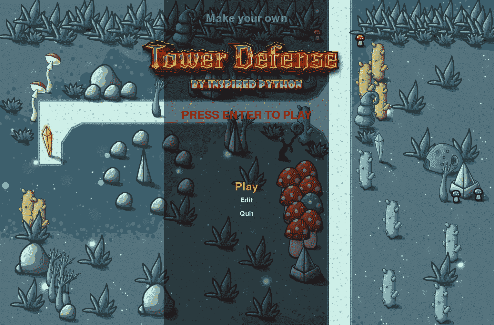

# 用 PyGame 制作自己的塔防游戏

> 原文：<https://www.inspiredpython.com/course/create-tower-defense-game/make-your-own-tower-defense-game-with-pygame>

Author [Mickey Petersen](https://www.inspiredpython.com/author/mickey-petersen)

在这个课程中，你将学习如何使用 PyGame 从头开始编写一个 2d 塔防游戏。写一堆意大利面条式的代码很容易；但是编写可维护且易于扩展的代码却不是这样。塔防游戏是学习如何编写一个真实的游戏来测试你作为 Python 程序员的技能的绝佳场所。它也是许多其他 2d 游戏的完美模板。

<figure class="w-[15rem] md:mx-5 mx-auto my-0 md:float-left" id="id1">

<figcaption>This is what you’ll be building!</figcaption>

</figure>

编写游戏的部分挑战是，一旦你超越了真正的基础，许多不同的学科就会抬头。在本课程中，您将学习以下技能:

What is a Game Loop?

游戏如何在屏幕上以一种易于维护和易于理解的方式更新和显示事物？

*游戏循环*是所有游戏的基石，无论大小。您将学习如何创建一个，以及如何用它来处理键盘和鼠标输入、图形渲染、更新屏幕上实体的物理特性等等。

State Machines and Transitions

很少有游戏只有一个屏幕，因此只有一种状态。大多数游戏都有一个主菜单，一个计分板，真正的游戏，可能还有更多玩家在游戏中互动的状态。理解如何在这些不同的概念之间转换你的游戏的*状态*对于编写一个没有意大利面条代码的游戏是至关重要的。

您将了解到*有限状态机*，这是计算机科学中的一个重要概念，以及它如何轻松地将一组复杂的令人困惑的需求转换成整洁的代码。

Lazy evaluation, Generators and Iterables

通过自由使用 Python 的`itertools`库和生成器，可以很容易地跟踪事物的位置——并计算事物的下一个位置，例如飞行的子弹。

掌握 Python 的一个部分，这个部分得到了大多数开发人员的支持，因为它们比普通的 for 循环更难推理。

Drawing and manipulating graphics

了解什么是*精灵*，如何操纵它移动、旋转、缩放，以及如何以一种清晰、易于理解的方式高效地完成。

Level Editing

您将编写一个完整的关卡编辑器，能够使用您自己构建的简单 UI 来放置和编辑组成塔防游戏的所有实体。

关卡编辑器是游戏的核心部分，包括如何编写保存和加载功能的细节，所以你可以和朋友分享你的关卡。

Path finding and Recursion

了解递归，这是一个强大的编程概念，可以在地图中找到有效的路径让敌人通过。您将了解基本的*图论*以及*深度优先搜索*如何用于遍历地图并找到从起点到终点的路线。

Vector Mathematics

掌握确保子弹沿直线射向目标所需的数学知识；你的敌人顺利地穿过地图；以及如何使用简单的算法制作简单的基于文本的动画。

您将了解简单的矢量算术、插值和基本的仿射变换(如缩放和旋转)。

Object-Oriented Programming (OOP)

提高您对类和对象的理解，以及如何最好地利用继承、工厂模式和 Python 的数据类，使用简单的类简洁地描述您的游戏世界。

Animation

了解如何将图像帧链接到简单的动画中，以便敌人穿过屏幕并在被爆炸的投射物击中时倒下。

Collision Detection

重要信息:炮塔如何知道何时向它瞄准的敌人开火？子弹打在敌人身上呢？

你准备好了吗？我们来编码吧！

## 简介和课程计划

因此，在我们开始认真编写代码之前，让我们看一下课程计划，以及您将学到什么。

### 课程计划

1.  简介和课程计划

    1.  课程计划

    2.  课程形式

    3.  配置 Python 环境

    4.  创建一个简单的 Python 包来托管我们的游戏

    5.  安装和运行演示游戏

    6.  游戏的媒体资产

2.  游戏循环控制器和初始化 PyGame

3.  状态机:它们如何工作，做什么？

4.  为我们的游戏建立一个模板(你也可以在其他项目中重复使用)

5.  精灵，精灵处理和如何与他们互动。

6.  编写 2d 切片引擎和地图编辑器

7.  精灵动画、运动学和矢量数学

8.  路径查找和递归基础

9.  碰撞检测和如何使用遮罩

10.  菜单、声音、文本和摘要。

这是课程计划，以及我们将如何从这里开始。我已经做了特别的努力来确保我以我期望你把它们加入游戏的速度来介绍它们，而不一定是按照你自己写的顺序，如果你坐下来写你的第一个游戏的话。我认为，这是我想重复的一个要点:将东西绘制到屏幕上还有一段时间，因为我认为在继续之前我们打下良好的基础是至关重要的。

### 必需的知识

在您开始之前，我将简要介绍一下我认为您应该了解的内容。你知道这一点并不是一条铁定的规则，但这将使课程更加平易近人。

A basic understanding of Python

列表、循环、字典、类、函数等等。你不一定要成为面向对象编程专家，但是了解一点关于继承的知识会大有帮助。

我们将编写自己的 Python 包，这主要是一个注意细节的例子。但是知道如何用`pip`安装包以及你的平台可能有的任何其他补充需求(这主要与 Linux 用户相关。)

Basic mathematics

没错。数学。这是无法逃避的。主要是算术，但是我们将转向向量数学的主题——但是仅仅是基础。如果你熟悉简单的笛卡尔坐标系和加减数字，你会做得很好。

差不多就是这样。你不需要事先了解 PyGame 或游戏开发；但是你确实需要一种想要学习它的渴望！

### 图形资产

这款游戏配有高质量的图形，随时可用。你可以在演示中找到它们。

### 课程形式

本课程不是你在游戏演示中找到的源代码的对等重复，但我会解释它的所有方面，所以在本课程结束时，你将完全理解编写塔防游戏(和许多其他 2d 游戏)所需的一切！)或者坐下来修改提供的演示中的所有内容。提供的演示完全正常；它有资产，音效，一个工作级编辑器和游戏。它还展示了您将在本课程中读到的所有内容，因此，如果您遇到困难，或者更喜欢查看完整的解决方案，我们鼓励您回头参考它。

您可以通过多种方式学习本课程，每种方式都有自己的学习途径，具体取决于您的喜好:

1.  你可以拿着这个演示开始修改，并把它作为基线或者作为你自己游戏项目的灵感。

2.  您可以将本课程作为参考，仅当您需要关于特定部分的建议时才回头参考，并通过提供的演示巩固您的学习成果。

3.  你可以按照课程和实现每一件事，一步一步，一路试验。

或者以上两种情况的结合——选择权在你。

好了，我们开始吧！