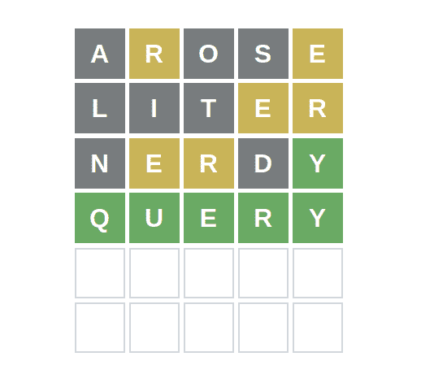

# 用基本的 Python 解决 Wordle 难题

> 原文：<https://www.inspiredpython.com/article/solving-wordle-puzzles-with-basic-python>

Author [Mickey Petersen](https://www.inspiredpython.com/author/mickey-petersen)

你听说过 [Wordle](https://www.powerlanguage.co.uk/wordle/) 吗？这是一个看似简单的字谜。你被要求猜一猜今天的单词，它是一个由五个字母组成的英语单词。如果你猜错了，你会得到一些提示:如果你猜对了单词中某个字母的位置，这个字母就是绿色的；黄色字母，如果该字母出现在单词中，但不在那个位置；如果这个字母不在单词里，那就是灰色。

看似简单，但相当具有挑战性！以下是你如何用 Python 集合、列表理解、一点点运气来编写一个 Wordle 解算器！

## 挑战

每天 Wordle 都会产生一个新的挑战词，我们必须猜出来。由于我们只有六次猜测机会——该网站使用 cookies 来跟踪您的进展——我们必须谨慎选择！

从表面上看，有许多我们可以利用的线索:

<figure class="w-[15rem] md:mx-5 mx-auto my-0 md:float-right" id="id1">[](https://www.inspiredpython.com/static/articles/wordle.png)

<figcaption>The Python Wordle Solver in action.</figcaption>

</figure>

1.  这个单词正好有五个字母长。

2.  它必须是英语，只有字母-没有标点符号，数字或其他符号。

3.  猜测产生线索:

     1.  如果字符*和*在单词中的位置正确，则为绿色字母。

    2.  一个黄色的字母如果字符是*在单词中表示*，但是我们选错了位置。

    3.  如果角色在这个世界上根本不是而是*则为灰色字母。* 
4.  单词的数量是有限的，什么是有效单词仅限于 Wordle 使用的词典。

因为我不想尝试提取和 Wordle 一样的字典(那太容易了)，所以我将使用一个免费的字典，它在`/usr/share/dict/american-english`中随 Linux 一起提供。字典是一个文本文件，每行一个单词。

有了这些规则和观察结果，我们就可以开始编写 Wordle 求解器的算法了。

## 加载和生成单词

首先，我们需要字典——如果你喜欢，可以随意使用你自己选择的一本。

接下来，我们需要对游戏规则进行编码:

```py
import string   DICT =  "/usr/share/dict/american-english"   ALLOWABLE_CHARACTERS =  set(string.ascii_letters) ALLOWED_ATTEMPTS =  6 WORD_LENGTH =  5
```

我们可以尝试六次。单词长度为五，我们可以使用所有可用的字母字符。

我正在将允许的字符转换成 Python `set()`,这样我就可以使用成员检查集合中的许多特性——稍后会详细介绍。

由此，我可以生成一组符合规则的单词:

```py
from pathlib import Path   WORDS =  {   word.lower() for word in Path(DICT).read_text().splitlines() if  len(word)  == WORD_LENGTH and  set(word)  < ALLOWABLE_CHARACTERS }
```

这里我使用一个*集合理解*来生成一组合法的单词。我使用优秀的`Path`类直接从文件中读取。如果你不熟悉 Path，我 [推荐你学习一下 Path](https://www.inspiredpython.com/article/common-path-patterns) ，因为它是一个优秀的特性。

但是正如你从理解中看到的，我正在过滤字典中的单词，所以只有那些长度合适的单词*和*，即单词中的字符集是`ALLOWABLE_CHARACTERS`的*子集*。换句话说，只选择存在于允许字符集中的词典单词。

## 英语字母频率分析

英语的特点是单词中字母分布不均。例如，字母`E`比`X`使用得更频繁。因此，如果我们可以用最常见的字母生成单词，我们就更有可能让 Wordle 匹配单词中的部分或全部字符。因此，我们的制胜策略是为我们的 Wordle 求解器提出一个算法，生成英语中最常用的字母。

幸运的是，我们有一本英语词典！

```py
from collections import Counter from itertools import chain   LETTER_COUNTER = Counter(chain.from_iterable(WORDS))
```

`Counter`类是一个有用的发明。这是一本经过修改的记数字典。当您向它提供值时，它将这些值作为键进行跟踪，并将出现的次数存储为该键的值。对我们来说非常有用，因为我们想要字母的频率。

为此，我使用了`itertools`模块中一个鲜为人知的函数`chain`。`chain`有一个相当隐蔽的方法叫做`from_iterable`，它接受一个单独的可迭代对象，并将其作为一个长的可迭代对象链来计算:

我认为一个例子最能说明这一点:

```py
>>>  list(chain.from_iterable(["inspired",  "python"])) ['i',  'n',  's',  'p',  'i',  'r',  'e',  'd',  'p',  'y',  't',  'h',  'o',  'n']
```

因为字符串也是可迭代的，并且因为`WORDS`是一组字符串(可迭代的),我们分割了一个集合(或列表，等等)。)转化成他们的构成人物。这是字符串的一个有用的属性。您可以通过类似于`set`的东西来获取单词中的独特字符:

```py
>>>  set("hello") {'e',  'h',  'l',  'o'}
```

Sets are modelled on their mathematical cousins of the same name

这意味着集合只能保存唯一的值——不能重复——并且它们是无序的。这就是为什么字符集与字符串的顺序不同。

集合拥有许多有用的特性，比如测试一个集合是否完全包含在另一个集合(子集)中；得到两个集合重叠的元素(交集)；合并两个集合(联合)；诸如此类。

我们已经数过字母了，看起来相当不错:

```py
>>> LETTER_COUNTER Counter({'h':  828,   'o':  1888, 'n':  1484, 'e':  3106, 's':  2954, 'v':  338, # ... etc ... })
```

但这只能给出字符的绝对数量。那么，更好的办法是把它分成占总收入的百分比。幸运的是，`Counter`类有一个方便的`total`方法，可以给出所有字母出现的总数。

把它变成频率表很容易:

```py
LETTER_FREQUENCY =  {   character: value / LETTER_COUNTER.total() for character, value in LETTER_COUNTER.items() }
```

 Python 3.10 增加了`Counter.total()`方法，所以如果你使用的是旧版本的 Python，你可以用做同样事情的`sum(LETTER_COUNTER.values())`代替它。 

这里我使用一个*字典理解*来枚举`LETTER_COUNTER`的每个键和值(这是一个修改过的字典)并将每个值除以总计数:

```py
>>> LETTER_FREQUENCY {'h':  0.02804403048264183,   'o':  0.06394580863674852, 'n':  0.050262489415749366, 'e':  0.10519898391193903, 's':  0.10005080440304827, # ... etc ... }
```

现在我们对字典中被认为是有效单词的*子集的字母频率有了一个完美的统计。注意，我不是针对整个词典这样做的——只是我们认为合法的单词部分。这不太可能对排名产生太大影响，但这最终是我们所依据的一套词汇。*

现在我们需要一种衡量每个单词的方法，这样我们就可以提出最可能的候选词。因此，我们需要使用字母频率表，并制作一个单词评分函数，对单词中字母的“常见”程度进行评分:

```py
def  calculate_word_commonality(word):   score =  0.0 for char in word: score += LETTER_FREQUENCY[char] return score /  (WORD_LENGTH -  len(set(word))  +  1)
```

我再次利用了这样一个事实，即通过迭代单词中的每个字符，字符串是可迭代的。然后我得到每个单词的频率，并把它加起来；然后，总计数除以单词长度减去唯一字符的数量(加 1，以防止除以零)。

这不是一个令人惊讶的得分函数，但它很简单，并且以这样一种方式对单词进行加权，即更多的独特字符比具有更少独特字符的单词给予更大的权重。理想情况下，我们希望尽可能多的独特、频繁的字符，以最大化在 Wordle 中获得绿色或黄色匹配的可能性。

一项快速测试证实，含有不常用字符和重复字符的单词的权重低于含有常用字符和更独特字符的单词。

```py
>>> calculate_word_commonality("fuzzy") 0.04604572396274344
```

```py
>>> calculate_word_commonality("arose") 0.42692633361558
```

我们现在需要的是一种排序和显示这些单词的方法，以便人类玩家可以从中选择:

```py
import operator   def  sort_by_word_commonality(words):   sort_by = operator.itemgetter(1) return  sorted( [(word, calculate_word_commonality(word))  for word in words], key=sort_by, reverse=True, )   def  display_word_table(word_commonalities):   for  (word, freq)  in word_commonalities: print(f"{word:<10} | {freq:<5.2}")
```

使用`sort_by_word_commonality`,我生成一个排序的(从最高到最低)元组列表，每个元组包含单词和该单词的计算得分。我排序的关键是分数。

 我没有使用 lambda 来获取第一个元素；对于像这样简单的东西，我更喜欢做同样事情的`operator.itemgetter`。 

我还添加了一个快速显示功能，将单词及其分数格式化成一个简单的表格。

现在是求解器。

## 编写 Wordle 求解器

因为我正在构建一个简单的控制台应用程序，所以我将使用`input()`和`print()`。

```py
def  input_word():   while  True: word =  input("Input the word you entered> ") if  len(word)  == WORD_LENGTH and word.lower()  in WORDS: break return word.lower()     def  input_response():   print("Type the color-coded reply from Wordle:") print("  G for Green") print("  Y for Yellow") print("  ? for Gray") while  True: response =  input("Response from Wordle> ") if  len(response)  == WORD_LENGTH and  set(response)  <=  {"G",  "Y",  "?"}: break else: print(f"Error - invalid answer {response}") return response
```

功能很简单。我想向用户询问他们给 Wordle 的一个`WORD_LENGTH`单词，我想记录 Wordle 的响应。由于只有三种可能的答案(绿色、黄色和灰色)，我将其编码为一个简单的三字符字符串:`G`、`Y`和`?`。

我还添加了错误处理功能，以防用户反复循环输入错误，直到给出正确的序列。为此，我再次将输入转换为一个集合，然后检查该用户输入集合是否是有效响应的子集。

### 用词向量过滤绿色、黄色和灰色字母

绿色字母规则表明字母*和*在单词中的位置是正确的。黄色表示位置不对，但表示字母存在于单词中；格雷认为这封信不在任何地方。

另一种解释是，在沃尔多告诉我们哪些字母是绿色、黄色或灰色之前，所有的可能性都存在。

```py
word_vector =  [set(string.ascii_lowercase)  for _ in  range(WORD_LENGTH)]
```

这里我创建了一个集合列表，列表大小等于单词长度，即 5。每个元素都是一组全部小写的英文字符。通过为每个集合创建一个，我可以在从每个位置删除字符时删除它们:

Green letters are limited to just that letter

这意味着如果我在位置 2 遇到一个绿色的字母，那么我可以修改那个位置的集合，只保存那个字母。

Yellow letters imply the *complement* of that letter

所以所有的字母*除了*那个字母在那个位置技术上是可能的。将该字母从该位置的集合中移除确保我们不能选择该字母被设置为该字符的单词。

Gray letters imply the exclusion of that letter across the vector

因此，该字符必须从单词 vector 的所有集合中删除。

理想情况下，我们的 Wordle solver 将尝试找到尽可能多的绿色字母，因为这自然是最佳匹配类型。

现在我需要一个函数来告诉我一个单词是否匹配单词 vector。有很多方法可以做到这一点，但这是一个很好很简单的方法:

```py
def  match_word_vector(word, word_vector):   assert  len(word)  ==  len(word_vector) for letter, v_letter in  zip(word, word_vector): if letter not  in v_letter: return  False return  True
```

这种方法使用`zip`来成对匹配单词中的每个字符，以及单词向量中的每个字符(如果有的话)

如果该字母不在该位置的单词向量集中，则以失败的匹配退出。否则，继续，如果我们自然退出循环，返回`True`表示匹配。

### 匹配单词

规则实现后，我们现在可以编写搜索函数，根据从 Wordle 返回的响应过滤单词列表。

```py
def  match(word_vector, possible_words):   return  [word for word in possible_words if match_word_vector(word, word_vector)]
```

匹配器将我们刚刚谈到的概念合并到一个列表理解中，进行检查。用`match_word_vector`对照`word_vector`测试每个单词。

### 重复答案

最后，我们需要一个小的用户界面，可以重复查询我们想要的答案。

```py
def  solve():   possible_words = WORDS.copy() word_vector =  [set(string.ascii_lowercase)  for _ in  range(WORD_LENGTH)] for attempt in  range(1, ALLOWED_ATTEMPTS +  1): print(f"Attempt {attempt} with {len(possible_words)} possible words") display_word_table(sort_by_word_commonality(possible_words)[:15]) word = input_word() response = input_response() for idx, letter in  enumerate(response): if letter ==  "G": word_vector[idx]  =  {word[idx]} elif letter ==  "Y": try: word_vector[idx].remove(word[idx]) except KeyError: pass elif letter ==  "?": for vector in word_vector: try: vector.remove(word[idx]) except KeyError: pass possible_words = match(word_vector, possible_words)
```

solve 函数做了很多我已经解释过的设置。但是在那之后，我们循环到`ALLOWED_ATTEMPTS + 1`，并且随着每次尝试，我们显示我们正在进行的尝试以及还有多少可能的单词。然后我们调用`display_word_table`来漂亮地打印 15 个得分最高的比赛的表格。然后我们询问这个单词，以及 Wordle 对这个单词的响应。

接下来，我们枚举响应，确保记住每个答案的位置，这样我们就知道它在单词中指向哪里。代码很简单:我们将三个响应字符中的每一个映射到各自的容器(绿色映射到`word_vector`，等等)。)并应用我们之前讨论的规则。

最后，我们用来自`match`的新匹配列表覆盖`possible_words`，并再次循环，显示现在减少的子集。

### 尝试一下

<figure class="" id="id2">[](https://www.inspiredpython.com/static/articles/wordle.png)

<figcaption>The answers match the queries we gave to the solver.</figcaption>

</figure>

通过调用`solve()`启动它(为了简洁省略了一些输出):

```py
>>> Attempt 1 with 5905 possible words
arose      | 0.43
raise      | 0.42

   ... etc ...

Input the word you entered> arose
Type the color-coded reply from Wordle:
  G for Green
  Y for Yellow
  ? for Gray
Response from Wordle> ?Y??Y
Attempt 2 with 829 possible words
liter      | 0.34
liner      | 0.34

   ... etc ...

Input the word you entered> liter
Response from Wordle> ???YY
Attempt 3 with 108 possible words
nerdy      | 0.29
nehru      | 0.28

   ... etc ...

Input the word you entered> nerdy
Response from Wordle> ?YY?G
Attempt 4 with 25 possible words
query      | 0.24
chewy      | 0.21

   ... etc ...

Input the word you entered> query
Response from Wordle> GGGGG
Attempt 5 with 1 possible words
query      | 0.24
```

## 摘要

Comprehensions are powerful Python tools

他们可以将迭代和过滤结合起来，但是如果你滥用这个特性，堆积太多的`for`循环，或者太多的`if`子句，你就冒着使你的代码变得非常非常难读的风险。避免每种嵌套超过几个。

Sets are a major asset to Python

采取行动的能力，以及知道何时使用*集合成员资格*的能力，使得代码更稳定、数学上更正确、更简洁。这在这里很有用——不要忽视布景！

You can express the entire search space with regular expressions

虽然我没有探究，但匹配(或不匹配)字符的行为是正则表达式做得最好的。想一个方法，你可以使用正则表达式重写匹配器和单词矢量化。

The `itertools` and `collections` module contain useful helpers

如果你知道如何使用内置模块，你可以用基本的 Python 完成很多事情。如果你想懒散地或迭代地计算数值，这尤其有用。