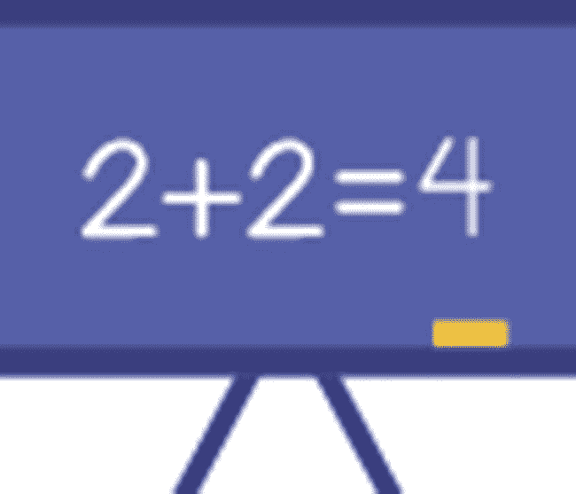
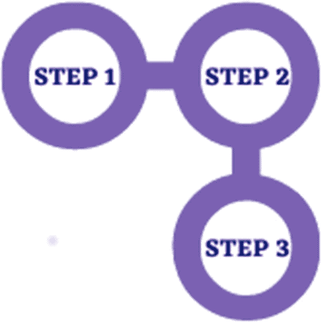
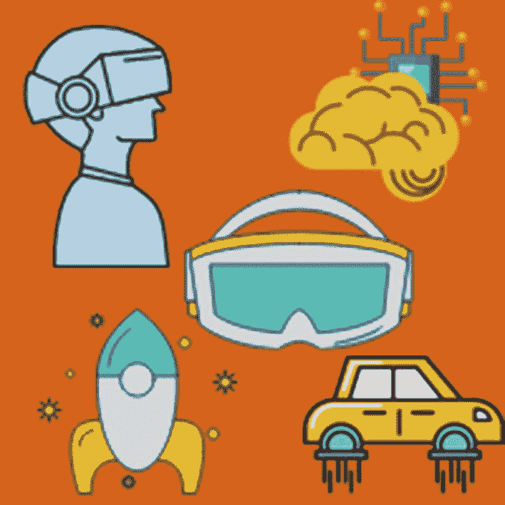
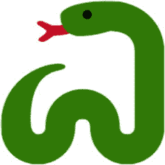
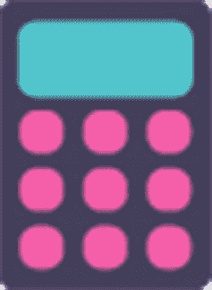

# 一、你知道吗？

我为父母写了这一章的第一部分，其余部分是为孩子们写的。我希望在本章中让你相信编程和 Python 作为你孩子的第一门编程语言的重要性。如果你的孩子比你大(10 岁以上)，他们可以自己阅读这些主题。在这一章的后半部分，我将向孩子们简要介绍他们可以用 Python 做的所有有趣的事情，他们将从我的书中学到什么，以及如何充分利用我的书。

那么，让我们开始吧。

## 什么是编程？

你有你的小工具——你的笔记本电脑、个人电脑、平板电脑、手机等等——只要你让它做什么，在合理的范围内，它就会做什么。怎么做？嗯，这是因为每次你给你的小工具分配任务时，它的预编程指令就会在后台启动。那些指令集被称为代码。

您会发现，您的小工具需要一套完整的指令来执行最简单的任务，如打开应用程序或执行计算。他们毕竟只是机器，只是一切的基础上的 1 和 0。他们不能独立思考，所以我们用代码让他们思考。

换句话说，编程是你的计算机说的语言，不同的编程语言是它理解/说的不同语言。你可能懂英语、法语和普通话，但你可能不懂意大利语或日语。类似地，从字面上看，有数百种编程语言(Python、JavaScript、C、C++、C#、Ruby 等。)，*你的*电脑可能会说几个，或者只说一个，其他的听不懂。

### 为什么你的孩子应该学习编码？

既然你知道了什么是编程，以及它是如何运行数字世界的，我不应该给你很多理由来说服你教你的孩子编程，对吗？

但是，你可能仍然想知道为什么你的孩子需要学习编程，为什么他们现在要学习 T2。毕竟，在我们这个时代，人们在大学里学习编程，并且只有当他们决定成为一名程序员时。

嗯，我想我有几个理由可以让你相信，为什么在这个时代，不管未来的职业抱负如何，孩子们都应该学习编程，为什么他们现在开始学习是明智的。

#### 编程就像数学

三十年前，没有人敢做出这样的声明，但是现在，时代变了，是的，编程确实像数学一样。它无处不在，就像数学一样。

至少在我们 18 岁之前，数学是我们教育要求的一部分，但今天并不是我们每个人都是数学家。那为什么数学被强迫灌输给我们？因为数学决定一切。我们在日常生活中需要基础数学，当然在大多数职业生涯中也需要。所以，我们学了从微积分到代数再到几何的所有东西，非常清楚长大后我们可能不会用到 90%的知识。

这正是今天编程的情况。一切都数字化了。从送餐到股市预测，应有尽有。计算机已经进入各个领域，包括建筑和制造等传统领域。现在大多数建筑设备都是数字化的，是什么驱动了它们？程序和数千行代码。

甚至艺术也被数字化了。因此，无论你的孩子进入哪个领域，他们的编程知识都将助他们一臂之力。

但除此之外，编码还通过培养逻辑思维和解决问题的能力来提高孩子的数学能力。

#### 编码提高逻辑思维和创造力

一个矛盾的说法，但在这种情况下是正确的。您的孩子创建的每个代码块都将被逻辑驱动。

逻辑决定编程，一旦他们开始自己编码，他们将学会将一个问题分解成小部分，应用逻辑解决每个部分，然后最终将所有部分组合成一个连贯的解决方案。

这就是现实世界中解决问题的方式，不管是在哪个领域，他们将在孩提时代学习这种无价的技能。

但老实说，你的孩子会厌倦逻辑。这就是创造力的来源。这个世界是靠创造力和逻辑运行的，编程也是如此。

编程没有正确的答案。如果他们正在解决问题，他们如何解决并不重要。当然，有最佳实践，但是如果你让两个程序员解决同一个问题，很可能他们的代码块看起来完全不同。

因此，当他们在编程过程中提出一个解决方案，以及针对多个问题的多个解决方案时，他们也会培养创造力。

两全其美，你说呢？

#### 编码是未来

让我们在这里非常诚实。我们正以惊人的速度走向一个完全数字化的社会。一切都数字化了。应用无处不在。人工智能每天都在世界上掀起新的浪潮。在我们知道之前，我们将拥有人工智能驱动的技术来清洁我们的房子和驾驶我们的汽车。

难怪编程在当今世界已经成为一项无价的技能，对程序员的需求每年都在增加。

因此，编码确实是未来，通过在年轻时学习编码，你的孩子将比他们的竞争对手有优势。听起来不错，但是如果你的孩子想成为一名机械工程师，为什么他们需要编程呢？还是金融分析师？

这使我回到我最初的论点。一切都被数字化了，编码无处不在，在每一个领域。所以，如果你的孩子有编程基础，那么他们不会脱颖而出吗？

例如，一个具有编程知识的金融分析师可以自己编写一个股票预测应用程序，从而为公司节省大量资源，或者他们至少可以流利地使用技术术语，从而更好地指导程序员，并为他们的老板节省数百个生产时间。

所以，不管你的孩子将来要学什么，编程都会帮助他们，在不久的将来，他们会有一项可以赚钱的技能，可以用来赚外快。

在他们十几岁的时候，他们不必以卖汉堡包的最低工资作为副业。他们可以作为一名软件开发人员从事自由职业，用一半的时间工作至少可以多赚三到四倍的钱。

或者更好的是，你的孩子可以决定成为一名企业家。正如你所知道的，几乎每个创业公司都以某种方式与编程和软件有关，所以作为一名程序员，你的孩子可以自己编写应用程序，轻松节省数万元的程序员费用。

我相信这些都是非常有说服力的论据，可以解释为什么你的孩子需要现在就开始学习编程。

### 为什么是 Python？

好了，现在你已经确信了你的孩子学习编码的好处，但是为什么是 Python 呢？在数十种流行的编程语言中，为什么要从 Python 开始呢？

我坚信 Python 应该是孩子现实世界编程的首选，让我来告诉你为什么。

#### Python 很简单

嗯，差不多就是这样。孩子们想玩得开心，如果我们想让他们学习编程，那就需要有趣和简单。Python 都是。

不像其他古老的语言，在创建第一个程序之前需要学习大量的语法和理论，Python 非常简单。语法简单易懂，逻辑性强。“打印”只是在屏幕上打印一些东西。很好记，对吧？没有很多记忆要做，你的孩子可以从一开始就开始编码和创作。

对于没有编程知识的初学者来说，它是完美的编程语言，对孩子来说更好，因为它也很有趣。

Python 有许多内置的儿童友好模块和库，可以帮助他们只用几行代码就能绘制图形、创建游戏和有趣的应用程序。

#### 它可以做很多事情

现在，不要低估 Python，因为它很容易学。它可以用于从 web 开发到桌面应用程序开发到人工智能的几乎所有领域。

这种语言非常强大，它附带的库和模块甚至更强大。你什么都有附件。

你可以用 *Turtle* 创建图形，用 *Tkinter* 创建漂亮的桌面应用(就像你非常喜欢在笔记本电脑上使用的计算器应用)，用 *Pygame* 创建专业游戏，用 *Django* 或 *Flask* 开发成熟的网站和网络应用，用大量简单易学的库应用机器学习(人工智能)算法。Python 有无限的可能性。

通过用 Python 开始他们的编程之旅，您的孩子不仅仅是步入了编码的世界，他们还用这个时代最受欢迎的(也是最受欢迎的)编程语言之一来武装自己。

还有什么？随着 Python 的受欢迎程度以及它在人工智能等快速发展领域的采用率不断增长，Python 显然会继续存在，因此您孩子的技能在未来不太可能过时。

从现在开始，我将向孩子们致辞。

## Python 好玩！

你好。所以，你是来学 Python 的。它不仅易于上手，还附带了许多附加功能，让编程变得有趣。你想知道你能用 Python 创造的所有酷的东西吗？

### 游戏！

谁不爱游戏，我说的对吗？但是如果你能创造出自己的游戏，然后和你的朋友一起玩呢？如果你能做到这一点，你将成为班上最受欢迎的孩子。

还有什么？你可以随心所欲地改变游戏的功能。想要五条命而不是三条？太好了，再加两个。不够水平，你已经厌倦了？在你的游戏中编码更多的关卡！让这些水平变得格外困难，给自己一个挑战。你可以自由地做任何你想做的游戏，你甚至可以从你的朋友那里得到建议并应用到你的游戏中。

只需一点点编码，你就能修改你一直不满意的游戏，或者创造一个全新的你可以和朋友一起玩的游戏。

所以，你会在编码和编码之后(玩游戏的时候)玩得很开心*。*

### 图形和动画

对我来说，图形和动画是仅次于游戏的最好的东西。你呢？

想象一下，运行一个程序来实时绘制您创建的设计。一部动画怎么样？如果您可以创建设计和动画，并在您一直想创建和玩的游戏中使用它们，会怎么样？

就像我常说的，可能性是无限的，它们只受你的创造力和想象力的限制。和 Python 一起狂奔！

### 网站

你使用互联网吗？那你现在肯定已经访问了至少 100 个网站了。他们看起来很棒，不是吗？如果你能创建一个和你最喜欢的网站一样的网站会怎么样？

如果你学习 Python，你当然可以。

我说的不是简单的网站。我说的是有很多很酷的功能的大型成熟网站和网络应用。经过足够的练习，你甚至可以创建像脸书和 Instagram 这样的网站和应用程序。

### 应用程序

Python 自带了很多工具，就像你在游戏中使用的工具一样。这些工具在 Python 中被称为库和包。在这些库的帮助下，你几乎可以创建任何东西，包括应用程序。

你用笔记本电脑还是平板电脑？它有很多很酷的应用程序，对吗？有计算器应用程序、秒表/计时器应用程序、绘画应用程序等等。

如果你能创建那些精确的应用程序会怎么样？嗯，有了 Python，你当然可以。事实上，你将在本书中学习创建一些应用程序。你兴奋吗？

不仅如此，有了像 *Kivy* 和 *PyQt* 这样的包，你甚至可以开始用 Python 创建移动应用。我们不会在这本书里讨论这些包，但是正如你所看到的，你有很多使用 Python 的可能性。

咻！这确实是一个很大的列表。使用 Python，世界就是你的了，快来玩吧！

## 充分利用这本书

这一章(也是最后一章)将是仅有的两章包含大量文本。在剩下的章节里，我已经尽力让事情保持有趣和实用。

你会遇到很多例子来说明我们所涉及的每一个主题。将会有很多编码，所以我推荐你和我一起编码例子。尽量不要复制粘贴。把所有东西都打出来，这样你就可以熟悉编码了。

每一章都有很多活动、谜题和迷你项目，还有详细的、一步一步的解决方案。我建议遵循前几章的解决方案，但是一旦你足够自信，尝试自己解决难题/活动，然后用给定的解决方案进行交叉验证。

记住，编程没有错解！如果你得到了想要的结果，你就可以开始了。

这本书包括四个顶点项目(大项目)来巩固你的 Python 知识。我建议创建项目，但不要就此止步。尝试在每个项目中改变一些东西，让它成为你自己的。当然，不要忘记向你的家人、朋友和老师展示你的项目！

差不多就是这样。这是一本简单易懂的书，所以不要被它的篇幅所淹没。只要开始动手，开始编码。

## 摘要

在这一章中，我简要解释了什么是编程，以及为什么你的孩子需要在这么小的年龄就学习编程，而不管他们未来的愿望如何，这一章是写给父母(前半部分)和孩子(后半部分)的。我也给出了令人信服的论据，说明为什么 Python 应该是孩子首选的真实世界编程语言，以及孩子可以用 Python 做什么。我们在本章结尾简要概述了你将从本书中学到的一切，以及充分利用本书的最佳方式。

在下一章，我们将学习如何安装 Python 并创建和执行我们的第一个 Python 程序。