#二、我们来装 Python 吧！

在这一章中，我们将深入了解什么是编程，以及如何用它来控制各种小工具。我们还将考虑在我们的系统中安装 Python。让我们开始吧！

## 说计算机的语言

语言是用于两个或更多人之间的交流，我说的对吗？但是如果有人用你不懂的语言跟你说话，你能听懂吗？当然不是。我也不会！

同样，你的电脑也不能理解它不会说的语言。所以，如果你只是看着你的电脑，用简单的英语命令它打开画图程序，它是听不懂你的。另一方面，如果你用它能理解的语言和它交谈，你肯定会得到回应。

编程语言是计算机理解的语言。Python 就是其中之一。如果你想让你的电脑或手机或 GPS 或平板电脑做些什么，你需要给它们指令。

当您点按画图应用程序的图标时，您的设备如何知道您实际上已经点按了它？它怎么能打开那个应用程序而不是别的呢？这是因为一个程序员可能写了一串代码，说当有人点击画图图标时，画图应用程序应该打开。如果他们修改了代码，写下点击那个图标应该打开谷歌 Chrome 浏览器，那么就会发生这种情况。

所以，一个程序员的工作极其重要。他们让设备工作。他们创造了设备的大脑，使行动成为可能。没有他们的代码，你每天使用的设备将只是一堆塑料、芯片和电线，除此之外别无其他。

所以，如果你学会了说计算机语言，你也可以给你的计算机，或者任何小工具，像这样的指令。一旦你擅长编程，你就可以创建像画图这样的应用程序或者像《我的世界》这样的游戏。

### 开始-安装 Python

现在你知道什么是编程了。它只是你给一个小工具/设备的一组指令，让它做你想让它做的事情。

那我们开始编程好吗？Python 是最简单的编程语言之一，所以这正是我们将在本书中学习的内容。

不过，在编写 Python 程序之前，您需要将它安装在您的笔记本电脑或计算机上。还记得我说过你的电脑需要说这种语言来理解你在说什么吗？

现在，您的计算机可能不会说 Python 语言。那是因为 Python 没有安装在里面。一旦你安装了它，你的电脑将在几秒钟内学会这种语言(是的，就是这么快！)，然后当你用 Python 给它指令的时候，它会理解你并做出相应的反应。这是魔法！

我会给你一步一步的在你的系统上安装和运行 Python 的指导，所以跟着我做，好吗？我将对 Windows 和 Mac 分别给出说明，所以请直接跳到您设备上的说明。

### 在 Windows 计算机上安装 Python

让我们先看看如何在 Windows 设备上下载和安装 Python。这些步骤适用于 Windows 及更高版本。

### 下载 Python

1.  在你的浏览器上打开以下链接: [`www.python.org/downloads/`](http://www.python.org/downloads/) 。

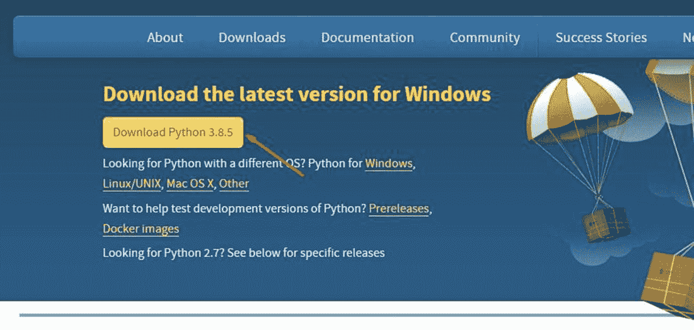

图 2-1

Python Windows 下载页面

1.  点击**下载按钮**(看图 [2-1](#Fig1) 中的箭头)下载 Python 安装程序。记得我告诉过你编码是神奇的吗？你会看到现在的行动。当你打开页面时，它知道你使用的是 Windows 电脑，无需你告诉它。

在写这本书的时候，我已经下载了 **Python 3.8.5** ，但是你可能正在下载一个更新的版本。不要担心那个。继续下载最新版本。

### 安装 Python

它知道你有一台 Windows 电脑，所以你现在必须**安装**Python 的 Windows 版本。让我们这样做:

1.  Open the .exe file you just downloaded. You will see a popup like Figure [2-2](#Fig2).

    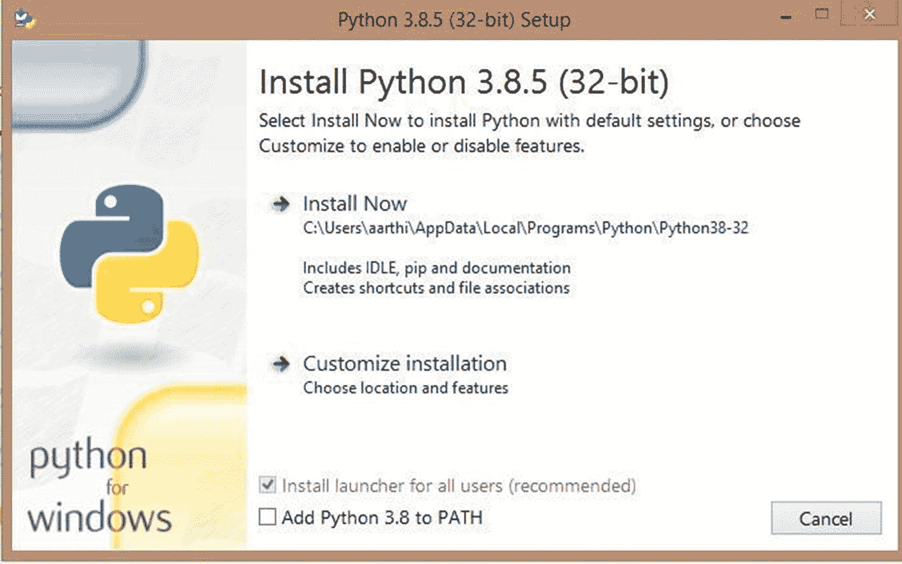

    图 2-2

    Python 安装设置

2.  Do not forget to click the checkbox that says “**Add Python 3.8 to PATH**” (Figure [2-3](#Fig3)).

    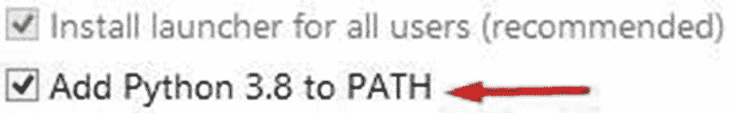

    图 2-3

    将 Python 添加到路径

3.  Once you have ticked the box, click **install now**. The installation will start, and it will look something like Figure [2-4](#Fig4).

    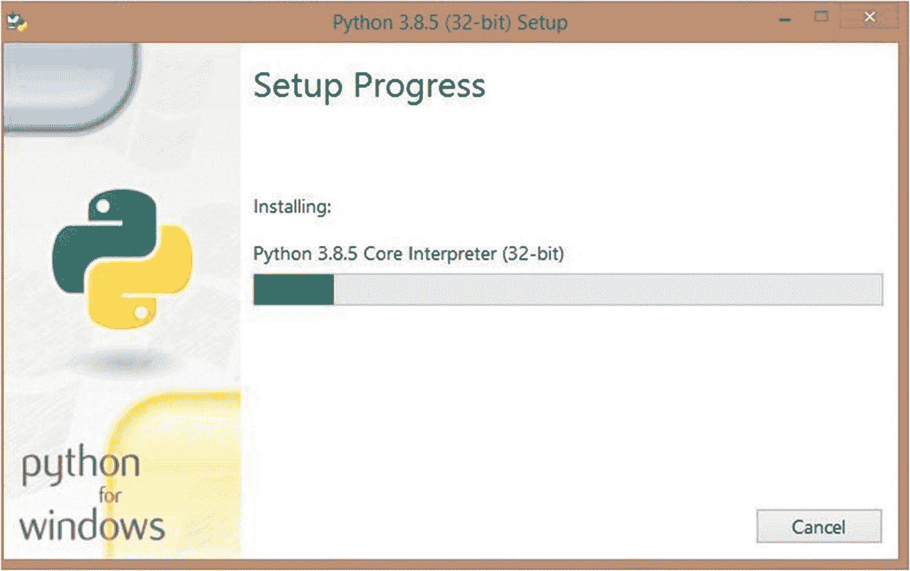

    图 2-4

    Python 安装进度

4.  Wait until the green bar reaches the end, and you will see a message that says “**Setup was successful**” (Figure [2-5](#Fig5)).

    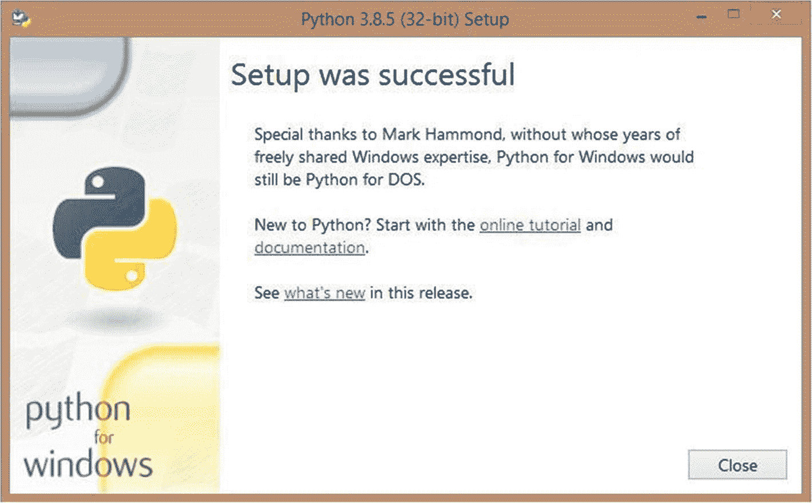

    图 2-5

    Python 设置成功消息

5.  按下**关闭**按钮，你就完成了在电脑上安装 Python。万岁！

### 在 Mac 设备上安装 Python

接下来让我们看看如何在 Mac 设备上下载和安装 Python。如果您有一台 Windows 计算机，并且已经按照上一节中的步骤安装了 Python，则可以跳过这一节。

Python 通常预装在任何 Mac 设备中，但您的系统中可能有旧版本的 Python。拥有任何软件的最新版本都没有坏处，所以让我们更新我们的 Python，好吗？

### 下载 Python

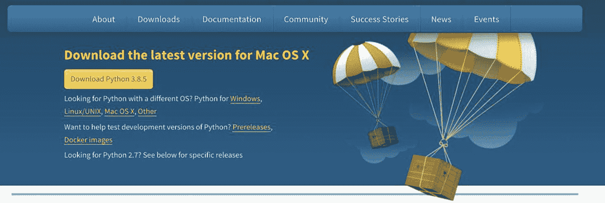

图 2-6

Python Mac OS 下载页面

1.  **在你的浏览器中打开以下链接**:[`www.python.org/downloads/`](http://www.python.org/downloads/)(图 [2-6](#Fig6) )。

1.  点击黄色**下载按钮**下载 Python 安装程序。记得我告诉过你编码是神奇的吗？你会看到现在的行动。

你有没有注意到，当你从你的 Mac 设备访问下载页面时，它会自动显示“为 Mac OS X 下载最新版本”？那是因为 Python 网站的代码读取的是哪个操作系统(Windows，Mac 等。)您正在使用，并给了您自动下载的正确版本。很酷，对吧？

您的包将如图 [2-7](#Fig7) 所示下载。

图 2-7

Python 3.8.5 包已下载

在写这本书的时候，我已经下载了 Python 3.8.5，但是你可能正在下载一个更新的版本。不要担心那个。继续下载最新版本。

### 安装 Python

1.  **Open the installer** and you will see a screen like Figure [2-8](#Fig8).

    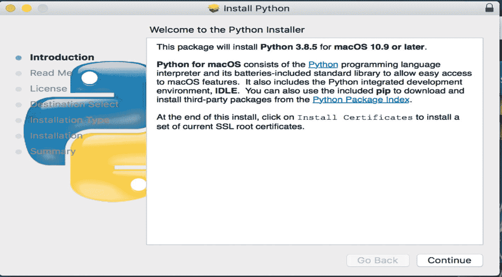

    图 2-8

    Python Mac 安装–简介

2.  Click **Continue**, and you will get the following page (Figure [2-9](#Fig9)).

    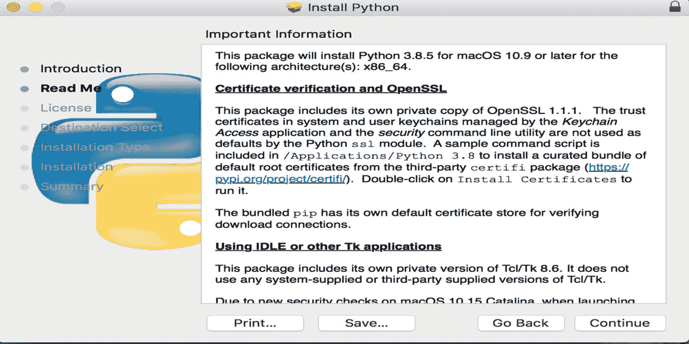

    图 2-9

    Python Mac 安装–阅读我

3.  Click **Continue** again, and you will get the following page (Figure [2-10](#Fig10)).

    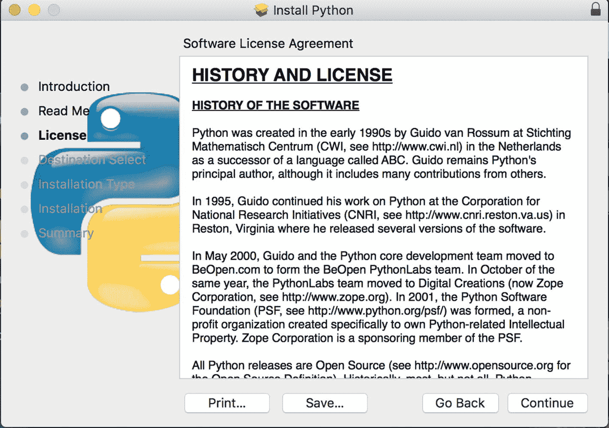

    图 2-10

    Python Mac 安装–许可

4.  Click **Continue** again (Figure [2-11](#Fig11)).

    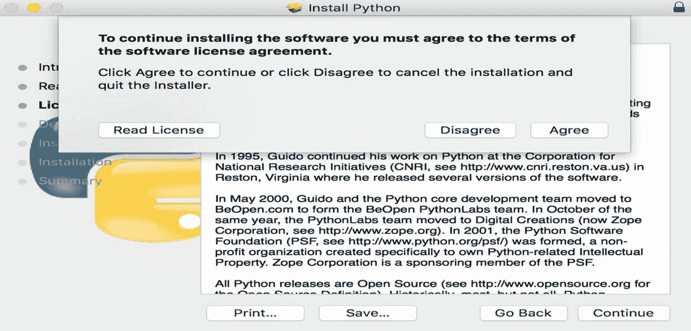

    图 2-11

    Python Mac 安装–许可协议

5.  While you are at the license page, you might get a **popup** like the preceding one. Click **Agree**, and you will get the Installation Type page (Figure [2-12](#Fig12)).

    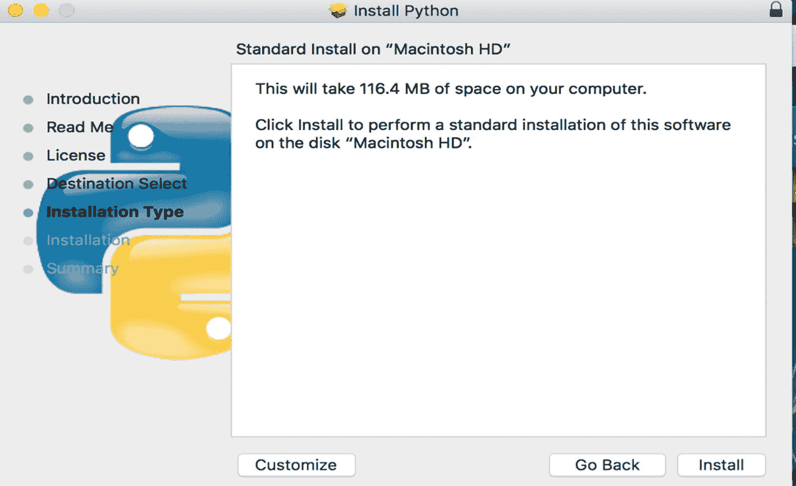

    图 2-12

    Python Mac 安装–安装类型

6.  We are almost there! Click the **Install button**, and your installation should start immediately. In certain cases, you might see a popup that asks for your **username and password** like the following one (Figure [2-13](#Fig13)).

    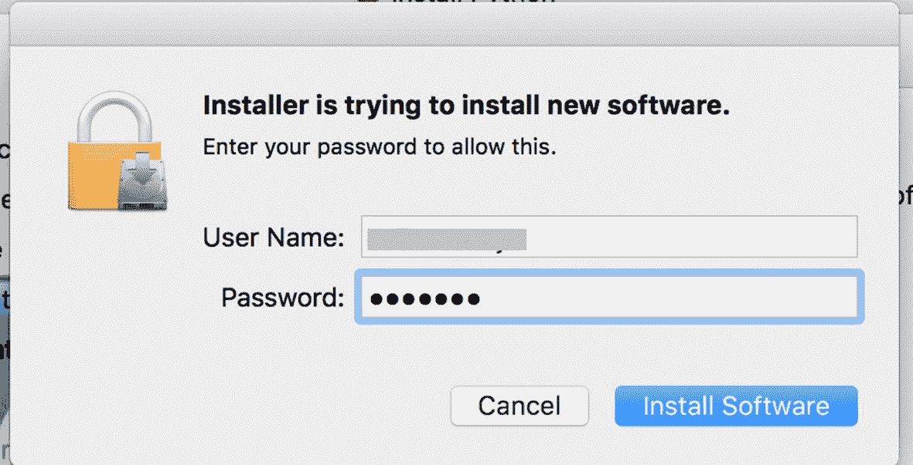

    图 2-13

    Python Mac 安装–认证

7.  输入您的 Mac 用户名和密码，您就可以开始了。如果你正在使用你父母的系统，打电话给他们来帮助你完成这一步。

一旦完成这一步，您应该会看到安装开始(图 [2-14](#Fig14) )。

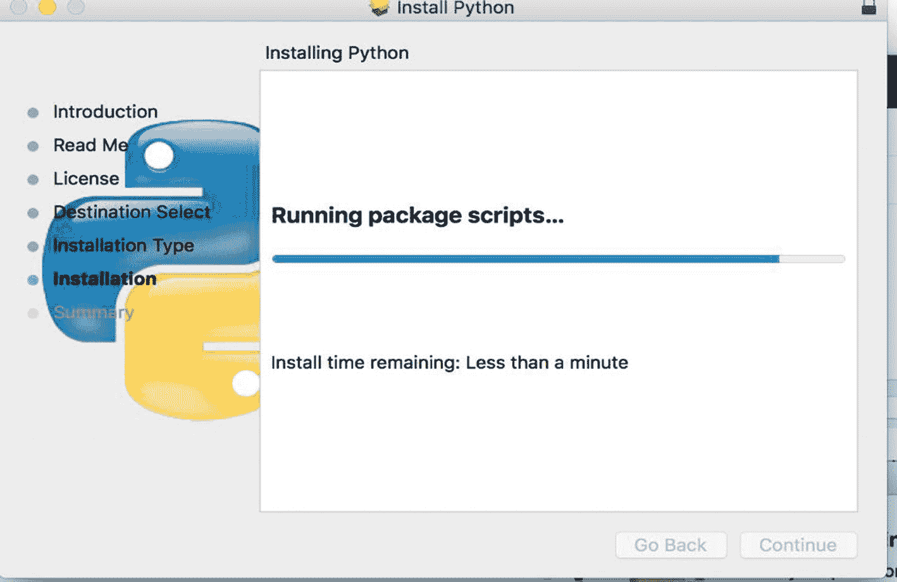

图 2-14

Python Mac 安装–安装

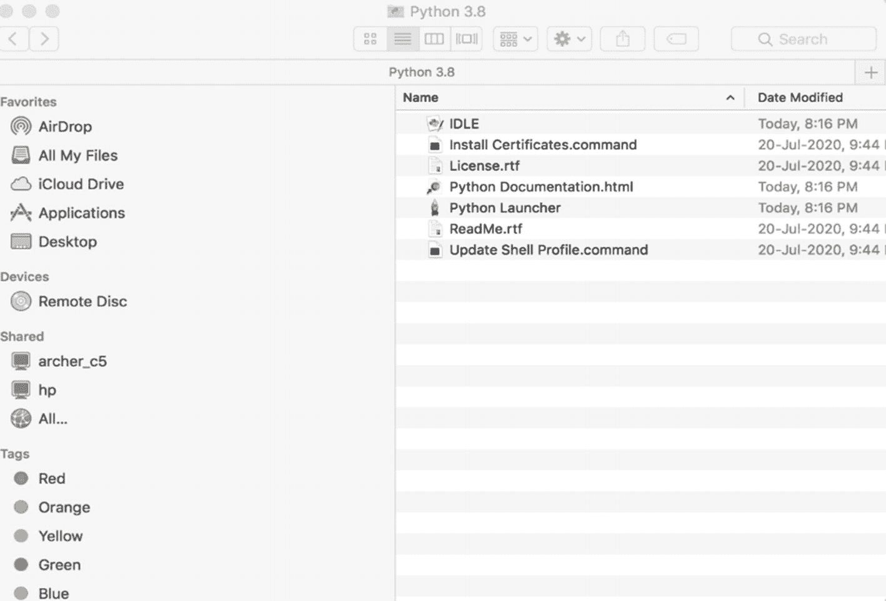

图 2-15

Python 包

1.  等到蓝条跑到最后。应该不会超过几分钟。一旦完成，你的 **Python 包**应该会打开(图 [2-15](#Fig15) )。

恭喜你！你已经下载了 Python！没你想的那么难，是吗？让我们在下一节中尽情享受吧。

## 摘要

在本章中，我们学习了如何在 Mac 和 Windows 中下载和安装 Python。在下一章，让我们看看如何用 Python 创建我们的第一个程序。