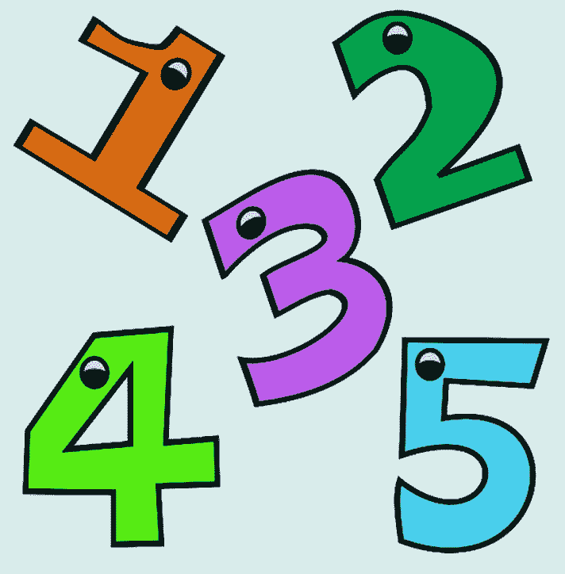
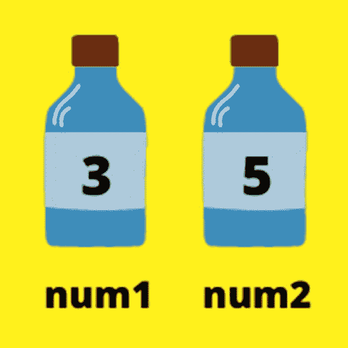
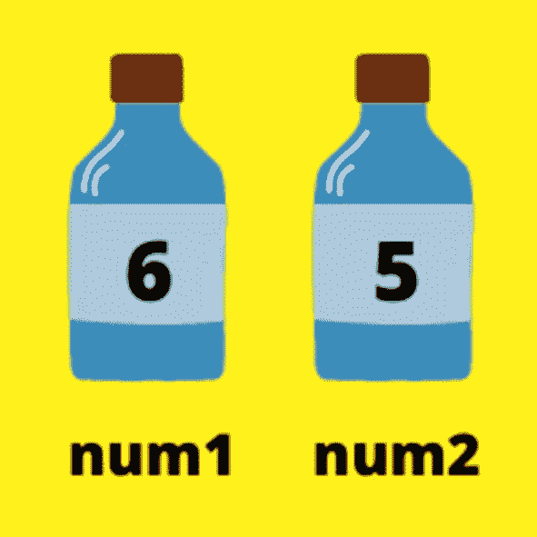

# 四、Python 喜欢数字

在前一章中，我们学习了如何开始使用 Python。我们看了看为 Windows、Mac 和 Linux 下载最新版本的 Python，然后看了看使用 IDLE 创建我们的第一个 Python 程序。

让我们在这一章看看如何玩数字。我们将看看如何在变量中存储数字，以及在 Python 中可以使用的不同类型的数字。

## Python 中的数字



数字在任何事情中都扮演着非常重要的角色，所以难怪它们在编程中也很重要。你想在未来成为一名顶尖的游戏程序员吗？那么你需要知道你的数字。你想让球去哪里？你的太空枪应该向你的外星人射出多少子弹？子弹应该有多快？你的角色应该跑多快，或者走多快，或者做任何事情多快？你需要数字来确定所有这些以及更多。

此外，一旦你开始编程和创建不同类型的项目，你会发现数字在几乎每一种编程中都扮演着重要的角色，而不仅仅是游戏。

所以，事不宜迟，让我们看看如何在 Python 中创建数字，如何存储它们，如何使用它们，等等。

## 存储您的号码

我们已经看过 Python 中的数字了，还记得吗？在空闲 Shell 中键入以下内容:

```py
3 + 5

```

按 Enter 键，您将获得以下输出:

```py
8

```

在 Python 中玩数字就是这么简单。但是你发现问题了吗？你对结果和数字真的无能为力。编程就是自动化，我说的对吗？但是现在还没有太多的自动化。

我们能做什么？那么，如果我们可以把这些数字存储在某个地方，这样我们就可以多次使用它们，会怎么样呢？如果我们把结果存储在别的地方，这样我们就可以用它来做进一步的计算，会怎么样呢？你明白我在说什么吗？

除非你开始储存你的价值观，不管是数字、字母还是单词，否则你在编程方面做不了什么。

好吧，这很好，但是你怎么储存它们呢？Python 中有没有一个秘密容器，把你想要的所有值都存储在里面，等你需要的时候拿出来玩？不完全是，*但是*你可以*制造*这样的容器。甚至更好，不是吗？您可以创建称为变量的信息容器，在其中存储您想要的值。你可以创建无限数量的容器！:O

那么，如何创建这些变量呢？


看看你的橱柜。你必须看到一个容器，里面装着你父母用来烹饪的每一种调味品，甚至是盐、胡椒和糖等常见的烹饪原料。你妈妈可能给它们贴了这样的标签，我说的对吗？

标有盐的容器里有盐，或者她可能有一个她理解的暗号。

类似地，你也要标记你的变量。有一定的规则来标记它们，但除此之外，你可以自由支配以任何方式标记你的变量，所以尽情享受吧。只要确保你以后阅读标签时能理解它们就行了。你需要知道你的容器里有什么，不是吗？

创建变量就是这么简单。决定一个标签/名称，并将其输入到您的 Shell 或脚本中，您就创建了您的变量。

但是如果变量中没有存储信息，它就没有用，你可以用“=”号来实现。我们在数学中用等号表示答案，不是吗？同样，在 Python 中，我们用它给变量赋值。变量在“=”的左边，值在右边。

让我给你看一些例子，让你更好地理解。

为什么我们不把上次计算中的数字存储在两个独立的变量中，这样我们就可以根据需要重用它们了？

让我们打开一个新的脚本文件(你知道怎么做)，并将其保存为 numbers.py。我们将使用该文件来测试本章中的示例。

```py
num1 = 3
num2 = 5

```

我将它们命名为 num1 和 num2，作为 number1 和 number2 的简写形式，所以当我回顾代码时，我记得它们指的是什么。

让我们测试一下 num1 和 num2 中是否真的存储了数字。我们为什么不把它们打印出来看看？

```py
print(num1)
print(num2)

```

当我们运行前面的四行代码时，我们将得到如下结果:

```py
= RESTART: C:/Users/aarthi/AppData/Local/Programs/Python/Python38-32/numbers.py
3
5

```

如您所见，变量确实存储了数字。所以，你的程序现在已经创建了两个容器，标记为 num1 和 num2，就像你妈妈标记盐和糖的容器一样。“num1”中包含值 3，“num2”中包含值 5。



让我们更进一步。我们为什么不创建另一个变量，叫做 sum，把两个数的和存储在里面呢？

```py
sum = num1 + num2
print(sum)

```

当我们现在运行 numbers.py 时，我们将得到以下结果:

```py
= RESTART: C:/Users/aarthi/AppData/Local/Programs/Python/Python38-32/numbers.py
3
5
8

```

太好了。“sum”保存现在“num1”和“num2”的总和。你看到这有多方便了吗？我们不必就此止步。我们实际上可以改变这些变量的值！我们试试换 num1。我将清除脚本文件，这是留给我的内容:

```py
num1 = 3
print(num1)
num1 = 6
print(num1)

```

正如您在前面的代码中看到的，我们首先将 3 赋给 num1，然后将 num1 中存储的值更改为 6。让我们看看这是否可行:

```py
= RESTART: C:/Users/aarthi/AppData/Local/Programs/Python/Python38-32/numbers.py
3
6

```



是的，它是！“num1”最初有 3 个，但现在它有 6 个存储在里面，如果你打印 num2，你会注意到值不变为 5。所以，我们实际上可以改变变量中存储的值。我们现在手里握着一个真正项目的雏形！

但是不要太兴奋。创建变量时有一些规则要遵循。不过不要担心，规则是相当温和的。确保在创建变量时遵循这些规则，否则会出现错误。

我将列出它们，以便您以后参考:

1.  变量应该以字母或下划线(_)开头，不能有其他字符(不能有数字或特殊字符，如！、#、$、%等。).

2.  变量只能包含字母、数字和下划线(_)。

3.  变量区分大小写。“num1”与“Num1”不同。

很简单，你不觉得吗？但是我们都不喜欢理论，所以让我们来测试一下这些规则，看看它们是否正确。回到您的 Shell 提示符。我们先创建一个遵循规则的变量，然后我们打破规则，看看会发生什么。

```py
_var5 = 1

```

当我运行前面的代码时，什么也没有发生。看起来前面的变量被接受了。它以下划线开头，里面只有字母和数字。

如果我违反了第一条规则呢？

```py
1var_ = 1

```

糟糕，我收到一个错误，内容如下:

```py
SyntaxError: invalid syntax

```

如果我的变量开始是正确的，但是没有遵循第二条规则怎么办？

```py
var$s = 5

```

再次出错:

```py
SyntaxError: invalid syntax

```

让我们看看规则 3 是否也是正确的。让我们回到我们的数字。这一个的 py。让我们删除文件中的所有其他内容，并键入以下内容:

```py
num1 = 3
Num1 = 7
print(num1)
print(Num1)

```

当您运行前面的代码行时，您应该会看到:

```py
= RESTART: C:/Users/aarthi/AppData/Local/Programs/Python/Python38-32/numbers.py
3
7

```

看那个！Num1 和 num1 中可能有相同的字母和数字，但是大小写(N 和 N)完全不同。因此，Python 变量确实是区分大小写的。

我们已经成功验证了所有规则。咻！

## 评论

“评论”在英语中是什么意思？你有什么评论吗？描述一下？类似的东西，对吗？

类似地，您可以在 Python 代码上编写注释来描述它们。你可以把它们写在你的代码行之前或之后。这些注释仅供参考，Python 既不会读取也不会执行。

每当您在键入任何内容之前添加“#”(散列符号)时，该特定行就成为客户端。然而，当你开始一个新行的时候，你又回到了你的常规编码。因此，您的“#”正好创建一行注释。

```py
#This is a comment

```

您可以使用注释来描述代码行，这样当您稍后阅读您的脚本时，您就会明白发生了什么。你也可以和你的朋友分享你的代码，你的评论会帮助他们理解它。

当您使用“#”符号时，您会创建单行注释。如果你想让你的评论跨越多行呢？

这也有一个语法:

```py
'''
This
is
a
multi-line
comment
'''
(or)

"""
This
is
a
multi-line
comment
"""

```

用三个单引号/双引号(不加空格)写下你的评论，这样你就有了一个多行的评论。

## 你的数字有不同的形式

现在我们知道了变量是如何工作的，以及如何使用它们来存储我们的数字。在我们继续玩之前，我想给你看样东西。您知道 Python 中有不同类型的数字吗？

是的，就像数学中有整数和带小数点的数字一样，Python 中也有整数和浮点数。您甚至可以让 Python 检查代码中使用的数字类型，或者将一种数字类型转换成另一种。现在让我们看看所有这些。

### 整数

整数称为整数，简称 int。

让我们再次清除 numbers.py，从下面的代码行开始:

```py
num1 = 3

```

“num1”存储一个整数 3。任何不带小数点的数字都是整数。

你实际上可以检查一个数字是否属于特定的类型。Python 有这些叫做内置函数的东西，可以用来做很多很酷的事情。因为它们是内置的，因为它们已经内置到 Python 中了，所以你不需要知道它们在后台是如何工作的。你可以用它们来得到你想要的结果。

例如，有一个名为“type”的内置函数，带有一个小“t”，可用于查找数字的类型。让我们找出“num1”中存储的是什么样的数，好吗？

```py
print(type(num1))

```

在前面的代码行中，我让 Python 查找 num1 的类型。同样，变量或数字应该在左括号和右括号内，就像我们处理 print()语句一样。然后，我将整个内容放在一个 print 语句中，因为我想打印结果。否则，我就看不到类型检查的结果。

让我们运行前面的代码行，看看我们会得到什么:

```py
= RESTART: C:/Users/aarthi/AppData/Local/Programs/Python/Python38-32/numbers.py
<class 'int'>

```

给你。上面写着‘int’，意思是整数。

这也适用于负数。

```py
num1 = -3
print(type(num1))

```

结果仍然是这样的:

```py
= RESTART: C:/Users/aarthi/AppData/Local/Programs/Python/Python38-32/numbers.py
<class 'int'>

```

所以，正负整数都叫整数。

现在让我们为其余的类型做同样的事情，好吗？

### 浮点数

浮点数有小数点。即使只有一个小数点，也会被归类为浮点。

```py
num2 = 5.5
print(type(num2))

```

如果您运行前面的代码行，您将得到以下输出:

```py
= RESTART: C:/Users/aarthi/AppData/Local/Programs/Python/Python38-32/numbers.py
<class 'int'>
<class 'float'>

```

看那个。最后创建的变量中存储了一个浮点数。

同样，正负小数点数字在 Python 中都称为浮点数。让我们检查一下！

```py
num2 = -5.5
print(type(num2))

```

结果将是这样的:

```py
= RESTART: C:/Users/aarthi/AppData/Local/Programs/Python/Python38-32/numbers.py
<class 'float'>

```

是的，它是一个浮点数。

### 复数

现在，让我们看看复数。你在学校学过复数吗？这些数字有实部和虚部，对吗？如果你还没有在学校学过，但是你很好奇，我建议你自己去读一读。你可以请你的父母帮助你做这项研究。一个简单的谷歌搜索应该可以消除你的疑虑。这是一个非常有趣的数学概念。另一方面，你可以跳过下一部分。这个决定完全取决于你。我们不会在任何程序中大量使用复数，所以不用担心它们。

```py
num3 = 2 + 3j
print(type(num3))

```

因此，2 + 3j 是复数，其中 2 是实数，3 是虚数。如果我们运行前面的代码行，最终输出将是这样的:

```py
= RESTART: C:/Users/aarthi/AppData/Local/Programs/Python/Python38-32/numbers.py
<class 'int'>
<class 'float'>
<class 'complex'>

```

这就对了。最后一个数字是一个复数。我们实际上可以分别提取实部和虚部。你想看看是怎么回事吗？

如果您想从一个复数中提取实数，请键入该数字(或包含该数字的变量)，然后在其后跟一个句点(。)，然后在后面加上关键字“真实”。关键字类似于 Python 中预定义的工具/方法。它们在后台做我们不知道的事情，但是在前台给我们想要的输出。在我们的例子中，我们将能够成功地提取实数。

```py
print(num3.real)

```

同样，对于提取虚数，键入“imag”而不是“real”。

```py
print(num3.imag)

```

当您运行前面的代码行时，您将获得以下输出:

```py
= RESTART: C:/Users/aarthi/AppData/Local/Programs/Python/Python38-32/numbers.py
<class 'int'>
<class 'float'>
<class 'complex'>
2.0
3.0

```

查看前面输出中的最后两行。2.0 是实数，3.0 是虚数。它们将被提取为浮点数。

我之前说过，你可以直接给出数字。但是在这之前你需要处理一些事情。

```py
print(3 + 4j.imag)

```

如果您尝试运行前面的代码行，您的代码将会出错，就像这样:

```py
= RESTART: C:/Users/aarthi/AppData/Local/Programs/Python/Python38-32/numbers.py
<class 'int'>
<class 'float'>
<class 'complex'>
2.0
3.0
7.0

```

Python 认为你的虚数是 7.0 而不是 4.0。为什么呢？嗯，那是因为 Python 把 3 和 4 相加，得到的结果是 7，再把 j 加进去。所以根据它，你的复数现在是 7j 而不是 3 + 4j。在本章的下一节，我会告诉你所有关于“执行顺序”的内容，但是现在，我想让你知道在处理表达式时括号的重要性。

如果我们将复数包装在()中，让我们看看会发生什么。

```py
print((3 + 4j).imag)

```

运行前面的代码行，得到如下结果:

```py
= RESTART: C:/Users/aarthi/AppData/Local/Programs/Python/Python38-32/numbers.py
<class 'int'>
<class 'float'>
<class 'complex'>
2.0
3.0
4.0

```

太好了。我们得到了想要的结果。因此，圆括号保持了表达式的原样。

## 数字之间的类型转换

您可以将一种数字类型转换成另一种。我们将使用更多的预定义函数(方法)来完成这项工作。

若要将浮点数或复数转换为整数，请使用 int()方法。让我们清空 numbers.py 文件，重新开始。或者，您可以在我们重新开始时创建并命名一个新的脚本文件，特别是如果您希望保存每个示例的话。

```py
num1 = 3.0
print(num1)
print(int(num1))

```

在前面的例子中，我在变量“num1”中存储了一个浮点数 3.0。我先打印了准确的数字。然后，我使用 int()函数将“num1”转换为整数，并打印出来。让我们看看结果:

```py
= RESTART: C:/Users/aarthi/AppData/Local/Programs/Python/Python38-32/numbers.py
3.0
3

```

看那个。小数点现在没了。但是如果我们有小数点后的数字呢？接下来会发生什么？

让我们将 num1 的值编辑为 3.45，然后再次测试。

```py
num1 = 3.45
print(num1)
#convert the number to an integer
print(int(num1))

```

运行前面的代码行，您将得到这样的结果:

```py
= RESTART: C:/Users/aarthi/AppData/Local/Programs/Python/Python38-32/numbers.py
3.45
3

```

有意思。我们仍然得到 3，即使算上小数，这个数字接近 3.5。为什么会这样？那是因为 Python 正在做一个叫做舍入的东西。不管小数点是什么，当你进行整数转换时，它只是去掉小数点，保留整数。让我们试试 3.9，看看这是不是真的:

```py
num1 = 3.9
print(num1)
print(int(num1))

```

运行上面几行代码，得到:

```py
= RESTART: C:/Users/aarthi/AppData/Local/Programs/Python/Python38-32/numbers.py
3.9
3

```

我们还是没有拿到 4。☹:当你进行整数转换时，它只是去掉小数点，不管它们有多大。别担心。当我们查看 Python 中更多的内置数学函数时，您将了解如何基于小数点进行适当的舍入。

现在，让我们把一个复数转换成 int。

```py
num1 = 3+4j
print(num1)
print(int(num1))

```

当我们运行前面的代码行时，我们得到如下结果:

```py
= RESTART: C:/Users/aarthi/AppData/Local/Programs/Python/Python38-32/numbers.py
(3+4j)
Traceback (most recent call last):
  File "C:/Users/aarthi/AppData/Local/Programs/Python/Python38-32/numbers.py", line 3, in <module>
    print(int(num1))
TypeError: can't convert complex to int

```

天啊，我们出错了！为什么会这样？理论上，把一个复数转换成整数是不可能的，因为，你会提取哪一部分呢？

但是，如果要提取实部或虚部，可以将*转换成整数。让我们试试那个。*

我先把提取的实数保存在另一个变量“r”里。

```py
num1 = 3+4j
#Find the real part of the number
r = num1.real
print(r)
print(int(r))

```

在前面几行代码中，我提取了实数，将其赋给变量“r”，然后将其转换为整数。当我们运行前面的代码行时，我们将得到以下结果:

```py
= RESTART: C:/Users/aarthi/AppData/Local/Programs/Python/Python38-32/numbers.py
3.0
3

```

接下来让我们将整数转换成浮点数。我们需要使用 float()内置方法。

```py
num1 = 3
print(num1)
print(float(num1))

```

当您运行前面的代码行时，您将得到这样的结果:

```py
= RESTART: C:/Users/aarthi/AppData/Local/Programs/Python/Python38-32/numbers.py
3
3.0

```

成功转换！

这适用于复数吗？你怎么想呢?不，他们不会。我们将不得不再次提取实数或虚数，但是提取已经产生了浮点数，所以为什么要转换它们呢？

现在让我们把整数和浮点数都转换成复数。您必须使用 complex()函数来实现这一点。

```py
num1 = 3
print(num1)
print(complex(num1))

```

运行前面的代码行，您将得到这样的结果:

```py
= RESTART: C:/Users/aarthi/AppData/Local/Programs/Python/Python38-32/numbers.py
3
(3+0j)

```

看那个！它把整数作为复数的实部，虚部是 0。

现在让我们用浮点数试试。

```py
num1 = 3.5
print(num1)
print(complex(num1))

```

运行前面的代码行，您将得到这样的结果:

```py
= RESTART: C:/Users/aarthi/AppData/Local/Programs/Python/Python38-32/numbers.py
3.5
(3.5+0j)

```

它将整个浮点数作为复数的实部，虚部仍为 0。有意思！

## 迷你项目-你理解数字吗？

这不仅仅是一个小项目，这将是一个测试你对手头主题理解的活动。你懂 Python 中的数字吗？让我们看看！

我先描述一下问题陈述。我希望你在看我的解释之前先试一试。我们仍在一步一步地走，所以我已经确保这个活动不会太难。

问题陈述:创建三个变量(num1、num2 和 num3)并分别在其中存储数字 3、5.5 和 3 + 5j。然后，将 num1 转换为浮点数，将 num2 转换为整数。提取 num3 的虚数，替换 num3 中的虚数，并将其转换为整数。在屏幕上显示三个转换后的数字。用注释描述重要的代码行。

解决方案:

这是一个非常简单的问题，不是吗？不要担心，一旦我们涉及到更多的话题，你会看到更复杂、更有趣的内容。

以下是整个程序:

```py
#Created num1, num2 and num3 and stored the respective values
num1 = 3
num2 = 5.5
num3 = 3 + 5j
#convert num1 into a floating point number
num1 = float(num1)
#convert num2 into an integer
num2 = int(num2)
#Extract the imaginary part of num3 and place it back in num3
num3 = num3.imag
#Convert the imaginary number (floating) into an integer
num3 = int(num3)
#Print everything
print(num1)
print(num2)
print(num3)

```

我已经在评论里描述了我所做的一切，就像问题所问的那样。代码和注释是不言而喻的，所以我相信您理解它们。为什么不尝试不同的组合和转换来更好的理解题目呢？

## 摘要

在这一章中，我向你介绍了数字以及如何在 Python 中使用它们。我们研究了使用变量存储数字，以及 Python 允许您创建和操作的不同类型的数字。