# 6.用 ***乌龟*** 画酷酷的东西

在前几章中，我们学习了如何在 Python 中处理数字。我们看了 Python 中不同类型的数字，可以做的各种操作，以及使用各种模块和预定义的方法来享受 Python 的乐趣！

在这一章中，我们将会看到 Python 中的另一个模块, *Turtle* 模块。我们将学习关于*龟*的所有知识，用它来绘制图形、形状、设计、文本等等。我们还会以一些很酷的迷你项目来结束这一章。

## 我们开始吧

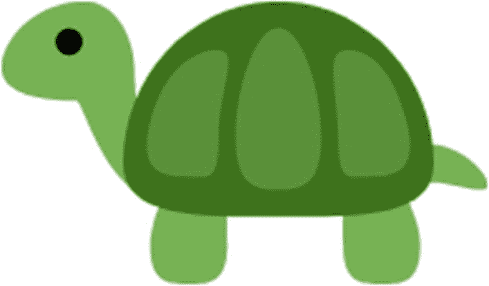

你开始厌烦了吗？让我们从理论上休息一下，好吗？我答应给你快乐，现在是我兑现承诺的时候了。让我们用 Python 来画吧！你想知道怎么做吗？

好吧，我来给你介绍一下那个神奇的世界，那就是“*乌龟*”。 *Turtle* 是一个 Python 模块，它附带了大量工具(预定义的方法),你可以用它们在屏幕上绘图。天空是你用*海龟*所能做的极限。

在这一章中，让我们从*龟*的基础开始，随着我们深入到这本书，我将向你展示你可以用*龟*和 Python 做的更高级的技巧。

不再有无聊的项目！从这一章开始，我们的迷你项目将会变得丰富多彩。你兴奋吗？我知道我是！

好吧，我们开始吧。

你为什么不创建一个新文件，随便你怎么命名？你可以用它来写这一章。不过要小心命名！不要将您的文件命名为 turtle.py，因为您的 Python 安装中已经有一个 turtle.py，使用相同的名称命名您的文件会导致运行时出错。除此之外，你可以给它起任何你想要的名字。我将我的文件命名为 drawTurtle.py。

在我们开始之前，我们需要将乌龟导入到我们的 Python 脚本文件中。*海龟*只是一个附加品，记得吗？因此，除非您导入它，否则它不会出现在您的文件中。这个过程实际上非常简单。只需输入“进口”，然后输入带小“t”的“海龟”。

```py
import turtle

```

好极了。我们已经将 *Turtle* 导入到脚本文件中。接下来让我们创建我们的屏幕。 *Turtle* 创建图形，如果你注意到了，你的 Python Shell 并没有正确显示图像或绘图。因此，我们将创建我们自己的屏幕，在那里我们的绘图将出现。

让我们创建一个变量“s”(你可以随意命名)。我们将使用 turtle 的 getscreen()预定义函数从 turtle 获取我们的屏幕，并将其分配给 *s* ，如下所示:

```py
s = turtle.getscreen()

```

现在，变量“s”包含了我们的龟屏(图 [6-1](#Fig1) )。让我们运行前面的代码行，看看我们会得到什么。

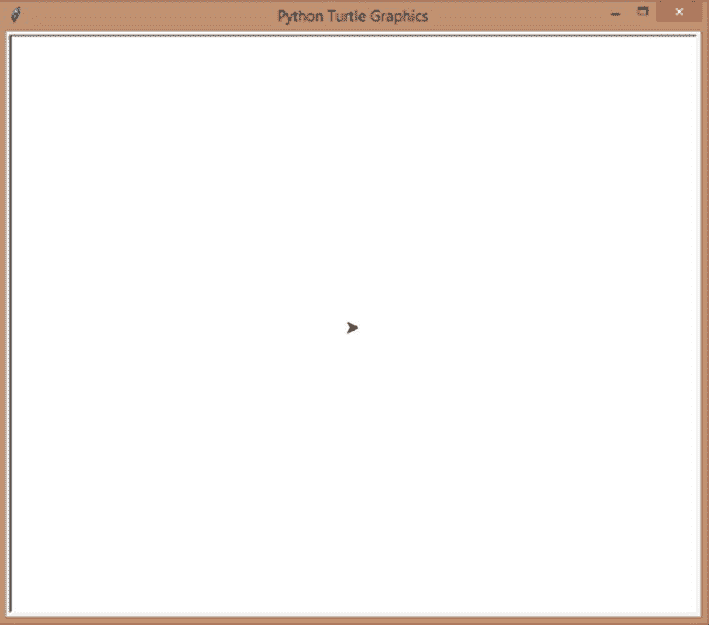

图 6-1

蟒蛇龟屏

您是否看到了一个类似于上图的弹出窗口，中间有一个黑色标记？那是我们的乌龟。

现在我们有了屏幕，让我们创建我们的*海龟*！迷茫？不要这样。在 turtle 中，一只乌龟会画出你在屏幕上命令的任何东西。字面意思。会很酷的，你会看到的。海龟包里还有另一个预定义的函数 Turtle()(海龟太多了，我知道:D)。它有你需要在屏幕上画画的所有工具，像画线、画圆、给它们上色等等。让我们得到这个函数，并把它赋给一个变量 t，这样我们可以在以后绘图时使用它。

```py
t = turtle.Turtle()

```

记住 Turtle()函数中的“T”是大写的。

当您现在运行代码时，您不会看到任何变化。它仍然是相同的空白屏幕，但我们现在已经设置好了一切。前三行代码(import、getscreen 和 turtle())在每个涉及 Turtle 图形的程序中都是常量，所以总是从这些代码开始，我假设您已经在我未来的示例中包含了这些代码行。

接下来我们画画吧！

## 让你的 ***龟*** 动起来

现在我们已经准备好了一切，让我们让我们的乌龟按照我们想要的方向移动，并在它移动的时候画画。我们的乌龟要画直线，我们要给它这些线的距离和方向。听起来不错？让我们看看它是如何工作的。

## 向前和向后移动

先从基础的开始测试，前进后退。

要向前移动，需要使用 Turtle()函数的 forward()预定义方法，在括号内，需要给出距离。所以，如果你想让你的海龟向前移动(并画出)100 点，你要在括号内给 100 点，就像这样:

```py
t.forward(100)

```

我们在前面的例子中给出了`t.forward()`,因为 forward()函数也在变量 t 的内部，因为我们把 Turtle()内部的所有东西都赋给了它。

让我们保存并运行我们的脚本，我们将得到这个(图 [6-2](#Fig2) )。

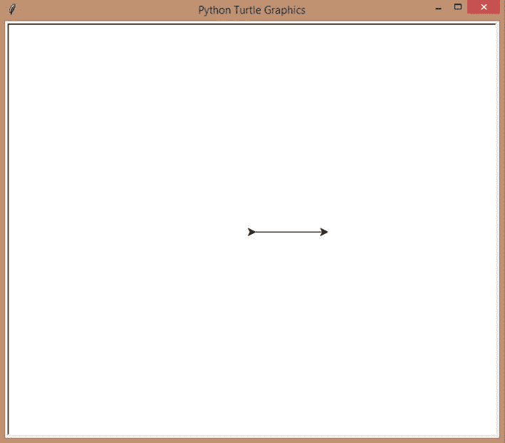

图 6-2

前进 100 分

太好了！我们得到了一条向前的直线，它停在 100 点，正如我们所希望的。

你如何让它向后移动？是的，你猜对了！通过使用 backward()函数。但是有一个条件！如果你现在让你的海龟后退，它只会越过当前的线，你什么也看不见。让我们测试一下。

```py
t.backward(100)

```

运行前面的代码，你会得到这个(图 [6-3](#Fig3) )。

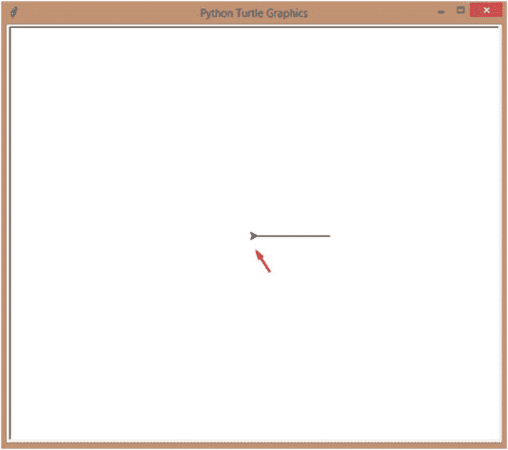

图 6-3

落后 100 分

是的，一点都没变。看我画的指向*龟*起点的箭头。我们的乌龟只是回到了那个起点，却没有画出什么新的东西。

有一种方法可以解决这个问题。还有一个函数叫做 home()，它会让你的海龟回到家(起始位置)。所以，在我们给出 backward 命令之前，为什么不用 home()让 turtle 回到位置呢？

整个代码片段将如下所示:

```py
import turtle
s = turtle.getscreen()
t = turtle.Turtle()
t.forward(100)
t.home()
t.backward(100)

```

当我们运行前面的代码时，我们会得到这个(图 [6-4](#Fig4) )。

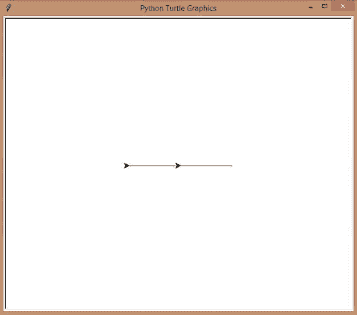

图 6-4

前进、回家和后退

耶！我们的*乌龟*从出发位置出发，向右(向前)画了一条 100 点的直线，然后回到出发位置(它确实是边走边画的，但是因为它画过了原来的线所以你没看到)，再向左(向后)画了一条 100 点的直线。它完美地工作。

或者，您可以只给`t.backward(200)`来获得相同的结果。

运行代码时，您注意到什么了吗？海龟(Turtle)实时为你画出这些线条。是不是很牛逼？

## 让你的乌龟改变方向

不能一直向前向后画。你需要改变方向来画出合适的形状。这就是天使出现的地方。你在学校学过角度了吗？如果没有，也不用担心。我来快速解释一下概念。这很容易。

看图 [6-5](#Fig5) 。

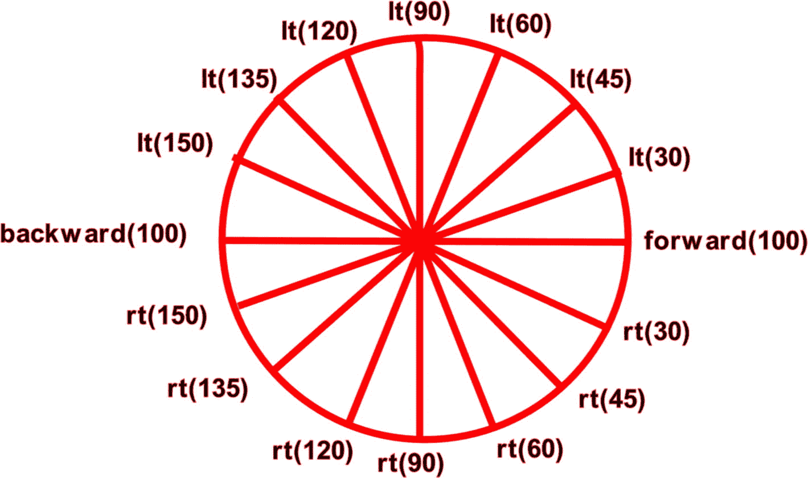

图 6-5

在 Turtle 中使用角度来改变方向

在 Python 的海龟模块中，角度基本上就是方向。所以，如果你想让你的海龟从现在的位置(家)一直往前走，那就直接说往前(100)。如果你想让它直接向上，那么首先通过向左(45°)或向左(45°)改变方向。现在，如果你给 forward(100)或类似的东西，你会得到一条向上的线，就像我在前面的图中画的一样。类似地，向下，再次使用 90 度，但这次是向右(90 度)。对于其余部分，您可以参考前面的图像，并决定您需要使用哪一行代码来改变方向。

如你所见，如果我们想让我们的*海龟*转完整个圈，也就是向下画而不是向右画，那么我们需要给 90 度作为我们的角度。现在让我们来测试一下。我假设你已经输入了三行强制性的海龟代码。然后，键入以下内容:

```py
t.forward(100)
t.right(90)
t.forward(100)

```

我们首先让海龟向前移动 100 点。然后我们让它右转 90 度，这是一个急转弯(对画正方形和长方形有用)。现在，我们的海龟面朝下，我们让它再向前移动 100 点。

当我们运行前面的代码行时，我们会得到这个(图 [6-6](#Fig6) )。

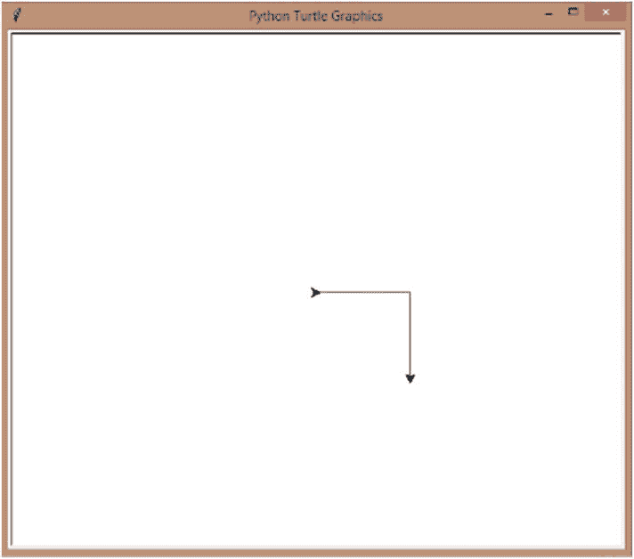

图 6-6

右(90)

现在让我们向左移动 90 度，看看我们会得到什么。

```py
t.left(90)
t.forward(100)

```

当你运行这个脚本时，你会得到这个(图 [6-7](#Fig7) )。

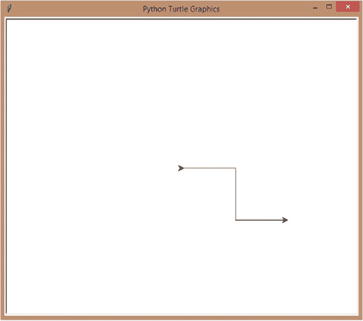

图 6-7

左(90 度)

看，它向左急转弯了。

恭喜你！你现在有四个最强大的工具供你使用，你可以用它们来画很多东西。你想从几个很酷的造型开始吗？

让我们从简单的开始，好吗？正方形怎么样？

## 迷你项目-画一个正方形

不要马上看解决方案。编程中同一个问题有很多解法，尽量自己找，然后*再*看我的。

好吧，我会让我的解决方案非常简单。我要用向前和向右。我的正方形的长度和高度都是 100 点。

这些是我要用来画正方形的步骤:

1.  我先让乌龟向前移动 100 点，然后右转 90 度。

2.  然后再向前移动 100 点，画出正方形的第二条边，再右转。

3.  再次向前画第三条边，再次右转。

4.  再次向前画第四条边，也是最后一条边。

让我们将前面的说明转换成代码:

```py
import turtle
s = turtle.getscreen()
t = turtle.Turtle()
t.forward(100)
t.right(90)
t.forward(100)
t.right(90)
t.forward(100)
t.right(90)
t.forward(100)

```

让我们运行前面的代码行。你会看到 turtle 用我们的命令实时绘制(图 [6-8](#Fig8) )。

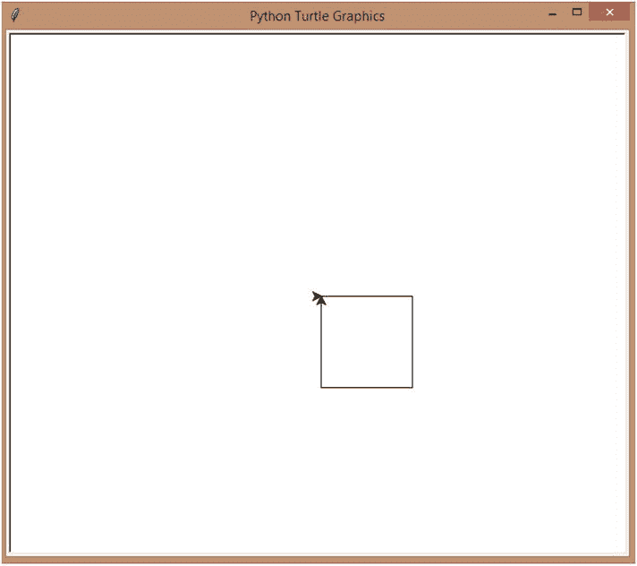

图 6-8

画一个正方形

耶！我们得到了我们的广场！

你可以只输入`t.home()`而不是最后的`t.forward(100)`，你会得到同样的结果。你为什么不试试看？

## 迷你项目-画一个六边形

对于我的六边形，我将遵循与我的正方形相同的规则。唯一的不同是我每次都要让我的乌龟转 60 度，因为这是六边形的边所在的角度(图 [6-9](#Fig9) )。

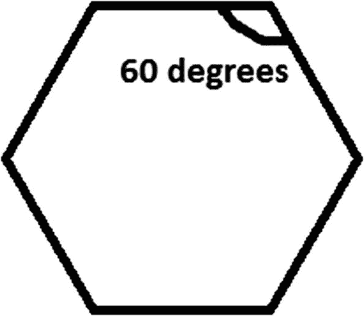

图 6-9

六边形的角

此外，我将使用六次 forward 函数，而不是四次，因为我需要它来绘制六条边。

看看下面的代码。很容易理解。

```py
import turtle
s = turtle.getscreen()
t = turtle.Turtle()
t.forward(100)
t.right(60)
t.forward(100)
t.right(60)
t.forward(100)
t.right(60)
t.forward(100)
t.right(60)
t.forward(100)
t.right(60)
t.forward(100)

```

为一个形状键入所有这些代码行有点乏味，你不觉得吗？别担心。当我们看自动化时，我将教你如何用几行代码画出你想要的任何形状，任何次数。我保证等待是值得的。

当你运行前面的代码时，你会得到这个(图 [6-10](#Fig10) )。

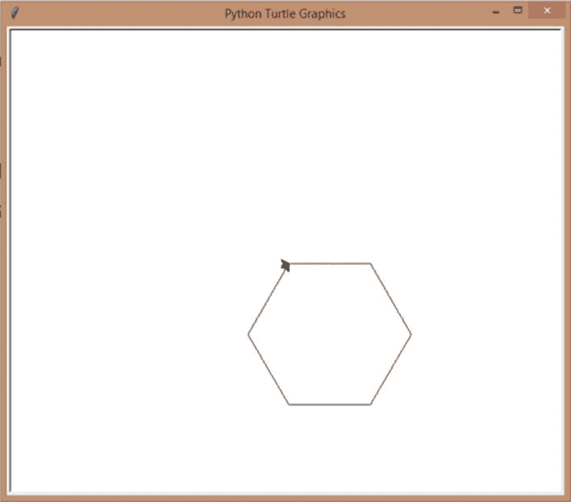

图 6-10

画一个六角形

又来了！

## 快捷指令

每次向前、向后、向右和向左打字有点乏味，你不觉得吗？为什么我们不缩短每件事，让事情变得简单些呢？可以写成 **fd** 、 **bk** 、 **rt** 、 **lt** 来代替。

让我们用我们的正方形试试我们的捷径。

```py
import turtle
s = turtle.getscreen()
t = turtle.Turtle()
t.fd(100)
t.rt(90)
t.fd(100)
t.rt(90)
t.fd(100)
t.rt(90)
t.fd(100)

```

运行前面的代码，你会得到这个(图 [6-11](#Fig11) )。

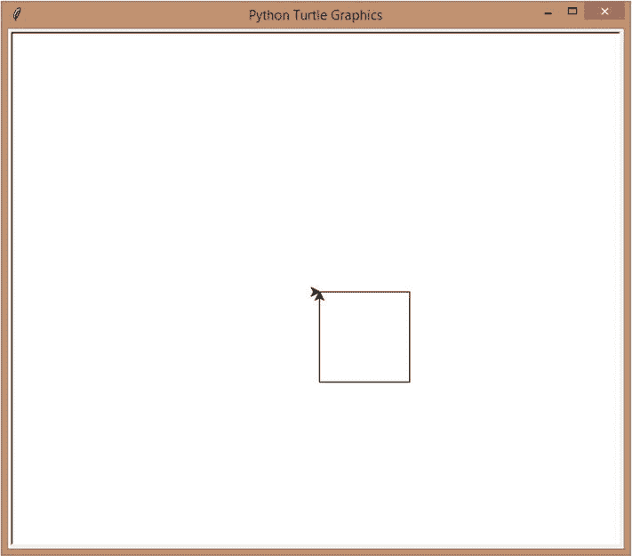

图 6-11

快捷方式 fd、bk、lt 和 rt

我们成功了，耶！

现在我要你让你的想象力自由驰骋。想画什么就画什么。只需输入你的代码，运行它，查看结果，并进行修改。创建尽可能多的形状。尽情享受吧！

## 转到屏幕上的随机点

到现在为止，你可能已经是让 turtle 在屏幕上画直线并操纵它们得到不同形状的专家了。但这难道不是一个繁琐的过程吗？您实际上是编写两行代码来绘制每一条直线——向前或向后绘制，然后向右或向左改变方向。

如果你可以命令你的*海龟*去一个特定的位置，当它去的时候画一条直线，它就这样做了，会怎么样？没有角度，没有前进，什么都没有。类似这样的事情会节省你的时间和空间，不是吗？

你当然可以用预定义的函数 ***goto*** 做类似的事情。但是，不要像你做向前和向后那样，仅仅指定你想让你的乌龟移动的点数，你需要指定你想让*乌龟*移动到的确切坐标。

什么是坐标？你在学校学过它们吗，也许是在你学图形的时候？如果没有，也不用担心。我现在解释一下。

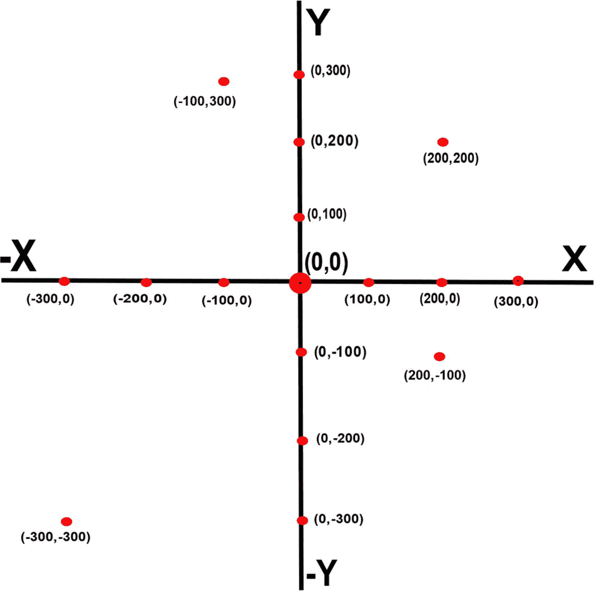

图 6-12

海龟坐标

看前面的图片(图 [6-12](#Fig12) )。*龟*平时(家)出发的点就是标有(0，0)的大红点。第一个 0 是 x 值，第二个 0 是 y 值。你注意到这些线被标记为 X，–X，Y 和–Y 了吗？这些被称为轴。不用太担心轴和坐标。如果你还不知道他们，你只需要知道足够多，知道把你的海龟送到哪里。

x 值向右正增加，向左负增加。Y 值向上正增加，向下负增加。现在你知道了，你也知道(x，y)是坐标的写法，再看一下图像。你看到坐标现在是怎么写的了吗？

(200，200)是它所在的位置，因为 x 在正 200，y 也在正 200。所以，如果你给 goto(200，200)，那么你将从(0，0)画一条直线，这是 turtle 的默认起点，到(200，200)，这将是一条对角线(图 [6-13](#Fig13) )。

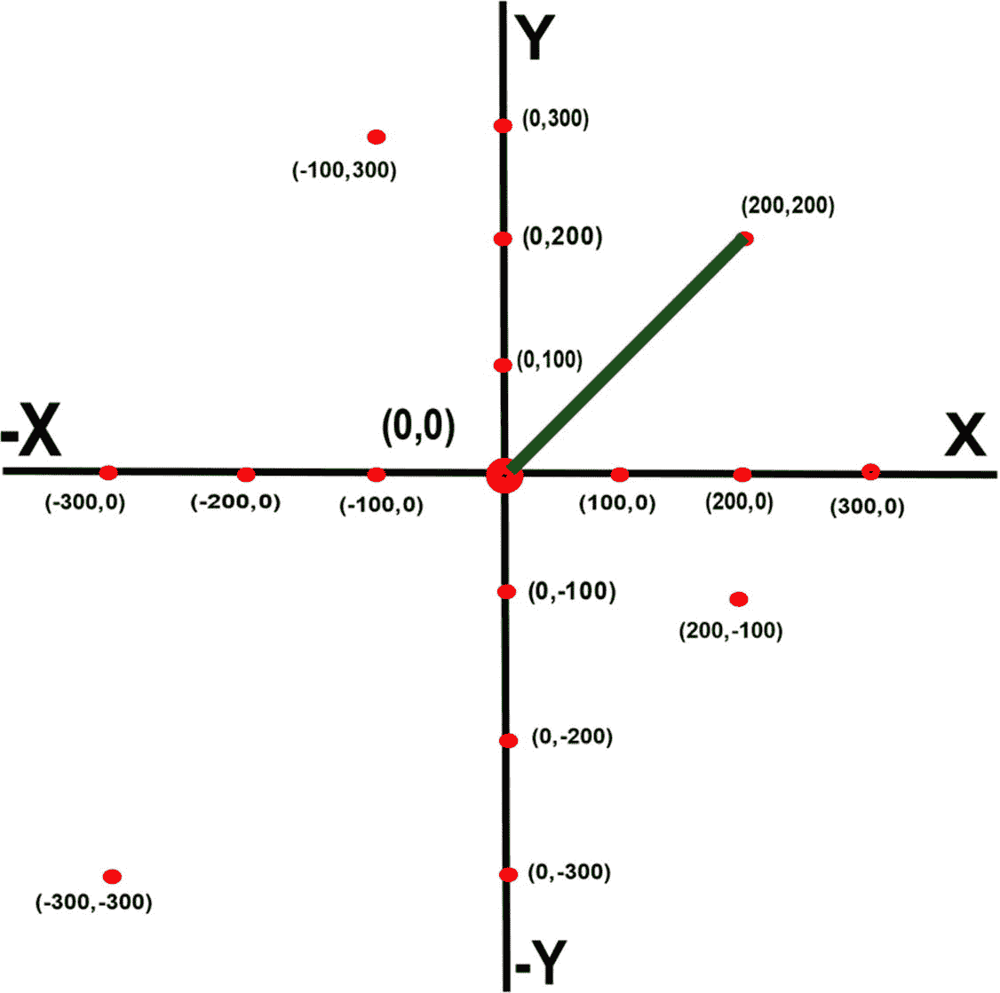

图 6-13

(0，0)到(200，200)

## 用 goto 画一个正方形

好了，现在你知道坐标是如何工作的了，让我们用它来画点东西。正方形怎么样？

我将从默认值(0，0)开始。我不必提及这一点，因为默认情况下 *Turtle* 会这么做。然后，我将向上移动到(0，100)，然后向右移动到(100，100)，向下移动到(100，0)，最后回到(0，0)。你为什么不参考坐标图像来看看这些点在哪里？

现在让我们编写代码:

```py
import turtle
s = turtle.getscreen()
t = turtle.Turtle()
t.goto(0,100)
t.goto(100,100)
t.goto(100,0)
t.home()

```

t.home()会让海龟回到(0，0)的位置。

当你运行前面的代码时，你会得到这个(图 [6-14](#Fig14) )。

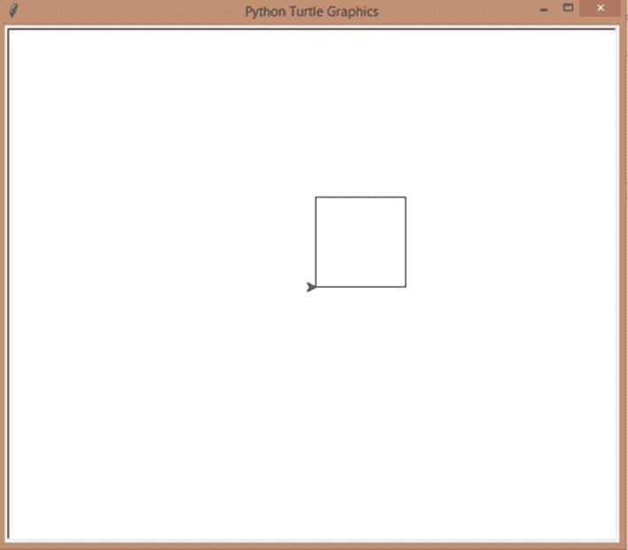

图 6-14

带 goto 的正方形

看看，你只用了四行代码而不是七行代码就画出了同样的东西。你为什么不摆弄坐标，画更多的正方形或其他形状呢？

## 迷你项目-画一个曼荼罗(只有直线)

在这个迷你项目中，我们将把你的绘画提升到一个新的高度。我们要画一个曼荼罗，但是只用直线。好吧，我承认。只有线的曼荼罗不是真正的曼荼罗，但是，嘿，它仍然是曼荼罗，所以让我们跟随它。我们将在未来的课程中学习绘制更复杂的曼荼罗，所以请耐心等待！

我们开始吧，好吗？首先，我们要在底部画一个正方形，并从正方形的每一边画四个倾斜的正方形:

1.  让我们先从基础做起。

    ```py
    #Mandala with lines
    import turtle
    s = turtle.getscreen()
    t = turtle.Turtle()

    ```

2.  Now, we’re going to create our base, our square. It’s going to be a square of 100 points on each side, starting from the point (0,0), moving upward to (0,100) for the first side, then right toward (100,100) for the second side, then down to (100,0) for the third side, and going back to home (0,0) for the last side.

    ```py
    #Create the square base first
    t.goto(0,100)
    t.goto(100,100)
    t.goto(100,0)
    t.home()

    ```

    When we run what we have so far, this is what we’ll get (Figure [6-15](#Fig15)).

    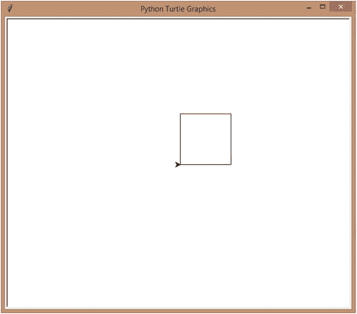

    图 6-15

    第一步——画出正方形的底部

3.  接下来我们画第一个倾斜的正方形。

现在，我们的笔在(0，0)。我们将要求它画一条对角线到点(50，50)(正方形的中间)，然后在点(0，100)会合，这将在正方形内给出一个圆锥形。

```py
#First tilted square
t.goto(50,50)
t.goto(0,100)

```

当我们运行前面的代码时，我们会得到这个(图 [6-16](#Fig16) )。

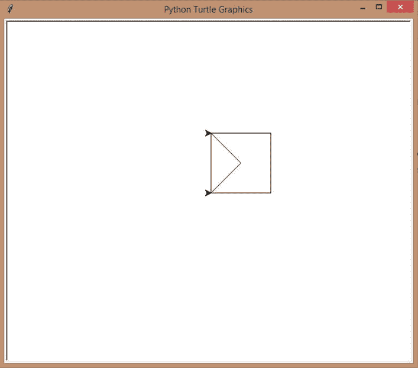

图 6-16

第 2 步–第一个倾斜的正方形，第 1 部分

1.  Now let’s draw the same shape outside of the square to complete our first tilted square. Let us have our *Turtle* go to the exact opposite of the point 50,50 which is –50,50 and then again back home.

    ```py
    t.goto(-50,50)
    t.home()

    ```

    When we’re done, we’ll get something like this (Figure [6-17](#Fig17)).

    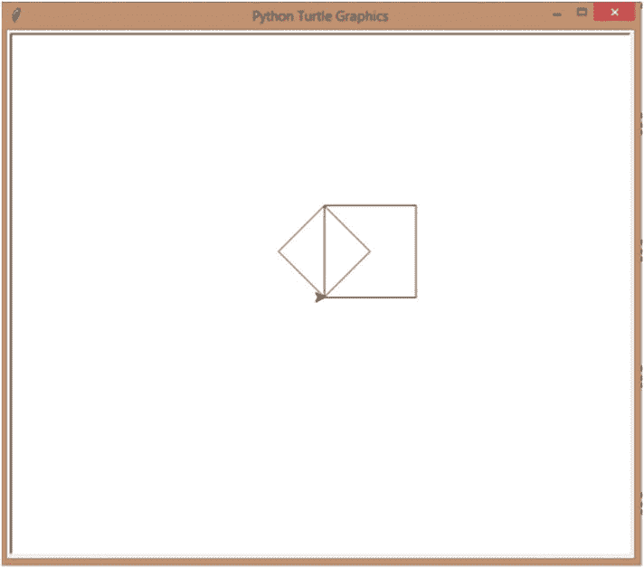

    图 6-17

    步骤 3-完成第一个倾斜的正方形

2.  我们有了第一个倾斜的正方形！耶！现在来看下一个。

    第二个很简单，真的。我们只是从 0，0 到点 50，-50(在方块下面)，然后在 100，0 处会合。然后我们要去方块的对面到 0，100，准备画下一个方块。

```py
#2nd tilted square
t.goto(50,-50)
t.goto(100,0)
t.goto(0,100) #Getting ready to draw the next tilted square

```

当我们运行前面的代码时，我们将得到这个(图 [6-18](#Fig18) )。

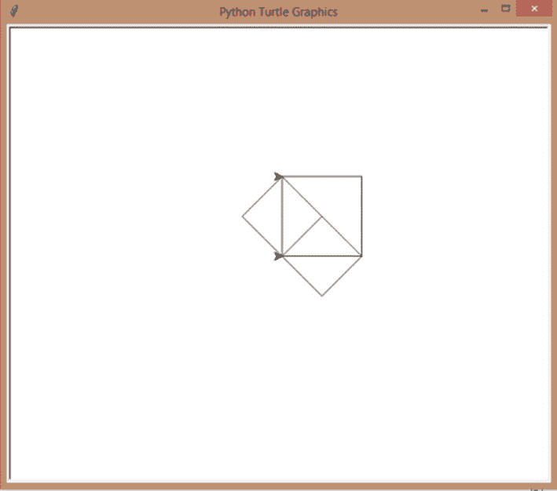

图 6-18

步骤 4–第二个倾斜的正方形

1.  From the point 0,100, let’s draw the next tilted side to 50,150\. Then let’s go back to 100,100 from there, we’ll get a conical shape again. Then, when we go to the center of the square to 50,50, we’ll have our third tilted square (Figure [6-19](#Fig19)).

    ```py
    #3rd tilted square
    t.goto(50,150)
    t.goto(100,100)
    t.goto(50,50)

    ```

    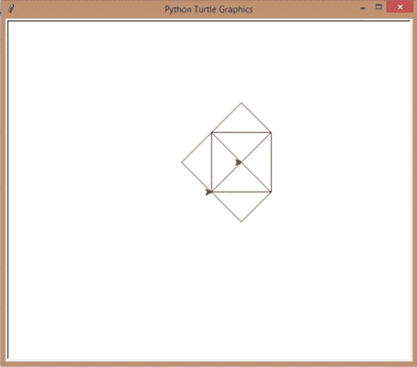

    图 6-19

    第五步–第三个倾斜的正方形

2.  从中心 50，50，到 100，0，这样我们可以准备完成第四个倾斜的正方形。转到 150，50 开始圆锥形，转到 100，100 结束圆锥形。

    ```py
    #4th tilted square
    t.goto(100,0)
    t.goto(150,50)
    t.goto(100,100)

    ```

当我们运行整个脚本时，我们将得到这个(图 [6-20](#Fig20) )。

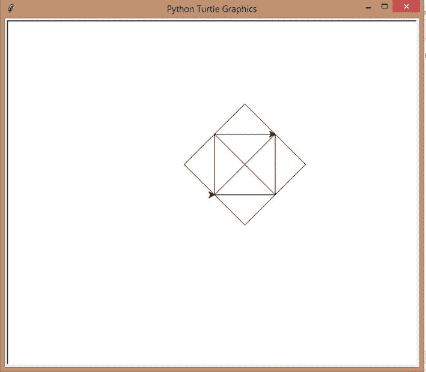

图 6-20

第六步–第四个倾斜的正方形

哇哦！是的，我们有一个基本的曼荼罗形状，但是当我们完成学习剩余的好东西*乌龟*的时候，你可以定制这个形状到你想要的任何形状！

## 摘要

在这一章中，我们看了 Python 的图形模块 *Turtle* ，如何使用它通过使用向前、向后、向右和向左来绘制线条，同时也使我们的乌龟走向各自的坐标点。我们还学习了用 Python 绘制正方形、矩形、六边形等形状，并以两个迷你项目结束了这一章。

下一章，让我们更深入地研究*龟*；学习如何画圆、点、半圆和圆弧；让事情变得丰富多彩；并编写更多有趣的迷你项目！