# 7.海龟深潜

在前一章中，我们介绍了 Python 中的 *Turtle* 库。我们看着用*海龟*画线条和形状，我们甚至学会了如何画一个完全由线条组成的曼荼罗图案。

在这一章中，我们将更深入地了解一下*海龟*。您将学习如何为您的设计绘制颜色，以及绘制各种形状、大小和角度的圆形和弧形。您还将学习如何在屏幕上绘制文本。在这一章的最后，你将学会如何改变你绘画的角度，并最终画出笑脸或任何类型的图画。

## 自定义您的屏幕

没有颜色的图形和图像有什么用？现在，你的屏幕看起来很无聊。它有一个白色的背景，你的屏幕标题永远是“蟒蛇龟图形”。但是你可以改变这一切。

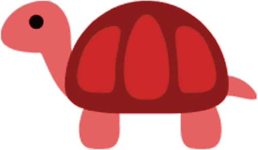

首先，你可以用 title 方法改变你的屏幕标题，但是要记住一些事情。这个函数不是 t (turtle)的一部分。乌龟)。你需要以 turtle 开头，实际的包，就像这样:

```py
turtle.title('Hello Turtle!')

```

你的背景颜色也是一样。您需要使用 bgcolor 方法来更改您的背景颜色，并在单引号(')或双引号(")内指定您的颜色。

我将把我的屏幕背景色改为红色。

```py
turtle.bgcolor('red')

```

你想看看我们做的改动吗？看黄色箭头(我在图 [7-1](#Fig1) 中画的)。我们的标题现在写着“你好海龟！”我们的屏幕是红色的。完美！

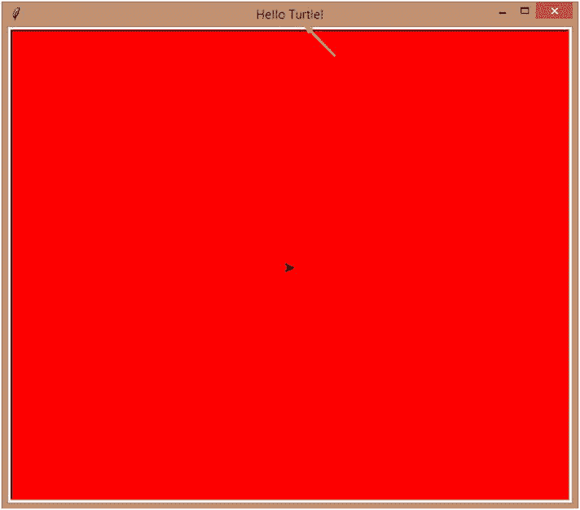

图 7-1

背景颜色设置为红色

尝试将您的屏幕更改为不同的颜色或标题。

你也不局限于基本的颜色。跟着这个链接: [`https://en.wikipedia.org/wiki/Web_colors`](https://en.wikipedia.org/wiki/Web_colors) 。

你会在上面找到上百种颜色的名字。让你的想象力自由驰骋！

## 定制您的图形

你知道如何改变屏幕的背景颜色。太好了。但是图像颜色呢？彩色笔和用颜色填充的图像是任何一幅好画的主食，不是吗？

因此，您可以更改笔的颜色(图形的轮廓)和图形的颜色(填充颜色)。如果你觉得龟(笔)的速度太慢，你也可以为你的线条设置一个尺寸，并改变它的速度。

要更改笔的颜色，请使用 pencolor 函数(按原样用所有小写字母编写函数)，并给出颜色的名称作为参数(括号内的内容)。我将使用上一节中我给你链接的颜色表中的一种颜色。

同样，要更改填充颜色，请使用 fill color 函数。您可以使用 pensize 函数增加笔的大小(线条的粗细),并给出一个数字作为参数。指定一个大于 2 的数字才能真正看出差异，因为 1 是默认的钢笔大小。此外，您可以使用速度功能来提高笔的速度。默认的速度值是 1，所以给出比这个值更大的值，你会看到一个变化。

让我们应用所有这些，看看结果。

```py
import turtle
s = turtle.getscreen()
t = turtle.Turtle()
turtle.title('Hello Turtle!')
turtle.bgcolor('DarkOrchid')
t.pencolor('Salmon')
t.fillcolor('Chartreuse')
t.pensize(5)
t.speed(7)
t.goto(0,100)
t.goto(100,100)
t.goto(100,0)
t.home()

```

好吧。我已经指定了背景颜色为“暗兰”，钢笔颜色为“鲑鱼”，填充颜色为“黄绿色”，钢笔大小为 5，速度为 7。我还用 goto 画了一个正方形。来看看有没有效果(图 [7-2](#Fig2) )。


图 7-2

设置速度、大小、笔色和背景色

这在一定程度上起了作用。我的笔画得太快了，这次没看到它画(真扫兴)。线条粗，笔色确实是三文鱼色，但是填充色在哪里？

那是因为 *Turtle* 希望你指明你希望填充开始和结束的时间，这样它就不会不小心填充了不该填充的东西(就像只是两条线连接在一个点上)。

当希望填充开始时，需要使用 begin_fill()方法，当希望填充结束时，需要使用 end_fill()方法。

因此，在我输入了更改颜色、大小和速度所需的代码行之后，这就是我在绘制形状时要做的事情:

```py
t.begin_fill()
t.goto(0,100)
t.goto(100,100)
t.goto(100,0)
t.home()
t.end_fill()

```

现在，当我运行我的程序时，我会得到这个(图 [7-3](#Fig3) )。

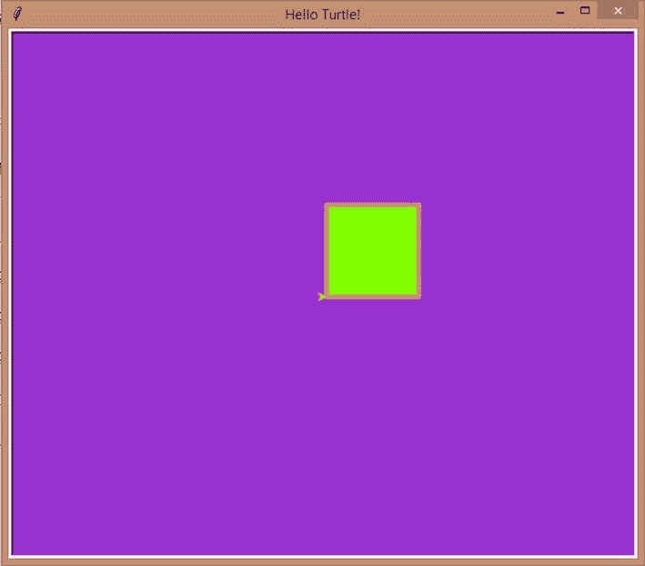

图 7-3

设置矩形的填充颜色

是的，有效！

此外，您可以使用快捷方式进行格式化。您可以不使用两行代码来指定钢笔和填充颜色，而是使用一行代码，如下所示:

```py
t.color('Salmon','Chartreuse')

```

第一个值用于 pencolor，第二个值用于 fillcolor。

或者，更好的是，您可以对所有四个格式选项使用一行，如下所示:

```py
t.pen(pencolor='Salmon', fillcolor="Chartreuse", pensize=5, speed=7)

```

请注意，您不必将数字放在报价中。当您在脚本中使用前面的代码行时，您会注意到结果根本没有改变。

您可以根据自己的需要省略这些参数中的任何一个(pencolor='Salmon '是一个参数)。

在我们结束这一部分之前，我想让你尝试一下。我希望您将速度的值指定为 0。你认为会发生什么？海龟会以一只真正的海龟的速度开始画我们的正方形吗？还是会惊喜？试试看！

## 没有线条的形状

到目前为止我们一直在看画线，但是如果你想画圆呢？这也有一个预定义的函数。它叫做“圆”，你必须给出半径，作为括号内的自变量。半径基本上就是圆的大小。

让我们试一个，好吗？

## 环

```py
s = turtle.getscreen()
t = turtle.Turtle()
t.circle(100)

```

我一直保持简单。运行前面的代码，你会得到这个(图 [7-4](#Fig4) )。

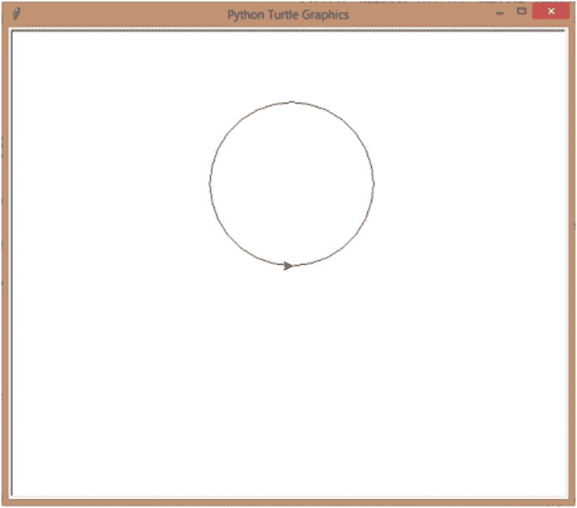

图 7-4

画一个圆-逆时针方向

正如你所看到的，turtle 从默认的 0，0 位置开始逆时针方向(向左)画圆，所以圆被画在 0，0 位置的上方。

如果我给半径一个负值，它会顺时针方向画，也就是在 0，0 位置的下面。让我们试试。

```py
t.circle(-100)

```

运行上面几行代码，你会得到这个(图 [7-5](#Fig5) )。

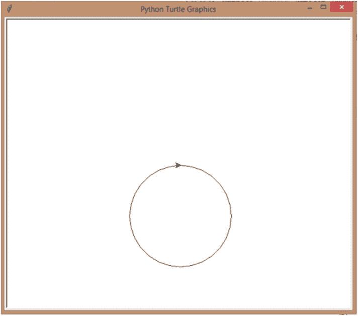

图 7-5

画一个圆-顺时针方向

你可以使用你在你的圆的直线上使用的相同的颜色和尺寸选项。

作为一个小活动，我想让你用不同的颜色画出不同颜色的圆圈，看看你得到了什么。

## 点

你可以用“点”功能画一个点。它只是一个使用钢笔颜色填充自身的填充圆，或者您可以在第二个参数中给出一个首选颜色。

```py
t.dot(100, 'Salmon')

```

运行前面的代码，你会得到这个(图 [7-6](#Fig6) )。

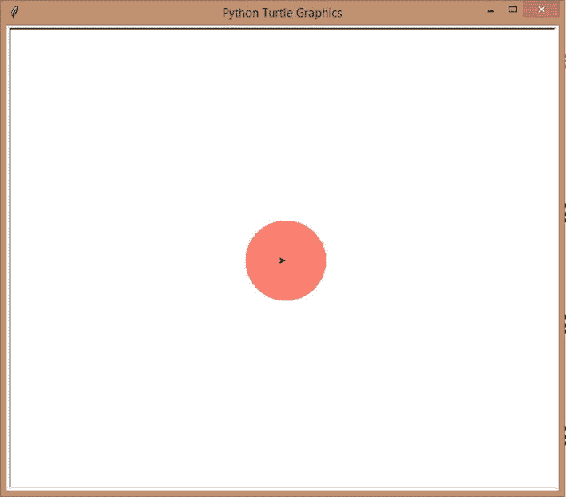

图 7-6

画彩色圆点

你注意到什么了吗？我们的圆比我们的点大得多。这是因为我们在点函数中给出的值实际上是直径，而不是半径。所以，你的圆，有相同的值，将会是你的点的两倍大。

## 弧

现在，让我们画一个弧线！弧线是圆的一部分，不是吗？所以，我们还是要用 circle 函数，但是我们要添加更多的参数，让 turtle 知道它应该只画圆(弧)的一部分。

你知道天使是怎么工作的，不是吗？(图 [7-7](#Fig7)

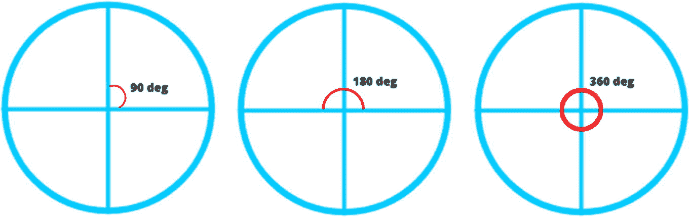

图 7-7

圆中的角

360 度构成一个圆，所以如果你想要一个半圆，你只需要 180 度。要做四分之一圆(弧)，需要 90 度。我们现在要做一个半圆。

```py
t.circle(100,180)

```

运行前面的代码，你会得到这个(图 [7-8](#Fig8) )。

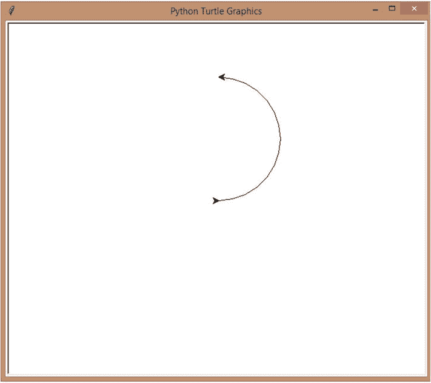

图 7-8

画一个半彩色

当你给定的值为-100，180 时，你会得到相同的弧线，但是在下面。给定 100°、–180°，您将看到第一个弧的镜像，给定–100°、–180°，您将看到相同的镜像，但在 0，0°位置下方。自己试试看吧！

如果你给的角度是 90 度，你会画出四分之一圆。你为什么不试着改变角度来得到不同大小的弧线呢？不要只停留在 90 或者 180。你有 0 到 360 度的角度可以选择。玩得开心！

## 更多选择！

对于海龟 T1，我们有更多的选择，但是因为我们在这一章中只讨论了基础知识，所以在我们继续讨论项目之前，我只讨论几个。有时，您可能想要在屏幕上绘制多个形状或图形，并且它们可能位于不同的位置。因此，您需要一种方法来将笔移动到新位置，而不在移动中绘制任何内容。移动后，您的笔应该会再次开始绘图。penup 和 pendown 方法(都是小写字母)可以帮助您做到这一点。

当你给你的海龟下“笔”命令时，你是在让它把笔从屏幕上拿开。它将不再绘制，但它将根据您的前进、后退或转到命令移动位置。命令“pendown”的作用正好相反。如果你想让你的笔再画一次，给它 pendown 命令。仅当 penup 命令有效时，此命令才起作用。

此外，您可以在程序完成图形绘制后使用 hideturtle 函数来隐藏屏幕上的乌龟。我相信你知道这个方法后会很欣慰。我知道我是。那些海龟在我的照片上看起来不太好！

我知道我刚刚向你扔了一堆随机的方法，你可能会感到困惑。那么，我们为什么不把刚刚学到的东西拿来测试一下呢？让我们先画一个正方形，然后画一个圆形，在屏幕的不同边上，把乌龟藏在最后，好吗？

1.  我将在启动程序时使用“penup”(在我像往常一样设置 turtle 之后)，然后将笔发送到位置(–200，200)。一旦我的笔移动了，我就要指定 pendown，因为接下来我要画我的正方形。

    ```py
    import turtle
    s = turtle.getscreen()
    t = turtle.Turtle()
    t.penup()
    t.goto(-200,200)
    t.pendown()

    ```

2.  然后，我将我的正方形的填充颜色设置为蓝色。

1.  接下来，我将使用常见的代码行来绘制我的正方形。

    ```py
    #Draw the square
    t.begin_fill()
    t.goto(-100,200)
    t.goto(-100,100)
    t.goto(-200,100)
    t.goto(-200,200)
    t.end_fill()

    ```

2.  一旦画出，我需要再次改变位置来画出我的圆。因此，再次暂停，转到(200，–200)，它在屏幕的另一侧，然后暂停。

    ```py
    #Change positions again
    t.penup()
    t.goto(200,-200)
    t.pendown()

    ```

3.  我将我的圆的填充颜色设置为红色。

```py
t.fillcolor('blue')

```

1.  Then, I’m going to draw a 50-point radius circle.

    ```py
    #Draw the circle
    t.begin_fill()
    t.circle(50)
    t.end_fill()

    ```

    就这样！我们在屏幕的相对两侧有两个形状！

2.  最后，我将使用 hideturtle()函数来隐藏乌龟(否则它仍会显示在圆圈上)。

```py
t.fillcolor('red')

```

```py
t.hideturtle()

```

当你运行程序时，你会得到这个(图 [7-9](#Fig9) )。

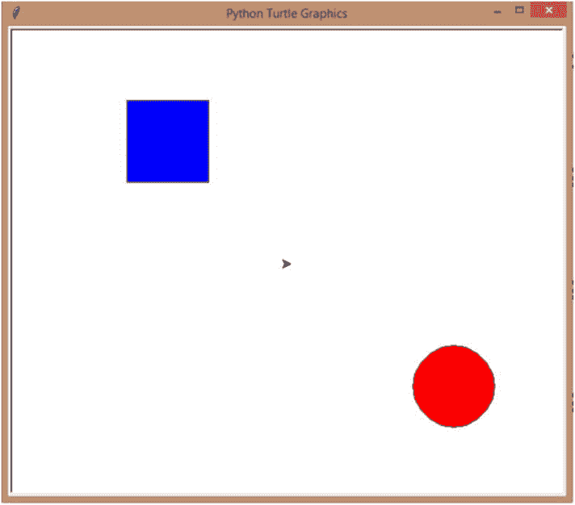

图 7-9

隐藏“t”形海龟

1.  这就是你会发现事情有点不同的地方。如果我只是用 t.hideturtle()，那么我就只隐藏其中一只乌龟(你为什么不画出来看看？).但是你一定注意到有两只乌龟。有一个在原始位置(0，0)，它属于 turtle 包本身，还有一个(预定义函数 Turtle()的 t)进行绘制。

所以，我们需要 hideturtle()重复两次。我们已经为“t”编写了 hideturtle()。让我们为完整的“海龟”包再写一个。

```py
turtle.hideturtle()

```

一旦我添加了前面的代码行，让我们再次运行脚本(图 [7-10](#Fig10) )。

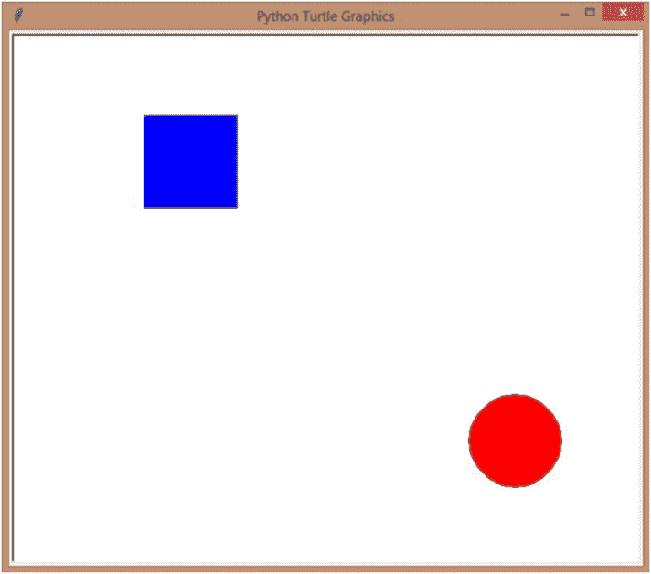

图 7-10

隐藏“海龟”海龟

看那个！屏幕中央的乌龟也消失了。是啊！

## 在屏幕上绘制文本

到目前为止，我们已经绘制了各种各样的图形，但是没有一幅图像是完整的，没有一点文字，是吗？这也很简单。你想看看吗？


要编写一个简单的文本，只需使用*龟*的 write 方法，指定想要显示的文本，就像这样:

```py
import turtle
s = turtle.getscreen()
t = turtle.Turtle()
t.write('Hello there!')

```

运行它，你会得到这个(图 [7-11](#Fig11) )。

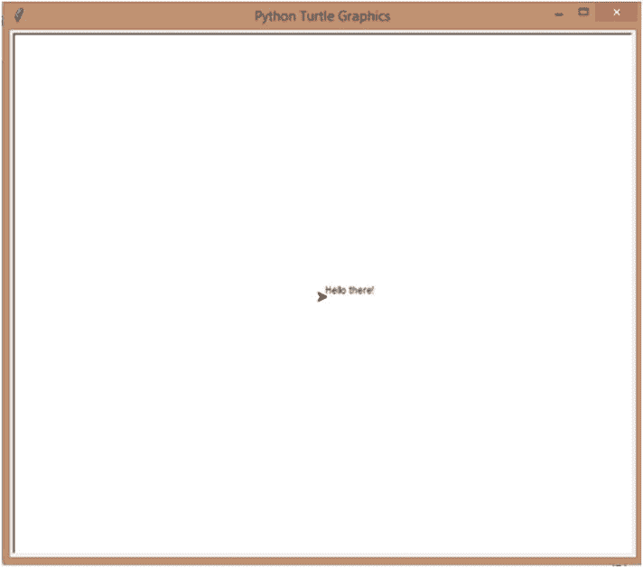

图 7-11

在屏幕上绘制文本

那看起来像鸡肉涂鸦。嗷！我们能以任何方式操纵这段文字吗？没错。

让我们先把文本放在某个地方。

```py
t.penup()
t.goto(200,200)
t.pendown()

```

现在，让我们再画一次，但有一点小小的变化:

```py
t.write('Hello there!', move=True)

```

默认情况下，move 参数为 False。如果你使它为真，你会看到正在绘制的文本下面的箭头，就像这样(图 [7-12](#Fig12) )。

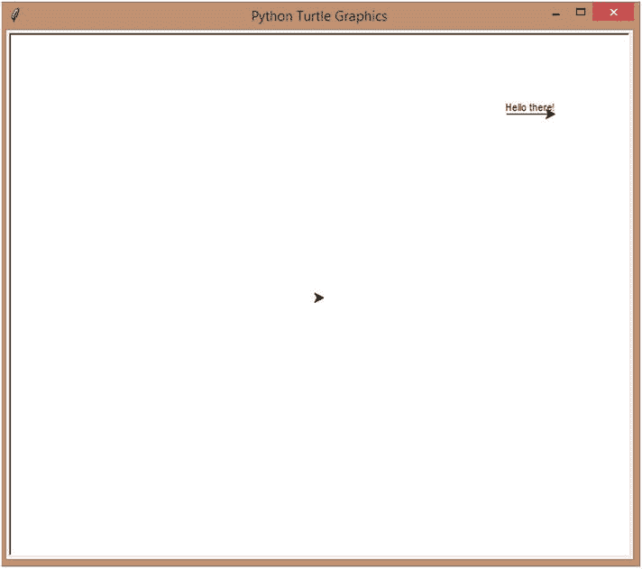

图 7-12

在不同的位置绘制文本

你现在可能看不出太大的区别，因为文本太小太短了。

还是太小了！让我们增加一些风格，好吗？你知道你可以在你的文本上使用不同的字体风格，不是吗？有 Arial、Calibri、Times New Roman 等一大堆类似的款式。简单的谷歌搜索会给你一个列表。

我要做我的乔治亚。但这还没有结束。我也可以增加或减少字体大小和改变字体类型。让我们一起玩吧！

让我们再次改变位置，为我们将要创建的“大”文本腾出空间:

```py
t.penup()
t.goto(-200,200)
t.pendown()

```

x 位置现在是–200，而不是 200。

现在，让我们画课文。

```py
t.write('Hello there!', move=True, font=('Georgia',40,'normal'))

```

你注意到上面代码中的一些东西了吗？我已经提到了“字体”下的所有样式，它们都在组合括号内。另外，字体样式(' Georgia ')和类型(' normal ')在引号内(可以是单引号或双引号)。让我们运行上面的代码，我们会得到这个(图 [7-13](#Fig13) )。

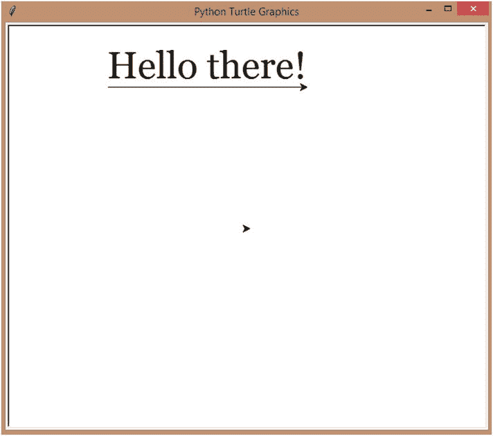

图 7-13

格式化文本

您可以使用 pencolor 工具更改文本的颜色。

```py
t.pencolor('Red')

```

您还可以将文本加粗、斜体和下划线(或这三种中的任意一种)，方法是将它们作为值与其余字体值一起包含，如下所示:

```py
t.write('Hello there!', move=True, font=('Georgia',40,'normal','bold','italic','underline'))

```

运行前面的代码，你会得到这个(图 [7-14](#Fig14) )。

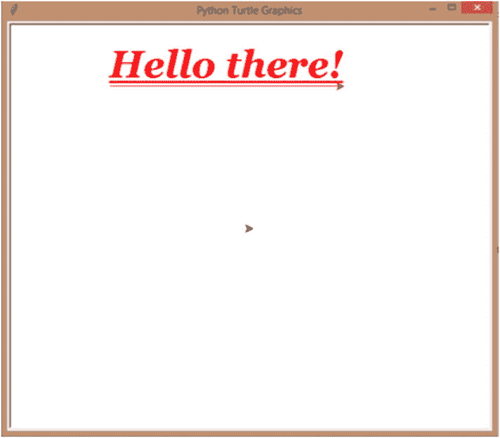

图 7-14

更改文本的颜色

看起来不错！

## 迷你项目-正方形内的圆圈

这将是一个简单的项目。在这个项目中，我们将在一个正方形内画一个圆:

1.  我们先设置一下 turtle。我没有在这个程序中设置速度，但是你可以这样做。

    ```py
    import turtle
    s = turtle.getscreen()
    t = turtle.Turtle()

    ```

2.  接下来，我将正方形的填充颜色设置为“红色”，钢笔大小设置为 5。我要先画正方形，然后画里面的圆。

    ```py
    #Set the color and pen size for the square
    t.fillcolor('Red')
    t.pensize(5)

    ```

3.  让我们现在画正方形。我将首先转到-100，-100 的位置，这样我可以围绕屏幕中心(0，0)画圆。这样，我可以围绕同一个中心点画圆。

    ```py
    #Draw the square
    t.penup()
    t.goto(-100,-100)
    t.pendown()
    t.begin_fill()
    t.goto(-100,100)
    t.goto(100,100)
    t.goto(100,-100)
    t.goto(-100,-100)
    t.end_fill()

    ```

4.  现在，为了将圆的中心设置为 0，0，我要求我的笔移动到位置 0，-100，所以当我从这个点逆时针方向画一个 100 点的半径时，中心将是 0，0。我已经将圆形的填充颜色设置为“蓝色”。

    ```py
    #Set position so the circle's center is 0,0
    t.penup()
    t.goto(0,-100)
    t.pendown()
    #Draw the circle
    #Color and size
    t.fillcolor('Blue')
    #Circle
    t.begin_fill()
    t.circle(100)
    t.end_fill()

    ```

5.  最后，让我们把乌龟藏起来。

    ```py
    t.hideturtle()
    turtle.hideturtle()

    ```

现在，让我们运行整个代码，看看我们是否得到了我们想要的(图 [7-15](#Fig15) )。

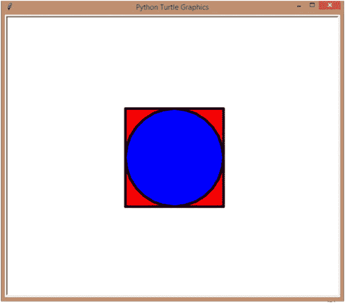

图 7-15

在正方形内画圈

哇哦！:d

## 更改绘图方向

到目前为止，改变方向的唯一方法是使用 right()和 left()方法。但是，在创建圆弧时，您可能需要其他东西来改变笔的角度，以便您可以将圆弧放置在您想要的任何位置。想画眉毛怎么办？还是侧身一笑？

Turtle 为你提供了 setheading()方法来做到这一点。我们先来看看什么是标题。heading()方法给出了笔在特定时间的角度。

```py
import turtle
s = turtle.getscreen()
t = turtle.Turtle()
print(t.heading())

```

当我运行前面的代码时，我得到这样的结果:

```py
= RESTART: C:\Users\aarthi\AppData\Local\Programs\Python\Python38-32\drawTurtle.py
0.0

```

现在，笔处于 0°的角度，这意味着它将在水平方向上绘制。但是用 setheading()，我可以改变角度。

也许，让我们把它做成 90 度。只要提到括号内的角度，就可以了。

```py
t.setheading(90)

```

现在让我们检查航向。

```py
print(t.heading())

```

运行前面的代码，您将得到这样的结果:

```py
= RESTART: C:\Users\aarthi\AppData\Local\Programs\Python\Python38-32\drawTurtle.py
90.0

```

很好，航向是 90 度。这对我们意味着什么？我们划一条线检查一下好吗？

```py
t.pensize(5)
t.forward(100)

```

当我们运行前面的代码行时，我们会得到这个(图 [7-16](#Fig16) )。

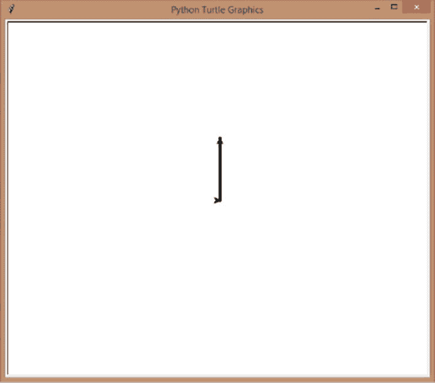

图 7-16

将航向设置为 90 度

看那个！它向上画了一条线，所以当航向为 90 度时，笔指向上方。你已经知道了每个角度的位置，所以你可以用 setheading()来猜测你的笔将会指向哪个角度，但是让我们用一个小程序来演示一下，好吗？我们正在重新开始，因此请打开一个新脚本或清除您当前使用的脚本。

1.  让我从设置海龟开始。我要打印当前的航向(程序开始运行时为 0 度，指向右边)。我还增加了笔的大小为 5，速度为 5。

    ```py
    import turtle
    s = turtle.getscreen()
    t = turtle.Turtle()
    print(t.heading())
    t.pensize(5)
    t.speed(5)

    ```

2.  现在，我要让笔在当前度数上向前画 100 点。一旦画好，我将使用 heading()方法让笔写出当前的度数。然后让我们提起笔，回到(0，0)重新开始。

    ```py
    #0 degrees
    t.forward(100)
    t.write(t.heading())
    t.penup()
    t.home()
    t.pendown()

    ```

3.  现在，让我们改变方向为 90 度(向上)，向前画，重复前面的动作。

    ```py
    #90 degrees
    t.setheading(90)
    t.forward(100)
    t.write(t.heading())
    t.penup()
    t.home()
    t.pendown()

    ```

4.  现在，180 度(指向左边)。

    ```py
    #180 degrees
    t.setheading(180)
    t.forward(100)
    t.write(t.heading())
    t.penup()
    t.home()
    t.pendown()

    ```

5.  最后 270 度(指向下方)。

    ```py
    #270 degrees
    t.setheading(270)
    t.forward(100)
    t.write(t.heading())
    Finally, let’s hide all the turtles.
    t.hideturtle()
    turtle.hideturtle()

    ```

运行前面的代码，你会得到这个(图 [7-17](#Fig17) )。

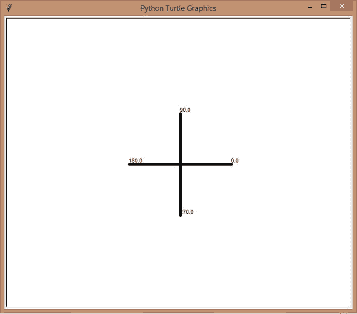

图 7-17

设定航向的角度图

你明白使用 setheading()的意义了吗？你可以把你的角度调到任何你想要的角度。现在，我们刚刚把它设置成画垂直线或水平线。不如换个角度看看有什么收获？

## 迷你项目–笑脸

在这个项目中，让我们更进一步，好吗？让我们画一个笑脸！

1.  我已经设置好了*海龟*套装。如果你喜欢，你可以改变速度。

    ```py
    import turtle
    s = turtle.getscreen()
    t = turtle.Turtle()

    ```

2.  接下来，我让笔移动到 0–100 的位置，这样我就可以画一个圆，这是我们的脸，圆心在 0，0。这将让我更好地计算眼睛、鼻子和嘴巴。

    ```py
    #Let's draw a smiley
    #Go to the position
    t.penup()
    t.goto(0,-100)
    t.pendown()

    ```

3.  现在，让我们画这张脸。填充颜色将是黄色，钢笔大小将是 5，圆的半径将是 100 点。

    ```py
    #Draw the face
    #Color and size
    t.fillcolor('yellow')
    t.pensize(5)
    #Circle
    t.begin_fill()
    t.circle(100)
    t.end_fill()

    ```

4.  接下来，我要画眼睛。我在反复试验的基础上设定了位置。你可以在你的程序中使用相同的或者改变位置来看看你得到了什么并且创建你自己的(我推荐这样做)。

我要让我的笔去位置–40，30 画左眼，画一个直径 30 的黑点。

1.  然后，到位置 40，30(同一水平线，X 值相反)画右眼，同样是直径 30 的点。

    ```py
    #Second eye
    t.penup()
    t.goto(40,30)
    t.pendown()
    t.dot(30)

    ```

2.  接下来，我们来画鼻子。这就是圆心在 0，0 的地方，因为我们的笑脸的鼻子将从 0，0 开始。让我们画一条从 0，0 到 0，–30 的直线。

    ```py
    #Draw the nose
    t.penup()
    t.goto(0,0)
    t.pendown()
    t.goto(0,-30)

    ```

3.  最后，棘手的部分。让我们画出微笑。我们要让乌龟走到第一只眼睛的 x 位置，也就是–40，但是 y 位置也是–40。同样，我是在反复试验后找到这个值的，最终得到了一个我想要的结果。自己试试！

    ```py
    #Draw the smile
    #Go to the x position of the first eye but a different y position
    t.penup()
    t.goto(-40,-40)
    t.pendown()

    ```

4.  微笑是一个半圆，不是吗？但是，如果你尝试像现在这样画一个半圆，你会得到一个倾斜的微笑，而不是我们在笑脸上看到的唯一微笑。这就是 setheading 的用武之地。我们需要改变笔的角度，这样我们就可以按照我们想要的角度画出半圆。让我们将角度更改为–60。不要迷茫！这与将角度设置为 120°是一样的(两者都可以使用)。

    Next, let’s draw a semi-circle with the angle 120, so it’s not exactly a semi-circle, but not a quarter circle either – something in between.

    ```py
    #Change the direction of the pen (turtle)
    t.setheading(-60)
    t.circle(40,120)

    ```

5.  最后，让我们藏起我们的乌龟！

    ```py
    #Finally, hide the turtle
    t.hideturtle()
    turtle.hideturtle()

    ```

```py
#Draw the eyes
#First eye
t.penup()
t.goto(-40,30)
t.pendown()
t.dot(30)

```

咻！太久了。现在我们要运行代码并检查我们的努力是否有成果吗？(图 [7-18](#Fig18) )

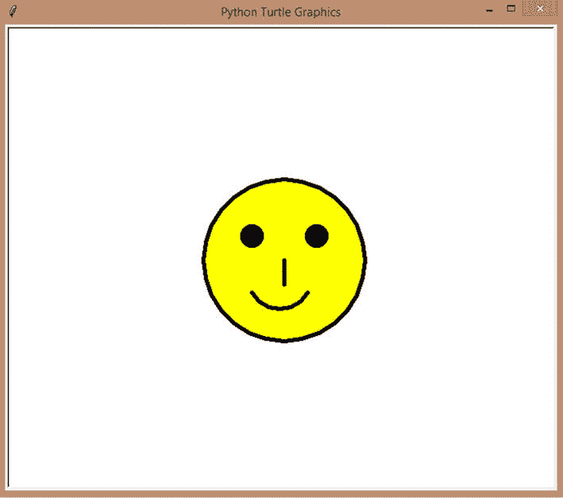

图 7-18

笑脸

耶！那是一个可爱的小笑脸！为什么不试着创造不同的表情符号呢？或许是一个悲伤的笑脸？皱眉头，还是大笑？你有你需要的工具(goto，setheading 等。)到现在创造任何形象，不仅仅是脸！


## 摘要

在这一章中，我们深入探讨了 Python *Turtle* 模块。我们学会了如何使用颜色，画弧线、圆圈和圆点，并控制它们的方向和大小，最后，我们学会了如何在屏幕上绘制文本。

在下一章，让我们深入研究字符串，如何创建和使用它们，以及 Python 为您配备的各种预定义的字符串方法，最后，让我们用它们来制造一些魔法吧！