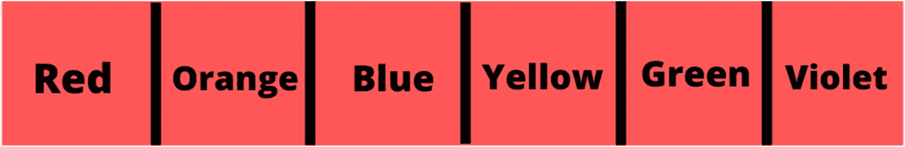
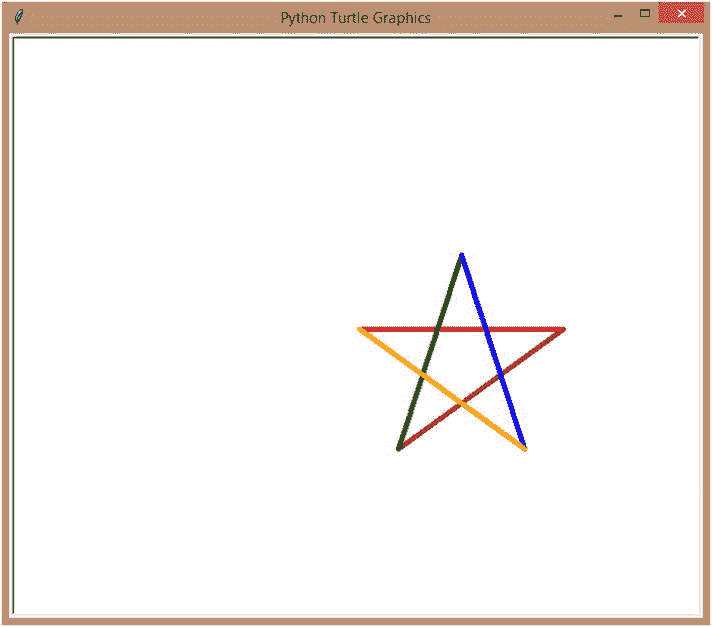
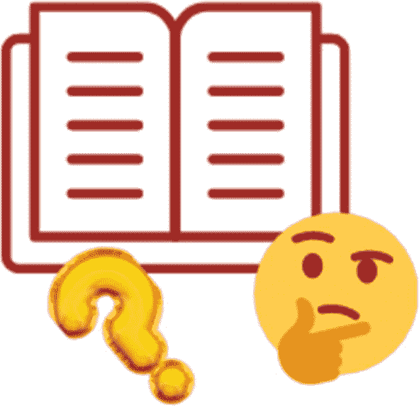

# 11.很多很多的信息！

在前一章中，我们学习了所有关于用 for 和 while 循环自动化代码的知识。我们还查看了 break 和 continue 语句，并创建了许多丰富多彩的迷你项目。

在这一理论密集的章节中，让我们看看 Python 提供的各种内置数据结构。让我们看看如何使用这些数据结构在单个变量中一次存储多个值，并看看在现实世界的程序中使用这些数据结构的实际例子。

## 存储多个值

到目前为止，我们只是一次存储一个值。当然，我们可以改变值，但是我们不能在同一个地方存储两个值。那不是有点不方便吗？假设我想存储六个不同的颜色值，这样我就可以在我的代码中一个接一个地使用它们。

我该怎么做？我可能会这样做:

```py
color1 = 'Red'
color2 = 'Orange'
color3 = 'Blue'
color4 = 'Yellow'
color5 = 'Green'
color6 = 'Violet'

```

然后，每当我想在代码中使用这些值时，我就必须记住并引用它们。哇…这是一个漫长的过程。

如果我能把所有六种颜色存储在同一个地方，同一个变量里，会怎么样？它看起来有点像图 [11-1](#Fig1) 。



图 11-1

同一变量中有多个值

这在 Python 中叫做 ***数据结构*** 。看看数据是如何构造(组织)和存储的？因此得名。有四种这样的预制数据结构可用于在同一位置存储多个值。您节省了许多代码行和时间，并且您的代码也更加高效。您也可以存储不同类型的数据。同一个数据结构可以存储字符串、数字和布尔值。

访问这些数据也很容易。在访问字符串中的单个字符时，你只需要遵循和我们使用的格式相似的格式。我一会儿会谈到这一点。

让我先向您展示四种数据结构:


*   **列表** : Python 确实是一门简单易学的语言，不是吗？这种语言使用的关键字非常容易记忆。名单就是这样。这是一个信息列表，不过是 ***点了*** 。列表中的单个值可以被 ***改变*** ，并且列表中的 ***允许其中有重复值*** 。

*   **元组**:元组类似于列表。唯一的区别是 ***的值一旦固定*** 就不能更改。这意味着您也不能添加或删除值。

*   **集合**:集合不同于元组的列表，是 ***无序的*** ，没有索引可以从中访问特定的值。它 ***也不允许重复的值*** ，因为这些值是无序的。

*   **字典**:顾名思义，字典将值以 ***字:描述*** 格式存储。字典也是无序的，但是它们可以改变，在 Python 中被称为“键”的“单词”充当索引，通过它可以访问值(描述)。

你现在可能正眯着眼睛看这本书。完全不用担心。乍一看，这些数据结构令人生畏。他们绝对不是。我将在下一节用有趣且容易理解的例子来解释它们，你很快就会明白所有的事情。

## 列表

让我们先来看看列表。创建它们非常容易。用逗号分隔要存储在列表中的多个值，并用方括号([])将所有内容括起来，这样就有了一个列表。你想尝尝吗？

让我们把前面例子中写的六行代码转换成一个列表，好吗？

```py
colors = ['Red', 'Orange', 'Blue', 'Yellow', 'Green', 'Violet']

```

前面的例子中只有字符串(因此有引号)，但是您可以创建一个只有数字的列表，或者只有布尔值，或者两个或更多的组合。根据你的需要创造你想要的东西。

你现在可能正眯着眼睛看这本书。一点也不担心。乍一看，这些数据结构令人生畏。他们绝对不是。我会轻松有趣地解释它们:

```py
a = [1, 'Hello', True, False, 34.5, '*']

```

前面的代码是异类值(不同数据类型)的列表。

## 访问列表中的值

好，我们有一个值列表。我们如何访问它们？你想猜猜吗？你已经知道了。

是的，有索引，就像我们对琴弦做的那样。列表中第一个值的索引为 0，第二个值的索引为 1，依此类推。

假设我想在列表“a”中访问并打印第三个值。它在索引 2 处。

```py
print(a[2])

```

运行前面的代码，您将得到这样的结果:

```py
= RESTART: C:/Users/aarthi/AppData/Local/Programs/Python/Python38-32/dataStructures.py
True

```

成功访问！

你可以做负索引，就像你对字符串做的那样。因此，要访问列表中的最后一个元素(值),我只需给出-1。

```py
print(a[-1])

```

运行前面的代码，您将得到这样的结果:

```py
= RESTART: C:/Users/aarthi/AppData/Local/Programs/Python/Python38-32/dataStructures.py
*

```

有效！耶！

## 切一个单子！

如果负索引和访问有效，就像字符串一样，那么使用范围提取列表的一部分也应该有效，对吗？我们来测试一下。

假设我想提取第二个到第五个值，索引为 1 到 4。我的范围应该是 1:5，因为范围中的最后一个数字不包括在内。

```py
print(a[1:5])
['Hello', True, False, 34.5]

```

哦，是的，它起作用了！那么通过负指数提取应该也可以，对吗？假设我想要从负的第三个索引中提取所有内容。

```py
print(a[-6:-3])

```

你已经知道负指数是如何工作的了，对吗？如果我运行前面的代码，我会得到这样的结果:

```py
[1, 'Hello', True]

```

您也可以更改值。假设我想将第二个值(字符串)改为一个数字。然后，我必须访问第二个值(第一个索引),并给它赋值。

```py
a[1] = 100
print(a)

```

让我们打印整个列表，看看现在发生了什么变化:

```py
= RESTART: C:/Users/aarthi/AppData/Local/Programs/Python/Python38-32/dataStructures.py
[1, 100, True, False, 34.5, '*']

```

## 列表操作着火了！

您有许多预定义的方法，可以用来以多种方式操作您的列表。还记得我们在你的琴弦上看到的方法吗？你会发现其中一些在这里也重复了。你准备好玩你的列表了吗？没错。

像往常一样，您可以使用 len()方法找到字符串的长度:

```py
a = [1, 'Hello', True, False, 34.5, '*']
print(len(a))

```

运行前面的代码，您将得到这样的结果:

```py
= RESTART: C:\Users\aarthi\AppData\Local\Programs\Python\Python38-32\dataStructures.py
6

```

没错。我们的列表长度是 6。有效。

对于我们将在本章中学习的每一种数据结构，你都有一个完整的方法列表。因此，我将把你链接到 Python 文档中的页面，那里列出了所有这些方法及其解释。

就是这里: [`https://docs.python.org/3/tutorial/datastructures.html`](https://docs.python.org/3/tutorial/datastructures.html) 。

也就是说，让我们看看本章中一些最重要的方法，好吗？

### 复制并追加

append()方法在列表末尾追加或添加一个元素:

```py
 a.append('new')
print(a)

```

运行前面的代码，您将得到这样的结果:

```py
= RESTART: C:\Users\aarthi\AppData\Local\Programs\Python\Python38-32\dataStructures.py
[1, 'Hello', True, False, 34.5, '*', 'new']

```

copy 方法创建列表的副本，该副本可以赋给任何变量以创建复制的列表:

```py
b = a.copy()
print("List b contains: {}".format(b))

```

运行前面的代码，您将得到这样的结果:

```py
= RESTART: C:\Users\aarthi\AppData\Local\Programs\Python\Python38-32\dataStructures.py
List b contains: [1, 'Hello', True, False, 34.5, '*', 'new']

```

### 清点并清除

列表可以有重复的值，对吗？假设我们有一个数字列表，其中的数字是重复的，我想检查一个特定的数字在列表中出现了多少次。我可以使用“计数”方法来实现这一点。

```py
l = [1,2,1,1,4,5,3,5,3,2]
print(l.count(1))

```

我以列表名“l”开始语法，然后是方法名“count”，然后我提到了我想要计数的值(1)。如果它是一个字符串，我会用引号引起来。让我们运行前面的代码，我们将得到这个:

```py
= RESTART: C:\Users\aarthi\AppData\Local\Programs\Python\Python38-32\dataStructures.py
3

```

我们得到了正确的答案！数字 1 在列表中出现了三次。

您可以使用“清除”方法清除整个列表。

```py
l.clear()
print(l)

```

运行前面的代码，您将得到这样的结果:

```py
= RESTART: C:\Users\aarthi\AppData\Local\Programs\Python\Python38-32\dataStructures.py
[]

```

我们现在有一个空名单了！

### 串联

您可以使用“extend”方法来连接或联接两个列表。

```py
list1 = [1,2,3,4,5]
list2 = [6,7,8,9]
list1.extend(list2)
print(list1)

```

正如您在前面的代码中看到的，您希望首先列出的列表元素排在最前面，然后是句点(".")，然后是“extend”方法，然后在括号内，您可以提到您想要加入第一个列表的列表的名称。

让我们运行前面的代码，我们将得到这个:

```py
= RESTART: C:\Users\aarthi\AppData\Local\Programs\Python\Python38-32\dataStructures.py
[1, 2, 3, 4, 5, 6, 7, 8, 9]

```

看那个！完美地结合在一起，并且按照我们想要的顺序。

### 在您的列表中搜索

“index”方法返回您正在搜索的值的第一个实例的索引。例如，如果您想在一个列表中查找数字 3，但是它重复了两次，那么只返回第一次出现的数字 3 的索引。让我举个例子:

```py
list1 = [1,2,3,2,3,1,3]
print(list1.index(3))

```

当您运行前面的代码时，您将得到这样的结果:

```py
= RESTART: C:\Users\aarthi\AppData\Local\Programs\Python\Python38-32\dataStructures.py
2

```

看那个！3 在列表中出现了三次，但我们只得到前 3 个的索引。太好了。

但是如果你愿意，你可以缩小搜索范围。如果我想在列表的后半部分找到 3，也许从第三个索引开始呢？您也可以将搜索的开始和结束指定为参数。让我告诉你怎么做:

```py
print(list1.index(3,3,6))

```

我让我的程序从索引 3 到 5 中搜索 3。你知道这些东西是怎么运作的吧？该范围中的最后一个值将不包括在内。所以，如果最后一个值是 5，那么你的程序只会搜索到第五个索引。

当我运行前面的代码时，我会得到这样的结果:

```py
= RESTART: C:\Users\aarthi\AppData\Local\Programs\Python\Python38-32\dataStructures.py
4

```

看那个！我们得到了列表中 3 的第二个实例的索引。很好！

### 添加和删除元素

您知道如何使用方括号将元素添加到列表中，也可以使用相同的方法更改元素。但是，如果我想在列表中间插入元素，以便其他值仍然存在，但只是进一步移动，该怎么办呢？

您可以使用 insert 方法来实现这一点。方法中的第一个参数是您想要值的位置，第二个参数是您想要添加的值。

```py
colors = ['Red', 'Orange', 'Blue']
colors.insert(1,'Green')
print(colors)

```

我在第一个索引中添加了值“Green”。现在‘桔子’应该再推一步。让我们检查一下，好吗？

```py
= RESTART: C:\Users\aarthi\AppData\Local\Programs\Python\Python38-32\dataStructures.py
['Red', 'Green', 'Orange', 'Blue']

```

是的，成功了！

默认情况下，pop()方法删除列表中的最后一个元素。如果你给了一个位置(索引),它会移除那个位置的元素。

让我们尝试删除前面列表中的第二个元素，也就是我们刚刚插入的元素，好吗？

```py
colors.pop(1)
print(colors)

```

当我们运行整个代码时，我们会得到这样的结果:

```py
= RESTART: C:\Users\aarthi\AppData\Local\Programs\Python\Python38-32\dataStructures.py
['Red', 'Green', 'Orange', 'Blue']
['Red', 'Orange', 'Blue']

```

看那个！列表最初有四个元素，我们使用 pop()方法成功地删除了第二个元素。

或者，您也可以使用 remove()方法。唯一的区别是您可以指定想要删除的确切元素。

我们的列表目前有['红色'，'橙色'，'蓝色']。我不想要蓝色了。为什么我们不试着移除它？

```py
colors.remove('Blue')
print(colors)

```

让我们看看它是否有效:

```py
= RESTART: C:\Users\aarthi\AppData\Local\Programs\Python\Python38-32\dataStructures.py
['Red', 'Orange']

```

耶！成功了。

有点太长了，不是吗？别担心！我们快完成了。那就用一个有趣的小项目来分散我们的注意力，好吗？

### 反转和排序

还有一种方法叫做 reverse()方法。你能猜出它是做什么的吗？没错。它反转列表中的元素。我们试试吧！

```py
li = [1,2,3,4,5]
li.reverse()
print(li)

```

运行前面的代码，您将得到这样的结果:

```py
= RESTART: C:\Users\aarthi\AppData\Local\Programs\Python\Python38-32\dataStructures.py
[5, 4, 3, 2, 1]

```

成功！

最后(是的，最后)，还有另一个方法叫做 sort()方法，它按照字母顺序对元素进行排序。

默认情况下，排序按升序进行。

```py
colors = ['Red', 'Orange', 'Blue', 'Yellow', 'Green', 'Violet']
colors.sort()
print(colors)

```

运行前面的代码，您将得到这样的结果:

```py
= RESTART: C:\Users\aarthi\AppData\Local\Programs\Python\Python38-32\dataStructures.py
['Blue', 'Green', 'Orange', 'Red', 'Violet', 'Yellow']

```

就像魔法一样！O:

这适用于数字吗？

```py
li = [1,4,3,6,2,8,7,9,5]
li.sort()
print(li)

```

当您运行上面的代码时，您会得到这样的结果:

```py
= RESTART: C:\Users\aarthi\AppData\Local\Programs\Python\Python38-32\dataStructures.py
[1, 2, 3, 4, 5, 6, 7, 8, 9]

```

呵呵，管用。

但是如果我想按降序排序呢？在这种情况下，我将修改 sort()函数调用，如下所示:

```py
li.sort(reverse=True)
print(li)

```

当您给定参数 reverse=True 时，您的程序将按降序对列表进行排序。默认值是 reverse=False，它按升序对列表进行排序。默认某件事发生的时候，不需要作为论据来提。

让我们运行前面的代码，我们将得到这个:

```py
= RESTART: C:\Users\aarthi\AppData\Local\Programs\Python\Python38-32\dataStructures.py
[9, 8, 7, 6, 5, 4, 3, 2, 1]

```

很好…我的列表现在是降序排列。Python 让我们几乎可以做任何事情，不是吗？

## 列表更有趣！

您可以使用“in”关键字检查列表中是否存在某些内容:

```py
print('Hello' in a)

```

在前面的代码行中，我们询问了字符串“Hello”是否是列表的一部分。

```py
= RESTART: C:\Users\aarthi\AppData\Local\Programs\Python\Python38-32\dataStructures.py
False

```

结果是假的。我们将第二个值从“Hello”更改为 100，还记得吗？所以，“你好”不再是列表的一部分。与 Python 中的所有内容一样，这些搜索也是区分大小写的。所以，“你好”不同于“你好”，如果字符串是“你好！”，那么你需要搜索整个东西。部分搜索不起作用。让我展示给你看:

```py
a[1] = 'Hello there!'
print('Hello' in a)

```

我已经将第二个值更改为“Hello there！”，当我在列表“a”中搜索“Hello”时，让我看看我得到了什么:

```py
= RESTART: C:\Users\aarthi\AppData\Local\Programs\Python\Python38-32\dataStructures.py
False

```

看那个。它仍然是假的，因为你没有用正确的词搜索。

现在你知道列表是如何工作的了，我想回到之前的话题。还记得“for”循环吗？记住我的承诺，当我教你关于列表的时候，我会重温 for 循环。我们现在在这里！

您可以使用 for 循环遍历列表。很简单。只需创建您的列表，然后将其替换为一个范围，如下所示:

```py
l = [1,2,3,4,5]
for i in l:
    print(i)

```

结果是这样的:

```py
= RESTART: C:\Users\aarthi\AppData\Local\Programs\Python\Python38-32\dataStructures.py
1
2
3
4
5

```

或者，您也可以直接指定列表，如下所示:

```py
for i in [1,2,3,4,5]:

```

用前面的代码行修改并运行您的代码，您会注意到您会得到相同的结果。

除了“extend”方法之外，您还可以使用“+”运算符连接两个列表，就像您处理字符串一样，如下所示:

```py
list1 = [1,2,3,4,5]
list2 = [6,7,8,9]
list1 += list2
print(list1)

```

或者，您可以创建一个新变量，并将 list1 + list2 的值赋给它。两个都行。

```py
= RESTART: C:\Users\aarthi\AppData\Local\Programs\Python\Python38-32\dataStructures.py
[1, 2, 3, 4, 5, 6, 7, 8, 9]

```

“clear”方法只是清除列表。但是如果你使用“del”关键字，你可以删除整个列表。你想要检查吗？

让我们删除前面的列表，好吗？

```py
del list1
print(list1)

```

当我尝试在删除 list1 后打印它时，我会得到一个错误，如下所示:

```py
= RESTART: C:\Users\aarthi\AppData\Local\Programs\Python\Python38-32\dataStructures.py
Traceback (most recent call last):
  File "C:\Users\aarthi\AppData\Local\Programs\Python\Python38-32\dataStructures.py", line 10, in <module>
    print(list1)
NameError: name 'list1' is not defined

```

看那个！“列表 1”已经完全从我们的程序中删除了。

您也可以对列表中的元素进行同样的操作。

```py
a = [1, 'Hello', True, False, 34.5, '*']
del a[2]
print(a)

```

我已经让我的程序删除了列表中的第三个元素。让我们打印，我们会得到这个:

```py
= RESTART: C:\Users\aarthi\AppData\Local\Programs\Python\Python38-32\dataStructures.py
[1, 'Hello', False, 34.5, '*']

```

第三个值“True”不再存在于列表“a”中。

## 迷你项目——多色自动星形

在这个项目中，我要用 Python 画一个星星，但是每一面都要有不同的颜色。这就是我的清单出现的地方。我将创建一个包含五种颜色的列表，并在其中运行一个 for 循环。对于 For 循环的每一次迭代， *Turtle* 都会用列表中的新颜色画出星星的一边。

让我们看看是怎么做的，好吗？

1.  我将从设置 *Turtle* 的常用代码行开始:

1.  我将设置笔的大小为 5，这样我的图像看起来很好。

```py
import turtle
s = turtle.getscreen()
t = turtle.Turtle()

```

1.  接下来，我将创建一个名为“colors”的变量，并为它分配一个由五种颜色组成的列表，“红色”、“棕色”、“绿色”、“蓝色”和“橙色”。我已经给了你一个颜色列表的链接，所以选择你喜欢的颜色。

```py
t.pensize(5)

```

1.  接下来，我将创建一个临时变量 x，它通过 for 循环遍历整个列表:

```py
colors = ['Red', 'Brown', 'Green', 'Blue', 'Orange']

```

1.  对于循环的每一次迭代，我的笔的颜色都会变成临时变量“x”中的当前颜色。我会让我的*海龟*向前移动 200 点，然后右转 144 点，因为一颗星星的外角是 144 度，我需要转那么多才能得到一颗合适的星星。

```py
for x in colors:

```

1.  这结束了我的 for 循环和缩进。最后，我要把我的乌龟藏起来。

```py
t.pencolor(x)
t.forward(200)
t.right(144)

```

```py
t.hideturtle()
turtle.hideturtle()

```

当你运行前面的代码时，你会得到这个(图 [11-2](#Fig2) )。



图 11-2

多色星

没错。我们拿到了。为什么不试试不同颜色或不同形状的呢？或者，你可以尝试在每次迭代中随机选择颜色？你已经知道怎么做了(我已经教过你了)，所以继续尝试吧。

## 元组

现在我们已经详细地看了列表，你会发现剩下的三个数据结构很容易理解，所以我将快速地浏览它们，好吗？

正如我之前提到的，元组类似于列表。唯一的区别是，它是有序的(就像一个列表，有索引和所有)，但不可改变的(不像一个列表)。这对我们意味着什么？这只是意味着你不能添加、删除或改变列表中的元素。

现在这是一个扫兴的人！这是否意味着元组没有列表酷？确切地说，我不会这么说。你知道，你可能需要创建一个列表，你不希望任何人以后操纵，我说的对吗？类似于“只读”列表？在这些情况下，元组是您最好的朋友。否则，100%去做一个列表。

您可以创建带括号的元组，元组项用逗号分隔，如下所示:

```py
t1 = ('Red', True, 2, 5.0)
print(t1)

```

运行前面的代码，您将得到这样的结果:

```py
= RESTART: C:\Users\aarthi\AppData\Local\Programs\Python\Python38-32\dataStructures.py
('Red', True, 2, 5.0)

```

元组中的大多数内容都遵循与列表相同的格式，所以我只列出它们，我希望你们在自己的计算机上尝试一下。这是我们的小活动，好吗？

就像处理列表一样，可以用方括号访问元组中的元素。

t1[1]将返回第二个元素，True。元组就像列表一样被索引，其中第一个索引是 0。

就像列表一样，可以使用负索引来访问元组中的值。因此，t1[–1]将返回列表中的最后一个元素。

您也可以使用索引对元组进行切片。

如果您想要提取第二个到第四个值(最后一个)，那么您可以指定 t1[1:4])或者只指定 t1[1:]，因为我们无论如何都想要第一个索引中的所有内容。

如果你想用负索引写同样的东西，你可以这样做:t1[–3:]因为你想要从–3 到元组末尾的所有东西。

可以使用 len(t1)方法获得元组的长度，并使用“in”关键字检查元组中是否有内容，就像处理列表一样。你为什么不试试看？

然后是你的“for”循环。您也可以循环遍历元组。过程是一样的。

```py
for x in t1:
    print(x)

```

为什么不运行前面的代码，检查循环是否适用于元组？

到目前为止，元组看起来像写在括号内的列表。他们到底有什么用？还记得我说过元组是不可改变的吗？我们还没有尝试过改变元素或者添加元素到我们的元组中，不是吗？让我们试试。

我将尝试将第二个元素的值从 False 改为 True。

```py
t1[1] = False

```

让我们运行我们的代码，我们会得到这个:

```py
= RESTART: C:\Users\aarthi\AppData\Local\Programs\Python\Python38-32\dataStructures.py
Traceback (most recent call last):
  File "C:\Users\aarthi\AppData\Local\Programs\Python\Python38-32\dataStructures.py", line 4, in <module>
    t1[1] = False
TypeError: 'tuple' object does not support item assignment

```

糟糕，我们出错了！元组不支持项赋值，这意味着它们的元素不能被改变。

尝试向元组添加新元素。访问第四个索引(第五个元素)并添加一些内容。当你这样做的时候，你会发现你遇到了同样的错误。

这是元组最重要的用途。您可以创建不可更改的列表，用于存储不应更改的敏感信息。如果你创建一个程序来存储你同学的身份证号码会怎么样？你不想改变这些，是吗？然后将它们存储在一个元组中。就这么简单！

但是，就像在您的列表中一样，您可以使用“del”关键字删除整个元组，就像这样:

```py
del t1

```

如果你现在尝试访问 t1，你会得到一个错误。

元组也有方法，但是它们只有很少的方法可以用来访问元素，而且没有方法可以操作元素或元组本身。

“count”方法返回一个值在元组中重复的次数。记住，元组可以有重复的值，就像列表一样。

“index”方法返回元组中值的位置(索引)。

```py
t1 = ('Red', True, 2, 5.0)
print(t1.index(5.0))

```

当您运行前面的代码时，您将得到这样的结果:

```py
= RESTART: C:\Users\aarthi\AppData\Local\Programs\Python\Python38-32\dataStructures.py
3

```

没错。5.0 在第三个索引中(第四个位置)。

tuple 到此为止。很简单，不是吗？接下来让我们看看列表中的下一个数据结构。

## 设置

你还记得我跟你说过的关于布景的事吗？它们是无序的，不能有重复的值。真是祸不单行。但是电视也有其用途。你想看看吗？

太好了。你在花括号里写集合，像这样:

```py
colors = {'Red', 'Orange', 'Blue'}

```

前面的代码是一组颜色“红色”、“橙色”和“蓝色”。

但是！集合是无序的。那么，这些价值真的会像我们创造的那样出现吗？你想要检查吗？

```py
= RESTART: C:\Users\aarthi\AppData\Local\Programs\Python\Python38-32\dataStructures.py
{'Blue', 'Orange', 'Red'}

```

哇，看那个！顺序变了。你能再运行一次程序并告诉我你得到了什么吗？

顺序又变了，不是吗？这有多酷？

但是我们现在确实有一个问题。集合是无序的。那么，如果我们不知道索引，我们如何访问元素呢？我们如何向集合中添加元素？我们如何在特定的位置插入元素？不幸的是，有些事情你不能用集合来做，任何与秩序相关的事情都属于集合。

所以，你不能用方括号来寻找一个特定位置的元素。但是，您可以使用“in”关键字来检查某个元素是否存在于集合中:

```py
print('Red' in colors)

```

运行前面的代码，你会得到真。

你也可以遍历集合，就像你处理列表和元组一样。

```py
for i in colors:
    print(i)

```

运行前面的代码，您将得到这样的结果:

```py
= RESTART: C:\Users\aarthi\AppData\Local\Programs\Python\Python38-32\dataStructures.py
Orange
Blue
Red

```

但是在不知道索引的情况下，如何向集合中添加元素呢？有一个 add()方法可以用来添加单个元素，尽管您不知道它们最终会出现在哪里。

```py
colors.add('Green')
print(colors)

```

运行前面的代码，您将得到这样的结果:

```py
= RESTART: C:\Users\aarthi\AppData\Local\Programs\Python\Python38-32\dataStructures.py
{'Blue', 'Green', 'Orange', 'Red'}

```

多有趣啊。我们在布景中加入了“绿色”，它最终出现在第二个位置。再次运行程序，你会在别的地方找到它。

如果我想向我的颜色集中添加多种颜色，该怎么办？我可以通过使用“update()”方法来节省空间。

在方括号内创建一个值列表，并将其放在括号内。让我尝试将“绿色”和“黄色”都添加到我的集合中:

```py
colors.update(['Green','Yellow'])
print(colors)

```

运行前面的代码，您将得到这样的结果:

```py
= RESTART: C:\Users\aarthi\AppData\Local\Programs\Python\Python38-32\dataStructures.py
{'Red', 'Yellow', 'Blue', 'Orange', 'Green'}

```

看看绿色和黄色的结局。:D

就像列表一样，您也可以使用 len()方法来查找列表的长度。

现在，让我们看看操纵集合的其他方法，好吗？我将只列出与我们在列表中看到的相似的那些。

在列表中，pop()方法移除一个随机值，而不是最后一个值。您可以使用 remove()方法通过将特定值作为参数来移除它。

或者，也可以使用“discard()”方法删除特定的元素。discard 和 remove 之间的唯一区别是，如果提到的元素不存在，discard 不会引发错误。这在现实编程中很重要。当运行一个程序时，你不希望因为一行代码出错而导致程序停止执行。

clear()方法清除集合，copy()方法复制列表。

您可以使用“del”关键字删除整个集合，但不能使用它来删除特定的元素，因为它们没有您可以访问的固定索引。

最后，我们来看看连接集。您可以使用“union()”或“update()”方法连接两个集合。

```py
colors = {'Red', 'Orange', 'Blue'}
colors1 = {'Green', 'Yellow'}

```

假设我们有两个集合，colors 和 colors1 有各自的值，我们希望将它们合并到 colors 集合中。

您可以使用 union()方法。它用两个集合中的值创建一个新集合。

```py
colors2 = colors.union(colors1)
print(colors2)

```

运行前面的代码，您将得到这样的结果:

```py
= RESTART: C:\Users\aarthi\AppData\Local\Programs\Python\Python38-32\dataStructures.py
{'Yellow', 'Green', 'Red', 'Blue', 'Orange'}

```

但是 update 只是用两个集合中的值更新语法中的第一个集合。如果打印出语法中的第二组，您会注意到它没有变化。更新只是改变第一组。

```py
colors.update(colors1)
print(colors)

```

运行前面的代码，您将得到这样的结果:

```py
= RESTART: C:\Users\aarthi\AppData\Local\Programs\Python\Python38-32\dataStructures.py
{'Orange', 'Yellow', 'Red', 'Blue', 'Green'}

```

我们也完成了布景。耶！你现在已经成为相当专业的 Python 程序员了。

## 字典

这个列表中的最后一个数据结构是字典。让我们快速完成它，然后回去做一些更有趣的迷你项目，你同意吗？是啊！

所以，字典是无序的，但是它们是有索引的，并且可以改变。我喜欢字典的一点是，它们可以用来模拟现实世界的东西。你想看吗？



字典也是在花括号内创建的，但是在花括号内，您需要提到 key:value 对中的值。这里的“关键”是索引。

因为我想让我的字典模拟真实世界的对象，所以我将创建一个代表一个人的特征的字典:他们的姓名、年龄、眼睛颜色、头发颜色等等。

我是这样做的:

```py
person1 = {"name":"Susan","age":9,"pet":"Barky","hair":"black","eyes":"blue"}

```

我已经创建了一本字典“person1”。她的名字叫苏珊，她 9 岁了，她的宠物叫巴克利，她有黑色的头发和蓝色的眼睛。看起来很棒，不是吗？

现在，让我们来操作这本字典。您可以像这样使用“键”来访问值:

```py
print(person1["name"])

```

或者

```py
print(person1.get("name"))

```

记住，你必须在任何地方都用引号括起来。

运行这两行代码中的任何一行，您都会得到相同的结果:

```py
= RESTART: C:\Users\aarthi\AppData\Local\Programs\Python\Python38-32\dataStructures.py
Susan

```

她的名字！

您也可以更改值。苏珊实际上是 8 岁，不是 9 岁！快，让我们在她伤心之前纠正她的年龄！

```py
person1["age"] = 8
print(person1)

```

运行这个程序，您将得到以下结果:

```py
= RESTART: C:\Users\aarthi\AppData\Local\Programs\Python\Python38-32\dataStructures.py
{'name': 'Susan', 'age': 8, 'pet': 'Barky', 'hair': 'black', 'eyes': 'blue'}

```

很好！

您也可以用同样的方式添加一个新的键:值对。让我们添加一个键，性别，并使其为女性。

```py
person1["gender"] = 'female'
print(person1)

```

运行前面的代码，您将得到这样的结果:

```py
= RESTART: C:\Users\aarthi\AppData\Local\Programs\Python\Python38-32\dataStructures.py
{'name': 'Susan', 'age': 9, 'pet': 'Barky', 'hair': 'black', 'eyes': 'blue', 'gender': 'female'}

```

这是添加的，耶！

您可以使用“in”关键字检查某个键是否存在。

```py
print('pet' in person1)

```

运行前面的代码，您将得到这样的结果:

```py
= RESTART: C:\Users\aarthi\AppData\Local\Programs\Python\Python38-32\dataStructures.py
True

```

是的，“宠物”是字典的关键词之一。

就像往常一样，你可以使用“len”方法找到字典的长度。

以下将删除字典:

```py
del person1

```

`person1.clear()`将字典清空。

您可以使用 copy()方法来复制字典。

像往常一样，您可以循环遍历字典，但是因为我们的字典有一个键和值，所以我们可以用不同的方式进行循环。

让我们先创建一个更小的字典:

```py
person1 = {"name":"Susan","age":8}

```

让我们先遍历所有的键并打印出来:

```py
for i in person1:
    print(i)

```

这应该会打印出所有的键:

```py
= RESTART: C:\Users\aarthi\AppData\Local\Programs\Python\Python38-32\dataStructures.py
name
age

```

没错。

如果你想要这些值，只要改变“我”的位置，就像这样:

```py
for i in person1:
    print(person1[i])

```

运行前面的代码，您将得到这样的结果:

```py
= RESTART: C:\Users\aarthi\AppData\Local\Programs\Python\Python38-32\dataStructures.py
Susan
8

```

我们现在只得到值。喔！

或者，可以使用 items()方法循环访问键和值，如下所示:

```py
for i,j in person1.items():
    print("{} = {}".format(i,j))

```

运行前面的代码，您将得到这样的结果:

```py
= RESTART: C:\Users\aarthi\AppData\Local\Programs\Python\Python38-32\dataStructures.py
name = Susan
age = 8

```

很好！

在结束之前，我们再看最后一件事。pop()删除给定的 key:value 对，而 popitem()删除字典中的最后一项。

```py
person1.pop("name")
print(person1)

```

运行前面的代码，您将得到这样的结果:

```py
= RESTART: C:\Users\aarthi\AppData\Local\Programs\Python\Python38-32\dataStructures.py
{'age': 8}

```

年龄是唯一剩下的关键！☹

让我们再次重写字典，这一次，尝试 popitem()。

```py
person1.popitem()
print(person1)

```

运行前面的代码，您将得到这样的结果:

```py
= RESTART: C:\Users\aarthi\AppData\Local\Programs\Python\Python38-32\dataStructures.py
{'name': 'Susan'}

```

现在，‘名字’是唯一剩下的关键！

字典到此为止！

## 迷你项目——永不落幕的色彩

又一个简单的项目！我们将在 1 秒钟后随机改变背景颜色，同时在海龟屏幕上打印当前颜色。

扭曲？我们将使用一个名为“时间”的新包来使海龟屏幕在每次颜色变化之间暂停。准备好了吗？我们走吧！

1.  所以，就像我说的，我们需要“时间”和“海龟”模块。两个都导入吧。

    ```py
    import time
    import turtle

    ```

2.  接下来，我们像往常一样设置 turtle。

    ```py
    s = turtle.getscreen()
    t = turtle.Turtle()

    ```

3.  设置好之后，让我们将刚刚创建的笔移动到我们希望它书写颜色的位置。这就是重点——80，0。

    ```py
    t.penup()
    t.goto(-80,0)
    t.pendown()

    ```

4.  现在，让我们创建一个颜色字典。这次我将创建一个字典而不是一个列表，因为我将使键的值(颜色)大写，这样我就可以把它们写在屏幕上。

    ```py
    colors = {'RED':'Red', 'BROWN':'Brown', 'GREEN':'Green', 'BLUE':'Blue', 'ORANGE':'Orange'}

    ```

5.  在我们开始画画之前，让我们把乌龟藏起来。当你运行这个程序时，你就会明白为什么了。

    ```py
    t.hideturtle()
    turtle.hideturtle()

    ```

6.  现在，有趣的部分来了。我们希望这个项目永无止境，记得吗？所以，很明显我们需要一个循环，但是什么样的循环呢？我们如何创建一个永无止境的循环？还记得我说过如果我们不小心的话,“while”循环可以永远运行下去吗？也就是说，如果条件没有在某一点变为假。

如果我们真的这么做了呢？如果我们让 while 循环的条件为“真”,那会怎么样？然后，如果在 while 循环中没有 break 语句，那么它将永远运行下去。

1.  简单！接下来，让我们创建一个 for 循环来遍历“颜色”字典。

```py
#never ending loop
while True:

```

1.  对于每次迭代，让我们将海龟屏幕的背景色改为 For 循环中的下一种颜色(值)。另外，让我们用 Arial 字体，50 磅，粗体字来写键值(x)。

    ```py
    turtle.bgcolor(colors[x])
    t.write(x,font=('Arial',50,'bold'))

    ```

2.  现在，在每次颜色变化之后，在下一次颜色变化(用于循环迭代)发生之前，我们需要 0.5 秒的延迟或间隙。这就是“时间”包的用武之地。它有一个名为 sleep()的内置函数，这个函数会在提到的秒数内暂停循环。在我们的例子中，它是 0.5。

```py
for x in colors:

```

1.  好的，从技术上来说应该是这样，但是如果我们不去管它，那么你会注意到你的海龟在旧文本上写下一个文本，事情会继续变得混乱。你为什么不试试看？

```py
time.sleep(0.5)

```

你的 turtle 包自带了一个 clear()函数，可以清空屏幕。那么，我们为什么不在改变下一种颜色和绘制下一个文本之前清空屏幕呢？

```py
t.clear()

```

就这样！让我们现在运行这个，我们会得到这个(图 [11-3](#Fig3) )。


图 11-3

永不落幕的颜色

你会注意到程序在“颜色”字典中无限循环。很甜蜜，是吧？

## 迷你项目-姓氏和名字颠倒

在这个项目中，这是我想要发生的:当我输入一个名字，例如，Susan Smith，我希望我的程序返回它的反转，即，Smith，Susan。

这与其说是一个迷你项目，不如说是一个难题。逻辑很简单:

1.  让我们通过获取名称作为输入来启动程序。条件是他们的名和姓需要用一个空格隔开。这很重要。你会明白为什么。

    ```py
    name = input('Please Enter your first and last name, separated by a space: ')

    ```

2.  正如我所说的，字符串输入的格式对于程序的运行非常重要。所以，我要计算字符串中单个空格的个数。如果没有，或者不止一个，那么程序会停止并显示一条错误消息。

    让我们先创建一个变量 count，并将其赋值为 0。

1.  接下来，让我们创建一个 for 循环，遍历刚刚得到的字符串。只要有一个空格，我们就加 1 来计数。

    ```py
    for i in name:
        if i == ' ':
            count += 1

    ```

2.  如果计数只有 1，那么我们就可以开始了。让我们使用 split 方法将字符串转换成列表，其中名字和姓氏被分隔成单独的列表项，使用单个空格作为分隔符。

    ```py
    if count == 1:
        #Convert string to list, where the condition is the space
        l = name.split(' ')

    ```

3.  接下来，我们来倒排一下。

    ```py
    #Reverse list
    l.reverse()

    ```

4.  最后，让我们在列表的第一个位置插入一个带空格的逗号，这样当我们连接所有内容时，我们就得到我们想要的确切格式。

    ```py
    #Add a comma, with a space, in the first position of the list
    l.insert(1,', ')

    ```

5.  现在让我们用一个空字符串作为连接条件将列表连接成一个字符串。这样，所有的东西都粘在一起，唯一分隔姓和名的是“，”。

    ```py
    #Join a list into a string
    name = ''.join(l)

    ```

6.  最后，打印所有内容。

```py
count = 0

```

1.  如果计数不是 1，则打印一条错误消息。

    ```py
    else:
        print('Please Enter your name in the correct format')

    ```

```py
print('Your reversed name is: {}'.format(name))

```

现在，让我们运行程序！

```py
= RESTART: C:\Users\aarthi\AppData\Local\Programs\Python\Python38-32\dataStructures.py
Please Enter your first and last name, separated by a space: Susan Smith
Your reversed name is: Smith, Susan

```

完美！

## 摘要

在本章中，我们深入探讨了 Python 提供的四种预定义数据结构，即列表、集合、元组和字典。我们研究了如何创建、删除、操作它们，等等。最后，我们看了如何在程序中使用它们，以及为什么它们在真实的编程场景中有用。

在下一章中，让我们暂时放下所有的学习，开始创作吧！我们将创建许多迷你项目。