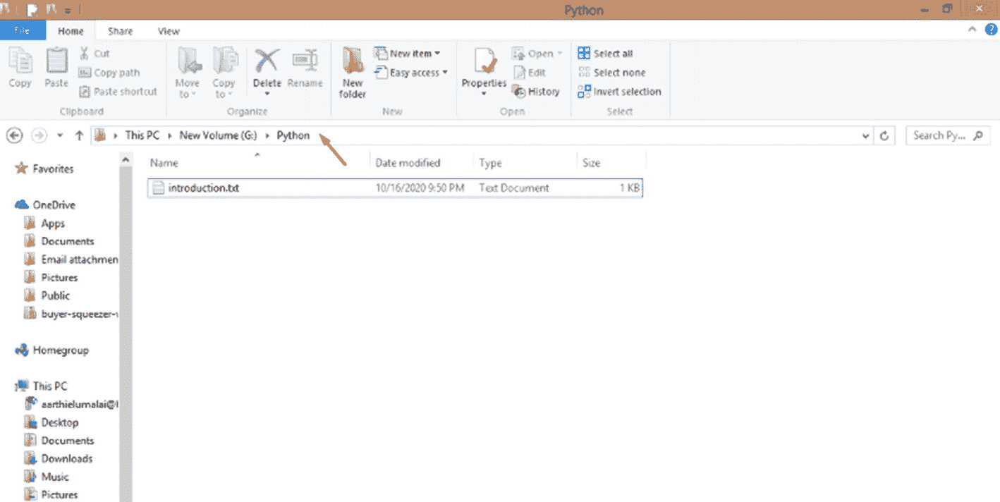
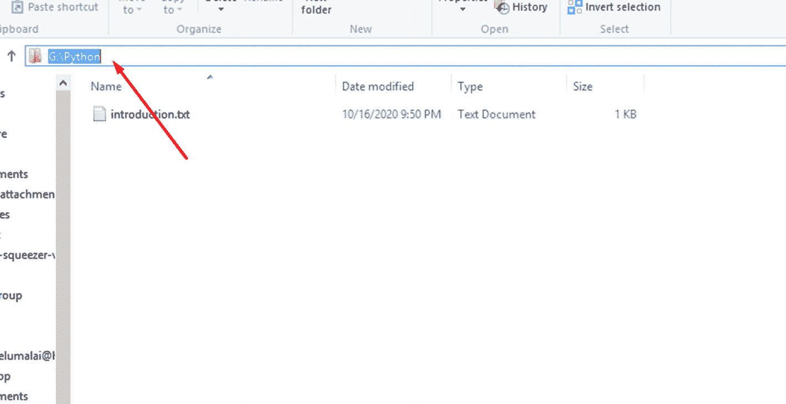

# 15.Python 和文件

在前一章中，我们学习了如何使用类在 Python 中创建真实世界的对象。我们学习了在 Python 中一切都是对象。然后，我们学习了如何在 Python 中创建类，并使用这些类创建类似的对象，而无需编写太多行代码。

在本章中，我们来看看 Python 中的文件处理。我们将着眼于从 Python 代码内部创建、读取、写入和操作系统中的文件。

## 为什么是文件？


我能听到你的呻吟。你可能会说，这又是一个无聊的理论话题。别这么快就放弃文件。这是一个很轻松的话题，可以打开太多的可能性去数。

一旦你学会了这一点，现实世界的编程就是你的了。您可以开始将系统中的文件包含在您的程序中，您可以从您的程序中创建它们，读取它们，操作它们，完全删除它们，等等。如果你想在你的笔记本和电脑上创建功能齐全的应用程序，那么你最好学习文件。

这是一个快速的章节，所以不要太担心，像往常一样，我们将以一个有趣的，这次是简单的迷你项目来结束它。此外，从下一章开始，你将创建所有你想创建的大项目、小项目、应用程序和游戏，所以更有理由快速完成这一章，你不觉得吗？

## 打开和读取现有文件

让我们从简单的开始。在对文件做某些事情之前，您需要检索它并将其保存在一个变量中，以便以后可以读取它、写入它等等。

使用“open”方法并在双引号或单引号内指定文件名。您需要指定完整的文件名，包括相关的扩展名，如。py，。txt，等等。

但是，如果文件与脚本存在于同一个文件夹中，那么您可以只提及文件名及其扩展名，就像我在我们的示例中将要做的那样。

我将让我的程序检索 introduction.py 文件，因为它与我为本章创建的 files.py 文件在同一个文件夹中，所以我不需要指定完整的路径。

但是如果我的路径在不同的文件夹中呢？怎么才能拿到？O:

这是一个非常简单的过程。在 Windows 中打开你的文件浏览器，或者在 Mac 中打开它，如图 [15-1](#Fig1) 所示。



图 15-1

找到您的文件

在我放置箭头的地方单击，也就是在最后一个文件夹名称之后。你会得到路径，像这样(图 [15-2](#Fig2) )。



图 15-2

获取您的文件路径

现在，你可以复制路径。但是不能照原样使用。您需要按照以下格式格式化路径和文件名。在前面的示例中，我们试图获取文件“introduction.txt”的路径，该文件位于路径 G:\Python 中。为了在我的程序中使用它，我将把它格式化成这样:

```py
G:\\Python\introduction.txt

```

然后，我会把整个事情放在引号内，并使用它。就这么简单！

准备好 open()方法后，将其赋给一个变量。为什么呢？一会儿你就知道了！

```py
file = open(' introduction.py')

```

现在我们已经将文件存储在变量“file”中，我们可以开始操作它了。

你想先做什么？我们要读它吗？打印里面的内容？好吧，就这么办！

你能猜到读取一个文件会怎样吗？也许 Python 有 read()函数我们可以用？是的，你说得对！这正是我们所拥有的。


但是，在使用 read 函数之前，您需要向您的程序指定这正是您要做的事情。因此，当您检索文件时，您需要添加第二个参数，指定您以只读格式检索文件，并且稍后您将读取并可能打印其中的内容。

让我们改变我们的代码行:

```py
file = open(' introduction.py','r')

```

正如您在前面的代码中看到的，我在引号中包含了第二个参数“r”。这将让我的程序知道，我只是检索文件来读取它，而不是别的。

现在，我们实际上可以读取并打印我们的文件。你想试试吗？

```py
file.read()

```

让我们运行上面的代码，然后…

蟋蟀…

什么都没发生。:O 为什么？！你让你的程序去读它，它就这样做了。你没让它打印结果吧？你需要对计算机非常清楚。他们需要确切的指示。

因此，让我们打印我们的读取操作:

```py
= RESTART: C:/Users/aarthi/AppData/Local/Programs/Python/Python38-32/file.py
print('Hello there!')
print('My name is Susan Smith.')
print('I am 9 years old.')
print('I love puppies! :)')

```

看那个！introduction.py 文件中的全部内容(代码)都打印出来了。你注意到什么了吗？尽管该文件包含代码，并且是在 Shell 中打印的，但是这些 print()行并没有被执行。它们就是这样印刷的。

为什么会这样？在这种情况下，您的文件被认为是一个普通的文本文件，代码行是文件中的内容。仅此而已。如果您想要执行前面的代码，您需要以通常的方式进行，而不是通过文件操作打开或读取它。

你可以要求你的程序只打印指定数量的字符，而不是全部。假设我只想打印出前 50 个字符(单个字母、数字、特殊字符和空格)，其他什么都不要。然后我要做的就是在括号内指定 50，就像这样:

```py
print(file.read(50))

```

运行前面的代码，您将得到这样的结果:

```py
= RESTART: C:/Users/aarthi/AppData/Local/Programs/Python/Python38-32/file.py
print('Hello there!')
print('My name is Susan Smith.')

```

计算前面结果中的字符数，您将得到 50 个，包括作为单独字符的空格和新行。

你为什么不尝试不同的数字，看看你会得到什么？

## 逐行

如果您不想打印整个文件，也不想计算字符数，该怎么办？如果你只想要第一行呢？然后，您可以使用 readline()方法来读取行。让我们用 readline()代替 read()。

```py
print(file.readline())

```

运行前面的代码，您将得到这样的结果:

```py
= RESTART: C:/Users/aarthi/AppData/Local/Programs/Python/Python38-32/file.py
print('Hello there!')

```

耶！只是第一行。

如果我想打印更多的行呢？我可以像在 read()中那样在括号中指定 2 吗？

```py
print(file.readline(2))

```

运行前面的代码，您将得到这样的结果:

```py
= RESTART: C:/Users/aarthi/AppData/Local/Programs/Python/Python38-32/file.py
pr

```

啊，真倒霉。它以为我又要两个字了。我想唯一的办法是指定另一个 readline()。我们试试好吗？

```py
print(file.readline())
print(file.readline())

```

我们现在有两个 readline()方法。有用吗？

```py
= RESTART: C:/Users/aarthi/AppData/Local/Programs/Python/Python38-32/file.py
print('Hello there!')

print('My name is Susan Smith.')

```

没错。我们现在有两条线，它们之间有一个巨大的空间，因为它们是用两种不同的印刷品印刷的。

如果你想读取并打印出整个文件，那么就像遍历一个列表一样遍历它。对于循环的每一次迭代，程序将打印文件中的一行。

```py
file = open('introduction.py','r')
for i in file:
    print(i)

```

运行前面的代码，您将得到这样的结果:

```py
= RESTART: C:\Users\aarthi\AppData\Local\Programs\Python\Python38-32\file.py
print('Hello there!')

print('My name is Susan Smith.')

print('I am 9 years old.')

print('I love puppies! :)')

```

这是整个文件！

## 创建新文件

您可以在 open()方法中使用“x”或“w”属性来创建新文件。“w”只是创建一个不存在的文件，但打开一个已存在的文件，而“x”专门用于创建新文件。如果您尝试“创建”一个现有文件,“x”会返回一个错误。

现在让我们创建一个文件 newFile.txt。

```py
file = open('newFile.txt','x')

```

我们的文件刚刚创建！再次运行程序，你会得到一个错误，因为文件现在已经存在。

## 操作文件

您可以使用 write 方法向文件中添加。为了做到这一点，你需要打开你想要添加文本的文件，无论是写，“w”，还是附加，“a”，模式。

“写入”模式将覆盖文件中当前的任何文本。追加模式将给定的文本追加到文件的末尾。

我们两个都试试，好吗？

我已经以“写”模式打开了我们在上一节中创建的文件。

```py
file = open('newFile.txt','w')

```

现在，让我们使用“write”方法向我们的文件添加几行文本，由新行“\n”分隔。

```py
f.write('Hi there!\nThis is a new file.\nWe just added text to it!')

```

现在，让我们阅读我们的文件，看看我们是否得到同样的结果。

```py
file = open('newFile.txt', 'r')
print(file.read())

```

运行前面的代码，您将得到这样的结果:

```py
= RESTART: C:\Users\aarthi\AppData\Local\Programs\Python\Python38-32\file.py
Hi there!
This is a new file.
We just added text to it!

```

哇哦！

让我们现在尝试追加。

```py
file = open('newFile.txt','a')
file.write('\nThis is the last line')

file = open('newFile.txt','r')
print(file.read())

```

运行前面的代码，您将得到这样的结果:

```py
= RESTART: C:\Users\aarthi\AppData\Local\Programs\Python\Python38-32\file.py
Hi there!
This is a new file.
We just added text to it!
This is the last line

```

这是一个非常强大的功能，可以使编程桌面应用程序，或任何应用程序，对你来说非常容易！

## 迷你项目-用文件介绍

这将是一个非常简单的项目。我们将在您选择的文件夹中创建一个名为 introduction.txt 的文本文件。我们将通过 Python 代码编写对该文件的介绍，最后，我们将在 Shell 中打印该介绍。简单！

我们可以开始了吗？

1.  我将在下面的路径中创建我的文件:`G:\\Python\introduction.txt`

我也可以用“x ”,但是我用的是“w ”,这样我就不用再以写模式打开文件了。

1.  然后，我要写苏珊对它的介绍:

```py
f = open('G:\\Python\introduction.txt','w')

```

1.  现在，让我们把它打印出来。让我们再次打开我们的文件，但这一次是在读模式下，一边读一边打印它的内容，最后关闭它。

```py
f.write('''Hi, I'm Susan.
I'm 9 years old.
My puppy's name is Barky.
He loves me very very much! :)''')

```

```py
f = open('G:\\Python\introduction.txt','r')
print(f.read())
f.close()

```

现在，当我们运行程序时，我们会得到这个:

```py
= RESTART: C:\Users\aarthi\AppData\Local\Programs\Python\Python38-32\file.py
Hi, I'm Susan.
I'm 9 years old.
My puppy's name is Barky.
He loves me very very much! :)

```

完美！

## 摘要

在这一章中，我们学习了所有关于文件的知识，从你的 Python 代码中创建它们，读取它们，将它们存储在变量中，在你的程序中操作文件，等等。

在下一章，让我们学习一下 *Tkinter* ，一个让你创建桌面应用的 Python 包。