# 十六、用 Tkinter 创建很酷的应用

在前一章中，我们学习了用 Python 创建、打开和操作计算机文件的所有知识。在这一章中，我们正式回到 Python 的乐趣中。您将了解到 *Tkinter* ，这是一个可以用 Python 创建桌面应用(GUI——图形用户界面)的包。您将学习如何创建按钮、标签、框等等。

## 让我们开始吧！

还记得我们和海龟一起工作时做了什么吗？与 *Tkinter* 合作的一些流程是相同的。你现在是职业程序员了。你已经知道了 Python 的基础知识。你已经完成了迷你项目的整个章节。

所以，在这一章，我希望你穿上你的大男孩/女孩裤子。我不会给出很多实际的解释，因为你已经知道了很多这方面的东西。我们将在这一章中涉及很多内容，在这一章的最后，你将拥有和你在系统中看到的一样漂亮的应用，并且你将拥有创建更多应用的工具。激动吗？我也是！我们开始吧。

就像 turtle 一样，我们需要首先导入 *Tkinter* 。让我们打开一个新的脚本文件。不要保存为“tkinter.py”。您的 Python 安装中已经有一个类似的文件，它包含您将用来创建应用的所有预定义方法的代码。我将把我的文件保存为 tkPrograms.py。

我们先导入 *Tkinter* 。

```py
from tkinter import *

```

我已经要求所有东西都从 *Tkinter* 包中导入。“*”代表一切。现在，我们需要创建一个包含我们的应用的窗口。我要调用我的 w，需要调用的函数是 Tk():

```py
w = Tk()

```

让我们运行一下，看看我们会得到什么(图 [16-1](#Fig1) )。

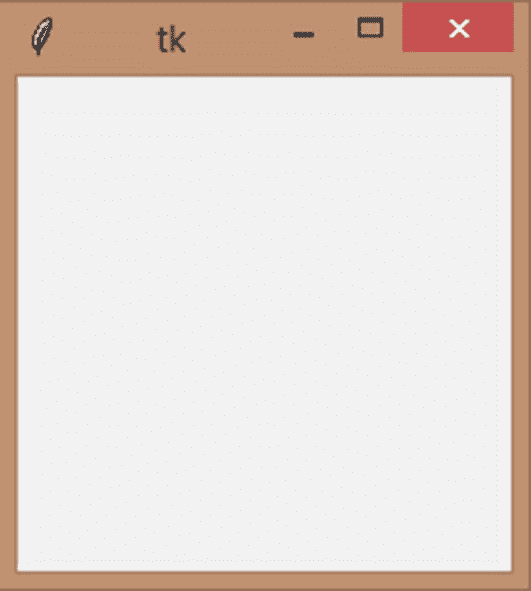

图 16-1

tkinter screen(tkinter screen)

看那个！一扇漂亮的小窗。它也有可以用来最小化、最大化和关闭窗口的按钮。你为什么不试试它们？

标题有点奇怪吧？上面只写着 tk。我不喜欢！我希望我的能说“我的第一个应用”。我该如何改变？当然是通过在我们刚刚创建的窗口上调用 title()方法！

```py
w.title('My first Tkinter app')

```

再次运行，看看您会得到什么(图 [16-2](#Fig2) ):

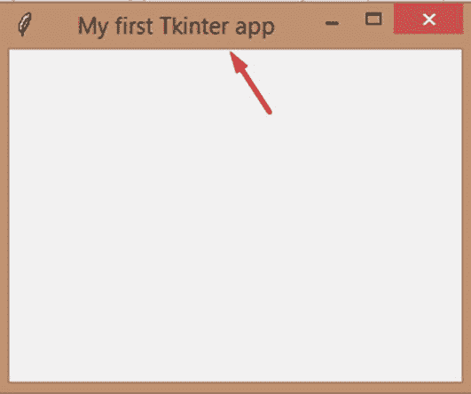

图 16-2

标题变更

看那个！上面写着我现在想要的。我稍微调整了一下窗口大小，这样我就可以看到整个标题。这太美了。我只写了三小段代码，现在我有了一个漂亮的小窗口。你能看出 *Tkinter* 有多厉害吗？O:

好吧，那么，这是它的设置。接下来，让我们看看如何创建小部件并将它们放在这个窗口上。这就是事情变得有趣的地方！

## 标签、纽扣和包装

Tkinter 有很多“小部件”,你可以创建它们来让应用变得生动。这些小部件包括按钮、文本框和单选按钮。一旦创建了一个小部件，就需要把它放在窗口上。所以，这个过程通常有两个步骤。现在让我们看看如何创建标签和按钮，好吗？

要创建标签，您需要使用" Label()"方法，并在第一个属性中提及您希望标签放置的窗口，并在" text "属性中提及您希望标签中的文本。我将创建一个变量 label1，并将我的标签放入其中。

```py
label1 = Label(w,text='My Label')

```

如果我运行这个，我将再次以一个空白窗口结束。为什么呢？记得我之前告诉你的吗？小工具需要放在窗口内才可见。我们如何做到这一点？

最简单的方法之一是使用 pack()方法。它只是将你创建的窗口小部件打包或放入窗口，并根据窗口小部件的大小调整窗口大小。

这就是为什么我把我的标签放在一个变量中，这样我就可以在变量上调用 pack()方法。那样看起来很整洁。

```py
label1.pack()

```

现在运行所有程序，看看会得到什么(图 [16-3](#Fig3) )。

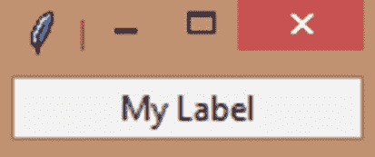

图 16-3

标签

这就对了。一个小小的窗户，上面只有我的标签。

如果你不想要两行代码，你可以这样写，这样就可以了:

```py
Label(w, text='My Label').pack()

```

我将坚持使用第一种方法，因为一旦我们开始设计标签并向它添加许多属性，它看起来会很整洁。稍后我还可以引用同一个标签来更改它的属性值。它只是在现实世界中更有活力。

但是你注意到什么了吗？每当我运行这个程序时，我的 shell 都会打开我的窗口，但是它会返回到下一个提示符(<<

现在，再次运行，您会注意到我们的 Shell 没有进入下一个提示。很好！

好吧。我们现在能把事情弄得漂亮一点吗？为什么我们不玩我的标签的大小和颜色？

不过，在我们开始之前，让我们先来看看颜色的选择。 *Tkinter* 认识一吨的颜色名称，你可以在这里找到他们的名单，在他们的官方网站: [`www.tcl.tk/man/tcl8.5/TkCmd/colors.htm`](http://www.tcl.tk/man/tcl8.5/TkCmd/colors.htm) 。

如果你想把颜色形象化，你可以使用这个网站: [`www.science.smith.edu/dftwiki/index.php/Color_Charts_for_TKinter`](http://www.science.smith.edu/dftwiki/index.php/Color_Charts_for_TKinter) `.`

第二个链接是第三方网站，但仍然有用。

所以，现在我们已经用颜色武装了自己，让我们开始吧！

您可以使用宽度和高度属性来更改标签的大小。它们分别改变标签的宽度和高度。但是，当您使用这些属性时，您会注意到一些不同。假设这两个属性的值都是 10，但是您会注意到标签的高度大于标签的宽度。这是因为这些值不是以像素为单位，而是以字符“0”的大小为单位。它的宽度比它的高度小两倍，不是吗？这就是你看到的。所以，在给出你的价值观的时候考虑一下这个。

此外，您可以使用 bg 属性更改标签的颜色，使用 fg 属性更改标签文本的颜色。让我们把它们结合在一起，设计我们的标签吧！

```py
label1 = Label(w, text='My Label', bg="Salmon4", fg="gold2", width=10, height=5)
label1.pack()

```

我已经将背景色改为“Salmon4”，文字颜色改为“gold2”，宽度改为 10 个字符单位，高度改为 5 个字符单位。现在让我们运行程序(图 [16-4](#Fig4) )！

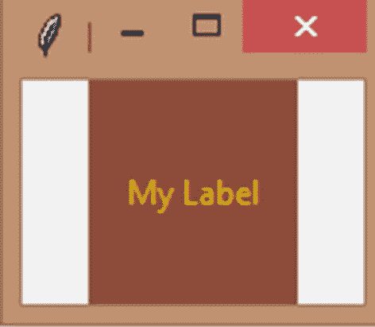

图 16-4

更改标签的大小和颜色

喔！看看窗口是如何扩展到包含我的新标签的。太完美了。

你还可以使用其他的属性，但是让我们在本章的后面部分来看看。那么，纽扣呢？它遵循相同的程序。使用 Button()方法，属性相同。

```py
button1 = Button(w, text='My Button', bg='steel blue', fg="snow", width=10, height=5)
button1.pack()

```

运行所有程序，看看会得到什么(图 [16-5](#Fig5) )。

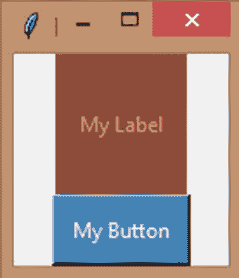

图 16-5

纽扣

你会发现你真的可以点击按钮。它是动画，不像标签。

但这还没有结束。当你点击这个按钮时，你可以让你的系统做一些事情。使用 command 属性，我可以在单击按钮时调用函数。

```py
def buttonClick():
    print('You just clicked the button! :)')

button1 = Button(w, text='Click Me!', bg='steel blue', fg="snow", width=10, height=5, command=buttonClick)
button1.pack()

```

如你所知，在 Python 中，函数定义应该总是在函数调用之前，在我们的例子中，是在按钮之前。让我们创建一个打印消息的函数 buttonClick()。就这样。

现在，在我们的按钮中，我们添加了一个新属性“command”，该值是我们函数的名称。就名字，不用加括号。现在，像往常一样，打包按钮并运行程序，您将得到按钮。单击它，回到 Shell，您会看到:

```py
= RESTART: C:\Users\aarthi\AppData\Local\Programs\Python\Python38-32\tkPrograms.py
You just clicked the button! :)

```

哇哦！有效！

## 详细包装

到目前为止，事情看起来很糟糕。我们实话实说吧。这不是我们创建应用的方式。但是不要惊慌。pack()方法还有一些技巧。

在我们看这些之前，让我们先来看看所谓的“框架”。这个框架不完全是一扇窗户。我们已经创造了一个。但是有了框架，你可以把你的部件分组，然后按照你想要的方式组织它们。

让我们围绕标签和按钮创建一个框架。我们也可以给出背景颜色(bg)、宽度和高度，但是在这种情况下，宽度和高度是以像素为单位的，所以要使数字更大。

```py
frame1 = Frame(w)
frame1.pack()

label1 = Label(frame1, text='First button')
label1.pack()

button1 = Button(frame1, text="Button1")
button1.pack()

label2 = Label(frame1, text='Second button')
label2.pack()

button2 = Button(frame1, text="Button2")
button2.pack()

```

正如您在前面的代码中看到的，我创建了一个框架，然后在该框架中创建了两个标签和两个按钮。因此，frame1 的根窗口是“w”，即原始窗口，但其余小部件的根窗口是我们的 frame1。这样，我们可以在同一个窗口中创建任意多的框架。现在，让我们运行它，看看我们会得到什么(图 [16-6](#Fig6) )。

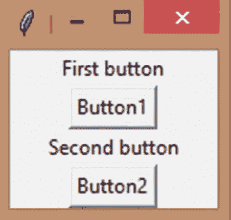

图 16-6

包装几何方法

似乎什么都没有改变。☹该收拾()方法来救援了！

pack()方法是一个几何管理器，它将您的小部件打包到它的父窗口(在我们的例子中是 frame1)的行和列中。

首先，让我们看看填充选项。您可以使用此选项让您的小部件填充父小部件。

现在，弹出的窗口看起来好像包含了整个框架(图 [16-7](#Fig7) )，但事实并非如此。如果我调整它的大小，它会在框架周围添加填充。

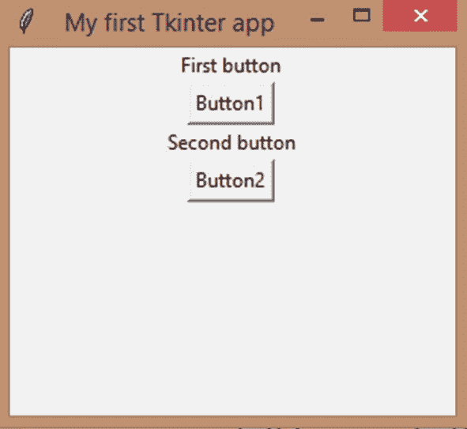

图 16-7

Pack()调整大小问题

但是如果我想让框架充满主窗口，那么我可以使用填充和扩展选项。先说“填”。这里我可以给三个值，X，Y，或者两个都给。

x 在水平方向填充主窗口，Y 在垂直方向填充主窗口，两者都填充了整个窗口小部件。三个都看看吧。

```py
frame1 = Frame(w, bg="black")
frame1.pack(fill=X)

```

我已经给了框架一个背景色，这样我们就可以单独看到框架了。

接下来，我将填充到 Y:

```py
frame1.pack(fill=Y)

```

最后我把它改成两个(图 [16-8](#Fig8) ):


图 16-8

带填充的框架

```py
frame1.pack(fill=BOTH)

```

填充在一定程度上起作用，但是当窗口调整大小时，它仍然不会扩展。这是因为 fill 只是让 Python 知道它想要填充给它的整个区域。如果我们两个都给，它将水平和垂直填充整个区域。

但是，如果我们希望它填充整个父对象，也就是说，在父对象扩展时扩展，那么我们需要“expand”选项。让它成真，看看神奇。

```py
frame1 = Frame(w, bg="black")
frame1.pack(fill=BOTH, expand=True)

```

让我们对 X 和 Y 做同样的尝试:

```py
frame1.pack(fill=X, expand=True)

```

最后，

```py
frame1.pack(fill=Y, expand=True)

```

现在，用不同的填充值运行程序，并调整窗口大小，得到这个结果(图 [16-9](#Fig9) )。

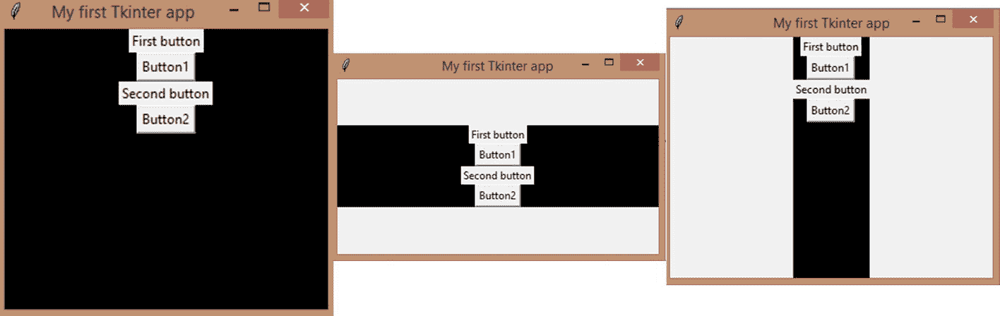

图 16-9

Tkinter 中的填充选项

很迷人，不是吗？

好了，现在我们知道了如何填充父窗口，但是这对我们的小部件有什么帮助呢？我们有四个，我希望第一个标签和按钮在第一行，第二个标签和按钮在第二行。我该怎么做？这就是“侧面”选项出现的原因。

让我先解释一下侧边选项是如何工作的。让我们创建两个小部件，并尝试用“side”的不同选项打包它们。

```py
label = Label(w, text='My Label')
label.pack(side=TOP)
button = Button(w, text='My Button')
button.pack(side=TOP)

```

我已经给了边作为顶部开始，这是默认的。您会注意到小部件一个接一个地被打包。

现在，将两者的值都更改为 LEFT。它会把所有东西并排放在一起。当你给 BOTTOM 的时候，它会从底部到顶部打包所有的东西，RIGHT 做的正好和 LEFT 相反。

当我们运行前面代码的四个变体时，我们得到以下四个输出(图 [16-10](#Fig10) )。

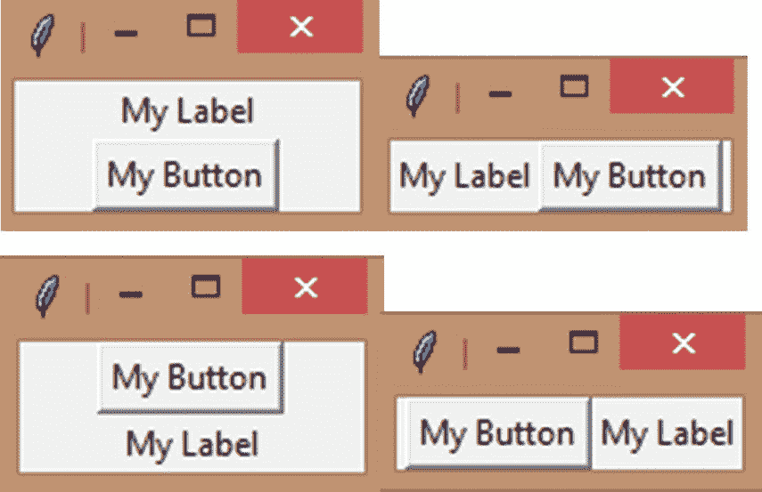

图 16-10

Tkinter 中的侧面选项

看看在第三个图像中，按钮是如何出现的，然后是标签。这就是 BOTTOM 的作用。它颠倒了顶部。同样，右是左的反义词。

看起来很棒，是的，但这似乎还不完整。这是因为您需要所有三个选项来按照您想要的方式正确对齐您的小部件。

所以现在，让我们结合所有的选项，创造一些看起来一致的东西。我将创建两个框架，每个框架都将被打包在顶部(一个接一个)，它们从两侧填充父窗口，expand 为 True。

类似地，我将在第一个框架下创建一个标签和一个按钮，并向左打包(并排)，但使它们包含整个父框架(fill 为 both，expand 为 True)。让我们对第二帧重复同样的操作。

现在，让我们看看我们得到了什么:

```py
frame1 = Frame(w, bg="black")
frame1.pack(side=TOP, fill=BOTH, expand=True)

label1 = Label(frame1, text='First button')
label1.pack(side=LEFT, fill=BOTH, expand=True)

button1 = Button(frame1, text="Button1")
button1.pack(side=LEFT, fill=BOTH, expand=True)

frame2 = Frame(w, bg="white")
frame2.pack(side=TOP, fill=BOTH, expand=True)

label2 = Label(frame2, text='Second button')
label2.pack(side=LEFT, fill=BOTH, expand=True)

button2 = Button(frame2, text="Button2")
button2.pack(side=LEFT, fill=BOTH, expand=True)

```

运行前面的代码，你会得到这个(图 [16-11](#Fig11) )。

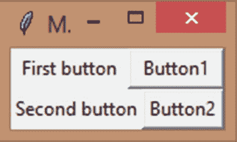

图 16-11

包装有序的标签和按钮

哇哦！这正是我第一次创建这些小部件时想要的放置方式。搞定了。

现在展开这个窗口，您会注意到小部件也随之展开。由于子部件完全包围了框架，您看不到它们的背景颜色，这意味着我们已经正确地完成了我们的工作！

## 大量输入

既然您已经知道了如何使用 pack()方法来正确地对齐小部件，那么让我们回到快速查看更多小部件。Tkinter 提供了大量从用户那里获取输入的小工具。

## 一行文本

通过使用 Entry()方法，可以从用户那里获得单行文本输入。

```py
entry = Entry().pack()

```

运行前面的代码，你会得到这个(图 [16-12](#Fig12) )。

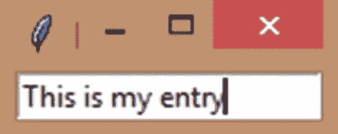

图 16-12

入口小部件

看那个！我现在可以给出单行条目。

此外，除了 fg、bg 和 width 等常见属性之外，您的入口小部件还具有可用于操作入口的方法。

为什么我们不看看怎么做呢？我们可以使用 get()方法来检索我们在条目中键入的内容，并且我们可以按照自己的意愿使用它。

现在，让我们创建一个标签“name”和一个输入框，最后创建一个按钮“Enter”。当用户单击按钮时，它调用 greet()函数，该函数从输入框中“获取”输入并打印出“Hello”消息。够简单吗？我们试试吧！

```py
def greet():
    name = entry.get()
    print('Hello {}'.format(name))

label = Label(w,text='Your name?')
label.pack(side=LEFT)
entry = tkinter.Entry(w)
entry.pack(side=LEFT)
button = Button(w,text='Enter',command=greet)
button.pack(side=LEFT)

```

让我们运行一切，我们会得到这个(图 [16-13](#Fig13) )。

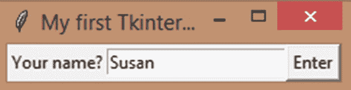

图 16-13

带有条目的名称框

现在，当我按 Enter 键并查看 Shell 时，我得到了这个:

```py
= RESTART: C:\Users\aarthi\AppData\Local\Programs\Python\Python38-32\tkPrograms.py
Hello Susan

```

耶！

另外，delete()方法可以删除文本，insert()方法可以在任意位置插入文本。

我们先来看看 insert。语法非常简单。

```py
entry.insert(pos, ‘text’)

```

所以，只要给出你想要插入文本的位置。第一个位置是 0，从那里开始增加，就像你的弦一样。第二个参数是要插入的直接文本或包含文本的变量。

你想看看这是怎么工作的吗？让我们修改我们的程序。现在，当用户输入他们的名字时，他们必须点击“插入你好”按钮，当点击时，就会在他们的名字前插入你好和一个空格。

```py
def insert():
    entry.insert(0,'Hello ')

label = Label(w,text='Your name?')
label.pack(side=LEFT)
entry = tkinter.Entry(w)
entry.pack(side=LEFT)

button = Button(w,text='Insert Hello',command=insert)
button.pack(side=LEFT)

```

让我们运行程序(图 [16-14](#Fig14) )。

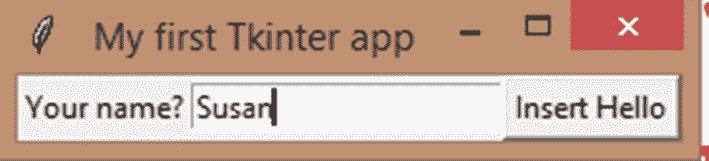

图 16-14

插入到输入框中

当我们点击按钮时，我们得到这个(图 [16-15](#Fig15) )。

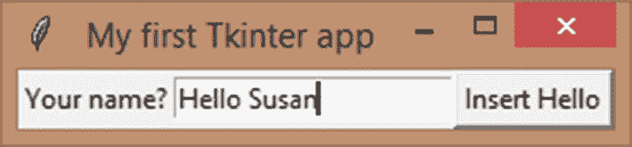

图 16-15

插入的

哇哦！

同样，你可以删除。如果你只给出一个参数，它会删除那个字符。0 删除第一个字符，1 删除第二个字符，依此类推。

但是，如果你给一个范围，它会删除一个字符范围。

通常，不考虑范围内的最后一个数字。例如，范围 0，4 删除索引 0 到 3 中的字符(不包括 4)。

但是如果你想删除一切，那么就把 END 作为你的最后一个论点，就大功告成了。我们试试好吗？

```py
def insert():
    entry.delete(0,END)

label = Label(w,text='Your name?')
label.pack(side=LEFT)
entry = tkinter.Entry(w)
entry.pack(side=LEFT)

button = Button(w,text='Clear',command=insert)
button.pack(side=LEFT)

```

当我运行程序时，我得到这个(图 [16-16](#Fig16) )。

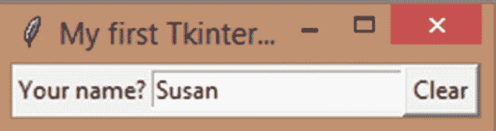

图 16-16

从输入框中删除

我已经输入了 Susan，当我按下清除按钮时，我得到了这个(图 [16-17](#Fig17) )。

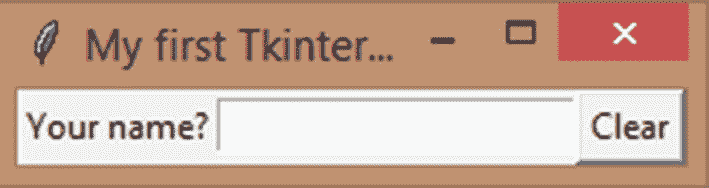

图 16-17

输入框已清除

一笔勾销！

## 一行又一行

现在，让我们看看如何输入和操作多行文本！您可以使用 Text()方法来做到这一点。

```py
text_box = Text()
text_box.pack()

```

运行这个，你会得到一个大的文本框，当你在其中输入几行代码时，它会是这样的(图 [16-18](#Fig18) )。

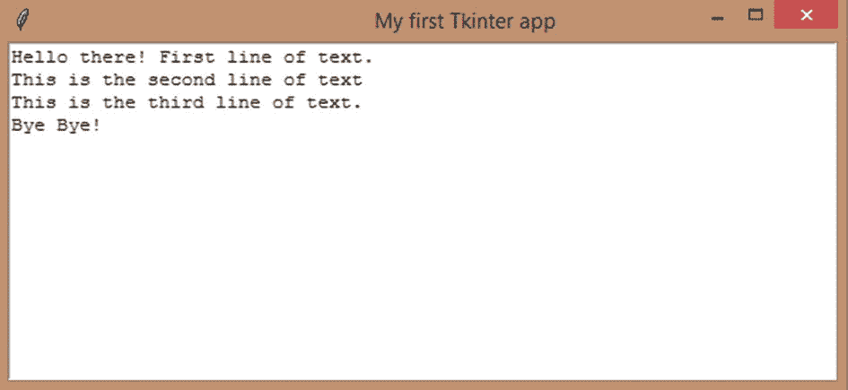

图 16-18

文本框

您可以使用 get()方法从该文本框中检索文本，但是您需要指定行号和范围中的字符数。

“1.0”将只检索第一行的第一个字符。

“1.0”，“1.9”将检索第一行中的第一个字符到第九个字符。

“2.0”、“2.5”将从第二行的第一个字符到第五个字符进行检索，以此类推。

“1.0”，“2.10”会一直检索到第二行的第十个字符，所以可以这样跨多行。

要获得整个文本，只需给出“1.0”，结束。

你现在明白这是怎么回事了吗？让我们尝试检索整段文本。

```py
text_box = Text(w)
text_box.pack()

def get_text():
    t = text_box.get(1.0,END)
    print(t)

button = Button(w,text="Get data",command=get_text)
button.pack()

```

让我们再次运行程序，键入相同的文本，看看我们会得到什么(图 [16-19](#Fig19) )。

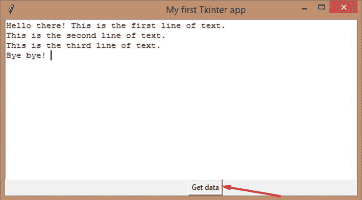

图 16-19

从文本框中获取数据

现在我们有一个大的文本框，在末尾有一个小按钮，因为我们就是这样包装的。让我们点击按钮，我们得到这个:

```py
>>>
= RESTART: C:\Users\aarthi\AppData\Local\Programs\Python\Python38-32\tkPrograms.py
Hello there! This is the first line of text.
This is the second line of text.
This is the third line of text.
Bye bye!

```

有效！

同样，您可以在文本框中插入文本。

```py
text_box.insert(1.0,"Welcome! ")

```

前面的代码将插入“欢迎！”在第一行的开头加一个空格。文本、复选框、条目、单选按钮、菜单按钮、复选按钮、列表框。

要在文本末尾插入内容，请使用 end 作为第一个参数，但是如果您希望文本在新的一行中，请在第二个参数的开头添加\n(换行符)，如下所示:

```py
text_box.insert(END,"\nYou're great!")

```

要删除整段文本，请执行以下操作:

```py
text_box.delete("1.0",END)

```

您可以使用与 get()相同的格式来删除文本片段。

这是对文本框的快速浏览。现在，进入下一个部件！

## ***Tkinter*****变量**

 **但在此之前，我想先谈谈变量。还记得我们如何直接输入文本，而不使用变量吗？那不是很有活力。如果我想根据应用/游戏中发生的事情更改标签文本或按钮文本，该怎么办？我需要一个变量。这就是 *Tkinter* 可变类的用武之地。它们的工作原理和我们的正常变量非常相似。

您可以创建五种变量:整型、字符串型、布尔型和双精度型(浮点型)。

```py
num = IntVar()
string = StringVar()
b = BooleanVar()
dbl = DoubleVar()

```

将它们赋给一个实际变量，使该变量成为一个*t inter*变量。另外，确保语法的大写和小写保持不变。

既然有了变量，就可以使用“set”方法给它们赋值了。如果你给一个变量赋了一个错误的值，你会得到一个错误。所以，只有一个整型变量，以此类推。

要取回变量值，请使用 get()方法。所以，让我们把两者结合起来，看看我们会得到什么。

```py
num.set(100)
string.set("Hello there!")
b.set(True)
dbl.set(150.14)

print(num.get())
print(string.get())
print(b.get())
print(dbl.get())

```

运行前面的代码，您将得到这样的结果:

```py
= RESTART: C:\Users\aarthi\AppData\Local\Programs\Python\Python38-32\tkPrograms.py
100
Hello there!
True
150.14

```

但这仍然不是动态的，对吗？我们可以将动态变量设置为我们的*t inter*变量吗？答案是肯定的！

只需获取一个输入，将其放入一个变量中，并将其设置为您的字符串(或任何类型)。就这样。

```py
i = input('Enter a string: ')
string.set(i)
print(string.get())

```

运行前面的代码，您将得到这样的结果:

```py
= RESTART: C:\Users\aarthi\AppData\Local\Programs\Python\Python38-32\tkPrograms.py
Enter a string: Hello there!
Hello there!

```

所以现在，我们可以动态设置标签文本。

```py
i = input('Label text: ')
string = StringVar()
string.set(i)
label = Label(w, text=string.get())
label.pack()

```

运行前面的代码，您将得到这样的结果:

```py
= RESTART: C:\Users\aarthi\AppData\Local\Programs\Python\Python38-32\tkPrograms.py
Label text: Hello there!

```

输入完毕后按回车键，你将得到(图 [16-20](#Fig20) ):

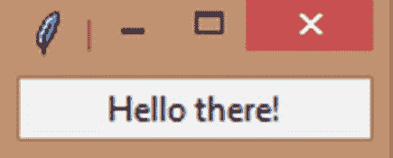

图 16-20

字符串变量

耶！我们的第一个动态标签！

## 很多选择！

如果你想给你的用户选择，那么复选框和单选按钮是正确的选择，你不这样认为吗？Tkinter 也有这些小工具！

您可以使用 Checkbutton(小“b”)小部件创建一个复选框。

它的工作方式类似于其他小部件，除了您可以给出 onvalue 和 offvalue 来指定当 check 按钮被单击或不被单击时的“值”。

但是获得复选按钮状态的一个更简单的方法是将一个 *Tkinter* 整数变量赋给它的“variable”属性，每当复选框被选中时，变量的值就变为 1，当它未被选中时，变量的值就变为 0。

我们将创建两个复选框，所以让我们创建两个整数变量来存储它们的“状态”(无论它们是否被选中)。

```py
c1 = IntVar()
c2 = IntVar()

```

让我们创建一个标签“杂货清单”并打包。

```py
Label(w,text='Grocery list').pack()

```

现在是我们的复选框。唯一的区别是我们的“变量”属性被赋予了整型变量。

```py
Label(w,text='Grocery list').pack()
check1 = Checkbutton(w,text="Milk",variable = c1)
check1.pack(side=LEFT)
check2 = Checkbutton(w,text="Flour",variable = c2)
check2.pack(side=LEFT)

```

现在，我们如何检索这些值呢？我们需要一个按钮，单击它将调用 check()函数来检查哪些框被单击了。

```py
def check():
    if(c1.get() == 1):
        print('We bought Milk.')
    if(c2.get() == 1):
        print('We bought flour.')

button = Button(w,text='Check',command=check)
button.pack()

```

简单！让我们运行程序，我们得到这个(图 [16-21](#Fig21) )。

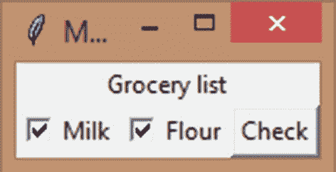

图 16-21

检验盒

按下“检查”按钮，你会得到这个:

```py
= RESTART: C:\Users\aarthi\AppData\Local\Programs\Python\Python38-32\tkPrograms.py
We bought Milk.
We bought flour.

```

对于单选按钮，我们只需要一个变量，因为我们只是选择其中一个选项。它有一个“value”属性，当设置了一个整数值时，它将把相同的值赋给你赋给“variable”属性的变量。

您也可以在单选按钮中添加一个“命令”。

让我们创建一个程序，询问用户是否喜欢狗，并根据他们的选择打印一条消息！

对于本例，我将直接从单选按钮发出命令，所以让我们先创建“check”函数。

我们将创建一个字符串，用来保存人们点击复选框后需要显示的消息。现在，我们将在我们的单选按钮中设置两个值，1 表示这个人喜欢狗，2 表示这个人不喜欢狗。

一旦我们设置了字符串，创建标签。

```py
def check():
    string = StringVar()
    if var.get() == 1:
        string.set('You love dogs! :)')
    else:
        string.set("You don't love dogs :(")

    label = Label(w,text=string.get())
    label.pack()

```

现在，让我们创建一个整数变量来保存单选按钮的值。接下来是一个询问他们是否爱狗的标签。

```py
var = IntVar()
Label(w,text='Do you love dogs?').pack()

```

最后，单选按钮包含相关的文本、分配给它们的变量“var”、每个值和一个命令，如果按钮被选中，该命令将调用“check”函数。

```py
radio1 = Radiobutton(w,text="Yes!",variable = var, value=1, command=check)
radio1.pack()
radio2 = Radiobutton(w,text="Nope",variable = var, value=2, command=check)
radio2.pack()

```

就这样！

运行程序，你会得到这个(图 [16-22](#Fig22) )。

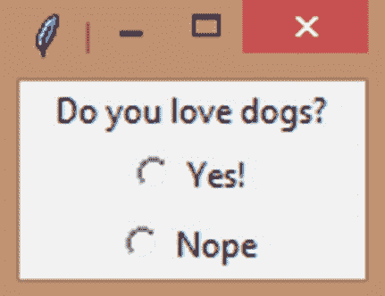

图 16-22

单选按钮

选择一个选项(图 [16-23](#Fig23) ):

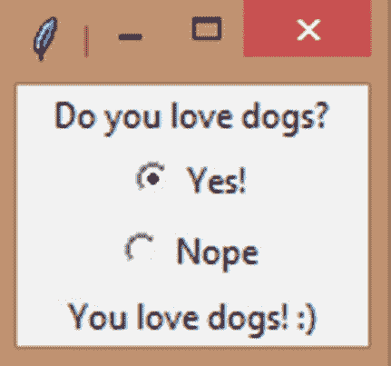

图 16-23

选择了单选按钮

完美！

## 菜单

使用 *Tkinter* ，您可以创建像您在应用中看到的菜单！您可以使用 Menu()方法来创建它们。

您可以创建一个主菜单，并将其配置到窗口的顶部，并且可以添加任意数量的子菜单。

让我创建一个主菜单“main”。

```py
from tkinter import *
w = Tk()

main = Menu(w)

```

让我们在主菜单中添加一个子菜单。我会叫它文件菜单。

```py
fileMenu = Menu(main)

```

现在，我将使用 add_cascade()方法向我的第一个子菜单添加一个标签，并将其放在 main 中。

```py
main.add_cascade(label='File',menu = fileMenu)

```

现在，让我们添加项目到我们的主菜单。

```py
fileMenu.add_command(label='New File', command=lambda: print('New File clicked'))
fileMenu.add_command(label='Open', command=lambda: print('Open clicked'))

```

如您所见，我们可以像处理按钮一样给这些项目附加一个命令。

如果你现在运行这个程序，你将什么也看不见。这是因为一旦您创建了所有的菜单、子菜单和项目，您就需要将主菜单配置到窗口(就像您打包小部件一样)中，以便显示它。

使用 config()方法可以做到这一点。

```py
w.config(menu=main)

```

现在，运行您的程序，您将能够看到您的菜单(图 [16-24](#Fig24) )。

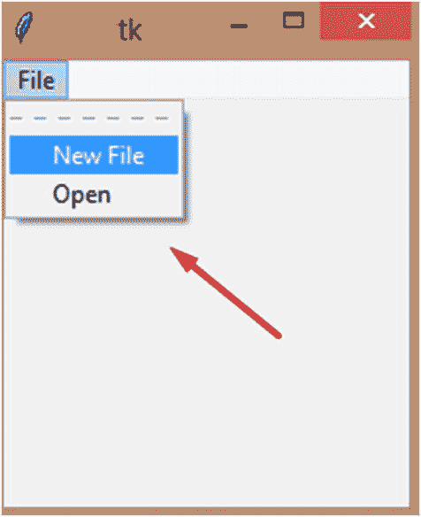

图 16-24

菜单

单击“新建文件”菜单项，您将看到以下内容:

```py
>>> New File clicked

```

我得到了我期望的消息。完美！

## 完美的布局——网格

我认为包装几何管理器在功能上有一点点限制。你不也这样认为吗？

这就是为什么 *Tkinter* 有**网格**几何管理器，这是联赛除了包管理器。您可以根据行和列完美地对齐您的小部件。

行和列的排列如下图所示(图 [16-25](#Fig25) )。小部件将被放置在单元格内，每个单元格都有一个从 0 开始的行号和列号。您可以将单元格扩展到任意数量。

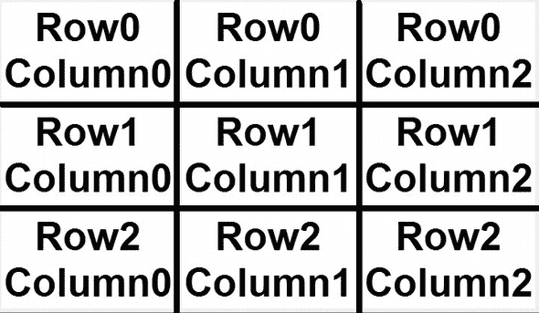

图 16-25

网格中的行和列

你可以提到部件的具体行和列，以及你希望它粘在哪里。

sticky 有多个值:E 代表东，W 代表西，N 代表北，S 代表南，NE 代表东北，NW 代表西北，SE 代表东南，SW 代表西南。

如果你给一个小部件一个“E ”,它将(通常是文本)粘在栏的最右边，以此类推。

如图所示，行和列从 0 开始。您可以使用 padx 和 pady 来填充小部件，这样它们就不会粘在一起。

所以，让我们把所有的放在一起排列一堆标签，好吗？

```py
from tkinter import *
w = Tk()
w.title('My first Tkinter app')

#first row, first column, east sticky
label1 = Label(w,text='Label1')
label1.grid(row=0,column=0,sticky='E',padx=5,pady=5)

#first row, 2nd column, east sticky
label2 = Label(w,text='Label2')
label2.grid(row=0,column=1,sticky='E',padx=5,pady=5)

#first row, 4th column, west sticky
button1 = Button(w,text='Button1')
button1.grid(row=0,column=2,sticky='W',padx=5,pady=5)

#second row, first column, east sticky
label3 = Label(w,text='Label3')
label3.grid(row=1,column=0,sticky='E',padx=5,pady=5)

#first row, 2nd column, east sticky
label4 = Label(w,text='Label4')
label4.grid(row=1,column=1,sticky='E',padx=5,pady=5)

#second row, 4th column, west sticky
button2 = Button(w,text='Button2')
button2.grid(row=1,column=2,sticky='W',padx=5,pady=5)
w.mainloop()

```

运行程序，你会得到这个(图 [16-26](#Fig26) )。

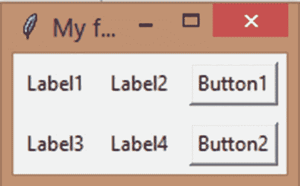

图 16-26

以网格形式排列的小部件

太美了！

## 迷你项目-小费计算器应用

让我们把到目前为止学到的所有东西放在一起，用 *Tkinter* 创建一个小费计算器，好吗？

这是我们需要的:

1.  两个输入框用于输入账单金额(浮点)和小费金额。

2.  接下来，我们需要一个按钮来获取这些值并调用 tip_calculator()函数。

3.  这个函数将计算我们的小费，并在屏幕底部的标签中显示结果。

够简单吗？我们开始吧！

1.  让我们先设置一下 *Tkinter* 。

    ```py
    from tkinter import *
    w = Tk()
    w.title('My first Tkinter app')

    ```

2.  然后，让我们看看账单(一个标签和一个条目，在屏幕上正确排列)。

    ```py
    #Get the bill amount
    bill_label = Label(w,text='What was your bill? ')
    bill_label.grid(row=0,column=0,sticky="W",padx=5,pady=5)
    bill = Entry(w)
    bill.grid(row=0,column=1,sticky="E",padx=5,pady=5)
    Next, let’s create the label and entry widgets to get the tip.
    #Get the tip
    tip_label = Label(w,text='What did you tip? ')
    tip_label.grid(row=1,column=0,sticky="W",padx=5,pady=5)
    tip = Entry(w)
    tip.grid(row=1,column=1,sticky="E",padx=5,pady=5)

    ```

3.  在创建按钮之前，我们需要定义 tip_calculator 函数。它将从 tip 和 bill 中获取条目值，并将这些值转换为整数(条目通常是字符串)。接下来，我们要计算小费的百分比。

    ```py
    #Tip calculator function
    def tip_calculator():
        t = tip.get()
        t = int(t)
        b = bill.get()
        b = int(b)
        percent = (t * 100) / b
        percent = int(percent)

    ```

4.  让我们根据“percent”的值格式化一个适当的字符串。

    ```py
    if((percent >= 10) and (percent <= 15)):
        string = '{}%. You tipped Okay!'.format(percent)
    elif((percent >= 15) and (percent <= 20)):
        string = '{}%. That was a good tip!'.format(percent)
    elif(percent >= 20):
        string = '{}%. Wow, great tip! :)'.format(percent)
    else:
        string = "{}%. You didn't tip enough :(".format(percent)

    ```

5.  最后，让我们创建一个 *Tkinter* 字符串变量，并在其中设置格式化字符串，然后用该文本创建一个标签，并将其放在屏幕上。

    ```py
    str_var = StringVar()
    str_var.set(string)
    label = Label(w, text=str_var.get())
    label.grid(row=3,column=0,padx=5,pady=5)

    ```

6.  最后，让我们创建一个按钮，让它在被点击时调用函数。

    ```py
    #Enter button
    button = Button(w,text='Enter',command=tip_calculator)
    button.grid(row=2,column=0,sticky="E",padx=5,pady=5)
    w.mainloop()

    ```

让我们运行程序，我们会得到这个(图 [16-27](#Fig27) )。

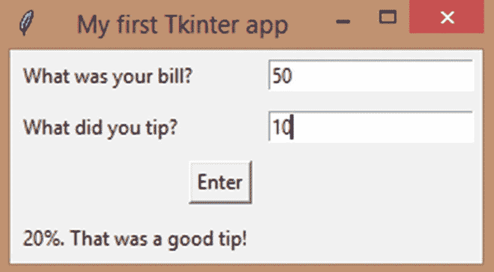

图 16-27

小费计算器应用

我们的应用运行完美！你可以通过添加颜色和字体来进一步美化它。

## 摘要

在本章中，我们看了如何使用 *Tkinter* 包在 Python 中创建桌面应用。我们学习了如何创建不同的小部件，包括按钮、标签、复选框、单选按钮和菜单。我们还学习了框架。然后，我们学习了如何设计小部件的样式，以及当小部件被点击时如何执行命令。最后，我们学习了如何使用 pack()和 grid()几何方法在屏幕上组织小部件。

在下一章，让我们学习当点击、鼠标点击和键盘按下等事件在我们的小部件上发生时执行功能。**