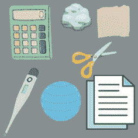
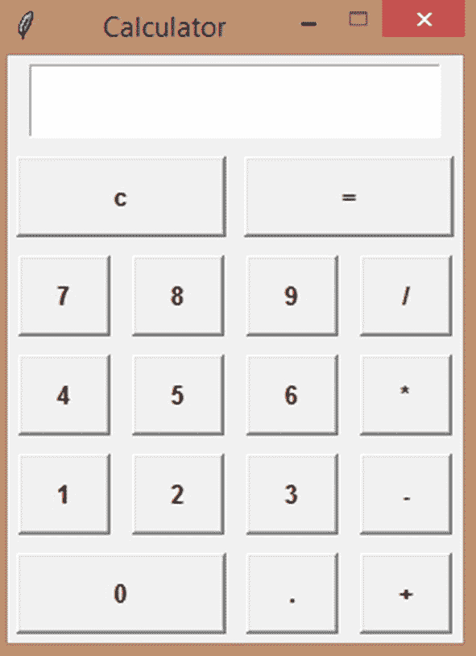
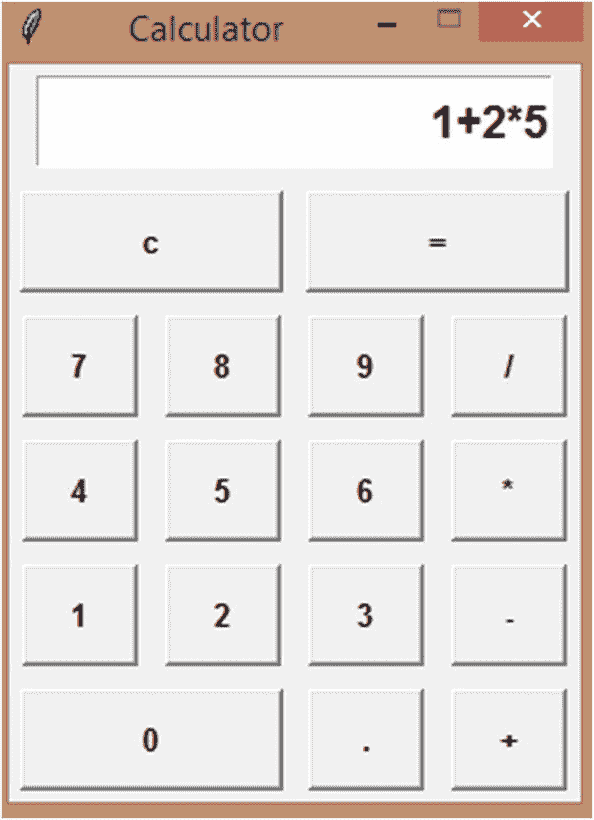
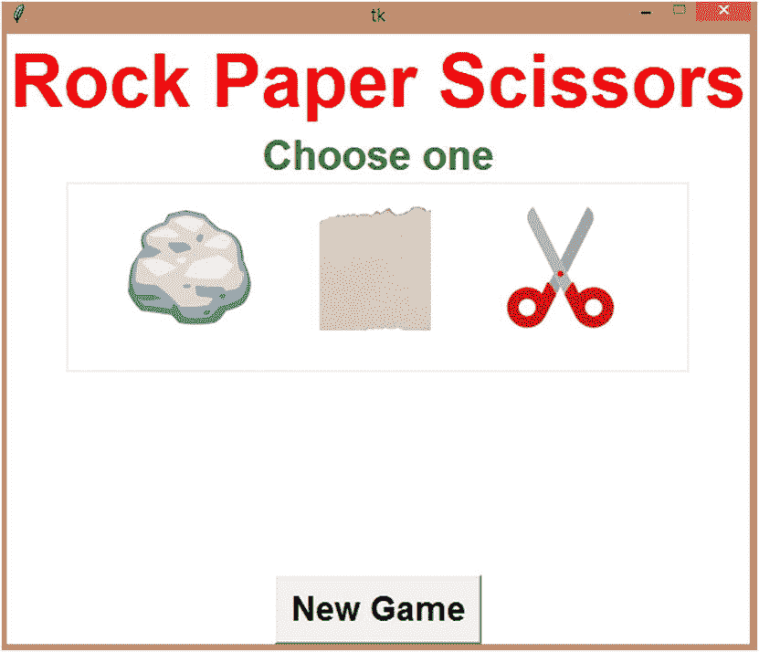
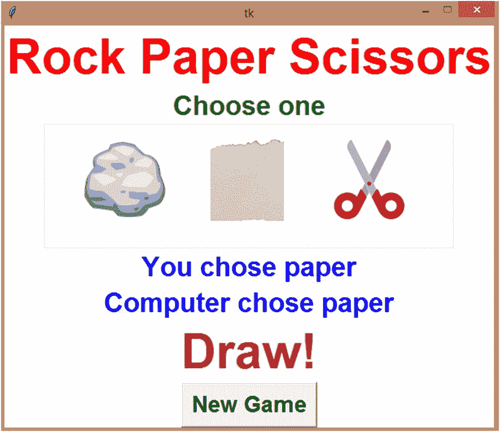
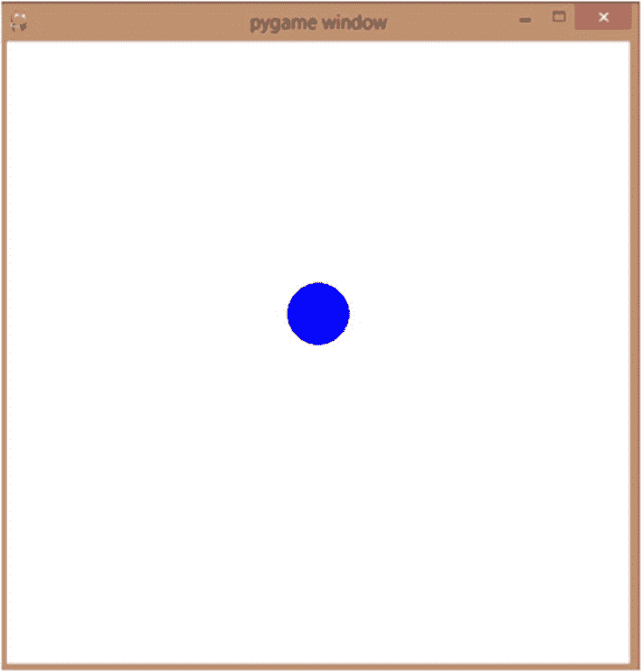
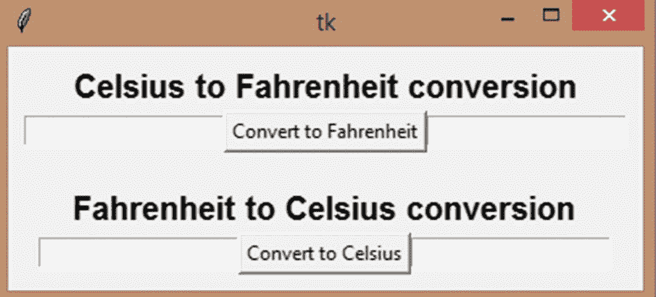
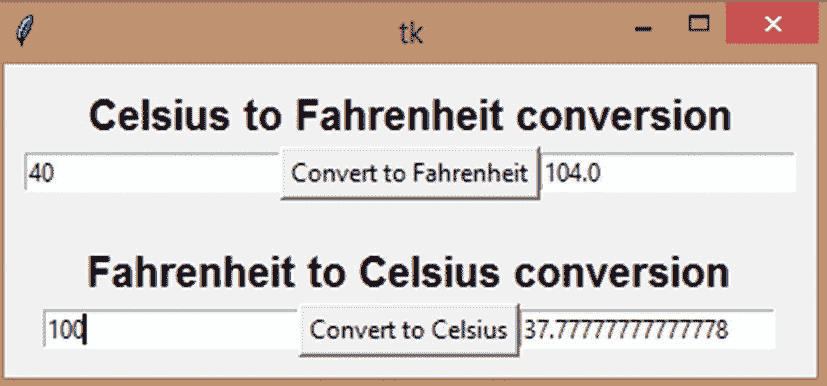
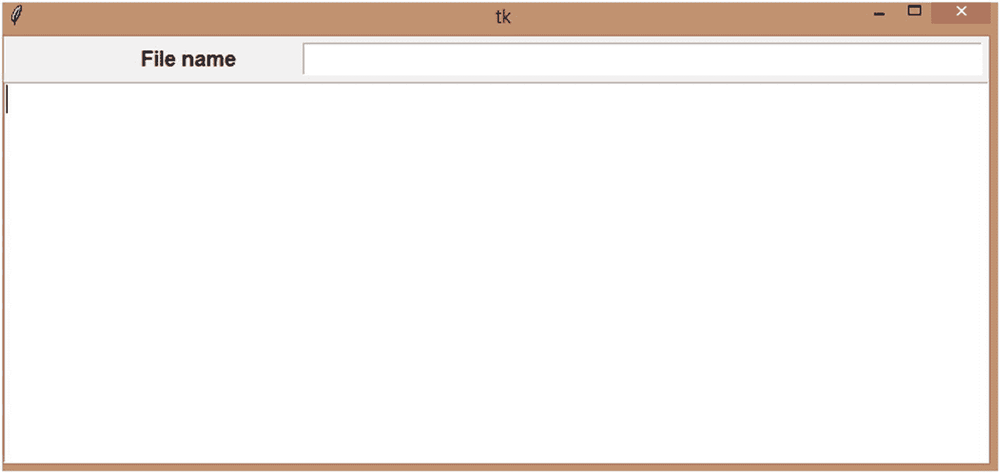
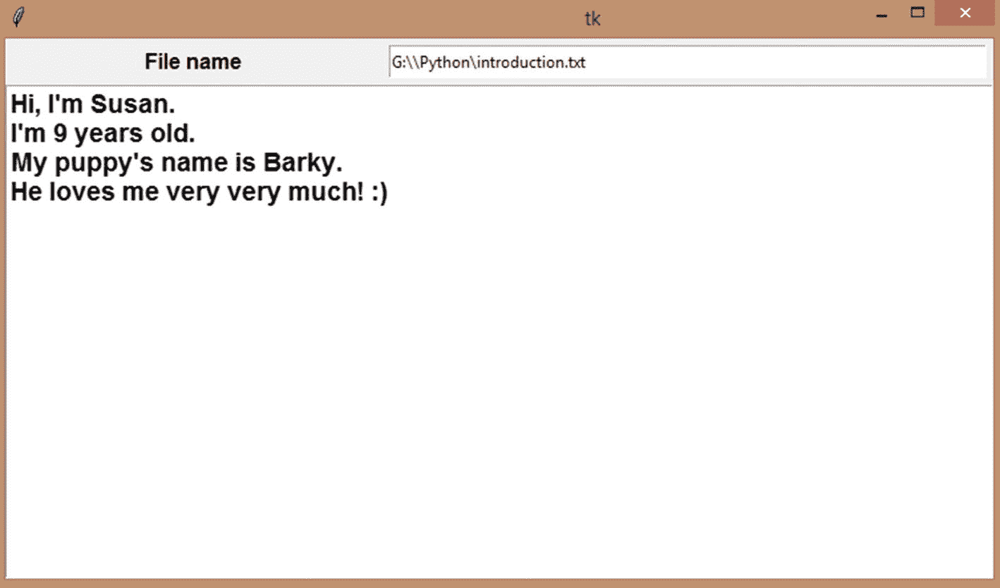

# 二十三、更多迷你项目

在前一章中，我们学习了使用 Python 进行 web 开发。我们简要了解了 HTML、CSS 和 JavaScript，并用 *Flask* 创建了您的第一个程序。在这一章中，让我们用你在这本书中学到的 Python 概念创建更多的迷你项目。

## 项目 23-1:带*t inter*的计算器



在这个项目中，我们将创建一个计算器应用，就像你在电脑和手机上看到的带有 *Tkinter* 的那个。我们开始吧！

1.  让我们先导入 *Tkinter* 并创建我们的窗口。我将把 resizable 选项设置为 0 和 0，这样窗口就不能调整大小了。我还打算把标题设为‘计算器’。

1.  现在，我将创建一个字符串变量( *Tkinter* 变量)来保存我们的表达式(需要计算)。我还创建了一个空字符串，最初用来存放表达式。我们稍后将使用“字符串”中的值设置 *Tkinter* 变量。现在，我们让它成为一个字符串，而不是整数或浮点数，因为我们可以使用 Python 中的 eval()方法来计算数学表达式，表达式可以是字符串的形式。

```py
from tkinter import *
w = Tk()
w.resizable(0,0) #cant resize
w.title('Calculator')

```

1.  现在，让我们创建我们的按钮。

```py
e = StringVar()
calc = ''

```

首先，我将创建一个“进入”按钮。它将保存“e”，我们的 *Tkinter* 变量，让我们将文本对齐到“右”,并在顶部填充足够的外部填充(padx，pady)和内部填充高度(ipady)。

1.  接下来，让我们创建一个框架，“按钮”，这将举行我们所有的按钮。我们也打包吧。

```py
entry = Entry(w,font=('Arial',14,'bold'),textvariable = e, justify= RIGHT)
entry.pack(side=TOP, ipady = 7, padx = 5, pady = 5)

```

1.  现在，让我们开始创建所有的按钮。它们的宽度为 13，高度为 2，我们将为 clear 按钮调用 clear_entry()方法，当单击“答案”或“等于”按钮时调用 get_answer()方法，或者调用 button_click()方法，将数字或运算符添加到表达式中。

```py
buttons = Frame(w)
buttons.pack()

```

1.  Now that we’ve created our buttons, we should have something like Figure [23-1](#Fig1).

    

    图 23-1

    计算器应用–布局

2.  现在，让我们在函数调用(小部件)上方创建按钮。首先，button_click 方法。让我们加载我们的全局“calc”变量，并将所点击的数字或操作符(记住，我们是以字符串的形式发送的)与“calc”的当前值连接起来。就这样！

```py
clear = Button(buttons,text='c',width=13,height=2,font=('Arial',10,'bold'), command=lambda:clear_entry())
clear.grid(row=0,column=0,padx=5,pady=5,columnspan=2)

answer = Button(buttons,text='=',width=13,height=2,font=('Arial',10,'bold'), command=lambda:get_answer())
answer.grid(row=0,column=2,padx=5,pady=5,columnspan=2)

num7 = Button(buttons,text='7', width=5, height = 2, font=('Arial',10,'bold'), command=lambda:button_click('7'))
num7.grid(row=1,column=0,padx=5,pady=5)

num8 = Button(buttons,text='8', width=5, height = 2, font=('Arial',10,'bold'), command=lambda:button_click('8'))
num8.grid(row=1,column=1,padx=5,pady=5)

num9 = Button(buttons,text='9', width=5, height = 2, font=('Arial',10,'bold'), command=lambda:button_click('9'))
num9.grid(row=1,column=2,padx=5,pady=5)

num_div = Button(buttons,text='/', width=5, height = 2, font=('Arial',10,'bold'), command=lambda:button_click('/'))
num_div.grid(row=1,column=3,padx=5,pady=5)

num4 = Button(buttons,text='4', width=5, height = 2, font=('Arial',10,'bold'), command=lambda:button_click('4'))

num4.grid(row=2,column=0,padx=5,pady=5)
num5 = Button(buttons,text='5', width=5, height = 2, font=('Arial',10,'bold'), command=lambda:button_click('5'))
num5.grid(row=2,column=1,padx=5,pady=5)

num6 = Button(buttons,text='6', width=5, height = 2, font=('Arial',10,'bold'), command=lambda:button_click('6'))
num6.grid(row=2,column=2,padx=5,pady=5)

num_mul = Button(buttons,text='*', width=5, height = 2, font=('Arial',10,'bold'), command=lambda:button_click('*'))
num_mul.grid(row=2,column=3,padx=5,pady=5)

num1 = Button(buttons,text='1', width=5, height = 2, font=('Arial',10,'bold'), command=lambda:button_click('1'))
num1.grid(row=3,column=0,padx=5,pady=5)

num2 = Button(buttons,text='2', width=5, height = 2, font=('Arial',10,'bold'), command=lambda:button_click('2'))
num2.grid(row=3,column=1,padx=5,pady=5)

num3 = Button(buttons,text='3', width=5, height = 2, font=('Arial',10,'bold'), command=lambda:button_click('3'))
num3.grid(row=3,column=2,padx=5,pady=5)

num_sub = Button(buttons,text='-', width=5, height = 2, font=('Arial',10,'bold'), command=lambda:button_click('-'))
num_sub.grid(row=3,column=3,padx=5,pady=5)

num0 = Button(buttons,text='0', width = 13, height = 2, font=('Arial',10,'bold'), command=lambda:button_click('0'))
num0.grid(row=4,column=0,padx=5,pady=5,columnspan=2)

num_dot = Button(buttons,text='.', width=5, height = 2, font=('Arial',10,'bold'), command=lambda:button_click('.'))
num_dot.grid(row=4,column=2,padx=5,pady=5)

num_add = Button(buttons,text='+', width=5, height = 2, font=('Arial',10,'bold'), command=lambda:button_click('+'))
num_add.grid(row=4,column=3,padx=5,pady=5)

```

1.  最后，用 calc 的当前值设置 *Tkinter* 变量。这将使表达式出现在应用的输入框中。

```py
def button_click(n):
    global calc
    calc = calc + n

```

1.  接下来，对于 clear_entry 方法，我们将再次使“calc”成为空字符串，并将“e”设置为该字符串。

```py
e.set(calc)

```

1.  对于 get_answer 方法，让我们导入“calc ”,创建一个变量“ans ”,该变量将使用 eval()方法计算“calc”中的表达式，并将答案设置为“e ”,因此表达式将替换为答案。

```py
def clear_entry():
    global calc
    calc = ''
    e.set(calc)

```

1.  最后，让我们将“ans”转换为一个字符串(计算后它将是一个整数或浮点值),并用答案替换“calc”中的表达式，这样我们就可以继续计算。

```py
def get_answer():
    global calc
    ans = eval(calc)
    e.set(ans)

```

```py
calc = str(ans)

```

运行程序，你会得到这个(图 [23-2](#Fig2) )。



图 23-2

最终计算器应用

就这样！一个非常简单的计算器。事实上，你可以做很多事情来改善这种情况。也许添加一些颜色，解决一些问题，或者添加更多的功能。例如，到现在为止，你可以一个接一个地点击两个操作符，这会给你一个错误。你为什么不创造一个“如果”条件来防止这种情况发生呢？

玩得开心！

## 项目 23-2:随机故事生成器

在这个项目中，让我们创建一个简单的随机故事生成器。我们将有一堆选项，关于我们的故事“何时”发生，我们的“角色”是谁，我们的“敌人”是谁，我们角色的“属性”是什么，以及代词(他或她或它)。最后，我们要写一个从这些选项中选择的故事，每次我们创建一个新的故事，我们都会得到全新的角色、事件和时间线。够有趣吗？我们开始吧！

1.  让我们先导入我们的随机模块。

1.  然后，我将创建我的选项。

    ```py
    when_ch = ['Once upon a time,','A long time ago,','Thousands of years ago,','Long long ago,']
    character_ch = ['dragon','unicorn','fairy','elf']
    pronouns_ch = ['he','she','it']
    attributes_ch = ['brave','courageous','strong','smart','intelligent']
    enemy_ch = ['witches','warlocks','dark elves']
    saved_ch = ['the world', 'the Kingdom', 'everyone', 'the village']

    ```

2.  最后，让我们定义一个 generate_story()函数，它加载我们在。然后，让我们使用 random 模块中的 choice()方法为这个特定的故事选择我们的选项。

    ```py
    def generate_story():
        global when_ch,character_ch,pronouns_ch,attributes_ch,enem_chy,saved_ch
        when = random.choice(when_ch)
        character = random.choice(character_ch)
        pronouns = random.choice(pronouns_ch)
        attributes = random.choice(attributes_ch)
        enemy = random.choice(enemy_ch)
        saved = random.choice(saved_ch)

    ```

3.  此外，如果我们的角色是一个精灵，我们需要用“an”和“a”来称呼其余的角色。

    ```py
    if character == 'elf':
        a = 'an'
    else:
        a = 'a'

    ```

4.  最后，让我们用多弦创造我们的故事。

    ```py
    story = '''{} there lived {} {}. {} was very {}. {} fought against the {} and saved {}'. '''.format(when,a,character,pronouns.capitalize(),attributes,pronouns.capitalize(),enemy,saved)

    ```

5.  现在，让我们把它打印出来。

```py
import random

```

1.  现在，对于函数调用，我将创建一个无限 while 循环，询问用户是否要创建一个新的故事。如果他们输入了“Y”或“Y ”,那么让我们调用 generate_story 函数。否则，让我们停止程序。

    ```py
    while True:
        create = input('Shall we create a new story? Y or N: ')
        if create == 'Y' or create == 'y':
            generate_story()
        else:
            break

    ```

```py
print(story)

```

很简单，对吧？为什么我们现在不生成一堆故事呢？

```py
= RESTART: C:\Users\aarthi\AppData\Local\Programs\Python\Python38-32\story_generator.py
Shall we create a new story? Y or N: Y
Thousands of years ago, there lived a unicorn. She was very strong. She fought against the dark elves and saved the world'.

Shall we create a new story? Y or N: Y
Thousands of years ago, there lived a dragon. She was very intelligent. She fought against the witches and saved the world'.

Shall we create a new story? Y or N: Y
Once upon a time, there lived an elf. It was very smart. It fought against the dark elves and saved the Kingdom'.

Shall we create a new story? Y or N: N

```

很好！虽然很简单。我相信你可以添加更多的选项，让这些故事更大或更随机。玩得开心！

## 项目 23-3:石头剪刀布游戏

让我们为这个项目创建一个石头剪子布游戏！

1.  让我们先导入 *Tkinter* 和随机包。

    ```py
    #Rock, paper, scissors
    from tkinter import *
    import random

    ```

2.  现在，让我们创建我们的窗口，将其背景颜色配置为白色，并使其不可调整大小。

    ```py
    w = Tk()
    w.configure(bg='white')
    w.resizable(0,0)

    ```

3.  首先，我们需要一个包含标题的标签。

    ```py
    title = Label(w,text='Rock Paper Scissors', fg="red", bg="white",font=('Arial',45,'bold'))
    title.pack()

    ```

4.  让我们也创建一个 u_option 变量，它现在是空的，但是以后会保存用户的选项。

1.  让我们用这三个选项创建一个列表。

```py
u_option = ''

```

1.  现在，让我们创建其余的小部件。我们需要另一个标签，上面写着“选择一个”。

    ```py
    label = Label(w,text='Choose one', fg="green", bg="white",font=('Arial',25,'bold'))
    label.pack()

    ```

2.  在那下面，我们需要一块画布来放置石头、纸和剪刀。让我们这样做，当用户悬停在画布上时，光标变成一只“手”。

    ```py
    canvas = Canvas(w,width=500,height=150,background='white')
    canvas.pack()
    canvas.config(cursor='hand2')

    ```

3.  接下来，让我们使用 PhotoImage 方法加载我们的图像。你可以使用任何你想要的图像。我用了石头、纸和剪刀的插图。

```py
options = ['rock','paper','scissors']

```

1.  接下来，让我们将图像绘制到画布中，在我们想要的 X，Y 坐标位置。

```py
img1 = PhotoImage(file="rock.png")

```

1.  然后，让我们在该图像上创建一个 tag_bind。对于画布项目，我们需要 tag_bind，而不是 bind。我们的将是一个<button-1>绑定，用于鼠标左键点击，让我们调用 chose()方法，参数是刚刚被点击的项目。</button-1>

```py
rock = canvas.create_image(50,20,anchor=NW,image=img1)

```

我们将在这里使用 lambda，因为绑定需要在它们的函数定义中包含事件，而 lambda 本质上是一个函数定义，所以在这里包含“event”作为 lambda 的属性。

1.  就这样！让我们为接下来的两张图片重复这个过程。

```py
canvas.tag_bind(rock,'<Button-1>',lambda event:chose('rock'))

```

1.  现在，让我们创建最初为空的标签，但稍后将保存我们想要的信息，关于用户的选择、计算机的选择和获胜者。

    ```py
    you_chose = Label(w,text='', fg="blue", bg="white",font=('Arial',25,'bold'))
    you_chose.pack()
    c_chose = Label(w,text='', fg="blue" , bg="white",font=('Arial',25,'bold'))
    c_chose.pack()
    winner = Label(w,text='', fg="brown", bg="white",font=('Arial',45,'bold'))
    winner.pack()

    ```

2.  现在，让我们在小部件上创建 chose()函数。让我们导入 u_option 变量。

    ```py
    def chose(option):
        global u_option

    ```

3.  如果 u_option 为空，这意味着用户第一次选择一个选项，我们准备好开始游戏了。我们把期权赋给 u_option。

    ```py
    if u_option == '':
        u_option = option

    ```

4.  让我们也为我们的计算机选择一个随机选项，并把它放在 c_option 中。

```py
img2 = PhotoImage(file='paper.png')
paper = canvas.create_image(200,20,anchor=NW,image=img2,)
canvas.tag_bind(paper,'<Button-1>',lambda event:chose('paper'))
img3 = PhotoImage(file='scissors.png')
scissors = canvas.create_image(350,20,anchor=NW,image=img3)
canvas.tag_bind(scissors,'<Button-1>',lambda event:chose('scissors'))

```

1.  现在，让我们用我们的选择来配置 you _ chose 和 c _ chose。

    ```py
    you_chose.config(text='You chose {}'.format(u_option))
    c_chose.config(text='Computer chose {}'.format(c_option))

    ```

2.  接下来，我们来看看谁赢了。如果 u_option 和 c_option 的值相同，那就是平局。如果 u_option 是石头，那么 c_option 是剪刀用户赢，c_option 是纸用户输。同样，让我们创建其他条件，并为每个结果配置“winner”。

    ```py
    if u_option == c_option:
        winner.config(text='Draw!')
    elif u_option == 'rock':
        if c_option == 'paper':
            winner.config(text='You lose :(')
        elif c_option == 'scissors':
            winner.config(text='You win!')
    elif u_option == 'paper':
        if c_option == 'rock':
            winner.config(text='You win!')
        elif c_option == 'scissors':
            winner.config(text='You lose :(')
    elif u_option == 'scissors':
        if c_option == 'paper':
            winner.config(text='You win!')
        elif c_option == 'rock':
            winner.config(text='You lose :(')

    ```

3.  最后，让我们创建我们的“新游戏”按钮。

    ```py
    new = Button(w,text='New Game',font=('Arial',20,'bold'),command=new_game)
    new.pack()

    ```

4.  在按钮上方，定义 new_game()函数。我们先加载 u_option。现在，让我们配置我们的标签，让它们再次变成空的，让我们清空 u_option，让用户可以再次播放。

    ```py
    def new_game():
        global u_option
        you_chose.config(text='')
        c_chose.config(text='')
        winner.config(text='')
        u_option = ''

    ```

5.  就这样！让我们用一个主循环来结束程序。

```py
c_option = random.choice(options)

```

```py
w.mainloop()

```

现在，让我们运行程序(图 [23-3](#Fig3) )。



图 23-3

石头剪刀布游戏

当用户点击一个选项时，他们会看到这个(图 [23-4](#Fig4) )。



图 23-4

用户选择了一个选项

完美运作！

## 项目 23-4:用`Pygame`弹跳球(从四面墙上)

在这个项目中，我们将创建一个从屏幕的四面墙上随机反弹的弹力球。当它碰到屏幕的四面墙中的任何一面时，它应该反转方向并像那样继续。够简单吗？让我们用 pygame 来做这件事。

1.  我们先导入 pygame，random 和 time。

    ```py
    import pygame import random
    import time

    ```

2.  然后，让我们初始化 pygame 并创建我们的屏幕。它的宽度和高度都是 500。

    ```py
    pygame.init()
    screen = pygame.display.set_mode((500,500))

    ```

3.  现在，让我们创建一个变量 x 并把它设为 250，一个变量 y 并把它设为 0。这是因为我们想从点 250，0 开始反弹。

    ```py
    x = 250
    y = 0

    ```

4.  我们还需要一个“游戏”变量，该变量当前为真，但当用户关闭屏幕时将变为假。

1.  让我们也创建 x 和 y 方向变量“xd”和“yd ”,它们默认为 1。我们将在范围(1 到 2)(向上移动)和范围(–1 到–2)(向下移动)内增加球的 x 或 y 值。这个变量会改变球的方向。

    ```py
    xd = 1
    yd = 1

    ```

2.  现在，让我们创建我们的游戏循环。

```py
game = True

```

1.  首先，让我们创建退出条件。如果事件类型是 pygame。退出，让游戏变得虚假。

    ```py
    for event in pygame.event.get():
        if event.type == pygame.QUIT:
            game = False

    ```

2.  然后，让我们用白色填充我们的屏幕。

```py
while game:

```

1.  然后，我们用 draw.circle 方法在位置 250，y(一开始是，250，0)画一个红球。它的半径是 25，是一个完全填充的圆，所以最后一个属性是 0。

    ```py
    #draw a ball
        #circle draw function
        #where you want to draw it, color of the circle, position, width
        pygame.draw.circle(screen,(0,0,255),(250,y),25,0)

    ```

2.  让我们使用 display.update 方法来确保每次循环运行时屏幕都得到更新。

    ```py
    pygame.display.update() #update the screen in the output window

    ```

3.  如果我们让游戏保持原样，我们的球会移动得太快以至于人眼看不到。所以，让我们放慢循环的迭代速度。每次迭代后会有 0.005 秒的延迟。

```py
screen.fill((255,255,255))

```

1.  现在，让我们设置墙壁碰撞条件。当 x 大于或等于 488 时(因为我们的球的直径为 25，我们需要球的另一半可见，所以我们将其设置为 488 而不是 500)，让我们将 x 的值减少 1 到 2 之间的随机值，因为我们需要球向左移动(回到屏幕内部)。所以 xd 是-1。

    ```py
    if x >= 488:
        xd = -(random.randint(1,2))

    ```

2.  如果 y > = 488，同样，减小 yd 的值。

    ```py
    elif y >= 488:
        yd = -(random.randint(1,2))

    ```

3.  如果 x < = 12，则增加 xd，如果 y 小于或等于 12，则增加 yd。

    ```py
    elif x <= 12:
        xd = (random.randint(1,2))
    elif y <= 12:
        yd = (random.randint(1,2))

    ```

4.  最后，一旦我们脱离了 if elif 语句，让我们用“y”的当前值加上“d”。

    ```py
        x += xd
        y += yd
    pygame.quit()

    ```

```py
time.sleep(0.005)

```

就这样！运行这个程序(图 [23-5](#Fig5) )，你会得到一个从屏幕的四面墙上反弹回来的弹力球。耶！



图 23-5

弹跳球(离开四面墙)

## 项目 23-5:温度转换应用

对于这个项目，让我们创建一个温度转换应用。我们的应用将有两个功能，一个“摄氏到华氏”转换器和一个“华氏到摄氏”转换器。

1.  让我们导入 tkinter 并设置我们的屏幕。

    ```py
    from tkinter import *
    w = Tk()

    ```

2.  现在，让我们设计我们的应用。这将是一个非常简单的设计。我们将创建两个框架，每个转换器一个。

    ```py
    frame1 = Frame(w)
    frame1.grid(row=0,column=0,padx=10,pady=10)

    ```

3.  让我们创建一个标签、一个摄氏温度值的输入框、一个点击时进行转换的按钮和另一个获得结果(华氏温度值)的输入框。

    ```py
    #Celsius to Fahrenheit conversion
    label1 = Label(frame1,text='Celsius to Fahrenheit conversion',font=('Arial',15,'bold'))
    label1.grid(row=0,column=0,columnspan=3)
    entry1 = Entry(frame1)
    entry1.grid(row=1,column=0)
    button1 = Button(frame1, text='Convert to Fahrenheit',command=find_fahrenheit)
    button1.grid(row=1,column=1)
    entry2 = Entry(frame1)
    entry2.grid(row=1,column=2)

    ```

4.  让我们对下一个转换器重复同样的操作。

    ```py
    frame2 = Frame(w)
    frame2.grid(row=1,column=0,padx=10,pady=10)

    #Fahrenheit to Celsius conversion
    label2 = Label(frame2,text='Fahrenheit to Celsius conversion',font=('Arial',15,'bold'))
    label2.grid(row=0,column=0,columnspan=3)
    entry3 = Entry(frame2)
    entry3.grid(row=1,column=0)
    button2 = Button(frame2, text='Convert to Celsius',command=find_celsius)
    button2.grid(row=1,column=1)
    entry4 = Entry(frame2)
    entry4.grid(row=1,column=2)

    ```

5.  Run the program, and you’ll get this (Figure [23-6](#Fig6)).

    

    图 23-6

    温度转换器

6.  现在，让我们在小部件上创建我们的函数。find_fahrenheit()函数将摄氏温度转换为华氏温度。

1.  有一个公式可以做到这一点，如下所示:

```py
def find_fahrenheit():

```

1.  让我们删除第二个输入框(结果框),以防用户已经进行了转换，并且这是一个新的转换。

```py
#Formula is F = ((9/5)*C)+32

```

1.  现在，让我们获取第一个输入框在“C”中的值，并将其转换为一个整数。

    ```py
    C = entry1.get()
    C = int(C)

    ```

2.  现在，让我们计算“F ”,并将其插入第二个输入框。就这样！

    ```py
    F = ((9/5)*C)+32
    entry2.insert(0,F)

    ```

3.  让我们对 find_celsius 函数重复同样的操作。

    ```py
    def find_celsius():
        #Formula is C = (5/9)*(F-32)
        entry4.delete(0,END)
        F = entry3.get()
        F = int(F)
        C = (5/9)*(F-32)
        entry4.insert(0,C)

    ```

```py
entry2.delete(0,END)

```

让我们运行我们的程序，我们会得到这个(图 [23-7](#Fig7) )。



图 23-7

转换

有效！

## 项目 23-6:用文件和`Tkinter`介绍

这将是一个简单的项目。我们将在您选择的文件夹中创建一个名为 introduction.txt 的文本文件。我们将通过 Python 代码编写对该文件的介绍，最后，我们将创建一个简单的文本应用，它接受文件名(完整的文件路径)并在文本框中打印出该文件的内容。

我们可以开始了吗？

1.  在我们开始之前，让我们导入 *Tkinter* 并创建我们的屏幕。

    ```py
    from tkinter import *
    w = Tk()

    ```

2.  我将在下面的路径中创建我的文件:`G:\\Python\introduction.txt`

3.  我也可以用“x ”,但是我用的是“w ”,这样我就不用再以写模式打开文件了。

1.  4.然后，我要写苏珊对它的介绍:

    ```py
    f.write('''Hi, I'm Susan.
    I'm 9 years old.
    My puppy's name is Barky.
    He loves me very very much! :)''')

    ```

2.  现在，我将创建一个全局变量，每当我在输入框中按 Enter 键时，它将存储文件的内容。现在让我们在其中存储一个空字符串。

```py
f = open('G:\\Python\introduction.txt','w')

```

1.  现在，让我们创建我们的小部件。我想要一个在我的输入框左边的标签。因此我把它放在第 0 行第 0 列。

    ```py
    label = Label(w,text='File name',font=('Arial',12,'bold'))
    label.grid(row=0,column=0,padx = 5, pady=5)

    ```

2.  我将把我的输入框放在第 0 行第 1 列，让它在四个方向都有粘性，并给所有东西填充。我选择的所有值(宽度、填充等。)都是任意的。你可以测试不同的值，选择你喜欢的。

    ```py
    entry = Entry(w,width=65)
    entry.grid(row=0,column=1,sticky='nsew', padx = 5, pady=5)

    ```

3.  最后，让我们为我的条目创建一个绑定。每当我按下键盘上的 Enter 键(Mac 中的命令)时，我都想调用我的 get_file 函数。您需要使用'<return>'条件来实现这一点。</return>

```py
f_content = ''

```

1.  最后，让我们创建文本小部件。我将为我的文本设置一些默认样式，并将其放在第 1 行第 0 列，使其跨越两列(因此它占据了前两个小部件的整个宽度)。

    ```py
    text = Text(w,font=('Arial',14,'bold'))
    text.grid(row=1,column=0,columnspan=2)

    ```

2.  好了，现在我们完成了小部件，让我们定义 get_file 函数。定义在调用函数上面好吗？

```py
entry.bind('<Return>',get_file)

```

因为我们创建了一个绑定，所以我们的函数需要接收“事件”。将 f_content 加载到函数中。

1.  首先，从输入框中获取文件名。然后，以读取模式打开该文件，并将其内容存储在 f_content (f.read())中。

    ```py
    file = entry.get()
    f = open(file,'r')
    f_content = f.read()

    ```

2.  最后，将 f_content 中的内容插入到文本框中。我们使用“end”来插入全部内容。

```py
def get_file(event):
    global f_content

```

```py
text.insert('end',f_content)

```

就这样！

现在让我们运行我们的程序(图 [23-8](#Fig8) )。



图 23-8

Tkinter app 布局

我们的小部件就在我们想要的地方！让我们看看我们的程序现在是否工作(图 [23-9](#Fig9) )。



图 23-9

导入文件内容

是的，确实如此。我输入了我的文件路径(确切的路径)并按下 Enter 键，我的文件内容显示在我的文本框中。完美！

## 摘要

在这一章中，我们使用 *Tkinter* 或 *Pygame* 创建了六个应用。我们创建了一个计算器，一个随机故事生成器，一个石头剪刀布游戏，一个文件上传应用，一个温度转换应用和一个弹力球。

在下一章，我们来谈谈你的 Python 之旅的下一步。我会给你一些关于你接下来需要学习的东西的想法，我也会给你一些关于你可以自己工作的更多迷你和顶点项目的想法。