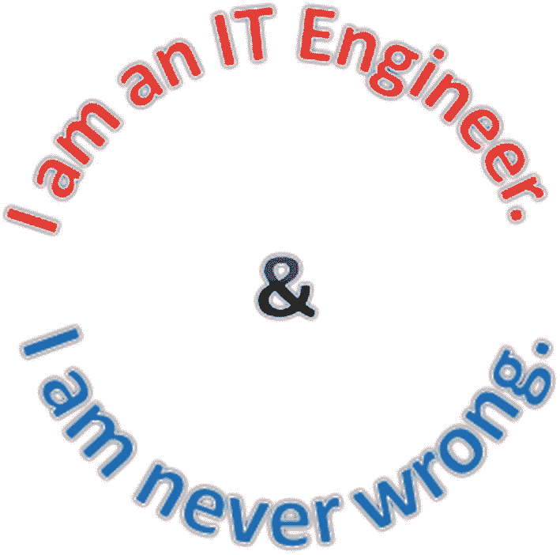
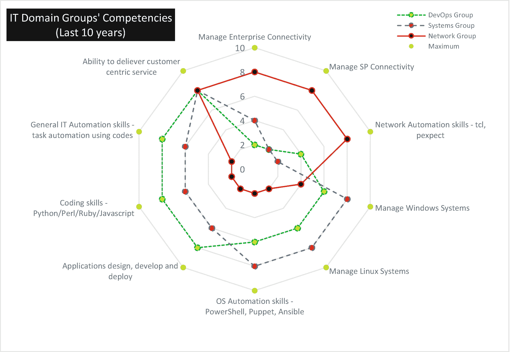
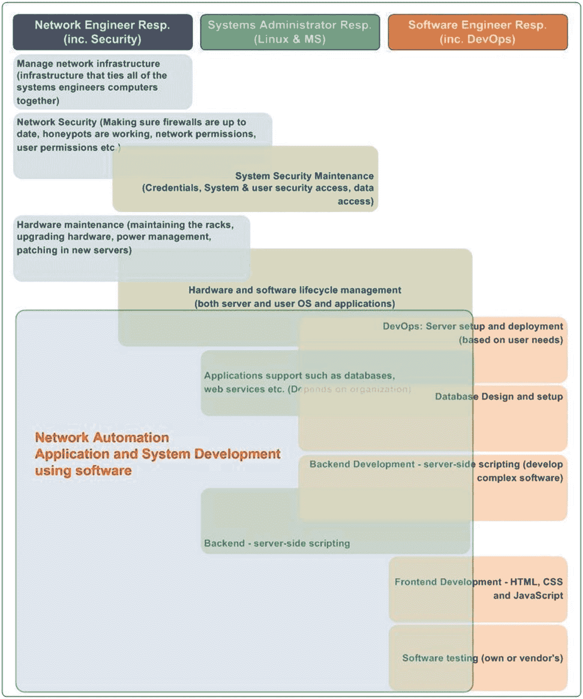
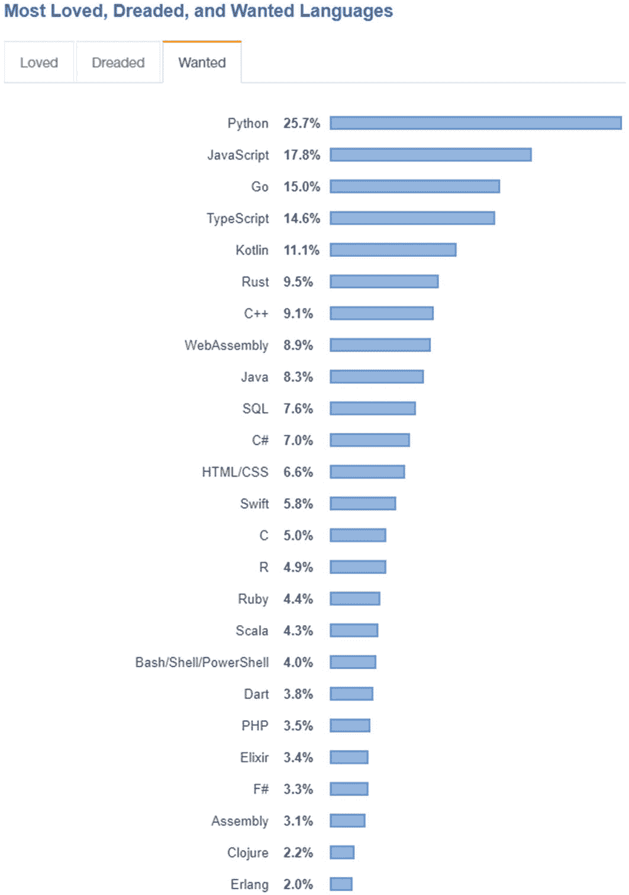
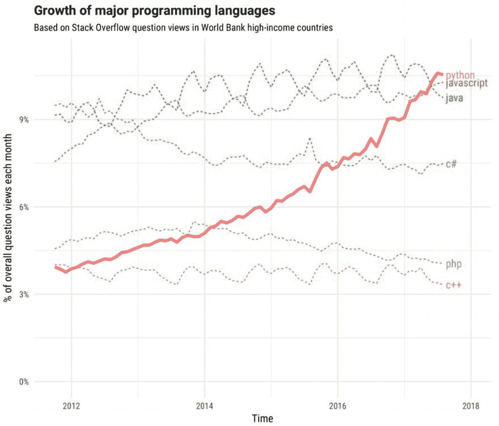
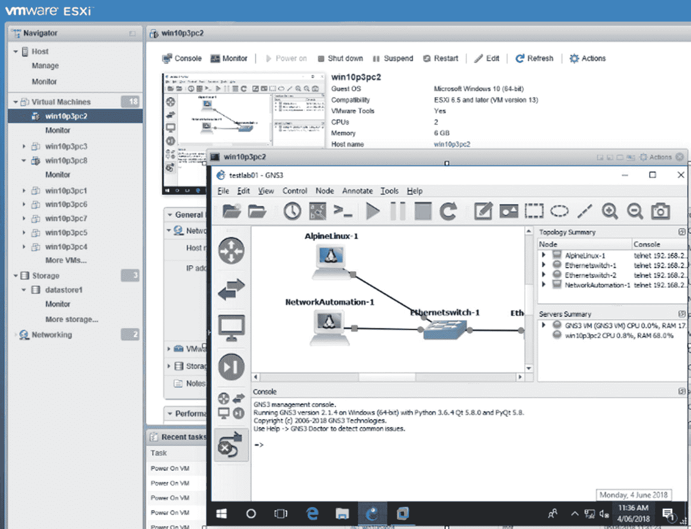

# 一、Python 网络自动化简介

这一章是这本书的入门，讨论了在今天的 it 行业中成为一名 IT 专业人员的感觉。我们还将讨论不同的企业 IT 工程领域组及其职责。然后，这一章比较了每个领域组的优缺点，并起草了一份工作研究计划，作为这本书的基础。本章还将讨论为什么你可能想学习一门编程语言，在我们的例子中是 Python，因为这是你购买这本书并开始你的网络自动化之旅的主要原因。最后，我们将讨论在单台 PC 上构建一个完整的 Python/Linux/网络自动化实验室的最低 PC/笔记本电脑要求。所有实验室机器、Linux 服务器、路由器和交换机将使用推荐的软件集安装在一台 PC/笔记本电脑上。

## 奠定基础

近年来，网络可编程性概念已经席卷了企业网络行业，网络自动化已经成为风暴的焦点有几年了。在基于传统 IT 框架的传统 IT 生命周期管理上花费数百万美元的企业和组织一直在寻找一种新的 IT 框架，它将提供更稳定和可预测的网络运营，而不会中断其 IP 服务和最终用户应用。相当多的网络工程师已经开始探索网络自动化，剩下的工程师还在努力起步。然而，许多人正面临各种挑战。回顾我自己的网络自动化之旅，我知道这可能是一个缓慢、痛苦和令人生畏的经历。

无论您在职业生涯中从未接触过编程语言，还是刚接触软件定义的网络，开始网络自动化之旅都感觉像是在试图爬上一座大山。一旦你到达第一座山峰，你可能会意识到还有更大的山峰在等着你。你甚至可能想要放弃。

在过去的几十年里，作为一名网络工程师，你可能一直过着舒适的生活。现在你的老板希望你提高你并不存在的编程技能，这样你就可以用代码行代替手工任务，这样你就可以为你的公司增加更多的价值。如果你说不，你的老板有一个 B 计划:别人会为你的团队编写代码来自动化你的工作，你会开始失去信誉(甚至可能丢掉工作)。您需要走出舒适区，开始我们的网络可编程性之旅。对于大多数传统的网络工程师来说，网络可编程性仍然是未知的领域。

在本章中，我们将确定当今典型 IT 环境中的三个主要 IT 领域组。然后，我们将定义每个 IT 领域组拥有的通用 IT 技能集，以确定每个组的相关优势和劣势。这本书是由网络工程师为网络工程师编写的，并由 Cisco Network Academy 讲师审阅。优势和劣势讨论将从企业网络行业的角度进行。重点是学习网络组如何使用现实的学习策略来拉近与其他两个组(DevOps 和 systems 组)的距离，并成长为跨职能的工程师，他们拥有强大的网络技能以及管理 Linux 操作系统和编写代码以开发业务应用的技能集。本章还介绍了一个跨职能的“混合工程师”的概念，这将很快在 IT 就业市场的巨大需求。这种混合工程师的职业知识增长将采取一个 *T* 的形式，因为他们在其主要的 IT 领域有一个稳固的立足点，并扩展到其他领域的技能组合，作为字母 *T* 的顶端。

在本书的几乎每一章中，除了这一章，您将从您的 PC 或笔记本电脑上安装、配置、练习、编码和学习，因此您的系统的最低要求是您用本书学习 Python 网络自动化的成功。因此，我们将回顾您的系统的最低系统要求，并向您介绍用于测量本书中概述的关键任务大小的软件。我们还将简要介绍用于 Python 网络自动化开发的集成开发环境(IDE ),并提供本书中使用的软件、源代码和文件的所有下载链接。在本章结束时，你会更好地了解当前网络工程师的优势和劣势。因此，您将知道在开始编写 Python 代码以开发您自己的网络自动化应用时必须关注的差距(目标研究领域)。

## 探索你的技能和先决条件

本节讨论了当今工作中的三个主要 IT 领域组的技能集。你将了解每组的优势和劣势。从网络小组的角度来看，我们将讨论和剖析你的技能组合中的弱点，并制定可行的学习策略来解决这些弱点，并将它们转化为你的优势。学习 Python 语法和概念将帮助您实现 25%的网络自动化目标。那剩下的 75%呢？要编写 Python 网络自动化代码，除了网络之外，你还必须在许多其他领域变得强大，本章将帮助你在这些领域变得更好。当然，我们还将从网络的角度介绍 Python 基础知识。我们将一起制定一个学习计划，以解决常见网络工程师的弱点，并使用 Python 引导您朝着网络自动化的正确方向前进。

如果你目前在 IT 行业工作，特别是在企业级路由、交换和安全技术方面，你应该为你的工作感到自豪。你可能会联想到图 [1-1](#Fig1) 中的图像。虽然这个形象可能会让你发笑，但你可能已经见过一个 IT 工程师，他走路和说话的样子好像他什么都知道。我们都遇到过这样的情况，客户希望我们作为技术专家了解一切。

图 1-1。

IT 工程师

可悲的是，图 [1-1](#Fig1) 中的图像揭示了一些 IT 工程师在工作中的想法和行为。自从 1971 年第一台个人电脑发明以来，随着不同技术的出现和消失，许多 IT 工作来了又去。随着新技术引入 IT 市场，大多数企业 IT 生态系统都在不断发展。不幸的是，一些 IT 工程师过于固执，无法与时俱进，经常陷入技术转型期，导致他们的 IT 职业生涯提前终止。目前，人工智能(AI)和 IT 自动化的时代已经在企业网络 IT 行业到来。如果你拒绝提高技能，你的职位可能不像你想象的那么稳固。

事实上，多年来，IT 行业一直试图通过将技能较低的工作转移到 IT 运营成本相对低于本土的发展中国家来降低运营成本。多年来，降低运营成本和减少人力资源开销是许多组织的趋势。我们生活在一个时代，人力资源是商业模式中的间接成本，如今许多客户希望支付更少的费用，但仍然要求高质量的 IT 交付服务。与许多组织的说法相反，在发达国家，许多本地 IT 工作被视为间接费用，而不是组织的宝贵人力资源。也就是说，许多 IT 组织声称他们重视他们的员工，他们优先考虑的是这些人力资源在组织的 IT 运营中的福祉。然而，当关键时刻到来时，几乎每个组织都会屈服于财务压力，削减 IT 运营成本，以最大化组织的利润。在过去的 20 年里，IT 外包和离岸外包在某种程度上取得了巨大的成功。尽管如此，每个 IT 部门都比以前更加努力地降低运营成本，这是加速采用软件定义的网络和基础架构作为代码等 IT 自动化的催化剂。

### 三个主要 IT 领域组的一般能力

印度班加罗尔俗称印度硅谷，那里有句俗语:“IT 职业有两种人；一是 IT 专业人员，二是管理这些人的专业人员。”在本书中，为了帮助您理解，我们根据每个组的能力和特征将 IT 领域组分为三个不同的组。然后，我们将对他们的一般技术能力进行相互比较，以预测某个特定的工程师组，即网络工程(连接)组在不久的将来的 IT 行业会是什么样子。未来五年及以后，谁会走在网络领域的最前沿？让我们回顾一下差距和要求，展望未来，并制定一个学习 Python、网络自动化和任何其他要求的计划，以建立您在 IT 方面提高技能的信心。

在企业级别，许多组织有三个主要的领域组负责 IT 基础设施。

*   *网络*:网络组，有时也称为连接组，负责所有基础设施和最终用户连接。

*   *系统*:系统组负责服务器和应用，以服务的形式向其他基础设施或最终用户提供服务；其中包括对公司成功至关重要的企业电子邮件、共享存储和各种业务应用。

*   最后一组是软件工程师或程序员，他们测试、开发和实现各种业务应用，以满足公司的业务需求。最近，这些工程师被称为 DevOps 工程师。

为了简化本书，我们将这三个主要的域组称为*网络组*、*系统组*和*开发运维组*。网络组致力于 IP 连接和服务，包括 RS、安全、数据中心、云和统一协作工程师等技术子领域。网络连接是任何企业业务连接的基础，我们认为应用和服务都是连接网络的租户。因此，如果公司网络出现重大网络故障，整个业务就会停止。

系统组负责在 Windows 和 Linux 操作系统上运行的关键业务应用和操作系统。

DevOps 小组由软件开发人员和程序员组成，他们专门使用各种编程语言和软件开发工具开发软件和应用。通过比较和分析每个组当前的能力，我们将更好地了解每个组的优势和劣势。因此，我们确定了网络组中的几个弱点，以便您可以针对这些弱点开展工作。尽管本书中使用的网络供应商技术来自思科，但请注意，本书中展示的网络自动化概念将适用于任何供应商的网络和安全技术，包括思科、Arista、Juniper、Check Point、Palo Alto 和惠普。

首先，让我们比较一下这三个领域组之间存在哪些技术能力差异。为了分析每个小组的能力，我们将使用蜘蛛网图来绘制和说明不同的技术能力。在这个简单的比较之后，我们将推荐使用 Python 作为首选编程语言来实现网络自动化的方法。

为了便于比较并帮助您理解三个 IT 领域组的能力，让我们首先在图表上绘制每个组的能力，如图 [1-2](#Fig2) 所示。该图表使用十个分数来表示图表上绘制的所有能力。例如，一个领域的胜任水平将是十分中的八分，一个能力较差的人将得到十分中的两分。

图 1-2。

IT 领域团队的一般能力比较

该图展示了过去十年中每个工程团队所需的通用能力。在这样的图表上绘制共同的能力已经让我们对每个组的优势和劣势有了一个清晰的认识。传统上，网络工程师对学习软件工程或编写代码没有严格的要求，因为工作节奏比今天的网络需要慢得多。如前所述，大多数工作都是由坐在计算机前的传统网络工程师通过命令行完成的。系统组因为必须批量(批量)执行大部分任务的工作，接触了更多的系统自动化工具和语言。从网络团队的角度来看，编写代码来自动化企业网络直到五年前还是一个新概念。因此，网络工程师并不急于向系统或 DevOps 领域扩展他们的技能。对于一个自动化企业网络的人来说，他必须拥有所有这三个组的组合。从图中可以看出，这三个组都不具备实现企业网络自动化的所有能力。如果您来自传统的网络工程背景，那么可以有把握地猜测，您将很少接触管理企业系统或参与企业工具(应用)开发项目。最近，每个人都被期望为客户提供更多物有所值的东西，并获得良好的客户(最终用户)体验。

这种同样的心态也影响到了网络团队的工作。尽管如此，你不能像在离岸外包的方法中那样投入更多的人来提供服务水平，也不能偷工减料来弥补数字，因为许多销售业务承诺更多，但只提供最低限度的服务。此外，如图所示，大多数公司现在意识到，没有一个团队具备为公司提供企业网络自动化解决方案的所有能力。公司不想支付运行所有三个 IT 领域组的开销；因此，当前的重点是提升现有员工的技能，以实现公司的 IT 自动化。IT 业内人士一直在说，“不同 IT 领域的墙正在倒塌。”现在，网络工程师必须知道如何管理 Linux 操作系统，具有管理编程语言的技能，并且必须知道如何开发特定的应用来自动化他们所管理的企业网络。另一方面，任何来自系统或 DevOps 组的工程师都可以学习网络技术并自动化网络组的工作。

当然，该图包含了每个 IT 领域组的一般能力，每个组中每个工程师的能力因人而异。尽管如此，这个图表为我们提供了网络组方法应该在哪里以及如何处理 Python 网络自动化研究的准确指针。

### IT 工程师职责的比较分析

在图 [1-2](#Fig2) 中，您看到了三个 IT 领域组的能力。在这一节中，我们将看看每组工程师的典型职责，以确定网络工程师在使用 Python 进行企业网络自动化方面需要改进的地方。花大约五分钟时间研究每个小组的职责，您可以很容易地看到传统的网络工程师必须集中在哪里，以获得编写脚本化应用来自动化他们的工作所需的技能。如阴影区域所示，第一要求是掌握 Linux、Windows 等操作系统；这是强大的网络技能的基础。

图 1-3。

IT 工程师的一般职责

对于企业自动化，使用的默认操作系统是 Linux。在熟悉了初级到中级的 Linux 管理之后，您可以从基本的 Python 语法开始，慢慢地发现 DevOps 是如何工作的。同时，您需要接触 Linux grep，或者更好的是，通用正则表达式，因为数据处理是任何编程语言的关键。从这一点开始，你可以逐渐扩展到其他感兴趣的领域。

如前所述，您需要具备思科 CCNA 的工作知识，以便从本书中获得最大收益，因此，如果您正在为 CCNA 学习或已经完成学业，您将从本书中获得更多。虽然本书的内容并不教授思科系统公司的一般网络概念，但本书的大部分内容都是实践操作，后面章节中的实验都是基于思科的 IOS 和 IOS XE 配置。即使你不是思科认证网络工程师，我也会根据图 [1-2](#Fig2) 和 [1-3](#Fig3) 中的讨论来编写这本书的内容，因此主题广泛，包含许多有助于提升你一般 IT 技能的部分。

基于图 [1-3](#Fig3) ，让我们利用网络工程师使用 Python 为网络自动化做准备所需的技能集。以下内容源自系统和 DevOps 工程师的职责，但不是典型网络工作的核心职责:

*   系统安全维护(凭证、系统和用户安全访问控制、数据访问控制)

*   硬件和软件生命周期管理(服务器和用户操作系统以及特定于操作系统的应用)

*   开发运维、服务器设置和部署

*   数据库和网络服务等应用支持

*   数据库设计和设置

*   后端开发服务器端脚本(开发复杂软件)

*   后端服务器端脚本

*   使用 HTML、CSS 和 JavaScript 进行前端开发

*   软件测试(您自己的或供应商的)

之前的职责相当笼统宽泛。许多子域技术在前面的列表中甚至没有提到。但是从一个网络工程师的角度来看，虽然在网络基本职责上有一个坚实的基础，但是你应该意识到你必须将你的兴趣和技能集转移到系统和开发组的职责上。为了让您的生活更轻松，请参见表 [1-1](#Tab1) 。如前所述，本书不是网络核心概念书，也不是 Python 语法和概念书，更不是 Linux 核心概念书。这本书是三本书的结合，但是主题是有选择的，以帮助你为 Python 网络自动化做好准备。你将在本书中学到的技能将作为你知识的基础。

当您阅读每一章时，您将获得超出舒适区的新 IT 技能。可以看到表 [1-1](#Tab1) 所示的技术途径是实用的，包括安装虚拟机、安装网络服务、学习 Linux 和 Python 基础、安装 Python、通过编写 Python 代码控制联网设备。除非你是一名售前工程师或 IT 领域的架构师，否则你需要成为一名真正的专业人士，能够从事真正的实际工作。下表显示了网络工程师开始 Python 网络自动化之旅的一种方法。

表 1-1。

对开始学习 Python 网络自动化的网络工程师的技能建议

<colgroup><col class="tcol1 align-left"> <col class="tcol2 align-left"></colgroup> 
| 

所需技能

 | 

推荐的研究主题

 |
| --- | --- |
| **Python 基础知识** | 在计算机上安装 Python学习基本的 Python 语法将基本 Python 语法关联并应用于 Python 网络上下文 |
| **VMware 和虚拟化基础知识** | 安装最新的 VMware Workstation Pro 版本了解虚拟化基础知识学习构建虚拟机 |
| **操作系统管理、修补、升级、故障排除和配置技能** | 安装两种不同风格的 Linux，Ubuntu 20.04 LTS 和 CentOS 8.1使用 VMware 模板安装预留的服务器；导入 GNS3 虚拟机服务器阅读 Python 安装指南并解决任何安装问题 |
| **学习 Linux 基础知识** | 了解 Linux 目录了解 Linux 文件管理和实践了解如何在没有 GUI 桌面应用的情况下使用 vi 和 nano 文本编辑器GUI 桌面 Linux 远程连接概念，SSH，Telnet，基本 API安装 FTP、SFTP、TFTP 和 NTP 服务器 |
| **正则表达式** | 学习正则表达式基础知识了解如何在 Python 中使用正则表达式学习将正则表达式与网络思想和概念联系起来并加以应用 |
| **网络仿真器(GNS3)技能** | 学习安装和集成 GNS3学习配置基本到复杂的网络拓扑学习将 GNS3 与 VMware Workstation 集成 |
| **思科 IOS 和 IOS XE 命令行** | 学习将思科 IOS、IOS-XE 和 CML-Personal L2 和 L3 映像集成到 GNS3学习网络自动化实验设置的基本路由器和交换机命令编写 Python 代码，通过 SSH、Telnet、FTP 和 SNMP 控制仿真的 Cisco 网络设备在虚拟实验室中练习 Python 脚本使用 Python 脚本安装和设置虚拟路由器和交换机 |
| **应用开发和建立** | 安装 Python 3安装 Python Telnet 和 SSH 模块使用 Python 代码了解网络自动化的应用开发理解基本的 DevOps 开发概念 |
| **特定工程师的任务自动化** | 了解任务流以自动化特定任务 |

表 [1-1](#Tab1) 中推荐的研究主题构成了本书的基础。在这本书的不同点上，你将被介绍到不同的技术和基于锻炼的任务，这需要你在你的 PC(或笔记本电脑)前跟随书的内容。为了完整地完成这本书，你必须完成每一章的所有练习，以获得足够的实践，并建立使用 Python 实现网络自动化所需的各种技能。我想让你在一个地方学基础，学好。

## Python 和网络自动化研究

为什么要学 Python 做网络自动化？这个问题可能很难回答。答案可能因人而异。尽管如此，学习 Python 进行网络自动化的共同目标可能是将物理上重复的任务转换成代码行，以便您可以专注于工作中更有价值和更重要的任务。使用 Python 的网络自动化过程可能与使用 Ansible 或其他设备管理工具的网络自动化过程非常不同。你可以自由地构建你的思维和任务过程，同时尝试自动化实际的物理任务和以自动化为目标的思维过程。那么，精简思维过程意味着什么呢？也许您正在谈论使用 Python 代码更有效、更系统、更快速地执行您的工作。

你是在暗示你和你的团队这些年来所做的事情是低效的、缓慢的、无组织的吗？也许这就是你在这里读这本书的原因。如果是这样，首先回顾一下你的团队正在进行的效率低下的工作，将每个逻辑思维过程和物理任务分解成步骤。使用 Python 代码行来确定您试图自动化的内容是非常方便的。这将为您开始第一个网络自动化项目和应对当前的自动化挑战奠定坚实的基础。

与其开始 Python 研究，不如四处看看，确定工作中需要自动化的手动密集型任务，然后记录当前流程。现在，您可以开始学习 Python 语法了。这个简单的过程会让你保持高度的动力，也让你专注于你的第一次 Python 学习，因为你不是为了学习目前最流行的编程语言之一而学习 Python。你学习它是有目的的。

### 为什么有人要学 Python？

Python 被领先的 IT 服务供应商和企业使用，如 Google、YouTube、Instagram、网飞、Dropbox 和 NASA。Python 编程有很多领域可以在短时间内开发出来，并应用于解决实际问题。学习它的障碍是当今使用的所有主要编程语言中最低的。

根据 [RedMonk。com](http://redmonk.com) ，2020 年 6 月，Python 成为全球第二大流行的编程语言，超越 Java，势头越来越猛。每种编程语言都有优点和缺点，Python 也不能幸免于各种缺点，但为什么它会变得如此流行呢？2019 年 10 月，Python 甚至超越 JavaScript 成为 Stack Overflow 上被问得最多的语言。

那么，如何开始呢？您必须很好地掌握基本的 Python 语法和概念。有许多关于 Python 基础和概念的书籍，其中一些非常优秀，但我在学习时仍然无法将 Python 概念和网络自动化概念联系起来。奇怪的是，也有中级到高级的 Python 网络自动化书籍，但它们没有解释从哪里开始，以及要达到中级到高级的水平需要做哪些练习。每个人都告诉你 Python 是一门非常容易学习的语言，入门门槛很低，但是他们没有告诉你，如果你想在任何一门编程语言上变得优秀，你需要埋头苦干，对你选择的语言保持执着和热情。准备好放弃你的社交之夜和周末来学习一些愚蠢的 Python 库特性，观看数百小时的所谓 Python 大师的 YouTube 视频和在线培训视频。

这是正确的；入门门槛低并不意味着 Python 是最容易学习的语言。意思是任何人都可以开始学习 Python 这种编程语言，但是有多少人有足够的毅力和热情把编写 Python 代码当成自己的生命？学习 Python 最具挑战性的部分通常是坚持不懈地推动自己学习使用 Python 做事情的不同方法，并尽可能保持热情。要做到这一点，你必须找到对你和你的工作重要的个人的实际用例及小项目。请记住，自动化是一个缓慢而稳定的过程，因为您想要自动化的一切都必须写入代码行。某人或某事(在人工智能的情况下)必须写代码。没有足够好的人工智能来模仿一个有经验和逻辑的网络工程师。因此，网络工程师必须自动化任务，直到人工智能(AI)能够模仿和自动化网络工程师的行为。

总之，图 [1-4](#Fig4) 来自 2019 年堆栈溢出调查。Python 是增长最快的编程语言，连续第三年成为最受欢迎的语言，这意味着尚未使用它的开发人员表示，他们希望学习 Python 来开发应用。

图 1-4。

2019 年开发者最想用的编程语言来源: [https:// insights。斯塔科弗洛。com/survey/2019 #最喜欢最害怕最想要的](https://insights.stackoverflow.com/survey/2019%2523most-loved-dreaded-and-wanted)

图 [1-5](#Fig5) 显示了 2017 年各大编程语言的增长情况。

图 1-5。

基于堆栈溢出问题的各大编程语言成长，2017 来源: [https:// stackoverflow。博客/ 2017/ 09/ 06/不可思议-成长-python/](https://stackoverflow.blog/2017/09/06/incredible-growth-python/)

## 用 Python 学习网络自动化需要什么？

大多数研究网络自动化的网络工程师都会同意，拥有一个灵活的集成开发环境(IDE)将有助于工程师开发应用。有许多方法可以学习基本的 Python 语法，但并不是每个人都有该公司提供的网络自动化开发实验室环境，尽管 Cisco dCloud 或类似的在线沙盒提供了定时实验室环境。尽管如此，你并不能随时随地按需得到它。所以，我建议你用自己的设备来控制你的实验室。这种实验室环境可以通过多种形式进行配置。首先，它可以使用路由器、交换机和服务器配置 100%的硬件。第二，它可以是部分硬件和部分虚拟化的混合开发环境；第三，它可以是 100%虚拟化的设备，位于服务器或 PC 内。第一种方法需要大量的初始投资来购买二手设备，并产生持续的电费来保持物理设备的运行。混合开发环境将变得很麻烦，一些设备在物理设备上运行，一些设备在虚拟化环境上运行。最后一个环境对于学习 Python 进行网络自动化的人来说是理想的实验室环境。这是通过集成运行在虚拟化解决方案上的多个系统和网络操作系统实现的。实践和体验真实网络环境中发生的一切几乎是不可能的，但建立集成开发实验室将是最接近的事情。如果你通过书本学习一切，或者通过狂看 YouTube 视频被动地学习 Python 网络自动化，那是不够好的。构建您的 IDE 并键入您的代码来学习和掌握 Python。

要通过这本书学习 Python 网络自动化，您需要的只是一台相当强大的台式机或笔记本电脑，它具有足够的中央处理单元(CPU)能力和足够的随机存取存储器(RAM)。接下来，我们来讨论一下遵循这本书的最低硬件规格。

## 硬件:笔记本电脑或个人电脑的最低规格

要安装、配置和练习本书中的所有练习和 Python 网络自动化实验室，您的计算机必须满足或超过表 [1-2](#Tab2) 中列出的最低规格。由于大多数网络工程师在工作中使用 Windows 10，我们也将使用该操作系统作为构建 IDE 实验室环境的基础操作系统。不幸的是，如果你使用的是 macOS 或 Linux，那么你只能靠自己去寻找合适的软件和兼容性。如果你有一台预装了 Windows 10 的功能强大的笔记本电脑或 PC，你就处于阅读这本书的绝佳位置，但如果你的系统仍在运行 Windows 8.1 或 7，强烈建议你升级到最新的 Windows 10。如果你有一台相当强大的台式电脑，有优化的 CPU 和系统冷却，它会比笔记本电脑运行得更好。然而，如果你的笔记本电脑是最新最好的，我会推荐你使用笔记本电脑的移动性和较低的电费。

由于本书的大部分内容侧重于在单个 Windows 10 系统上安装软件、创建实践实验室和运行网络自动化实验室，请确保您的系统满足表 [1-2](#Tab2) 中指定的最低要求。否则，您将会遇到系统性能问题，例如实验室中的系统响应时间缓慢。

表 1-2。

笔记本电脑或个人电脑:最低规格

<colgroup><col class="tcol1 align-left"> <col class="tcol2 align-left"></colgroup> 
| 

电脑组件

 | 

最低规格

 |
| --- | --- |
| **CPU** | 英特尔:CPU i7 第三代(64 位)或更高版本AMD:锐龙 3600 以上 |
| ram | DDR4 为 16GB 或更多(DDR3 为 24GB) |
| **固态硬碟** | 240GB 或更多(15%或可用空间用于系统分页) |
| OS | Microsoft Windows 10 (64 位)或更新版本 |

图 [1-6](#Fig6) 展示了我用来写这本书的桌面系统。

图 1-6。

我的系统规格

如果您的 CPU 与英特尔 i7-3770 相当或更好，如图 [1-6](#Fig6) 所示，并且拥有 16GB 以上的 DDR4(或 24GB DDR3) RAM，所有实验室都应该可以顺利运行。此外，建议使用 SSD 而不是 HDD，因为机械硬件是可能成为系统瓶颈的一个组件。本书旨在让您能够创建一个动手实验室，在这里您可以从一台 PC/笔记本电脑上学习 Python、虚拟化、Linux、网络和网络自动化。正如我们将在后面解释的那样，本书中的实验对于 Python 网络自动化学习以及学习各种认证(如思科 CCNA/CCNP/CCIE、Checkpoint、Palo Alto 和 Juniper Junos)的学生非常有用，因为 GNS3 支持各种供应商操作系统。

## 软件需求

您将学习如何安装和集成各种技术，同时在一台 PC/笔记本电脑上构建高度灵活和集成的实验室。表 [1-3](#Tab3) 包含所有软件并提供下载链接。你可以在开始第 [2](02.html) 章之前下载所有的软件，或者按照这本书的说明下载不同的软件。

请注意，并不是这里使用的所有软件都是免费软件或开源软件，您可能必须使用演示软件或付费软件。例如，VMware 的 Workstation 15/16 Pro 将在最初的 30 天内以演示模式运行，然后您必须购买有效的密钥。另一个例子是思科建模实验室-个人版(CML-PE)，每年的订阅费为 199 美元。对于我们的实验，您只需要表 [1-3](#Tab3) 中列出的三个文件。这里使用的所有其他软件要么是免费软件，要么是开源软件。

表 1-3。

软件和下载链接

<colgroup><col class="tcol1 align-left"> <col class="tcol2 align-left"> <col class="tcol3 align-left"></colgroup> 
| 

所需软件

 | 

使用

 | 

下载链接

 |
| --- | --- | --- |
| VMware Workstation Pro 15 或 16(演示/付费) | 桌面虚拟化 | [T2`https://my.vmware.com/web/vmware/downloads/info/slug/desktop_end_user_computing/vmware_workstation_pro/15_0`](https://my.vmware.com/web/vmware/downloads/info/slug/desktop_end_user_computing/vmware_workstation_pro/15_0)`or`[T2`https://my.vmware.com/web/vmware/downloads/info/slug/desktop_end_user_computing/vmware_workstation_pro/16_0`](https://my.vmware.com/web/vmware/downloads/info/slug/desktop_end_user_computing/vmware_workstation_pro/16_0) |
| GNS3-2-2-14 一体化或更高版本(适用于 Windows) | 网络设备仿真器 | [T2`https://github.com/GNS3/gns3-gui/releases`](https://github.com/GNS3/gns3-gui/releases)`or`[T2`https://www.gns3.com/software/download`](https://www.gns3.com/software/download) |
| GNS3。VM . VMware . workstation . zip | VMware 工作站 GNS3 虚拟机 ova 映像 | [T2`https://github.com/GNS3/gns3-gui/releases`](https://github.com/GNS3/gns3-gui/releases) |
| IOSv-L3-15.6(2)T.qcow2 或更新版本(付费) | Cisco CML L3 映像 | [T2`https://learningnetworkstore.cisco.com/cisco-modeling-labs-personal/cisco-cml-personal`](https://learningnetworkstore.cisco.com/cisco-modeling-labs-personal/cisco-cml-personal) |
| IOSv_startup_config.img(已付费) | Cisco CML L3 引导映像 | [T2`https://learningnetworkstore.cisco.com/cisco-modeling-labs-personal/cisco-cml-personal`](https://learningnetworkstore.cisco.com/cisco-modeling-labs-personal/cisco-cml-personal) |
| IOSvL215.2.4055.qcow2 或更新版本(付费) | 思科 CML L2 映像 | [T2`https://learningnetworkstore.cisco.com/cisco-modeling-labs-personal/cisco-cml-personal`](https://learningnetworkstore.cisco.com/cisco-modeling-labs-personal/cisco-cml-personal) |
| python-3.8.5.amd64.exe 或更新版本(适用于 Windows) | Python 3.8.5 或更高版本 | [T2`https://www.python.org/ftp/python/`](https://www.python.org/ftp/python/) |
| 记事本++ v.7.8.5 (64 位) | Windows 文本编辑器 | [T2`https://notepad-plus-plus.org/downloads/`](https://notepad-plus-plus.org/downloads/) |
| Putty.exe(64 位)(用于 Windows) | SSH/Telnet 客户端 | [T2`https://www.putty.org/`](https://www.putty.org/)`or`[T2`https://the.earth.li/~sgtatham/putty/0.74/w64/`](https://the.earth.li/%257Esgtatham/putty/0.74/w64/) |
| Ubuntu-20.04-live-server-amd64 . iso(952.1 MB) | Ubuntu 服务器映像-可启动 | [T2`https://linuxclub.cs.byu.edu/downloads/isos/ubuntu/`](https://linuxclub.cs.byu.edu/downloads/isos/ubuntu/)`or`[T2`https://www.ubuntu.com/download/server`](https://www.ubuntu.com/download/server) |
| centos-7-x86 _ 64-DVD-1804 . iso(4.16 GB) | CentOS 服务器映像，可引导 | [T2`https://www.centos.org/download/`](https://www.centos.org/download/)`or`[T2`http://centos.mirror.omnilance.com/`](http://centos.mirror.omnilance.com/) |
| c 3725-adventerprisek 9-mz . 124-15。T14.bin或者c 3745-adventerprisek 9-mz . 124-15。T14d.bin | GNS3 集成的 Cisco IOS 映像 | 来自旧的二手思科设备或者通过谷歌搜索 |
| Unpack.exe | Cisco image unpacker 0.1 二进制 Windows 版 | [T2`http://downloads.sourceforge.net/gns-3/Unpack-0.1_win.zip?download`](http://downloads.sourceforge.net/gns-3/Unpack-0.1_win.zip%253Fdownload) |
| WinMD5Free | Windows MD5 检查器 | [T2`https://www.winmd5.com/`](https://www.winmd5.com/) |
| 温斯 CP | `Se`针对 Windows-Linux 的固化文件传输 | [T2`https://winscp.net/eng/download.php`](https://winscp.net/eng/download.php) |
| FileZilla 客户端(64 位，用于 Windows) | 用于 Windows-Linux 的安全文件传输 | [T2`https://filezilla-project.org/`](https://filezilla-project.org/) |

## 使用 GNS3 构建网络自动化开发环境

网络自动化开发环境是用于网络应用开发的 IDE 实验室。在本书中，为了方便起见，我们将称这个环境为*实验室*或*网络实验室*，而不是*集成开发环境*或*网络自动化开发环境*。如前所述，为 Python 网络自动化创建学习实验室有不同的方法。大约 15 年前，当网络学生学习思科路由和交换时，许多学生混合使用基于硬件的实验室、思科的网络操作系统模拟器 Packet Tracer 和开源模拟器 Dynamips。随后推出了 GNS3，这是一款具有 GUI 界面的 Dynamips，易于使用。Dynamips 是一个很好的用于学习的网络设备模拟器，但是它缺少 GUI，对于初学者来说有点困难。GNS3 是一个提供图形用户界面(GUI)的程序，可以轻松管理仿真实验室设备。

在早期，GNS3 有很多错误，并不总是工作良好。随着更先进的 CPU 架构的发展、RAM 容量的增加以及固态硬盘(SSD)的推出，从笔记本电脑或 PC 上的应用模拟供应商网络设备变得更加舒适和易于访问。PC 硬件组件的降价和更多的开源网络仿真器使得学习网络变得非常容易。GNS3 的最新版本没有许多预先存在的错误，可以运行非常稳定的实验室环境。GNS3 已经发展到支持较旧的 Cisco IOS，并集成了 Cisco IOU 和 CML(VIRL)的 L2 和 L3 IOS。您可以运行两个 L2 交换机，并且可以在虚拟化实验室环境中模拟和运行 L3 路由器。尽管研究任何技术的最佳方式是使用合适的设备或相同的虚拟基础架构，但这一选项可能并不适用于所有人。如果钱和时间都有，最好用合适的设备学习。用仿真器学习总是比用模拟器好，如果你能负担得起用适当的设备运行真正的实验室就更好了。表 [1-4](#Tab4) 提供了网络实验室使用的应用列表，帮助您了解网络模拟器和仿真器在网络研究中的历史。

表 1-4。

用于网络研究的网络仿真/模拟程序

<colgroup><col class="tcol1 align-left"> <col class="tcol2 align-left"> <col class="tcol3 align-left"> <col class="tcol4 align-left"></colgroup> 
| 

应用

 | 

模拟器/仿真器

 | 

免费/开源/专有

 | 

利弊

 |
| --- | --- | --- | --- |
| **思科数据包****示踪器** | 模拟器 | 所有人 | **优点:**对网络学院的学生免费非常容易使用(适合初学者)对学习基本概念很有用在 torrent 网站或免费文件共享网站上随时可用(下载和使用风险自担)思科认证学习工具 |
| cons:t1]没有什么接近真正的思科 IOS没有什么接近真正的思科硬件 |
| **活力** | 仿真器 | 开放源码(仍然需要提取的 Cisco IOS 映像) | **优点:**自由的相当易于使用(适合中级用户)对学习基本概念很有用支持旧的路由器平台非常通用与虚拟机轻松集成易于与其他硬件集成比 GNS3 更少的错误支持 Windows 操作系统和 Linux 操作系统思科认证的优秀学习/工作工具 |
| cons:t1]你必须找到你自己的 IOS 版本仅支持较旧的 IOS 路由器(7200 路由器除外)有限的交换能力仅通过开源论坛提供支持 |
| **GNS3** | 仿真器 | 开放源码(仍然需要提取的 Cisco IOS 映像) | **优点:**自由的非常容易使用(适合初学者)对学习基本概念很有用支持旧的路由器平台非常通用与虚拟机轻松集成易于与其他硬件集成支持 Windows 操作系统和 Linux 操作系统思科认证的完美学习/工作工具 |
| cons:t1]找到您自己的 IOS 副本仅支持较旧的 IOS 路由器(7200 路由器除外)有限的交换能力很多虫子许多性能问题仅通过开源论坛提供支持 |
| **思科借据** | 仿真器 | 所有人 | **优点:**相当易于使用(适合中级用户)支持更新或最新的 IOS出色的 L2/L3 交换机仿真可以在大多数 WIN/Linux 主机上运行在种子网站或免费文件共享网站上随时可用思科认证的优秀学习/工作工具 |
| cons:t1]所有人需要相对强大的主机思科不提供支持。找到您的副本并使用您自己的风险 |
| **思科 CML****(病毒)** | 仿真器 | 所有人 | **优点:**相当容易使用支持更新或最新的 IOS出色的 L2/L3 交换机仿真可以在大多数 WIN/Linux 主机上运行思科认证的优秀学习/工作工具如果订购付费，思科将提供支持在种子网站或免费文件共享网站上随时可用 |
| cons:t1]所有人需要相对强大的主机 |
| **UNL Lite****(EVE-NG)** | 仿真器 | 所有人 | **优点:**支持更新或最新的 IOS出色的 L2/L3 交换机仿真可以在大多数 WIN/Linux 主机上运行思科认证的优秀学习/工作工具 |
| cons:t1]需要相对强大的主机 |
| **流浪者** |   | 开放源码 | **优点:**自由的用于在单个工作流中构建和管理虚拟机环境的工具易于使用的工作流程专注于自动化缩短开发环境设置时间增加生产平价 |
| cons:t1]需要相对强大的主机 |

过去十年中推出的其他仿真器包括统一网络实验室的 UNL Lite(更名为 EVE-NG)、思科的 IOU(Unix 上的 IOS)和思科的 CML(思科建模实验室，老 VIRL)。使用 Cisco Network Academy 帐户学习 Cisco 认证时，可以使用 Cisco Packet Trace。该软件仅用于思科技术支持中心(TAC)与思科 IOU 的实验。Cisco TAC 以外的公司或个人不能使用它。网上有许多关于如何使用以前软件的书籍和免费指南，但在本书中，运行在 VMware Workstation Pro 上的 GNS3 VM，与 Cisco IOS 和 CML 映像集成，将为我们提供 Python 网络自动化实验室的仿真网络基础架构。

对于这本书来说，理想的实验室是为更少的功耗而优化的实验室，可以随时随地方便地操作。所以，这本书按照从容易到中级的顺序，精心布置了题目。此外，只要您使用本书中使用的相同或更新版本的软件，大多数实验设置应该没有软件兼容性问题，并且所有实验都应该是可重复的。

假设你想用这本书的内容进行群体训练，只想在 Python 实验室教学生。在这种情况下，您可以将 Windows 10 作为虚拟机安装在 ESXi 6.5 上(图 [1-7](#Fig7) )，安装所有软件，完成集成，然后克隆原始虚拟机，并提供对指定虚拟机的 RDP 访问。

图 1-7。

在 ESXi 6.5 上运行网络自动化实验室进行小组培训的示例

## 下载补充指南和源代码

在阅读第 [2](02.html) 章之前，下载所有预安装指南和源代码。

补充安装前指南下载:

*   作者网址: [`https://github.com/pynetauto/apress_pynetauto`](https://github.com/pynetauto/apress_pynetauto)

`Source`代码下载:

*   作者网址: [`https://github.com/pynetauto/apress_pynetauto`](https://github.com/pynetauto/apress_pynetauto)

## 摘要

`We`从总体上讨论了 IT 网络自动化，并对三个主要的 IT 领域组进行了快速对比分析。我们确定了网络工程师团队在开始为网络自动化应用开发编写 Python 代码时必须关注的领域。最后，我们讨论了开始网络自动化之旅的最低硬件和软件要求。您可能已经注意到，硬件需求中没有提到网络硬件需求；一切都将基于软件，甚至是路由器和交换机。

## 故事时间 1:超级速度鞋厂

2016 年，围绕机器人和自动化在制鞋行业取代人类劳动力的宣传非常热烈。著名的鞋和运动服装制造商，德国的阿迪达斯，宣布了一个新的机器人鞋厂；在公告期间，有人预测，由于这种类型的工厂，东南亚 900 万工人中高达 90%的人可能面临失业。然而，在 2020 年，阿迪达斯宣布将停止其在德国安斯巴赫和美国工厂的两家机器人“速度工厂”的生产。机器人鞋生产线只能生产有限数量的模型，这些模型主要由具有针织鞋面鞋底的跑鞋组成；机器人不能生产橡胶底的皮鞋。旧机器已被转移，目前由阿迪达斯在越南和中国的供应商使用。

有人说机器将接管世界，迟早会夺走我们所有的工作，但这个例子强调了更仔细规划和引入工作场所自动化的必要性。每个行业都在通过反复试验来学习自动化的力量。

这一失败也让我们回到了 20 世纪 90 年代初，当时推出了自动取款机(ATM)。在这种情况下，美国的一些研究发现，许多著名经济学家和学者做出的经济预测就像当地的芋头算命师一样准确。因此，如果我们做好了充分的准备并接受这些变化，我们就不应该害怕 IT 行业的自动化或人工智能。虽然支持贵公司的 IT 生态系统并为自己的工作感到自豪对所有 IT 工程师来说都非常重要，但我们必须如实说明我们能做什么和我们知道什么。IT 工程师并不了解他们所支持的所有 IT 技术的方方面面。因此，他们不应该试图掩盖他们无法完成特定任务的事实。我们应该随时准备发现新事物，获得额外的技能来推进我们的职业生涯。