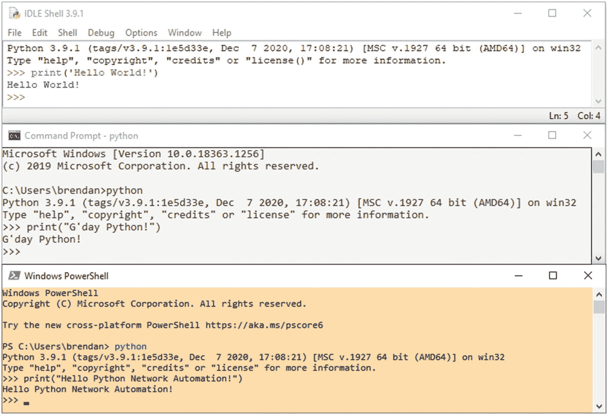
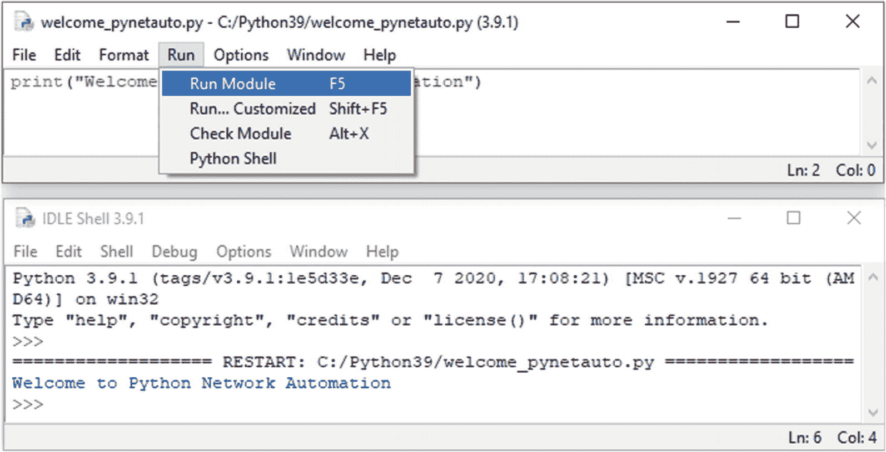
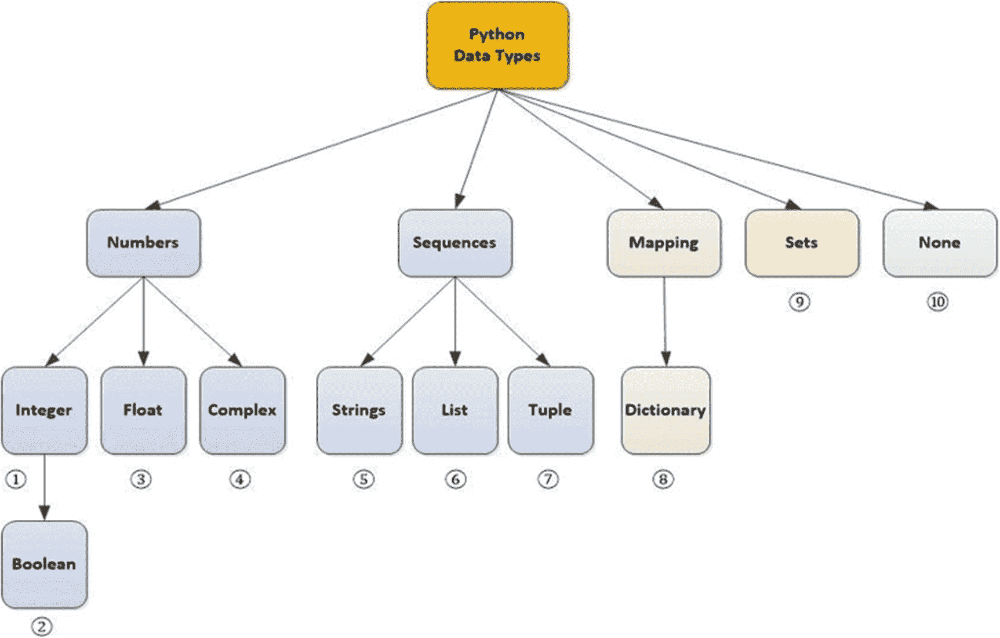
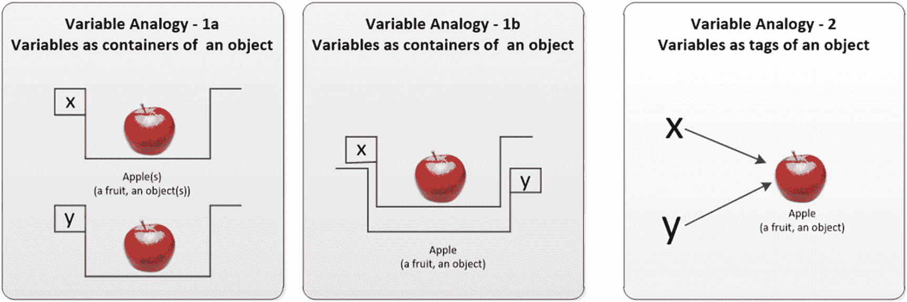
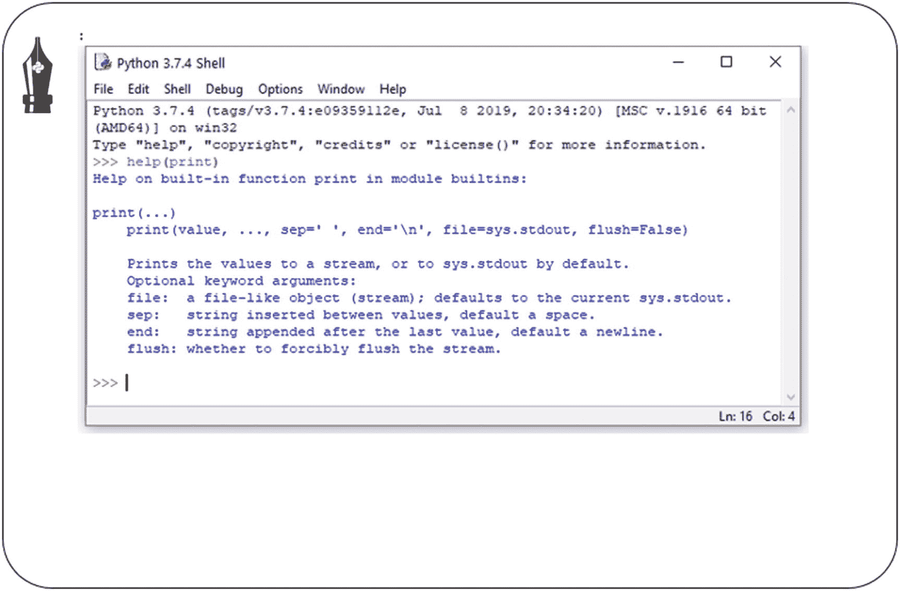
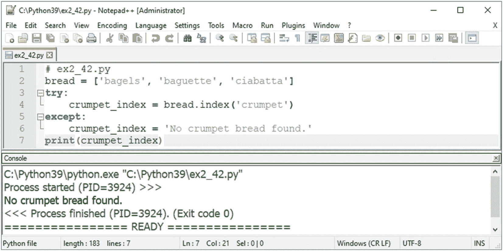
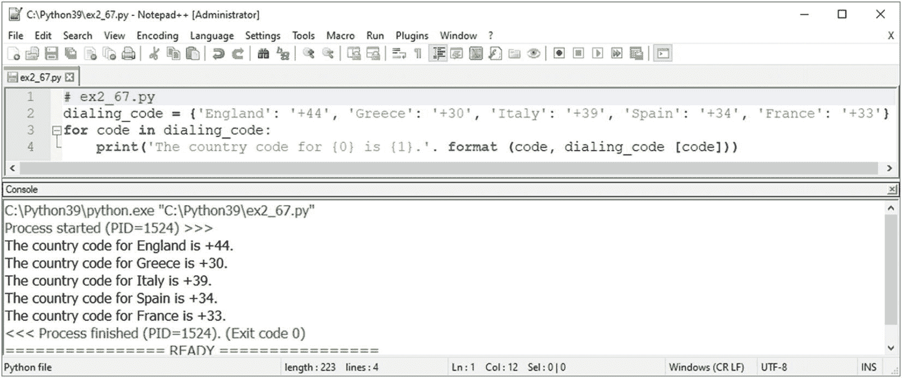

# 二、在 Windows 上学习 Python 基础知识

Windows 是私人和企业用户最常用的最终用户操作系统。越来越多的人将在 Windows PC 上开始他们的 Python 之旅，而不是在 Linux 或 macOS 上，并且当你开始在 Windows 操作系统上用 Python 编码时，Python 的障碍会更低。本章包含将选择性 Python 概念与一般编程概念联系起来的 Python 实践练习，一些练习将参考真实场景。本章将作为后面章节中 Python 网络自动化脚本实验室的入门。遵循编码传统，您将从强制性的“Hello World！”开始学习 Python 程序。在开始练习之前，将指导您设置一个简单的 Windows Python 环境，并向您介绍一些基本的 Python 编码规则。您将学习最基本的 Python 语法和概念，构建更强大的基础模块，并获得 Python 网络自动化实验室所需的基本 Python 技能。


要在 Windows 操作系统(OS)上学习和重温 Python 的基本概念，请在您的笔记本电脑或 PC 上安装 Python 3，并遵循本章中的练习。从 GitHub 下载`CH02_Pre_Task_Install_Python3_on_WIN10_NotepadPP.pdf`。

URL: [`https://github.com/pynetauto/installation_guide`](https://github.com/pynetauto/installation_guide)

这里我就分享一下自己的经历。我第一次开始学习 Python 是在 2013 年，希望能将它应用到我的工作中。在这第一次尝试中，仅仅是尝试学习简单的 Python 语法就花了太长时间，而且感觉很繁琐，毫无意义，所以两个月后我就放弃了。2015 年，我又尝试了一次 Python 语法和概念。我花了三个月的时间学习了基本的 Python 语法和概念，但是无法将 Python 语法和概念与我的工作联系起来，所以我再次放弃了。快进到 2017 年，我无休止地寻找着我所缺少的东西。我终于意识到，学习和掌握一门编程语言本身是一种无用的练习，除非你有一套目标和一个清晰的路线图。

简单地说，我的目标是作为一名网络工程师学习和使用 Python 来自动化重复性的任务。结论是学习 Python 只是旅程的一部分。我必须涵盖更多的部分，例如，提高 Linux 系统管理技能，掌握正则表达式，学习使用各种 Python 模块作为内置和外部模块，以及任何特别的东西来快速调整我的代码。

开始第一次编程语言学习之旅需要我们大多数人的强烈动机和个人奉献精神。持续的学习需要耐心和坚强的意志力。对于任何学习，一旦你完成了旅程的第一部分，第二部分就在等着你，在你完成第二部分之后，第三部分就在等着你。学习没有明确的终点，你将陷入这个恶性循环，因为你将不得不在旅程的不同部分来回。要想让自己的 Python 学习曲线更舒服，首先花点时间想想自己的动机，为什么要学 Python，想用在什么地方；当你懈怠的时候，把它作为提醒，让你重回正轨。此外，设定正确的期望值，用足够的时间深入吸收 Python 语法和概念，并探索适合您的用例的各种 Python 模块。用 Python 写代码和用其他编程语言写代码没什么区别。还有，学习 Python 语法就像学习一门非母语的语言，要花很长时间才能完成基础，进入下一个层次。像任何其他学习一样，这是你内心的一场持续斗争，但是一个精心计划的学习策略可以让你少一些痛苦。

现在让我们来看看你与电脑互动的不同方式；有三种主要的方式可以让你和电脑互动并指导电脑执行任务。首先，你坐在物理计算机或直接连接到系统的远程控制台机器前，以一对一或一对 n 的方式发出实时指令。其次，您可以使用文本编辑器或 IDE 编写一段代码，并手动执行该代码。这种方法被称为*半自动*。第三，你可以编写代码，安排它在特定的时间运行，系统(计算机)自动执行你的代码，无需人工干预。这种方法被称为*全自动*或*全自动*。众所周知，Python 是一种不需要预编译的交互式编程语言。交互式编程语言当场解释源代码，并在代码需要执行时向计算机发出指令。

如第 [1](01.html) 章所述，虽然这是一本关于 Python 网络自动化的书，但这本书将 Python 知识和技能视为实现 Python 网络自动化所需的许多技能集的一部分。因此，这本书并不仅仅关注 Python 语法和概念，而是旨在拓宽您在网络自动化之旅中所需的各种 IT 技术的视角。本书将尝试向您展示几种技术，使您成为一名全面的技术专家，能够使用 Python 编写代码、管理 Linux、开发应用，并为工作构建概念验证(POC)网络实验室。假设您只想学习基本的 Python 语法。在这种情况下，购买一本很好的 Python 基础知识书籍会更合适，这本书可以在亚马逊或当地书店买到。

您的 Python 知识和经验会因里程而异。但是在这一章中，我将假设你是第一次或新手 Python 程序员，所以这一章将涵盖一些基本的 Python 语法和概念，以便执行本书要求的所有任务。这本书逐步线性地构建你的 Python 网络自动化技能集。作为一名读者，我们鼓励你在键盘上完成本章介绍的每个练习。在进入下一章之前，您必须键入代码并完成本章中的所有练习。

不像其他的书，这本书会先给你各种练习，然后在本章和整本书中解释。有太多的书过于详细地解释了这些概念。这本书是给实干家看的，不是给概念思想家看的。一些练习将包含作为嵌入注释的解释，但在大多数情况下，解释将跟随每个练习，以进一步帮助您的理解。在每个 Python 概念里程碑的末尾，您会发现一个简短的概念总结，作为对您所学内容的提醒。最后，这本书不会给你提供琐碎的测验、不合理的问题或荒谬的挑战，让你陷入大脑昏厥。

## “你好，世界！”和 print()函数

学会打印强制性的“你好，世界！”并理解交互模式和脚本模式之间的区别。

Hint

带空格的是 Python 提示符，表示您正在交互模式下工作。

如果你想在 Windows 10 上交互式地学习 Python，方法很少，但三个主要方法在 Python shell 中，在命令提示符下，在 Windows PowerShell 中(图 [2-1](#Fig1) )。在交互模式下，当你打开一个 Python shell 时，它会用`>>>`(三个右括号和一个空格)和一个闪烁的光标来欢迎你。Python 告诉你它已经准备好接受你的交互输入了。当你在这种模式下编写代码时，你是在交互模式下编写代码，它将你的代码保存在计算机的随机存储器中，然后被 Python 即时解释。在本章展示的例子中，您将使用一个简单的`print()`函数打印出一个必须的“Hello World！”语句开始您的 Python 之旅。用一组单引号或双引号将一些字符串括在一组圆括号中，然后按键盘上的 Enter 键。Python 解释器立即解释代码，并将输出打印到计算机屏幕上。Python 和 Ruby、Perl 一样，是一种解释型编程语言。



图 2-1。

Windows 10 上的 Python 交互式编码

打开提示方法之一，键入强制的`print('Hello World!')`或`print("Hello World!")`语句。你学会了三件事。第一，你已经学会了如何使用`print()`功能；第二，你已经知道 Python 使用一组单引号(`' '`)或者一组双引号(`" "`)来包装字符串。本章将通过各种示例讨论`print()`功能和引号的使用。第三，本练习向您介绍了作为验证工具的强制`print('Hello World')`语句。

无论您是 Python 编程语言的新老用户，阅读一下“Hello World！”的起源都是值得的以及它的用例。以下是两个网址，供你访问和了解著名的“Hello World！”程序。对于我们在本书中的使用，您将使用它来验证 Python 作为一个程序是否正常运行，并且可以在运行`print()`函数时在控制台屏幕上打印字符串。

了解更多关于“你好，世界！”程序，请参见以下内容:

URL: [`https://en.wikipedia.org/wiki/%22Hello,_World!%22_program`](https://en.wikipedia.org/wiki/%252522Hello,_World%2521%252522_program)

URL: [`https://www.youtube.com/watch?v=ycl1VL0q1rs`](https://www.youtube.com/watch%253Fv%253Dycl1VL0q1rs)

在 Python 3 中，`print()`是一个内置函数，也是一个标准函数，用于在用户的计算机屏幕上显示处理后的数据。由于 Python 2.7.18 版本标志着 2.x 版本支持的结束，并于 2020 年 1 月 1 日到达生命的尽头，所以本书中的所有 Python 代码都是用 Python 3.6.4 编写的。不要为 Python 2.x 而烦恼，因为一旦你牢牢掌握了 Python 3.x，你就会意识到这两者之间没有太多的区别。一个公平的类比是 Windows 8 和 Windows 10 之间的差异；如果你知道如何使用 Windows 10，那么你就可以轻松使用 Windows 8。

你也可以在文本编辑器中编写 Python 代码，并在 Windows 10 上运行脚本之前将其保存为`.py`文件格式。当你在文本编辑器中写代码时，我们称之为*写脚本*或在*脚本模式下工作*。当你在 Windows 10 PC 上安装 Python 时，Python 提供了一个内置的文本编辑器(图 [2-2](#Fig2) )，或者你可以使用自己选择的文本编辑器来编写你的代码并保存为`.py`文件。Python 代码是独立于平台的，因此在 Windows 操作系统(OS)上编写的代码可以在 macOS 或 Linux OS 上运行，反之亦然。在本章中，我希望你打开 Python IDLE 和内置的文本编辑器，在键盘上练习每一行代码，这样你就可以体验用 Python 写代码的感觉了。在功能更丰富的集成开发环境(IDE)中编码也是可能的，但是我们将在本章后面简要讨论这一点。现在，尝试使用 Python 解释器和简单的文本编辑器环境编写代码。您不希望在这个阶段担心使用哪个 IDE。目前，掌握如何使用 Python shell 和内置文本编辑器已经足够了。要实用，不要时尚！

打开 Python 内置的文本编辑器，编写下面一行代码，在`Python39`文件夹中另存为`welcome_pynetauto.py`。然后转到运行并选择运行模块 F5。

*welcome _ pynetato . py*

```py
print("Welcome to Python Network Automation")

print("Welcome to Python Network Automation")

```



图 2-2。

在 Windows 的 Python 内置文本编辑器中编码

完成本章的所有练习后，你将更加熟悉基本但核心的 Python 概念；在进入本书后半部分的后续章节之前，这种理解是必须的。如果使用的是 Linux 或 macOS，可以打开一个终端窗口，输入`python`或`python3`启动交互模式。我们将在本书的后面讨论 Linux 操作系统中的编码。

## 准备 Python 练习

这本书的绝大多数目标读者是 Windows 用户。要开始本章的练习，你应该已经按照`CH02_Pre_Task_Install_Python3_on_WIN10_NotepadPP.pdf`的安装指南在你的 Windows 10 主机上安装了最新版本的 Python 3。根据 2019 年的统计，Windows 用户仍然以 20 比 1 的比例超过 Linux 用户。因此，在 Windows 环境下开始您的 Python 之旅是理想的，然后您可以过渡到 Linux。由于大多数支持 Python 的企业服务器运行在众多 Linux 操作系统风格中的一种上，这就为企业工程师掌握 Linux 技术提供了足够的理由。在后面的章节中，您将学习 Linux 基础知识，并且您将在 Linux 环境中执行任务，因此我们将从在 Windows 上使用 Python 开始，然后学习在 Linux 上使用 Python。如果你一直是 Windows 用户，你必须开始使用 Linux 操作系统，以便在大多数 IT 技术工作中领先于其他人。如果您已经熟悉 Linux，那么您将乘坐商务舱进行 Python 网络自动化之旅。

在本章中，你将完成各种练习，并使用解释和概念总结来回顾你从这些练习中学到了什么。为了让你开始 Python 编码，你将首先学习四个必不可少的 Python 概念，看一些例子，然后你将尝试练习。

*   Python 数据类型

*   缩进和代码块

*   评论

*   基本 Python 命名约定

您可以在 Linux 或 macOS 上练习本章介绍的所有练习，只需对目录位置稍加修改。当你在 Python 内置的 IDLE 或 Windows 命令提示符或 Windows PowerShell 中打开 Python 并输入`python`，Python 就会运行并以友好的交互式 Python 提示符向你问候。请密切注意；您将看到它有三个大于号，后跟一个空格。

>>>

当您看到三个大于号和一个空格时，Python 会告诉您可以输入下一行代码。适应这个符号，因为你会花很多时间盯着它。

### 了解数据类型

在本节中，您将了解 Python 中使用的不同数据类型:数字、序列、映射、集合和`None`。

Hint

试着考虑 Python 数据类型，以便在将来节省时间。

Python 数据类型是一组具有相似特征的值。数据类型可以属于图 [2-3](#Fig3) 所示的一组。我们将使用 Python 的内置函数`type()`研究每种数据类型。



图 2-3。

Python 数据类型

在 Python 中，一切都被视为一个对象，并根据对象的特征分类为不同的数据或数据类型。首先，让我们快速了解一下 Python 的数据类型。这本书试图在开发各种网络自动化应用时，建立在你的基础到中级 Python 代码的知识之上。因此，您不必深入了解所有的数据类型，但是您必须了解最常用的数据类型；我们将只讨论通读这本书所需的基础知识。

您将使用 Python 的内置函数`type()`来了解 Python 如何对不同的数据对象进行分类。打开你的 Python shell，在`>>>`后面输入文本和空格；然后按回车键。

<colgroup><col class="tcol1 align-left"> <col class="tcol2 align-left"> <col class="tcol3 align-left"></colgroup> 
| 

#

 | 

锻炼

 | 

说明

 |
| --- | --- | --- |
| ① | `>>> type (3)``<class 'int'>` | 整数是数字的子类。1 是整数的一个例子。带有+或-符号的整数，如-3、0、5，都是整数。它们用于计算的数字数据中。 |
| ② | `>>> type (True)``<class 'bool'>``>>> type (False)``<class 'bool'>` | 布尔值(`True`或`False`)是整数的子类。布尔运算测试`True`或`False`的一些条件。常数 1 代表`True`，0 代表`False`。 |
| ③ | `>>> type (1.0)``<class 'float'>` | float 是数字的子类，也称为*浮点*。在这个例子中，1.0 是一个浮点数的例子。浮点数是带分数或小数点的数字。 |
| ④ | `>>> type (1 + 2j)``<class 'complex'>` | 复数是实数和虚数的组合。你可以把它想象成便于计算的数字数据，经常用于科学计算。 |
| ⑤号 | `>>> type ('123')``<class 'str'>``>>> type('word')``<class 'str'>` | 字符串是 sequence 的子类，是可变的，是字母或字符的有序序列。序列是由从 0 到`n`的整数索引的项目的有序集合。任何用双引号或单引号括起来的数据类型，例如`'123'`或`"word"`，在 Python 中都是一个字符串。 |
| ⑥ | `>>> type ([1, 2, 3])``<class 'list'>` | 列表是任何数据类型的值序列的子类。列表中的值是项，是可变的，用 0 到`n`的整数索引，有序。该列表使用一组方括号`[ ]`来表示订单中的项目。 |
| ① | `>>> type ((3, 2, 1))``<class 'tuple'>` | 元组是任何数据类型的值的序列，并且由整数索引。它是一种不可变的数据类型，用圆括号`( )`列出元素，用逗号分隔。列表和元组的区别在于它们的不变性。 |
| ⑧ | `>>> type ({1: 'apple', 2: 'banana'})``<class 'dict'>` | 字典是一种无序的映射数据类型，通过构造`key: value`对，用逗号分隔它们，并用大括号`{ }`将它们括起来来创建。比如`'a':'apple'`中的`a`叫做*键*，冒号后面的`apple`叫做*值*。在字典中，忽略元素的顺序，通过调用一个键对值进行分页。 |
| ⑵ | `>>> type ({1, 2, 3, 3, 2, 1})``<class 'set'>``>>> {1, 2, 3, 3, 2, 1}``{1, 2, 3}` | 集合是没有重复条目的任何数据类型的值的无序集合。`set`数据类型也是不可变的。如示例所示，集合只允许相同值的单个条目。 |
| ⑩ | `>>> type (None)``<class 'NoneType'>` | `None`是一种特殊的单值数据类型。它是一个常数，表示没有值。如果你把`None`赋给一个变量，就意味着这个变量是空的。 |
| ⑪ | `>>> int(7.24)``7``>>> float(3.00)``3.0``>>> str("365")``'365'``>>> bool(1)``True` | 显式类型转换可以指定精确的数据类型。Python 在自动检测数据类型方面做得非常出色，但是有时，有些数据需要修正以避免混淆。在 Python 代码中处理不同的数据类型时，经常会用到数据类型构造函数，如`int()`、`float()`、`str()`和`bool()`。 |

我们可以在 [Python 上参考每种数据类型更详细的解释。org](http://python.org) 文档网站。

URL: [`https://docs.python.org/3/library/stdtypes.html`](https://docs.python.org/3/library/stdtypes.html)

### 缩进和代码块

C、C++和 Java 等大多数编程语言都使用大括号`{ }`来构造代码。Python 使用缩进来定义一个代码块，赋予其独特的代码结构；代码块是程序或脚本中的一组语句，由至少一条语句和编程块的声明组成。在 Python 中，一个代码块以缩进开始，以第一个未缩进的行结束；示例包括函数体、循环和类。在本节中，您将学习使用缩进或空白作为代码块。

Hint

Python 使用四个空格来区分代码块。

<colgroup><col class="tcol1 align-left"> <col class="tcol2 align-left"></colgroup> 
| ① | `with open("C:\\Python39\\ip_adds.txt", "r") as f:`□□□□ `for line in f:`□□□□□□□ `print(line)``# Output: 10.20.30.1``172.168.1.254``192.168.0.2``10.20.34.25` |
| ② | `with open("C:\\Python39\\ip_adds.txt", "r") as f:`□□ `for line in f:`□□□□ `print(line, end="")``# Output: 10.20.30.1``172.168.1.254``192.168.0.2``10.20.34.25` |

#### 说明

<colgroup><col class="tcol1 align-left"> <col class="tcol2 align-left"></colgroup> 
| ① | Python 使用空格对语句进行分组；这也被称为*缩进*。第一行代码通常没有空格；当语句以冒号(`:`)结束时，下一行需要缩进以表明它是组的一部分。示例①是打开带有 IP 地址的文件并读取 IP 地址的代码。四种缩进是 PEP80 建议，也是用 Python 编码时最广泛使用的缩进约定。该示例显示第二行有四个空格，第三行有八个空格。输出仅用于演示，但是您可以在`C:\Python39\`下创建一个名为`ip_adds.txt`的文本文件，输入几个 IP 地址，并测试 Python 解释器中显示的代码。 |
| ② | 同样的代码仍然可以使用两个空格进行缩进。只要你的间距是一致的，你可以为你的代码块使用任何间距；然而，四倍间距是正常的。在 Google，Python 编码标准使用两个空格。在最后一行代码中，我添加了`end=""`来消除从文件中读取信息时产生的空白。使用`end="`、`end=" "`、`end = "/"`、`end=":"`等等，您可以操纵如何在输出中处理不想要的空白。 |

### 评论

注释是不影响程序流程的代码的一部分，它提供了对应用重要部分的描述。注释可以解释某些功能的用途，或者解释复杂的代码片段来帮助读者。Python 在处理注释时使用了一个`#`符号，后续字符被注释掉，对程序没有影响。要添加多行注释，可以在多行之间使用三单引号(`''' '''`)或三双引号(`""" """`)。Python 注释的另一个用途是在开发应用的同时，使部分代码不活动。

在本节中，您将学习如何向代码中添加注释。

Hint

代码读的次数比写的次数多。良好的评论习惯可以节省解码时的时间。

<colgroup><col class="tcol1 align-left"> <col class="tcol2 align-left"></colgroup> 
| ① | `# This code can SSH into multiple devices & download IOS from a TFTP server` |
|   | `# and upgrades old IOS to the latest version.` |
|   | `# Please... [skip]` |
| ② | `# Ask new driver's age` `.` |
|   | `age = 17` |
|   | `if age > = 18:` |
|   | `print('You are old enough to drive a car.')` |
|   | `#elif age > 80:` |
|   | `# print('You are too old to drive a car!') else:` |
|   | `print('You are too young to drive a car.')` |
| ③ | `"""` |
|   | `This code can SSH into multiple devices and download IOS from a TFTP server` |
|   | `And upgrades old IOS to the latest version. Please check MD5 values of the new` |
|   | `IOS image before uploading it to the router flash.` |
|   | `"""` |

#### 说明

<colgroup><col class="tcol1 align-left"> <col class="tcol2 align-left"></colgroup> 
| ① | 通过在每一行的开头输入`#`散列(尖锐)符号来添加注释。Python 忽略了`#`之后的一切。注释用于解释和阐明源代码的含义，或者为示例①中使用的源代码提供指导。 |
| ② | 或者在应用开发过程中临时禁用部分代码，如例②所示。 |
| ③ | 对于多行(建议是三行或更多行)，使用三重引号。 |

### Python 命名约定

在本节中，您将学习与 Python 相关的标准对象命名约定。

Hint

要编写一致且高质量的 Python 代码，您必须采用标准化的命名约定。

和其他编程语言一样，Python 也有一些命名约定要遵循。如果您的 Python 代码将被其他人阅读，那么遵循这些约定是一个最佳实践，以避免以后的混乱和误解。当您命名变量、函数、模块、类等等时，请给出有意义的、合理的和描述性的名称，以避免其他人产生歧义。使用`#`或三重引号在代码中添加额外的注释。表 [2-1](#Tab1) 概述了新 Python 编码者的推荐命名约定。

表 2-1。

Python 命名约定

<colgroup><col class="tcol1 align-left"> <col class="tcol2 align-left"> <col class="tcol3 align-left"> <col class="tcol4 align-left"></colgroup> 
| 

类型

 | 

例子

 | 

约定

 | 

描述

 |
| --- | --- | --- | --- |
| 可变的 | `x`、`y`、`z`、`var`、`tmp`、`f_name`、`s_name` | 不大写带下划线的一个或多个字母、单词 | 使用小写字母(表示增量)、单词或带下划线分隔符的单词。 |
| 功能 | `function my_function` | 无大写单词或带下划线的单词 | 使用小写单词或单词，或带有下划线分隔符的单词。 |
| 方法 | `method class_method` | 与功能相同 | 使用小写单词或带有下划线分隔符的单词。 |
| 组件 | `module.py network_tools.py` | 与保存为`.py`文件的功能+模块相同 | 将模块保存为`.py`文件时，使用短的小写单词或带下划线分隔符的单词。 |
| 包裹 | `package firstpackage` | 所有小写单词或不带下划线的单词 | 使用一个或多个短的小写单词，不带下划线分隔符。 |
| 班级 | `Class FirstClass` | 第一个字母大写，不带下划线 | 使用骆驼肠衣；每个单词以大写字母开头，不带下划线分隔符。 |
| 常数 | `CONSTANT FIRST_CONSTANT FIRST_TIME_CONSTANT` | 用下划线大写 | 使用大写的单个字母、单词或带有下划线分隔符的单词。 |

在进入下一部分之前，花点时间研究每种类型、示例和约定。如果需要，您也可以稍后回到此表作为参考点。

## 做 Python 练习

完成所有练习，掌握网络自动化编码所需的基本 Python 语法和概念。

Hint

本章中的所有练习将帮助你更好地理解本书后面介绍的网络自动化代码。您必须了解 Python 基础知识，才能继续您的 Python 网络自动化之旅。

我们鼓励您空闲时打开 Python，并执行本书中给出的所有练习。您首先在 Python IDLE 中键入语法，然后练习后面的解释会帮助您理解练习的主题。本章提供的选择性练习与我第一次学习 Python 时使用的相同。这将使您熟悉 Python 语法和概念。如果你是一个初学 Python 的人，你将有足够的机会开始使用 Python 进行网络自动化编码。您将学习理解 Python 代码所需的必要 Python 技能，为本书后面的章节做准备。我想教你更多关于 Python 语法的知识，但这本书的重点是网络自动化、虚拟化、Linux 和思科网络。因此，我们有选择地选择了相关的练习来涵盖 Python 的基础知识，这样当你读到最后的实验章节时，你会对跟随练习感到舒服。

在本章中，当您键入练习中的第一个字符时，请尝试在一个会话中完成练习的最后一行。即使你第一次尝试时不理解代码，也要第二次重复整个练习。本章中使用的许多例子都是不言自明的，或者后续的解释将阐明每个代码。亚马逊上有大量 Python 入门书籍出售，还有大量免费和付费的在线课程。所以，在尝试了本章的练习之后，如果你觉得你想通过学习更多的 Python 概念和语法来提高，请找一本你选择的书或网站，花更多的时间练习 Python 基础知识。

我们将使用 Python 3 而不是 Python 2，原因很简单；Python 2 版本在 2020 年 1 月 1 日达到了生命的终点。

此外，我鼓励您在基于 Windows 的计算机上完成所有练习，这样您就可以了解 Windows 和 Linux 操作系统之间的细微语法差异，主要涉及文件处理以及这两种操作系统之间的目录结构有何不同。我没有提到 macOS，因为它是 BSD UNIX 的衍生物，和许多 Linux 发行版(distros)一样。在第 [5](05.html) 和 [6](06.html) 章中，你将从最流行的 Linux 发行版、CentOS(红帽衍生版)和 Ubuntu (Debian 衍生版)构建虚拟机。为了更平稳地过渡，您需要熟悉 Linux 操作系统，然后在 Linux 上使用 Python 3。

当您启动 Python IDLE 时，它会用三个大于号(`>>>`)和一个光标(`|`)来欢迎您。如果您在练习中看到三个大于号，您必须将内容输入到 Python IDLE 中。如果你必须保存你的代码并作为一个 Python 文件运行，这个文件的扩展名是以`.py`结尾的，你将不得不按照说明在 Python 的内置文本编辑器或记事本中编写代码。虽然我可以向您介绍各种文本编辑器和 IDE，但是我们在这一章的重点纯粹是 Python 语法和概念，所以花哨的 IDE 或文本编辑器是一个障碍。

是时候启动你的 Python IDLE 了。当您看到提示时，开始键入第一个练习中的代码。

## 变量和字符串

我们将从变量和字符串开始。

### 练习 2-1:创建变量并分配各种数据类型

<colgroup><col class="tcol1 align-left"> <col class="tcol2 align-left"></colgroup> 
| ① | `>>> x = 1``>>> y = 2``>>> x + y`three`>>> type(x + y)``<class 'int'>` |
| ② | `>>> x = '1'``>>> y = '2'``>>> x + y`'12'`>>> type(x + y)``<class 'str'>` |
| ③ | `>>> fruit = 'apple'``>>> applause = 'bravo'``>>> dec1 = 1.0``>>> bool_one = True``>>> bool_0 = False``>>> _nada = None` |

#### 说明

<colgroup><col class="tcol1 align-left"> <col class="tcol2 align-left"></colgroup> 
| ① | 您创建了变量 x 和 y，并给两个整数赋值。执行简单的加法来检查两个数的和。Python 支持其他算术运算；Python 中的等号(=)是赋值运算符。所以，你必须把`x = 1`读作“x 赋给 1”或者“x 指向 1”或者“标签 x 赋给对象 1。”与其他编程语言不同，在 Python 中，不需要预先声明变量；赋给变量的值决定了变量的类型，在这个例子中，它们都是整数。 |
| ② | 我们创造了变量 x 和 y。然后，他们被分配到两个不同的字符串。虽然 1 和 2 是整数数据类型，但我们将这些数字用单引号括起来，这样就自动将它们转换成字符串。因此，对两个字符串执行连接将返回字符串 12，而不是两个数字之和 3。 |
| ③ | 你应该给变量取一个简单直观的名字。变量名通常以-z 或 _ 开头。此外，避免首字母大写。变量名必须是连续的，没有空格或分隔符。如果您尝试用数字、算术运算符或特殊字符命名变量，您将会收到各种语法错误。另外，Python 是区分大小写的，字符串是不可变的。您不能覆盖不可变对象的值，但是有一个技巧可以改变字符串中的字符。你将在练习 2-22 中学到这个技巧。 |

### 练习 2-2:创建变量并使用 print()函数打印输出

<colgroup><col class="tcol1 align-left"> <col class="tcol2 align-left"></colgroup> 
| ① | `>>> x = 100``>>> y = 200``>>> z = 300``>>> total = x + y + z``>>> print(total) 600` |

#### 说明

<colgroup><col class="tcol1 align-left"> <col class="tcol2 align-left"></colgroup> 
| ① | 我们已经创建了 x、y 和 z 变量并赋予了不同的值，并创建了另一个名为 *total* 的变量，这是三个变量的总和。我们使用 print(total)在屏幕上打印结果。您通常使用`print()`功能在屏幕上显示输出。从计算机或 Python 的角度来看,`print()`语句对现有的变量值没有影响。 |

### 练习 2-3:使用缩写变量赋值

<colgroup><col class="tcol1 align-left"> <col class="tcol2 align-left"></colgroup> 
| ① | `>>> x, y, z = 10, 20, 30``>>> x``10``>>> y``20``>>> z``30``>>> type(x)``<class 'int'>``>>> x, y, z``(10, 20, 30)` |
| ② | `>>> a, b, c = "apple", "banana", "coconut"``>>> a, b, c``('apple', 'banana', 'coconut')` |

#### 说明

<colgroup><col class="tcol1 align-left"> <col class="tcol2 align-left"></colgroup> 
| ① | 您可以使用逗号(，)作为分隔符，将多个变量赋给单行上的多个值。当您对单个变量进行分页时，它作为一个整数对象返回，但是当使用逗号作为一个组进行分页时，它返回一个元组。 |
| ② | 这同样适用于字符串数据类型的对象。你注意到双引号被用来代替单引号了吗？只要在整个代码中保持一致，您就可以同时使用这两种方法。 |

### 练习 2-4:输入字符串、转义符反斜杠(\)和 type()函数

<colgroup><col class="tcol1 align-left"> <col class="tcol2 align-left"></colgroup> 
| ① | `>>> 'He said, "You are one of a kind."'``'He said, "You are one of a kind."'` |
| ② | `>>> said = "He said, \" You are one of a kind.\""``>>> print(said)``He said, "You are one of a kind."``>>> type(said)``<class 'str'>` |

#### 说明

<colgroup><col class="tcol1 align-left"> <col class="tcol2 align-left"></colgroup> 
| ① | 您可以用一组单引号或双引号来表示一个文本字符串。这个例子在 Python IDLE 上使用了单引号。 |
| ② | 本示例在内部双引号(")前使用双引号和两个反斜杠(\)。反斜杠转义(删除)双引号的功能含义，并将它们标记为普通字符。通常的做法是使用一种样式的引号来保持一致并提高代码的可读性。使用`type()`功能检查数据类型。 |

表 [2-2](#Tab2) 提供了反斜杠用例的例子。在进行下一个练习之前，复习表格。您还可以在 Python 解释器中输入示例，以了解不同示例之间的细微差别。

表 2-2。

反斜杠示例

<colgroup><col class="tcol1 align-left"> <col class="tcol2 align-left"> <col class="tcol3 align-left"></colgroup> 
| 

\使用

 | 

例子

 | 

说明

 |
| --- | --- | --- |
| \\ | `>>> print('\\represents backslash\\')``\represents backslash\` | 反斜杠用于转义前导反斜杠。我们也知道这个过程是否定一个元字符的意义，把一个字符当作一个字面字符。 |
| \' | `>>> print('\'Single quotes in single quotes\'')``'Single quotes in single quotes'` | 反斜杠用于转义单引号。 |
| \" | `>>> print("\"double quotation marks inside double quotation marks\"")``"double quotation marks inside double quotation marks"` | 反斜杠用于转义双引号。 |
| \n | `>>> print('Line 1\nLine 2\nLine 3')``Line 1``Line 2``Line 3` | 与 n 组合\取另一个意思，成为换行符，\n。 |
| \r(对于 Linux)\r\n(适用于 Windows) | `>>> print('Line 1\r\nLine 2\r\nLine 3')``Line 1``Line 2``Line 3` | 在 Linux 机器上，为了模拟按 Enter 键，使用了`\r`，但是在 Windows 机器上，您必须使用`\r\n`。 |
| \t | `>>> print('No tab\tTab\tTab')``No tab Tab Tab` | Tab 与在物理键盘上按 Tab 键具有相同的效果。 |

### 练习 2-5:确定变量是容器、标签还是指针

<colgroup><col class="tcol1 align-left"> <col class="tcol2 align-left"></colgroup> 
| ① | `>>> x = "apple"``>>> y = "apple"``>>> id(x)``2590130366512``>>> id(y)``2590130366512``>>> x == y``True` |

#### 说明

<colgroup><col class="tcol1 align-left"> <col class="tcol2 align-left"></colgroup> 
| ① | Many Python books teach novice Python learners about variables using a variables-as-containers analogy. In this analogy, variable containers temporarily store objects. To some extent, this seems to be a correct analogy, but not exactly 100 percent correct. Variables are more like tags or pointers pointing at an object (see Figure [2-4](#Fig4)). The container analogy does not work. As seen in the previous exercise, x and y have been assigned to the same string (an object), `"apple"` (pointing to the same object). You can use the `id()` function to check the object IDs for validation; x and y have the same ID. Using the comparison operator, you can confirm that x is equal to y, and hence they are both pointing to the same object, `"apple"`.图 2-4。变量:容器与标签/指针的类比 |

以下是一些 Python 变量命名约定的建议:

1.  使用小写的单个字母、单词或多个单词。

2.  如果使用两个以上的单词，为了可读性，请用下划线(_)分隔单词。用数字来区分具有相似对象特征的相同变量，例如`fruit_1= "apple"`和`fruit_2 = "orange"`。

3.  变量名区分大小写。`fruit_1`和`Fruit_1`是两个独立的变量。

4.  避免使用 Python 保留字；这将在后面的练习中讨论。

在下面的例子中，你可以把你定义的一个字符或句子放在双引号或单引号中来练习。另外，检查字符串错误。

### 练习 2-6:使用字符串索引

<colgroup><col class="tcol1 align-left"> <col class="tcol2 align-left"></colgroup> 
| ① | `>>> bread = 'bagel'``>>> bread [0]``'b'``>>> bread [1]``'a'``>>> bread [4]``'l'` |

#### 说明

<colgroup><col class="tcol1 align-left"> <col class="tcol2 align-left"></colgroup> 
| ① | Python 索引从 0 开始。对于示例中使用的单词*百吉饼*，字母`b`是 0 指数，字母`l`是 4 指数。字符串:b a g e l指数:0 1 2 3 4 |

在编写 Python 代码时，您会遇到各种 Python 错误消息。如果您提前熟悉了经常遇到的错误，您将很快解决这些错误，并且更加喜欢 Python 编码。在以下示例中，您将有意触发几个 Python 错误，以了解更多相关信息。

### 练习 2-7:理解变量赋值错误

<colgroup><col class="tcol1 align-left"> <col class="tcol2 align-left"></colgroup> 
| ① | `>>> +lucky7 = 777``SyntaxError: can't assign to operator``>>> 7lucky= 777``SyntaxError: invalid syntax``>>> 7_lucky = 777``SyntaxError: invalid decimal literal``>>> lucky7 = 777``>>> lucky7``777` |

#### 说明

<colgroup><col class="tcol1 align-left"> <col class="tcol2 align-left"></colgroup> 
| ① | 前面的语法错误显示了由不正确的变量命名约定触发的错误。如果在开头使用算术运算符符号，Python 将会引发错误。如果在变量名的开头放置一个数字，Python 将返回一个无效的语法错误。如果您正确地分配变量，您将不会遇到错误消息，如前面的示例所示。错误是任何编码中至关重要的一部分，因为它们可以帮助您纠正编码错误。 |

### 练习 2-8:避免“扫描字符串时出现 SyntaxError: EOL”

<colgroup><col class="tcol1 align-left"> <col class="tcol2 align-left"></colgroup> 
| ① | `# On Python Shell:``>>> q1 = 'Did you have a wonderful day at work?"``SyntaxError: EOL while scanning` `string literal``# On Window Command-Line or PowerShell:``>>> q1 = 'Did you have a wonderful day at work?"``File "<stdin>", line 1``q1 = 'Did you have a wonderful day at work? "``^``SyntaxError: EOL while scanning` `string literal``>>> q1 = 'Did you have a wonderful day at work?' # Use correct quotation marks, no error prompted.``>>>` |

#### 说明

<colgroup><col class="tcol1 align-left"> <col class="tcol2 align-left"></colgroup> 
| ① | 将字符串赋给变量时，不能混合使用单引号和双引号。您将得到如下所示的扫描字符串文字错误。本练习展示了来自 Python shell 和 Windows PowerShell 的相同错误输出。若要更正此错误，请确保在字符串的开头和结尾键入了不正确的引号。 |

### 练习 2-9:避免“名称错误:名称‘变量名称’未定义”

<colgroup><col class="tcol1 align-left"> <col class="tcol2 align-left"></colgroup> 
| ① | `>>> print(a1)``Traceback (most recent call last):``File "<pyshell#1>", line 1, in <module>``print(a1)``NameError: name 'a1' is not defined``>>> a1 = 'Yes, I had a lovely day.'``>>> print(a1)``Yes, I had a lovely day.` |

#### 说明

<colgroup><col class="tcol1 align-left"> <col class="tcol2 align-left"></colgroup> 
| ① | `NameError`当变量未预定义时发生。为了避免这个错误，首先定义您的变量，并在类似于`print(a1)`的函数中使用它。 |

### 练习 2-10:避免“语法错误:无效语法”

<colgroup><col class="tcol1 align-left"> <col class="tcol2 align-left"></colgroup> 
| ① | `#On Python 3.9Shell:``>>> for = 'I drove my car for 4 hours before taking the first break.'``SyntaxError: invalid syntax` |
| ② | `#On Window Command-Line or PowerShell``>>> for = 'I drove my car for 4 hours before taking the first break.'``File "<stdin>", line 1``for = 'I drove my car for 4 hours before taking the first break.'``^``SyntaxError: invalid syntax``>>> first_break = 'I drove my car for 4 hours before taking the first break.'``>>>` |

#### 说明

<colgroup><col class="tcol1 align-left"> <col class="tcol2 align-left"></colgroup> 
| ① | 当您使用 Python 的保留单词列表中的单词时，Python 会返回此错误。为了避免这种错误，请避免使用保留字作为变量名。 |
| ② | 它在 Windows 命令行中触发了同样的错误，并且给出了更多的信息。`^`(脱字符号)用于表示潜在的问题区域。Python 告诉你大致在^指向的地方进行修正。为变量取一个更具描述性或更有意义的名称。我将变量名重命名为`first_break`，因此变量名与分配给该变量的字符串在上下文中。 |

### 练习 2-11:避免“类型错误:‘str’对象不可调用”

<colgroup><col class="tcol1 align-left"> <col class="tcol2 align-left"></colgroup> 
| ① | `>>> help = 'Please help me reach my goal.'``>>> print(help)``Please help me reach my goal.``>>> help (print)``Traceback (most recent call last):``File "<pyshell#77>", line 1, in <module> help (print)``TypeError: 'str' object is not callable` |

#### 说明

<colgroup><col class="tcol1 align-left"> <col class="tcol2 align-left"></colgroup> 
| ① | 当您将内置函数名指定为变量名时，您会禁用该函数名，并且它会立即变得不可用。避免使用关键字和内置函数名作为变量名。您可以使用`dir(__builtins__)`命令检查所有内置函数名，这将在后面的示例中讨论。 |



当 help()正常工作时，帮助信息如下所示:

`-----------------------------------------------------------------------`

`Python 3.9.1 (tags/v3.9.1:1e5d33e, Dec  7 2020, 17:08:21) [MSC v.1927 64 bit (AMD64)] on win32`

`Type "help", "copyright", "credits" or "license()" for more information.`

`>>>` `help(print)`

`Help on built-in function print in module builtins:`

```py
print(...)
    print(value, ..., sep=' ', end='\n', file=sys.stdout, flush=False)

    Prints the values to a stream, or to sys.stdout by default.
    Optional keyword arguments:
    file:  a file-like object (stream); defaults to the current sys.stdout.
    sep:   string inserted between values, default a space.
    end:   string appended after the last value, default a newline.
    flush: whether to forcibly flush the stream.

>>>

---------------------------------------------------------------------

```

您已经回顾了一些与 Python 错误相关的常见语法。在编写和运行代码时，您会遇到各种各样的错误代码。有些错误代码很容易排除，但有些错误代码很难排除，您将不得不在堆栈溢出网站( [`https://stackoverflow.com/questions`](https://stackoverflow.com/questions) )上搜索答案。

### 练习 2-12:用三重引号添加多行注释

<colgroup><col class="tcol1 align-left"> <col class="tcol2 align-left"></colgroup> 
| ① | `>>> """You're one of a kind. You're my best friend` `.``I've never met someone like you before. It's been wonderful getting to know you. """``"You're one of a kind.\nYou're my best friend.\nI've never met someone like you before.\nIt's been wonderful getting to know you.\n"` |
| ② | `>>> cook_noodles = '''How to cook a bowl of instant noodles? Pour 2.5 cups of water in a saucepan,``boil it first, and then``put dried vegetables, powder soup, and noodles. Then boil it for another 5 minutes` `.``Now you can eat delicious instant noodles.'''``>>> print(cook_noodles)``How to cook a bowl of instant noodles? Pour 2.5 cups of water in a saucepan, boil it first and then``put dried vegetables, powder soup, and noodles. Then boil it for another 5 minutes.``Now you can eat delicious instant noodles.` |
| ③ | `# Use PEP-8 to keep per line of code less than 80 characters``>>> cook_noodles = '''How to cook a bowl of instant noodles? \``Pour 2.5 cups of water in a saucepan, boil it first, and then put dried \``vegetables, powder soup, and noodles. Then boil it for another 5 minutes.\``Now you can eat delicious instant noodles.'''``>>> print(cook_noodles)``'How to cook a bowl of instant noodles? Pour 2.5 cups of water in a saucepan, boil it first and then put dried vegetables, powder soup, and noodles. Then boil it for another 5 minutes. Now you can eat delicious instant noodles.'` |

#### 说明

<colgroup><col class="tcol1 align-left"> <col class="tcol2 align-left"></colgroup> 
| ① | 如果用三个引号(三个单引号或双引号)将一个长字符串括起来，则可以输入多行注释。当输入长描述时，这是一种有效的注释方法。 |
| ② | 给变量赋值长字符串时，也可以使用三重引号。 |
| ③ | 如果代码行太长，请在行尾使用反斜杠(\)继续编写注释或字符串，如下例所示。PEP-8 建议一行代码的长度应该少于 80 个字符。转到下面的 [Python。org](http://python.org) 网站，了解更多关于 PEP-8 写作风格的信息和更多内容:[`https://www.python.org/dev/peps/pep-0008/`](https://www.python.org/dev/peps/pep-0008/) 。 |

### 练习 2-13:使用\作为转义字符来删除特殊字符的含义

<colgroup><col class="tcol1 align-left"> <col class="tcol2 align-left"></colgroup> 
| ① | `>>> single_quote_string = 'He said, "arn\'t, can\'t shouldn\'t woundn\'t."'``>>> print(single_quote_string)``He said, "arn't, can't shouldn't wouldn't."` |
| ② | `>>> double_quote_string = "He said, \"arn't can't shouldn't wouldn't.\""``>>> print(double_quote_string)``He said, "arn't can't shouldn't wouldn't."` |

#### 说明

<colgroup><col class="tcol1 align-left"> <col class="tcol2 align-left"></colgroup> 
| ① | 在单引号中使用反斜杠符号作为转义符可以删除特殊字符的含义，并使下一个字符成为普通文本。所以，Python 将`\'`识别为明文`'`。转义字符(或反斜杠)在 Python 编码中起着重要的作用。 |
| ② | 您可以在用双引号标记的字符串中使用转义符。由于`'`(单引号)不同于外部的`"`(双引号)，所以不需要像示例①中那样多次使用反斜杠转义字符。 |

### 练习 2-14:使用%s 在字符串中输入(注入)值/字符串

<colgroup><col class="tcol1 align-left"> <col class="tcol2 align-left"></colgroup> 
| ① | `>>> exam_result = 95``>>> text_message = 'Congratulations! You have scored %s in your exam!'``>>> print(text_message% exam_result)``Congratulations! You have scored 95 in your exam!` |
| ② | `>>> wish = 'You need %s to make your wish come true.'``>>> genie = 'a Genie in the bottle'``>>> print(wish% genie)``You need a Genie in the bottle to make your wish come true.` |
| ③ | `>>> fast_car = 'Fast cars have %s & %s to make the car go faster.'``>>> part1 = 'a supercharger'``>>> part2 = 'a turbocharger'` |
|   | `>>> print(fast_car% (part1, part2))``Fast cars have a supercharger & a turbocharger to make the car go faster.` |
| ④ | `>>> ccnp_score = 'My exam scores are %s forENCOR, %s for ENARSI and %s forENAUTO.'``>>> ccnp_score% (95, 92, 90)``'My exam scores are 95 for ENCOR, 92 for ENARSI and 90 for ENAUTO.'``>>> print(ccnp_score% (95, 92, 90))``My exam scores are 95 for ENCOR, 92 for ENARSI and 90 for ENAUTO.` |

#### 说明

<colgroup><col class="tcol1 align-left"> <col class="tcol2 align-left"></colgroup> 
| ① | 您可以使用`%s`将数字变量输入到字符串信息中。 |
| ② | 您可以使用`%s`将字符串变量输入到字符串消息中。 |
| ③ | 您可以使用多个`%s`字符将两个或多个变量输入到一个字符串中，并将它们包装成一个元组序列。 |
| ④ | 您不必将值定义为变量；首先，您可以直接添加预期的增量，如下例所示。`ccnp_score`变量需要三个字符串(参数)，所以我们提供了三个参数(95，92，90)。 |

## 打印、连接和转换字符串

### 练习 2-15:使用 print()和 len()函数创建一个简单的函数

<colgroup><col class="tcol1 align-left"> <col class="tcol2 align-left"></colgroup> 
| ① | `>>> print('Paris baguette')``Paris baguette``>>> bread = 'NY bagel'``>>> print(bread)``NY bagel` |
| ② | `>>> aussie = 'meat pie'``>>> print(len(aussie))``8``>>> print(type(aussie[4]))``<class 'str'>` |
| ③ | `>>> bread = 'naan'``>>> def bread_len():`□□□□ `length = len(bread)`□□□□ `print(length)``>>> bread_len()``4` |

#### 说明

<colgroup><col class="tcol1 align-left"> <col class="tcol2 align-left"></colgroup> 
| ① | 使用`print()`功能将输出打印到显示器上。 |
| ② | 使用`len()`功能检查字符串的长度。`len()`函数甚至将空格算作一个字符串。 |
| ③ | 定义一个变量，然后创建一个简单的函数来读取您的面包选择长度并打印字符数。要创建一个函数，总是以`def`开始，以分号(:)结束标题行。然后，下一行放置四个空格，如图所示。(你已经学过缩进了。)要调用函数，只需输入函数名和`()`，在本例中是`bread_len()`。您刚刚创建了您的第一个函数。 |

### 练习 2-16:使用 lower()和 upper()字符串方法

<colgroup><col class="tcol1 align-left"> <col class="tcol2 align-left"></colgroup> 
| ① | `>>> "Bagel Is My Favorite Bread!".lower()``'bagel is my favorite bread!'``>>> bread = 'BAGEL'``>>> print(bread.lower())``bagel` |
| ② | `>>> "baguette is also my favorite bread.".upper()``'BAGUETTE IS ALSO MY FAVORITE BREAD.'``>>> bread = 'baguette'``>>> print(bread.upper())``BAGUETTE` |

#### 说明

<colgroup><col class="tcol1 align-left"> <col class="tcol2 align-left"></colgroup> 
| ① | `lower()`和`upper()`都是用于字符串处理的内置方法。字符串方法`lower()`将所有大写字符转换成小写。如果存在小写字符，则返回原始字符串。 |
| ② | 字符串方法与字符串方法完全相反。 |

### 练习 2-17:执行字符串连接并使用 str()方法

<colgroup><col class="tcol1 align-left"> <col class="tcol2 align-left"></colgroup> 
| ① | `>>> print('Best' + 'friends' + 'last' + 'forever.')``Bestfriendslastforever.``>>> print('Best ' + 'friends ' + 'last ' + 'forever.')``Best friends last forever` `.``>>> print('Best' + ' ' + 'friends' + ' ' + 'last' + ' ' + 'forever.')``Best friends last forever.``>>> print('Best', 'friends', 'last', 'forever.')``Best friends last forever.``>>> print('~'*50)``~~~~~~~~~~~~~~~~~~~~~~~~~~~~~~~~~~~~~~~~~~~~~~~~~~``>>> love = ('like' * 10)``>>> print(love)``likelikelikelikelikelikelikelikelikelike` |
| ② | `>>> time = 30``>>> print('You have' + time + 'minutes left.')``Traceback (most recent call last):``File "<stdin>", line 1, in <module>``TypeError: can only concatenate str (not "int") to str`> > >`print('You have ' + str (time) + ' minutes left.')``You have 30 minutes left.` |

#### 说明

<colgroup><col class="tcol1 align-left"> <col class="tcol2 align-left"></colgroup> 
| ① | 您刚刚练习了使用+号、空格、逗号和*号来操作输出的字符串连接。字符串连接是编码中的一项基本技能。 |
| ② | 该变量被赋予一个整数 30。您不能将整数与字符串连接起来，首先，使用`str()`方法将整数转换为字符串，该方法将整数数据类型转换为字符串数据类型。这种转换也称为转换。 |

### 练习 2-18:学习使用花括号和。格式()

<colgroup><col class="tcol1 align-left"> <col class="tcol2 align-left"></colgroup> 
| ① | `>>> 'She is {} years old.'.format(25)``'She is 25 years old.'``>>> 'She is {{}} years old.'.format()``'She is {} years old.'``>>> 'She is {{}} years old.'.format(25)``'She is {} years old.'``>>> 'She is {{{}}} years old.'.format(25)``'She is {25} years old.'` |
| ② | `>>> 'Learning Python 101 is {}.'.format('important')``'Learning Python 101 is important.'``>>> '{} {} {} {} {}'.format ('Learning', 'Python', 101, 'is', 'important.')``'Learning Python 101 is important.'` |
| ③ | `>>> '{} &#124; {} &#124; {}'.format ('bread', 'quantity', 'date')``bread &#124; quantity &#124; date``>>> '{} &#124; {} &#124; {}'.format ('bagel', '100', '01/12/2020')``'bagel &#124; 100 &#124; 01/12/2020'` |

#### 说明

<colgroup><col class="tcol1 align-left"> <col class="tcol2 align-left"></colgroup> 
| ① | 使用`{}`(花括号)和`.format()`方法改变字符串。要在字符串中显示`{}`，必须使用双花括号。要在字符串中显示`{value}`，必须使用三重花括号。 |
| ② | 在`.format()`方法中使用多个花括号组成一个字符串。 |
| ③ | 您还可以使用花括号和管道符号(&#124;)创建类似表格的格式。 |

### 练习 2-19:用花括号和调整文本位置。格式()

<colgroup><col class="tcol1 align-left"> <col class="tcol2 align-left"></colgroup> 
| ① | `>>> '{}&#124;{}'.format ('bagel', '10')``'bagel&#124;10'``>>> '{} &#124; {}'.format ('bagel', '10')``'bagel &#124; 10'``>>> '{0:1} &#124; {1:1}'.format ('bagel', '10')``'bagel &#124; 10'` |
| ② | `>>> '{0:1} &#124; {0:1}'.format ('bagel', '10')``bagel &#124; bagel``>>> ('{0:1} &#124; {0:1} &#124; {1:1} &#124; {1:1}'.format ('bagel', '10'))``'bagel &#124; bagel &#124; 10 &#124; 10'` |
| ③ | `>>> '{0:>1} &#124; {1:1}'.format ('bagel', '10')``'bagel &#124; 10'``>>> '{0:>10} &#124; {1:1}'.format ('bagel', '10')``bagel &#124; 10'``>>> '{0:>20} &#124; {1:1}'.format ('bagel', '10')``bagel &#124; 10'` |
| ④ | `>>> '{0:^10} &#124; {1:^10}'.format ('bagel', '10') ' bagel &#124; 10 '``>>> '{0:^20} &#124; {1:^20}'.format ('bagel', '10')``Bagel   &#124;   10   '``>>> '{0:^30} &#124; {1:^30}'.format ('bagel', '10')``Bagel  &#124;   10   '` |

#### 说明

<colgroup><col class="tcol1 align-left"> <col class="tcol2 align-left"></colgroup> 
| ① | 您可以使用花括号内的选项和`format()`方法来调整文本位置。字符串定位特殊字符包括<(向左调整)、^(居中调整)或>(向右调整)。此处的示例显示了如果您将花括号留空或填充，项目的默认索引和定位。 |
| ② | 您可以在字符串中的任何位置随意分页。 |
| ③ | 大于号(>)用于将字符串移动 x 个空格。`{0:>10}`表示第一个索引项将在位置 10 处结束，依此类推。`{0:>1}`中的第一个整数 0 指的是元组中的第一项`('bagel', '10')`，所以指的是`bagel`。同样的，`{1:1}`中的第一个整数 1 指的是第二项，10。 |
| ④ | 这些示例展示了当您使用不同的定位值调整两个字符串并将它们居中时会发生什么。 |

### 练习 2-20:调整小数位数

<colgroup><col class="tcol1 align-left"> <col class="tcol2 align-left"></colgroup> 
| ① | `>>> '{0:^10} &#124; {1:10}'.format('pizza', 27.333333)``' pizza &#124; 27.333333'``>>> '{0:^10} &#124; {1:10.2f}'.format('pizza', 27.333333)``'  pizza   &#124;   27.33'` |
| ② | `>>> '{0:^10} &#124; {1:10}'.format('Cisco IOS XE 4351', 16.1203)``'Cisco IOS XE 4351 &#124; 16.1203'``>>> '{0:1} &#124; {1:10.2f}'.format('Cisco IOS XE 4351', 16.1203)``'Cisco IOS XE 4351 &#124;   16.12'` |
| ③ | `>>> '{0:1} &#124; {1:1.2f}'.format('Cisco IOS XE 4351', 16.1203)``'Cisco IOS XE 4351 &#124; 16.12'``>>> router = ('Cisco IOS XE 4351', 16.1203)``>>> router[0] + ' &#124; ' + str( round(router[1], 2))``'Cisco IOS XE 4351 &#124; 16.12'` |

#### 说明

<colgroup><col class="tcol1 align-left"> <col class="tcol2 align-left"></colgroup> 
| ① | 使用`nf`，可以格式化小数位数。这里，`n`是小数位数，`f`代表格式说明符。因此，`2f`表示将浮点数减少到两位小数。为了更好地理解格式说明符或本书中的任何其他内容，您必须输入行并从您的键盘和屏幕上学习。 |
| ② | 将格式应用于网络示例。 |
| ③ | 获得相同结果的另一种方法是在代码中使用串联和舍入方法。先用索引法用`'router[0]`调出路由器名称。二、索引第二项，`float`(思科 IOS XE 版本号)。第三，使用十进制引用为 2 的舍入方法。第四，将缩短的浮点数转换为字符串。最后，使用`+`方法将这些值连接成一个字符串。 |

### 练习 2-21:通过 Input()请求并接收用户输入

<colgroup><col class="tcol1 align-left"> <col class="tcol2 align-left"></colgroup> 
| ① | `>>> fav_bread = input('Name of your favorite bread: ')``Name of your favorite bread: pita``>>> print(fav_bread)``Pita``>>> num_bread = input("How many " + fav_bread + " would you like? ")``How many pita would you like? 5``>>> print(num_bread)``5``>>> 'So, you wanted {} {} bread.'.format(num_bread, fav_bread)``'So, you wanted 5 pita bread.'` |

#### 说明

<colgroup><col class="tcol1 align-left"> <col class="tcol2 align-left"></colgroup> 
| ① | 你可以使用`input()`通过键盘接收用户的输入。前面的例子显示了`input()`函数接受用户输入，并可以将返回的信息存储为变量。你可以从计算机的随机存储器中回忆起存储的信息。 |

### 练习 2-22:改变字符串中的单词或字符

<colgroup><col class="tcol1 align-left"> <col class="tcol2 align-left"></colgroup> 
| ① | `>>> your_phone = 'iPhone 12 Pro'``>>> your_phone.split()``['iPhone', '12', 'Pro']``>>> your_phone = your_phone.split()``>>> your_phone``['iPhone', '12', 'Pro']``>>> your_phone[2] = 'ProMax'``>>> your_phone``['iPhone', '12', 'ProMax']``>>> " ".join(your_phone) #` `" " has a whitespace``'iPhone 12 ProMax'` |
| ② | `>>> my_phone = 'Galaxy S10 +'``>>> len(my_phone)``12``>>> my_phone = list(my_phone)``>>> my_phone``['G', 'a', 'l', 'a', 'x', 'y', ' ', 'S', '1', '0', ' ', '+']``>>> my_phone[8], my_phone[11] = '2', 'Ultra'``>>> my_phone``['G', 'a', 'l', 'a', 'x', 'y', ' ', 'S', '2', '0', ' ', 'Ultra']``>>> "".join(my_phone) #` `"" has no whitespace``'Galaxy S20 Ultra'` |

#### 说明

<colgroup><col class="tcol1 align-left"> <col class="tcol2 align-left"></colgroup> 
| ① | 第一个例子教你如何拆分一个字符串和替换一个单词。你的目标是用`ProMax`代替`Pro`这个词。因此，您使用了`split()`方法，然后索引第三个项目`pro`，并将其替换为`ProMax`；然后我们用`" ".join`的方法加上空格把字符串放回一起。你的手机现在是`iPhone 12 ProMax`。 |
| ② | 在本练习中，您的目标是将字符串`Galaxy S10 +`转换成`Galaxy S20 Ultra`。由于 Python 字符串的不可变性质，要替换字符串中的字符，必须使用一种变通方法。因此，第 9 个<sup>字符</sup>1 必须替换为 2，第 12 个<sup>字符</sup>必须替换为单词`Ultra`。记住，在 Python 中，索引是从 0 开始的，所以索引 8 是第 9 个<sup>第</sup>字符，索引 11 是第 12 个<sup>第</sup>字符。首先，使用`list ()`方法将字符串分割成列表中的单个字符。然后使用索引将 1 和+替换为 2 和 Ultra。最后，使用没有空格分隔符""的`.join`方法连接所有元素。你可能会觉得之前的练习比较邪门。如果你喜欢前面的练习，你可能会喜欢写代码，因为你非常注意细节。 |

### 重述:变量和字符串

以下是变量和字符串的概述:

*   字符串是不可变的序列数据类型。

*   可以用单引号或双引号来表示字符串。

*   变量是内存中某个位置的标签。

*   变量可以保存一个值。

*   Python 使用基本的变量命名约定来提高代码的可读性和可用性。

*   Python 变量必须以字母、单词或带有下划线分隔符的单词开头。它不能以整数、特殊字符或空格开头，如果使用了两个以上的单词，则不能在两个单词之间放置空格。

*   作为最佳实践，避免使用 Python 保留字或函数名作为变量名。

*   函数是为完成特定任务而编写的可重用代码。

*   您已经学习了如何使用内置函数`print()`、`len()`、`str()`和`list()`来处理字符串数据类型。

表 [2-3](#Tab3) 包含 Python 3.8 中的保留关键字；避免使用这些单词作为变量名。

表 2-3。

Python 3 保留关键字

<colgroup><col class="tcol1 align-left"> <col class="tcol2 align-left"> <col class="tcol3 align-left"> <col class="tcol4 align-left"> <col class="tcol5 align-left"></colgroup> 
| 

和

 | 

是吗

 | 

从

 | 

不

 | 

正在…

 |
| --- | --- | --- | --- | --- |
| 如同 | 艾列弗 | 全球的 | 或者 | 随着 |
| 维护 | 其他 | 如果 | 及格 | 产量 |
| 破裂 | 除...之外 | 进口 | 打印 | 错误的 |
| 班级 | 高级管理人员 | 在 | 上升 | 真实的 |
| 继续 | 最后 | 存在 | 返回 | 没有人 |
| 极好的 | 为 | 希腊字母的第 11 个 | 尝试 | 非局部的 |

* print 在 Python 2 中是一个关键字，但在 Python 3 中是一个函数。

与 Python 2.7 不同，在 Python 3.x 中，`print`语句是一个内置函数，而不是一个保留关键字。

要查看保留的关键字，请在 Python 解释器中键入`help("keywords")`。

要查看完整的内置列表，请在 Python 解释器中键入 **dir(__builtins__)** 。

## 数字和算术运算符

接下来，您将通过简单的例子继续学习数字、运算符和函数。算术全是数字，数学全是理论；在这里，我们只处理数字。

### 练习 2-23:使用算术运算符

<colgroup><col class="tcol1 align-left"> <col class="tcol2 align-left"></colgroup> 
| ① | `>>> 1 + 2``3``>>> 1 - 2``-1``>>> 1 * 2``2``>>> 1 / 2``0.5` |
| ② | `>>> 1 + 2.0``3.0` |
| ③ | `>>> 2 ** 3``8` |
| ④ | `>>> 7 // 3``2` |
| ⑤号 | `>>> 7 % 3``1``>>> 4 % 2``0` |

#### 说明

<colgroup><col class="tcol1 align-left"> <col class="tcol2 align-left"></colgroup> 
| ① | 加、减、乘、除运算符可以执行数字的计算。 |
| ② | 当 Python 计算一个整数和一个浮点数时，结果采用浮点数的形式。 |
| ③ | Python 把 2 的 3 次方表示为 2**3。 |
| ④ | `//`执行楼层划分。7 包含两批 3，所以正确答案是 2，剩下的 1 丢弃。 |
| ⑤号 | 要找到余数，可以使用`%`符号。 |

### 练习 2-24:理解整数和字符串

<colgroup><col class="tcol1 align-left"> <col class="tcol2 align-left"></colgroup> 
| ① | `>>> int_3 = 3``>>> str_3 = '3'``>>> total = int_3 + str_3``raceback (most recent call last):``File "<pyshell#304>", line 1, in <module> total = int_3 + str_3``TypeError: unsupported operand type(s) for +: 'int' and 'str'` |
| ② | `>>> total = int_3 + int(str_3)``>>> print(total)``6` |

#### 说明

<colgroup><col class="tcol1 align-left"> <col class="tcol2 align-left"></colgroup> 
| ① | 将整数赋给一个变量，将字符串赋给另一个变量。使用运算符将两者相加。Python 会返回一个`TypeError`。您只能添加相同类型的对象。 |
| ② | 现在使用`int()`方法将字符串转换为整数，它将执行标准计算并返回 6。 |

### 重述:算术运算符

以下是算术运算符的概述:

*   Python 使用算术运算符来执行整数计算。当与字符串一起使用时，加号(+)可以连接一系列字符串，而乘数(*)可以将一个字符串相乘 n 次。表 [2-4](#Tab4) 显示了 Python 算术运算符。

表 2-4。

Python 算术运算符

<colgroup><col class="tcol1 align-left"> <col class="tcol2 align-left"></colgroup> 
| 

操作员

 | 

意义

 |
| --- | --- |
| + | 添加 |
| - | 减法 |
| * | 增加 |
| / | 分开 |
| ** | 关机 |
| // | 楼层划分 |
| % | 剩余物 |

*   输入数字时，不要使用引号。

*   如果数字在引号中，Python 会将对象识别为字符串。

*   要将字符串转换成整数，请使用`int()`函数。

*   要将字符串转换成十进制，使用`float()`功能。

## 布尔和关系运算符

我们现在来看看布尔和关系运算符。

### 练习 2-25:使用布尔值

<colgroup><col class="tcol1 align-left"> <col class="tcol2 align-left"></colgroup> 
| ① | `>>> a = True``>>> b = False` |
|   | `>>> print(a)``True``>>> print(b)``False``>>> type (a)``<class 'bool'>``>>> type (b)``<class 'bool'>` |
| ② | `>>> type (True)``<class 'bool'>``>>> print((1).__bool__())``True``>>> type (False)``<class 'bool'>``>>> print((0).__bool__())``False` |

#### 说明

<colgroup><col class="tcol1 align-left"> <col class="tcol2 align-left"></colgroup> 
| ① | 布尔值可以有值`True`或`False`。布尔测试某些条件的`True`或`False`值。 |
| ② | 在布尔运算中，常数 1 代表`True`，0 代表`False`。您可以使用`bool`方法来测试布尔运算中的值 1 或 0。被定义为假的常数包括`None`和`False`。任何数值类型的零—0，0.0，0j，decimal(0)，integer(0.1)—都是`False`。同样，空序列和集合—“”、()、[]、{}、set()、range(0)—也是`False`。 |

### 练习 2-26:使用关系运算符

下面是一个布尔表，作为练习。不要浪费时间盯着布尔表去理解布尔运算符。相反，做下面的练习来理解布尔运算符。

<colgroup><col class="tcol1 align-left"> <col class="tcol2 align-left"> <col class="tcol3 align-left"></colgroup> 
| ① | `>>> 1 == 2``False` | `# Equal to` |
|   | `>>> 1 > 2``False` | `# Greater than` |
|   | `>>> 1 >= 2``False` | `# Greater or equal to` |
|   | `>>> 1 < 2``True` | `# Less than` |
|   | `>>> 1 <= 2``True` | `# Less or equal to` |
|   | `>>> 1 != 2``True` | `# Not equal to` |

#### 说明

<colgroup><col class="tcol1 align-left"> <col class="tcol2 align-left"></colgroup> 
| ① | 关系运算符是不言自明的，所以你练习得越多，对它们的使用就会越好。 |

### 练习 2-27:使用布尔表达式来测试真或假

<colgroup><col class="tcol1 align-left"> <col class="tcol2 align-left"></colgroup> 
| ① | `>>> True and True is True``True``>>> True and False is False``True``>>> False and True is False``False``>>> False and False is False``False``>>> not True is False``True``>>> not False is True``True` |

#### 说明

<colgroup><col class="tcol1 align-left"> <col class="tcol2 align-left"></colgroup> 
| ① | 在前面的例子中，Python 测试了每个语句的`True`和`False`，以便更好地理解布尔值。盯着书看可能没有任何意义；在 Python 解释器窗口中输入布尔语句。 |

### 练习 2-28:使用逻辑(成员)运算符

<colgroup><col class="tcol1 align-left"> <col class="tcol2 align-left"></colgroup> 
| ① | `>>> True and False or not False``True``>>> True and False or True``True``>>> False or True``True``>>> True or False``True` |

#### 说明

<colgroup><col class="tcol1 align-left"> <col class="tcol2 align-left"></colgroup> 
| ① | 前面的条件总是返回结果作为`True`。逻辑运算符`and`、`or`和`not`在 Python 中也被称为*成员运算符*。 |

### 练习 2-29:用()改变运算顺序

<colgroup><col class="tcol1 align-left"> <col class="tcol2 align-left"></colgroup> 
| ① | `>>> True and False or not False``True` |
| ② | `>>> (True and False) or (not False)``True` |
| ③ | `>>> ((True and False) or (not False))``True` |

#### 说明

<colgroup><col class="tcol1 align-left"> <col class="tcol2 align-left"></colgroup> 
| ① | 这个例子是从左到右的简单条件测试。 |
| ② | 使用括号，您可以改变操作的顺序，尽管在本例中，预期的输出是相同的，`True`。 |
| ③ | 使用括号，你可以改变求值的流程。 |

## 控制语句:if、elif 和 else

我们来谈谈控制语句。

### 练习 2-30:使用 if 和 else

<colgroup><col class="tcol1 align-left"> <col class="tcol2 align-left"></colgroup> 
| ① | `>>> if 1 < 2:``...     print('One is less than two.')``...``One is less than two.` |
| ② | `>>> if 1 > 2:``...     print('One is bigger than two.')``...``>>>` |
| ③ | `>>> if 1 > 2:``...     print('One is bigger than two.')``... else:``...     print('One is NOT bigger than two.')``...``One is NOT bigger than two.` |

#### 说明

<colgroup><col class="tcol1 align-left"> <col class="tcol2 align-left"></colgroup> 
| ① | `if`语句可以是单个语句。如果条件是`True`，它将运行下一条语句，也就是`print`语句。 |
| ② | 如果`if`语句是`False`，它将从`if`循环中退出。如您所见，条件语句以分号(:)结尾。 |
| ③ | 这是一个 if 和 else 的例子；不满足第一个条件，因此 else 语句将捕获所有其他条件。 |

### 练习 2-31:使用 if、elif 和 else

<colgroup><col class="tcol1 align-left"> <col class="tcol2 align-left"></colgroup> 
| ① | `>>> age = 21``>>> if age >= 18:``...     print('You are old enough to get your driver\'s license.')``...``You are old enough to get your driver's license.` |
| ② | `>>> age = 17``>>> if age >= 18:``...     print('You are old enough to drive a car.')``else:``...     print('You are too young to drive a car.')``...``You are too young to drive a car.` |
| ③ | `>>> age = 100``>>> if age <18:``...     print('You are too young to drive a car.') elif age> 99:``...     print('You are too old to drive a car.')``else:``...     print('You are in an eligible age group, so you can drive a car.')``...``You are too old to drive a car.` |

#### 说明

<colgroup><col class="tcol1 align-left"> <col class="tcol2 align-left"></colgroup> 
| ① | 在本练习中，您仅使用了一条`if`语句。 |
| ② | 在本练习中，您使用了`if`和`else`语句。 |
| ③ | 在最后一个练习中，您使用了`if`、`elif`和`else`语句。如果有更多的条件，可以根据需要使用任意多的`elif`语句。 |

### 练习 2-32:用 if、elif 和 else 编写代码

第一步。对于本练习，在您的 Python shell 中，转到文件➤新文件。在 Python 的内置文本编辑器中输入源代码。

<colgroup><col class="tcol1 align-left"> <col class="tcol2 align-left"></colgroup> 
| ① | `# Enter the following code and save it as a .py file format. # ex2_32.py``q1 = input ('What is your legal age?') age = int(q1)``if age < 16:``...     print('You are too young to take a driving test.')``elif age > 99:``...     print('You are too old to take a driving test.')``else:``...     print('You\'re in the right age group to take a driving test.')``...` |

第二步。从文本编辑器的菜单中，转到文件➤保存，并将文件另存为`ex2_32.py`。之后，将你的代码保存为 Python 根文件夹`C:\Python39`下的`driverage.py`。在 Python 文本编辑器中，转到运行➤运行模块或按 F5 键运行脚本。然后，Python shell 将提示您输入年龄，如下所示:

<colgroup><col class="tcol1 align-left"> <col class="tcol2 align-left"></colgroup> 
| ② | `What is your legal age? 15``You are too young to take a driving test.` |
| ③ | `What is your legal age? 18``You're in the right age group to take a driving test.` |
| ④ | `What is your legal age? 100``You are too old to take a driving test.` |

#### 说明

<colgroup><col class="tcol1 align-left"> <col class="tcol2 align-left"></colgroup> 
| ① | 这段源代码使用了我们到目前为止学到的 Python 基础知识，并使用了`if`、`elif`和`else`语句进行流控制。此外，需要用户输入来测试条件并相应地运行下一行代码。 |
| ② | ex2_32.py 脚本的示例 1 运行。 |
| ③ | ex2_32.py 脚本的示例 2 运行。 |
| ④ | ex2_32.py 脚本的示例 3 运行。如果您在 Linux/macOS 上运行这个脚本，您可以在保存 Python 源文件的地方键入`python3 ex2_32.py`来运行代码。 |

### 概述:布尔和条件

这里是一个回顾:

*   布尔数据类型处理条件的真值，即某事物是否为`True`或`False`。

*   关系运算符将一个数字与另一个数字进行比较，得出布尔值。

*   在布尔运算中，可以使用圆括号( )来改变运算的顺序。

*   使用布尔逻辑运算符表达更复杂的条件，如`and`和`not`。

*   布尔运算中的逻辑运算符`and`、`or`、`not`也称为*隶属运算符*。

*   `and`如果两个或多个条件都为真，则为真。

*   即使几个条件中只有一个为真，也为真。

*   `not`计算所用运算符的逆条件。

*   在布尔运算中，运算的执行顺序是`not`、`and`，然后是`or`。

*   在 Python 代码中，`if`、`elif`和`else`等控制语句与布尔运算符一起使用。

## 功能

先说函数。

### 练习 2-33:定义函数

<colgroup><col class="tcol1 align-left"> <col class="tcol2 align-left"></colgroup> 
| ① | `>>> def say_hello():``...      print('Hello')``...``>>> say_hello()``Hello` |
| ② | `>>> say_goodbye()``Traceback (most recent call last): File "<stdin>", line 1, in <module>``NameError: name 'say_goodbye' is not defined` |

#### 说明

<colgroup><col class="tcol1 align-left"> <col class="tcol2 align-left"></colgroup> 
| ① | 在 Python 中，使用单词`def`定义函数，并且总是以冒号结尾。您可以按以下格式创建新函数:`def function_name():` `# Code block` |
| ② | 如果你使用一个没有定义的函数，将会遇到一个`NameError`。 |

### 练习 2-34:为函数分配默认值

<colgroup><col class="tcol1 align-left"> <col class="tcol2 align-left"></colgroup> 
| ① | `>>> def say_hello(name):``...     print('Hello {}.'.format (name))``...``>>> say_hello('Hugh')``Hello Hugh.` |
| ② | `>>> say_hello()``Traceback (most recent call last):``File "<stdin>", line 1, in <module>``TypeError: say_hello() missing 1 required positional argument: 'name'` |
| ③ | `>>> def say_hello(name = 'son'):``...     print('Hi {}.'. format (name))``...``>>> say_hello()``Hi son.``>>> say_hello('Hugh')``Hi Hugh.` |

#### 说明

<colgroup><col class="tcol1 align-left"> <col class="tcol2 align-left"></colgroup> 
| ① | 这是一个当你输入一个名字时返回一个`Hello`的函数。 |
| ② | 如果您忘记输入姓名，将返回`TypeError`。 |
| ③ | 在本例中，您已经指定了一个默认名称，使代码在没有`TypeError`的情况下运行。您可以将其视为一种错误处理机制。我们将在后面的练习中学习错误处理。 |

### 练习 2-35:定义问候和再见功能

<colgroup><col class="tcol1 align-left"> <col class="tcol2 align-left"></colgroup> 
| ① | `>>> def say_hello(f_name, s_name):``...     print('Hello {} {}!'. format (f_name, s_name))``...``>>> say_hello ('Michael', 'Shoesmith')``Hello Michael Shoesmith!``>>> say_hello ('Michael')``Traceback (most recent call last):``File "<stdin>", line 1, in <module>``TypeError: say_hello() missing 1 required positional argument: 's_name'` |
| ② | `>>> >>> say_hello(f_name='Leah', s_name="Taylor")``Hello Leah Taylor!``>>> say_hello(s_name = 'Johnson', f_name = 'Caitlin')``Hello Caitlin Johnson!` |
| ③ | `>>> def say_goodbye(f_name, s_name = 'Doe'):``...    print('Goodbye {} {}!'. format (f_name, s_name))``...``>>> say_goodbye('John')``Goodbye John Doe!``>>> say_goodbye('John', 'Citizen')``Goodbye John Citizen!` |

#### 说明

<colgroup><col class="tcol1 align-left"> <col class="tcol2 align-left"></colgroup> 
| ① | 在本例中，您定义了带有两个变量的`say_hello`函数。这意味着当函数运行时，它会有两个位置参数。如果你只给出一个参数，你会遇到`TypeError`缺少一个参数。 |
| ② | 如果使用变量名来调用函数，变量的顺序并不重要，因为函数使用命名的变量。 |
| ③ | 您还可以为函数分配一个默认变量值，以接受甚至是单个位置参数的响应。在这个例子中，一个或两个参数在没有`TypeError`的情况下被接受和处理。这可能是一种可接受的避免错误的策略，可以让您的代码继续运行。 |

### 练习 2-36:使用奇数或偶数函数

<colgroup><col class="tcol1 align-left"> <col class="tcol2 align-left"></colgroup> 
| ① | `>>> def odd_or_even(number):``...     if number%2 == 0:``...         return 'even'``...     else:``...         return 'odd'``...``>>> odd_or_even(3)``'odd'``>>> odd_or_even(4)``'even'` |
| ② | `>>> def even_num(number):``...     if number%2 == 0:``...         return True``...     else:``...         return False``...``>>> even_num(1)``False``>>> even_num(2)``True` |

#### 说明

<colgroup><col class="tcol1 align-left"> <col class="tcol2 align-left"></colgroup> 
| ① | 您刚刚创建了一个简单的应用，返回一个数字是偶数还是奇数。不要看函数的简单性；想想如何在工作中应用。 |
| ② | 您可以调整示例①，使其成为一个`True`或`False`函数。每天努力学习 Python 的基础知识，思考使用这些函数的场景或应用。 |

### 练习 2-37:在函数中嵌套一个函数

<colgroup><col class="tcol1 align-left"> <col class="tcol2 align-left"></colgroup> 
| ① | `>>> def name():``...     n = input('Enter your name: ')``...         return n``...``>>> def say_name(n):``...     print('Your name is {}.'.format(n))``...``>>> def say_the_name():``...     n = name()``...         say_name(n) #` `The first function is nested here.``...``>>> say_the_name()``Enter your name: Michael Shoesmith Your name is Michael Shoesmith.` |

#### 说明

<colgroup><col class="tcol1 align-left"> <col class="tcol2 align-left"></colgroup> 
| ① | 您已经创建了两个函数，然后在第三个函数上，您嵌套(重用)了它们。这是一个简单的练习，但是如果一个函数冗长而复杂，您可以将代码行保存为一个单独的文件，并将一个特定的函数作为一个定制的模块导入。您将在后面的章节中学习模块，因此在这一节中，尝试将重点放在 Python 语法上。 |

### 概述:功能

这里是一个回顾:

*   使用前定义一个函数。基本函数语法以`def function_name(parameter_name):`开头。

*   一个函数可以用可重用的主代码中的小代码执行任何动作，并返回数据。

*   函数可以带参数，或者您可以设置默认参数值来使用任意参数。

*   函数可以用来控制脚本的流程。

*   使用内置函数`help()`然后输入`def`可以获得更多帮助。

## 列表

我们来谈谈列表。

### 练习 2-38:创建列表和索引项

<colgroup><col class="tcol1 align-left"> <col class="tcol2 align-left"></colgroup> 
| ① | `>>> vehicles = ['car', 'bus', 'truck']``>>> print(vehicles[0])``car``>>> print(vehicles[1])``bus``>>> print(vehicles[2])``Truck` |
| ② | `>>> vehicles = ['car', 'bus', 'truck']``>>> vehicles[0] = 'motorbike'``>>> vehicles``['motorbike', 'bus', 'truck']` |
| ③ | `>>> print(vehicles[-1])``truck``>>> print(vehicles[-2])``bus``>>> print(vehicles[-3])``Motorbike` |
| ④ | `>>> vehicles``['motorbike', 'bus', 'truck']``>>> vehicles[0] = ['sedan', 'wagon', 'convertible', 'SUV']``>>> vehicles``[['sedan', 'wagon', 'convertible', 'SUV'], 'bus', 'truck']` |
| ⑤号 | `>>> cars = ['sedan', 'wagon', 'SUV', 'hatchback']``>>> for car in range(len(cars)):``...     print('{} is at position {}. '.format(cars[car], car))``...``sedan is at position 0\. wagon is at position 1\. SUV is at position 2\. hatchback is at position 3.` |

#### 说明

<colgroup><col class="tcol1 align-left"> <col class="tcol2 align-left"></colgroup> 
| ① | 在 Python 中，列表是用方括号写的。在此示例中，仅使用了字符串项，但列表支持所有其他数据类型。索引从 0 开始并增加 1，因此到第`truck`页，这是列表中的第三项，索引[2]。 |
| ② | 列表是有序且可变的集合。因此您可以使用索引方法替换项目。在本练习中，`car`已被替换为`motorbike`。 |
| ③ | 您可以使用减号向后索引项目。更多切片示例将很快出现。 |
| ④ | 该列表还可以包含大多数其他数据类型。本例显示了作为父列表`vehicle`一部分的汽车列表。 |
| ⑤号 | 在示例①中，您已经看到索引从 0 开始。快速编写一个函数来检查项目位置，并查看它是否从 0 开始。 |

### 练习 2-39:在列表中使用追加、扩展和插入

<colgroup><col class="tcol1 align-left"> <col class="tcol2 align-left"></colgroup> 
| ① | `>>> cars = ['sedan', 'SUV', 'hatchback']``>>> cars.append('convertible')``>>> cars``['sedan', 'SUV', 'hatchback', 'convertible']` |
| ② | `>>> cars.extend(['crossover', '4WD'])``>>> cars``['sedan', 'SUV', 'hatchback', 'convertible', 'crossover', '4WD']` |
| ③ | `>>> cars.insert(1, 'wagon')``>>> cars``['sedan', 'wagon', 'SUV', 'hatchback', 'convertible', 'crossover', '4WD']` |

#### 说明

<colgroup><col class="tcol1 align-left"> <col class="tcol2 align-left"></colgroup> 
| ① | 在列表末尾添加一个项目。 |
| ② | 要在列表末尾添加多个项目，使用`extend()`功能。 |
| ③ | 若要在特定位置插入项目，请使用索引号来插入新项目。在本例中，`wagon`被插入到索引 1 中，并将其他项目推到右边的索引。 |

## 限幅

先说切片。

### 练习 2-40:分割列表

<colgroup><col class="tcol1 align-left"> <col class="tcol2 align-left"></colgroup> 
| ① | `>>> bread = ['bagels', 'baguette', 'ciabatta', 'crumpet', 'naan', 'pita', 'tortilla']``>>> some_bread = bread[1:3]``>>> some_bread``['baguette', 'ciabatta']``>>> print('Some Bread: {}'.format (some_bread))``Some Bread: ['baguette', 'ciabatta']` |
| ② | `>>> first_two = bread[0:2]``>>> first_two``['bagels', 'baguette']` |
| ③ | `>>> first_three_bread = bread[:3]``>>> print(first_three_bread)``['bagels', 'baguette', 'ciabatta']` |
| ④ | `>>> last_two_bread = bread[-2:]``>>> print('Last two bread: {}'.format (last_two_bread))``Last two bread: ['pita', 'tortilla']` |
| ⑤号 | `>>> bread = ['bagels', 'baguette', 'ciabatta']``>>> ciabatta_index = bread.index('ciabatta')``>>> print(ciabatta_index)``2` |

#### 说明

<colgroup><col class="tcol1 align-left"> <col class="tcol2 align-left"></colgroup> 
| ① | 您可以使用切片方法来调用列表中的项目。在这个例子中，我们想要索引条目 1 和 2，所以我们必须使用[1:3]。包括第一个索引项，但不包括最后一个索引项。您也可以使用`print()`功能美化您的输出。 |
| ② | 如果想要前两项，使用[0:2]作为切片索引。 |
| ③ | 如果不指定起始索引号，Python 将从索引 0 开始分页。 |
| ④ | 您也可以使用负索引向后翻页。 |
| ⑤号 | 您还可以创建一个变量，并检查列表中某个项目的索引号。 |

## 异常和错误处理

我们来谈谈异常和错误处理。

### 练习 2-41:避免值错误错误

<colgroup><col class="tcol1 align-left"> <col class="tcol2 align-left"></colgroup> 
| ① | `>>> bread = ['bagels', 'baguette', 'ciabatta']``>>> crumpet_index = bread.index('crumpet')``Traceback (most recent call last): File "<stdin>", line 1, in <module> ValueError: 'crumpet' is not in list` |

#### 说明

<colgroup><col class="tcol1 align-left"> <col class="tcol2 align-left"></colgroup> 
| ① | 如果你在页面上看到一个不在列表中的项目，你会遇到`ValueError`。 |

### 练习 2-42:用列表中的 try 和 except 处理错误

学习错误处理的概念。

Hint

当一个错误发生时，你的程序会突然停止。当 Python 遇到错误时，它会将其检测为停止并退出应用的标志。如果您知道预期会出现什么错误，那么在大多数情况下，您会希望控制如何处理错误。不要让 Python 决定如何处理错误。

Note

你要把下面的代码保存在一个文件里，另存为`ex2_42.py`。

<colgroup><col class="tcol1 align-left"> <col class="tcol2 align-left"></colgroup> 
| ① | `>>> bread = ['bagels', 'baguette', 'ciabatta']``>>> try:``...     crumpet_index = bread.index('crumpet')``... except:``...     crumpet_index = 'No crumpet bread found.'``...     print(crumpet_index)``...``No crumpet bread found` `.` |
| ② | 打开 Notepad++输入如下几行代码，如图 [2-5](#Fig5) 所示。然后将文件保存为 C:\Python39\文件夹下的 ex2_42.py。`# ex2_42.py``bread = ['bagels', 'baguette', 'ciabatta']``try:``crumpet_index = bread.index('crumpet')``except:``crumpet_index = 'No crumpet bread found.'``print(crumpet_index)`保存文件后，按 Ctrl+F6 组合键运行脚本。#输出:`C:\Python39\python.exe "C:\Python39\ex2_42.py"``Process started (PID=6916) >>>``No crumpet bread found.``<<< Process finished (PID=6916). (Exit code 0)``================ READY ================` |



图 2-5。

记事本++上的 Python 编码示例

#### 说明

<colgroup><col class="tcol1 align-left"> <col class="tcol2 align-left"></colgroup> 
| ① | 当您在应用中遇到错误时，程序必须继续运行应用的其余部分，否则它会停止运行以防止出现更严重的问题。错误是脚本的一个建设性部分，它们帮助您的应用停止，因此不会导致更多的问题。因此，作为一名程序员，您希望知道哪些错误是可以预料的，以及当它们发生时您希望如何处理它们。如果您知道如何处理类似于本练习中前一个示例中的`ValueError`的错误，您将拥有更干净的 Python 代码。您可以自定义并处理您想要表达的错误消息。在前面的示例中，错误消息明确指出分页面包类型 crumpet 不存在。 |
| ② | 在这个例子中，使用文本编辑器比直接用 Python IDLE 编写要容易得多。图中显示了 Notepad++中的源代码`ex2_42.py`，并通过按 Ctrl+F6 键运行代码。 |

### 练习 2-43:在带有自定义异常的列表中查找项目的索引

Note

用给定的练习名保存代码，并在 Python 提示符下运行它。所有代码都可以从 GitHub 站点下载。练习 2-43 ①的文件名为`ex2_43_1.py`，练习 2-43 ②的文件名为`ex2_43_2.py`。

<colgroup><col class="tcol1 align-left"> <col class="tcol2 align-left"></colgroup> 
| ① | `# ex2_43_1.py``bread = ['bagels', 'baguette', 'ciabatta', 'crumpet']``try:``crumpet_index = bread.index ('crumpet')``except:``crumpet_index = 'No crumpet bread was found.'``print(crumpet_index)``# Output from Notepad++``C:\Python39\python.exe "C:\Python39\ex2_43_1.py"``Process started (PID=5852) >>>``<<< Process finished (PID=5852). (Exit code 0)``================ READY ================` |
| ② | `# ex2_43_2.py``bread = ['bagels', 'baguette', 'ciabatta', 'naan']``try:``crumpet_index = bread.index ('crumpet')``except:``crumpet_index = 'No crumpet bread was found.'``print(crumpet_index)``# Output from Notepad++``C:\Python39\python.exe "C:\Python39\ex2_43_2"``Process started (PID=4580) >>>``No crumpet bread was found.``<<< Process finished (PID=4580). (Exit code 0)``================ READY ================` |

#### 说明

<colgroup><col class="tcol1 align-left"> <col class="tcol2 align-left"></colgroup> 
| ① | 在这个例子中，我们试图找到`crumpet`的索引号。`bread.index('crumpet')`将查找物品的索引号。在输出中，返回索引 3。 |
| ② | 如果我们用`naan` bread 替换`crumpet`并运行脚本，那么它将返回一个定制的异常错误，如输出所示。 |

### 练习列表

练习到目前为止你所学的列表概念。我鼓励你输入显示的每个单词和字符。当你打字的时候，试着猜猜这个练习想教会你什么。你可能会累，但没有人会为你练习这些练习；你必须自己做所有的事情。

### 练习 2-44:练习列表

<colgroup><col class="tcol1 align-left"> <col class="tcol2 align-left"></colgroup> 
| ① | `>>> shopping_list1 = 'baseball hat, baseball shoes, sunglasses, baseball bat, sunscreen lotion, baseball meat'``>>> print(shopping_list1)``baseball hat, baseball shoes, sunglasses, baseball bat, sunscreen lotion, baseball meat``>>> type(shopping_list1)``<class 'str'>` |
| ② | `shopping_list2 = ['baseball hat', 'baseball shoes', 'sunglasses', 'baseball bat', 'sunscreen lotion', 'baseball meat']``>>> print(shopping_list2 [2])``sunglasses``>>> type(shopping_list2)``<class 'list'>` |
| ③ | `>>> shopping_list2 = ['baseball hat', 'baseball shoes', 'sunglasses', 'baseball bat', 'sunscreen lotion', 'baseball meat']``>>> shopping_list2.pop(5)``'baseball meat'``>>> shopping_list2``['baseball hat', 'baseball shoes', 'sunglasses', 'baseball bat', 'sunscreen lotion']` |
| ④ | `>>> print(shopping_list2 [2])``sunglasses``>>> print(shopping_list2 [2: 5])``['sunglasses', 'baseball bat', 'sunscreen lotion']` |
| ⑤号 | `>>> shopping_list2 [2] = 'ball'``>>> print(shopping_list2)``['baseball hat', 'baseball shoes', 'ball', 'baseball bat', 'sunscreen lotion']` |
| ⑥ | `>>> some_numbers = [1, 3, 5]``>>> some_strings = ['which', 'Olympic', 'sports']``>>> numbers_and_strings = ['which', 1, 'Olympic', 3, 'sports', 5]` |
| ① | `>>> numbers = [3, 6, 9, 12]``>>> strings = ['soccer', 'baseball', 'basketball', 'swimming']``>>> new_list = [numbers, strings]``>>> print(new_list)``[[3, 6, 9, 12], ['soccer', 'baseball', 'basketball', 'swimming']]` |
| ⑧ | `>>> summer_sports = ['swimming', 'diving', 'baseball', 'basketball', 'cricket']``>>> summer_sports.append ('beach volleyball')``>>> print(summer_sports)``['swimming', 'diving', 'baseball', 'basketball', 'cricket', 'beach volleyball']` |
| ⑵ | `>>> print(summer_sports)``['swimming', 'diving', 'baseball', 'basketball', 'cricket', 'beach volleyball']``>>> del summer_sports [1]``>>> print(summer_sports)``['swimming', 'baseball', 'basketball', 'cricket', 'beach volleyball']` |
| ⑩ | `>>> summer_sports = ['swimming', 'baseball', 'basketball', 'cricket', 'beach volleyball']``>>> winter_sports = ['skiing', 'ice skating', 'ice hockey', 'snowboarding']``>>> print(summer_sports + winter_sports)``['swimming', 'baseball', 'basketball', 'cricket', 'beach volleyball', 'skiing', 'ice skating', 'ice hockey', 'snowboarding']` |

#### 说明

<colgroup><col class="tcol1 align-left"> <col class="tcol2 align-left"></colgroup> 
| ① | 您刚刚将`shopping_list1`创建为一个字符串。 |
| ② | `Shopping_list2`是一个列表，其中的项被括在[ ](方括号)中，这是一个方括号集。使用索引返回太阳镜。 |
| ③ | 索引不会改变列表，但是如果你使用`pop()`方法，它将永久地取出被调用的项目。 |
| ④ | 使用单个索引或一系列索引，可以从列表中调出项目。 |
| ⑤号 | 您可以使用索引作为可变对象向列表中插入一个新项。 |
| ⑥ | 该列表可以包含数字、字符串或唯一项目的组合。 |
| ① | 一个列表可以存储另一个列表。 |
| ⑧ | 你可以使用`append()`方法连接两个列表，使它们成为一个列表。 |
| ⑵ | 使用删除和索引来删除您要从列表中删除的项目。 |
| ⑩ | 您可以使用+运算符连接列表。 |

## 使用 for 循环和 while 循环

再来说说循环。

### 练习 2-45:使用 for 循环的 upper()和 capitalize()方法

<colgroup><col class="tcol1 align-left"> <col class="tcol2 align-left"></colgroup> 
| ① | `>>> bread_type = ['bagels', 'baguette', 'ciabatta']``>>> for bread in bread_type:``...     print(bread.upper())``...``BAGELS``BAGUETTE``CIABATTA` |
| ② | `>>> bread_type = ['bagels', 'baguette', 'ciabatta']``>>> for bread in bread_type:``...     print(bread.capitalize())``...``Bagels``Baguette``Ciabatta` |

#### 说明

<colgroup><col class="tcol1 align-left"> <col class="tcol2 align-left"></colgroup> 
| ① | 顾名思义，`for`循环遍历列表，直到列表中的最后一项被分页。此示例首先调用索引为 0 的项，然后返回到循环，调用索引为 1 的项，然后调用最后一个项，其索引为 2。另外，追加`upper()`会将返回值转换成大写。 |
| ② | 你也可以用 Python 的`capitalize()`方法把每个面包的第一个字母改成大写字母。 |

### 练习 2-46:使用 while 循环和 len()函数

<colgroup><col class="tcol1 align-left"> <col class="tcol2 align-left"></colgroup> 
| ① | `>>> basket = ['bagels', 'baguette', 'ciabatta', 'crumpet', 'naan', 'pita', 'tortilla']``>>> bread = 0``>>> while bread < len(basket):``...     print(basket[bread], end=" ") # " " contains a whitespace``...     bread += 1``...``bagels baguette ciabatta crumpet naan pita tortilla >>>` |

#### 说明

<colgroup><col class="tcol1 align-left"> <col class="tcol2 align-left"></colgroup> 
| ① | while 循环和 len()函数用于调出并打印每块面包。这个`while`循环使用索引并循环，直到列表为空。虽然`len()`函数返回一个对象中的项数；在这个例子中，它与`for`循环一起使用，返回每个项目，直到列表为空。注意`end=" "`用于在单行上打印输出。 |

## 排序和范围

我们来谈谈排序和范围。

### 练习 2-47:在列表中使用 sort()和 sorted()

<colgroup><col class="tcol1 align-left"> <col class="tcol2 align-left"></colgroup> 
| ① | `>>> bread = ['naan', 'baguette', 'tortilla', 'ciabatta', 'pita']``>>> bread.sort()``>>> bread``['baguette', 'ciabatta', 'naan', 'pita', 'tortilla']` |
| ② | `>>> bread = ['naan', 'baguette', 'tortilla', 'ciabatta', 'pita']``>>> bread_in_order = sorted(bread)``>>> bread_in_order``['baguette', 'ciabatta', 'naan', 'pita', 'tortilla']``>>> bread``['naan', 'baguette', 'tortilla', 'ciabatta', 'pita']` |

#### 说明

<colgroup><col class="tcol1 align-left"> <col class="tcol2 align-left"></colgroup> 
| ① | 当您在列表上使用`sort()`函数时，它会将项目从 A 到 Z 永久排序。 |
| ② | `sorted()`函数只是暂时对 A 到 Z 进行排序。它不会改变原始数据的顺序。对于 Python 程序员新手来说，`sort()`和`sorted()`的不同效果似乎是微不足道的，不会被注意到，但是在编程基础中，`sorted()`将是优于`sort()`方法的推荐方法，因为它不会永久地改变原始项目；您可以将原始项目和新创建的项目作为对象重复使用。 |

### 练习 2-48:链接两个列表

<colgroup><col class="tcol1 align-left"> <col class="tcol2 align-left"></colgroup> 
| ① | `>>> bread = ['naan', 'baguette', 'tortilla', 'ciabatta', 'pita']``>>> more_bread = ['bagels', 'crumpet']``>>> all_bread = bread + more_bread``>>> print(all_bread)``['naan', 'baguette', 'tortilla', 'ciabatta', 'pita', 'bagels', 'crumpet']``>>> all_bread.sort()``>>> print(all_bread)``['bagels', 'baguette', 'ciabatta', 'crumpet', 'naan', 'pita', 'tortilla']``>> all_bread.reverse()``>>> all_bread``['tortilla', 'pita', 'naan', 'crumpet', 'ciabatta', 'baguette', 'bagels']` |

#### 说明

<colgroup><col class="tcol1 align-left"> <col class="tcol2 align-left"></colgroup> 
| ① | 在这个例子中，我们创建了两个列表，然后将它们合并成一个列表。然后我们用`sort()`函数把列表中的条目从 A 到 Z 组织起来，最后我们用`reverse()`方法把列表的顺序从 Z 反转到 A。 |

### 练习 2-49:使用 len()函数计算列表长度

<colgroup><col class="tcol1 align-left"> <col class="tcol2 align-left"></colgroup> 
| ① | `>>> bread = ['bagels', 'baguette', 'ciabatta']``>>> print(len(bread))``3``>>> bread.append('naan')``>>> print(len(bread))``4` |

#### 说明

<colgroup><col class="tcol1 align-left"> <col class="tcol2 align-left"></colgroup> 
| ① | 使用`len()`功能检查列表中有多少种面包类型。接下来，使用`append`方法添加另一种面包类型，然后使用`len()`功能重新检查面包类型的数量。增加了 1。 |

### 练习 2-50:使用 range()和 for 循环

<colgroup><col class="tcol1 align-left"> <col class="tcol2 align-left"></colgroup> 
| ① | `>>> for number in range (3):``...   print(number)``...``0``1``2` |
| ② | `>>> for number in range (2, 5):``...   print(number, end=" ")``...``2 3 4` |
| ③ | `>>> for number in range (1, 8, 2):``...     print(number, end=" ")``...``1 3 5 7` |
| ④ | `>>> for bread in ['bagels', 'baguette', 'crumpet', 'naan']:``...     print(bread, end=" ")``...``bagels baguette crumpet naan` |
| ⑤号 | `>>> for bread in ('bagels', 'baguette', 'crumpet', 'naan'):``...     print(bread, end=" ")``...``bagels baguette crumpet naan` |

#### 说明

<colgroup><col class="tcol1 align-left"> <col class="tcol2 align-left"></colgroup> 
| ① | 如果在`range()`函数中使用一个`for`循环，就可以轻松地调出列表项。`range(3)`表示不超过 3，因此本示例在 0、1 和 2 之间循环。 |
| ② | 使用逗号，您可以指定从哪里开始和从哪里结束。在这个`for`循环示例中，第一个参数(digit)表示第一个数字，第二个参数(digit)表示结束循环的上限数字，所以最后一个数字总是会是 n-1，在这个示例中是 4。 |
| ③ | 在前面的示例中，您使用了三个参数来遍历一系列数字。第一个和最后一个数字的含义与前面例②中解释的含义相同，但最后一个数字 2 代表间隔或频率。从 1 开始，它将只循环到奇数，直到达到最大值 8。因此，不出所料，Python 只打印奇数 1、3、5、7。您必须很好地掌握`for`循环，以使您的 Python 脚本更好地为您工作。 |
| ④ | 您正在对一个列表应用`for`循环。您没有使用`range()`函数，而是使用了一个列表，其中包含了一些条目。 |
| ⑤号 | 您正在对一个元组应用`for`循环。那么，这个和前面的例子有什么区别呢？在这些例子中你感觉不到，但区别在于速度。因为元组是不可变的，并且索引指针比列表少，所以在遍历元组中的每一项时，它们可以更快地处理数据。如果你需要处理一百万条数据，那么速度就很重要，所以使用元组而不是列表。 |

### 练习 2-51:将字符串列表用于带参数的 loop()和 range()

<colgroup><col class="tcol1 align-left"> <col class="tcol2 align-left"></colgroup> 
| ① | `>>> bread = ['bagels', 'baguette', 'ciabatta', 'crumpet', 'naan', 'pita', 'tortilla']``>>> for number in range (0, len (bread), 2):``...     print(bread [number] , end=" ")``...``bagels ciabatta naan tortilla` |
| ② | `>>> bread = ['bagels', 'baguette', 'ciabatta', 'crumpet', 'naan', 'pita', 'tortilla']``>>> for number in range (0, len (bread), 3):``...     print(bread [number] , end=" ")``...``bagels crumpet tortilla` |
| ③ | `>>> bread = ['bagels', 'baguette', 'ciabatta', 'crumpet', 'naan', 'pita', 'tortilla']``>>> for number in range (0, len (bread), 5):``...      print(bread [number] , end=" ")``...``bagels pita` |

#### 说明

<colgroup><col class="tcol1 align-left"> <col class="tcol2 align-left"></colgroup> 
| ① | 在这个例子中，在一个`range()`函数中有一个嵌套的`len()`函数，可以循环遍历一个有三个参数的面包列表，类似于练习 2-50 的例子③。由于最后一个参数是 2，它将遍历面包列表，索引项 1、3、5 和 7。 |
| ② | 这与上一个示例相同，但是步进值为 3，索引项为百吉饼、松饼和玉米粉圆饼。 |
| ③ | 这是步进值为 5 的同一个示例，因此该示例打印出第一个值和第六个值，即百吉饼和皮塔饼。 |

### 回顾:列表和循环

这里是一个回顾:

*   创建变量并将其分配给列表时，请用方括号[ ]将元素括起来，并用逗号分隔列表中的每一项。典型的列表语法如下所示:

    ```py
    List_name = [element_1, element_2, ..., element_n]

    ```

*   列表项可以按从 0 到 n 的索引号进行索引，若要对列表中的第一项进行索引，请使用索引号 0。若要从最后一项开始对某项进行索引，请使用索引号-1。

*   使用切片来索引列表的一部分。例如，使用 List_Name [3，6]。

*   使用 for `loop()`来索引列表中的数字范围。

*   只要条件为`True`，while 循环就会继续运行，只有当条件变为`False`时才会停止。

*   您可以使用`sort()`和`sorted()`列表方法对列表进行排序。

*   如果使用像`range()`这样的内置函数，就可以索引序列号。

*   使用`try`和`except`代码块处理 Python 异常错误。

## 元组

先说元组。

### 练习 2-52:看一些基本的元组例子

<colgroup><col class="tcol1 align-left"> <col class="tcol2 align-left"></colgroup> 
| ① | `>>> tuple1 = (0, 1, 3, 6, 9)``>>> tuple2 = ('w', 'x', 'y', 'z')``>>> tuple3 = (0, 1, 'x', 2, 'y', 3, 'z')` |
| ② | `>>> tuple1 = (0, 1, 3, 6, 9)``>>> tuple [1] = 12``Traceback (most recent call last):``File "<stdin>", line 1, in <module>``TypeError: 'type' object does not support item assignment` |
| ③ | `>>> tuple1 = (0, 1, 3, 6, 9)``>>> tuple2 = ('w', 'x', 'y', 'z')``>>> print(tuple1 + tuple2)``(0, 1, 3, 6, 9, 'w', 'x', 'y', 'z')` |

#### 说明

<colgroup><col class="tcol1 align-left"> <col class="tcol2 align-left"></colgroup> 
| ① | 这些是元组的例子。请注意，元组几乎与列表完全相同，只是条目被一组圆括号( )括起来。请注意，它们在美学上是不同的。 |
| ② | 你已经尝试把 1 改成 12，tuple 会用一个`TypeError`把假人吐回给你。因此，元组在 Python 中被称为*不可变顺序对象*。 |
| ③ | 但是您仍然可以使用+符号将两个元组连接在一起。 |

### 练习 2-53:将元组转换为列表

<colgroup><col class="tcol1 align-left"> <col class="tcol2 align-left"></colgroup> 
| ① | `>>> tuple3 = (0, 1, 'x', 2, 'y', 3, 'z')``>>> list (tuple3)``[0, 1, 'x', 2, 'y', 3, 'z']` |
| ② | `>>> tuple1 = (0, 1, 3, 6, 9)``>>> tuple2 = ('w', 'x', 'y', 'z')``>>> list (tuple1 + tuple2)``[0, 1, 3, 6, 9, 'w', 'x', 'y', 'z']` |

#### 说明

<colgroup><col class="tcol1 align-left"> <col class="tcol2 align-left"></colgroup> 
| ① | 要将一个元组变成一个列表，使用`list(tuple_name)`。 |
| ② | 您可以合并两个或更多元组，并且仍然使用`list()`转换技术来转换它们。 |

### 练习 2-54:确定一个元组是否不可变

<colgroup><col class="tcol1 align-left"> <col class="tcol2 align-left"></colgroup> 
| ① | `>>> days_of_the_week = ('Monday', 'Tuesday', 'Wednesday', 'Thursday', 'Friday', 'Saturday', 'Sunday')>>> for day in days_of_the_week:``...     print(day, end=" ")``...``Monday Tuesday Wednesday Thursday Friday Saturday Sunday` |
| ② | `>>> days_of_the_week = ('Monday', 'Tuesday', 'Wednesday', 'Thursday', 'Friday', 'Saturday', 'Sunday')``>>> days_of_the_week [0] = 'Funday'``Traceback (most recent call last):``File "<stdin>", line 1, in <module>``TypeError: 'tuple' object does not support item assignment` |
| ③ | `>>> days_of_the_week = ('Monday', 'Tuesday', 'Wednesday', 'Thursday', 'Friday', 'Saturday', 'Sunday')``>>> print(days_of_the_week)``('Monday', 'Tuesday', 'Wednesday', 'Thursday', 'Friday', 'Saturday', 'Sunday')``>>> del days_of_the_week``>>> print(days_of_the_week)``Traceback (most recent call last):``File "<stdin>", line 1, in <module>``NameError: name 'days_of_the_week' is not defined` |

#### 说明

<colgroup><col class="tcol1 align-left"> <col class="tcol2 align-left"></colgroup> 
| ① | 这是一个简单的元组示例，包含一周中的几天。 |
| ② | 当你试图用一个条目更新另一个条目时，Python 会返回一个`TypeError`来提醒你一个元组在 Python 中是一个不可变的对象。 |
| ③ | 尽管元组是不可变的，但这并不意味着您不能删除整个元组。使用`del tuple_name`删除一个元组。 |

### 练习 2-55:将元组转换为列表，将列表转换为元组

<colgroup><col class="tcol1 align-left"> <col class="tcol2 align-left"></colgroup> 
| ① | `>>> weekend_tuple = ('Saturday', 'Sunday')``>>> weekend_list = list (weekend_tuple)``>>> print('weekend_tuple is {}.'. format (type (weekend_tuple)))``weekend_tuple is <class 'tuple'>.``>>> print('weekend_list is {}.'. format (type (weekend_list)))``weekend_list is <class 'list'>.` |
| ② | `>>> country_list = ['US', 'England', 'Germany', 'France']``>>> country_tuple = tuple (country_list)``>>> type (country_list)``<class 'list'>``>>> type (country_tuple)``<class 'tuple'>` |

#### 说明

<colgroup><col class="tcol1 align-left"> <col class="tcol2 align-left"></colgroup> 
| ① | 这是一个将元组转换为列表的简单示例。您可以使用`type ()`功能检查数据类型。 |
| ② | 同样，这是一个将列表转换为元组的例子。 |

### 练习 2-56:在元组中使用 for 循环

<colgroup><col class="tcol1 align-left"> <col class="tcol2 align-left"></colgroup> 
| ① | `>>> countries = ('US', 'England', 'Germany', 'France')``>>> for country in countries:``...     print(country, end=" ")``...``US England Germany France` |

#### 说明

<colgroup><col class="tcol1 align-left"> <col class="tcol2 align-left"></colgroup> 
| ① | 像列表一样，可以通过使用 for 循环来索引元组中的项。元组和列表有很多共同的属性。区别在于，一个是不可变的(tuple)，一个是可变的(list)，在索引过程中，一个更快(tuple)，一个更慢(list)。 |

### 练习 2-57:给一个元组分配多个变量

<colgroup><col class="tcol1 align-left"> <col class="tcol2 align-left"></colgroup> 
| ① | `>>> weekend = ('Saturday', 'Sunday')``>>> (saturn, sun) = weekend``>>> print(saturn)``Saturday``>>> weekdays = ('Monday', 'Tuesday', 'Wednesday', 'Thursday', 'Friday')``>>> (moon, tiu, woden, thor, freya) = weekdays``>>> print(thor)``Thursday` |
| ② | `>>> country_info = ['England', '+44']``>>> (country, code) = country_info``>>> print(country)``England``>>> print(code)``+44` |

#### 说明

<colgroup><col class="tcol1 align-left"> <col class="tcol2 align-left"></colgroup> 
| ① | 您可以将多个变量分配给元组中的项。此示例使用一周七天以及各天名称的含义。星期日和星期一以太阳和月亮命名，其他日子以神话中的神命名。 |
| ② | 您也可以将列表用作元组中的项目。 |

### 练习 2-58:创建一个简单的元组函数

<colgroup><col class="tcol1 align-left"> <col class="tcol2 align-left"></colgroup> 
| ① | `>>> def high_and_low (numbers):``...     highest = max (numbers)``...     lowest = min (numbers)``...     return (highest, lowest)``...``>>> lotto_numbers = [1, 37, 25, 48, 15, 23]``>>> (highest, lowest) = high_and_low (lotto_numbers)``>>> print(highest)``48``>>> print(lowest)``1` |

#### 说明

<colgroup><col class="tcol1 align-left"> <col class="tcol2 align-left"></colgroup> 
| ① | 你可以做一个简单的函数，用一个 tuple 来分页最大的数或者最小的数。花几分钟时间了解该功能的工作原理，然后进入下一个练习。 |

### 练习 2-59:使用元组作为列表元素

<colgroup><col class="tcol1 align-left"> <col class="tcol2 align-left"></colgroup> 
| ① | `>>> country_code = [('England', '+44'), ('France', '+33')]``>>> for (country, code) in country_code:``...     print(country, code)``...``England +44``France +33``>>> for (country, code) in country_code:``...     print(country, end=" ")``...``England France``>>> for (country, code) in country_code:``...     print(code, end=" ")``...``+44 +33` |

#### 说明

<colgroup><col class="tcol1 align-left"> <col class="tcol2 align-left"></colgroup> 
| ① | 您可以将元组用作列表中的元素。您可以选择调出每个元组中的单个项目。输入一些对你有意义的东西来获得更多的练习。 |

### 重述:元组

以下是元组的概述:

*   元组有时被称为*不可变列表*，一旦创建，就不能以相同的元组形式改变。您需要首先将元组转换回列表，然后可以更改元素。通用元组语法如下:

    ```py
    Tuple_name = (element_1, element_2, ..., element_n)

    ```

*   但是，您可以在 Python 中删除整个元组。

*   您可以使用内置函数`list()`将元组转换为列表。

*   您可以使用内置函数`tuple()`将列表转换为元组。

*   您可以使用`max()`和`min()`方法找到一个元组的最大值和最小值。

## 字典

让我们来谈谈字典。

### 练习 2-60:理解词典基础知识

<colgroup><col class="tcol1 align-left"> <col class="tcol2 align-left"></colgroup> 
| ① | `>>> fav_activity = {'hugh': 'computer games', 'leah': 'ballet', 'caitlin': 'ice skating'}``>>> print(fav_activity)``{'hugh': 'computer games', 'leah': 'ballet', 'caitlin': 'ice skating'}` |
| ② | `>>> fav_activity = {'hugh': 'computer games', 'leah': 'ballet', 'caitlin': 'ice skating'}``>>> print(fav_activity ['caitlin'])``ice skating` |
| ③ | `>>> fav_activity = {'hugh': 'computer games', 'leah': 'ballet', 'caitlin': 'ice skating'}``>>> del fav_activity ['hugh']``>>> print(fav_activity)``{'leah': 'ballet', 'caitlin': 'ice skating'}` |
| ④ | `>>> print(fav_activity)``{'leah': 'ballet', 'caitlin': 'ice skating'}``>>> fav_activity ['leah'] = 'swimming'``>>> print(fav_activity)``{'leah': 'swimming', 'caitlin': 'ice skating'}` |

#### 说明

<colgroup><col class="tcol1 align-left"> <col class="tcol2 align-left"></colgroup> 
| ① | 创建一个名为`fav_activity`的字典。把家人最喜欢的爱好做成字典。和真实的字典一样，字典通常有键和值元素。一个 Python 字典键:值元素被包装在一个花括号集`{ }`中，用逗号分隔。 |
| ② | 你可以用一个名为`caitlin`的键调出这个键的值。 |
| ③ | 使用`del`语句删除键`hugh`。当您删除一个键时，它的值也会被删除。现在你知道 Python 中的字典是一个可变对象。 |
| ④ | 将字典中键`leah`的值改为`swimming`。 |

### 练习 2-61:避免字典类型错误，将两个列表转换为一个字典

<colgroup><col class="tcol1 align-left"> <col class="tcol2 align-left"></colgroup> 
| ① | `>>> fav_activity = {'leah': 'swimming', 'caitlin': 'ice skating'}``>>> fav_subject = {'leah': 'math', 'caitlin': 'english'}``>>> print(fav_activity + fav_subject)``Traceback (most recent call last):``File "<stdin>", line 1, in <module>``TypeError: unsupported operand type (s) for +: 'dict' and 'dict'` |
| ② | `>>> keys = ['a', 'b', 'c', 'm', 'p']``>>> values = ['apple', 'banana', 'coconut', 'melon', 'pear']``>>> fruits = dict (zip (keys, values))``>>> fruits``{'a': 'apple', 'b': 'banana', 'c': 'coconut', 'm': 'melon', 'p': 'pear'}` |

#### 说明

<colgroup><col class="tcol1 align-left"> <col class="tcol2 align-left"></colgroup> 
| ① | 在 Python 中，不能将两个或多个字典链接成一个字典。试图将两个字典合并成一个将返回`TypeError: unsupported operand`。 |
| ② | 但是，如果一个列表只包含键，而另一个列表包含相同数量的对应值，那么这两个列表可以连接起来形成一个字典。在本例中，您刚刚使用一个字母列表(键)和另一个包含相应水果名称(值)的列表创建了一个名为 fruits 的字典。 |

### 练习 2-62:使用键打印字典中的值

<colgroup><col class="tcol1 align-left"> <col class="tcol2 align-left"></colgroup> 
| ① | `>>> dialing_code = {'France': '+ 33', 'Italy': '+ 39', 'Spain': '+ 34', 'England': '+ 44'}``>>> France_code = dialing_code ['France']``>>> Italy_code = dialing_code ['Italy']``>>> Spain_code = dialing_code ['Spain']``>>> England_code = dialing_code ['England']``>>> print('Press {} first to call France.'. format (France_code))``Press +33 first to call France.``>>> print('Press {} first to call Italy.'. format (Italy_code))``Press +39 first to call Italy.``>>> print('Press {} first to call Spain.'. format (Spain_code))``Press +34 first to call Spain` `.``>>> print('Press {} first to call England.'. format (England_code))``Press +44 first to call England.` |

#### 说明

<colgroup><col class="tcol1 align-left"> <col class="tcol2 align-left"></colgroup> 
| ① | 在前面的字典示例中，您使用键来调用相应的值，并将它们打印在计算机显示器上。试着练习所有的例子。很多新手程序员问同样的问题，如何在编码方面做得更好；实践是不可替代的。 |

### 练习 2-63:更改字典值

<colgroup><col class="tcol1 align-left"> <col class="tcol2 align-left"></colgroup> 
| ① | `>>> dialing_code = {'France': '+ 33', 'Italy': '+ 39', 'Spain': '+ 34', 'England': '+ 44'}``>>> dialing_code ['England'] = '+ 44-20'``>>> England_London = dialing_code ['England']``>>> print('Dial {} to call London, England.'. format (England_London))``Dial + 44-20 to call London, England.` |

#### 说明

<colgroup><col class="tcol1 align-left"> <col class="tcol2 align-left"></colgroup> 
| ① | 与 Python 中的其他可变对象一样，您也可以更改字典。在本练习中，您已经更新了键`England`的值。您刚刚在国家代码+44 后面加上了伦敦的区号 20。然后使用`format()`函数打印出一个简单的语句。 |

### 练习 2-64:向字典中添加一组新的键和值

<colgroup><col class="tcol1 align-left"> <col class="tcol2 align-left"></colgroup> 
| ① | `>>> dialing_code = {'France': '+ 33', 'Italy': '+ 39', 'Spain': '+ 34', 'England': '+ 44'}``>>> dialing_code ['Greece'] = '+30'``>>> dialing_code``{'England': '+44', 'Greece': '+30', 'Italy': '+39', 'Spain': '+34', 'France': '+33'}` |

#### 说明

<colgroup><col class="tcol1 align-left"> <col class="tcol2 align-left"></colgroup> 
| ① | 您可以随意添加其他键和值对。字典和列表一样，是可变的容器。注意这个例子中字典的无序方式。Python 字典中不需要数字索引，因为键用于调用值。 |

### 练习 2-65:找出字典元素的数量

<colgroup><col class="tcol1 align-left"> <col class="tcol2 align-left"></colgroup> 
| ① | `>>> dialing_code = {'England': '+44', 'Greece': '+30', 'Italy': '+39', 'Spain': '+34', 'France': '+ 33 '}``>>> print(len (dialing_code))``5` |

#### 说明

<colgroup><col class="tcol1 align-left"> <col class="tcol2 align-left"></colgroup> 
| ① | 使用`len()`查找字典中`key:value`对的数量。 |

### 练习 2-66:删除字典键和值

<colgroup><col class="tcol1 align-left"> <col class="tcol2 align-left"></colgroup> 
| ① | `>>> dialing_code = {'England': '+44', 'Greece': '+30', 'Italy': '+39', 'Spain': '+34', 'France': '+ 33 '}``>>> del dialing_code ['Italy']``>>> print(dialing_code)``{'England': '+44', 'Greece': '+30', 'Spain': '+34', 'France': '+33'}` |

#### 说明

<colgroup><col class="tcol1 align-left"> <col class="tcol2 align-left"></colgroup> 
| ① | 要删除一个键，使用字典中的值对；使用`"del"`键。该值将与密钥一起自动删除。 |

### 练习 2-67:用字典编写 Python 脚本

<colgroup><col class="tcol1 align-left"> <col class="tcol2 align-left"></colgroup> 
| ① | `# ex2_67.py``dialing_code = {'England': '+44', 'Greece': '+30', 'Italy': '+39', 'Spain': '+34', 'France': '+33'}``for code in dialing_code` `:``print('The country code for {0} is {1}.'. format (code, dialing_code [code]))``# Output:``The country code for England is +44.``The country code for Greece is +30.``The country code for Italy is +39.``The country code for Spain is +34.``The country code for France is +33.` |

Note

尝试在 Notepad++上保存`ex2_67.py`脚本，用相同的名称保存文件，使用 Ctrl+F6 键运行代码，如图 [2-6](#Fig6) 所示。



图 2-6。

记事本++字典示例

#### 说明

<colgroup><col class="tcol1 align-left"> <col class="tcol2 align-left"></colgroup> 
| ① | 现在让我们熟悉如何制作这样的简单脚本，并在 IDLE 或 Notepad++上运行它。在这个例子中，您已经使用了 format 函数来调用键和值对，并让它们通过一个`for`循环来打印出每个国家的国际拨号代码。 |

### 练习 2-68:使用字典进行循环和格式化

<colgroup><col class="tcol1 align-left"> <col class="tcol2 align-left"></colgroup> 
| ① | `>>> countries = {'England': {'code':'+ 44', 'capital_city':'London'}, 'France': {'code':'+ 33', 'capital_city':'Paris'}}``>>> for country in countries` `:``...     print("{} 's country info:" .format (country))``...     print(countries [country] ['code'])``...     print(countries [country] ['capital_city'])``...``England 's country info:``+ 44``London``France 's country info:``+ 33``Paris` |
| ② | `>> countries = {'England': {'code':'+ 44', 'capital_city':'London'}, 'France': {'code':'+ 33', 'capital_city':'Paris'}}``>>> for country in countries:``...     print(f"{country}'s country info:")``...     print(countries [country] ['code'])``...     print(countries [country] ['capital_city'])``...``England's country info:``+ 44``London``France's country info:``+ 33``Paris` |

#### 说明

<colgroup><col class="tcol1 align-left"> <col class="tcol2 align-left"></colgroup> 
| ① | 您可以在字典中嵌套字典。使用一个`for`循环来打印字典的元素`countries`。 |
| ② | 例①中的`print("{} 's country info:" .format (country))`与例②中的`print(f"{country}'s country info:")`相同。第二个版本是简化版，帮助我们编写更短的代码。 |

### 总结:字典

这里是一个回顾:

*   一个字典由`key:value`对集合组成，这些集合由一个逗号分隔符分隔，逗号分隔符用大括号`{ }`括起来。常规字典语法如下:

*   要调用存储在字典中的值，必须使用键而不是索引。字典不使用数字索引，所以它是一个无序的序列集合。

*   您可以使用关键字作为索引来更改关键字的值。下面举个例子:`dictionary_name ['key_1'] = 'new_value_1'`。

*   使用`del`删除键会删除键和值。这里有一个例子:del dictionary_name ['key_1']。

*   `dictionary_name.values()`中的`value_x`会告诉你一个键是否是字典的一部分。

*   `dictionary_name.keys()`只返回字典的关键字。

*   `dictionary_name.values()`只返回字典的值。

*   您可以在字典上使用`for`循环，就像在列表和元组中一样。

*   字典可以有任何数据类型作为元素，只要它们有正确的`key: value`配对。

```py
dictionary_Name = ['Key_1': 'Value_1', 'Key_2': 'Value_2', 'Key_n': 'Value_n']

```

## 处理文件

Python 中的文件处理技能是基础，因为业务关键数据必须使用各种文件处理模块和方法来处理。最简单的文件处理方式是读写文本文件。随着您熟悉更复杂的文件处理，您可以使用 Python 模块学习更高级的文件处理方法，例如用于数据处理的 Pandas 和 NumPy，或用于 Excel 文件的 xlrd 和 openpyxl。但是，即使在熟悉这些模块之前，也要掌握如何使用索引、切片或使用 regex 处理数据来进行基本的数据处理。有一本关于如何使用 Python Pandas 模块的 500 页的书，因此在一节中涵盖数据处理和文件处理的所有主题是一项不值得羡慕的任务。

然而，这本书旨在让你接触各种基本的数据处理练习和文件处理方法。您将熟悉 Python 如何处理数据，然后可以通过基本的文件处理方法来处理处理后的数据。

### 练习 2-69:从 PC 上读取并显示 Hosts 文件

从 Microsoft Windows Python 交互式 shell 中运行此程序。

<colgroup><col class="tcol1 align-left"> <col class="tcol2 align-left"></colgroup> 
| ① | `>>> hosts = open('c://windows//system32//drivers//etc//hosts')``>>> hosts_file = hosts.read()``>>> print(hosts_file)``# Copyright (c) 1993-2009 Microsoft Corp. #``# This is a sample HOSTS file used by Microsoft TCP/IP for Windows. #``# This file contains the mappings of IP addresses to host names. Each # entry should be kept on an individual line. The IP address should``# be placed in the first column followed by the corresponding host name. # The IP address and the host name should be separated by at least one # space` `.``#``# Additionally, comments (such as these) may be inserted on individual # lines or following the machine name denoted by a '#' symbol.``#``# For example:``#``#   102.54.94.97``rhino.acme.com``# source server #    38.25.63.10``x.acme.com`T4】`# localhost name resolution is handled within DNS itself. #   127.0.0.1   localhost``#   ::1   localhost` |

或者，从 Linux 或 macOS Python 交互式 shell 中运行:

<colgroup><col class="tcol1 align-left"> <col class="tcol2 align-left"></colgroup> 
| ② | `>>> hosts = open ('/etc/hosts')``>>> hosts_file = hosts.read()``>>> print(hosts_file)``127.0.0.1 localhost.localdomain localhost``:: 1 localhost6.localdomain6 localhost6``The following lines are desirable for IPv6 capable hosts``:: 1 localhost ip6-localhost ip6-loopback fe00 :: 0 ip6-localnet``ff02 :: 1 ip6-allnodes ff02 :: 2 ip6-allrouters``ff02 :: 3 ip6-allhosts` |

#### 说明

<colgroup><col class="tcol1 align-left"> <col class="tcol2 align-left"></colgroup> 
| ① | 您刚刚从 Windows 计算机上读取了 hosts 文件，并将其打印在计算机屏幕上。读取一个文件就是这么简单，如果你没有指定读取方法，它通常以`r`(读取)模式打开。请注意在打开主机文件时，Windows OS 文件系统中的每个`\`是如何被替换为`//`的。如果您坚持在 Windows 上运行 Python，并且必须处理文件，那么这是从这个例子中得出的重要观点。 |
| ② | 您可以在 Linux 或 macOS 系统上使用相同的代码来读取 hosts 文件(对象)，但是这次 hosts 文件存在于`/etc/hosts`下。在 Python 中，打开、读取和打印文件内容只需要三行代码。 |

### 练习 2-70:打开和关闭 Hosts 文件

<colgroup><col class="tcol1 align-left"> <col class="tcol2 align-left"></colgroup> 
| ① | `>>> hosts = open('c://windows//system32//drivers//etc//hosts')``>>> hosts_file = hosts.read()``>>> print(hosts_file)``# Copyright (c) 1993-2009 Microsoft Corp` `.``.``[... omitted for brevity]``.``# localhost name resolution is handled within DNS itself.``# 127.0.0.1 localhost``# ::1 localhost``>>> hosts.close ()` |

#### 说明

<colgroup><col class="tcol1 align-left"> <col class="tcol2 align-left"></colgroup> 
| ① | 用`open('file_path')`方法打开文件后，必须在使用后关闭文件。这个过程与您在计算机上打开文本或 word 文件是一样的，使用后，您必须关闭该文件。您可以使用`file_variable.close()`方法关闭文件。在我们的例子中，使用`hosts.close()`关闭打开的文件。 |

### 练习 2-71:创建代码以两种方式关闭文件

<colgroup><col class="tcol1 align-left"> <col class="tcol2 align-left"></colgroup> 
| ① | `>>> hosts = open ('c://windows//system32//drivers//etc//hosts', 'r')``>>> hosts_file_contents = hosts.read()``>>> print('File closed? {}'.format(hosts.closed))``File closed? False``>>>``>>> if not hosts.closed:``...     hosts.close()``...``>>>``>>> print('File closed? {}'.format(hosts.closed))``File closed? True``>>>` |
| ② | `>>> with open ('c://windows//system32//drivers//etc//hosts', 'r') as hosts:``...     print('File closed? {}'.format (hosts.closed))``...     print(hosts.read())``...     print('Finished reading the file.')``...``File closed? False``# Copyright (c) 1993-2009 Microsoft Corp.``[... omitted for brevity]``# localhost name resolution is handled within DNS itself.``# 127.0.0.1 localhost``# ::1 localhost``Finished reading the file.``>>>``>>> print('File closed? {}'. format (hosts.closed))``File closed? True``>>>` |
| ③ | `try:``f = open('c://windows//system32//drivers//etc//hosts', encoding = 'utf-8')``f_read = f.read()``print(f_read)``finally:``f.close()` |

#### 说明

<colgroup><col class="tcol1 align-left"> <col class="tcol2 align-left"></colgroup> 
| ① | 键入简单的 Python 脚本来打开 hosts 文件，然后关闭它。然后检查文件是否已正确关闭。True 表示文件已正确关闭。有时这个文件打开选项会派上用场。 |
| ② | 当您使用`open()`选项时，这消除了添加`close()`行的需要。`with open`语句在没有`close()`语句的情况下自动打开和关闭文件。尝试使用此选项打开文件，而不是使用`file.open()`方法。 |
| ③ | 如果坚持使用 file `open()`方法，在一个`try-finally`块中打开文件，这样如果某个文件操作失败突然关闭，它就正确关闭文件。另外，请注意，编码被指定为 UTF-8。在 Python 3.4+上，这已经是默认的编码方法，但在本例中仅用于演示目的。 |

### 练习 2-72:创建一个文本文件，并进行读取、写入和打印

<colgroup><col class="tcol1 align-left"> <col class="tcol2 align-left"></colgroup> 
| ① | `>>> f = open('C://Users//brendan//Documents//file1.txt', 'w+')` `# Replace my name with yours``>>> for i in range(3):``...     f.write('This is line %d.\r' %(i + 1))``...``16``16``16``>>> f.close() #` `Always close file. Data gets written as file closes.``>>>``>>> f = open('C://Users//brendan//Documents//file1.txt')``>>> f_read = f.read()``>>> print(f_read)``This is line 1\. This is line 2\. This is line 3.`◆t0]`>>>``>>> print(f_read.strip())#` `Removes undesired whitespaces.``This is line 1\. This is line 2\. This is line 3.``>>>``>>> print(f_read, end='')` `# Removes undesired whitespaces.``This is line 1\. This is line 2\. This is line 3.``>>>``>>> f.close()` `# Always close file.``>>>` |
| ② | `>>> with open('C://Users//brendan//Documents//file1.txt', 'w+') as f:``...     for i in range(3):``...     f.write('This is line %d.\n' %(i + 1))``...``16``16``16``>>> with open('C://Users//brendan//Documents//file1.txt', 'r') as f:``...     for line in f:``...     print(line)`...`This is line 1.`◆t0]`This is line 2.`◆t0]`This is line 3.`◆t0] |
| ③ | `>>> with open('C://Users//brendan//Documents//file1.txt', 'r') as f:``...     for line in f:``...     print(line, end=' ')``...``This is line 1\. This is line 2\. This is line 3.` |
| ④ | `>>> with open('C://Users//brendan//Documents//file1.txt', 'r') as f:``...     for line in f:``...     print(line.strip())``...``This is line 1\. This is line 2\. This is line 3.` |
| ⑤号 | `>>> with open('C://Users//brendan//Documents//file1.txt', 'r') as f:``...     skip_header = next(f) #Removes the header or the first line.``...     for line in f:``...         print(line.strip())``...``This is line 2\. This is line 3.` |
| ⑥ | `>>> with open('C://Users//brendan//Documents//file1.txt', 'w+') as f:``...     for i in range(3):``...         f.write('This is line %d.\r\n' %(i + 1))``...``17``17``17``>>> with open('C://Users//brendan//Documents//file1.txt', 'r') as f:``...     for line in f:``...         print(line)``...``This is line 1.`◆t0]▯▯`This is line 2.`◆t0]▯▯`This is line 3.`◆t0]▯▯ |

#### 说明

<colgroup><col class="tcol1 align-left"> <col class="tcol2 align-left"></colgroup> 
| ① | 这是一个以写模式(`w+`)打开(创建)文件并写入文件的基本例子。信息写入后，文件关闭。然后在阅读(`r`)模式下再次打开文件，文件内容在屏幕上打印出来。每次使用后都必须关闭文件。使用`strip()`或`end=''`删除文件写入过程中产生的任何空白。如果需要，您可以删除不需要的空白。 |
| ② | 在第二个例子中，您已经使用了`open with`方法来创建和读取文件，所以没有必要关闭文件。此外，当您创建文件时，您使用了`\n`(换行)而不是`\r`(回车)，当内容被读取时，您可以看到新行已经被添加。空白包括`\t`(制表符)、`\n`(换行符)、以及`\r`(回车符)。 |
| ③ | 您再次使用了`end='`来删除不需要的空白。 |
| ④ | 同样，使用`strip()`删除任何空白。 |
| ⑤号 | `skip_header = next(f)`可以从第二行删除文件头或第一行来打印。 |
| ⑥ | 小心同时使用`\r`和`\n`,因为最终产品的行为会因操作系统的不同而不同。如果在 Linux 或 macOS 中处理文件，`\r`和`\n`的用法会有所不同。 |

### 练习 2-73:使用 rstrip()或 lstrip()删除空白

<colgroup><col class="tcol1 align-left"> <col class="tcol2 align-left"></colgroup> 
| ① | `>>> with open('C://Users//brendan//Documents//file1.txt', 'w+') as f:``...     for i in range(3):``...     f.write('``This line contains whitespaces %d.``\n' %(i + 1))``...``42``42``42``>>> with open('C://Users//brendan//Documents//file1.txt', 'r') as f:``...     for line in f:``...     print(line)``...`■t0〖t1〗□□□□□□□□□□□□□□□□□◆t0]§t0§▯§t0§▯ |
| ② | `>>> with open('C://Users//brendan//Documents//file1.txt', 'r') as f:``...     for line in f:``...     print(line.lstrip())``...``This line contains whitespaces 1.`№0□▯`This line contains whitespaces 2.`№0□▯`This line contains whitespaces 3.`№0□▯ |
| ③ | `>>> with open('C://Users//brendan//Documents//file1.txt', 'r') as f:``...     for line in f:``...         print(line.rstrip())``...`■t0]■t0]■t0] |
| ④ | `>>> with open('C://Users//brendan//Documents//file1.txt', 'r') as f:``...     for line in f:``...         print(line.strip())``...``This line contains whitespaces 1\. This line contains whitespaces 2\. This line contains whitespaces 3.` |

#### 说明

<colgroup><col class="tcol1 align-left"> <col class="tcol2 align-left"></colgroup> 
| ① | 创建一个左边四个空格，右边四个空格的文件。 |
| ② | 使用`lstrip()`删除左侧的空白。 |
| ③ | 使用`rstrip()`删除右边的空格，包括\n 换行符。 |
| ④ | 使用`strip()`删除所有空白。 |

### 练习 2-74: Python 文件模式练习:使用 r 模式

当你在读(r)模式下打开一个文件时，文件指针被放在文件的开头，这是默认模式。

<colgroup><col class="tcol1 align-left"> <col class="tcol2 align-left"></colgroup> 
| ①#1 | `>>> with open('C://Users//brendan//Documents//file2.txt', 'r') as f:``...     print('Created file2.txt')``...``Traceback (most recent call last):``File "<stdin>", line 1, in <module>``FileNotFoundError: [Errno 2] No such file or directory: 'C://Users//brendan//Documents//file2.txt'``>>> import os` |
| #2 | `>>> os.path.isfile('C://Users//brendan//Documents//file2.txt')``False` |
| #3 | `>>> with open('C://Users//brendan//Documents//file2.txt', 'w') as f:``...     print('Created file2.txt')``...` |
| #4 | `Created file2.txt``>>> import glob``>>> print(glob.glob('C://Users//brendan//Documents//*.txt'))` |
| #5 | `['C://Users//brendan//Documents\\file1.txt', 'C://Users//brendan//Documents\\file2.txt']``>>> import os``>>> os.path.isfile('C://Users//brendan//Documents//file2.txt')` |
| #6 | `True` |
| #7 | `>>> with open('C://Users//brendan//Documents//file2.txt') as f:``...     print(f.mode)``...``r #``If file mode is not specified, the`T2】`>>> with open('C://Users//brendan//Documents//file2.txt') as f:``...     f.write ('Writing to a file is fun.')``...``Traceback (most recent call last):``File "<stdin>", line 2, in <module>``io.UnsupportedOperation: not writable` |

#### 说明

<colgroup><col class="tcol1 align-left"> <col class="tcol2 align-left"></colgroup> 
| ① | #1.您试图以默认读取模式创建文件，但 Python 不允许以只读(r)模式创建文件。#2.您导入了 os 模块，并使用了`os.path.isfile()`方法来检查是否创建了一个文件，但是正如所料，没有创建任何文件。#3.现在您已经以写(w)模式打开并创建了`file2.txt`。#4.然后您导入 globe 模块以确认文件存在于您的文档文件夹中。#5.使用`os.path.isfile()`方法，您仔细检查了文件夹(Linux 中的目录)中创建并存在的文件。#6.您已经使用了`.mode`来验证文件模式。#7.你已经在读取模式下打开了`file2.txt`并试图写入文件，Python 提醒你在这种情况下不能写入文件。 |

### 练习 2-75: Python 文件模式练习:使用 r+模式

打开文件进行读写。文件指针将位于文件的开头。

<colgroup><col class="tcol1 align-left"> <col class="tcol2 align-left"></colgroup> 
| ① |   |
| #1 | `>>> import os``>>> os.remove('C://Users//brendan//Documents//file2.txt')``>>> os.path.isfile('C://Users//brendan//Documents//file2.txt')` |
| #2 | `False``>>> with open('C://Users//brendan//Documents//file2.txt', 'r+') as f:``...     f.write('* Test Line 1')``...     print('Trying to write the first line.')``...``Traceback (most recent call last):``File "<stdin>", line 1, in <module>` |
| #3 | `FileNotFoundError: [Errno 2] No such file or directory: 'C://Users//brendan//Documents//file2.txt'``>>> with open('C://Users//brendan//Documents//file2.txt', 'w+') as f:``...     f.write('* Test Line 1')``...     print('Just created file2.txt with line 1')``...``13``Just created file2.txt with line 1``>>> with open('C://Users//brendan//Documents//file2.txt', 'r+') as f:` |
| #4 | `...     print(f.mode)``...``r+ # Opens a file for both reading and writing.` |
| #5 | `>>> with open('C://Users//brendan//Documents//file2.txt', 'r+') as f:``...     f_read = f.read()``...     print(f_read)``...` |
| #6 | `* Test Line 1``>>> with open('C://Users//brendan//Documents//file2.txt', 'r+') as f:``...     f.write('# This will overwrite Line 1')``...``28``>>> with open('C://Users//brendan//Documents//file2.txt', 'r+') as f:``...     f_read = f.read()``...     print(f_read)``...``# This will overwrite Line 1` |

#### 说明

<colgroup><col class="tcol1 align-left"> <col class="tcol2 align-left"></colgroup> 
| ① | #1.使用`os.remove()`方法删除现有文件 file2.txt。该文件是在练习 2-74 中创建的。您还可以使用`os.path.isfile()`方法检查文件是否已被成功删除。#2.尝试在`r+`模式下打开并创建一个文件；就像在 r 模式下，Python 会返回`FileNotFoundError`。您不能使用 r+模式创建新文件。#3.这次使用`w+`模式重新创建 file2.txt 文件，并写入第一行进行测试。如练习 2-74 中一样，`w+`允许你打开并创建一个新文件；在下面的`w`和`w+`练习中，你会找到更多关于这方面的内容。#4.使用`.mode`方法检查您的文件处理模式。#5.现在在`r+`模式下重新打开`text2.txt`并写入文件。#6.当您读取该文件时，可以看到最后一个操作已经覆盖了旧的信息。 |

### 练习 2-76: Python 文件模式练习:使用模式

打开一个文件做附加练习。如果文件存在，文件指针在文件的末尾。文件处于追加模式。如果该文件不存在，它将创建一个新文件进行写入。

<colgroup><col class="tcol1 align-left"> <col class="tcol2 align-left"></colgroup> 
| ① |   |
| #1 | `>>> import os``>>> os.remove('C://Users//brendan//Documents//file2.txt')``>>> os.path.isfile('C://Users//brendan//Documents//file2.txt')``False``>>> with open('C://Users//brendan//Documents//file2.txt', 'a') as f:``...     f.write('This is line 1.')``...``15` |
| #2 | `>>> with open('C://Users//brendan//Documents//file2.txt', 'a') as f:``...     f_read = f.read()``...     print(f_read)``...``Traceback (most recent call last):` |
| #3 | `File "<stdin>", line 2, in <module>``io.UnsupportedOperation: not readable``>>> with open('C://Users//brendan//Documents//file2.txt', 'r') as f:``...     f_read = f.read()` |
| #4 | `...     print(f_read)``...` |
| #5 | `This is line 1.``>>> with open('C://Users//brendan//Documents//file2.txt', 'a') as f:``...     f.write('This is line 2.')``...` |
| #6 | `15``>>> with open('C://Users//brendan//Documents//file2.txt', 'r') as f:``...     f_read = f.read()``...     print(f_read)``...``This is line 1.This is line 2.` |
| #7 | `>>> with open('C://Users//brendan//Documents//file2.txt', 'a') as f:``...     f.write('\rThis is line 3.')``...``16``>>> with open('C://Users//brendan//Documents//file2.txt', 'r') as f:``...     f_read = f.read()``...     print(f_read)` |
| #8 | `...``This is line 1.This is line 2\. This is line 3.``>>> with open('C://Users//brendan//Documents//file2.txt', 'a') as f:``...``This is line 1.This is line 2\. This is line 3.``>>> with open('C://Users//brendan//Documents//file2.txt', 'a') as f:` |
| #9 | `...     f.write('\nThis is line 4.')``...``16``>> with open('C://Users//brendan//Documents//file2.txt', 'r') as f:``...     for line in f.readlines():` |
| #10 | `...         print(line.strip())``...``This is line 1.This is line 2\. This is line 3.` |
| #11 | `This is line 4.``>>> with open('C://Users//brendan//Documents//file2.txt', 'r') as f:``...      f.readline()``...` |
| #12 | `'This is line 1.This is line 2.\n'``>>> with open('C://Users//brendan//Documents//file2.txt', 'r') as f:``...     f.readlines()``...``['This is line 1.This is line 2.\n', 'This is line 3.\n', 'This is line 4.']``>>> with open('C://Users//brendan//Documents//file2.txt', 'r') as f:``...     f.tell()``...``0``>> with open('C://Users//brendan//Documents//file2.txt', 'a') as f:``...     f.tell()``...``63` |

#### 说明

<colgroup><col class="tcol1 align-left"> <col class="tcol2 align-left"></colgroup> 
| ① | #1.移除`file2.txt`并以(追加)模式重新创建一个同名文件。正如您已经注意到的，追加模式还允许您创建一个新文件，如果它还不存在的话。#2.在追加模式下打开`file2.txt`读取文件。Python 会告诉你，在这种模式下，你无法读取文件。#3.以阅读模式打开文件，并将内容打印到屏幕上。#4.这一次，以追加模式打开文件，并添加更多信息。#5.再次以阅读模式打开文件并打印文件内容。正如您已经注意到的，您写入文件的第二句话被附加在第一句话之后，没有适当的间距或换行符。在追加模式下，指针从最后一句的末尾开始，在最后一个字符条目的末尾追加任何附加信息。#6.在追加模式下打开`file2.txt`并添加一个新行。这一次，添加`\r`将该行添加到下一行。#7.在阅读模式下确认输入。#8.这一次，使用`\n`添加另一行。#9.当你使用`strip()`方法时，像`\r`或`\n`这样的空白会被删除。#10.当您使用`read()`方法时，Python 读取整个文件内容并转储信息。有时这并不是您想要的方法，因为您只想逐行读取。使用`readline()`一次读取一行。#11.如果使用`readlines()`方法，Python 将读取每一行，并将它们作为字符串项列表返回。#12.Python 的 file 方法`tell()`返回文件中文件的当前位置读/写指针。正如您所观察到的，当一个文件以 r/r+模式打开时，指针从索引 0 开始。而如果您以 a/a+模式打开文件，指针将从索引的末尾开始。 |

### 练习 2-77: Python 文件模式练习:使用 a+模式

打开一个文件进行附加和阅读练习。如果文件存在，文件指针在文件的末尾。文件以追加模式打开。如果文件不存在，它会创建一个新文件进行读写。

<colgroup><col class="tcol1 align-left"> <col class="tcol2 align-left"></colgroup> 
| ①#1#2#3 | `>>> import os``>>> os.remove('C://Users//brendan//Documents//file2.txt') # Removes old file2.txt``>>> with open('C://Users//brendan//Documents//file2.txt', 'a+') as f:``...     print(f.mode)``...     f.write('This is line 1.\rThis is line 2.\rThis is line 3.\r')``...``a+``48``>>> with open('C://Users//brendan//Documents//file2.txt', 'a+') as f:``...     f_read = f.read()``...     print(f_read, end='')``...``>>> with open('C://Users//brendan//Documents//file2.txt', 'r') as f:``...     f_read = f.read()``...     print(f_read, end='')``...``This is line 1\. This is line 2\. This is line3.` |

#### 说明

<colgroup><col class="tcol1 align-left"> <col class="tcol2 align-left"></colgroup> 
| ① | #1.再次删除`file2.txt`,在 a+模式下用三行打开并重新创建`file2.txt`文件。#2.在`a+`模式下打开文件，读取并打印文件。但是由于在`a+`模式下指针位于文件的末尾，所以不会打印任何信息。#3.当您再次以默认的`r`模式打开文件时，指针从文件的开头开始，并在屏幕上打印出文件内容。虽然`a+`支持文件读取模式，但是由于在这种模式下打开文件时的指针位置，实际上在这种模式下打开文件并不公平。 |

### 练习 2-78: Python 文件模式练习:使用 w 模式

打开一个只写的文件。如果文件存在，这将覆盖该文件。如果该文件不存在，请创建一个新文件进行写入。

<colgroup><col class="tcol1 align-left"> <col class="tcol2 align-left"></colgroup> 
| ①#1#2#3 | `>>> with open('C://Users//brendan//Documents//file2.txt', 'w') as f:``...     f.tell()``...     print(f.mode)``...     f.write('This is line 1.')``...``0``w``15``>>> with open('C://Users//brendan//Documents//file2.txt', 'r') as f:``...     f_read = f.read()``...     print(f_read)``...``This is line 1.``>>> with open('C://Users//brendan//Documents//file2.txt', 'w') as f:``...     f_read = f.read()``...     print(f_read)``...``Traceback (most recent call last): File "<stdin>", line 2, in <module>``io.UnsupportedOperation: not readable` |

#### 说明

<colgroup><col class="tcol1 align-left"> <col class="tcol2 align-left"></colgroup> 
| ① | #1.没有必要删除旧文件。以 w 模式打开文件将覆盖旧文件并创建一个新文件。如果没有同名的文件，Python 将创建一个新文件。#2.您以读取模式打开了`file2.txt`，并以 r 模式打印了文件内容。#3.如果您尝试在`w`模式下读取文件内容，您将遇到一个与 IO 相关的错误，如下例所示。 |

### 练习 2-79: Python 文件模式练习:使用 w+模式

打开文件进行读写。如果文件存在，这将覆盖现有文件。如果该文件不存在，请创建一个新文件进行读写。

<colgroup><col class="tcol1 align-left"> <col class="tcol2 align-left"></colgroup> 
| ①#1#2 | `>>> with open('C://Users//brendan//Documents//file2.txt', 'w+') as f:``...     f.tell()``...     f.write('This is line 1.')``...     f.tell()``...     print(f.read())``...``0``15``15``>>> with open('C://Users//brendan//Documents//file2.txt', 'w+') as f:``...     print(f.mode)``...     f.write('This is line 1.')``...     f.seek(0)``...     print(f.read())``...``w+``15``0``This is line 1.` |

#### 说明

<colgroup><col class="tcol1 align-left"> <col class="tcol2 align-left"></colgroup> 
| ① | #1.当您在`w+`模式下打开时，在写入文件后，指针从索引 0 开始。它移动到内容的末尾。当指针位于行尾时，如果您试图打印信息，Python 将返回一个空白。#2.要在`w+`模式下写入，然后读取并打印出文件内容，则必须使用`seek(0)`方法将指针移动到零位置。在本例中，您已经将指针位置重置为 0，即文件的开头，Python 正确地打印了这些行。 |

### 练习 2-80: Python 文件模式练习:使用 x 模式

x 就像 w，但是对于 x，如果文件存在，就提高`FileExistsError`。

<colgroup><col class="tcol1 align-left"> <col class="tcol2 align-left"></colgroup> 
| ①#1#2 | `>>> with open('C://Users//brendan//Documents//file2.txt', 'x') as f:``...     print(f.mode)``...``Traceback (most recent call last):``File "<stdin>", line 1, in <module>``FileExistsError: [Errno 17] File exists: 'C://Users//brendan//Documents//file2.txt'``>>> with open('C://Users//brendan//Documents//file4.txt', 'x') as f:``...     print(f.mode)``...``X` |

#### 说明

<colgroup><col class="tcol1 align-left"> <col class="tcol2 align-left"></colgroup> 
| ① | #1.`file2.txt`在之前的练习中已经存在。当你试图在`x`模式下打开`file2.txt`时，它会升起`FileExistsError`。如果您不想错误地使用`w` / `w+`模式覆盖现有文件，这种新的文件处理模式可以派上用场。#2.现在在 x 模式下创建一个新文件，Python 对这个操作很满意。 |

### 练习 2-81: Python 文件模式练习:使用 x 模式

`x`只可写。`x+`会写会读。

<colgroup><col class="tcol1 align-left"> <col class="tcol2 align-left"></colgroup> 
| ① | `>>> with open('C://Users//brendan//Documents//file5.txt', 'x+') as f:``...     print(f.mode)``...``x+` |

#### 说明

<colgroup><col class="tcol1 align-left"> <col class="tcol2 align-left"></colgroup> 
| ① | 这是 x 模式的一种读写模式。它几乎与 w+模式相同，但它不会覆盖现有的文件。创建新文件需要排他性。所有文件模式见表[2-5](#Tab5)；您现在不必记住所有的模式，但是随着您编写更多的 Python 代码，您将会熟悉每种模式。 |

表 2-5。

文件处理模式

<colgroup><col class="tcol1 align-left"> <col class="tcol2 align-left"></colgroup> 
| 

方式

 | 

描述

 |
| --- | --- |
| `r` | 以只读方式打开文件。这种模式将文件指针放在文件的开头。这是默认模式。 |
| `rb` | 以二进制格式打开只读文件。这种模式将文件指针放在文件的开头。 |
| `r+` | 打开文件进行读写。文件指针将位于文件的开头。 |
| `rb+` | 以二进制格式打开文件进行读写。文件指针将位于文件的开头。 |
| `a` | 打开要追加的文件。如果文件存在，文件指针在文件的末尾。文件处于追加模式。如果该文件不存在，它将创建一个新文件进行写入。 |
| `ab` | 以二进制格式打开要追加的文件。如果文件存在，文件指针在文件的末尾。文件处于追加模式。如果该文件不存在，它将创建一个新文件进行写入。 |
| `a+` | 打开文件进行追加和读取。如果文件存在，文件指针在文件的末尾。文件以追加模式打开。如果文件不存在，它会创建一个新文件进行读写。 |
| `ab+` | 以二进制格式打开文件进行追加和读取。如果文件存在，文件指针在文件的末尾。文件以追加模式打开。如果文件不存在，它会创建一个新文件进行读写。 |
| `w` | 打开一个只写的文件。如果文件存在，则覆盖文件。如果文件不存在，则创建一个新文件进行写入。 |
| `wb` | 以二进制格式打开一个只写的文件。如果文件存在，则覆盖文件。如果该文件不存在，请创建一个新文件进行写入。 |
| `w+` | 打开文件进行读写。如果文件存在，则覆盖现有文件。如果文件不存在，则创建一个新文件进行读写。 |
| `wb+` | 以二进制格式打开文件进行读写。如果文件存在，则覆盖现有文件。如果该文件不存在，请创建一个新文件进行读写。 |
| `x` | `x`模式类似于`w`模式。但是对于`x`，如果该文件存在，则引发`FileExistsError`。 |
| `x+` | `x`只可写。`"x+"`会写会读。 |

### 练习 2-82:用 Python 打开一个字节文件

<colgroup><col class="tcol1 align-left"> <col class="tcol2 align-left"></colgroup> 
| ① | `>>> with open('C://Users//brendan//Pictures//ex82_horse.jpg', 'rb') as horse_pic:``...     horse_pic.seek(2)``...     horse_pic.seek(4)``...     print(horse_pic.tell())``...     print(horse_pic.mode)``...``2``4``4``Rb` |

#### 说明

<colgroup><col class="tcol1 align-left"> <col class="tcol2 align-left"></colgroup> 
| ① | Python 还可以打开和读取字节文件，比如图像和其他文件。此示例显示了如何打开并使用 seek 方法读取字节文件。当您在字节模式下打开时，您会在正常的 r/r+、a/a+和 w/w+模式后添加`b`。 |

你可以从 pynetauto GitHub 网站下载`ex82_horse.jpg`文件，作为章节 [2](02.html) 代码的一部分。这个 JPEG 文件包含在`chapter2_codes.zip`文件中。这是我的照片，所以这张照片没有版权。

URL: [`https://github.com/pynetauto/apress_pynetauto`](https://github.com/pynetauto/apress_pynetauto)

### 练习 2-83:用 try 和 except 处理错误

或者，您可以下载名为`ex2_83_countries.py`和`ex2_83_countries.txt`的源代码文件，然后从 Notepad++运行代码。

<colgroup><col class="tcol1 align-left"> <col class="tcol2 align-left"></colgroup> 
| ① | `>>> try:``...     countries = open('C://Users//brendan//Documents//ex2_83_countries.txt', 'r')``... except FileNotFoundError as e:``...     print(str(e))``... else:``...     nations = countries.read()``...     print(nations)``...     countries.close()``...``[Errno 2] No such file or directory: 'C://Users//brendan//Documents//ex2_83_countries.txt'` |
| ② | `>>> try:``...     countries = open('C://Users//brendan//Documents//ex2_83_countries.txt', 'r')``... except FileNotFoundError as e:``...     print(str(e))``... else:``...     nations = countries.read()``...     print(nations)``...     countries.close()``...``United States England Germany France``Japan Italy Spain Australia` |

#### 说明

<colgroup><col class="tcol1 align-left"> <col class="tcol2 align-left"></colgroup> 
| ① | 您可以使用`try`和`except`、`try`、`except`和`else`，或者`try`和`finally`来处理文件处理过程中出现的错误。第一个练习向您展示了一个目录中没有文件的错误示例。下载`ex83_countries.txt`文件并放到`Documents`文件夹中，然后执行下一个任务。 |
| ② | 如果目录中有正确的文件，Python 代码将到达 else 语句并打印出文件中的国家名称。`try`和`except`错误处理在处理错误时变得很方便，尤其是在处理文件时。 |

### 概述:Python 文件处理概念

这里是一个回顾:

*   使用`open()`内置函数打开文件。一般语法如下:
    *   `open(file_location, mode)`

*   如果未指定文件模式，文件将以默认的`r`(读取)模式打开。

*   在`read()`文件模式下，读取文件的全部内容。

*   当使用`open()`功能打开文件时，最佳做法是使用`close()`功能关闭文件。

*   如果您使用`open ~`打开文件，您不必使用`close()`功能关闭打开的文件。

*   for 循环逐行读取文件内容。

*   文件处理过程中产生的空白可使用`strip()`、`rstrip()`、`lsetrip()`和`end='`方法删除。

*   您可以使用 **write()** 功能将数据写入文件。

*   文件以文本模式打开，除非使用`b`模式指定以字节模式打开。计算机喜欢用二进制格式处理数据。

*   英语字母或数字的大小被识别为 1 个字节，但 UTF-8 格式中的一些字符，如朝鲜语、中文和日语，其大小可能大于 1 个字节。

*   `try`和`except`错误处理可以帮助你编写更健壮的 Python 脚本。

## 使用 Python 模块

在 Python 中，*模块*和*包*这两个词可以互换使用，但是它们有什么不同呢？是的，它们是密切相关的，经常会让新的 Python 学习者感到困惑。它们在组织代码方面的目的是一样的，但是两者之间有一些细微的差别，因为它们都提供了稍微不同的组织代码的方式。通常，模块是具有某种功能的单个`.py` Python 文件。包是包含多个 Python 模块的目录。所以，包是模块的集合。一个模块可以被认为是一个自包含的包，而一个包是多个文件中不同模块的集合。通常，您从一个模块开始，随着需求的增长，您将多个模块变成一个包，以服务于您工作中的某个目的。

随着您更多地使用 Python 代码，您将使用许多内置模块和包，采用和使用其他人的模块和包，或者创建您自己的自定义模块和包以在您的 Python 应用中使用。让我们利用这些模块学习一些基础知识。

## 时间模块

先说时间模块。

### 练习 2-84:导入时间模块

<colgroup><col class="tcol1 align-left"> <col class="tcol2 align-left"></colgroup> 
| ① | `>>> import time``>>> print(time.asctime())``Sun Apr 12 00:48:07 2020` |
| ② | `>> print(time.timezone)``-36000` |
| ③ | `>>> from time import asctime``>>> print(asctime())``Sun Apr 12 00:49:44 2020` |

#### 说明

<colgroup><col class="tcol1 align-left"> <col class="tcol2 align-left"></colgroup> 
| ① | 导入时间模块并从您的计算机打印时间。 |
| ② | 使用`time.timezone`方法找到您的时区。-36000 是澳大利亚悉尼的时区值。 |
| ③ | 使用 from ~ import ~仅从时间模块导入所需的函数。您可以在同一行中导入多个函数。例如，从 time，导入 gmtime 和 strftime。 |

## 睡眠方法

先说睡眠方法。

### 练习 2-85:使用 time.sleep()函数

<colgroup><col class="tcol1 align-left"> <col class="tcol2 align-left"></colgroup> 
| ① | `#Ex2_85.py (optional)``>>> from time import asctime, sleep``>>> print(asctime())``Sun Apr 12 01:00:01 2020``>>> sleep(10)``>>> print(asctime())``Sun Apr 12 01:00:11 2020``# Output:``Sun Apr 12 01:02:05 2020``Sun Apr 12 01:02:15 2020` |

#### 说明

<colgroup><col class="tcol1 align-left"> <col class="tcol2 align-left"></colgroup> 
| ① | `time.sleep()`用于让您的脚本在指定的时间内进入睡眠状态。尽可能避免在导入模块时使用`import *`(import all)；仅导入您要使用的显式函数。`*`通配符意味着加载所有模块和函数，所以这会增加代码的速度，因为加载所有模块比只加载一个模块要花更多的时间。例如，尽量避免使用这个:`from time import * #` `Avoid *, as * is too greedy`这是优选的:`from time import asctime, sleep #` `importing two modules here`如果不记得模块中的函数名，可以先导入模块，用`dir(module_name)`找到所有可以选择的方法名。`>>> import time``>>> dir(time)``['CLOCK_MONOTONIC', 'CLOCK_MONOTONIC_RAW', 'CLOCK_PROCESS_CPUTIME_ID', 'CLOCK_REALTIME',``'CLOCK_THREAD_CPUTIME_ID', '_STRUCT_TM_ITEMS', ' doc ', ' loader ', ' name ', ' ' asctime ',' clock ',' clock_getres', 'clock_gettime', 'clock_settime', 'ctime', 'daylight', 'get_clock_info', 'gmtime', 'localtime', 'mktime', 'monotonic', 'perf_counter' , 'process_time', 'sleep', 'strftime', 'strptime', 'struct_time', 'time', 'timezone', 'tzname', 'tzset']` |

### 练习 2-86:使用 sys 模块浏览路径

<colgroup><col class="tcol1 align-left"> <col class="tcol2 align-left"></colgroup> 
| ① | `# For Windows``>>> import sys``>>> sys.path``['', 'C:\\Python39\\python39.zip', 'C:\\Python39\\DLLs', 'C:\\Python39\\lib', 'C:\\Python39', 'C:\\Python39\\lib\\site-packages']``# For Linux``>>> import sys``>>> sys.path``['', '/usr/lib/python36.zip', '/usr/lib/python3.6', '/usr/lib/python3.6/lib-dynload', '/ usr/local/lib/python3.6/dist-packages', '/usr/lib/python3/dist-packages']` |
| ② | `# For Windows``>>> import sys``>>> for path in sys.path:``...     print(path)``...``C:\Python39\python39.zip``C:\Python39\DLLs``C:\Python39\lib``C:\Python39``C:\Python39\lib\site-packages``# For Linux``>>> import sys``>>> for path in sys.path:``...     print(path)``...``/usr/lib/python36.zip``/usr/lib/python3.6``/usr/lib/python3.6/lib-dynload``/usr/local/lib/python3.6/dist-packages``/usr/lib/python3/dist-packages` |

#### 说明

<colgroup><col class="tcol1 align-left"> <col class="tcol2 align-left"></colgroup> 
| ① | 首先，导入目标模块，然后使用`sys.path`查找 Python 文件在系统中的位置。 |
| ② | 为了美化输出，使用`for`循环方法逐行给出系统目录路径。在这个例子中，您可以比较`PYTHONPATH`和相关包在 Windows 和 Linux 中的安装位置。`PYTHONPATH`是一个环境变量，用于添加额外的目录，Python 将在这些目录中寻找模块和包。 |

### 练习 2-87:使用 sys 模块添加新的文件路径

<colgroup><col class="tcol1 align-left"> <col class="tcol2 align-left"></colgroup> 
| ① | `# For Windows``>>> import sys``>>> sys.path.append('C:\Python39\my-packages')``>>> for path in sys.path:``...     print(path)``...``C:\Python39\python39.zip``C:\Python39\DLLs``C:\Python39\lib``C:\Python39``C:\Python39\lib\site-packages``C:\Python38Python39\my-packages # Newly added FILEPATH``# For Linux``>>> import sys``>>> sys.path.append('/Users/root/my-packages')``>>> for path in sys.path:``...     print(path)``...``/usr/lib/python36.zip``/usr/lib/python3.6``/usr/lib/python3.6/lib-dynload``/usr/local/lib/python3.6/dist-packages``/usr/lib/python3/dist-packages``/Users/root/my-packages` `# Newly added FILEPATH` |

#### 说明

<colgroup><col class="tcol1 align-left"> <col class="tcol2 align-left"></colgroup> 
| ① | 如果您想要创建新的模块/包并添加到一个`FILEPATH`中，Python 也会查看新目录下的定制模块/包。您可以使用 sys 模块添加新的`FILEPATH`。 |

### 练习 2-88:检查内置模块和 sys.builtin_module

<colgroup><col class="tcol1 align-left"> <col class="tcol2 align-left"></colgroup> 
| ① | `>>> dir(__builtins__)``['ArithmeticError', 'AssertionError', 'AttributeError',``[... omitted for brevity]``'staticmethod', 'str', 'sum', 'super', 'tuple', 'type', 'vars', 'zip']``>>> import sys``>>> for name in sys.builtin_module_names:``...     print (name, end=' ')``...``_abc _ast _bisect _blake2 _codecs _codecs_cn _codecs_hk``[... omitted for brevity]``faulthandler gc itertools marshal math mmap msvcrt nt parser sys time winreg xxsubtype zlib` |

#### 说明

<colgroup><col class="tcol1 align-left"> <col class="tcol2 align-left"></colgroup> 
| ① | 在 Python 解释的会话中，可以使用`dir()`函数查看内置模块。您还可以使用`for`循环方法来查看内置模块中的内容。还有其他方法可以查看这些信息，这只是检查内置和模块的一种方法。 |

### 练习 2-89:在尝试和例外练习中使用简单的导入系统模块

<colgroup><col class="tcol1 align-left"> <col class="tcol2 align-left"></colgroup> 
| ① | `# ex2_89.py``import sys``file = 'C://Users//brendan//Documents//test.txt'``try:``with open (file) as test_file:``for line in test_file:``print(line.strip())``except:``print('Could not open {}'. format(file))``sys.exit(1)` |
| ② | `C:\Users\brendan> python C://Users//brendan//Documents/ex2_89.py``Could not open C://Users//brendan//Documents//test.txt` `# output` |
| ③ | `>>> with open('C://Users//brendan//Documents//test.txt', 'w') as f:``...     f.write('This is a test file only.')``...     f.write('Study Python, Network, Linux and Automation all from a single book.')``...``26``67` |
| ④ | `>>> with open('C://Users//brendan//Documents//test.txt', 'r') as f:``...     print(f.read())``...``This is a test file only.` `# output``Study Python, Network, Linux, and Automation all from a single book.` `# output` |
| ⑤号 | `C:\Users\brendan> python C://Users//brendan//Documents/ex2_89.py``This is a test file only.` `# output``Study Python, Network, Linux, and Automation all from a single book.` `# output` |

#### 说明

<colgroup><col class="tcol1 align-left"> <col class="tcol2 align-left"></colgroup> 
| ① | 首先，创建一个名为`ex2_89.py`的脚本，并复制代码。这个示例脚本被创建并保存在`C://Users//brendan//Documents`文件夹中。 |
| ② | 从 Windows 命令行提示符或 Windows PowerShell，运行`ex2_89.py`脚本。或者，如果您已经为 Python 设置了 Notepad++，运行代码。由于指定文件夹中没有`text.txt`文件，Python 会触发自定义异常错误。该脚本有一个`import sys`模块语句，它在输出异常错误后触发了一个退出操作。 |
| ③ | 现在创建一个`test.txt`文件并添加几行。 |
| ④ | 要检查内容，请打开并阅读文件，然后打印这些行。 |
| ⑤号 | 现在运行 Python 脚本(`ex2_89.py`)来打印内容。这是一个小练习，但是我希望你能从这个练习中学到一些东西。如果你没有，那么让我们回去复习一下我们在这里学到的东西。 |

### 练习 2-90:通过制作计算器来理解 Lambdas

<colgroup><col class="tcol1 align-left"> <col class="tcol2 align-left"></colgroup> 
| ① | `>>> def sum(x, y):``...     return x +y``...``>>> sum(3, 2)``5` |
| ② | `>>> sum = lambda x, y: x + y``>>> sum(3, 2)``5` |
| ③ | `>>> lamb_cal = [lambda x,y:x+y, lambda x,y:x-y, lambda x,y:x*y, lambda x,y:x/y]``>>> lamb_cal[0]``<function <lambda> at 0x000001BF34AFC3A0>``>>> lamb_cal[0](3, 2)``5``>>> lamb_cal[1]``<function <lambda> at 0x000001BF34AFC670>``>>> lamb_cal[1](3, 2)``1``>>> lamb_cal[2]``<function <lambda> at 0x000001BF34AFC700>``>>> lamb_cal[2](3, 2)``6``>>> lamb_cal[3]``<function <lambda> at 0x000001BF34AFC790>``>>> lamb_cal[3](3, 2)``1.5` |

#### 说明

<colgroup><col class="tcol1 align-left"> <col class="tcol2 align-left"></colgroup> 
| ① | 这是一个简单的函数，将`x`和`y`相加并返回总和。 |
| ② | 你可以在一行代码中使用 lambda 来达到同样的效果。这是对①中函数的重新创建，但使用了更少的行。 |
| ③ | 您已经使用 lambda 在一行中创建了一个简单的计算器。计算器是不言自明的；`lamb_cal`可以执行基本算术。随着我们对 Python 编码越来越熟悉，在某些情况下我们可以应用 lambdas。您不必使用 lambda，但是您可以在本练习中看到 lambdas 的实际价值。 |

### 回顾:模块概念

这里是一个回顾:

*   模块是 Python 代码，可以使用一组`.py`文件格式的变量、函数和类。

*   你可以通过发出`import module_name`来导入一个模块。

*   模块的默认位置是在 Python 安装期间设置的。

*   Python 内置库是一组可重用的 Python 程序，包含各种代码。

*   `dir()`内置函数允许您查看软件包中的模块。

*   如果您没有所需的模块，您可以创建一个，添加`FILEPATH`，然后添加您的包。

如果你想复习本章所学内容或者第二、三次重复练习，下载`ex2_1_to_2_90.txt`用于练习；这个文件包含了从练习 2-1 到练习 2-90 的所有练习。如果你对 Python 完全陌生，我建议你至少重复前面的练习三次。

URL: [`https://github.com/pynetauto/apress_pynetauto/tree/master`](https://github.com/pynetauto/apress_pynetauto/tree/master)

## 摘要

我希望你在这一章中一直在键盘上忙碌，并尝试了一些基本的 Python 练习。像 Python 这样的解释型编程语言是为了模仿人类语言而设计的。很多年前，我在大学学习语言的语用学。根据《剑桥词典》的解释，语用学是“对语言如何受到使用环境影响的研究，对语言如何被用来获得事物或执行动作的研究，以及对词语如何表达与其表面意思不同的事物的研究。”随着我们对 Python 作为一种编程语言或工具越来越熟悉，我们必须继续学习与计算机(机器)交流，向计算机发出一组指令，并解释 Python 的反馈或错误。我们已经通过实际例子和练习介绍了最基本的 Python 概念。学习编程语言的最好方法是通过更多与真实场景相关的练习。现在我们已经学习了基础知识，让我们进行更多的练习，将概念与第 [3](03.html) 章中的真实场景联系起来。下一章包含一般的 Python 练习以及与工作相关的练习。