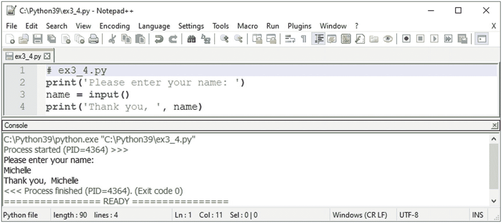
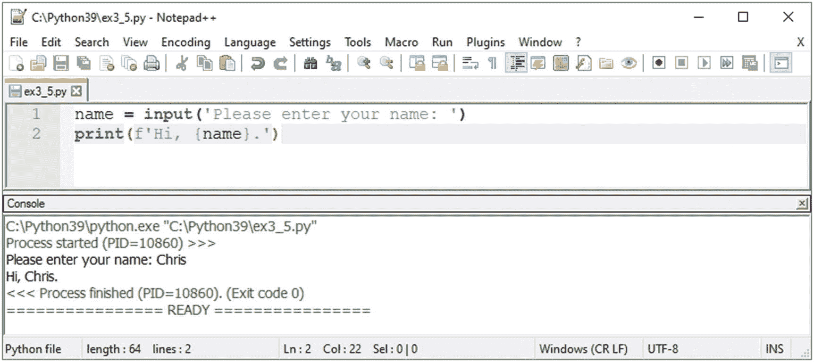
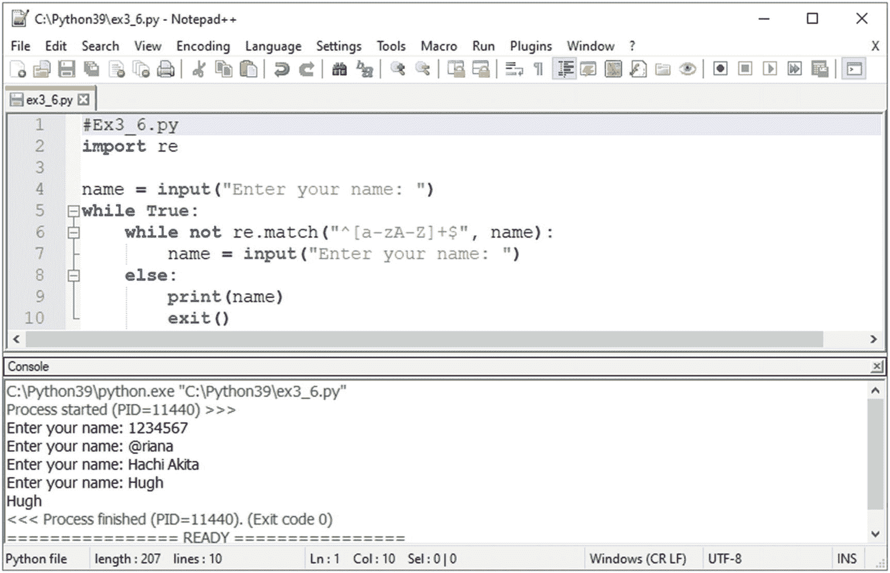
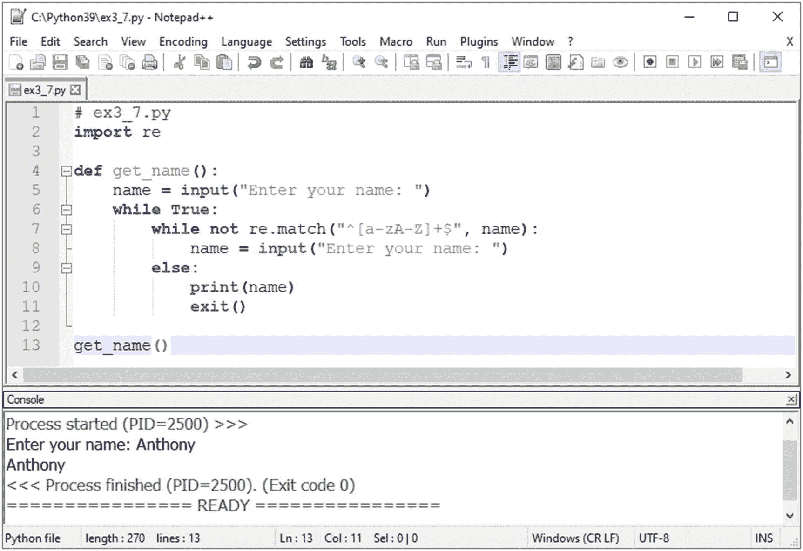
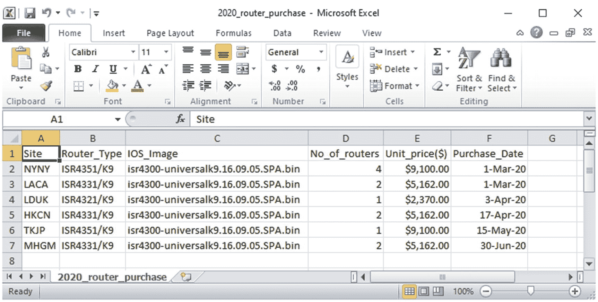
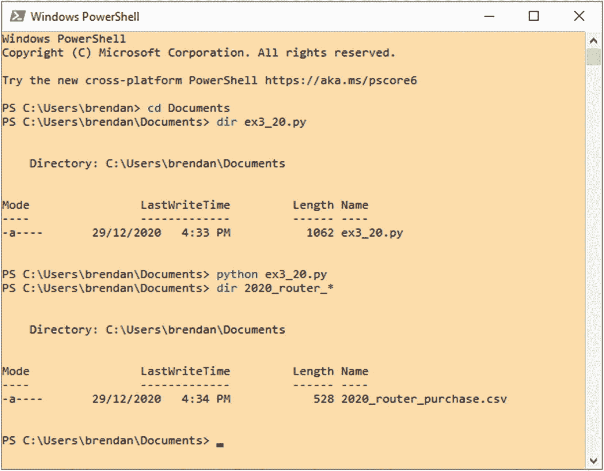

# 3.更多 Python 练习

罗马人借用了一个古老的雅典概念，并把它变成了一句谚语:“Repetito master sturdiorum”，意思是“重复是一切学习之母。”在前一章中，您练习了基本的 Python 概念，但是在本章中，您将获得更多关于更相关的主题和场景的练习。练习的某些部分将包含与你在本书后半部分将要写的脚本直接相关的内容。当我们做本章中的每个练习时，让你的手指打字，但是让你的大脑思考某个练习如何帮助你自动完成部分工作。

## 为练习做准备

本书假设您是使用 Python 的网络自动化新手。当我们看一个典型的 IT 工程师的日常任务时，系统工程师和网络工程师不需要像 DevOps 工程师那样多打字。这只是工作的性质，因为 DevOps 工程师总是在移动，编写代码和创建应用作为各种项目的一部分。换句话说，对于大多数阅读本书的非 DevOps IT 人员来说，您的时间将花在安装、配置和解决您所在领域的各种问题上。在工作时间找时间练习将是一项挑战，因为学习编码和开发自动化应用是没有报酬的。然而，几乎所有的企业 IT 团队都在试图推动他们的 IT 工程师开始学习编程语言并自动化重复性的任务。作为一名优秀的员工和模范 IT 工程师，您可能一直在利用工作时间之外的时间学习 Python。在第一次尝试时，并不是所有人都能理解可编程性概念或学习 Python 基础知识；只要坚持不懈，不断尝试，直到你做到。克服挑战的唯一方法是通过更多的练习。如果您有具体的 Python 挑战，请养成在 Google 上搜索该主题并进一步阅读相关内容的习惯。现在，让我们使用相关的例子获得更多的 Python 实践。

在第 [2](02.html) 章，你学习了 Python 的基础知识。本章将帮助你进行更多的练习，为使用 Python 进行网络自动化做好准备。你练习得越多，你就会越好。

### 练习 3-1:将一个列表和一个元组连接成一个列表

<colgroup><col class="tcol1 align-left"> <col class="tcol2 align-left"></colgroup> 
| ① | `>>> fruits = ['apple', 'orange', 'mango']``>>> vegetables = ('broccoli', 'potato', 'spinach')``>>> favorites = fruits + list(vegetables)``>>> print(favorites)``['apple', 'orange', 'mango', 'broccoli', 'potato', 'spinach']` |

#### 说明

<colgroup><col class="tcol1 align-left"> <col class="tcol2 align-left"></colgroup> 
| ① | 在列表中创建一个变量，在元组中创建一个变量。使用`list()`方法将元组转换成列表。将一个列表和一个元组连接并合并成一个列表。 |

### 练习 3-2:使用 Python 作为计算器

<colgroup><col class="tcol1 align-left"> <col class="tcol2 align-left"></colgroup> 
| ① | `>>> eigrp, ospf, rip = 90, 110, 120``>>> path1, path2, path3 = 3, 6, 9``>>> admin_distance = (eigrp * path1) + (ospf * path2) + (rip * path3)``>>> print(admin_distance)``2010` |

#### 说明

<colgroup><col class="tcol1 align-left"> <col class="tcol2 align-left"></colgroup> 
| ① | 使用 Python 作为计算器，计算管理距离。 |

### 练习 3-3:做一些基本的字符串格式()练习

<colgroup><col class="tcol1 align-left"> <col class="tcol2 align-left"></colgroup> 
| ① | `>>>` `name = 'Hugh'``>>>` `age = 15``>>>` `detail = 'His name is %s and he is %d.'``>>>` `print(detail %(name, age))``His name is Hugh and he is 15.` |
| ②#1#2#3#4 | `>>>` `Name, age, height = 'Hugh', 15, 174.5``>>>` `detail = ('His name is {}, he is {} and {} cm tall.'.format(name, age, height))``>>>` `print(detail)``His name is Hugh, he is 15 and 174.5 cm tall.``>>>` `detail = ('His name is {0}, he is {1} and {2} cm tall.'.format(name, age, height))``>>>` `print(detail)``His name is Hugh, he is 15 and 174.5 cm tall.``>>>` `detail = ('His name is {name}, he is {age} and {height} cm tall.'.format(name='Joshua', age=16, height=178))``>>>` `print(detail)``His name is Joshua, he is 16 and 178 cm tall.``>>>` `detail = ('His name is {0}, he is {age} and {height} cm tall.'.format('Michael', age=12, height=170))``>>>` `print(detail)``His name is Michael, he is 12 and 170 cm tall.` |
| ③ | `>>>` `person = {'height':174.5, 'name':'Hugh', 'age':15}``>>>` `print('{name} is {age} years old and {height} cm tall.'.format(**person))``Hugh is 15 years old and 174.5 cm tall.` |

#### 说明

<colgroup><col class="tcol1 align-left"> <col class="tcol2 align-left"></colgroup> 
| ① | 这是一个基本的字符串(`%s`)和数字(`%d`)格式示例。 |
| ② | #1.`format()`示例:默认参数#2.`format()`示例:位置参数#3.`format()`示例:关键字参数#4.`format()`示例:混合参数 |
| ③ | 这是一个`str.format(**mapping)`的例子。这是 Python 中使用的参数解析的一个例子，所以要特别注意例子中使用的两个星号。 |

### 练习 3-4:询问用户名

用 Notepad++写代码，如图 [3-1](#Fig1) 所示。

图 3-1。

用户输入，感谢用户

<colgroup><col class="tcol1 align-left"> <col class="tcol2 align-left"></colgroup> 
| ① | `# ex3_4.py``print('Please enter your name: ')``name = input()``print('Thank you, ', name)` |

#### 说明

<colgroup><col class="tcol1 align-left"> <col class="tcol2 align-left"></colgroup> 
| ① | 创建一些询问用户名的 Python 代码。您将使用它作为用户名和密码工具开发的基础。当你询问某人的名字时，你会得到一些乐趣。 |

### 练习 3-5:获取用户名:版本 1

编写代码并保存为`ex3_5.py`，在 Notepad++中运行代码。(见图 [3-2](#Fig2) )

图 3-2。

用户输入，说“嗨”

<colgroup><col class="tcol1 align-left"> <col class="tcol2 align-left"></colgroup> 
| ① | `#ex3_5.py``name = input('Please enter your name: ')``print(f'Hi, {name}.')` |

#### 说明

<colgroup><col class="tcol1 align-left"> <col class="tcol2 align-left"></colgroup> 
| ① | 重申一下`ex3_4.py`，在`ex3_5.py`写一些简化代码。代码行的数量已经减少。在本练习中，您将学习如何将两行代码缩减为一行代码，并使用缩写格式方法。 |

### 练习 3-6:获取用户名:版本 2

在 Notepad++上，输入以下代码，将文件另存为`ex3_6.py`并运行代码。(见图 [3-3](#Fig3) )。

图 3-3。

用户输入，获取格式正确的输入

<colgroup><col class="tcol1 align-left"> <col class="tcol2 align-left"></colgroup> 
| ① | `#Ex3_6.py``import re``name = input("Enter your name: ")``while True:``while not re.match("^[a-zA-Z]+$", name):``name = input("Enter your name: ")``else:``print(name)``exit()` |

#### 说明

<colgroup><col class="tcol1 align-left"> <col class="tcol2 align-left"></colgroup> 
| ① | 使用`ex3_5.py`作为基础，您刚刚创建了一个简单的 Python 应用，它根据一些要求询问某人的姓名。您已经导入了`re`(正则表达式)内置 Python 模块，以强制用户提供一个以字母开头的名称，该名称只接受字母。`^[a-zA-Z]+$`表示以一个或多个字母开头并以一个字母结尾的任何字符。因此，yomu 不能输入数字或特殊字符作为名称。如果用户不能遵守这条规则，脚本会一直询问，直到用户提供预期的响应。一旦收到正确的响应，就会打印出名字并退出应用。你将在第 9 章学到更多关于正则表达式的知识。整整一章将致力于学习正则表达式以及如何使用`re`模块。脚本完全是关于数据处理以及我们如何处理它们。我们必须掌握正则表达式，克服对正则表达式的恐惧，才能成为自信的编程工程师。 |

### 练习 3-7:获取用户名:版本 3

输入代码并在 Notepad++上将文件保存为`ex3_7.py`。运行如图 [3-4](#Fig4) 所示的代码。

图 3-4。

用户输入，将用户名脚本放入函数中

<colgroup><col class="tcol1 align-left"> <col class="tcol2 align-left"></colgroup> 
| ① | `# ex3_7.py``import re``def get_name():`1 `name = input("Enter your name: ")`1 `while True:`2 `while not re.match("^[a-zA-Z]+$", name):`3 `name = input("Enter your name: ")`2 `else:`3 `print(name)`3 `exit()``get_name()` |

#### 说明

<colgroup><col class="tcol1 align-left"> <col class="tcol2 align-left"></colgroup> 
| ① | 创建`ex3_7.py`脚本并运行它，学习如何基于`ex3_6.py`创建函数并将其转换成函数。最后一条语句`get_name()`将触发脚本运行。这是与`ex3_6.py`相同的脚本，但是我们已经将它转换成一个函数，这样你就可以理解迭代过程。 |

### 练习 3-8:添加临时文件路径，将 ex3_7.py 作为模块导入，然后运行脚本

<colgroup><col class="tcol1 align-left"> <col class="tcol2 align-left"></colgroup> 
| ① | `C:\Users\brendan>` `python``Python 3.9.1 (tags/v3.9.1:1e5d33e, Dec  7 2020, 17:08:21) [MSC v.1927 64 bit (AMD64)] on win32``Type "help", "copyright", "credits" or "license" for more information.``>>>``import`T2】`Enter your name:` `Brendan``Brendan``C:\Users\brendan>` |
| ② | `# If your script is under a different folder, for example, under 'C:\Users\brendan\Documents\'. You have to manually add the Filepath using append.``>>>` `import sys``>>>``sys.path.append('C:\\Users\\brendan\\Documents\\')`T2】`>>>` `print(sys.path)``['', 'C:\\Python39\\python39.zip', 'C:\\Python39\\DLLs', 'C:\\Python39\\lib', 'C:\\Python39', 'C:\\Python39\\lib\\site-packages',``'C:\\Users\\brendan\\Documents\\'`T2】`>>>` `import ex3_7.py``9``Enter your name: Ryan``Ryan` |

#### 说明

<colgroup><col class="tcol1 align-left"> <col class="tcol2 align-left"></colgroup> 
| ① | 如果在 Python 安装过程中选择了将 Python 3.9 添加到路径，则应该能够将 Python 脚本作为模块调用，并在 Windows 操作系统上的任何位置运行它。如果您忘记了，您可以选择添加一个临时文件路径，如示例②所示。 |
| ② | 打开 Python 命令提示符并添加临时文件路径，以便 Python 可以读取在练习 3-7 中创建的 Python 模块。这里，您添加了一个新的(临时)文件路径，并导入了一个自定义模块，以便从您的解释器会话中运行，从而了解导入和自定义模块是如何工作的。 |

### 练习 3-9:使用逗号在字符串之间添加空格

<colgroup><col class="tcol1 align-left"> <col class="tcol2 align-left"></colgroup> 
| ① | `>>` `print('Around' + 'the' + 'World' + 'in' + '100' + 'days.')``AoundtheWorldin100days.` `# by default, no spaces are added when '+' is used``>>>``print('Around ' + 'the ' + 'World ' + 'in ' + '100 ' + 'days.')`T2】`Around the World in 100 days` `.``>>>` `print('Around', 'the', 'World', 'in', '100', 'days.')``Around the World in 100 days.` `# adds spaces automatically` |

#### 说明

<colgroup><col class="tcol1 align-left"> <col class="tcol2 align-left"></colgroup> 
| ① | 练习前面的练习并比较输出。请注意，在上一个练习中使用了逗号，并且输出在字符串之间添加了空格。 |

### 练习 3-10:练习 if；if 和 else 和 if，elif，和 else

<colgroup><col class="tcol1 align-left"> <col class="tcol2 align-left"></colgroup> 
| ① | `>>>` `y = 5``>>>` `if x > y:``...     print('x is greater than y.')``...``>>>` `# No output as if the statement was False``>>>` `x = 3``>>>` `y = 5``>>>` `if x < y:``...` `print('x is less than y.')``...``x is less than y.` `# prints output as if the statement was True``>>>` `y = 5``>>>` `if x >= y:``...     print('x is greater or equal to y.')``...` `else:``...` `print('x is smaller than y.')``...``x is smaller than y.` `#  prints output of else statement``>>>` `x = 3``>>>` `y = 5``>>>` `z = 3``>>>` `if x < y > z:``...` `print('y is greater than x and greater than z.')``...``y is greater than x and greater than z.` `# all conditions met``>>>` `x = 5``>>>` `y = 10``>>>` `if x < y:``...` `print('x is smaller than y.')``...` `elif x > y:``...` `print('x is greater than y.')``...``else`T2】`...` `print('x is equal to y.')``...``x is smaller than y.` `# if the statement was satisfied` |

#### 说明

<colgroup><col class="tcol1 align-left"> <col class="tcol2 align-left"></colgroup> 
| ① | 你刚刚练了`if`；`if`和`else`；以及`if`、`elif`和`else`。这些练习是不言自明的；这是 Python 的一大魅力。 |

### 练习 3-11:练习 end= ' '

<colgroup><col class="tcol1 align-left"> <col class="tcol2 align-left"></colgroup> 
| ① | `>>>` `for n in range (1, 11):``...` `print(n)``...``1``2``3``[omitted for brevity]``9``10``>>>` `for n in range (1, 11):``...``print(n,`T2】`...``12345678910``>>>``>>>` `for n in range (1, 11):``...``print(n, end=' ')`T2】`...``1 2 3 4 5 6 7 8 9 10``>>>``>>>` `for n in range (1, 11):``...``print(n, end=',')`T2】`...``1,2,3,4,5,6,7,8,9,10,``>>>``>>>` `for n in range (1, 11):``...``print(n, end='/')`T2】`...``1/2/3/4/5/6/7/8/9/10/``>>>``>>>` `for n in range (1, 11):``...``print(n, end='&#124;')`T2】`...``1&#124;2&#124;3&#124;4&#124;5&#124;6&#124;7&#124;8&#124;9&#124;10&#124;``>>>` |

#### 说明

<colgroup><col class="tcol1 align-left"> <col class="tcol2 align-left"></colgroup> 
| ① | 用`end=`练习每个`for ~ in range`语句，并比较结果的变化。 |

### 练习 3-12:练习音域内的～音

<colgroup><col class="tcol1 align-left"> <col class="tcol2 align-left"></colgroup> 
| ① | `>>>` `for n in range (2, 11):``...` `print(("Creating VLAN") + str(n))``...``Creating VLAN2 Creating VLAN3 Creating VLAN4 Creating VLAN5 Creating VLAN6 Creating VLAN7 Creating VLAN8 Creating VLAN9 Creating VLAN10` |

#### 说明

<colgroup><col class="tcol1 align-left"> <col class="tcol2 align-left"></colgroup> 
| ① | 当您必须循环通过几条线路来向网络设备添加配置时,`for ~ in range()`变得非常方便。我们将在后面的 Python 网络自动化实验中应用前面的代码。试着熟悉这个例子。 |

### 练习 3-13:为线 in ~练习

<colgroup><col class="tcol1 align-left"> <col class="tcol2 align-left"></colgroup> 
| ① | `>>>` `txt1 = "Seeya later Alligator"``>>>` `for line in txt1:``...` `print(line)``...``S``e``e``[omitted for brevity]``o``r``>>>` `txt1 = "Seeya later Alligator"``>>>` `for line in txt1:``...` `print(line, end='')``...``Seeya later Alligator` |

#### 说明

<colgroup><col class="tcol1 align-left"> <col class="tcol2 align-left"></colgroup> 
| ① | 对于字符串，可以使用`for line in ~`方法，对于数字会得到和`for n in range()`方法一样的效果。 |

### 练习 3-14:使用 split()方法

<colgroup><col class="tcol1 align-left"> <col class="tcol2 align-left"></colgroup> 
| ① | `>>>` `txt1 = "Seeya later Alligator"``>>>``print(txt1.split())`T2】`['Seeya', 'later', 'Alligator']``>>>``print(txt1.split( ))`T2】`['Seeya', 'later', 'Alligator']``>>>` `print(txt1.split('e', 1))``['S', 'eya later Alligator']` `#splits at first instance of 'e``>>>` `txt2 = (txt1.split('e', 1))``>>>``print(txt2[0])`T2】`S``>>>` `txt3 = (txt1.split('a', 3))``>>>``print(txt3)`T2】`['Seey', ' l', 'ter Allig', 'tor']``>>>``print(txt3[1])`T2】`L` |

#### 说明

<colgroup><col class="tcol1 align-left"> <col class="tcol2 align-left"></colgroup> 
| ① | 当与正则表达式一起使用时，对字符串索引和拼接进行足够的练习会成为一个强大的工具。不幸的是，要成为一名优秀的程序员，我们必须熟悉一般的数据处理:数据收集、数据处理和数据流控制。 |

### 练习 3-15:练习 lstrip()、rstrip()、strip()、upper()、lower()、title()和大写()

<colgroup><col class="tcol1 align-left"> <col class="tcol2 align-left"></colgroup> 
| ① | `>>>` `australia = ' terra australis incognita '``>>``print(australia.title())`T2】`Terra Australis Incognita``>>>``print(australia.rstrip().upper())`T2】`TERRA AUSTRALIS INCOGNITA``>>>``x = (australia.lstrip().lower())`T2】`>>>``print(x.capitalize())`T2】`Terra australis incognita``>>>``print(australia.strip().upper())`T2】`TERRA AUSTRALIS INCOGNITA` |

#### 说明

<colgroup><col class="tcol1 align-left"> <col class="tcol2 align-left"></colgroup> 
| ① | 您刚刚完成了大写和小写以及脱衣法练习。你能想出一些有趣和相关的单词让你练习吗？通过改变单词使其对你有更多的意义，给你的练习增添一些乐趣。 |

### 练习 3-16:创建一个文件并以四种不同的方式读取它

<colgroup><col class="tcol1 align-left"> <col class="tcol2 align-left"></colgroup> 
| ① | `>>>` `with open('test123.txt', 'w') as f:``...` `f.write('This is line 1.\nThis is line 2.\nThis is line 3.\n')``...``48` |
| ② | `>>>` `with open('test123.txt', 'r') as f:``...` `lines = f.readlines()``...` `print(lines)``...``['This is line 1.\n', 'This is line 2.\n', 'This is line 3.\n']` |
| ③ | `>>>` `with open('test123.txt', 'r') as f:``...` `lines = list(f)``...` `print(lines)``...``['This is line 1.\n', 'This is line 2.\n', 'This is line 3.\n']` |
| ④ | `>>>` `f = open('test123.txt', 'r')``>>>` `lines = f.readlines()``>>>` `print(lines)``['This is line 1.\n', 'This is line 2.\n', 'This is line 3.\n']``>>` `f.close()` |
| ⑤号 | `>>>` `f = open('test123.txt', 'r')``>>>` `lines = list(f)``>>>` `print(lines)``['This is line 1.\n', 'This is line 2.\n', 'This is line 3.\n']``f.close()` |

#### 说明

<colgroup><col class="tcol1 align-left"> <col class="tcol2 align-left"></colgroup> 
| ① | 在`w`模式下创建`test123.txt`，写点东西。 |
| ② | 这是用一个`readlines()`例子的`open`方法。 |
| ③ | 这是用一个`list()`例子的`open`方法。 |
| ④ | 这是一个简单的`open()`方法和一个`readlines()`例子。使用后请务必关闭文件。 |
| ⑤号 | 这是一个简单的`open()`方法和一个`list()`例子。确保发出`f.close()`关闭文件。 |

### 练习 3-17:阅读和输出文件以获得更详细的理解

<colgroup><col class="tcol1 align-left"> <col class="tcol2 align-left"></colgroup> 
| ① | `>>>` `with open('test123.txt', 'w') as f:``...` `f.write(' this is a lower casing line.\n')``...``33``>>>` `with open('test123.txt', 'r') as f:``...` `print(f.read())``...``this is a lower casing line.` |
| ② | `>>>` `with open('test123.txt', 'a') as f:``...` `f.write('THIS IS AN UPPER CASING LINE. \nThisIsACamelCasingLine.\n')``...``58` |
| ③ | `>>>` `with open('test123.txt', 'r') as f:``...` `print(f.read())``...``this is a lower casing line. THIS IS AN UPPER CASING LINE.``ThisIsACamelCasingLine` `.``>>>` `with open('test123.txt', 'r') as f:``...` `print(f.readline())``...``this is a lower casing line.``>>>` `with open('test123.txt', 'r') as f:``...` `print(f.readlines())``...``[' this is a lower casing line. \n', 'THIS IS AN UPPER CASING LINE .\n', 'ThisIsACamelCasingLine.\n']` |
| ④ | `>> >>>` `with open('test123.txt', 'r') as f:``...` `print(f.read().lower().strip())``...``this is a lower casing line. this is an upper casing line. thisisacamelcasingline.` |
| ⑤号 | `>>>` `with open('test123.txt', 'r') as f:``...` `x = (f.read().lower().strip())``...` `y = set(x.split())``...` `print(y)``...` `print(len(y))``...``{'lower', 'casing', 'a', 'this', 'is', 'upper', 'thisisacamelcasingline.', 'an', 'line.'} 9` |

#### 说明

<colgroup><col class="tcol1 align-left"> <col class="tcol2 align-left"></colgroup> 
| ① | 创建一个新的`test123.txt`文件。由于文件以`w`模式打开，它将覆盖在练习 3-17 中创建的文件。按照本书中所示的相同方式写入文件。 |
| ② | 您可以在一种模式下向文件中写入更多内容。 |
| ③ | 尝试在三种不同的模式下读取和打印:`read()`、`readline()`、`readlines()`。你看出区别了吗？ |
| ④ | 练习使用其他方法来操作字符串和空格。 |
| ⑤号 | 您将同时使用`set()`和`split()`方法来计算文件中的单词和字符总数。 |

### 练习 3-18:使用 getpass()模块和用户输入

对于本练习，打开 Python IDLE(解释器)编写代码。

<colgroup><col class="tcol1 align-left"> <col class="tcol2 align-left"></colgroup> 
| ① | `>>>` `import getpass``>>>` `def get_pwd():``...` `username = input('Enter username : ')``...` `password = getpass.getpass()``...` `print(username, password)``...``>>>` `get_pwd()``Enter username :` `admin``Password: **********``admin mypassword` |

#### 说明

<colgroup><col class="tcol1 align-left"> <col class="tcol2 align-left"></colgroup> 
| ① | 使用`import`加载`getpass`库。使用`def`把你的密码改成一个函数。然后用`input()`功能询问用户名；然后使用`getpass.getpass()`模块询问用户的密码。输入密码时，`getpass()`模块会隐藏输入的密码。为了测试，我们打印出了用户名和密码。当创建 SSH 和 Telnet 到网络设备的登录请求时,`getpass()`模块很方便。 |

### 练习 3-19:理解编码和解码的区别

<colgroup><col class="tcol1 align-left"> <col class="tcol2 align-left"></colgroup> 
| ① | `>>>` `text_1 = 'Network Automation'``>>>` `print(text_1)``Network Automation``>>>` `byte_1 = text_1.encode()``>>>` `print(byte_1)``b'Network Automation '` |
| ② | `>>>` `byte_2 = b'Mission completed.'``>>>` `print(byte_2)``b'Mission completed. '``>>>` `text_2 = byte_2.decode()``>>>` `print(text_2)``Mission completed.` |

#### 说明

<colgroup><col class="tcol1 align-left"> <col class="tcol2 align-left"></colgroup> 
| ① | 计算机以比特(0 和 1)进行通信，计算机以字节处理文件。但我们人类希望以明文形式与机器交流，因此需要编码和解码。这是一个将字符串转换成字节的简单练习。您将在第 [13](13.html) 章的 Telnet Python 实验室练习中看到这一点。特别记下这个练习。 |
| ② | 在 Python 3 中，所有字符串都被识别为 Unicode，必须使用`decode()`方法来转换字节，字节是计算机理解的二进制流数据。在路由器和交换机等机器上执行命令时，要注意字节到字符串的转换和字符串到字节的转换，以避免代码执行错误。 |

### 练习 3-20:用 csv 模块处理 Python 中的 CSV 文件

图 3-6。

在 Excel 中检查 2020_router_purchase.csv

图 3-5。

运行 CSV 脚本在 Windows PowerShell 上创建 Excel 文件

<colgroup><col class="tcol1 align-left"> <col class="tcol2 align-left"></colgroup> 
| ① | `# Use the following information to create .py called ex3_20.py and save it to your Documents folder.``# ex3_20.py``import csv``with open ('C://Users//brendan//Documents//2020_router_purchase.csv', 'w', newline='' ) as csvfile:``filewriter = csv.writer (csvfile, delimiter = ',', quotechar = '&#124;', quoting = csv.QUOTE_MINIMAL)``filewriter.writerow (['Site', 'Router_Type', 'IOS_Image', 'No_of_routers', 'Unit_price($)', 'Purchase_Date'])``filewriter.writerow(['NYNY', 'ISR4351/K9', 'isr4300-universalk9.16.09.05.SPA.bin', 4, '$ 9100.00', '1-Mar-20'])    filewriter.writerow(['LACA', 'ISR4331/K9', 'isr4300-universalk9.16.09.05.SPA.bin', 2, '$ 5162.00', '1-Mar- 20'])``filewriter.writerow(['LDUK', 'ISR4321/K9', 'isr4300-universalk9.16.09.05.SPA.bin', 1, '$ 2370.00', '3-Apr- 20'])``filewriter.writerow(['HKCN', 'ISR4331/K9', 'isr4300-universalk9.16.09.05.SPA.bin', 2, '$ 5162.00', '17-Apr-20'])``filewriter.writerow(['TKJP', 'ISR4351/K9', 'isr4300-universalk9.16.09.05.SPA.bin', 1, '$ 9100.00', '15-May-20'])``filewriter.writerow(['MHGM', 'ISR4331/K9', 'isr4300-universalk9.16.09.05.SPA.bin', 2, '$ 5162.00', '30-Jun-20'])` |
| ② | 打开 Windows 命令提示符或 Windows PowerShell，运行 Python 代码创建您的 CSV 文件-->(见图 [3-5](#Fig5) )。`PS C:\Users\brendan>``cd Documents`T2】`PS C:\Users\brendan\Documents>``dir ex3_20.py``#`T3】`PS C:\Users\brendan\Documents>``python ex3_20.py``#`T3】`PS C:\Users\brendan\Documents>``dir 2020_router_*``#`T3】 |
| ③ | 使用 Microsoft Excel 打开文件并检查新创建的文件。它看起来应该类似于图 [3-6](#Fig6) 。 |
| ④ | `#` `For Windows users``>>>` `f = open('C://Users//brendan//Documents//2020_router_purchase.csv', 'r')``>>>` `f``<_io.TextIOWrapper name='C://Users//brendan//Documents//2020_router_purchase.csv' mode="r" encoding=``'cp1252'`T2】`#` `For Linux users (optional)``>>>` `f = open ('2020_router_purchase.csv', 'r')``>>>` `f``<_io.TextIOWrapper name = ''2020_router_purchase.csv' mode = 'r' encoding = 'UTF-8'>` |
| ⑤号 | `>>>` `f = open('C://Users//brendan//Documents//2020_router_purchase.csv', 'r')``>>>` `routers = f.read()``>>>` `routers``'Site,Router_Type,IOS_Image,No_of_routers,Unit_price($),Purchase_Date\nNYNY,ISR4351/K9,isr4300- universalk9.16.09.05.SPA.bin,4,$ 9100.00,1-Mar-20\nLACA,ISR4331/K9,isr4300- universalk9.16.09.05.SPA.bin,2,$ 5162.00,1-Mar-20\nLDUK,ISR4321/K9,isr4300- universalk9.16.09.05.SPA.bin,1,$ 2370.00,3-Apr-20\nHKCN,ISR4331/K9,isr4300- universalk9.16.09.05.SPA.bin,2,$ 5162.00,17-Apr-20\nTKJP,ISR4351/K9,isr4300-``universalk9.16.09.05.SPA.bin,1,$ 9100.00,15-May-20\nMHGM,ISR4331/K9,isr4300-``universalk9.16.09.05.SPA.bin,2,$ 5162.00,30-Jun-20\n'``>>>` `print(routers)``Site,Router_Type,IOS_Image,No_of_routers,Unit_price($),Purchase_Date``NYNY,ISR4351/K9,isr4300-universalk9.16.09.05.SPA.bin,4,$ 9100.00,1-Mar-20``LACA,ISR4331/K9,isr4300-universalk9.16.09.05.SPA.bin,2,$ 5162.00,1-Mar- 20``LDUK,ISR4321/K9,isr4300-universalk9.16.09.05.SPA.bin,1,$ 2370.00,3-Apr- 20``HKCN,ISR4331/K9,isr4300-universalk9.16.09.05.SPA.bin,2,$ 5162.00,17-Apr-20``TKJP,ISR4351/K9,isr4300-universalk9.16.09.05.SPA.bin,1,$ 9100.00,15-May-20``MHGM,ISR4331/K9,isr4300-universalk9.16.09.05.SPA.bin,2,$ 5162.00,30-Jun-20``>>>` `f.close ()` |
| ⑥ | `>>> with open('C://Users//brendan//Documents//2020_router_purchase.csv', 'r') as f:``...     routers = f.readlines()``...     for router in routers:``...         print(router, end=(" "))``...``Site,Router_Type,IOS_Image,No_of_routers,Unit_price($),Purchase_Date``NYNY,ISR4351/K9,isr4300-universalk9.16.09.05.SPA.bin,4,$ 9100.00,1-Mar-20``LACA,ISR4331/K9,isr4300-universalk9.16.09.05.SPA.bin,2,$ 5162.00,1-Mar- 20``LDUK,ISR4321/K9,isr4300-universalk9.16.09.05.SPA.bin,1,$ 2370.00,3-Apr- 20``HKCN,ISR4331/K9,isr4300-universalk9.16.09.05.SPA.bin,2,$ 5162.00,17-Apr-20``TKJP,ISR4351/K9,isr4300-universalk9.16.09.05.SPA.bin,1,$ 9100.00,15-May-20``MHGM,ISR4331/K9,isr4300-universalk9.16.09.05.SPA.bin,2,$ 5162.00,30-Jun-20` |

#### 说明

<colgroup><col class="tcol1 align-left"> <col class="tcol2 align-left"></colgroup> 
| ① | 使用这些信息创建一个名为`ex3_20.py`的新代码文件。该文件需要保存在您的`Documents`文件夹中。 |
| ② | 然后打开您选择的命令提示符，运行 Python 命令，使用`ex3_20.py`脚本创建一个 CSV 文件。 |
| ③ | 在 Microsoft Excel 中打开新创建的`2020_router_purchase.csv`文件进行检查。 |
| ④ | 如果您打开并阅读该文件，您可以看到 Windows 创建的文件将使用`cp1252`的编码，而在 Linux 上，UTF-8 编码将被用作默认的解码方法。 |
| ⑤号 | 使用`read()`读取文件。内容是一长串数据。如果您使用`print()`，那么新的行将显示为单独的行，并且变得更容易阅读。 |
| ⑥ | 如果您不想被结尾的`f.close()`语句所困扰，您也可以使用`with open`命令来打开并读取文件。在这个例子中，我们使用`f.readlines()`方法分别读取每一行，然后使用`for`循环调用 CSV 文件中的每一行。花点时间仔细研究一下`read()`、`readlines()`和`readline()`方法之间的区别。 |

### 练习 3-21:输出 CSV 文件

<colgroup><col class="tcol1 align-left"> <col class="tcol2 align-left"></colgroup> 
| ① | `>>>` `f = open('C://Users//brendan//Documents//2020_router_purchase.csv', 'r')``>>>` `for line in f:``...` `print(line.strip())``...``Site,Router_Type,IOS_Image,No_of_routers,Unit_price($),Purchase_Date NYNY,ISR4351/K9,isr4300-universalk9.16.09.05.SPA.bin,4,$ 9100.00,1-Mar-20 LACA,ISR4331/K9,isr4300-universalk9.16.09.05.SPA.bin,2,$ 5162.00,1-Mar-20 LDUK,ISR4321/K9,isr4300-universalk9.16.09.05.SPA.bin,1,$ 2370.00,3-Apr-20 HKCN,ISR4331/K9,isr4300-universalk9.16.09.05.SPA.bin,2,$ 5162.00,17 -Apr-20``TKJP,ISR4351/K9,isr4300-universalk9.16.09.05.SPA.bin,1,$ 9100.00,15 -May-20``MHGM,ISR4331/K9,isr4300-universalk9.16.09.05.SPA.bin,2,$ 5162.00,30 -Jun-20``>>>` `f.close()` |

#### 说明

<colgroup><col class="tcol1 align-left"> <col class="tcol2 align-left"></colgroup> 
| ① | 像在普通文本文件中一样，您可以使用`for`循环方法读取每一行并一次打印一行。确保使用`strip()`方法删除任何前导或尾随空格、换行符或制表符。 |

### 练习 3-22:从 CSV 文件中查找 Cisco ISR 4331 路由器的价格

<colgroup><col class="tcol1 align-left"> <col class="tcol2 align-left"></colgroup> 
| ①*#1**#2**#3**#4**#5* | `>>>` `f = open('C://Users//brendan//Documents//2020_router_purchase.csv', 'r')``>>>` `x = f.read().split('\n')``>>>` `x``['Site,Router_Type,IOS_Image,No_of_routers,Unit_price($),Purchase_Date', 'NYNY,ISR4351/K9,isr4300- universalk9.16.09.05.SPA.bin,4,$ 9100.00,1-Mar-20', 'LACA,ISR4331/K9,isr4300- universalk9.16.09.05.SPA.bin,2,$ 5162.00,1-Mar-20', 'LDUK,ISR4321/K9,isr4300- universalk9.16.09.05.SPA.bin,1,$ 2370.00,3-Apr-20', 'HKCN,ISR4331/K9,isr4300- universalk9.16.09.05.SPA.bin,2,$ 5162.00,17 -Apr-20', 'TKJP,ISR4351/K9,isr4300- universalk9.16.09.05.SPA.bin,1,$ 9100.00,15 -May-20', 'MHGM,ISR4331/K9,isr4300- universalk9.16.09.05.SPA.bin,2,$ 5162.00,30 -Jun-20', '']``>>>` `y = x[2]``>>>` `y``'LACA,ISR4331/K9,isr4300-universalk9.16.09.05.SPA.bin,2,$ 5162.00,1-Mar-20'``>>>` `z = y.split(',')``>>>` `z``['LACA', 'ISR4331/K9', 'isr4300-universalk9.16.09.05.SPA.bin', '2', '$ 5162.00', '1-Mar-20']``>>>` `price_4331 = z[4]``>>>` `print(price_4331)``$ 5162.00` |

#### 说明

<colgroup><col class="tcol1 align-left"> <col class="tcol2 align-left"></colgroup> 
| ① | 在本例中，您刚刚练习了从 CSV 文件中读取数据并提取特定信息。#1.`read().split()`方法读取文件，分割项目，并将项目保存在每行的列表中。#2. *x* 的索引 2 被分配给变量`y`。#3.再次，`split()`将字符串分解成一个列表。该列表被分配给一个变量`z`。#4.`z`的第五元素或索引 4 元素被分配给一个名为`price_4331`的变量。#5.一台思科 4331 的价格印在屏幕上。 |

### 练习 3-23:计算购买路由器的总成本:无模块

<colgroup><col class="tcol1 align-left"> <col class="tcol2 align-left"></colgroup> 
| ① | `# ex3_23.py``total = 0.0``with open ('C://Users//brendan//Documents//2020_router_purchase.csv', 'r') as f:``headers = next (f)``for line in f:``line = line.strip ()``devices = line.split (',')``devices[4] = devices[4] .strip ('$')``devices[4] = float (devices[4])``devices[3] = int (devices[3])``total += devices[3] * devices[4]``print('Total cost: $', total)` |
| ② | `C:\Users\brendan\Documents>` `python ex3_23.py``Total cost: $ 78842.0` |

#### 说明

<colgroup><col class="tcol1 align-left"> <col class="tcol2 align-left"></colgroup> 
| ① | 使用在练习 3-23 中学到的方法，创建一个名为`ex3_23.py`的程序来计算路由器的总开销。我们把总数的初始值定为 0.0 美元。使用列表中的索引 3 和索引 4 来查找购买路由器的费用。为了避免计算过程中可能出现的错误，我们使用`header=next(f)`来跳过第一行的标题信息。在各种数据类型之间进行拆分、剥离和转换。将脚本保存在`Document`文件夹中，并确保您更改了文件路径以适应您的计算机设置。 |
| ② | 运行 Python 应用，找出购买路由器的总成本。根据我们的剧本，总费用是 78，842 美元。这些练习看起来很深奥而且没有意义，但是在处理有意义的数据和开发实际工作应用时会变得有用。 |

### 练习 3-24:计算购买路由器的总成本:使用 csv 模块

<colgroup><col class="tcol1 align-left"> <col class="tcol2 align-left"></colgroup> 
| ① | `# ex3_24.py``import csv``total = 0.0``with open ('C://Users//brendan//Documents//2020_router_purchase.csv') as f:``rows = csv.reader (f)``headers = next (rows)``for row in rows:``row [4] = row [4].strip ('$')``row [4] = float(row [4])``row [3] = int(row [3])``total += row[3] * row[4]``print('Total cost: $', total)` |
| ② | `C:\Users\brendan\Documents>` `python ex3_24.py``Total cost: $ 78842.0` |

#### 说明

<colgroup><col class="tcol1 align-left"> <col class="tcol2 align-left"></colgroup> 
| ① | 我们使用 Python 内置的`csv`模块重新创建了同一个应用。首先，导入`csv`模块，并遵循相同的条带化和数据类型转换过程。编程中有一句名言，“剥猫皮的方法不止一种。” |
| ② | 运行新代码，但总成本是一样的。 |

正如我们之前讨论的，本章只涵盖了基本的和特定的 Python 主题。我建议您阅读其他基本的 Python 书籍，并深入本书中讨论的主题。干得好！您已经完成了基本的 Python 练习，为一些 Python 网络自动化做好了准备，但更多高级主题将在后面的章节中介绍。

### 练习 3-25:转换 dd-mmm-yy 并计算天数和年数的差值

在从事网络工作时，您会注意到不同的供应商在他们的软件中有不同的日期和时间格式。一个很好的例子是思科路由器和交换机的日期格式。当我处理从实际的 Cisco IOS 软件中收集的数据时，我不得不花一个小时来转换和处理特定格式的 Cisco IOS 发布日期，并计算出 IOS 映像自发布日期以来的时间。这个练习来自一个真实的生产示例脚本。下面是给出的 IOS 发布日期的格式:12-Jul-17。

目标是操纵日期并将其转换为正确的格式，这样 Python 就可以计算出 IOS 自发布之日起有多长时间了。请注意，您的日期将与本例中给出的结果不同，因为它使用`today()`作为计算日期。首先遵循示例①，然后遵循迭代示例②。

<colgroup><col class="tcol1 align-left"> <col class="tcol2 align-left"></colgroup> 
| ①`#1``#2``#3``#4``#5``#6``#7``#8``#9``#10``#11``#12``#13` | `# Follow this exercise in Python IDLE``>>>` `from datetime import datetime``>>>` `IOS_rel_date = '12-Jul-17'``>>>` `x = IOS_rel_date.replace('-', ' ')``>>>` `y = datetime.strptime(x, '%d %b %y')``>>>` `y``datetime.datetime(2017, 7, 12, 0, 0)``>>>``y.date()`T2】`>>>` `y_day = y.date()``>>>` `datetime.today()``datetime.datetime(2020, 4, 15, 11, 56, 3, 370515)``>>>` `datetime.today().date()``datetime.date(2020, 4, 15)``>>>` `t_day = datetime.today().date()``>>>` `delta = t_day - y_day``>>>` `print(delta.days)``1008``>>> years = round(((delta.days)/365), 2)``2.76` |
| ② | `# Reiterated and reduced version of example 1:``>>>` `from datetime import datetime``>>>` `x = IOS_rel_date.replace('-', ' ')``>>>` `y_day = (datetime.strptime(x, '%d %b %y')).date()``>>>` `t_day = datetime.today().date()``>>>` `delta = t_day - y_day``>>>` `years = round(((delta.days)/365), 2)``>>>` `print(years)``2.76` |

#### 说明

<colgroup><col class="tcol1 align-left"> <col class="tcol2 align-left"></colgroup> 
| ① | #1.从日期时间库中导入日期时间模块。我们需要这个库来完成我们的挑战。#2.以字符串形式输入 IOS 发布日期，开始本练习。#3.用空格替换`-`。#4.使用 datetime 模块的`strptime`方法将`x`转换为正确的日期格式。`%d`代表天数，`%b`代表缩写月份，如一月、六月、七月，`%y`代表缩写年份，没有前两位数字。Python 的 datetime 模块期望日期采用特定的格式，我们正在尝试规范化格式以实现我们的目标。#5.现在输入`y`来检查当前的格式。它有两个由逗号分隔的 0，即小时和分钟。我们必须去掉这两个零。#6.现在使用`y`上的`date()`方法删除小时和分钟信息。在应用之前先检查一下。这是解决一半挑战所需的日期格式。我们现在达到了 50%。#7.现在我们对日期格式满意了，所以把它赋给变量`y_day`。#8.是时候处理今天的日期了。为了找到 IOS 发布以来的天数，我们需要计算出今天是几号，然后减去发布日期。再次使用`datetime()`模块，这次是在`today()`上。#9.如果结果可以接受，那么在后面追加`.date()`以删除时间元素。这将以正确的格式返回日期。#10.现在将 9 号中的对象赋给一个变量`t_day`。#11.两个日期之间的差值为`t_day`–`y_day`。#12.打印结果，它将返回天数的增量。#13.现在将 delta 除以 365 天，将天数转换为年数。使用`round()`功能给出最后两位小数。这个单独的练习将让您对如何处理特定的数据有所了解，在本例中是日期。 |
| ② | 该实例是实例 1 的重复版本。我将一些函数压缩成一行，以缩短转换过程。这只是数据操作的一个例子，还有许多其他方法可以完成同样的转换。尽管如此，重要的是理解思维过程，这样你就可以根据你的情况来调整它。最后，如果您有 10 分钟的时间，请访问以下网站，查看有哪些 *strftime* 代码格式: [`https://strftime.org/`](https://strftime.org/) 。 |

## 探索 Python IDE 环境

完成本章后，您需要开始考虑 Python 代码开发的集成开发环境(IDE)。在文本编辑器中工作很简单，但也有其局限性。在 IDE 中工作并不是强制性的，但是当您编写更复杂和更长的 Python 代码时，当使用文本编辑器(如 Windows 上的 Notepad、EditPlus 或 Notepad++或 Linux 上的 vi、Emacs、Gedit 或 nano)时，您的编码效率会下降。ide 提供了许多标准文本编辑器所没有的特性。当您与团队成员协作时，文档的版本控制突然变得至关重要。许多组织使用带有云存储的 GitHub 作为他们的代码版本控制解决方案。不过，在这个阶段，您不必担心 GitHub 或版本控制。你必须先学会爬行，然后才能走路。因此，在本书的这一部分之外，不再讨论这个话题。在本书中，您不必开始使用 IDE 应用，但是我鼓励您一次探索一个，并找到与您的编码风格最匹配的应用。在企业 Linux 系统上，你很少看到图形用户界面(GUI)，所以这里只讨论兼容 Windows 的 ide。为了帮助您探索适用于 Windows 的各种 Python IDEs，请参见表 [3-1](#Tab1) 。虽然 Jupyter Notebook (Anaconda)不是一个 IDE，但它包含在表 [3-1](#Tab1) 中，给你提供了学习 Python 的另一条途径。

表 3-1。

Python IDEs 和 Anaconda (Jupyter 笔记本)

<colgroup><col class="tcol1 align-left"> <col class="tcol2 align-left"></colgroup> 
| 

推荐的 IDE

 | 

利弊，下载网址

 |
| --- | --- |
| **PyCharm*** | **优点**:功能丰富，直观的用户界面，支持跨平台，专为 Python 打造，免费社区版，对初学者和专家都很友好**缺点**:付费专业版**URL** : [`https://www.jetbrains.com/pycharm/download/`](https://www.jetbrains.com/pycharm/download/) |
| **微软 Visual Studio** | 优点:Windows 友好，易于使用(尤其是如果你是 Windows 用户)，功能丰富，社区版本免费**缺点**:界面启动会比较慢。**URL** : [`https://visualstudio.microsoft.com/vs/features/python/`](https://visualstudio.microsoft.com/vs/features/python/) |
| **月食** | 优点:多种编程语言支持，熟悉的用户界面，免费缺点 : JRE (JDK)依赖，对初学者来说很难设置，老的 IDE**URL** : [`https://www.eclipse.org/downloads/packages/installer`](https://www.eclipse.org/downloads/packages/installer) |
| **原子** | **优点**:由 GitHub 的电子文本编辑器开发，支持跨平台和多种编程语言，通过扩展和插件提供丰富的功能，关于应用编程接口(API)的良好文档，免费，易于使用，轻便但仍然强大缺点:不如 PyCharm 直观，比 PyCharm 更接近文本编辑器**URL** : [`https://atom.io/`](https://atom.io/) |
| **崇高正文 3** | **优点**:流行的代码编辑器，具有快速、稳定、成熟的用户界面；许多具有模块化方法和可扩展性的特性缺点:不像其他 IDE 那样通用，感觉更像是文本编辑器而不是 IDE，必须购买许可证才能继续使用，没有调试选项**URL** : [`https://www.sublimetext.com/3`](https://www.sublimetext.com/3) |
| **anaconda–jupyter 笔记型电脑** | 优点:初学者友好，优秀的 Python 学习工具，基于网络，被科学界用于数据分析**缺点**:不是 IDE，基于网络，系统资源多**URL** : [`https://jupyter.org/install`](https://jupyter.org/install) |

## 摘要

这一章很简短，但是包含了比 Python 的`print()`函数和语法更多的内容。这一章作为一个测试章节，让你对下一章的内容有所了解；通过查看一些新的 Python 模块、处理文件以及使用简单的 Python 代码处理数据，您学习了更多的 Python 基础知识。第 [2](02.html) 和第 [3](03.html) 章应该作为本书后面介绍的 Python 网络自动化实验室的良好基础。如果你仍然没有完全理解练习的某些部分，可以回头重复练习两到三次。如果你有时间，在你读到第 [11](11.html) 章的时候，你应该把这两章的练习重复三遍。第 [4](04.html) 至 [6](06.html) 章将着重于构建虚拟集成的 Python 网络自动化实验室，从安装 VMware Workstation Pro 开始。是时候进入第 [4 章](04.html)学习 VMware 工作站基础知识和一般虚拟化技术基础知识了。VMware Workstation 及其虚拟化技术将帮助您构建完整的虚拟网络实验室，并作为实验室中虚拟机的粘合剂，因此我建议您完整阅读下一章。

## 故事时间 2:机器大战人类，第一次对抗

根据维基百科，第一次机器与人类的对抗发生在 19 世纪 70 年代左右的美国，当时一位名叫约翰·亨利的矿工为了修建铁路隧道向自动蒸汽钻机发起挑战。约翰·亨利的故事在美国童谣中流传到了年轻一代。在过去，要钻一条铁路隧道，铁路矿工必须使用锤子、凿子和钻头来打洞，并使用炸药来炸毁陆地以建造隧道。这场人机竞赛在美国变得如此著名，以至于约翰·亨利对抗蒸汽机的故事成了美国民间传说。根据这个故事，隧道挖掘比赛进行了一天半，以钻炸药洞和铺设轨道。

根据这个民间故事，约翰·亨利打败了蒸汽钻，并在捍卫自己的工作时取得了胜利。可悲的是，根据这个故事，约翰·亨利由于疲劳和比赛后的严重压力而死于心脏病发作。当然，第二天和接下来的几天，蒸汽钻继续钻孔。显而易见的是，约翰·亨利和他的同事们的工作正在自动化，美国铁路公司毫不犹豫地用机器取代了矿工。第一次工业革命期间，农业和制造业也发生了同样的事情，人类任务的自动化今天仍在继续，未来也将继续。

根据维基百科，“自动化是一种在最少人工协助下执行流程或程序的技术。”我们都同意自动化总体上提高了人类的生活质量，但自动化硬币总是有两面。约翰·亨利是一个简单的矿工，以挖洞为生，几乎没有接受过机械或机器操作方面的教育。对他来说，学习如何操作重型机械，蒸汽钻，这是 19 世纪 70 年代最新最伟大的技术，是一项挑战。因此，对于这个可怜的家伙来说，从一份旧工作转换到一份新工作几乎是不可能的。看看今天的自动化和 IT 自动化，特别是，现有的工程师已经发现自己处于与 John Henry 相同的情况，并且随着 IT 技术的快速发展，将来会有更多的工程师面临困难。信息技术的进步将取代许多现有的信息技术工作。尽管如此，好消息是，新技术也将为那些不断学习如何在尖端 IT 行业生存的人创造新的工作和机会。如果你的工作实现了自动化，你发现自己失业了，你会因为失业而感到痛苦，但如果你一直在准备过渡到 it 自动化，你可能也会乐在其中。

*来源:* [`https://en.wikipedia.org/wiki/John_Henry_`](https://en.wikipedia.org/wiki/John_Henry_) `(folklore)`