# 四、VMware Workstation 简介

VMware Workstation Pro 是企业 IT 人员最常用的终端用户桌面虚拟化解决方案之一。它允许 It 工程师从他们自己的 PC/笔记本电脑上构建和测试类似真实世界的虚拟机和网络设备。学习在一台计算机上构建一个功能完整的集成虚拟实验室，并在一台 PC 上掌握 Python 网络自动化基础知识是本书的根本目标。本章旨在向您介绍最流行、最通用的 VMware 产品 VMware Workstation 15 Pro 的基础知识，以及基本的虚拟化概念。阅读本章后，您将获得以下知识:您将了解类型 1 和类型 2 虚拟机管理程序之间的区别，了解提供不同桌面虚拟化解决方案的各种 IT 供应商，了解如何安装 VMware Workstation，了解如何在 VMware Workstation 上执行常规管理，以及了解 VMware Workstation 的网络适配器如何工作。

## VMware 工作站概览

VMware 于 1998 年在加利福尼亚州的帕洛阿尔托成立，二十多年来，该公司一直在发展壮大并引领着企业虚拟化市场。除了本书的前三章，本书将依赖于 VMware 的桌面虚拟化技术，即 VMware Workstation 15 Pro。在开始学习 Python 自动化之前，您必须对各种 IT 技术保持开放的态度。学习编写 Python 代码并不保证您的网络自动化尝试会成功。您将需要学习正则表达式和 Linux 管理，这些主题通常超出了网络工程师的舒适范围，但是对于编写功能性代码是必不可少的。没错；通往 Python 网络自动化的道路崎岖不平。对于一个初学 Python 的人来说，独自学习 Python 语法可能需要几个月的时间，而且可能需要几年才能称自己是这种编程语言的专家。然而，更大的挑战是将 Pythonic 概念和语法应用到您的工作中。您需要在当前网络和一般 IT 知识的基础上学习和构建 Python 知识。编写 Python 代码只是你旅程的第一步。它要求您更好地理解 Linux、网络、简单的数学、正则表达式、与几个 API 的交互等等。

在时间和资源有限的情况下，您正试图学习使用 Python 在网络自动化领域取得良好开端所需的基本技能，所有学习都将在一台 Windows PC(或一台笔记本电脑)上进行。为此，我们必须利用 VMware 桌面虚拟化解决方案的强大功能。使用 VMware Workstation 15 的原因很简单。它为像您这样的 Python 编程新手提供了一个实用而简单的虚拟实验室，可以在多种场景中学习。

首先，我们必须熟悉基本的虚拟化概念和 VMware Workstation 15 的一些基本功能。即使您是各种虚拟化解决方案(包括 VMware 产品)的长期用户，您也会从本章中学到一些新东西，所以我希望您能完整地阅读本章。读完这一章后，你将毫无问题地理解本书的其余内容，并最终建立一个 Python 网络自动化实验室。在前一章中，您在您的主机 Windows PC 上安装了 Python 3，并在 Windows 10 上学习了 Python 基础知识。但是，在本章和后面的章节中，将指导您使用 VMware Workstation 15 Pro 在同一台 Windows 主机上安装两种版本的 Linux 分发服务器。因此，您也可以轻松地学习 Linux 服务器的 Python 基础，并在第 [7](07.html) 和 [8](08.html) 章开始学习 Linux 基本管理技能。要运行各种操作系统，我们得使用虚拟化技术来帮助我们在同一个主机平台上运行多台机器；VMware Workstation 15 可以帮助我们。作为本章准备工作的一部分，您将在您的 PC 上下载并安装 VMware Workstation 15。之后，您将学习 VMware Workstation 15 的基础知识，然后在以下两章中安装最新版本的 Ubuntu 20 和 CentOS 8 服务器。在整本书中，这些服务器将用于教您 Linux 管理、Python 安装和 Python 模块安装，以及如何将 CentOS 服务器构建为一体化 IP 服务服务器，该服务器可在本书末尾的概念验证(PoC)实验室中用作小刀工具。

您对 VMware Workstation 15 的特性和基本虚拟化功能了解得越多，您就越能更有效地构建这个测试实验室环境。在为企业 IT 解决方案设计和构建 PoC 实验室时，通常只部署昂贵且功能极其强大的设备来测试最简单的概念。有时需要真实的设备，例如，在与硬件相关的系统性能测试中进行压力测试。此外，购买合适设备的采购过程可能需要数周甚至数月时间。如何找到具有足够电源电压和冷却能力的机架空间，以保持您的实验室平稳运行？此外，物理实验室包括使用正确连接器类型的正确电缆，以适应供应商的设备接口，这可能会降低您构建公司的概念验证实验室的速度。通常情况下，公司实验室只有公司的几个人使用，因此浪费了数千美元。这完全是浪费公司的钱，而且，球场的这一边肯定没有绿色 IT。由于过去十年虚拟化技术的进步，越来越多的设备正在迁移到虚拟化平台，正如您所看到的基于云的计算和软件即服务 IT 产品的爆炸式增长，任何 IT 即服务都以这样或那样的形式利用虚拟化技术的力量。

VMware Workstation 15 Pro 是 VMware 最受欢迎的跨平台桌面虚拟化计划，支持 Windows 和 Linux。对于 macOS 操作系统，VMware Fusion 提供了相同的功能。有一个免费版的 VMware Workstation Player，但是它缺少让您的实验室成为一个完整实验室所需的所有功能。因此，您将使用 VMware Workstation 15 Pro。您将在 Microsoft Windows 10 主机系统上安装一系列软件应用，每次安装一个。根据维基百科的数据，2017 年的数据表明，使用 Windows 操作系统帐户的台式机/笔记本电脑用户的比例约为 88%，macOS 用户约占 10%，最后，世界上只有 2%的 Linux 台式机/笔记本电脑用户。从我自己的经验来看，即使在 IT 行业内部，也反映了类似的用户百分比。然而，由于基于 Python 的企业级自动化解决方案是首选的编程语言，Linux 是默认的操作系统，具有更高的灵活性、更高的性能、更低的拥有成本和更好的安全性。

您可以从 VMware 官方网站下载 Workstation 15 Pro Evaluation for Windows，并享受 30 天的免费试用期。30 天后，您可以购买 15.5 版许可证并永久激活评估软件。写这本书的时候，最新的 VMware Workstation for Windows 版本是 15.5.1，build 15018445，但是你下载的版本会更新一些(15.5 版甚至 16.x 版)，但是应该还是能和本书推荐的大部分软件一起工作。供您参考，VMware Workstation 的版本 13 从未发布，版本 14 已发布，但它在 GNS3 集成方面有多个错误。奇怪的是，GNS3 和思科 VIRL IOS 软件在 VMware Workstation 12.5.x 或 15.x 上运行最佳，但在 14.x 版本上则不行。因此，如果您正在使用 VMware 14，您必须升级到最新的 VMware Workstation 15.x 版本，以避免出现任何问题。还建议您禁用自动更新功能，以保持您的软件版本始终稳定。这个兼容性建议是基于我的软件兼容性测试。图 [4-1](#Fig1) 显示了本书中使用的 VMware Workstation 15 Pro 的产品信息(文件名:`VMware-workstation-full-15.5.1-15018445.exe`)。

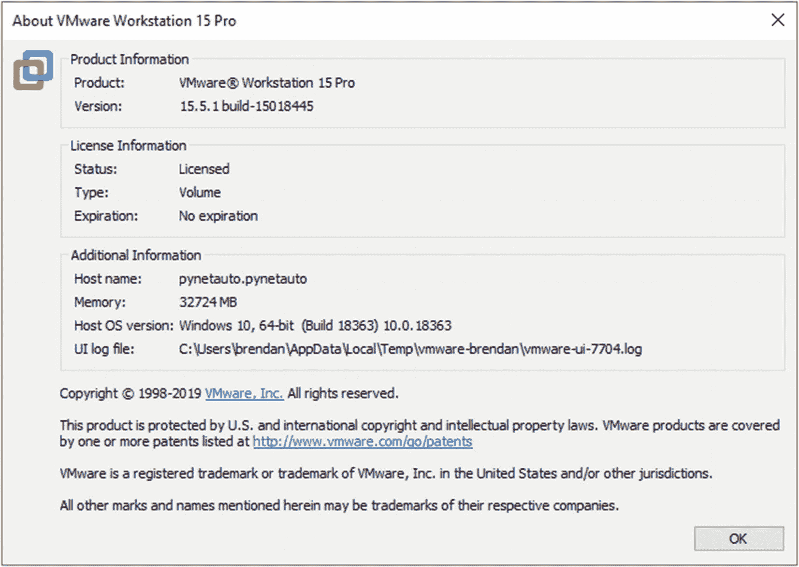

图 4-1。

关于 VMware Workstation 15 Pro

即使您还不熟悉虚拟化的概念和该软件，学习本章内容也不会有任何问题，因为本书假设您以前没有使用该 VMware 产品的经验。那些不熟悉像这样的桌面虚拟化程序的人仍然可以通读这一章来熟悉这个软件和一些基本的桌面虚拟化概念。对于那些有多年虚拟化经验的人，请浏览本章并跳到下两章，其中包括安装 Ubuntu 20.04 和 CentOS 8 Linux 虚拟机(VM)。

### 第 1 类与第 2 类虚拟机管理程序

关于虚拟化(虚拟机管理程序)软件，首先要了解的是类型 1 和类型 2 虚拟机管理程序之间的区别。为了解释类型 1 和类型 2 虚拟化软件之间的差异，如果主机硬件不需要单独的操作系统软件，则虚拟化软件直接在主机硬件上执行。它被归类为 1 类虚拟机管理程序。如果托管硬件需要单独的操作系统软件，则被归类为第 2 类虚拟机管理程序。更直白地说，类型 1 虚拟机管理程序通常用于业务用途，类型 2 虚拟机管理程序设计用于个人和实验用途。这并不意味着 Type-2 不应该用于商业用途。但是，在商业环境中，几乎没有理由使用类型 2 虚拟机管理程序而不是类型 1 虚拟机管理程序，因为类型 1 虚拟机管理程序提供了更好的稳定性、高可用性和更好的可扩展性功能。Type-1 虚拟机管理程序系列，也称为*裸机*，是指发布时没有内置操作系统软件的企业级服务器平台。典型的第 1 类虚拟机管理程序产品包括 VMware 的 ESXi、微软的 Hyper-V for Servers、Citrix 的 XenServer 和 Oracle VM。

相比之下，为桌面应用开发的第二类虚拟机管理程序的示例包括 VMware 的 VMware Workstation、Fusion、Player、Oracle 的 VM VirtualBox(以前为 Sun Microsystems)、Microsoft 的 VirtualPC 和 Red Hat 的企业虚拟化。第二类虚拟机管理程序也称为桌面(或托管)虚拟机管理程序。本书中使用的 VMware Workstation 15 Pro 运行在 Windows 10 主机上，使其成为第 2 类虚拟机管理程序。

### 用于概念验证实验室的 VMware Workstation Pro

VMware Workstation 15 Pro 是 VMware 的旗舰桌面虚拟化计划。版本 1 发布于 1999 年，最新版本是在撰写本书时的 16 版本。虽然这本书是基于 15.x 版本，但是你基于 16.x 版本搭建实验室不会有问题，安装和使用这个桌面程序是直观的任务，不需要用户培训就可以使用。它支持 Windows 和 Linux 操作系统。运行在操作系统之上的虚拟程序，如 VMware Workstation，有时被称为*实验虚拟化程序*，最新的软件试用版可从 VMware 的官方下载页面获得。基本安装很简单，只需按几个按钮就可以完成安装。如果您没有有效的许可证，该程序将在 30 天的试用许可证上运行。经过 30 天的试用期后，您可以在购买许可证后继续使用该软件。

当然，在选择实验室使用的桌面虚拟化软件时，您会发现来自微软和甲骨文的其他流行软件。甲骨文的 VirtualBox 和微软的 Hyper-V 被认为是 VMware Workstation 的替代品，但因为软件兼容性和系统稳定性，我们将使用 VMware Workstation 15 Pro。考虑了企业级虚拟化计划，如 VMware 的 ESXi 和微软的 Hyper-V，但此类第 1 类虚拟机管理程序对硬件规格的要求更高。例如，类型 1 虚拟机管理程序软件需要安装在特定于虚拟机管理程序的硬件(裸机)服务器上。此外，您还需要一台单独的客户端 PC 来远程控制服务器，以运行第 1 类虚拟机管理程序软件。此外，第 1 类虚拟机管理程序通常部署在数据中心或公司通信室，并不意味着是移动的。

## 使用 VMware Workstation 之前

安装 ESXi 6.5 等第 1 类虚拟机管理程序软件时，安装过程中有一些严格的硬件要求。该软件具有检查最低硬件要求的内置过程。幸运的是，对于在您的主机操作系统上安装 VMware Workstation 15 Pro，没有或只有最低限度的硬件先决条件。如果您的计算机的 CPU 和主板支持虚拟化技术，那么您可以开始安装。新型电脑或笔记本电脑的 BIOS 出厂时启用了虚拟化技术选项。如果您使用的是较旧类型的 PC 或笔记本电脑，则需要启用此设置，但这是在 PC 上安装软件之前唯一需要更改的内容。直到最近，VMware 的虚拟化解决方案倾向于支持英特尔的 CPU 架构，而不是 AMD 的 CPU 架构。以我自己的经验来看，英特尔 CPU 在性能、兼容性和效率方面远远优于 AMD CPUs。当然，AMD 最近在 CPU 开发上投入了大量资金，但 AMD CPUs 更适合喜欢 PC 游戏的个人用户。

在安装 VMware Workstation 15 Pro 之前，请确保在进入笔记本电脑/PC 主板的 BIOS 后将虚拟化支持设置为启用，如图 [4-2](#Fig2) 所示。

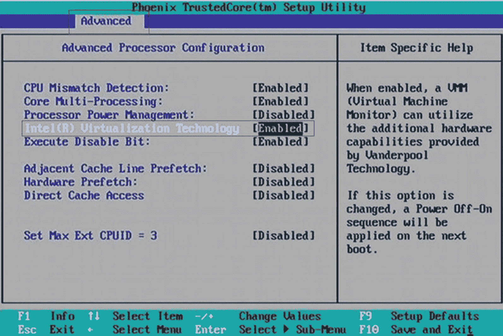

图 4-2。

检查英特尔 CPU 主板虚拟化支持设置

如果在 BIOS 中将英特尔 VT(或 AMD-V)的使用设置为禁用，则将设置更改为启用，然后按 F10 键保存更改并正常登录 Windows 10。表 [4-1](#Tab1) 和 [4-2](#Tab2) 列出了主要主板和笔记本电脑制造商的 BIOS 条目密钥。进入 BIOS 的功能键或组合键因制造商而异，这里提供了最常见的制造商键供您参考。如果您在表中找不到您的笔记本电脑制造商，请访问制造商的网站并找到 BIOS 信息以更改 BIOS 设置。

表 4-2。

主板的 BIOS 设置入口键

<colgroup><col class="tcol1 align-left"> <col class="tcol2 align-left"></colgroup> 
| 

制造商

 | 

BIOS 键/组合键

 |
| --- | --- |
| 亚斯洛克 | F11 |
| 华硕 | F12/F2/F8/F9 |
| 生物星(BIOSTAR) | F7/F9 |
| 康柏电脑公司(美著名电脑制造商) | F10 |
| EMTec 公司 | F9 |
| 富士康 | F7/Esc 键 |
| 十亿字节 | F12 |
| 大功率(High Power)ˌ高压(High Pressure)ˌ高性能(High Performance)ˌ高聚物(High Polymer) | F9 |
| 美国英特尔公司(财富 500 强公司之一ˌ以生产 CPU 芯片著称) | F10 |
| 水平规ˌ水准仪(Level Gauge) | F12 |
| 中规模集成电路（medium-scale integration 的缩写） | F11 |
| 佩帕托伦 | F11 |
| 三星电子 | 经济社会委员会 |
| 其他的 | 请参考相应的供应商网站 |

表 4-1。

笔记本电脑制造商提供的 BIOS 设置入口密钥

<colgroup><col class="tcol1 align-left"> <col class="tcol2 align-left"></colgroup> 
| 

制造商

 | 

BIOS 组合键

 |
| --- | --- |
| 宏基电脑公司 | F2/Del(新建)F1/Ctrl+Alt+Esc(旧) |
| 华硕 | F2/F10/Del/Insert/Alt+F10 |
| 康柏电脑公司(美著名电脑制造商) | F1/F2/F10/Del |
| 幽谷 | F1/Del/F12/F3(新)(当戴尔徽标出现在屏幕上时按下)Ctrl+Alt+Enter/Fn+Esc 或 Fn+F1/Ctrl+F11(旧) |
| 电子机器 | F2/Del 键 |
| 日本富士通公司 | 第二子代 |
| 门 | F1/F2 |
| 大功率(High Power)ˌ高压(High Pressure)ˌ高性能(High Performance)ˌ高聚物(High Polymer) | F1/F2/F6/F9/F10/F11/Esc 平板电脑:F10/F12 |
| 联想（电脑的品牌名） | F1/F2/F11(新)Ctrl+Alt+F3/Ctrl+Alt+Ins/Fn+F1 （舊） |
| 水平规ˌ水准仪(Level Gauge) | F10/F11/F12 |
| 三星电子 | F2/F4 |
| 索尼 | f1/F2/F3/辅助 |
| 东芝 | F2/F1/ESC/F12 |
| 其他的 | 请参考相应的供应商网站 |

这里还有一个关于 VMware Workstation 版本的提醒:VMware Workstation 15 Pro 在发布时的最新版本是 15.5.1 build-15018445。另请注意，版本 14 显示了与本书中使用的一些应用的兼容性问题。该问题被确定为 GNS3 Docker 程序下载流程的安全文件和 VIRL 集成要求。请使用与 GNS3 兼容的最新 15.5 版本。本书使用 15.5.1 版，即编写本章时的最新版本 15.5。如果您没有版本 15 的副本，请使用版本 12。版本 12 还与 GNS3、VIRL 软件和 GNS3 Docker 映像兼容且稳定。在本书的第一稿和技术审查之后，VMware 发布了第 16 版。您应该能够使用 16 版或最新版本，并仍然遵循这本书的内容。目前，请使用 VMware Workstation 15.x Pro 或 16.x 或 12.x，但不要使用 14.x。

阅读本章之前，请在您的 Windows PC 上下载并安装 VMware Workstation 15(或 16) Pro。下载和安装很简单，但是如果您需要帮助，本书提供了下载安装指南的链接。

从以下 URL 下载 VMware Workstation 15/16:

URL: [`https://www.vmware.com/au/products/workstation-pro/workstation-pro-evaluation.html`](https://www.vmware.com/au/products/workstation-pro/workstation-pro-evaluation.html)

“第 4 章准备工作-安装 VMware Workstation”指南可从以下网址获得:

URL: [`https://github.com/pynetauto/apress_pynetauto`](https://github.com/pynetauto/apress_pynetauto)

### VMware Workstation 15 Pro 的下一款产品是什么？

作为本章的准备工作，您必须在主机上安装 VMware Workstation 15 Pro。在安装两台 Linux 虚拟服务器和导入 GNS3 VM 之前，我们将为那些不熟悉虚拟化技术和该计划的人快速回顾一下菜单选项。如果您确信自己对 VMware Workstation 功能了如指掌，请跳到第 [5](05.html) 章。无论如何，你可以把虚拟机(VM)想象成另一台运行在主机操作系统(Type-2)上的独立计算机。用户可以通过 Workstation 15 Pro 的主用户控制台与虚拟机进行交互，并使用各种操作系统安装媒体文件来创建和安装虚拟机，然后配置、导入、导出、控制和管理虚拟机的所有方面。您已经看到了 VMware Workstation 15 Pro 的主用户控制台，并且已经注意到用户界面简洁直观。然而，虚拟机的操作和行为比您最初想象的要复杂得多。虚拟机看起来像一个应用，但它是一台具有真实硬件计算机的许多固有特性的计算机。了解 Workstation 15 Pro 的最佳方式是使用它，但为了让您的学习更容易一些，我们将在下一部分介绍一些与控制台相关的术语。让我们看看用户界面、菜单和虚拟网络编辑器。

快速浏览后，您将被引导至下载和安装几个虚拟机的链接，并使用 GNS3 `.ova`文件下载和导入一个虚拟机。您必须在本章结束时创建所有三个虚拟机，因为本书的其余部分将依赖这些虚拟机来学习 Linux、学习正则表达式、安装 Python 和网络相关模块，以及学习如何在虚拟实验室中编写 Python 网络自动化脚本。为了模拟真实的实验场景，您将测试各种网络概念，并熟悉最常用的文件共享服务。例如，本书的最后几章将包含基于 CentOS 8 虚拟机的 FTP、SFTP 和 TFTP 服务器的实验场景。

或者，如果您想在这里创建新的虚拟机，然后将它们导出到真实的生产环境中，您可以使用 VMware Converter 软件来实现。虚拟机可以在 VMware Workstation 上预留，然后在以后进行转换，将虚拟机转换为在 VMware 的 vSphere 6.5 上运行的类型 1 虚拟机。现在，我们先来看看 Workstation 15 Pro 的主用户控制台及其菜单。

### VMware Workstation 15 Pro 用户控制台

Workstation 15 Pro 用户窗口(或控制台)允许您安装、控制和管理各种类型的虚拟机。图 [4-3](#Fig3) 显示了 VMware Workstation 15 Pro 的主用户界面和默认按钮。该图将为您提供有关菜单和按键的各种功能的信息。使用该程序不需要特殊技能，安装后您可以轻松地创建和使用虚拟机。现在，让我们学习菜单和主要功能。

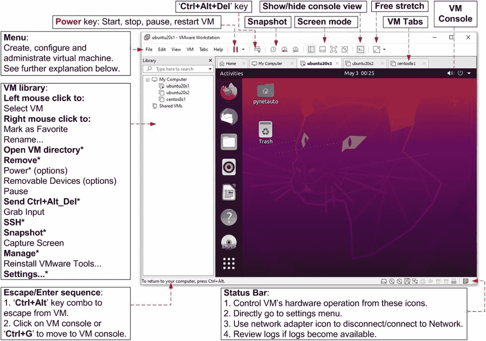

图 4-3。

VMware 工作站，用户窗口

## VMware Workstation 15 Pro 的基本操作

图 [4-4](#Fig4) 描绘了 VMware Workstation 15 Pro 的主用户界面，这是您管理虚拟机的主要界面。与 Windows 10 和 Oracle VirtualBox 上的 Microsoft Hyper-V 相比，VMware Workstation Pro 拥有最友好的用户界面和用户触手可及的强大功能。让我们快速学习一下这个程序最基本的功能。

图 4-4。

VMware 工作站，主用户窗口

### VMware Workstation Pro:基本操作

<colgroup><col class="tcol1 align-left"> <col class="tcol2 align-left"></colgroup> 
| 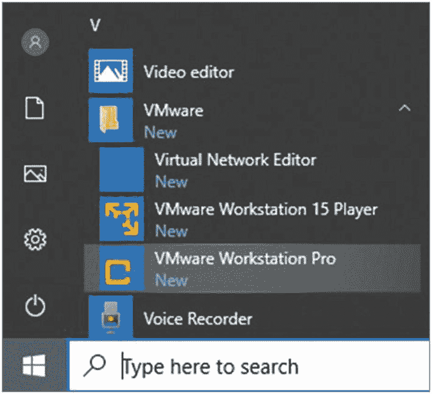图 4-5a。启动 VMware Workstation Pro | **启动 VMware Workstation 15 Pro(图******)**:** **您可以使用 Windows 桌面上的 VMware 快捷方式或 Windows 10 的“开始”菜单启动该程序:开始➤程序➤ VMware ➤ VMware 工作站。**  |
| 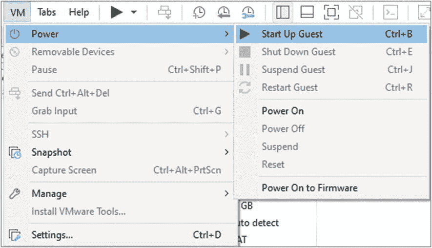图 4-5b。电源选项 1 | **打开/关闭电源，暂停或重置虚拟机(图**[**4-5b**](#Fig6)**)**:打开/关闭或暂停虚拟机的一种方法是从虚拟机菜单中选择虚拟机:虚拟机➤电源➤启动来宾。 |
| 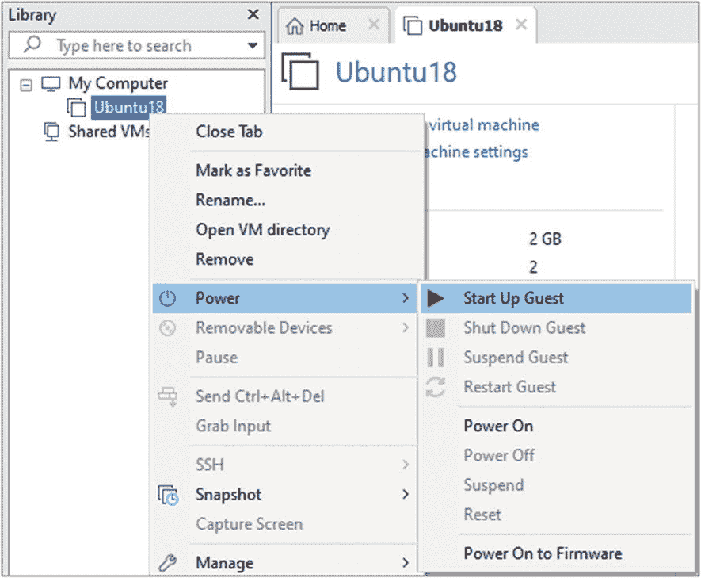图 4-5c。电源选项 2 | 打开/关闭、暂停或重置虚拟机的第二种方法是在虚拟机库中选择虚拟机(图 [4-5c](#Fig7) )。右键单击虚拟机，然后选择电源➤启动来宾。 |
| 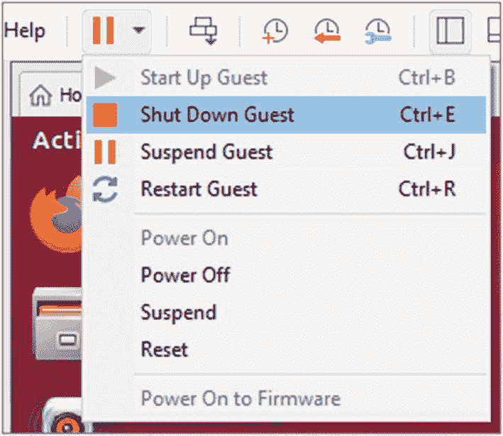图 4-5d。电源选项 3 | 打开/关闭、暂停或重置虚拟机的第三种方式是使用用户窗口顶部的电源键选项(图 [4-5d](#Fig8) )。 |
| 图 4-5e。要迁移到虚拟机 | 要移动到虚拟机(从主机)，请按 Ctrl+G。要使用正在运行的虚拟机，请使用鼠标左键单击虚拟机控制台或按键盘上的 Ctrl+G(图 [4-5e](#Fig9) )。 |
| 图 4-5f。要退出虚拟机 | 要退出虚拟机(将光标移回主机)，请按 Ctrl+Alt。要在使用虚拟机时将鼠标光标退出 Windows 主机，请按 Ctrl+Alt 键退出主机(图 [4-5f](#Fig10) )。 |

更详细的使用说明，请参考 [`https://docs.vmware.com/en/VMware-Workstation-Pro/15.0/workstation-pro-15-user-guide.pdf`](https://docs.vmware.com/en/VMware-Workstation-Pro/15.0/workstation-pro-15-user-guide.pdf) 。

### VMware 工作站菜单

表 [4-3](#Tab3) 一目了然地显示了所有菜单。最常用的功能标有星号(*)。您可能会发现检查功能并跳到创建虚拟机很有帮助。

表 4-3。

菜单一览

<colgroup><col class="tcol1 align-left"> <col class="tcol2 align-left"></colgroup> 
| 

菜单屏幕截图

 | 

菜单功能

 |
| --- | --- |
| 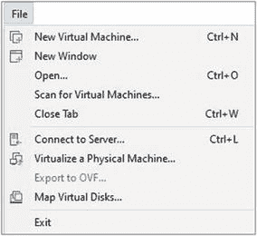文件菜单 | **文件菜单:**创建新的虚拟机打开一个新窗口打开虚拟机*扫描虚拟机关闭选项卡连接到外部服务器、vCenter 和 vSphere 服务器连接到 vCloud Air 创建 p2v(物理到虚拟)导出到 OVF 文件*连接到虚拟磁盘退出* |
| 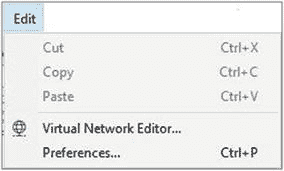编辑菜单 | 编辑菜单:切口复制粘贴虚拟网络编辑器*偏好* |
| 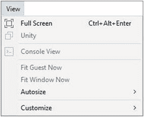查看菜单 | **查看菜单:**全屏查看*统一模式控制台视图使屏幕适合来宾操作系统使屏幕适合窗口自动调整大小自定义视图 |
| 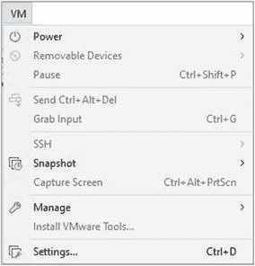VM 菜单 | **VM(虚拟机):**电源*可移动设备中止发送 Ctrl+Alt+Del 键*抓住打字快照管理*屏幕捕获经营 VMware 工具安装设置* |
| 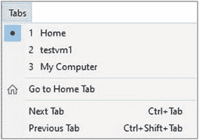标签菜单 | **标签页菜单:**主页前往主屏幕下一个选项卡上一个选项卡 |
| 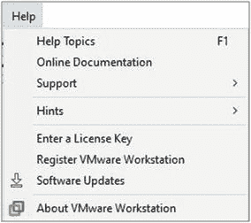帮助菜单 | **帮助:**帮助在线文档支持暗示输入许可证密钥*VMware 工作站注册软件更新关于 VMware Workstation |
| 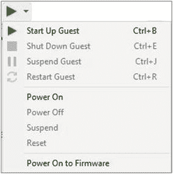虚拟机电源图标 | **虚拟机电源图标:**客人在*客人离开*来宾暂停继续来宾*通电关机中止重置开机时进入 BIOS |
| 发送 Ctrl+Alt+Del 图标 | 向虚拟机发送 Ctrl+Alt+Delete |
| 快照图标 | 拍摄此虚拟机的快照将此虚拟机恢复到其父快照管理此虚拟机的快照 |
| 屏幕模式选项图标 | 显示或隐藏库显示或隐藏缩略图栏进入全屏模式进入统一模式 |
| 显示或隐藏控制台视图图标 | 显示或隐藏控制台视图 |
| 自由拉伸图标 | 自由伸展 |

## 虚拟网络适配器

初学者问的关于 VMware Workstation 15 Pro 的最常见问题之一是如何使用不同的虚拟网络适配器设置。很难一言以蔽之地提供答案；您可以阅读 VMware 网站上不必要的冗长文档，但我们大多数人没有时间阅读供应商提供的文档。在这里，我们将介绍虚拟机网络入门的基础知识。第一次使用的用户需要知道每个虚拟网络适配器之间有什么不同，以及如何使用每个适配器。解释这一点的最佳方式是查看用户可以使用哪些虚拟网络适配器。尝试理解每种网络适配器类型的定义，然后查看程序中不同的适配器设置，以揭示每个适配器在您的 PC 上是如何配置的。首先，让我们看一下虚拟网络编辑器，查看现成的虚拟网络适配器设置。

### 虚拟网络编辑器概述

VMware Workstation 在虚拟交换机中提供虚拟网络功能，其中三个虚拟交换机映射到三个特定网络，用户可以根据需要创建多达 17 个虚拟交换机。不同的网络类型将在下一节详细讨论。因此，您可以拥有多达 20 个虚拟交换机(VMnet0 到 VMnet19)，每个虚拟交换机代表一个平面网络或子网。就像在真实的生产环境中一样，您可以将多个虚拟机连接到同一个网络(虚拟交换机)。首先，打开虚拟网络编辑器菜单，查看哪些默认连接类型可用。

**#** **任务**

1 启动 VMware Workstation Pro 时，最佳做法是通过右键单击桌面图标并选择“以管理员身份运行”选项来启动程序，如图 [4-6](#Fig11) 所示。这样，您就可以使用完全管理员级别的权限来启动程序，以更改任何程序设置。

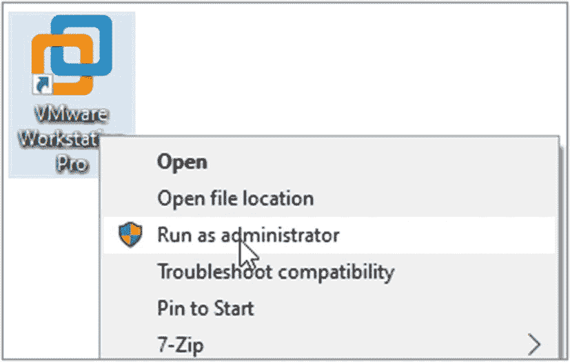

图 4-6。

VMware Workstation Pro，以管理员身份运行

1b 如果您不想每次启动程序时都单击“以管理员身份运行”选项，您可以更改快捷方式属性，使程序以管理员模式运行。转到 VMware Workstation Pro 的桌面图标，单击鼠标右键，选择属性，如图 [4-7](#Fig12) 所示。

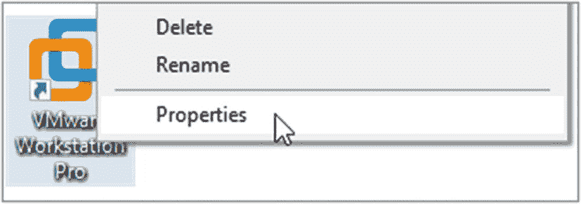

图 4-7。

VMware Workstation Pro，快捷图标属性

在快捷方式属性菜单中，单击兼容性，在设置选项下，选中“以管理员身份运行此程序”，然后单击应用和确定按钮。现在你的程序将总是以管理员身份运行(见图 [4-8](#Fig13) )。

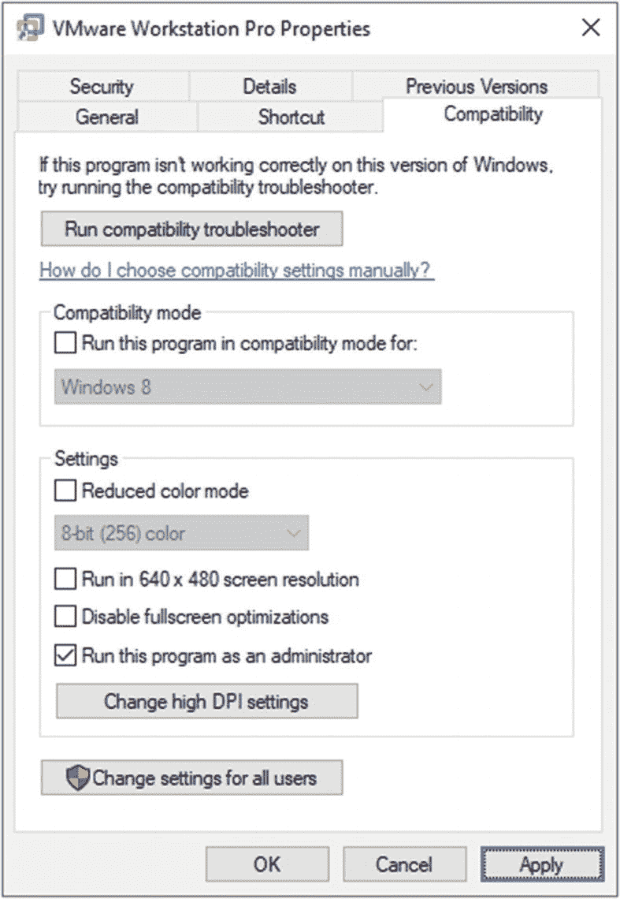

图 4-8。

VMware Workstation Pro，更改属性兼容性设置

2 现在，从菜单中打开并查看虚拟网络适配器，选择编辑➤虚拟网络编辑器(图 [4-9](#Fig14) )。

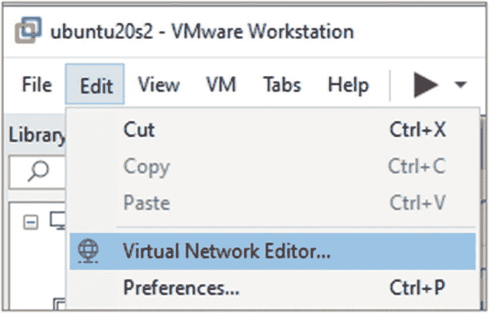

图 4-9。

选择虚拟网络编辑器

3 当虚拟网络编辑器第一次打开时，正如预期的那样，有三个虚拟交换机(VMnets)。与真实的网络适配器一样，虚拟适配器也可以称为虚拟 NIC 或虚拟网络接口。虚拟网络编辑器是管理不同虚拟网络的默认控制塔，如添加/删除网络、启用/禁用 DHCP 等(图 [4-10](#Fig15) )。

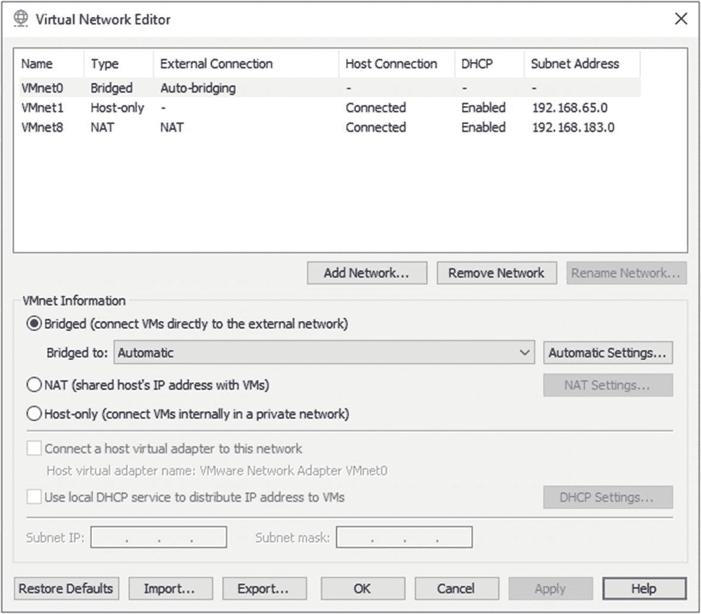

图 4-10。

虚拟网络编辑器，默认适配器类型

在图 [4-10](#Fig15) 所示的虚拟网络编辑器窗口中，点击帮助按钮，这将打开 VMware 官方网站上的文档“使用虚拟网络编辑器”

### 虚拟网络接口描述

这里是我们一直在讨论的不同网络模式和网络术语的快速概述。如果您曾经学习过或研究过思科 CCNA，您应该已经熟悉网络行业中的这些网络术语。如果你正在学习 CCNP 或者完成了 CCNP 的学业，你可能会将这些网络适配器模式与真实的生产环境联系起来。然而，即使您不熟悉网络技术，理解以下解释也不会有任何困难。如前所述，有三个现成的网络适配器，但是您可以根据需要添加或删除更多的适配器。此外，在构建实验室时，可以根据您的喜好指定子网。表 3-4 描述了三种虚拟网络模式和一种用户(定制)模式。

Virtual Network Adapter Modes Explained

默认情况下，在桥接网络适配器模式下，所有虚拟机共享主机的网络连接。默认情况下，桥接网络使用 VMware Workstation 中的 VMnet0，所有计算机使用相同的网关，因此主机使用相同的 DHCP 和 DNS 服务器。主机和虚拟机都通过相同的默认网关地址获取相同的子网 IP 地址。图 [4-11](#Fig16) 描绘了 VMware Workstation Pro 上的典型桥接网络。

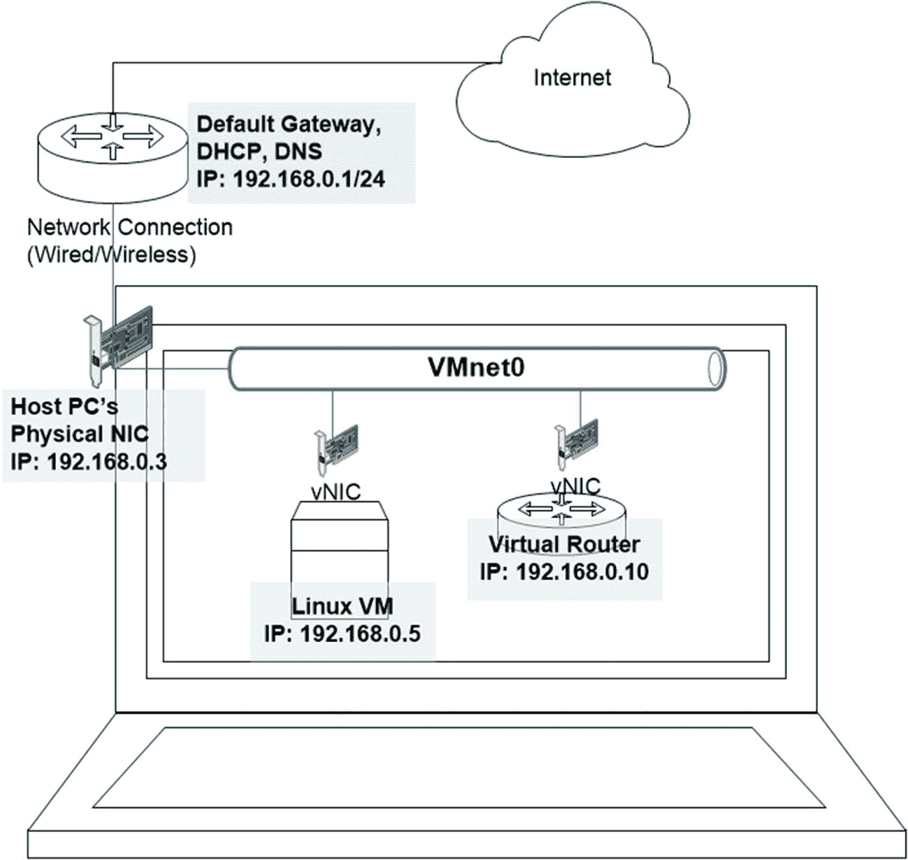

图 4-11。

VMware 网络适配器，桥接模式

纯主机模式非常适合测试虚拟环境中隔离网络中的两个或更多虚拟机。默认情况下，仅主机模式连接到 VMnet1，虚拟机连接在同一个子网中，在实验网络之外不进行任何交互。您的主机和虚拟机仍然可以通过 VMnet1 进行通信。在图 [4-12](#Fig17) 中，注意工作站提供 DHCP 服务。

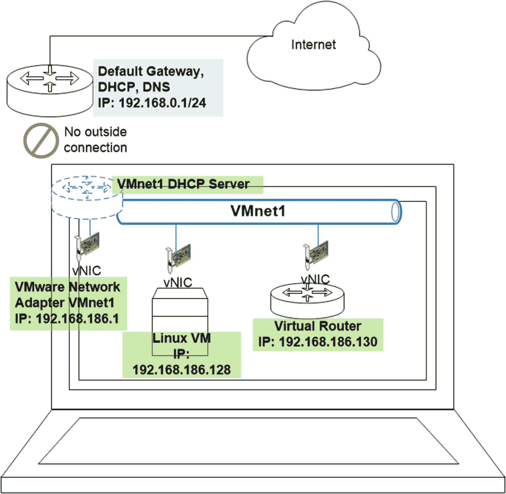

图 4-12。

VMware 网络适配器，仅主机模式

默认情况下，网络地址转换(NAT)模式通过 VMnet8 连接。网络地址转换意味着虚拟机的内部 IP 地址和主机的外部 IP 地址是不同的。在外部网络中，您只能看到主机的子网地址。如果主机可以连接到互联网，它就可以与互联网通信。图 [4-13](#Fig18) 描述了 VMware Workstation Pro 上的 NAT 配置示例。

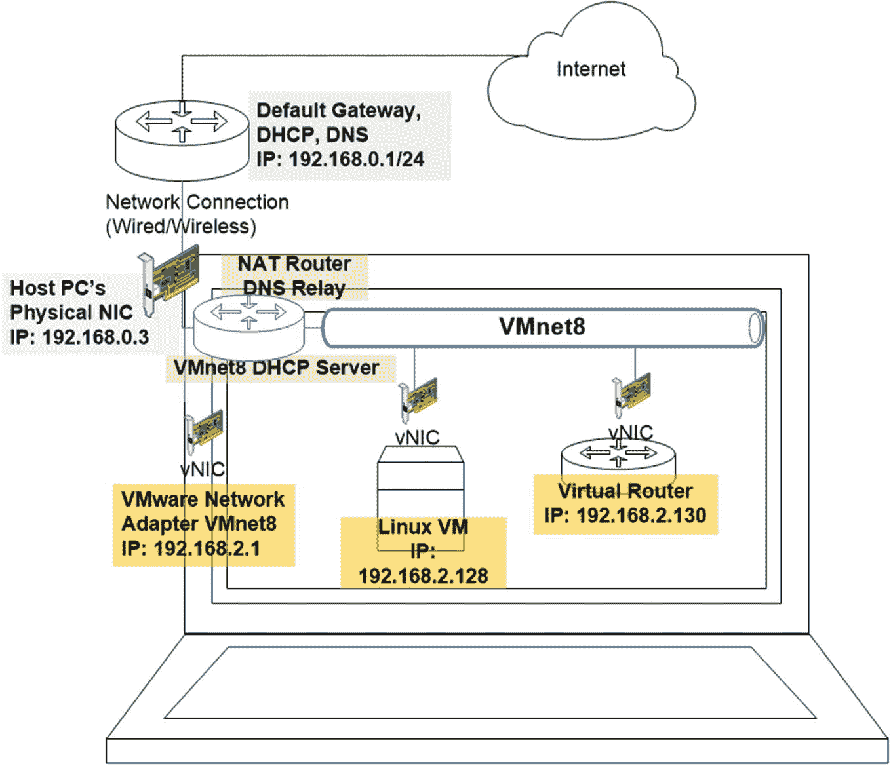

图 4-13。

VMware 网络适配器，NAT 模式

在自定义网络中，您可以选择前面的模式之一，并根据您的情况进行自定义。它与 NAT 模式相同，但默认设置有一些变化。

我们鼓励您花足够的时间了解不同的虚拟网络模式，比较它们与真实物理网络的不同之处，然后想象您如何在 PoC 实验室中使用不同的模式。熟悉每种网络模式如何与您的主机和其他网络交互将有助于您建立一个可以测试更高级 IT 理论的实验室。从菜单中打开虚拟网络编辑器，花些时间探索设置，添加/删除新的虚拟机网络，以及自定义设置。在下一节中，您将更详细地查看虚拟机设置。

为什么要进行概念验证？在 it 领域，缩写 PoC 代表*概念证明*，它意味着在给定的场景中证明现有的或新的 IT 概念(或问题)。PoC 实验实验室测试某个理论的工作方式与该技术的设计方式相同。为了更好地了解并超越您的同事，您必须在 PoC 实验室中花很多时间，因为您将获得比书本或现实生活场景所能教给您的更广泛的知识。通过学习理论并在 PoC 实验室中测试理论，您总能学到更多东西，因为您不会在真实的生产环境中遇到所有的理论或问题。

### 揭示每个虚拟网络接口类型

让我们看看每一种类型。

#### 仅限主机的网络

在这种模式下，您的虚拟机与主机和同一子网中的其他虚拟设备共享一个专用网络。如果您的虚拟机不需要主机外部的通信，此模式非常有用。如果您使用默认的仅主机网络，所有虚拟机都将连接到 VMnet1，您可以将 VMnet1 视为一个虚拟网络交换机。在这种模式下，为了方便起见，内置的 DHCP 服务器会向连接到该网络的主机提供 IP 地址。图 [4-14](#Fig19) 到 [4-18](#Fig23) 显示了 VMnet1 是如何配置的，相关的配置设置可以在你的主机操作系统上找到。有关 VMware 网络概念的更多说明，请参考以下教程: [`https://rednectar.net/2011/07/20/vmware-interfaces-tutorial/`](https://rednectar.net/2011/07/20/vmware-interfaces-tutorial/) 。

图 [4-14](#Fig19) 显示分配给该网络的现成 VMnet1 子网是 192.168.65.0/24。当然，子网和 CIDR 可以根据需要进行更改。此外，还有一个禁用 DHCP 服务的选项，以便您可以在虚拟机的操作系统中手动分配 IP 地址。

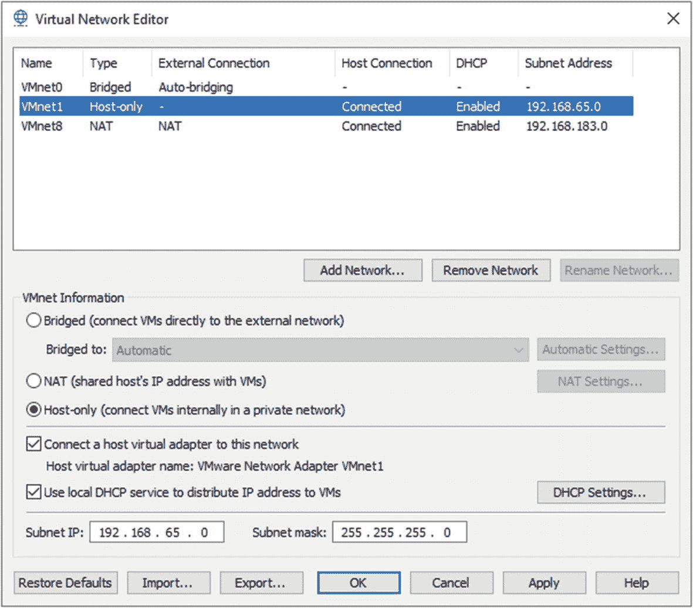

图 4-14。

虚拟网络编辑器，VMnet1 仅主机网络

图 [4-15](#Fig20) 显示了配置相关网络连接的虚拟机设置。

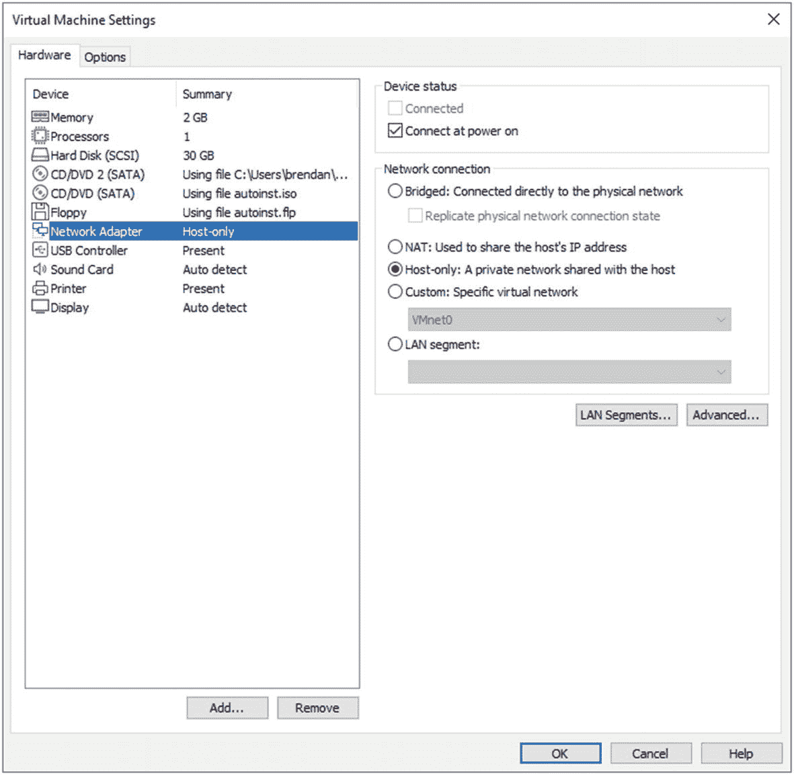

图 4-15。

虚拟机设置，仅主机网络连接

图 [4-16](#Fig21) 显示了`netsh interface ip show addresses "VMware Network Adapter VMnet1"`命令的结果，显示了主机 PC 上 VMnet1 的配置设置。正如所料，分配给主机的 VMnet1 适配器的 IP 地址是 192.168.65.1/24，接口度量为 35。接口度量 35 意味着 DHCP 服务配置了此 IP 地址。

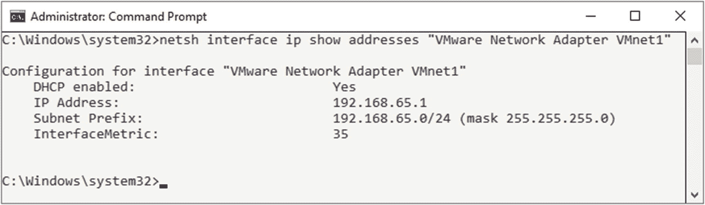

图 4-16。

Windows 主机 PC、VMware 网络适配器 VMnet1

如图 [4-17](#Fig22) 所示，当您启动虚拟机并检查网络接口设置时，DHCP 服务器为您的虚拟机分配的 IP 将来自与您的 VMnet1 网络相同的子网。由于您还没有创建和安装任何虚拟机，您可以在完成第 [5](05.html) 和 [6](06.html) 章的 Linux 安装后检查该设置。注意分配给 Ubuntu VM 的接口名是 ens33Linux 机器的网络适配器名称取决于您的 Linux OS 版本和发行版类型。

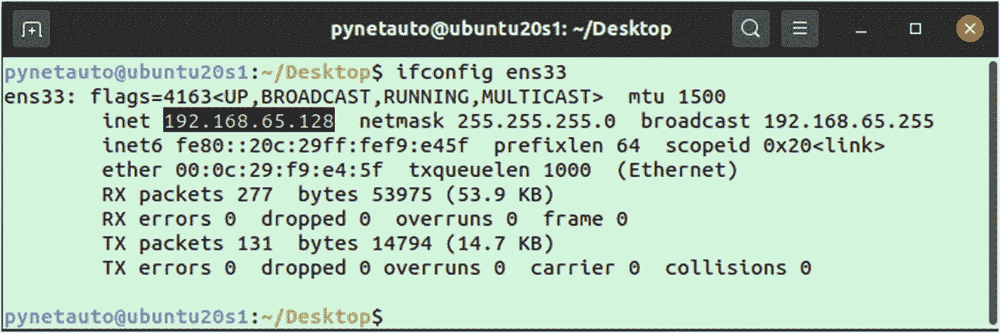

图 4-17。

虚拟机，ens33 网络适配器

参考前面的图 [4-12](#Fig17) 来形象化并帮助您理解仅主机网络模式。现在，您知道在哪里可以找到虚拟机的纯主机虚拟网络信息。接下来，我们来看看桥接模式。

#### 桥接网络

在桥接模式下，虚拟机的行为就好像它是主机所在网络上的另一台计算机，因此虚拟机从真实网络接收 IP 地址。对于默认桥接模式，会分配 VMnet0 网络。如果您使用家庭网络连接到互联网，您的家庭网络路由器通常会提供 DHCP 服务。默认情况下，ISP 提供的互联网调制解调器/路由器的 IP 子网为 192.168.0.0/24 或 192.168.1.0/24，默认网关采用网络上的第一个 IP 地址(. 1)和最后一个 IP 地址(. 254)。在桥接模式下，其他物理计算机可以与您的虚拟机通信，您也可以从一台计算机模拟多台计算机。默认情况下，在桥接网络模式下，您的虚拟机可以通过物理方式与互联网通信，也可以与网络上的虚拟机通信。

图 [4-18](#Fig23) 显示了虚拟网络编辑器中的默认桥接网络。IP 地址将从主机的物理适配器网络上的真实网络设备分配，因此 DHCP 选项在设置下是灰色的。

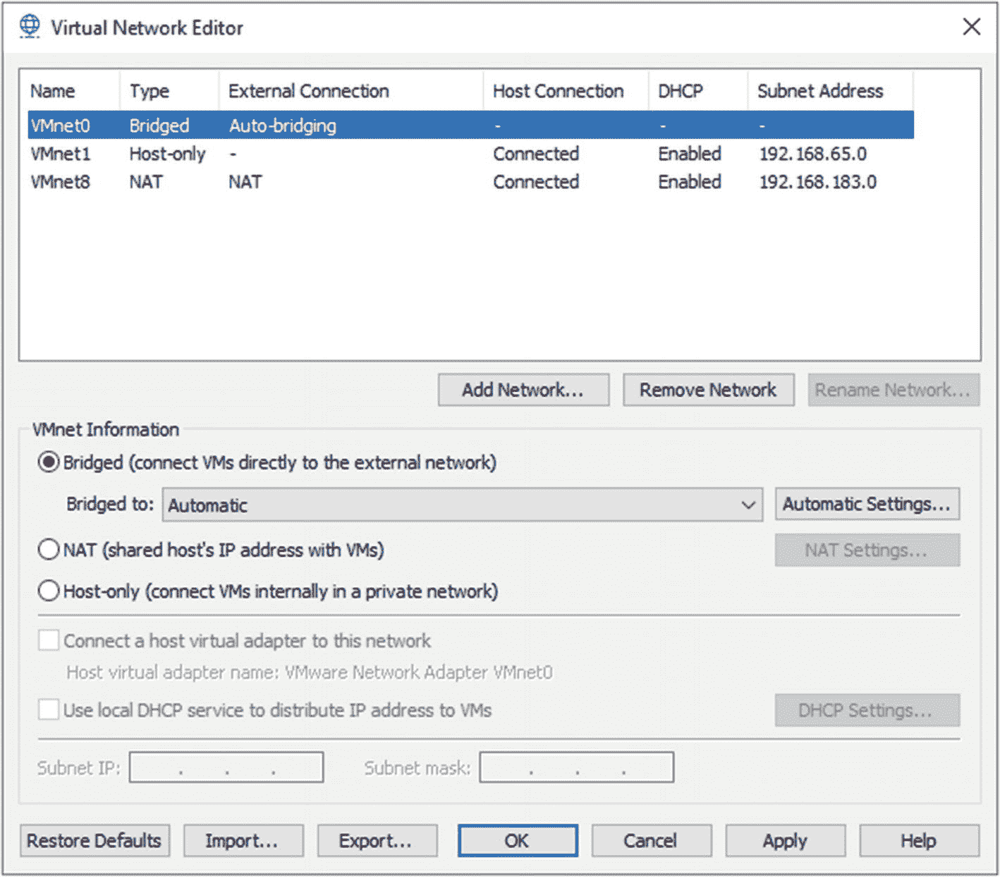

图 4-18。

虚拟网络编辑器，VMnet0 桥接网络

图 [4-19](#Fig24) 显示了配置和使用桥接网络的虚拟机设置。

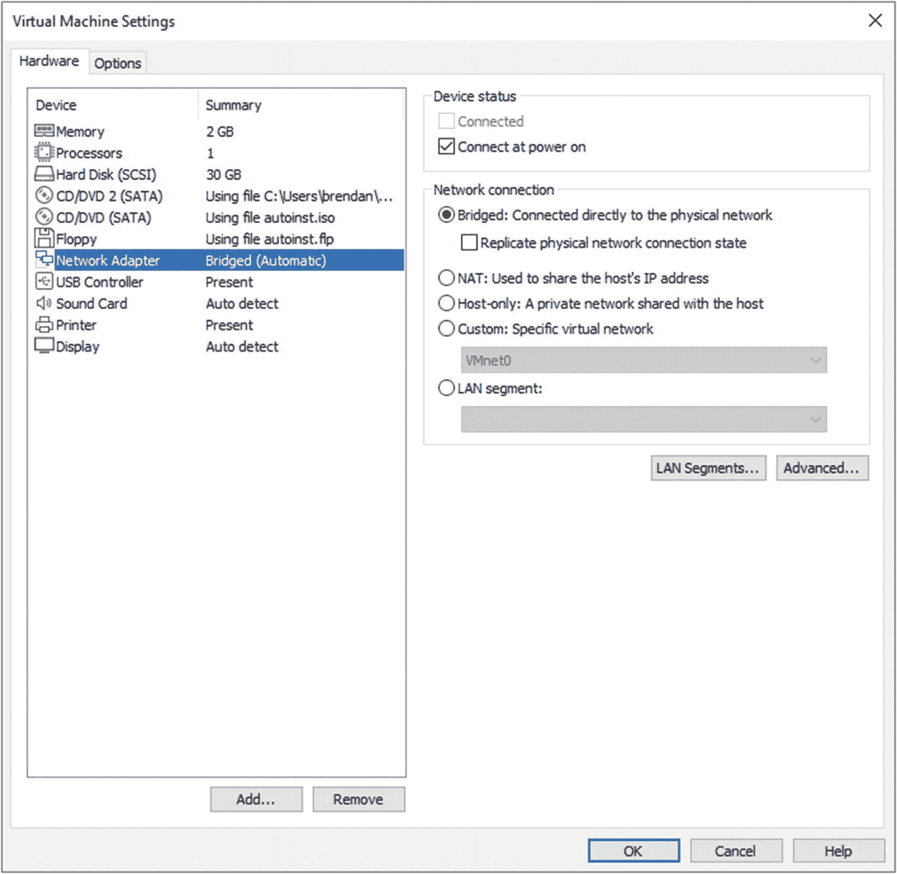

图 4-19。

虚拟机设置，桥接网络连接

图 [4-20](#Fig25) 揭示了来自 DHCP 服务器 192.168.0.1 的主机物理适配器网络配置；在典型的家庭网络中，默认网关兼作 DHCP 服务器。我的主机通过无线连接到互联网，因此 Wi-Fi 3 接口显示为适配器名称，但您的设置将与图 [4-20](#Fig25) 不同。

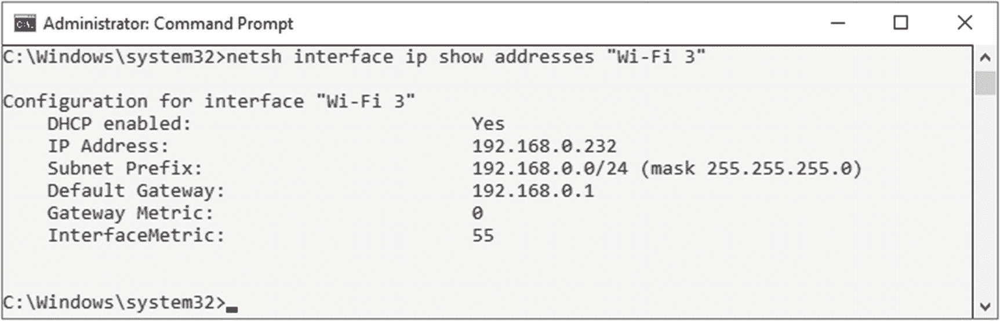

图 4-20。

Windows 主机 PC、本地 PC 的互联网适配器(Wi-Fi)

图 [4-21](#Fig26) 显示了一个虚拟机终端会话，揭示了从家庭网络的 DHCP 服务器接收到的 IP 地址。另外，参考上图 [4-11](#Fig16) 来形象化并帮助你理解桥接网络模式。

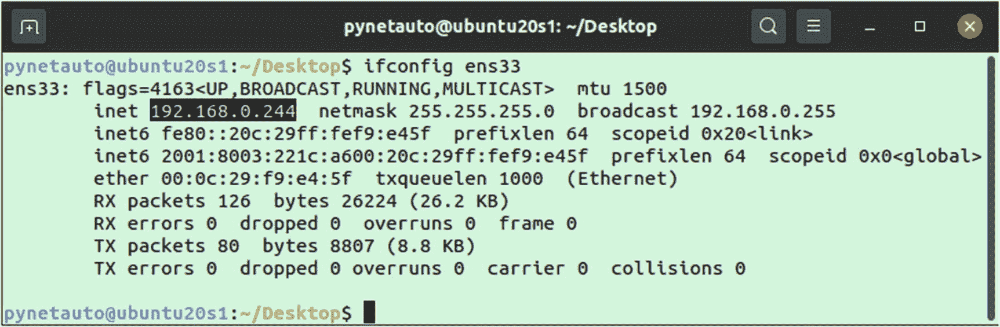

图 4-21。

虚拟机，ens33 网络适配器

#### 网络地址转换网络

在网络地址转换(NAT)模式下，虚拟机共享主机的 IP 和 MAC 地址。外部网络(Internet)将您的网络视为单一网络身份，内部网络在网络外部不可见。通常，在传统意义上，NAT 用于对外隐藏内部网络，并扩展网络中有用的 IPv4 IP 地址的数量。如果您已经学习了思科 CCNA 路由和交换，了解 NAT 或 PAT 是学习课程的一部分，因此了解这种类型的网络模式也有直接的意义。在本书中，您将在整个实验配置中利用 NAT 的功能，将网络配置保持在最低水平。

让我们看看图 [4-22](#Fig27) 并回顾一下在 VMware Workstation Pro 配置下 NAT 是如何配置的。在 NAT 模式下，VMware Workstation 提供 DHCP 服务，这意味着在网络内部使用另一个子网；在这种情况下，分配给 NAT 的子网位于 192.168.183.0/24 范围内，这是我们实验室连接到 Internet 和主机的主要方法。

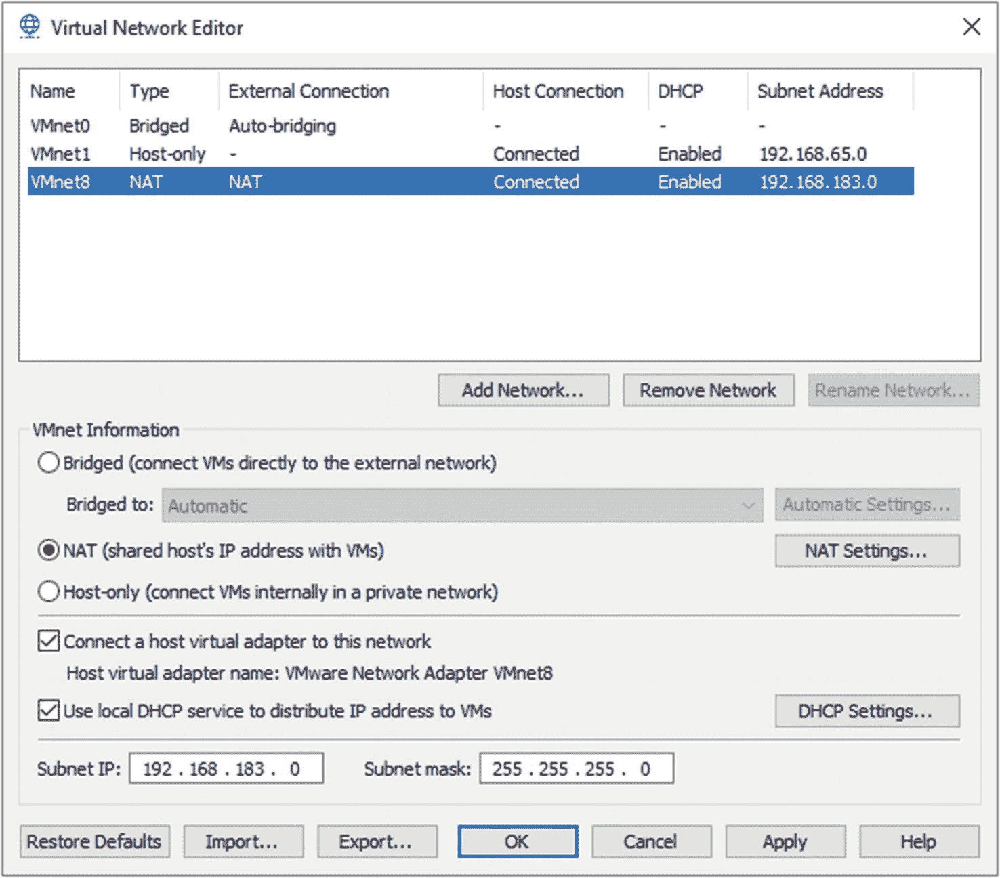

图 4-22。

虚拟网络编辑器，VMnet8 NAT 适配器

点击图 [4-21](#Fig26) 中的 NAT 设置按钮；它揭示了下面的 NAT 或 VMnet8 设置。您会注意到该子网的网关 IP 地址是 192.168.183.2，我们可以假设 192.168.183.1 已经分配给主机 PC 上的 VNnet8 适配器；这将在图 [4-23](#Fig28) 中得到验证。

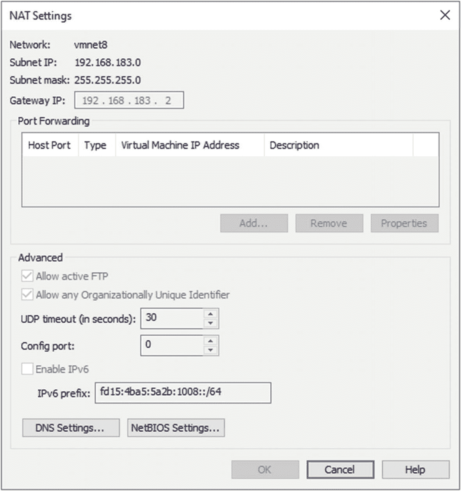

图 4-23。

虚拟网络编辑器，NAT 设置

图 [4-24](#Fig29) 显示了一个虚拟机的网络连接配置。

图 4-24。

虚拟机设置，NAT 网络连接

图 [4-25](#Fig30) 显示了 DHCP 服务器的 IP 地址配置；如前所述，192.168.183.1/24 被分配给主机上的 VMnet8。但是，虚拟机的默认网关是 192.168.183.2。

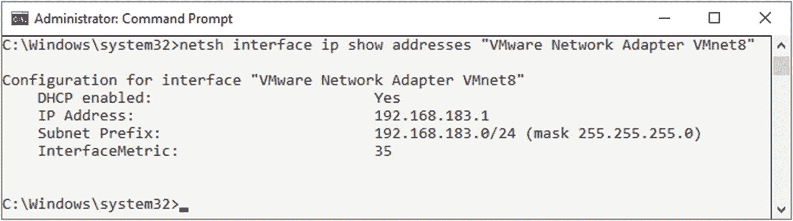

图 4-25。

Windows 主机、VMware 网络适配器 VMnet8

正如预期的那样，VMware Workstation Pro 中 NAT 网络上的虚拟机将分配来自同一 192.168.183.0/24 网络的 IP 地址。在图 [4-26](#Fig31) 中，192.168.183.129/24 已被分配给 Linux 服务器的 ens33 网络接口。参考上图 [4-13](#Fig18) 可以帮助你更好的理解 NAT 模式。

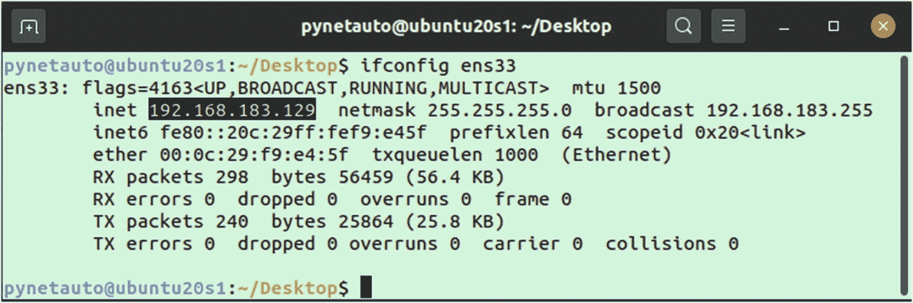

图 4-26。

虚拟机，ens33 网络适配器

## 摘要

虚拟化技术使云服务成为可能，因此我们讨论了当前虚拟化技术的类型 1 和类型 2 虚拟机管理程序之间的差异。本章还向您介绍了 VMware Workstation 15 Pro，以及我们为什么使用该解决方案而不是其他解决方案。我们还查看了该软件在 Windows PC 上的基本操作，并深入研究了用户可以用来构建虚拟实验室环境以供工作和休闲使用的不同网络模式。现在，您已经了解了 VMware Workstation 的基本功能，是时候下载、安装和创建虚拟机了，即 Ubuntu 20.04 LTS(第 [5](05.html) 章)和 CentOS 8.1 服务器(第 [6](06.html) 章)。