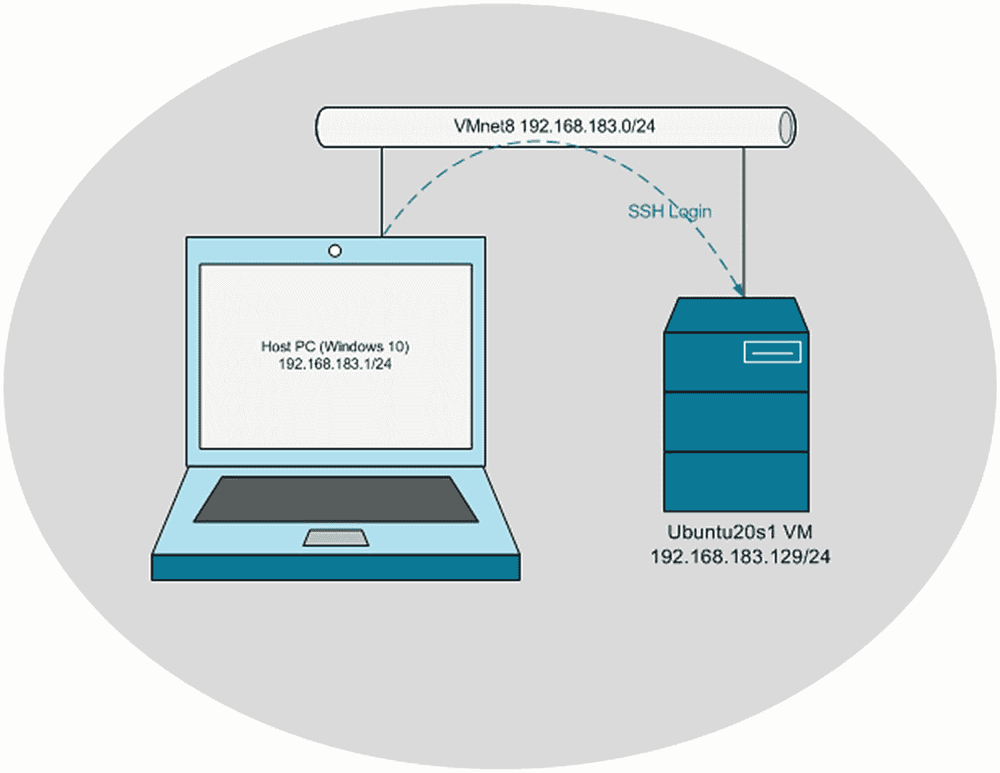
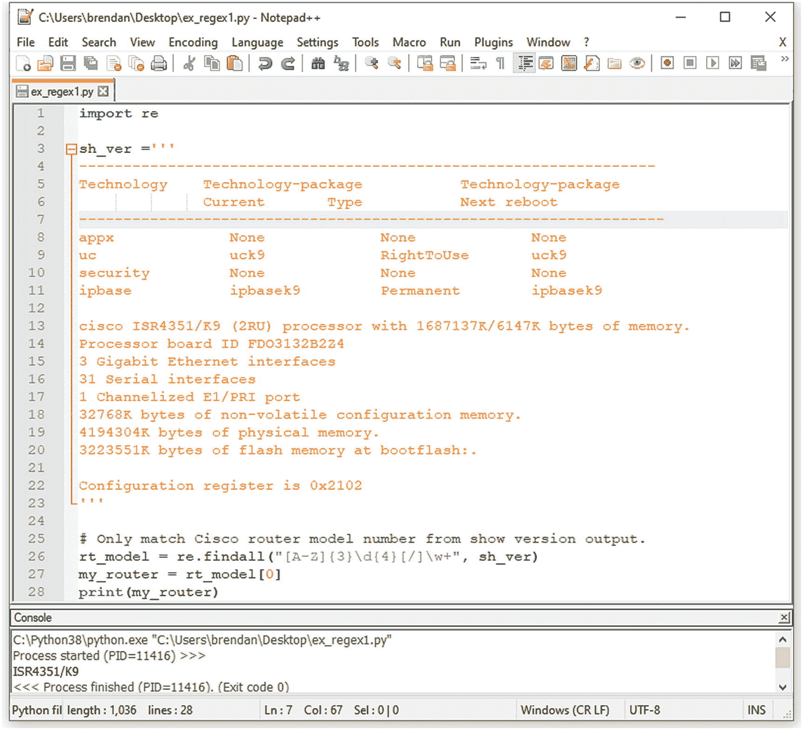
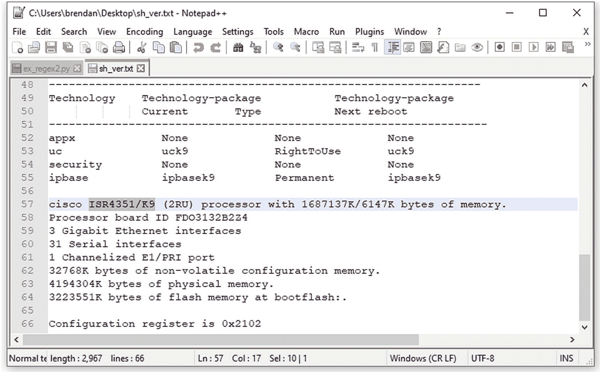
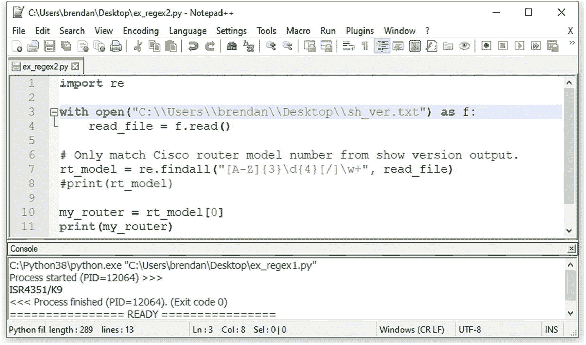
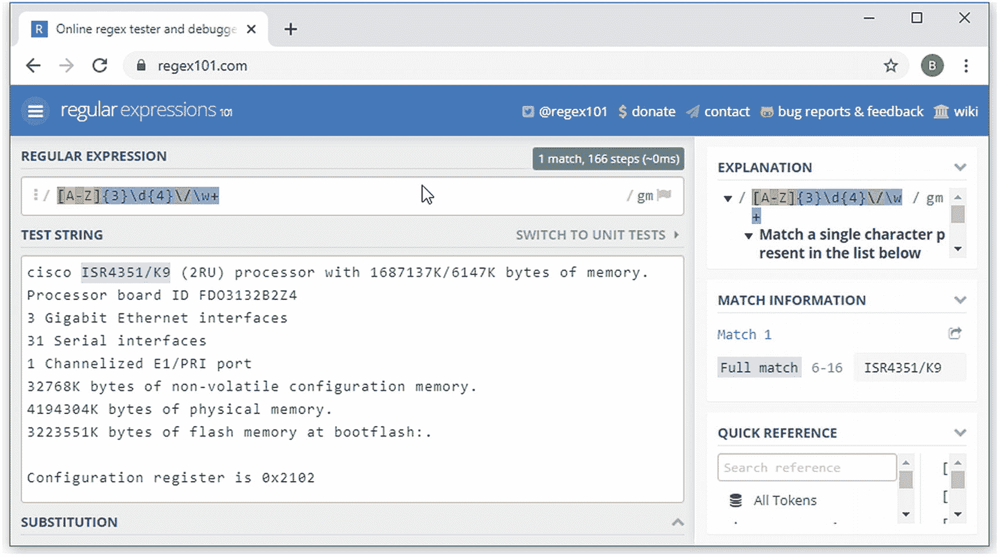
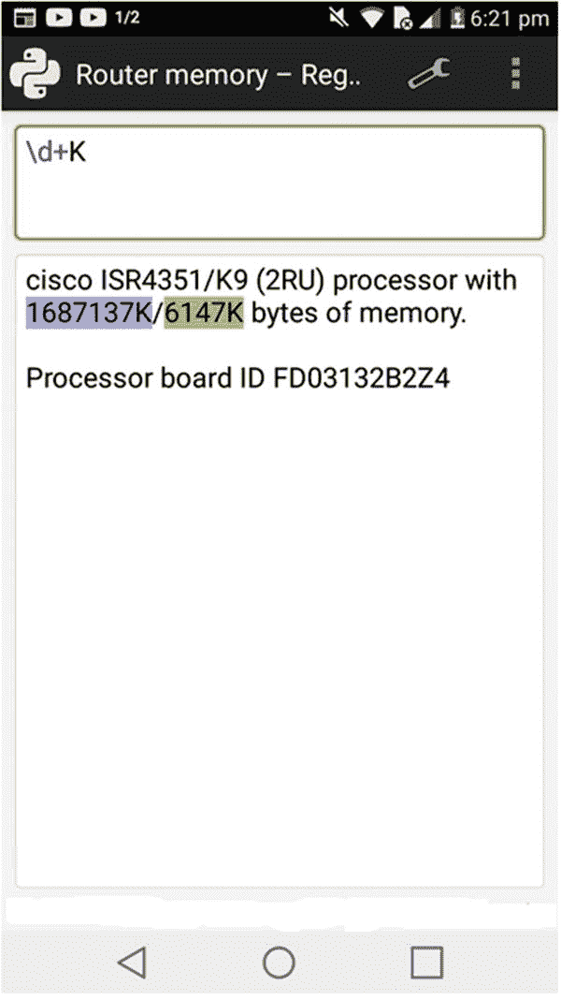
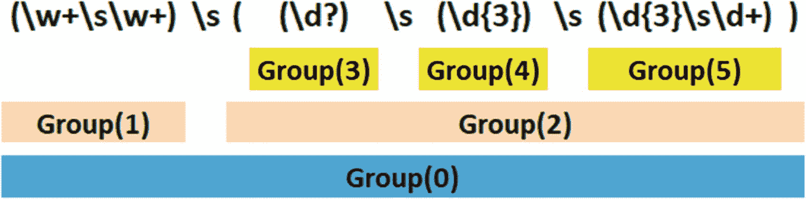
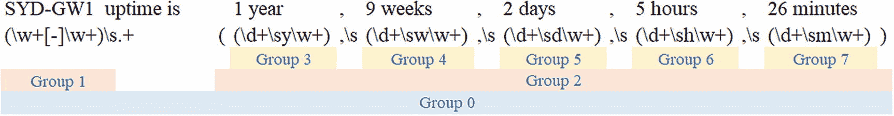
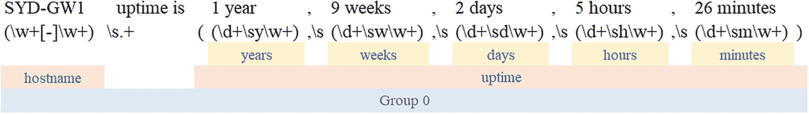

# 9.网络自动化的正则表达式

本章致力于学习正则表达式的基础知识。Python 提供了处理和解析文本字符串的本地方法，但是需要许多行代码来定位准确的字符串。尽管 Python 提供了强大的字符串索引方法，但在现实生活中，每次需要处理大型字符串时，您都会面临挑战。我发现很有趣的是，没有其他 Python 网络自动化书籍真正强调用正则表达式处理数据的重要性。许多书掩盖了正则表达式，因为它不是最令人兴奋的讨论话题。我意识到我必须掌握正则表达式才能使用任何编程语言。尽管如此，一开始我也不敢认真对待它。只有当我开始从事真正的项目时，我才意识到我对正则表达式的无知。我明白这一章的内容对许多读者来说消化起来会很痛苦，但你应该坚持下去，集中精力完成这一章；你以后会感谢我的。


正则表达式普遍适用于所有计算机编程语言，并不是 Python 所独有的。一旦你掌握了它们，你就可以把它们应用到所有的编程语言中，比如 Java、C++、JavaScript、Ruby 和 Perl。在 Python 中，`re`模块为您提供了通向正则表达式的通道。通过深入理解正则表达式，并通过`re`模块将这些知识应用到您的 Python 程序中，您将成为一名更好的 Python 程序员。您在这里学到的知识将应用于实验室中的网络自动化应用开发。掌握正则表达式是任何 Python 程序员都不应该跳过的话题。虽然这是本书中较短的章节之一，但你将获得终生受用的宝贵技能。

在学习了基本的 Python 语法和概念之后，你会想要流利地编写 Python 应用。正如我将在整本书中提到的，用 Python 写代码不仅仅是关于语法和概念；与计算中的所有事情一样，编写代码与正确的数据处理息息相关。这些数据可能来自用户和应用变量、读取文件、浏览网页或两台计算机之间的日志。用任何编程语言编写代码几乎总是涉及到处理数据。写了一段时间 Python 代码后，我很快意识到，如果不完全理解正则表达式，就不可能开发任何网络自动化应用。

如果你对 Python 编码很认真，你必须掌握正则表达式和`re`模块的艺术。您将学习 regex 的基础知识，并将正则表达式应用于真实的 Cisco 路由器和交换机文本文件，以便您可以将信息与真实的生产示例相关联。

对于章节要求，您需要访问运行在 VMware Workstation 15 Pro 上的 Windows 10 主机 PC 和 Ubuntu Server 虚拟机，如图 [9-1](#Fig1) 所示。



图 9-1。

第 [9 章](09.html)中要求的装置

## 为什么是 Regex？

文字。正则表达式( *regex* )是计算中用来处理复杂文本字符串的标准方法，并不是 Python 独有的；在执行数据处理时，它被用在任何地方。乍一看，学习正则表达式可以看作是学习 Python 的一门遥远的学科。尽管如此，当您进入中级水平时，正则表达式的真正威力将会显现出来。在 Python 中，正则表达式也通过一个名为`re`模块的内置 Python 模块来支持。一些读者可能认为学习正则表达式不是学习 Python 的基本部分，但是当您处理实际问题以解决自动化问题时，您将需要从源文件或大字符串中提取特定的字符串(数据)。在编码中，在处理数据以创建变量和运行应用以避免数据处理错误时，每个逗号、句号和空格都很重要。如果有人问我 C、C++、Java、Perl、Ruby、R 和 Python 等编程语言是做什么的，我会毫不犹豫地直接回答是数据处理。用计算机编程语言编写的每一个程序都必须处理数据以服务于它们的目的。换句话说，我们需要一个工具来改进我们的数据处理和加工。正如您在第 [2](02.html) 章中所了解的，有一些内置的方法可以对字符串中的数据进行切片、连接和索引。当处理一组更广泛的数据时，您将会遇到许多不便，因为您可能不得不提出您的函数来更好地处理大数据。`re`模块来帮忙了，因为它被视为基于 20 世纪 70 年代的旧正则表达式的超级数据处理方法。知道何时何地使用不同的 Python 模块可以节省您重新发明轮子的时间。首先，您需要使用 Python 原生方法来处理数据。其次，使用内置的`re`模块探索数据处理。第三，使用广泛使用的 Python 库(如 NumPy 和 Pandas)探索更高级的数据处理方法。NumPy 库为多维数组提供对象，而 Pandas 提供一个内存中的 2D 表对象，称为 *dataframe* 。每个 Python 程序员都必须很好地学习正则表达式，并利用它们来处理数据以提取特定的字符串。

将 regex 主题作为一个专门章节的另一个原因是基于我最近从事网络自动化的经验。正则表达式在编码中起着至关重要的作用，在各种网络自动化项目中使用 Python 代码时，我怎么强调它们的有用性都不为过。一旦你达到 Python 编码的中级水平，你将不可避免地面对数据处理的挑战，如果你拒绝学习如何使用正则表达式，你就不会进步。在完成本章的所有练习后，你将会很好地掌握发明的最有用的编码工具之一。本章中展示的例子对某些人来说可能不够全面，但涵盖了足够多的场景来帮助你通过 Python 的`re`模块掌握数据处理。每个字符串匹配的要求都是独特的，所以我强烈建议您超越这本书，花时间研究更多的正则表达式教程。有大量免费的在线培训材料来练习适用于您的数据处理情况的用例。

### 响还是不响

首先，让我们考虑一个简单的例子。您申请了一份具有网络背景的 Python 开发人员的工作。在你通过第一次技术面试后，招聘经理已经给了你一个带回家的任务，分析一串要分析和转换的文本。您的任务是提取交换机名称及其 MAC 地址，以特定格式显示信息。

您获得了以下字符串。您的任务是打印交换机名称，后跟 12 个十六进制字符的 MAC 地址，其中必须保留前六位数字(OUI)以识别制造商的 ID。但是最后六位数字被用`*`屏蔽了，以隐藏真实的 MAC 地址。

下面是一个给定的字符串:

```py
sw_mac = '''pynetauto-sw01 84:3d:c6:05:09:11
pynetauto-sw17 80:7f:f8:80:71:1b
pynetauto-sw05 f0:62:81:5a:53:cd'''

```

此外，包括十六进制 a–f 在内的任何字母都必须大写，因此结果必须与此处显示的预期输出相匹配:

```py
PYNETAUTO-SW01 843DC6******
PYNETAUTO-SW17 807FF8******
PYNETAUTO-SW05 F06281******

```

如果你没有学习过正则表达式，你可以采取以下步骤来编写你的程序:

1.  删除冒号并将字符串转换为大写字母。

2.  在空格处拆分字符串，并将它们添加到列表中。

3.  使用`strip()`方法删除空白，并制作一个更新的列表。

4.  使用`len()`方法根据列表的项目长度来识别名称和 MAC 地址。如果该项有 14 个字符，那么它是一个开关名称；添加到`sw`列表。如果该项有 12 个字符，那么它是一个 MAC 地址；将其添加到 MAC 列表中。MAC 追加时，添加`******`替换 MAC 地址的后半部分。

5.  使用 Python 字典的 zip 方法将两个列表转换成一个字典。

6.  使用`for`循环打印字典的键-值对中的键和值。

在编程语言中，他们说，“剥一只猫的皮有不止一种方法”，但是其中一种方法(通过代码)将在不使用`re`模块的情况下获得想要的结果，看起来类似于清单 [9-1](#PC3) 。

这里有一个代码和示例字符串下载提示:本书中的所有代码都可以从 GitHub 上的`pynetauto`下载。对于本章中使用的代码，请查找名为`chapter9_codes.zip`的 zip 文件。

URL: [https:// github。com/pyneto/apess _ pyneto](https://github.com/pynetauto/apress_pynetauto)

```py
>>> sw_mac = '''pynetauto-sw01 84:3d:c6:05:09:11
... pynetauto-sw17 80:7f:f8:80:71:1b
... pynetauto-sw05 f0:62:81:5a:53:cd'''
>>>
>>> sw_mac = sw_mac.replace(":", "").upper()          # 1
>>> sw_mac
'\nPYNETAUTO-SW01 843DC6050911 \nPYNETAUTO-SW17 807FF880711B \nPYNETAUTO-SW05 F062815A53CD\n'
>>> list1 = sw_mac.split(" ")          # 2
>>> list1
['\nPYNETAUTO-SW01', '843DC6050911', '\nPYNETAUTO-SW17', '807FF880711B', '\nPYNETAUTO-SW05', 'F062815A53CD\n']
>>> list2 =           # 3
>>> for i in list1:          # 4
...     list2.append(i.strip())          # 5
...
>>> list2
['PYNETAUTO-SW01', '843DC6050911', 'PYNETAUTO-SW17', '807FF880711B', 'PYNETAUTO-SW05', 'F062815A53CD']
>>>
>>> sw_list =           # 6
>>> mac_list =           # 7
>>> for i in list2:          # 8
...     if len(i) == 14:          # 9
...         sw_list.append(i)          # 10
...     if len(i) == 12:          # 11
...         i = i[:6] + "******"           # 12
...         mac_list.append(i)          # 13
...
>>> sw_list
['PYNETAUTO-SW01', 'PYNETAUTO-SW17', 'PYNETAUTO-SW05']
>>> mac_list
['843DC6******', '807FF8******', 'F06281******']
>>> sw_mac_dict = dict(zip(sw_list, mac_list))          # 14
>>> for k,v in sw_mac_dict.items():          # 15
...     print(k, v)          # 16 lines
...
PYNETAUTO-SW01 843DC6******
PYNETAUTO-SW17 807FF8******
PYNETAUTO-SW05 F06281******

Listing 9-1.Native Python Methods

```

你不需要担心或理解如何阅读前面的代码。重要的是，您可以计算出达到预期结果所需的代码行数。不算换行和数据行，仅使用 Python 方法(不使用任何模块)打印结果就需要 16 行代码。是的，它可以工作，但是需要许多行代码来实现目标。

在你学会了如何使用正则表达式之后，你可以使用 Python 的`re`模块来做同样的任务，数据操作变得轻而易举。代码行数下降，读写更容易。统计清单 [9-2](#PC4) 中的代码行数；打印出预期的结果只需要四行代码(不包括换行符和数据线)。因此，当您比较两个清单之间的代码行数时，您可以看到所使用的代码行数显著减少。这是一个简单的例子，但是想想使用大数据的更复杂的任务。编写冗长的定制代码来实现最终目标会花费大量的时间和精力。使用 Python 代码中的正则表达式模块，您的应用代码将变得更简洁、更易于编写、更易于阅读。

```py
>>> sw_mac = '''pynetauto-sw01 84:3d:c6:05:09:11
... pynetauto-sw17 80:7f:f8:80:71:1b
... pynetauto-sw05 f0:62:81:5a:53:cd'''
>>> import re           # 1
>>> sw_mac = sw_mac.replace(":", "").upper()          # 2
>>> pattern = re.compile("([0-9A-F]{6})" "([0-9A-F]{6})")           # 3
>>> print(pattern.sub("\g<1>******", sw_mac))          # 4
PYNETAUTO-SW01 843DC6******
PYNETAUTO-SW17 807FF8******
PYNETAUTO-SW05 F06281******
>>>

Listing 9-2.re Example

```

这个阶段不需要自己写代码。要下载并运行代码，你可以去我的`pynetauto` GitHub 站点，下载清单 [9-1](#PC3) 和 [9-2](#PC4) 中的代码。

## 使用 Python 研究正则表达式

用 Python 学习正则表达式有很多方法，这里我们将讨论如何用几种不同的方法学习。尝试一种最适合自己的学习方法，坚持下去，直到完成本章的练习。

如果你想跟随清单 [9-3](#PC5) 和 [9-4](#PC6) ，你可以从我的 GitHub 站点下载`sh_ver.txt`文件，并在你的 Linux 目录下保存为`sh_ver.txt`。

URL: [https:// github。com/pyneto/apess _ pyneto](https://github.com/pynetauto/apress_pynetauto)

### 方法 1:使用记事本++

你已经在第 [2](02.html) 章安装了 Notepad++，它是一个很好的工具，可以用来探索正则表达式。在 Notepad++中，有两种学习正则表达式的方法，根据数据或文本的大小，您可以选择任何一种方法。你可以对一个短字符串使用单个 Python 文件，如图 [9-2](#Fig2) 所示，在 Notepad++中使用 Ctrl+F6 或 Ctrl+F5 执行脚本。



图 9-2。

使用 Notepad++和一个脚本学习正则表达式

如果文本数据很长或者要读取多个文件，可以使用文件读取方法将文件读入 Python 脚本并运行您编写的 Python 代码。该示例如图 [9-3](#Fig3) 和 [9-4](#Fig4) 所示。



图 9-4。

使用 Notepad++的正则表达式，读取文件方法数据文件



图 9-3。

使用 Notepad++的正则表达式，读取文件方法 re 脚本

### 方法 2:使用 Linux Shell

像 Notepad++方法一样，您可以运行一个 Linux VM 服务器，并通过 SSH 连接到服务器来练习 Python 上的正则表达式。如果你想测试一个简单的正则表达式，你可以用 Python 解释器启动一个交互式会话(参见清单 [9-3](#PC5) )。在您键入表达式并按 Enter 键后，它会立即返回结果，或者如果您的表达式不匹配任何字符串，则不返回结果。您也可以在 Windows 10 主机上使用 Python 3 来使用这种方法。与 Notepad++中一样，您也可以先编写一个 Python 代码，然后从终端控制台运行它来运行`re`匹配脚本，如清单 [9-4](#PC6) 所示。这种方法听起来可能很难，但是当您练习几个例子时，您会熟悉它，并且在 Python 中使用正则表达式会变得更容易。

```py
pynetauto@ubuntu20s1:~/ex_regex$ pwd
/home/pynetauto/ex_regex
pynetauto@ubuntu20s1:~/ex_regex$ ls
sh_ver.txt
pynetauto@ubuntu20s1:~/ex_regex$ nano ex9.4_sh_ver.py
pynetauto@ubuntu20s1:~/ex_regex$ cat ex9.4_sh_ver.py
import re
with open("/home/pynetauto/ex_regex/sh_ver.txt") as f:
    read_file = f.read()

# Only match Cisco router model number from show version output.
rt_model = re.findall("[A-Z]{3}\d{4}\w+", read_file)
print(rt_model)

my_router = rt_model[0]
print(my_router)
pynetauto@ubuntu20s1:~/ex_regex$ python3 ex9.4_sh_ver.py
['ISR4351/K9']
ISR4351/K9

Listing 9-4.Regular Expression Writing Python Code on Linux

```

```py
pynetauto@ubuntu20s1:~$ pwd
/home/pynetauto
pynetauto@ubuntu20s1:~$ mkdir ex_regex
pynetauto@ubuntu20s1:~$ cd ex_regex
pynetauto@ubuntu20s1:~/ex_regex$ nano sh_ver.txt
pynetauto@ubuntu20s1:~/ex_regex$ ls
sh_ver.txt
pynetauto@ubuntu20s1:~/ex_regex
pynetauto@ubuntu20s1:~/ex_regex$ python3
Python 3.8.2 (default, Jul 16 2020, 14:00:26)
[GCC 9.3.0] on linux
Type "help", "copyright", "credits" or "license" for more information.
>>> import re
>>> with open("/home/pynetauto/ex_regex/sh_ver.txt") as f:
...     read_file = f.read()
...
>>> # Only match Cisco router model number from show version output.
>>> rt_model = re.findall("[A-Z]{3}\d{4}\w+", read_file)
>>> print(rt_model)
['ISR4351/K9']
>>> my_router = rt_model[0]
>>> my_router
'ISR4351/K9'

Listing 9-3.Regular Expression on Python Interpreter

```

### 正则表达式细分:[A-Z]{3}\d{4}[/]\w+

<colgroup><col class="tcol1 align-left"> <col class="tcol2 align-left"> <col class="tcol3 align-left"> <col class="tcol4 align-left"></colgroup> 
| 

[A-Z]{3}

 | 

\d{4}

 | 

[/]

 | 

\w+

 |
| --- | --- | --- | --- |
| 三个大写字母 | 四位数 | 字符/ | 至少出现一次的任何字符串 |

### 方法 3:使用互联网学习正则表达式

学习正则表达式最有效的方法之一是使用 web 浏览器并查看 Internet 上的内容。有很多网站提供免费的正则表达式练习。一些网站偏向于一种编程语言而不是另一种，但是试着找到中性的编程语言网站并多加练习。一旦建立了对正则表达式的信心，就可以开始使用前面展示的前两个 Python `re`方法之一。在 Python 中练习`re`模块很重要，因为这是你在 Python 中使用正则表达式的方式。比较好的正则表达式练习站点之一是 regex101 ( [`https://regex101.com`](https://regex101.com) )。见图 [9-5](#Fig5) 。



图 9-5。

正则表达式练习网站

如果你一直在忙，但仍然想练习正则表达式，你可以在 Android 设备或苹果 iOS 设备上练习。在移动设备上下载 RegexPal(适用于 Android 手机)或 RegEx Lab(适用于 iOS 设备)或类似的应用。这些应用对于随时随地进行简单的正则表达式练习非常有用。参见图 [9-6](#Fig6) 。



图 9-6。

Android 正则表达式应用示例

## 正则表达式操作:基础

正则表达式使用元字符来匹配静态或动态数据字符串。 *meta* 这个词是一个拉丁(希腊语)词，意思是之后的*、*之后的*或者*之后的*。当在编程语言中使用时，元字符从它们的实际表示中具有特殊的含义，因此元字符可以被定义为具有隐藏含义的字符。元字符包括以下内容:*

```py
  . ^ $ * + ? \ | ( ) [ ] { }

```

当在正则表达式中使用这些元字符之一时，它具有一些特殊的含义。最后六个字符成对出现，所以在正则表达式中必须成对使用括号。先从最直白的正则表达式开始，慢慢积累知识。此外，如果您想将这些字符表示为单个文字字符，那么元字符可以用一组方括号(`[ ]`)括起来，或者使用反斜杠(`\`)进行转义。但是，要特别注意元字符`^`和`\`；使用方括号方法无法精确匹配这两个字符。见表 [9-1](#Tab1) 。

表 9-1。

正则表达式元字符

<colgroup><col class="tcol1 align-left"> <col class="tcol2 align-left"> <col class="tcol3 align-left"> <col class="tcol4 align-left"></colgroup> 
| 

元字符

 | 

术语

 | 

用\转义

 | 

使用[ ]进行字面匹配

 |
| --- | --- | --- | --- |
| `.` | 点 | `\.` | [.] |
| `^` | 脱字号 | `\^` | [\^] |
| `$` | 美元 | `\$` | [$] |
| `*` | 星星 | `\*` | [*] |
| `+` | 加 | `\+` | [+] |
| `?` | 问号 | `\?` | [?] |
| `\` | 反斜线符号 | `\\` | [\\] |
| `&#124;` | 管 | `\&#124;` | [&#124;] |
| `( )` | 圆括号 | `\( \)` | [(] [)] |
| `[ ]` | 方括号 | `\[ \]` | [[][]] |
| `{ }` | 波形括号 | `\{ \}` | [{] [}] |

为了避开与`^`和`\`的字面匹配方法，您可以在方括号内的`^`和`\`前添加一个反斜杠。见清单 [9-5](#PC8) 。

与所有其他章节一样，为了全面理解正则表达式的概念，你需要打开你的 Python 解释器，在每个练习中输入所有用粗体标记的内容。这包括三个大于号(`>>>`)之后的所有内容。

```py
>>> import re
>>> expr = " . ^ $ * + ? \ | ( ) [ ] { }"
>>> re.search(r'[\^]', expr)
<re.Match object; span=(3, 4), match='^'>
>>> re.search(r'[\\]', expr)
<re.Match object; span=(13, 14), match='\\'>

Listing 9-5.Matching Metacharacter ^ and \ Using Square Brackets ([ ])

```

如果在方括号组中使用了`^`或`\`，则需要在元字符前添加转义反斜杠。这是有充分理由的，当用在方括号内时，`^`用来否定它后面的字符。在你的 Python 解释器中输入清单 [9-6](#PC9) 并仔细研究它。`[^a]`意味着匹配除*以外的所有字符。在清单 [9-6](#PC9) 中，除了字母 *a* 之外，所有字符都匹配。*

```py
>>> import re
>>> re.findall('[^a]', 'abracadabra')
['b', 'r', 'c', 'd', 'b', 'r']

Listing 9-6.Meaning of [^a]

```

方括号内的反斜杠`[\]`也有一个小问题，因为正则表达式将反斜杠识别为右方括号`]`的否定字符。所以，我们必须通过添加另一个反斜杠来否定反斜杠。看看清单 [9-7](#PC10) ，其中反斜杠必须用来匹配反斜杠和一个右方括号`]`。

```py
>>> re.search(r'[\\]', 'match \ or ]')
<re.Match object; span=(6, 7), match='\\'>
>>> re.search(r'[\]]', 'match \ or ]')
<re.Match object; span=(11, 12), match=']'>

Listing 9-7.Meaning of [\]]

```

### 字符类([])

我们将学习的第一个元字符是字符类元字符。通常在左开方括号(`[`)和右闭方括号(`]`)之间表示一个由字符类组成的正则表达式。字符类[ ]中允许使用所有字符。

例如，`[aei]`的正则表达式将匹配元音字母 *a* 、 *e* 或 *i* 中的任何一个。我们来看看和闹铃相关的词的真实用法:*叮*，*嗡*，*哔*，*铿锵*。

<colgroup><col class="tcol1 align-left"> <col class="tcol2 align-left"> <col class="tcol3 align-left"> <col class="tcol4 align-left"></colgroup> 
| 

正则表达式

 | 

单词(字符串)

 | 

相配的

 | 

说明

 |
| --- | --- | --- | --- |
| `[aei]` | `ding` | `ding` | 逐字匹配字符 *i* (区分大小写) |
| `buzz` | 嗡嗡声 | 不匹配；*嗡嗡声*不包含 *a* 、 *e* 或 *i* |
| `beep` | 哔哔声 | 匹配字符 *e* 两次 |
| `clang` | 叮当声 | 逐字匹配字符 *a* |

当连字符(`-`)用在带有字母或数字的方括号内时，它缩写了一个范围的表达式。例如，`[a-z]`采用全小写字母的含义。`[A-Z]`取从 *A* 到 *Z* 所有大写字母的含义。你已经猜到了:要同时用小写和大写表示所有字母，要匹配的正则表达式就变成了`[a-zA-Z]`。如果你想表达一个十六进制数，你将使用`[0-9a-fA-F]`，意思是从 *a* 到 *f* 开始的所有整数和大小写字母。在正则表达式中，大小写很重要。常见的例子`[0-9]`取 0 到 9 的意思，意为`[0 1 2 3 4 5 6 7 8 9]`。

几乎所有的字符都可以用在方括号`[ ]`之间，但是有一个例外，那就是`^`(脱字符)符号(`^`元字符)。当`^`用在方括号内时，所用的表达取与`NOT`相反的意思或意义。比如想用一个表达式排除任何整数，可以用`[^0-9]`。如果不想匹配任何大写字母，可以使用`[^A-Z]`。

对于常用的正则表达式，如`[0-9]`和`[a-zA-Z]`，有一些特殊的表达式可以节省时间，使正则表达式更加简洁易读。以下列表供您参考:

<colgroup><col class="tcol1 align-left"> <col class="tcol2 align-left"> <col class="tcol3 align-left"></colgroup> 
| 

正则表达式

 | 

可互换表达式

 | 

说明

 |
| --- | --- | --- |
| `\d` | `[0-9]` | 匹配从 0 到 9 的整数。 |
| `\D` | `[^0-9]` | 匹配除整数以外的所有字符。 |
| `\s` | `[ \t\n\r\f\v]` | 匹配所有空格。包括一个空格。 |
| `\S` | `[^ \t\n\r\f\v]` | 匹配除空白字符以外的所有字符。 |
| `\w` | `[a-zA-Z0-9]` | 匹配所有字母数字。 |
| `\W` | `[^a-zA-Z0-9]` | 与字母数字不匹配。匹配所有符号，如`% # @`。 |

在编程领域，反斜杠(`\`)通常用于否定反斜杠后面的表达式的含义。例如，`d`是字母表中的字母 *d* ，但如果和反斜杠组合成`\d`，这就呈现出不同的含义。此外，大写字母的特殊表达总是与小写字母表达相反的意思。

### 点(。):单个字符匹配

正则表达式`.`(点)匹配除了行终止符如`\n`之外的所有字符。有趣的是，正则表达式提供了包含`\n`的方法，我们将在后面的例子中看到，但是通过使用`re.DOTALL`选项，`.`(点)也可以包含换行符`\n`。

让我们考虑下面的正则表达式例子。

<colgroup><col class="tcol1 align-left"> <col class="tcol2 align-left"></colgroup> 
| 

正则表达式

 | 

说明

 |
| --- | --- |
| `d.g` | 匹配字母 *d* 和 *g* 之间的任意单个字符 |

任何指定的字符都必须匹配。例如，字母 *d* 必须在第一个位置匹配，字母 *g* 必须在第三个位置匹配。中间字符可以匹配除新字符`\n`之外的任何字符。

<colgroup><col class="tcol1 align-left"> <col class="tcol2 align-left"> <col class="tcol3 align-left"> <col class="tcol4 align-left"></colgroup> 
| 

正则表达式

 | 

单词(字符串)

 | 

相配的

 | 

说明

 |
| --- | --- | --- | --- |
| `d.g` | 狗 | 狗 | 匹配所有字符 *d* 、 *o* 和 *g* 。 |
| d%g | d%g | 匹配所有字符 *d* 、% sign 和 *g* 。 |
| d \ ng | 没有人 | 不匹配， *\n* 被忽略，不匹配。 *d* 和 *g* 匹配，但是 *\n* 被忽略，所以 *d\ng* 不匹配。 |

如果点字符在方括号之间，`[ ]`怎么办？

<colgroup><col class="tcol1 align-left"> <col class="tcol2 align-left"></colgroup> 
| 

正则表达式

 | 

说明

 |
| --- | --- |
| `d[.]g` | 方括号之间的点字符将其字面意思作为一个点(`.`)。所以，它只会匹配`d.g`，而不会匹配`dog`或`d%g`。 |

### 星号(*):重复

让我们放大这个，看看下面的正则表达式。

<colgroup><col class="tcol1 align-left"> <col class="tcol2 align-left"></colgroup> 
| 

正则表达式

 | 

说明

 |
| --- | --- |
| `zo*m` | 如果星号前面的字符出现零次、一次或多次，则匹配。匹配前面的表达式。在这种情况下，字母 *o* 。 |

元字符`*`有重复的意思，它匹配前面的表达式 *o* 零次、一次或几乎无限次。`*`在尝试匹配字符可能出现或可能不出现的不可预测事件时变得方便；因此，它可能匹配，也可能不匹配。

所有的例子都由元字符`*`匹配。

<colgroup><col class="tcol1 align-left"> <col class="tcol2 align-left"> <col class="tcol3 align-left"> <col class="tcol4 align-left"></colgroup> 
| 

正则表达式

 | 

单词(字符串)

 | 

相配的

 | 

说明

 |
| --- | --- | --- | --- |
| `zo*m` | 赞比亚 | 赞比亚 | 匹配零次 o*。即使没有 *o* ，`zm`也是旗鼓相当。* |
| 播放器 | 播放器 | 匹配 *o* 一次。 |
| 嗡嗡声 | 嗡嗡声 | 匹配中间的 *oo* 。 |

### 加号(+):重复

加号(`+`)是与重复相关联的另一个元字符。它与星号有点相似，但又略有不同，因为零次不被视为匹配。使用`+`元字符时，必须至少匹配一个字符。让我们再次使用相同的字符进行解释。

<colgroup><col class="tcol1 align-left"> <col class="tcol2 align-left"></colgroup> 
| 

正则表达式

 | 

说明

 |
| --- | --- |
| `zo+m` | 如果字母 *o* 出现一次或多次，则匹配 |

+元字符匹配一些单词。

<colgroup><col class="tcol1 align-left"> <col class="tcol2 align-left"> <col class="tcol3 align-left"> <col class="tcol4 align-left"></colgroup> 
| 

正则表达式

 | 

单词(字符串)

 | 

相配的

 | 

说明

 |
| --- | --- | --- | --- |
| `zo+m` | 赞比亚 | 没有人 | 中间没有 o，所以不匹配 |
| 播放器 | 播放器 | 匹配 *z* 、 *o* 、 *m* |
| 嗡嗡声 | 嗡嗡声 | 匹配 *z* 、 *oo* 和 *m* |

### {m，n}:重复

使用元字符`{m, n }`，您可以匹配重复的次数。字母`m`是比赛计数的开始，`n`是比赛计数的结束。比如`o{1, 3}`取匹配字符 *o* 一到三次的意思。再比如`o{3, }`，这意味着前置字符 *o* 的重复至少要匹配三次以上。再比如`o{, 3}`会匹配同一个字符 *o* 多达三次。所以，`{0,}`的正则表达式等价于`+`，`{1,}`等价于`*`。我们先通过看一些例子来学习`{m, n}`。

#### {m}

参考字母或`m`是匹配前置字符所需的精确重复次数。看一个简单的例子和解释。

<colgroup><col class="tcol1 align-left"> <col class="tcol2 align-left"></colgroup> 
| 

正则表达式

 | 

说明

 |
| --- | --- |
| `Zo{1}e` | 匹配第一个字母 *Z* ，然后匹配字母 *o* `m`多次(`m` =1)，在本例中只匹配一次，然后匹配字母 *e* 。所以，期望的匹配字母是`Zoe`。注意，正则表达式是区分大小写的。 |

让我们看更多的例子来帮助你理解。如果你能在阅读这本书的同时在电脑键盘上输入这些，你会学到更多。

<colgroup><col class="tcol1 align-left"> <col class="tcol2 align-left"> <col class="tcol3 align-left"> <col class="tcol4 align-left"></colgroup> 
| 

正则表达式{m}

 | 

单词(字符串)

 | 

相配的

 | 

说明

 |
| --- | --- | --- | --- |
| `o{2}` | 面向对象的 | 面向对象的 | 匹配字符 *oo* |
| 动物园 | 动物园 | 匹配字符 *oo* |
| 繁荣 | 繁荣 | 匹配字符 *oo* |
| `zo{2}m` | 赞比亚 | 没有人 | 缺少 *oo* ，所以不匹配 |
| 播放器 | 没有人 | 缺少 *oo* ，所以不匹配。 |
| 嗡嗡声 | 嗡嗡声 | 匹配字符 *z* 、 *oo* 和 *m* |

#### {m，n}

第一个参考数字或`m`是最小重复数，第二个参考数字或`n`是最大重复数。首先，简单解释一下`{m, n}`是如何工作的。

<colgroup><col class="tcol1 align-left"> <col class="tcol2 align-left"></colgroup> 
| 

正则表达式

 | 

说明

 |
| --- | --- |
| `o{2, 5}` | 匹配字符 *oo* 、 *ooo* 、*ooo*或*oooo*。匹配出现两到五次的字母 *o* 。 |

现在让我们看一些简单的例子。

<colgroup><col class="tcol1 align-left"> <col class="tcol2 align-left"> <col class="tcol3 align-left"> <col class="tcol4 align-left"></colgroup> 
| 

正则表达式{m，n}

 | 

单词(字符串)

 | 

相配的

 | 

说明

 |
| --- | --- | --- | --- |
| `zo{1,3}m` | 赞比亚 | 没有人 | 不匹配， *o* 匹配 0 次 |
| 嗡嗡声 | 嗡嗡声 | 匹配 *z* 、 *oo* 和 *m* |
| 祖姆 | 没有人 | 不匹配，多了一个 o |

#### ？(问号:重复)

元字符与`{0, 1}`的含义相同，可以互换使用。再次使用一个简单的例子，这里有更多关于`?`如何在正则表达式中工作的解释。

<colgroup><col class="tcol1 align-left"> <col class="tcol2 align-left"></colgroup> 
| 

正则表达式

 | 

说明

 |
| --- | --- |
| `Zoe?` | 匹配*佐伊*或*佐伊*。问号前的字符 *e* 变成可选。所以，连弦都是 Zo。正则表达式仍将匹配该单词。这个可以写成`Zoe{0, 1}`。 |

使用与之前相同的示例来更好地理解`?`。

<colgroup><col class="tcol1 align-left"> <col class="tcol2 align-left"> <col class="tcol3 align-left"> <col class="tcol4 align-left"></colgroup> 
| 

正则表达式

？

 | 

单词(字符串)

 | 

相配的

 | 

说明

 |
| --- | --- | --- | --- |
| `zo?m` | 赞比亚 | 赞比亚 | 匹配`z`和`m`。字母 *o* 是可选的，所以不必匹配。 |
| 播放器 | 播放器 | 匹配 *z* 、 *o* 、 *m* 。 |
| 嗡嗡声 | 没有人 | 不匹配，因为只需要一个 *o* 。 |

如前所示，`*`、`+`和`?`元字符可以用`{m, n}`方法替换，但是使用`*`、`+`和`?`使得正则表达式更容易阅读和理解，所以只要有可能，尽量使用`*`、`+`和`?`而不是`{m, n}`格式。

## Python 的 re 模块

如前所述，Python 提供了开箱即用的正则表达式特性，它由一个名为`re`(正则表达式)的标准模块支持。当 Python 安装在您的操作系统上时，此模块将作为标准 Python 库的一部分预安装。

为了开始您的 Python `re`模块之旅，值得一提的是，使用`re`模块编写 Python 代码的方式或风格有所不同。您可以选择保持脚本结构简单、标准或结构化。在简单风格中，您可以用一行代码编写正则表达式语句，如表 [9-2](#Tab2) 中的简单风格示例所示。当您使用标准样式时，您不必使用`re.compiler`语句，但是您仍然可以通过分离字符串和正则表达式语句来添加一些样式。如果您选择在代码中有更多的一致性，您可以使用编译器风格，使用`re.compiler`语句。任何编码风格都可以，但是在代码中使用`re.compiler`语句的优势是显而易见的。它为您的代码提供了更多的控制和结构，因此也增加了样式的一致性。

让我们通过查看每个示例来快速比较问题中的三种风格。所有三个例子将返回相同的结果，但是以两种不同的风格编写。

表 9-2。

Python 中 re 模块的不同使用方法

<colgroup><col class="tcol1 align-left"> <col class="tcol2 align-left"></colgroup> 
| 

风格

 | 

例子

 |
| --- | --- |
| 简单的 | `import re``m = re.findall('\dx\d{4}', "Configuration register is 0x2102")``print(m)` |
| 标准 | `import re``expr = "Configuration register is 0x2102"``m = re.findall('\dx\d{4}', expr)``print(m)` |
| 编译程序 | `import re``expr for expression``expr for expression``p for pattern``p for pattern``m for match``m for match``print(m)` |
| 结果 | `['0x2102']` |

在第三种编译器风格中，我们给编译器语句一个单独的变量`p`，它包含我们想要匹配的正则表达式。然后变量`m`使用变量`expr`和`p`执行匹配功能。如果编译后的正则表达式必须使用两次以上，那么使用这种方法比使用更简单的方法更有利。你必须注意 Python 允许你写短代码，但是你失去了结构和风格，而更多的代码行给你更好的控制和结构，但是你必须写更多的代码行来达到同样的结果。在我看来，这里没有正确或错误的答案；这完全取决于你的风格和个人喜好。

### Python re 字符串方法

我们必须掌握四种基本类型的正则表达式搜索方法。让我们快速浏览一下这四种方法，然后通过在 Python 解释器上做一些练习来回顾每一种方法。参见表 [9-3](#Tab3) 。

表 9-3。

关于字符串方法

<colgroup><col class="tcol1 align-left"> <col class="tcol2 align-left"></colgroup> 
| 

方法

 | 

说明

 |
| --- | --- |
| `re.match()` | 在第一行搜索正则表达式模式并返回 match 对象。(仅搜索第一行。)如果没有找到匹配，则返回`None`。 |
| `re.search()` | 搜索正则表达式模式并返回第一个匹配项。与`re.match()`方法不同，该方法将检查所有行。如果没有找到匹配，则返回`None`。 |
| `re.findall()` | 搜索正则表达式模式并匹配所有匹配项。与`re.match()`或`re.search()`方法不同，该方法将一个字符串中所有不重叠的模式匹配作为一个字符串列表返回。 |
| `re.finditer()` | 搜索正则表达式模式，这个方法返回一个迭代器，在字符串的`re`模式的所有不重叠匹配中产生`MatchObject`实例。 |

#### 重新匹配()

清单 [9-8](#PC11) 、清单 [9-9](#PC12) 和清单 [9-10](#PC13) 将返回相同的匹配目标，但写法不同。仔细研究每一行的写法。同样，这里没有正确或错误的答案，只有不同的方法来编写相同的代码以实现相同的目标。

```py
>>> import re
>>> expr = '0x2142 Configuration register is 0x2102'
>>> p = re.compile(r'\d\w\d{4}')
>>> m = p.match(expr)
>>> print(m)
<re.Match object; span=(0, 6), match='0x2142'>

Listing 9-10.re.match() method 3

```

```py
>>> import re
>>> expr = '0x2142 Configuration register is 0x2102'
>>> re.match(r'\d\w\d{4}', expr)
<re.Match object; span=(0, 6), match='0x2142'>

Listing 9-9.re.match() method 2

```

```py
>>> import re
>>> re.match(r'\d\w\d{4}', '0x2142 Configuration register is 0x2102')
<re.Match object; span=(0, 6), match='0x2142'>

Listing 9-8.re.match() method 1

```

让我们再做一个比赛练习。在清单 [9-11](#PC14) 中，`match`对象返回包含`match`字符串开始和结束位置的跨度。相比之下，如果清单 [9-12](#PC15) 中没有匹配的对象，则返回值为`None`。在 Python 中，`None`的作用与其他语言中的`null`相同，这意味着它不匹配任何东西。

```py
>>> import re
>>> p = re.compile('[a-z]+')
>>> expr = "5 regular expression"
>>> m = p.match(expr)
>>> print(m)
Result: None

Listing 9-12.re.match()

```

```py
>>> import re
>>> p = re.compile('[a-z]+')
>>> expr = "five regular expression"
>>> m = p.match(expr)
>>> print(m)
<re.Match object; span=(0, 4), match='five'>

Listing 9-11.re.match()

```

前面的练习对于我们构建 Python 正则表达式脚本流是必不可少的。查看返回的值，最佳实践可能是以下面的格式构建我们的 Python `re`脚本，这样只有在找到匹配时脚本才会继续运行:

<colgroup><col class="tcol1 align-left"> <col class="tcol2 align-left"></colgroup> 
| 

本章正则表达式的推荐脚本流

 |
| --- |
| `import re``p = re.compile("Enter_re_here")``expr = 'string_to_search_here'``m = p.match(expr)``if m:``print('Match found: ', m.group())``else:``print('Match not found')` | ←导入 re 模块←编译一个模式←数据或表达式←使用模式匹配模式←仅在找到匹配时执行 |

#### 重新搜索()

如前所示，让我们使用`re.search()`方法来执行匹配函数，在清单 [9-13](#PC16) 中，返回的结果与正则表达式匹配字符串并返回匹配对象的`re.match()`相同。

```py
>>> import re
>>> p = re.compile('[a-z]+')
>>> expr = "five regular expression"
>>> m = p.search(expr)
>>> print(m)
<re.Match object; span=(0, 4), match='five'

Listing 9-13.re.search()

```

另一方面，在清单 [9-14](#PC17) 中，与`re.match()`方法不同的是，`re.search()`方法正则表达式与数字 5 不匹配，因此它跳转到下一个匹配项并返回与正则表达式匹配的单词 *months* 。因此，如果从字符串的开头开始搜索，通常使用`match()`方法，而`search()`方法可以用于匹配第一个实例，搜索整个字符串。

```py
>>> import re
>>> p = re.compile('[a-z]+')
>>> expr = "5 regular expression"
>>> m = p.search(expr)
>>> print(m)
<re.Match object; span=(2, 9), match='regular'>

Listing 9-14.re.search()

```

#### re . findall()

这次让我们使用相同的正则表达式流来练习一下`findall()`方法。在 Python 解释器控制台中输入每一行以获得更多练习。与前两种方法不同，`findall()`方法将匹配的对象作为列表返回。在清单 [9-15](#PC18) 中，每个单词都以字符串的形式返回到列表中。

```py
>>> import re
>>> p = re.compile('[a-z]+')
>>> expr = "five regular expression"
>>> m = p.findall(expr)
>>> print(m)
['five', 'regular', 'expression']

Listing 9-15.re.findall() exercise 1

```

在清单 [9-16](#PC19) 中，`findall()`匹配所有满足正则表达式条件的字符串，但忽略数字 5。该方法将尝试匹配并以列表格式返回所有匹配的对象。

```py
>>> import re
>>> p = re.compile('[a-z]+')
>>> expr = "5 regular expression"
>>> m = p.findall(expr)
>>> print(m)
['regular', 'expression']

Listing 9-16.re.findall() exercise 2

```

#### re.finditer()

最后一个练习是关于`finditer()`方法的。像以前一样，让我们键入代码，并通过做一些练习来学习(参见清单 [9-17](#PC20) 和清单 [9-18](#PC21) )。`finditer()`方法返回与`finditer()`方法相同的结果，但是它返回字符串正则表达式模式的所有不重叠匹配的迭代器。对于文本处理来说，它可能是一个强大的工具，但是`finditer()`方法的用例非常狭窄。

```py
>>> import re
>>> p = re.compile('[a-z]+')
>>> expr = "5 regular expression"
>>> m = p.finditer(expr)
>>> print(m)
<callable_iterator object at 0x000001E581F1B5E0>
>>> for r in m: print(r)
...
<re.Match object; span=(2, 9), match='regular'>
<re.Match object; span=(10, 20), match='expression'>

Listing 9-18.re.finditer() exercise 2

```

```py
>>> import re
>>> p = re.compile('[a-z]+')
>>> expr = "five regular expression"
>>> m = p.finditer(expr)
>>> print(m)
<callable_iterator object at 0x000001E581F1B5E0>
>>> for r in m:
...     print(r)
...
<re.Match object; span=(0, 4), match='five'>
<re.Match object; span=(5, 12), match='regular'>
<re.Match object; span=(13, 23), match='expression'>

Listing 9-17.re.finditer() exercise 1

```

### 匹配对象方法

前面，我们看到了使用 match 和 search 方法从正则表达式匹配中返回的对象，但是我们仍然对匹配的字符串以及它们是如何工作的有一些疑问。为了更好地理解这些返回对象的属性，在运行 match 和 search 方法之后，我们可以使用 match 对象方法来回答一些问题。首先，让我们快速回顾一下表 [9-4](#Tab4) 。

表 9-4。

重新匹配对象方法

<colgroup><col class="tcol1 align-left"> <col class="tcol2 align-left"></colgroup> 
| 

匹配方法

 | 

说明

 |
| --- | --- |
| `group()` | 返回匹配的字符串 |
| `start()` | 返回匹配字符串的起始位置 |
| `end()` | 返回匹配字符串的结束位置 |
| `span()` | 以元组格式返回匹配字符串的开始和结束位置 |

现在我们通过练习来学习匹配对象方法，从匹配的返回对象中确认返回的对象。在使用匹配方法的第一个练习中，我们可以使用`group`、`start`、`end`和`span`匹配方法分别获得`match`对象的属性。将清单 [9-19](#PC22) 中的代码输入解释器，并交互检查结果。

```py
>>> import re
>>> p = re.compile('[a-z]+')
>>> expr = "automation"
>>> m = p.match(expr)
>>> print(m)
<re.Match object; span=(0, 10), match='automation'>
>>> m.group()
'automation'
>>> m.start()
0
>>> m.end()
10
>>> m.span()
(0, 10

Listing 9-19.re.match()

```

在清单 [9-20](#PC23) 所示的搜索匹配方法中，如果我们想找出`match`对象在内存中的确切位置，可以发出`group`、`start`、`end`、`span`而不在末尾设置圆括号。无论如何，我们应该更关注`match`对象属性的`group()`、`start()`、`end()`、`span()`结果。

```py
>>> import re
>>> p = re.compile('[a-z]+')
>>> expr = "5\. regular expression"
>>> m = p.search(expr)
>>> print(m)
<re.Match object; span=(3, 10), match='regular'>
>>> m.group
<built-in method group of re.Match object at 0x000001E581F00C00>
>>> m.group()
'regular'
>>> m.start
<built-in method start of re.Match object at 0x000001E581F00C00>
>>> m.start()
3
>>> m.end
<built-in method end of re.Match object at 0x000001E581F00C00>
>>> m.end()
10
>>> m.span
<built-in method span of re.Match object at 0x000001E581F00C00>
>>> m.span()
(3, 10)

Listing 9-20.re.search()

```

## 编译选项

编译正则表达式时，还可以向表达式添加选项。一、快速复习选项。使用这些正则表达式选项时，可以使用完整的描述性选项名称，如`re.DOTALL`、`re.IGNORECASE`、`re.MULTILINE`和`re.VERBOSE`，也可以使用缩写形式，如`re.S`、`re.I`、`re.M`和`re.X`。参见表 [9-5](#Tab5) 。

表 9-5。

重新编译选项

<colgroup><col class="tcol1 align-left"> <col class="tcol2 align-left"> <col class="tcol3 align-left"></colgroup> 
| 

选择

 | 

缩写

 | 

说明

 |
| --- | --- | --- |
| `DOTALL` | S | 匹配任何字符，包括换行符`\n`。 |
| `IGNORECASE` | 我 | 使 regex 不区分大小写或忽略大小写。所有主要的正则表达式引擎都以区分大小写的方式匹配；I 模式禁用区分大小写。 |
| `MULTILINE` | M | `^`和`$`将匹配一行的开始和结束，而不是整个字符串。它使正则表达式引擎能够处理由多行组成的输入字符串。 |
| `VERBOSE` | X | 允许使用详细模式。空白被忽略。空格、制表符和回车符与空格、制表符和回车符不匹配。 |

再说一次，没有付出就没有收获，所以让我们将下面的练习输入到 Python 解释器中，并从示例中学习。

### re。DOTALL (re。s)

`DOTALL`选项用于在匹配字符串中包含一个换行符，让我们看看`DOTALL`选项在实际使用中是如何工作的。见清单 [9-21](#PC24) 和清单 [9-22](#PC25) ，

```py
>>> import re
>>> expr = 'a\nb'
>>> p = re.compile('a.b', re.DOTALL)
>>> m = p.match(expr)
>>> print(m)
<re.Match object; span=(0, 3), match='a\nb'>  ← Matches object

Listing 9-22.re.DOTALL()

```

```py
>>> import re
>>> expr = 'a\nb'
>>> p = re.compile('a.b')
>>> m = p.match(expr)
>>> print(m)
None                                  ← No match found due to newline

Listing 9-21.Without re.DOTALL()

```

在清单 [9-21](#PC24) 中，`\n`字面上表示一个换行符，由于这个原因，正则表达式`a.b`不能单独匹配`a\nb`。在清单 [9-22](#PC25) 中，当我们使用`re.DOTALL`启用`DOTALL`选项时，我们可以确认甚至`\n`字符也作为字符串的一部分被匹配。在正常情况下，您不会使用`DOTALL`选项来匹配换行符。相反，它将通过忽略换行符来匹配多行中的字符串。

### re。IGNORECASE(关于。(一)

当`IGNORCASE`选项被启用时，它使正则表达式不区分大小写，因此大写和小写字母都匹配，而不管字母字符的大小写。同样，让我们做一些练习来看看`re.IGNORECASE` ( `re.I`)是如何工作的。参见清单 [9-23](#PC26) 。

```py
>>> import re
>>> expr1 = 'automation'
>>> expr2 = 'Automation'
>>> expr3 = 'AUTOMATION'
>>> p = re.compile('[a-z]+', re.IGNORECASE)
>>> m1 = p.match(expr1)
>>> print(m1)
<re.Match object; span=(0, 10), match='automation'>
>>> m2 = p.match(expr2)
>>> print(m2)
<re.Match object; span=(0, 10), match='Automation'>
>>> m3 = p.match(expr3)
>>> print(m3)
<re.Match object; span=(0, 10), match='AUTOMATION'>

Listing 9-23.re.IGNORECASE()

```

仅仅一个练习就足以理解`re.IGNORECASE`或`re.I`的用法。在清单 [9-23](#PC26) 中，相同的模式被使用了三次，以匹配三个不同表达式(字符串)中的模式。三种大小写类型(全部小写、首字母大写和全部大写表达式)被用作我们的目标字符串。正则表达式将匹配所有三个字符串，因为在正则表达式模式中启用了`re.I`选项。

### re。多行(重。m)

`re.MULTILINE`或`re.M`选项与`^`和`$`正则表达式元字符一起使用。如前所述，`^`元字符用于指示字符串的开始，而`$`用于标记字符串的结束。通俗地说，`^Network`的正则表达式意味着第一个字符串必须以单词 *network* 开头，而`automation$`意味着最后一个字符串必须以单词 automation 结尾。还是那句话，我们边做边学`MULTILINE`。参见清单 [9-24](#PC27) 和清单 [9-25](#PC28) 。

```py
>>> import re
>>> expr = '''Regular Engineers
... Regular Network Engineers
... Regular but not so Regular Engineers'''
>>> p = re.compile('^R\w+\S', re.MULTILINE)
>>> m = p.findall(expr)
>>> print(m)
['Regular', 'Regular', 'Regular']

Listing 9-25.^ and re.MULTILINE()

```

```py
>>> import re
>>> expr = '''Regular Engineers
... Regular Network Engineers
... Regular but not so regular Engineers'''
>>> p = re.compile('^R\w+\S')
>>> m = p.findall(expr)
>>> print(m)
['Regular']

Listing 9-24.without re.MULTILINE()

```

在这两个练习中，数据(表达式)由三行组成，以常用词`Regular`开头。每一行都以同一个单词开始，正则表达式`^R\w+\S`只匹配第一个单词，以大写字母 *R* 开始，后面是字母数字字母到非白色空间(`\S`)。在清单 [9-24](#PC27) 中，不带 re。MULTILINE 选项，搜索只匹配单词 Regular 的第一个匹配项。而在清单 [9-25](#PC28) 中，用 re。多行选项启用时，搜索匹配单词，正则在多行中的新行的开头。

### re。详细(回复。十)

尽可能多地打字，尽可能准确地打字。如果你需要交叉检查你的错别字，你可以从我的下载网站下载本章使用的练习。您可以根据需要复制并粘贴练习信息。

URL: [https:// github。com/pynetato/apess _ pynetato/](https://github.com/pynetauto/apress_pynetauto/)

与真实的、生产就绪的脚本中使用的正则表达式相比，本章中介绍的大多数正则表达式示例都是基本的。

现在看下面两个例子(清单 [9-26](#PC29) 和清单[9-27](#PC30))；然而，它们是返回相同值的相同脚本。对于对正则表达式了解有限的 Python 编码新手来说，第一个例子(`r'[1-9](?:\d{0,2})(?:,\d{3})*(?:\.\d*[1-9])?|0?\.\d*[1-9]|0'`)中编译后的正则表达式看起来就像胡言乱语一样。编译后的正则表达式似乎有些过于复杂。它用于匹配与日期相关的数字，并有目的地匹配数字或在年份中使用逗号的数字。第一个例子是我们到目前为止所熟悉的，但是第二个例子充分利用了正则表达式`re.VERBOSE`选项来添加注释并解释正则表达式是如何工作的。虽然两者返回相同的结果，但是后者增加了可读性，甚至对于编写这个正则表达式的人来说也是如此。使用`re.VERBOSE`或`re.X`选项，您可以解码并添加可选注释以增加可读性。

```py
import re

expr = 'I was born in 2,009 and I am 15 years old. I started my primary school in 2,010'
p = re.compile(r"""
[1-9]           # Match a single digit between 1-9
(?:\d{0,2})     # Match digit equatl to [0-9] between 0 and 2 times
(?:,\d{3})*     # Match the character ,(Comma) literally, match a digit equal to [0-9] \
                  exactly 3 times) Zero and unlimited times
(?:\.\d*[1-9])? # Match the character. (Dot) literally, match a digit equal to [0-9] \
                  zero and unlimited times, match a single digit between [1-9]) \
                  zero and one time.
|               # OR
0?\.\d*[1-9]    # Match 0 zero or one time, match . (Dot) literally, match a digit \
                  equal to [0-9] zero or unlimited times, and match a digit between [1-9]
|               # OR
0               # Match one 0
""", re.VERBOSE)

m = p.findall(expr)

print(m)

Result:  ['2,009', '15', '2,010']

Listing 9-27.With re.VERBOSE

```

```py
import re

expr = 'I was born in 2,009 and I am 15 years old. I started my primary school in 2,010'
p = re.compile(r'[1-9](?:\d{0,2})(?:,\d{3})*(?:\.\d*[1-9])?|0?\.\d*[1-9]|0')

m = p.findall(expr)

print(m)

Listing 9-26.Without re.VERBOSE

```

## \:令人困惑的反斜杠字符

`\`在 Python 中赋予元字符特殊的含义；它在 Python 字符串和 regex 引擎中都是一个转义字符，您最终会将您的模式传递给它。当在 Python `re`引擎中使用斜杠字符时，这可能会导致一些混乱，即您必须使用多少转义字符来匹配您想要从数据中提取的确切字符串。为了消除混淆，在用 Python 编译正则表达式时，`r`(原始字符串表示法)被附加在正则表达式之前。让我们输入下面的两个例子(清单 [9-28](#PC31) 和清单 [9-29](#PC32) )，第一个没有使用原始字符串符号`r`，第二个使用原始字符串符号`r`。在下面的例子中，我们试图匹配字符串`\scored`。

```py
>>> import re
>>> expr = 'Our team \scored three goals\\'
>>> p1 = re.compile('\scored')
>>> p2 = re.compile('\\scored')
>>> p3 = re.compile('\\\scored')
>>> p4 = re.compile('\\\\scored')
>>> p5 = re.compile('\\\\\scored')
>>> print(p1.findall(expr))
[]
>>> print(p2.findall(expr))
[]
>>> print(p3.findall(expr))
['\\scored']
>>> print(p4.findall(expr))
['\\scored']
>>> print(p5.findall(expr))
[]

Listing 9-28.Backslashes Without Raw String Notation

```

在清单 [9-29](#PC32) 中，编译后的带有三个反斜杠和四个反斜杠的正则表达式匹配并返回相同的结果。这可能会令人困惑，因为您可能不确定是使用三个还是四个反斜杠来匹配单词和字面反斜杠字符`\scored`。

```py
>>> import re
>>> expr = 'Our team \scored three goals\\'
>>> p1 = re.compile(r'\scored')
>>> p2 = re.compile(r'\\scored')
>>> p3 = re.compile(r'\\\scored')
>>> p4 = re.compile(r'\\\\scored')
>>> print(p1.findall(expr))
[]
>>> print(p2.findall(expr))
['\\scored']
>>> print(p3.findall(expr))
[]
>>> print(p4.findall(expr))
[]

Listing 9-29.Backslash with Raw String Notation

```

在清单 [9-30](#PC33) 中，我们使用了原始字符串符号`r`，很明显，结果表明您必须使用两个反斜杠来匹配目标字符串`\scored`。在原始字符串符号中使用一个、三个和四个反斜杠将与目标字符串不匹配。

```py
>>> import re
>>> expr = 'Our team \scored three goals\\'
>>> p2 = re.compile(r'\\scored')
>>> m = p2.findall(expr)
>>> print(m)
['\\scored']
>>> n = m[0]
>>> n
'\\scored'
>>> for x in n:
...     print(x, end=")
...
\scored

Listing 9-30.Backslash with Raw String Notation

```

在清单 [9-30](#PC33) 中，使用了原始字符串匹配方法，在本例中，原始字符串匹配方法匹配两个(反斜杠)并返回匹配的字符串，在列表中得分。若要转换列表中的项目，可以使用索引方法。

## 正则表达式:一点修改加更多

在本节中，让我们快速回顾一下到目前为止我们所学的内容，并涵盖更多元字符和正则表达式方法，如分组、前瞻搜索等。

### 更多元字符

到目前为止，我们已经介绍了最常用的元字符，但是我们还必须介绍一些更常见的元字符。我们在这里讨论的元字符的特征与本章前面讨论的有些不同。我们已经学习了元字符，如`+`、`*`、`[ ]`和`{ }`。当这些元字符在匹配字符串中改变位置时，它们将只搜索字符串一次。现在，让我们通过引入一些新的元字符来扩展我们的元字符词汇表，然后我们将看看分组、前视和后视示例。

#### OR 运算符(|)

在正则表达式中，`|`(管道)元字符与`or`的含义相同。`a|b`的正则表达式与`[ab]`的含义相似，但它们的操作方式不同。`|`和`[ ]`都是 OR 运算符，它们会尝试匹配字符串中的指定字符，但匹配和返回的结果略有不同。让我们看看下面的例子，准确理解`|`和`[ ]`的真正区别。参见清单 [9-31](#PC34) 和清单 [9-32](#PC35) 。

```py
>>> re.findall('a(b|c)', 'a, ab, ac, abc, acb, ad')
['b', 'c', 'b', 'c']

Listing 9-32.a(b|c)

```

```py
>>> import re
>>> re.findall('a[bc]', 'a, ab, ac, abc, acb, ad')
['ab', 'ac', 'ab', 'ac']

Listing 9-31.a[bc]

```

在清单 [9-31](#PC34) 中，您已经使用了`[ ]`正则表达式来匹配`b`或`c`；正则表达式匹配的返回值也包含前导的`a`。但是在清单 [9-32](#PC35) 中，你用`|`替换了`[ ]`，返回的值只有`b`或`c`的匹配值，没有前导`a`。所以，`[ ]`和`|`的区别在于它匹配前导字符的方式，但是一个返回前导字符，一个不返回。

现在，看一下清单 [9-33](#PC36) 和清单 [9-34](#PC37) ，这用一个正则表达式的范围选项来说明，更明显的是，一个打印前导字符，一个不打印。

```py
>>> re.findall('3(a|b|c|d|e|f)', '3, 3a, 3c, 3f, 3g')
['a', 'c', 'f']

Listing 9-34.3(a|b|c|d|e|f)

```

```py
>>> re.findall('3[a-f]', '3, 3a, 3c, 3f, 3g')
['3a', '3c', '3f']

Listing 9-33.3[a-f]

```

清单 [9-35](#PC38) 和清单 [9-36](#PC39) 是带有*苹果*和*树莓*字样的`|`(或)的简单例子。在清单 [9-36](#PC39) 中，re.findall 匹配方法匹配两个单词， *rasberry* 和 *apple* 。匹配的单词作为列表返回。

```py
>>> print(re.findall('apple|raspberry', 'raspberry and apple pie'))
['rasberry', 'apple']

Listing 9-36.apple|rasberry

```

```py
>>> re.match('apple|raspberry', 'raspberry pie')
<re.Match object; span=(0, 8), match='rasberry'>

Listing 9-35.apple|rasberry

```

#### ^和$(主播)

`^`(插入符号)将从字符串的第一个字符开始查找匹配。当您将它与`re.MULTILINE`或`re.M`选项一起使用时，您可以在数据或字符串的每个换行符处启用正则表达式。让我们使用 Python 解释器快速做一些练习。列表 [9-37](#PC40) 和列表 [9-38](#PC41) 。

```py
>>> re.findall('^Start', 'Start to finish')
['Start']

Listing 9-37.^Start

```

在清单 [9-38](#PC41) 中，`^`指示正则表达式`^Start`匹配字符串开头的单词 *start* 。

```py
>>> re.findall('finish$', 'Start to finish')
['finish']

Listing 9-38.finish$

```

在清单 [9-38](#PC41) 中，`$`指示正则表达式匹配字符串末尾的单词 *finish* 。

在清单 [9-39](#PC42) 中，结合`^`和`$`，正则表达式匹配以 *S* 开始并以 *sh* 结束的精确字符串。

```py
>>> re.findall('^S.+sh$', 'Start to finish\nSpecial fish\nSuper fresh', re.MULTILINE)
['Start to finish', 'Special fish', 'Super fresh']

Listing 9-41.^S.+sh$' and re.M

```

```py
>>> re.findall('^S.+sh$', 'Start to finish')
['Start to finish']

Listing 9-39.^S.+sh$

```

在清单 [9-40](#PC4221) 中，使用`re.M`模块，您已经匹配了以 *S* 开始并以 *sh* 结束的三行字符串。

现在让我们通过另一个练习来看一个简化的实际例子。代码可以从我的 GitHub 网站下载，这个练习的文件名是`5.7.1.2_5.py`([`https://github.com/pynetauto/apress_pynetauto`](https://github.com/pynetauto/apress_pynetauto))。见清单 [9-41](#PC44) 。

```py
>>> import re

>>> expr = '''SYDCBDPIT-ST01#sh ip int brief
... Interface              IP-Address      OK? Method Status                Protocol
... Vlan1                  unassigned      YES NVRAM  up                    up
... Vlan50                 10.50.50.11     YES NVRAM  up                    up
... FastEthernet0          unassigned      YES NVRAM  down                  down
... GigabitEthernet1/0/1   unassigned      YES unset  down                  down
... GigabitEthernet1/0/2   unassigned      YES unset  up                    up
... GigabitEthernet1/0/3   unassigned      YES unset  up                    up
... '''

>>> p = re.compile('^Gig.+down$', re.MULTILINE)
>>> m = p.findall(expr)
>>> print(m)
['GigabitEthernet1/0/1   unassigned      YES unset  down                  down']

Listing 9-41.^Gig.+up$ and re.M

```

您可以很容易地将它应用到真实的场景中，从您的网络设备`show`命令中提取一些接口信息。在清单 [9-41](#PC44) 中，我们使用思科交换机的`show ip interface`简短命令的前几行来演示这一点。使用正则表达式`^Gig.+up$`，我们可以快速匹配具有关闭状态的接口。出于演示的目的，这个例子过于简单了。尽管如此，在您必须管理成百上千个 switchport 接口的真实环境中，您需要正则表达式的能力来处理收集的数据。

#### \A 和\Z

在单行字符串匹配中，`^`和`\A`的工作方式相同，但是在尝试匹配多行字符串时，行为会有所不同(参见清单 [9-42](#PC45) 和清单 [9-43](#PC46) )。同样适用于`$`和`\Z`；尝试匹配多行字符串时，匹配行为会发生变化(参见清单 [9-44](#PC47) )。当`re.M`或`re.MULTILINE`选项被启用时，^可以在字符串的开头和每个换行符之后匹配，但是`\A`只在字符串的开头匹配(参见清单 [9-45](#PC48) )。另外，`$`可以在字符串末尾和每个换行符之前匹配(参见清单 [9-46](#PC49) )，但是`\Z`只在字符串末尾匹配(参见清单 [9-47](#PC50) )。

```py
>>> re.findall('S.+sh\Z', 'Start to finish\nSuper special fish\nSuper fresh fish\nSuper smelly fish', re.M)
['Super smelly fish']

Listing 9-47.S.+sh\Z with re.MULTILINE

```

```py
>> re.findall('S.+sh$', 'Start to finish\nSuper special fish\nSuper fresh fish\nSuper smelly fish', re.M)
['Start to finish', 'Super special fish', 'Super fresh fish', 'Super smelly fish']

Listing 9-46.S.+sh$ with re.MULTILINE

```

```py
>>> re.findall('\AS.+sh', 'Start to finish\nSuper special fish\nSuper fresh fish\nSuper smelly fish', re.M)
['Start to finish']

Listing 9-45.\AS.+sh with re.MULTILINE

```

```py
>>> re.findall('^S.+sh', 'Start to finish\nSuper special fish\nSuper fresh fish\nSuper smelly fish', re.M)
['Start to finish', 'Super special fish', 'Super fresh fish', 'Super smelly fish']

Listing 9-44.^S.+sh with re.MULTILINE

```

```py
>>> re.findall('\AS.+sh', 'Start to finish')
['Start to finish']

Listing 9-43.\AS.+sh

```

```py
>>> re.findall('^S.+sh', 'Start to finish')
['Start to finish']

Listing 9-42.^S.+sh

```

以下练习演示了混合使用`^`或`\A`和`$`或`\Z`如何影响匹配的返回结果。我们通过用`\n`分隔每一行来人为地添加新行，以创建新行效果。拿出您的例子并测试这些元字符来扩展您的理解。参见清单 [9-48](#PC51) ，清单 [9-49](#PC52) ，清单 [9-50](#PC53) ，清单 [9-51](#PC54) 。

```py
>>> re.findall('\AS.+sh\Z', 'Start to finish\nSuper special fish\nSuper fresh fish\nSuper smelly fish', re.M)
[]

Listing 9-51.\AS.+sh\Z with re.M

```

```py
>>> re.findall('^S.+sh\Z', 'Start to finish\nSuper special fish\nSuper fresh fish\nSuper smelly fish', re.M)
['Super smelly fish']

Listing 9-50.^S.+sh\Z with re.M

```

```py
>>> re.findall('\AS.+sh$', 'Start to finish\nSuper special fish\nSuper fresh fish\nSuper smelly fish', re.M)
['Start to finish']

Listing 9-49.\AS.+sh$ with re.M

```

```py
>>> re.findall('^S.+sh$', 'Start to finish\nSuper special fish\nSuper fresh fish\nSuper smelly fish', re.M)
['Start to finish', 'Super special fish', 'Super fresh fish', 'Super smelly fish']

Listing 9-48.^S.+sh$ with re.M

```

#### \b 和\B

在正则表达式中，`\b`代表单词边界。在一个句子中，首词和下一个词之间的空白由通常的词边界表示。

<colgroup><col class="tcol1 align-left"> <col class="tcol2 align-left"></colgroup> 
| 

单词边界

 | 

描述

 |
| --- | --- |
| `\b` | 代表像`^`(类似于`$`、`^`)这样的主播匹配位置，其中一边是字符(像`\w`)，另一边不是字符；例如，它可能是字符串的开头或空格字符。 |
| `\B` | 它伴随着它的否定，`\B`。这将匹配所有与`\b`不匹配的位置，如果我们想要找到一个由单词字符包围的搜索模式，那么就可能出现这种情况。 |

根据正则表达式字面规则，`\b`代表退格；因此，当您在正则表达式中使用它时，您总是必须使用原始字符串符号`r`来指定这不是退格字符。

在清单 [9-52](#PC55) 中，您试图匹配表达式中的单词 computers。在编译的模式中，我们使用前导的`\b`和结尾的`\b`作为我们试图匹配前导空格和结尾空格的单词，所以这个单词匹配并返回结果。

```py
>>> import re
>>> expr = "Small computers include smartphones."
>>> p = re.compile(r'\bcomputers\b')
>>> m = p.search(expr)
>>> print(m)
<re.Match object; span=(6, 15), match='computers'>

Listing 9-52.\b(word)\b matched

```

在清单 [9-53](#PC56) 中，单词*微型计算机*有单词*计算机*但是以*微型*开始，所以空格不能匹配单词*微型*后面的单词计算机。结果果然是`None`。

```py
>>> import re
>>> expr = "Microcomputers include smartphones."
>>> p = re.compile(r'\bcomputers\b')
>>> m = p.search(expr)
>>> print(m)
None

Listing 9-53.\b(word)\b not match

```

在清单 [9-54](#PC57) 中，第一个`\b`在我们的正则表达式编译器中被删除，现在匹配目标词 *computers* 被匹配并返回预期结果。

```py
>>> import re
>>> expr = "Microcomputers include smartphones."
>>> p = re.compile(r'computers\b')
>>> m = p.search(expr)
>>> print(m)
<re.Match object; span=(5, 14), match='computers'>

Listing 9-54.(word)\b matched

```

`\B`与`\b`意思相反，因此可以用来实现`\b`的反转。在清单 [9-55](#PC58) 中，您尝试匹配单词 *computer* 而不在末尾添加复数 *s* 。因此，使用开头的`\B`和结尾的`\B`来精确匹配单词。

```py
>>> import re
>>> expr = "Microcomputers include smartphones."
>>> p = re.compile(r'\Bcomputer\B')
>>> m = p.search(expr)
>>> print(m)
<re.Match object; span=(5, 13), match='computer'>

Listing 9-55.\B(word)\B matched

```

#### 分组

假设您有一个由路由器上摆动链路的 up 和 down 状态组成的字符串，并且您想要执行匹配来搜索连续的 up 状态。搜索并匹配连续上升状态后，可以使用`group()`选项打印输出(列表 [9-56](#PC59) )。要在正则表达式中编译一个组，必须使用`( )`。这是一个不切实际的例子，只是为了向您介绍正则表达式分组的概念。下一个例子将会在真实的环境中进行。

```py
>>> import re
>>> expr = "downupupupdowndownupdowndown"
>>> p = re.compile("(up)+")
>>> m = p.search(expr)
>>> print(m)
<re.Match object; span=(4, 10), match='upupup'>
>>> print(m.group(0))
upupup

Listing 9-56.Grouping exercise 1

```

现在让我们考虑一个技术援助中心的国家名称和美国的全限定号码。首先，我们要编译一个正则表达式来匹配整个字符串，以国家名称开始，然后是技术助理中心的电话号码。参见清单 [9-57](#PC60) 。

```py
>>> import re
>>> expr = "United States 1 408 526 1234"
>>> p = re.compile(r"\w+\s\w+\s\d\s\d{3}\s\d{3}\s\d+")
>>> m = p.search(expr)
>>> print(m)
<re.Match object; span=(0, 28), match='United States 1 408 526 1234'>

Listing 9-57.Grouping exercise 2

```

在清单 [9-57](#PC60) 中，您混合使用了字母数字速记字符`\w`、空格速记字符`\s`和重复数字速记字符`\d``{n}`来匹配所有字符。如果我们在这里停止字符串匹配，这个例子中捕获的数据就没有得到很好的利用。通过使用分组，我们可以从匹配的字符串中提取特定的信息。假设我们只想提取国家名称(参见清单 [9-58](#PC61) )。

```py
>>> import re
>>> expr = "United States 1 408 526 1234"
>>> p = re.compile(r"(\w+\s\w+)\s\d?\s\d{3}\s\d{3}\s\d+")
>>> m = p.search(expr)
>>> print(m)
<re.Match object; span=(0, 28), match='United States 1 408 526 1234'>
>>> country = m.group(1)
>>> country
'United States'

Listing 9-58.Grouping exercise 3

```

在清单 [9-58](#PC61) 中，我们可以使用`group(1)`方法从整个匹配的字符串中分离出信息，现在我们可以在脚本中将这些数据作为变量或数据使用。现在让我们快速回顾分组方法索引，以理解正则表达式分组是如何编号的。见表 [9-6](#Tab6) 。

表 9-6。

分组方法索引含义

<colgroup><col class="tcol1 align-left"> <col class="tcol2 align-left"></colgroup> 
| 

分组指数

 | 

说明

 |
| --- | --- |
| `group(0)` | 完整匹配字符串 |
| `group(1)` | 匹配的第一组 |
| `group(2)` | 匹配的第二组 |
| `group(3)` | 匹配的第三组 |
| `group(n)` | 匹配第 n 个<sup>组</sup> |

使用实例可以更好地解释分组方法索引，如清单 [9-59](#PC62) 所示。

```py
>>> import re
>>> expr = "United States 1 408 526 1234"
>>> p = re.compile(r"(\w+\s\w+)\s(\d?\s\d{3}\s\d{3}\s\d+)")
>>> m = p.search(expr)
>>> print(m)
<re.Match object; span=(0, 28), match='United States 1 408 526 1234'>
>>> phone_number = m.group(2)
>>> phone_number
'1 408 526 1234'

Listing 9-59.Grouping Method Indexing exercise 1

```

在清单 [9-60](#PC63) 中，`group(1)`是`(\w+\s\w+)`，与清单 [9-59](#PC62) 中的`group(1)`相同，`(\d?\s\d{3}\s\d{3}\s\d+)`变成了`group(2)`，捕获电话号码。参见图 [9-7](#Fig7) 。



图 9-7。

正则表达式示例中的组索引

```py
>>> import re
>>> expr = "United States 1 408 526 1234"
>>> p = re.compile(r"(\w+\s\w+)\s((\d?)\s(\d{3})\s(\d{3}\s\d+))")
>>> m = p.search(expr)
>> m.group(0)
'United States 1 408 526 1234'
>>> m.group(1)
'United States'
>>> m.group(2)
'1 408 526 1234'
>>> m.group(3)
'1'
>>> m.group(4)
'408'
>>> m.group(5)
'526 1234'

Listing 9-60.Grouping Method Indexing exercise 2

```

在清单 [9-61](#PC64) 中，这些组被细分成更小的组，现在我们可以将国家代码 1、区号 408 和本地号码 526 1234 彼此分开。想象一下，在真实的网络自动化场景中，我们可以用正则表达式分组做所有可能的事情。想象一下，您可以利用从实际生产路由器和交换机中捕获的数据做些什么，并根据收集和分析的数据控制您的设备。

```py
>>> import re
>>> expr = "Did you know that that 'that', that that person used in that sentence, is wrong."
>>> p = re.compile(r'(\bthat)\s+\1')
>>> m = p.search(expr)
>>> print(m)
<re.Match object; span=(13, 22), match='that that'>
>>> m = p.search(expr).group()
>>> print(m)
that that

Listing 9-61.Referencing Grouped String

```

使用组索引的另一个优点是，您可以使用类似于`+\1`的简写来重新引用第一个组。在`(\bthat)\s+\1`的正则表达式中，`+`有匹配与前一组相同的字符串的意思，`\1`有重新引用组号 1 的意思。如果有第二组并且你想引用它，可以使用`\2`。

#### 正则表达式命名组

让我们假设我们正在进行一个项目，编写一个正则表达式来处理数据，并充分利用`re`分组方法。这将使您的正则表达式极难解码，并在试图理解正则表达式试图匹配的内容时带来一些混乱。在网络中，我们有访问控制列表(ACL)和命名访问控制列表(NACL)；类似地，正则表达式还提供了命名组，以便为组附加一个名称，从而简化数据操作。当正则表达式中有大量组时，命名组就变得很方便。命名组是为了在高级搜索和替换中查找和替换时更加方便。

我们必须使用从路由器的`show version`命令中提取的一行，它包含路由器名称和正常运行时间。我们希望使用正则表达式组来提取路由器名称、设备运行的精确年数、周数、天数、小时数和分钟数。

```py
expr = "SYD-GW1 uptime is 1 year, 9 weeks, 2 days, 5 hours, 26 minutes"

```

为了将它们按组进行匹配，一个可行的分组示例将类似于正则表达式。尽管如此，由于存在多个分组，并且您正在阅读其他人的代码，您可能会对仅仅一行正则表达式感到不知所措。

```py
(\w+[-]\w+)\s.+((\d+\sy\w+),\s(\d+\sw\w+),\s(\d+\sd\w+),\s(\d+\sh\w+),\s(\d+\sm\w+))

```

仔细研究正则表达式 10 分钟后，你终于得出结论，字符串就是这样匹配分组的。不幸的是，这么多组，你很容易迷失在翻译中。参见图 [9-8](#Fig8) 。



图 9-8。

正则表达式多编号组示例

现在，让我们做这个练习来学习这个正则表达式在真正的 Python 中是如何工作的。同样，您将遵循推荐的正则表达式流程，编译您的正则表达式并将其应用于字符串。如您所料，您可以将路由器名称 SYD-GW1 划分为组 1，通过打印组 2 来打印整个正常运行时间，然后在组 2 中嵌入更小的组，如组 3(年)、4(周)、5(天)、6(小时)和 7(分钟)。如果你还没有感到困惑，你真的已经步入正轨，并且在这个阶段做得很好。参见清单 [9-62](#PC67) 。

```py
>>> import re
>>> expr = "SYD-GW1 uptime is 1 year, 9 weeks, 2 days, 5 hours, 26 minutes"
>>> p = re.compile(r'(\w+[-]\w+)\s.+((\d+\sy\w+),\s(\d+\sw\w+),\s(\d+\sd\w+),\s(\d+\sh\w+),\s(\d+\sm\w+))')
>>> m = p.search(expr)
>>> print(m.group(0))
SYD-GW1 uptime is 1 year, 9 weeks, 2 days, 5 hours, 26 minutes
>>> print(m.group(1))
SYD-GW1
>>> print(m.group(2))
1 year, 9 weeks, 2 days, 5 hours, 26 minutes
>>> print(m.group(3))
1 year
[… omitted for brevity]
>>> print(m.group(7))
26 minutes

Listing 9-62.Multiple Numbered Groups exercise

```

为了在正则表达式中如此复杂地使用分组方法并增加灵活性，正则表达式有一个方便的命名组。您可以简单地在组的开头添加`?P<group_name>`,并以您指定的组名来引用该组。如果我们必须给前面的例子起一个组名，它看起来将类似于清单 [9-63](#PC68) 。给一个组起一个名字会给它所匹配的数据赋予更多的含义，而且您不必花太多时间来解码正则表达式。

```py
>>> import re
>>> expr = "SYD-GW1 uptime is 1 year, 9 weeks, 2 days, 5 hours, 26 minutes"
>>> p_named = re.compile(r'(?P<hostname>\w+[-]\w+)\s.+(?P<uptime>(?P<years>\d+\sy\w+),\s(?P<weeks>\d+\sw\w+),\s(?P<days>\d+\sd\w+),\s(?P<hours>\d+\sh\w+),\s(?P<minutes>\d+\sm\w+))')
>>> m = p_named.search(expr)
>>> print(m.group("minutes"))
26 minutes
[… omitted for brevity]
>>> print(m.group("uptime"))
1 year, 9 weeks, 2 days, 5 hours, 26 minutes
>>> print(m.group("hostname"))
SYD-GW1

Listing 9-63.Named Group exercise

```

当您根据字符串数据分析上述分组时，分组将如图 [9-9](#Fig9) 所示。



图 9-9。

正则表达式命名组示例

如您所见，这些名称与您试图匹配的信息相关，并且来自多个分组的混淆非常少。你应该把宝贵的工作时间花在更关键的问题上，或者提供良好的客户支持体验，而不是试图解码其他人神秘的正则表达式。

### 前瞻和后视断言

在进入这一部分之前，我必须先告诉你。如果您是第一次学习正则表达式，您可能无法立即理解 lookaheads 和 lookbehinds。为了减轻痛苦，我使用了练习和例子，但是在完全掌握这个概念之前，您可能需要多次回到这个主题。

### 向前看、向后看和非捕捉组

Lookaaheads 和 lookbehinds 被称为 *lookarounds* ，经常让 regex 新手感到困惑。乍一看，lookaheads 和 lookbehinds 看起来非常混乱，因为它们都以`?`开头，区别来自第二个和第三个元字符的使用。但是一旦掌握得好，它们就是缩短我们正则表达式的便利工具。你不需要马上理解这一部分；你可以慢慢学习周围的环境。此外，请将此部分作为将来参考的参考点。在环视中，有四个环视和一个非捕捉组，它们都以`?`标记开始。

在动手之前，作为一个快速提醒，表 [9-7](#Tab7) 展示了快速浏览和简单的例子。

表 9-7。

“向前看”、“向后看”和“非捕捉”组

<colgroup><col class="tcol1 align-left"> <col class="tcol2 align-left"> <col class="tcol3 align-left"> <col class="tcol4 align-left"> <col class="tcol5 align-left"></colgroup> 
| 

环顾四周

 | 

名字

 | 

线

 | 

例子

 | 

说明

 |
| --- | --- | --- | --- | --- |
| `?=` | 展望 | `abc` | `a(?=b)` | 正则表达式必须匹配的资产 |
| `?!` | 消极前瞻 | `abc` | `a(?!b)` | 断言不可能匹配正则表达式 |
| `?<=` | 向后看 | `abc` | `(?<=a)b` | 正则表达式必须匹配的资产 |
| `?<!` | 消极回顾 | `abc` | `(?<!a)b` | 不可能匹配正则表达式的资产 |
| `?:` | 非捕获组 | `abc` | `a(?:b)` | 括号内的正则表达式必须匹配，但不会创建捕获组 |

现在，开始在 Python 解释器中输入粗体文本，看看返回的对象之间有什么不同。在下面的练习中，您将使用带有正则表达式和目标字符串`'abc'`的缩写打印函数。每个练习旁边都有解释。

<colgroup><col class="tcol1 align-left"> <col class="tcol2 align-left"> <col class="tcol3 align-left"></colgroup> 
| 

练习#

 | 

练习

 | 

说明

 |
| --- | --- | --- |
| one | `>>>` `print(re.search('a(?=b)', 'abc'))``<re.Match object; span=(0, 1), match="a">``>>>` `print(re.search('a(?=b)', 'xbc'))``None` | 匹配`a`，因为下一个字母是`b`。没有匹配，因为第一个字母不是字母`b`前面的`a`。 |
| Two | `>>>` `print(re.search('a(?!b)', 'abc'))``None``>>>` `print(re.search('a(?!b)', 'acd'))``<re.Match object; span=(0, 1), match="a">` | 没有匹配，因为下一个字母是`b`。匹配`a`，因为下一个字母不是`b`(它是`c`)。 |
| three | `>>>` `print(re.search('(?<=a)b', 'abc'))``<re.Match object; span=(1, 2), match="b">``>>>` `print(re.search('(?<=a)b', 'xbc'))``None` | 匹配`b`，因为前一个字母是`a`。没有匹配，因为前一个字母不是`a`。 |
| four | `>>> print(re.search('(?<!a)b', 'abc'))``None``>>>` `print(re.search('(?<!a)b', 'xbc'))``<re.Match object; span=(1, 2), match="b">` | 不匹配，因为前一个字母是`a`。匹配`b`，因为前一个字母不是`a`。 |
| five | `>>>` `print(re.search('a(?:b)', 'abc'))``<re.Match object; span=(0, 2), match="ab">``>>>` `print(re.search('a(?=b)', 'abc'))``<re.Match object; span=(0, 1), match="a">` | 匹配`a`和`b`，因为`b`后面跟着`a`。两个`ab`都匹配。匹配`a`，因为下一个字母是`b`。(这个和练习 1 一样。) |
| six | `>>>` `import re``>>>` `expr = "+1 408 526 1234"``>>>` `p = re.compile(r"((?:(\+1)[ -])?\(?(\d{3})\)?[ -]?\d{3}[ -]?\d{4})")``>>>` `m = p.search(expr)``>>>` `print(m)``<re.Match object; span=(0, 15), match='+1 408 526 1234'>``>>>` `print(m.group(2))``+1` | `?:`表示非捕获组，没有`?:`，+1 和尾随空格作为一组被捕获。使用`?:`，正则表达式不会像其他方式一样通过括号内的匹配来分组(通常，括号创建一个组)。换句话说，当您使用`?:`时，该组被匹配，但不会被捕获用于反向引用，这就是为什么它被称为*非捕获*组。 |

请访问 RexEgg regex 站点，获取更多的深度分析和正则表达式示例。这是我最喜欢的学习正则表达式的网站之一。

网址:[www . rexeg . com/regex-look arounds . html](http://www.rexegg.com/regex-lookarounds.html)

### 多练习环视

你需要大量的练习来理解这个话题。这一次，让我们使用字符串`'abba'`来使练习更加精彩，并使用完整的编译方法来构建我们的学习。

```py
expr = 'abba'

```

请打开 Python 解释器，并在三个大于号旁边输入以粗体标记的文本。通读这一部分不会帮助你记住信息，所以你必须做所有的练习，从 1 到 10。

<colgroup><col class="tcol1 align-left"> <col class="tcol2 align-left"> <col class="tcol3 align-left"> <col class="tcol4 align-left"></colgroup> 
| 

练习#

 | 

锻炼

 | 

正则表达式

 | 

说明

 |
| --- | --- | --- | --- |
| **1** | `>>>` `import re``>>>` `expr = 'abba'``>>>` `p = re.compile('a(?=b)')``>>>` `m = p.search(expr)``>>>` `print(m)``<re.Match object; span=(0, 1), match="a">` | `a(?=b)` | 找到后面有`b`的`a`。 |
| **2** | `>>>` `import re``>>>` `expr = 'abba'``>>>` `p = re.compile('b(?=b)')``>>>` `m = p.search(expr)``>>>` `print(m)``<re.Match object; span=(1, 2), match="b">` | `b(?=b)` | 找到第一个`b`，它后面有`b`。 |
| **3** | `>>>` `import re``>>>` `expr = 'abba'``>>>` `p = re.compile('a(?!b)')``>>>` `m = p.search(expr)``>>>` `print(m)``<re.Match object; span=(3, 4), match="a">` | `a(?!b)` | 找到第二个`a`，它后面没有`b`。 |
| **4** | `>>>` `import re``>>>` `expr = 'abba'``>>>` `p = re.compile('b(?!b)')``>>>` `m = p.search(expr)``>>>` `print(m)``<re.Match object; span=(2, 3), match="b">` | `b(?!b)` | 找到第二个`b`，它后面没有`b`。 |
| **5** | `>>>` `import re``>>>` `expr = 'abba'``>>>` `p = re.compile('(?<=a)b')``>>>` `print(m)``<re.Match object; span=(1, 2), match="b">` | `(?<=a)b` | 找到第一个`b`，它前面有`a`。 |
| **6** | `>>>` `import re``>>>` `expr = 'abba'``>>>` `p = re.compile('(?<=b)b')``>>>` `m = p.search(expr)``>>>` `print(m)``<re.Match object; span=(2, 3), match="b">` | `(?<=b)b` | 找到第二个`b`，它前面有`b`。 |
| **7** | `>>>` `import re``>>>` `expr = 'abba'``>>>` `p = re.compile('(?<!a)b')``>>>` `m = p.search(expr)``>>>` `print(m)``<re.Match object; span=(2, 3), match="b">` | `(?<!a)b` | 找到第二个`b`，它前面没有`a`。 |
| **8** | `>>>` `import re``>>>` `expr = 'abba'``>>>` `p = re.compile('(?<!b)b')``>>>` `m = p.search(expr)``>>>` `print(m)``<re.Match object; span=(1, 2), match="b">` | `(?<!b)b` | 找到第一个`b`，它前面没有`b`。 |
| **9** | `>>>` `import re``>>>` `expr = 'abc'``>>>` `p1 = re.compile('a(?:b)')``>>>` `m1 = p1.search(expr)``>>>` `print(m1)``<re.Match object; span=(0, 2), match="ab">` | `a(?:b)` |   |
| **10** | `>>>` `p2 = re.compile('a(?=b)')``>>>` `m2 = p2.search(expr)``>>>` `print(m2)``<re.Match object; span=(0, 1), match="a">` | `a(?=b)` |   |

### 环视应用示例

对于当前和未来学习 Python 编程语言的工程师来说，有很多内容需要涉及。直到你在工作中开始真正的项目，你可能看不到正则表达式的真正价值和力量。到目前为止，已经通过练习向您介绍了一些基本的正则表达式，现在您正在逐步提高正则表达式的技能。然而，除非你每天都在工作中生活和呼吸 regex，否则要达到顶级水平需要很长时间。但是，你仍然可以从这一章学习基础知识，并通过在互联网和其他书籍上找到的其他资料进行补充，以达到中级和高级水平。

让我们用思科 TAC 的网址 [`http://www.cisco.com/techsupport`](http://www.cisco.com/techsupport) 来练习一下我们所学的内容。参见清单 [9-64](#PC70) 。

```py
>>> import re
>>> m = (re.search(r"\w{4,5}(?=:)", "http://www.cisco.com/techsupport"))
>>> print(m.group())
http

Listing 9-64.Only Use Lookahed Method to Print http

```

在清单 [9-64](#PC70) 中，正则表达式`\w{4,5}(?=:)`匹配前面出现在冒号(:)前面的字母数字 4 到 5 次。

```py
>>> import re
>>> m = (re.search(r"(?<=\/)\w.+[.]\w+[.]\w+(?=/)", "http://www.cisco.com/techsupport"))
>>> print(m.group())
www.cisco.com

Listing 9-65.Only Use Lookahead and Lookbehind Method to Print www.​cisco.​com

```

为了只匹配 [`www.cisco.com`](http://www.cisco.com) ，我们使用了一种后视方法(`?<=`)，它以正斜杠`/`开始，然后匹配`www`格式。然后我们使用了一个以`/`结尾的前瞻(`?=`)。使用 lookrounds，您可以更快、更精确地匹配字符串。

以下表达式可以匹配任何具有`filename.file_extension`格式的文件名，例如`vlan.dat`、`sw1.bak`、`config.text`，甚至可以匹配 Cisco 交换机 IOS 名称，例如`2960x-universalk9-mz.152-2.E6.bin`。在下面的例子中，我们将比较否定的前瞻方法和`^`的否定方法。

```py
.*[.].*$

```

在 expr(表达式或字符串)中，要特别注意在文件名之间使用了`\n`来在单个字符串中创建换行符效果。这是为了简化我们的练习并节省页面。每个练习的后面都有解释。

在清单 [9-66](#PC73) 中，您将使用正则表达式`.*[.].*$`来匹配 expr 中的所有文件。

```py
>>> import re
>>> expr = "vlan.dat\nsw1.bak\nconfig.text\npynetauto.dat\nsw1_old.bak\n2960x-universalk9-mz.152-2.E6.bin"
>>> m = re.findall(".*[.].*$", expr, re.M)
>>> m
['vlan.dat', 'sw1.bak', 'config.text', 'pynetauto.dat', 'sw1_old.bak', '2960x-universalk9-mz.152-2.E6.bin']

Listing 9-66.Match All File Types Using Regular Expression - .*[.].*$

```

在清单 [9-67](#PC74) 中，`^`(脱字符)方法用于否定任何以扩展名`.dat`结尾的文件，并返回列表中所有匹配的文件名。要特别注意的是，我们正在使用本章前面所学的`re.findall`和`re.M` ( `MULTILINE`)方法。

在清单 [9-68](#PC75) 中，否定前瞻示例返回与清单 [9-67](#PC74) 相同的结果。提取相同数据的方法不止一种。

```py
>>> import re
>>> expr = "vlan.dat\nsw1.bak\nconfig.text\npynetauto.dat\nsw1_old.bak\n2960x-universalk9-mz.152-2.E6.bin"
>>> m = re.findall(r".*[.](?!dat$).*$", expr, re.M)
>>> m
['sw1.bak', 'config.text', 'sw1_old.bak', '2960x-universalk9-mz.152-2.E6.bin']

Listing 9-68.Filter files with file extensions not starting with the letter d (using lookaround method)

```

```py
>>> import re
>>> expr = "vlan.dat\nsw1.bak\nconfig.text\npynetauto.dat\nsw1_old.bak\n2960x-universalk9-mz.152-2.E6.bin"
>>> m = re.findall(r".*[.][^d].*$", expr, re.M)
>>> m
['sw1.bak', 'config.text', 'sw1_old.bak', '2960x-universalk9-mz.152-2.E6.bin']

Listing 9-67.Filter files with file extensions not starting with the letter d (Not using lookaround method)

```

在清单 [9-69](#PC76) 和清单 9-6687 中，您已经使用两种否定方法否定了任何以`.dat`或`.bak`结尾的文件名。尽管如此，如果文件扩展名以相同的字母开头或者扩展名的长度开始变化，后一种方法还是有优势的。

```py
>>> import re
>>> expr = "vlan.dat\nsw1.bak\nconfig.text\npynetauto.dat\nsw1_old.bak\n2960x-universalk9-mz.152-2.E6.bin"

> m = re.findall(r".*[.](?!dat$|bak$).*$", expr, re.M)
>>> m
['config.text', '2960x-universalk9-mz.152-2.E6.bin']

Listing 9-70.Filter Any Files Ending with dat and bak Using Lookaround Method

```

```py
>>> import re
>>> expr = "vlan.dat\nsw1.bak\nconfig.text\npynetauto.dat\nsw1_old.bak\n2960x-universalk9-mz.152-2.E6.bin"
>>> m = re.findall(r".*[.][^d|^b].*$", expr, re.M)
>>> m
['config.text', '2960x-universalk9-mz.152-2.E6.bin']

Listing 9-69.Filter Any Files Ending with .dat and .bak Without Using Lookaround Method

```

让我们在清单 [9-71](#PC78) 中检查一下。

```py
>>> import re
>>> expr = "file1.bak\nfile2.dat\nfile3.bakup\nfile4.data"
>>> m = re.findall(r".*[.][^d|^b].*$", expr, re.M)
>>> m
[]

Listing 9-71.Filter Any Files Ending with dat or bak Using ^ Negation Method

```

在清单 [9-71](#PC78) 和清单 [9-72](#PC79) 中，返回的结果是不同的，因为清单 [9-71](#PC78) 中使用的正则表达式过滤或否定了所有文件，但在清单 [9-72](#PC79) 中，只过滤了以`.dat`或`.bak`结尾的文件。如果我们试图编写一个没有清单 [9-72](#PC79) 中的负 lookahead 方法的工作正则表达式，那么这个正则表达式将会冗长而晦涩。在清单 [9-72](#PC79) 中，使用负的 lookahead 方法，您可以简单地在正则表达式中添加带有|(或)符号的确切扩展名。

```py
>>> import re
>>> expr = "file1.bak\nfile2.dat\nfile3.bakup\nfile4.data"
>>> m = re.findall(r".*[.](?!dat$|bak$).*$", expr, re.M)
>>> m
['file3.bakup', 'file4.data']

Listing 9-72.Filter Any Files Ending with dat or bak Using Negative Lookahead Method

```

## 子方法:替换字符串

在正则表达式中使用`sub`方法，可以改变或交换匹配的字符串。让我们做第一个练习，并检查结果。

### 使用 sub 替换字符串

像往常一样，让我们先从一个练习开始，然后回顾你从练习中学到了什么。参见清单 [9-73](#PC80) 。

```py
>>> import re
>>> p = re.compile('HP|Juniper|Arista')
>>> p.sub('Cisco', 'Juniper router, HP switch, Arista AP and Palo Alto firewall')
'Cisco router, Cisco switch, Cisco AP and Palo Alto firewall'

Listing 9-73.Use sub to substitute multiple matching words

```

在清单 [9-73](#PC80) 中，使用`sub`方法，将“Juniper 路由器、HP 交换机、Arista AP 和 Palo Alto 防火墙”更改为“Cisco 路由器、Cisco 交换机、Cisco AP 和 Palo Alto 防火墙”因为 Palo Alto 不在编译的正则表达式中，所以只有 Juniper 和 HP 被替换为 Cisco。

按照清单 [9-74](#PC81) 进行操作，如果我们只想控制更换的数量呢？

```py
>>> p.sub('Cisco', 'Juniper router, HP switch, Arista AP and Palo Alto firewall', count=1)
'Cisco router, HP switch, Arista AP and Palo Alto firewall'

Listing 9-74.Use sub to substitute a matching word only once

```

您可以使用 count 参数控制替换。在前面的例子中，使用了 count 1，所以在清单 [9-74](#PC81) 中，只有 Juniper 被替换为 Cisco，而不是 HP 或 Arista。

如果我们想找出一个长字符串中替换的个数呢？

```py
>>> import re
>>> expr = '''Juniper router, HP switch, Palo Alto firewall, Juniper router, HP switch, Palo Alto firewall, Juniper router, HP switch, Palo Alto firewall, Juniper router, HP switch, Palo Alto firewall, Juniper router, HP switch, Palo Alto firewall, Juniper router, HP switch, Palo Alto firewall, and Arista router'''
>>> p = re.compile('HP|Juniper|Arista')
>>> p.subn('Cisco', expr)
('Cisco router, Cisco switch, Palo Alto firewall, Cisco router, Cisco switch, Palo Alto firewall, Cisco router, Cisco switch, Palo Alto firewall, Cisco router, Cisco switch, Palo Alto firewall, Cisco router, Cisco switch, Palo Alto firewall, Cisco router, Cisco switch, Palo Alto firewall and Cisco router', 13)

Listing 9-75.Use subn to count the number of replacements

```

你可以用`subn`的方法来替换字符串，找出被替换的字符串的个数。在清单 [9-75](#PC82) 中，13 个字符串被替换为单词*思科*。

### 使用 sub 和\g 交换位置

在正则表达式中使用`sub`方法时，可以将它与相对组引用(`\g`)结合使用。假设我们有一个字符串`"Model Number : WS-C3650-48PD"`，我们想要交换`'WS-C3650-48PD`和`'Model Number'`的位置。所以，看起来是这样的:

<colgroup><col class="tcol1 align-left"> <col class="tcol2 align-left"> <col class="tcol3 align-left"></colgroup> 
| 

**来自**

 |   | 

**至**

 |
| --- | --- | --- |
| **型号:WS-C3650-48PD** | →中 | **WS-C3650-48PD:型号** |

在 Python 解释器上，输入每个练习中的代码。您将很快了解这是如何工作的。

在清单 [9-76](#PC83) 中，您已经将匹配正则表达式编译成三组，并使用`sub`方法，在匹配每组后简单地反转组序列。这个组仍然在同一个地方，但是组 1 和组 3 交换了位置。

```py
>>> import re
>>> expr = "Model Number : WS-C3650-48PD"
>>> p = re.compile(r"(\w+\s\w+)(\s[:]\s)(\w+[-]\w+[-]\w+)") ← (r"(grp1)(grp2)(grp3)")
>>> m = p.sub("\g<3>\g<2>\g<1>", expr)
>>> print(m)
WS-C3650-48PD : Model Number
Listing 9-x >>> p = re.compile(r"(?P<Desc>\w+\s\w+)(\s[:]\s)(?P<Model>(\w+[-]\w+[-]\w+))")
>>> m = p.sub("\g<Model>\g<2>\g<Desc>", expr)
>>> print(m)
WS-C3650-48PD : Model Number

Listing 9-76.Use sub and grouping to swap positions

```

在清单 [9-77](#PC84) 中，你也可以应用命名分组，给每个组取有意义的名字，实现我们的目标。请注意，该组没有像`(?P<comma>\s[:]\s)`这样的名称，以证明您可以混合搭配命名组和编号组。

```py
>>> p = re.compile(r"(?P<Desc>\w+\s\w+)\s[:]\s(?P<Model>(\w+[-]\w+[-]\w+))")
>>> m = p.sub("\g<Model> : \g<Desc>", expr)
>>> print(m)
WS-C3650-48PD : Model Number

Listing 9-77.Use sub and named group method to swap positions

```

在清单 [9-77](#PC84) 中，您只使用了两个命名组，并且省略了逗号组，但是当您使用`sub`方法进行匹配时，您在表达式中添加了(`:`)来返回期望的结果。

### 在子方法中插入函数

在网络操作中，我们使用二进制、十进制和十六进制值。我们使用十六进制值的两个例子是 MAC 地址和 IPv6 地址。这在 IPv6 寻址方案中变得非常有用；它有助于理解如何从十六进制计算到二进制和十进制，或者反过来。

在下面的练习中，我们将使用`sub`方法练习函数。

在列表 [9-78](#PC85) 中，您使用了标准的 Python 方法将十进制随机 IP 地址转换为二进制数。使用列表 [9-79](#PC86) 中的`sub`命令也可以得到相同的转换结果。

```py
>>> ip = '172.168.123.245'
>>> def dec2bin(match):
...     value = int(match.group())
...     return bin(value)
...
>>> p = re.compile(r'\d+')
>>> p.sub(dec2bin, ip)
'0b10101100.0b10101000.0b1111011.0b11110101'

Listing 9-79.Decimal to Binary Using the sub Method

```

```py
>>> ip = '172.168.123.245'
>>> print ('.'.join([bin(int(x)+256)[3:] for x in ip.split('.')]))
10101100.10101000.01111011.11110101

Listing 9-78.Decimal to Binary Using the join Method

```

使用`sub`方法时，编译后的返回结果以`0b`开头，表示这是一个二进制数。在清单 [9-80](#PC87) 中，我们创建了一个名为`dec2bin`的函数，并在`sub`方法中使用它将十进制 IP 地址转换成二进制数。

```py
>>> ip = "00001010.11010110.10001011.10111101"
>>> ip1 = ip.replace(".", "")
>>> ip1
'00001010110101101000101110111101'
>>> def bin2dec():
...     return ".".join(map(str, int(ip1, 2).to_bytes(4, "big")))
...
>>> bin2dec()
'10.214.139.189'

Listing 9-80.Binary to Decimal Using Join Method

```

在清单 [9-81](#PC88) 中，我们选择了一个随机的二进制 IP 地址，并使用 Python `join`方法演示了二进制到十进制数的转换。将二进制数转换成小数后，我们知道我们要查找的 IP 地址是 10.214.139.189。

```py
>>> mac = "84:3d:c6:f5:c9:ba"
>>> mac1 = mac.replace(":", "")
>>> mac1
'843dc6f5c9ba'
>>> i = int(mac1, 16)
>>> str(i)
'145400865868218'

Listing 9-81.Hexadecimal to Decimal Numbers

```

在清单 [9-82](#PC89) 中，我们捕获了一个交换机的 MAC 地址，并想将这个十六进制数转换成十进制数。使用基本的 Python 方法，我们可以很容易地将十六进制数转换成十进制数。这是一个很好的例子，说明 Python 如何高效地将数字从一种形式转换成另一种形式。

```py
>>> def hexrepl(match):
...     value = int(match.group())
...     return hex(value)
...
>>> p = re.compile(r"\d+")
>>> p.sub(hexrepl, 'MAC address: 145400865868218')
'MAC address: 0x843dc6f5c9ba'

Listing 9-82.Decimal to Hexadecial

```

同样，出于演示的目的，您已经使用`sub`方法编写了一段 Python 代码，将十进制 MAC 地址转换回十六进制数。`0x`开头的数字表示这个数是十六进制数。

如果你是正则表达式的新手，这一章可能会很难。但是正如本章开头提到的，在一般编程中，掌握正则表达式是必须的，而不是可选的。

要获得关于这个主题的更多帮助，请访问下面的正则表达式备忘单。

网址: [https:// cheatography。com/Dave child/cheat-sheets/regular-expressions/](https://cheatography.com/davechild/cheat-sheets/regular-expressions/)

网址: [http:// web。麻省理工学院。edu/hackl/www/lab/Turk shop/slides/regex-cheat sheet。pdf](http://web.mit.edu/hackl/www/lab/turkshop/slides/regex-cheatsheet.pdf)

## 摘要

有些人会发现这一章是最难消化的一章。我不期望任何人一次阅读就能完全理解这一章。你将不得不一遍又一遍地回到这一章，慢慢地让正则表达式语法和概念渗透到你的大脑中。你刚刚完成了第 9 章的所有练习，理想情况下，你每周都能找到一些空闲时间来练习正则表达式。随着您编写 Python 代码，您将不得不存储和处理越来越多的数据。网络可编程性的真正力量也在于数据处理的力量。在下一章中，您将完成 Python 网络自动化的必要实验准备和集成。