# 10.GNS3 基础

如果你不自己建造实验室，那么你就不知道实验室里的一切是如何工作的。建立你自己的虚拟实验室是掌握特定技术的最好方法之一。在本章中，您将学习如何使用 GNS3 和 VMware Workstation Pro 安装和构建一个简单的网络实验室。本章将指导您正确安装和配置 GNS3 的每个步骤，以充分利用您的设置。您还将了解 Windows 上 GNS3 的各种功能。如您所知，现在不需要基于硬件的网络设备。完成简单的实验拓扑后，您将集成一个旧的 IOS 映像，出于验证目的对实验进行测试，并熟悉实验设置。

在本章中，您将通过搭建简单的 IOS 实验室来学习 GNS3 基础知识。这里学到的 GNS3 技能将允许您在 GNS3 上构建各种网络自动化实验室。您可以将这些实验室的用途扩展到您的概念验证(POC)实验室或供应商网络认证工作中。

## GNS3 概览

在第 [6](06.html) 章结束时，您下载了适用于您的 GNS3 版本的 GNS3 `VM.ova`文件，然后将其作为虚拟服务器导入，以托管您的网络设备。如果您尚未完成此任务，则必须返回并完成“从下载和安装 GNS3 VM”一节中详细介绍的任务。ova 文件。”然后回到这一章继续。

在本章和本书中，术语思科 CML 和思科 VIRL(或 CML 和 VIRL)可互换使用。它们基本上是在虚拟环境中模拟思科网络设备的相同软件。VIRL 代表虚拟互联网路由实验室，CML 代表思科建模实验室。CML 在 2020 年取代了 VIRL。

GNS3 是 2008 年推出的多厂商网络仿真器。受 Windows、Linux 和 macOS 支持，GNS3 也被称为图形用户界面(GUI) Dynamips。你只需要理解基于 GUI 的 GNS3 运行在 Dynamips 之上。GNS3 是在社区基础上开发和支持的，您可以在 GNS3.org 网站上注册用户后免费下载。对于本章，您需要最新版本的 GNS3，以便在 VMware Workstation 上将 GNS3 作为虚拟服务器运行。建议将 GNS3 作为虚拟机在 VMware Workstation Pro 上运行，这是我们实验室的最佳实践。当在主机操作系统上将 GNS3 作为本地服务器运行时，您的 Windows 性能会显著下降；在 VMware 工作站上将 GNS3 作为单独的虚拟机运行总是更好；这将防止主机 PC 和 GNS3 服务器之间出现任何 CPU 和内存争用问题。使用 GNS3 的另一个原因是用 Linux 虚拟机创建一个完全集成的实验室。您可以使用 Linux 服务器作为 Python 服务器来控制各种 PoC 实验室中的虚拟路由器和交换机，以研究和测试网络概念。

在 Windows 机器上安装 GNS3 时，你只需要一个安装`.exe`文件，但是在安装过程中会自动安装一些额外的软件。在安装过程中，您的计算机必须直接连接到互联网。本书中显示的安装过程包含了我多年来学到的技巧，建议您严格遵循每个步骤来完成本章中的所有任务。

要测试路由器、交换机或防火墙，您需要单独找到该软件，并将其快速集成到 GNS3 中用于各种实验。GNS3 不支持所有 IOS/IOS-XE/IOS-XR 版本；出于测试目的，它仍然支持较旧的 IOS 12.x 火车。虽然支持 Cisco 的 7200 路由器 IOS 15.x 版本，但 7200 路由器 IOS 15 . x 版本存在两个明显的问题；它占用计算机的 CPU 和内存资源，并且不支持第二层交换功能。思科的 IOU 已经提供给内部的思科 TAC 工程师，IOU 的副产品似乎是新的 VIRL L2 和 L3 网络研究软件。思科最近将 VIRL 更名为 CML 个人版(PE)。新的 CML-PE L2 和 L3 映像与之前的 VIRL 映像相同，因此在本书中，您可以使用思科的任何一个映像。

GNS3 为其他软件集成提供了更多有用的功能，对于网络学生和工程师来说，它是一个很好的学习工具。CME-PE、VIRL 和 IOU 图像支持使用 Qemu 作为新 GNS3 的主要功能。还支持通过 Docker 映像集成设备。没错，在 GNS3 中，Docker 和虚拟化程序可以在 GNS3 虚拟机服务器上并行运行。自从引入 IOU 和 VIRL 以来，配置此类实验设置的最大优势就是通过 L2 IOSv 镜像实现第 2 层交换功能。GNS3 继续支持 CML-PE 的 L2 IOSv 和 L3 IOS 映像。如果你想学习思科路由和交换，我强烈推荐使用思科 CML-PE 或 EVE-GN 实验室解决方案。如果你是 GNS3 的新手，你会喜欢本章的安装程序；大多数安装过程都很简单。如果您是 GNS3 的长期用户，那么您将在本章中学习各种安装和配置技巧，并提高您现有的 GNS3 集成技能。

第 [1](01.html) 章简要讨论了 GNS3，同时比较了用于网络研究的各种仿真和模拟工具。此外，我们还研究了每种工具的优缺点。在第 [6](06.html) 章的最后，你学习了如何从一个`.ova`文件构建一个虚拟机，即一个 GNS3 VM`.ova`文件是预装的虚拟机，用于更快的部署。作为虚拟机创建的一部分，您已经下载并创建了一个名为 GNS3 VM 的虚拟机。您已经慢慢掌握了 Python、虚拟化、Linux 管理和正则表达式方面的基本 IT 技能，为 Python 和网络自动化做好了准备。从本章开始，您将构建一个环境，在这个环境中，您可以使用 Python 学习、测试、验证和掌握各种网络自动化场景。

本章中的 GNS3 安装是我们在第 [6](06.html) 章中结束的地方的延续。让我们先安装 GNS3 来集成本章中的 Cisco IOS，然后将 CML-PE L2 和 L3 IOSv 软件与 Windows 主机 PC 和 Linux 虚拟机集成。

## 首次安装 GNS3

在第 [6](06.html) 章的 VMware Workstation 15 Pro 上创建虚拟机 GNS3 VM 是为 GNS3 与 VMware Workstation 和 Cisco 软件的集成做准备。思科的 IOS 和 VIRL 映像将由 GNS3 软件配置和控制，但实际的映像将从 GNS3 虚拟机运行，并在 VMware 工作站上运行。一个虚拟机在另一个虚拟机内运行被称为*嵌套*虚拟化环境。

在下载用于 Windows 10 的 GNS3 安装文件之前，请检查您的 GNS3 虚拟机的安装版本，并确保您下载的版本与您的 GNS3 虚拟机版本一致。如果你想要最新最好的 GNS3 版本，那么你可以从 GNS3 官方网站或 GitHub 网站下载 GNS3 安装文件和 GNS3 `VM.ova`文件。对于这本书，我已经下载了 2.2.11 版本的文件，这是在写本章时的最新版本。由于较新的 GNS3 软件定期发布，版本 2.2.11 或较新版本的 GNS3 将工作得很好。

### 下载 GNS3 安装文件

如果您尚未下载 GNS3 安装文件，则首先转到位于 [`https://github.com/GNS3/gns3-gui/releases`](https://github.com/GNS3/gns3-gui/releases) 的 GNS3 下载 URL，并为您的 GNS3 VM 版本下载正确的 GNS3 `.exe`文件(参见图 10.1)。本书下载的版本是 2.2.11 ( `GNS3-2.2.11-all-in-one.exe`)。您可以放心地假设本书中使用的 GNS3 VM 版本也是版本 2.2.11，并且该虚拟机已经预安装在 VMware Workstation 15 上。如果您希望完全按照本书中的步骤操作，您可以使用相同的软件版本，但是如果您使用的是 VMware Workstation 16 Pro 和最新的 GNS3 文件，安装和设置过程将几乎完全相同，因此您不应该在设置 GNS3 环境时花费太多精力。

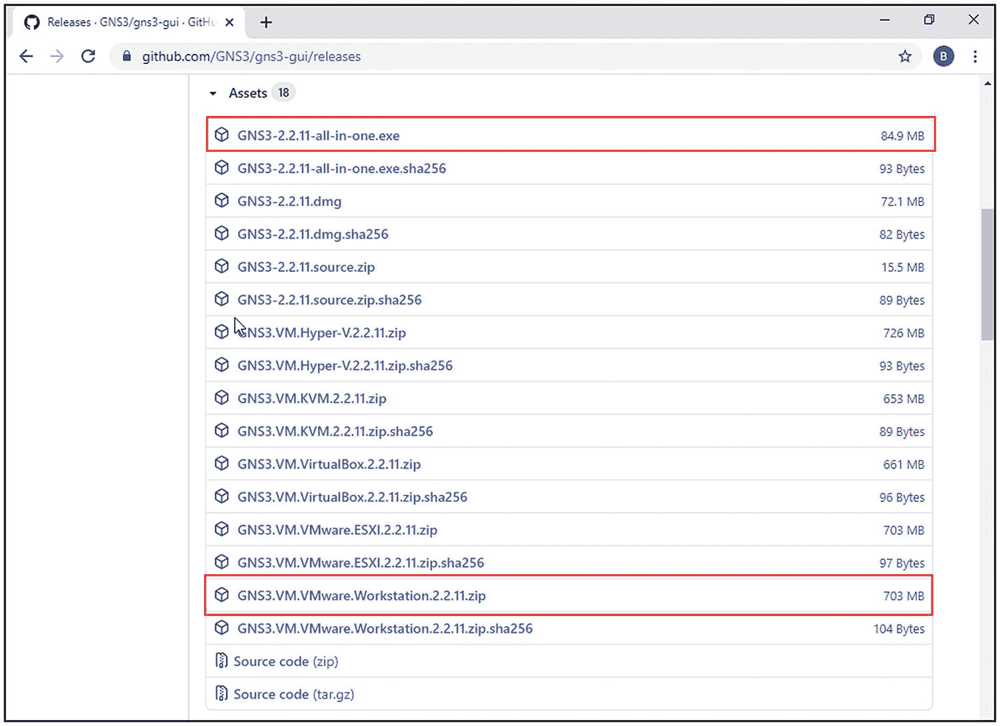

图 10-1。

用于 Windows 的 GNS3 安装文件下载

在这个例子中，使用 Assets 按钮通过开发者的 GitHub 网站下载软件。或者，在注册用户帐户后，可以从 GNS3.org 网站下载相同的软件。

## GNS3 安装和设置

作为安装的一部分，GNS3 将安装基本软件，如 Microsoft Visual c++ 2017 re distributable(x64)、Wireshark、WinPcap 和 nPcap。假设你的电脑已经安装了必要的软件。在这种情况下，GNS3 安装向导将自动检测软件，但如果没有安装软件，它将自动安装必要的软件。在大多数安装情况下，GNS3 安装将顺利完成，但如果您的安装不顺利，您可以在 GNS3 安装之前预安装正确版本的 Wireshark、WinPcap 和 nPcap。您还将被提供注册和安装网络安全管理软件产品软件；在我看来，这是膨胀软件，所以如果你关心你的计算机的性能，确保你拒绝网络安全管理软件产品的免费提供。

### GNS3 安装

最基本的安装任务已全部记录下来，并作为附加安装指南提供，以便在本书中包含更多高质量的内容。在 Windows 主机上安装 GNS3 非常简单，只需点击几次“下一步”按钮，直到安装完成。GNS3 的初始安装步骤请参考`Chapter 10 Pre-task – Installing GNS3.pdf`；安装指南可在 [`https://github.com/pynetauto/apress_pynetauto`](https://github.com/pynetauto/apress_pynetauto) 获得。

 **下载并完成 GNS3 安装，然后继续下一部分！**

### GNS3 设置程序

现在我们必须设置 GNS3，以便您可以使用它来构建您的网络实验室。还有其他设置选项可用，但由于我们已经在 Windows 主机 PC 上导入了 GNS3 虚拟机，这将是我们首选的设置方法。按照说明操作，开始 GNS3 设置。

<colgroup><col class="tcol1 align-left"> <col class="tcol2 align-center"></colgroup> 
| 

#

 | 

工作

 |
| --- | --- |
| one | As soon as GNS3 launches, you will be prompted with the GNS3 server Setup Wizard. Here, we are using the GNS3 VM, so you must choose “Run appliances in a virtual machine.” Check the “Don’t show this again” box and click the Next button. See Figure [10-2](#Fig2).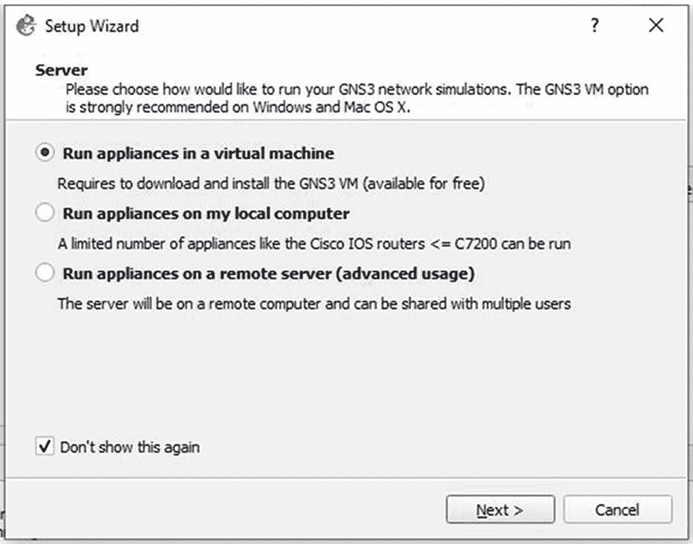图 10-2。GNS3 设置，GNS3 服务器设置向导 |
| Two | Under “Local server configuration,” leave everything as the default. GNS3 on Windows uses TCP port 3080 for the server to localhost communication. This number is rarely altered unless you have an installation problem or want to configure it differently from out-of-the-box installation. Click the Next button again. See Figure [10-3](#Fig3).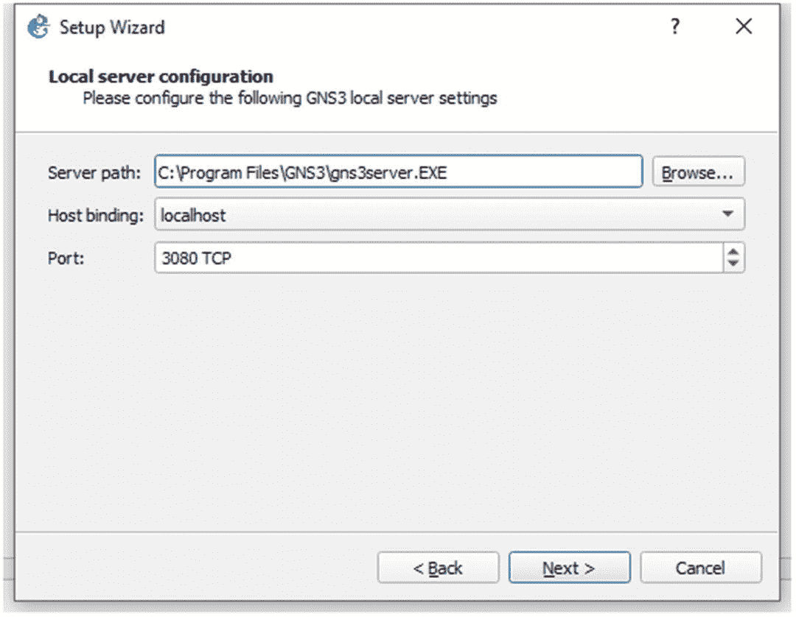图 10-3。GNS3 设置，本地服务器配置 |
| three | There is nothing to select for the local server status, so click the Next button to proceed. See Figure [10-4](#Fig4).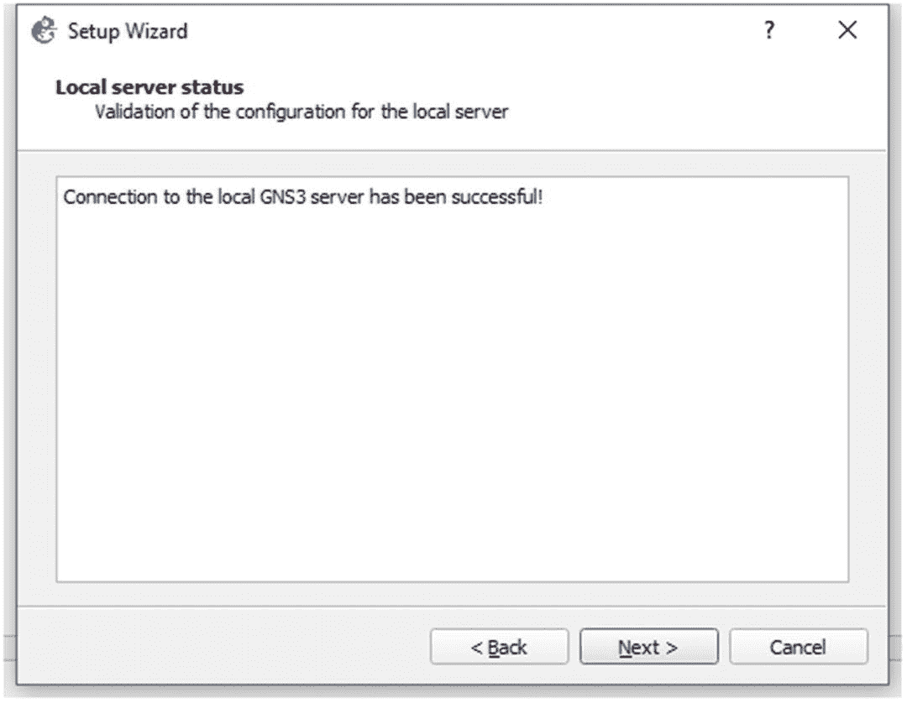图 10-4。GNS3 设置，本地服务器状态 |
| four | The default GNS3 RAM recommendation is 2GB (2048MB); update this to 4GB (4096MB) or more based on your computer specification. My computer has 32GB memory, so my host will still have plenty of memory after allocating 8GB (8192MB) of memory to the GNS3 VM. If you have 16GB of memory, the recommendation is between 4GB and 6GB of memory to this VM. When you reset the memory allocation here, it will be reflected on VMware Workstation’s GNS3 VM server. If you are using an older CPU, leave the vCPU cores at 1, but if the CPU is newer, the vCPU cores can be increased to 2 or more. Click Next. See Figure [10-5](#Fig5).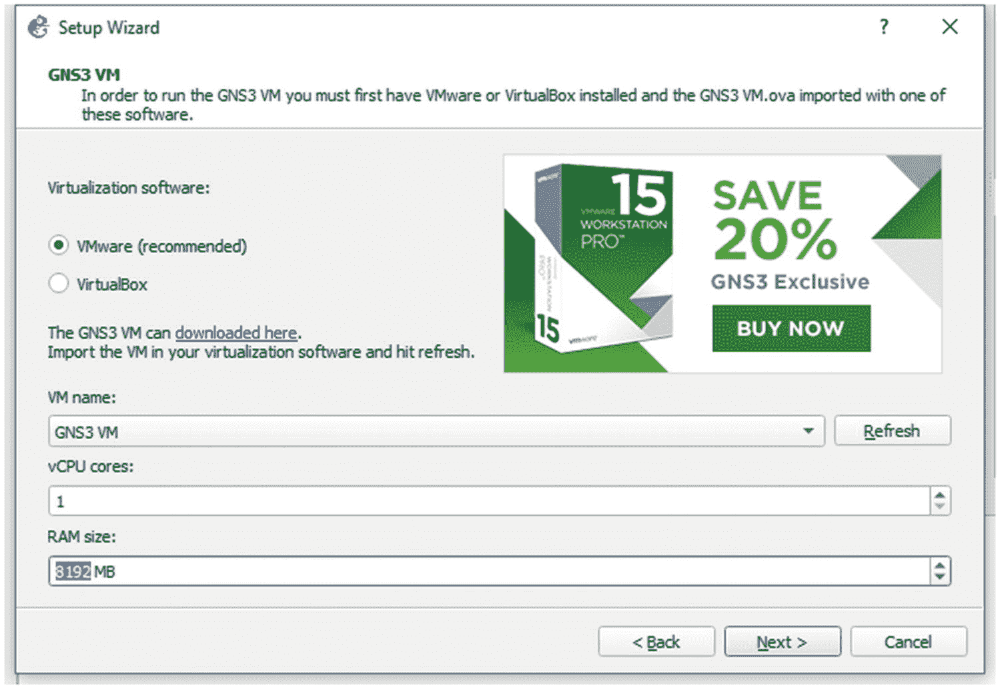图 10-5。GNS3 设置、GNS3 VM |
| five | As soon as you click the Next button, the GNS3 VM on the workstation will boot up. And once it goes through the Power-On Self-Test (POST) , you will see a blue welcome screen similar to Figure [10-6](#Fig6) on VMware Workstation 15 Pro. The GNS3 VM is a Linux (Ubuntu) appliance server configured to run various GNS3-compatible appliances from many vendors. GNS3 is a lot more than just a Cisco IOS emulator and has many use cases for studying other vendor products. Your GNS3 VM will be launched automatically; give it enough time to stabilize.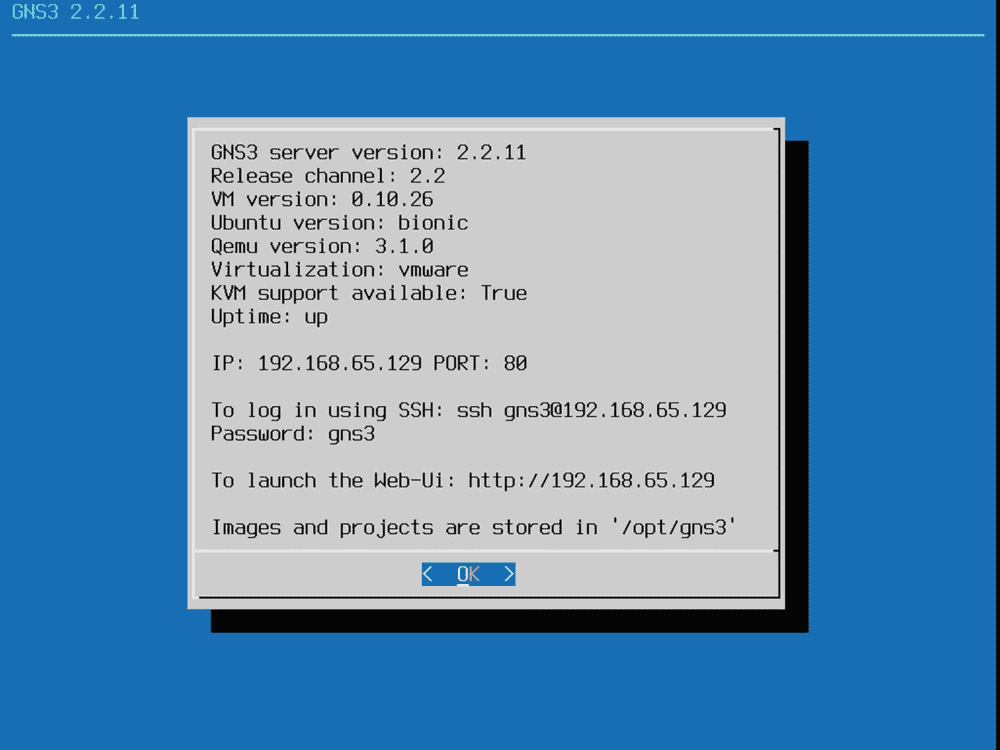图 10-6。GNS3 设置，工作站上的 GNS3 VM 服务器已启动 |
| six | The GNS3 Setup Wizard summary window appears, and you can review and click the Finish button to complete your setup. See Figure [10-7](#Fig7).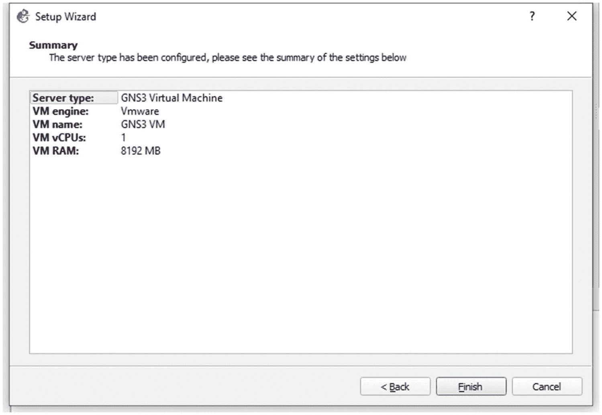图 10-7。GNS3 设置，设置摘要 |
| seven | Now you will see the GNS3 GUI with the GNS3 VM and your hostname (local host) with green status lights. If you see a red or amber light, it is an indication that your GNS3 installation has not been completed cleanly, and you may need to review your installation and setup processes and troubleshoot the issue. See Figure [10-8](#Fig8).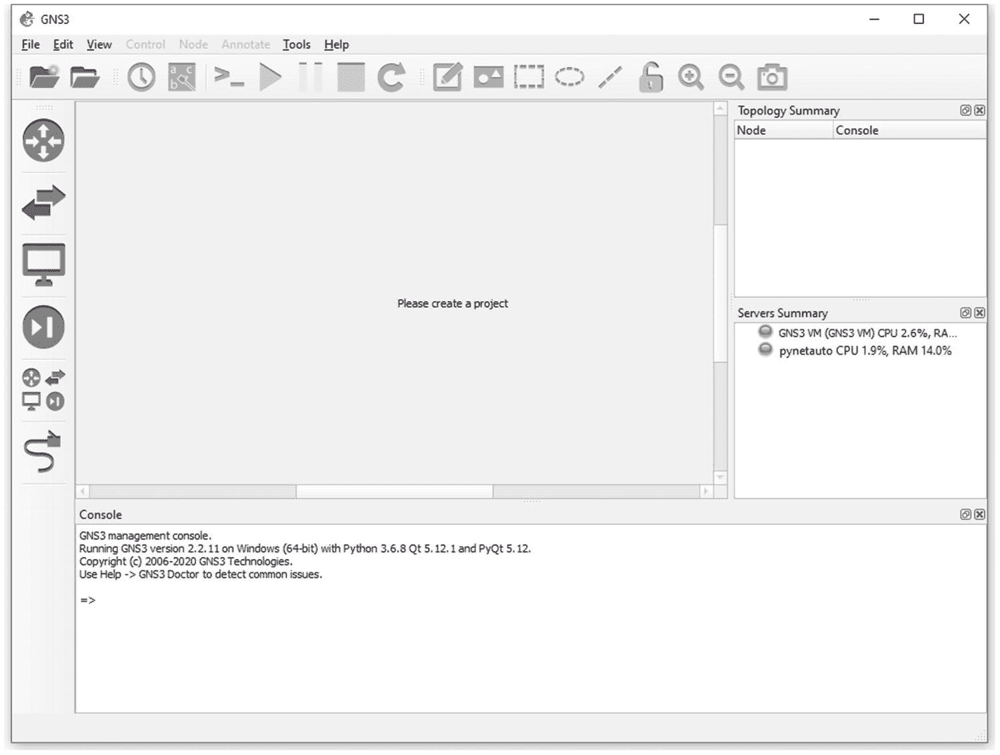图 10-8。GNS3，第一次启动和运行 |

## 熟悉 GNS3

现在已经安装并启动了 GNS3，您可以开始使用该应用程序了。在进入 GNS3 并创建测试网络拓扑之前，让我们快速研究一下用户界面，以便更好地理解每个菜单的功能和选项。主下拉菜单选项中提供了所有图标菜单和更多菜单选项。以下部分是 GNS3 菜单的快速介绍和一些提示，可帮助您从 GNS3 顺利运行网络实验室。

### GNS3 菜单和 GUI

图 [10-9](#Fig9) 显示了 GNS3 的主窗口，表 [10-1](#Tab1) 描述了每个选项。熟悉每个菜单的位置以及 GNS3 GUI 界面上最常用功能的图标位置，将有助于您在主机上使用 GNS3 时节省时间。

表 10-1。

GNS3 GUI 元素

<colgroup><col class="tcol1 align-left"> <col class="tcol2 align-left"> <col class="tcol3 align-left"></colgroup> 
| 

#

 | 

菜单

 | 

说明

 |
| --- | --- | --- |
| ① | 菜单选项 | 使用菜单访问下拉菜单中的所有选项。 |
| ② | 文件选项 | 打开或保存 GNS3 项目。 |
| ③ | 设备和拓扑选项 | 管理快照，显示/隐藏连接器，并控制设备。 |
| ④ | 模拟选项 | 打开/关闭、暂停和重启设备。 |
| ⑤号 | 绘图工具 | 用绘图工具装饰 GNS3 拓扑画布。 |
| ⑥ | 设备类型图标 | 根据不同的设备类型显示设备。 |
| ① | 添加链接工具 | 连接各种设备。 |
| ⑧ | 设备列表 | 列出已安装的设备。使用搜索菜单过滤显示的设备。 |
| ⑵ | 拓扑画布 | 在画布上选择并拖放设备，创建一个工作拓扑。 |
| ⑩ | 日志窗口 | 显示 GNS3 操作状态。您也可以使用此窗口发送一些命令。 |
| ⑪ | 拓扑/节点摘要 | 显示当前 GNS3 设备摘要。 |
| ⑫ | 服务器摘要 | 显示 GNS3 虚拟机和本地服务器状态。此外，它还显示每台服务器的 CPU 和内存利用率。 |

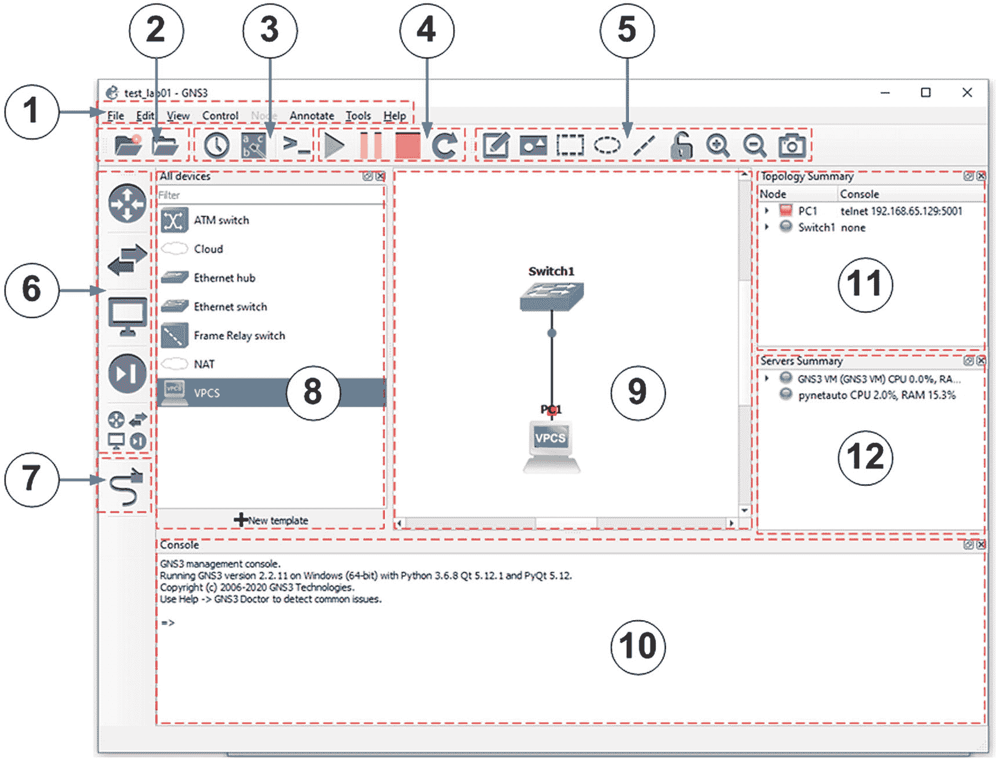

图 10-9。

GNS3 GUI

### 正常关闭 GNS3 和 GNS3 虚拟机

在您开始在 GNS3 的拓扑画布上绘制图标之前，这是一个友好的提醒。由于 GNS3 对 Windows 安装的敏感性以及软件试图模拟物理硬件的方式，运行在 Windows 操作系统上的 GNS3 从来都不是 100%可靠的。为了避免麻烦和排除一些小问题的时间，我必须强调，当你在 Windows 操作系统上启动和关闭 GNS3 时，你应该采取更温和的方法。当您启动 GNS3 时，您必须给它足够的时间来启动其所有后台服务，如果您使用 GNS3 VM 来托管所有虚拟网络设备，还必须启动 GNS3 VM。最重要的是，在关闭 GNS3 时，您必须遵循一套严格的程序，以避免任何配置丢失，并避免由于应用程序突然关闭导致的文件损坏而删除整个项目。GNS3 是学习基本网络概念的最佳免费学习工具之一，但不幸的是，它不具备企业级的可靠性。

在完成 Cisco 或任何其他供应商的 GNS3 实验后，首先保存运行配置至关重要。对于 Cisco IOS 设备，运行`copy running-config start-config`或`write memory`将路由器或交换机的运行配置保存到启动配置。之后，使用红色大停止按钮或单独选择每个设备来关闭每个设备，使任何其他设备处于关闭状态(参见图 [10-10](#Fig10) )。一旦保存了所有配置并且正确关闭了设备，那么您可以使用右上角的 X 优雅地关闭 GNS3(参见图 [10-11](#Fig11) )。

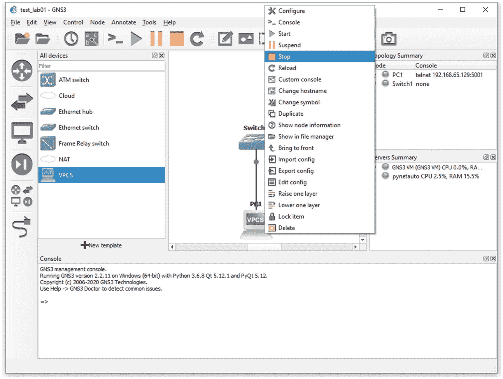

图 10-10。

GNS3，使用右键单击选项停止设备

GNS3 关闭后，运行在 VMware Workstation 15 Pro 上的 GNS3 虚拟机也将自动关闭。最好不要从工作站关闭虚拟机；建议您使用右上角的 X 标记关闭 GNS3 应用程序。随着您对 GNS3 及其古怪之处的熟悉，这个关闭过程成为了一个标准程序。如果不小心，您的工作实验室配置和项目可能会由于不正确的关闭程序而经常出现故障。

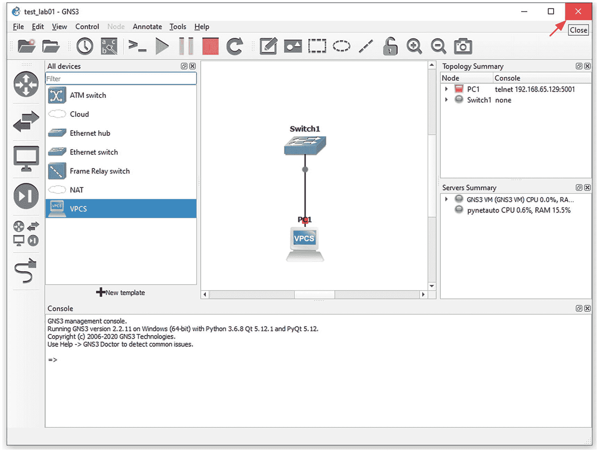

图 10-11。

GNS3，使用 X 键正常关机

### 以管理员身份启动 GNS3

在 Windows 操作系统上首次启动 GNS3 时，这里有一个快速提示。当 GNS3 安装在您的 Windows PC 上时，如果您没有取消选择此选项，默认情况下将在您的 Windows 桌面上创建 GNS3 启动图标。使用此图标启动 GNS3 是启动程序的最快方式；但是，不以管理员身份启动 GNS3 会限制您对网络适配器设置和其他设置进行 GNS3 配置更改。因此，最佳实践是始终以管理员身份启动 GNS3。作为 GNS3 管理员，有一个小贴士可以改变 GNS3 图标下的设置。

<colgroup><col class="tcol1 align-left"> <col class="tcol2 align-center"></colgroup> 
| 

#

 | 

工作

 |
| --- | --- |
| one | First, go to the desktop of your host PC, locate the GNS3 icon, and right-click it to open Properties. See Figure [10-12](#Fig12).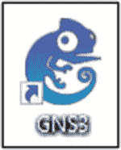图 10-12。GNS3，Windows 主机桌面上的开始图标 |
| Two | Now, go to the Compatibility tab. Under Settings , select the “Run this program as an administrator” option, click the Apply button, and click the OK button to save the settings. See Figure [10-13](#Fig13).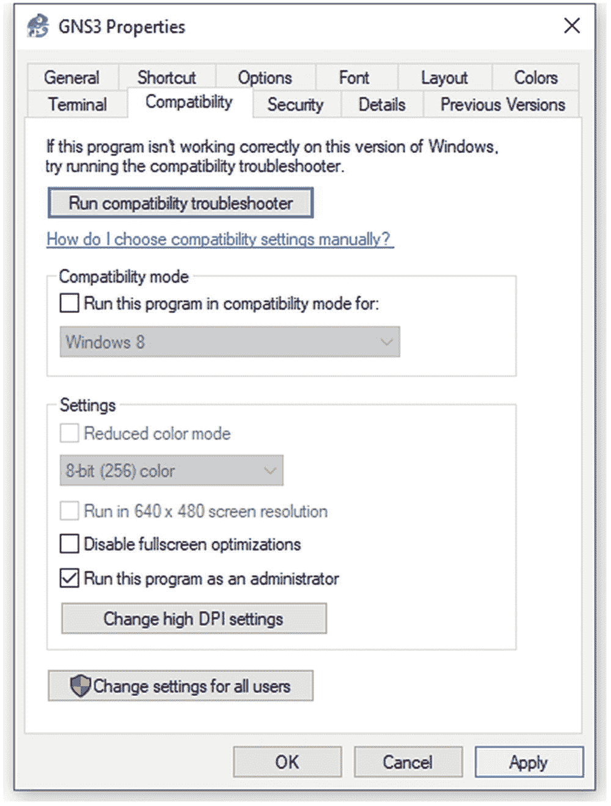图 10-13。GNS3，更改程序图标启动设置 |

现在你已经准备好学习一些 GNS3 技巧来提高你的技能。在本章的其余部分，将向您介绍一些很酷的 GNS3 技巧，例如将 GNS3 设备连接到主机、将 GNS3 连接到互联网、将 Microsoft loopback 添加到实验拓扑中，以及克隆 GNS3 项目以制作基础实验模板。

## 首次使用 GNS3:思科 IOS 和 Windows 实验室

最初，学习思科技术和认证的唯一方法是使用基于物理硬件的实验室，其中有一堆路由器和交换机。当 Christophe Fillot 在 2005 年 8 月开发 Dynamips 来模拟旧的 Cisco 路由器平台时，它永久性地改变了网络专业学生学习 Cisco 技术的方式。在 Dynamips 之前，有 Cisco 的 PacketTrace，但它更多的是一个模拟器，而不是仿真器。如前所述，GNS3 是 Dynamips 的 GUI 版本，GNS3 的底层应用仍然是 Dynamips。

最近，一个众所周知的秘密是 Cisco 正在使用基于 UNIX 的 Cisco IOU 进行内部员工培训，但是 IOU 并没有作为产品在市场上发布。有一段过渡期，思科 IOU 被泄露给思科合作伙伴，联网的同学都在用思科 IOU。思科最近将思科 IOU 重新解释为思科 CML(之前的 VIRL ),并将其发展为一种基于订阅的产品，可作为市场上的付费产品。

在 GNS3 开发人员集成 VIRL 和 IOU 映像之前，老派网络学生在 GNS3 上使用有点过时的思科 IOS 映像来学习思科认证。即使在今天，GNS3 也支持较旧的 Cisco IOS 映像；这与 CCNA 研究相关，因为它提供了不使用任何物理设备来模拟超过 90%的 CCNA 路由研究的方法。尽管网络技术和网络教育市场有了一些新的进步，但许多旧的路由和交换概念仍然与 CCNA 研究相关，因此在学习基本网络概念时，Cisco IOS 12.4.x 版本将足以满足您的学习需求。

使用旧的基于 IOS 的 GNS3 实验室学习网络有两个主要缺点。首先，它只能在大多数路由器平台上支持较旧的 IOS 12.4 版本，但 Cisco 7200 除外。其次，第 2 层对交换的支持只能通过安装在路由器平台上的 NM-16ESW 模块来实现。使用较新的 VIRL L2 和 L3 映像，您可以在 GNS3 上构建功能更多的思科路由和交换实验室，并具备许多 IOS 功能。

作为 GNS3 引入的一部分，将旧的 Cisco IOS 集成到实验室将是一个很好的起点。实际上，在 VIRL 集成中，唯一被替换的是 IOS 映像和更新的 VIRL 映像。本章将逐步向您介绍一些可以在运行于 GNS3 的 Cisco IOS 上使用的技术。在很大程度上，本章中学到的所有技术都可以扩展到第 [12](12.html) 、 [13](13.html) 和 [14](14.html) 章中的 CML 实验室，它们将帮助你建立各种更有效、更灵活的 GNS3 实验室。即使你是一名老 CCNA 学生，熟悉 GNS3 上的旧 IOS 集成，也不要跳过这一章，因为在这一章中你会学到一些新技能。

让我们先快速讨论一下思科软件许可模式，包括思科 IOS、IOU 和 VIRL 映像。

### Cisco IOS 软件许可和下载旧的 Cisco IOS

首先，要使用 Cisco IOS 配置您的 GNS3 实验室，您必须找到并下载支持 GNS3 的 Cisco 路由器型号的 Cisco 互联网操作系统(IOS)映像。如前所述，这本书的工作假设要么你已经完成了思科 CCNA R&S 认证研究或你目前正在完成思科的助理级认证研究。另一个假设是，你对思科如何开展业务感兴趣，你想在未来的许多年里作为一名网络/安全/数据中心工程师在企业网络领域工作。思科通过销售硬件、软件和服务支持合同来增加收入。要了解思科如何通过软件增加收入，您必须了解思科软件的软件所有权和许可协议。要理解思科的软件许可模式，你必须从思科的商业模式着手。您已经知道，思科是面向企业和中小型企业市场销售网络设备的领先供应商；它出售其硬件和软件的技术支持合同包，以提高公司的利润率。技术支持协议还包括使用思科软件的权利。换句话说，如果您通过正规渠道从思科的合作伙伴那里购买了设备，那么作为客户，您有权使用在您的网络设备上运行的特定平台软件，并且如果您需要技术支持，可以获得思科 TAC 的全天候支持，直到服务合同的最后一天。

其次，请注意，如果您购买了运行 Cisco IOS 版本 15 的设备，通常您只允许在同一软件版本内进行较小的补丁升级，除非有安全漏洞的现场通知或升级到最新主要软件版本的现场通知。通常，您的设备会老化，新软件的最低硬件要求也会提高。你将被限制升级设备的软件到某个级别，你被迫升级到最新的硬件型号。随着思科设备即将停产(EoL)，思科将不再支持任何 EoL 设备。思科的大部分软件被视为思科专有，是思科知识产权的一部分，因此思科拥有所有的 IOS 和其他软件权利；因此，不允许个人自由分发此软件。通过渠道合作伙伴购买思科设备后，技术支持服务合同还允许从思科 TAC 下载软件和获得技术支持。如果您目前为思科合作伙伴工作，您将能够轻松下载最新的 IOS 软件，但可能无法下载较旧的 IOS 软件。为你的研究获取旧 IOS 的另一个好方法是从易贝、Craigslist 或 Gumtree 等在线拍卖网站购买二手实验室路由器，甚至从你认识的不再使用他的旧 CCNA/CCNP 实验室设备的人那里购买。你会在你设备的闪存中找到一个正常工作的 IOS，IOS 可以通过 TFTP 文件传输复制到你的电脑上；那么它可以用作 GNS3 IOS 基础映像。即使您有权从思科网站下载 IOS，从思科的官方网站找到一个旧的 GNS3 兼容的 IOS 也是一个挑战，因为大多数旧设备已经停产。假设你是一名全日制学生，想从事网络行业，做网络或安全工程师。在这种情况下，谷歌搜索可以带你到一些网站，在那里你可能能够找到旧版本的 IOS。这本书使用了我的旧思科设备上的旧版本 IOS，但是最终下载旧版本 IOS 的工作副本是你的责任。

第三，当您访问 GNS3 的官方网站时，您将首先注意到 GNS3 支持较旧的思科路由器，即 C1700、C2600、C2691、C3600、C3700 和 C7200 系列路由器以及较旧样式的思科 PIX 防火墙。出于快速演示的目的，本章使用了旧的 Cisco 3725 路由器的 IOS 版本 12.4.15 T15，该版本与最新的 GNS 3.2.11 兼容。虽然支持 Cisco 7200 路由器的 IOS 版本 15.x，但 RAM 要求为 512MB，比旧的 3700 系列路由器消耗更多的计算机内存。如果您有一台 CPU 和内存相对较强的 PC，您可以选择使用 Cisco 7200 IOS 版本 15.x 来代替 3725 的 IOS。在本章中，使用的确切 IOS 版本是`c3725-adventerprisek9-mz.124-15.T14.bin`映像，这是 GNS3.2.11 当前支持的版本。

以下是一些旧版本的 IOS，您可以在我们的学习中使用:

*   `c3725-adventerprisek9-mz.124-15.T14.bin`(旧)

*   `c3745-adventerprisek9-mz.124-25d.bin`(旧)

*   `c7200-adventerprisek9-mz.124-24.T5.bin`(旧)

*   `c7200-adventerprisek9-mz.152-4.M7.bin`(更新)

您负责购买和下载本书中所需的思科软件。本书不提供本书中使用的任何软件，但会向您指出查找和下载正确软件的来源。在一天结束的时候，每个读者都要为他们自己的学习需要对任何软件的使用负责。

### 解压缩 Cisco IOS 以供 GNS3 使用

如果你想跟随这本书，你应该已经成功地在你的`Downloads`文件夹中找到并下载了`c3725-adventerprisek9-mz.124-15.T14.bin`。然后，您将把`.bin`文件解压缩成`.image`文件，这样解压缩后的图像文件可以在 GNS3 中使用。在不同的操作系统上有不同的方法来解压缩 Cisco IOS `.bin`文件，但是您将学习如何使用两种最常见的 Windows 方法来解压缩 IOS 文件。第一种方法是使用`Unpack-0.1_win.zip`，第二种方法是将 GNS3 集成到 Dynamips 中对 IOS 进行解压缩。

#### 使用 Unpack.exe 方法解压缩 Cisco IOS

在这里，您将为 Windows 下载`Unpack.exe`,并解压缩一个 Cisco IOS 文件供 GNS3 使用。按照这些简单的说明解压缩原始的`.bin`文件，并保存为一个`.image`文件，供 GNS3 使用。请注意，该文件必须以`.image`文件扩展名保存，并在本任务结束时移动到您 PC 的`Downloads`文件夹中。

<colgroup><col class="tcol1 align-left"> <col class="tcol2 align-left"></colgroup> 
| 

#

 | 

工作

 |
| --- | --- |
| one | 首先，下载`Cisco image unpacker 0.1 binary for Windows`到你的`Downloads`文件夹，并解压到`Downloads`文件夹下。文件名是`Unpack-0.1_win.zip`，可以从 [SourceForge 下载。网](http://sourceforge.net)。URL: [`https://sourceforge.net/projects/gns-3/files/Cisco%20Image%20Unpacker/v0.1/`](https://sourceforge.net/projects/gns-3/files/Cisco%2520Image%2520Unpacker/v0.1/) |
| Two | If you still have your IOS file in the `Downloads` folder, move it to the `Unpack` folder, as shown in Figure [10-14](#Fig14).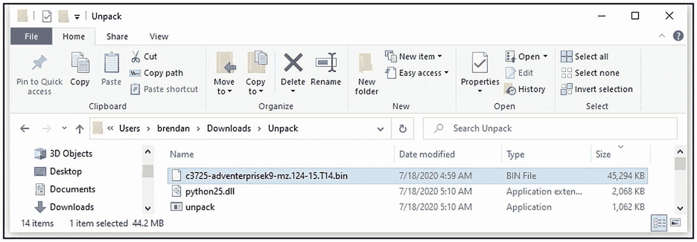图 10-14。解压缩 IOS，将 IOS 文件移动到解压缩文件夹 |
| three | 在 Windows 命令行提示符下，运行下面的`unpack.exe`命令将文件解压到同一个文件夹中。一旦文件被解压缩，解压缩后的文件名将使用`.bin.unpacked`作为其文件扩展名:`unpack.exe --format IOS [Your_IOS_Name]`。`C:\Users\your_name\Downloads\Unpack>unpack.exe --format IOS c3725-adventerprisek9-mz.124-15.T14.bin`**注意**用你的用户名替换`your_name`。 |
| four | Now rename the `.bin.unpacked` file as a `.image` file. So, the filename changes from `c3725-adventerprisek9-mz.124-15.T14.bin.unpacked` to `c3725-adventerprisek9-mz.124-15.T14.image`. Also, notice that the decompressed `IMAGE` file is almost twice the size of the `.bin` file. See Figure [10-15](#Fig15).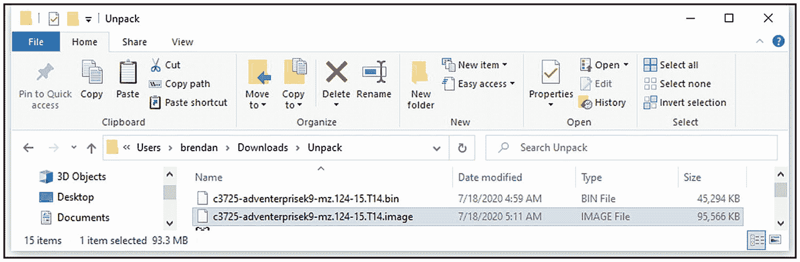图 10-15。解压缩 IOS，将解压缩的. bin.unpacked 文件重命名为。图像 |
| six | Once the filename has been updated with the correct file extension, copy and paste the file into the `Downloads` folder again. This step is essential as GNS3 will be searching for a compatible `.image` file in the `Downloads` folder on your Windows. See Figure [10-16](#Fig16).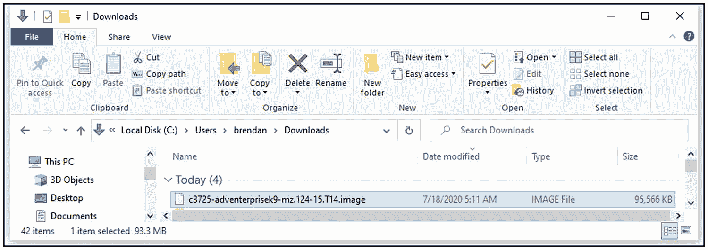图 10-16。解压缩 IOS，移动。图像文件到下载文件夹 |

如果您想了解如何使用第二种方法(Dynamips 方法)解压缩 IOS 文件，请阅读 10.4.2.2，但是如果您想立即开始网络实验构建任务，请跳到 10.5。

#### 使用 Dynamips 方法解压缩 Cisco IOS(可选)

按照这些说明，使用 Dynamips 服务器方法将 IOS `.bin`文件解压缩到`.image`文件中。一旦你完成了任务，确保`.image`文件的副本已经放在你的主机的`Downloads`文件夹下。一些读者可能会发现这个过程比第一种解压方法更容易管理。

<colgroup><col class="tcol1 align-left"> <col class="tcol2 align-center"></colgroup> 
| 

#

 | 

工作

 |
| --- | --- |
| one | If you have not started your GNS3 and GNS3 VM, first launch it by double-clicking your desktop’s GNS3 start icon. See Figure [10-17](#Fig17).图 10-17。GNS3，GNS3 桌面图标 |
| Two | Give one to two minutes for the GNS3 VM to start up properly and settle down. Wait until both GNS3 VM and your local server’s CPU and RAM levels settle down. See Figure [10-18](#Fig18).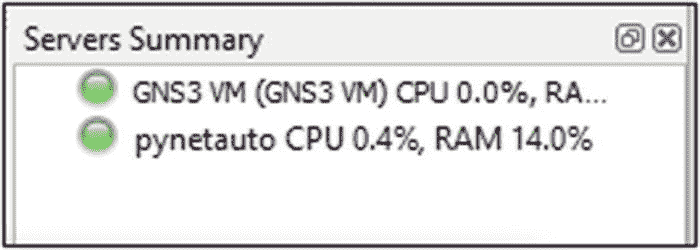图 10-18。GNS3，服务器摘要窗口 |
| three | GNS3 will prompt you with the Project window. Since we are interested only in decompressing the IOS, we will click the Cancel button. See Figure [10-19](#Fig19).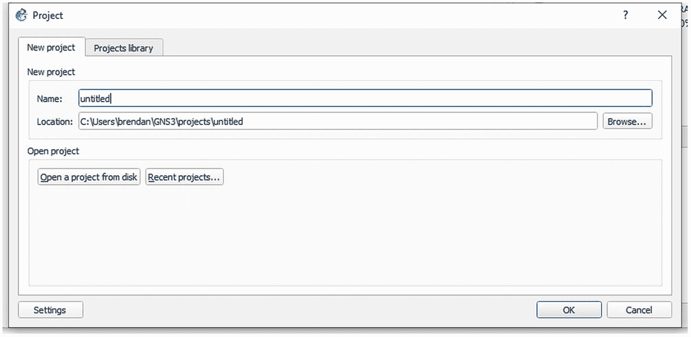图 10-19。GNS3，项目窗口取消 |
| four | To open the Preferences menu on GNS3, select Edit ➤ Preferences. See Figure [10-20](#Fig20).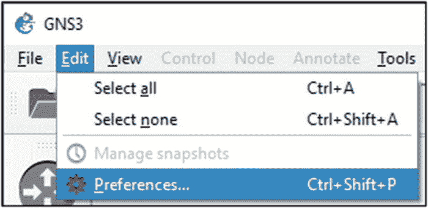图 10-20。GNS3，打开首选项菜单 |
| five | Select the IOS routers under Dynamips, as shown in Figure [10-21](#Fig21).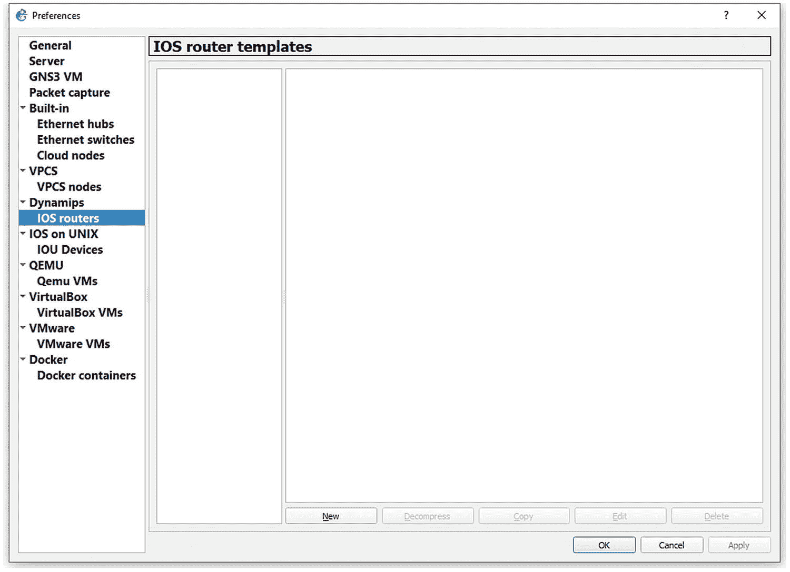图 10-21。GNS3、dynamips、IOS 路由器 |
| six | Click the New button to open the New IOS router template window. In the Server screen, select “Run this IOS router on my local computer.” You can also select the “Run this IOS router on the GNS3 VM” option, but we’ll use the old method and remove the image after decompressing the file. See Figure [10-22](#Fig22).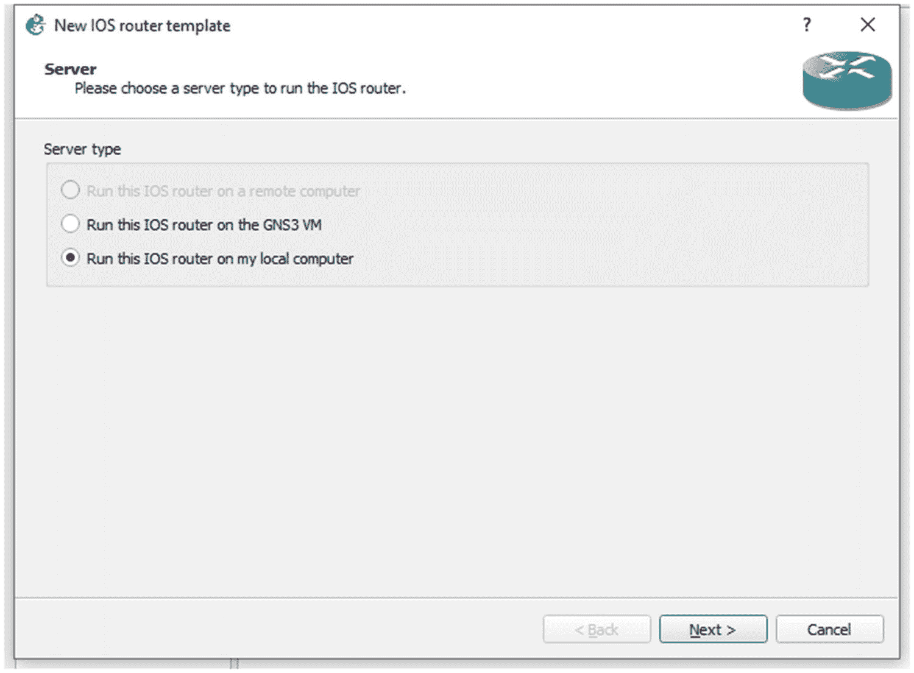图 10-22。GNS3，新的 IOS 路由器模板 |
| seven | In the IOS image window, click the Browse button on the right. See Figure [10-23](#Fig23).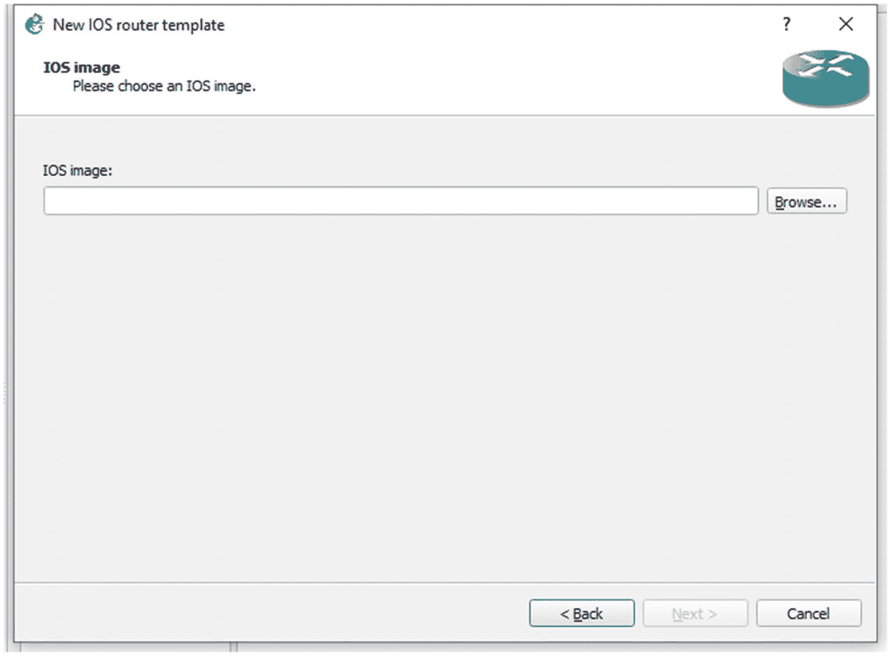图 10-23。GNS3，选择 IOS 映像 |
| eight | Select your IOS image in the `Downloads` folder and click the Open button. See Figure [10-24](#Fig24).图 10-24。GNS3，选择 IOS 并打开 |
| nine | Click Yes to decompress the IOS image. See Figure [10-25](#Fig25).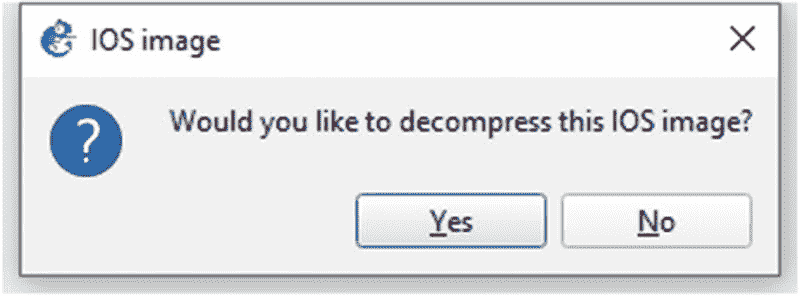图 10-25。GNS3，解压缩 IOS 映像 |
| Ten | 当你回到 IOS 镜像窗口时，GNS3 会告诉你`.image`文件将被存储在哪里。在本演示中，它被提取到用户的`GNS3\images\IOS\`文件夹中。见图 [10-26](#Fig26) 。`C:\Users\your_name\GNS3\images\IOS\c3725-adventerprisek9-mz.124-15.T14.image`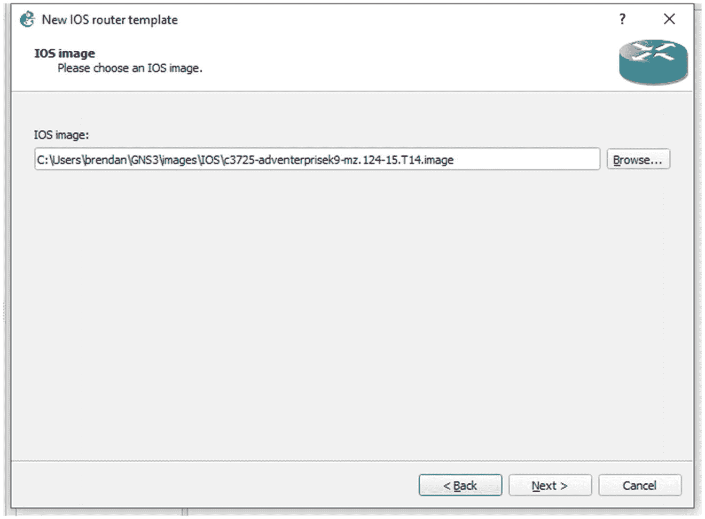图 10-26。GNS3，解压缩图像位置**注意**用你的名字代替`your_name`。 |
| Eleven | 对于名称和平台，将所有设置保留为默认值，然后单击 Next 按钮。 |
| Twelve | The recommended RAM size for 3725 is 256MB, but GNS3 will default the RAM to 128MB. This is only an example to demonstrate how to extract the `.bin` file into the `.image` file, so you can leave it as 128MB and click the OK button. See Figure [10-27](#Fig27).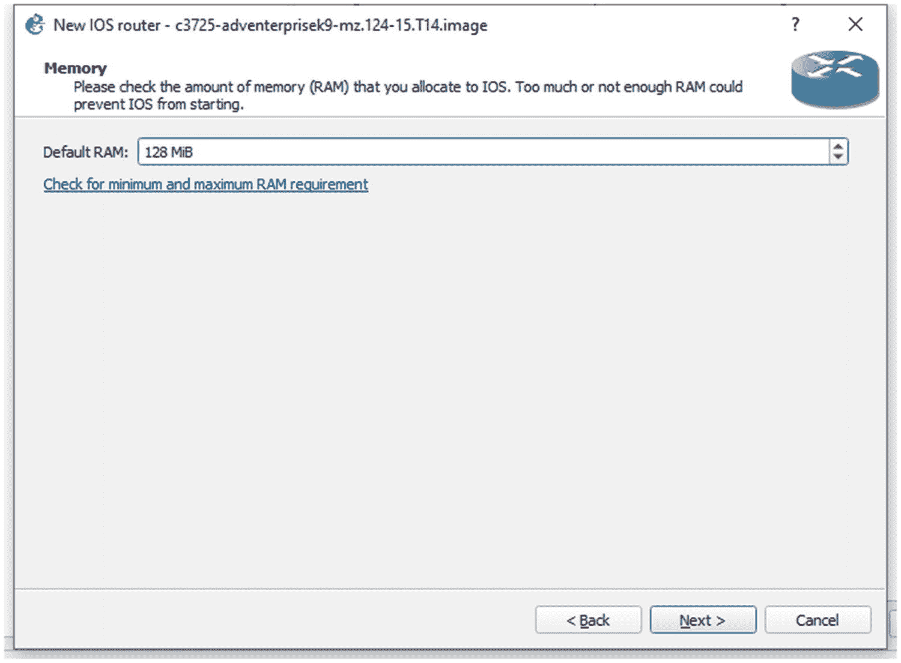图 10-27。GNS3，内存 |
| Thirteen | 在“网络适配器”窗口中，单击下一步按钮。 |
| Fourteen | 在“WIC 模块”窗口中，再次单击下一步按钮。 |
| Fifteen | 在空闲 PC 窗口中，单击下一步按钮。参见图 [10-28](#Fig28) 。**注意**如果您选择在本地机器和 Dynamips 上运行 IOS 路由器，您可以单击 Idle-PC finder 按钮来查找合适的 Idle-PC，它会自动为您的系统找到一个最佳值。由于我们将配置 IOS 路由器从 GNS3 虚拟机运行，我们可以跳过这一过程。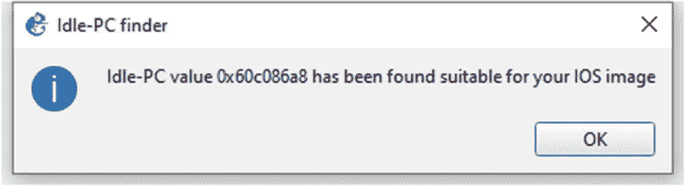图 10-28。GNS3，IOS idle-PC finder 示例 |
| Sixteen | Now we extracted the `.image` file in a folder. We plan to run most of the devices on the GNS3 VM, so select the router and click the Delete button to remove the router from Dynamips ➤ IOS routers. Then, click OK to close the window. See Figure [10-29](#Fig29).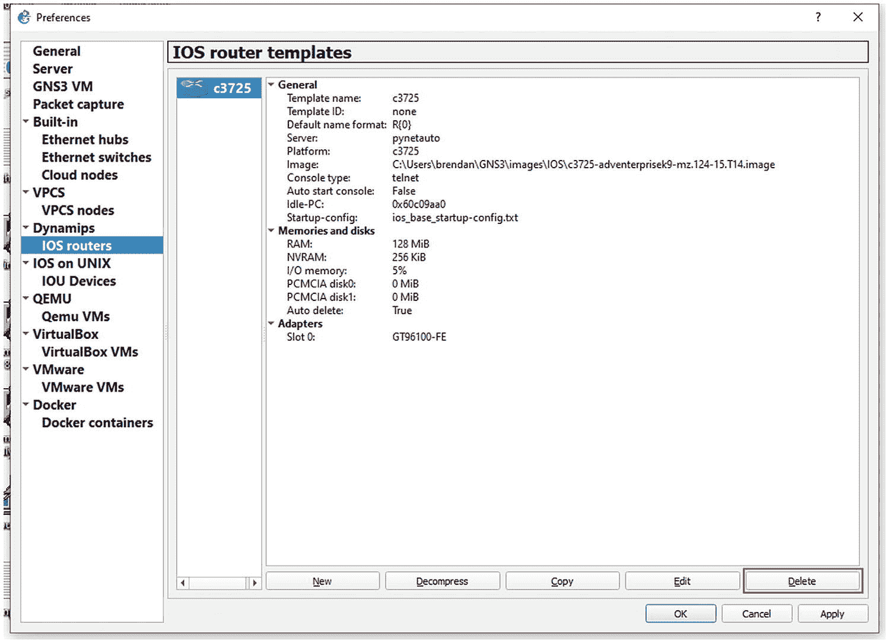图 10-29。GNS3，选择和删除 IOS 路由器 |
| Seventeen | 现在转到以下文件夹路径:`C:\Users\your_name\GNS3\images\IOS`。您会发现扩展名为`.image`的解压缩 IOS 镜像文件的副本。将文件复制到`Downloads`文件夹。 |

Note

**注意**用你的用户名替换`your_name`。参见图 [10-30](#Fig30) 。

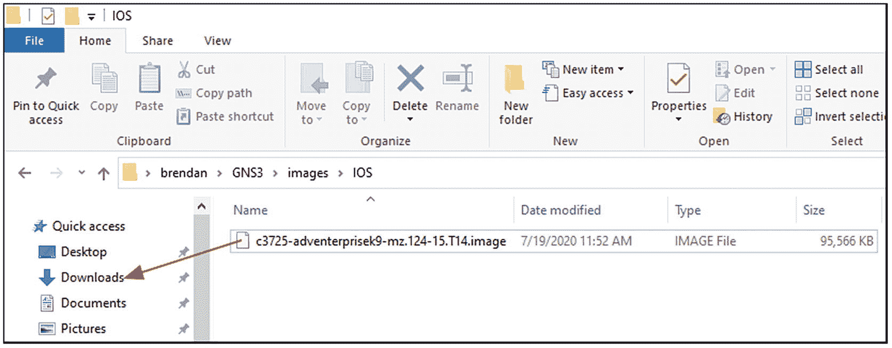

图 10-30。

主机，移动。图像文件到下载文件夹

现在，您可以在 GNS3 虚拟机上安装 Cisco IOS 路由器了。让我们坚持完成这项任务。

## 在 GNS3 虚拟机上安装 Cisco IOS

您已经成功解压缩了 IOS 映像，现在可以使用`.image`文件在本地服务器(PC)或 GNS3 VM 服务器上创建一个 GNS3 项目。由于我们使用 GNS3 VM 作为我们的 GNS3 服务器，并希望安装大多数设备，这避免了与本地 Dynamips 服务器设置相关的高 CPU 利用率、空闲 PC 和内存争用问题。我们将在 GNS3 虚拟机上安装 IOS，而不是本地服务器。这是一个推荐的安装，因为与在本地服务器上运行设备相比，GNS3 虚拟机的性能对主机性能的 CPU 和内存影响较小。

如果您的 GNS3 尚未运行，请启动应用程序，让它在工作站上初始化 GNS3 VM。等待大约 1 到 2 分钟，让 GNS3 虚拟机正常启动。等到你电脑的 CPU 和内存稳定下来。

假设工作站上的 GNS3 和 GNS3 VM 都在您的电脑上正常运行，让我们继续完成以下任务，创建我们的第一个 GNS3 项目，并在 GNS3 VM 服务器上安装`.image`文件:

<colgroup><col class="tcol1 align-left"> <col class="tcol2 align-center"></colgroup> 
| 

#

 | 

工作

 |
| --- | --- |
| one | 启动 GNS3 后，当 GNS3 项目窗口出现时，创建一个新的 GNS3 项目并命名。或者，您可以使用“新建项目”图标打开“项目”菜单并开始此任务。You can give any meaningful name of your choice. Here, the project name given was `ios_lab`. You do not have to follow this naming convention strictly. See Figure [10-31](#Fig31).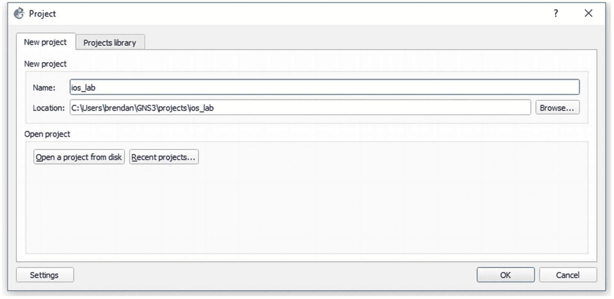图 10-31。GNS3，创建新项目 |
| Two | From the GNS3 menu, select File ➤ + New template. Or, click the Router icon under Devices on the left and click + New template. See Figure [10-32](#Fig32).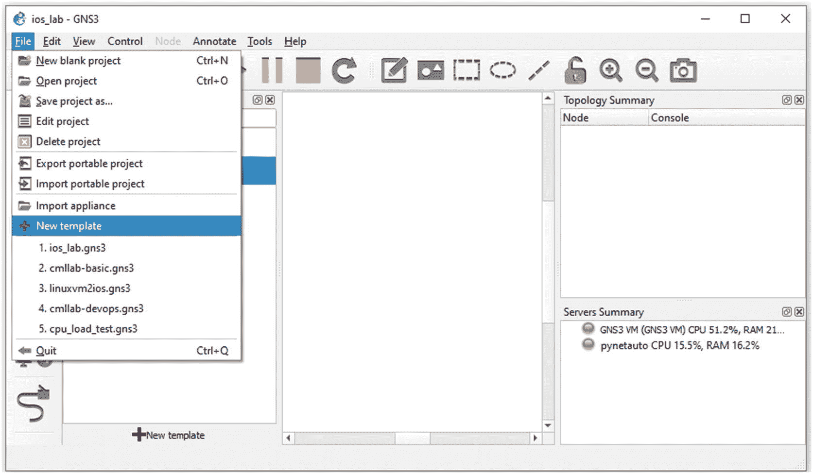图 10-32。GNS3，打开“新模板”菜单 |
| three | When the “New template” window appears, select the "Install an appliance from the GNS3 server (recommended)" option. Click the Next button. See Figure [10-33](#Fig33).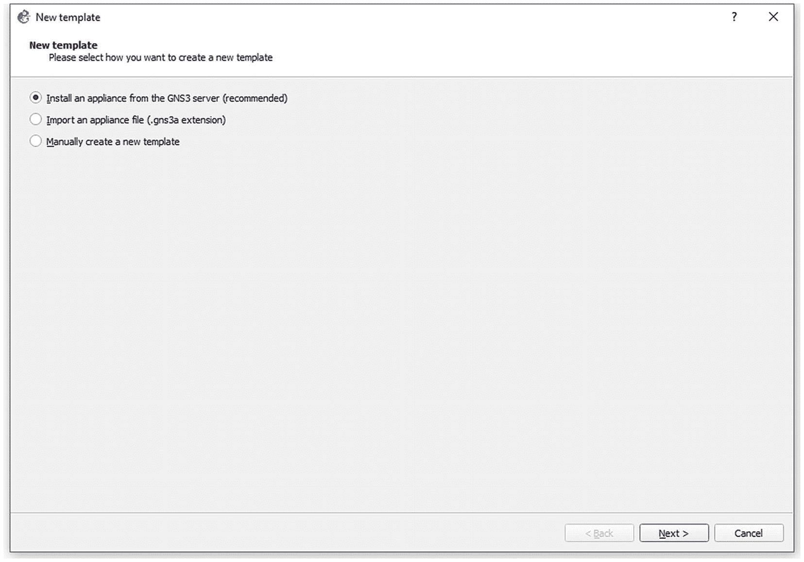图 10-33。GNS3，“新模板”选项 |
| four | Use the search field to locate your IOS device or use the drop-down device menu on the “Appliances from server” screen to select your device. Once you locate your IOS device, click it to select it and then click the Install button at the bottom. See Figure [10-34](#Fig34).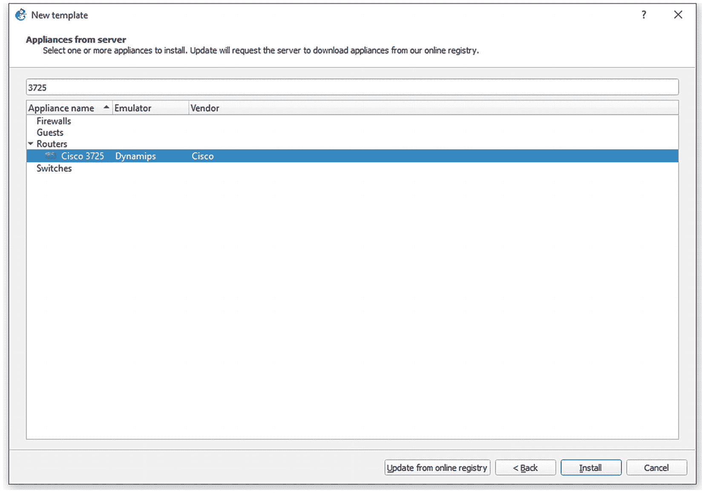图 10-34。GNS3，搜索你的 IOS 设备 |
| five | Next, leave the “Server type” selection as the default, “Install appliance on the GNS3 VM (recommended),” and click the Next button one more time. See Figure [10-35](#Fig35).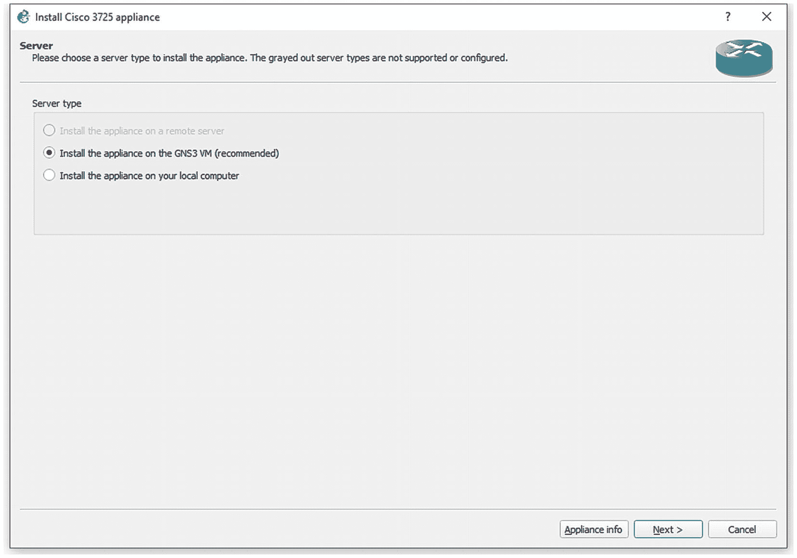图 10-35。GNS3，服务器类型选择 |
| six | If you have successfully followed the previous steps, the “Required files” window will locate your `.image` file, and you will see the same or similar screen to Figure [10-36](#Fig36). Select the image file by highlighting the file and click the Next button again.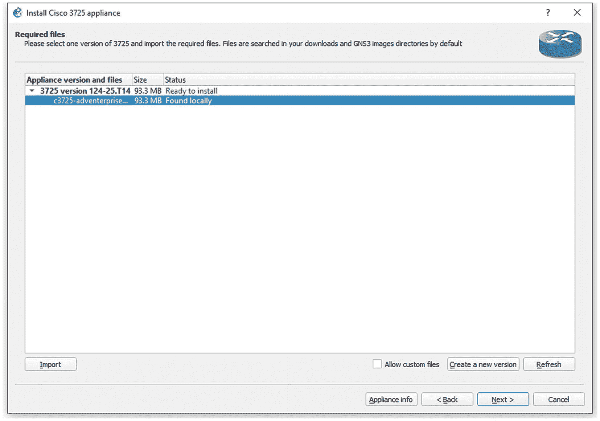图 10-36。GNS3，必需文件 |
| seven | Of course, you want to install the Cisco IOS on GNS3\. Click the Yes button. See Figure [10-37](#Fig37).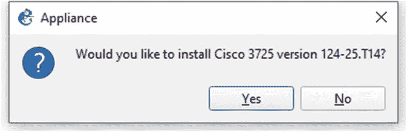图 10-37。GNS3，装置安装确认消息 |
| eight | You are almost there; click the Finish button to finish the installation. See Figure [10-38](#Fig38).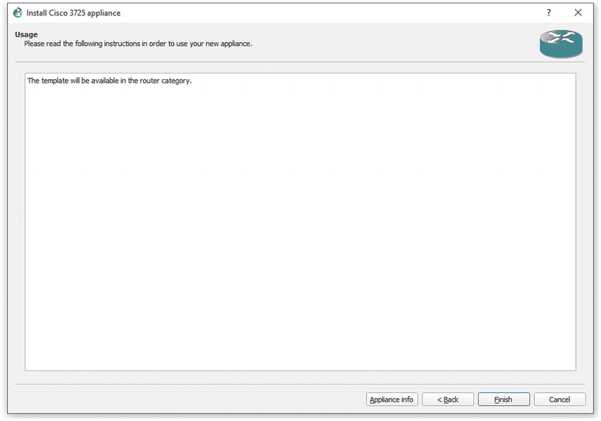图 10-38。GNS3，使用提示 |
| nine | If the installation is successful, you will be prompted with the message shown in Figure [10-39](#Fig39). Click the OK button.图 10-39。GNS3，添加模板成功消息 |
| Ten | 现在，让我们为 3725 分配正确的 RAM 大小，并为我们的实验室添加一个额外的 FastEthernet 接口。Finally, go back to the GNS3 main window and click the router icon. You will see the installed Cisco IOS router. Under the Routers icon, select the router icon and right-click and select “Configure template.” See Figure [10-40](#Fig40).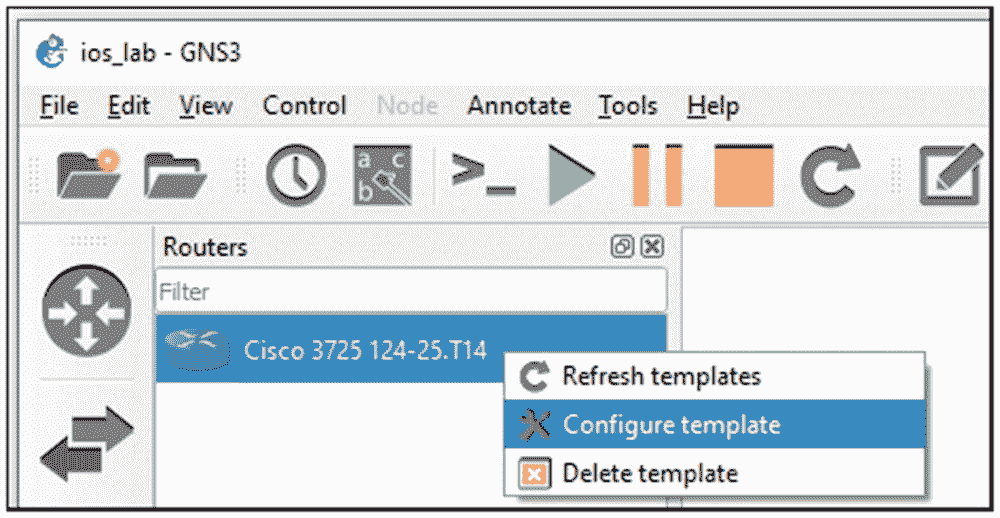图 10-40。GNS3，配置模板 |
| Eleven | On the “Memories and disks” tab, change the default RAM size to 256MB and PCMCIA disk0 to the recommended 64MB and then click the OK button. You can go to the Cisco Feature Navigator page to check the RAM requirement for Cisco devices. You can go to [`https://cfnng.cisco.com/archived-data`](https://cfnng.cisco.com/archived-data) and search for your platform and IOS version for older IOS devices. You can download the requirement in Excel format. See Figure [10-41](#Fig41).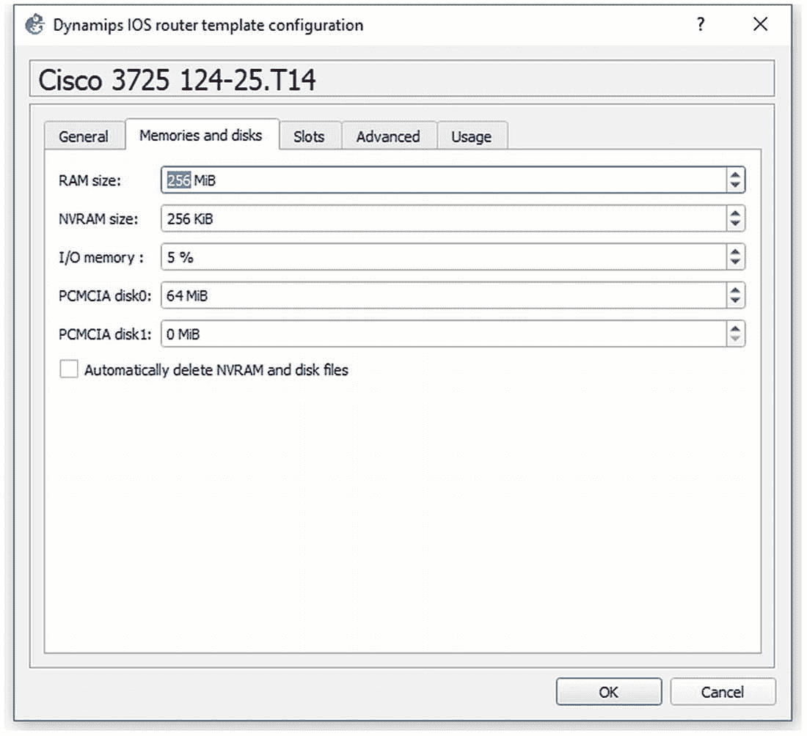图 10-41。GNS3，将磁盘 0 添加到 IOS 路由器 |
| Twelve | On the Slots tab, add an NM-1FE-TX on slot 1\. You can also add NM-4T for four more FastEthernet interfaces or NM-16ESW, which adds 16 L2 interfaces. If you want to use this router as an L2 switch, then NM-16ESW can be added, but this is an old GNS3 method with little relevance in the newer GNS3 labs. You can also add WIC-1T or WIC-2T under the WICs option on this tab. Since you are only going to connect through FastEthernet, you can leave the WIC slots blank. Click the OK button. See Figure [10-42](#Fig42).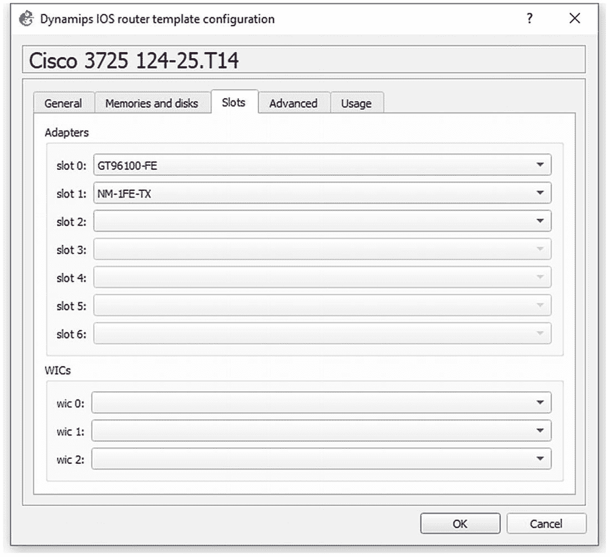图 10-42。GNS3，在 IOS 路由器上添加接口 |
| Thirteen | Now click the router icon and then drag and drop into the Topology canvas on the right. You have successfully installed an IOS image on the GNS3 VM. See Figure [10-43](#Fig43).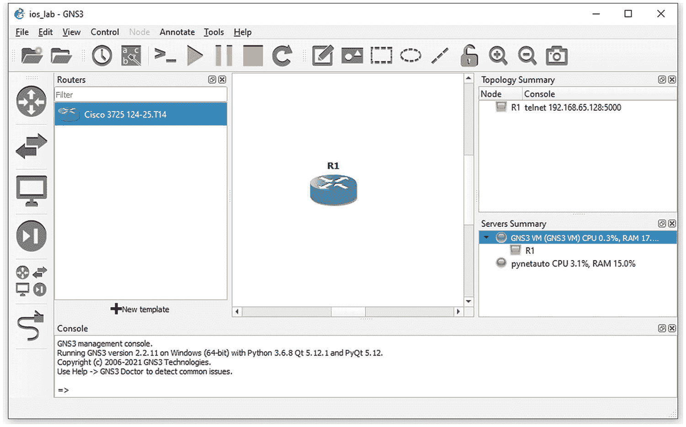图 10-43。GNS3，检查安装 |
| Fourteen | Now close GNS3 by clicking the top-right X button to close GNS3 and the GNS3 VM running on Workstation. Your GNS3 will be closed, followed by GNS3 VM shutdown. If you have another virtual machine running on VMware Workstation, the other VMs on Workstation will continue to run. See Figure [10-44](#Fig44).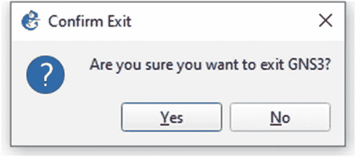图 10-44。GNS3，关闭 GNS3(和 GNS3 虚拟机) |

## 在 GNS3 上创建 IOS 实验室拓扑并连接到互联网

<colgroup><col class="tcol1 align-left"> <col class="tcol2 align-center"></colgroup> 
|  |
| 为了获得一致可靠的实验结果，本节涉及的任务需要互联网连接，建议您的计算机通过以太网电缆连接，而不是无线连接。实验室通过无线适配器连接可能会导致与书中不同的结果。在大多数情况下，实验都是通过将以太网电缆连接到家用路由器的以太网端口来进行的。学完本章后，大多数实验都可以通过无线连接正常工作，但是如果您怀疑某些地方工作不正常，请考虑将您的 PC 连接到路由器或交换机上的物理以太网端口。 |

您被要求在 10.5 中关闭 GNS3 和 GNS3 虚拟机，我特意要求您关闭这些程序，以便您可以正确地重新打开之前的实验。现在，按照步骤重新打开项目，继续构建您的 IOS 实验室。

<colgroup><col class="tcol1 align-left"> <col class="tcol2 align-center"></colgroup> 
| 

#

 | 

工作

 |
| --- | --- |
| one | First, launch GNS3 using the GNS3 icon on your Windows desktop. When the GNS3 project window appears, wait for one to two minutes for the GNS3 VM to boot up. See Figure [10-45](#Fig45).图 10-45。GNS3，GNS3 桌面图标 |
| Two | Click the “Recent project” button under “Open project” to select the `ios_lab.gns3` project, and then click the OK button to re-open the first project. If the IOS installation and GNS3 integration were all OK, the project should normally open with a GNS3 VM kick-start on Workstation. See Figure [10-46](#Fig46).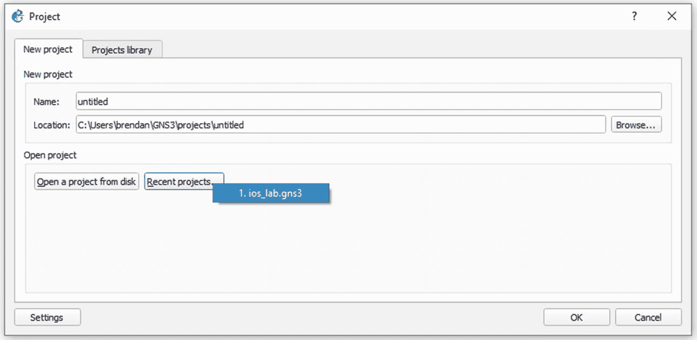图 10-46。GNS3，打开最近的项目 |
| three | As soon as the `ios_lab.gns3` project opens, click the “All devices” icon on the left and drop one NAT (NAT1), two routers (R1 and R2), and two VPCS (PC1 and PC2). When you drag and drop these devices, you will be prompted to select a server to run these devices. Pay close attention to which server you select here. See Figure [10-47](#Fig47).图 10-47。GSN3，“所有设备”图标对于 NAT1，我选择`pynetauto`，这是我的 PC 名；您的电脑名称会有所不同，因此您应该选择您的服务器名称。这意味着该设备将在本地服务器的 NATted 网络上运行，DHCP 服务将从 VMnet8 (192.168.183.0/24)网络中分配一个 IP 地址。You can also connect to the Internet via GNS3 VM’s NATted network (192.168.122.0/24), but connecting to the outside network via GNS3 VM sometimes could be unreliable. Using the local server NAT address via VMnet8 provides a more reliable connection to the Internet and the Linux servers running on VMnet8\. See Figure [10-48](#Fig48).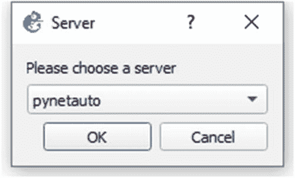图 10-48。GSN3，NAT1 服务器选择For routers and VPCSs, select GNS3 VM as the server. These devices will run on the GNS3 VM server. The GNS3 built-in service is usually used to provide a seamless virtual connection to other devices; it is not a managed switch like Cisco switches. VPCS is a handy GNS3’s built-in client, which allows the users to use them as end devices for simple ICMP tests. VPC saves a lot of computing power compared to running another virtual machine to run an end client. Using a VPC is like configuring a dummy loopback interface on a Cisco router or switch for end device reachability testing. Still, it is even better as you can still use ping and traceroute from VPCS, just like a real end device. See Figure [10-49](#Fig49).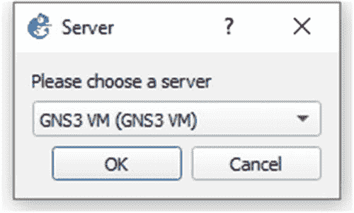图 10-49。GSN3、Switch1 和 PC1 服务器选择 |
| four | Click the “Add a link” icon on the left bottom, and connect all devices as shown in Figure [10-50](#Fig50). Refer to the Topology and Servers summaries to connect your devices as shown.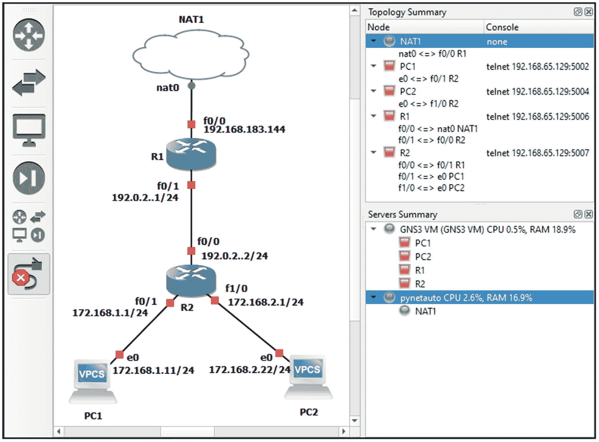图 10-50。GSN3，连接设备 |
| five | When you are happy with your topology, click the big green play icon to start all devices. Note that if there are more than five devices, it is a best practice to right-click each device and start one device at a time to avoid the CPU and memory hangs during the device bootup. Once all devices have started, the lights on the connections should turn all green, as shown in Figure [10-51](#Fig51).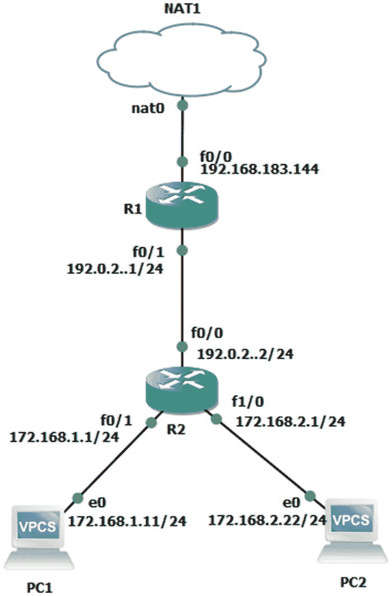图 10-51。GSN3，起动装置 |
| six | Make sure that all lights under the Topology and Servers summaries are green and there are no errors. See Figure [10-52](#Fig52).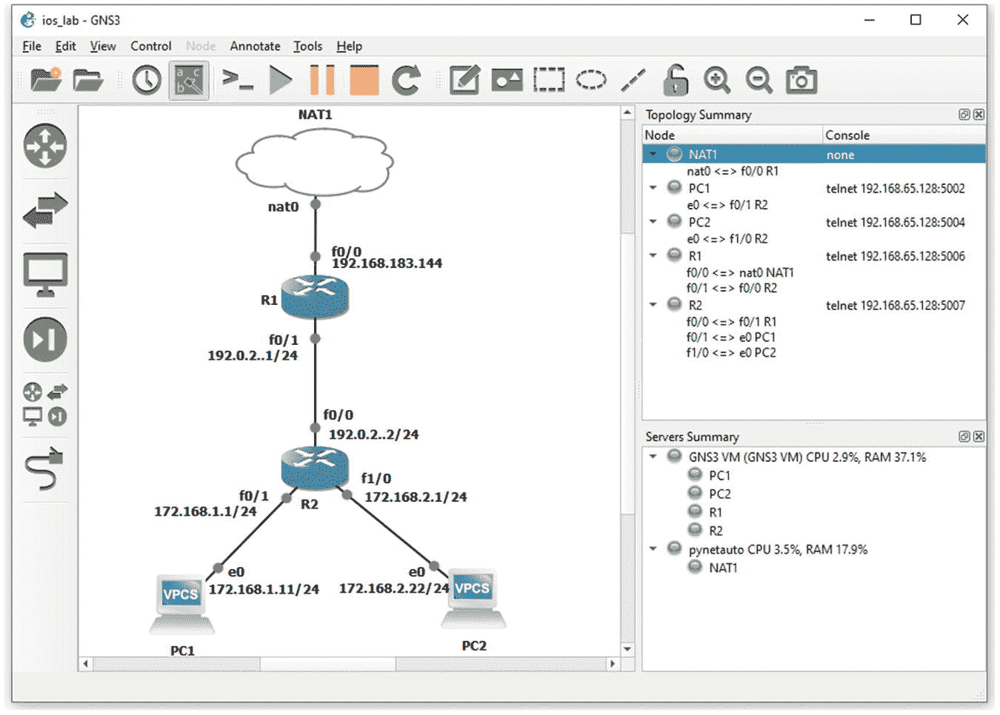图 10-52。GSN3，拓扑状态 |
| seven | 要启动 R1 的控制台，只需双击拓扑上的 R1 图标，或者右键单击并选择控制台菜单。在控制台提示符下，让我们为第一个实验快速配置 R1。

<colgroup><col class="tcol1 align-char"><col class="tcol2 align-left"></colgroup>
&#124; `hostname R1``!` &#124; 将 R1 指定为主机名 &#124;
&#124; `ip name-server 8.8.8.8``!` &#124; 配置名称服务器 &#124;
&#124; `interface FastEthernet0/0``ip address dhcp``no shut` &#124; Fa0/0 从虚拟机网络 8 (NAT)的动态主机配置协议服务器获取互联网协议(Internet Protocol)地址调出界面 &#124;
&#124; `interface FastEthernet0/1``ip address 192.0.2.1 255.255.255.0``no shut``!``router ospf 1` &#124; 在 f0/1 上配置一个互联网协议(Internet Protocol)地址T81】连接到 R2 的 f0/0 端口 T83】调出界面 &#124;
&#124; `network 192.0.2.0 0.0.0.255 area 0``network 192.168.183.0 0.0.0.255 area 0` &#124; OSPF 1 配置允许开放式最短路径优先(Open Shortest Path First Interior Gateway Protocol)广告 &#124;
&#124; `!``do write memory` &#124; 将 R1 的运行配置保存到启动配置 &#124;

 |
| eight | Now let’s configure R2\. The configuration is similar to R1, but it has three interfaces on three different subnets . 【 T55

<colgroup><col class="tcol1 align-char"> <col class="tcol2 align-left"></colgroup> 
&#124; `hostname R2``!` &#124; Specify R2 as the host name &#124;
&#124; `ip dhcp excluded-address 172.168.2.1``172.168.2.21` &#124;
&#124; `!``ip dhcp pool VPCS_2``network 172.168.2.0 255.255.255.0` &#124; 【 T70 DHCP is, 172.168.2.22 &#124;
&#124; `interface FastEthernet0/0` &#124;  &#124;
&#124; `ip address 192.0.2.2 255.255.255.0``no shut``!``interface FastEthernet0/1`【 T99 0/0 is configured with an IP addressconnected to f0/ of R1\. 1 portcalls out the interface &#124;
&#124; `ip address 172.168.1.1 255.255.255.0``no shut``!`[ 7] &#124; At f0/ 1 configure an IP addressto connect to PC1call-out interface &#124;
&#124; `ip address 172.168.2.1 255.255.255.0``no shut` `!``router ospf 1``network 172.168.0.0 0.0.0.255 area 0` &#124; in f1/ 0, configure an IP addressto connect to PC2call-out interface &#124;
&#124; `network 172.168.2.0 0.0.0.255 area 0` 】`network 192.0.2.0 0.0.0.255 area 0``!` &#124; Configure OSPF 1 &#124;
&#124; `ip route 0.0.0.0 0.0.0.0 192.0.2.1` for internal network advertising. T171 】`!``!` &#124; Configure the static route for the last selected gateway; The static route to R1 &#124;
&#124; `do write memory` &#124; saves the running configuration of R2 to the startup configuration &#124;

 |
| nine | 现在打开 PC1 (VPCS)控制台，练习手动配置 PC1 的 IP 地址。键入如下所示的命令。`PC1> ip 172.168.1.11/24 172.168.1.1 <<< Assign IP address and Gateway``Checking for duplicate address...``PC1 : 172.168.1.11 255.255.255.0 gateway 172.168.1.1``PC1> ip dns 8.8.8.8 <<< Configure DNS IP address``PC1> show ip <<< Show ip address details``NAME               : PC1 1``IP/MASK            : 172.168.1.11/24``GATEWAY            : 172.168.1.1``DNS                : 8.8.8.8``MAC                : 00:50:79:66:68:00``LPORT              : 20000``RHOST:PORT         : 127.0.0.1:20001``MTU:               : 1500`现在，通过从 PC1 向 R1、R2 和互联网发送一些 ICMP 消息来验证您的配置。`PC1> ping 172.168.1.1 –c 3 <<< To the Gateway f0/1``172.168.1.1 icmp_seq=1 timeout <<< first arp drop``84 bytes from 172.168.1.1 icmp_seq=2 ttl=255 time=3.098 ms``84 bytes from 172.168.1.1 icmp_seq=3 ttl=255 time=8.093 ms``PC1> ping 192.0.2.1 -c 3 <<< To R1's f0/1``84 bytes from 192.0.2.1 icmp_seq=1 ttl=254 time=25.297 ms``84 bytes from 192.0.2.1 icmp_seq=2 ttl=254 time=29.232 ms``84 bytes from 192.0.2.1 icmp_seq=3 ttl=254 time=31.170 ms``ping 8.8.8.8 -c 3 <<< To Google DNS server, Ethernet connection recommended``84 bytes from 8.8.8.8 icmp_seq=1 ttl=126 time=50.198 ms <<< On wireless you may get timeouts``84 bytes from 8.8.8.8 icmp_seq=2 ttl=126 time=31.918 ms``84 bytes from 8.8.8.8 icmp_seq=3 ttl=126 time=58.199 ms` |
| Ten | 这一次，打开 PC2 (VPCS)的控制台，使用`ip dhcp`命令配置 IP 地址。与之前的配置不同，PC2 将从 R2 的 DHCP 服务获取 IP 地址。如果您的配置完全相同，那么 PC2 的 IP 地址应该为 172.168.2.22。`PC2> ip dhcp``DDORA IP 172.168.2.22/24 GW 172.168.2.1``PC2> show ip``NAME                 : PC2 1``IP/MASK              : 172.168.2.22/24``GATEWAY              : 172.168.2.1``DNS                  : 172.168.2.1``DHCP SERVER          : 172.168.2.1``DHCP LEASE           : 86391, 86400/43200/75600``MAC                  : 00:50:79:66:68:01``LPORT                : 20002``RHOST:PORT           : 127.0.0.1:20003``MTU:                 : 1500`现在，通过从 PC2 向 R2、R1、PC1 和互联网发送一些 ICMP 消息来验证您的配置。`PC2> ping 172.168.1.1 -c 3 <<< To R2’s f0/1 interface``84 bytes from 172.168.1.1 icmp_seq=1 ttl=255 time=4.515 ms``84 bytes from 172.168.1.1 icmp_seq=2 ttl=255 time=2.110 ms``84 bytes from 172.168.1.1 icmp_seq=3 ttl=255 time=5.558 ms``PC2> ping 172.168.1.11 -c 3 <<< To PC1, no entry in the ARP table.``172.168.1.11 icmp_seq=1 timeout <<< first arp drop``172.168.1.11 icmp_seq=2 timeout <<< second arp drop``84 bytes from 172.168.1.11 icmp_seq=3 ttl=63 time=12.709 ms`注意:每当路由器必须向下一跳(或直接连接的目的地)发送没有 ARP 表条目的数据包时，ARP 请求会发出，但一个或两个原始数据包会被无条件丢弃。 |
|   | `PC2> ping 192.0.2.1 -c 3 <<< To R1’s f0/1``84 bytes from 192.0.2.1 icmp_seq=1 ttl=126 time=33.306 ms``84 bytes from 192.0.2.1 icmp_seq=2 ttl=126 time=27.037 ms``84 bytes from 192.0.2.1 icmp_seq=3 ttl=126 time=23.962 ms``PC2> ping 8.8.8.8 -c 3 <<< To Google’s DNS server``84 bytes from 8.8.8.8 icmp_seq=1 ttl=126 time=51.237 ms <<< On wireless you may get timeouts``84 bytes from 8.8.8.8 icmp_seq=2 ttl=126 time=35.299 ms``84 bytes from 8.8.8.8 icmp_seq=3 ttl=126 time=24.883 ms`完成实验后，按照标准程序保存配置，关闭设备，并关闭项目。 |

您已经使用两台 Cisco IOS 路由器和两台 VPCS 完成了 GNS3 基本 OSPF 路由实验。虽然这不是一本关于路由和交换的书，但您已经建立了拓扑，配置了拓扑，并完成了以下任务:

*   为路由器接口分配 IP 地址

*   配置了名称服务器

*   在 R2 上配置了 DHCP 服务

*   在 R1 和 R2 上为内部路由配置了 OSPF

*   已配置的静态路由器(最后的网关)

*   将运行配置保存到启动配置

此外，您还学习了如何使用手动和 DHCP 配置方法来配置和使用 GNS3 的虚拟 PC (VPCS)功能。

接下来，让我们了解如何安装 Microsoft 环回适配器，通过从主机的 Windows 操作系统与 GNS3 拓扑通信来管理 GNS3 设备。Microsoft 环回适配器帮助 Windows 主机与运行在 GNS3 上的设备通信。

## 安装 Microsoft 环回适配器

要从主机 PC 通信、控制和管理运行在 GNS3 上的 Cisco 设备，您可以安装 Microsoft loopback 适配器，并与运行在 GNS3 上的 Cisco 路由器、交换机或其它设备通信。Microsoft loopback 适配器是用于测试目的的虚拟网络适配器，由 Windows 提供。借助 Microsoft loopback，您可以方便、可靠地从主机操作系统连接到 GNS3 设备，并与虚拟设备通信。以下是如何在你的主机上安装实验性的微软回环。假设你是一个重度 Windows 用户，需要一些时间来提高 Linux 管理技能。在这种情况下，从您的 Windows 主机访问和管理 GNS3 设备将为您提供更多的时间来练习 Linux，同时获得其他技能。

如果您正在使用装有香草味 Windows 10 操作系统的电脑，请执行以下任务。如果您使用公司提供的标准操作环境(SOE)笔记本电脑或 PC，添加 Microsoft 环回适配器可能会略有不同。如果您使用的是个人计算机，请按照以下步骤安装 Microsoft loopback。如果您使用公司提供的 SOE 笔记本电脑或 PC，菜单可能与以下示例不同。

<colgroup><col class="tcol1 align-left"> <col class="tcol2 align-center"></colgroup> 
| 

#

 | 

工作

 |
| --- | --- |
| one | 右键单击主机窗口左下角的 Microsoft 图标。当列表出现时，选择设备管理器。 |
| Two | In the Device Manager window, first click Network Adapters to highlight it, then click Action located in the menu, and finally click Add Legacy Hardware. See Figure [10-53](#Fig53).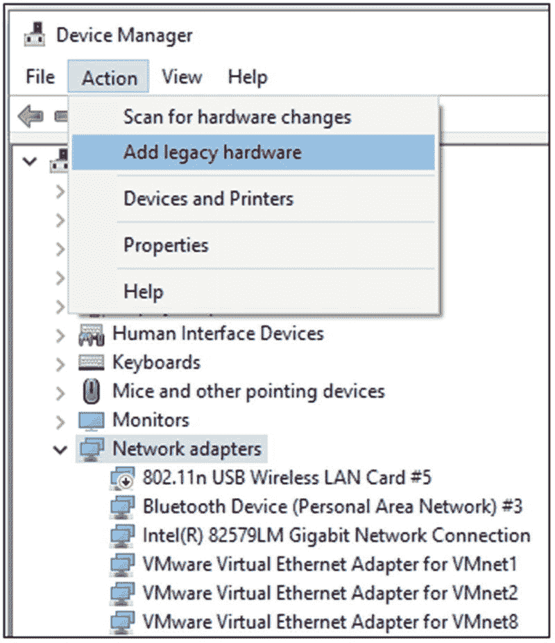图 10-53。设备管理器，网络适配器，添加传统硬件 |
| three | 出现“添加硬件”弹出窗口时，单击“下一步”按钮。 |
| four | 在下一个窗口中，选择“安装我从列表中手动选择的硬件(高级)”，然后单击“下一步”按钮。 |
| five | Scroll down to highlight Network Adapter and click the Next button. See Figure [10-54](#Fig54).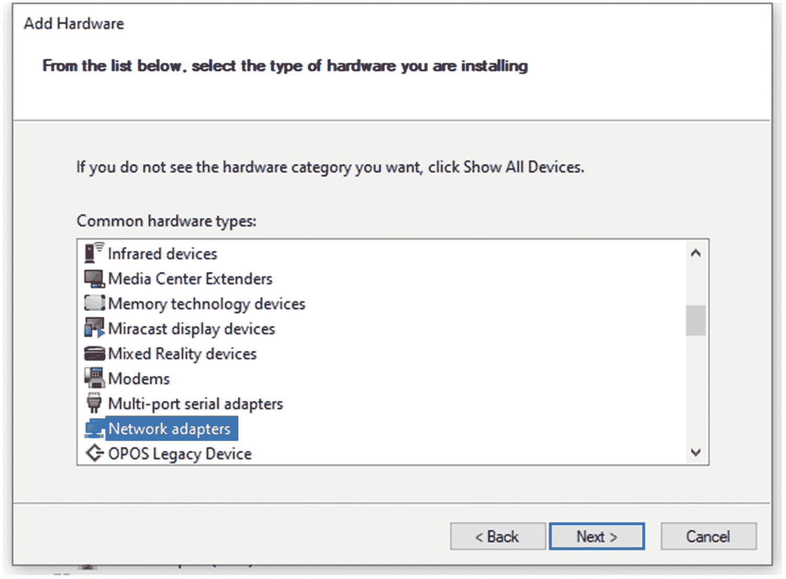图 10-54。设备管理器，添加网络适配器 |
| six | When the hardware device driver window appears, first select Microsoft under Manufacturer, and then select Microsoft KM-TEST Loopback Adapter under Model on the right. Click the Next button one more time. See Figure [10-55](#Fig55).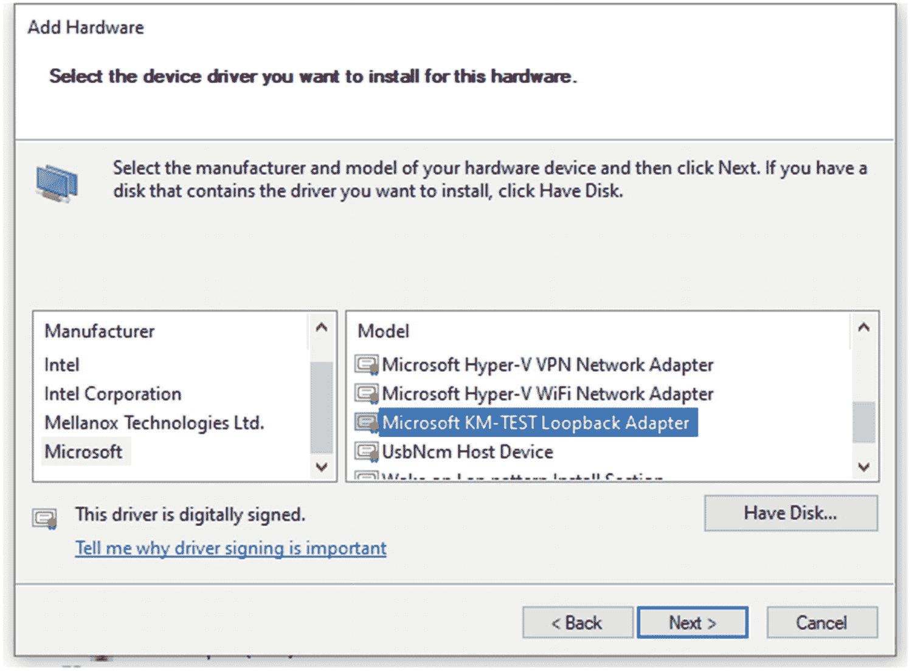图 10-55。设备管理器，添加 Microsoft 环回适配器 |
| seven | 在下一个屏幕上，单击下一步按钮安装硬件驱动程序。 |
| eight | When the driver installation is completed and the “Complete Add Hardware Wizard” message appears, click the Finish button and also close the Device Manager. See Figure [10-56](#Fig56).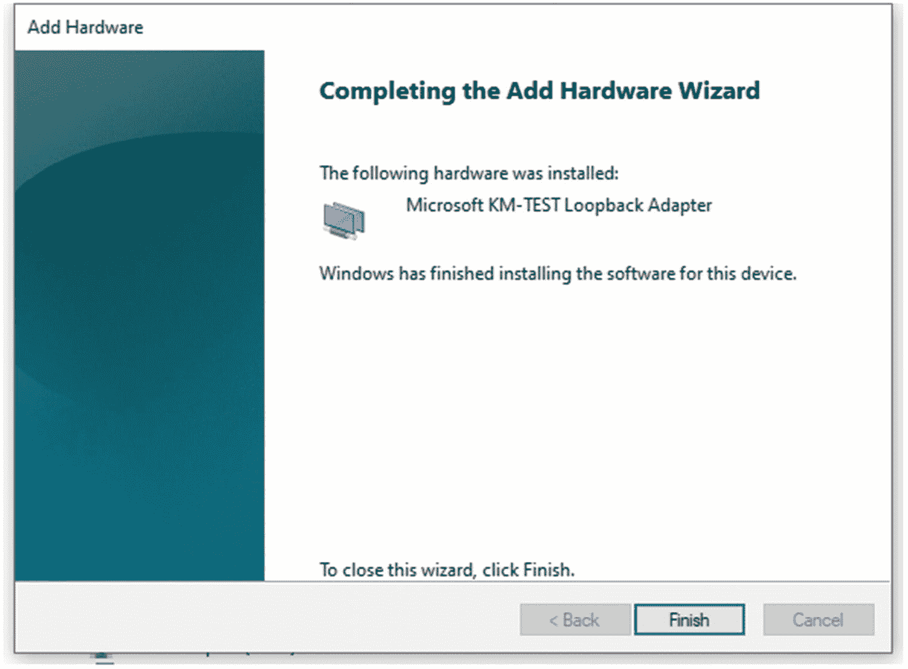图 10-56。设备管理器，完成 Microsoft 环回适配器安装 |
| nine | At the bottom-left corner, right-click the Windows icon and then select the Run menu. Next, type in **ncpa.cpl** in the Run window. This will open the Network Connections window with network adapters. See Figure [10-57](#Fig57).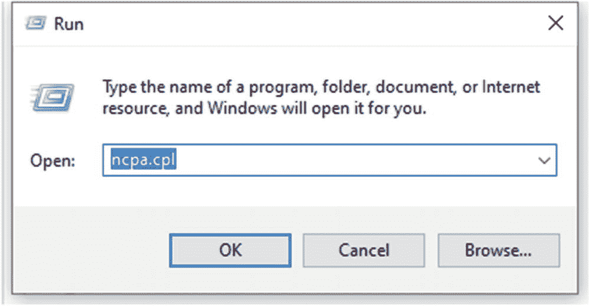图 10-57。运行网络连接的快捷方式 |
| Ten | Locate and right-click the Microsoft KM-TEST loopback adapter icon, right-click the icon, and select the Rename option. Now change the name from Ethernet 2 to Loopback. See Figure [10-58](#Fig58).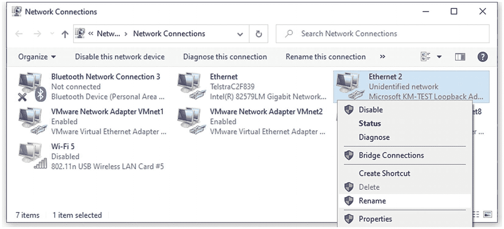图 10-58。Windows 10，重命名 Microsoft 环回适配器 |
| Eleven | Once again, right-click the loopback adapter and select Properties. See Figure [10-59](#Fig59).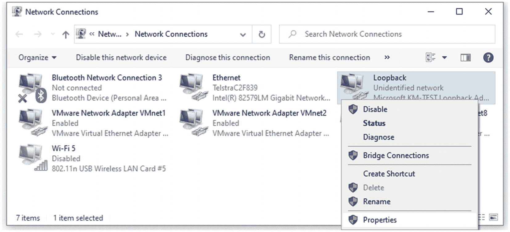图 10-59。Windows 10，更改 Microsoft 环回适配器属性 |
| Twelve | Highlight Internet Protocol Version 4 (TCP/IP4) and then click the Properties button. See Figure [10-60](#Fig60).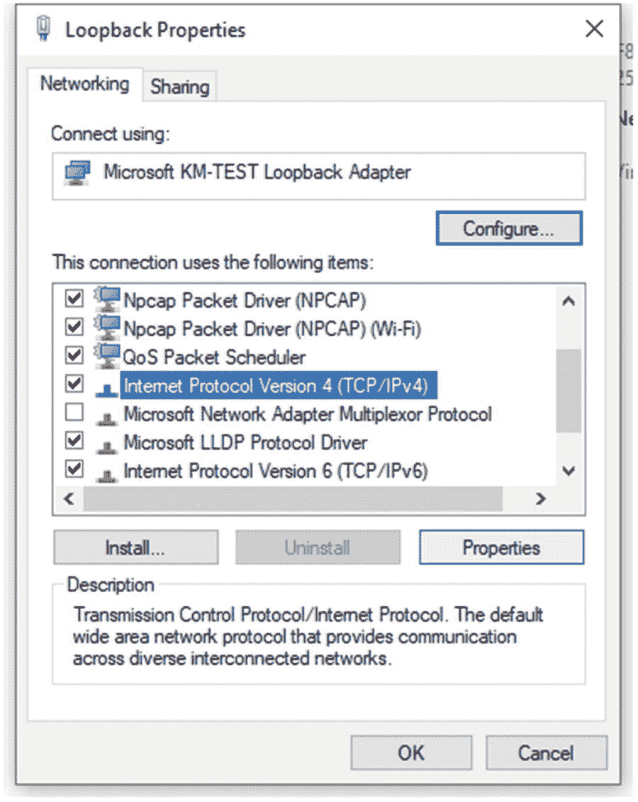图 10-60。Windows 10，选择 IPv4 属性 |
| Thirteen | Give an IP address for testing purposes; in this example, the IP address of the 7.7.7.0/24 subnet is used. The loopback adapter’s address given is 7.7.7.1 with a subnet mask of 255.255.255.0\. Leave the default gateway address blank; also, there’s no need to fill in the DNS information. See Figure [10-61](#Fig61).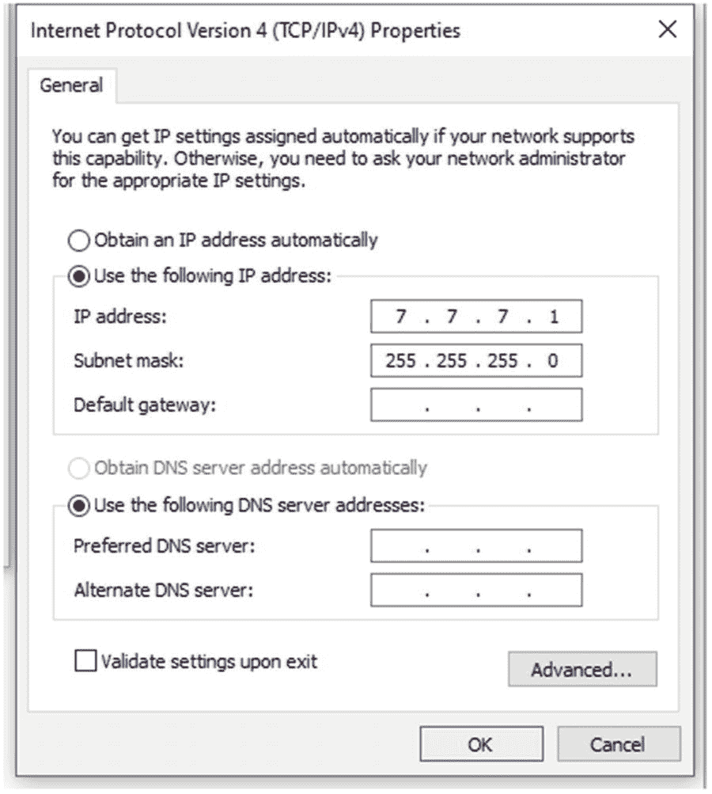图 10-61。Windows 10，对环回适配器的 IP 地址进行硬编码 |
| Fourteen | 单击确定按钮，关闭所有窗口和正在运行的应用程序，包括 GNS3。为了让 GNS3 识别新安装的 MS 环回接口，我们需要再次重启 PC。 |

当您的 PC 重新启动并正确引导时，让我们使用 Microsoft loopback 适配器创建一个新的 GNS3 项目，设置一个路由器，并将主机与虚拟 Cisco IOS 路由器连接起来。之后，相同的连接方法可以连接到其他思科 L2 和 L3 设备以及其他类型的 GNS3 虚拟设备。

### 使用 MS 回环访问 GNS3 网络设备

创建一个基本的 GNS3 项目后，您将测试 R1 和主机 PC 之间的通信。图 [10-62](#Fig62) 显示了基本拓扑。

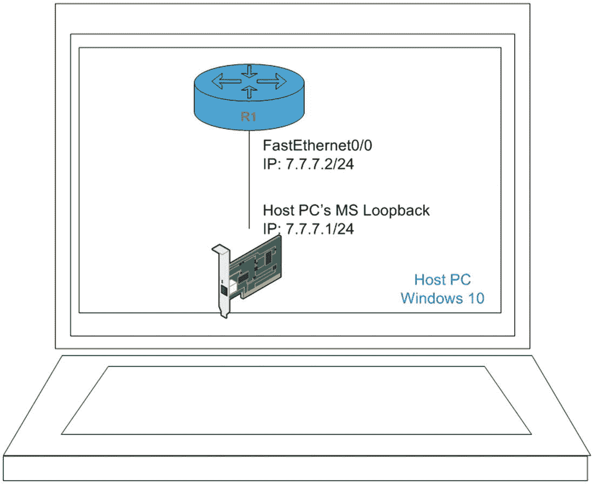

图 10-62。

主机到 GNS3 路由器的通信

要配置简单的 Microsoft loopback 实验室，请遵循以下说明:

<colgroup><col class="tcol1 align-left"> <col class="tcol2 align-center"></colgroup> 
| 

#

 | 

工作

 |
| --- | --- |
| one | Use the GNS3 icon on the desktop to start GNS3\. Wait until GNS3 VM starts and CPU settles down. See Figure [10-63](#Fig63).图 10-63。GNS3，GNS3 桌面图标 |
| Two | Now create a new project named `loopback_to_r1`. You do not have to follow this naming convention, so use your imagination to give a meaningful name. See Figure [10-64](#Fig64).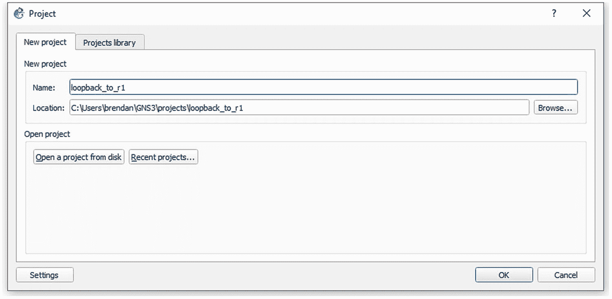图 10-64。GNS3，创建新项目 loopback_to_r1 |
| three | Now put together a simple lab topology. Open the “All devices” menu and drop one IOS router and one cloud onto the Topology canvas. R1 will run on GNS3 VM, and Cloud-1 will be running on the host PC. Look at the server’s summary for your reference. See Figure [10-65](#Fig65).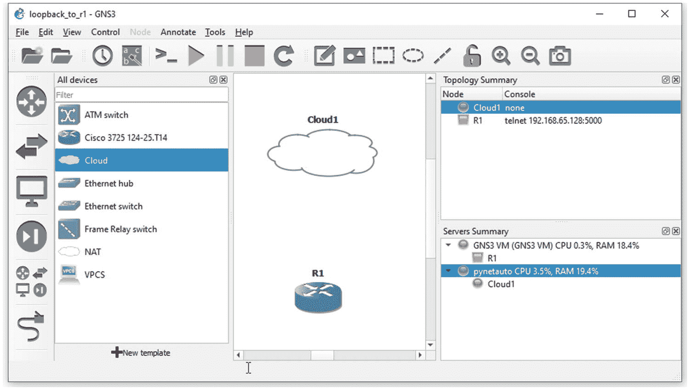图 10-65。GNS3，创建拓扑 |
| four | 右键单击 Cloud-1，选择“配置”，然后选择“显示特殊以太网接口”从下拉菜单中添加环回接口；删除以太网和任何其他接口，然后单击关闭按钮。If you do not see the Microsoft loopback interface, you probably did not reboot your PC or incorrectly added the cloud to the GNS3 VM. Suppose the GNS3 does not recognize the Microsoft loopback even after rebooting. In that case, there may be a problem with the operating system you are using, or possibly, there was a problem during the interface installation. If you run into a problem at this point, go back to the previous steps and correct the issue. See Figure [10-66](#Fig66).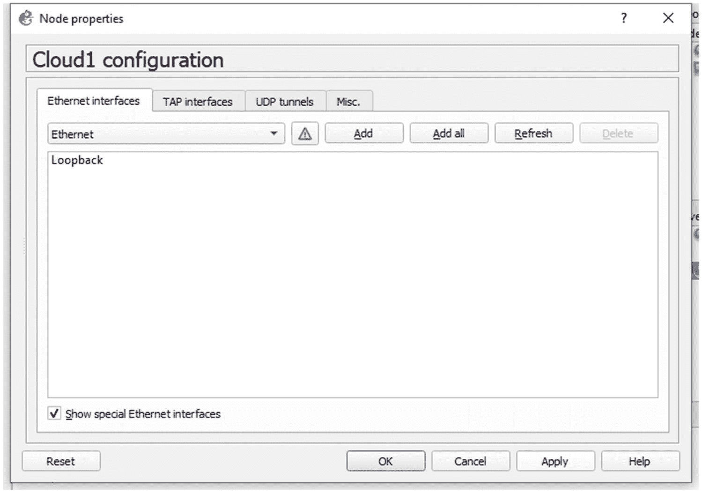图 10-66。GNS3，将环回接口添加到 Cloud-1 |
| five | Right-click and rename Cloud-1 to Host-PC. Then connect the Loopback interface to R1s f0/0, as shown in Figure [10-67](#Fig67). Please note that if GNS3 throws an error and refuses to connect, you may need to change “User account control setting” on Windows 10.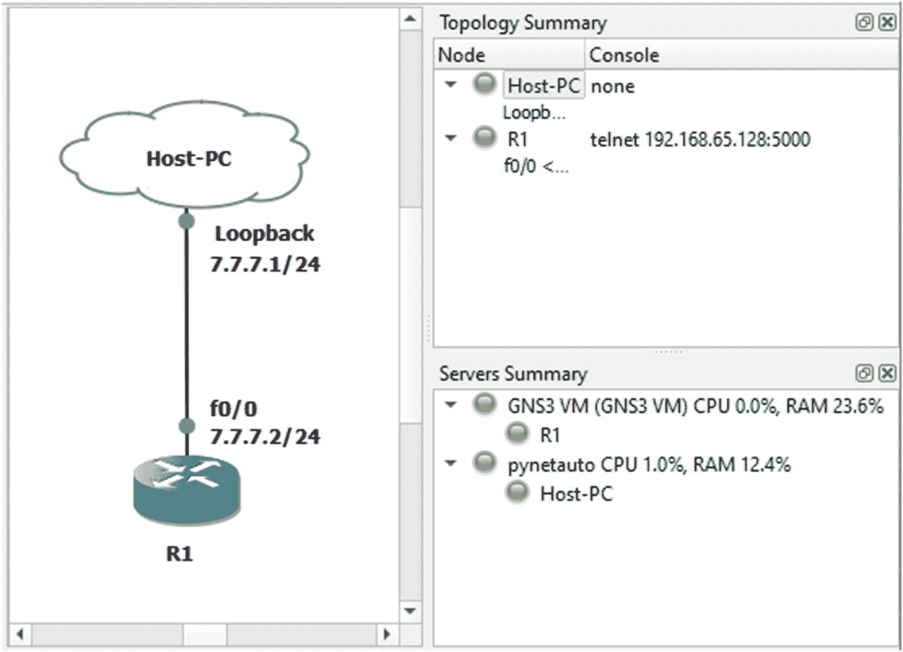图 10-67。GNS3，将 Microsoft 环回接口连接到 R1 的 f0/0 端口 |

如何更改用户账户控制设置？

从控制面板中，打开“用户帐户控制设置”，并将设置更改为“从不通知”这将允许您将 MS 环回接口与 GNS3 设备连接。完成此更改后，您必须再次重启电脑。参见图 [10-68](#Fig68) 和图 [10-69](#Fig69) 。

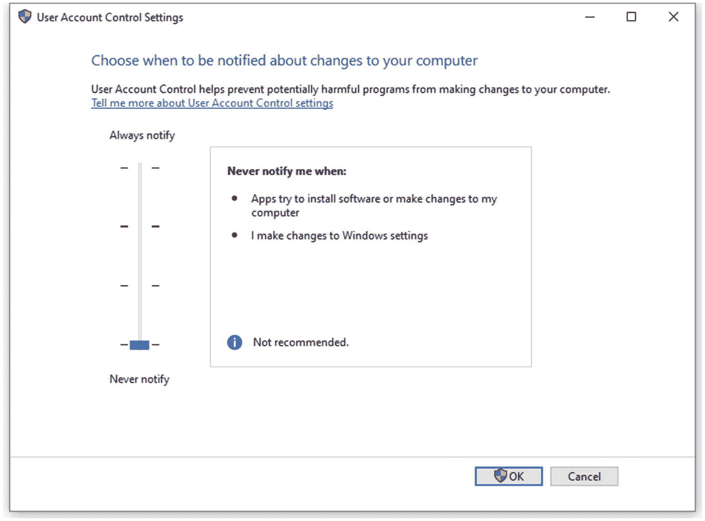

图 10-69。

用户帐户控制设置，更改为“从不通知”

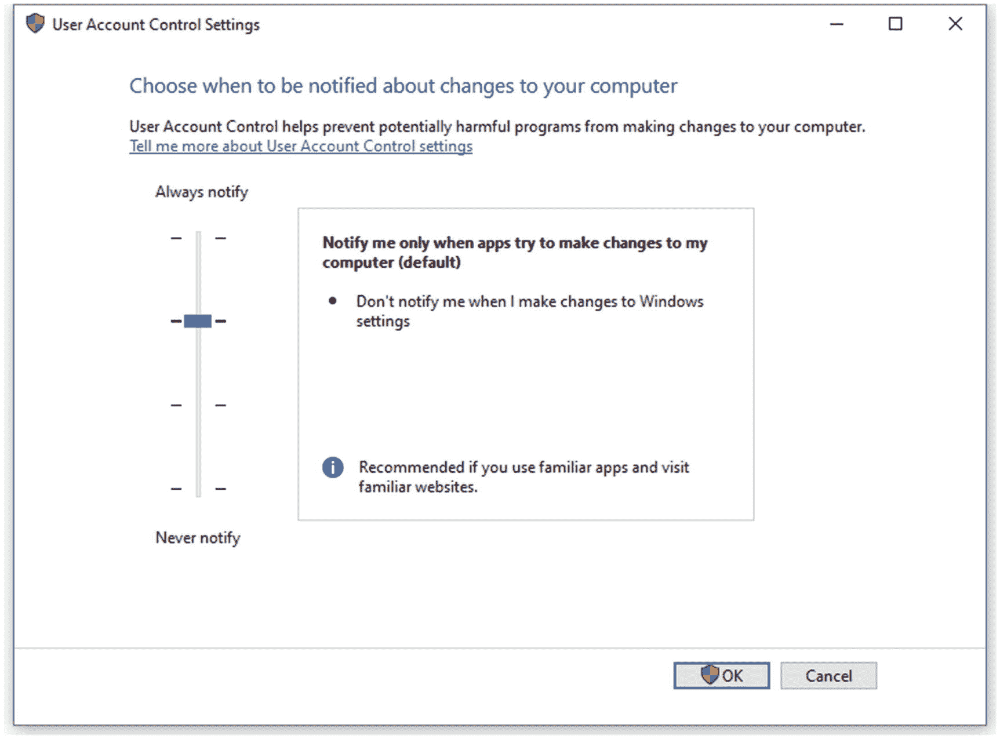

图 10-68。

用户帐户控制设置，默认

如何打开 Windows Defender 防火墙允许 ICMP？

要允许 GNS3 的 R1 向主机发送 ICMP ( `ping`)数据包，您必须打开具有高级安全性的 Windows Defender 防火墙，并启用图 [10-70](#Fig70) 所示的入站规则设置。

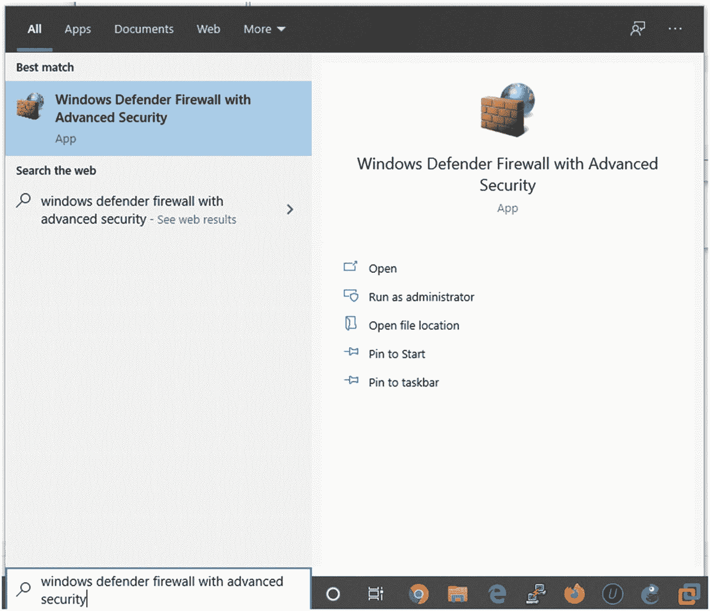

图 10-70。

Windows 10，打开具有高级安全性的 Windows Defender 防火墙

可以打开图 [10-71](#Fig71) 中的 Windows Defender 防火墙。

<colgroup><col class="tcol1 align-left"> <col class="tcol2 align-left"></colgroup> 
| 

#

 | 

工作

 |
| --- | --- |
| six | 打开 R1 的控制台，配置 R1 的 f0/0 接口，如下所示:`R1(config)#interface FastEthernet 0/0``R1(config-if)#ip address 7.7.7.2 255.255.255.0``R1(config-if)#no shut``R1(config-if)#end``R1#ping 7.7.7.1``Type escape sequence to abort.``Sending 5, 100-byte ICMP Echos to 7.7.7.1, timeout is 2 seconds:``.!!!!``Success rate is 80 percent (4/5), round-trip min/avg/max = 8/11/12 ms``R1#write memory``Building configuration...``OK` |
| seven | 在主机笔记本电脑/PC 的命令行提示符下，ping R1 的 f0/0 接口 IP 地址 7.7.7.2 以检验通信。`C:\Users\brendan>ping 7.7.7.2``Pinging 7.7.7.2 with 32 bytes of data:``Reply from 7.7.7.2: bytes=32 time=22ms TTL=255``Reply from 7.7.7.2: bytes=32 time=6ms TTL=255``Reply from 7.7.7.2: bytes=32 time=8ms TTL=255``Reply from 7.7.7.2: bytes=32 time=11ms TTL=255``Ping statistics for 7.7.7.2:``Packets: Sent = 4, Received = 4, Lost = 0 (0% loss),``Approximate round trip times in milli-seconds:``Minimum = 6ms, Maximum = 22ms, Average = 11ms` |
| eight | Configure the username and Telnet on R1\. For testing purposes, Telnet is configured here :

<colgroup><col class="tcol1 align-left"> <col class="tcol2 align-left"></colgroup> 
&#124; `R1#configure terminal``R1(config)#username pynetauto privilege 15 secret cisco123``R1(config)#line vty 0 15``R1(config-line)#transport input telnet``R1(config-line)#login local``R1(config-line)#logging synchronous``R1(config-line)#end``R1#copy running-config startup-config` &#124; Enter the configuration mode 【 A local user named `pynetauto`, Permission 15 and password `cisco123`Enter vty line modeEnable remote loginChange lineto return to execution modewhen receiving log messages with local user credentials. &#124;

 |
| nine | Using PuTTY, Telnet into R1 using port 23\. See Figure [10-72](#Fig72).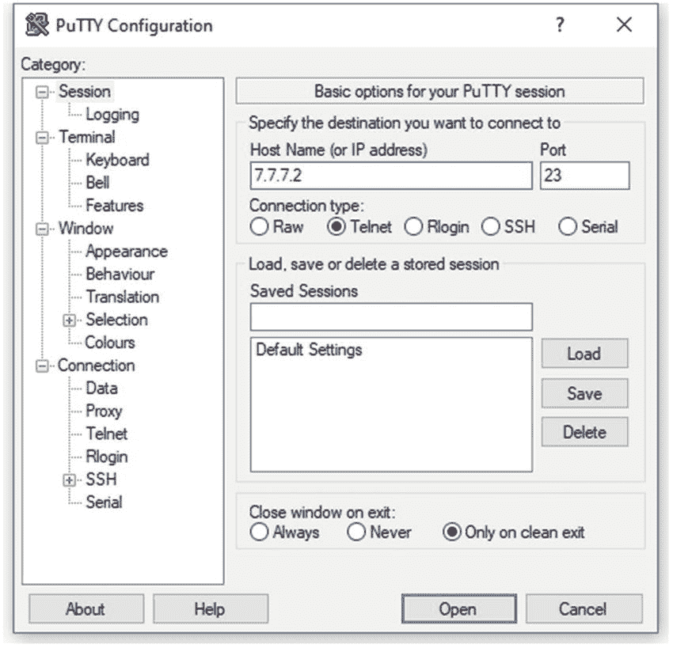图 10-72。PuTTY，Telnet 进入 R1 |
| Ten | 输入用户 ID 和密码，从主机(7.7.7.1)登录 7.7.7.2 R1。`User Access Verification``Username: pynetauto``Password: ********``R1#` |

*   文件和打印机共享(回显请求–icmp v4-In)私有

*   文件和打印机共享(回显请求–icmp V6-In)私有

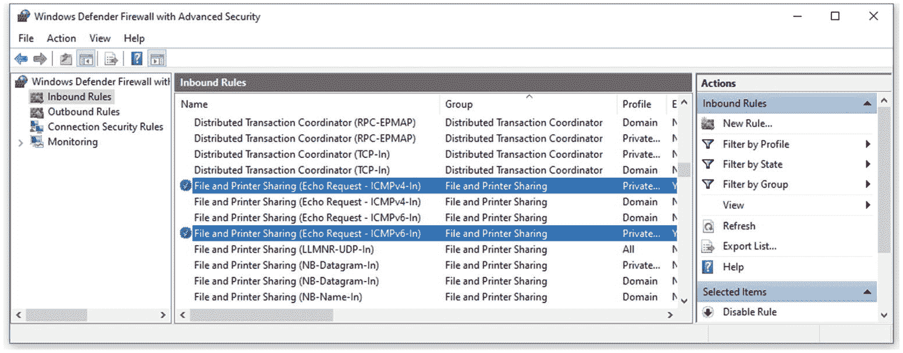

图 10-71。

具有高级安全性的 Windows 10 Windows Defender 防火墙，支持文件和打印机共享以允许 ICMP

您已从主机成功连接到运行在 GNS3 上的 IOS 设备。现在，您可以在 Windows PC 上轻松配置 GNS3 路由器。

## 从 Windows 主机 PC 使用 Python 脚本配置 GNS3 IOS 路由器

以下是一些 Python 实验室目标:

*   找到 Python 资源并在学习中重用代码

*   远程登录到一台 Cisco IOS 设备

*   配置环回接口和 f0/1

现在，让我们在主机 PC 的 Windows 上创建一个简单的 Python Telnet 脚本，并配置一个环回接口和 FastEthernet 0/1 接口。即使您以前没有编写过有效的 Python 脚本，也只需跟随并完成本实验中的每项任务。转到任务中提到的 URL，向下滚动到网页的底部，找到一个 Python Telnet 示例。复制此示例，您将通过 Telnet 创建您的第一个 Cisco 路由器交互脚本。该脚本使用 Python 内置库连接到您的 GNS3 R1 路由器，使用`getpass`模块获取用户输入和密码。

Python 库是有用模块的集合。Python 模块可以被认为是为其他用户编写和测试的小程序，因此您不必每次都重新发明轮子。内置或标准库是在机器上安装 Python 时安装的库。外部或非标准库是根据需要安装在操作系统上的一组模块。

不要试图理解示例代码中的所有内容。我稍后会提供解释。试着把注意力集中在给定的任务上，密切注意打字错误。编写代码时，每个逗号、句号和空格都很重要。在 Python 脚本中，间距非常重要。

<colgroup><col class="tcol1 align-left"> <col class="tcol2 align-left"></colgroup> 
| 

#

 | 

工作

 |
| --- | --- |
| one | First, go to the Python installation folder, `C:\Python38`, and create a new folder to store your scripts. Here I have created a folder named `myscripts`. See Figure [10-73](#Fig73).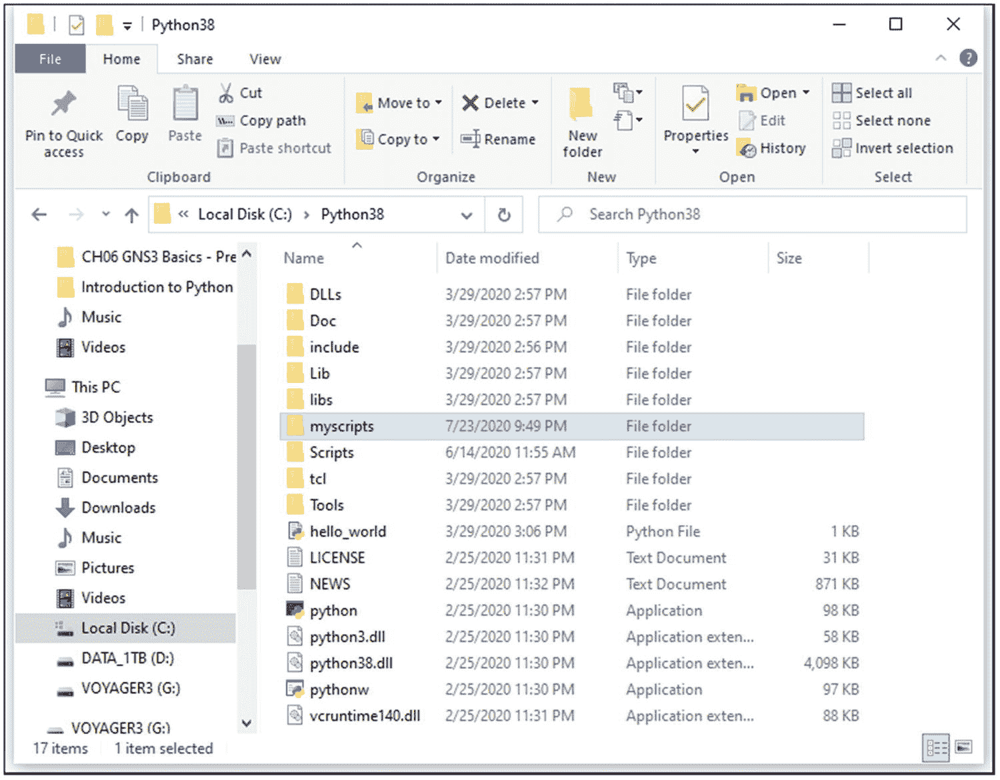图 10-73。主机，创建新文件夹 |
| Two | 这个脚本中使用的`getpass`和`telnet`库都是内置的(标准)Python 库，所以不需要单独安装它们。只需转到以下网址并跟随: [`https://docs.python.org/3/library/telnetlib.html`](https://docs.python.org/3/library/telnetlib.html) 。Telnet 示例这里有一个简单的例子来说明典型的用法:`import getpass``import telnetlib``HOST = "localhost"``user = input("Enter your remote account: ")``password = getpass.getpass()``tn = telnetlib.Telnet(HOST)``tn.read_until(b"login: ")``tn.write(user.encode('ascii') + b"\n")``if password:``tn.read_until(b"Password: ")``tn.write(password.encode('ascii') + b"\n")``tn.write(b"ls\n")``tn.write(b"exit\n")``print(tn.read_all().decode('ascii'))` |
| three | 使用 Notepad++复制并粘贴前面的内容。将文件另存为 Windows PC 上的`C:\python38\myscripts`文件夹下的`telnet_script1.py`。按如下方式修改该文件；代码中修改的部分用粗体表示。完成后，将脚本保存为一个`.py`文件。这个脚本将在后面的章节中详细解释，但是现在，简单地一字不差地跟着实验。当你开始你的 Python 编码之旅时，你往往会从模仿或复制别人的工作中学到最多的东西；这和新生儿如何从父母和周围的人那里学习说话是类似的。`telnet_script1.py``import getpass``import telnetlib``HOST = "7.7.7.2" <<< Router ip``user = input("Enter your telnet username: ")``password = getpass.getpass()``tn = telnetlib.Telnet(HOST)``tn.read_until(b"Username: ") <<< Should be same as the router prompt, ensure to update this line.``tn.write(user.encode('ascii') + b"\n")``if password:``tn.read_until(b"Password: ")``tn.write(password.encode('ascii') + b"\n")``tn.write(b”conf t\n”)``tn.write(b”int loop 0\n”)``tn.write(b”ip add 1.1.1.1 255.255.255.255\n”)``tn.write(b”int f0/1\n”)``tn.write(b”ip add 20.20.20.1 255.255.255.0\n”)``tn.write(b”no shut\n”)``tn.write(b”end\n”)``tn.write(b”show ip int bri\n”)``tn.write(b”exit\n”)``print(tn.read_all().decode(‘ascii’))` |
| four | 从 GNS3 打开 R1 的控制台，或者使用 PuTTY 远程登录到 7.7.7.2 的 R1，通过运行`show ip interface brief`检查当前的接口状态。我们确认在此阶段只配置了一个接口。`R1#show ip interface brief``Interface              IP-Address      OK? Method    Status                     Protocol``FastEthernet0/0        7.7.7.2         YES NVRAM     up                         up``FastEthernet0/1        unassigned      YES NVRAM     administratively down      down` |
| five | 在 R1 的控制台上，启用 Telnet 身份验证调试，以确认身份验证和活动。当您运行脚本并进行身份验证时，保持 R1 的控制台窗口打开并观察日志。

<colgroup><col class="tcol1 align-left"><col class="tcol2 align-left"></colgroup>
&#124; `R1# debug ip auth-proxy telnet` &#124; 为远程登录身份验证启用调试 &#124;

 |
| six | 现在打开 Windows PowerShell，导航到`C:\Python38\myscripts\`文件夹，运行`python telnet_script1.py`。当提示输入用户名和密码时，使用在上一节中创建的凭据进行身份验证。对于密码，当你输入时，你不会看到任何字符，因为`getpass`模块会自动隐藏这些信息。`PS C:\Users\brendan> cd C:\Python38\myscripts\``PS C:\Python38\myscripts> python telnet_script1.py``Enter your telnet username: pynetauto``Password: ********``R1#conf t``Enter configuration commands, one per line.  End with CNTL/Z.``R1(config)#int loop 0``R1(config-if)#ip add 1.1.1.1 255.255.255.255``R1(config-if)#int f0/1``R1(config-if)#ip add 20.20.20.1 255.255.255.0``R1(config-if)#no shut``R1(config-if)#end``R1#show ip int bri``Interface                  IP-Address      OK? Method     Status               Protocol``FastEthernet0/0            7.7.7.2         YES NVRAM      up                   up``FastEthernet0/1            20.20.20.1      YES manual     up                   up``Loopback0                  1.1.1.1         YES manual     up                   up``R1#exit` |
| seven | 现在回到 R1 的控制台，检查 Telnet 日志，并再次运行`show ip interface brief`命令。结果将类似于下图，其中`Loopback0`和`FastEthernet0/1`配置了新的 IP 地址，并显示为 up/up。`Telnet session logs during remote configuration``R1#``AUTH-PROXY Telnet debugging is on``R1#``*Mar  1 00:59:51.655: %SYS-5-CONFIG_I: Configured from console by pynetauto on vty0 (7.7.7.1)``*Mar  1 00:59:51.687: %LINEPROTO-5-UPDOWN: Line protocol on Interface Loopback0, changed state to up``R1#``*Mar  1 00:59:53.583: %LINK-3-UPDOWN: Interface FastEthernet0/1, changed state to up``*Mar  1 00:59:54.583: %LINEPROTO-5-UPDOWN: Line protocol on Interface FastEthernet0/1, changed state to up``R1#show ip interface brief``Interface                  IP-Address      OK? Method     Status                Protocol``FastEthernet0/0            7.7.7.2         YES NVRAM      up                    up``FastEthernet0/1            20.20.20.1      YES manual     up                    up``Loopback0                  1.1.1.1         YES manual     up                    up` |

## 思科 IOS 和 GNS3 设备实验室

GNS3 有许多有用的模板，您可以在学习网络、安全和系统概念时使用。您可以添加预配置的模板，将其作为设备安装在 GNS3 虚拟机上，并在您的实验室中使用。您甚至可以安装带有完整 GUI 界面的 Palo Alto 防火墙，并在实验室中使用它们。出于演示目的，您将导入一个简单的 Linux Docker 映像，并从 Linux Docker 映像执行一个交互式 Telnet 会话。

本实验的目标如下:

*   学习安装 GNS3 装置设备

*   学习在 Linux 服务器以太网接口上手动分配 IP 地址

*   学习运行实时交互式远程登录会话来管理 Cisco IOS 设备

### 导入和安装 GNS3 Linux 设备服务器

本实验上接上次环回实验。首先，让我们从 GNS3 模板添加一个 Linux Docker 设备，然后将其添加到现有拓扑中。

<colgroup><col class="tcol1 align-left"> <col class="tcol2 align-left"></colgroup> 
| 

#

 | 

工作

 |
| --- | --- |
| one | In the GNS3 main window, go to File ➤ + New template (Figure [11-74](#Fig74)). Introduce all the remaining figures. Alternatively, you can open “All devices” and click “+New template” as well.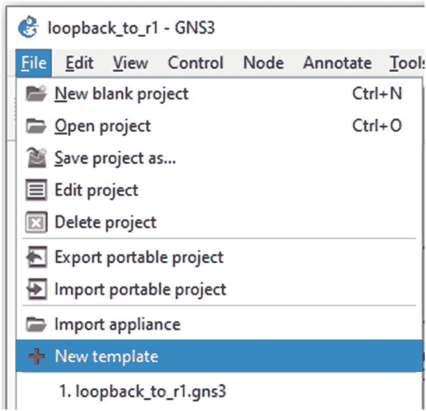图 10-74。GNS3，+新模板 |
| Two | 在“新建模板”向导窗口中，保留“从 GNS3 服务器安装设备(推荐)”选项，然后单击“下一步”按钮。 |
| three | On the Appliances from the server screen, type in **Network Automation** or use the drop-down menu under Guests and select Network Automation Docker; then click the Install button. See Figure [10-75](#Fig75).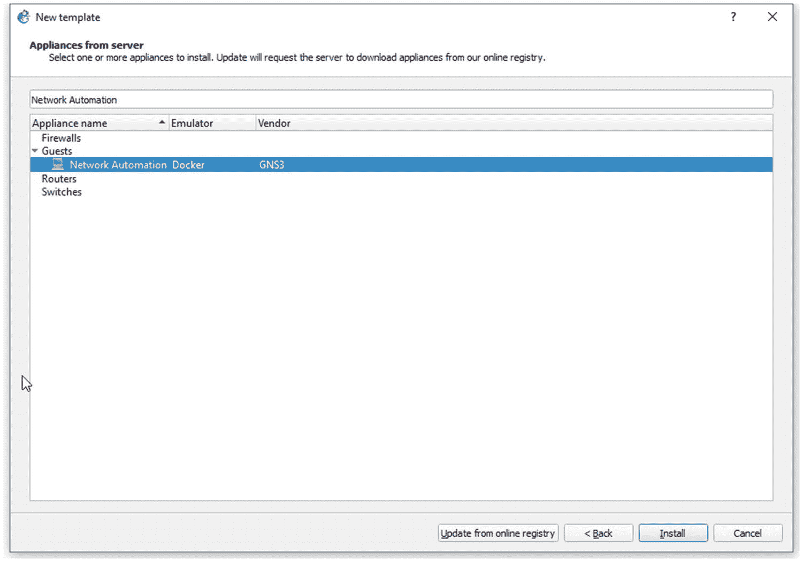图 10-75。GNS3 新模板，选择装置 Linux 服务器 |
| 为了方便起见，GNS3 上有许多预装的设备 Dockerized 和 Qemu 映像。网络自动化 Docker 镜像基本上是一个 Ubuntu 18 LTS 服务器 dockered 镜像，用于运行快速网络实验室。当 Docker 关闭电源时，安装的内容将默认为原始设置。Docker 不像 CentOS 或 Ubuntu VMs 那样是一个成熟的虚拟机，因为它是一个轻量级设备，依赖于托管服务器的内核来运行。在前一章中你会学到更多关于 Docker 的知识。 |
| four | 在服务器屏幕上，单击下一步按钮进入下一屏幕。 |
| five | 在下一个屏幕上，要完成并关闭“新建模板”窗口，请单击“完成”按钮。 |
| six | Click the OK button to add the Network Automation Server template. See Figure [10-76](#Fig76).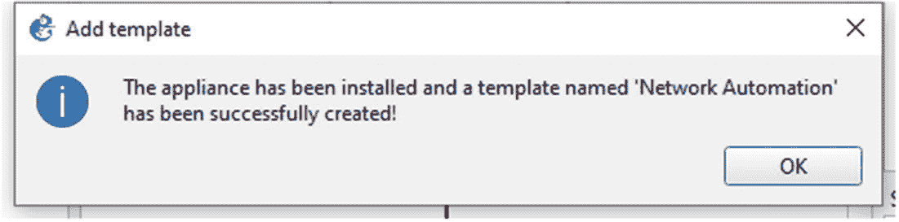图 10-76。GNS3 新模板，“添加模板”窗口 |
| seven | Now go back to GNS3’s main user interface and select the “End devices” icon on the left. The “End devices” icon is the one that looks like a computer screen. You will see your new appliance device, the Network Automation server, on the list. Make sure your computer is connected to the Internet and select the icon. Then drag and drop the icon onto the Topology canvas. This action will initiate the Docker pull action and start downloading the Docker image from the Internet (DockerHub). See Figure [10-77](#Fig77).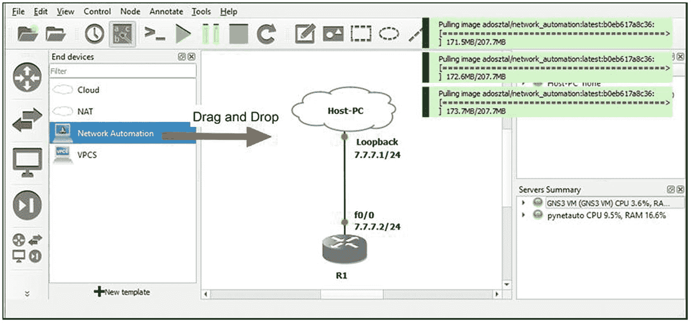图 10-77。GNS3，从 DockerHub 中拉出网络自动化设备 |
| eight | Now connect eth0 of NetworkAutomation-1 server to R1’s f0/1 interface and power on the server. See Figure [10-78](#Fig78).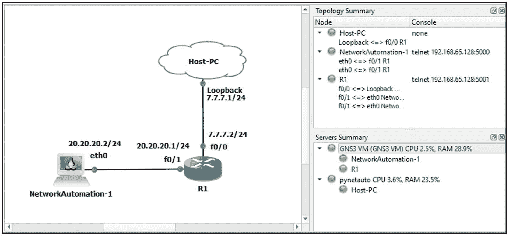图 10-78。GNS3，将网络自动化-1 连接到 R1 |
| nine | 一旦 Docker 服务器启动，通过运行`cat /etc/*release` Linux 命令检查操作系统版本。这个服务器是一个容器化的(Docker) Ubuntu 18.04 LTS 服务器镜像。`root@NetworkAutomation-1:~# cat /etc/*release``DISTRIB_ID=Ubuntu``DISTRIB_RELEASE=18.04``DISTRIB_CODENAME=bionic``DISTRIB_DESCRIPTION="Ubuntu 18.04.4 LTS"``NAME="Ubuntu"``VERSION="18.04.4 LTS (Bionic Beaver)"``ID=ubuntu``ID_LIKE=debian``PRETTY_NAME="Ubuntu 18.04.4 LTS"``VERSION_ID="18.04"``HOME_URL="``https://www.ubuntu.com/`T2】`SUPPORT_URL="``https://help.ubuntu.com/`T2】`BUG_REPORT_URL="``https://bugs.launchpad.net/ubuntu/`T2】`PRIVACY_POLICY_URL="``https://www.ubuntu.com/legal/terms-and-policies/privacy-policy`T2】`VERSION_CODENAME=bionic``UBUNTU_CODENAME=bionic` |

恭喜你！现在您有了另一个服务器，可以在那里练习 Python 脚本。稍后，您将了解更多关于如何创建 Docker 映像的信息。请记住，Docker 映像是一种临时服务器。当 Docker 机器断电时，一切都重置为默认值，您将丢失以前的工作。要保存工作，您可能需要将它保存到映射的驱动器，或者在它处于运行状态时捕获另一个 Docker 映像。这超出了我们的主题，但请花时间研究 Docker 和 Kubernetes 的概念，因为这是系统自动化领域的另一个热门话题。

### 手动为 GNS3 Linux 设备服务器分配 IP 地址

这里，让我们练习为您在前面步骤中刚刚安装的 Linux 设备服务器分配 IP 地址、默认网关和 DNS 服务器。确保向默认网关发送 ping 命令，以确认通信正常。在下一部分中，您将连接到 Internet，因此不需要 ping 任何 Internet 地址。

<colgroup><col class="tcol1 align-left"> <col class="tcol2 align-left"></colgroup> 
| 

#

 | 

工作

 |
| --- | --- |
| one | 在您的 NetworkAutomation-1 Linux 服务器上运行以下命令，以分配一个新的 IP 地址，并添加一个默认网关和 Google 的公共名称服务器。同样的方法也可以用于在一个活动的 Linux 服务器上分配 IP 地址。`root@NetworkAutomation-1:~# ifconfig eth0 <<< Check eth0 interface``eth0: flags=4163<UP,BROADCAST,RUNNING,MULTICAST>  mtu 1500``inet6 fe80::2cbb:cdff:fe4e:96fc  prefixlen 64  scopeid 0x20<link>``ether 2e:bb:cd:4e:96:fc  txqueuelen 1000  (Ethernet)``RX packets 105  bytes 10924 (10.9 KB)``RX errors 0  dropped 91  overruns 0  frame 0``TX packets 13  bytes 1006 (1.0 KB)``TX errors 0  dropped 0 overruns 0  carrier 0  collisions 0``root@NetworkAutomation-1:~# ifconfig eth0 20.20.20.2 netmask 255.255.255.0 up <<< manually configure IP address and bring up eth0``root@NetworkAutomation-1:~# route add default gw 20.20.20.1 <<< Configure Gateway``root@NetworkAutomation-1:~# echo "nameserver 8.8.8.8" > /etc/resolve.conf <<< Configure DNS server``root@NetworkAutomation-1:~# ifconfig eth0 <<< Check configuration``eth0: flags=4163<UP,BROADCAST,RUNNING,MULTICAST>  mtu 1500``inet 20.20.20.2  netmask 255.255.255.0  broadcast 20.20.20.255``inet6 fe80::2cbb:cdff:fe4e:96fc  prefixlen 64  scopeid 0x20<link>``ether 2e:bb:cd:4e:96:fc  txqueuelen 1000  (Ethernet)``RX packets 109  bytes 11470 (11.4 KB)``RX errors 0  dropped 94  overruns 0  frame 0``TX packets 13  bytes 1006 (1.0 KB)``TX errors 0  dropped 0 overruns 0  carrier 0  collisions 0``root@NetworkAutomation-1:~# ping 20.20.20.1 -c 3 <<< test IP connectivity``PING 20.20.20.1 (20.20.20.1) 56(84) bytes of data.``64 bytes from 20.20.20.1: icmp_seq=1 ttl=255 time=30.8 ms``64 bytes from 20.20.20.1: icmp_seq=2 ttl=255 time=11.0 ms``64 bytes from 20.20.20.1: icmp_seq=3 ttl=255 time=6.54 ms``--- 20.20.20.1 ping statistics ---``3 packets transmitted, 3 received, 0% packet loss, time 2002ms``rtt min/avg/max/mdev = 6.546/16.167/30.877/10.565 ms` |

您还可以通过右键单击 NetworkAutomation-1 图标并选择“编辑配置”选项来配置设备的网络接口。您可以在这里手动配置它，或者简单地删除`#`键，从 DHCP 服务器获得一个有效的 IP 地址。我们没有在 20.20.20.0/24 网络上设置 DHCP 服务，所以我们选择手动配置 IP 地址。参见图 [10-79](#Fig79) 。

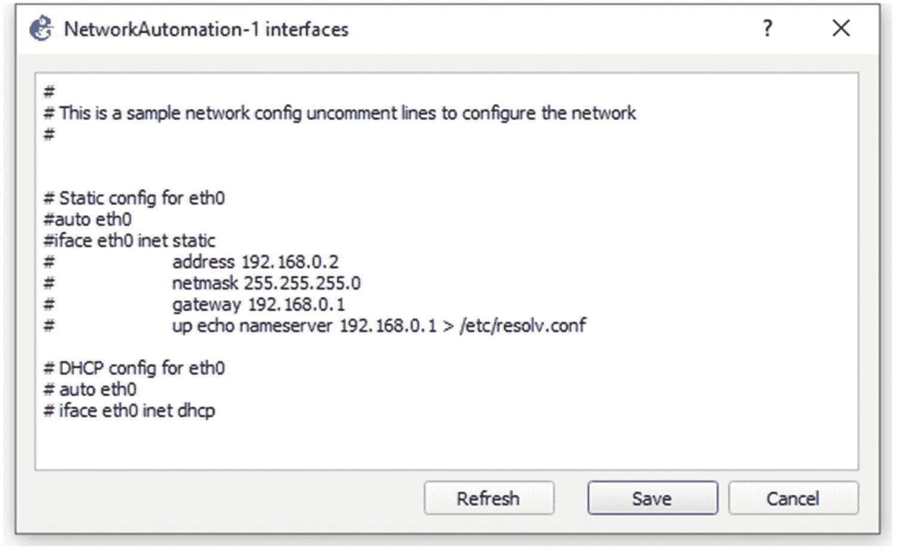

图 10-79。

网络自动化-1，编辑配置文件

### 使用 GNS3 设备 Linux 的 Python 管理 R1

在本实验中，您将使用安装在 GNS3 设备 Linux 服务器上的 Python 从实时 Telnet 会话管理 R1。本实验上接上一节。

<colgroup><col class="tcol1 align-left"> <col class="tcol2 align-left"></colgroup> 
| 

#

 | 

工作

 |
| --- | --- |
| one | 首先，使用图 [10-79](#Fig79) 中所示的命令检查该服务器上预装了哪些 Python 版本。如果你下载了和这本书一样的 Dockerized Linux 服务器，它会预装 Python 2.7.17 和 3.8.3。`root@NetworkAutomation-1:~# which python``/usr/bin/python``root@NetworkAutomation-1:~# python --version``Python 2.7.17``root@NetworkAutomation-1:~# which python3``/usr/bin/python3``root@NetworkAutomation-1:~# python3 -V``Python 3.8.3` |
| Two | 现在通过键入`python3`开始 Python 3 交互式会话。`root@NetworkAutomation-1:~# python3``Python 3.8.3 (default, May 14 2020, 20:11:43)``GCC 7.5.0 on linux``Type "help", "copyright", "credits" or "license" for more information.``>>>` |
| three | 现在，在 GNS3 设备 Linux 服务器的 Python 解释器窗口中，逐字键入以下 Python 命令。不要太担心这些命令的深层含义；现在，试着熟悉环境中的流程。在这里，您通过 Telnet 会话将 loopback 5 添加到 R1，然后打印会话日志。启动 Telnet 会话后，您为 loopback 5 配置发送多个`tn.write`命令。然后，您必须通过发送`tn.write(b"exit\n")`命令关闭 Telnet 会话来退出会话；然后，您可以在 Telnet 会话中打印它们。`>>> import getpass <<< Import getpass module``>>> import telnetlib << Import telnetlib module``>>> tn = telnetlib.Telnet("20.20.20.1") <<< Create a telnet session to 20.20.20.1``>>> tn.write("pynetauto".encode('ascii') + b"\n") <<< Send username 'pynetauto' to R1``>>> tn.write("cisco123".encode('ascii') + b"\n") <<< Send password 'cisco123' to R1``>>> tn.write(b"configure terminal\n") <<< Enter config mode``>>> tn.write(b"interface loopback 5\n")``>>> tn.write(b"ip address 5.5.5.5 255.255.255.255\n")``>>> tn.write(b"end\n")``>>> tn.write(b"exit\n")``>>> print(tn.read_all().decode('ascii')) <<< Print all session logs in tn`在一个成功的交互式会话中，输出将类似于下面这样。注意每一个逗号、句号和空格，也要避免任何打字错误。Python 编码并不像某些 Python 布道者宣扬的那样光鲜亮丽；对于每个逗号、句号、空格和每个字符，您的指尖都必须接触键盘。不要买蛇油。`User Access Verification``Username: pynetauto``Password:``R1#configure terminal``Enter configuration commands, one per line.  End with CNTL/Z.``R1(config)#interface loopback 5``R1(config-if)#ip address 5.5.5.5 255.255.255.255``R1(config-if)#end``R1#exit` |
| four | 现在继续使用`show ip interface brief`命令并打印出日志。请注意，您不必再次导入模块，因为您仍处于同一会话中。路由器命令前的`b`表示双引号中的命令以字节形式发送，`\n`代表换行符，在这种情况下意味着按下键盘上的 Enter 键一次。`>>> tn = telnetlib.Telnet("20.20.20.1") <<< Create a telnet session to 20.20.20.1``>>> tn.write("pynetauto".encode('ascii') + b"\n") <<< Send username ‘pynetauto’ to R1``>>> tn.write("cisco123".encode('ascii') + b"\n") <<< Send password ‘cisco123’ to R1``>>> tn.write(b"show ip interface brief\n") <<< Send ‘show ip int brief’ command``>>> tn.write(b"exit\n") <<< Send ‘exit’ command``>>> print(tn.read_all().decode('ascii')) <<< Print all session logs in tn`完成实验任务后，您将看到在 R1 上运行`show ip interface brief`命令的结果。`User Access Verification``Username: pynetauto``Password:``R1#show ip interface brief``Interface                  IP-Address      OK? Method Status                Protocol``FastEthernet0/0            7.7.7.2         YES NVRAM  up                    up``FastEthernet0/1            20.20.20.1      YES manual up                    up``FastEthernet1/0            unassigned      YES NVRAM  administratively down down``Loopback0                  1.1.1.1         YES manual up                    up``Loopback5                  5.5.5.5         YES manual up                    up``R1#exit` |

您已经使用 Python 3 完成了交互式 Telnet 会话。当您开发代码来验证 Python 解释器或与网络设备的交互会话时，您可以测试部分 Python 代码。现在，将相同的命令复制并粘贴到您选择的文本编辑器中，并为文件名指定一个`.py`文件扩展名。本章使用的 Python 脚本保存为`chapter6_codes`，可以在 [`https://github.com/pynetauto/apress_pynetauto`](https://github.com/pynetauto/apress_pynetauto) 下载。

## 摘要

在本章中，您学习了许多 GNS3 技术，这些技术将帮助您成功完成本书中的其余实验。您学习了如何安装 GNS3、如何构建简单的 GNS3 拓扑、如何在 GNS3 上集成 Cisco IOS 路由器、如何安装 GNS3 设备服务器来管理运行在 GNS3 上的 IOS 路由器，以及如何安装 Microsoft loopback 接口来实现 GNS3 设备与主机 PC 之间的通信。此外，您还学习了如何将 GNS3 路由器连接到 GNS3 的设备 Linux Python 服务器。在第 [11 章](11.html)中，我们将创建一个新的 GNS3 项目，通过 Telnet 使用 IOS 路由器 R1 与 Ubuntu 和 CentOS 虚拟服务器进行通信。我们将扩展我们在本章中学到的知识，并获得足够的实践来向前迈进。