# 十七、升级多台 Cisco IOS XE 路由器

本章通过一个真实的生产实例来解释面向对象编程(OOP)。然后，本章将讨论使用用户名和密码应用示例的 Python 应用流控制。最后，我们将讨论规划 IOS 升级所涉及的逻辑思维过程。

Cisco 设备上的 IOS 升级是网络运行的一个重要组成部分，可以提高所有 Cisco 设备的可靠性和安全性。定期的 IOS 补丁管理也是网络团队关键绩效指标的一部分，因此是业务的关键部分。将指导您安装两台 Cisco CRS1000v IOS XE 路由器，为接下来的两章做准备。最后，我们将讨论由网络工程师执行的手动 Cisco IOS 升级流程和任务，并将手动任务和工程师的想法转化为 Python 脚本。在编写 Python 代码之前，必须在流程图中记录所有任务和流程。如果你想自动化一些东西，你必须写下来，记录每一步。

## 实用 Python 网络自动化实验室:IOS XE 升级实验室

我希望您最初对 Python 网络自动化之旅的热情没有随着时间的推移而减弱。如果你喜欢这一章之前的每一章，那就太棒了。然而，你可能遇到了一些障碍，需要在这些方面做更多的工作。每一章都旨在教你一些新的 IT 技能来增强你的能力。准备好这本书最精彩的三章吧！

纵观这本书，你学到了各种 IT 系统管理技巧，最后你来了。像许多其他流行的编程语言一样，Python 被归类为面向对象的编程语言。我一直没有讨论 OOP，因为讨论 OOP 很容易吓跑 Python 新手。在这一章中，我将给出一个关于 OOP 如何应用于实际工作场景的工作示例，这样你就可以立即将 OOP 与你的工作联系起来。接下来，您将回顾我们如何在脚本中使用用户 ID 和密码输入来使用基本的流控制。在许多环境中，您可能没有安全的密码库；通常，您会编写交互式代码，要求用户向您开发的应用提供用户 ID 和密码。在最后的实验中，您将在 VMware Workstation 15 Pro 上构建两个 Cisco CSR 1000v 虚拟路由器，为第 [18](18.html) 章中的迷你工具开发做好准备。我们将在本章末尾详细讨论 Cisco IOS 升级过程。

## 将 OOP 概念应用到您的网络中

到目前为止，我们还没有讨论 Python 中的面向对象编程。即使对 OOP 了解不多，我们的 Python 脚本也工作得很好。但是当中高级 Python 用户开始谈论优化 Python 脚本时，他们总是强调 Python 是一种 OOP 语言。因此，我们必须充分利用面向对象的概念。就像另一种流行的 OOP 语言 Java 一样，我们需要知道四个基本概念:封装、抽象、继承和多态。OOP 的最终目标是更好地绑定数据，从而消除大量重复，并且相同的代码可以在相同的程序或应用中重用。

让我们快速介绍一下基础知识，然后我们将通过编写一个使用路由器和交换机的 OOP 示例来看看 OOP 的实际应用。我们将理论保持在最低限度，并进入实际的例子，以帮助您更好地理解 OOP 的概念。

*   面向对象编程(Object-oriented programming):从 OOP 的角度来看，一切都被认为是对象。C 语言被称为*面向过程的编程*语言，因为它基于按功能顺序运行的进程运行。另一方面，在面向对象的程序设计中，对象之间是相互关联的，并被连接起来以运行程序。OOP 把任何事物都当作一个对象，认为它们通过某种关系相互联系。

*   *对象*:顾名思义，OOP 中的*对象*就是一个事物或对象。例如，一个人或一个机器人可以被认为是一个对象，一本书或一个路由器也是一个对象。由于相同的路由器(或交换机)模型看起来相同，每个路由器都可以被称为一个对象，因为如果您在其中一个路由器上留下凹痕，它不一定会在其他路由器上留下凹痕。具有相似特性或特征的对象在同一对象组中，这意味着它们可以被分组。同一组中相同对象之间的某些特征是相同或相似的。基于 Python OOP 的概念，甚至我们人类也可以被视为对象。

*   *类*:人一般都有几乎相同的属性，比如两只眼睛、一个鼻子、一张嘴、手、脚和其他身体部位。书籍也有相同的属性，如书名、作者、出版商和出版日期。不同供应商的交换机仍然具有相同的交换机型号、序列号、机架单元大小和以太网端口。类是由对象(如人、书和开关)共有的公共属性集合定义的。

*   *抽象*:这是指只显示本质属性，对用户隐藏不必要的对象。例如，类中的复杂函数对用户隐藏(抽象)了详细的信息，因此她/他可以在抽象的基础上实现逻辑，而无需理解实际的函数，甚至无需考虑该类所有隐藏的复杂性。

*   *封装*:这是指将数据和操作数据的方法绑定到一个单元中的想法。同样，类是封装的一个很好的例子，因为类中的对象保持它们的私有状态，不可直接访问；相反，对象的状态是通过调用一系列公共函数的方法来访问的。

*   *多态*:这是制作一个运算符，并在很多方面使用它的过程；它有一种形式，但有许多用例。一个很好的类比是，不同种类的笔都被归类为钢笔，但用途却千差万别。比如有记笔记用的笔，有画画创作艺术品用的笔。

*   *继承*:这是从一个现有的类创建一个类的过程。考虑父母对孩子，孩子对父母；如果你出生在一个家庭，你的父母是你的亲生父母，你和你的兄弟姐妹作为孩子会继承或继承父母的特征。如果创建一个从现有类派生并与之关联的新类，则新类将继承旧类的特征。

现在我们已经有了基本的 OOP 理论，让我们使用路由器和交换机的例子来编写类，以更好地理解 OOP 风格的编码。随着您的应用变得越来越复杂，OOP 的威力在它绑定数据时真正大放异彩。让我们来看一个真实的例子。阅读并跟随您的 Python 解释器。

<colgroup><col class="tcol1 align-left"> <col class="tcol2 align-left"></colgroup> 
| 

#

 | 

工作

 |
| --- | --- |
| **1** | 让我们为路由器和交换机写一个类。在大多数情况下，路由器和交换机具有相同的属性；区别在于功能或特征。在这个例子中，使用继承，我们可以将`def __init__`折叠或移动到父类。让我们快速编写我们的第一个类。如您所见，路由器和交换机类都有`serialnumber`、`hostname`、`ipaddress`(管理)、`modelnumber`和`devicetype`属性。`__init__`是类中的保留方法，在 OOP 中称为*构造函数*。程序员将`__init__`读作“dunder init dunder ”,它允许类初始化一个类的属性。类中的单词`self`用来表示类的实例；使用`self`关键字，您可以访问该类的属性和方法。`self`用于将带有给定参数的属性绑定到 Java 中使用的`@`语法。它向类、方法和变量添加了一个特殊的属性。 |
|   | `class Router:``def __init__(self,``serialnumber, hostname, ipaddress, modelnumber, devicetype`T2】`self.serialnumber = serialnumber # 12 Hexadecimal numbers` |
|   | `self.hostname = hostname` |
|   | `self.ipaddress = ipaddress # format 1.0.0.X - 254.254.254.XXX` |
|   | `self.modelnumber = modelnumber` |
|   | `self.devicetype = devicetype` |
|   | `def process(self):` |
|   | `print("Packet routing")` |
|   | `class Switch:` |
|   | `def __init__(self,``serialnumber, hostname, ipaddress, modelnumber, devicetype`T2】 |
|   | `self.serialnumber = serialnumber # 12 Hexadecimal numbers` |
|   | `self.hostname = hostname` |
|   | `self.ipaddress = ipaddress # format 1.0.0.X - 254.254.254.XXX` |
|   | `self.modelnumber = modelnumber` |
|   | `self.devicetype = devicetype` |
|   | `def process(self):` |
|   | `print("Packet switching")` |
|   | 路由器和交换机都处理数据包；一个负责分组路由，另一个负责分组交换，因此创建了一个流程来描述它们的功能。您已经成功地为网络设备创建了第一组类。 |
| **2** | 创建一个名为`Devices`的父类，如下所示。`Devices`类也采用了与您在任务 1 中创建的`Router`和`Switch`类相同的属性。所以，用同样的方式创建`Devices`类。您还想添加另一个名为`show`的函数，让该函数在被调用时显示信息。 |
|   | `>>>` `class Devices:` |
|   | `...` `def __init__(self, serialnumber, hostname, ipaddress, modelnumber, devicetype):` |
|   | `...         self.serialnumber = serialnumber` `# 12 Hexadecimal numbers` |
|   | `...` `self.hostname = hostname` |
|   | `...``self.ipaddress = ipaddress`T2】 |
|   | `...` `self.modelnumber = modelnumber` |
|   | `...` `self.devicetype = devicetype` |
|   | `...``def show(self):`T2】 |
|   | `...` `print(f"{self.serialnumber},{self.hostname},{self.ipaddress},{self.modelnumber},{self.devicetype}")` |
|   | `...` |
|   | `>>>` |
|   | 现在，分别创建三个名为`Router`、`Switch`和`Firewall`的类，并将类`Devices`传递给每个设备类型类。现在这三个类都将继承父类`Devices`的特征。您已经可以看到类和 OOP 是如何简化您的代码的，因为您不必三次创建相同的属性。我们刚刚为父类创建了一个，并将其应用于所有三个子类。 |
|   | `>>> class Router(Devices):` |
|   | `...     def process(self):` |
|   | `...         print("Packet routing")` |
|   | `...` |
|   | `>>> class Switch(Devices):` |
|   | `...     def process(self):` |
|   | `...         print("Packet switching")` |
|   | `...` |
|   | `>>> class Firewall(Devices):` |
|   | `...     def process(self):` |
|   | `...         print("Packet filtering")` |
|   | `...` |
|   | 现在创建三个变量，每个子类一个，如下所示: |
|   | `>>> rt1 = Switch("001122AABBCC", "RT01", "1.1.1.1", "C4431-K9", "RT")` |
|   | `>>> sw1 = Router("001122DDEEFF", "SW02", "2.2.2.2", "WS-3850-48T", "SW")` |
|   | `>>> fw1 = Firewall("003344ABCDEF", "FW02", "3.3.3.3", "PA-5280", "FW")` |
|   | 从 Python 解释器中，运行以下命令来检索设备信息。`show()`方法是从父类`Devices`中自动继承的。这个例子显示在解释器上，但是你也可以把它写进代码或者下载`oop1.py`并作为脚本运行。你刚刚学习完 OOP 类的继承。 |
|   | `>>> rt1.show()` |
|   | `001122AABBCC,RT01,1.1.1.1,C4431-K9,RT` |
|   | `>>> sw1.show()` |
|   | `001122DDEEFF,SW02,2.2.2.2,WS-3850-48T,SW` |
|   | `>>> fw1.show()` |
|   | `003344ABCDEF,FW02,3.3.3.3,PA-5280,FW` |
| **3** | 接下来，让我们构建层次化的类，这样我们对 OOP 的理解会更加巩固，我们可以在现实生活中使用它。下面的例子有一个名为`Pynetauto_co`的顶层类，它代表您的公司。下面是名为`Cisco`的子类，代表贵公司网络设备的厂商。接下来是子类`Devices`，然后在`Devices`下，有两个子类叫做`Router`和`Switch`。传承就像瀑布，所以是自上而下的。您可以在记事本中或直接在 nano 文本编辑器中编写此内容。 |
|   | **oop_task1.py** |
|   | `class Pynetauto_co:` `# parent class of Cisco class` |
|   | `"Parent class of Cisco, HP, Juniper, Arista"` |
|   | `def __init__(self, companyname):` |
|   | `self.companyname = companyname` |
|   | `def PrintInfo_P1(self):` |
|   | `print("Pynetauto Company")` |
|   | `#print("www.xyzptyltd.com")` |
|   | `class Cisco(Pynetauto_co):` `# parent class of Devices class` |
|   | `"Parent class of Switch, Router and Firewall"` |
|   | `def __init__(self, vendor):` |
|   | `self.Vendor = vendor` |
|   | `def PrintInfo_P2(self):` |
|   | `print("Cisco")` |
|   | `#print("www.cisco.com")` |
|   | `class Devices (Cisco):` `# parent class of Router and Switch classes` |
|   | `"Parent class of Switch, Router and Firewall"` |
|   | `def __init__(self, serialnumber, hostname, ipaddress, modelnumber, devicetype):` |
|   | `self.serialnumber = serialnumber # 12 Hexadecimal numbers` |
|   | `self.hostname = hostname` |
|   | `self.ipaddress = ipaddress # format 1.0.0.X - 254.254.254.XXX` |
|   | `self.modelnumber = modelnumber` |
|   | `self.devicetype = devicetype` |
|   | `def show(self): # show all the attributes` |
|   | `print(f"{self.serialnumber},{self.hostname},{self.ipaddress},\` |
|   | `{self.modelnumber},{self.devicetype}")` |
|   | `class Router(Devices):` |
|   | `def process(self):` |
|   | `print("Packet switching")` |
|   | `class Switch(Devices)` `:` |
|   | `def process(self):` |
|   | `print("Packet routing")` |
|   | `rt3 = Router("000111222222", "RT03", "2.2.2.2", "C4351/K9", "RT")` |
|   | `sw3 = Switch("000111222111", "SW03", "1.1.1.1", "WS-3850-48T", "SW")` |
|   | `rt3.PrintInfo_P1()` |
|   | `rt3.PrintInfo_P2()` |
|   | `rt3.show()` |
|   | `sw3.PrintInfo_P1()` |
|   | `sw3.PrintInfo_P2()` |
|   | `sw3.show()` |
|   | 当您保存前面的 OOP 任务脚本并从 Python 中运行它时，它将返回以下输出: |
|   | `Pynetauto Company` |
|   | `Cisco` |
|   | `000111222222,RT03,2.2.2.2,C4351/K9,RT` |
|   | `Pynetauto Company` |
|   | `Cisco` |
|   | `000111222111,SW03,1.1.1.1,WS-3850-48T,SW` |

OOP 将把数据绑定在一起，让你能够编写干净的代码。当你不得不处理许多具有相似属性的对象，并且不能创建每个对象的属性时，OOP 将会拯救你。此外，当我们必须管理数据帧或任何 SQL 类型中的数据时，OOP 结构可以帮助我们更好地管理和处理 Python 脚本中的数据。现在让我们快速进入下一个话题。

## 流量控制和控制用户输入:UID、PWD 和信息收集器

在这一部分，你会学到一些有趣又实用的东西。在开发交互式或非交互式 Python 应用时，您通常希望控制交互式用户的数据输入。您希望确保用户输入与脚本中定义的完全一致。反过来，这可以用于更改 Python 脚本的流程。一个简单的例子是要求用户输入是或否。有四种可能的用户输入场景。在这种情况下，首先，键入 yes 或 y；第二，键入 no 或 n；第三，键入是或否以外的内容；第四，盯着屏幕，什么也不输入。此外，通过在用户输入中引入正则表达式，您可以接受您想要的信息并拒绝任何其他变量值。您将在下一个示例中看到这一点，但是首先，让我们从 yes/no 用户输入场景中获得一些乐趣；然后，我们将重申脚本，使其更有用，并研究它如何改变您的 Python 脚本的流程，以及重复如何增强您的简单脚本。

您将开发的第一个脚本是使用是/否脚本的用户名和密码输入应用。

<colgroup><col class="tcol1 align-left"> <col class="tcol2 align-left"></colgroup> 
| 

#

 | 

工作

 |
| --- | --- |
| **1** | 下面是一个使用`if ~ else`语句的简单的是/否用户输入示例。创建一个名为`yes_or_no1.py`的新 Python 脚本，并运行该脚本。这个脚本有一些缺陷，但是我们将增强这个第一个输入脚本，使它在我们真正的 Python 应用中有用。 |
|   | 在您的服务器上创建一个单独的目录，并创建您的第一个脚本，如下所示: |
|   | `pynetauto@ubuntu20s1:~$` `mkdir user_input` |
|   | `pynetauto@ubuntu20s1:~$` `cd user_input` |
|   | `pynetauto@ubuntu20s1:~/user_input$` `nano yes_or_no1.py` |
|   | `GNU nano 4.8                             /home/pynetauto/user_input` `/yes_or_no1.py` |
|   | `def yes_or_no():` `# Create function called yes_or_no` |
|   | `yes_or_no = input("Enter yes or no : ")` `# Ask for user input` |
|   | `yes_or_no = yes_or_no.lower()` `# change all input casing to lower casing` |
|   | `if yes_or_no == "yes":` `# if answer is 'yes' take the following action` |
|   | `print("Oh Yes!")` |
|   | `else:` `# if answer is 'no' or other input, take the following action` |
|   | `print("Oh No!")` |
|   | `yes_or_no()` `# Run the function` |
|   | `^G Get Help  ^O Write Out    ^W Where Is   ^K Cut Text    ^J Justify   ^C Cur Pos` |
|   | `^X Exit      ^R Read File    ^\ Replace    ^U Paste Text  ^T To Spell  ^_ Go To Line` |
|   | 当您运行前面的脚本并给出输入时，每个响应的输出应该是这样的。 |
|   | 这段 Python 代码非常简单。想想我们可以在这个脚本的哪些地方进行改进。 |
|   | `pynetauto@ubuntu20s1:~/user_input$` `python3 yes_or_no1.py` |
|   | `Enter yes or no :` `Yes` |
|   | `Oh Yes!` |
|   | `pynetauto@ubuntu20s1:~/user_input$` `python3 yes_or_no1.py` |
|   | `Enter yes or no :` `no` |
|   | `Oh No!` |
|   | `pynetauto@ubuntu20s1:~/user_input$` `python3 yes_or_no1.py` |
|   | `Enter yes or no : maybe` |
|   | `Oh No!` |
| **2** | 第一个例子有以下缺陷: |
|   | a.不考虑用户的简短响应，`y`表示是，`n`表示否。 |
|   | b.没有响应和不正确的响应被视为相同的响应。 |
|   | 让我们快速纠正前面的错误，看看我们是否可以重申这个简单的代码，并使它变得更好。 |
|   | 将您的代码文件命名为`yes_or_no2.py`。 |
|   | `pynetauto@ubuntu20s1:~/user_input$` `nano yes_or_no2.py` |
|   | `GNU nano 4.8                            /home/pynetauto/user_input/` `yes_or_no2.py` |
|   | `def yes_or_no():` |
|   | `yes_or_no = input("Enter yes or no : ")` |
|   | `yes_or_no = yes_or_no.lower()` |
|   | `if yes_or_no == "yes" or yes_or_no == "y":` `# Takes abbreviated response` |
|   | `print("Oh Yes!")` |
|   | `elif yes_or_no == "no" or yes_or_no == "n":` `# Takes abbreviated response` |
|   | `print("Oh No!")` |
|   | `else:` `# Any other responses, print the following statement` |
|   | `print("You have not entered the correct response.")` |
|   | `yes_or_no()` |
|   | `^G Get Help  ^O Write Out   ^W Where Is   ^K Cut Text    ^J Justify   ^C Cur Pos` |
|   | `^X Exit      ^R Read File   ^\ Replace    ^U Paste Text  ^T To Spell  ^_ Go To Line` |
|   | 预期的输出示例如下所示，但我们仍可以进一步改进: |
|   | `pynetauto@ubuntu20s1:~/user_input$` `python3 yes_or_no2.py` |
|   | `Enter yes or no : y` |
|   | `Oh Yes!` |
|   | `pynetauto@ubuntu20s1:~/user_input$` `python3 yes_or_no2.py` |
|   | `Enter yes or no : no` |
|   | `Oh No!` |
|   | `pynetauto@ubuntu20s1:~/user_input$` `python3 yes_or_no2.py` |
|   | `Enter yes or no : maybe` |
|   | `You have not entered the correct response` `.` |
| **3** | 您只希望允许`yes`或`no`作为响应，并希望提示用户直到提供`yes`、`y`、`no`或`n`响应。通过限制用户的响应，您现在可以支配和控制脚本的流程。你将如何实现这个目标？为了让回答者给出一个`yes`或`no`，你需要修改脚本的哪一部分？有几种可能的方法可以实现这一点，而且和往常一样，Python 编码没有对错之分，只有最佳建议。让我们看下一个例子来实现我们的目标。 |
|   | 在下面的示例中，您将使用一个包含预期答案的简单列表，并且您将只允许您的脚本在那些值作为响应被接收时运行。直到您得到正确的响应，您将提示用户您期待一个`yes`或`no`响应。 |
|   | `pynetauto@ubuntu20s1:~/user_input$` `nano yes_or_no3.py` |
|   | `GNU nano 4.8                            /home/pynetauto/user_input/` `yes_or_no3.py` |
|   | `def yes_or_no():` |
|   | `yes_or_no = input("Enter yes or no : ")` |
|   | `yes_or_no = yes_or_no.lower()` |
|   | `expected_response = ['yes', 'y', 'no', 'n']` `# Expected responses` |
|   | `while yes_or_no not in expected_response:` `# Prompt until 'yes' or 'no' response is given` |
|   | `yes_or_no = input("Expecting yes or no : ")` |
|   | `if yes_or_no == "yes" or yes_or_no == "y":` `# 'yes' or 'y' action` |
|   | `print("Oh Yes!")` |
|   | `else:` `# 'no' or 'n' action` |
|   | `print("Oh No!")` |
|   | `yes_or_no()` |
|   | `^G Get Help  ^O Write Out   ^W Where Is   ^K Cut Text    ^J Justify   ^C Cur Pos` |
|   | `^X Exit      ^R Read File   ^\ Replace    ^U Paste Text  ^T To Spell  ^_ Go To Line` |
|   | 预期的输出应该如下所示，并且响应必须满足通过`while`循环的标准。否则，用户会被反复询问正确的答案。现在，这看起来很有希望，但是你能在哪里使用这段代码呢？在下一个例子中，让我们看看真实的例子以及它是如何使用的。 |
|   | `pynetauto@ubuntu20s1:~/user_input$` `python3 yes_or_no3.py` |
|   | `Enter yes or no : Y` |
|   | `Oh Yes!` |
|   | `pynetauto@ubuntu20s1:~/user_input$` `python3 yes_or_no3.py` |
|   | `Enter yes or no : NO` |
|   | `Oh No!` |
|   | `pynetauto@ubuntu20s1:~/user_input$` `python3 yes_or_no3.py` |
|   | `Enter yes or no : maybe` |
|   | `Expecting yes or no : maybe` |
|   | `Expecting yes or no : yes` |
|   | `Oh Yes!` |
| **4** | 以下脚本收集两组网络管理员 ID 和密码。首先，获取第一个管理员的凭据，然后询问第二个管理员的凭据是否相同。如果响应为`yes`或`y`，则用户 ID 和密码相同。如果响应为`no`或`n`，则收集第二组用户 ID 和密码。 |
|   | `pynetauto@ubuntu20s1:~/user_input$` `nano yes_or_no4.py` |
|   | `GNU nano 4.8                            /home/pynetauto/user_input/` `yes_or_no4.py` |
|   | `from getpass import getpass` |
|   | `def get_credentials():` |
|   | `#Prompts for, and returns a username1 and password1` |
|   | `username1 = input("Enter Network Admin1 ID: ")` `# Request for username 1` |
|   | `password1 = getpass("Enter Network Admin1 PWD: ")` `#  Request for password 1` |
|   | `print("Username1 :", username1, "Password1 :", password1)` `# Print username and password` |
|   | `#Prompts for  username2 and password2` |
|   | `yes_or_no = input("Network Admin2 credentials same as Network Admin1 credentials? (Yes/No): ").lower()` `# Ask if Network Admin 2 has the same credentials as Admin 1` |
|   | `expected_response = ['yes', 'y', 'no', 'n']` `# Expect any of these four responses` |
|   | `while yes_or_no not in expected_response:` `# Prompt until 'yes' or 'no' response is given` |
|   | `yes_or_no = input("Expecting yes or no : ")` |
|   | `if yes_or_no == "yes" or yes_or_no == "y":` `# If 'yes' or 'y', credentials ate the same as Admin1` |
|   | `username2 = username1` |
|   | `password2 = password1` |
|   | `print("Username2 :", username2, "Password2: ", password2)` `# Print username and password` |
|   | `else:` `# If 'no' or 'n', request for Admin2 username and password` |
|   | `username2 = input("Enter Network Admin2 ID : ")` |
|   | `password2 = getpass("Enter Network Admin2 Password : ")` |
|   | `print("Username2 :", username2, "Password2 :", password2)` `# Print username and password` |
|   | `get_credentials()` |
|   | `^G Get Help  ^O Write Out    ^W Where Is  ^K Cut Text    ^J Justify   ^C Cur Pos` |
|   | `^X Exit      ^R Read File    ^\ Replace   ^U Paste Text  ^T To Spell  ^_ Go To Line` |
|   | 运行脚本来测试用户 ID 和密码收集器脚本。预期输出应该类似于以下输出。你觉得可以重申一下这个剧本，改进一下这个剧本吗？我们来看最后一个例子。 |
|   | `pynetauto@ubuntu20s1:~/user_input$` `python3 yes_or_no4.py` |
|   | `Enter Network Admin1 ID:` `hugh` |
|   | `Enter Network Admin1 PWD:*********` |
|   | `Username1 : john Password1 :` `password1` |
|   | `Network Admin2 credentials same as Network Admin1 credentials? (Yes/No):` `yes` |
|   | `Username2 : john Password2:  password1` |
|   | `pynetauto@ubuntu20s1:~/user_input$` `python3 yes_or_no4.py` |
|   | `Enter Network Admin1 ID:` `hugh` |
|   | `Enter Network Admin1 PWD: *********` |
|   | `Username1 : hugh Password1 : password1` |
|   | `Network Admin2 credentials same as Network Admin1 credentials? (Yes/No):` `no` |
|   | `Enter Network Admin2 ID :` `john` |
|   | `Enter Network Admin2 Password : ***********` |
|   | `Username2 : john Password2 : password777` |
| **5** | 在最后重复的`yes`或`no`示例中，您将添加一个密码验证特性，以确保用户的第一个密码与第二个密码进行了验证。两个密码必须匹配；`getpass`库中的`getpass`模块在用户输入密码时隐藏密码。通过添加密码验证功能，您可以最大限度地降低密码不正确的可能性。 |
|   | `pynetauto@ubuntu20s1:~/user_input$` `nano yes_or_no5.py` |
|   | `GNU nano 4.8                            /home/pynetauto/user_input/` `yes_or_no5.py` |
|   | `from getpass import getpass` |
|   | `def get_credentials():` |
|   | `#Prompts for, and returns a username1 and password1` |
|   | `username1 = input("Enter Network Admin1 ID: ")` `# Request for username 1` |
|   | `password1 = None` `# Set password1 to None (initial value to None)` |
|   | `while not password1` `: # Until password1 is given` |
|   | `password1 = getpass("Enter Network Admin1 PWD : ")` `# Get password1` |
|   | `password1_verify = getpass("Confirm Network Admin1 PWD : ")` `# Request for validation` |
|   | `if password1 != password1_verify` `: # If the password1 and verification password does not match` |
|   | `print("Passwords do not match. Please try again.")` `# Print this information` |
|   | `password1 = None` `# Set the password to None and ask for password1 again` |
|   | `print("Username1 :", username1, "Password1 :", password1) # Print username and password` |
|   | `#Prompts for  username2 and password2` |
|   | `yes_or_no = input("Network Admin2 credentials same as Network Admin1 credentials? (Yes/No): ").lower()` `# Ask if Network Admin 2 has the same credentials as Admin 1` |
|   | `expected_response = ['yes', 'y', 'no', 'n']` `# Expect any of these four responses` |
|   | `while yes_or_no not in expected_response:` `# Prompt until 'yes' or 'no' response is given` |
|   | `yes_or_no = input("Expecting yes or no : ")` |
|   | `if yes_or_no == "yes" or yes_or_no == "y":` `# If 'yes' or 'y', credentials ate the same as Admin1` |
|   | `username2 = username1` |
|   | `password2 = password1` |
|   | `print("Username2 :", username2, "Password2 :", password2)` `# Print username and password` |
|   | `else:` `# If 'no' or 'n', request for Admin2 username and password` |
|   | `username2 = input(“Enter Network Admin2 ID: “)` `# Request for username 2` |
|   | `password2 = None` `# Explanation same as above` |
|   | `while not password2:` `# Explanation same as above` |
|   | `password2 = getpass(“Enter Network Admin2 PWD : “)` `# Explanation same as above` |
|   | `password2_verify = getpass(“Confirm Network Admin2 PWD : “)` |
|   | `if password2 != password2_verify:` `# Explanation same as above` |
|   | `print(“Passwords do not match. Please try again.”)` |
|   | `password2 = None` `# Explanation same as above` |
|   | `print(“Username2 :”, username2, “Password2 :”, password2) # Print username and password` |
|   | `get_credentials()` |
|   | `^G Get Help  ^O Write Out    ^W Where Is  ^K Cut Text    ^J Justify   ^C Cur Pos` |
|   | `^X Exit      ^R Read File    ^\ Replace   ^U Paste Text  ^T To Spell  ^_ Go To Line` |
|   | 可以学习迭代代码的过程来完善原代码。一旦您对代码的质量感到满意，您就可以将它保存到您的代码库中并记录下来，或者您也可以选择与团队中的其他人或在线社区共享它。事实上，Python 编码并不总是有趣的，因为你必须对你编码的所有东西进行分析。你经常需要调整你的代码和其他代码的重复。学会从一个基本的脚本开始，然后通过反复修改来改进。 |
|   | 以下是预期的输出: |
|   | `pynetauto@ubuntu20s1:~/user_input$` `python3 yes_or_no5.py` |
|   | `Enter Network Admin1 ID:` `hugh` |
|   | `Enter Network Admin1 PWD :***********` |
|   | `Confirm Network Admin1 PWD : *********` `# incorrect password typed` |
|   | `Passwords do not match. Please try again.` |
|   | `Enter Network Admin1 PWD : ***********` |
|   | `Confirm Network Admin1 PWD : ***********` `# correct password typed` |
|   | `Username1 : hugh Password1 : password123` |
|   | `Network Admin2 credentials same as Network Admin1 credentials? (Yes/No): yes` |
|   | `Username2 : hugh Password2 : password123` |
|   | `pynetauto@ubuntu20s1:~/user_input$` `python3 yes_or_no5.py` |
|   | `Enter Network Admin1 ID:` `john` |
|   | `Enter Network Admin1 PWD : ***********` |
|   | `Confirm Network Admin1 PWD : ***********` |
|   | `Username1 : john Password1 : password777` |
|   | `Network Admin2 credentials same as Network Admin1 credentials? (Yes/No): no` |
|   | `Enter Network Admin2 ID: bill` |
|   | `Enter Network Admin2 PWD : ***********` |
|   | `Confirm Network Admin2 PWD : ***********` |
|   | `Username2 : bill Password2 : password888` |

您已经完成了一个练习，编写了一个基本的 Python 应用，然后通过反复添加新的特性和想法来改进代码。你的第一个代码永远不会完美；为您的工作制作最简单的 Python 程序也需要时间和想象力。接下来，让我们准备最后的实验，并通过讨论实际的 IOS 升级任务和流程来规划 IOS 升级应用开发。

## 实验室准备

GNS3 上的 IOS 升级测试的一个问题是，它不完全支持 GNS3 内的重新加载功能。与真正的 IOS 软件相比，这是仿真软件的缺点之一。我们可以通过两种可能的方式开始开发和测试 IOS 升级场景。第一种方法是购买真实的硬件并进行测试，第二种方法是找到一个替代的或虚拟的 IOS 映像，该映像支持在虚拟环境中升级 IOS。从这本书的第一章开始，我就已经向你承诺，我们在这本书里所做的一切都可以在没有昂贵的思科设备的情况下被模仿和实践。此外，所有学习都将在一台 PC 或笔记本电脑上完成。然而，在开发升级 Cisco IOS 的应用时，我不得不承认实际的硬件设备是无法替代的。虚拟化的 Cisco 路由器或交换机不同于物理路由器或交换机。虚拟路由器和交换机具有文件中的逻辑部件，但没有真正的主板、可插拔端口、耗电电源和噪音大的冷却风扇。此外，交换的某些部分可以模拟，正如您在 IOSvL2 交换机的使用中所看到的那样。这些交换机不完全像生产设备，因为它们缺少对局域网交换的真正 ASCII 支持。我们可以在一台笔记本电脑上使用最接近的 Cisco IOS 设备，通过虚拟云路由器 Cisco CSR 1000v 来模拟 IOS 升级。只要您能够获得 Cisco CSR 1000v 的副本，您仍然可以使用 Python 脚本来练习 IOS 升级场景。不幸的是，我不能与每个读者分享这个软件，如果你能得到你自己的拷贝，你将能从头到尾跟踪整个实验室。如果您无法获得 CSR 1000v IOS XE 映像或这里使用的类似映像，您可能需要在易贝上以每台 10 美元的价格购买几台非常过时的 Cisco 2621XM/2651XM 路由器，并模仿代码的重载部分。

### CSR 1000v IOS XE 软件和下载

为了准备这个实验，我们必须下载一组 Cisco CSR 1000v IOS XE 映像。请密切注意并记下我们将为最终实验下载的文件集的不同文件扩展名。对于虚拟机(路由器)的创建，我们首先需要下载以文件扩展名`.ova`结尾的文件。VMware ESXi6.5 虚拟机模板文件和 IOS 升级练习需要最新的 IOS XE 文件，文件扩展名为`.bin`。你可以在表 [17-1](#Tab1) 中找到这些文件的更多细节。

表 17-1。

本章中使用的 CSR 1000v IOS XE 文件

<colgroup><col class="tcol1 align-left"> <col class="tcol2 align-left"> <col class="tcol3 align-left"></colgroup> 
| 

项目

 | 

来自 IOS XE 详细信息

 | 

至 IOS XE 详细信息

 |
| --- | --- | --- |
| 出厂日期 | 2018 年 11 月 30 日 | 2020 年 9 月 4 日 |
| 释放；排放；发布 | 富士-16.7.3 | 富士-16.9.6 |
| 文件名 | CSR 1000v–通用 k9.16.07.03.ova | csr1000v 通用型 9.16.09.06.SPA.bin |
| 出厂日期 | 2018 年 11 月 30 日 | 2020 年 9 月 4 日 |
| 最小内存 | DRAM 4096 闪存 8192 | DRAM 4096 闪存 8192 |
| 大小 | 397.99 兆字节 | 416.35 兆字节 |
| 讯息摘要 5 | aa 6 cba 7 ff 85 afb 3 和 7ca29831a28aefb4 | 778 AE 6db 8 和 34 90 E2 和 3 以及 83741bf39 |

正如您已经注意到的，在 GNS3 上运行的最低内存和闪存大小要求非常苛刻，GNS3 将难以在 GNS3 环境中运行 Cisco CRS 1000v 路由器。由于只有当同一应用可以在多台设备上运行时，网络自动化的强大功能才能实现，因此您将在您的计算机上创建两台虚拟 CSR 1000v 路由器。这意味着仅这两个虚拟路由器的内存消耗就将达到 8 GB。此外，如前所述，在基本 GNS3 配置中，重启仿真不具备您在真实生产环境中所期望的行为，因此您将导入`.ova`文件并在 VMware Workstation 15 Pro 上创建两个 Cisco IOS XE 路由器，而不是在 GNS3 上构建 IOS XE 路由器。然后，你可以通过上传同一 IOS XE 火车的最新`.bin`文件来跟随 IOS 升级。由于您不需要测试任何严肃的路由概念，而只需要模拟 IOS 升级，因此本实验设置足以帮助您开发一个真正适用于端到端 IOS 升级场景的 Python 应用。

如果您拥有有效的 Cisco 服务合同，并且能够访问 CCO，请登录并下载以下或类似的文件集，用于您的实验练习。不一定是富士牌的。如果您喜欢 CSR 1000v 的另一个 IOS XE 版本，您应该为此实验下载一组文件。见图 [17-1](#Fig1) 。

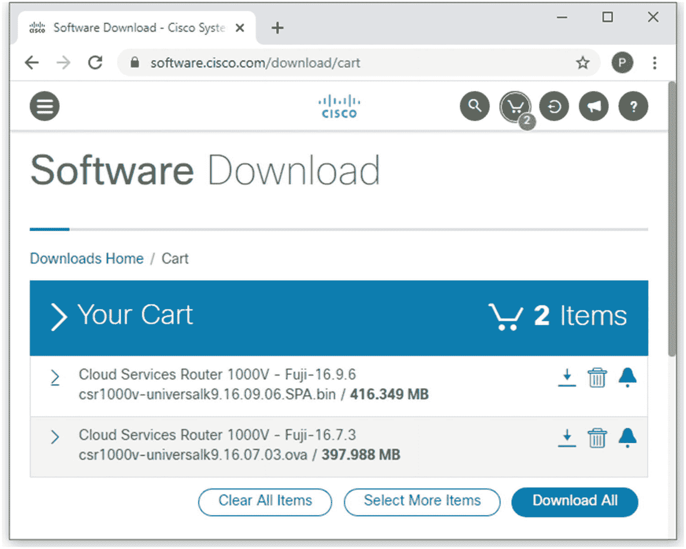

图 17-1。

从思科软件下载网站下载 CSR 1000v IOS XE

### 在 VMware 工作站上安装 Cisco CSR 1000v

在 VMware Workstation 15 上安装 CSR 1000v 与安装之前安装的 GNS3 VM `.ova`文件没有什么不同。但是这一次，您将创建两个虚拟机，而不是一个。此外，对于本实验，您可以保持 GNS3 完全关闭，但您仍然需要打开 Python 服务器`ubuntu20s1`。一旦我们构建了虚拟路由器，我们将使用最低配置配置两台路由器，并继续进行 IOS 升级应用开发。见图 [17-2](#Fig2) 。

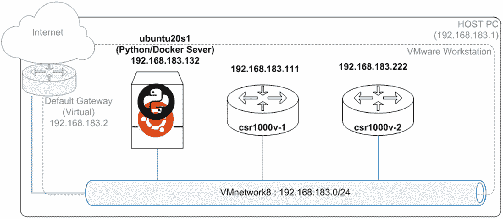

图 17-2。

第 [10 章](10.html)实验室设备

现在按照这些任务安装`csr1000v-1`和`csr1000v-2`虚拟路由器。csr100-v 的安装非常简单。

<colgroup><col class="tcol1 align-left"> <col class="tcol2 align-center"></colgroup> 
| 

#

 | 

工作

 |
| --- | --- |
| **1** | To create the virtual machine, first open the VMware Workstation main window and go to File ➤ Open. Then go to the Downloads folder and select the `csr1000v-universalk9.16.07.03.ova` file. See Figure [17-3](#Fig3).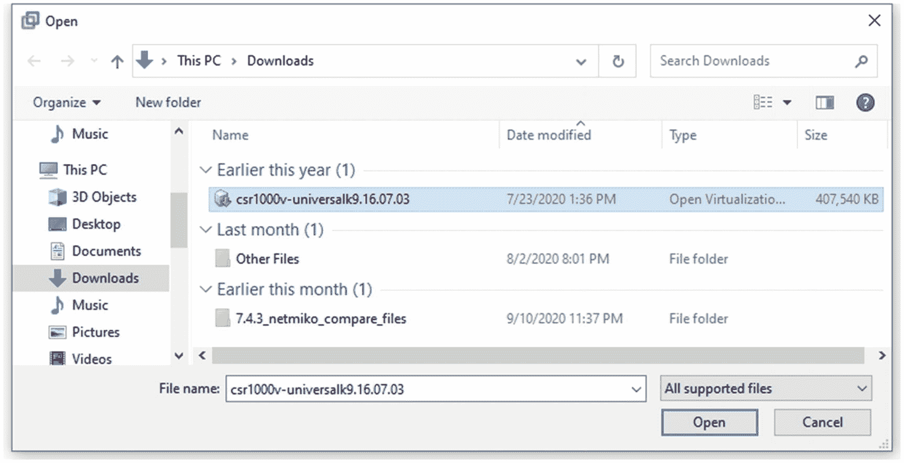图 17-3。VMware 工作站，选择 csr1000v。ova 文件 |
| **2** | For the first virtual router, give `csr1000v-1` as the name of this device. When you create the second virtual router, you just need to change the last digit of the router name to 2, so it would be `csr1000v-2`. See Figure [17-4](#Fig4).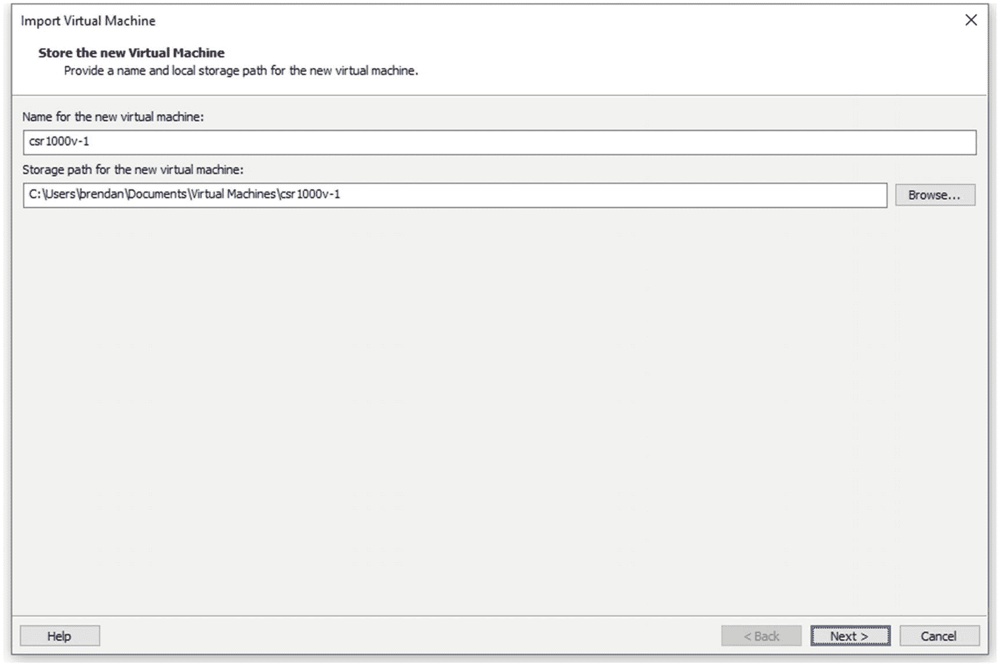图 17-4。csr1000v-1，给出新的路由器名称 |
| **3** | Leave the Deployment Options setting as Small and click the Next button. See Figure [17-5](#Fig5).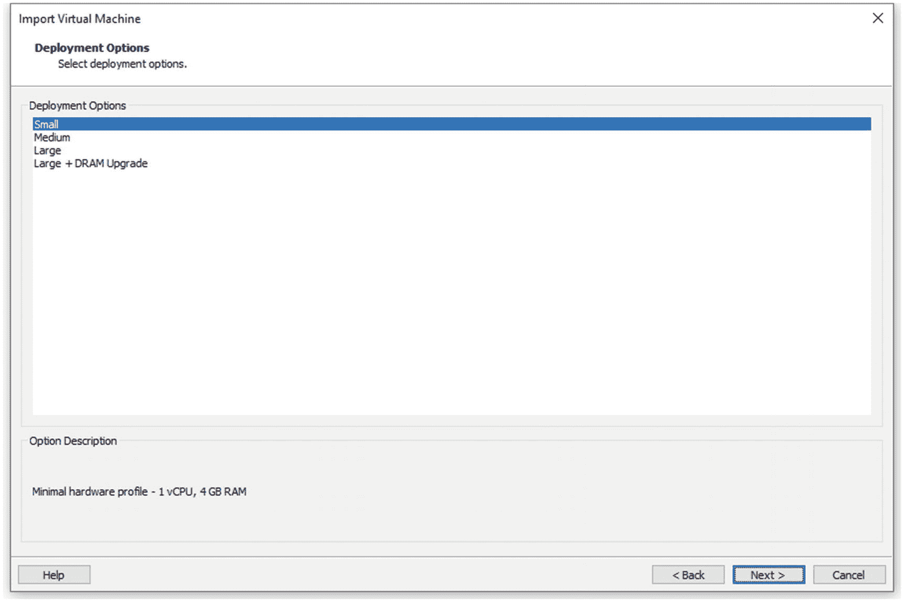图 17-5。csr1000v-1，部署选项 |
| **4** | 现在要导入虚拟路由器，您需要填写以下属性。在 GUI 上配置属性与通过 CLI 配置这些设置是一样的。 |
|   | For 1\. Bootstrap Properties , fill in the Router Name, Login Username, and Login Password fields. See Figure [17-6](#Fig6).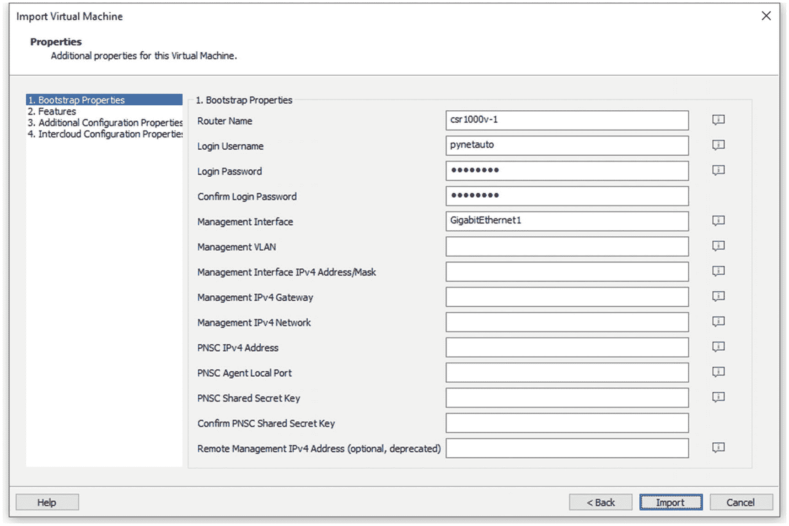图 17-6。csr1000v-1，1。引导属性 |
|   | For 2\. Features , change False to True for both Enable SCP Server and Enable SSH and Disable Telnet Login. See Figure [17-7](#Fig7).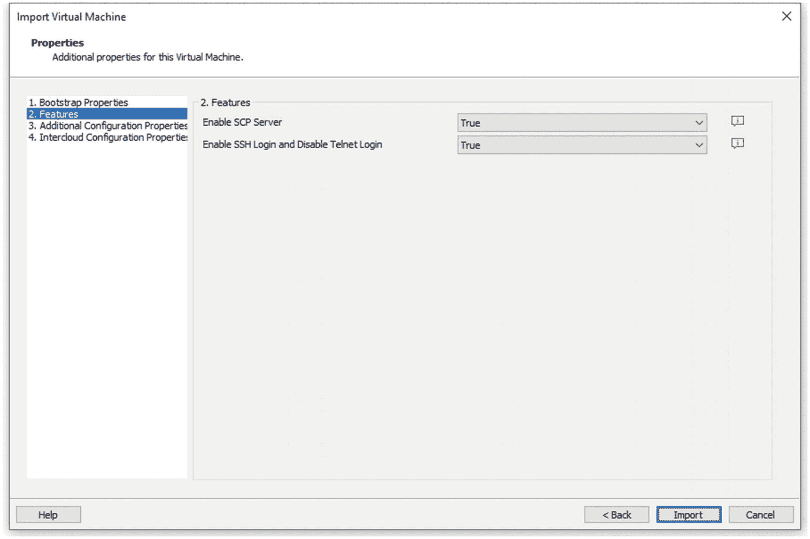图 17-7。csr1000v-1，2。特征 |
|   | 三个。附加配置属性，填写启用密码和测试域名。见图 [17-8](#Fig8) 。 |
|   | No configuration is required for 4\. Intercloud Configuration Properties; leave the settings at the defaults.图 17-8。csr1000v-1，3。其他配置属性 |
| **5** | 双击屏幕(或按 Ctrl+G)并按任意键继续导入路由器。按 Ctrl+Alt 键返回到 Windows 主机。当您在屏幕上看到以下消息时，按任意键继续: |
|   | `LoLoading stage2 ……` |
|   | `Press any key to continue` |
|   | 第二阶段…… |
| **6** | 您可能需要等待三到五分钟才能将虚拟机导入到工作站。如果有足够的时间，路由器导入将会完成，如下所示。导入完成后，立即登录并检查接口状态。 |
|   | `Ecsr1000v-1>enable` |
|   | `Password :` |
|   | `csr1000v-1#show ip interface brief` |
|   | `Interface          IP-Address  OK?  Method  Status                 Protocol` |
|   | `GigabitEthernet1   unassigned  YES  unset   administratively       down down` |
|   | `GigabitEthernet2   unassigned  YES  unset   administratively       down down` |
|   | `GigabitEthernet3   unassigned  YES  unset   administratively       down down` |
|   | `S  unset   administratively       down down` |
| **7** | Right-click the new virtual router, `csr1000v-1`, and select Settings . The network adapter type needs to be changed. See Figure [17-9](#Fig9).图 17-9。csr1000v-1，打开设置… |
| **8** | Under Hardware, change the Network Adapter configuration from Bridged (Automatic) to “NAT: Used to share the host’s IP address.” See Figure [17-10](#Fig10).图 17-10。csr1000v-1，将网络适配器(千兆以太网 1)更改为 NAT |
| **9** | 虚拟路由器构建完成后，接口将像所有其它 Cisco 路由器一样处于管理关闭/关闭状态。在显示接口之前，让我们快速为 GigabitEthernet1 接口分配正确的 IP 地址 192.168.183.111/24。因为我们的 IOS 升级工具开发只需要一个接口，所以您不必配置其他接口。 |
|   | `csr1000v-1#``config termina`T2】 |
|   | `csr1000v-1(config)#` `interface GigabitEthernet1` |
|   | `csr1000v-1(config-if)#` `ip address 192.168.183.111 255.255.255.0` |
|   | `csr1000v-1(config-if)#` `no shut` |
|   | `csr1000v-1(config-if)#` `end` |
|   | 请注意，一旦创建了第二台虚拟路由器，就应该使用 192.168.183.222/24 配置 GigabitEthernet1 接口。 |
|   | `csr1000v-2#``config termina`T2】 |
|   | `csr1000v-2(config)#` `interface GigabitEthernet1` |
|   | `csr1000v-2(config-if)#` `ip address 192.168.183.222 255.255.255.0` |
|   | `csr1000v-2(config-if)#` `no shut` |
|   | `csr1000v-2(config-if)#` `end` |
| **10** | On your Windows host, open the PuTTY SSH client and log into `csr1000v-1` (192.168.183.111). When you are prompted with PuTTY security alert, make sure you click the Yes button to accept the device’s host key. Also, don’t forget to send some ICMP commands to the `ubuntu20s1` server to test the connectivity. See Figure [17-11](#Fig11).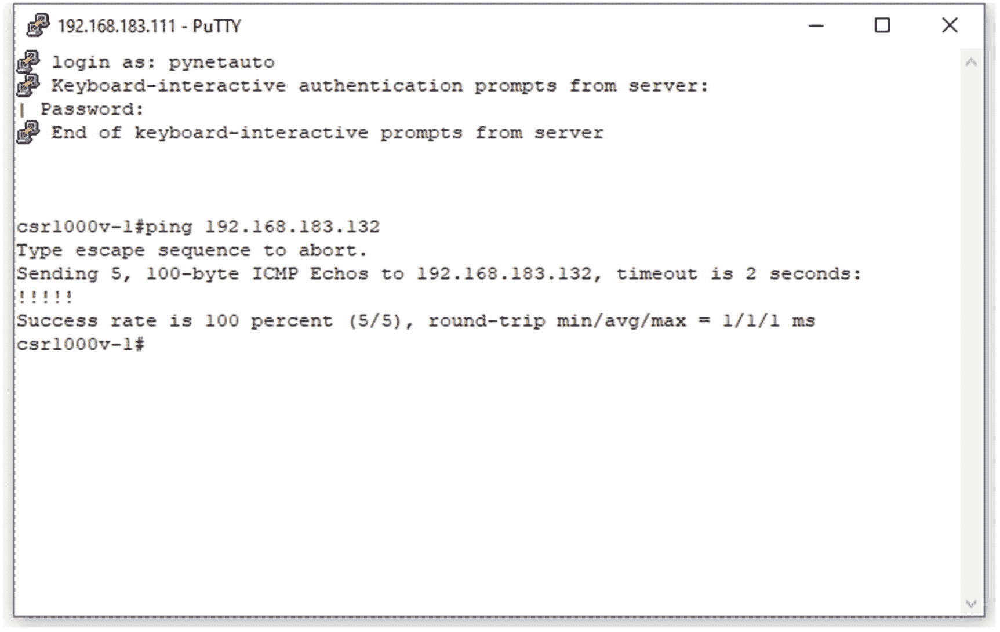图 17-11。csr1000v-1，第一次 PuTTY 登录 |
| **11** | 为了完成基本配置，让我们检查域并为安全密钥交换创建 RSA 密钥。此外，禁用 VTY 线路的超时，以停止 SSH 会话超时；仅在实验室环境中使用此功能。通过运行`write memory`保存配置。 |
|   | `csr1000v-1#` `show run &#124; in ip domain` |
|   | `ip domain name pynetauto.local` |
|   | `csr1000v-1#` `conf terminal` |
|   | `Enter configuration commands, one per line.  End with CNTL/Z.` |
|   | `csr1000v-1(config)#` `crypto key generate rsa` |
|   | `The name for the keys will be: csr1000v-1.pynetauto.local` |
|   | `Choose the size of the key modulus in the range of 360 to 4096 for your` |
|   | `General Purpose Keys. Choosing a key modulus greater than 512 may take` |
|   | `a few minutes.` |
|   | `How many bits in the modulus [512]:` `1024` |
|   | `% Generating 1024 bit RSA keys, keys will be non-exportable...` |
|   | `[OK] (elapsed time was 0 seconds)` |
|   | `csr1000v-1(config)#` `line vty 0 15` |
|   | `csr1000v-1(config-line)#` `exec-timeout 0` |
|   | `csr1000v-1(config-line)#` `end` |
|   | `csr1000v-1#` `write memory` |
|   | `Building configuration...` |
|   | `[OK]` |
| **12** | Once you are happy with the basic configuration , take a snapshot of the virtual router, as shown in Figure [17-12](#Fig12).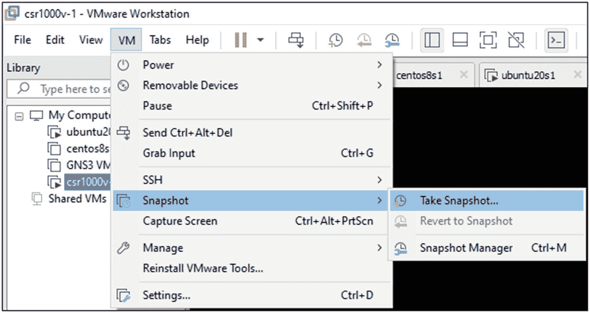图 17-12。csr1000v-1，拍摄快照 |
| **13** | 现在，重复步骤 1 到 12，创建第二个虚拟路由器(`csr1000v-2`)，详细信息如下: |
|   | `Second router name:` `csr1000v-2` |
|   | `Second router IP:` `192.168.183.222 255.255.255.0` |
| **14** | Once you have two `csr1000v` routers (`csr1000v-1` and `csr1000v-2`) installed, then you are ready to move on to the Cisco IOS upgrade processes . See Figure [17-13](#Fig13).图 17-13。启动并运行 csr1000v-1 和 csr1000v-2 |

您现在已经完成了两台用于 IOS 升级应用开发的 Cisco CSR 1000v 路由器的安装。让我们快速回顾一下 Cisco IOS 设备的升级过程。

## 讨论如何在 Cisco 设备上升级 IOS (IOS-XE/XR)

在 Cisco 路由器和交换机上升级 Cisco IOS (IOS/IOS-XE/IOS-XR)不适合胆小的工程师，因为成百上千的关键业务应用在工作时间和非工作时间都在运行。即使系统和 DevOps 工程师回家了，企业路由器和交换机也必须为最终用户提供 IP 连接，并为其他系统提供 IP 服务，从而允许备份服务在半夜运行。企业网络设备几乎全天候运行，这就是为什么您必须为企业网络购买声誉良好的供应商产品(如思科)。如果任何服务失败，那么第一个指责就会指向 IP 网关(路由器)设备，即使是公司电子邮件、云或系统备份问题。在一个 ITIL 驱动的组织中，要执行 IOS 升级，你总是不得不通过一系列繁文缛节的变更控制。升级 IOS 设备的原因有很多。最常见的是过时的 IOS、bug、Cisco TAC 的建议或第三方协议。IOS 升级承诺写入支持合同，IOS 升级作为网络补丁管理的一部分。

### Cisco IOS 升级涉及的任务

让我们快速看一下一个经验丰富的网络工程师如何将一个过时的 IOS 升级到最新的 IOS 版本。IOS 升级流程涉及一组预定义的任务，但工程师之间的预检查和后检查会有所不同。然而，在大多数情况下，IOS 升级过程相对标准化，但需要大量关注，并且在工作时间之外进行，以避免重大停机。在极端情况下，您只允许在午夜后执行 IOS 升级，并有一个小的更改窗口。这种变化通常发生在奇数时间，这导致长期网络工程师失眠，并从长远来看给婚姻带来很大压力。无论如何，网络自动化对网络工程师和他们的家庭来说都是好消息。

让我们研究一个普通的 IOS 升级工作流程，工程师需要遵循该流程来完成 Cisco 路由器或交换机的 IOS 升级。图 [17-14](#Fig14) 展示了许多常见平台的思科 IOS 升级工作流程。

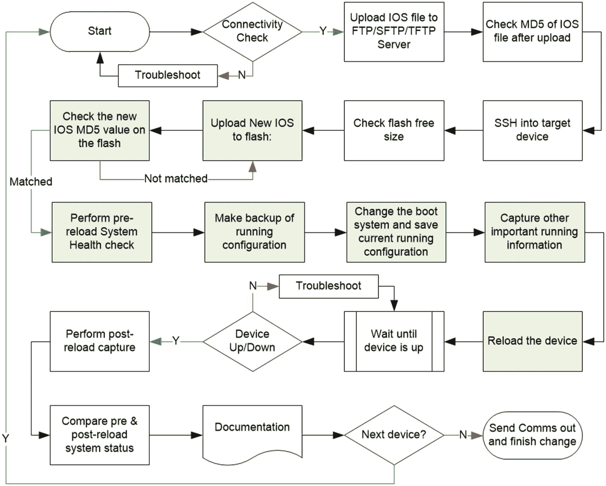

图 17-14。

常规 Cisco IOS 升级工作流程

如图 [17-14](#Fig14) 所示，思科 IOS 升级过程相当复杂；换句话说，这是劳动密集型的。如果有一个以上的设备需要升级，那么整个过程立即变得重复。那么，为什么不将工程师的任务自动化呢？在最后两章的最后实验中，你将被指导开发小的 Python 模块来代替图 [17-14](#Fig14) 中描述的大部分任务。

让我们将图 [17-14](#Fig14) 分解成三个重要阶段和许多线性步骤，以便更好地理解哪些任务必须被翻译并写入 Python 代码。在这里，你必须戴上应用开发人员/程序员的帽子，同时还要戴上网络工程师的帽子。表 [17-2](#Tab2) 提供了手动任务驱动的思科 IOS 升级明细；这一过程在不同代和不同平台之间可能略有不同。总的来说，原理几乎相同。

表 17-2。

IOS 升级任务细分

<colgroup><col class="tcol1 align-left"> <col class="tcol2 align-left"></colgroup> 
| 

第一阶段:预检

 |
| --- |
| one | 检查服务器和网络设备之间的网络连接。 |
| Two | 收集用户的登录凭证以及作为变量的用户输入。 |
| three | 检查作为变量的新 IOS 的 MD5 值。 |
|   | 将用户的 MD5 值与服务器检查的 MD5 值进行比较。 |
| four | 作为变量检查 Cisco 设备上的闪存大小。 |
|   | 让用户选择在`flash:/`删除旧的 IOS 文件。 |
|   | 提供查看 Cisco 交换机目录内部并删除旧 IOS 文件的选项。 |
| five | 制作`running-config`的备份。 |
| **第二阶段:IOS 上传和预上传检查** |
| six | 将新的 IOS 文件从文件服务器上传到路由器的闪存。 |
| seven | 检查 Cisco 设备闪存上的新 IOS MD5 值。 |
|   | 比较服务器的 MD5 值和交换机的 MD5 值。 |
| eight | 给用户一个结果回顾。 |
|   | 如果需要，让用户选择在延迟时间重新加载设备。 |
| nine | 设备重新加载前: |
|   | 更改引导系统并将当前的`running-config`保存到`start-up`配置。 |
|   | 在本地/TFTP/FTP 存储上备份运行配置(根据需要)。 |
|   | 选择性地获取任何其他重要信息。 |
|   | 对于开关，运行`show ip interface brief`。 |
|   | 对于路由器，运行`show ip routing`，它是路由表。 |
| **阶段 3:重新加载和升级后检查** |
| Ten | 设备重新加载期间(重新加载状态): |
|   | 检查设备是否在网络上。 |
| Eleven | 重新加载后(设备重新接入网络): |
|   | 重新登录设备，使用前后配置执行升级后验证。 |
|   | 或者，在升级完成后向工程师发送电子邮件通知。 |

我们已经回顾了前面显示的手动 IOS 升级过程，但是我们如何将每一项都翻译成 Python 代码呢？我们从哪里开始，甚至有可能在生产中创建如此复杂的 IOS 升级应用吗？与当前市场上的其他工具相比，有许多任务(和工程师的逻辑思维)必须转化为代码行(程序)。接下来，我们来学习图 [17-15](#Fig15) ，这是我把表 [17-2](#Tab2) 和图 [17-14](#Fig14) 翻译成可自动化的任务。

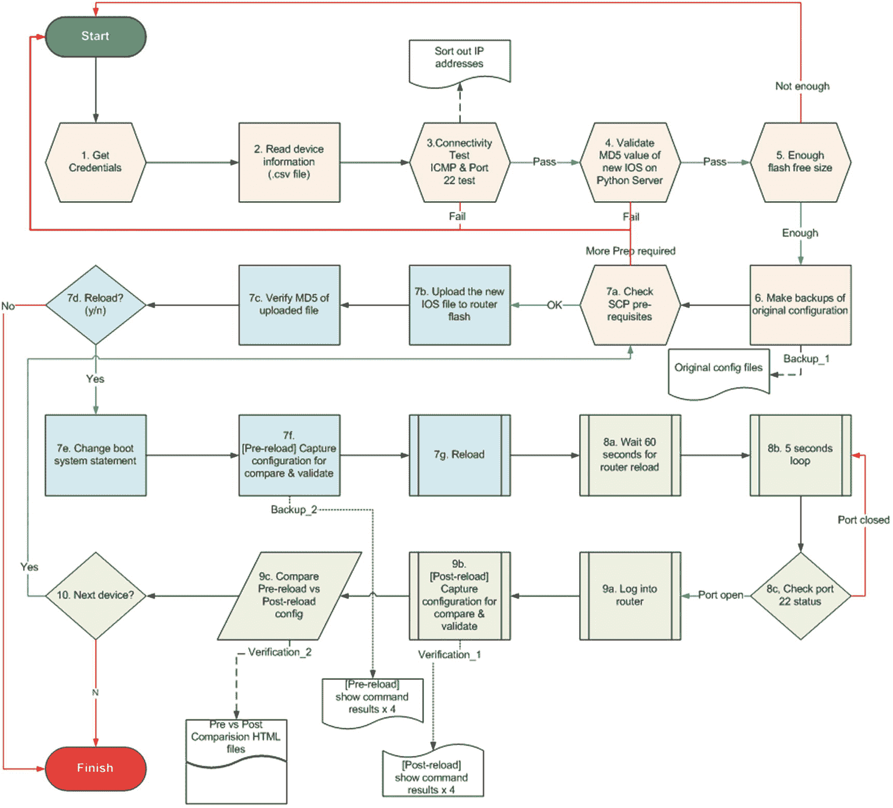

图 17-15。

Cisco IOS/IOS XE 自动升级，建议的工作流程示例

图 [17-15](#Fig15) 几乎是表 [17-2](#Tab2) 中讨论的任务的直接翻译，数字与表 [17-2](#Tab2) 中的数字相对应。在进入下一章之前，你应该仔细研究一下。在第 [18](18.html) 章中，我们将把升级过程中的每一步都变成更小的 Python 代码片段。在第 [18](18.html) 章中，为每个过程开发的工具本身将成为单独的工具。然后，在第 [19 章](19.html)中，你将把它们组合成一个单一的工具(应用)来从头到尾取代思科 IOS 升级任务，即预检查、IOS 升级和后检查过程。

## 摘要

本章中讨论的过程仍然有点笼统，但是如果你想更详细，你可以将每个任务分解成更小的任务。没有基本网络背景的程序员对有经验的网络工程师通常执行的过程知之甚少或一无所知。只有能够编写代码的网络工程师才会将每个任务串成有序的任务，并涵盖将他们的行动转化为可操作代码行所需的所有基本任务。因此，在这种情况下，网络(包括安全)工程师可预见的未来是光明的，因为他们无法被纯粹的应用开发人员或未经训练的人工智能(AI)所取代。尽管如此，组织还是更喜欢有编码技能的工程师，而不是没有编码技能的传统工程师。也许大多数网络工程师都会同意，很快，人工智能将取代我们今天所做的大部分工作。至少对于这些 AI 平台的最初设计和开发来说是如此，因为它们必须由经验丰富的智能网络工程师发起，而不是应用开发人员。