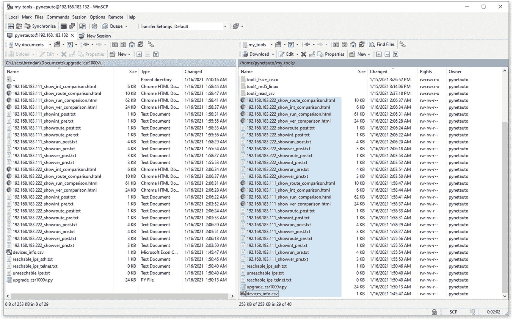

# 19.Python 网络自动化实验室:组合和完成 Cisco IOS 升级应用程序

在这最后一章，你将把我们在第 [18](18.html) 章开发的 10 个 Python 独立应用程序放在一起。该应用程序将是一个功能齐全的 Cisco IOS/IOS-XE 升级应用程序，包括预检查、IOS 上传、预重新加载检查、预重新加载配置备份、重新加载和升级后验证检查。多年来，我们一直在思科网络设备上手动升级 IOS，但现在您可以开发和组合各种 Python 工具，让您的 Python 代码为您服务。

一旦你读完这一章，你将学会如何把更小的应用程序组合成一个复杂的、可投入生产的应用程序。Python 允许程序员自由地编写几乎任何他们喜欢的代码，唯一的限制是程序员的想象力。另一方面，像 Ansible 和 Puppet 这样的配置和编排工具为非编程工程师提供了幂等特性，使他们能够非常灵活地配置和管理网络设备。但是，您仍然必须在生产设定的框架内工作。在完成本章以及本书之后，您将到达 Python 网络编程之旅的第一个里程碑。

在前一章中，您开发了十个与 Cisco IOS 升级相关的应用程序。现在是时候将这些工具结合起来，制作一个功能齐全的 Cisco IOS XE 升级工具了。随着您从事更多的 Python 项目，您总会发现一些以前没有遇到过的新东西。最好的学习方法之一是通过充满未知和挑战的项目工作。然而，如果您正在开始您的 Python 网络自动化之旅，那么尝试找到一个较小的任务来集中您的努力，并记录您可以完成的任务。开始自动化更简单的任务，然后花时间研究和学习书籍，参加在线课程，在谷歌上搜索信息，或者向已经做过类似事情的人寻求建议。

在前一章的开始，我简要地向你介绍了面向对象编程(OOP)。我们不会在最终的 IOS XE 升级应用程序中使用它，因为它增加了更多的复杂性。即使 OOP 是一个必须理解的概念，我们仍然可以在不创建自定义 OOP 类的情况下编写代码。在 Python 中，几乎所有东西都可以被认为是对象，即使你没有意识到 OOP，你仍然在使用它。请注意，我已经有目的地删除了最终脚本的 OOP 部分，它将不会是我们最终 Python 应用程序的一部分。

你已经完成了最后的练习，这是本书真正的高潮。我想祝贺你为理解本书所有章节所做的巨大努力。几年前，当我用 Python 开始我的第一次网络自动化之旅时，它仍然被认为是一种相对较新的技术趋势，并且感觉自动化任务(如在企业路由器和交换机上升级 Cisco IOS)是一个遥远的梦想。网络自动化最近获得了发展势头，现在网络自动化和 Python 编码是每个 IT/网络团队都在考虑的问题。所以事不宜迟，让我们继续完成最终的应用程序:一个工作的 IOS 升级工具。

在开始本节的最终任务之前，请查看第 [17](17.html) 章中的图 [17-14](17.html#Fig14) 和图 [17-15](17.html#Fig15) 。您可能需要快速复习一下，以判断我们将在最后一个实验中完成什么。最终脚本的工作流程将与图 [17-15](17.html#Fig15) 中描述的自动化任务几乎相同。

## 创建单个 Python 文件

为了简单起见，我们将只创建一个 Python 文件(`upgrade_crs1000v.py`)。在真实的生产环境中，最佳实践是创建工具并将其保存到较小的文件(模块)中，以减少写入主脚本的行数。但是，在这里我们还在探索和学习，所以更重要的是看到每个应用程序如何工作的全貌。在你读完这本书之后，你可以把代码的一些部分移到单独的模块中，这在前一章中已经讨论过了。如前所述，我们将使这个应用程序成为一个交互式工具，在脚本运行时获取用户凭证和用户输入。设备信息将被写入一个`.csv`文件，并使用`pandas`模块作为`df`(数据帧)从该文件中读取；与让用户输入数据相比，这是一种更方便的读取大型文本数据的方式。

<colgroup><col class="tcol1 align-left"> <col class="tcol2 align-left"></colgroup> 
| 

#

 | 

工作

 |
| --- | --- |
| **1** | 您将继续执行`/home/pynetauto/my_tools/`目录中的任务；这个目录包含了我们在第 18 章中开发的所有迷你 Python 应用程序。转到`my_tools`目录，然后在这个目录下创建`upgrade_crs1000v.py`文件。`pynetauto@ubuntu20s1:~$` `pwd` |
|   | `/home/pynetauto` |
|   | `pynetauto@ubuntu20s1:~$` `cd my_tools` |
|   | `pynetauto@ubuntu20s1:~/my_tools$` `touch upgrade_crs1000v.py` |
|   | `pynetauto@ubuntu20s1:~/my_tools$` `ls` |
|   | `upgrade_crs1000v.py` |
|   | 我们将很快开始填写最终的`upgrade_crs1000v.py`脚本；暂时把它留在那里作为占位符。 |
| **2** | 让我们快速讨论一下我们的应用程序开发将引用哪些文件。如果您详细地遵循了第 [18](18.html) 章并完成了所有的开发任务，您将会记得我们已经开发的十个应用程序和每个相应工具的目录名。接下来列出了您将引用的文件的名称。如果您喜欢在 Windows 文本编辑器或 IDE 中工作，可以将列出的文件保存到 Windows 文件夹中。我已经将文件复制到了`/home/pynetauto/my_tools/`目录以供参考，但是为了使完整的 IOS 应用程序工作，您将需要在`/home/pynetauto/my_tools/`目录中的`upgrade_crs1000v.py`和`devices_info.csv`文件，以及在`/home/pynetauto/my_tools/new_ios/`目录中的一个新的 IOS 文件。如果您已经完成了 IOS 上传部分的开发任务，那么新的 IOS 文件已经在这个目录中了。如果您尚未上传新的 IOS 文件(`csr1000v-universalk9.16.09.06.SPA.bin`)，请参考 IOS 上传部分并立即完成该任务。 |
|   | `pynetauto@ubuntu20s1:~/my_tools$` `ls -lh` |
|   | `total 52K` |
|   | `# Main script and files` |
|   | `-rw-rw-r-- 1 pynetauto pynetauto    0 Jan 15 22:03` `upgrade_crs1000v.py` |
|   | `-rw-rw-r-- 1 pynetauto pynetauto  271 Jan 15 23:13` `devices_info.csv` |
|   | `# Python application scripts referenced:` |
|   | `-rw-rw-r-- 1 pynetauto pynetauto  955 Jan 15 23:14 check_flash2.py` |
|   | `-rw-rw-r-- 1 pynetauto pynetauto 1.5K Jan 15 23:13 get_cred2.py` |
|   | `-rw-rw-r-- 1 pynetauto pynetauto 1.8K Jan 15 23:18 make_backup1.py` |
|   | `-rw-rw-r-- 1 pynetauto pynetauto 1.3K Jan 15 23:14 md5_validate3.py` |
|   | `-rw-rw-r-- 1 pynetauto pynetauto 2.4K Jan 15 23:18 md5_verify2.py` |
|   | `-rw-rw-r-- 1 pynetauto pynetauto  681 Jan 15 23:14 ping_tool6.py` |
|   | `-rw-rw-r-- 1 pynetauto pynetauto 1009 Jan 15 23:14 ping_tool6_tools.py` |
|   | `-rw-rw-r-- 1 pynetauto pynetauto 6.1K Jan 15 23:18 post_check2.py` |
|   | `-rw-rw-r-- 1 pynetauto pynetauto 1.3K Jan 15 23:13 read_info8.py` |
|   | `-rw-rw-r-- 1 pynetauto pynetauto 3.9K Jan 15 23:18 reload_yesno2.py` |
|   | `-rw-rw-r-- 1 pynetauto pynetauto 3.2K Jan 15 23:14 upload_ios1.py` |
|   | `# new IOS .bin file location` |
|   | `pynetauto@ubuntu20s1:~/my_tools$` `ls /home/pynetauto/my_tools/new_ios` |
|   | `csr1000v-universalk9.16.09.06.SPA.bin` |
| **3** | 如果您没有上一章的`devices_info.csv`文件，您现在可以创建它。您可以使用 Microsoft Excel 创建该文件，也可以直接在文本编辑器中使用逗号分隔值(用逗号分隔值，不使用空格)来创建该文件。创建文件后，它看起来应该如下所示: |
|   | `pynetauto@ubuntu20s1:~/my_tools$` `nano devices_info.csv` |
|   | `devices_info.csv` |
|   | `devicename,device,devicetype,host,newios,newiosmd5` |
|   | `csr1000v-1,RT,cisco_xe,192.168.183.111,csr1000v-universalk9.16.09.06.SPA.bin,77878ae6db8e34de90e2e3e83741bf39` |
|   | `csr1000v-2,RT,cisco_xe,192.168.183.222,csr1000v-universalk9.16.09.06.SPA.bin,77878ae6db8e34de90e2e3e83741bf39` |
| **4** | 既然标准过程已经完成，让我们开始最后的应用程序开发。现在，您将以线性方式将这一系列脚本添加到`upgrade_crs1000v.py`脚本中，一旦所有内容都串联起来，它将作为一个应用程序工作，可以直接在大多数生产环境中使用。 |
|   | 首先，您将添加将在我们的应用程序中使用的所有 Python 模块，然后一次添加和修改一个脚本。按照这些说明，首先创建并测试一个文件应用程序，它将从一端运行到另一端。 |
|   | `pynetauto@ubuntu20s1:~/my_tools$` `nano upgrade_crs1000v.py` |
|   | 添加所有使用的模块，如下所示: |
|   | `upgrade_crs1000v.py` |
|   | `import socket` `# For socket networking` |
|   | `import os` `# For Python Server OS` |
|   | `import time` `# Python time module` |
|   | `import pandas as pd` `# Pandas to read data into a data frame` |
|   | `import re` `# Python regular expression module` |
|   | `from getpass import getpass` `# For password collection` |
|   | `import os.path` `# For Python Server OS directory` |
|   | `import hashlib` `# For MD5 checks` |
|   | `from netmiko import ConnectHandler, SCPConn` `# For netmiko's SSH connection and SCP file transfer` |
|   | `from netmiko.ssh_exception import  NetMikoTimeoutException` `# To accept netmiko timeout exceptions` |
|   | `import difflib` `# For analyzing two files and differences` |
|   | `t = time.mktime(time.localtime())` `# Timer start to measure script running time` |
|   | 在下一步中，您将追加和修改每个工具的代码部分，并慢慢构建主应用程序脚本。 |
| **5** | A.用`get_cred2.py` ( `tool2_login`)把它变成一个函数。该脚本将以交互方式获取网络管理员 ID 和密码，提示启用密码，并让用户选择是或否。我们还使用正则表达式来控制用户的用户名和密码输入。对于`p1`，期望的字符长度为 5 到 30 个字符，以字母开始，以字母或数字结束。对于`p2`，期望的字符长度从 8 到 50 个字符，以字母开始，以任意字符结束。正则表达式对一些人来说可能是一个困难的话题；如果你需要帮助，你应该复习第九章。 |
|   | `"""` |
|   | `Step 1\. From get_cred2.py (tool2_login) application` `:` |
|   | `Get network administrator ID and password, also prompt for enable secret and give the user option to select yes or no.` |
|   | `p1: Between 5-30 characters long, starting with an alphabet & finishes with an alphabet or a number` |
|   | `p2: Between 8 to 50 characters long, starting with an alphabet & finishes with any characters` |
|   | `"""` |
|   | `def get_secret(p2):` |
|   | `global secret` |
|   | `resp = input("Is secret same as password? (y/n) : ")` |
|   | `print("-"*80)` |
|   | `resp = resp.lower()` |
|   | `if resp == "yes" or resp == "y":` |
|   | `secret = pwd` |
|   | `elif resp == "no" or resp == "n":` |
|   | `secret = None` |
|   | `while not secret:` |
|   | `secret = getpass("Enter the secret : ")` |
|   | `while not p2.match(secret):` |
|   | `secret = getpass(r"*Enter the secret : ")` |
|   | `secret_verify = getpass("Confirm the secret : ")` |
|   | `if secret != secret_verify:` |
|   | `print("!!! the secret does not match. Please try again.")` |
|   | `print("-"*80)` |
|   | `secret = None` |
|   | `else:` |
|   | `get_secret(p2)` |
|   | `def get_credentials():` |
|   | `p1 = re.compile(r'^[a-zA-Z][a-zA-Z0-9_-]{3,28}[a-zA-Z0-9]$')` |
|   | `p2 = re.compile(r'^[a-zA-Z].{7,49}')` |
|   | `global uid` |
|   | `uid = input("Enter Network Admin ID : ")` |
|   | `while not p1.match(uid):` |
|   | `uid = input(r"*Enter Network Admin ID : ")` |
|   | `global pwd` |
|   | `pwd = None` |
|   | `while not pwd:` |
|   | `pwd = getpass("Enter Network Admin PWD : ")` |
|   | `while not p2.match(pwd):` |
|   | `pwd = getpass(r"*Enter Network Admin PWD : ")` |
|   | `pwd_verify = getpass("Confirm Network Admin PWD : ")` |
|   | `if pwd != pwd_verify:` |
|   | `print("!!! Network Passwords do not match. Please try again.")` |
|   | `print("-"*80)` |
|   | `pwd = None` |
|   | `# Trigger get_secret function to run` |
|   | `get_secret(p2)` |
|   | `return uid, pwd, secret` |
|   | `# Trigger get_Credential function to run` |
|   | `get_credentials()` |
|   | 现在你已经完成了上面的任务 A，继续任务 b。 |
| **6** | B.复制粘贴`read_info8.py`(`tool3_read_csv`)；这是一个脚本，它读取`devices_info.csv`文件来填充我们的脚本，并将读取的项目转换成变量，以便在整个脚本中使用。把它变成一个函数，以提高可移植性和可读性。确保您传递了从任务 A 接收的三个参数，以便脚本运行时没有参数错误。记住，这个应用程序需要来自前面工作流的三个参数:`uid`、`pwd`和`secret`。 |
|   | `"""` |
|   | `Step 2\. From read_info8.py (tool3_read_csv) application:` |
|   | `Read the content of the devices_info.csv file and convert the values into two lists. device_list to be used as an information feeder to the script device_list_netmiko to be used as netmiko friendly dictionary items for SSH connection` |
|   | `"""` |
|   | `def read_info(uid, pwd, secret):` |
|   | `df = pd.read_csv(r'./devices_info.csv')` `# ensure the correct file location` |
|   | `number_of_rows = len(df.index)` |
|   | `# Read the values and save as a list, read column as df and save it as a list` |
|   | `devicename = list(df['devicename'])` |
|   | `device = list(df['device'])` |
|   | `devicetype = list(df['devicetype'])` |
|   | `ip = list(df['host'])` |
|   | `newios = list(df['newios'])` |
|   | `newiosmd5 = list(df['newiosmd5'])` |
|   | `# Append the items and convert to a list, device_list` |
|   | `global device_list` `# For md5_validate3.py` |
|   | `device_list = []` |
|   | `for index, rows in df.iterrows():` |
|   | `device_append = [rows.devicename, rows.device, \` |
|   | `rows.devicetype, rows.host, rows.newios, rows.newiosmd5]` |
|   | `device_list.append(device_append)` |
|   | `# Using device_list, create a netmiko friendly list device_list_netmiko` |
|   | `global device_list_netmiko` |
|   | `device_list_netmiko = []` |
|   | `i = 0` |
|   | `for x in device_list:` |
|   | `if len(x) != 0:` `# As long as number of items in device_list is not 0 (empty)` |
|   | `i += 1` |
|   | `name = f'device{str(i)}'` `# Each for loop, the name is updated to device1, device2, device3, ...` |
|   | `devicetype, host = x[2], x[3]` |
|   | `device = {` |
|   | `'device_type': devicetype,` |
|   | `'host': host,` |
|   | `'username': uid,` |
|   | `'password': pwd,` |
|   | `'secret': secret,` |
|   | `}` |
|   | `device_list_netmiko.append(device)` |
|   | `# Trigger read_info function to run` |
|   | `read_info(uid, pwd, secret)` |
| **7** | C.这个模块几乎是直出`ping_tool6.py`和`ping_tool6_tools.py` ( `tool1_ping`)。复制脚本并进行修改；然后用它来测试设备列表中所有设备的连通性。这个脚本使用 Linux 的 OS `ping`命令和套接字网络来检查打开的套接字 22 状态。如果 IP 地址不可达，脚本将退出应用程序，您必须排除特定设备在网络上不可达的原因。这个脚本应该生成三个包含可达性状态的独立文件。如果端口 22 是开放的，那么设备的 IP 地址被写入`f1`；如果端口 22 关闭，脚本将测试端口 23 的状态，并将 IP 地址写入`f2`。如果设备不可达，则 IP 地址将被写入`f3`。 |
|   | `"""` |
|   | `Step 3\. From ping_tool6.py and ping_tool6_tools.py (tool1_ping) application:` |
|   | `Perform connectivity tests, first using ICMP ping, Second, check port 22\. Also, separate the ips with open port 22\. If port 22 is closed, then test port 23 create three files containing the result of the reachability tests` |
|   | `"""` |
|   | `def test_connectivity(device_list_netmiko):` |
|   | `f1 = open('reachable_ips_ssh.txt',  'w+')` |
|   | `f2 = open('reachable_ips_telnet.txt', 'w+')` |
|   | `f3 = open('unreachable_ips.txt', 'w+')` |
|   | `for device in device_list_netmiko:` |
|   | `ip = device['host'].strip()` |
|   | `print(ip)` |
|   | `resp = os.system('ping -c 4 ' + ip)` |
|   | `if resp == 0:` |
|   | `for port in range (22, 23):` |
|   | `destination = (ip, port)` |
|   | `try:` |
|   | `with socket.socket(socket.AF_INET, socket.SOCK_STREAM) as s:` |
|   | `s.settimeout(3)` |
|   | `connection = s.connect(destination)` |
|   | `print(f"{ip} {port} open")` |
|   | `print("-"*80)` |
|   | `f1.write(f"{ip}\n")` |
|   | `except:` |
|   | `print(f"{ip} {port} closed")` |
|   | `f3.write(f"{ip} {port} closed\n")` |
|   | `for port in range (23, 24):` |
|   | `destination = (ip, port)` |
|   | `try:` |
|   | `with socket.socket(socket.AF_INET, socket.SOCK_STREAM) as s` `:` |
|   | `s.settimeout(3)` |
|   | `connection = s.connect(destination)` |
|   | `print(f"{ip} {port} open")` |
|   | `print("-"*80)` |
|   | `f2.write(f"{ip}\n")` |
|   | `except:` |
|   | `print(f"{ip} {port} closed")` |
|   | `print("-"*80)` |
|   | `f3.write(f"{ip} {port} closed\n")` |
|   | `else:` |
|   | `print(f"{ip} unreachable")` |
|   | `print("-"*80)` |
|   | `f3.write(f"{ip} unreachable\n")` |
|   | `f1.close()` |
|   | `f2.close()` |
|   | `f3.close()` |
|   | `# Trigger test_connectivity function to run` |
|   | `test_connectivity(device_list_netmiko)` |
| **8** | D.这部分来自`md5_validate3.py` ( `tool4_md5_linux`)，如前所述，这将验证服务器上新 IOS 文件的 MD5 值。由于文件和脚本从一个 Python 自动化服务器运行，我们可以使用 Python 的`hashilib`来测试目录中 IOS 的 MD5 值。在整个工作流程中严格测试 MD5 值将保证 IOS 成功升级到更新的 IOS XE 版本。此外，您必须确保您的新 IOS 位于正确的目录中。 |
|   | `"""` |
|   | `Step 4\. From md5_validate3.py (tool4_md5_linux) application` `:` |
|   | `Validate the MD5 value of the new IOS file on the Python Server against the value you have provided on the csv file. Must be validated before moving on.` |
|   | `"""` |
|   | `def validate_md5(device_list):` |
|   | `for x in device_list:` |
|   | `print(x[3], x[0], x[1], x[2])` |
|   | `newios = x[4]` |
|   | `newiosmd5 = str(x[5].lower()).strip()` |
|   | `print(newiosmd5)` |
|   | `newiosmd5hash = hashlib.md5()` |
|   | `file = open(f'/home/pynetauto/my_tools/new_ios/{newios}', 'rb')` `# New IOS directory here` |
|   | `content = file.read()` |
|   | `newiosmd5hash.update(content)` |
|   | `newiosmd5server = newiosmd5hash.hexdigest()` |
|   | `print(newiosmd5server.strip())` |
|   | `global newiossize` |
|   | `newiossize = round(os.path.getsize(f'/home/pynetauto/my_tools/new_ios/{newios}')/1000000, 2)` |
|   | `print(newiossize, "MB")` |
|   | `if newiosmd5server == newiosmd5:` |
|   | `print("MD5 values matched!")` |
|   | `print("-"*80)` |
|   | `else:` |
|   | `print("Mismatched MD5 values. Exit")` |
|   | `print("-"*80)` |
|   | `exit()` |
|   | `return newiossize` |
|   | `# Trigger validate_md5 function to run` |
|   | `validate_md5(device_list)` |
| **9** | E.在这个任务中，剧本几乎就是`check_flash2.py` ( `tool5_fsize_cisco`)的复写本。当您创建函数时，请确保您解析了前面工作流中的正确变量。在这种情况下，我们在 SSH 连接的`device_list_netmiko`列表和变量`newiossize`中进行解析，以确认路由器在闪存中有足够的空闲空间来容纳新的 IOS 文件大小。如果可用空间小于新 IOS 文件大小的 1.5 倍，脚本将退出。在较新的 Cisco 设备上，闪存空闲大小不是太大的挑战，因为它们可以容纳多个较大的 IOS 和 IOS XE 文件，但在较旧的设备上，您必须从闪存中删除旧的 IOS 以腾出空间。你可以在这里写一些有趣的东西，如果你愿意，可以自动定位最大或最老的文件。无论如何，在您的变更计划过程中，总是要检查空闲空间的大小。 |
|   | `"""` |
|   | `Step 5\. From check_flash2.py (tool5_fsize_cisco) application` `:` |
|   | `Checks available flash size on the router` |
|   | `"""` |
|   | `def check_flash(device_list_netmiko, newiossize):` |
|   | `for device in device_list_netmiko:` |
|   | `ip = str(device['host'])` |
|   | `net_connect = ConnectHandler(**device)` |
|   | `net_connect.send_command("terminal length 0")` |
|   | `showdir = net_connect.send_command("dir")` |
|   | `#showflash = net_connect.send_command("show flash:")` `# For switches` |
|   | `time.sleep(2)` |
|   | `p1 = re.compile("\d+(?=\sbytes\sfree\))")` |
|   | `m1 = p1.findall(showdir)` |
|   | `flashfree = ((int(m1[0])/1000000))` |
|   | `print(f"{ip} Free flash size : ", flashfree, "MB")` |
|   | `print("-"*80)` |
|   | `if flashfree < (newiossize * 1.5):` |
|   | `print(f"Not enough space on {ip}'s flash! Exiting")` |
|   | `print("!"*80)` |
|   | `exit()` |
|   | `else:` |
|   | `print(f"{ip} has enough space for new IOS.")` |
|   | `print("-"*80)` |
|   | `# Trigger check_flash function to run` |
|   | `check_flash(device_list_netmiko, newiossize)` |
| **10** | F.这个脚本来自`upload_ios1.py` ( `tool7_upload_ios`)，它构成了主脚本的一大部分。顾名思义，在前面的任务之后，应用程序准备将新的 IOS 上传到第一个路由器的闪存，但是在上传文件之前，需要进行一些整理工作。首先，登录用户拥有 15 级权限，可以通过 SCP 执行 IOS 上传任务。第二，路由器具有正确的配置，允许对该用户进行`aaa`认证和授权。如果不满足第一个和第二个要求，您就忽略了您的变更准备，因此您必须在尝试运行此应用程序之前先返回并解决访问问题。但是如果一切都正确配置了对该设备的正确访问，那么应用程序检查`ip scp server enable`以打开 Cisco 设备上的 SCP 服务器服务。如果此功能被禁用，脚本将在新的 IOS 文件上传之前自动启用它，然后在上传完成后禁用它。请注意，下一个任务将在此任务结束时继续。 |
|   | `"""` |
|   | `Step 6\. From upload_ios1.py (tool7_upload_ios) application` `:` |
|   | `First, check the aaa configuration requirements. If not met, exit for correct configuration. Second, check if 'ip scp enable' is enabled for SCP file transfer. Enable ip scp.` |
|   | `Third, upload the IOS file to the router, then disable ip scp.` |
|   | `"""` |
|   | `def ios_upload(device_list_netmiko, device_list):` |
|   | `i = 0` |
|   | `for device in device_list_netmiko:` |
|   | `device_x = device_list[i]` |
|   | `newios = device_x[4] # Call out newios value` |
|   | `newiosmd5 = device_x[5] # Call out newiosmd5 value` |
|   | `i += 1` |
|   | `s_newios = f'/home/pynetauto/my_tools/new_ios/{newios}'` |
|   | `print("*"*80)` |
|   | `#print(device)` |
|   | `ip = str(device['host'])` |
|   | `print(f'{ip} beginning IOS XE upgrade.')` |
|   | `username = str(device['username'])` |
|   | `net_connect = ConnectHandler(**device)` |
|   | `net_connect.send_command("terminal length 0")` |
|   | `showrun = net_connect.send_command("show running-config")` |
|   | `check_priv15 = (f'username {username} privilege 15')` |
|   | `aaa_authenication = "aaa authentication login default local enable"` |
|   | `aaa_authorization = "aaa authorization exec default local"` |
|   | `if check_priv15 in showrun` `:` |
|   | `print(f"{username} has level 15 privilege - OK")` |
|   | `if aaa_authenication in showrun:` |
|   | `print("check_aaa_authentication - OK")` |
|   | `if aaa_authorization in showrun:` |
|   | `print("check_aaa_authorization - OK")` |
|   | `else:` |
|   | `print("aaa_authorization - FAILED ")` |
|   | `exit()` |
|   | `else:` |
|   | `print("aaa_authentication - FAILED ")` |
|   | `exit()` |
|   | `else:` |
|   | `print(f"{username} has not enough privilege - FAILED")` |
|   | `exit()` |
|   | `net_connect.enable(cmd='enable 15')` |
|   | `net_connect.config_mode()` |
|   | `net_connect.send_command('ip scp server enable')` |
|   | `net_connect.exit_config_mode()` |
|   | `time.sleep(1)` |
|   | `print("New IOS uploading in progress! Please wait...")` |
|   | `scp_conn = SCPConn(net_connect)` |
|   | `scp_conn.scp_transfer_file(s_newios, newios)` |
|   | `scp_conn.close()` |
|   | `time.sleep(1)` |
|   | `net_connect.config_mode()` |
|   | `net_connect.send_command('no ip scp server enable')` |
|   | `net_connect.exit_config_mode()` |
| **11** | G.在这个任务中，你可以借用`md5_verify2.py`(在`tool8_md5_cisco`中)的脚本对路由器 flash 上新上传的 IOS 进行 MD5 验证，并与服务器上计算的 MD5 值进行比较。我们再次利用正则表达式的能力，通过检查命令输出中的“已验证”字符来测试 Cisco IOS XE 的`verify`命令是否成功运行。然后我们使用`re`(正则表达式)编译器找到 32 个字符的 MD5 值，并将其作为一个变量来测试 MD5 值的有效性。如果出现任何错误，`try`和`except`会捕捉到大部分错误。 |
|   | `"""` |
|   | `Step 7\. From md5_verify2.py (in tool8_md5_cisco) application` `:` |
|   | `Fourth, verify the MD5 value of the new IOS on the router flash, then` |
|   | `compare it with the server-side MD5 value.` |
|   | `"""` |
|   | `try:` |
|   | `locate_newios = net_connect.send_command(f"show flash: &#124; in {newios}")` |
|   | `if newios in locate_newios:` |
|   | `result = net_connect.send_command("verify /md5 flash:{} {}".format(newios,newiosmd5))` |
|   | `print(result)` |
|   | `p1 = re.compile(r'Verified')` |
|   | `p2 = re.compile(r'[a-fA-F0-9]{31}[a-fA-F0-9]')` |
|   | `verified = p1.findall(result)` |
|   | `newiosmd5flash = p2.findall(result)` |
|   | `if verified:` |
|   | `result = True` |
|   | `print("MD5 values MATCH! Continue")` |
|   | `print("MD5 of new IOS on Server : ",newiosmd5)` |
|   | `print("MD5 of new IOS on flash  : ",newiosmd5flash[0])` |
|   | `print("-"*80)` |
|   | `else:` |
|   | `result = False` |
|   | `print("MD5 values DO NOT MATCH! Exiting.")` |
|   | `print("-"*80)` |
|   | `exit()` |
|   | `else:` |
|   | `print("No new IOS found on router's flash. Continue to next device...")` |
|   | `print("-"*80)` |
|   | `except (NetMikoTimeoutException):` |
|   | `print (f'Timeout error to : {ip}')` |
|   | `print("-"*80)` |
|   | `continue` |
|   | `except unknown_error:` |
|   | `print ('Unknown error occurred : ' + str(unknown_error))` |
|   | `print("-"*80)` |
|   | `continue` |
| **12** | H.在正常情况下，这可能不是必需的，但为了让应用程序更真实，我决定让这个应用程序更具交互性，在新的 IOS 上传完成后，它会给用户一个选项，通过回答`yes`或`no`来重新加载路由器。这是脚本的一大部分。只要您用`y`或`yes`做出响应并按下回车键，脚本就会重新配置路由器的引导系统配置，然后将运行配置保存到启动配置中。接下来是四个`show`命令的预加载配置捕获。它发出一个`reload`命令来启动设备的重新加载。一旦路由器进入重载模式，您将失去 SSH 连接，并且 Python 自动化服务器将返回`EoFError`。为了继续在服务器上运行我们的脚本，我们使用`try`和`except`方法来捕捉这个错误并等待最初的 60 秒；然后我们运行`check_port_22_post`函数，每 5 秒钟扫描一次端口 22 的状态。`check_port_22_post`应用程序是智能的，因此它会自动检测路由器是否启动，并执行重新加载后的配置检查；然后它会产生多个 HTML 比较文件，用于 IOS 升级验证。 |
|   | `"""` |
|   | `Step 8\. From reload_yesno2.py (in tool9_yes_no) application` `:` |
|   | `Fifth, give the user a chance to review the result and let` |
|   | `him/her decide if he wants to reload the device. This can be removed to automate this process fully, but this is included to demonstrate how interactive session works. If 'Y", reload now, if "n", reload later.       Sixth, change the boot system command to boot into new IOS on the flash:/ Save configuration.` |
|   | `"""` |
|   | `yes_list = ['yes', 'y']` |
|   | `no_list = ['no', 'n']` |
|   | `print("!"*80)` |
|   | `print("Note: Devices will be reloaded one at a time.")` |
|   | `resp = input(f"Do you want to reload {ip} now? (y/n)? ").lower()` |
|   | `if resp in yes_list:` |
|   | `print("Reloading devices")` |
|   | `#net_connect = ConnectHandler(**device)` |
|   | `net_connect.enable(cmd='enable 15')` |
|   | `config_commands1 = ['no boot system', 'boot system flash:/' + newios, 'do write memory']` |
|   | `output = net_connect.send_config_set(config_commands1)` |
|   | `print (output)` |
|   | `net_connect.send_command('terminal length 0\n')` |
|   | `show_boot = net_connect.send_command('show boot\n')` |
|   | `show_dir = net_connect.send_command('dir\n')` |
|   | `if newios not in show_dir:` |
|   | `print('Unable to locate new IOS on the flash:/. Exiting.')` |
|   | `print("-"*80)` |
|   | `exit()` |
|   | `elif newios not in show_boot:` |
|   | `print('Boot system was not correctly configured. Exiting.')` |
|   | `print("-"*80)` |
|   | `exit()` |
|   | `# Seventh, if boot commands are correct, capture another running backup of the device for comparison.` |
|   | `elif newios in show_boot and newios in show_dir:` |
|   | `try:` |
|   | `print(f'Found {newios} in show boot')` |
|   | `print("-"*80)` |
|   | `print(f"{ip} [Pre-reload] Capture configuration")` |
|   | `net_connect.send_command("terminal length 0")` |
|   | `time.sleep(1)` |
|   | `with open(f'{ip}_showver_pre.txt', 'w+') as f1:` |
|   | 4 `print("* [Pre-reload] Capturing 'show version'")` |
|   | 4 `showver_pre = net_connect.send_command("show version")` |
|   | 4 `f1.write(showver_pre)` |
|   | `time.sleep(1)` |
|   | `with open(f'{ip}_showrun_pre.txt', 'w+') as f2:` |
|   | 4 `print("* [Pre-reload] Capturing 'show running-config'")` |
|   | 4 `showrun_pre = net_connect.send_command("show running-config")` |
|   | 4 `f2.write(showrun_pre)` |
|   | `time.sleep(1)` |
|   | `with open(f'{ip}_showint_pre.txt', 'w+') as f3:` |
|   | 4 `print("* [Pre-reload] Capturing 'show ip interface brief'")` |
|   | 4 `showint_pre = net_connect.send_command("show ip interface brief")` |
|   | 4 `f3.write(showint_pre)` |
|   | `time.sleep(1)` |
|   | `with open(f'{ip}_showroute_pre.txt', 'w+') as f4:` |
|   | 4 `print("* [Pre-reload] Capturing 'show ip route'")` |
|   | 4 `showroute_pre = net_connect.send_command("show ip route")` |
|   | 4 `f4.write(showroute_pre)` |
|   | `time.sleep(1)` |
|   | `print("-"*80)` |
|   | `t1 = time.mktime(time.localtime())` `# To measure time elapsed for reload` |
|   | `# Eighth, initiate the device reload` |
|   | `print(f"{ip} is now reloading.")` |
|   | `net_connect.send_command('reload', expect_string="[confirm]")` |
|   | `net_connect.send_command('yes')` |
|   | `net_connect.send_command('\n')` |
|   | `print("-"*80)` |
|   | `# If you remove the "y" or "n" prompt when reloading is initiated, the server will generate` |
|   | `# OSError, use this code to catch the OSError to run the code continuously.` |
|   | `# If using the interactive as in this example, then it will produce EoFError, so leave this` |
|   | `# code as is` |
|   | `# except OSError:` |
|   | `# print("***Device is now reloading. This may take 2-5 minutes.")` |
|   | `# time.sleep(45)` |
|   | `# print("-"*80)` |
|   | `# port = 22` |
|   | `# check_port_22_post(ip, port, device, t1)` |
|   | `# print("-"*80)` |
|   | `except EOFError:` |
|   | `print("***Device is now reloading. This may take 2-5 minutes.")` |
|   | `time.sleep(60)` |
|   | `print("-"*80)` |
|   | `port = 22` |
|   | `# Trigger check_port_22_post function for check port 22 and post check` |
|   | `check_port_22_post(ip, port, device, t1)` |
|   | `print("-"*80)` |
|   | `# If chosen 'n', break out of the operation` |
|   | `elif resp in no_list:` |
|   | `print("You have chosen to reload the devices later. Exiting the application.")` |
|   | `break` |
|   | `print("*"*80)` |
|   | `# Trigger ios_upload main function` |
|   | `ios_upload(device_list_netmiko, device_list)` |
| **13** | 这个脚本需要放在主脚本之前，主脚本需要在同一个文件中被调用。将这个脚本放在 task A 之前，这样这个函数就在主脚本运行之前被预定义了。这个脚本将作为主脚本中的最终脚本运行，所以 Python 必须知道这个脚本。之前，我们简要讨论了这个脚本是如何工作的，但这是与`post_check2.py` ( `tool10_post_check`)相同的脚本。应用程序的这一部分将使用 5 秒的`delay`(等待)计时器和 90(次)的`retry`值检查端口 22 是打开还是关闭。典型操作下的 IOS-XE 路由器和虚拟路由器(如 CSR 1000v)将在大约三到五分钟内完成重新加载。但是，如果启用了多个路由协议，并且大量 IP 流量通过生产网络，则可能需要更长时间。 |
|   | 一旦路由器接口恢复正常，并且检测到端口 22 为连接开放，该应用程序将通过 SSH 返回到路由器，执行重新加载后任务，并在重新加载后捕获四个`show`配置。使用`difflib`库比较两组文件，pre 和 post。该库为 IOS 升级成功验证和确认创建了四组 HTML 文件。这基本上意味着重用一个`make_backup1.py` ( `tool6_make_backup`)应用程序。在此任务中，两个应用程序合并为一个。如果有另一台设备，在这种情况下，是的，脚本将返回到任务 G，并开始在第二台路由器上上传 IOS，并遵循与之前相同的工作流程。如果没有其他设备可用于 IOS 升级，应用程序将完成并输出成功消息，并且从头到尾运行整个脚本也需要时间。 |
|   | `"""` |
|   | `Step 9\. From post_check2.py (tool10_post_check) and make_backup1.py (tool6_make_backup)` `.` |
|   | `Check SSH port 22 and then log back in. Then complete the post-upgrade verification check. This script compares before and after running configurations to validate the IOS XE upgrade's success for your devices.` |
|   | `"""` |
|   | `def check_port_22_post(ip, port, device, t1):` |
|   | `retry = 90 # Try 90 times` |
|   | `delay = 5 # 5 seconds wait` |
|   | `def isOpen(ip, port):` |
|   | `s = socket.socket(socket.AF_INET, socket.SOCK_STREAM)` |
|   | `s.settimeout(3)` |
|   | `try:` |
|   | `s.connect((ip, int(port)))` |
|   | `s.shutdown(socket.SHUT_RDWR)` |
|   | `return True` `# The statements after the return statements are not executed.` |
|   | `except:` |
|   | `return False` |
|   | `finally:` |
|   | `s.close()` |
|   | `# Retry 90 times until the port is in open state.` |
|   | `for i in range(retry):` |
|   | `if isOpen(ip, port):` |
|   | `print(ip + " is back online.")` |
|   | `t2 = time.mktime(time.localtime()) - t1` |
|   | `print(f"{ip}'s reload time : {0} seconds".format(t2))` |
|   | `print(f"Logging back into {ip} to perform post-reload tasks.")` |
|   | `print("Please wait...")` |
|   | `# When port 22 is open, start postreload_check here.` |
|   | `print(ip)` |
|   | `net_connect = ConnectHandler(**device)` |
|   | `print(f'*** {ip} is back online.')` |
|   | `print("-"*80)` |
|   | `# [Post-reload] Capture configuration` |
|   | `print(f"{ip} [Post-reload] Capture configuration")` |
|   | `file14 = open(ip + '_showver_post.txt', 'w+')` |
|   | `net_connect.send_command("terminal length 0")` |
|   | `showver_postreload = net_connect.send_command("show version")` |
|   | `print("* [Post-reload] Capturing 'show version'")` |
|   | `file14.write(showver_postreload)` |
|   | `file14.close()` |
|   | `# Successful upgrade will print IP and correct system boot image name.` |
|   | `p99= re.compile(r'System image file is ".+[?=\"]')` |
|   | `m99 = p99.findall(showver_postreload)` |
|   | `print(f"! {ip}'s {m99}.")` |
|   | `time.sleep(2)` |
|   | `file15 = open(ip + '_showrun_post.txt', 'w+')` |
|   | `showrun_postreload = net_connect.send_command("show running-config")` |
|   | `print("* [Post-reload] Capturing 'show running-config'")` |
|   | `file15.write(showrun_postreload)` |
|   | `file15.close()` |
|   | `time.sleep(2)` |
|   | `file16 = open(ip + '_showint_post.txt', 'w+')` |
|   | `showint_postreload = net_connect.send_command("show ip interface brief")` |
|   | `print("* [Post-reload] Capturing 'show ip interface brief'")` |
|   | `file16.write(showint_postreload)` |
|   | `file16.close()` |
|   | `time.sleep(2)` |
|   | `file17= open(ip + '_showroute_post.txt', 'w+')` |
|   | `showroute_postreload = net_connect.send_command("show ip route")` |
|   | `print("* [Post-reload] Capturing 'show ip route'")` |
|   | `file17.write(showroute_postreload)` |
|   | `file17.close()` |
|   | `time.sleep(2)` |
|   | `# Compare pre and post configurations to create four html files` |
|   | `showver_pre = "showver_pre"` |
|   | `showver_post = "showver_post"` |
|   | `showver_pre_lines = open(ip+ '_showver_pre.txt').readlines()` `# Convert to strings first for` |
|   | `comparison` |
|   | `time.sleep(1)` |
|   | `showver_post_lines = open(ip+ '_showver_post.txt').readlines()` `#Convert to strings first for` |
|   | `comparison` |
|   | `time.sleep(1)` |
|   | `# Note, four arguments required in HtmlDiff function` |
|   | `difference = difflib.HtmlDiff(wrapcolumn=70).make_file(showver_pre_lines,` |
|   | `showver_post_lines, showver_pre, showver_post)` |
|   | `difference_report = open(ip + "_show_ver_comparison.html", "w+")` |
|   | `difference_report.write(difference) # Write the differences to the difference_report` |
|   | `difference_report.close()` |
|   | `time.sleep(1)` |
|   | `showrun_pre = "showrun_pre"` |
|   | `showrun_post = "showrun_post"` |
|   | `showrun_pre_lines = open(ip+ '_showrun_pre.txt').readlines()` `# Convert to strings first for` |
|   | `comparison` |
|   | `time.sleep(1)` |
|   | `showrun_post_lines = open(ip+ '_showrun_post.txt').readlines()` `# Convert to strings first for` |
|   | `comparison` |
|   | `time.sleep(1)` |
|   | `difference = difflib.HtmlDiff(wrapcolumn=70).make_file(showrun_pre_lines,` |
|   | `showrun_post_lines, showrun_pre, showrun_post)` |
|   | `difference_report = open(ip + "_show_run_comparison.html", "w+")` |
|   | `difference_report.write(difference)` `# Write the differences to the difference_report` |
|   | `difference_report.close()` |
|   | `time.sleep(1)` |
|   | `showint_pre = "showint_pre"` |
|   | `showint_post = "showint_post"` |
|   | `showint_pre_lines = open(ip+ '_showint_pre.txt').readlines()` |
|   | `time.sleep(1)` |
|   | `showint_post_lines = open(ip+ '_showint_post.txt').readlines()` |
|   | `time.sleep(1)` |
|   | `difference = difflib.HtmlDiff(wrapcolumn=70).make_file(showint_pre_lines,` |
|   | `showint_post_lines, showint_pre, showint_post)` |
|   | `difference_report = open(ip + "_show_int_comparison.html", "w+")` |
|   | `difference_report.write(difference)` |
|   | `difference_report.close()` |
|   | `time.sleep(1)` |
|   | `showroute_pre = "showroute_pre"` |
|   | `showroute_post = "showroute_post"` |
|   | `showroute_pre_lines = open(ip+ '_showroute_pre.txt').readlines()` |
|   | `time.sleep(1)` |
|   | `showroute_post_lines = open(ip+ '_showroute_post.txt').readlines()` |
|   | `time.sleep(1)` |
|   | `difference = difflib.HtmlDiff(wrapcolumn=70).make_file(showroute_pre_lines,` |
|   | `showroute_post_lines, showroute_pre, showroute_post)` |
|   | `difference_report1 = open(ip + "_show_route_comparison.html", "w+")` |
|   | `difference_report1.write(difference)` |
|   | `difference_report1.close()` |
|   | `time.sleep(1)` |
|   | `print("-"*80)` |
|   | `break` |
|   | `else:` |
|   | `print(f'{ip} is still reloading. Please wait...')` |
|   | `time.sleep(delay)` |
| four | J.将以下脚本附加到任务 H 脚本的末尾。当最终应用程序成功运行时，打印功能中的语句将打印在用户屏幕上，包括整个 IOS 升级过程所用的时间。这些是 IOS 升级应用程序中的最后几行代码。 |
|   | **print("完成新 IOS 验证。")** |
|   | `print("All tasks completed successfully!")` |
|   | `tt = time.mktime(time.localtime()) - t # Timer finish to measure script running time` |
|   | `print("Total time taken : {0} seconds".format(tt)) # Informational` |
| five | 还记得乐高积木吗？就像用乐高积木一样，我们把小片段的脚本转换成一个大的脚本。现在我们有了一个用 Python 编写的工作应用程序。你可以在我的 GitHub 下载页面上找到完整的脚本供参考。 |
|   | URL: [`https://github.com/pynetauto/apress_pynetauto`](https://github.com/pynetauto/apress_pynetauto) |
|   | 一旦您完成了 Cisco IOS XE 升级应用程序的构建，按照这里所示运行它，您应该会得到类似所示的结果。在运行完整的应用程序之前，确保在`csr1000v-1`和`csr1000v-2`第 [18](18.html) 章上传的新 IOS 文件已经从闪存中删除。如果该文件存在于闪存中，脚本仍会覆盖它，但建议您从路由器的闪存中删除测试文件，以提高 IOS 升级测试的成功率。我们还可以编写一些代码来检查是否存在相同的 IOS 文件，并跳过 IOS 上传过程，但在生产网络中，您应该只信任自己准备和上传的文件。因此，让这个脚本覆盖任何预先存在的文件。 |
|   | K.现在，让我们运行最后的脚本。记住，IOS 上传到 flash 后，会提示您选择`Yes`或`No`来重新加载路由器。选择`y`表示是。 |
|   | `pynetauto@ubuntu20s1:~/my tools/ios_upgrade_tool$` `python3 upgrade_crs1000v.py` |
|   | `Enter Network Admin ID :` `pynetauto` |
|   | `Enter Network Admin PWD : ********` |
|   | `Confirm Network Admin PWD : ********` |
|   | `Is the secret same as the password? (y/n) : y # Type in 'y' for same secret password` |
|   | `--------------------------------------------------------------------------------` |
|   | `192.168.183.111` |
|   | `PING 192.168.183.111 (192.168.183.111) 56(84) bytes of data.` |
|   | `64 bytes from 192.168.183.111: icmp_seq=2 ttl=255 time=1.57 ms` |
|   | `64 bytes from 192.168.183.111: icmp_seq=3 ttl=255 time=1.61 ms` |
|   | `64 bytes from 192.168.183.111: icmp_seq=4 ttl=255 time=1.62 ms` |
|   | `--- 192.168.183.111 ping statistics ---` |
|   | `4 packets transmitted, 3 received, 25% packet loss, time 3019ms` |
|   | `rtt min/avg/max/mdev = 1.573/1.599/1.617/0.019 ms` |
|   | `192.168.183.111 22 open` |
|   | `--------------------------------------------------------------------------------` |
|   | `192.168.183.222` |
|   | `PING 192.168.183.222 (192.168.183.222) 56(84) bytes of data.` |
|   | `64 bytes from 192.168.183.222: icmp_seq=1 ttl=255 time=1.44 ms` |
|   | `64 bytes from 192.168.183.222: icmp_seq=2 ttl=255 time=1.61 ms` |
|   | `64 bytes from 192.168.183.222: icmp_seq=3 ttl=255 time=1.58 ms` |
|   | `64 bytes from 192.168.183.222: icmp_seq=4 ttl=255 time=1.56 ms` |
|   | `--- 192.168.183.222 ping statistics ---` |
|   | `4 packets transmitted, 4 received, 0% packet loss, time 3006ms` |
|   | `rtt min/avg/max/mdev = 1.438/1.545/1.607/0.064 ms` |
|   | `192.168.183.222 22 open` |
|   | `--------------------------------------------------------------------------------` |
|   | `192.168.183.111 csr1000v-1 RT cisco_xe` |
|   | `77878ae6db8e34de90e2e3e83741bf39` |
|   | `77878ae6db8e34de90e2e3e83741bf39` |
|   | `436.57 MB` |
|   | `MD5 values matched!` |
|   | `--------------------------------------------------------------------------------` |
|   | `192.168.183.222 csr1000v-2 RT cisco_xe` |
|   | `77878ae6db8e34de90e2e3e83741bf39` |
|   | `77878ae6db8e34de90e2e3e83741bf39` |
|   | `436.57 MB` |
|   | `MD5 values matched!` |
|   | `--------------------------------------------------------------------------------` |
|   | `192.168.183.111 Free flash size :  6623.248384 MB` |
|   | `--------------------------------------------------------------------------------` |
|   | `192.168.183.111 has enough space for a new IOS.` |
|   | `--------------------------------------------------------------------------------` |
|   | `192.168.183.222 Free flash size :  6623.55968 MB` |
|   | `--------------------------------------------------------------------------------` |
|   | `192.168.183.222 has enough space for a new IOS.` |
|   | `--------------------------------------------------------------------------------` |
|   | `192.168.183.111 original config backup completed.` |
|   | `--------------------------------------------------------------------------------` |
|   | `192.168.183.222 original config backup completed.` |
|   | `--------------------------------------------------------------------------------` |
|   | `********************************************************************************` |
|   | `192.168.183.111 beginning IOS XE upgrade` `.` |
|   | `pynetauto has level 15 privilege - OK` |
|   | `check_aaa_authentication - OK` |
|   | `check_aaa_authorization - OK` |
|   | `New IOS uploading in progress! Please wait...` |
|   | `............................................................................................................................................................................` |
|   | `[omitted for brevity]` |
|   | `...........................................................................................................................................................................................Done!` |
|   | `Verified (bootflash:csr1000v-universalk9.16.09.06.SPA.bin) = 77878ae6db8e34de90e2e3e83741bf39` |
|   | `MD5 values MATCH! Continue` |
|   | `MD5 of new IOS on Server :  77878ae6db8e34de90e2e3e83741bf39` |
|   | `MD5 of new IOS on flash  :  77878ae6db8e34de90e2e3e83741bf39` |
|   | `--------------------------------------------------------------------------------` |
|   | `!!!!!!!!!!!!!!!!!!!!!!!!!!!!!!!!!!!!!!!!!!!!!!!!!!!!!!!!!!!!!!!!!!!!!!!!!!!!!!!!` |
|   | `Note: Devices will be reloaded one at a time.` |
|   | `Do you want to reload 192.168.183.111 now? (y/n)? y # Type in 'y' to reload csr1000v-1` |
|   | `Reloading devices` |
|   | `configure terminal` |
|   | `Enter configuration commands, one per line.  End with CNTL/Z.` |
|   | `csr1000v-1(config)#no boot system` |
|   | `csr1000v-1(config)#boot system flash:/csr1000v-universalk9.16.09.06.SPA.bin` |
|   | `csr1000v-1(config)#do write memory` |
|   | `Building configuration...` |
|   | `[OK]` |
|   | `csr1000v-1(config)#end` |
|   | `csr1000v-1#` |
|   | `Found csr1000v-universalk9.16.09.06.SPA.bin in show boot` |
|   | `--------------------------------------------------------------------------------` |
|   | `192.168.183.111 [Pre-reload] Capture configuration` |
|   | `* [Pre-reload] Capturing 'show version'` |
|   | `* [Pre-reload] Capturing 'show running-config'` |
|   | `* [Pre-reload] Capturing 'show ip interface brief'` |
|   | `* [Pre-reload] Capturing 'show ip route'` |
|   | `--------------------------------------------------------------------------------` |
|   | `192.168.183.111 is now reloading.` |
|   | `***Device is now reloading. This may take 2-5 minutes.` |
|   | `--------------------------------------------------------------------------------` |
|   | `192.168.183.111 is still reloading. Please wait...` |
|   | `192.168.183.111 is still reloading. Please wait...` |
|   | `192.168.183.111 is still reloading. Please wait...` |
|   | `192.168.183.111 is still reloading. Please wait...` |
|   | `192.168.183.111 is still reloading. Please wait...` |
|   | `192.168.183.111 is still reloading. Please wait...` |
|   | `192.168.183.111 is still reloading. Please wait...` |
|   | `192.168.183.111 is still reloading. Please wait...` |
|   | `192.168.183.111 is still reloading. Please wait...` |
|   | `192.168.183.111 is still reloading. Please wait...` |
|   | `192.168.183.111 is back online.` |
|   | `192.168.183.111's reload time : 0 seconds` |
|   | `Logging back into 192.168.183.111 to perform post-reload tasks.` |
|   | `Please wait...` |
|   | `192.168.183.111` |
|   | `*** 192.168.183.111 is back online.` |
|   | `--------------------------------------------------------------------------------` |
|   | `192.168.183.111 [Post-reload] Capture configuration` |
|   | `* [Post-reload] Capturing 'show version'` |
|   | `! 192.168.183.111's ['System image file is "bootflash:/csr1000v-universalk9.16.09.06.SPA.bin"'].` |
|   | `* [Post-reload] Capturing 'show running-config'` |
|   | `* [Post-reload] Capturing 'show ip interface brief'` |
|   | `* [Post-reload] Capturing 'show ip route'` |
|   | `--------------------------------------------------------------------------------` |
|   | `--------------------------------------------------------------------------------` |
|   | `********************************************************************************` |
|   | `********************************************************************************` |
|   | `192.168.183.222 beginning IOS XE upgrade.` |
|   | `pynetauto has level 15 privilege - OK` |
|   | `check_aaa_authentication - OK` |
|   | `check_aaa_authorization - OK` |
|   | `New IOS uploading in progress! Please wait...` |
|   | `................................................................................` |
|   | `[omitted for brevity]` |
|   | `..........................................................................Done!` |
|   | `Verified (bootflash:csr1000v-universalk9.16.09.06.SPA.bin) = 77878ae6db8e34de90e2e3e83741bf39` |
|   | `MD5 values MATCH! Continue` |
|   | `MD5 of new IOS on Server :  77878ae6db8e34de90e2e3e83741bf39` |
|   | `MD5 of new IOS on flash  :  77878ae6db8e34de90e2e3e83741bf39` |
|   | `--------------------------------------------------------------------------------` |
|   | `!!!!!!!!!!!!!!!!!!!!!!!!!!!!!!!!!!!!!!!!!!!!!!!!!!!!!!!!!!!!!!!!!!!!!!!!!!!!!!!!` |
|   | `Note: Devices will be reloaded one at a time.` |
|   | `Do you want to reload 192.168.183.222 now? (y/n)? y # Type in 'y' to reload csr1000v-2` |
|   | `Reloading devices` |
|   | `configure terminal` |
|   | `Enter configuration commands, one per line.  End with CNTL/Z.` |
|   | `csr1000v-2(config)#no boot system` |
|   | `csr1000v-2(config)#boot system flash:/csr1000v-universalk9.16.09.06.SPA.bin` |
|   | `csr1000v-2(config)#do write memory` |
|   | `Building configuration...` |
|   | `[OK]` |
|   | `csr1000v-2(config)#end` |
|   | `csr1000v-2#` |
|   | `Found csr1000v-universalk9.16.09.06.SPA.bin in show boot` |
|   | `--------------------------------------------------------------------------------` |
|   | `192.168.183.222 [Pre-reload] Capture configuration` |
|   | `* [Pre-reload] Capturing 'show version'` |
|   | `* [Pre-reload] Capturing 'show running-config'` |
|   | `* [Pre-reload] Capturing 'show ip interface brief'` |
|   | `* [Pre-reload] Capturing 'show ip route'` |
|   | `--------------------------------------------------------------------------------` |
|   | `192.168.183.222 is now reloading.` |
|   | `***Device is now reloading. This may take 2-5 minutes.` |
|   | `--------------------------------------------------------------------------------` |
|   | `192.168.183.222 is still reloading. Please wait...` |
|   | `192.168.183.222 is still reloading. Please wait...` |
|   | `192.168.183.222 is still reloading. Please wait...` |
|   | `192.168.183.222 is still reloading. Please wait...` |
|   | `192.168.183.222 is still reloading. Please wait...` |
|   | `192.168.183.222 is still reloading. Please wait...` |
|   | `192.168.183.222 is still reloading. Please wait...` |
|   | `192.168.183.222 is still reloading. Please wait...` |
|   | `192.168.183.222 is still reloading. Please wait...` |
|   | `192.168.183.222 is still reloading. Please wait...` |
|   | `192.168.183.222 is back online.` |
|   | `192.168.183.222's reload time : 0 seconds` |
|   | `Logging back into 192.168.183.222 to perform post-reload tasks.` |
|   | `Please wait...` |
|   | `192.168.183.222` |
|   | `*** 192.168.183.222 is back online.` |
|   | `--------------------------------------------------------------------------------` |
|   | `192.168.183.222 [Post-reload] Capture configuration` |
|   | `* [Post-reload] Capturing 'show version'` |
|   | `! 192.168.183.222's ['System image file is "bootflash:/csr1000v-universalk9.16.09.06.SPA.bin"'].` |
|   | `* [Post-reload] Capturing 'show running-config'` |
|   | `* [Post-reload] Capturing 'show ip interface brief'` |
|   | `* [Post-reload] Capturing 'show ip route'` |
|   | `--------------------------------------------------------------------------------` |
|   | `--------------------------------------------------------------------------------` |
|   | `********************************************************************************` |
|   | `Completed new IOS verification.` |
|   | `All tasks completed successfully!` |
|   | `Total time taken : 976.0 seconds # = 16.27 minutes in total` |

在`csr1000v-1`和`csr1000v-2`成功完成 IOS XE 升级后，你会发现`/home/pynetauto/my_tools/`目录下的所有文件(见图 [19-1](#Fig1) )。复制并打开文件，检查您的 IOS 升级是否成功。现在，您已经使用手写的 Python 网络自动化代码升级了两台 IOS-XE 路由器。我希望你喜欢这次经历。

要观看思科 IOS-XE 升级的演示视频，请访问 [`https://www.youtube.com/watch?v=tnNEeXAGd0M`](https://www.youtube.com/watch%253Fv%253DtnNEeXAGd0M) 。

图 19-1。

*WinSCP，复制文件以验证成功的 Cisco 路由器 IOS-XE 升级*

## 摘要

在真实的生产环境中，脚本被分成不同的功能脚本，称为*模块*。保持主脚本轻量级的另一种方法是将每个应用程序作为不同的模块保存在另一个文件中。我选择用一个 Python 脚本来创建整个应用程序，以帮助您理解它是如何工作的，但是您可能已经注意到使用冗长的脚本代码是多么低效。虽然我可以继续在几个单独的模块或文件中编写这些代码，并将这些函数作为一个模块重新导入主脚本，但是我将把这个挑战留给您。

我希望您的第一次 Python 网络自动化之旅是一个惊喜，并且您正在期待您旅程的下一部分。总之，我们在本书中涉及了很多内容，但可能我们也留下了许多有待改进的漏洞。你不可能在一夜之间变得擅长某事；写 Python 代码不像中彩票或在 YouTube 上一夜成名。对 Python 编程达到一定程度的信心需要几个月甚至几年的时间。记住约瑟夫·马歇尔的名言，“生活是一个圆圈。一段旅程的结束意味着另一段旅程的开始。”

## 最后的话

对于我们许多人来说，学习一门新的编程语言来让自己的职业生涯更上一层楼可能是一项艰巨的任务。这就像踏上了一段通往未知的新旅程。许多技术传播者鼓励人们学习一门编程语言，并从今天开始编写代码。一些福音传道者鼓吹 Python 适合所有人。在这里，我委婉地表示不同意。编程或编写代码并不适合所有人。然而，如果你花几个小时在电脑前工作，学习像 Python 这样的高级编程语言可以在工作中创造许多奇迹。如果你的工作涉及支持 IT 服务或基础设施，我找不到一个不学习 Python 编码的借口。虽然 Python 是最容易学的编程语言之一，但没有多少人谈论达到一定水平后会发生什么。Python 和所有其他编程语言都一样，Python 或另一种编程语言的聪明程度取决于编写代码的人。学习编程语言不能成为达到目的的手段。相反，这是另一个开始，或者是一个没有终点的新旅程。所以，你必须一直呆在学校里，寻找机会去应用你在旅途中学到的概念和技能。

在本书中，我试图为新的和现有的网络工程师编写一本实用的 Python 网络自动化书籍，涵盖从头构建基础设施和编写可以帮助他们更好地管理网络基础设施的工作应用程序所需的各种基本 IT 管理技能。我希望您已经广泛接触了各种技术，并且已经为更好的企业网络管理打下了坚实的基础。最后，感谢您购买我的书，开始您的 Python 网络自动化之旅。我想祝贺每一个在成功运行最终实验后到达此页面的人。即使你还在努力完成最后的实验，你仍然有足够的时间来复习这本书的内容，因为你现在已经拥有它了。