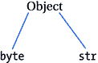

# 四、字符串和字节

Python 3 明确区分了字节和文本，而 Python 2 对文本和字节都使用了 *str* 类型。Python 2 对 *str* 类型的想法导致了这样一种场景，其中代码适用于任何一种类型的数据，或者有时不适用。另一方面，Python 3 要求您在使用文本时要小心(与二进制数据相比)。本章描述了如何在一个可以在两个 Python 版本中运行的代码库中吸收这些差异。首先，我们来看看这些区别。

## 文本和二进制数据

在 Python 2 中，任何出现在普通引号中的字符串都被认为是 type *str* ，用于表示 8 位 Unicode(文本)和二进制数据。还有一个用于表示宽字符文本(unicode 文本)的 *unicode* 类型。 *unicode* 类型允许额外的字符大小和更多的编码和解码支持。

另一方面，Python 3 对字节和 Unicode(文本)字符串进行了非常明显的区分。它带有三种字符串对象类型: *str* 、 *bytes* 和 *bytearray* 。 *str* 类型代表 unicode 文本，它可以被任何需要处理未按任何文本格式编码的原始二进制数据的程序使用，例如图像文件和打包数据。相比之下，*字节*类型表示二进制数据，基本上是 0–255 范围内的小整数序列，为了方便起见，它们被打印为字符串而不是整数。 *bytearray* 类型是 *bytes* 类型的可变变体，支持 *str* 和 *bytes* 所做的常见字符串操作，但也有许多与列表相同的就地更改操作。

Python 3 中字节和文本的这种区别意味着这两种类型是不可互换的，而在 Python 2 中，这两种类型被视为文本数据输入的单一方式，因此可以很容易地互换使用这两种类型。有了这种区别，就有了确保在处理给定类型时使用正确方法的重大责任。表 [4-1](#Tab1) 列出了*字节*和 *str* 类型的*特有的*方法。

###### 表 4-1。独特的方法

<colgroup class="calibre9"><col class="calibre10"> <col class="calibre10"></colgroup> 
| 

潜艇用热中子反应堆（submarine thermal reactor 的缩写）

 | 

字节

 |
| --- | --- |
| 编码() | 解码() |
| 十进制格式() |   |
| isnumeric() |   |
| 格式() |   |

为了友好地处理这些差异，您应该确保二进制数据在接收时立即被解码，如果文本数据需要作为二进制数据发送，则必须尽可能晚地对其进行编码。这允许您处理一种数据类型，即文本，并免除您在任何给定时间点跟踪您在代码中处理的数据类型的任何顾虑。

###### 注意

Python 3.5 为其 bytes 类型引入了另一个 __mod__ 方法。因此，字节支持格式化。

这些区别带来了一些中断，引入了字符串和字节的实现不兼容。让我们先看看 unicode 字符串文字，看看如何为这些中断提供兼容性。

如前所述，与 Python 2 相比，Python 3 在字节和文本数据上有非常明显的区别。兼容性的目标是确保两个版本的通用语法，尽管存在这些差异。

## Unicode 字符串文字

我们知道，在 Python 2 代码库中，我们将字符串标记为 unicode

```py
**Download StringAndBytes/py2Unicode.py** 

string1 = 'The Aviation Alphabet'
string2 = u'aaaàçççñññ\n'
```

我们要么用普通引号将字符串括起来，要么我们可以决定用字符 *u* 作为字符串的前缀。

以下是指定在 Python 2 和 3 中兼容的 unicode 字符串文字的几种方法:

*   带有前缀的明确标记

*   从 __future_ 导入 unicode_literals

*   使用 6 对 Unicode 数据进行分类

### 带前缀的显式标记

建议使用前缀 *u 前导*显式标记字符串文字(在字符串的前面),以将其标记为 Unicode 字符串。

```py
**Download StringAndBytes/unicode_prefix.py** 

string1 = u'The Aviation Alphabet'
string2 = u'aaaàçççñññ\n'
```

当您需要升级现有的 Python 2 代码库以支持 Python 3 时，这很有用。futurize 和 Python-modernize 工具不会自动为您做到这一点。

### 从 __future_ 导入 unicode_literals

我们还可以利用 __future__ builtin 中的 unicode_literals 模块。这使得文件或模块中的所有字符串文字都是 unicode 的。

```py
**Download StringAndBytes/unicode_unicodeliterals.py** 

from __future__ import unicode_literals
string1 = 'Panpanpan'
string2 = 'Roger'
```

为了产生效果，import 语句应该出现在模块的最顶端。如果您正在实现一个新的代码库或为一个全新的项目编写代码，这将非常有用。

### 六个用于分类 Unicode 数据

six 提供了一个 u()函数，该函数在 Python 2 和 3 中都提供了 Unicode 字符串文字。该方法接受应该是普通字符串的文本数据。

```py
**Download StringAndBytes/unicode_six.py** 

import six
string1 = six.u ('Panpanpan')
string2 = six.u ('Roger')
```

###### 注意

在 Python 3.3 中，引入了 u 前缀；所以，如果需要支持 Python 3.3 及更高版本，就不需要 u()方法了。

总之，要支持 Python 2 和 Python 3，请执行以下操作:

*   当升级现有的 Python 2 代码库时，在字符串前面显式加上 *u* 字符。

*   从 __future__ builtin 导入 unicode_literals 模块，以使文件或 unicode 模块中的所有字符串文字。

*   使用*六*中的 *u()* 方法制作 unicode 字符串。

## 字节字符串文字

在 Python 2 代码库中，我们可以将字符串文字指定为字节，如

```py
**Download StringAndBytes/py2Byte.py** 

string1 = 'The Aviation Alphabet'
```

我们用普通引号将字符串括起来。

在 Python 2 和 3 中，有两种方法可以指定兼容的字节字符串文字:

*   带有前缀的明确标记

*   使用 6 对二进制数据进行分类

### 带有前缀的明确标记

建议使用 b *前导*前缀(在字符串的前面)显式标记字符串文字，以将其标记为二进制字符串。

```py
**Download StringAndBytes/byte_prefix.py** 

string1 = b'The Aviation Alphabet'
```

### 六对二进制数据进行分类

six 提供了一个 b()函数，在 Python 2 和 Python 3 中都给出了一个字节字符串文字。该方法接受应该是普通字符串的文本数据。

```py
**Download StringAndBytes/byte_six.py** 

import six
string1 = six.b ('Panpanpan')
string2 = six.b ('Roger')
```

###### 注意

从 Python 2.6 开始，所有版本都支持 b 前缀；因此，不需要使用 b()方法*。*

总之，要支持 Python 2 和 Python 3，请执行以下操作:

*   显式地在字符串前面加上 b 字符。

*   使用 six 中的 b()方法生成 unicode 字符串。

这种变化的二分法也会影响我们访问字符串元素的方式，尤其是二进制数据。

## 迭代字节字符串

访问二进制数据的单个元素需要小心处理。虽然像切片这样的操作不需要特殊的处理，但是二进制数据的索引和循环需要更加小心的处理。

### 索引二进制数据

String 对象是字符序列，而 bytes 或 bytearray 是一个范围(0-255)内的整数序列。表示 bytes 或 bytearray 对象 y，y[0]是整数，而 y[0:1]是长度为 1 的 bytes 或 bytearray 对象。

在 Python 2 中，*字节*和 *str* 是一回事。这意味着索引将返回一个包含一项的字节片。这意味着以下 Python 代码:

```py
b'123'[1]
```

退货:

```py
b'2'
```

在 Python 3 中，理想情况下，字节是二进制数的集合。索引返回索引字节的整数值。因此，这段代码:

```py
b'123'[1]
```

退货:

```py
50
```

#### 六号去救援

six 库提供了一个返回整数的 indexbytes()函数，就像 Python 3 中一样。我们可以在现有的 Python 2 代码中使用这个函数，按照 Python 3 的意图返回一个整数。

```py
**Download StringAndBytes/bytes_indexing.py** 

import six

byte_string = b'123'
six.indexbytes(byte_string, 1).
```

这将返回整数类型的 byte_string 中索引位置 1 处的字节，这相当于 Python 3 中索引二进制数据。

### 循环二进制数据

Python 字节串只是一个字节序列。我们经常希望使用某种循环技术一次处理一个字节序列。更干净、可读性更强、速度更快的方法是使用 for 循环。

在 Python 2 中，对字节字符串的循环采用以下形式:

```py
**Download StringAndBytes/bytes_loopingpy2.py** 

byte_string ='This is a byte-string.'
for bytechar in byte_string:
        do_stuff(bytechar)
```

这通过字节串循环获得一个字节串。bytechar 表示长度为 1 的一项字节字符串，而不是整数。

在 Python 3 中，在一个字节字符串上循环以访问一个项目的字节字符将涉及一个额外的步骤，即使用从循环中返回的整数调用 bytes()。

```py
**Download StringAndBytes/bytes_loopingpy3.py** 

byte_string = b'This is a byte-string.'
for someint in byte_string:
        bytechar = bytes(someint)
        do_stuff(bytechar)
```

bytes()方法显式转换整数，结果是一个只有一项的字节字符串。这个 bytes()方法与 encode()的格式相同。它比 encode()更干净，因为它不需要我们在引号前面加上前缀 b。

从这些差异中，我们再次看到需要一种和谐的补救措施，以便循环二进制数据是无缝的。我们有两个营救方案。

*   使用 python-future 的内置模块。

*   使用 chr()和 encode()方法。

### 使用 Python-future 的内置模块

为了实现相同的字节串循环，我们将从 future 的内置模块中导入 bytes()方法。

```py
**Download StringAndBytes/bytes_loopingbuiltins.py** 

from builtins import bytes

byte_string = b'This is a byte-string.'
for someint in byte_string:
        bytechar = bytes(someint)
        do_stuff(bytechar)
```

这个 bytes()方法的工作原理与 Python 3 中的 bytes()方法相同。

### 使用 chr()和 encode()

我们还可以使用 ch()和 encode(latin-1) *将整数转换为一个字符的字节字符串。*

```py
**Download StringAndBytes/bytes_loopingch.py** 

from builtins import bytes, chr

byte_string = b'This is a byte-string.'
for someint in byte_string:
        char = chr(someint)
        bytechar = char.encode('latin-1')
        do_stuff(bytechar)
```

### 六字节迭代

six 库有一个 six.iterbytes()函数。这个函数需要一个字节。

```py
**Download StringAndBytes/bytes_sixiteration.py** 

import six

byte_string = b'This is a byte-string.'
six.iterbytes(byte_string)
```

该方法将 byte_string 中的字节作为整数返回一个迭代器。

总之，

*   使用 six.indexbytes()执行 bytearray 索引。

*   使用 chr()和 encode()遍历字节字符串。

*   您还可以使用 builtins 模块中的 bytes()方法将 Python 3 返回的整数转换为包含一项的字节字符串。

*   可以使用 six.iterbytes()迭代字节。

## 基本字符串

当我们开始关于字符串的这一章时，我提到在 Python 2 中我们有两种类型的字符串类型 *str* 和 *unicode。*Python 2 中的这些字符串类型处于一个层次结构中，它们是类型 basestring 的后代。


类型 basestring 又是 object 的后代。basestring 类型只是字符串的统一。我们可以用它来检查一个对象是类型为 *str* 还是 *unicode 的实例。*让我们来看看这段代码，了解它在 Python 2 中的作用。

```py
**Download StringAndBytes/basestring.py** 

string1 = "echo"
string2 = u "lima"
isinstance    (string1, str)      #True
isinstance    (string2, str)      #False
isinstance(string1, unicode)      #False
isinstance(string2, unicode)      #True
isinstance(string1, basestring)  #True
isinstance(string2, basestring)  #True
```

这两个字符串都属于 basestring 类型，但有自己的类型。当我们对类型为 *str、*的 string2 执行断言时，它返回 False，对于类型为 *unicode* 则返回 True。当对类型 *unicode* 上的 string1 做同样的断言时，结果为 False，对类型 *str 为 True。*

Python 3 改变了这种层次结构；相反，它将类型 *str* 和 *byte* 作为基本类型对象的后代。



工具 2to3 用 *str* 替换 *basestring* ，因为在 Python 3 中 *str* 代表 Python 2 的 *str* 和 *unicode* 类型。

在 Python 2 中，basestring 只用于测试一个字符串是类型 *str* 还是类型 *unicode 的实例。*不应该叫。通常，我们有 Python 2 代码库，其中包含进行这种测试的代码:

```py
**Download StringAndBytes/basestring_py2.py** 

string1 = "echo"
string2 = u "lima"
isinstance(string1, basestring)    #True
isinstance(string2, basestring)    #True
```

我们已经看到 Python 3 在其字符串层次结构中没有这种 basestring 类型。为了使用 Python 3 支持这些检查，我们有以下选择:

*   使用 Python-future 的 past.builtins 模块中的 basestring 类型。

*   对照 six 库中的 string_types 常量进行检查。

*   对照内置模块中的 *str* 进行检查。

### Python-future's past.builtins 模块

Python-future 有一个 basestring 类型的 past.builtins 模块。这个 basestring 类型相当于 Python 2 中的 *basestring* 和 Python 3 中的 *str* 。

```py
**Download StringAndBytes/basestring_future.py** 

from past.builtins import basestring

string1 = "echo"
string2 = u "lima"
isinstance(string1, basestring)    #True
isinstance(string2, basestring)    #True
```

### 六:string_types 常量

常数*六个*。字符串类型表示所有可能的文本数据类型，相当于 Python 2 中的*基本字符串*和 Python 3 中的*字符串**。*

```py
**Download StringAndBytes/basestring_six.py** 

import six

string1 = "echo"
string2 = u "lima"
isinstance(string1, six.string_types)
isinstance(string2, six.string_bytes)
```

我们导入六个并检查 string_types 常量而不是 basestring，但是正如前面提到的，它们是等价的。

### 检查内置模块中的 str

最后一种选择是完全重构 Python 2 代码，不再考虑将字节串作为字符串。这意味着我们显式地定义带有 u 前缀的 unicode 字符串和带有 b 前缀的字节*。*

```py
**Download StringAndBytes/basestring_builtins.py** 
from builtins import str
string1 = u "echo"
string2 = u "lima"

string3 = b "echo"
string4 = b"lima"

res1 = string3 .decode()
res2 = string4 .decode()

assert isinstance(string1, str) and isinstance(res1, str)
assert isinstance(string2, str) and isinstance(res2, str)
```

然后我们需要解码所有的字节，并检查从内置模块导入的 *str* 类型。这与 Python 3 的 *str* 模块相同。

总之，要实现兼容性，请执行以下操作:

*   对照 six.string_types 进行检查。

*   检查 Python-future 的 past.builtins 模块中的 basestring 类型。

*   耐心地重构您的 Python 2 代码，显式定义带有 u 前缀的 Unicode 字符串和带有 b 前缀的字节，并检查来自 builtins 模块的 *str* 类型。

既然我们已经探索了如何使用所有这些 Python 2 字符串类型，您一定想知道 StringIO 是如何工作的。

## 握着它

StringIO 慷慨地给了我们一个类似文件的访问字符串的方法。我们可以使用一个现有的处理文件的模块，让它在不做任何修改的情况下处理字符串。它给我们提供了处理记忆文本的便捷方式。

典型的用例可能是，如果您正在构建大型字符串，例如纯文本文档，并进行大量的字符串连接，StringIO 总是发挥神奇的作用，而不是执行一堆字符串连接。这只是其中的一个例子，还有很多例子可以让 StringIO 派上用场。

Python 2 有两个 StringIO 的实现，分别是 cStringIO 和 StringIO。前者是用 C 写的，如果性能很重要的话就用；而 StringIO 是为了可移植性而用 Python 编写的。在 Python 2 中使用这些模块就是这么简单。

```py
**Download StringAndBytes/StringIO_py2.py** 

try:
    from cStringIO import StringIO
except:
    from io import StringIO

output = StringIO()
output.write('This goes into the buffer. ')

print output.getvalue()

output.close()

input = StringIO('Inital value for read buffer')

print input.read()
```

这段代码首先为平台导入正确的 StringIO 实现。然后，我们写入缓冲区，尝试获取写入的内容，丢弃第一个缓冲区内存，初始化一个读取缓冲区，最后，从缓冲区读取。

令人沮丧的消息是，这些模块在 Python 3 中已经消失很久了，如果我们希望我们当前的 Python 2 代码在 Python 3 中无缝运行，我们必须处理这个问题。这些模块都变成了 IO 模块。我们有三种方法来处理这个问题:

*   使用可选导入来导入给定版本上所需的模块。

*   使用六个模块中的 StringIO。

*   从 Python-future 的六个模块中访问 StringIO。

### 模块的可选导入

我们可以使用可选的导入来导入给定 Python 版本上所需的模块。我已经在包导入一章中解释了可选导入。我们的 Python 2 脚本现在变成了:

```py
**Download StringAndBytes/StringIO_optionalimports.py** 

try:
    from StringIO import StringIO
except:
     from io import StringIO

output = StringIO()
output.write('This goes into the buffer. ')

print output.getvalue()

output.close()

input = StringIO('Inital value for read buffer')

print input.read()
```

它是这样工作的:当这个脚本在 Python 3 中运行时，它试图导入 try 块中的模块，但是这会抛出一个异常，因为模块已经不在了。except 块中正确的模块被导入，生活继续。在 Python 2 中，执行是正常的。

###### 注意

在 Python 2 和 Python 3 中，使用导入 IO 也不会出错。

### 六号舱的史特林乔

six 有一个 StringIO 模块，它是 StringIO 的别名。Python 2 中的 StringIO，而对于 IO。Python 3 中的 StringIO。

```py
**Download StringAndBytes/StringIO_six.py** 

import six

output = six.StringIO()
output.write('This goes into the buffer. ')

print output.getvalue()

output.close()

input = six.StringIO('Inital value for read buffer')

print input.read()
```

我们所要做的就是导入 six 并使用 six 模块中的 StringIO 方法。

### Python-future 的六个模块中的 StringIO

这个特别的选择是最有趣的，因为 Python-future 给了我们一种从 six 调用 StringIO 的方法。

```py
**Download StringAndBytes/StringIO_future.py** 

from future.utils.six import StringIO
output = StringIO()
output.write('This goes into the buffer. ')

print output.getvalue()

output.close()

input = StringIO('Inital value for read buffer')

print input.read()
```

我们从六岁到未来都在用 StringIO。

## 字节序

与 StringIO 一样，BytesIO 现在在 Python 3 中位于 IO 中，而不再像在 Python 2 中那样位于 StringIO 中。我们有以下两种选择:

*   使用 six 模块中的字节。

*   通过 Python-future 使用 six 模块中的 BytesIO。

### 来自六个模块的字节

six 有一个 BytesIO 模块，它是 StringIO 的别名。Python 2 中的 StringIO，而对于 IO。Python 3 中的 BytesIO。

```py
**Download StringAndBytes/ByteIO_six.py** 

import six

output = six.BytesIO()
output.write('This goes into the buffer. ')

print output.getvalue()

output.close()

input = six.BytesIO('Inital value for read buffer')

print input.read()
```

我们所要做的就是导入 six 并使用 six 模块中的 BytesIO 方法。

### 从六个模块到 Python-future 的字节数

Python-future 提供了一种从 six 调用 BytesIO 的方法，这是一种有趣的重用，而不是无用的重新工程。

```py
**Download StringAndBytes/ByteIO_future.py** 

from future.utils.six import BytesIO

output = BytesIO()
output.write('This goes into the buffer. ')

print output.getvalue()

output.close()

input = ByteIO('Inital value for read buffer')

print input.read()
```

我们从六岁到未来都在使用字节。

总之，

*   使用 six 模块中的 BytesIO 方法。

*   在 Python-future 中使用相同的 BytesIO。

## 摘要

我们研究了如何为字符串提供兼容性。我们讨论了字符串方面，比如基本字符串、字节字符串、文本字符串以及 StringIO 和 ByteIO。每一节末尾的摘要都是很好的备忘单。在我们退出本章之前，我有一个任务可以让你更好地理解本章中的概念。

###### 任务:Pfp-主

今天你的导师阿里从 project pfp 里挖出了一个很老的方法——master。它位于 fields.py 源文件中的 pfp 目录下。Ali 说他想移植一些 ByteIO 操作，以便脚本同时支持 Python 2 和 3。和往常一样，如果可能的话，使用 Python-future 和 six 的解决方案准备一个提交。这个脚本包含一个方法。

```py
**Download StringAndBytes/pfp-master_task.py** 

from cStringIO import StringIO

def _pfp__pack_data(self):
        """Pack the nested field
        """
        if self._pfp__pack_type is None:
                return

        tmp_stream = BytesIO()
        self._._pfp__build(bitwrap.BitwrappedStream(tmp_stream))
        raw_data = tmp_stream.getvalue()

        unpack_func = self._pfp__packer
        unpack_args = []
        if self._pfp__packer is not None:
                npack_func = self._pfp__packer
                unpack_args = [true(), raw_data]
        elif self._pfp__pack is not None:
                unpack_func = self._pfp__pack
                unpack_args = [raw_data]

        # does not need to be converted to a char array
        If not isinstance(unpack_func, functions.NativeFunction):
                io_stream = bitwrap.BitwrappedStream(BytesIO(raw_data))
                unpack_args[-1] = Array(len(raw_data), Char, io_stream)

        res = unpack_func.call(unpack_args, *self._pfp__pack_func_call_info, no_cast=True)
        if isinstance(res, Array):
                res = res._pfp__build()

        io_stream = BytesIO(res)
        tmp_stream = bitwrap.BitwrappedStream(io_stream)

        self._pfp__no_unpack = True
        self._pfp__parse(tmp_stream)
        self._pfp__no_unpack = False
```

如果您尝试过，那么您可以检查合并了什么。

使用六

让我们导入 6 并调用 ByteIO 方法。

```py
**Download StringAndBytes/pfp-master_task_six.py** 

import six

def _pfp__pack_data(self):
        """Pack the nested field
        """
        if self._pfp__pack_type is None:
                return

        tmp_stream = six.BytesIO()
        self._._pfp__build(bitwrap.BitwrappedStream(tmp_stream))
        raw_data = tmp_stream.getvalue()

        unpack_func = self._pfp__packer
        unpack_args = []
        if self._pfp__packer is not None:
                npack_func = self._pfp__packer
                unpack_args = [true(), raw_data]
        elif self._pfp__pack is not None:
                unpack_func = self._pfp__pack
                unpack_args = [raw_data]

        # does not need to be converted to a char array
        If not isinstance(unpack_func, functions.NativeFunction):
                io_stream = bitwrap.BitwrappedStream(six.BytesIO(raw_data))
                unpack_args[-1] = Array(len(raw_data), Char, io_stream)

        res = unpack_func.call(unpack_args, *self._pfp__pack_func_call_info, no_cast=True)
        if isinstance(res, Array):
                res = res._pfp__build()

        io_stream = six.BytesIO(res)
        tmp_stream = bitwrap.BitwrappedStream(io_stream)

        self._pfp__no_unpack = True
        self._pfp__parse(tmp_stream)
        self._pfp__no_unpack = False
```

使用 Python-未来

让我们从 future.utils.six 导入并使用 ByteIO。

```py
**Download StringAndBytes/pfp-master_task_future.py** 

from future.utils.six import ByteIO

def _pfp__pack_data(self):
        """Pack the nested field
        """
        if self._pfp__pack_type is None:
                return

        tmp_stream = BytesIO()
        self._._pfp__build(bitwrap.BitwrappedStream(tmp_stream))
        raw_data = tmp_stream.getvalue()

        unpack_func = self._pfp__packer
        unpack_args = []
        if self._pfp__packer is not None:
                npack_func = self._pfp__packer
                unpack_args = [true(), raw_data]
        elif self._pfp__pack is not None:
                unpack_func = self._pfp__pack
                unpack_args = [raw_data]

        # does not need to be converted to a char array
        If not isinstance(unpack_func, functions.NativeFunction):
                io_stream = bitwrap.BitwrappedStream(BytesIO(raw_data))
                unpack_args[-1] = Array(len(raw_data), Char, io_stream)

        res = unpack_func.call(unpack_args, *self._pfp__pack_func_call_info, no_cast=True)
        if isinstance(res, Array):
                res = res._pfp__build()

        io_stream = BytesIO(res)
        tmp_stream = bitwrap.BitwrappedStream(io_stream)

        self._pfp__no_unpack = True
        self._pfp__parse(tmp_stream)
        self._pfp__no_unpack = False
```