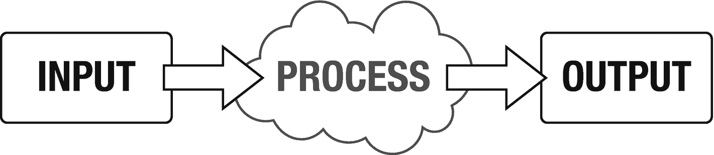

# 二、Python 是什么？

Python 是一种支持面向对象、函数式和命令式编程风格的现代编程语言。因为它的可读性和易用性，它是初学者的理想选择。所有这一切的好处是，与同等的 C/C++或 Java 程序相比，您可以用更少的代码行编写程序。

我刚才到底说了什么？让我们把最后一段分解一下，使它更易读一些。

## 编程风格

Python 适合以下风格的编程:

*   必要的

*   面向对象

*   功能的

命令式编程在很长一段时间里是编写计算机代码最常见的方式。它一步一步地描述了如何以非常线性的方式对数据进行更改。

例如，我们有以下项目:

*   茶叶袋

*   牛奶

*   杯子

*   匙

*   烧水用水壶

*   水

这些是我们在‘程序’中使用和操纵的东西；这是我们的数据。我们希望将该数据更改为不同的状态。什么州？嗯，我们想要一杯奶茶。我们如何做到这一点？我们规定了一系列操作，将这些数据转换成其他数据，如下所示:

*   将茶包放入杯中

*   将水倒入水壶

*   烧开水壶

*   当水壶烧开的时候，看电视

*   把水壶里的水倒到杯子里

*   把牛奶倒进杯子里

*   用勺子搅拌茶

*   服务

在代码中(不特别是 Python 代码)，这可以写成

```py
addTo(cup, tea_bag)
addTo(kettle, water)
boil(kettle)
while isBoiling(kettle):
    watchTV()
addTo(cup, getWaterFrom(kettle))
addTo(cup, milk)
stir(cup)
serve(cup)

```

这些是改变我们的初始数据(我们的输入)并将其转换为我们的输出的规定步骤(过程)。见图 [2-1](#Fig1) 。



图 2-1。

输入、过程、输出框图

## 面向对象

命令式程序将功能(算法)与数据分开。面向对象语言保留了数据的功能。对象在一个地方包含数据和用于操作该数据的指令。

这是有好处的；它存储的算法处理你的数据。让我们以一支铅笔为例。它有一些描述它的属性:

*   颜色

*   困难

*   笔尖尺寸

*   长度

它还具有可以应用于它的某些操作或方法:

*   写

*   抹去

*   尖锐

这些方法改变对象的状态；记住状态是由数据决定的。例如，当你用铅笔写字时，笔尖的长度会越来越短。当您削尖铅笔时，它的总长度会变短，但笔尖大小会重置为最大值。

## 功能的

函数式编程并不新鲜，最早是在 20 世纪 30 年代开发的。它源于λ微积分。函数式编程使用数学函数来执行计算。这些计算中没有数据发生变化；而是计算新值。这意味着函数式程序没有状态。

函数式编程倾向于用于递归(从自身调用同一个函数)和项目迭代。

在 Python 中，可以用下面一行代码计算斐波那契数:

```py
fib = lambda n: n if n < 2 else fib(n-1) + fib(n-2)

```

这摘自一篇关于 StackOverflow ( [`http://bit.ly/FibonacciPython`](http://bit.ly/FibonacciPython) )的讨论。

要计算一个值，程序员只需传入一个整数值:

```py
fib(5)

```

## Pygame 是什么？

Pygame 是由 Pete Shinners 作为一个简单的 DirectMedia 库(SDL)的包装器开始的。它自 2000 年以来一直由社区维护，并在 GNU 宽松通用公共许可证下发布。这意味着如果你愿意，你可以随意查看源代码。

Pygame 的创建是为了允许在不使用 C 或 C++等编程语言的情况下开发游戏。

Pygame 可以用来编写复古风格的快节奏 2D 游戏，或者现代休闲和超休闲游戏。它处理加载图像、显示精灵、播放声音等困难。，给你的。

更多关于 Pygame 的细节，请访问他们的网站: [`www.pygame.org/news`](http://www.pygame.org/news) 。

## 结论

Python 是一种现代的多参数编程语言。它可用于命令式、面向对象和函数式编程。

此外，Pygame 是一个允许你在 2D 创建快节奏动作游戏的框架。

所以，现在我们知道了 Python 的能力，是时候看看语言本身了。