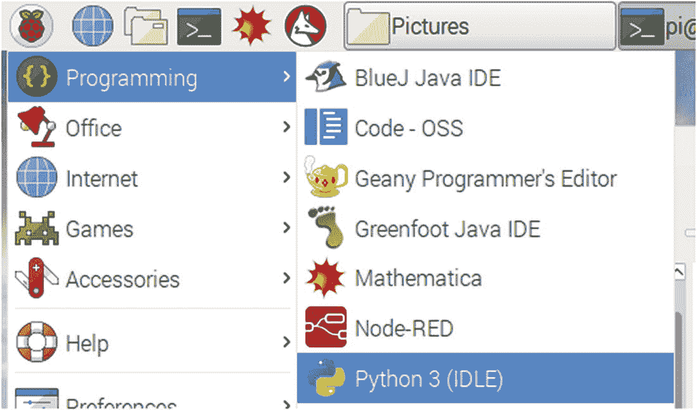
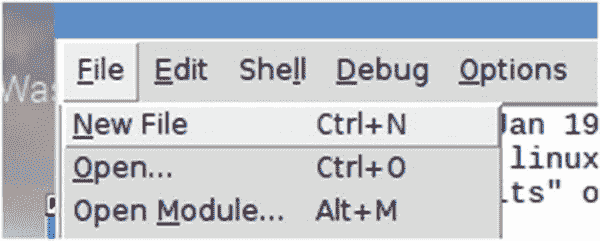
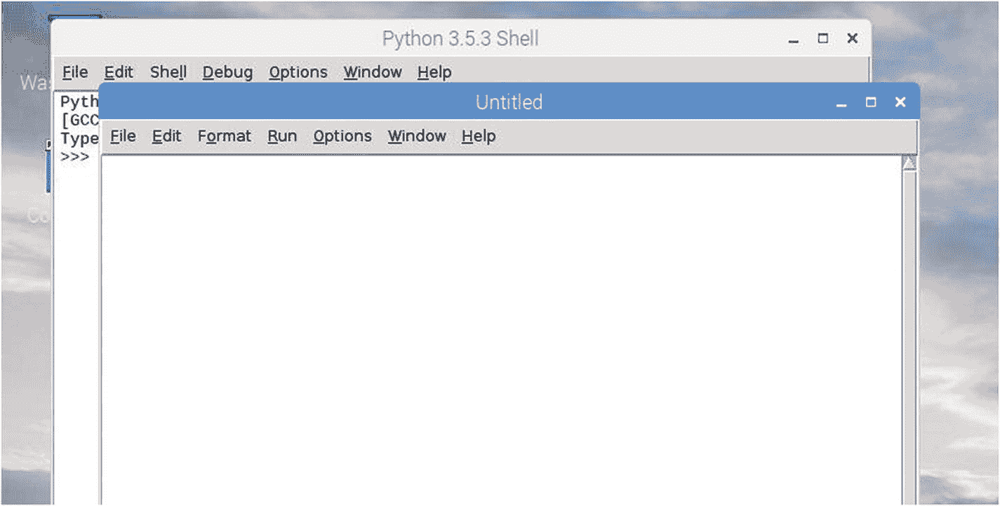
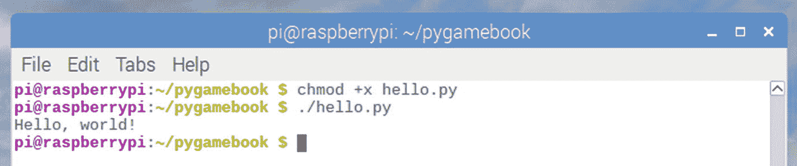
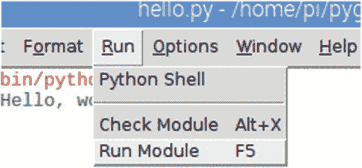
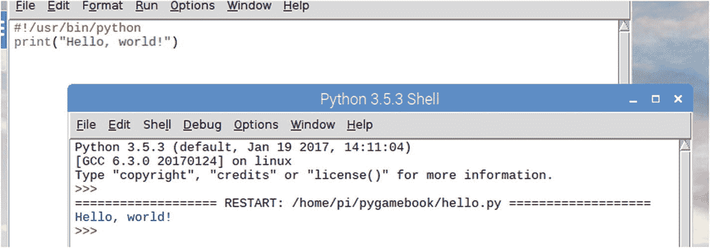

# 4.从翻译那里挣脱出来

到目前为止，我们一直使用解释器来编写代码。当输入每一行时，Python 程序会对其进行解释，处理后的行输出会显示在屏幕上。从现在起我们将使用闲置。

要退出解释器，如果您还没有这样做，请按 Ctrl+D 或输入 quit()。保持终端窗口打开！我们很快就会需要它。

## 什么是闲？

在本书中，我们将使用集成开发环境(IDE ),它包含在 Raspbian IDLE 中，是集成开发和学习环境的缩写。

## 起动怠速

要启动 IDLE，点击 Raspberry Pi logo，打开“编程”入口，点击“Python 3 (IDLE)”。Python shell 将在一个新窗口中打开，如图 [4-1](#Fig1) 所示。



图 4-1。

启动空闲 IDE

## 开始一个新文件

要创建新文件，请单击文件➤新建文件或按键盘上的 Ctrl+N(图 [4-2](#Fig2) )。



图 4-2。

从“文件”菜单中选择“新建文件”,创建一个新的编辑器窗口

这将打开一个新的文本编辑器窗口，我们可以输入组成我们程序的代码(图 [4-3](#Fig3) )。



图 4-3。

将用于编写 Python 程序的空白编辑器窗口

这是一个好主意，组织你的工作，并知道在哪里可以很容易地找到它。这里将展示一些基本的项目管理。我们将首先在当前用户的主目录(通常是/home/pi)中创建一个文件夹，并将这个新文件夹命名为“pygamebook”(不带引号)。我们会把我们写的所有程序放在这个文件夹里。我们可以为每个项目创建子文件夹，但是“pygamebook”是我们的主文件夹。

在终端窗口/命令提示符下，输入以下命令，在每一行后按 enter 键创建 pygamebook 文件夹:

```py
$ cd
$ mkdir pygamebook

```

第一行将确保在您的主目录(~)中创建“pygamebook”文件夹。第二行创建了一个名为“pygamebook”的目录(mkdir 是“make directory”的缩写)。使用此文件夹将您从本书创建的所有文件放在一起。

## 你好，世界！

大多数人编写的第一个计算机程序是显示“你好，世界！”信息的程序在屏幕上。这本书也不会有什么不同！在下面的空白窗口中键入代码，每一行都是我们进行的描述。

任何 Python 脚本文件的第一行都是 Python 解释器的位置。这被称为 hash-bang，看起来像这样:

```py
#!/usr/bin/python

```

所有程序都由外壳运行。这是计算机操作系统的一部分，控制程序对内存、磁盘驱动器等资源的访问。

因为源文件只是文本文件，所以这个 hash-bang 让 shell 知道它是一个应该由位于/usr/bin/python 的 Python 解释器运行的脚本。

现在我们已经准备好了，我们可以开始我们的程序了。在这种情况下，它非常简单；我们标准的“你好，世界！”程序:

```py
print("Hello, World!")

```

现在，编辑器窗口中应该有以下几行:

```py
#!/usr/bin/python
print("Hello, World!")

```

通过单击文件➤保存或按键盘上的 Ctrl+S 来保存文件。出现提示时，将文件另存为“hello.py”(不带引号)，保存到我们之前创建的“pygamebook”文件夹中。

### 从命令行运行

如果您想从命令提示符运行您的程序，您将不得不再执行一个步骤。默认情况下，Raspbian 不使文件可执行；我们必须这么做。在终端窗口中，移动到“pygamebook”文件夹，并使用 chmod 命令使程序可执行。以下命令序列将完成此操作:

```py
$ cd
$ cd pygamebook
$ chmod +x hello.py

```

这将可执行标志添加到文件的属性中。没有这个属性，操作系统将无法运行我们的程序。要在终端窗口中运行程序，请键入

> 每个脚本只需添加一次可执行标志属性！

```py
$ ./hello.py

```

为什么我们要加上。/'?这是因为在 Raspbian 中，可执行文件是通过一系列路径来搜索的。我们的新文件夹不是系统路径的一部分，所以我们必须告诉它它在哪里。幸运的是，这有一个捷径；当前目录名为“.”

如果您愿意，可以省略这一步；事实上，只有当您像前面显示的那样单独运行程序时，才需要 hash-bang 行。如果省略该行，Raspbian shell 不知道使用什么程序来运行脚本。在这种情况下，您可以使用

```py
$ python hello.py

```

这将启动 python 并运行“hello.py”脚本(图 [4-4](#Fig4) )。



图 4-4。

添加可执行属性并从命令行运行 hello.py

### 从内部空闲运行

要在空闲状态下运行程序，按键盘上的 F5 键或点击菜单中的运行➤运行模块(图 [4-5](#Fig5) )。



图 4-5。

通过从运行菜单中选择运行模块或按键盘上的 F5 来运行程序

当程序运行时，你应该看到“你好，世界！”显示在窗口中(图 [4-6](#Fig6) )。



图 4-6。

在空闲的内部运行 hello.py

从现在开始，在本文中，这本书将专注于为我们的 Python 程序编写脚本文件，而不是像我们在前几章那样使用 Python 解释器。

> 当创建一个将从命令行运行的 PYTHON 脚本文件时，总是将解释器的路径作为第一行放在 HASH-BANG: #！/usr/bin/python

在很大程度上，我将从示例程序中省略这一行，并假设我们将从 IDLE 中运行或用 python 启动我们的程序。

## 结论

Raspbian 包括一个名为 IDLE 的 Python IDE，可以用来编辑和运行 Python 程序，而不需要使用终端窗口。您仍然可以在终端窗口中运行使用 IDLE 创建的 Python 脚本，只需确保添加了 hash-bang 行来显示在执行该脚本时应该运行什么 Python 解释器程序。

在整篇文章中，我将交替使用脚本和程序。脚本是一个文本文件，由程序解释以执行其中的指令。程序是类似的，但它通常(但不总是)被编译成机器代码。由于这些相似性，我不打算在本文中吹毛求疵地谈论 Python 源文件是被称为程序还是脚本。