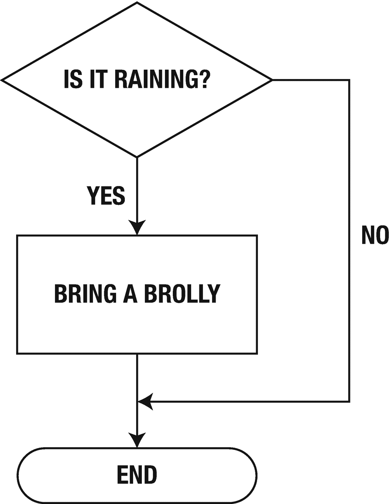
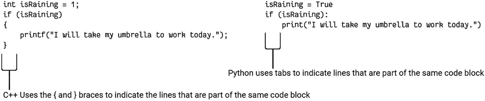
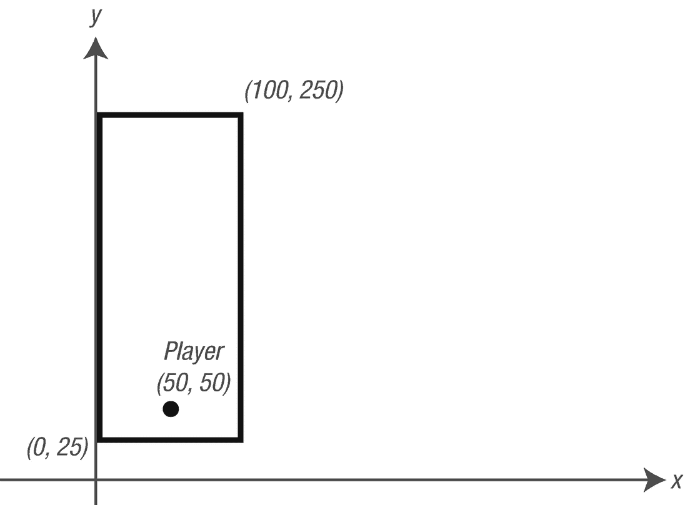

# 5.做决定

到目前为止，我们已经看到了非常线性的程序。这些程序从一个语句到下一个语句，从不偏离。它们只是一个线性购物清单。你先吃蔬菜，然后是面包，然后是蔬菜罐头，最后是猫粮。为什么呢？因为这是超市里这些商品通常出现的顺序。

但是如果你想做简单的改变呢？如果你的程序可以根据输入决定做什么，那会怎么样？

在计算机科学中，这被称为分支。本质上，决策是基于给定的数据做出的，一个代码块在另一个代码块上执行。让我们来看一下图 [5-1](#Fig1) 中的一张图。



图 5-1。

显示简单“if”语句的流程图

这被称为流程图，它显示了根据我们的输入做出的一系列决策所采用的路线(流程),我们使用这些输入来生成我们的输出。在图中，我们在问一个问题:“下雨了吗？”我们的数据要么是“是”，要么是“否”。如果问题的答案是“是”，那么我们就带一把雨伞。否则呢？我们什么都不做。

计算机在这些类型的决策方面非常出色；要么是，要么不是；开或关；真或假。

事实上，计算机只真正理解这些二元决策。

> 二进制意味着某物不是开就是关，是真还是假。

在 Python 中，我们没有“是”或“否”的值，但我们确实有类似的值；“真”和“假”这分别是“开”和“关”的值。那么我们如何用 Python 写这个呢？我们使用“如果”关键字。在英语中，我们会说，“如果下雨，我会带雨伞”；在 Python 中，写为

```py
isRaining = True
if isRaining:
    print("I will take my umbrella to work today")

```

第一行将常量“True”赋给“isRaining”True 是一个特殊的关键字(和 False 一起)，在 Python 中用来表示布尔测试的结果。

第二行检查包含在“isRaining”中的值，如果它被设置为 True(确实如此)，它将打印出文本字符串。请注意，您必须在 print 语句开始时按 tab 键。这是因为它构成了“isRaining”为真时将执行的语句列表。在这种情况下，我们有一个语句，但是如果我们有更多的语句要执行，如果' isRaining '为真，它们都将使用 tab 键缩进。

> 如果条件总是等于两个值之一:真或假。

我们也可以将“如果”语句写成

```py
if isRaining == True:

```

这要清楚得多，但不是首选的用法。当你有一个以“is”或“has”开头的变量时，假设它包含一个布尔值。永远！永远！–在使用变量之前，请检查情况是否如此。

“if”语句的格式是

```py
if condition: {statement}

```

或者

```py
if condition:     {block}

```

第二种方法是首选，因为您可能希望返回并向要在“if”块中执行的代码添加更多行。并不是说对于块中的每一行，每次都要缩进相同的量。

## 关于块的一个注记

代码块是一行或多行 Python 代码。例如，当包含在控制语句(如“if”、“for”或“while”)中时，组成块的语句必须移动一个制表符。这是因为 Python 不使用语法糖或额外的字符来表示块的开始和结束。基于 C 语言的语言使用“{”和“}”来表示块。Python 没有。例如见图[5-2](#Fig2)；这是 Python 版本旁边的 C 语言风格的等价物。



图 5-2。

展示了显式块字符和 Python 的隐式缩进方法之间的区别

我们还可以在“:”后放置多行，如下例所示:

```py
isSunny = True
if isSunny:
    print("It is sunny outside")
    print("I won't need my umbrella")

```

只有当“isSunny”为“True”时，才会执行“if”块中的两行如果我们想展示一些东西，如果训练不是真的呢？我们能这样做吗:

```py
isRaining = True
if isRaining:
    print("I will take my umbrella to work today")
    print("It is nice and sunny")

```

该程序运行时会显示以下输出:

```py
I will take my umbrella to work today.
It is nice and sunny

```

这不是理想的情况，因为我们只希望输出一行。第二行总是会被执行，因为正如我们所知，程序盲目地一步一步运行，直到程序结束，没有其他行需要处理。我们需要做的是:

```py
isRaining = True
if isRaining:
    print("I will take my umbrella to work today")
else:
    print("It is nice and sunny")

```

请注意额外的关键字“else”。这使我们能够更好地控制如果“正在训练”被证明是错误的，我们期望做什么。你不必为每个“如果”加上一个“否则”有时没有其他选择，您只想针对特定条件运行一组特定的语句。

## 相等性测试

Python 允许程序员测试相等性——在我们测试特定变量等于 true 时，我们已经看到了这一点。我们知道，如果条件必须等于两个值之一:真或假，那么我们如何测试(不)相等呢？我们使用以下范围运算符之一:

*   等于(==)

*   小于(

*   大于(>)

*   小于或等于(< =)

*   大于或等于(> =)

*   不等于(！=)

这些是数学符号。对于那些不熟悉它们的人来说，尤其是小于和大于符号，小尖点表示较小的值。不能对包含布尔值 True 或 False 的变量使用这些运算符；相等运算符只能处理数字或字符串。

下面的程序提示用户输入两个字符串值，然后检查哪个字符串更大。我们将在一秒钟内讨论更好的细节，但是这个程序确实有一些缺点。你能看出它们是什么吗？

打印“这个程序将接受两个字符串，并决定哪一个更大”

```py
first = input("First string: ")
second = input("Second string: ")
if first > second:
    tup = (first, second)
else:
    tup = (second, first)
print("%s is greater than %s" % tup)

```

第一行显示一条消息，指示程序将做什么。接下来的两行提示用户输入两个单独的字符串值，并将它们放在“第一”和“第二”变量中。“if”语句的条件是

```py
if first > second:

```

这将检查第一个字符串是否大于第二个字符串。如果是，则创建一个称为“tup”的元组，并存储第一个和第二个元组。注意顺序；第一是在第二之前。我们将在后面详细讨论元组，但现在让我们假设它们是一个或多个值的集合。

如果第二个字符串大于第一个字符串，那么也创建 tup 变量，但是顺序相反；“第二个”出现在“第一个”之前

键入前面的程序并运行它。在表 [5-1](#Tab1) 中输入数值。

表 5-1。

两个字符串程序的值

<colgroup><col class="tcol1 align-left"> <col class="tcol2 align-left"> <col class="tcol3 align-left"></colgroup> 
| 

程序运行次数

 | 

第一

 | 

第二

 |
| --- | --- | --- |
| **1** | 小写 a | 大写 A |
| **2** | 美国汽车协会 | 打鼾声 |
| **3** | nine | One hundred |

你对结果有什么注意？你料到了吗？

我们这个小例子的问题是，除非‘first’绝对大于‘second’，否则执行‘else’块。我们可以通过将程序改为

```py
print("This program will take two strings and decide which one is greater")
tup = None
first = input("First string: ")
second = input("Second string: ")
if first > second:
    tup = (first, second)
elif second > first:
    tup = (second, first)
if tup != None:
    print("%s is greater than %s" % tup)
else:
    print("The strings were equal")

```

关键字“None”用于初始为“tup”赋值无意味着没有给变量赋值。我们仍然希望有一个名为' tup '的变量，并在以后给它赋值。因此，在这种情况下，我们最初将“tup”设置为等于“None ”,因为在程序的逻辑中可能根本不会设置它。如果我们不设置它，那么试图访问它将导致“未定义”错误。

> 如果你看到一个“name 'variable name' not defined”的错误，这通常意味着你在使用它之前没有给它赋值，或者你拼错了变量名！

更改前面的程序，在第二个“if”中使用等号(==)您需要更改“打印”声明的文本吗？如果是，你会把它们换成什么？

比文本相等更常见的是数字相等。数字相等测试用于碰撞检测，决定玩家或敌人是否死亡，还有多少燃料，等等。

比方说，我们想要检查玩家的角色是否在屏幕上的某个边界内。这包括检查玩家的 x 和 y 坐标。我们可以使用布尔逻辑在一个语句中组合我们的条件。

在这个例子中，我们测试玩家的 x 和 y 坐标，以确定他们是否在一个矩形区域内，该区域宽 100 个单位，高 225 个单位，位置在(0，25)处，如图 [5-3](#Fig3) 所示:



图 5-3。

玩家在矩形区域内的位置

从图中我们可以清楚地看到，玩家在矩形内。我们如何让计算机检查玩家是否在矩形内，并做出相应的响应？这是在 2D 空间——二维空间；玩家位置的水平和垂直分量，即他们的 x 和 y 坐标。最简单的方法是把它分成两个独立的 1D 检查，然后把两个检查的结果结合起来。在英语中:

如果玩家的 x 坐标介于 0 和 100 之间，y 坐标介于 25 和 250 之间，则他们在该区域内。

在代码中，这看起来像

```py
x = 50
y = 50
if x >= 0 and x <= 100 and y >= 25 and y <= 250:
    print("Player is inside the area. Sound the alarm!")
else:
    print("Player is outside the area. Do nothing")

```

## 使用布尔逻辑

正如我们在前一章中看到的，计算机使用布尔逻辑:任何问题，只要它能得出正确或错误的答案。下列布尔关键字可用于使 If 条件更复杂:

*   和

*   或者

*   不

### 和

只有当两个条件都为真时，if 语句中的 And 才等于 true:

```py
isRaining = True
isSunny = True
if isRaining and isSunny:
    print("Sun showers")

```

在游戏的上下文中，你可能有一个条件来测试玩家是否有一把钥匙，他或她撞上了一扇门，然后打开了门:

```py
if playerHasKey and playerHitDoor:
    OpenTheDoor()
    RemoveKeyFromInventory()

```

OpenTheDoor()和 RemoveKeyFromInventory()这两个方法是程序员做的；它们不是 Python 的一部分。我们将在后面的章节中学习如何创建用户自定义函数。

在布尔逻辑中，真值表用于显示运算的结果(“与”、“或”、“非”)。通常，这显示了称为“A”和“B”的两个输入的值和一个结果。

表 [5-2](#Tab2) 中所示的‘和’的真值表如下。

表 5-2。

和“真值表”

<colgroup><col class="tcol1 align-left"> <col class="tcol2 align-left"> <col class="tcol3 align-left"></colgroup> 
| 

A

 | 

B

 | 

结果

 |
| --- | --- | --- |
| **假** | 错误的 | 错误的 |
| **假** | 真实的 | 错误的 |
| **真** | 错误的 | 错误的 |
| **真** | 真实的 | 真实的 |

这说明对于' and '，只有当' A '和' B '都为真时，' A '和' B '的组合结果才能为真。

### 或者

或者在“if”语句中，如果两个条件中的一个为真，则“if”将等于“true ”:

```py
isRaining = True
isSunny = False
if isRaining or isSunny:
    print("Some kind of weather out there")
else:
    print("No weather! How unusual for this time of year")

```

“或”的真值表如表 [5-3](#Tab3) 所示:

表 5-3。

或“真值表”

<colgroup><col class="tcol1 align-left"> <col class="tcol2 align-left"> <col class="tcol3 align-left"></colgroup> 
| 

A

 | 

B

 | 

结果

 |
| --- | --- | --- |
| **假** | 错误的 | 错误的 |
| **假** | 真实的 | 真实的 |
| **真** | 错误的 | 真实的 |
| **真** | 真实的 | 真实的 |

这说明只有当' A '和' B '都为假时' or '才为假。

### 不

Not 用来否定一个条件:把它从真变为假，反之亦然。这是一元运算符，仅在一种情况下有效:

```py
isRaining = True
isSunny = False
if isRaining and not isSunny:
    print("It's raining and not sunny")
else:
    print("Sun showers")

```

“not”的真值表(表 [5-4](#Tab4) )的不同之处在于，它只有一个输入，因为它是一元运算符。因此，真值表只有“A”输入。

表 5-4。

“非”真值表

<colgroup><col class="tcol1 align-left"> <col class="tcol2 align-left"></colgroup> 
| 

A

 | 

结果

 |
| --- | --- |
| **假** | 真实的 |
| **真** | 错误的 |

您可以看到，无论输入是什么，not 关键字都会将其否定。

## 嵌套 if

当我们需要根据大量事实做出复杂的决定时，我们可以做所谓的“嵌套”这意味着将一个“if”代码块放在另一个“if”代码块中，例如:

```py
isRaining = True
isCloudy = True
if isRaining:
    print("I will take my umbrella to work today")
elif isCloudy:
    print("It looks like it will rain. I'll take my umbrella")
else:
    print("It is sunny. I'll not bother with the brolly")

```

表 [5-5](#Tab5) 中显示了这方面的真值表，以使前面的示例更加清晰。

表 5-5。

“if”块真值表

<colgroup><col class="tcol1 align-left"> <col class="tcol2 align-left"> <col class="tcol3 align-left"></colgroup> 
| 

下雨了

 | 

多云

 | 

输出

 |
| --- | --- | --- |
| **真** | 真实的 | 我今天要带伞去上班 |
| **真** | 错误的 | 我今天要带伞去上班 |
| **假** | 真实的 | 看起来要下雨了，我要带着雨伞以防万一 |
| **假** | 错误的 | 天气晴朗。我不会为这个麻烦的 |

因此，IF 语句的格式是

```py
if condition:
    Action(s)
[else:
    Action(s)]
[elif condition:
    Action(s)]

```

## 关于开关的一个注记

对于其他语言的用户，你应该注意到 Python 中没有“switch”语句。它是为语言而提出的，但最终被否决。在像 Python 这样的 OO(面向对象)语言中，“switch”可以用多态来代替(我们后面会讲到！)来电。Stack Overflow(一个很棒的网站，也是您应该收藏的网站)有一篇关于如何避开“切换”的文章

详见 [`http://stackoverflow.com/questions/126409/ways-to-eliminate-switch-in-code`](http://stackoverflow.com/questions/126409/ways-to-eliminate-switch-in-code) 。switch 关键字可以很容易地使用 ifs 实现，如下所示:

```py
character = input("Enter command (help, list): ")
if character == "help":
    print("The help screen goes here")
elif character == "list":
    print("List the items here")
else:
    print("Invalid command!")

```

## 结论

计算机非常擅长快速做出简单的决定。使用比较和范围运算符，可以确定两个值是否相等，或者它们是否在一个范围内(例如，在 1 和 10 之间)。

可以使用布尔逻辑操作符(如 And、Or、Not 和 If 关键字)来组合这些决策，以生成分支代码；如果为真，运行一些代码，如果为假，运行一些其他代码。我们将在后面的章节中看到这些小积木如何构建复杂的系统。