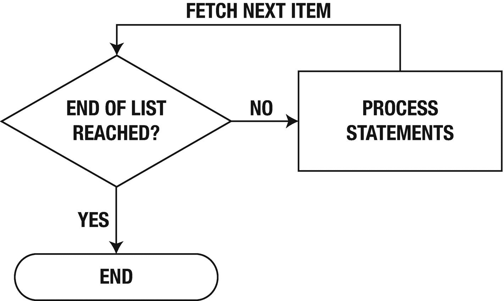
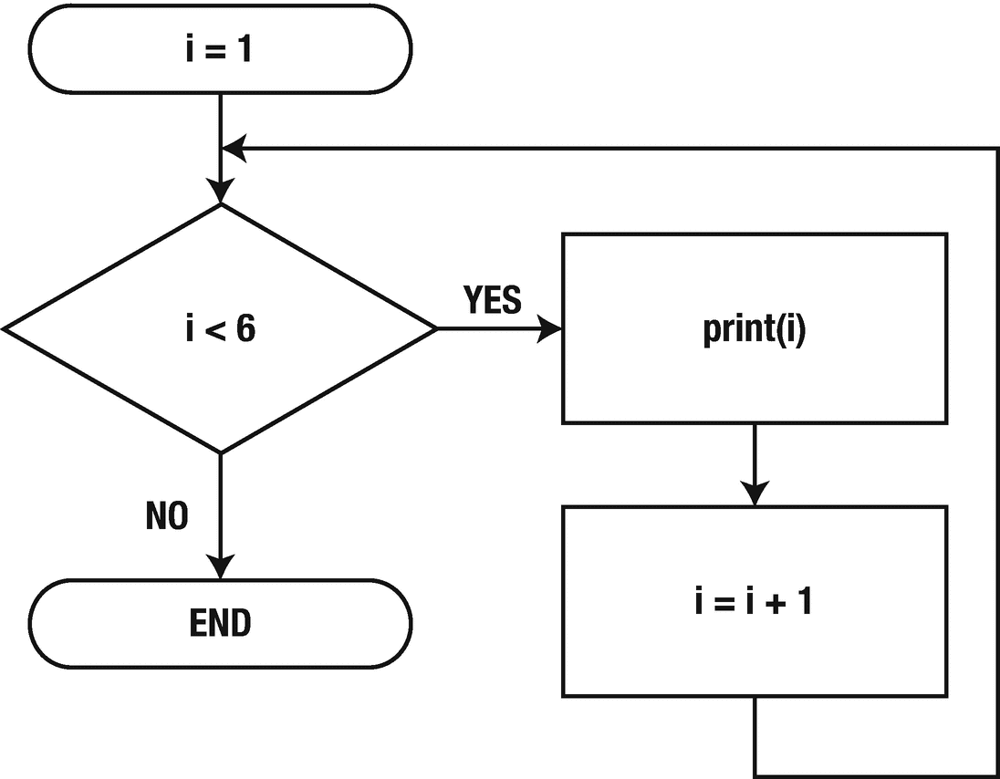
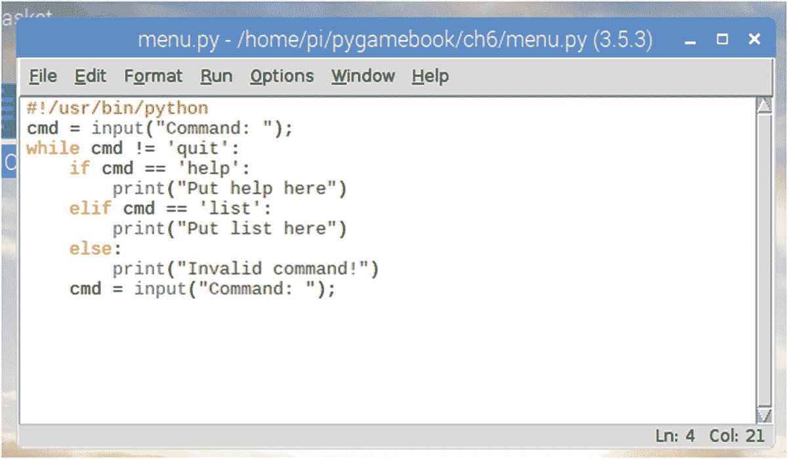

# 六、让树莓派重复

电子游戏重复这个动作，直到所有玩家的生命都消失了，或者游戏结束了。到目前为止，我们只编写了运行一系列命令然后终止的程序。通过使用某些 Python 关键字，我们可以让计算机在需要时重复一段代码，或者使用条件，或者重复设定的次数。

## for 循环

Python 中的“for 循环”接受一个列表，并对列表中的每一项执行一系列操作。这些操作包含在“:”字符后面的代码块中，并向右移动一个制表符。图 [6-1](#Fig1) 中的流程图显示了“for”循环内部发生的情况。



图 6-1。

显示 for 循环的流程图

例如，下面的程序将打印数字 1 到 5。我们稍后将讨论 range()函数的一些奇怪之处。

不要忘了脚本顶部的 hash-bang！请记住，您需要使用 hash-bang 来从命令提示符运行脚本文件。您还需要更改文件模式(chmod)并添加可执行文件标志。如果你不太记得怎么做，请参见第 4 章(“从解释器中挣脱”)。

```py
for i in range(1, 6):
    print(i)

```

这里的“I”变量有特殊的含义。它充当回路的控制。事实上，我们给任何控制流量的变量命名为控制变量。同样，这只是我给变量的一个名字。我可以叫 n 或者 j 或者 fred。控制变量往往有简短的名字。我选择这个是因为我们要遍历整数或整数，而‘I’似乎适合这个任务。

“for”循环的格式为

```py
for condition:
    Action(s)

```

其中“条件”是生成列表的任何语句。

### range()函数

range()函数由 Python 提供，因此被称为内部函数。它生成一个从起始值到 1-n 的数字列表，其中 n 是范围内的最后一个值。以下示例摘自 Python 解释器中输入的语句:

```py
>>> range(1,6)
[1, 2, 3, 4, 5]
>>> range(2,4)
[2, 3]

```

您还可以指定第三个参数。此参数指示在“for”循环的每次迭代后添加到每个数字的计数。默认值为 1(一)，这就是为什么您不需要提供它:

```py
>>> range(10, 255, 10)
[10, 20, 30, 40, 50, 60, 70, 80, 90, 100, 110, 120, 130, 140, 150, 160, 170, 180, 190, 200, 210, 220, 230, 240, 250]
>>> range (10, 0, -1)
[10, 9, 8, 7, 6, 5, 4, 3, 2, 1]

```

没错，你甚至可以用负值从一个较大的数迭代到一个较小的数。

我们将在下一章讨论列表和字典，但是我们已经知道‘for’循环遍历列表。所以，如果我们没有数字呢？如果我们有电视上角色的名字会怎么样:

```py
names = ['John', 'Anne', 'Fred', 'Beth']
for name in names:
    print(name)

```

“names”变量被赋予一个人名列表的值。“for”循环遍历每个名字，并将它们打印在屏幕上。本例中的控制变量是“名称”在循环的每次迭代中，列表中的下一个名字将被取出并处理。

## While 循环

For 循环非常适合遍历一个固定的列表，但是如果我们不知道我们有多少项呢？例如，读取文件内容或从网站获取数据。这就是“while”关键字出现的地方。

尽管无论使用哪种循环，while 循环都具有相同的格式，但是 while 循环有三种类型:

*   计算

*   哨兵

*   有条件的

### 计算

计数 while 循环基本上只是“for”关键字的替代品。当然，你可以用它来代替' for '关键字，但是它看起来不那么优雅。例如:

```py
#!/usr/bin/python
i = 1
while i < 6:
    print(i)
    i = i + 1

```

在这个例子中，我保留了 hash-bang。

在“for”循环中，控制变量包含在“for”语句中，而在“while”循环中，控制变量是在循环外定义的。程序员还必须每次手动更新所需步骤的控制变量。

> 不要忘记更新控制变量！如果你不这样做，你将会陷入一个无限循环，你将不得不使用 Ctrl + C 退出你的程序！

请注意，“while”语句的格式是

```py
while condition:
    Action(s)

```

“where 条件”是一个等同于“真”或“假”的语句:一个布尔值。这类似于“if”关键字，因为它也采用布尔条件作为其参数。该“while”循环的流程图如图 [6-2](#Fig2) 所示。



图 6-2。

示例“while”循环的流程图

从流程图中我们可以看到，只有当布尔条件为“真”时，才会执行“while”块中的语句

这意味着“while”循环的条件充当了块内各行的看门人。如果条件不成立，就不要执行里面的行。将“I”的初始化更改为 6:

```py
#!/usr/bin/python
i = 6
while i < 6:
    print(i)
    i = i + 1

```

运行脚本。会发生什么？没什么？完全没有输出。这是因为 i< 6，当 i = 6 时返回‘False’。

### 哨兵

sentinel while 循环是一种不断循环直到达到某个值的循环。

让我们回到上一章的菜单例子。我们有三个命令:列表、帮助和退出。当用户选择退出时，程序结束。

我们不知道用户在整个程序会话中会使用多少个命令，也不知道他们会使用多少次相同的命令。这是“while”循环的理想用例，因为它可用于在条件未满足时保持程序运行:

```py
cmd = input("Command: ")
while cmd != 'quit':
    if cmd == 'help':
        print("Put help here")
    elif cmd == 'list':
        print("Put list here")
    else:
        print("Invalid command!")
    cmd = input("Command: ")

```

当我们开始进入多个标签时，你必须保持正确的间距。在您的编辑器中，您应该会看到如图 [6-3](#Fig3) 所示的程序。



图 6-3。

显示缩进代码行的菜单程序

> *如果 input()函数对您不起作用，请尝试 raw_input()，因为您可能正在运行 Python 2.7*

以下是运行该程序的典型输出:

```py
Command: help
Put help here
Command: list
Put list here
Command: badcommand
Invalid command!
Command: quit

```

### 有条件的

这些是前两者的结合:计数和哨兵。这是当你想计数一个序列，但你不知道你是什么序列计数。假设你想写一个程序把所有的数字加起来达到某个值。您可能会这样写:

```py
#!/usr/bin/python
topNum = int(input("Sum of numbers to? "))
count = 0
while topNum > 0:
    count += topNum
    topNum = topNum - 1
print("Sum of all numbers is %d" % count)

```

要获得数字形式的输入，我们必须使用 int()函数将其转换为整数。

> *input()函数总是返回一个字符串！*

## 结论

计算机程序中经常使用循环。根据具体情况，您必须选择使用哪个循环:for 循环还是 while 循环。

如果范围是已知的，或者您想要循环遍历一个值列表(就像本章中的名称示例)，那么 for 循环非常适合您。

while 循环有三种类型:计数循环、标记循环和条件循环。计数版本很少使用，大多数人更喜欢“for”循环。然而，sentinel 和 conditional 被广泛用于保持循环，直到满足某个未知条件(通常在编写时)。