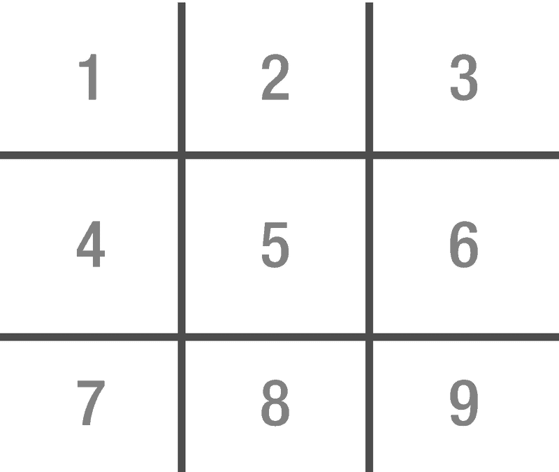
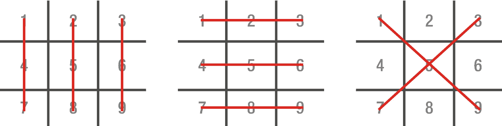

# 八、放在一起：井字棋

在我们开始研究 PyGame 以及如何创建街机风格的游戏之前，我们应该后退一步，将前几章中介绍的内容放入一个简单的 ASCII 控制台游戏井字棋中，这是一个两人游戏。

## 规则

对于那些以前没有玩过井字棋的人，这里有一些规则:

在一张纸上画一个有九个正方形的棋盘，人们通常是这样做的，先画两条互相平行的水平线，再画两条互相平行但垂直于水平线的垂直线，就像一个散列符号:#(图 [8-1](#Fig1) )。



图 8-1。

井字棋棋盘的布局

第一个玩家使用令牌 X，第二个玩家使用令牌 o。每个玩家从 X 开始，将他们的令牌放在棋盘上的一个盒子中。一个槽只能接受一个令牌！如图 [8-2](#Fig2) 所示，当玩家放置的代币形成水平、垂直或对角线三排时，游戏结束。



图 8-2。

井字棋棋盘上的获胜线

## 程序布局

该计划将分为以下几个部分:

*   变量声明和初始化–创建变量并赋予它们初始值

*   显示一条欢迎信息——简单的文字说明程序做什么以及如何玩游戏

*   展示公告板

*   听取玩家的意见——他们希望将棋子放在棋盘的什么位置

*   测试输入的有效性——不断询问玩家输入是否无效

*   将棋子放在棋盘上

*   检查玩家是否赢了——如果他们赢了，显示祝贺信息并结束游戏

*   如果还有空位可以放代币，跳回“显示牌”

我们将在这个程序中使用 while 循环和 if 语句。while 循环将在仍然有空位或者没有人赢的时候继续玩游戏。if 语句将用于确定我们是否有赢家或者玩家的输入是否有效。

## 变量

我们需要一个地方来存储程序运行时的数据，并需要决定我们将使用什么变量。表 [8-1](#Tab1) 显示了哪些变量将被声明以及它们将如何被使用。

表 8-1。

声明的变量

<colgroup><col class="tcol1 align-left"> <col class="tcol2 align-left"></colgroup> 
| 

可变的

 | 

使用

 |
| --- | --- |
| **板** | 最初包含字符 1 到 9，这将包含 X 和 O 标记在棋盘上的位置，并将用于在屏幕上绘制棋盘 |
| 电流令牌 | 当前令牌，即当前玩家，将包含 X 或 O |
| **winnington** | 其中一个控制变量将用于在所有玩家回合中保持游戏进行。当设置为 X 或 O 时，程序将退出 |
| **槽已填充** | 有可能没有人会赢得这场比赛——这有时被称为猫的游戏。在这种情况下，我们需要一种方法来退出 while 循环，如果没有其他移动可以进行的话。每当玩家移动一步，第二个控制变量就会增加 |

## 游戏

在“pygamebook”文件夹中创建一个名为“ch8”的新文件夹。在“ch8”中创建一个名为“tictactoe.py”的新文件在 Python IDLE 中打开文件，并输入以下文本。我将在进行过程中添加注释来帮助说明代码在做什么。

```py
#!/usr/bin/python
#
# Program:      Tic-Tac-Toe Example
# Author:       Sloan Kelly

```

头信息很有用，因为它可以快速识别这个程序或脚本的目的是什么，以及是谁写的。

```py
board = ['1', '2', '3', '4', '5', '6', '7', '8', '9']

currentToken = 'X'
winningToken = "
slotsFilled = 0

```

程序使用的变量被声明和初始化。“board”变量包含一个字符串数组，其中包含符号 1–9。这些将用于两个原因:向玩家显示他们可以输入什么数字，其次允许程序确定某个位置是否被令牌占用。

将“currentToken”设置为第一个玩家的令牌，将“winningToken”和“slotsFilled”分别设置为空字符串(“”)和 0 的默认值。后两个变量用于控制游戏，并确保游戏在没有赢家和棋盘上有空位的情况下继续进行。

```py
print ("Tic-Tac-Toe by Sloan Kelly")
print ("Match three lines vertically, horizontally or diagonally")
print ("X goes first, then O")

```

将向玩家显示关于该程序的一些基本信息。它让他们知道程序的名字，谁创作的，以及一些基本的游戏规则。

```py
while winningToken == " and slotsFilled < 9:

```

一个 sentinel while 循环的例子，当没有人赢并且有空位要填补时，保持游戏运行。

```py
    print("\n")
    print("%s|%s|%s" % (board[0], board[1], board[2]))
    print("-+-+-")
    print("%s|%s|%s" % (board[3], board[4], board[5]))
    print("-+-+-")
    print("%s|%s|%s" % (board[6], board[7], board[8]))

```

向玩家展示棋盘。随着时间的推移，棋盘上的条目将填满 X 和 O，但在第一轮，棋盘包含符号 1 到 9。然后，播放器将输入这个数字，我们必须将它向下转换一位，因为在 Python 中，数组索引从 0 开始，而不是从 1 开始。

此外，不要忘记你的缩进！

```py
    pos = -1
    while (pos == -1):

```

当玩家选择了一个无效的位置值时，这个 while 循环会将玩家留在循环中。

```py
        pos = int(input("\n%s's turn. Where to? : " % currentToken))
        if pos < 1 or pos > 9:
            pos = -1
            print ("Invalid choice! 1-9 only.")

```

提示玩家输入，然后通过确保输入介于 1 和 9 之间来验证它。否则，显示一条错误消息，并将“pos”变量设置回–1(无效输入)，这将使播放器保持在 while 循环中，直到它们输入正确的值。

```py
        pos = pos – 1

```

移动“位置”,使其位于“电路板”阵列的 0–8 范围内。

```py
        if board[pos] == 'X' or board[pos] == 'O':
            pos = -1
            print("That spot has already been taken by %s! Try again" % board[pos])

```

检查棋盘上位置“pos”处的数值是否被玩家获取，如果是，显示警告。

```py
    board[pos] = currentToken
    slotsFilled = slotsFilled + 1

```

否则，将索引“pos”处的板设置为当前令牌，并增加“slotsFilled”变量。请注意，这两行位于 while 循环之外，因为此时已经验证了“pos”变量。

```py
    row1 = board[0] == currentToken and board[1] == currentToken and board[2] == currentToken
    row2 = board[3] == currentToken and board[4] == currentToken and board[5] == currentToken
    row3 = board[6] == currentToken and board[7] == currentToken and board[8] == currentToken

```

为了使这个程序更整洁，我将棋盘、列和对角线检查分成了多行代码。第一组决定行的状态。

```py
    col1 = board[0] == currentToken and board[3] == currentToken and board[6] == currentToken
    col2 = board[1] == currentToken and board[4] == currentToken and board[7] == currentToken
    col3 = board[2] == currentToken and board[5] == currentToken and board[8] == currentToken

```

第二组决定列的状态。

```py
    diag1 = board[0] == currentToken and board[4] == currentToken and board[8] == currentToken
    diag2 = board[2] == currentToken and board[4] == currentToken and board[6] == currentToken

```

最后一组决定了对角线的状态。

```py
    row = row1 or row2 or row3
    col = col1 or col2 or col3
    diag = diag1 or diag2

```

这些组被组合成单个变量，以使 if 检查更容易。

```py
    if (row or col or diag):

```

如果玩家获得了一行或一列或一条对角线，他们就赢了，游戏进入结束游戏状态。

```py
        print("\n")
        print("%s|%s|%s" % (board[0], board[1], board[2]))
        print("-+-+-")
        print("%s|%s|%s" % (board[3], board[4], board[5]))
        print("-+-+-")
        print("%s|%s|%s" % (board[6], board[7], board[8]))

```

再次显示棋盘，显示获胜的玩家。

```py
        print("Congratulations %s! You won!!" % currentToken)
        winningToken = currentToken

```

显示“祝贺您！”消息并设置获胜令牌。记住——这是主(顶部)while 循环使用的标记控制变量之一。如果将其设置为非空值，也就是说，我们将其设置为“currentToken”的内容，则主循环结束。

```py
    if currentToken == 'X':
        currentToken = 'O'
    else:
        currentToken = 'X'

```

如果游戏还在玩，当前的代币需要换成相反的。如果当前令牌是 X，我们交换 O，反之亦然。

```py
if slotsFilled == 9 and winningToken == ":
    print("No one won :( Better luck next time, players!")

```

我们最后的 if-check 在主循环之外，如果两个玩家都没有赢，它会显示一条消息。

## 保存并运行

保存并运行程序。如果您想从命令行运行该程序，您需要在终端中找到该文件夹，例如:

```py
$ cd ~
$ cd pygamebook
$ cd ch8

```

然后输入 chmod 命令以确保程序可以执行:

```py
$ chmod +x tictactoe.py

```

最后，输入以下内容来运行游戏:

```py
$ ./tictactoe.py

```

如果你想在空闲状态下运行游戏，按键盘上的 F5 键或者从“运行”菜单中选择“运行模块”。

## 结论

这不是我们的第一个 2D 图形游戏，但它是我们的第一个游戏！用 Python 写游戏的温和介绍。我们使用了本书前几章提到的结构来构建这个游戏。尽管它们很简单，但是这些小的构建块——变量、循环、条件和容器——可以帮助我们构建复杂的软件。