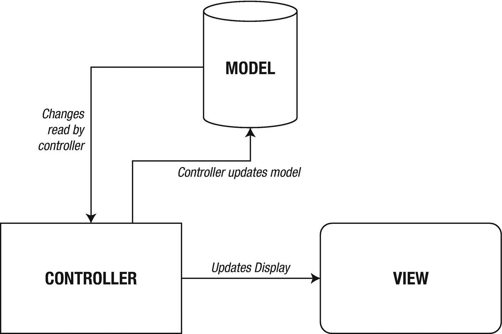
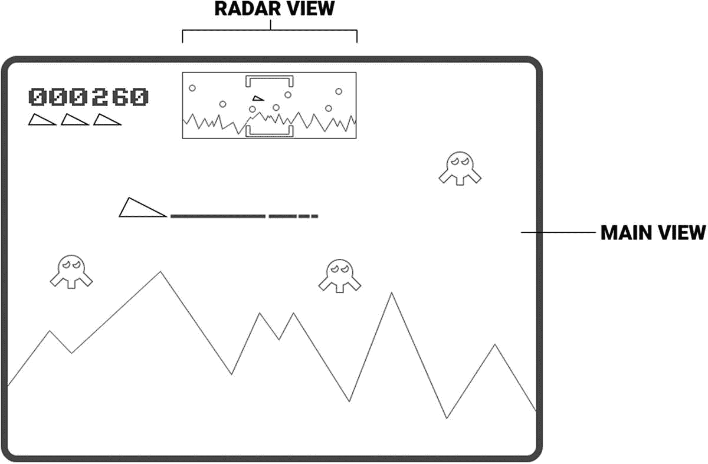

# 10.设计你的游戏

在我们开始编写我们的第一个游戏之前，我们要放慢一点速度。在开始任何一个项目之前，无论是家装、旅行、还是游戏编程，你都应该坐下来规划你想做的事情。

这通常包括采取以下步骤:

*   初始概念

*   功能规格

*   程序设计

*   编码

*   试验

*   循环

编码和测试往往携手并进；您将编写一些代码，然后测试它。从编程的角度来看，这个循环占据了你游戏开发的大部分时间。

## 初始概念

我们关心的是这里的小项目。在一个更正式的环境中，这需要走到所有相关人员(利益相关者)身边，问他们想从计划中得到什么。在我们的例子中，它是一个电子游戏。你可能会和两三个人一起工作，这部分倾向于集思广益:

*   这将是一场赛车游戏

*   带着武器

*   还有陷阱！可以设陷阱！

这些想法都存储在一个文档中；Google Drive 非常适合这类工作，因为它支持开发人员之间的协作。

一旦你有了所有的需求，你就可以进入功能需求了。请记住，所有这些文档都是“活的”,因为它们可以更改。后续文档/代码需要更新以反映这些更改。

最初的概念不断重复，这些文档形成了所谓的*游戏设计文档*或简称为 GDD。

### 样机研究

作为游戏设计初始阶段的一部分，你作为程序员可能会被要求做一些概念验证工作，称为*原型*。这是一个粗略的草图，描述了游戏的一部分可能会是什么样子。例如，在一个纸牌游戏中，它可能是一个弃牌动画，或者是玩家死亡时的屏幕抖动。

作为原型阶段的一部分而生成的代码并不一定会进入生产阶段，也就是说，你的游戏已经上市了。这种情况有时确实会发生，所以你应该总是尽量让你的代码尽可能的干净。

## 功能规格

功能规范采用第一阶段收集的需求，并删除所有围绕它们的“无用”语言。他们制定了一系列关于游戏的规则，这些规则可以传递给编码人员去执行。例如，我们的赛车游戏可以发射武器，所以我们的功能需求可能有一个“武器”部分和一个“陷阱”部分。

这些部分进一步将需求分解成程序员可以带走和实现的小块。连同*程序设计*，这形成了所谓的*技术设计文件* (TDD)。请参见以下示例。

### 武器发射

*玩家可以用机枪向另一个玩家* *开火。每个玩家每秒钟最多可以射击十次。如果按住枪超过 2 秒，枪就会开始发热。这将启动一个“热量”计数器。在热量计数器达到 5 秒后，枪将不再可以发射。一旦玩家释放了开火按钮，这把枪还需要 5 秒钟才能冷却下来。*

这也给了艺术家一些线索；他们必须展示枪加热和冷却的过程。

## 程序设计

如您所见，每一步都提炼了前一步的信息。程序设计采用功能需求，并将它们分解成程序员可以理解和实现的模块。程序员可能会采用这些模块，并进一步细化它们，制作更小的模块。

这里的总体目标是把一个问题分解，直到你有很多更小、更容易解决的问题。这听起来违反直觉:把一个问题变成多个问题。“泡杯茶”是一个更大的问题。这可以被分解成这样的小问题:

*   煮水壶

*   将茶包放入杯中

*   将开水放入杯中

*   等等。等等。

从编程的角度来看，你将需求(游戏的基本思想)通过功能需求(玩家如何与游戏互动——游戏环境如何工作)带到程序设计中，在程序设计中，你将这些功能需求和从编程的角度来看需要做的事情联系起来。

现在，这有点像一个第 22 条军规。你需要有经验，知道如何获取这些需求，并弄清楚它们如何成为程序设计。

## 编码

有时被称为过程中有趣的部分。这是想法开始形成的地方；添加图形，并使用代码在屏幕上移动它们。如果你还记得开篇的章节，程序本身是这样的:

> *程序=数据+算法*

这些数据被称为模型，由算法处理。用于操纵数据的算法称为控制器，用于将项目呈现给显示器的算法是视图的一部分。在面向对象编程中，这种模式被称为模型视图控制器。

在本文中，我们将尽量保持模型、视图和控制器的分离，通过控制器进行通信，如图 [10-1](#Fig1) 所示。

图 10-1。

模型视图控制器模式

MVC 模式非常符合我们的“程序=数据+算法”的说法。控制器用代码操纵模型。反过来，视图读取模型的数据来呈现数据。可以有许多不同的视图来呈现不同的数据。

在图 [10-2](#Fig2) 所示的例子中，我们看到游戏的主视图以全尺寸显示玩家和敌人的精灵，而较小的雷达视图显示玩家和敌人相对于整个游戏世界的大致位置。有一个主视图控制器和一个雷达视图控制器。两个控制器都可以访问相同的数据:玩家和敌人的位置。

图 10-2。

一种显示游戏中相同物体的两种视图的游戏

在主游戏区显示外星人和玩家飞船的代码与它们在雷达视图中的显示方式不同。尽管他们有一个共同点:他们使用相同的数据。玩家的模型也用于显示(在另一个视图中)剩余的生命数、分数以及玩家可以使用的智能炸弹的数量。

虽然在面向对象的章节之前，我们不会被正式介绍 MVC 模式，但是我们将在前面的游戏(砖块和蛇)中使用这种模式的精神。

## 测试

在开发过程中，您将不断地测试您的代码。每次你实现(编码)一个新的例程，你都要测试它，以确保它做了你为它设定的事情。你怎么知道它在做正确的事情？您拥有“需求”和“功能规范”形式的文档，以确保您期望发生的事情确实发生了。

从编程的角度来看，在编码级别有两种类型的测试:白盒测试和黑盒测试。前者依次检查每个代码步骤，并确保它们按预期执行。后者将每个独立的模块视为一个黑盒。数据进去，结果出来。

## 循环

正如我之前提到的，游戏设计文档或 GDD 是一个“活的”文档。开发游戏的人会在游戏被创造出来的时候继续玩游戏。这叫做*玩*测试。这种游戏测试会导致反馈循环，可能会改变原始设计的元素。你会发现让游戏变得‘有趣’的东西变得很累。通过在开发过程中迭代设计，你可以做一些小的改变来改善你最初的概念。

## 结论

尽管您不会总是为需求和功能规范创建单独的文档，但是将您的想法写下来仍然是一个好主意。即使它只是提醒你什么需要编程，什么艺术需要创造。如果你仍然不热衷于写作，不要忘记一幅画胜过千言万语。

说到编程，在你把手放在键盘上开始打字之前要三思。你必须问自己的最大问题是，“我希望用我将要写的代码实现什么？”在你开始打字之前，你应该对你的目标有一个清晰的想法。

最后，但肯定不是最不重要的，是测试。永远，永远，永远测试你的代码！