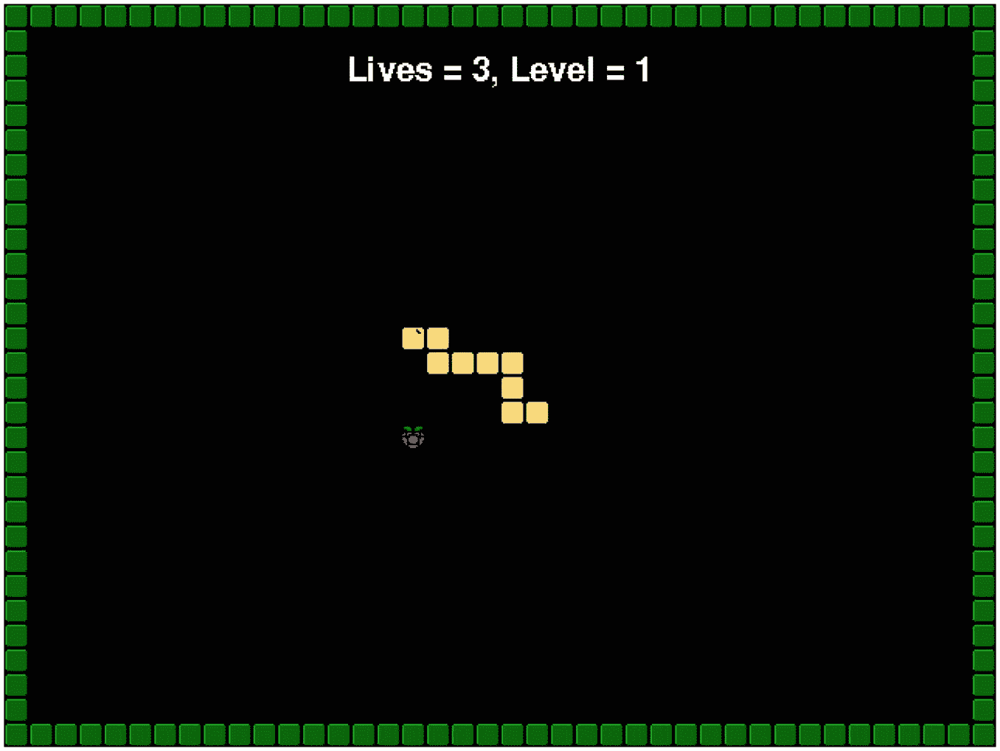
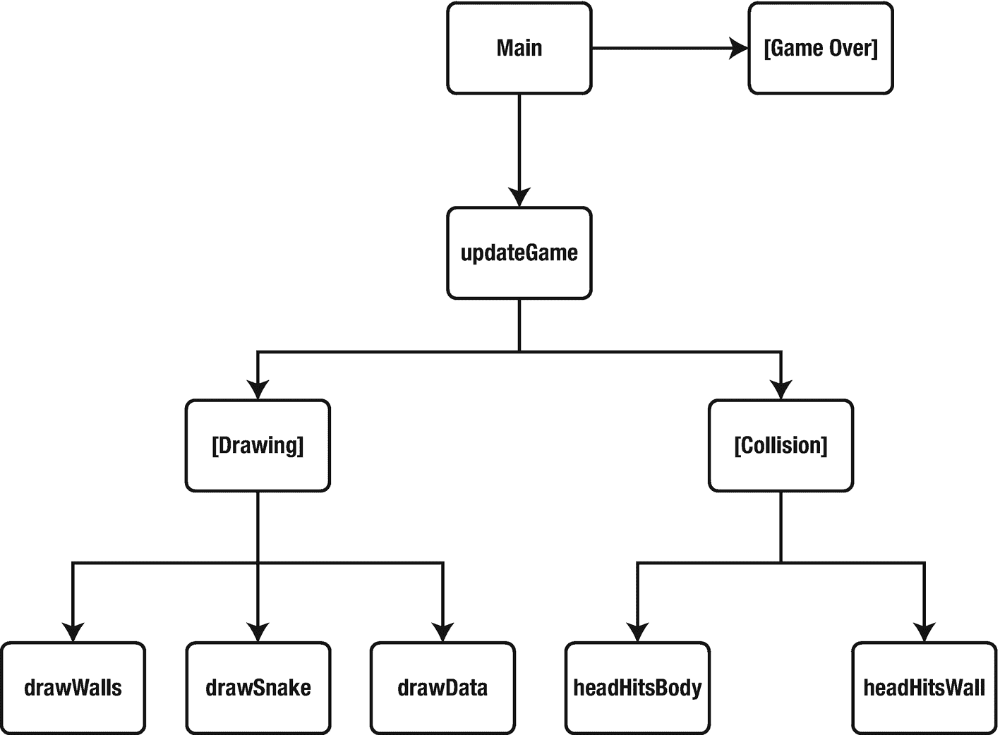
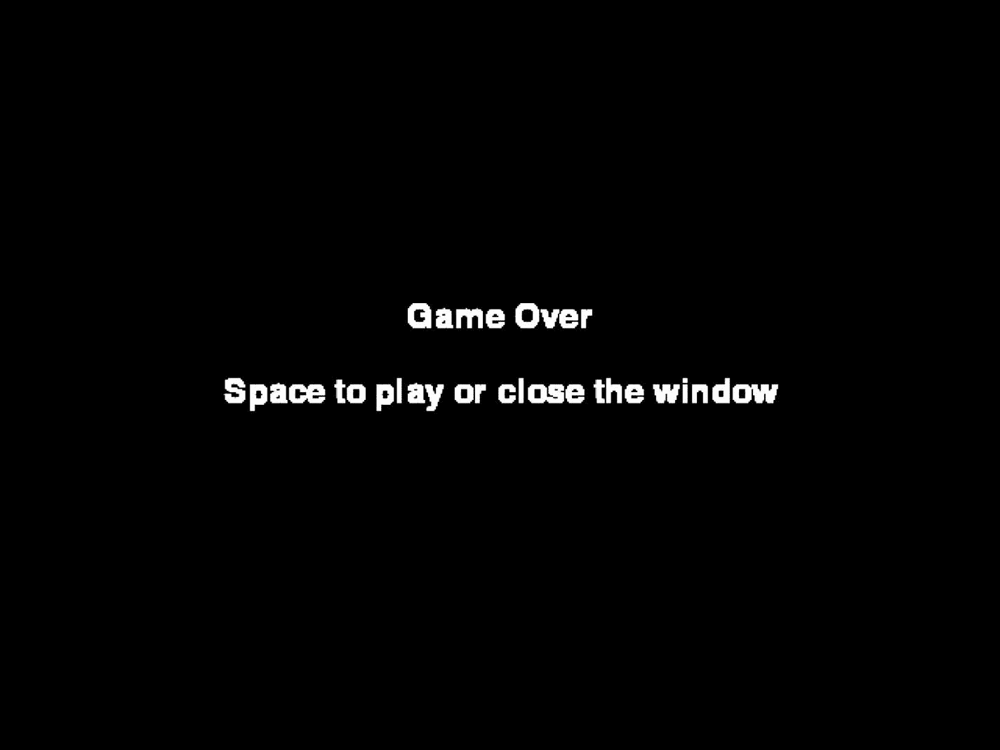
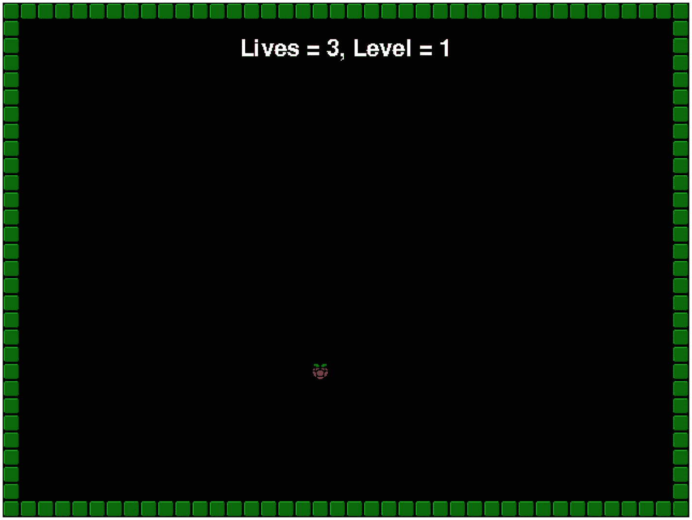
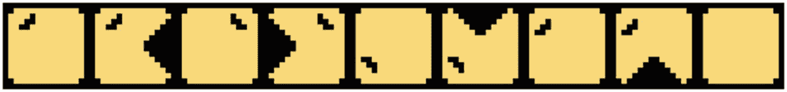
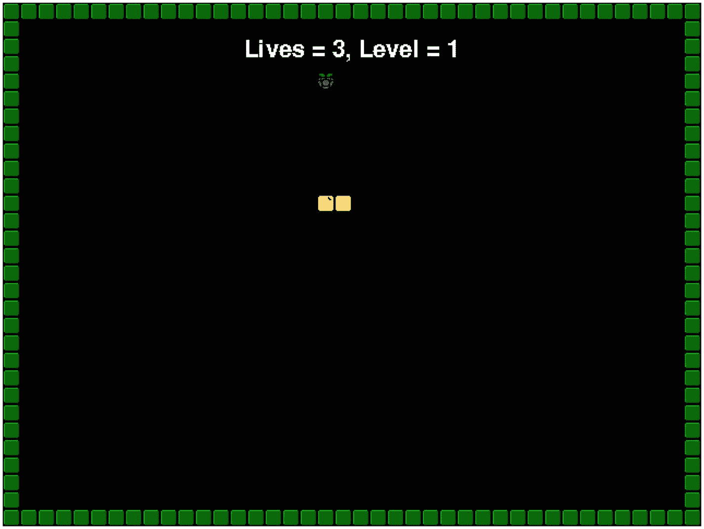

# 16.游戏项目:蛇

在我们的第二个游戏中，我们将重现经典的贪吃蛇游戏。自 20 世纪 70 年代末以来，蛇就一直伴随着我们，如果你有一部诺基亚手机，你可能会在上面安装这个游戏的一个版本。你控制一条蛇，用光标键在屏幕上移动。你必须吃水果才能成长。你不允许触摸外墙或你自己。我说过你在成长吗？见图 [16-1](#Fig1) 。



图 16-1

贪吃蛇游戏

在这个游戏中，我们将介绍以下内容:

*   类声明和实例(对象)

*   文件输入

*   基于单元的碰撞检测

*   功能

*   源文本

Snake 将使用比面向对象技术更多的函数。在很大程度上，我们在这个游戏中的对象只是为了组织的目的。将很少涉及 OOP。

## 功能

定义了以下功能:

*   drawData

*   drawegameover

*   拉丝克

*   牵引墙

*   headHitBody

*   headHitWall

*   loadImages

*   loadMapFile

*   爱情生活

*   定位浆果

*   更新游戏

我们可以创建一个结构图，如图 [16-2](#Fig2) 所示，展示这些功能如何协同工作。



图 16-2

贪吃蛇游戏的结构图

结构图显示了每个功能如何相互作用。括号中的函数不存在。它们被用来像函数一样组合在一起。例如，绘制游戏调用三个独立的函数。我们可以创建另一个功能——我将让读者自行判断。

## 蛇形框架

贪吃蛇游戏的基本轮廓如下所示。在您的工作文件夹中创建一个新文件，并将其命名为 snake.py。别忘了一边走一边看评论，帮助你理解发生了什么，作者(我)的意图是什么。我们将在本节的后面用代码替换一些注释。在键入代码时，您应该在自己的清单中包含注释。这将作为后面代码的占位符。

```py
#!/usr/bin/python
import pygame, os, sys
import random
from pygame.locals import *

```

现在你应该知道我们节目的熟悉开头了！hash-bang 和导入我们需要的 Python 模块:PyGame、OS 和 System。我们也为这个游戏引入了一个新的:随机。这个模块将允许我们为浆果生成一个随机的起始位置。

```py
pygame.init()
fpsClock = pygame.time.Clock()
surface = pygame.display.set_mode((640, 480))
font = pygame.font.Font(None, 32)

```

为了缩小地图尺寸，游戏将在 640×480 的窗口中运行。我们马上会看到如何创建地图。我们的 PyGame 初始化和保持每秒 30 帧的时钟也在这里初始化。我们的最后一点初始化是使用默认字体创建一个字体对象，大小为 32 像素。

```py
class Position:
    def __init__(self, x, y):
        self.x = x
        self.y = y

```

我们的第一堂课很简单:位置。这保持了地图块的位置。我们使用构造函数(在 Python 中，这是 init()方法)来传递 x 和 y 坐标。

```py
class GameData:
    def __init__(self):
        self.lives = 3
        self.isDead = False
        self.blocks = []
        self.tick = 250
        self.speed = 250
        self.level = 1
        self.berrycount = 0
        self.segments = 1
        self.frame = 0

        bx = random.randint(1, 38)
        by = random.randint(1, 28)

        self.berry = Position(bx, by)
        self.blocks.append(Position(20,15))
        self.blocks.append(Position(19,15))
        self.direction = 0

```

游戏数据包含了我们需要存储的关于游戏的所有东西。这些数据的大部分是玩家的蛇。

*   生命——玩家剩余的生命数量。

*   Is dead–当蛇的头部接触到尾巴的一部分或墙壁时，设置为 true。

*   blocks–组成蛇尾的块的列表。

*   滴答——用于向下计数到下一个动画帧的累计总数。以毫秒计。

*   速度–默认的节拍速度。同样以毫秒为单位。

*   等级–当前的难度等级。

*   浆果数量——蛇在这一关吃掉的浆果数量。

*   细分市场——消费浆果时增加的细分市场数量。该值会改变每个级别。

*   帧–用于绘制蛇头的当前动画帧。这条蛇有两帧动画，与吃豆人没有什么不同。

*   方向——蛇当前行进的方向。0 是右，1 是左，2 是上，3 是下。这条蛇只能向四个方向之一移动。他们也不能逆转方向。例如，如果蛇向右移动，玩家不能向左移动。他们可以向上或向下移动，或者继续向右移动。

snake 从两个块开始，这两个块由“Position”类的两个实例表示；这意味着它有一个头部和一个尾部。每吃一颗浆果，碎片的数量就会增加。

浆果位置 bx 和 by 用于将浆果定位在游戏屏幕上的某个位置。这些存储在 GameData 类的“berry”属性中。

```py
def loseLife(gamedata):
    pass

def positionBerry(gamedata):
    pass

def loadMapFile(fileName):
    return None

def headHitBody(gamedata):
    return False

def headHitWall(map, gamedata):
    return False

def drawData(surface, gamedata):
    pass

def drawGameOver(surface):
    pass

def drawWalls(surface, img, map):
    pass

def drawSnake(surface, img, gamedata):
    pass

def updateGame(gamedata, gameTime):
    pass

def loadImages():
    return {}

```

这些都是绘制在结构图上的功能。

当我们开始实现游戏的功能时，我们会详细讨论它们。

```py
images = loadImages()
images['berry'].set_colorkey((255, 0, 255))

```

我们的图像是使用 loadImages()函数加载的。图像存储在字典中。该键是一个字符串值，给出的示例显示我们将“浆果”图像的颜色键设置为紫色(红色= 255，绿色= 0，蓝色= 255)。PyGame 不会绘制任何与提供的颜色匹配的图像像素。这意味着你的图像中可以有透明的像素。这对于窗口或复杂形状(如浆果)非常方便。

```py
snakemap = loadMapFile('map.txt')
data = GameData()
quitGame = False
isPlaying = False

```

这些局部(到主游戏循环)变量用于存储地图，创建 GameData 类的一个实例，一个确定用户是否退出游戏的控制变量，最后一个确定用户是否正在玩游戏。默认值为“False ”,因为我们希望以“游戏结束”模式开始游戏，以允许用户选择是玩游戏还是退出应用。

```py
while not quitGame:
    for event in pygame.event.get():
        if event.type == QUIT:
            pygame.quit()
            sys.exit()

```

在一个真实的游戏中，如果用户关闭了窗口，你可能不想退出游戏。或者，至少您会希望提示他们确认该操作。然而，在这个简单的游戏中，我们只是关闭游戏并退出到桌面。

```py
    if isPlaying:
        x = random.randint(1, 38)
        y = random.randint(1, 28)

```

我们的屏幕尺寸是 40 个街区长，30 个街区宽。对于 640×480 的屏幕，这意味着我们的块大小为 16×16 像素。这里产生的随机值将被用来放置玩家控制的蛇将要吃掉的浆果。

我们的随机值介于 1 和 38 之间，因为我们希望生成一个介于 1 和 38 之间的值。我们的地图将是一个构成游戏区域边界的实心块。我们将在下一节详细讨论这一点。

```py
        rrect = images['berry'].get_rect()
        rrect.left = data.berry.x * 16
        rrect.top = data.berry.y * 16

```

现在我们已经有了 x 和 y 坐标的随机值，我们将把它们分配给 berry 图像矩形的左和顶场。

坐标乘以 16，因为每个单元的大小为 16×16。

```py
# Do update stuff here

```

我们的更新程序将放在这里。这只是一个占位符注释。这种类型的评论将贯穿全书。如果您将注释视为“键入”代码的一部分，请将其包含在您自己的源代码中。我们将在课文的后面回到这一点，如果你没有它，它会导致混乱。

```py
        isPlaying = (data.lives > 0)

```

如果玩家已经没有生命了，这是一个将 isPlaying 变量设置为 false 的好方法。你可以很容易地把它改写成一个“如果”语句。你会怎么做？

```py
        if (isPlaying):

```

isPlaying 的值可能在上一行之后发生了变化。这就是我们在这里对这个变量做另一个 if 检查的原因。

```py
            surface.fill((0, 0, 0))
            # Do drawing stuff here
    else:

```

如果游戏*没有*在玩，那么它就处于“游戏结束”模式。小心这个“else ”,因为它与前面的*“if”语句成对出现。“游戏结束”模式向用户显示消息。如果他们想再次玩游戏，用户必须按键盘上的“空格”。*

```py
        keys = pygame.key.get_pressed()

        if (keys[K_SPACE]):
            isPlaying = True
            data = None
            data = GameData()

```

如果用户按空格键，我们将 isPlaying 标志设置为 true，并将数据重置为 GameData 的一个新实例。当您处理完一个对象后，将指向它的变量设置为“None”是一个很好的做法。

```py
        drawGameOver(surface)

```

“游戏结束”屏幕是通过调用 drawGameOver()函数绘制的。

```py
    pygame.display.update()
    fpsClock.tick(30)

```

我们的最后几行翻转屏幕(双缓冲显示)，将帧速率限制在每秒 30 帧的最大值。保存程序。程序现在不会运行；我们需要先加载图像和地图数据，然后才能在屏幕上看到任何内容。

## 形象

游戏需要以下图片:

*   berry.png——蛇吃的浆果

*   snake.png–一个多帧图像，包含蛇使用的所有图像

*   wall.png——蛇无法穿越的障碍

我们的图像是 16×16，除了 snake.png 是 144×16 像素。这样做的原因是我们想要的蛇的所有图像都包含在同一个文件中。见图 [16-3](#Fig3) 。


图 16-3

蛇的骨架

这些图片和本书中的所有例子一样，可以从 [`http://sloankelly.net`](http://sloankelly.net) 下载。

### 加载图像

复制或制作图像，并将它们放在与 snake.py 文件相同的目录中。找到 loadImages()函数，并将其更改为如下所示:

```py
def loadImages():
    wall = pygame.image.load('wall.png')
    raspberry = pygame.image.load('berry.png')
    snake = pygame.image.load('snake.png')

```

这些图像是单独加载的，但我们将把它们放在一个字典中，以便将所有图像放在一起。

```py
    return {'wall':wall, 'berry':raspberry, 'snake':snake}

```

下一步是创建和加载组成游戏屏幕的地图。

## 游戏地图

游戏的地图保存在一个名为 map.txt 的文本文件中。在“snake.py”所在的文件夹中创建一个名为“map.txt”的新文件。在该文件中输入以下文本:

```py
1111111111111111111111111111111111111111
1000000000000000000000000000000000000001
1000000000000000000000000000000000000001
1000000000000000000000000000000000000001
1000000000000000000000000000000000000001
1000000000000000000000000000000000000001
1000000000000000000000000000000000000001
1000000000000000000000000000000000000001
1000000000000000000000000000000000000001
1000000000000000000000000000000000000001
1000000000000000000000000000000000000001
1000000000000000000000000000000000000001
1000000000000000000000000000000000000001
1000000000000000000000000000000000000001
1000000000000000000000000000000000000001
1000000000000000000000000000000000000001
1000000000000000000000000000000000000001
1000000000000000000000000000000000000001
1000000000000000000000000000000000000001
1000000000000000000000000000000000000001
1000000000000000000000000000000000000001
1000000000000000000000000000000000000001
1000000000000000000000000000000000000001
1000000000000000000000000000000000000001
1000000000000000000000000000000000000001
1000000000000000000000000000000000000001
1000000000000000000000000000000000000001
1000000000000000000000000000000000000001
1000000000000000000000000000000000000001
1111111111111111111111111111111111111111

```

那是 30 行文本。顶线和底线是

```py
1111111111111111111111111111111111111111

```

剩下的几行是

```py
1000000000000000000000000000000000000001

```

如果你愿意，你可以尝试不同的 0 和 1 的模式。每个“0”代表一个蛇可以穿过的开放空间。每个“1”代表一堵墙，如果碰到它，蛇就会被杀死。保存该文件并打开 snake.py。找到 loadMapFile()函数并将其更改为

```py
def loadMapFile(fileName):
    f = open(fileName, 'r')
    content = f.readlines()
    f.close()
    return content

```

readlines()方法将文件中的每一行文本读入一个列表。保存“snake.py”文件。

## 绘制“游戏结束”屏幕

如果我们现在运行游戏，我们将什么也看不到，因为我们没有实现任何绘制方法。让我们从显示“游戏结束”屏幕开始。找到 drawGameOver()函数，并将其更改为

```py
def drawGameOver(surface):
    text1 = font.render("Game Over", 1, (255, 255, 255))
    text2 = font.render("Space to play or close the window", 1, (255, 255, 255))

```

Font 的 render()方法创建一个完全适合文本的 PyGame 表面。render()方法采用的参数是要显示的字符串、抗锯齿级别和颜色。

抗锯齿意味着文本不会出现锯齿状边缘。在图 [16-4](#Fig4) 中，你可以看到反走样和无走样的效果。


图 16-4

该字体的抗锯齿版本显示在图像的下半部分

图像被从中间分割开，在红线的左边显示反锯齿文本，在右边显示锯齿版本。

```py
    cx = surface.get_width() / 2
    cy = surface.get_height() / 2
    textpos1 = text1.get_rect(centerx=cx, top=cy - 48)
    textpos2 = text2.get_rect(centerx=cx, top=cy)

```

我们在这里使用命名参数，因为我们不需要为文本位置指定所有的值。这两行创建了用于在屏幕中间放置文本的矩形。

```py
    surface.blit(text1, textpos1)
    surface.blit(text2, textpos2)

```

传递给函数的表面实例的 blit()方法用于在表面上绘制文本。保存并运行游戏。当你运行游戏时，你应该会看到下面的屏幕(如图 [16-5](#Fig5) 所示):



图 16-5

游戏开始时出现的“游戏结束”屏幕

当你完成的时候关上窗户。如果你按“空格”,屏幕会变成空白，什么也不会发生，因为我们还没有添加更新或绘制屏幕的功能。现在让我们添加绘图功能。

## 画游戏

蛇的绘制、游戏区域和游戏数据(玩家的生活、分数和关卡文本)由三个函数执行:

*   牵引墙

*   拉丝克

*   drawData

在“snake.py”中，在源代码中向下滚动到这样一行

```py
# Do drawing stuff here

```

在该注释下添加以下几行。确保每行有正确数量的制表符。每行的左栏应直接从注释的' # '下开始:

```py
            drawWalls(surface, images['wall'], snakemap)
            surface.blit(images['berry'], rrect)
            drawSnake(surface, images['snake'], data)
            drawData(surface, data)

```

画浆果没有具体的例程，我们就直接调用主面的 blit()方法。我们在屏幕上画图是有顺序的。在其他图像之后绘制在屏幕上的图像将出现在顶部。所以，墙壁出现在蛇的后面，蛇出现在生命/分数显示的后面。

## 画墙壁

墙壁是在 drawWalls()函数中绘制的。在源代码中找到这个函数，并将其改为

```py
def drawWalls(surface, img, map):

```

该函数有三个参数。第一个参数是我们将在其上绘制墙块的主表面。第二个是我们将用来表示墙中一块砖的图像，最后第三个参数是地图数据。这是我们之前从文件中加载的数据。

```py
    row = 0

    for line in map:
        col = 0
        for char in line:
            if ( char == '1'):

```

对于行中的每个字符，我们都要检查它。如果字符是“1 ”,我们就放一块积木。因为我们记录了行(变量“row”)和列(变量“col”)的数量，所以计算屏幕上的位置只需要将它们分别乘以 16。为什么呢？因为我们的块图像是 16×16 像素，而我们的文件不是按像素映射的。相反，映射文件中的每个字符代表一个 16×16 的块。

这是一个从零到我们给定的最大行列数排列的字符数组。在这个游戏中，最大值是 40 块乘 30 块。对于一个 640×480 的屏幕来说，就是每块 16×16 像素。

```py
                imgRect = img.get_rect()
                imgRect.left = col * 16
                imgRect.top = row * 16
                surface.blit(img, imgRect)

```

每次绘制块时，都会更改图像矩形的左值和上值，以确保图像绘制到表面的正确位置。

```py
            col += 1
        row += 1

```

保存并运行游戏。当你按空格键开始游戏时，你会看到操场周围的墙和浆果。当你准备好了，关闭游戏，让我们开始添加生命，级别和分数显示。见图 [16-6](#Fig6) 。



图 16-6

游戏运行时显示的墙和浆果与代码到目前为止

## 绘制玩家数据

玩家需要一些关于他们表现如何的反馈。这通常是他们得分、剩余生命数量以及当前水平的指标。我们将在 drawData()函数中添加代码，以给出玩家的反馈。在代码中找到 drawData()函数，并将其更改为:

```py
def drawData(surface, gamedata):

```

该函数接受两个参数。第一个是我们将在其上绘制数据的表面。第二是实际的游戏数据本身。引入了一个新的字符串函数，称为 format。它类似于 print()方法使用的方法，但是结果可以存储在一个变量中。使用占位符代替数字和字符串的%d 和%s。第一个变量是{0}，第二个变量是{1}，依此类推:

```py
    text = "Lives = {0}, Level = {1}"
    info = text.format(gamedata.lives, gamedata.level)
    text = font.render(info, 0, (255, 255, 255))
    textpos = text.get_rect(centerx=surface.get_width()/2, top=32)
    surface.blit(text, textpos)

```

使用元组将数据注入字符串，将数据呈现为文本。这被称为字符串格式化，我们在前面的章节中看到了这种类型的代码。

此时保存程序。如果你愿意，你可以运行它。这一次，当游戏开始时，你会在屏幕上方看到玩家的生活和当前水平。

## 画蛇

画蛇比我们之前的绘图功能要复杂一点——这就是为什么我把它留在最后！我们的蛇形象(实际。png 文件)是 144 像素乘 16，这意味着它包含九个 16×16 的图像。我们需要以某种方式将它们分割成单独的图像。

在代码中找到 drawSnake()函数，并将其改为

```py
def drawSnake(surface, img, gamedata):

```

该函数接受三个参数。第一个是要在其上绘制蛇的表面。第二个是蛇的图像，最后第三个参数是 GameData 实例。这包含了我们的蛇的所有信息。具体来说，GameData 类的 blocks 属性包含一个范围为 0 的坐标列表..39 为列，0 为..一排 29 个。坐标存储为“位置”类的实例。

这些坐标是位置类的实例。blocks 属性是一个列表，随着 snake 的增长，列表中的条目数量也会增长。

```py
    first = True

```

这被设置为 true，因为绘制的第一个块是特殊的。这是蛇头。我们在这里绘制的图像依赖于

*   蛇面对的方向

*   不管它的嘴是否张开

再看图 [16-7](#Fig7) 中的蛇图像。



图 16-7

蛇图像包含蛇的头部和尾部的编码数据

子图像实际上有一个模式。最后一个单元格是正常的尾块。剩下的八块代表蛇头。它们在数组中的位置对应于蛇的方向:

*   0–右

*   1–左侧

*   2 页以上

*   3-向下

如果我们将存储在 GameData 的 direction 属性中的方向号乘以 2，就可以得到我们想要的图像的起始单元格号。蛇头也是有动画的——它会开合。我们所要做的就是添加当前帧(GameData 的 frame 属性)来获得所需的图像。

```py
    for b in gamedata.blocks:
        dest = (b.x * 16, b.y * 16, 16, 16)

```

我们循环遍历列表中蛇的所有块(位置)。目标是一个简单的计算:位置乘以单个单元格的尺寸(16×16 像素)得到屏幕坐标。

```py
        if first:
            first = False
            src = (((gamedata.direction * 2) + gamedata.frame) * 16, 0, 16, 16)

```

如果我们在列表的最前面，我们画蛇的头。请记住，我们可以通过指定一个元组来绘制图像的一部分，该元组表示子图像的起始 x 和 y 像素及其宽度和高度。

对于我们的蛇，我们的子图像的 x 坐标是使用以下公式计算的:

*((方向* 2) +动画 _ 帧)* 16*

我们的图像取自 sprite 工作表的顶部，顶部是 y 坐标为 0(零)的地方。我们的宽度和高度尺寸也固定为 16×16 像素。

```py
        else:
            src = (8 * 16, 0, 16, 16)

```

对于普通块，我们只想绘制 snake.png 文件中的最后一幅图像。这是最右边的 16×16 正方形，恰好是图像的第八帧。我们可以硬连接该值，但在这种情况下，8 * 16 会产生更具描述性的代码。

```py
        surface.blit(img, dest, src)

```

保存并运行游戏，你会看到蛇、墙和玩家数据，如图 [16-8](#Fig8) 所示。



图 16-8

蛇、浆果和墙

## 更新游戏

静态屏幕虽然有趣，但不能代替实际玩游戏！然而，我们还没有实现任何例程来获取玩家输入，检查碰撞，或者更新玩家的数据。找到以下行:

```py
# Do update stuff here

```

就在该行之后，添加以下代码:

```py
        updateGame(data, fpsClock.get_time())

```

大部分更新代码驻留在 updateGame()函数中。我们稍后会详细讨论这个问题。

```py
        crashed = headHitWall(snakemap, data) or headHitBody(data)
        if (crashed):
            loseLife(data)
            positionBerry(data)

```

我们现在测试蛇的头部是撞到了一面墙(headHitWall()函数)还是自己的身体(headHitBody()函数)。如果是这种情况，玩家失去一条生命，浆果被重新定位。

### updateGame()方法

这是游戏中最大的方法，也是最有效的方法。其目的是

*   更新蛇的头部和尾部

*   获取玩家的输入

*   查看蛇头是否击中了浆果

浏览到如下所示的代码部分:

```py
def updateGame(gamedata, gameTime):
    pass

```

将此功能更改为

```py
def updateGame(gamedata, gameTime):
    gamedata.tick -= gameTime
    head = gamedata.blocks[0]

```

游戏的每个部分都可以以不同的速度更新。例如，您可能只想每秒更新一次游戏的某些部分，而其他部分您可能想每秒更新 30 次。这可以通过读取系统时钟并确定自上次调用代码以来的毫秒数来实现。在这个方法中，我们将自上次调用以来的差异(以毫秒为单位)作为“游戏时间”传递

游戏数据的滴答随着当前游戏时间而减少。当这个计数器达到零时，我们更新蛇的头部以显示它是关闭的(如果它当前是打开的)或打开的(如果它当前是关闭的)。我们也注意到蛇头的当前位置。这总是“游戏数据”的 blocks 属性的第零个元素

```py
    if (gamedata.tick < 0):
        gamedata.tick += gamedata.speed
        gamedata.frame += 1
        gamedata.frame %= 2

```

如果 tick 属性小于零，我们就给它加上速度，重新启动计时器。然后，我们将当前帧数加 1。我们使用模计算将值固定为 0 或 1，因为我们只有两帧动画。在其他语言中，有一个“switch”或“case”语句。在 Python 中情况并非如此(抱歉)，但是使用嵌套的 if/elif 语句很容易实现。

```py
        if (gamedata.direction == 0):
            move = (1, 0)
        elif (gamedata.direction == 1):
            move = (-1, 0)
        elif (gamedata.direction == 2):
            move = (0, -1)
        else:
            move = (0, 1)

```

在蛇的游戏中，蛇总是在动；玩家只控制方向。基于玩家想要蛇移动的方向，创建适当的元组。

```py
        newpos = Position(head.x + move[0], head.y + move[1])

```

然后，这个元组用于生成和存储蛇头的新位置。

```py
        first = True
        for b in gamedata.blocks:
            temp = Position(b.x, b.y)
            b.x = newpos.x
            b.y = newpos.y
            newpos = Position(temp.x, temp.y)

```

蛇的尾巴随着头部向上移动。这当然只是一种错觉；我们实际上做的是将蛇的各段移动到前一段的位置。

### 蛇形运动

与 updateGame()函数保持一致；蛇的运动被限制在四个方向之一:左、右、上、下。玩家只能真正建议运动:蛇自己在自己的蒸汽下运动。玩家通过按键盘上的一个箭头键来选择蛇的方向。

为了获得键盘输入，我们获取当前被按下的键的列表:

```py
    keys = pygame.key.get_pressed()

```

get_pressed()方法返回一个布尔值字典。现在我们已经按下了键，我们可以测试每个箭头键，看看玩家是否按下了它。我们还必须确保他们不会试图走相反的方向。如果玩家已经向左转，他就不能向右转；如果他已经向下，他就不能向上转，等等。

```py
    if (keys[K_RIGHT] and gamedata.direction != 1):
        gamedata.direction = 0
    elif (keys[K_LEFT] and gamedata.direction != 0):
        gamedata.direction = 1
    elif(keys[K_UP] and gamedata.direction != 3):
        gamedata.direction = 2
    elif(keys[K_DOWN] and gamedata.direction != 2):
        gamedata.direction = 3

```

我们将当前方向存储在“gamedata”实例的方向字段中。

### 触摸浆果

updateGame()函数的最后一部分是处理我们对蛇头触摸浆果的反应。要继续游戏，玩家必须让蛇“吃掉”出现在游戏场上的浆果。为了“吃”浆果，玩家必须将蛇头转向浆果出现的细胞。一旦浆果被“吞噬”，一个新的浆果会被放置在屏幕上的另一个随机位置，蛇会增长一定数量的部分。分段的数量取决于玩家的级别。级别越高，添加到蛇的分段就越多。

```py
    if (head.x == gamedata.berry.x and head.y == gamedata.berry.y):
        lastIdx = len(gamedata.blocks) - 1
        for i in range(gamedata.segments):
              blockX = gamedata.blocks[lastIdx].x
            blockY = gamedata.blocks[lastIdx].y
            gamedata.blocks.append(Position(blockX, blockY))

```

如果蛇的头部和浆果在同一个细胞中，那么我们在蛇的尾部附加适当数量的片段。我们加到最后的段数取决于游戏中的等级。级别越高，添加的分段越多。这使得游戏在后面的关卡中变得更加困难，因为每吃掉一个浆果，蛇就会有更多的部分。

```py
        bx = random.randint(1, 38)
        by = random.randint(1, 28)
        gamedata.berry = Position(bx, by)
        gamedata.berrycount += 1

```

接下来，我们生成一个新位置，并将其设置为浆果的位置。我们还增加了一个计数器，记录我们的蛇已经吃掉的浆果的数量。

如果我们的蛇吃掉了十个浆果，我们就进入下一关。这有增加蛇的速度的附加效果(增加一点额外的刺激！)，以及蛇每吃一颗浆果给玩家增加的段数。

我们将段的数量固定为 64，更新速度(毫秒)固定为 100:

```py
        if (gamedata.berrycount == 10):
            gamedata.berrycount = 0
            gamedata.speed -= 25
            gamedata.level += 1
            gamedata.segments *= 2
            if (gamedata.segments > 64):
                gamedata.segments = 64

            if (gamedata.speed < 100):
                gamedata.speed = 100

```

## 冲突检出

正如我们所看到的，这个游戏中的碰撞检测是基于每个单元而不是每个像素进行的。在某些方面，这使我们的工作更容易，因为我们需要做的就是确定一个块何时与另一个块重叠，换句话说，它们占用同一个单元。

### 助手功能

有四个函数我们还没有填充，但是没有它们我们将无法检测玩家是否撞到了墙或者蛇是否碰到了自己。我们缺少的实现是针对

*   迷失人生()

*   浆果位置()

*   headHitBody()

*   headHitWall()

#### 失去一条生命

当蛇头撞到自己的尾巴或墙壁时，玩家失去一条生命。当这种情况发生时，我们删除了所有构成蛇尾巴的当前块，并从生命数中减去 1。然后我们给蛇添加两个方块，让玩家重新开始。在代码中找到“loseLife ”,并将其更改为如下所示:

```py
def loseLife(gamedata):
    gamedata.lives -= 1
    gamedata.direction = 0

```

将生命数减一，并将方向重新设置为向右。

```py
    gamedata.blocks[:] = []

```

这一行删除列表中的所有项目。

```py
    gamedata.blocks.append(Position(20,15))
    gamedata.blocks.append(Position(19,15))

```

在默认位置向蛇添加两个新块。

#### 重新定位浆果

当玩家死了，我们必须为浆果找到一个新的位置。在代码中找到“positionBerry”函数，并将其更改为如下所示:

```py
def positionBerry(gamedata):
    bx = random.randint(1, 38)
    by = random.randint(1, 28)
    found = True

```

首先，我们在游戏中生成一个随机数。然后，我们循环遍历所有游戏块，以确保我们不会在蛇本身中随机生成一个位置:

```py
    while (found):
        found = False
        for b in gamedata.blocks:
            if (b.x == bx and b.y == by):
                found = True

```

检查浆果是否占据了与蛇块相同的位置是很容易的。我们只需要检查两个值是否相等:浆果和每个方块的 x 和 y 坐标。

```py
        if (found):
            bx = random.randint(1, 38)
            by = random.randint(1, 28)

```

如果浆果在包含方块的单元格上，则“found”设置为 True。如果发生这种情况，我们为“bx”和“by”变量分配新值，然后重试。

```py
    gamedata.berry = Position(bx, by)

```

一旦我们找到一个不包含一条蛇的块，我们就将位置分配给游戏数据的 berry 字段。

#### 测试蛇身命中

蛇的头不能“触摸”它的身体。每次我们更新蛇的时候，我们还必须检查头部是否接触到了身体。我们基于单元的碰撞检测使这变得容易。我们只需要对照组成蛇身体的其余部分的 x 和 y 坐标来检查蛇头的 x 和 y 坐标。找到“headHitBody”函数，并将其更改为如下所示:

```py
def headHitBody(gamedata):
    head = gamedata.blocks[0]

```

创建一个变量来保存对组成 snake 的块列表中第一个块的引用。这是蛇头。

```py
    for b in gamedata.blocks:

```

一次检查一个模块。

```py
        if (b != head):

```

如果块不是头部，检查头部是否与当前块在同一个单元中。

```py
            if(b.x == head.x and b.y == head.y):
                return True

```

如果头部与蛇身体中的块在同一位置，则向函数的调用方返回 True。

```py
    return False

```

否则，返回 False，向调用者表明没有冲突。

#### 测试点击量

我们需要填写的最后一个函数是测试蛇头是否撞墙。找到“headHitWall”功能，并将其更改为:

```py
def headHitWall(map, gamedata):
    row = 0
    for line in map:
        col = 0
        for char in line:
            if ( char == '1'):

```

对于行中的每个字符，我们检查它是否是一个墙字符。我们的地图文件包含 0 和 1；任何“1”代表游戏区域中的一面墙。我们的控制变量“col”和“row”是根据块的第零个元素的当前位置来检查的。这是蛇头。

```py
                if (gamedata.blocks[0].x == col and gamedata.blocks[0].y == row):
                    return True
            col += 1
        row += 1
    return False

```

## 结论

保存游戏并运行它。你应该可以开始玩蛇了。如果你有任何错误，对照书中的文本检查代码，确保你没有调换任何字母。记住空白很重要:那些“制表符”需要在正确的位置！作为最后一种选择，从 [`http://sloankelly.net`](http://sloankelly.net) 下载代码，然后对照那里的代码检查你的代码。

作为一个练习，改变生活/水平指标，以显示收集浆果的数量。如果每个浆果值 5 分，移动到另一个级别会给玩家额外的 100 分呢？你需要在游戏数据中加入哪些变量？*