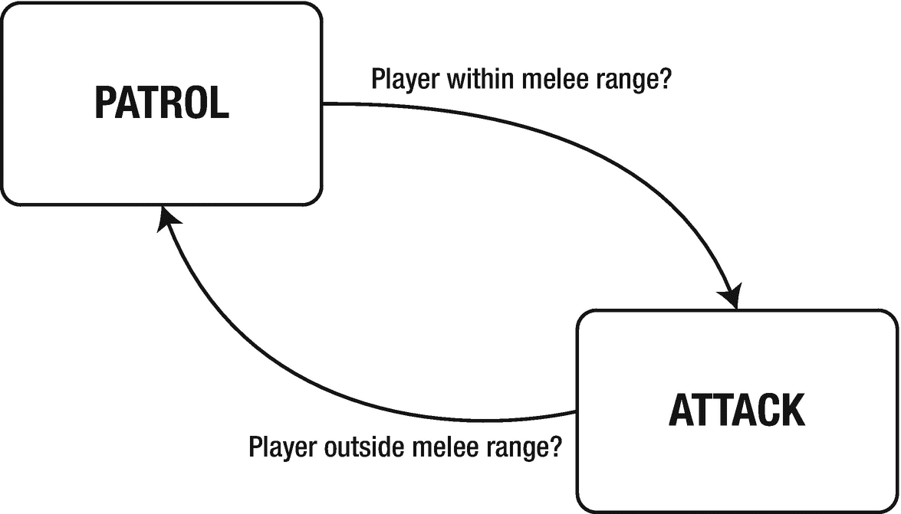
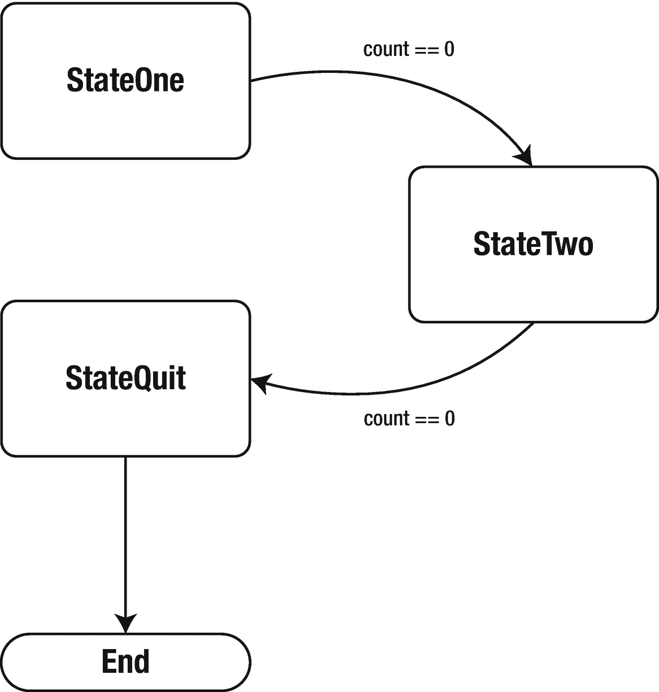
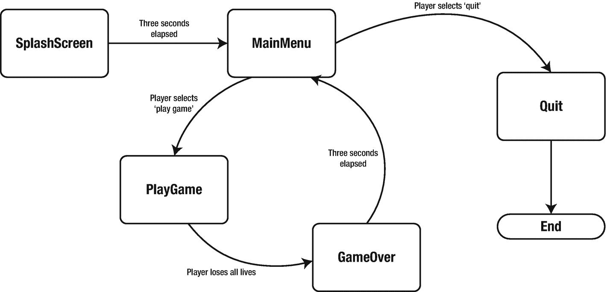

# 19.有限状态机

状态可以被描述为程序或实体的条件。有限定义了程序或实体只能由一定数量的状态来定义。实体由一系列规则控制，这些规则决定程序或实体的下一个状态是什么。

有限状态机被用在视频游戏中，用于人工智能(AI)以及菜单系统和整体游戏状态。

## 游戏状态

游戏是一种计算机程序，具有独特的、离散的、分隔的状态，例如，闪屏、玩游戏、游戏结束、主菜单和选项菜单。每个部分都可以被视为一个独立的状态。

## 菜单系统

用于控制游戏各个方面的菜单系统也可以划分成不同的状态，例如，主菜单、显示选项、控制选项和声音选项。这些都是独立的州。

## 非玩家人工智能

这是有限状态机(FSM)最常见的用法，也是大多数人将它与 FSM 联系在一起的原因。基本上，玩家遇到的每个敌人都有一个有限状态机。所谓附加，我的意思是它引用了一个成员变量形式的有限状态机，例如“self.fsm”。

敌人的 FSM 可以彼此独立运行，或者可以有一个支配性的“群体 AI”来控制整个系列的敌人。例如，你可能有十个敌人，但是“背包 AI”会控制有多少敌人被用来攻击玩家，有多少敌人会“逃跑”，等等。

在具体情况下，我们举一个警卫的例子。他可能有两种状态:巡逻和攻击。守卫停留在巡逻状态，直到一个敌人(玩家)进入范围，比如说 50 个单位，然后他们进入攻击状态。

FSM 通常用图表来描述。每个方块代表状态，每个箭头显示规则和转换方向。也就是说，如果符合该规则，箭头将指向实体应该使用的状态。见图 [19-1](#Fig1) 。



图 19-1。

有限状态机显示了一个简单的双态巡逻/攻击敌人的人工智能

如果守卫处于巡逻状态，玩家进入近战范围，守卫会移动到攻击状态。这无疑会包含攻击玩家的代码。同样，如果守卫处于攻击状态，而玩家移动到近战范围之外，它将转换回巡逻状态。

## 有限状态机示例

本例显示了一个三态 FSM。每个状态都有以下方法:

*   输入()

*   退出()

*   更新()

有一个 FSM 管理器控制程序的当前状态。这个管理器有两种方法:

*   changeState()

*   更新()

changeState()方法将实体从一种状态转换到另一种状态，update()方法调用当前状态的 update()方法。

在下一节中，我们将创建一个示例有限状态机(FSM)。在“pygamebook”中创建一个名为“ch19”的新文件夹在“ch19”文件夹中，创建一个名为“fsm.py”的新 Python 文件。完成后，您将看到以下输出:

```py
Entering State One
Hello from StateOne!
Hello from StateOne!
Hello from StateOne!
Hello from StateOne!
Hello from StateOne!
Exiting State One
Entering State Two
Hello from StateTwo!
Hello from StateTwo!
Hello from StateTwo!
Hello from StateTwo!
Hello from StateTwo!
Exiting State Two
Entering Quit
Quitting...

```

如果没有，请重新检查您的代码。

### 有限状态机管理器

有限机器管理器类定义如下。记得输入它(和剩下的代码！)明确。您可以在以后更改任何您想要的内容，但是首先要完全按照看到的内容键入代码。

FSM 管理器控制实体的当前状态。在我们的例子中，我们有三个状态。前两种状态显示“hello”消息，后者退出应用。转换规则如下图 [19-2](#Fig2) 所示。



图 19-2。

显示转换的 FSM 示例状态机

当计数达到零时，状态一转换到状态二。当计数达到零时，状态二转换到状态退出。StateQuit 调用 Python 的 exit()方法退出应用。

```py
class FsmManager:
    def __init__(self):
        self.currentState = None

```

当前状态设置为“无”。我们将在下面程序的主要部分中显式调用 changeState()方法。

```py
    def update(self):
        if (self.currentState != None):
            self.currentState.update()

```

update()方法检查我们是否有当前状态，如果有，我们调用它的 update()方法。注意，我们在这里使用 Python 的 duck 类型。

```py
    def changeState(self, newState):
        if (self.currentState != None):
            self.currentState.exit()

```

当我们改变状态时，我们希望在转换到新状态之前给当前状态一个“关闭”或“清理”的机会。exit()方法就是这样做的，或者至少由实现状态的开发人员将他们想要的代码放入 exit()方法中。

```py
        self.currentState = newState
        self.currentState.enter()

```

同样，当我们进入一个新的状态时，我们需要让状态知道这个事件已经发生。每个州的开发人员如果想要对该事件采取行动，将在 enter()方法中放置代码。

```py
class StateOne:

```

一般来说，除了屏幕上显示的文本信息，状态一和状态二之间几乎没有区别。

```py
class StateOne:
    def __init__(self, fsm):
        self.count = 5
        self.fsm = fsm
        self.nextState = None

```

我们将在程序的主要部分设置 nextState 字段。这是当前状态将转换到的下一个状态。还有更复杂的 FSM 系统，它们将规则应用于各种状态，从而形成一个更加灵活的系统。这是一个简单的例子，在每个状态中烘焙规则。

```py
    def enter(self):
        print("Entering State One")

```

enter()方法用于为当前状态设置各种值。在这个例子中，我们只是在屏幕上写一条消息。

```py
    def exit(self):
        print("Exiting State One")

```

exit()方法可以用来在当前状态转换到新状态之前清理它。在本例中，我们展示了一条简单的消息。

```py
    def update(self):
        print("Hello from StateOne!")
        self.count -= 1
        if (self.count == 0):
            fsm.changeState(self.nextState)

```

FSM 管理器调用 update()方法。在我们的例子中，我们一直倒数到零，然后转换到下一个状态。

```py
class StateTwo:
    def __init__(self, fsm):
        self.count = 5
        self.fsm = fsm
        self.nextState = None

    def enter(self):
        print("Entering State Two")

    def exit(self):
        print("Exiting State Two")

    def update(self):
        print("Hello from StateTwo!")
        self.count -= 1
        if (self.count == 0):
            fsm.changeState(self.nextState)

```

状态一和状态二没有太大区别。退出状态也很简单；它只是退出应用。

```py
class StateQuit:
    def __init__(self, fsm):
        self.fsm = fsm

    def enter(self):
        print("Entering Quit")

    def exit(self):
        print("Exiting Quit")

    def update(self):
        print("Quitting...")
        exit()

```

我们不需要更新任何变量；我们只是在这个时候退出应用。

```py
fsm = FsmManager()
stateOne = StateOne(fsm)
stateTwo = StateTwo(fsm)
stateQuit = StateQuit(fsm)

```

在这里，我们创建我们的 FSM 管理器和状态。每个状态都将 FSM 管理器作为构造函数中的一个参数。

```py
stateOne.nextState = stateTwo
stateTwo.nextState = stateQuit

```

分配状态一和状态二的下一个状态。状态一的下一个状态是状态二，状态二的下一个状态是状态退出。

```py
fsm.changeState(stateOne)

```

我们将 FSM 管理器的初始状态设置为 StateOne。

```py
while True:
    fsm.update()

```

我们的 while 循环非常简单；只需调用 FSM 管理器的 update()方法。就是这样。我们的州从那里处理程序流。

保存并运行该文件，您应该会看到我们在本章开始时显示的输出。

## 结论

任何面向对象模式的目标都是使类和主程序尽可能小。这减少了您必须为特定类阅读的代码量，使其更容易理解。每个类都应该有一个单一的目的。我们的 FSM 管理器类只有一个目的:运行当前选择的状态。每个状态也只有一个目的:执行特定的动作，直到规则改变，然后转换到一个新的状态。

FSM 非常适合人工智能(AI ),因为你可以根据已知的标准设计非常复杂的交互:用户在武器射程之内吗？我能开枪吗？玩家能看到我吗？等等。等等。

您还可以使用 FSM 来控制程序状态。让我们以一个典型的游戏应用的流程为例。见图 [19-3](#Fig3) 。



图 19-3。

游戏的有限状态机

进入状态是 SplashScreen，该屏幕在 3 秒钟后转换到主菜单。主菜单给用户两个选择:玩游戏或退出操作系统。如果用户在玩游戏时死亡，游戏将转换到游戏结束状态。它保持这种状态 3 秒钟，之后，游戏转换到主菜单状态。

我们的下一个项目“入侵者”将我们的模型-视图-控制器(MVC)和有限状态机(FSM)知识联系在一起。