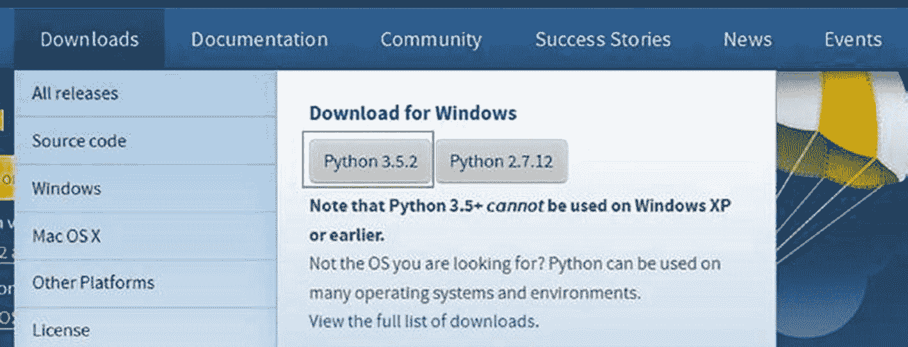
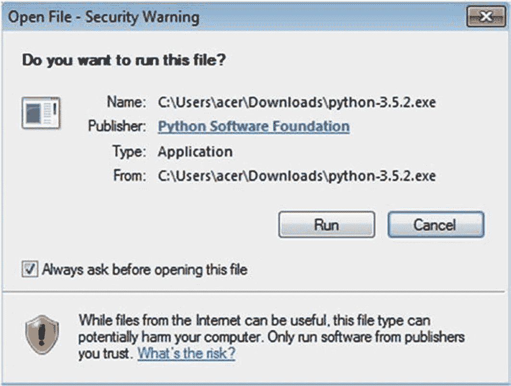
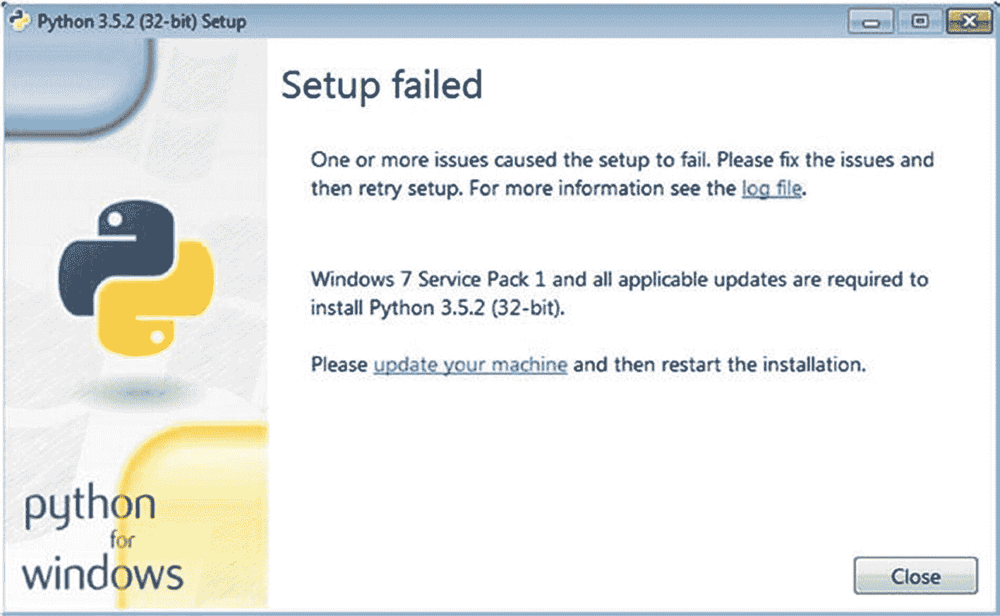
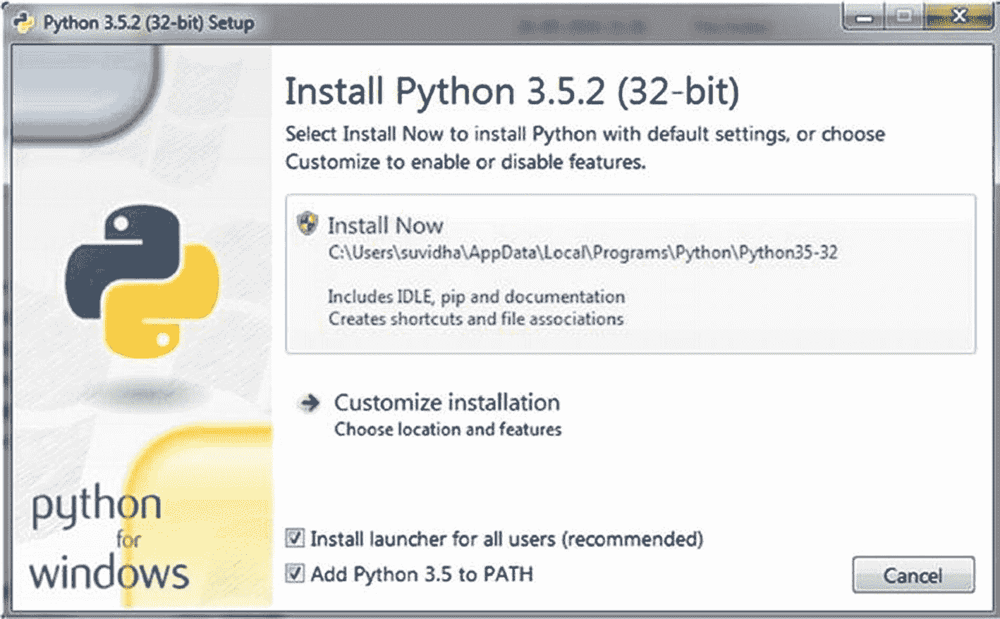
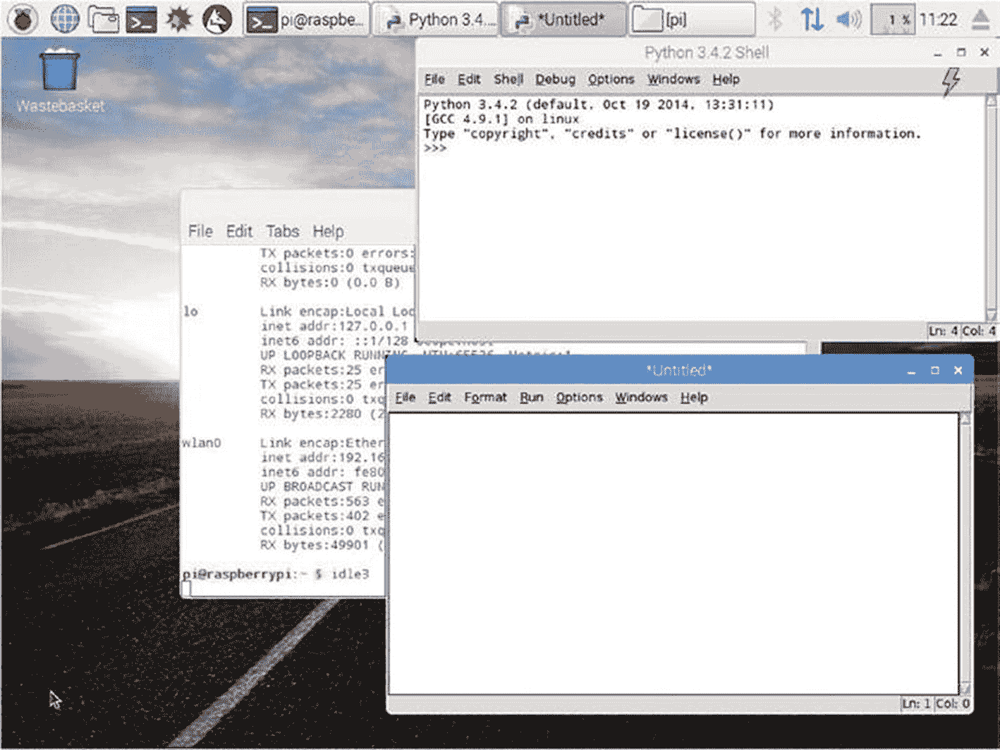
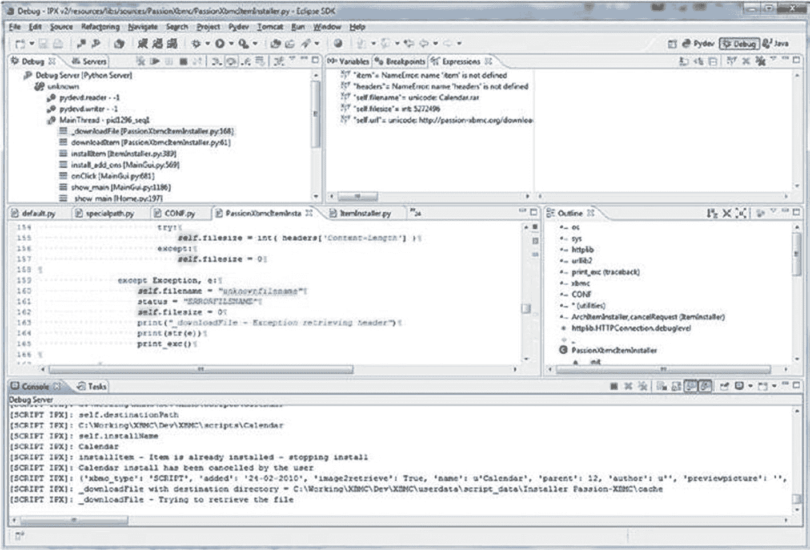
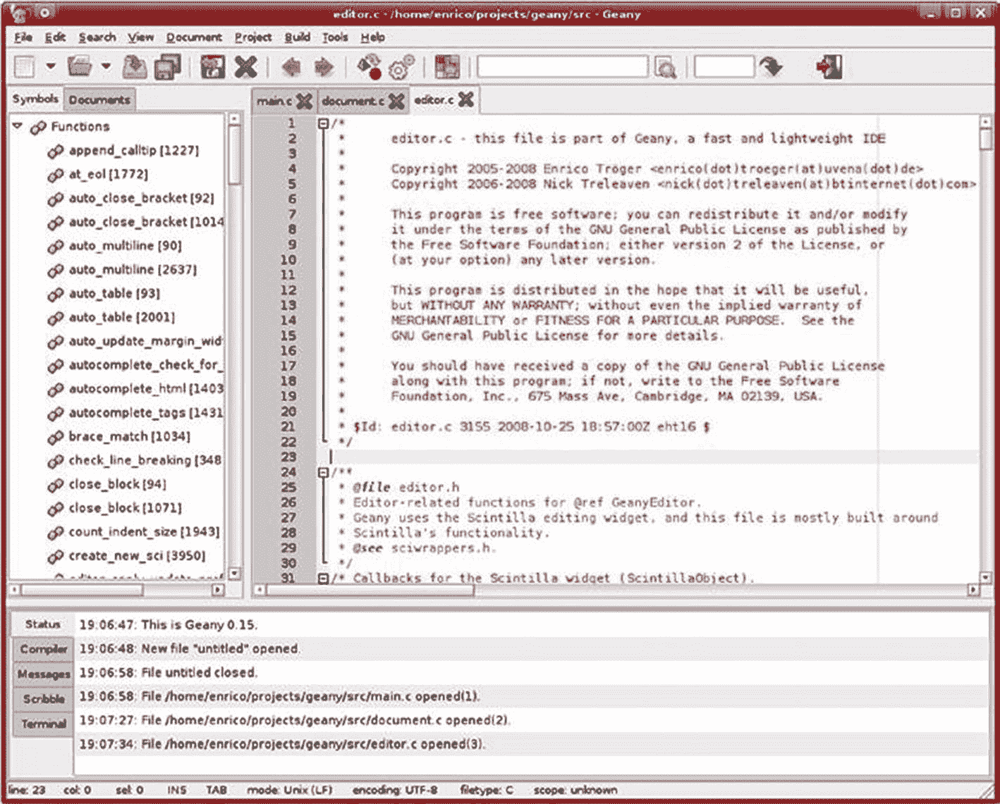

# 一、Python 简介

我希望你已经浏览了介绍部分。如果你还没有，那么我推荐你读一读，因为它会帮助你理解这本书的内容和哲学。

让我们从学习 Python 的历史和背景开始这次冒险之旅。

我个人觉得 Python 很神奇，已经被它迷住了。Python 是一种简单而强大的编程语言。当使用 Python 时，很容易关注给定问题的解决方案的实现，因为程序员不必担心编程语言的语法。

## Python 的历史

Python 诞生于 20 世纪 80 年代末。吉多·范·罗苏姆于 1989 年底在荷兰的 Centrum Wiskunde & Informatica(国家数学和计算机科学研究所)开始实施这一计划。Python 是 ABC 编程语言的继承者，ABC 编程语言本身就是受 SETL 的启发。1991 年 2 月，Van Rossum 向`alt.sources`新闻组发布了 Python 代码。Python 这个名字的灵感来自电视节目“巨蟒剧团的飞行马戏团”，因为 Van Rossum 是巨蟒剧团的忠实粉丝。

Van Rossum 是 Python 的主要作者。他在指导 Python 的发展和演变中发挥了核心作用。他拥有 Python 的终身*仁慈独裁者*的称号。2018 年，他卸任了那个角色。截至撰写本版时，他在微软工作。

Python 的核心哲学，被称为 Python 的*禅，*在 PEP-20 中有解释，可以在 [`https://www.python.org/dev/peps/pep-0020`](https://www.python.org/dev/peps/pep-0020) 找到。

它是 20 个软件原则的集合，如下所示:

*   漂亮总比难看好。

*   显性比隐性好。

*   简单比复杂好。

*   复杂总比复杂好。

*   平面比嵌套好。

*   疏比密好。

*   可读性很重要。

*   特例不足以特殊到打破规则。

*   实用性胜过纯粹性。

*   错误永远不会无声无息地过去。

*   除非明确沉默。

*   面对暧昧，拒绝猜测的诱惑。

*   应该有一种——最好只有一种——显而易见的方法来做这件事。

*   尽管这种方式一开始可能并不明显，除非你是荷兰人。

*   现在总比没有好。

*   虽然从来没有比现在更好。

*   如果实现很难解释，这是一个坏主意。

*   如果实现很容易解释，这可能是一个好主意。

*   名称空间是一个非常棒的想法——让我们多做一些吧！

## Python 的特性

下面几节讨论 Python 的一些特性，这些特性在编程社区中已经变得流行和受欢迎。

### 简单的

Python 是一种简单的极简主义语言。阅读一个写得很好的 Python 程序，会让你觉得好像在读英文文本。

### 简单易学

由于其简单和类似英语的语法，Python 对于初学者来说非常容易学习。

这就是为什么现在它作为第一编程语言被教授给学习编程入门和编程 101 课程的高中生和大学生的主要原因。新一代的程序员正在学习 Python 作为他们的第一门编程语言。

### 易于阅读

与其他高级编程语言不同，Python 没有提供太多混淆代码和使其不可读的规定。与用其他编程语言编写的代码相比，Python 代码的类似英语的结构更容易阅读。与 C 和 C++等其他高级语言相比，这使得它更容易理解和学习。

### 易于维护

由于 Python 代码易于阅读、理解和学习，任何维护代码的人都可以在相当短的时间内熟悉其代码库。我可以从维护和增强由 bash 和 Python 2 组合编写的大型遗留代码库的个人经历中证明这一点。

### 开放源码

Python 是一个开源项目。这意味着它的源代码是免费的。您可以根据自己的需要对它进行修改，并在应用中使用原始的和修改过的代码。

### 高级语言

在编写 Python 程序时，您不必管理低级别的细节，如内存管理、CPU 计时和调度过程。所有这些任务都由 Python 解释器管理。你可以直接用易于理解的、类似英语的语法写代码。

### 轻便的

Python 已经移植到很多平台。所有 Python 程序都可以在这些平台上运行，不需要任何修改，如果你足够小心避免任何系统相关的特性。您可以在 GNU/Linux、Windows、Android、FreeBSD、macOS、iOS、Solaris、OS/2、Amiga、AROS、AS/400、BeOS、OS/390、z/OS、Palm OS、QNX、VMS、Psion、Acorn、RISC OS、VxWorks、PlayStation、Sharp Zaurus、Windows CE 和 PocketPC 上使用 Python。

### 解释

Python 是一种直译语言。用 C、C++和 Java 等高级编程语言编写的程序首先被编译。这意味着它们首先被转换成中间格式。当您运行程序时，这个中间格式由链接器/加载器从辅助存储器(即硬盘)加载到内存(ram)中。所以，C、C++和 Java 有独立的编译器和连接器/加载器。Python 就不是这样了。Python 直接从源代码运行程序。您不必担心编译和链接到适当的库。这使得 Python 程序真正具有可移植性，因为您可以将程序从一台计算机复制到另一台计算机，只要在目标计算机上安装了必要的库，程序就可以正常运行。

### 面向对象

Python 支持面向对象的编程范例。在面向对象的编程语言中，程序是围绕结合数据和相关功能的对象构建的。Python 是一种非常简单但功能强大的面向对象编程语言。

### 可扩张的

Python 的一个特性就是可以从 Python 程序中调用 C 和 C++例程。如果希望应用的核心功能运行得更快，可以用 C/C++编写那部分代码，在 Python 程序中调用(C/C++程序一般比 Python 运行得快)。

### 丰富的图书馆

Python 预装了一个广泛的标准库。标准库具有现代编程语言的所有基本特征。它提供了数据库、单元测试(我们将在本书中探讨)、正则表达式、多线程、网络编程、计算机图形、图像处理、GUI 和其他工具。这是 Python 的*内置电池*理念的一部分。

除了标准库，Python 还有一个庞大且不断增长的第三方库。这些库的列表可以在 Python 包索引( [`https://pypi.org/`](https://pypi.org/) )中找到。在本书中，我们将探索一些用于测试自动化的库，如`unittest`、`nose`、`nose2`、`pytest`和`selenium`。我还参与了科学计算和计算机视觉库的工作并撰写了大量文章，比如`numpy`、`scipy`、`matplotlib`、`pillow`、`scikit-image`和 OpenCV。

### 粗野的

Python 通过其处理错误的能力来提供健壮性。遇到的错误的完整堆栈跟踪是可用的，这使得程序员的生活更容易忍受。运行时错误被称为*异常*。允许处理这些错误的特性被称为*异常处理机制*。

### 快速原型

Python 作为*快速成型工具*。正如您所读到的，Python 拥有丰富的库并且易于学习，因此许多软件架构师越来越多地使用它作为工具，在很短的时间内将他们的想法快速原型化为工作模型。

### 内存管理

在汇编语言和像 C 和 C++这样的编程语言中，内存管理是程序员的责任。这是手头任务之外的。这给程序员造成了不必要的负担。在 Python 中，Python 解释器处理内存管理。这有助于程序员避开内存问题，专注于手头的任务。

### 强大的

Python 拥有现代编程语言的一切。它用于计算机视觉、超级计算、药物发现、科学计算、模拟和生物信息学等应用。全世界数百万程序员使用 Python。许多大型组织，如 NASA、Google、SpaceX 和 Cisco，都在他们的应用和基础设施中使用 Python。

### 社区支持

我发现这是 Python 最吸引人的特性。正如您所读到的，Python 是开源的，在全世界有一个由近百万程序员组成的社区(可能更多，因为今天的高中生正在学习 Python)。这意味着互联网上有很多论坛支持遇到障碍的程序员。我提出的与 Python 相关的问题没有一个是没有答案的。

## 蟒蛇 3

Python 3 发布于 2008 年。Python 开发团队决定去掉 Python 语言的一些冗余特性，简化它的一些特性，纠正一些设计缺陷，并添加一些急需的特性。

人们决定，主要修订号是有保证的，并且最终发布的版本不会向后兼容。Python 2.x 和 3.x 应该并行共存，以便程序员社区有足够的时间将他们的代码和第三方库从 2.x 迁移到 3.x. Python 2.x 代码在许多情况下无法在 Python 3 上运行，因为 2.x 和 3.x 之间存在显著差异。

### Python 2 和 Python 3 的区别

以下是 Python 2 和 Python 3 之间最显著的区别。让我们简单地看一下它们:

*   `print()`功能

    这可能是 Python 2 和 Python 3 之间最显著的区别。Python 2 的`print`语句在 Python 3 中被替换为`print()`函数。

*   整数除法

    在 Python 3 中，为了数学正确性，整数除法的性质已经改变。在 Python 2 中，两个整数操作数相除的结果是一个整数。但是，在 Python 3 中，它是一个浮点值。

*   省略`xrange()`

    在 Python 2 中，为了创建可迭代对象，使用了`xrange()`函数。在 Python 3 中，`range()`的实现很像`xrange()`。因此，不再需要单独的`xrange()`。在 Python 3 中使用`xrange()`会引发一个`nameError`。

*   引发异常

    在 Python 3 中，必须将异常参数(如果有的话)括在括号中，而在 Python 2 中，这是可选的。

*   处理异常

    在 Python 3 中，在处理异常时，需要在参数前使用`as`关键字来处理参数。在 Python 2 中，不需要。

*   新样式类别

    Python 2 支持旧的和新的样式类，而 Python 3 只支持新的样式类。默认情况下，Python 3 中创建的所有类都使用新的样式类。

*   Python 3 的新特性

    The following new features of Python 3 have not been backported to Python 2:
    1.  默认情况下，字符串是 Unicode 的

    2.  清除 Unicode/字节分隔

    3.  异常链接

    4.  函数注释

    5.  仅关键字参数的语法

    6.  扩展元组解包

    7.  非局部变量声明

从这个列表中，你会经常在本书的代码示例中使用到`print()`、新型类和异常。

### 为什么使用 Python 3

从前面的列表中，您将会在本书的代码示例中频繁使用新型类和异常。

Python 的 wiki 页面( [`https://wiki.python.org/moin/Python2orPython3`](https://wiki.python.org/moin/Python2orPython3) )是这样说的:

> *对于任何新的开发都强烈推荐 Python 3。*

新一代程序员将 Python 3 作为他们的第一门编程语言。当他们熟悉 Python 编程的概念和哲学时，他们会逐渐了解 Python 2，这样他们也可以使用遗留代码库。许多组织已经开始将代码库从 Python 2 迁移到 Python 3。Python 中的所有新项目都大量使用 Python 3。在撰写本书的这个版本时，Python 2 几乎已经寿终正寝了。大多数组织正在将他们的遗留代码库从 Python 2 迁移到 Python 3。随着时间的推移，Python 2 中的代码越来越少，要么被放弃，要么被转换到 Python 3。将 Python 2 代码转换成 Python 3 是一个漫长而繁琐的过程。许多组织都是根据需要来做的。大多数组织遵循的一般经验法则是，如果代码有效，他们就不碰它。然而，正如我已经说过的，所有涉及 Python 的新项目都是从 Python 3 开始的。展望未来，将遗留的 Python 2 代码库转换为 Python 3 将为专业人员带来技术上的挑战和经济上的巨大机遇。

我个人认为这些是使用 Python 3 的很好的理由。

## 安装 Python 3

本节讨论如何在各种常用的计算机操作系统上安装 Python 3。

### 在 Linux 上安装

Linux 有许多流行的发行版。Python 3 预装在许多流行的发行版中。

### 安装在 Debian、Ubuntu 和衍生工具上

Python 3 解释器预装在 Debian、Ubuntu 及其衍生产品的最新版本中。

### 在 Fedora 和 CentOS 上安装

Python 3 解释器预装在 Fedora 和 CentOS 的最新版本中。

Note

在大多数最新的 Linux 发行版上，默认情况下会安装两个版本的 Python (Python 2 和 Python 3)。Python 2 的解释器是一个名为`python`的二进制可执行文件，Python 3 的解释器是另一个名为`python3`的二进制可执行文件。您可以使用`python3 --V`或`python3 --version`来检查安装在您的 Linux 计算机上的 Python 3 解释器的版本。同样，你可以使用`which python3`命令来确定解释器在磁盘上的位置。

### 在 macOS X 上安装

在 macOS X 上，Python 2 解释器是默认安装的，可以使用`python`命令从终端调用。如果你想用 Python 3，你必须安装它。确保计算机连接到互联网，并在终端中运行`brew install python3`命令。这将安装 Python 3。它还将安装其他工具，如`pip`、`setuptools`和`wheel`。

一旦安装完成，进入终端并键入`python3 --V`或`python3 --version`来检查安装的 Python 3 解释器的版本。

### 在 Windows 上安装

在 Windows 操作系统中，Python 3 的安装需要更多的努力。Python 2 或 Python 3 没有预装在 Windows 计算机上。为了安装它，你必须在 [`https://www.python.org/downloads`](https://www.python.org/downloads) 访问 Python 网站的下载部分，如图 [1-1](#Fig1) 所示。



图 1-1

网站上的 Python 下载部分

选择 Python 3.5.2。(如果本书出版后有新的 Python 稳定版本，数字 5 和 2 可能会改变。)这将下载 Python 3 的安装文件。下载后打开安装文件。点击图 [1-2](#Fig2) 所示对话框中的运行按钮。



图 1-2

打开文件-安全警告对话框

Note

根据设置，您可能需要管理员权限才能在 Windows 计算机上安装 Python 3(或任何其他程序)。如果您处于组织环境中，请向您的系统管理团队咨询此信息。

如果您使用的是 Windows 7，根据您计算机的更新状态，您可能会遇到如图 [1-3](#Fig3) 所示的消息框。



图 1-3

Windows 7 的安装失败消息

通过安装任何 Windows 更新来更新操作系统，然后重新运行安装文件。成功后会出现图 [1-4](#Fig4) 中的窗口。



图 1-4

Python 安装窗口

选中将 Python 3.x 添加到路径复选框。这将确保 Python 被添加到`PATH`系统变量中，并且您将能够在安装后从 Windows 的命令提示符(`cmd`)访问 Python。单击“立即安装”按钮，继续安装向导。安装完成后，将显示一条成功消息。

## 运行 Python 程序和 Python 模式

现在，您已经为 Python 编程设置了环境。现在，您可以从 Python 的一个简单概念开始。Python 有两种基本模式——普通模式和交互模式。让我们详细看看这些模式。

### 对话方式

Python 的交互模式是一个命令行 shell，为每个执行的语句提供即时输出。它还将以前执行的语句的输出存储在活动内存中。当 Python 解释器执行新语句时，在评估当前输出时，会考虑之前执行的整个语句序列。你必须在 Linux/macOS 的命令提示符下输入`python3`，在 Windows 的命令提示符下输入`python`才能调用 Python 3 解释器进入交互模式，如下所示:

```py
Python 3.4.2 (default, Oct 19 2014, 13:31:11)
[GCC 4.9.1] on linux
Type "help", "copyright", "credits" or "license" for more information.
>>>

```

您可以在这种交互模式下直接执行 Python 语句，就像在操作系统外壳/控制台中运行命令一样，如下所示:

```py
>>> print('Hello World!')
Hello World!
>>>

```

你不会在书中使用互动模式。然而，这是检查小代码片段(5 到 10 行)最快的方法。您可以使用`exit()`语句退出交互模式，如下所示:

```py
>>> exit()
$

```

### 脚本模式

脚本模式是 Python 解释器执行 Python 脚本文件(`.py`)的模式。

创建一个名为`test.py`的文件，并将`print ('Hello World!')`语句添加到该文件中。保存文件并使用 Python 3 解释器运行它，如下所示。

```py
$ python3 test.py
Hello World!
$

```

在本例中，`python3`是解释器，`test.py`是文件名。如果 Python `test.py`文件不在您调用`python3`解释器的同一个目录中，您必须提供 Python 文件的绝对路径。

Note

对于所有的 Linux 和 Mac 计算机，Python 3 解释器的命令是`python3`。对于 Windows，只是`python`，假设 Windows 电脑上只安装了 Python 3，并且在安装过程中或者安装后手动将其位置添加到`PATH`变量中。在本书中，我使用 Linux 命令提示符(在我的 Raspberry Pi 4 上)来运行代码示例。举几个例子，我会在使用 Windows 的地方明确提到它。

## Python 的 ide

集成开发环境(IDE)是一个软件套件，拥有编写和测试程序的所有基本工具。典型的 IDE 有一个编译器、一个调试器、一个代码编辑器和一个构建自动化工具。大多数编程语言都有各种各样的 ide 让程序员过得更好。Python 也有许多 ide。让我们来看看 Python 的几个 ide。

### 闲置的

IDLE 代表集成开发环境。它与 Python 捆绑在一起。IDLE3 是针对 Python 3 的。很受 Python 初学者的欢迎。在安装了 Python 3 的 Linux 计算机上，只需在命令提示符下键入`idle3`。图 [1-5](#Fig5) 是 IDLE3 代码编辑器截图和交互提示。



图 1-5

IDLE3 在树莓 Pi 上运行

如果 IDLE 没有默认安装在您的 Linux 发行版上，那么您必须手动安装它。对于 Debian 及其衍生产品，安装命令如下:

```py
sudo apt-get install idle

```

### Eclipse 的 PyDev 插件

如果你是一个经验丰富的 Java 程序员，你可能已经在 Eclipse 上工作过。Eclipse 是一个非常流行的 Java IDE，它也可以用于其他编程语言。PyDev 是一个用于 Eclipse 的 Python IDE，它可以用于 Python、Jython 和 IronPython 开发(见图 [1-6](#Fig6) )。您可以从位于 [`www.pydev.org`](http://www.pydev.org) 的 Eclipse marketplace 安装 PyDev。



图 1-6

PyDev 的 Eclipse

### 盖尼

Geany(见图 [1-7](#Fig7) )是一个文本编辑器，它使用 GTK+工具包，具有集成开发环境的基本特性。它支持许多文件类型，并有一些不错的功能。查看 [`https://www.geany.org`](https://www.geany.org) 了解更多详情。



图 1-7

盖尼

### PyCharm

JetBrains 的 PyCharm 是 Python 的另一个 IDE，它包含了强大的功能，如调试器、代码检查工具、版本控制和集成的单元测试运行器。它是一个跨平台的 IDE，可用于 Windows、macOS 和 Linux 发行版。它的社区版是免费下载的。更多信息请访问其主页 [`https://www.jetbrains.com/pycharm/`](https://www.jetbrains.com/pycharm/) 。

由于所涉及的库的性质，本书中的代码示例更适合在命令提示符下执行。我个人更喜欢把逻辑和代码写在纸上(没错！用一张纸！)然后使用带有语法突出显示的纯文本编辑器。比如我推荐 Windows 上的 Notepad++或者 Linux 上的 nano、Leafpad、gedit。您可以使用 IDLE3 或 Geany 来编写和编译代码。

然而，大多数代码示例都应该从命令行执行。

Exercise 1-1

*   访问并探索位于 [`www.python.org`](http://www.python.org) 的 Python 主页。

*   在 [`https://www.python.org/about/success/`](https://www.python.org/about/success/) 阅读 Python 在哪里部署成功。

*   访问并浏览位于 [`https://docs.python.org/3/`](https://docs.python.org/3/) 的 Python 文档页面。

*   在 [`https://docs.python.org/3/whatsnew/index.html`](https://docs.python.org/3/whatsnew/index.html) 查看 Python 最新版本的新特性。

*   为了练习，用 Python 编写简单的程序。例如，您可以使用迭代和递归技术为斐波那契数列和阶乘计算编写程序。

完成这个练习，更好地理解 Python 3 的背景。

## 结论

在本章中，你学习了 Python 的背景、历史和特性。您还学习了 Python 2 和 Python 3 之间的重要区别。您学习了如何在脚本和交互模式下安装和使用 Python 3。最后，您了解了一些流行的 Python ide。在下一章中，您将从测试自动化的概念开始，并查看一个简单的 Python 测试自动化库，名为`doctest`。你也简单看一下`pydoc`。