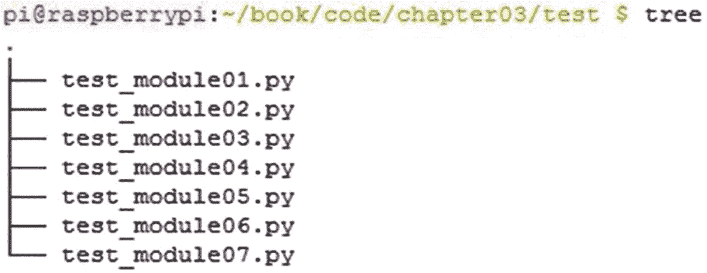
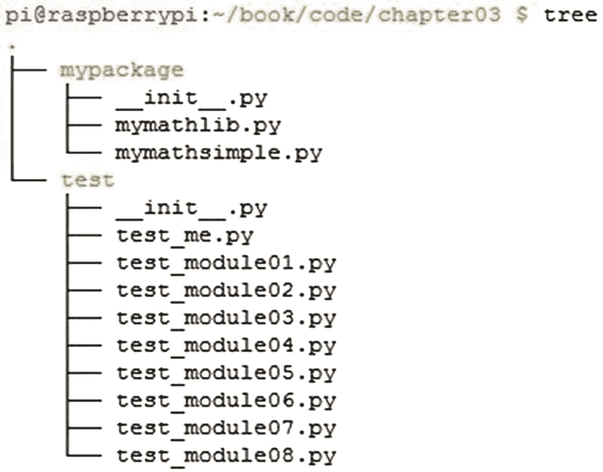

# 第三单元测试

最后一章讨论了测试自动化的概念。您了解了 docstring 和`doctest`以及它们在为 Python 3 程序编写简单、静态而优雅的测试用例中的用途。然而，由于缺乏 API、可配置测试和测试夹具等特性，`doctest`的受欢迎程度非常有限。你需要探索一个强大的 API 库来自动化复杂的现实项目，学习 Python 的内置`unittest`模块是你迈向它的第一步。

这是一个详细而漫长的章节。在这一章中，你会学到很多新概念，比如测试夹具、自动化测试发现、组织你的代码库等等。您将在整本书中使用这些概念，并在 Python 中更高级的测试自动化库中看到它们的实现。所以，我建议你仔细阅读本章的每一个主题。

`unittest`作为名为`PyUnit`的第三方模块诞生。`PyUnit`是`JUnit`的 Python 端口。`JUnit`是 Java 的`xUnit`风格的单元测试自动化框架。

从版本 2.5 开始，成为 Python 标准库的一部分。它被重新命名为`unittest`。`unittest`是 Python 的*电池内置的*测试自动化库，这意味着你不必安装额外的库或工具来开始使用它。任何熟悉其他编程语言中`xUnit`风格库的人(比如 Java 的`JUnit`、PHP 的`PHPUnit`、C++的`CPPUnit`等)。)会发现非常容易学习和使用`unittest`。

## xUnit 简介

让我们简单地看一下`xUnit`哲学。`xUnit`是各种语言的几个单元测试框架的统称。所有`xUnit`风格的单元测试框架或多或少都从 Smalltalk 的单元测试框架(称为`SUnit`)中获得了它们的功能、结构和编码风格。肯特·贝克设计并创作了`SUnit`。它流行起来后，被 Kent Beck 和 Erich Gamma 移植到 Java 中作为`JUnit`。最终，它被移植到了几乎所有的编程语言中。现在大多数编程语言都预先打包了至少一个`xUnit`风格的测试自动化库。此外，许多编程语言，如 Python 和 Java，都有不止一个`xUnit`风格的框架。Java 除了`JUnit`还有`TestNG`。Python 除了`unittest`还有`nose`、`pytest`、`Nose2`。

所有`xUnit`风格的测试自动化库都遵循一个公共的架构。以下是该体系结构的主要组件:

*   *测试用例类*:这是测试模块中所有测试类的基类。所有的测试类都是从这里派生的。

*   测试夹具:这些是在测试代码块执行之前和之后运行的函数或方法。

*   *断言*:这些函数或方法用于检查被测试组件的行为。大多数`xUnit`风格的框架都包含了强大的断言方法。

*   测试套件(Test suite):这是一组相关测试的集合，这些测试可以被执行或者被安排一起执行。

*   *测试运行者*:这是运行测试套件的程序或代码块。

*   测试结果格式化器(Test result formatter):它格式化测试结果，以各种人类可读的格式产生测试执行的输出，比如明文、HTML 和 XML。

`xUnit`的这些组件的实现细节在单元测试框架中略有不同。有趣的是，这使得程序员可以根据他们项目的需求和舒适度来选择框架。

如果您是一名经验丰富的程序员，并且有使用这些框架的经验，您将很快能够将您的知识转化为 Python 代码。如果你以前没有任何`xUnit`风格的框架的经验，那么在阅读了这本书，执行了书中所有的例子并解决了所有的练习之后，你就可以自己开始使用任何`xUnit`风格的框架，而不需要太多的动手操作。

## 使用单元测试

本节从`unittest`开始。它从测试类的最基本的概念开始。

对于本章，在`code`目录中创建一个名为`chapter03`的目录。在`chapter03`中，创建另一个名为`test`的目录(您将在本章后面了解为什么需要这个额外的目录)。将清单 [3-1](#PC1) 中的代码保存为`test_module01.py`。

```py
import unittest
class TestClass01(unittest.TestCase):
    def test_case01(self):
        my_str = "ASHWIN"
        my_int = 999
        self.assertTrue(isinstance(my_str, str))
        self.assertTrue(isinstance(my_int, int))

    def test_case02(self):
        my_pi = 3.14
        self.assertFalse(isinstance(my_pi, int))

if __name__ == '__main__':
    unittest.main()

Listing 3-1test_module01.py

```

在清单 [3-1](#PC1) 的代码中，`import unittest`语句导入了`unittest`模块。`TestClass01`是测试类。它是从`unittest`模块中的`TestCase`类派生出来的子类。`test_case01()`和`test_case02()`类方法是测试方法，因为它们的名字以`test_`开头(你将在本章的后面了解编写测试的指导方针和命名约定。)方法`assertTrue()`和`assertFalse()`是断言方法，分别检查传递给它们的参数是`True`还是`False`。如果自变量满足`assert`条件，测试用例通过；否则，它会失败。`unittest.main()`是试跑者。稍后您将详细探索更多的`assert`方法。

导航到测试目录，如下所示:

```py
cd ~/book/code/chapter03/test

```

运行以下命令:

```py
python3 test_module01.py

```

它产生以下输出:

```py
---------------------------------------------------------
Ran 2 tests in 0.002s
OK

```

它显示`OK`，因为两个测试都通过了。这是编写和执行测试的方法之一。

测试执行没有显示太多信息。这是因为详细度在默认情况下是禁用的。您可以使用`-v`命令行选项在详细模式下运行测试。在命令提示符下运行以下命令:

```py
python3 test_module01.py -v

```

详细输出如下:

```py
test_case01 ( main .TestClass01) ... ok
test_case02 ( main .TestClass01) ... ok
---------------------------------------------------------
Ran 2 tests in 0.004s
OK

```

当然，详细执行模式提供了更多关于测试执行的信息。在整本书中，您将会非常频繁地使用这种模式来运行测试和收集测试执行的日志。

### 测试方法的执行顺序

现在，您将看到测试方法的执行顺序。查看清单 [3-2](#PC7) 中的代码。

```py
import unittest
import inspect
class TestClass02(unittest.TestCase):
    def test_case02(self):
        print("\nRunning Test Method : " + inspect.stack()[0][3])

    def test_case01(self):
        print("\nRunning Test Method : " + inspect.stack()[0][3])

if  name   == ' main ':
    unittest.main(verbosity=2)

Listing 3-2test_module02.py

```

在清单 [3-2](#PC7) 的代码中，`inspect.stack()` `[0][3]`方法打印当前测试方法的名称。当您想知道方法在测试类中的执行顺序时，这对于调试很有用。清单 [3-2](#PC7) 中的代码输出如下:

```py
test_case01 ( main .TestClass02) ...
Running Test Method : test_case01
ok
test_case02 ( main .TestClass02) ...
Running Test Method : test_case02
ok
---------------------------------------------------------
Ran 2 tests in 0.090s
OK

```

注意，测试方法是按字母顺序运行的，与代码中测试方法的顺序无关。

#### 详细度控制

在前面的示例中，您在操作系统控制台中调用 Python 测试脚本时，通过命令控制测试执行的详细程度。现在，您将学习如何从代码本身控制详细模式。清单 [3-3](#PC9) 中的代码展示了一个例子。

```py
import unittest
import inspect

def add(x, y):
     print("We're in custom made function : " + inspect.stack()[0][3])
     return(x + y)
class TestClass03(unittest.TestCase):
     def test_case01(self):
          print("\nRunning Test Method : " + inspect.stack()[0][3])
          self.assertEqual(add(2, 3), 5)

     def test_case02(self):
          print("\nRunning Test Method : " + inspect.stack()[0][3])
          my_var = 3.14
          self.assertTrue(isinstance(my_var, float))

     def test_case03(self):
          print("\nRunning Test Method : " + inspect.stack()[0][3])
          self.assertEqual(add(2, 2), 5)

     def test_case04(self):
          print("\nRunning Test Method : " + inspect.stack()[0][3])
          my_var = 3.14
          self.assertTrue(isinstance(my_var, int))

if  name   == ' main ':
     unittest.main(verbosity=2)

Listing 3-3test_module03.py

```

在清单 [3-3](#PC9) 中，您正在用`assertEqual()`方法测试一个名为`add()`的定制函数。`assertEqual()`接受两个参数并判断两个参数是否相等。如果两个参数相等，测试用例通过；否则，它会失败。在同一个测试模块中还有一个名为`add()`的函数，它不是测试类的成员。用`test_case01()`和`test_case03()`，你在测试功能的正确性。

该代码还将 verbosity 设置为`unittest.main()`语句中的值`2`。

使用以下命令运行清单 [3-3](#PC9) 中的代码:

```py
python3 test_module03.py

```

输出如下所示:

```py
test_case01 ( main .TestClass03) ...
Running Test Method : test_case01
We're in custom made function : add
ok
test_case02 ( main .TestClass03) ...
Running Test Method : test_case02
ok
test_case03 ( main .TestClass03) ...
Running Test Method : test_case03
We're in custom made function : add
FAIL
test_case04 ( main .TestClass03) ...
Running Test Method : test_case04
FAIL

===========================================================
FAIL: test_case03 ( main .TestClass03)
---------------------------------------------------------
Traceback (most recent call last):
   File "test_module03.py", line 23, in test_case03
       self.assertEqual(add(2, 2), 5)
AssertionError: 4 != 5

===========================================================
FAIL: test_case04 ( main .TestClass03)
---------------------------------------------------------
Traceback (most recent call last):
   File "test_module03.py", line 28, in test_case04
       self.assertTrue(isinstance(my_var, int))
AssertionError: False is not true
---------------------------------------------------------
Ran 4 tests in 0.112s
FAILED (failures=2)

```

因为`assert`条件失败，所以`test_case03()`和`test_case04()`测试用例失败。现在您有了更多关于测试用例失败的信息，因为代码中启用了详细性。

#### 同一测试文件/模块中的多个测试类

到目前为止，这些示例在单个测试文件中包含了单个测试类。包含测试类的`.py`文件也被称为*测试模块*。清单 [3-4](#PC12) 显示了一个拥有多个测试类的测试模块的例子。

```py
import unittest
import inspect
class TestClass04(unittest.TestCase):
    def test_case01(self):
        print("\nClassname : " + self. class . name )
        print("Running Test Method : " + inspect.stack()[0][3])
class TestClass05(unittest.TestCase):
    def test_case01(self):
         print("\nClassname : " + self. class . name )
         print("Running Test Method : " + inspect.stack()[0][3])

if  name   == ' main ':
      unittest.main(verbosity=2)

Listing 3-4test_module04.py

```

下面是运行清单 [3-4](#PC12) 中的代码后的输出:

```py
test_case01 ( main .TestClass04) ...
Classname : TestClass04
Running Test Method : test_case01
ok
test_case01 ( main .TestClass05) ...
Classname : TestClass05
Running Test Method : test_case01
ok
---------------------------------------------------------
Ran 2 tests in 0.080s
OK

```

所有的测试类都是按照字母顺序逐一执行的。

#### 测试夹具

简单来说，*测试* *夹具*就是测试前后执行的一组步骤。

在`unittest`中，这些被实现为`TestCase`类的方法，并且可以根据您的需要被覆盖。清单 [3-5](#PC14) 中显示了`unittest`的定制测试夹具示例。

```py
import unittest

def setUpModule():
      """called once, before anything else in this module"""
      print("In setUpModule()...")

def tearDownModule():
      """called once, after everything else in this module"""
      print("In tearDownModule()...")
class TestClass06(unittest.TestCase):
     @classmethod
     def setUpClass(cls):
          """called once, before any test"""
          print("In setUpClass()...")

      @classmethod
      def tearDownClass(cls):
          """called once, after all tests, if setUpClass successful"""
          print("In tearDownClass()...")

      def setUp(self):
          """called multiple times, before every test method"""
          print("\nIn setUp()...")

     def tearDown(self):
          """called multiple times, after every test method"""
          print("In tearDown()...")

     def test_case01(self):
          self.assertTrue("PYTHON".isupper())
          print("In test_case01()")

     def test_case02(self):
          self.assertFalse("python".isupper())
          print("In test_case02()")

if  name   == ' main ':
      unittest.main()

Listing 3-5test_module05.py

```

在清单 [3-5](#PC14) 的代码中，`setUpModule()`和`tearDownModule()`方法是模块级的 fixtures。`setUpModule()`是在测试模块中任何方法之前执行的。`tearDownModule()`是在测试模块中的所有方法之后执行。`setUpClass()`和`tearDownClass()`是级夹具。`setUpClass()`在测试类中的任何方法之前执行。`tearDownClass()`在测试类中的所有方法之后执行。

这些方法与`@classmethod`装饰器一起使用，如清单 [3-5](#PC14) 中的代码所示。`@classmethod`装饰器必须引用一个类对象作为第一个参数。`setUp()`和`tearDown()`是方法级的夹具。`setUp()`和`tearDown()`方法在测试类中的每个测试方法之前和之后执行。运行清单 [3-5](#PC14) 中的代码，如下所示:

```py
python3 test_module05.py -v

```

以下是代码的输出:

```py
In setUpModule()...
In setUpClass()...
test_case01 ( main .TestClass06) ...
In setUp()...
In test_case01()
In tearDown()...
ok
test_case02 ( main .TestClass06) ... In
setUp()...
In test_case02()
In tearDown()...
ok
In tearDownClass()...
In tearDownModule()...
---------------------------------------------------------
Ran 2 tests in 0.004s
OK

```

测试夹具及其实现是任何测试自动化库的关键特性。这是`doctest`提供的静态测试的主要优势。

#### 不使用 unittest.main()运行

到目前为止，您已经使用`unittest.main()`运行了测试模块。现在您将看到如何在没有`unittest.main()`的情况下运行测试模块。例如，考虑清单 [3-6](#PC17) 中的代码。

```py
import unittest
class TestClass07(unittest.TestCase):
    def test_case01(self):
          self.assertTrue("PYTHON".isupper())
          print("\nIn test_case01()")

Listing 3-6test_module06.py

```

如果你试图用常规方式运行它，用`python3 test_module06.py`，你不会在控制台得到输出，因为它没有`if name ==' main '`和`unittest. main()`语句。即使使用`python3 test_module06.py -v`在详细模式下运行也不会在控制台中产生任何输出。

运行该模块的唯一方法是使用带有`-m unittest`选项和模块名称的 Python 解释器，如下所示:

```py
python -m unittest test_module06

```

输出如下所示:

```py
In test_case01()
.
---------------------------------------------------------
Ran 1 test in 0.002s
OK

```

注意，您不需要像前面那样在模块名后面加上`.py`。您也可以使用`-v`选项启用详细度，如下所示:

```py
python -m unittest test_module06 -v

```

详细输出如下:

```py
test_case01 (test_module06.TestClass07) ...
In test_case01()
ok
---------------------------------------------------------
Ran 1 test in 0.002s

OK

```

您将在本章中使用相同的方法来运行测试模块。在本章后面的章节中，你将会学到更多关于这种方法的知识。现在，作为练习，使用这种执行方法运行前面的所有代码示例。

#### 控制测试执行的粒度

您学习了如何使用`-m unittest`选项运行测试模块。您也可以使用这个选项运行单独的测试类和测试用例。

再次考虑前面的例子`test_module04.py`，如清单 [3-7](#PC22) 所示。

```py
import unittest
import inspect

class TestClass04(unittest.TestCase):

    def test_case01(self):
        print("\nClassname : " + self. class . name )
        print("Running Test Method : " + inspect.stack()[0][3])
class TestClass05(unittest.TestCase):
    def test_case01(self):
        print("\nClassname : " + self. class . name )
        print("Running Test Method : " + inspect.stack()[0][3])

if  name   == ' main ':
    unittest.main(verbosity=2)

Listing 3-7test_module04.py

```

您可以使用以下命令运行整个测试模块:

```py
python3 -m unittest -v test_module04

```

输出如下所示:

```py
test_case01 (test_module04.TestClass04) ...
Classname : TestClass04
Running Test Method : test_case01
ok
test_case01 (test_module04.TestClass05) ...
Classname : TestClass05
Running Test Method : test_case01
ok
---------------------------------------------------------
Ran 2 tests in 0.090s OK

```

您可以使用以下命令运行单个测试类:

```py
python3 -m unittest -v test_module04.TestClass04

```

输出如下所示:

```py
test_case01 (test_module04.TestClass04) ...
Classname : TestClass04
Running Test Method : test_case01
ok
---------------------------------------------------------
Ran 1 test in 0.077s
OK

```

您也可以使用以下命令运行单个测试用例:

```py
python3 -m unittest -v test_module04.TestClass05.test_case01

```

输出如下所示:

```py
test_case01 (test_module04.TestClass05) ...
Classname : TestClass05
Running Test Method : test_case01
ok
---------------------------------------------------------
Ran 1 test in 0.077s
OK

```

这样，您可以控制测试执行的粒度。

#### 列出所有命令行选项和帮助

您可以使用`-h`命令行选项列出`unittest`的所有命令行选项。运行以下命令:

```py
python3 -m unittest -h

```

以下是输出:

```py
usage: python3 -m unittest [-h] [-v] [-q] [-f] [-c] [-b] [tests [tests ...]] positional arguments:
tests   a list of any number of test modules, classes and test methods.

optional arguments:
-h, --help   show this help message and exit
-v, --verbose   Verbose output
-q, --quiet   Quiet output
-f, --failfast Stop on first fail or error
-c, --catch   Catch ctrl-C and display results so far
-b, --buffer   Buffer stdout and stderr during tests

Examples:
python3 -m unittest test_module   - run tests from test_module python3 -m unittest module.TestClass   - run tests from module.
TestClass
python3 -m unittest module.Class.test_method - run specified test method

usage: python3 -m unittest discover [-h] [-v] [-q] [-f] [-c] [-b] [-s START] [-p PATTERN] [-t TOP]

optional arguments:
-h, --help        show this help message and exit
-v, --verbose     Verbose output
-q, --quiet       Quiet output
-f, --failfast    Stop on first fail or error
-c, --catch       Catch ctrl-C and display results so far
-b, --buffer      Buffer stdout and stderr during tests
-s START, --start-directory START
                  Directory to start discovery ('.' default)
-p PATTERN, --pattern PATTERN
                  Pattern to match tests ('test*.py' default)
-t TOP, --top-level-directory TOP
                  Top level directory of project (defaults to start directory)

For test discovery all test modules must be importable from the top level directory of the project.

```

通过这种方式，您可以获得`unittest`提供的各种命令行选项的详细摘要。

#### 重要的命令行选项

让我们来看看`unittest`中重要的命令行选项。例如，看看清单 [3-8](#PC31) 中的代码。

```py
import unittest
class TestClass08(unittest.TestCase): def test_case01(self):
                self.assertTrue("PYTHON".isupper())
                print("\nIn test_case1()")

        def test_case02(self):
                self.assertTrue("Python".isupper()) print("\nIn test_case2()")

        def test_case03(self):
                self.assertTrue(True) print("\nIn test_case3()")

Listing 3-8test_module07.py

```

您已经知道`-v`代表详细模式。以下是详细模式下的输出:

```py
test_case01 (test_module07.TestClass08) ...
In test_case1()
ok
test_case02 (test_module07.TestClass08) ... FAIL
test_case03 (test_module07.TestClass08) ...
In test_case3()
ok

=============================================
FAIL: test_case02 (test_module07.TestClass08)
---------------------------------------------------------
Traceback (most recent call last):
   File "/home/pi/book/code/chapter03/test/test_module07.py", line 11, in test_case02
    self.assertTrue("Python".isupper())
AssertionError: False is not true
---------------------------------------------------------
Ran 3 tests in 0.012s
FAILED (failures=1)

```

`-q`选项代表*静音*模式。运行以下命令演示安静模式:

```py
python3 -m unittest -q test_module07

```

输出如下所示:

```py
In test_case1()
In test_case3()
================================================
FAIL: test_case02 (test_module07.TestClass08)
---------------------------------------------------------
Traceback (most recent call last):
   File "/home/pi/book/code/chapter03/test/test_module07.py", line 11, in test_case02
   self.assertTrue("Python".isupper())
AssertionError: False is not true
---------------------------------------------------------
Ran 3 tests in 0.005s
FAILED (failures=1)

```

`-f`选项代表*故障保护*。一旦第一个测试用例失败，它就强制停止执行。运行以下命令启动故障保护模式:

```py
python3 -m unittest -f test_module07

```

以下是故障保护模式下的输出:

```py
In test_case1()
.F
=========================================================
FAIL: test_case02 (test_module07.TestClass08)
---------------------------------------------------------
Traceback (most recent call last):
   File "/home/pi/book/code/chapter03/test/test_module07.py", line 11, in test_case02
    self.assertTrue("Python".isupper())
AssertionError: False is not true
---------------------------------------------------------
Ran 2 tests in 0.004s
FAILED (failures=1)

```

您也可以使用多个选项。例如，您可以使用以下命令将 verbose 与 failsafe 结合使用:

```py
python3 -m unittest -fv test_module07

```

输出如下所示:

```py
test_case01 (test_module07.TestClass08) ...
In test_case1()
ok
test_case02 (test_module07.TestClass08) ... FAIL

==========================================================
FAIL: test_case02 (test_module07.TestClass08)
---------------------------------------------------------
Traceback (most recent call last):
    File "/home/pi/book/code/chapter03/test/test_module07.py", line 11, in test_case02
    self.assertTrue("Python".isupper())
AssertionError: False is not true
---------------------------------------------------------
Ran 2 tests in 0.005s
FAILED (failures=1)

```

作为练习，尝试使用命令行选项的不同组合。

#### 创建测试包

到目前为止，您已经单独创建并执行了测试模块。然而，您可以使用 Python 的内置打包特性来创建测试包。这是具有大型代码库的复杂项目中的标准做法。

图 [3-1](#Fig1) 显示了当前`test`目录的快照，在那里你保存你的测试模块。



图 3-1

第 03 章目录中测试子目录的快照

现在，让我们创建一个测试模块包。在`test`目录下创建一个`init.py`文件。将清单 [3-9](#PC39) 中的代码添加到`init.py`文件中。

```py
all = ["test_module01", "test_module02", "test_module03", "test_module04", "test_module05", "test_module06", "test_module07"]

Listing 3-9init.py

```

恭喜你！您刚刚创建了一个测试包。`test`是测试包的名称，`init.py`中提到的所有模块都属于这个包。如果您需要向`test`包中添加一个新的测试模块，您需要在测试目录中创建一个新的测试模块文件，然后将该模块的名称添加到`init.py`文件中。

现在，您可以通过下面的方式从`test` ( `chapter03`)的父目录中运行测试模块。使用以下命令移动到`chapter03`目录:

```py
cd /home/pi/book/code/chapter03

```

注意，在您的情况下，路径可能会有所不同，这取决于您在哪里创建了`book`目录。

使用以下命令运行`test`模块:

```py
python3 -m unittest -v test.test_module04

```

以下是输出:

```py
test_case01 (test.test_module04.TestClass04) ...
Classname : TestClass04
Running Test Method : test_case01
ok
test_case01 (test.test_module04.TestClass05) ...
Classname : TestClass05
Running Test Method : test_case01
ok
---------------------------------------------------------
Ran 2 tests in 0.090s
OK

```

使用以下命令在测试模块中运行测试类:

```py
python3 -m unittest -v test.test_module04.TestClass04

```

输出如下所示:

```py
test_case01 (test.test_module04.TestClass04) ...
Classname : TestClass04
Running Test Method : test_case01
ok
---------------------------------------------------------
Ran 1 test in 0.078s
OK

```

从测试模块运行测试用例，如下所示:

```py
python3 -m unittest -v test.test_module04.TestClass04.test_case01

```

输出如下所示:

```py
test_case01 (test.test_module04.TestClass04) ...
Classname : TestClass04
Running Test Method : test_case01
ok
---------------------------------------------------------
Ran 1 test in 0.079s
OK

```

#### 组织代码

让我们来看看组织测试代码和开发代码的方法。您现在正转向使用`unittest`的真实项目场景。到目前为止，测试(测试代码)和要测试的代码(开发代码)在同一个模块中。通常在现实项目中，开发代码和测试代码保存在不同的文件中。

#### 将开发和测试代码放在一个目录中

在这里，您将把开发和测试代码组织到一个目录中。在`test`目录中，创建一个名为`test_me.py`的模块，并将清单 [3-10](#PC47) 中的代码添加到其中。

```py
def add(x, y):
    return(x + y)

def mul(x, y):
    return(x * y)

def sub(x, y):
    return(x - y)

def div(x, y):
    return(x / y)

Listing 3-10test_me.py

```

现在，因为`test_me.py`在`test`目录中，所以可以使用`import test_me`语句将它直接导入到同一目录中的另一个模块中。清单 [3-11](#PC48) 中的测试模块导入`test_me.py`来测试其功能。

```py
import unittest
import test_me
class TestClass09(unittest.TestCase):
   def test_case01(self):
      self.assertEqual(test_me.add(2, 3), 5)
      print("\nIn test_case01()")

   def test_case02(self):
      self.assertEqual(test_me.mul(2, 3), 6)
      print("\nIn test_case02()")

Listing 3-11test_module08.py

```

使用以下命令运行测试模块:

```py
python3 -m unittest -v test_module08

```

输出如下所示:

```py
test_case01 (test_module08.TestClass09) ...
In test_case01()
ok
test_case02 (test_module08.TestClass09) ...
In test_case02()
ok
---------------------------------------------------------
Ran 2 tests in 0.004s OK

```

这样，您可以将开发代码和测试代码组织在同一目录的不同文件中。

#### 将开发和测试代码放在不同的目录中

许多编码标准建议将开发代码和测试代码文件组织在不同的目录中。让我们现在做那件事。

导航到`chapter03`目录:

```py
cd /home/pi/book/code/chapter03

```

在`chapter03`目录中创建一个名为`mypackage`的新目录:

```py
mkdir mypackage

```

导航到`mypackage`目录:

```py
cd mypackage

```

将清单 [3-12](#PC54) 中的代码作为`mymathlib.py`保存在`mypackage`目录中。

```py
class mymathlib:
   def  init (self):
      """Constructor for this class..."""
      print("Creating object : " + self. class . name )

   def add(self, x, y):
      return(x + y)

   def mul(self, x, y):
      return(x * y)

   def mul(self, x, y):
      return(x - y)

   def   del (self):
      """Destructor for this class..."""
      print("Destroying object : " + self. class . name )

Listing 3-12mymathlib.py

```

将清单 [3-13](#PC55) 中的代码作为`mymathsimple.py`保存在`mypackage`目录中。

```py
def add(x, y):
   return(x + y)

def mul(x, y):
   return(x * y)

def sub(x, y):
   return(x - y)

def div(x, y):
   return(x / y)

Listing 3-13mymathsimple.py

```

您刚刚创建的这些模块是开发模块。最后，为了创建一个开发模块包，用清单 [3-14](#PC56) 中所示的代码创建`init.py`文件。

```py
all = ["mymathlib", "mymathsimple"]

Listing 3-14init.py

```

这将为开发代码创建一个 Python 包。导航回`chapter03`目录。目录的结构现在应该如图 [3-2](#Fig2) 所示。



图 3-2

第 03 章目录的快照

`mypackage`是开发代码包，`test`是测试代码包。

您现在需要创建一个测试模块来测试`mypackage`中的开发代码。在`test`目录中创建一个名为`test_module09.py`的新测试模块，并添加清单 [3-15](#PC57) 中所示的代码。

```py
from mypackage.mymathlib import *
import unittest

math_obj = 0

def setUpModule():
   """called once, before anything else in the module"""
   print("In setUpModule()...")
   global math_obj
   math_obj = mymathlib()

def tearDownModule():
   """called once, after everything else in the module"""
   print("In tearDownModule()...")
   global math_obj
   del math_obj

class TestClass10(unittest.TestCase):

   @classmethod
   def setUpClass(cls):
      """called only once, before any test in the class"""
      print("In setUpClass()...")

   def setUp(self):
      """called once before every test method"""
      print("\nIn setUp()...")

   def test_case01(self):
      print("In test_case01()")
      self.assertEqual(math_obj.add(2, 5), 7)

   def test_case02(self):
      print("In test_case02()")

   def tearDown(self):
      """called once after every test method"""
      print("In tearDown()...")

   @classmethod
   def tearDownClass(cls):
      """called once, after all the tests in the class"""
      print("In tearDownClass()...")

Listing 3-15test_module09.py

```

将`test_module09`添加到`test`目录中的`init.py`中，使其成为`test`包的一部分。

使用以下命令运行`test`目录中的代码:

```py
python3 -m unittest -v test_module09

```

它将抛出如下错误:

```py
from mypackage.mymathlib import *
ImportError: No module named 'mypackage'

```

这是因为从`test`目录中看不到`mypackage`模块。它不在`test`目录中，而是在`chapter03`目录中。该模块不能从`test`目录执行。您必须将该模块作为`test`包的一部分来执行。您可以从`chapter03`目录中完成这项工作。`mypackage`模块在该目录中显示为`mypackage`，是`chapter03`的子目录。

导航到`chapter03`目录，按如下方式运行该模块:

```py
python3 -m unittest -v test.test_module09

```

以下是执行的输出:

```py
In setUpModule()...
Creating object : mymathlib
In setUpClass()...
test_case01 (test.test_module09.TestClass10) ...
In setUp()...
In test_case01()
In tearDown()...
ok
test_case02 (test.test_module09.TestClass10) ...
In setUp()...
In test_case02()
In tearDown()...
ok
In tearDownClass()...
In tearDownModule()...
Destroying object : mymathlib
---------------------------------------------------------
Ran 2 tests in 0.004s
OK

```

这就是如何在不同的目录中组织开发和测试代码文件。将这些代码文件分开是标准做法。

## 测试发现

*测试发现*是发现并执行项目目录及其所有子目录中所有测试的过程。测试发现过程在`unittest`中是自动化的，可以使用`discover`子命令调用。可以使用以下命令调用它:

```py
python3 -m unittest discover

```

以下是该命令在`chapter03`目录中运行时的部分输出:

```py
..
Running Test Method : test_case01
.
Running Test Method : test_case02
.
Running Test Method : test_case01
We're in custom made function : add
.
Running Test Method : test_case02
.
Running Test Method : test_case03
We're in custom made function : add
F
Running Test Method : test_case04
F
Classname : TestClass04
Running Test Method : test_case01

```

您也可以使用以下命令在详细模式下调用它:

```py
python3 -m unittest discover -v

```

以下是该命令的部分输出:

```py
test_case01 (test.test_module01.TestClass01) ... ok
test_case02 (test.test_module01.TestClass01) ... ok
test_case01 (test.test_module02.TestClass02) ...
Running Test Method : test_case01
ok
test_case02 (test.test_module02.TestClass02) ...
Running Test Method : test_case02
ok
test_case01 (test.test_module03.TestClass03) ...
Running Test Method : test_case01
We're in custom made function : add
ok
test_case02 (test.test_module03.TestClass03) ...
Running Test Method : test_case02
ok
test_case03 (test.test_module03.TestClass03) ...
Running Test Method : test_case03
We're in custom made function : add

```

测试发现有更多的命令行选项。您可以用`-s`或`--start-directory`指定起始目录。默认情况下，当前目录是起始目录。

您可以使用`-p`或`--pattern`作为文件名模式。`test*.py`是默认模式。

您可以使用`-t`或`--top-level-directory`来指定项目的顶层目录。默认值是起始目录。

正如您在详细输出中看到的，`unittest`自动找到并运行了位于`chapter03`目录及其子目录中的所有测试模块。这让您免去了单独运行每个测试模块并单独收集结果的痛苦。测试发现是任何自动化测试框架最重要的特性之一。

## 单元测试的编码约定

正如您所看到的，测试发现会自动发现并运行项目目录中的所有测试。为了达到这种效果，您需要为您的测试代码遵循一些编码和命名约定。你可能已经注意到，在本书的所有代码示例中，我一直遵循这些约定。

*   为了与测试发现兼容，所有测试文件必须是可从项目的顶级目录导入的模块或包。

*   默认情况下，测试发现总是从当前目录开始。

*   默认情况下，测试发现总是在文件名中搜索`test*.py`模式。

## 单元测试中的断言

你已经学习了一些基本的断言，比如`assertEqual()`和`assertTrue()`。下表列出了最常用的断言及其用途。

<colgroup><col class="tcol1 align-left"> <col class="tcol2 align-left"></colgroup> 
| 

`Method`

 | 

`Checks That`

 |
| --- | --- |
| `assertEqual(a, b)` | `a == b` |
| `assertNotEqual(a, b)` | `a != b` |
| `assertTrue(x)` | `bool(x) is True` |
| `assertFalse(x)` | `bool(x) is False` |
| `assertIs(a, b)` | `a is b` |
| `assertIsNot(a, b)` | `a is not b` |
| `assertIsNone(x)` | `x is None` |
| `assertIsNotNone(x)` | `x is not None` |
| `assertIn(a, b)` | `a in b` |
| `assertNotIn(a, b)` | `a not in b` |
| `assertIsInstance(a, b)` | `isinstance(a, b)` |
| `assertNotIsInstance(a, b)` | `not isinstance(a, b)` |
| `assertAlmostEqual(a, b)` | `round(a-b, 7) == 0` |
| `assertNotAlmostEqual(a, b)` | `round(a-b, 7) != 0` |
| `assertGreater(a, b)` | `a > b` |
| `assertGreaterEqual(a, b)` | `a >= b` |
| `assertLess(a, b)` | `a < b` |
| `assertLessEqual(a, b)` | `a <= b` |
| `assertRegexpMatches(s, r)` | `r.search(s)` |
| `assertNotRegexpMatches(s, r)` | `not r.search(s)` |
| `assertItemsEqual(a, b)` | `sorted(a) == sorted(b)` |
| `assertDictContainsSubset(a, b)` | `all the key/value pairs in a exist in b` |
| `Method` | `Used to Compare` |
| `assertMultiLineEqual(a, b)` | `Strings` |
| `assertSequenceEqual(a, b)` | `Sequences` |
| `assertListEqual(a, b)` | `Lists` |
| `assertTupleEqual(a, b)` | `Tuples` |
| `assertSetEqual(a, b)` | `sets or frozensets` |
| `assertDictEqual(a, b)` | `Dicts` |

在自动化测试时，上表中列出的所有`assert`方法对于大多数程序员和测试人员来说已经足够好了。

### 其他有用的方法

本节介绍一些有用的方法，它们将帮助您调试和理解执行流程。

`id()`和`shortDescription()`方法对于调试非常有用。`id()`返回方法的名称，`shortDescription()`返回方法的描述。清单 [3-16](#PC66) 显示了一个例子。

```py
import unittest
class TestClass11(unittest.TestCase):
   def test_case01(self):
      """This is a test method..."""
      print("\nIn test_case01()")
      print(self.id())
      print(self.shortDescription())

Listing 3-16test_module10.py

```

清单 [3-16](#PC66) 的输出如下:

```py
test_case01 (test_module10.TestClass11)
This is a test method... ...
In test_case01()
test_module10.TestClass11.test_case01
This is a test method...
ok
---------------------------------------------------------
Ran 1 test in 0.002s
OK

```

## 考试不及格

很多时候，您可能希望有一个方法在被调用时明确地使测试失败。在`unittest`中，`fail()`方法用于该目的。查看清单 [3-17](#PC68) 中的代码作为示例。

```py
import unittest
class TestClass12(unittest.TestCase):
   def test_case01(self):
      """This is a test method..."""
      print(self.id())
      self.fail()

Listing 3-17test_module11.py

```

清单 [3-17](#PC68) 的输出如下:

```py
test_case01 (test_module11.TestClass12)
This is a test method... ...
test_module11.TestClass12.test_case01
FAIL

=========================================================
FAIL: test_case01 (test_module11.TestClass12)
This is a test method...
---------------------------------------------------------
Traceback (most recent call last):
   File "/home/pi/book/code/chapter03/test/test_module11.py", line 9, in test_case01
    self.fail()
AssertionError: None
---------------------------------------------------------
Ran 1 test in 0.004s
FAILED (failures=1)
Skipping tests

```

提供了一种有条件或无条件跳过测试的机制。

它使用以下装饰器来实现跳过机制:

*   `unittest.skip(reason)`:无条件跳过修饰测试。`reason`应描述为何跳过测试。

*   `unittest.skipIf(condition, reason)`:如果`condition`为真，跳过修饰测试。

*   `unittest.skipUnless(condition, reason)`:跳过修饰测试，除非`condition`为真。

*   `unittest.expectedFailure()`:将测试标记为预期失败。如果测试在运行时失败，则测试不算失败。

清单 [3-18](#PC70) 中的代码演示了如何有条件地和无条件地跳过测试。

```py
import sys
import unittest

class TestClass13(unittest.TestCase):

    @unittest.skip("demonstrating unconditional skipping")
    def test_case01(self):
      self.fail("FATAL")

    @unittest.skipUnless(sys.platform.startswith("win"), "requires Windows")
    def test_case02(self):
       # Windows specific testing code
       pass

    @unittest.skipUnless(sys.platform.startswith("linux"), "requires Linux")
    def test_case03(self):
      # Linux specific testing code
      pass

Listing 3-18test_module12.py

```

在 Linux 平台上运行清单 [3-18](#PC70) 中的代码时，输出如下:

```py
test_case01 (test_module12.TestClass13) ... skipped 'demonstrating unconditional skipping'
test_case02 (test_module12.TestClass13) ... skipped 'requires Windows'
test_case03 (test_module12.TestClass13) ... ok
---------------------------------------------------------
Ran 3 tests in 0.003s
OK (skipped=2)

```

当您在 Windows 平台上运行清单 [3-18](#PC70) 中的代码时，输出如下:

```py
test_case01 (test_module12.TestClass13) ... skipped 'demonstrating unconditional skipping'

test_case02 (test_module12.TestClass13) ... ok
test_case03 (test_module12.TestClass13) ... skipped 'requires Linux'
---------------------------------------------------------
Ran 3 tests in 0.003s
OK (skipped=2)

```

如您所见，代码根据运行的操作系统跳过了测试用例。这个技巧对于运行特定于平台的测试用例非常有用。

您也可以使用`unittest. skip(reason)`装饰器跳过测试模块中的整个测试类。

### 测试用例中的异常

当测试用例中出现异常时，测试用例失败。清单 [3-19](#PC73) 中显示的代码将显式引发一个异常。

```py
import unittest

class TestClass14(unittest.TestCase):
   def test_case01(self):
      raise Exception

Listing 3-19test_module13.py

```

清单 [3-19](#PC73) 的输出如下:

```py
test_case01 (test_module13.TestClass14) ... ERROR

=========================================================
ERROR: test_case01 (test_module13.TestClass14)
---------------------------------------------------------
Traceback (most recent call last):
   File "/home/pi/book/code/chapter03/test/test_module13.py", line 6, in test_case01
   raise Exception
Exception
---------------------------------------------------------
Ran 1 test in 0.004s
FAILED (errors=1)

```

测试因异常而失败时显示的失败消息与测试因断言而失败时不同。

#### assertRaises()

您了解到`assert`方法用于检查测试条件。`assertRaises()`方法用于检查代码块是否引发了`assertRaises()`中提到的异常。如果代码引发异常，则测试通过；否则，它会失败。清单 [3-20](#PC75) 所示的代码详细演示了`assertRaises()`的用法。

```py
import unittest
class Calculator:
   def add1(self, x, y):
      return x + y

   def add2(self, x, y):
      number_types = (int, float, complex)
      if isinstance(x, number_types) and isinstance(y, number_ types):
      return x + y
      else:
      raise ValueError

calc = 0
class TestClass16(unittest.TestCase):
   @classmethod
   def setUpClass(cls):
      global calc
      calc = Calculator()

   def setUp(self):
      print("\nIn setUp()...")

   def test_case01(self):
      self.assertEqual(calc.add1(2, 2), 4)

   def test_case02(self):
      self.assertEqual(calc.add2(2, 2), 4)

   def test_case03(self):
      self.assertRaises(ValueError, calc.add1, 2, 'two')

   def test_case04(self):
      self.assertRaises(ValueError, calc.add2, 2, 'two')

   def tearDown(self):
      print("\nIn tearDown()...")

   @classmethod
   def tearDownClass(cls):
      global calc
      del calc

Listing 3-20test_module14.py

```

清单 [3-20](#PC75) 中的代码定义了一个名为`Calculator`的类，它有两种不同的加法运算方法。如果一个非数字的参数被传递给方法,`add1()`方法没有引发异常的规定。如果有任何参数是非数字的，`add2()`方法就会引发一个`ValueError`。下面是清单 [3-20](#PC75) 中代码的输出:

```py
test_case01 (test_module14.TestClass16) ...
In setUp()...

In tearDown()...
ok
test_case02 (test_module14.TestClass16) ...
In setUp()...

In tearDown()... ok
test_case03 (test_module14.TestClass16) ...
In setUp()...

In tearDown()...
ERROR
test_case04 (test_module14.TestClass16) ...
In setUp()...

In tearDown()...
ok

=============================================================
ERROR: test_case03 (test_module14.TestClass16)
---------------------------------------------------------
Traceback (most recent call last):
   File "/home/pi/book/code/chapter03/test/test_module14.py", line 37, in test_case03
   self.assertRaises(ValueError, calc.add1, 2, 'two')
   File "/usr/lib/python3.4/unittest/case.py", line 704, in assertRaises
   return context.handle('assertRaises', callableObj, args, kwargs)
   File "/usr/lib/python3.4/unittest/case.py", line 162, in handle callable_obj(*args, **kwargs)
   File "/home/pi/book/code/chapter03/test/test_module14.py", line 7, in add1
   return x + y

TypeError: unsupported operand type(s) for +: 'int' and 'str'
---------------------------------------------------------
Ran 4 tests in 0.030s
FAILED (errors=1)

```

在输出中，`test_Case03()`失败是因为当您向它传递一个非数字参数(在本例中是一个字符串)时，`add1()`没有引发异常的规定。`assertRaises()`在编写负面测试用例时非常有用，比如当你需要针对无效参数检查 API 的行为时。

### 创建测试套件

您可以创建自己的定制测试套件和测试运行程序来运行这些测试套件。代码如清单 [3-21](#PC77) 所示。

```py
import unittest

def setUpModule():
     """called once, before anything else in this module"""
     print("In setUpModule()...")

def tearDownModule():
     """called once, after everything else in this module"""
     print("In tearDownModule()...")

class TestClass06(unittest.TestCase):

     @classmethod
     def setUpClass(cls):
          """called once, before any test"""
          print("In setUpClass()...")

     @classmethod
     def tearDownClass(cls):
          """called once, after all tests, if setUpClass successful"""
          print("In tearDownClass()...")

     def setUp(self):
          """called multiple times, before every test method"""
          print("\nIn setUp()...")

     def tearDown(self):
          """called multiple times, after every test method"""
          print("In tearDown()...")

     def test_case01(self):
          self.assertTrue("PYTHON".isupper())
          print("In test_case01()")

     def test_case02(self):
          self.assertFalse("python".isupper())
          print("In test_case02()")

def suite():
        test_suite = unittest.TestSuite()
        test_suite.addTest(unittest.makeSuite(TestClass06))
        return test_suite

if __name__ == '__main__':
        mySuit=suite()
        runner=unittest.TextTestRunner()
        runner.run(mySuit)

Listing 3-21test_module16.py

```

该代码示例创建了一个套件，该套件为`unittest.TestSuite()`创建了一个对象。然后用`addTest()`方法将测试类添加到这个对象中。您可以向其中添加多个测试类。您也可以像那样创建多个测试套件。最后，这个例子在主体部分创建了这个测试套件类的一个对象。它还创建了一个`testrunner`对象，然后调用该对象来运行测试套件的对象。您可以创建多个测试套件，并在主要部分创建它们的对象。然后您可以使用`testrunner`对象来调用那些测试套件的对象。

### 创建测试套件

Exercise 3-1

像所有其他 Python 库一样，这是一个很大的主题，不可能在一本书中涵盖。因此，我建议您完成以下练习，以获得更多关于`unittest`的知识和经验。

1.  请访问 Python 3 文档页面获取`unittest`,网址为

    [`https://docs.python.org/3/library/unittest.html`](https://docs.python.org/3/library/unittest.html) 。

2.  实践本章中提到的所有断言方法，使用每一种方法编写测试。

3.  练习使用`unittest.skipIf(condition, reason)`和`unittest.expectedFailure()`装饰器。编写代码来演示它们的功能。

4.  使用多个测试类编写一个测试模块，并使用`unittest.skip(reason)`装饰器跳过整个测试类。

5.  尝试在测试设备中引发异常。

**提示**通过启用每个注释掉的`raise Exception`行，一次一行，尝试运行清单 [3-22](#PC78) 中的代码。这将帮助您理解当您在其中引发异常时，单个 fixture 的行为。

```py
def setUpModule():
#     raise Exception
      pass

def tearDownModule():
#     raise Exception
      pass
class TestClass15(unittest.TestCase):
   @classmethod
   def setUpClass(cls):
#     raise Exception
      pass

   def setUp(self):
#     raise Exception
      pass

   def test_case01(self):
      self.id()

   def tearDown(self):
#     raise Exception
      pass

   @classmethod
   def tearDownClass(cls):
#     raise Exception
      Pass

Listing 3-22test_module15.py import unittest

```

## 结论

在这一章中，你学习了几个重要的概念，包括测试设备、测试类、测试方法、测试模块和测试套件。您还学习了如何用`unittest`实现所有这些概念。您还学习了断言和自动化测试发现。几乎你在本章中学到的所有概念都将在后面涉及其他 Python 测试框架的章节中重新讨论。下一章着眼于`nose`和`nose2`，这是另外两个流行的 Python 测试自动化和测试运行器框架。

我们在本章中学到的所有概念都是单元测试自动化领域的基础。我们将在整本书中使用它们，这些概念对于专业测试人员和开发人员非常有用。