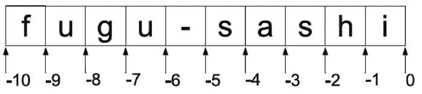

# 一、Python 简介

我们将用来创建游戏的编程语言是 Python，它之所以得名是因为该语言的原作者是英国电视连续剧*巨蟒剧团*的粉丝。虽然我们将使用 Python 来创建游戏，但这种语言是一种通用编程语言，用于数据分析、机器人、创建网站等等。Google、NASA 和 Instagram 等公司和机构都非常依赖 Python。

有很多可供选择的语言可以用来创建游戏，但我选择了 Python，因为它倾向于处理细节，让您(程序员)专注于解决问题。对我们来说，*解决问题*意味着在屏幕上显示游戏角色，让他们看起来很棒，并让他们与虚拟环境互动。

本章是对 Python 的友好介绍；它将帮助您快速掌握这门语言，以便您能够阅读示例代码并开始编写自己的代码。如果你熟悉 Python，那么可以跳过前两章。如果您对 Python 完全陌生，或者您想参加进修课程，请继续阅读。

要开始使用 Python，你首先需要为你的电脑安装一个 Python 解释器。有适用于 PC、Linux 和 Mac 的版本。我们将在本书中使用 Python 3.4 版本。要获得 Python，请前往`http://python.org/downloads`。

 **注**到本书出版时，可能会有更高版本的 Python 问世。Python 2 和 Python 3 之间的差异相当显著，尽管未来的更新预计会很小。请随意下载 Python 的最新版本。

您对 Python 的第一印象

运行 Python 代码的通常方式是将其保存到一个文件中，然后*运行*它。我们很快就会这样做，但现在我们将在*交互*模式中使用 Python，这让我们一次输入一行代码，并立即收到反馈。你会发现这是 Python 的优势之一。它是学习语言的一个很好的辅助工具，并且经常被有经验的程序员用于数据分析等主题，因为您可以很容易地改变一行并看到即时输出。

一旦您在系统上安装了 Python，您就可以像运行任何其他程序一样运行它。如果你有 Windows，只需双击图标或在开始菜单中选择它。对于其他有命令行的系统，只需键入`"python"`就可以在交互模式下启动 Python。如果你同时安装了 Python 2 和 Python 3，你可能需要输入`python3`，而不仅仅是`"python"`。

当您第一次运行 Python 解释器时，您会看到如下内容:

```py
Python 3.4.2 (v3.4.2:ab2c023a9432, Oct  6 2014, 22:16:31)
 [MSC v.1600 64 bit (AMD64)] on win32
Type "copyright", "credits" or "license()" for more information.
>>>
```

根据您运行的 Python 版本和平台(Windows、Mac、Linux 等),文本可能会有所不同。)你正在运行它。重要的部分是三个 v 形符号(`>>>`)，这是 Python 的*提示*——是你输入一些代码的邀请，然后 Python 试图运行这些代码。

计算机语言教程的一个长期传统是，你写的第一个程序显示文本“Hello，World！”在银幕上——我又有什么资格打破传统呢！所以深呼吸，在提示后输入`print("Hello, World!")`。Python 窗口现在会在提示行中显示以下内容:

```py
>>> print("Hello, World!")
```

如果您按下 Enter 键，Python 将运行您刚才输入的代码行，如果一切顺利，您将在屏幕上看到以下内容:

```py
>>> print("Hello, World!")
Hello, World!
>>> _
```

Python 已经*执行了*您的代码行，显示了结果，并给出了一个新的提示让您输入更多代码。那么我们的代码到底是如何工作的呢？单词`print`是一个*函数*，它告诉 Python 将随后的内容打印到屏幕上。在`print`函数之后是一个*字符串*，它只是字母和/或数字的集合。Python 将引号(`"`)之间的任何内容视为字符串。尝试在引号之间输入您自己的文本，您应该会发现 Python 会像以前一样将它打印到屏幕上。

数字

我们稍后将回到字符串，但是现在让我们从 Python 可以处理的最简单的信息开始:数字。Python 非常擅长处理数字，你几乎可以像使用计算器一样使用它。要查看它的运行情况，请在 Python 中键入以下内容(您不需要键入提示，因为 Python 会为您显示出来):

```py
>>> 2+2
```

猜猜 Python 会对这一行做什么，然后按回车键。如果你猜对了 4，那就吃块饼干吧——这正是它的作用。Python 对*求值* `2+2`，这在 Python 术语中称为*表达式*，并显示结果。你也可以用`–`做减法，`*`做乘法，`/`做除法。这些符号被称为*运算符*。你可能会用得最多的是`+`、`–`、`*`、`/`。以下是一些例子:

```py
>>> 10–5
5
>>> 2*4
8
>>> 6/2+1
4
>>> –2+7
5
```

在现实世界中，只有一种数字，但是计算机——以及随之而来的 Python——有几种表示数字的方式。两种最常用的数字类型是整数 T2 和浮点数 T4。整数是没有小数点的整数，而浮点有小数点，可以存储小数值。通常你应该使用哪一个是显而易见的——例如，如果你的游戏有*生命*的概念，你会使用一个整数来存储它们，因为你不太可能有半个生命或 3.673 个生命。浮点值更常用于需要精度的真实世界的值，例如，在一个赛车游戏中，您的汽车可能有每小时 92.4302 英里的速度，您可以将它存储在一个浮点中。

到目前为止，您输入的数字都是整数。要告诉 Python 一个数字是浮点数，只需包含一个小数点。比如 5 和 10 都是整数，但是 5。和 10.0 都是浮点数。

```py
>>> 3/2
1.5
>>> 3.0/2.
1.5
>>> 3./2.
1.5
```

除了基本的数学之外，你还可以用数字做很多其他的事情。括号是用来保证某个东西先计算；这里有一个例子:

```py
>>> 3/2+1
2.5
>>> 3/(2+1)
1.0
```

第一行先计算 3 除以 2，然后加 1，结果是 2.5。第二行首先计算 2 加 1，因此结果为 3 除以 3，即 1。

您可以使用的另一个运算符是*幂*运算符，它将值提升到幂。例如，2 的 3 次方等于 2*2*2。幂运算符是`**`，作用于整数和浮点数。这里有两个幂操作符的例子:

```py
>>> 2**3
8
>>> 3.0**4
81.0
```

Python 3 以一种非常可预期的方式处理计算和数字信息，不像它的前身或许多其他语言。许多语言的范围从-2147 百万到 2147 百万，给你一个超过 40 亿的范围。然而，Python 3 并不是这样有界的。

让我们通过计算 2 的 100 次方来创建一个大数，也就是 2×2×2×2……×2 重复 100 次。

```py
>>> 2**100
1267650600228229401496703205376
```

这是一个很大的数字！如果你感到勇敢，试着计算`2**1000`甚至`2**10000`，然后看着你的屏幕被巨大的数字填满。

下一节之前再给大家介绍一个运营商吧。*模数* ( `%`)运算符计算除法的余数。例如，15 的模数 6 是 3，因为 6 除以 15 的两倍，还剩下 3。让我们请 Python 来帮我们做这件事:

```py
>>> 15%6
3
```

有了这几个运算符，你现在可以计算任何可以计算的东西，无论是两盘河豚的 15%小费，还是一个兽人用+1 斧头击中盔甲造成的伤害。

我不太了解兽人，但让我们计算一下两碟河豚(生河豚，一种日本美食，我希望有一天能尝试一下)的小费。河豚很贵，任何东西都要 200 美元，因为如果不是由受过专门训练的厨师烹制的，吃了它会致命！假设我们在东京找到一家餐馆，供应一盘诱人的河豚，价格为 100 美元。我们可以用 Python 来为我们计算小费:

```py
>>> (100*2)*15/100
30.0
```

这相当于两个 100 美元盘子价格的 15%——30 美元的小费。对这家餐厅来说足够好了，但是数字会根据我们购买河豚的地点和服务质量而变化。我们可以通过使用*变量*来使其更加清晰和灵活。变量是一个值的标签，当你创建变量时，你可以用它来代替数字本身。在我们的小费计算中，我们有三个变量:河豚的价格、盘子的数量和小费的百分比。要创建变量，请键入其名称，后跟等号(`=`)，然后键入您要赋予它的值:

```py
>>> price = 100
>>> plates = 2
>>> tip = 15
```

等号(`=`)被称为赋值运算符。

 **注意** Python 变量是*区分大小写的*，这意味着如果变量名大写不同，Python 会将其视为完全唯一的——这意味着`Apples`、`APPLES`和`ApPlEs`被视为三个不同的变量。

我们现在可以用这三个变量代替数字。让我们再计算一下我们的小费:

```py
>>> (price*plates)*(tip/100)
30.0
```

这也计算了相同的值，但是现在更清楚了一点，因为我们一眼就能看出这些数字代表什么。它也更加灵活，因为我们可以改变变量，重新计算。假设第二天早上我们吃河豚，但在一家便宜的餐馆(75 美元一盘)，那里的服务不太好，只值 5%的小费:

```py
>>> price = 75
>>> tip = 5
>>> (price*plates)*(tip/100.)
7.5
```

这是 7.50 美元的小费，因为服务员很慢才送来清酒，我讨厌为了我的清酒而等待。

用线串

Python 可以存储的另一条信息是*字符串*。字符串是字符的集合(一个*字符*是字母、数字、符号等。)并且可以用来存储几乎任何种类的信息。一个字符串可以包含一个图像、一个声音文件，甚至一个视频，但是字符串最常见的用途是存储文本。要在 Python 中输入字符串，请用单引号(`'`)或双引号(`"`)将其括起来。这里有两根弦；两者包含完全相同的信息:

```py
"Hello"
'Hello'
```

那么，为什么创建字符串的方式不止一种呢？好问题；假设我们想存储这个句子:

我对巫师说了“巫术”。

如果我们将整个句子放在一个带双引号的字符串中，Python 无法知道您想要在单词 wizard 之后结束字符串，并将假定字符串在 said 之后的空格处结束。让我们试一试，看看会发生什么:

```py
>>> print("I said "hocus pocus" to the wizard.")
Traceback ( File "<interactive input>", line 1
     print("I said "hocus pocus" to the wizard.")
                          ^
SyntaxError: invalid syntax
```

Python 已经*抛出了一个异常*。本书后面会有更多关于异常的内容，但是现在如果你看到这样的异常，Python 会告诉你你输入的代码有问题。我们可以通过使用替代引号符号来解决在字符串中包含引号的问题。让我们来试试同一个句子，但这次用单引号(`'`)括起来:

```py
>>> print('I said "hocus pocus" to the wizard.')
I said "hocus pocus" to the wizard.
```

Python 对此相当满意，这次没有抛出异常。这可能是解决报价问题的最简单的方法，但是还有其他选择。如果您在引号前键入反斜杠字符(\)，它会告诉 Python 您不想在此结束字符串-您只想在字符串中包含引号符号。在 Python 中，反斜杠字符被称为“转义字符”。下面是一个例子:

```py
>>> print("I said \"hocus pocus\" to the wizard.")
I said "hocus pocus" to the wizard.
```

这样解决问题的方式不同，但结果是一样的。尽管信息太多可能会增加您的负担，但是还有一种定义字符串的方法:如果您以三重单引号(`'''`)或三重双引号(`"""`)开始一个字符串，Python 知道直到它到达另一组相同类型的三重引号时才结束该字符串。这很有用，因为文本很少在行中包含三个引号。这是我们的向导字符串，使用了三重引号:

```py
>>> print("""I said "hocus pocus" to the wizard.""")
I said "hocus pocus" to the wizard.
```

串联字符串

现在你有几种创建字符串的方法，但是你能用它们做什么呢？就像数字一样，字符串也有可以用来创建新字符串的运算符。如果将两个字符串相加，将得到一个新字符串，其中包含第一个字符串，第二个字符串附加在末尾。您可以使用`+`操作符添加字符串，就像处理数字一样；我们来试试:

```py
>>> "I love "+"Python!"
'I love Python!'
```

Python 将两个字符串加在一起并显示了结果。像这样把字符串加在一起叫做字符串*串联* 。您可以连接任意两个字符串，但不能将一个字符串与一个数字连接起来。让我们试试看会发生什么:

```py
>>> "high "+5
Traceback (most recent call last):
  File "<interactive input>", line 1, in ?
TypeError: cannot concatenate 'str' and 'int' objects
```

在这里，我们试图通过将数字 5 加到一个字符串上来生成字符串`'high 5'`。这对 Python 来说没有意义，它通过抛出另一个异常让你知道。如果你想把一个数字加到一个字符串上，你必须先把这个数字转换成一个字符串。你可以通过*从数字中构造*一个新的字符串来轻松地从数字中创建字符串。下面是如何创建我们的`high 5`字符串。

```py
>>> "high "+str(5)
'high 5'
```

这是因为`str(5)`从数字 5 构造了一个字符串，Python 很乐意将这个字符串与另一个字符串连接起来。

也可以对字符串使用乘法(`*`)运算符，但只能将字符串乘以整数。猜猜下面一行 Python 代码会做什么:

```py
>>> 'eek! '*10
```

你可以看到 Python 可以相当直观；如果你把一个字符串乘以 10，它会重复 10 次。字符串并不支持所有的数学运算符，比如`/`和`–`，因为它们会做什么并不直观。`"apples"–"oranges"`可能意味着什么？

解析字符串

因为字符串可以被看作是字符的集合，所以能够引用它的一部分而不是整体通常是有用的。 Python 用索引操作符来做这件事，它由方括号`[]`组成，包含字符的*偏移量*。第一个角色是`[0]`，第二个是`[1]`，第三个是`[2]`，以此类推。从 0 开始而不是从 1 开始可能看起来有点奇怪，但这是计算机语言中的一个传统，当你编写更多的 Python 代码时，你会发现它实际上简化了事情。让我们看看字符串索引的实际应用。首先，我们将创建一个包含字符串的变量，就像处理数字一样:

```py
>>> my_string = 'fugu-sashi'
>>> print(my_string)
'fugu-sashi'
```

通常你会给字符串取一个更好的名字，但是对于这个小例子，我们就称它为`my_string`(在`my`和`string`之间的下划线字符用来代替空格，因为 Python 不允许变量名中有空格)。我们可以用索引运算符从字符串中挑选出单个字母:

```py
>>> my_string[0]
'f'
>>> my_string[3]
'u'
```

`my_string[0]`给你一个字符串，第一个字符在`fugu-sashi`里，是`f`。第二行给出了第四个字符*，因为第一个字符的偏移量是 0 而不是 1。尽量不要把偏移量看作字符本身的数字，而是看作*字符之间的空格*(见[图 1-1](#Fig1))；这将使索引更加直观。*


[图 1-1](#_Fig1) 。字符串索引

假设我们想找到一个字符串中的最后一个字符。从[图 1-1](#Fig1) 可以看到，最后一个字符是偏移 9 的“I”，但是如果我们事先不知道字符串呢？我们可以从一个文件中提取字符串，或者玩家可以在一个高分表中键入它。为了找到最后的偏移量，我们首先需要找到字符串的长度，这可以用`len` *函数*来完成。把函数想象成存储的 Python 代码；您向该函数传递一些信息，它使用这些信息来执行一个操作，然后返回，可能带有新的信息。这正是`len`所做的；我们给它一个字符串，它返回这个字符串的长度。让我们试试`my_string`上的`len`功能:

```py
>>> len(my_string)
10
```

`my_string`中有 10 个字符，但是我们不能用 10 作为偏移量，因为它正好在字符串的末尾。为了得到结束字符，我们需要 10 之前的偏移量，简单来说就是 9，所以我们减去 1。下面是如何使用`len`来查找字符串中的最后一个字符:

```py
>>> my_string[len(my_string)-1]
'i'
```

很简单，我希望你会同意！但是 Python 可以通过使用*负索引* 让我们变得更容易。如果你用负数做索引，Python 会把它当作从字符串末尾的偏移量，所以`[-1]`是最后一个字符，`[-2]`是倒数第二个字符，依此类推(见[图 1-2](#Fig2) )。



[图 1-2](#_Fig2) 。负索引

我们现在可以用更少的代码找到最后一个字符:

```py
>>> my_string[-1]
'i'
```

分割字符串

除了提取字符串中的单个字符，你还可以通过*分割*字符串来挑选出一组字符。切片的工作方式很像索引，但是您使用了两个由冒号(`:`)分隔的偏移量。第一个偏移量是 Python 应该开始切片的地方；第二个偏移量是应该停止切片的地方。同样，将偏移量视为字符之间的空格，而不是字符本身。

```py
>>> my_string[2:4]
'gu'
>>> my_string[5:10]
'sashi'
```

第一行告诉 Python 在偏移量 2 和 4 之间切片。从图中可以看出，这些偏移量之间有两个字符:`g`和`u`。Python 将它们作为单个字符串返回，`'gu'`。第二行在偏移量 5 和 10 之间分割字符串，并返回字符串`'sashi'`。如果省略第一个偏移量，Python 会使用字符串的开头；如果省略第二个，它使用字符串的结尾。

```py
>>> my_string[:4]
'fugu'
>>> my_string[5:]
'sashi'
```

切片可以再取一个值，用作*步骤*的值。如果步长值为 1 或者您没有提供它，Python 将简单地返回前两个偏移之间的切片。如果您使用步长值 2 进行切片，那么将返回包含原始字符串中每隔一个字符的字符串。步长 3 将返回每第三个字符，依此类推。以下是这种切片的一些示例:

```py
>>> my_string[::2]
'fg-ah'
>>> my_string[1::3]
'u-s'
```

第一行从字符串的开头到结尾分段(因为省略了前两个偏移量)，但是因为步长值是 2，所以它每隔一个字符进行一次分段。第二行从偏移量 1(在`u`处)开始，切片到末尾，每三个字符取一个。切片中的步长值也可以是负值，这有一个有趣的效果。当 Python 看到一个负步长时，它会颠倒切片的顺序，从第二个偏移到第一个偏移。您可以使用此功能轻松反转字符串:

```py
>>> my_string[::-1]
'ihsas-uguf'
>>> my_string[::-2]
'issuu'
```

第一行只是返回一个字符顺序相反的字符串。因为步长值是负的，所以它从字符串的结尾到开头。

字符串方法

除了这些操作符，字符串还有许多*方法*，它们是包含在 Python 对象中的*的函数，并对它们执行一些操作。Python 字符串包含许多有用的方法来帮助您处理字符串。下面是其中的一些，适用于我们的赋格弦乐:*

```py
>>> my_string.upper()
'FUGU-SASHI'
>>> my_string.capitalize()
'Fugu-sashi'
>>> my_string.title()
'Fugu-Sashi'
```

这里我们对一个字符串应用不同的方法。每一个都返回一个以某种方式修改过的新字符串。我们可以看到，`upper`返回一个所有字母都转换为大写的字符串，`capitalize`返回一个第一个字符转换为大写的新字符串，`title`返回一个每个单词的第一个字符转换为大写的新字符串。这些方法不需要任何其他信息，但是括号仍然是告诉 Python 调用函数所必需的。

 **注意** Python 字符串是*不可变的*，也就是说一个字符串一旦创建就不能修改，但是可以从中创建新的字符串。实际上你很少会注意到这一点，因为创建新的字符串是如此容易(这就是我们一直在做的事情)！

列表和元组

像大多数语言一样，Python 有存储对象组的方法，这很幸运，因为只有一个外星人、一颗子弹或一种武器的游戏会很无聊！存储其他对象的 Python 对象被称为*集合*，最简单和最常用的集合之一是 list。让我们首先创建一个空列表:

```py
>>> my_list=[]
```

方括号创建了一个空列表，然后将其分配给变量`my_list`。要向列表中添加内容，可以使用`append`方法，该方法将任何 Python 对象添加到列表的末尾。让我们假设我们的列表将包含我们一周的购物，并添加几个项目:

```py
>>> my_list.append('chopsticks')
>>> my_list.append('soy sauce')
```

在这里，我们向`my_list`添加了两个字符串，但是我们可以很容易地添加 Python 的任何其他对象，包括其他列表。如果您现在在 Python 提示符下键入`my_list`，它将为您显示它的内容:

```py
>>> my_list
['chopsticks', 'soy sauce']
```

在这里，我们可以看到这两个字符串现在存储在列表中。我们不能只靠筷子和酱油生活，所以让我们在购物清单上增加几样东西:

```py
>>> my_list.append('wasabi')
>>> my_list.append('fugu')
>>> my_list.append('sake')
>>> my_list.append('apple pie')
>>> my_list
['chopsticks', 'soy sauce', 'wasabi', 'fugu', 'sake', 'apple pie']
```

修改列表项

Python 列表是*可变的*，这意味着你可以在它们被创建后改变它们。因此，除了使用 index 操作符检索列表内容之外，您还可以通过向它分配一个新项来更改任何索引处的项。假设我们特别想得到*黑*酱油；我们可以通过赋值操作符(`=` ): 为第二项赋值来改变它

```py
>>> my_list[1]='dark soy sauce'
>>> my_list
['chopsticks', 'dark soy sauce', 'wasabi', 'fugu', 'sake', 'apple pie']
```

移除列表项目

除了更改列表中的项目，您还可以从列表中删除项目。假设我们想删除`apple pie`，因为它似乎不适合我们购物清单的其余部分。我们可以使用`del`操作符来完成这项工作，它将从我们的列表中删除任何一项——在本例中，它是最后一项，因此我们将使用负索引:

```py
>>> del my_list[-1]
>>> my_list
['chopsticks', 'dark soy sauce', 'wasabi', 'fugu', 'sake']
```

列表支持许多操作符，它们的工作方式与字符串相似。让我们看一下切片和索引，您应该会觉得非常熟悉:

```py
>>> my_list[2]
'wasabi'
>>> my_list[-1]
'sake'
```

第一行返回偏移量为 2 的字符串，这是我们购物列表中的第三个位置。就像字符串一样，列表中的第一项总是 0。第二行使用负索引，就像 strings `[-1]`返回最后一项。

切片列表的工作方式类似于切片字符串，除了它们返回一个新的列表而不是一个字符串。让我们把购物清单分成两部分:

```py
>>> my_list[:2]
['chopsticks', 'dark soy sauce']
>>> my_list[2:]
['wasabi', 'fugu', 'sake']
>>>
```

在第一个片段中，我们要求 Python 给出从列表开始到偏移量 2 的所有项目；在第二个片段中，我们请求了从偏移量 2 到列表末尾的所有内容。列表偏移量的工作方式就像字符串偏移量一样，所以尽量把它们看作列表中对象之间的空格，而不是对象本身。因此，偏移量 0 在第一项之前，偏移量 1 在第一项之后第二项之前。

您也可以使用`+`操作符添加列表。当您一起添加列表时，它会创建一个包含两个列表中的项目的列表。让我们创建一个新列表，并将其添加到我们的购物清单中:

```py
>>> my_list2 = ['ramen', 'shiitake mushrooms']
>>> my_list += my_list2
>>> my_list
['chopsticks', 'dark soy sauce', 'wasabi', 'fugu', 'sake', 'ramen', 
`'shiitake mushrooms']`
```

 `第一行创建了一个名为 my_list2 的新字符串列表。我们创建的第二个列表与第一个略有不同；我们没有创建一个空白列表并一次添加一个条目，而是创建了一个已经有两个条目的列表。第二行使用+=操作符，这是一种很有用的简写:my_list+=my_list2 与 my_list=my_list+my_list2 相同，其效果是将两个列表相加，并将结果存储回 my_list 中。

列出方法

除了这些操作符，列表还支持许多方法。让我们使用`sort`方法将我们的购物清单按字母顺序排序:

```py
>>> my_list.sort()
>>> my_list
['chopsticks', 'dark soy sauce', 'fugu', 'ramen', 'sake', 
`'shiitake mushrooms', 'wasabi']`
```

 `方法对列表的内容进行排序。顺序取决于列表的内容，但对于字符串列表，排序是按字母顺序进行的。

你会注意到 Python 在调用`sort`后没有打印任何东西；这是因为`sort`不返回一个排序列表，而只是对它被调用的列表进行排序。第二行是要求 Python 显示我们的列表内容所必需的。

假设我们要去购物，我们想从清单上拿走一件商品，然后去超市找。我们可以用`pop`方法做到这一点，该方法从列表中删除一个条目并返回它:

```py
>>> my_list.pop(0)
'chopsticks'
```

我们已经要求`my_list`在偏移量 0 处“弹出”项目，这是`chopsticks`。如果我们现在显示购物清单的内容，我们应该看到第一项确实已经被删除:

```py
>>> my_list
['fugu', 'ramen', 'sake', 'shiitake mushrooms', 'soy sauce', 'wasabi']
```

列表方法比我们在这里介绍的要多；详见[表 1-1](#Tab1) 。

[表 1-1](#_Tab1) 。Python 列表方法

<colgroup><col width="30%"> <col width="70%"></colgroup> 
| 

方法方法

 | 

描述

 |
| --- | --- |
| `append` | 将项目追加到列表中 |
| `count` | 统计项目在列表中出现的次数 |
| `extend` | 添加另一个集合中的项目 |
| `index` | 查找字符串的偏移量 |
| `insert` | 将项目插入列表 |
| `pop` | 从列表中移除一个偏移量处的项并返回它 |
| `remove` | 从列表中移除特定项目 |
| `reverse` | 反转列表 |
| `sort` | 对列表排序 |

元组

我们将在本节介绍的另一个集合是*元组*。元组类似于列表，除了它们是*不可变的*；也就是说，就像字符串一样，一旦创建，内容就不能更改。当元组包含的信息以某种方式联系在一起时，通常优先于列表使用元组，例如，元组可以表示电话号码和区号，因为这两部分都需要拨号。它们的创建方式与列表类似，但是使用圆括号`()`，而不是方括号。让我们创建一个存储我们最喜欢的寿司外卖店的电话号码的元组:

```py
>>> my_tuple=('555', 'EATFUGU')
>>> my_tuple
('555', 'EATFUGU')
```

这里我们创建了一个包含两个字符串的元组，其中包含我们的河豚外卖的区号和号码。为了证明元组是不可变的，让我们尝试向它追加一个项:

```py
>>> my_tuple.append('ramen')
Traceback (most recent call last):
  File "<interactive input>", line 1, in ?
AttributeError: 'tuple' object has no attribute 'append'
```

Python 抛出了一个`AttributeError`异常，让你知道元组不支持`append`。如果您尝试做任何修改元组的事情，您将得到类似的结果。然而，元组支持所有的索引和切片操作符，因为这些操作符不修改元组。

```py
>>> my_tuple[0]
'555'
>>> my_tuple[1]
'EATFUGU'
```

打开包装

因为元组通常用于传递组值，Python 提供了一种简单的提取方法，称为*解包*。让我们把元组分解成两个变量:一个表示区号，一个表示号码。

```py
>>> my_tuple=('555', 'EATFUGU')
>>> area_code, number = my_tuple
>>> area_code
'555'
>>> number
'EATFUGU'
```

在这里，您可以看到在一行代码中，Python 将元组的两个部分解包为两个独立的值。解包实际上适用于列表和其他 Python 对象，但是您最常将它用于元组。

提取元组中的值的另一种方法是将其转换为列表。您可以通过用元组作为参数构造一个列表来实现这一点——例如，`list(my_tuple)`返回等价列表，即`['555', 'EATFUGU']`。您也可以反过来，通过调用列表上的`tuple`来创建一个元组——例如，`tuple(['555', 'EATFUGU'])`返回我们的原始元组。

在接下来的章节中，你将了解到使用元组而不是列表的最佳位置；现在使用经验法则，如果您从不需要修改内容，您应该使用元组。

 **注意**创建一个包含一个或零个条目的元组与列表略有不同。这是因为 Python 也使用括号来定义类似数学表达式中的优先级。要定义只有一个项目的元组，请在项目后添加逗号；要定义空元组，只需在括号中包含逗号本身。比如，`('ramen',`)是一个只有一项的元组，`(,)`是一个空元组。

字典

我们要看的最后一个集合类型是*字典*。我们之前看到的集合都是*序列*集合，因为值从开始到结束都是一个序列，你可以通过它们在列表中的位置来访问它们。字典是*映射*集合，因为它们将一条信息映射到另一条信息。我们可以使用字典通过将食品名称映射到其价格来存储购物清单的价格。假设河豚 100 美元，拉面 5 美元；我们可以创建一个保存这些信息的字典，如下所示:

```py
>>> my_dictionary={'ramen': 5.0, 'fugu': 100.0}
```

花括号创建了一个字典。在大括号中，我们有一个字符串`'ramen'`，后跟一个冒号，然后是数字`5.0`(以美元表示的价格)。这告诉 Python 字符串映射到数字；换句话说，如果我们知道食物的名称，我们就可以查找价格。字典中的多个条目用逗号分隔；在这个例子中，我们有第二个条目，它将`'fugu'`映射到值`100.0`。

为了检索该信息，我们再次使用方括号(`[]`)操作符，传入我们想要搜索的*键*(在本例中，键不是`fugu`就是`ramen`)。字典返回与关键字相关联的*值*——商品的价格。让我们来看看我们的两把钥匙:

```py
>>> my_dictionary['fugu']
100.0
>>> my_dictionary['ramen']
5.0
```

您也可以通过向字典分配新值来向字典添加新项目:

```py
>>> my_dictionary['chopsticks']=7.50
>>> my_dictionary['sake']=19.95
>>> my_dictionary
{'sake': 19.0, 'ramen': 5.0, 'chopsticks': 7.5, 'fugu': 100.0}
```

这里我们给词典增加了两个新词。您可能已经注意到，当 Python 为我们显示列表时，条目的顺序与我们最初创建它时的顺序不同。这是因为字典对字典中的键没有任何顺序概念，你看到的显示内容没有特定的顺序。重要的是 Python 记得什么键映射到什么值——这一点它做得很好！

环

一个*循环*是一种不止一次运行一段代码的方式。循环是编程语言的基础，你会发现你在游戏中写的几乎每一行代码都在某种循环中。像许多其他编程语言一样，Python 有两种类型的循环来处理所有的循环需求:while 循环的*和 for* 循环的*。*

While 循环

当你只在一个条件为真时重复一段代码时，使用一个`while`循环。让我们使用一个简单的 while 循环来显示从 1 到 5 的数字。我们将从在解释器中输入以下几行开始:

```py
>>> count=1
>>> while count<=5:
...
```

当您在第二行之后按 Enter 键时，您会注意到现在看到的不是通常的 Python 提示符，而是三个句点(`...`)。这是因为行尾的冒号表示后面还有更多代码。在 while 循环的情况下，它是我们想要重复的代码。

所有语言都需要某种方式来标记代码块的开始和结束。有的用花括号({ })之类的符号，有的用`do`、`end`之类的词。Python 做的事情略有不同，使用*缩进*来定义代码块。要告诉 Python 一行代码是块的一部分，而不是代码的其余部分，请在该行之前插入一个制表符(通过按 tab 键):

```py
...     print(count)
...     count+=1
```

 **注意**在一些系统中，你可能会发现一个制表符会自动插入到程序块的第一行。如果一个块中有大量代码，这可能会很方便。删除制表符，并按 Enter 键正常结束块。

在最后一行之后按两次 Enter 空行告诉解释器您已经完成了代码块的输入。while 循环现在运行并显示数字 1 到 5。那么这是如何工作的呢？嗯，`while`语句后面是一个*条件* ( `count<=5`，可以读作“是`count` *小于等于*到`5`？”Python 第一次遇到 while 循环，`count`是 1，满足我们小于等于 5 的条件——所以 Python 运行代码块。代码块中的两行先打印出`count`的值，然后加 1。第二次，`count`是 2，也满足条件，我们再次循环。最终`count`变成 6，肯定是*不是*小于等于 5，这次 Python 跳过了代码块。

小于或等于(`<=`)只是一个比较运算符。其他可以使用的请参见[表 1-2](#Tab2) 。

[表 1-2](#_Tab2) 。比较运算符

<colgroup><col width="30%"> <col width="70%"></colgroup> 
| 

操作员

 | 

描述

 |
| --- | --- |
| `<` | 不到 |
| `<=` | 小于或等于 |
| `>` | 大于 |
| `>=` | 大于或等于 |
| `==` | 等于 |
| `!=` | 不等于 |

 **小心**小心你的循环！如果你使用一个永远为真的条件，比如`2>1`，Python 将永远循环下去。如果您最终陷入这种困境，请按 Ctrl+C 来停止 Python。每个程序员都至少陷入过一次无限循环！

对于循环

虽然循环有它们的用途，知道如何使用它们也很重要，但是 for 循环通常是更好的选择。一个 for 循环遍历一个 *iterable* Python 对象，给你一个新值，直到没有剩余的条目。你以前遇到过 iterables:列表，元组，字典，甚至字符串都是 iterable 对象。让我们将 while 循环示例重写为 for 循环:

```py
>>> for count in range(0,6):
...     print(count)
```

这里我们迭代了`range`函数的结果，它创建了一个从第一个参数到第二个参数的值列表，但不包括第二个参数。

如您所见，对`range`的调用创建了一个包含数字 0 到 5 的列表，这正是我们想要在循环中显示的内容。当 Python 第一次遍历 for 循环时，它从列表中挑选第一个值，并将其赋给变量`count`；然后它运行循环中的代码，简单地将`count`的当前值打印到屏幕上。当循环到达列表末尾时，它在五次循环后结束。

如果您想从除 0 以外的任何数字开始，您将需要这两个参数，但请尝试:

```py
>>> for count in range(6):
print(count)
```

 **注意**你应该看到你得到了和以前一样的输出。

实践中的 Python

在我们进入下一章之前，让我们把我们所学的应用到实际中去。心算从来都不是我的强项，所以我想写一小段 Python 代码来遍历我们的购物清单并找到总价。首先，我们将创建一个包含本周杂货的列表和一个将每件商品的名称与其价格对应起来的字典:

```py
>>> shopping=['fugu', 'ramen', 'sake', 'shiitake mushrooms', 'soy sauce', 'wasabi']
>>> prices={'fugu':100.0, 'ramen':5.0, 'sake':45.0, 'shiitake mushrooms':3.5, 'soy sauce':7.50, 'wasabi':10.0}
>>> total=0.00
```

好极了。我们现在有两个 Python 集合来存储关于我们的杂货的所有信息，还有一个变量来存储总数。我们现在需要做的是循环遍历`shopping`，在`prices`中查找每个价格，并将其添加到`total`:

```py
>>> for item in shopping:
...   total+= prices[item]
>>> total
171.0
```

这就够了！变量`total`现在保存了我们购物清单中每一项的总和，我们可以看到总数是非常合理的 171 美元。别担心，接下来几章中的示例代码会比购物清单有趣得多！

摘要

在第一章中，我们已经探索了一些基本的 Python 结构，其中大部分在编写新代码时会经常用到。当涉及到编写游戏和其他 Python 程序时，你可以把你到目前为止学到的东西看作是最基本的工具。数据(数字和字符串)和集合(元组、列表和字典)尤其重要，因为可以在其中存储游戏的每个方面。

在接下来的章节中，你将学习如何将你所学的知识整合起来，以创建更复杂的程序。您将发现如何使用逻辑、创建函数以及利用面向对象编程的力量。``