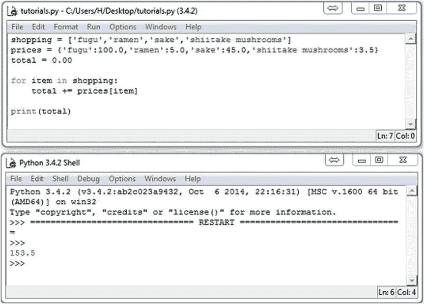

第二章


探索 Python

在前一章中，我们一次输入一行 Python 代码，但现在我们将把交互式解释器放到一边，开始创建 Python 文件。在这一章中，我们将介绍更多 Python 代码的构建模块，并向你展示如何使用类来帮助创建游戏。我们还将解释如何使用所有 Python 安装所附带的代码库。

创建脚本

包含 Python 代码的文件称为*脚本。创建脚本只需要一个简单的文本编辑器，但最好使用编辑器，通常称为“IDE”。IDLE(Python 的标准发行版附带的)是我们在这里将使用的，尽管有许多替代方法。*

要运行一个脚本，你需要在编辑器中编写代码，保存它，然后你通常只需双击它，或者如果你更喜欢命令行，键入`python`后跟一个空格和你的脚本的名称。大多数 Python 编辑器都有一个快捷键来运行您正在编辑的脚本。在空闲状态下运行脚本的快捷方式是 F5 键。要打开 IDLE，如果桌面上有快捷方式，请单击它，或者搜索 IDLE。打开它，你看到的是交互式编辑器。转到文件`新建，这是一个空文档。你在这里写的是你的*剧本*。完成后，您需要保存它，您可以运行它。`

 ` **注意**大多数 Python 编辑器会自动为你缩进。通常默认缩进是四个空格。

运行后(F5 或 Run  Run 模块)，应该会看到另一个窗口弹出，这是*控制台*输出，参见[图 2-1](#Fig1) 。



[图 2-1](#_Fig1) 。空闲的 Python 代码和输出控制台窗口

使用逻辑

不仅仅对于热血的瓦肯人来说，逻辑是任何软件的重要组成部分——包括游戏。任何游戏都需要根据给定或计算的信息做出决策。如果一束激光击中了玩家的悬停坦克，游戏必须决定是否已经造成足够的破坏来摧毁它——如果已经造成，则显示一个爆炸动画。这只是一个例子，为了让我们相信它不仅仅是一台愚蠢的机器，电脑游戏必须做出一系列决定。所以请戴上你的斯波克耳朵，我们将涵盖逻辑。

理解布尔值

计算机使用的逻辑是*布尔*逻辑，这样称呼是因为它是由乔治·布尔在 19 世纪发明的——在 PlayStation 上市前几年。

你已经看到了在上一章中作为 while 循环的一部分使用的逻辑；`count<=5`是一个*逻辑表达式*，像所有逻辑表达式一样，它要么产生`True`要么产生`False`。这些*真值*，正如它们被称为的那样，在做决定时被使用。在 while 循环的情况下，`True`的值告诉 Python 继续循环一次，但是`False`的值导致 Python 跳过代码块。(见[清单 2-1](#list1) 中逻辑表达式的几个例子。)布尔逻辑需要记住的重要一点是，没有中间值:你不可能有 25%的正确和 75%的错误——它总是非此即彼。

[***清单 2-1***](#_list1) 。简单的逻辑

```py
score = 100
health = 60
damage = 50
fugu = "tasty"
print(score != 100)
print(health - damage > 0)
print(fugu == "tasty")
```

运行这个简单的脚本会产生以下输出:

```py
False

True

True
```

 **注** `True`和`False`也有对应的数字:1 代表`True`，0 代表`False`。这是计算机科学的核心，它完全归结为 0 和 1，对应于电信号的存在(1 或`True`)或不存在(0 或`False`)。

布尔值可以像任何其他 Python 类型一样处理，因此可以有一个引用布尔值的变量。例如，如果我们要添加行`is_fugu_tasty = (fugu == "tasty")`，那么`is_fugu_tasty`将引用值`True`。

如果语句

使用`if`语句时，逻辑表达式发挥了自己的作用。只有当条件为真时，才使用`if`语句来运行代码。如果条件为假，那么 Python 会跳过代码块的末尾。下面是一个简单的`if`语句的例子:

```py
if fugu == "tasty":
   print("Eat the fugu!")
```

该条件使用比较运算符(`==`)将变量与字符串进行比较。假设我们使用清单 2-1 中[的值`fugu`，这个比较将产生`True`，这给 Python 运行缩进代码块开了绿灯。](#list1)

逻辑积算符

通常情况下，您需要检查几个条件。假设我们想吃河豚，如果它好吃的话*和*低于 100 美元一盘。我们可以用`and`操作符:将这两个条件结合起来

```py
price = 50.0
if fugu == ("tasty" and price < 100.0):
    print("Eat the fugu!")
```

这里我们只吃河豚，如果`fugu`被设置为`"tasty"` *并且*`price`的值小于`100.0`。

 **注**一个常见的逻辑错误是使用 if 和 and 语句，比如:if 河豚和酱油== "tasty:"认为这是在问河豚和酱油是否都好吃。相反，这只是要求河豚是真实的，酱油是“美味的”。正确的方法应该是:如果河豚==“好吃”，酱油==“好吃”。

[表 2-1](#Tab1) 列出了`and`运算符如何组合值，但我希望它是不言自明的。你可以在现实生活中找到这个操作者；例如，我的汽车只有在电池没有耗尽*和*我还有汽油的情况下才能启动。

[表 2-1](#_Tab1) 。And 运算符的真值表

<colgroup><col width="60%"> <col width="40%"></colgroup> 
| 

逻辑

 | 

结果

 |
| --- | --- |
| `False and False` | `False` |
| `True and False` | `False` |
| `False and True` | `False` |
| `True and True` | `True` |

Or 运算符

为了补充`and`操作符，我们有了`or`操作符，如果第一个或第二个值是`True`，就会产生`True`。假设我们想吃河豚，如果它好吃*或者*它很便宜(毕竟，谁能拒绝便宜的河豚呢？):

```py
if fugu == "tasty" or price < 20.0:
    print("Eat the fugu!")
```

就像`and`运算符一样，`or`运算符在现实生活中有很多应用。如果我没油了，我的车就会停下来*或者*电池没电了。`or`真值表见[表 2-2](#Tab2) 。

[表 2-2](#_Tab2) 。or 运算符的真值表

<colgroup><col width="60%"> <col width="40%"></colgroup> 
| 

逻辑

 | 

结果

 |
| --- | --- |
| `False or False` | `False` |
| `True or False` | `True` |
| `False or True` | `True` |
| `True or True` | `True` |

“非”算符

我们要看的最后一个逻辑运算符是`not`运算符，它交换一个布尔值的状态，因此`True`变成了`False`，而`False`变成了`True`(参见[表 2-3](#Tab3) )。你可以用这个来逆转任何情况:

```py
if not (fugu == "tasty" and price < 100.0):
    print("Don't eat the fugu!")
```

这里我们颠倒了`fugu == "tasty" and price < 100.0`条件，这样 Python 只有在条件为*而不是*真(即假)时才运行代码块。

[表 2-3](#_Tab3) 。Not 运算符的真值表

<colgroup><col width="60%"> <col width="40%"></colgroup> 
| 

逻辑

 | 

结果

 |
| --- | --- |
| `not True` | `False` |
| `not False` | `True` |

else 语句

你可能已经注意到，前面的片段与我们第一个河豚逻辑语句相反。我们有一个在条件为真时发生的动作，另一个在相同的条件不为真时运行。这是一种常见的情况，Python 有一种方法来附加一个替代动作到一个`if`语句上。`else`语句跟在`if`语句之后，引入了一个新的代码块，该代码块只有在条件为假时才会运行。让我们看一个如何使用`else`的例子:

```py
if fugu == "tasty":
    print("Eat the fugu!")
else:
    print("Don't eat the fugu!")
```

Python 运行这段代码时，如果条件为真，就会运行第一条`print`语句；`else`它会运行第二个条件。

elif 语句

通常另一个`if`语句会跟在一个`else`语句之后。Python 将一个`else`后跟一个`if`组合成一条语句:`elif`语句。假设我们想根据价格将河豚分为三类。为了便于讨论，我们将 20-100 美元归类为价格合理的河豚，高于这个范围的归类为昂贵的河豚，低于这个范围的归类为便宜的河豚。Python 可以使用`elif` : 来为我们做这件事

```py
if price < 20:
    print("Cheap fugu!")
elif price < 100:
    print("Reasonably priced fugu.")
else:
    print("Expensive fugu!")
```

这里我们有三个代码块，但是只有一个运行。如果`price`小于 20，那么第一块运行；如果`price`小于 100，并且第一个块为假，那么第二个块将运行；并且`price`的任何其他值将导致第三个块运行。在`if`之后，你可以有任意多的`elif`语句，但是如果你有一个`else`语句，它必须在最后。

了解功能

*函数*是一段存储的 Python 代码，您可以向它传递信息，也可以从它那里获取信息。Python 提供了大量有用的函数(参见[表 2-4](#Tab4) 中的一些例子)，但是你也可以创建自己的函数。

[表 2-4](#_Tab4) 。一些内置的 Python 函数

| 

功能

 | 

描述

 | 

例子

 |
| --- | --- | --- |
| `abs` | 求一个数的绝对值 | `abs(-3)` |
| `help` | 显示任何 Python 对象的使用信息 | `help([])` |
| `len` | 返回字符串或集合的长度 | `len("hello")` |
| `max` | 返回最大值 | `max(3, 5)` |
| `min` | 返回最小值 | `min(3, 4)` |
| `round` | 将浮点数舍入到给定的精度 | `round(10.2756, 2)` |

**如需更全面的 Python 内置函数列表，请参阅 Python 文档，或访问* `http://doc.python.org`。

定义函数

要在 Python 中定义一个函数，您可以使用`def`语句，后跟您想要赋予函数的名称。您可以使用任何您想要的名称，但是给它一个描述它实际做什么的名称是一个好主意！函数名通常是小写的，并且可以使用下划线来分隔单词。清单 2-2 是一个简单的 Python 函数，用于计算河豚的小费。

[***清单 2-2***](#_list2) 。计算河豚的小费

```py
def fugu_tip(price, num_plates, tip):
    total = price * num_plates
    tip = total * (tip / 100)
    return tip

print(fugu_tip(100.0, 2, 15.0))
print(fugu_tip(50.0, 1, 5.0))
```

该脚本产生以下输出:

```py
30.0
2.5
```

当 Python 第一次遇到一个`def`语句时，它知道期待一个函数*定义，*由函数名和括号中的一系列*参数*组成。正如`for`、`while`和`if`语句一样，冒号用于引入代码块(称为函数体*和*)。在前面提到的语句中，代码块不会立即运行——它只是被存储起来，直到需要的时候。调用该函数会导致 Python 跳转到函数体的开头，并将调用中给出的信息赋给每个参数。所以在[清单 2-2](#list2) 中，对`fugu_tip`的第一次调用是在`price`设置为 100、`num_plates`设置为 2、`tip`设置为 15 的情况下运行的。

在`fugu_tip`中唯一没有遇到过的是`return`语句，它告诉 Python 从函数跳回，可能带有一些新信息。在`fugu_tip`的例子中，我们返回提示的值，但是函数可以返回任何 Python 对象。

 **注意**函数中不需要`return`语句。如果没有`return`语句，函数将在到达代码块末尾时返回值`None`——这是一个特殊的 Python 值，表示“这里什么都没有”函数可以用来计算或返回数据，或者它们可以简单地运行一段代码，比如发送一封电子邮件。

你可能已经注意到在`fugu_tip`里面创建了两个变量；这些被称为*局部*变量，因为它们只存在于函数内部。当函数返回时，`total`和`tip`将不再存在于 Python 的内存中——尽管函数外部可能有同名的变量。

默认值

参数可以有一个*默认的*值，如果您没有在函数调用中提供一个值，就使用这个值。如果没有默认值，Python 会在您忘记参数时抛出异常。让我们给`fugu_tip`赋予默认值。我给小费很大方，所以我们将默认的`tip`设为 15(代表餐费的百分比)，由于我不喜欢一个人吃饭，我们将默认的`num_plates`设为 2。

要在 Python 中设置默认值，请在参数名后面附加一个`=`符号，后面跟一个您想要给它的值。参见清单 2-3 中的[以获得带有这些默认值的修改后的`fugu_tip`函数。`fugu_tip`现在可以只用一个值来调用；如果忽略其他两个值，它们会自动填充。函数定义中可以有任意多的默认值，但是带默认值的参数必须出现在参数列表的末尾。](#list3)

[***清单 2-3***](#_list3) 。计算河豚的小费

```py
def fugu_tip(price, num_plates=2, tip=15.):
    total = price * num_plates
    tip = total * (tip / 100.)
    return tip

print(fugu_tip(100.0))
print(fugu_tip(50.0, 1, 5.0))
print(fugu_tip(50.0, tip=10.0))
```

运行此代码将为我们提供以下提示值:

```py
30.0
2.5
10.0
```

你可能已经注意到清单 2-3 中的[有些不寻常。对`fugu_tip`的第三次调用省略了`num_plates`的值，并通过名称设置了`tip`的值。当您像这样显式地设置参数时，它们被称为*关键字*参数。如果您的函数有许多参数，但您只需要设置其中的几个参数，那么它们就很有用。如果没有默认值，参数必须以与参数列表相同的顺序给出。](#list3)

介绍面向对象编程

你可能听说过面向对象编程(OOP)这个术语。但是如果你不熟悉它也不用担心，因为这个概念非常简单。

那么，用面向对象的术语来说，对象到底是什么？嗯，字面上可以是任何东西。在一个游戏中，我们可能有一个粒子的物体——比方说，爆炸产生的燃烧灰烬，或者引起爆炸的悬浮坦克。事实上，整个游戏世界都可能是一个物体。对象的目的是包含信息，并给予程序员用这些信息做事情的能力。

当构造一个对象时，通常最好从计算出它包含什么信息，或*属性*开始。让我们想想在一个被设计成代表未来悬浮坦克的物体中会发现什么。它应至少包含以下属性:

*   坦克在哪里？
*   它面向哪个方向？
*   它跑得有多快？
*   它有多少护甲？
*   它有几个壳？

现在我们有了描述坦克和它在做什么的信息，我们需要给它执行坦克在游戏中需要做的所有动作的能力。在 OOP 中，这些动作被称为*方法*。我能想到下面这些方法是一辆坦克绝对需要的，但可能会更多:

*   `Move`:向前移动坦克。
*   `Turn`:向左/向右旋转水箱。
*   `Fire`:发射炮弹。
*   `Hit`:这是敌方炮弹击中坦克时的动作。
*   用爆炸动画替换坦克。

您可以看到，这些方法通常会更改对象的属性。当使用`Move`方法时，它将更新坦克的`Position`。同样，当使用`Fire`方法时，会更新`Ammo`的值(当然除非没有剩下`Ammo`；然后`Fire`什么都不会做！).

使用类

一个*类*是 Python 定义对象的方式。你以前实际上使用过类；列表，字典，甚至字符串都是类，但是你也可以自己创建。把一个类想象成一个对象的一种*模板*，因为你定义了这个类一次，然后用它来创建你需要的任意多的对象。让我们写一个简单的`Tank`类(见[清单 2-4](#list4))；我们稍后将使用它来创建一个简单的游戏。

[***清单 2-4***](#_list4) 。储罐等级定义示例

```py
class Tank(object):
    def __init__(self, name):
        self.name  = name
        self.alive = True
        self.ammo  = 5
        self.armor = 60
```

当 Python 遇到`class Tank(object):`时，它会创建一个名为`Tank`的类，这个类是从名为`object`的*基类*派生而来的*。从一个类派生意味着建立在它所做的基础上。我们*可以*先创建一个叫`Vehicle`的职业，它可以处理移动和转弯，然后*从它派生*并增加发射武器的能力来创建一辆坦克。这种方法的优点是`Vehicle`可以被重用来给其他游戏实体旋转和移动的能力。对于这个例子，我们没有另一个类来构建，所以我们的基类将是`object`，这是 Python 本身内置的一个简单的类。*

 **注意**我可能给你的印象是`object`做的不多，但实际上它在与类一起工作时在幕后做了很多有用的事情——你只是不直接使用它。

`class`语句后缩进代码块中的所有内容都是*类定义*。在这里，我们设置用于描述对象的属性，并提供它将需要的所有方法。在 Python 中，属性只是存储在对象中的变量，而方法是处理对象的函数。在我们的`Tank`类中，有一个奇怪命名的方法叫做`__init__`，它对 Python 有特殊的意义。当你创建一个对象时，Python 会自动调用这个方法。Python 程序员通常使用它来为对象分配属性，但是在首次创建对象时，您可以做任何其他可能需要的事情。

这个`__init__`方法有两个参数:`self`和`name`。因为方法可能用于许多对象，所以我们需要某种方法来知道我们正在使用哪个对象。这就是`self`的用武之地——它是对 Python 自动提供给所有方法调用的当前对象的引用。第二个参数`(name)`是一个字符串，我们将使用它来区分坦克，因为坦克不止一个。

`__init__`中的代码首先将`name`参数复制到一个属性中，以便我们稍后可以检索它；然后它会分配一些我们需要的其他属性。在我计划的游戏中，我们不需要坦克的大量信息；我们只需要知道坦克是否还活着(`self.alive`)，它还有多少弹药(`self.ammo`，以及它还有多少装甲(`self.armor`)。

 **注意**你不用调用第一个参数`self`。您可以将其命名为任何您想要的名称，但是坚持使用`self`是一个好主意，这样当您阅读您的代码时，您将确切地知道它的用途。Python 程序员倾向于坚持这种约定，所以在交换代码时不会产生混淆。

创建对象

现在我们有了一个坦克定义，我们可以通过调用`Tank`来创建一个新的坦克，我们提供了一个字符串。我们来看一个例子:

```py
my_tank = Tank("Bob")
```

这创建了一个名为 Bob 的新 tank，并调用`__init__`来初始化它。然后坦克鲍勃被分配给变量`my_tank`，这个变量被称为`Tank`类的*实例*。我们现在可以将`my_tank`视为一个单独的对象——将它传递给函数，存储在列表中，等等，或者我们可以单独访问属性。例如，`print my_tank.name`会显示`Bob`。

加入我们的行列

只有一个方法，`Tank`类做不出任何有趣的事情。让我们用清单 2-5 中的一些方法来充实它。

[***清单 2-5***](#_list5) 。扩展坦克等级

```py
def __str__(self):
    if self.alive:
        return "%s (%i armor, %i shells)" % (self.name, self.armor, self.ammo)
    else:
        return "%s (DEAD)" % self.name

def fire_at(self, enemy):
    if self.ammo >= 1:
        self.ammo -= 1
        print(self.name, "fires on", enemy.name)
        enemy.hit()
    else:
        print(self.name, "has no shells!")

def hit(self):
    self.armor -= 20
    print(self.name, "is hit!")
    if self.armor <= 0:
        self.explode()

def explode(self):
    self.alive = False
    print(self.name, "explodes!")
```

清单 2-5 中的第一个方法是另一个特殊的方法。任何名字的开头和结尾都有两个下划线，这对 Python 来说有着特殊的意义。`__str` `__` 的作用是返回一个描述对象的字符串；当您试图用`str`将对象转换成字符串时，它会被调用，这将在您打印它时发生。因此，如果我们要做`print my_tank`，它应该显示一个字符串，其中包含一些关于坦克鲍勃的有用信息。清单 2-5 中的`__str__`根据坦克是活的还是死的返回不同的字符串。如果坦克是活的，那么这一行将运行:

```py
return "%s (%i armor, %i shells)" % (self.name, self.armor, self.ammo)
```

这可能是你以前没见过的。使用`%`操作符将字符串`"%s (%i armor, %i shells)"`与元组`(self.name, self.armor, self.ammo)`组合在一起。这被称为字符串*格式化*，这是创建复杂字符串的一个很好的方式，没有太多的麻烦。字符串中的前两个字符是`%s`，这告诉 Python 用元组中的第一项替换它们，元组是包含坦克名称的字符串。在字符串的后面，Python 到达了`%i`，它被元组中的第二个项目(一个整数)替换，以此类推，直到元组中不再有项目。字符串插值通常比将许多小字符串相加更容易使用。这一行做同样的事情，但是使用简单的字符串连接:

```py
return self.name+" ("+str(self.armor)+" armor, "+str(self.ammo)+" shells)"
```

这有点复杂，因为我相信你会同意！字符串格式化可以用多种方式格式化整数、浮点数和字符串。更多信息参见 Python 文档(`https://docs.python.org/3.4/library/string.html`)。

`Tank`类中的第二个方法`fire_at`是，事情变得有趣起来。它带有参数`enemy`，这是我们想要射击的坦克目标。首先，它检查还有多少`ammo`剩余。如果至少有一发炮弹，则减少`self.ammo`1(因为我们刚刚发射了一发炮弹)，调用敌方坦克的`hit`方法。在敌人坦克的`hit`方法中减少`self.armor`20。如果没有装甲剩余，那么敌人已经死了，所以我们调用它的`explode`方法来标记坦克已经死了。

如果这是一个我们正在开发的图形游戏，这些方法会创造一些视觉效果。`fire_at`将创建一个外壳图像或 3D 模型，并设置其轨迹，`explode`可能会显示某种令人印象深刻的爆炸动画。但是对于这个小测试游戏，我们将只使用几个`print`语句来描述当前正在发生的事情。

清单 2-6 完整地展示了`Tank`类；另存为`tank.py`。如果你运行这个脚本，它什么也不会做，因为它只是定义了`Tank`类。我们将使用游戏代码的其余部分创建另一个 Python 脚本。

[***清单 2-6***](#_list6) 。tank.py

```py
class Tank(object):
    def __init__(self, name):
        self.name  = name
        self.alive = True
        self.ammo  = 5
        self.armor = 60

    def __str__(self):
        if self.alive:
            return "%s (%i armor, %i shells)" % (self.name, self.armor, self.ammo)
        else:
            return "%s (DEAD)" % self.name

    def fire_at(self, enemy):
        if self.ammo >= 1:
            self.ammo -= 1
            print(self.name, "fires on", enemy.name)
            enemy.hit()
        else:
            print(self.name, "has no shells!")

    def hit(self):
        self.armor -= 20
        print(self.name, "is hit!")
        if self.armor <= 0:
            self.explode()

    def explode(self):
        self.alive = False
        print(self.name, "explodes!")
```

实践中的 Python

我们将要创建的游戏与其说是一个游戏，不如说是一个模拟游戏，但它应该足以介绍几个重要的游戏概念。我们将创造一些坦克，让他们互相射击。胜利者只是游戏中剩下的最后一辆坦克。清单 2-7 显示了完成坦克游戏的代码。

[***清单 2-7***](#_list7) 。tankgame.py

```py
from tank import Tank

tanks = {"a":Tank("Alice"), "b":Tank("Bob"), "c":Tank("Carol") }
alive_tanks = len(tanks)

while alive_tanks > 1:

      for tank_name in sorted( tanks.keys() ):
            print(tank_name, tanks[tank_name])

      first = input("Who fires? ").lower()
      second = input("Who at? " ).lower()

      try:
            first_tank = tanks[first]
            second_tank = tanks[second]
      except KeyError as name:
            print("No such tank!", name)
            continue

      if not first_tank.alive or not second_tank.alive:
            print("One of those tanks is dead!")
            continue

      print("*" * 30)

      first_tank.fire_at(second_tank)
      if not second_tank.alive:
          alive_tanks -= 1

      print("*" * 30)

for tank in tanks.values():
      if tank.alive:
         print(tank.name, "is the winner!")
         break
```

当你第一次(以任何语言)看到任何一段代码时，都会有点害怕。但是一旦你把它分解，你会发现它是由熟悉的东西组成的。所以让我们像一个训练有素的厨师准备河豚一样剖析清单 2-7 ！

`tankgame.py`需要做的第一件事就是*导入*我们的坦克模块(tank.py)，里面包含了`Tank`类。当一个新的脚本运行时，它只能访问内置的类，比如字符串和列表。如果您想使用另一个没有直接定义的类，您首先必须从另一个 Python 文件中导入它。行`from tank import Tank`告诉 Python 寻找名为`tank`(假设为`.py`)的模块，并在`Tank`类中读取。另一种方法是做一个简单的`import tank`，让我们访问`tank.py`中的所有内容。

 **注意**当你执行`from tank import Tank`时，它将`Tank`类(大写 T)导入到当前的*名称空间*——这意味着你现在可以使用`Tank`，就像你刚刚将它剪切并粘贴到你的脚本中一样。然而，如果你只是做了`import tank`，你已经导入了 tank 名称空间，这意味着你必须将`Tank`类称为`tank.Tank`，就像在`my_tank = tank.Tank("Bob")`中一样。有关`import`语句的详细信息，请参阅本章后面的“导入简介”一节。

接下来我们创建一个名为`tanks`的字典，它将用于存储我们所有的坦克对象。我们将使用三个，但是如果你喜欢的话，可以随意添加更多的坦克。

```py
tanks = { "a":Tank("Alice"), "b":Tank("Bob"), "c":Tank("Carol") }
alive_tanks = len(tanks)
```

三个坦克都有字符串`"a"`、`"b"`和`"c"`作为关键字，所以我们可以很容易地查找它们。一旦我们创建了自己的坦克，我们就将坦克的数量存储在`alive_tanks`中，这样我们就可以继续计算游戏中的坦克数量:

```py
while alive_tanks > 1:
```

这是一个 while 循环的开始，当有一个以上的坦克幸存时，这个循环会继续下去。游戏的核心总是有一个大循环。对于一个视觉游戏，*主循环*每帧运行一次，以更新和显示视觉效果，但这里的循环代表模拟中的一个回合。

在 while 循环中，我们首先打印一个空行，使每一轮的文本更容易分开。然后，我们有另一个循环，显示每个储罐的一些信息:

```py
print
for tank_name in sorted( tanks.keys() ):
    print(tank_name, tanks[tank_name])
```

字典的`keys`方法返回它所包含的键的列表，但是由于字典的性质，这些键不一定按照它们被添加的顺序。因此，当我们得到`tanks`的键列表时，我们立即将它传递给`sorted`，这是一个内置函数，返回列表的排序副本。

for 循环中的`print`语句在`tanks`字典中查找键，并打印它找到的 tank 对象。记住，打印一个对象调用它的`__str__`函数来获得一些有用的信息。

接下来我们要求用户提供两个坦克:开火的坦克(`first`)和被击中的坦克(`second`):

```py
first  = input("Who fires? ").lower()
second = input("Who at? " ).lower()
```

内置函数`raw_input`显示一个提示，并等待用户输入一些文本，然后以字符串的形式返回。在前面的代码中，我们调用返回字符串的`lower`方法将其转换为小写，因为我们需要一个小写字符串来查找适当的坦克，但是我们不介意用户使用大写字母输入名称。

有了这两个坦克钥匙，我们可以用它们来查找实际的坦克物体。这很简单:我们只需做`tanks[first]`来取回坦克:

```py
try:
    first_tank  = tanks[first]
    second_tank = tanks[second]
except KeyError as name:
    print("No such tank!", name)
    continue
```

但是因为用户可以在提示符下输入任何东西，所以我们需要某种方法来处理用户出错或故意破坏游戏的情况！

每当 Python 无法完成要求它做的事情时，它就会抛出一个异常。如果您不做任何事情来处理这些异常，Python 脚本将会退出——这在真实的游戏中将是灾难性的。幸运的是，预测潜在的异常并在发生时处理它们是可能的。如果`first`或`second`在`tanks`字典中是*而不是*键，那么当我们试图查找它们时，Python 将抛出一个`KeyError`异常。这不会使脚本退出，因为我们在一个`try:`块中查找键，这告诉 Python 代码块*可能会*抛出异常。如果发生了`KeyError`，Python 将跳转到`except KeyError:`下的代码(如果没有异常发生，将被忽略)。

在我们的`KeyError`异常处理程序中，我们首先显示一条简短的消息，通知用户他们做错了什么，然后继续执行一条`continue`语句，告诉 Python 忽略这个循环中的其余代码，并跳回到最内层循环的顶部。

```py
if not first_tank.alive or not second_tank.alive:
   print("One of those tanks is dead!")
   continue
```

这段代码处理一个或两个坦克都死了的情况——因为对一个死了的坦克开火是没有意义的，而且死了的坦克无论如何也不能开火！它只是显示一条消息并执行另一个`continue`。

如果我们已经设法在代码中做到这一点，我们有两个有效的坦克对象:`first_tank`和`second_tank`:

```py
first_tank.fire_at(second_tank)
if not second_tank.alive:
     alive_tanks -= 1
```

第一辆坦克负责开火，所以我们调用它的`fire_at`方法，并将第二辆坦克作为敌人传入。如果第二辆坦克被第一辆杀死(`armor`达到 0)，其`alive`属性将被设置为`False`。当这种情况发生时，`alive_tanks`计数减少 1。

最终，在几轮游戏之后,`alive_tanks`的值将达到 1。当这种情况发生时，主游戏循环将结束，因为它只在`alive_tanks`大于 1 时循环。

最后一段代码的目的是显示哪辆坦克赢得了比赛:

```py
for tank in tanks.values():

    if tank.alive:
        print(tank.name, "is the winner!")
        break
```

这是另一个遍历`tanks.values()`中每个值的循环，是对`keys()`的补充——它给出了我们所有坦克对象的列表。我们知道只有一个坦克的`alive`设置为`True`，所以我们用一个简单的`if`语句来测试它。一旦我们找到最后剩下的坦克，我们打印一个小消息，然后执行`break`语句。`break`语句是`continue`的伙伴，但是它不是跳到循环的开头，而是跳到结尾并停止循环。

这就是我们的小游戏。现在我第一个承认这不是最令人兴奋的游戏。它不是雷神之锤，但即使是雷神之锤也会做类似的事情。所有的 3D 射手必须记录生命值/护甲和弹药，以及谁还活着。不过，到本书结束时，我们的游戏对象将会以令人惊叹的 3D 方式呈现，而不是一行文本。以下是`tankgame.py`的输出:

```py
a Alice (60 armor, 5 shells)
b Bob (60 armor, 5 shells)
c Carol (60 armor, 5 shells)
Who fires? a
Who at? b

******************************
Alice fires on Bob
Bob is hit!
******************************

a Alice (60 armor, 4 shells)
b Bob (40 armor, 5 shells)
c Carol (60 armor, 5 shells)
Who fires?
```

使用标准库

Python 打包了大量的类和函数，被称为*标准库*。这就是为什么 Python 经常被描述为包含*电池*，因为你可以利用 Python 专家编写的代码做任何事情，从三角学到下载网页和发送电子邮件。库被组织成*模块*或包，每个都有特定的用途。你可以通过导入这些模块来使用它们，就像坦克游戏(见清单 2-7 )导入`Tank`类一样。

当您在 Python 中导入内容时，它会首先在当前目录中查找相应的 Python 文件。如果没有找到，Python 会在标准库中寻找一个模块。

让我们看一下标准库中的几个模块。我们不可能涵盖所有的内容——这本身就需要一本书——但是如果您需要任何模块的更多信息，可以看看 Python 发行版附带的文档，或者在`https://docs.python.org/3.4/library/`上在线浏览。

引进进口

有几种方法可以从你自己的代码或者标准库中导入东西。使用哪种方法取决于您希望如何访问模块中包含的类和函数。模块可以用关键字`import`导入，后跟一个模块名。例如，下面的代码行将导入一个名为`mymodule`的模块:

```py
import mymodule
```

以这种方式导入模块会创建一个新的名称空间，这意味着您需要在您使用的任何类或函数之前键入模块的名称和一个点。例如，如果`mymodule`中有一个名为`myfunction`的函数，您可以这样调用它:

```py
mymodule.myfunction()
```

这是从标准库中导入模块的通常方式，因为它将每个模块中的东西分开；如果在不同的模块中有另一个名为`myfunction`的函数，就不会混淆哪个函数被调用。

也可以使用`from`语句从模块中导入特定的类或函数。下面一行将`myclass`从`mymodule`导入到当前名称空间:

```py
from mymodule import myclass
```

如果你只想从模块中得到一些东西，并且你知道它们的名字不会和你的脚本中的任何东西冲突，那么就使用这个方法。您可以通过在每个类、函数之间添加逗号来导入多个类、函数等。所以`from mymodule import myclass`，`myfunction`将从`mymodule`类中导入两个东西。

您可以使用一个`*`符号来表示您想要将模块中的所有内容导入到当前的名称空间中。例如，下面一行将把所有内容从`mymodule`导入到当前名称空间:

```py
from mymodule import *
```

这种导入方法节省了输入时间，因为您不需要模块的名称来引用它——但是只有当模块包含少量内容并且您知道名称不会与脚本中的其他类或函数冲突时，才使用这种方法。对于这种导入来说,`math`模块是一个很好的选择。

最后，您还可以使用单词*作为*来导入模块或模块中的函数，以更改相关的名称。例如:

```py
import mymodule as mm
```

现在，不需要键入 **mymodule** 来引用该模块，只需键入 **mm** 即可。您也可以使用从模块导入的函数来实现这一点。

游戏的有用模块

标准库包含了大量的模块，但是你在游戏中只会用到其中的一小部分。让我们来看看一些更常用的模块。

数学模块

当我告诉人们我不太擅长数学时，他们经常感到惊讶。“可你是电脑程序员啊！”他们惊呼。“没错，”我告诉他们。"我让计算机替我做算术。"Python 内置了基础数学；您可以在不导入特殊模块的情况下进行加法、减法和乘法运算。但是你确实需要`math`模块来实现更高级的功能——那种你可以在科学计算器上找到的东西。其中几个见[表 2-5](#Tab5) 。

[表 2-5](#_Tab5) 。数学模块中的一些函数

| 

功能

 | 

描述

 | 

例子

 |
| --- | --- | --- |
| `sin` | 返回一个数的正弦值，以弧度为单位 | `sin(angle)` |
| `cos` | 返回一个数字的余弦值，以弧度为单位 | `cos(angle)` |
| `tan` | 返回一个数字的正切值，以弧度为单位 | `tan(angle)` |
| `ceil` | 返回大于或等于一个数字的最大整数 | `ceil(3.4323)` |
| `fabs` | 返回数字的绝对值(不带符号) | `fabs(–2.65)` |
| `floor` | 返回小于或等于一个数字的最大整数 | `floor(7.234)` |
| `pi` | 圆周率的值 | `pi*radius**2` |

给定一个圆的半径，让我们使用`math`模块来计算它的面积。如果你还记得学校的话，这个公式是圆周率乘以半径的平方，其中圆周率是一个幻数，等于 3.14 左右。幸运的是 Python 对数字的记忆比我好，你可以相信它对圆周率有更精确的表示。这个函数非常简单，我们将使用交互式解释器:

```py
>>> from math import pi
>>> def area_of_circle(radius):
...     return pi*radius**2
...
>>> area_of_circle(5)
78.53981633974483
```

首先，我们从 math 模块导入 pi。然后，我们定义一个非常简单的函数，它获取半径并返回圆的面积。为了测试它，我们计算一个半径为 5 个单位的圆的面积，结果是 78.5 个单位多一点。

日期时间模块

模块有许多处理日期和时间的函数和类。您可以用它来查询电脑内部时钟的时间，并计算日期之间的时差。这听起来可能是一个简单的任务，因为我们经常对日期进行心算，但当您考虑闰年和时区时，这可能会变得有点复杂！幸运的是，我们可以依靠一些聪明的程序员的工作，让 Python 毫不费力地做到这一点。在`datetime`模块中有一个同名的类。让我们用它来查找当前时间:

```py
>>> from datetime import datetime
>>> the_time = datetime.now()
>>> the_time.ctime()
'Thu Feb 19 13:04:14 2015'
```

从`datetime`模块导入`datetime`类后，我们调用函数`now`返回一个带有当前时间的`datetime`对象。函数`now`就是所谓的*静态*方法，因为你在一个类上使用它，而不是用那个类创建的一个对象。一旦我们将当前日期和时间存储在`the_time`中，我们就调用`ctime`方法，该方法以字符串的形式返回时间的友好表示。显然，当您运行它时，它将返回不同的结果。

那么在游戏中找时间有什么用呢？嗯，你可能想存储一个保存游戏和高分的时间戳。你也可以把游戏和一天中的当前时间联系起来，这样中午的时候会很明亮和阳光灿烂，但是如果你在晚上玩的话，会很黑暗和阴沉。请看一下[表 2-6](#Tab6) ，你可以在`datetime`模块中找到一些东西。

[表 2-6](#_Tab6) 。日期时间模块中的一些类

<colgroup><col width="30%"> <col width="70%"></colgroup> 
| 

班级

 | 

描述

 |
| --- | --- |
| `timedelta` | 存储两个时间之间的差异 |
| `date` | 存储日期值 |
| `datetime` | 存储日期和时间值 |
| `time` | 存储时间值 |

随机模块

当您得知`random`模块用于生成随机数时，您不会感到惊讶，尽管您可能会惊讶地发现它生成的数字并不是真正随机的。这是因为计算机实际上不能随机选择某些东西；在相同的条件下，他们会再次做同样的事情。`random`生成的数字是*伪随机*，这意味着它们是从一个很长的数字序列中抽取的，这些数字看起来是随机的，但如果你生成足够多的数字，它们最终会重复出现。幸运的是，你可以在游戏中使用它们，因为没有人会注意到它们重复了几十亿次！

随机(或伪随机数)在游戏中非常有用，可以防止它们变得可预测。如果一个游戏没有随机元素，玩家最终会记住所有的动作序列，使它变得不那么有趣(对大多数人来说)。

让我们写一个简短的脚本来模拟一个标准六面骰子的十次投掷([清单 2-8](#list8) )。

[***清单 2-8***](#_list8) 。骰子模拟器

```py
import random
for roll in range(10):
    print(random.randint(1,6))
```

哇，就三行。所有这些只是导入`random`模块，然后调用`random.randint`十次并打印结果。函数`randint`带两个参数`a`和`b`，返回一个在`a`到`b`范围内的伪随机数(可能包括结束值)。所以`randint(1, 6)`像骰子一样返回 1、2、3、4、5 或 6。

 **注意**你可能已经注意到在[清单 2-8](#list8) 中`roll`的值实际上从来没有在循环中使用过。对`xrange(10)`的调用生成了从 0 到 9 的数字，但是我们忽略了它们，因为我们感兴趣的只是重复循环十次。与其为一个从未使用过的值想一个名字，不如用一个下划线代替它。所以清单 2-8 中的循环可能会被重写为`for _ in range(10):`。

虽然[清单 2-8](#list8) 产生的数字看起来是随机的，但它们实际上是*伪随机的*，这意味着它们是从一个大的数学生成的序列中选择的。有时候，您可能需要重复一系列伪随机数——例如，在播放演示时。您可以通过调用`random.seed`函数告诉`random`模块从序列中的特定点开始生成数字。如果你用相同的值调用它两次，它将导致`random`模块重现相同的数字序列。[清单 2-9](#list9) 展示了如何使用`seed`函数来创建可预测的序列。

[***清单 2-9***](#_list9) 。一个更好的骰子模拟器

```py
import random
random.seed(100)

for roll in range(10):
    print(random.randint(1, 6))

print("Re-seeded")
random.seed(100)

for roll in range(10):
    print(random.randint(1, 6))
```

如果您运行这个小脚本，您将看到相同的数字序列，重复两次。查看[表 2-7](#Tab7) ，了解`random`模块的一些功能。

[表 2-7](#_Tab7) 。随机模块中的一些函数

<colgroup><col width="30%"> <col width="70%"></colgroup> 
| 

功能

 | 

描述

 |
| --- | --- |
| `seed` | 播种随机数生成器 |
| `randint` | 返回两个值之间的随机整数 |
| `choice` | 从集合中选择一个随机元素 |
| `random` | 返回介于 0 和 1 之间的浮点数 |

摘要

我们已经看到，您可以在 Python 代码中使用布尔逻辑来做出决策。`if`语句接受一个布尔表达式，比如`a > 3`，并且仅当该条件导致`True`时才运行一个代码块。您可以在一个`if`语句后添加一个或多个`else`语句，这些语句仅在条件为`False`时运行它们的代码块。使用`and`和`or`运算符可以合并逻辑，使用`not`运算符可以反转逻辑。

函数存储在 Python 代码中，用`def`语句创建。当您定义函数时，您指定一个参数列表，该列表是函数运行和可选返回值所需的信息列表。许多内置函数可供您使用。

面向对象编程是一个简单概念的花哨术语。它仅仅意味着存储描述某个事物所需的信息以及处理这些信息的大量操作。在游戏中，几乎所有的东西都会被定义为一个对象。Python 类是用`class`语句定义的，您可以将它视为创建新对象的模板。在一个`class`语句中创建的函数被称为*方法*，除了第一个参数是方法应用的对象之外，它与其他函数相似。`__init__`函数是一个特殊的方法，当一个对象第一次被创建时被调用；您使用它来初始化包含在对象中的信息，或*属性*。

Python 有一个很大的标准库，可以做各种有用的事情。该库被组织成多个模块，其中可以包含类、函数或其他 Python 对象。

在下一章，我们将介绍如何使用 Pygame 模块打开一个窗口并显示图形。`