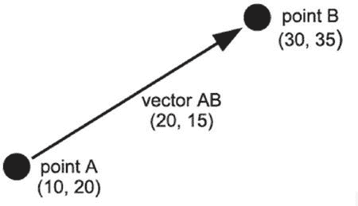
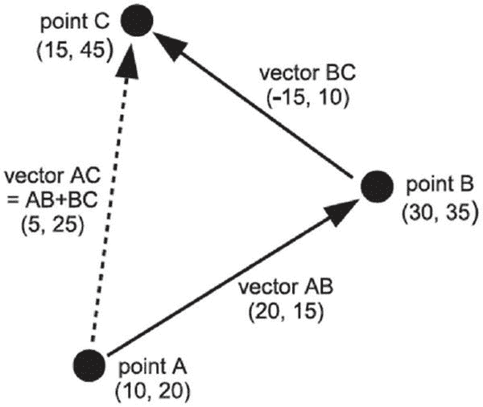

第五章


让东西动起来

在现实世界中，物体以各种不同的方式移动，这取决于它们在做什么，游戏必须近似这些运动，以创建令人信服的虚拟表示。一些游戏可以摆脱不切实际的运动——例如，吃豆人以恒定的速度沿直线移动，可以在瞬间改变方向，但如果你在驾驶游戏中将这种运动应用到汽车上，就会破坏这种幻觉。毕竟，在驾驶游戏中，你会期望赛车需要一些时间来达到全速，它绝对不应该能够在一瞬间转向 180 度！

对于有一点现实感的游戏，游戏程序员必须考虑是什么让事物移动。我们来看一个典型的驾驶游戏。不管车辆是自行车、拉力赛车还是半挂卡车，都有一个来自发动机的力驱动它前进。还有其他的力量在作用。车轮的阻力会随着你行驶路面的不同而不同，所以车辆在泥地上的操控会和在柏油路面上不同。当然还有重力，它不断地将汽车拉向地球(玩家可能不会注意到这一点，直到他试图跳过一个峡谷)！事实上，可能有成百上千的其他力联合起来产生了车辆的运动。

幸运的是，对于我们这些游戏程序员来说，我们只需要模拟其中的一些力，就可以创造出令人信服的运动错觉。一旦我们的模拟代码编写完成，我们就可以将它应用于游戏中的许多对象。举个例子，重力会影响一切(除非游戏设定在太空中)，所以我们可以将重力相关的代码应用到任何物体上，无论是扔过来的手榴弹，还是从悬崖上掉下来的坦克，还是从空中飞过的斧头。

本章描述了如何以可预测的方式在屏幕上移动对象，以及如何在其他人的计算机上保持一致。

了解帧速率

关于电脑游戏中的运动，我们需要知道的第一件事是，没有什么是真正运动的——至少在任何物理意义上不是。电脑屏幕或电视机向我们展示了一系列图像，当图像之间的时间足够短时，我们的大脑会将这些图像混合起来，创造出一种流体运动的幻觉，就像一本翻书一样。产生平滑运动所需的图像数量，或称*帧*，因人而异。电影使用每秒 24 帧，但电脑游戏往往需要更快的帧速率。每秒 30 帧是一个不错的目标，但一般来说，帧速率越高，运动看起来就越平滑——尽管每秒 70 帧后，很少有人能察觉到任何改善，即使他们声称他们可以！

游戏的帧速率还受到显示设备(如显示器)每秒钟刷新次数的限制。例如，我的液晶显示器的刷新率为 60 赫兹，这意味着它每秒钟刷新显示器 60 次。生成比刷新率更快的帧会导致所谓的“撕裂”，即下一帧的一部分与前一帧相结合。

获得一个好的帧速率通常意味着牺牲视觉效果，因为你的电脑做的工作越多，帧速率就越慢。好消息是，你桌面上的电脑可能已经快得足以生成你想要的视觉效果了。

直线运动

让我们从研究简单的直线运动开始。如果我们每帧移动一幅图像一个固定的量，那么它看起来会移动。要水平移动它，我们将增加到 x 坐标，要垂直移动它，我们将增加到 y 坐标。清单 5-1 演示了如何水平移动图像。它在指定的 x 坐标绘制一个图像，然后将值 10.0 添加到每一帧，这样在下一帧它将会向右移动一点。当 x 坐标经过屏幕的右边缘时，它被设置回 0，这样它就不会完全消失。移动的 2D 图像通常被称为*精灵*。

[***清单 5-1***](#_list1) 。简单直线移动(simplemove.py)

```py
import pygame
from pygame.locals import *
from sys import exit

background_image_filename = 'sushiplate.jpg'
sprite_image_filename = 'fugu.png'

pygame.init()

screen = pygame.display.set_mode((640, 480), 0, 32)

background = pygame.image.load(background_image_filename).convert()
sprite = pygame.image.load(sprite_image_filename)

# The x coordinate of our sprite
x = 0.

while True:

    for event in pygame.event.get():
        if event.type == QUIT:
            pygame.quit()
            exit()

    screen.blit(background, (0,0))
    screen.blit(sprite, (x, 100))
    x += 1

    # If the image goes off the end of the screen, move it back
    if x > 640:
        x -= 640

    pygame.display.update()
```

如果你运行[清单 5-1](#list1) ，你会看到河豚图像从左向右滑动。这正是我们想要的效果，但是清单 5-1[的设计有一个缺陷。问题是我们无法确切知道将图像绘制到屏幕上需要多长时间。它看起来相当平滑，因为我们正在创建一个非常简单的框架，但在游戏中，绘制框架的时间将根据屏幕上的活动量而变化。我们不希望一个游戏在变得有趣的时候变慢。另一个问题是](#list1)[清单 5-1](#list1) 中的精灵在功能较弱的计算机上会运行得较慢，而在功能较强的计算机上会运行得较快。

是时候了

解决这个问题的诀窍是让运动*基于时间*。我们需要知道从上一帧开始已经过了多长时间，这样我们就可以相应地在屏幕上定位所有的东西。`pygame.time`模块包含一个`Clock`对象，我们可以用它来记录时间。要创建一个时钟对象，调用它的构造函数`pygame.time.Clock` :

```py
clock = pygame.time.Clock()
```

一旦你有了一个时钟对象，你应该每帧调用它的成员函数`tick`一次，该函数返回从上一次调用开始经过的时间，单位是毫秒(一秒钟有 1000 毫秒):

```py
time_passed = clock.tick()
```

`tick`函数也为最大帧速率取一个可选参数。如果游戏在桌面上运行，您可能希望设置此参数，这样它就不会占用计算机的所有处理能力:

```py
# Game will run at a maximum 30 frames per second
time_passed = clock.tick(30)
```

毫秒通常用于游戏中的事件计时，因为处理整数值比分数时间更容易，每秒 1，000 次时钟滴答声对于大多数游戏任务来说通常足够准确。也就是说，在处理速度等问题时，我通常更喜欢以秒为单位，因为对我来说，每秒 250 像素比每毫秒 0.25 像素更有意义。从毫秒到秒的转换就像除以 1，000 一样简单:

```py
time_passed_seconds = time_passed / 1000.0
```

 **注意**如果你没有使用 Python 3+一定要除以一个浮点值 1000.0。如果不包括浮点，结果将向下舍入到最接近的整数！

那么我们如何使用`time_passed_seconds`来移动一个精灵呢？我们需要做的第一件事是为精灵选择一个速度。假设我们的精灵以每秒 250 像素的速度移动。在这个速度下，sprite 将在 2.56 秒内覆盖 640 像素屏幕的宽度(640 除以 250)。接下来我们需要计算出精灵从上一帧开始在这么短的时间内移动了多远，并将这个值加到 x 坐标上。数学很简单:只要将精灵的速度乘以`time_passed_seconds`。[清单 5-2](#list2) 在[清单 5-1](#list1) 的基础上增加了基于时间的移动，并且不管你运行精灵的计算机的速度如何，都会以相同的速度移动精灵。

[***清单 5-2***](#_list2) 。基于时间的移动(timebasedmovement.py)

```py
import pygame
from pygame.locals import *
from sys import exit

background_image_filename = 'sushiplate.jpg'
sprite_image_filename = 'fugu.png'

pygame.init()

screen = pygame.display.set_mode((640, 480), 0, 32)

background = pygame.image.load(background_image_filename).convert()
sprite = pygame.image.load(sprite_image_filename)

# Our clock object
clock = pygame.time.Clock()

# X coordinate of our sprite
x = 0

# Speed in pixels per second
speed = 250

while True:

    for event in pygame.event.get():
        if event.type == QUIT:
            pygame.quit()
            exit()

    screen.blit(background, (0,0))
    screen.blit(sprite, (x, 100))

    time_passed = clock.tick()
    time_passed_seconds = time_passed / 1000.0

    distance:moved = time_passed_seconds * speed
    x += distance:moved

    if x > 640:
        x -= 640

    pygame.display.update()
```

理解游戏中的帧速率和精灵速度之间的区别是很重要的。如果你在一台慢速电脑和一台快速电脑上并排运行清单 5-2 中的[,那么河豚将会出现在每一个屏幕上的相同位置，但是与快速电脑相比，慢速电脑上的河豚移动将会不稳定。与其在两台不同的机器上运行这个脚本，不如让我们写一个脚本来模拟这种差异(见](#list2)[清单 5-3](#list3) )。

[***清单 5-3***](#_list3) 。帧速率和速度比较(frameratecompare.py)

```py
import pygame
from pygame.locals import *
from sys import exit

background_image_filename = 'sushiplate.jpg'
sprite_image_filename = 'fugu.png'

pygame.init()

screen = pygame.display.set_mode((640, 480), 0, 32)

background = pygame.image.load(background_image_filename).convert()
sprite = pygame.image.load(sprite_image_filename)

# Our clock object
clock = pygame.time.Clock()

x1 = 0
x2 = 0
# Speed in pixels per second
speed = 250

frame_no = 0

while True:

    for event in pygame.event.get():
        if event.type == QUIT:
            pygame.quit()
            exit()

    screen.blit(background, (0,0))
    screen.blit(sprite, (x1, 50))
    screen.blit(sprite, (x2, 250))

    time_passed = clock.tick(30)
    time_passed_seconds = time_passed / 1000.0

    distance:moved = time_passed_seconds * speed
    x1 += distance:moved

    if (frame_no % 5) == 0:
        distance:moved = time_passed_seconds * speed
        x2 += distance:moved * 5

    # If the image goes off the end of the screen, move it back
    if x1 > 640:
       x1 -= 640
    if x2 > 640:
       x2 -= 640

    pygame.display.update()
    frame_no += 1
```

如果你运行清单 5-3 中的，你会看到两个精灵在屏幕上移动。最上面的一个以每秒 30 帧的速度移动，或者在你的计算机允许的范围内尽可能平滑地移动；另一种通过每五帧更新一次来模拟慢速计算机。你应该看到，虽然第二个精灵的移动非常不平稳，但它实际上以相同的平均速度移动。因此，对于使用基于时间的运动的游戏，较低的帧速率将导致不太愉快的观看体验，但实际上不会减慢动作。

 **注意**虽然写得好的游戏在低帧率下仍然可以玩，但如果运动太不稳定，人们就会失去玩游戏的兴趣。就我个人而言，我不想玩一个运行速度远低于每秒 15 帧的游戏，它会变得非常令人迷惑！

对角线运动

直线运动是有用的，但是如果所有东西都水平或垂直移动，游戏可能会变得很无聊。我们需要能够在我们选择的任何方向移动精灵，我们可以通过调整每一帧的 x *和 y*坐标来做到这一点。 [清单 5-4](#list4) 通过向两个坐标添加基于时间的移动来设置一个沿对角线方向移动的精灵。这个清单还添加了一些琐碎的“冲突检测”当精灵越过边缘时，它不会将精灵推回到初始位置，而是向相反的方向反弹。

[***清单 5-4***](#_list4) 。简单的对角线移动(diagonalmovement.py)

```py
import pygame
from pygame.locals import *
from sys import exit

background_image_filename = 'sushiplate.jpg'
sprite_image_filename = 'fugu.png'

pygame.init()

screen = pygame.display.set_mode((640, 480), 0, 32)

background = pygame.image.load(background_image_filename).convert()
sprite = pygame.image.load(sprite_image_filename).convert_alpha()

clock = pygame.time.Clock()

x, y = 100, 100
speed_x, speed_y = 133, 170

while True:

    for event in pygame.event.get():
        if event.type == QUIT:
            pygame.quit()
            exit()

    screen.blit(background, (0,0))
    screen.blit(sprite, (x, y))

    time_passed = clock.tick(30)
    time_passed_seconds = time_passed / 1000.0

    x += speed_x * time_passed_seconds
    y += speed_y * time_passed_seconds

    # If the sprite goes off the edge of the screen,
    # make it move in the opposite direction
    if x > 640 - sprite.get_width():
        speed_x = -speed_x
        x = 640 - sprite.get_width()
    elif x < 0:
        speed_x = -speed_x
        x = 0

    if y > 480 - sprite.get_height():
        speed_y = -speed_y
        y = 480 - sprite.get_height()
    elif y < 0:
        speed_y = -speed_y
        y = 0

    pygame.display.update()
```

为了实现这一反弹，我们首先必须意识到我们已经触及了一个边缘。这是通过一些简单的坐标数学计算完成的。如果 x 坐标小于 0，我们知道我们已经越过了屏幕的左边，因为左边的坐标是 0。如果 x *加上子画面的宽度*大于屏幕的宽度，我们知道子画面的*右边缘*已经碰到了屏幕的右边缘。y 坐标的代码类似，但是我们使用子画面的高度而不是宽度:

```py
if x > 640 – sprite.get_width():
     speed_x = –speed_x
     x = 640 – sprite.get_width()
elif x < 0:
     speed_x = –speed_x
     x = 0
```

我们已经看到，将基于时间的值添加到 sprite 的 x 和 y 坐标会创建一个对角线移动。在[清单 5-4](#list4) 中，我随机选择了`speed_x`和`speed_y`的值，因为在这个演示中，我并不关心精灵最终会出现在哪里。然而，在真实的游戏中，我们会希望为精灵选择一个最终目的地，并相应地计算`speed_x`和`speed_y`。最好的方法是用*向量*。

探索矢量

我们使用两个值来生成对角线运动:一个是位置的 x 分量的速度，另一个是 y 分量的速度。这两个值的组合形式就是所谓的*向量*。向量是游戏开发者从数学中借用的东西，它们被用于许多领域，包括 2D 和 3D 游戏。

向量与点相似，都有 x 和 y 的值(在 2D)，但它们有不同的用途。坐标(10，20)处的点将始终是屏幕上的同一个点，但是(10，20)的向量意味着*从当前位置*开始在 x 坐标上加 10，在 y 坐标上加 20。所以你可以认为一个点是一个从原点(0，0)开始的向量。

创建向量

您可以通过从第二个点中减去第一个点中的值来计算任意两个点的向量。让我们用一个虚构游戏的例子来演示一下。玩家角色——一个来自未来名叫阿尔法的机器人战士——必须用狙击步枪摧毁一个贝塔级的哨兵机器人。阿尔法躲在坐标 A (10，20)的灌木丛后面，瞄准坐标 B (30，35)的贝塔。为了计算到目标的矢量 AB，Alpha 必须从 a 中减去 B 的分量。因此矢量 AB 是(30，35)–(10，20)，也就是(20，15)。这告诉我们，从 A 到 B，我们必须在 x 方向走 20 个单位，在 y 方向走 15 个单位(见[图 5-1](#Fig1) )。游戏需要这些信息来激活投射武器或在两点之间画出激光束。



[图 5-1](#_Fig1) 。创建向量

存储矢量

Python 中没有内置的 vector 类型，但是对于所有的数字，最常用的模块是 NumPy。NumPy 是一个 C 优化模块，用于处理 Python 中各种数值运算。NumPy 的网址是:`http://www.numpy.org/`。要安装 NumPy，您很可能需要完成与安装 PyGame 相同的操作。最简单的方法是在命令行/终端中使用 pip 和

```py
pip install numpy
```

虽然我们可以利用 NumPy，但我相信使用 NumPy 会混淆幕后实际发生的事情，尤其是如果这是您第一次使用矢量和矩阵进行游戏开发。在我们研究这些例子的时候，我将介绍如何自己编写向量和矩阵运算的程序，并为您指出模拟相同运算的 NumPy 功能的方向。

***清单 5-5*** 。简单向量定义

```py
class Vector2:

    def __init__(self, x=0, y=0):
        self.x = x
        self.y = y

    def __str__(self):
        return "(%s, %s)"%(self.x, self.y)
```

为了定义一个向量，我们现在可以使用`Vector2`对象。例如，调用`my_vector = Vector2(10, 20)`会产生一个名为`my_vector`的`Vector2`对象。我们可以将向量的分量分别称为`my_vector.x`和`my_vector.y`。

我们应该添加到我们的`Vector2`类中的第一件事是从两点创建一个向量的方法，因为这是创建向量最常见的方法(见[清单 5-6](#list6) )。

[***清单 5-6***](#_list6) 。点的向量

```py
class Vector2:

    def __init__(self, x=0, y=0):
        self.x = x
        self.y = y

    def __str__(self):
        return "(%s, %s)"%(self.x, self.y)

    def from_points(P1, P2):
        return Vector2(P2[0] - P1[0], P2[1] - P1[1])
```

前面的操作`(P2[0] - P1[0], P2[1] - P1[1])`，可以通过导入 NumPy 模块然后做`(numpy.array(P1) - numpy.array(P1))`来实现。[清单 5-7](#list7) 展示了我们如何使用我们的类来创建两点之间的向量。

[***清单 5-7***](#_list7) 。测试`from_points`方法

```py
A = (10.0, 20.0)
B = (30.0, 35.0)
AB = Vector2.from_points(A, B)
print(AB)
```

执行此示例会产生以下输出:

```py
(20.0, 15.0)
```

矢量幅度

从 A 到 B 的矢量的大小是这两点之间的距离。继续赛博士兵主题，阿尔法的燃料量有限，需要计算从 A 到 B 的距离才能知道他是否能到达 B，我们已经计算出矢量 AB 为(20，15)。星等会告诉我们他需要行进的距离。

要计算一个矢量的大小，先对分量求平方，将它们相加，然后求结果的平方根。所以一个矢量(20，15)的大小是 20 *20 + 15 *15 的平方根，也就是 25(见[图 5-2](#Fig2) )。让我们给我们的`Vector2`添加一个方法来计算震级([清单 5-8](#list8) )。


[图 5-2](#_Fig2) 。创建向量

[***清单 5-8***](#_list8) 。向量幅度函数

```py
import math

class Vector2:

    def __init__(self, x=0, y=0):
        self.x = x
        self.y = y

    def __str__(self):
        return "(%s, %s)"%(self.x, self.y)

    def from_points(P1, P2):
        return Vector2( P2[0] - P1[0], P2[1] - P1[1] )

    def get_magnitude(self):
        return math.sqrt( self.x**2 + self.y**2 )

A = (10.0, 20.0)
B = (30.0, 35.0)
AB = Vector2.from_points(A, B)
print(AB)
print(AB.get_magnitude())

(20.0, 15.0)
25.0
```

第`math.sqrt(self.x**2 + self.y**2`行进行幅度计算。Python 中的`**`运算符将一个值提升到幂，因此我们可以像`math.sqrt(self.x*self.x + self.y*self.y)`一样轻松地编写计算。如果您要将 numpy 作为 np 导入，您可以通过以下方式执行类似的操作:

```py
np.sqrt(T.dot(T))
```

前面是其中 T 是平移向量(在我们的例子中是 AB)。

最后几行创建一个测试向量，然后调用我们刚刚添加的`get_magnitude`。如果你手边有一些绘图纸，你可能想画出点 A 和 B，并验证两者之间的距离是 25.0。

单位向量

向量实际上描述了两件事:大小*和*方向。例如，士兵 Alpha 可以使用向量 AB 来计算他必须行进多远(幅度)，但是向量也告诉他应该面向哪个方向(方向)。通常这两条信息在一个向量中捆绑在一起，但偶尔你只需要其中一条。我们已经了解了如何计算幅度，但我们也可以通过将分量除以幅度来删除矢量中的幅度信息。这叫做*归一化*矢量，并产生一种特殊的矢量叫做*单位矢量* 。单位向量的长度始终为 1，通常用于表示方向。当我们进入第三维度时，你会发现它们对于从碰撞检测到照明的一切都是必不可少的。让我们给`Vector2`添加一个方法，该方法将向量归一化，并将其转换为单位向量(见[清单 5-9](#list9) )。

[***清单 5-9***](#_list9) 。测试单位向量法

```py
import math

class Vector2:

    def __init__(self, x=0, y=0):
        self.x = x
        self.y = y

    def __str__(self):
        return "(%s, %s)"%(self.x, self.y)

    def from_points(P1, P2):
        return Vector2( P2[0] - P1[0], P2[1] - P1[1] )

    def get_magnitude(self):
        return math.sqrt( self.x**2 + self.y**2 )

    def normalize(self):
        magnitude = self.get_magnitude()
        self.x /= magnitude
        self.y /= magnitude

A = (10.0, 20.0)
B = (30.0, 35.0)
AB = Vector2.from_points(A, B)
print("Vector AB is", AB)
print("Magnitude of Vector AB is", AB.get_magnitude())
AB.normalize()
print("Vector AB normalized is", AB)
```

执行该脚本会产生以下输出:

```py
Vector AB is (20.0, 15.0)
Magnitude of Vector AB is 25.0
Vector AB normalized is (0.8, 0.6)
```

向量加法

向量加法将两个向量组合成一个向量，具有两者的组合效果。假设士兵阿尔法在拿起 B 点机器人守卫的东西后，必须在 C 点(15，45)与一艘补给船会合。从 B 到 C 的向量是(–15，10)，这意味着他必须在 x 方向上后退 15 个单位，并在 y 方向上继续前进 5 个单位。如果我们把 BC 矢量的分量加到 AB 矢量上，我们得到一个从 A 到 C 的矢量(见[图 5-3](#Fig3) )。



[图 5-3](#_Fig3) 。向量加法

要将矢量加法添加到我们的矢量库中，我们*可以*创建一个名为`add`的方法，然后调用`AB.add(BC)`返回 AB 和 BC 相加的结果，但是如果我们可以简单地调用`AB+BC`会更自然。Python 为我们提供了一种方法。通过定义一个名为 __ `add__`的特殊方法，我们可以让 Python 知道如何将`Vector2`的两个实例加在一起。当 Python 看到`AB+BC`时，会尝试调用`AB. __add__(BC)`，所以我们要定义`__add__`返回一个包含计算结果的新对象。这被称为*操作符过载*。所有的基本运算符都有类似的特殊方法，比如减法(`–`)的`__sub__`和乘法(`*`)的`__mul__`。[清单 5-10](#list10) 用一个`__add__`方法扩展了 vector 类。

 **注意**如果你使用列表或元组来存储你的向量，不要试图用+运算符把它们加在一起。在 Python 中(1，2)+(3，4)是*不是* (4，6)；实际上是(1，2，3，4)，这不是一个有效的 2D 向量。

[***清单 5-10***](#_list10) 。将`__add__`方法添加到我们的`Vector2`类

```py
import math

class Vector2:

    def __init__(self, x=0, y=0):
        self.x = x
        self.y = y

    def __str__(self):
        return "(%s, %s)"%(self.x, self.y)

    def from_points(P1, P2):
        return Vector2( P2[0] - P1[0], P2[1] - P1[1] )

    def get_magnitude(self):
        return math.sqrt( self.x**2 + self.y**2 )

    def normalize(self):
        magnitude = self.get_magnitude()
        self.x /= magnitude
        self.y /= magnitude

    # rhs stands for Right Hand Side
    def __add__(self, rhs):
        return Vector2(self.x + rhs.x, self.y + rhs.y)

A = (10.0, 20.0)
B = (30.0, 35.0)
C = (15.0, 45.0)

AB = Vector2.from_points(A, B)
BC = Vector2.from_points(B, C)

AC = Vector2.from_points(A, C)
print("Vector AC is", AC)

AC = AB + BC
print("AB + BC is", AC)
```

执行该脚本会产生以下输出:

```py
Vector AC is (5.0, 25.0)
AB + BC is (5.0, 25.0)
```

向量减法

减去一个矢量意味着沿着矢量指向的*与*相反的方向前进。如果士兵阿尔法被迫从一个装备精良的机器人面前撤退，他可能会计算出一个到对手的矢量，然后从他当前的位置减去这个矢量，找到他正后方的一个点。向量减法的数学与加法非常相似，但是我们从分量中减去而不是加上。[清单 5-11](#list11) 展示了一个从另一个向量中减去一个向量的方法，你可以把它添加到`Vector2`类中。注意，与典型的方法不同，这个方法有双下划线，就像您看到的 __init__ 方法一样。由于我们已经创建了自己的对象类型，Python 不知道它可能具有或不具有什么样的属性。因此，为了让 python 像我们希望的那样处理减号这样的符号，我们需要添加处理这些动作的方法。

如果不添加这些方法，Python 中会出现一个错误，说明 TypeError:不支持的操作数类型-:“Vector2”和“vector 2”

[***清单 5-11***](#_list11) 。向量减法

```py
def __sub__(self, rhs):
        return Vector2(self.x - rhs.x, self.y - rhs.y)
```

向量否定

让我们假设士兵阿尔法到达了 B 点，却发现他忘了带备用电池；他怎么能算出一个向量回到 A(即向量 BA)？他*可以让*重新计算给定的分数，但是另一个选择是*否定*已经计算过的矢量 AB。对向量求反会创建一个指向相反方向的相同长度的向量。所以——AB 和 BA 是一样的。要求向量的反，只需求分量的反。清单 5-12 是一个做否定的成员函数，你可以把它添加到`Vector2`类中。

[***清单 5-12***](#_list12) 。向量否定

```py
def __neg__(self):
        return Vector2(-self.x, -self.y)
```

向量乘法和除法

也可以将一个向量乘以(或除以)一个*标量*(一个数)，这具有改变向量长度的效果。简单地将每个分量乘以或除以标量值。[清单 5-13](#list13) 向我们的`Vector2`类添加了两个方法来实现乘法和除法功能。

[***清单 5-13***](#_list13) 。向量乘法和除法

```py
def __mul__(self, scalar):
        return Vector2(self.x * scalar, self.y * scalar)

def __truediv__(self, scalar):
        return Vector2(self.x / scalar, self.y / scalar)
```

如果你把任何一个向量乘以 2.0，它的大小就会翻倍；如果你把一个向量除以 2.0(或者乘以 0.5)，它的大小会减半。将一个矢量乘以一个大于 0 的数会产生一个指向相同方向的矢量，但是如果你乘以一个小于 0 的数，产生的矢量会“翻转”并指向相反的方向(见[图 5-4](#Fig4) )。


[图 5-4](#_Fig4) 。将一个向量乘以一个标量

 **注意**一个向量乘以另一个向量也是可能的，但是在游戏中并不常用，你可能永远也不会需要它。

那么，士兵阿尔法可能会如何使用向量乘法——或者更准确地说，游戏程序员会如何使用它？向量乘法有助于根据时间将向量分解成更小的步长。如果我们知道α可以在 10 秒内覆盖从 A 到 B 的距离，我们可以通过使用一点向量代码来计算α每秒后的坐标。[清单 5-14](#list14) 展示了如何使用`Vector2`类来做这件事。

[***清单 5-14***](#_list14) 。计算位置

```py
A = (10.0, 20.0)
B = (30.0, 35.0)
AB = Vector2.from_points(A, B)
step = AB * .1
position = Vector2(*A)
for n in range(10):
    position += step
    print(position)
```

这会产生以下输出:

```py
(12.0, 21.5)
(14.0, 23.0)
(16.0, 24.5)
(18.0, 26.0)
(20.0, 27.5)
(22.0, 29.0)
(24.0, 30.5)
(26.0, 32.0)
(28.0, 33.5)
(30.0, 35.0)
```

在计算了点 A 和 B 之间的向量后，[清单 5-14](#list14) 创建了一个向量`step`，它是 AB 向量的十分之一。循环内部的代码将这个值添加到`position`，这是我们将用来存储 Alpha 当前位置的另一个向量。我们这样做十次，阿尔法旅程的每一秒一次，在我们前进的时候打印出当前的`position`向量。最终，经过十次迭代，我们到达了 B 点，安然无恙！如果你得到输出并画出这些点，你会看到它们从 A 到 b 形成了一条完美的直线。

在两点之间移动时，像这样计算中间位置是很重要的。您还可以使用向量来计算重力、外力和摩擦力下的运动，以创建各种真实的运动。

使用矢量来创造运动

现在我们已经介绍了向量，我们可以使用它们以各种方式移动游戏角色，并实现简单的基于力的物理，使游戏更有说服力。

对角线运动

让我们使用矢量来创建更准确的对角线运动。我们如何以恒定的速度将精灵从屏幕上的一个位置移动到另一个位置？第一步是创建一个从当前位置到目的地的向量(使用`Vector2.from_points`或类似的东西)。我们只需要这个向量中的方向信息，而不需要大小，所以我们对它进行归一化，得到精灵的*方向*。在游戏循环中，我们计算精灵用`speed * time_passed_seconds`移动了多远，然后乘以方向向量。产生的矢量给了我们`x`和`y`自前一帧以来的变化，所以我们把它添加到精灵位置。

为此，我们需要修改向量。在这里，我们正在创建自己的对象，我们获得并需要修改的所有信息都是一个“Vector2”对象。这就是为什么我们必须添加像 __add__、__sub__，等等这样的方法。要修改这些数据，我们还需要几个方法:__getitem__ 和 __setitem__。这些方法允许我们引用一个索引，并将该索引的值设置为其他值。我们在这里不使用它，但是如果您想要移除或删除一个索引，您将需要一个 __delitem__ 方法。最后，我们需要为 __getitem__ 方法添加一些处理，允许我们的数据被视为一个列表。

***清单 5-15*** 。向矢量脚本添加 getitem 和 setitem，并修改 __init__ 方法

```py
def __init__(self, x=0, y=0):
    self.x = x
    self.y = y

    if hasattr(x, "__getitem__"):
        x, y = x
        self._v = [float(x), float(y)]
    else:
        self._v = [float(x), float(y)]

def __getitem__(self, index):
    return self._v[index]

def __setitem__(self, index, value):
    self._v[index] = 1.0 * value
```

游戏对象向量类

我们之前构建的`Vector2`类对于基础向量数学来说已经足够好了，你可以用它作为你自己的向量类的起点(几乎每个游戏开发者都在某个时候写过向量类！).然而，要快速启动并运行，你可以使用我作为*游戏对象*的一部分编写的`Vector2`类，这是一个简化编写游戏的框架。您可以从`https://github.com/PythonProgramming/Beginning-Game-Development-with-Python-and-Pygame`T5 下载游戏物品。

`Vector2`类是`gameobjects`名称空间中更大的类集合的一部分。您可以从 GitHub 下载 gameobjects 库(如前所列)，或者您可以从我们刚刚构建的 vector 功能开始构建自己的库！要做到这一点，你需要做的就是，在你正在编写的 python 脚本所在的目录/文件夹中，添加一个新文件夹，命名为 gameobjects。现在，以我们一直在做的脚本为例，将其命名为 vector2.py。确保 vector2.py 只包含类和其中的方法，删除类外的行。这意味着您应该删除以下内容:

```py
A = (10.0, 20.0)
B = (30.0, 35.0)
AB = Vector2.from_points(A, B)
step = AB * .1
position = Vector2(*A)
for n in range(10):
    position += step
    print(position)
```

如果您将代码(如前面的代码)留在模块中，然后导入该模块，则剩余的代码将在您导入脚本时运行。当您导入某些内容时，就好像您已经运行了那批代码。您可以做的一件事是使用 if 语句来检查模块是否正在独立运行，或者它是否已经被导入。为此，您应该这样做:

```py
if __name__ == "__main__":
    A = (10.0, 20.0)
    B = (30.0, 35.0)
    AB = Vector2.from_points(A, B)
    step = AB * .1
    position = Vector2(*A)
    for n in range(10):
        position += step
        print(position)
```

现在你应该有一个 gameobjects 目录，和你正在编写的脚本在同一个目录中，vector2.py 应该在 gameobjects 目录中。

[清单 5-16](#list16) 使用向量实现基于时间的移动。当你运行它时，你会看到一个精灵一动不动地停在屏幕上，但一旦你点击屏幕，代码将计算一个向量到新的位置，并设置精灵以每秒 250 像素的速度移动。如果你再次点击，将会计算出一个新的向量，精灵将会改变它的方向朝向鼠标。

[***清单 5-16***](#_list16) 。使用向量进行基于时间的移动(vectormovement.py)

```py
import pygame
from pygame.locals import *
from sys import exit
from gameobjects.vector2 import Vector2

background_image_filename = 'sushiplate.jpg'
sprite_image_filename = 'fugu.png'

pygame.init()

screen = pygame.display.set_mode((640, 480), 0, 32)

background = pygame.image.load(background_image_filename).convert()
sprite = pygame.image.load(sprite_image_filename).convert_alpha()

clock = pygame.time.Clock()

position = Vector2(100.0, 100.0)
speed = 250
heading = Vector2()

while True:

    for event in pygame.event.get():
        if event.type == QUIT:
            pygame.quit()
            exit()
        if event.type == MOUSEBUTTONDOWN:
            destination = Vector2(*event.pos) - (Vector2(*sprite.get_size())/2)
            heading = Vector2.from_points(position, destination)
            heading.normalize()

    screen.blit(background, (0,0))
    screen.blit(sprite, (position.x, position.y))

    time_passed = clock.tick()
    time_passed_seconds = time_passed / 1000.0

    distance:moved = time_passed_seconds * speed
    position += heading * distance:moved
    pygame.display.update()
```

目的地计算可能需要一点解释。它使用`Vector2`类找到一个点，将我们的精灵直接放在鼠标坐标上。当用在函数调用的参数前时，`*`符号展开一个元组或列表。所以`Vector2(*event.pos)`相当于`Vector2(event.pos[0], event.pos[1])`，会用鼠标的位置创建一个矢量。类似的代码用于创建一个向量，该向量包含 sprite 图形的一半尺寸。像这样使用向量可能会被认为是滥用数学概念，但如果它能节省我们一点时间，这是值得的。[清单 5-17](#list17) 展示了我们如何在不滥用向量的情况下重写计算。

[***清单 5-17***](#_list17) 。长距离计算目的地坐标

```py
destination_x = event.pos[0] – sprite.get_width()/2.0
destination_y = event.pos[1] – sprite.get_height()/2.0
destination = (destination_x, destination_y)
```

摘要

移动精灵或屏幕上的任何其他东西，都需要在每一帧的坐标上添加小值，但如果您希望移动平滑且一致，则需要基于当前时间，或者更具体地说，是自上一帧以来的时间。使用基于时间的运动对于在尽可能多的计算机上运行游戏也很重要——计算机可以在每秒钟生成的帧数方面有很大差异。

我们已经介绍了矢量，它是任何游戏开发者工具箱中必不可少的一部分。向量简化了你在编写游戏时要做的大量数学工作，你会发现它们非常通用。如果你想花时间来构建我们在本章中探索的`Vector2`类，这是非常值得做的，但是你可以使用游戏对象库中的`Vector2`类(你可以从书中的源代码下载这个)来节省时间。这也是我们将在接下来的章节中用到的。

二维运动的技术很容易扩展到三维。您会发现,`Vector3`类包含了许多在`Vector2`类中使用的方法，但是增加了一个组件(z)。

现在是开始尝试在屏幕上移动东西和混合各种动作的好时机。通过在屏幕上创建您的朋友和家人的图形，并让他们滑动和弹跳，可以获得很多乐趣！

在下一章，你将学习如何连接输入设备，比如键盘和游戏杆到精灵，这样玩家就可以和游戏世界互动。