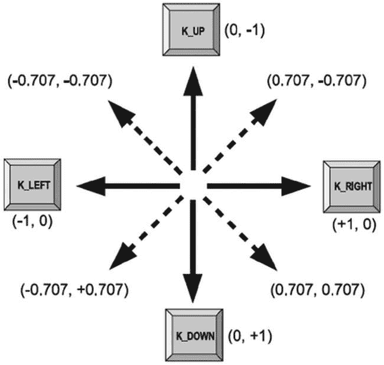
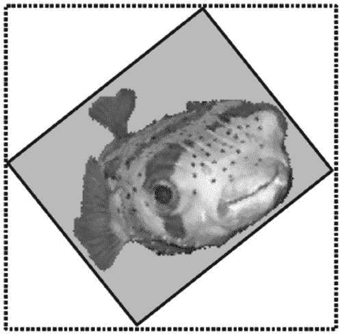
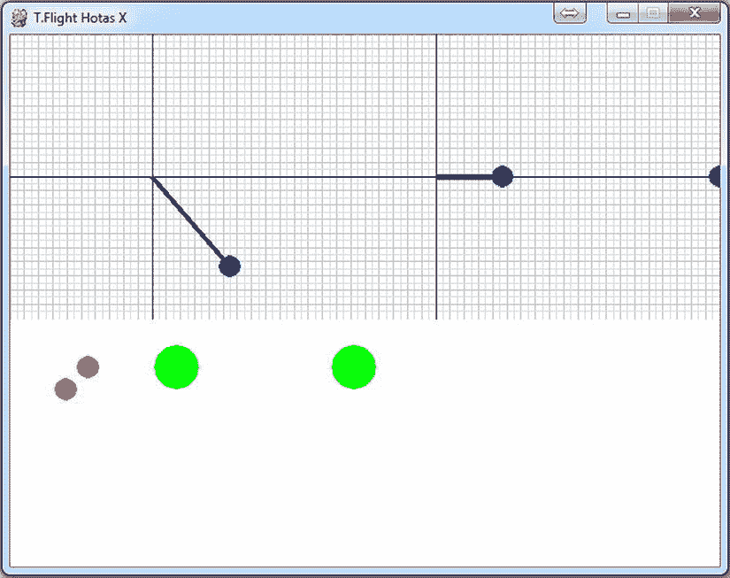

# 六、接受用户输入

玩家可以通过多种方式与游戏互动，本章将详细介绍各种输入设备。除了从设备中检索信息，我们还将探索如何将玩家所做的转化为游戏中有意义的事件。这对任何游戏来说都是极其重要的——不管一个游戏看起来和听起来有多好，它也必须易于交互。

控制游戏

在一台典型的家用电脑上，我们可以非常依赖键盘和鼠标。这种古老的设置是第一人称射击爱好者的首选，他们喜欢用鼠标控制头部移动(即四处张望)，并保持一只手在键盘上进行方向控制和射击。键盘 可以通过为四个基本方向分配一个键来进行运动:上、下、左、右。通过组合按下这些键(上+ 右、下+ 右、下+ 左、上+ 左)，可以指示另外四个方向。但是八个方向对于大多数游戏来说仍然是非常有限的，所以它们不太适合需要一点技巧的游戏。

大多数玩家更喜欢鼠标这样的*模拟*设备。标准鼠标是方向控制的理想选择，因为它可以准确地检测到任何方向的任何东西，从微小的调整到快速的扫描。如果你玩过仅用键盘控制的第一人称射击游戏，你就会体会到其中的不同。按下“向左旋转”键会使玩家像机器人一样匀速旋转，这远不如能够快速转身射击从侧面靠近的怪物有用。

键盘和鼠标很适合玩游戏，这可能有点讽刺，因为这两款设备在设计时都没有考虑到游戏。然而，操纵杆和游戏手柄、纯粹是为游戏而设计的，并随着他们用来玩的游戏一起发展。第一个操纵杆是模仿飞机上使用的控制器设计的，有一个简单的方向杆和一个按钮。它们在当时的游戏控制台中很受欢迎，但玩家发现必须用一只手抓住操纵杆基座，同时用另一只手移动操纵杆是不舒服的。这导致了游戏手柄的发展，这种手柄可以用双手握着，但仍然可以让玩家很容易地用手指和拇指控制。第一个游戏手柄的一边是方向控制，另一边是触发按钮。如今，游戏手柄上有许多按钮，到处都有多余的手指可以按下它们，还有几根棍子。经典的方向键仍然可以在游戏手柄上找到，但大多数也有可以检测微调的*模拟*杆。许多游戏还有*力反馈*功能，它可以通过让游戏手柄响应屏幕上的事件而震动或发出隆隆声来为游戏增加额外的维度。毫无疑问，未来还会有其他功能添加到游戏手柄中，进一步增强游戏体验。

还有其他设备可以用于游戏，但大多数都是模仿标准的输入设备。因此，如果你的游戏可以用鼠标玩，它也可以用这些类似鼠标的设备玩。游戏输入设备不断改进；考虑一下虚拟现实的现状，比如 Oculus Rift，它模拟了一些你在游戏中以“自由视角”操作鼠标时可能会遇到的情况。然而，这里的不同之处在于，你现在有了类似鼠标的设备、键盘，然后是 Oculus Rift，可以为游戏提供更多输入。我想你已经确信输入和处理输入很重要，让我们来谈谈键盘吧！

了解键盘控制

今天使用的大多数键盘是 *QWERTY* 键盘，这样称呼是因为第一行字母的前六个字母拼成 QWERTY。品牌之间存在差异；按键的形状和大小可能略有不同，但它们在键盘上的位置大致相同。这是一件好事，因为电脑用户不想每次买了新键盘都要重新学习如何打字。我用过的所有键盘都有五排标准的打字键:一排用于功能键 F1-F12，四个*光标*键用于在屏幕上移动插入符号。他们也有一个“数字小键盘”，这是一组用于输入数字和做加法的按键，以及其他一些杂七杂八的按键。为了节省空间，笔记本电脑键盘上的数字小键盘经常被省略，因为数字键在键盘的主要部分是重复的。我们可以用`pygame.key`模块检测所有这些按键。

 **注意**虽然 QWERTY 是最常见的，但它并不是唯一的键盘布局；还有其他键盘如 AZERTY 和 Dvorak 。可以使用相同的键盘常量，但是按键可能位于键盘上的不同位置。如果您让玩家选择他们自己的键在游戏中使用，他们可以选择最适合他们键盘的控制键。

检测按键

在 Pygame 中有两种方法可以检测按键。一种方法是处理`KEYDOWN`事件，当一个键被按下时发出，以及`KEYUP`事件，当该键被释放时发出。这对于输入文本非常有用，因为即使从上一帧开始按下*和*键，我们也会得到键盘事件。事件还会捕捉到快速点击点火按钮的按键。但是当我们使用键盘输入进行移动时，我们只需要在绘制下一帧之前知道该键是否被按下。在这种情况下，我们可以更直接地使用`pygame.key`模块。

键盘上的每个键都有一个与之关联的*键常量*，它是一个我们可以用来在代码中识别该键的值。每个常数以`K_`开头。有字母(`K_a`到`K_z`)、数字(`K_0`到`K_9`)，还有很多其他的常量比如`K_f1`、`K_LEFT`、`K_RETURN`。完整列表见 Pygame 文档(`https://www.pygame.org/docs/ref/key.html`)。因为`K_a`到`K_z`都有常量，你可能会期望有等价的大写版本——但是没有。之所以这样，是因为大写字母是组合键(Shift + key)的结果。如果您需要检测大写字母或其他移位的键，请在包含此类组合键结果的键事件中使用`Unicode`参数。

我们可以使用`pygame.key.get_pressed`函数来检测一个键是否被按下。它返回一个布尔值列表 ( `True`或`False`值)，每个关键常量一个。要查找一个特定的键，使用它的常量作为按键列表的索引。例如，如果我们使用空格键作为发射按钮，我们可以编写如下的触发代码:

```py
pressed_keys = pygame.key.get_pressed()
if pressed_keys[K_SPACE]:
    # Space key has been pressed
    fire()
```

应该讨论的是，各种键盘具有关于它们支持多少同时按键的各种规则。如果你看看游戏键盘，你会发现它们几乎总是列出支持多少个同时按键作为卖点。许多廉价键盘只支持 3-5 个同时按键，而游戏键盘可以支持 25 个或更多。

在许多游戏中，你可能有一个关键蹲下，向前移动，扫射一点，慢慢移动。也许当你在做这种斜蹲慢射的时候，你想通过按下数字 5 来切换到你的手榴弹。你可能会发现按 5 的时候什么都不会发生！恐怖啊！要是你买了 Pro Gamer X“9000 多”键盘就好了！

你不仅应该考虑到你的玩家可能没有最好的键盘，记住他们总共只有十个手指，但通常只有五个手指可以真正使用，因为一只手可能放在鼠标上。然而，有很多游戏玩家会用一个手指按下两个或更多的键。

此外，你可能要考虑那些使用游戏手柄的人，他们的按钮数量可能非常有限。

记住所有这些，让我们写一个脚本来试验键盘。[清单 6-1](#list1) 使用`get_pressed`函数检测任何被按下的键，并在屏幕上显示它们的列表。

[***清单 6-1***](#_list1) 。测试按下的按键(keydemo.py)

```py
import pygame
from pygame.locals import *
from sys import exit

pygame.init()
screen = pygame.display.set_mode((640, 480), 0, 32)

font = pygame.font.SysFont("arial", 32);
font_height = font.get_linesize()

while True:

    for event in pygame.event.get():
        if event.type == QUIT:
            pygame.quit()
            exit()

    screen.fill((255, 255, 255))

    pressed_key_text = []
    pressed_keys = pygame.key.get_pressed()
    y = font_height

    for key_constant, pressed in enumerate(pressed_keys):
        if pressed:
            key_name = pygame.key.name(key_constant)
            text_surface = font.render(key_name+" pressed", True, (0,0,0))
            screen.blit(text_surface, (8, y))
            y+= font_height

        pygame.display.update()
```

在[清单 6-1](#list1) 获得作为布尔值列表的按键后，它进入一个`for`循环，遍历每个值。您会注意到，该循环通过调用`enumerate`间接迭代按下的键，这是一个内置函数，它返回索引的元组(第一个值为 0，第二个值为 1，依此类推)和迭代列表中的值。如果迭代的值(`pressed`)是`True`，那么那个键被按下了，我们输入一个小代码块在屏幕上显示出来。这个代码块使用了键盘模块中的另一个函数`pygame.key.name`，它接受一个按键常量并返回一个带有按键描述的字符串(也就是说，它将`K_SPACE`变成了`"space"`)。

在这里，你可以测试你的键盘`—`它支持多少个键？您可能会发现，在某些情况下，您可以支持多达 8 个或更多，但在其他情况下，可能只有 4 个，或者类似的情况。这是由于键盘的工作方式(参见:`http://www.sjbaker.org/wiki/index.php?title=Keyboards_Are_Evil`了解更多信息)。我有一个 2005 年的键盘，它只支持清单 6-1 中的[的四个键，但是我的主键盘是一个游戏键盘，我可以按下尽可能多的键。然而，我没有试图用我的脚。](#list1)

你可能会注意到，当你运行[清单 6-1](#list1) 时，它会显示`numlock pressed`，尽管你当时并没有接触它。这是因为 numlock 是一个特殊的键，可以在键盘上切换状态。打开后，数字小键盘可以用来输入数字。但当它关闭时，数字小键盘用于滚动和导航文本的其他键。另一个类似的键是 Caps Lock 键。如果你点击 Caps Lock，[清单 6-1](#list1) 将显示`caps lock pressed`，即使它已经被释放。再次轻按以停用大写锁定状态。还有一个键可以做到这一点，那就是滚动锁(在个人电脑键盘上)，现在已经不常使用了。这三个键不应该用作触发器，因为 Pygame 无法改变这种行为。

让我们更详细地看一下`pygame.key`模块:

*   一个 Pygame 窗口只在窗口被聚焦时接收关键事件，通常是通过点击窗口标题栏。所有顶层窗口都是如此。如果窗口有焦点并且可以接收按键事件，`get_focused`函数返回`True`；否则返回`False`。当 Pygame 以全屏模式运行时，它将始终拥有焦点，因为它不必与其他应用共享屏幕。
*   `key.get_pressed`—返回每个键的布尔值的列表。如果任何值被设置为`True`，则该索引的键被按下。
*   `key.get_mods`—返回单个值，指示按下了哪个修饰键。修饰键是与其他键结合使用的键，如 Shift、Alt 和 Ctrl。要检查修改键是否被按下，使用带有一个`KMOD_`常量的按位 AND 运算符(`&`)。例如，要检查左 Shift 键是否被按下，您可以使用`pygame.key.get_mods() & KMOD_LSHIFT`。
*   `pygame.key.set_mods`—您也可以设置一个修饰键来模仿按键被按下的效果。要设置一个或多个修饰键，请将`KMOD_`常量与按位 or 运算符(|)结合使用。例如，要设置 Shift 和 Alt 键，你可以使用`pygame.key.set_mods(KMOD_SHIFT | KMOD_ALT)`。
*   `pygame.key.set_repeat`—如果你打开你最喜欢的文本编辑器，按住一个字母键，你会看到短暂的延迟后该键开始重复，如果你想多次输入一个字符，而不是多次按下和释放，这很有用。您可以使用`set_repeat`函数让 Pygame 向您发送重复的`KEY_DOWN`事件，该函数获取一个键重复之前的初始延迟值和一个重复键之间的延迟值。这两个值都以毫秒为单位(每秒 1000 毫秒)。您可以通过不带参数调用`set_repeat`来禁用按键重复。
*   `pygame.key.name`—此函数采用一个`KEY_`常量，并返回该值的描述性字符串。这对于调试很有用，因为当代码运行时，我们只能看到一个关键常量的值，而看不到它的名字。例如，如果我得到一个值为 103 的键的`KEY_DOWN`事件，我可以使用`key.name`打印出该键的名称(在本例中是“g”)。

用键进行方向移动

您可以使用键盘通过分配上、下、左、右键在屏幕上移动精灵。任何键都可以用于定向移动，但最明显的是*光标*键，因为它们是为定向移动而设计的，并且放在合适的位置，可以单手操作。第一人称射击爱好者也习惯于使用 W、A、S 和 D 键来移动。

那么我们如何把按键变成定向运动呢？与大多数类型的运动一样，我们需要创建一个指向我们想要去的方向的方向向量。如果只按下四个方向键中的一个，航向矢量就相当简单。[表 6-1](#Tab1) 列出了四个基本方向矢量。

[表 6-1](#_Tab1) 。简单方向向量

| 

方向

 | 

矢量

 |
| --- | --- |
| 左边的 | -1, 0 |
| 对吧 | +1, 0 |
| 起来 | 0, -1 |
| 向下 | 0, 1 |

除了水平和垂直移动，我们希望用户能够通过同时按下两个键来对角移动。例如，如果按下向上键和向右键，精灵应该沿对角线向屏幕的右上角移动。我们可以通过添加两个简单的向量来创建这个对角向量。如果我们把`(0.0, –1.0)`和右边的`(1.0, 0,0)`加起来，就得到了`(1.0, –1.0)`，它把*和*指向右边，但是我们不能用这个作为航向矢量，因为它不再是单位矢量(长度为 1)。如果我们把它作为一个方向向量，我们会发现我们的精灵在对角线上的移动速度比垂直或水平方向都要快，这并不是很有用。

在我们使用我们计算的航向之前，我们应该通过归一化把它变回一个单位向量，这给我们一个大约为`(0.707, –0.707)`的航向。参见图 6-1 中从简单向量计算出的对角向量的直观描述。



[图 6-1](#_Fig1) 。通过组合简单向量得到对角向量

清单 6-2 实现了这种定向运动。当您运行它时，您会看到一个 sprite，它可以通过按下任何光标键来水平或垂直移动，或者通过同时按下两个光标键来对角移动。

如果您运行清单 6-2 而不修改我们的 vector2.py 文件，您会发现一个错误，这个错误是由于试图将某个数除以零而产生的。您可以在 normalize 方法中处理这个问题:

```py
def normalize(self):
        magnitude = self.get_magnitude()

        try:
            self.x /= magnitude
            self.y /= magnitude
        except ZeroDivisionError:
            self.x = 0
            self.y = 0
```

如果你试图除以零，那么 x 和 y 一定是零。因此，你可以像前面的例子一样很容易地解决它。现在我们准备好让一些东西动起来:

[***清单 6-2***](#_list2) 。简单方向移动(keymovement.py)

```py
import pygame
from pygame.locals import *
from sys import exit
from gameobjects.vector2 import Vector2

background_image_filename = 'sushiplate.jpg'
sprite_image_filename = 'fugu.png'

pygame.init()

screen = pygame.display.set_mode((640, 480), 0, 32)
background = pygame.image.load(background_image_filename).convert()
sprite = pygame.image.load(sprite_image_filename).convert_alpha()

clock = pygame.time.Clock()

sprite_pos = Vector2(200, 150)
sprite_speed = 300

while True:

    for event in pygame.event.get():
        if event.type == QUIT:
            pygame.quit()
            exit()

    pressed_keys = pygame.key.get_pressed()

    key_direction = Vector2(0, 0)

    if pressed_keys[K_LEFT]:
        key_direction.x = -1
    elif pressed_keys[K_RIGHT]:
         key_direction.x = +1
    if pressed_keys[K_UP]:
        key_direction.y = -1
    elif pressed_keys[K_DOWN]:
        key_direction.y = +1

    key_direction.normalize()

    screen.blit(background, (0,0))
    screen.blit(sprite, (sprite_pos.x,sprite_pos.y))

    time_passed = clock.tick(30)
    time_passed_seconds = time_passed / 1000.0

    sprite_pos += key_direction * sprite_speed * time_passed_seconds

    pygame.display.update()
```

[清单 6-2](#list2) 在计算方向向量时作弊了一点。如果按下`K_LEFT`或`K_RIGHT`，则将 x 分量设置为–1 或+1，如果按下`K_UP`或`K_DOWN`，则将 y 分量设置为–1 或+1。这与将两个简单的水平和垂直航向矢量相加的结果相同。如果你曾经看到一个数学捷径，让你用更少的代码做一些事情，请随意尝试一下——游戏开发者发现他们积累了许多这样节省时间的宝石！

你可能已经注意到，只有八个矢量用于这个矢量运动。如果我们预先计算这些向量，并将它们直接插入到代码中，我们可以减少运行脚本时所做的工作量。如果你喜欢挑战，这是一个值得做的练习，但由于计算方向向量每帧只做一次，加速它不会对帧速率产生明显的影响。留意像这样的情况；减少游戏创建一个画面所需的工作量被称为*优化*，当有大量动作发生时，这变得更加重要。

用键旋转运动

向八个方向移动有点人为，因为在现实生活中你不会看到很多东西像这样移动。大多数可移动的东西可以自由旋转，但只能向它们所指的方向移动，或者向后移动——但绝对不止八个方向。我们仍然可以使用相同的上、下、左、右键来模拟这种情况，但是我们必须改变这些键控制的内容。我们想要做的是用左右键来控制旋转，用前后键来控制移动，这将给我们的精灵向任何方向移动的能力。清单 6-3 使用完全相同的一组按键，但是使用这个自由旋转控件在屏幕上移动精灵。

[***清单 6-3***](#_list3) 。自由旋转控制(keyrotatemovement.py)

```py
import pygame
from pygame.locals import *
from sys import exit
from gameobjects.vector2 import Vector2
from math import *

background_image_filename = 'sushiplate.jpg'
sprite_image_filename = 'fugu.png'

pygame.init()

screen = pygame.display.set_mode((640, 480), 0, 32)

background = pygame.image.load(background_image_filename).convert()
sprite = pygame.image.load(sprite_image_filename).convert_alpha()

clock = pygame.time.Clock()

sprite_pos = Vector2(200, 150)
sprite_speed = 300
sprite_rotation = 0
sprite_rotation_speed = 360 # Degrees per second

while True:

    for event in pygame.event.get():
        if event.type == QUIT:
            pygame.quit()
            exit()
    pressed_keys = pygame.key.get_pressed()

    rotation_direction = 0.
    movement_direction = 0.

    if pressed_keys[K_LEFT]:
        rotation_direction = +1.0
    if pressed_keys[K_RIGHT]:
        rotation_direction = -1.0
    if pressed_keys[K_UP]:
        movement_direction = +1.0
    if pressed_keys[K_DOWN]:
        movement_direction = -1.0

    screen.blit(background, (0,0))

    rotated_sprite = pygame.transform.rotate(sprite, sprite_rotation)
    w, h = rotated_sprite.get_size()
    sprite_draw_pos = Vector2(sprite_pos.x-w/2, sprite_pos.y-h/2)
    screen.blit(rotated_sprite, (sprite_draw_pos.x,sprite_draw_pos.y))

    time_passed = clock.tick()
    time_passed_seconds = time_passed / 1000.0

    sprite_rotation += rotation_direction * sprite_rotation_speed * time_passed_seconds

    heading_x = sin(sprite_rotation*pi/180.0)
    heading_y = cos(sprite_rotation*pi/180.0)
    heading = Vector2(heading_x, heading_y)
    heading *= movement_direction

    sprite_pos+= heading * sprite_speed * time_passed_seconds

    pygame.display.update()
```

清单 6-3 的工作方式与前一个例子相似，但是它计算航向的方式不同。我们不是通过按下任何键来创建方向向量，而是通过子画面的旋转来创建方向向量(存储在变量`sprite_rotation`中)。当按下适当的键时，我们修改的就是这个值。当右键被按下时，我们增加精灵旋转，把它转向一个方向。当左键被按下时，我们从旋转中减去，使它转向相反的方向。

为了从旋转中计算航向矢量，我们必须计算角度的*正弦*和*余弦*，这可以用`math`模块中的`sin`和`cos`函数来完成。`sin`函数计算 x 分量，`cos`计算 y 分量。这两个函数都以*弧度*表示角度(一个圆有 2 * pi 弧度)，但是因为[清单 6-3](#list3) 使用度数，它必须通过乘以 pi 并除以 180°将旋转转换成弧度。在我们从两个组件中组合航向矢量后，它可以像以前一样用于给我们基于时间的运动。

在[清单 6-3](#list3) 显示精灵之前，精灵被旋转，这样我们可以看到它面向哪个方向。这是通过来自`transform`模块的一个名为`rotate`的函数来完成的，该函数获取一个表面加上一个角度，并返回一个包含旋转精灵的新表面。这个函数的一个问题是返回的精灵可能与原始精灵的尺寸不同(见[图 6-2](#Fig2) )，所以我们不能将它 blit 到与未旋转的精灵相同的坐标，否则它将被绘制在屏幕上的错误位置。解决这个问题的一个方法是在一个位置绘制 sprite，将 sprite 图像的中心放在 sprite 在屏幕上的位置的下面。这样，不管旋转表面的大小，精灵都将在屏幕上的相同位置。



[图 6-2](#_Fig2) 。旋转曲面会改变其大小

实现鼠标控制

鼠标的历史几乎和键盘一样长。多年来，鼠标的设计没有太大变化——设备变得更符合人体工程学(手形),但设计保持不变。

经典鼠标下面有一个橡皮球，可以在桌子或鼠标垫上滚动。球的运动由鼠标内部与球接触的两个滚轮获得。现在，几乎所有的鼠标都是激光鼠标，精度更高。朋友们可以恶作剧移除彼此的鼠标球的日子已经一去不复返了，但现在我们可以用胶带纸盖住激光孔，也同样有趣。

随着时间的推移，越来越多的鼠标也有了各种按钮。几乎所有的电脑都有一个可以滚动的鼠标滚轮，可以作为第三个遥控器。还有很多鼠标都有各种各样的按钮。

游戏经常利用这些鼠标创新。额外的按钮总是方便快捷地进入游戏控制，鼠标滚轮可以在第一人称射击游戏中切换武器！当然，当用狙击枪干掉敌人时，激光鼠标的额外准确性总是很有用。

用鼠标旋转移动

您已经看到在屏幕上绘制鼠标光标非常简单:您只需从`MOUSEMOTION`事件或直接从`pygame.mouse.get_pos`函数中获得鼠标的坐标。如果您只想显示鼠标光标，这两种方法都可以，但是鼠标移动也可以用于控制绝对位置以外的其他东西，例如在 3D 游戏中旋转或上下查看。在这种情况下，我们不能直接使用鼠标位置，因为坐标将被限制在屏幕的边缘，我们不希望玩家被限制向左或向右转动的次数！在这些情况下，我们希望获得鼠标的相对运动，通常称为鼠标*鼠标键*，这只是意味着从上一帧开始鼠标已经移动了多远。清单 6-4 在精灵演示中增加了鼠标旋转运动。除了光标键，当鼠标向左或向右移动时，精灵也会旋转。

 **警告**如果你打算复制、粘贴并运行这段代码，请注意，要退出，你将*而不是*能够使用你的鼠标。您将使用键盘上的 Esc 键退出游戏！

[***清单 6-4***](#_list4) 。旋转鼠标移动(mouserotatemovement.py)

```py
import pygame
from pygame.locals import *
from sys import exit
from gameobjects.vector2 import Vector2
from math import *

background_image_filename = 'sushiplate.jpg'
sprite_image_filename = 'fugu.png'

pygame.init()
screen = pygame.display.set_mode((640, 480), 0, 32)

background = pygame.image.load(background_image_filename).convert()
sprite = pygame.image.load(sprite_image_filename).convert_alpha()

clock = pygame.time.Clock()

pygame.mouse.set_visible(False)
pygame.event.set_grab(True)

sprite_pos = Vector2(200, 150)
sprite_speed = 300.
sprite_rotation = 0.
sprite_rotation_speed = 360\. # Degrees per second

while True:

    for event in pygame.event.get():
        if event.type == QUIT:
            pygame.quit()
            exit()
        if event.type == KEYDOWN:
            if event.key == K_ESCAPE:
                pygame.quit()
                exit()

    pressed_keys = pygame.key.get_pressed()
    pressed_mouse = pygame.mouse.get_pressed()

    rotation_direction = 0.
    movement_direction = 0.

    rotation_direction = pygame.mouse.get_rel()[0] / 3.

    if pressed_keys[K_LEFT]:
        rotation_direction = +1.
    if pressed_keys[K_RIGHT]:
        rotation_direction = -1.
    if pressed_keys[K_UP] or pressed_mouse[0]:
        movement_direction = +1.
    if pressed_keys[K_DOWN] or pressed_mouse[2]:
        movement_direction = -1.
    screen.blit(background, (0,0))

    rotated_sprite = pygame.transform.rotate(sprite, sprite_rotation)
    w, h = rotated_sprite.get_size()
    sprite_draw_pos = Vector2(sprite_pos.x-w/2, sprite_pos.y-h/2)
    screen.blit(rotated_sprite, (sprite_draw_pos.x, sprite_draw_pos.y))

    time_passed = clock.tick()
    time_passed_seconds = time_passed / 1000.0

    sprite_rotation += rotation_direction * sprite_rotation_speed * time_passed_seconds

    heading_x = sin(sprite_rotation*pi/180.)
    heading_y = cos(sprite_rotation*pi/180.)
    heading = Vector2(heading_x, heading_y)
    heading *= movement_direction

    sprite_pos+= heading * sprite_speed * time_passed_seconds

    pygame.display.update()
```

要使用鼠标控制精灵旋转，[清单 6-4](#list4) 必须为鼠标启用*虚拟无限区域*，这可以防止 Pygame 将鼠标限制在物理屏幕区域。这是通过以下两行完成的:

```py
pygame.mouse.set_visible(False)
pygame.event.set_grab(True)
```

调用`set_visible(False)`关闭鼠标光标，调用`set_grab(True)` *抓取*鼠标，这样 Pygame 就完全控制了它。这样做的一个副作用是你不能使用鼠标来关闭窗口，所以你必须提供一个关闭脚本的替代方法([清单 6-4](#list4) 如果按下 Esc 键就会退出)。以这种方式使用鼠标也使得使用其他应用变得困难，这就是为什么它通常最好在全屏模式下使用。

清单 6-4 中的下面一行获取 x 轴的鼠标按键(在索引[0]处)。它将它们除以 5，因为我发现使用该值直接旋转 sprite 太快了。您可以调整该值来更改鼠标灵敏度(数字越大，鼠标控制的灵敏度越低)。游戏通常让玩家在偏好菜单中调整鼠标灵敏度。

```py
rotation_direction = pygame.mouse.get_rel()[0] / 5.
```

除了用鼠标旋转之外，这些按钮还用于向前(鼠标左键)和向后(鼠标右键)移动精灵。检测按下的鼠标按钮类似于按键。函数`pygame.mouse.get_pressed()`返回鼠标左键、鼠标中键和鼠标右键的三个布尔元组。如果有任何一个是`True`，那么在调用时相应的鼠标按钮被按住。使用此函数的另一种方法如下，它将元组解包为三个值:

```py
lmb, mmb, rmb = pygame_mouse.get_pressed()
```

让我们更详细地看看`pygame.mouse`。这是另一个简单的模块，只有八个功能:

*   `pygame.mouse.get_pressed`—返回按下的鼠标按钮，作为三个布尔值的元组，一个用于鼠标左键、中键和右键。
*   `pygame.mouse.get_rel`—将相对鼠标移动(或鼠标键)作为具有 x 和 y 相对移动的元组返回。
*   `pygame.mouse.get_pos`—以 x 和 y 值的元组形式返回鼠标坐标。
*   `pygame.mouse.set_pos`—设置鼠标位置。将坐标作为 x 和 y 的元组或列表。
*   `pygame.mouse.set_visible`—改变标准鼠标光标的可见性。如果`False`，光标将不可见。
*   `pygame.mouse.get_focused`—如果 Pygame 窗口正在接收鼠标输入，则返回`True`。当 Pygame 在一个窗口中运行时，它只会在窗口被选中并且位于显示屏前面时接收鼠标输入。
*   `pygame.mouse.set_cursor`—设置标准光标图像。这是很少需要的，因为更好的结果可以通过将图像块传输到鼠标坐标来实现。
*   `pyGame.mouse.get_cursor`—获取标准光标图像。见上一条。

鼠标游戏

不起眼的鼠标可以让你在游戏中变得很有创造力。即使是一个简单的光标也可以成为解谜和策略游戏的一个很好的游戏工具，鼠标经常被用来在游戏舞台上选择和放下游戏元素。这些元素可以是任何东西，从激光反射镜到嗜血的怪物，这取决于游戏。实际的鼠标指针不必是箭头。对于一个神的游戏，它可能是一个神的无所不能的手，或者可能是一个神秘的外星人探测器。经典的 *point 'n' click* 冒险游戏也很好地利用了鼠标。在这些游戏中，游戏角色会走到玩家点击的任何地方，然后看一看。如果它是一个有用的物体，它可以被储存起来，以便在游戏中使用。

对于更直接控制玩家角色的游戏，鼠标用于旋转或移动。飞行模拟可以使用鼠标的 x 和 y 轴来调整飞机的俯仰和偏航，这样玩家可以对轨迹进行微调。在 Pygame 中，一个简单的方法是将鼠标放在飞机的角度上。我也喜欢在第一人称射击游戏中使用鼠标，用 x 轴左右旋转，用 y 轴上下查看。这感觉很自然，因为头部倾向于那样移动；我可以把头转向任何一边，也可以上下看。我也可以把头歪向两边，但我不常这样做！

您也可以组合鼠标和键盘控制。我特别喜欢用键盘移动，用鼠标瞄准的游戏。例如，一辆坦克可以用光标键移动，但是用鼠标旋转炮塔，这样你就可以不用面对同一个方向就可以向敌人开火。

当然，你并不局限于像其他游戏一样使用鼠标。尽你所能地发挥创造力——但一定要先在你的几个朋友身上测试一下！

实施操纵杆控制

除了游戏之外，操纵杆并没有因为需要在其他地方使用而受到限制，并且可以完全自由地创新，所以现代操纵杆具有平滑的成型设计，并且可以利用玩家可以支配的每一个多余的手指。虽然单词*操纵杆*经常被用来表示任何类型的游戏控制器，但它更专业地描述了在 f 光模拟中使用的飞行操纵杆。

如今，游戏手柄最受游戏玩家的欢迎，通常与游戏机配套。它们可以舒适地握在双手中，有许多按钮，此外还有一个方向垫和两个拇指操作的模拟杆。想想你的 Xbox 或 PlayStation 控制器。许多人将他们的 Xbox 控制器插入他们的计算机。

Pygame 的`joystick`模块支持各种具有相同接口的控制器，并且不区分各种可用的设备。这是一件好事，因为我们不想为每个游戏控制器编写代码！

操纵杆基础

让我们从查看`pygame.joystick`模块开始，它只包含五个简单的函数:

*   `pygame.joystick.init`—初始化操纵杆模块。这个是由`pygame.init`自动调用的，所以你很少需要自己调用。
*   `pygame.joystick.quit`—不初始化操纵杆模块。像`init`一样，这个函数是自动调用的，所以不经常需要。
*   `pygame.joystick.get_init`—如果操纵杆模块已经初始化，则返回`True`。如果它返回`False`，接下来的两个操纵杆功能就不起作用了。
*   `pygame.joystick.get_count`—返回当前插入计算机的操纵杆数量。
*   `pygame.joystick.Joystick`—创建一个新的操纵杆对象，用于访问该操纵杆的所有信息。构造函数获取操纵杆的 ID——第一个操纵杆的 ID 是 0，然后是 1，依此类推，直到系统上有多少个操纵杆。

操纵杆模块中的前三个函数在初始化过程中使用，不经常手动调用。另外两个函数更重要，因为我们将需要它们来找出有多少游戏杆插入到计算机中，并为我们想要使用的任何游戏杆创建`joystick`对象。这些操纵杆对象可以用来查询有关操纵杆的信息，以及获取任何按钮的状态和任何模拟操纵杆的位置。下面是我们如何将第一个操纵杆插入计算机:

```py
joystick = None
if pygame.joystick.get_count() > 0:
    joystick = pygame.joystick.Joystick(0)
```

这段代码使用了一个名为`joystick`的变量，它将引用第一个操纵杆。它最初被设置为无，因为有可能没有操纵杆插入计算机。如果至少插入了一个(`pygame.joystick.get_count() > 0`)，则为第一个操纵杆 ID 创建一个`joystick`对象，该 ID 始终为 0。当以这种方式工作时，我们必须小心，因为如果我们试图在没有的时候使用`joystick`，Python 将抛出一个异常。所以在你尝试使用之前，你应该先用`if joystick`测试一下是否有操纵杆。

操纵杆按钮

操纵杆有如此多的按钮，以至于很少有游戏能全部使用它们。对于一个典型的游戏手柄来说，右侧有四个按钮，最常用来作为启动按钮，或用于执行游戏中最基本的操作，中间有一两个按钮，用于选择、开始或暂停等操作。通常还有两到四个*肩*按钮、按钮，它们是游戏手柄边缘上的细长按钮，位于食指和食指自然放置的地方。我发现这些按钮适用于需要按住按钮的动作。例如，一个赛车游戏可能会使用肩膀上的按钮来加速和刹车。肩膀按钮在第一人称射击游戏中也可以很好地左右扫射*(侧步)。一些 pad 还在 pad 的底部隐藏了两个额外的按钮，这可能有点难以接近，因此可能是不经常需要的操作的最佳选择。最后，通常有两个按钮位于模拟操纵杆的下方，因此您必须按下操纵杆才能激活它们。这些按钮可能最适合用来激活正在用操纵杆移动的东西，因为如果玩家按下另一个按钮，它会弹回到中间。没有多少游戏使用这些按钮，因为很少有玩家意识到它们！*

 *如果你没有游戏杆，你可能想至少回顾一下代码，但是你不需要游戏杆来完成本章的剩余部分，或者这本书。

与其他输入设备一样，访问游戏手柄时有两种选择:通过事件或直接查询手柄的状态。当按下 pad 上的一个按钮时，Pygame 发出一个`JOYBUTTONDOWN`事件，其中包含操纵杆 ID 和按钮的索引(按钮从 0 开始编号)。你可以从`joystick`对象的`get_numbuttons`成员函数中得到操纵杆上的按钮数量。当释放一个按钮时，Pygame 发出一个相应的`JOYBUTTONDOWN`事件，包含相同的信息。

让我们改编来自[第 3 章](03.html)的事件脚本([清单 3-2](03.html#list2) )来查看操纵杆事件的生成。[清单 6-5](#list5) 类似于原始代码，但是初始化所有当前插入的操纵杆，并过滤掉任何与操纵杆无关的事件。

[***清单 6-5***](#_list5) 。显示操纵杆事件(events.py)

```py
import pygame
from pygame.locals import *
from sys import exit

pygame.init()

SCREEN_SIZE = (640, 480)
screen = pygame.display.set_mode( SCREEN_SIZE, 0, 32)

font = pygame.font.SysFont("arial", 16);
font_height = font.get_linesize()
event_text = []

joysticks = []
for joystick_no in range(pygame.joystick.get_count()):
    stick = pygame.joystick.Joystick(joystick_no)
    stick.init()
    joysticks.append(stick)

while True:

    event = pygame.event.wait()
    if event.type in (JOYAXISMOTION,
                      JOYBALLMOTION,
                      JOYHATMOTION,
                      JOYBUTTONUP,
                      JOYBUTTONDOWN):
       event_text.append(str(event))

    event_text = event_text[int(-SCREEN_SIZE[1]/font_height):]

    if event.type == QUIT:
        pygame.quit()
        exit()

    screen.fill((255, 255, 255))

    y = SCREEN_SIZE[1]-font_height
    for text in reversed(event_text):
        screen.blit( font.render(text, True, (0, 0, 0)), (0, y) )
        y-=font_height

    pygame.display.update()
```

当你运行[清单 6-5](#list5) 并按下你操纵杆上的一些按钮时，你应该看到每次按钮按下的`JOYBUTTONDOWN`和相应的`JOYBUTTONUP`(参见[图 6-3](#Fig3) )。如果您晃动模拟操纵杆并按下方向键，您还会看到各种其他事件，我们将在下一节介绍这些事件。


[图 6-3](#_Fig3) 。显示操纵杆事件

检测游戏手柄按钮的状态与检测按键和鼠标按钮的状态略有不同。不是返回一个布尔值列表，而是在`joystick`对象中使用`get_button`成员函数，该函数获取按钮的索引并返回其状态。尽管您可以随时找到操纵杆按钮的状态，但在每一帧开始时获取按钮状态的快照通常是个好主意。这样，您可以确保在绘制屏幕时状态不会改变。下面是我们如何获得按钮状态的布尔列表:

```py
joystick_buttons = []
for button_no in range(joystick.get_numbuttons()):
    joystick_buttons.append (joystick.get_button(button_no) )
```

操纵杆方向控制

虽然操纵杆上的按钮最常用于激活动作，但我们仍然需要某种方式在游戏中移动或瞄准。这就是方向控制的用武之地。操纵杆上通常有两种形式的方向控制:方向键(d-pad)和模拟杆。你使用哪一个主要取决于游戏的类型。往往一个明显更好，但是对于一些游戏也可以组合使用。本节涵盖了这两个方面，并解释了如何将来自方向控件的输入转换为游戏中的运动。

数字垫

d-pad 是游戏手柄上的一个圆形或十字形小按钮，通常用拇指按压边缘来指示方向。如果你看一下 d-pad 的下面，你会看到有四个十字形排列的开关。当你在任何方向按下键盘时，你也可以按下这些开关中的一个或两个，它们被解释为像光标键一样给出八个方向。d-pad 可能是旧技术，但它们往往是某些游戏动作的最佳选择。我喜欢使用 d-pad 来选择菜单、平移地图和在平台游戏中跳跃。

Pygame 将 d-pad 称为“帽子”,因为操纵杆的顶部有一个类似 d-pad 的控件。然而，对于我们的目的来说，*帽子*和 *d-pad* 是一回事。

当你按下 d-pad 时，Pygame 会向你发送一个`JOYHATMOTION`事件。该事件包含三个值:`joy`、`hat`和`value`。第一个，`joy`，是事件来自的操纵杆的索引；`that`是被压帽子的索引；并且`value`指示它被按下的方式。`hat`值实际上是 x 和 y 轴变化的元组——轴的负数表示向左或向下，正数表示向右或向上。

 **注意**d-pad 没有任何上下事件，因为当它被释放时，它会弹回中间，并发送另一个 JOYHATMOTION 事件。

我们也可以绕过 d-pad 的事件，向 Pygame 询问 d-pad 的当前状态。第一步是找出一个操纵杆有多少个 d-pad(可能一个也没有)，这可以用`joystick`对象的`get_numhats`成员函数来完成。然后，我们可以通过调用`get_hat`来获得每个 d-pad 的状态，该调用获取 hat 索引并返回轴元组。

这个元组非常类似于我们在[清单 6-2](#list2) 中费力创建的`key_direction`向量，我们可以非常方便地用它创建一个航向向量，只需用它的值创建一个`Vector2`对象，并对结果进行归一化！[清单 6-6](#list6) 使用这种方法在屏幕上滚动图像。

[***清单 6-6***](#_list6) 。使用键盘滚动(hatscroll.py)

```py
import pygame
from pygame.locals import *
from sys import exit
from gameobjects.vector2 import Vector2

picture_file = map.png'

pygame.init()
screen = pygame.display.set_mode((640, 480), 0, 32)

picture = pygame.image.load(picture_file).convert()
picture_pos = Vector2(0, 0)
scroll_speed = 1000.

clock = pygame.time.Clock()

joystick = None
if pygame.joystick.get_count() > 0:
    joystick = pygame.joystick.Joystick(0)
    joystick.init()

if joystick is None:
    print("Sorry, you need a joystick for this!")
    pygame.quit()
    exit()

while True:

    for event in pygame.event.get():
        if event.type == QUIT:
            pygame.quit()
            exit()

    scroll_direction = Vector2(*joystick.get_hat(0))
    scroll_direction.normalize()

    screen.fill((255, 255, 255))
    screen.blit(picture, (-picture_pos.x, picture_pos.y))

    time_passed = clock.tick()
    time_passed_seconds = time_passed / 1000.0

    picture_pos += scroll_direction * scroll_speed * time_passed_seconds

    pygame.display.update()
```

您可以在这段代码中找到自己的地图。我建议进入谷歌搜索，输入“地图”你可以找到一张 2000 x 1000 或更大的漂亮的大地图来使用。越大越好。这应该会给你一个感觉。如果你喜欢的游戏有地图，你也可以搜索它。

模拟棒

所有现代的游戏手柄都至少有一个模拟操纵杆，类似于弹簧按钮，可以用拇指移动。相比于 d-pad，游戏玩家更喜欢这些，因为它们提供了更好的控制，并且对于具有更高水平真实感的游戏来说感觉更自然。

Pygame 将模拟摇杆视为两个独立的轴:一个用于 x 轴(左右)，一个用于 y 轴(上下)。将它们分开处理的原因是，虽然模拟棒是最常见的，但同样的功能也用于可能只有单轴的其它器件。

模拟操纵杆移动的事件是`JOYAXISMOVEMENT`，它提供三条信息:`joy`、`axis`和`value`。第一个是`joy`，是`joystick`对象的 ID；`axis`是轴的索引；`value`表示轴的当前位置，在 1(向左或向下)和+1(向右或向上)之间变化。

 **注意**y 轴始终跟随 x 轴，所以第一棒使用轴索引 0 和 1。如果有第二个模拟棒可用，它将使用插槽 2 和 3。

除了`JOYAXISMOVEMENT`事件之外，您还可以从`joystick`对象中获取任何轴的状态。使用`get_numaxis`查询操纵杆上的轴数，使用`get_axis`检索其当前值。让我们在[清单 6-6](#list6) 的基础上增加用模拟摇杆滚动的能力(这样更容易精确地平移图像)。

[清单 6-7](#list7) 从 x 和 y 轴计算一个额外的向量`analog_scroll`。这个向量没有被归一化，因为除了我们想要移动的*方向*之外，我们将使用它来指示*我们想要移动的*有多快。我们仍然需要乘以一个速度值，因为轴的范围从–1 到+1，这将导致非常缓慢的移动。

[***清单 6-7***](#_list7) 。使用模拟滚动条滚动(analoghatscroll.py)

```py
import pygame
from pygame.locals import *
from sys import exit
from gameobjects.vector2 import Vector2

picture_file = 'map.png

pygame.init()
screen = pygame.display.set_mode((640, 480), 0, 32)

picture = pygame.image.load(picture_file).convert()
picture_pos = Vector2(0, 0)
scroll_speed = 1000.

clock = pygame.time.Clock()

joystick = None
if pygame.joystick.get_count() > 0:
    joystick = pygame.joystick.Joystick(0)
    joystick.init()

if joystick is None:
    print("Sorry, you need a joystick for this!")
    pygame.quit()
    exit()

while True:

    for event in pygame.event.get():
        if event.type == QUIT:
            pygame.quit()
            exit()

    scroll_direction = Vector2(0, 0)
    if joystick.get_numhats() > 0:
        scroll_direction = Vector2(*joystick.get_hat(0))
        scroll_direction.normalize()

    analog_scroll = Vector2(0, 0)
    if joystick.get_numaxes() >= 2:
        axis_x = joystick.get_axis(0)
        axis_y = joystick.get_axis(1)
        analog_scroll = Vector2(axis_x, -axis_y)

    screen.fill((255, 255, 255))
    screen.blit(picture, (-picture_pos.x, picture_pos.y))

    time_passed = clock.tick()
    time_passed_seconds = time_passed / 1000.0

    picture_pos += scroll_direction * scroll_speed * time_passed_seconds
    picture_pos += analog_scroll * scroll_speed * time_passed_seconds

    pygame.display.update()
```

虽然清单 6-7 只是简单地在屏幕上平移图像，但它可能是策略或上帝游戏中滚动地图的基础。

处理操纵杆死区

因为模拟棒和其他轴设备是机械的东西，它们会受到磨损，即使是全新的控制器也会有不完美之处。这可能会导致操纵杆在未被操纵时轻微摆动。如果你看到一个连续的`JOYAXISMOTION`事件流，但没有接触任何东西，那么你的控制器就会受到影响。但是，现在还不要放弃它——这个问题在代码中很容易处理。如果轴的值非常接近零，则将它们设置为零。这就在操纵杆的中心产生了一个所谓的*死区*，在这个区域不会检测到任何移动。它应该足够小，以至于玩家不会注意到它，但仍然可以掩盖磨损的棍子产生的任何噪音。

将下面的代码片段添加到前面的清单中(就在分配了`axis_x`和`axis_y`之后),以创建一个死区:

```py
if abs(axis_x) < 0.1:
    axis_x = 0.
if abs(axis_y) < 0.1:
    axis_y = 0.
```

操纵杆对象

操纵杆对象包含了你需要从操纵杆获得的所有信息。您插入的每个游戏杆或游戏控制器都可以有一个。让我们更详细地看看操纵杆对象。它们包含以下方法:

*   `joystick.init`—初始化操纵杆。必须在操纵杆对象中的其他函数之前调用。
*   `joystick.quit`—不初始化操纵杆。调用这个函数后，Pygame 不会再从设备发送任何与游戏杆相关的事件。
*   `joystick.get_id`—检索操纵杆的 ID(与给予`Joystick`构造器的 ID 相同)。
*   `joystick.get_name`—检索操纵杆的名称(通常是制造商提供的字符串)。这条线对于所有的操纵杆都是唯一的。
*   `joystick.get_numaxes`—检索操纵杆上的轴数。
*   `joystick.get_axis`—检索轴的–1 到+1 之间的值。该函数获取您感兴趣的轴的索引。
*   `joystick.get_numballs`—检索操纵杆上轨迹球的数量。轨迹球类似于鼠标，但只提供相对运动。
*   `joystick.get_ball`—检索一个元组，该元组包含自上次调用`get_ball`以来球在 x 轴和 y 轴上的相对运动。获取您感兴趣的球的索引。
*   `joystick.get_button`—检索按钮的状态，可以是`True`(按下)或`False`(未按下)。这个函数获取您感兴趣的按钮的索引。
*   `joystick.get_numhats`—检索操纵杆上 d-pad 的数量。
*   `joystick.get_hat`—检索`hat`的状态，作为 x 轴和 y 轴的两个值的元组。这个函数获取您感兴趣的帽子的索引。

观看操纵杆的运行

让我们写一个脚本来帮助你玩`pygame.joystick`模块。[清单 6-8](#list8) 绘制了操纵杆当前状态的粗略表示，包括轴、d-pad 和所有按钮。您可以通过按数字键在已插入的操纵杆之间切换(0 是第一个操纵杆，1 是第二个操纵杆，依此类推)。

如果你在游戏中无法使用游戏杆，用清单 6-8 中的[测试一下(参见](#list8)[图 6-4 中的](#Fig4))。您可以轻松判断按钮或控件是否工作不正常。



[图 6-4](#_Fig4) 。操纵杆演示脚本在行动

[***清单 6-8***](#_list8) 。操纵杆演示(joystickdemo . py)

```py
import pygame
from pygame.locals import *
from sys import exit

pygame.init()
screen = pygame.display.set_mode((640, 480), 0, 32)

# Get a list of joystick objects
joysticks = []
for joystick_no in range(pygame.joystick.get_count()):
    stick = pygame.joystick.Joystick(joystick_no)
    stick.init()
    joysticks.append(stick)

if not joysticks:
    print("Sorry! No joystick(s) to test.")
    pygame.quit()
    exit()

active_joystick = 0

pygame.display.set_caption(joysticks[0].get_name())

def draw_axis(surface, x, y, axis_x, axis_y, size):

    line_col = (128, 128, 128)
    num_lines = 40
    step = size / float(num_lines)
    for n in range(num_lines):
        line_col = [(192, 192, 192), (220, 220, 220)][n&1]
        pygame.draw.line(surface, line_col, (x+n*step, y), (x+n*step, y+size))
        pygame.draw.line(surface, line_col, (x, y+n*step), (x+size, y+n*step))

    pygame.draw.line(surface, (0, 0, 0), (x, y+size/2), (x+size, y+size/2))
    pygame.draw.line(surface, (0, 0, 0), (x+size/2, y), (x+size/2, y+size))

    draw_x = int(x + (axis_x * size + size) / 2.)
    draw_y = int(y + (axis_y * size + size) / 2.)
    draw_pos = (draw_x, draw_y)
    center_pos = (x+size/2, y+size/2)
    pygame.draw.line(surface, (0, 0, 0), center_pos, draw_pos, 5)
    pygame.draw.circle(surface, (0, 0, 255), draw_pos, 10)

def draw_dpad(surface, x, y, axis_x, axis_y):

    col = (255, 0, 0)
    if axis_x == -1:
        pygame.draw.circle(surface, col, (x-20, y), 10)
    elif axis_x == +1:
       pygame.draw.circle(surface, col, (x+20, y), 10)

    if axis_y == -1:
        pygame.draw.circle(surface, col, (x, y+20), 10)
    elif axis_y == +1:
        pygame.draw.circle(surface, col, (x, y-20), 10)

while True:

    joystick = joysticks[active_joystick]

    for event in pygame.event.get():
        if event.type == QUIT:
            pygame.quit()
            exit()

    if event.type == KEYDOWN:
        if event.key >= K_0 and event.key <= K_1:
            num = event.key - K_0

            if num < len(joysticks):
                active_joystick = num
                name = joysticks[active_joystick].get_name()
                pygame.display.set_caption(name)

    # Get a list of all the axis
    axes = []
    for axis_no in range(joystick.get_numaxes()):
        axes.append( joystick.get_axis(axis_no) )

    axis_size = min(256, 640 / (joystick.get_numaxes()/2))

    pygame.draw.rect(screen, (255, 255,255), (0, 0, 640, 480))

    # Draw all the axes (analog sticks)
    x = 0
    for axis_no in range(0, len(axes), 2):
        axis_x = axes[axis_no]
        if axis_no+1 < len(axes):
            axis_y = axes[axis_no+1]
        else:
            axis_y = 0.
        draw_axis(screen, x, 0, axis_x, axis_y, axis_size)
        x += axis_size

    # Draw all the hats (d-pads)
    x, y = 50, 300
    for hat_no in range(joystick.get_numhats()):
        axis_x, axis_y = joystick.get_hat(hat_no)
        draw_dpad(screen, x, y, axis_x, axis_y)
        x+= 100

    #Draw all the buttons x, y = 0.0, 390.0
    button_width = 640 / joystick.get_numbuttons()
    for button_no in range(joystick.get_numbuttons()):
        if joystick.get_button(button_no):
            pygame.draw.circle(screen, (0, 255, 0), (int(x), int(y)), 20)
        x += button_width

    pygame.display.update()
```

摘要

Pygame 中的控件有三个模块:`pygame.keyboard`、`pygame.mouse`和`pygame.joystick`。其中，你可以支持玩家想在游戏中使用的任何设备。你不必支持所有三个，如果没有明确的赢家，你可以给玩家一个选择。

有时候控制会立刻影响玩家角色，所以它会完全服从玩家的命令。经典*枪战*是这样的；你向左按，船立刻向左，反之亦然。不过，为了更真实一点，控件应该通过施加推力和破坏力来间接影响玩家角色。现在你知道了如何从游戏控制器中读取信息，接下来的章节将教你如何在更真实的游戏世界中使用这些信息来操纵物体。

游戏的控制是玩家如何与游戏世界互动。因为我们无法融入游戏中，*矩阵*的风格，操控应该感觉尽可能自然。当考虑游戏的控制方法时，看看类似的游戏是如何玩的是个好主意。对于相似类型的游戏来说，控制没有太大的变化。这不是因为游戏设计师缺乏想象力；只是游戏玩家已经开始期望游戏以类似的方式工作。如果你确实使用了更有创造性的控制方法，准备好向玩家证明它的合理性，或者给他们提供一个更标准的选择！

在下一章，我们将探索人工智能的主题，你将学习如何在游戏中添加非玩家角色。*