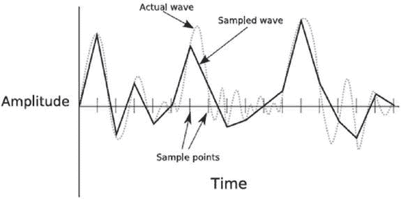

第十章


让事情变得繁荣

声音是任何游戏的重要组成部分，因为它能从虚拟世界提供即时*反馈*。如果你在玩游戏时把声音关小，你可能会发现这是一种非常被动的体验，因为我们希望事件伴随着声音。

像创作游戏的其他方面一样，好的音效需要大量的创造力。为游戏中的动作选择一套合适的音效可以决定视觉效果是有效还是完全无效。

本章探索了 Pygame 模块，你可以用它来给你的游戏添加音效和音乐。我们还将介绍如何使用自由软件来创建和编辑你的声音。

什么是声音？

声音本质上是振动，通常通过空气传播，但也可能通过水或其他物质传播。几乎所有的东西都会振动，并将振动以声音的形式传到空气中。例如，当我打字时，我可以听到塑料键与下面的表面碰撞时产生的“噼啪”声。塑料振动非常快，推动周围的空气分子，反过来推动其他分子，并发出连锁反应，最终到达我的耳朵，被解释为声音。

振动中的能量越多，声音就越大。按键相对安静，因为按下一个键不需要太大的力，但如果我用很大的力敲击键盘，比如用大锤，声音会更大，因为振动中会有更多的能量。

声音也可以在*音高*、上变化，这是空气中振动的速度。一些材料，如金属，往往振动非常快，当受到撞击时会产生高音调的噪音。其他材料以不同的速率振动，产生不同的音调。

大多数声音是音高和音量变化的复杂混合体。如果我把一个玻璃杯掉到石头地板上，最初的撞击会产生很大的噪音，接着是碎片振动并落回地面时发出的各种声音。所有这些声音的结合产生了一种我们认为是玻璃破碎的声音。

声音在到达听者的耳朵之前也会被改变。我们都很熟悉在你和说话的人之间的一堵墙是如何使声音变得模糊 并让人难以理解的。这是因为声音可以穿过墙壁和空气，但它会降低音量并改变途中的振动。声音也可能会从某些表面上反弹出 T4，产生回声等效果。在游戏中复制这样的物理效果是增强视觉效果的一个好方法。如果游戏角色进入一个大洞穴，当他走路时，如果他的脚步声有回音，那就更有说服力了。但是就像游戏设计的大多数方面一样，一点艺术上的许可是允许的。太空中没有声音，因为没有空气供它传播，但我仍然希望我的激光炮能产生令人满意的 zap 噪音！

存储声音

早期的电脑游戏使用芯片创造简单的音调来产生电子哔哔声和口哨声，但不能产生复杂的声音。如今，游戏硬件可以存储和再现现实生活中的声音，为游戏创造丰富的额外维度。计算机上的声卡可以录制和播放高质量的音频。

声音可以用一种波来表示。[图 10-1](#Fig1) 显示了代表声音的一小部分(几分之一秒)的声波——完整的声音会更长更复杂。波形显示了声音的能量或*振幅*、如何随时间变化。

声波形成许多波峰和波谷；这些波峰和波谷的幅度差越大，声音的*音量*就越大。声音的音调由波的频率(波峰之间的时间距离)决定；峰值在时间上越接近，声音就越高。


[图 10-1](#_Fig1) 。一个声波

要在计算机上存储声音，您必须首先将其转换为数字形式，这可以通过将麦克风插入声卡的 *mic* 插孔，或者插入专为计算机使用而设计的新型麦克风的 USB 端口来实现。当麦克风拾取声音时，声波被转换成电信号，该电信号由声卡以固定的间隔进行*采样*，产生一系列可以保存到文件中的数字。样本是表示特定时刻波形振幅的值，用于在回放时重建波形。样本越多，声卡播放声音就越准确。[图 10-2](#Fig2) 显示了从低采样率重建的波形，覆盖在原始波形上。您可以看到，采样波形通常会跟随真实波形，但许多细节会丢失，从而产生低质量的声音。较高的采样速率会产生更接近原始波形的波形，回放时听起来会更好。



[图 10-2](#_Fig2) 。样本声波

采样率以赫兹(Hz)或千赫兹(KHz)为单位，赫兹表示每秒采样数，千赫兹表示每秒采样数千个。电话质量约为 6KHz，CD 质量为 44KHz。采样速率可以比 CD 质量更高，但只有狗和蝙蝠能够分辨出这种差异！

声音格式

像图像一样，数字音频也有许多不同的文件格式，它们会影响质量和文件大小。Pygame 支持两种音效音频格式:WAV(仅未压缩)和 Ogg。大多数处理声音的软件都可以读写 WAV 文件。对 Ogg 的支持并不普遍，但仍然非常普遍。如果一个应用程序不直接支持 Ogg，也许可以通过升级或插件来添加它。

声音有许多属性会影响质量和文件大小:

*   单个样本的大小，通常是 8 位或 16 位整数，尽管有些格式支持浮点样本。通常您应该使用 16 位存储声音文件，因为它可以再现 CD 质量的声音，并且最受声卡支持。
*   `Sample rate—`每秒存储的样本数。采样速率最常见的值是 11025Hz、22050Hz 或 44100Hz，但也有许多其他可能的值。采样速率越高，产生的声音质量越好，但文件也会越大。
*   `Channels` `—`声音文件可以是*单声道*(单声道声音)，也可以是*立体声*(左右扬声器的独立声道)。立体声听起来更好，但使用的内存是未压缩音频文件的两倍。
*   `Compression` `—`声音可以生成大文件。例如，一分钟长、44100Hz、16 位的立体声音频将产生大约 10MB 的数据。幸运的是，音频可以被压缩，这样就可以放入更小的空间。Pygame 不支持压缩的 WAV 文件，但是支持 Ogg 格式，压缩性非常好。

决定你需要这些属性的什么组合通常取决于你将如何分发你的游戏。如果你将在 CD 或 DVD 上发行你的游戏，你可能会有足够的空间来存储高质量的声音。然而，如果你想通过电子邮件或下载来发布你的游戏，你可能需要牺牲一点质量来获得更小的文件。

创造声音效果

创建音效的一种方法是简单地录制自己的音效。例如，如果你需要一个引擎噪音，最好的方法就是录下真实引擎运转的声音。其他声音是不切实际的，甚至是不可能捕捉到的，可能需要一点创造力来创造一个近似的声音——一个好的枪声可以通过记录一个气球爆炸，然后使用声音编辑软件来扩展和加深声音来创造。通过记录铅笔敲击金属台扇格栅的声音，然后提高音调并添加一点回声，甚至可以创建相位器火。

 **提示**如果你想在外面录音，又不想随身带着笔记本电脑，那就买个便宜的录音机吧。质量可能会受到一点影响，因为你不是直接录制到高质量的数字，但你总是可以用 Audacity ( `http://audacity.sourceforge.net/` `)`或类似的软件来清理声音。

要开始录制音效，你需要一个麦克风。您可以使用带有 2.5 毫米插孔的标准麦克风，插入声卡的麦克风插孔，也可以使用专门为计算机设计的 USB 麦克风。这两种话筒都能提供良好的效果，但最好不要使用头戴式话筒，因为它们针对录制语音而非一般音效进行了优化。

除了麦克风，你还需要软件来采集声音并保存到你的硬盘上。大多数操作系统都带有一个可以录制声音的基本程序，但你可能会从其他声音软件中获得更好的结果，如 Audacity ( [图 10-3](#Fig3) )，这是一个用于 Windows、Mac OS X 和 Linux 的开源应用程序。你可以从`http://audacity.sourceforge.net` `.`下载 Audacity(免费)


[图 10-3](#_Fig3) 。大胆

要 Audacity 录音，请单击录音按钮(红色圆圈)开始录音，然后单击停止按钮(黄色方块)结束录音。然后声音的波形会显示在主窗口中，主窗口中有许多控制，您可以使用它们来检查波形并选择部分波形。

Audacity 有许多你可以用来编辑声音的特性。多个声音可以混合在一起，您可以在它们之间进行剪切和粘贴。您还可以应用各种效果来提高声音质量，或者完全改变它们！

要使用 Audacity 应用声音，请选择您想要更改的音频部分，然后从“效果”菜单中选择一种效果。以下是您可以使用的一些效果:

*   **放大—** 使声音变大。一般来说，你应该尽可能大声地储存你的声音，不要让*削波*。当波的振幅大于可储存的范围时，会发生削波，并降低声音的质量。如果波的顶部或底部是一条水平线，就意味着声音被削波了。
*   **改变音高—** 提高或降低声音。如果你提高一个声音的音调，它听起来就像在氦气中一样，如果你降低音调，它听起来就会更低沉和*像上帝一样*。改变音高是把一种声音变成另一种声音的好方法。如果你要录下两个金属勺子碰撞的声音，并降低音调，听起来就像是剑碰到了盔甲。
*   **回声—** 给声音添加回声。添加回声可以让你的效果听起来像是在任何地方，从一个空房间到一个巨大的洞穴。
*   **去噪—** 如果你不够幸运能够接触到录音棚和专业设备，你的录音可能会有轻微的嘶嘶声，这是由背景噪音以及麦克风和声卡的缺陷造成的。噪音消除效果很好地清理了你的声音。

编辑完音效后，您可以将它们导出为各种其他格式，包括 WAV 和 Ogg。最好保留原始文件，以便在需要时可以将它们导出为不同的格式。

 **警告**从电影中录制声音似乎是为你的游戏获得有趣效果的好方法，但你可能会违反版权法——所以最好避免。

股票音效

你也可以购买 CD 上的音效，或者从网上下载。这些音效是高质量的，因为它们是在录音室制作的，并且经过专业编辑。我个人用过的一个热门网站是 Sounddogs ( `http://www.sounddogs.com/`)。他们的 CD 很贵，但是你也可以单独购买，按秒付费。如果你的游戏只需要一打左右的短音效，价格还是比较合理的。

网上也有许多免费音效的来源。Pygame wiki 包含一个页面，列出了一些好的网站(`www.pygame.org/wiki/resources`)。你也可以通过搜索网络找到更多好的网站。

用 Pygame 播放声音

可以通过`pygame.mixer`界面用 Pygame 播放音效。在你可以使用*混音器*之前，它必须首先用一些参数初始化，这些参数定义了你将要播放的声音类型。这可以用`pygame.mixer.init`函数来完成，但是在某些平台上，混音器是由`pygame.init`自动初始化的。Pygame 提供了一个`pyame.mixer.pre_init`函数，您可以使用它来设置这个自动初始化的参数。两个初始化函数都采用以下四个参数:

*   `frequency`—这是音频播放的采样率，与声音文件的采样率含义相同。高采样率可能会降低性能，但即使是旧的声卡也可以轻松处理`44100`的频率设置，这是 CD 质量。另一个常见的频率设置是`22050`，听起来不太好。
*   `size`—这是用于回放的音频样本的大小，单位为*位*。样本量可以是`8`或`16`。在相同的性能下，`16`的值是最佳的，因为音质比`8`高得多。这个值也可以是负数，表示混音器应该使用*带符号的*样本(某些平台要求)。签名样本和未签名样本的音质没有区别。
*   `stereo`—该参数应设置为单声道的`1`或立体声的`2`。建议使用立体声，因为它可以用来制造声音来自屏幕上某个特定点的错觉。
*   `buffer`—这是为回放而缓冲的样本的数量。较低的值导致较低的*延迟*，即要求 Pygame 播放声音和您实际听到声音之间的时间。较高的值会增加延迟，但对于避免声音*丢失*可能是必要的，因为声音丢失会导致令人讨厌的爆音和咔哒声。我发现一个值`4096`最适合 44100，16 位立体声。该值必须始终是 2 的幂。

以下是如何初始化 16 位、44100Hz 立体声的混音器:

```py
pygame.mixer.pre_init(44100, 16, 2, 4096)
pygame.init()
```

对`pygame.mixer.pre_init`的调用设置混音器的参数，该参数在对`pygame.init`的调用中初始化。如果你需要在 Pygame 初始化后更改任何参数，你必须在调用`pygame.mixer.init`重新初始化之前，调用`pygame.mixer.quit`退出混合器。

声音对象

Sounds 对象用于存储和播放从 WAV 或 Ogg 文件中读取的音频数据。您可以用`pygame.mixer.Sound`构造一个`Sound`对象，它接受声音文件的文件名，或者一个包含数据的 Python `file`对象。下面是如何从硬盘上加载一个名为`phaser.ogg`的声音文件:

```py
phaser_sound = Pygame.mixer.Sound("phaser.ogg")
```

您可以用`play`方法播放一个`Sound`对象，该方法有两个可选参数:`loop`和`maxtime`。为`loop`设置一个值会使声音在首次播放后重复播放。例如，如果`loop`设置为`5`，声音将播放完毕，然后重复 5 次(共 6 次)。您也可以将`loop`设置为`–1`的特殊值，这将导致声音连续播放，直到您调用`stop`方法。

`maxtime`参数用于在给定的毫秒数后停止回放，这对于设计为循环播放(连续播放)的声音很有用，因为您可以精确指定它们将播放多长时间。

如果对`play`的调用成功，它将返回一个`Channel`对象(见下一节)；否则，它将返回`None`。以下是一次性播放相位器声音的方法:

```py
channel = phaser_sound.play()
```

这一行将播放一个五秒钟长的相位炮射击:

```py
channel = phaser_sound.play(–1, 5000)
```

关于`Sound`对象方法的完整列表，参见[表 10-1](#Tab1) 。

[表 10-1](#_Tab1) 。声音对象的方法

| 

方法

 | 

目的

 |
| --- | --- |
| `fadeout` | 逐渐降低所有频道的音量。`fadeout`采用单个参数，即以毫秒为单位的渐变长度。 |
| `get_length` | 返回声音的长度，以秒为单位。 |
| `get_num_channels` | 计算声音播放的次数。 |
| `get_volume` | 以介于 0.0 和 1.0 之间的浮点数形式返回声音的音量，其中 0.0 表示静音，1.0 表示最大音量。 |
| `play` | 播放声音。请参阅“声音对象”一节了解参数的描述。返回值是一个`Channel`对象，如果 Pygame 无法播放声音，则为 None。 |
| `set_volume` | 设置播放声音时的音量。该参数是一个介于 0.0 和 1.0 之间的浮点数，其中 0.0 表示静音，1.0 表示全音量。 |
| `stop` | 立即停止声音播放。 |

声音频道

声道是由声卡混合在一起的几个声源之一，在 Pygame 中由`Channel`对象表示。`Sound`对象的`play`方法为将播放声音的通道返回一个`Channel`对象，如果所有通道都忙于播放，则返回`None`。您可以通过调用`pygame.mixer.get_num_channels`功能来检索可用频道的数量。如果您发现您没有足够的通道来播放您需要的所有声音，您可以通过调用`pygame.mixer.set_num_channels`函数来创建更多的通道。

如果您只想以最大音量播放声音，可以放心地忽略`Sound.play`的返回值。否则，您可以使用`Channel`对象的方法创建一些有用的效果。其中最有用的一个功能是独立设置左右扬声器的音量，这可以用来创造一种声音来自屏幕上特定点的幻觉——这种效果被称为*立体声平移* 。`Channel`对象的`set_volume`方法可以接受两个参数:左扬声器的音量和右扬声器的音量，都是 0 到 1 之间的值。[清单 10-1](#list1) 显示了一个函数，它在给定发声事件的 x 坐标和屏幕宽度的情况下计算扬声器的音量。x 坐标离扬声器越远，音量就越低，所以当一个点从左到右在屏幕上移动时，左扬声器将*降低*音量，而右扬声器将*提高*音量。

[***清单 10-1***](#_list1) 。计算立体声平移的函数

```py
def stereo_pan(x_coord, screen_width):

    right_volume = float(x_coord) / screen_width
    left_volume = 1.0 - right_volume

    return (left_volume, right_volume)
```

清单 10-2 展示了如何使用`stereo_pan`函数来播放一个爆炸坦克的声音效果。[图 10-4](#Fig4) 显示了爆炸的位置如何与左右声道的值相关联。

[***清单 10-2***](#_list2) 。使用立体声 _ 声相功能

```py
tank.explode() # Do explosion visual
explosion_channel = explosion_sound.play()
if explosion_channel is not None:
    left, right = stereo_pan(tank.position.x, SCREEN_SIZE[0])
    explosion_channel.set_volume(left, right)
```


[图 10-4](#_Fig4) 。设定爆炸的立体声声相

 **提示**如果你为一个移动的精灵更新每一帧的立体声平移，它将增强立体声效果。

一般来说，最好将选择频道的任务留给 Pygame，但是可以通过调用`Channel`对象的`play`方法来强制`Sound`对象通过特定的频道播放，该方法获取您想要播放的声音，后跟您想要它重复的次数以及您想要它播放的最长时间。这样做的一个原因是为高优先级声音保留一个或多个通道。例如，您可能不希望背景环境噪声阻挡玩家的枪声。要保留多个通道，调用`pygame.mixer.set_reserved`函数，这可防止多个通道被`Sound.play`方法考虑。例如，如果您调用`pygame.mixer.set_reserved(2)`，Pygame 在从`Sound`对象调用`play`时将不会选择通道`0`或`1`。[清单 10-3](#list3) 显示了如何保留前两个频道。

[***清单 10-3***](#_list3) 。保留频道

```py
pygame.mixer.set_reserved(2)
reserved_channel_0 = pygame.mixer.Channel(0)
reserved_channel_1 = pygame.mixer.Channel(1)
```

下面是如何通过一个保留的频道强制播放声音:

```py
reserved_channel_1.play(gunfire_sound)
```

关于`Channel`对象方法的完整列表，参见[表 10-2](#Tab2) 。

[表 10-2](#_Tab2) 。通道对象的方法

| 

方法

 | 

目的

 |
| --- | --- |
| `fadeout` | 在一段时间内渐隐(降低音量)声音，以毫秒为单位。 |
| `get_busy` | 如果频道上正在播放声音，则返回 True。 |
| `get_endevent` | 返回声音结束播放时将发送的事件，如果没有设置结束事件，则返回 NOEVENT。 |
| `get_queue` | 返回任何排队等待播放的声音，如果没有排队声音，则返回 None。 |
| `get_volume` | 以介于 0.0 和 1.0 之间的单个值检索通道的当前音量(不考虑 set_volume 设置的立体声音量)。 |
| `pause` | 暂时暂停播放此频道上的任何声音。 |
| `play` | 在特定频道播放声音。接受 Sound 对象和可选的循环和最大时间值，它们与 Sound.play 的含义相同 |
| `queue` | 当前声音结束时播放给定的声音。获取要排队的声音对象。 |
| `set_endevent` | 当当前声音播放完毕时请求事件。获取要发送的事件的 id，它应该在 USEREVENT 之上(`pygame.locals`中的常量)，以避免与现有事件冲突。如果没有给定参数，Pygame 将停止发送结束事件。 |
| `set_volume` | 设置该频道的音量。如果给定一个值，它将用于两个扬声器。如果给定两个值，则独立设置左右扬声器音量。两种方法都将音量作为 0.0 到 1.0 之间的值，其中 0.0 是无声的，1.0 是最大音量。 |
| `stop` | 立即停止播放频道上的任何声音。 |
| `unpause` | 继续播放暂停的频道。 |

混合器功能

我们已经在`pygame.mixer`模块中介绍了许多功能。表 10-3 给出了它们的完整列表。

[表 10-3](#_Tab3) 。pygame.mixer 中的函数

| 

功能

 | 

目的

 |
| --- | --- |
| `pygame.mixer.Channel` | 为给定的通道索引创建通道对象。 |
| `pygame.mixer.fadeout` | 逐渐将所有通道的音量降低到 0。采用渐变时间(以毫秒为单位)。 |
| `pygame.mixer.find_channel` | 查找当前未使用的频道并返回其索引。 |
| `pygame.mixer.get_busy` | 如果正在播放声音(在任何频道上),则返回 True。 |
| `pygame.mixer.get_init` | 如果混合器已经初始化，则返回 True。 |
| `pygame.mixer.get_num_channels` | 检索可用频道的数量。 |
| `pygame.mixer.init` | 初始化混音器模块。有关参数的说明，请参见本节的开头部分。 |
| `pygame.mixer.pause` | 暂时停止所有频道的声音播放。 |
| `pygame.mixer.pre_init` | 当调音台通过调用 pygame.init 自动初始化时，设置调音台的参数。 |
| `pygame.mixer.quit` | 退出混音器。这是在 Python 脚本结束时自动完成的，但是如果您想用不同的参数重新初始化混合器，您可能需要调用它。 |
| `pygame.mixer.set_num_channels` | 设置可用频道的数量。 |
| `pygame.mixer.Sound` | 创建声音对象。获取包含声音数据的文件名或 Python 文件对象。 |
| `pygame.mixer.stop` | 停止所有频道的声音播放。 |
| `pygame.mixer.unpause` | 继续播放暂停的声音(请参见 pygame.mixer.pause)。 |

聆听调音台的运转

让我们写一个脚本，在 Pygame 中试验音效。如果你运行清单 10-4 中的[，你会看到一个带有鼠标光标的白屏。点击屏幕上的任意位置，抛出一个银球，银球在重力作用下下落，当银球从屏幕边缘或底部反弹时，会播放声音效果(参见](#list4)[图 10-5](#Fig5) )。

[***清单 10-4***](#_list4) 。调音台运行中(bouncesound.py)

```py
import pygame
from pygame.locals import *
from random import randint
from gameobjects.vector2 import Vector2

SCREEN_SIZE = (640, 480)

# In pixels per second, per second
GRAVITY = 250.0
# Increase for more bounciness, but don't go over 1!
BOUNCINESS = 0.7

def stero_pan(x_coord, screen_width):

    right_volume = float(x_coord) / screen_width
    left_volume = 1.0 - right_volume

    return (left_volume, right_volume)

class Ball(object):

    def __init__(self, position, speed, image, bounce:sound):

        self.position = Vector2(position)
        self.speed = Vector2(speed)
        self.image = image
        self.bounce:sound = bounce:sound
        self.age = 0.0

    def update(self, time_passed):

        w, h = self.image.get_size()

        screen_width, screen_height = SCREEN_SIZE

        x, y = self.position
        x -= w/2
        y -= h/2

        # Has the ball bounce
        bounce = False

        # Has the ball hit the bottom of the screen?
        if y + h >= screen_height:
            self.speed.y = -self.speed.y * BOUNCINESS
            self.position.y = screen_height - h / 2.0 - 1.0
            bounce = True

        # Has the ball hit the left of the screen?
        if x <= 0:
            self.speed.x = -self.speed.x * BOUNCINESS
            self.position.x = w / 2.0 + 1
            bounce = True

        # Has the ball hit the right of the screen
        elif x + w >= screen_width:
            self.speed.x = -self.speed.x * BOUNCINESS
            self.position.x = screen_width - w / 2.0 - 1
            bounce = True

        # Do time based movement
        self.position += self.speed * time_passed
        # Add gravity
        self.speed.y += time_passed * GRAVITY

        if bounce:
            self.play_bounce:sound()

        self.age += time_passed

    def play_bounce:sound(self):

        channel = self.bounce:sound.play()

        if channel is not None:
            # Get the left and right volumes
            left, right = stero_pan(self.position.x, SCREEN_SIZE[0])
            channel.set_volume(left, right)

    def render(self, surface):

        # Draw the sprite center at self.position
        w, h = self.image.get_size()
        x, y = self.position
        x -= w/2
        y -= h/2
        surface.blit(self.image, (x, y))

def run():

    # Initialise 44KHz 16-bit stero sound
    pygame.mixer.pre_init(44100, 16, 2, 1024*4)
    pygame.init()
    pygame.mixer.set_num_channels(8)
    screen = pygame.display.set_mode(SCREEN_SIZE, 0)

    print(pygame.display.get_wm_info())
    hwnd = pygame.display.get_wm_info()["window"]
    x, y = (200, 200)

    pygame.mouse.set_visible(False)

    clock = pygame.time.Clock()

    ball_image = pygame.image.load("ball.png").convert_alpha()
    mouse_image = pygame.image.load("mousecursor.png").convert_alpha()

    # Load the sound file
    bounce:sound = pygame.mixer.Sound("bounce.wav")

    balls = []

    while True:

        for event in pygame.event.get():

            if event.type == QUIT:
                pygame.quit()
                quit()

            if event.type == MOUSEBUTTONDOWN:

                # Create a new ball at the mouse position
                random_speed = ( randint(-400, 400), randint(-300, 0) )
                new_ball = Ball( event.pos,
                                 random_speed,
                                 ball_image,
                                 bounce:sound )
                balls.append(new_ball)

        time_passed_seconds = clock.tick() / 1000.

        screen.fill((255, 255, 255))

        dead_balls = []

        for ball in balls:

            ball.update(time_passed_seconds)
            ball.render(screen)

            # Make not of any balls that are older than 10 seconds
            if ball.age > 10.0:
                dead_balls.append(ball)

        # remove any 'dead' balls from the main list
        for ball in dead_balls:

            balls.remove(ball)

        # Draw the mouse cursor
        mouse_pos = pygame.mouse.get_pos()
        screen.blit(mouse_image, mouse_pos)

        pygame.display.update()

if __name__ == "__main__":

    run()
```


图 10-5 。布朗森. py

当`Ball`类的`update`方法检测到精灵碰到了屏幕的边缘或底部时，它反转精灵的方向并调用`Sound`对象的`play`方法。精灵的 x 坐标用于计算左右扬声器的音量，以便声音看起来是从精灵碰到屏幕边界的点发出的。效果相当有说服力——如果你闭上眼睛，你应该还是能分辨出球弹向哪里！

如果你通过快速点击鼠标创建了很多精灵，你可能会发现一些反弹停止产生声音效果。发生这种情况是因为所有可用的频道都被用于播放相同的声音效果，而新的声音只能在频道空闲时播放。

用 Pygame 玩音乐

虽然`pygame.mixer`模块可以播放任何类型的音频，但通常不建议将其用于音乐，因为音乐文件往往很大，会对计算机资源造成压力。Pygame 提供了一个名为`pygame.mixer.music`的`pygame.mixer`子模块，可以一次读取(并播放)一段音乐文件，而不是一次读取全部，这就是所谓的*音频流*。

 **注**音乐可能是`pygame.mixer.music`最常见的用途，但你可以用它来流式传输*任何*大型音频文件，比如画外音音轨。

获取音乐

如果你不够幸运，没有音乐天赋，你可能不得不用别人创作的音乐。有很多股票音乐网站，你可以购买游戏中使用的音乐文件，或者免费下载。你可以在 Pygame wiki ( `http://www.pygame.org/wiki/resources`)上找到一些商业和免费音乐网站。

 **警告**从你的音乐收藏中选择几首曲目，让你最喜欢的乐队作为游戏的配乐，这可能很诱人，但这违反了版权法，应该避免！

播放音乐

`pygame.mixer.music`模块可以播放 MP3 和 Ogg 音乐文件。对 MP3 的支持因平台而异，所以最好使用 Ogg 格式，它在各种平台上都受到很好的支持。您可以使用 Audacity 或其他声音编辑应用程序将 MP3 转换为 Ogg。

要播放一个音乐文件，首先用你想要播放的音乐曲目的文件名调用`pygame.mixer.music.load`函数，然后调用`pygame.mixer.music.play`开始播放(参见[清单 10-5](#list5) )。你想用这个模块做的任何事情都可以用`pygame.mixer.music`模块来完成(没有`Music`对象，因为一次只能传输一个音乐文件)。有停止、倒带、暂停、设置音量等功能。完整列表见[表 10-4](#Tab4) 。

假设您有一个文件名 techno.ogg(参见使用 Audacity 将音乐转换成。ogg)，您可以播放这样的音乐:

[***清单 10-5***](#_list5) 。播放音乐文件

```py
pygame.mixer.music.load("techno.ogg")
pygame.mixer.music.play()
```

[表 10-4](#_Tab4) 。pygame.mixer.music 函数

| 

功能

 | 

目的

 |
| --- | --- |
| `pygame.mixer.get_busy` | 如果音乐正在播放，则返回 True。 |
| `pygame.mixer.music.fadeout` | 在一段时间内减少音量。以毫秒为单位计算渐变时间。 |
| `pygame.mixer.music.get_endevent` | 返回要发送的结束事件，如果没有事件，则返回 0。 |
| `pygame.mixer.music.get_volume` | 返回音乐的音量；参见 set_volume。 |
| `pygame.mixer.music.load` | 加载音乐文件进行播放。获取音频文件的文件名。 |
| `pygame.mixer.music.play` | 开始播放载入的音乐文件。开始播放音乐后，您想要音乐重复播放的次数，后跟您想要开始回放的点(以秒为单位)。如果将第一个值设置为–1，它将一直重复，直到您调用 pygame.mixer.stop。 |
| `pygame.mixer.music.rewind` | 从头开始播放音乐文件。 |
| `pygame.mixer.music.set_endevent` | 请求在音乐播放完毕时发送一个事件。获取要发送的事件的 id，该 id 应该在 user event(py game . locals 中的常量)之上，以避免与现有事件冲突。如果没有给定参数，Pygame 将停止发送结束事件。 |
| `pygame.mixer.music.set_volume` | 设置音乐的音量。将音量作为 0.0 到 1.0 之间的值，其中 0.0 表示静音，1.0 表示最大音量。当加载新音乐时，音量将被重置为 1.0。 |
| `pygame.mixer.music.stop` | 停止播放音乐。 |
| `pygame.mixer.music.unpause` | 继续播放暂停的音乐。 |
| `pygame.muxer.music.get_pos` | 返回音乐播放的时间，以毫秒为单位。 |
| `pygame.muxer.music.pause` | 暂时暂停播放音乐。 |
| `pygame.muxer.music.queue` | 设置当前音乐结束时播放的曲目。接受一个参数，即您要播放的文件的文件名。 |

在行动中聆听音乐

让我们使用`pygame.mixer.music`模块创建一个简单的点唱机。[清单 10-6](#list6) 从硬盘上的一个路径读入一个 Ogg 文件列表，并显示一些熟悉的类似高保真的按钮，你可以用它们来播放、暂停或停止音乐，并在曲目列表中移动(见[图 10-6](#Fig6) )。如果您更改列表顶部的`MUSIC_PATH`值，您可以让它从您自己的收藏中播放。

[***清单 10-6***](#_list6) 。Pygame 点唱机(jukebox.py)

```py
import pygame
from pygame.locals import *

from math import sqrt
import os
import os.path

# Location of music on your computer
MUSIC_PATH = "./MUSIC"
SCREEN_SIZE = (800, 600)

def get_music(path):

    # Get the filenames in a folder
    raw_filenames = os.listdir(path)

    music_files = []
    for filename in raw_filenames:

        # We only want ogg files
        if filename.endswith('.ogg'):
            music_files.append(os.path.join(MUSIC_PATH, filename))

    return sorted(music_files)

class Button(object):

    def __init__(self, image_filename, position):

        self.position = position
        self.image = pygame.image.load(image_filename)

    def render(self, surface):

        # Render at the center
        x, y = self.position
        w, h = self.image.get_size()
        x -= w /2
        y -= h / 2

        surface.blit(self.image, (x, y))

    def is_over(self, point):

        # Return True if a point is over the button
        point_x, point_y = point
        x, y = self.position
        w, h = self.image.get_size()
        x -= w /2
        y -= h / 2

        in_x = point_x >= x and point_x < x + w
        in_y = point_y >= y and point_y < y + h

        return in_x and in_y

def run():

    pygame.mixer.pre_init(44100, 16, 2, 1024*4)
    pygame.init()
    screen = pygame.display.set_mode(SCREEN_SIZE, 0)

    default_font = pygame.font.get_default_font()
    font = pygame.font.SysFont("default_font", 50, False)

    # Create our buttons
    x = 100
    y = 240
    button_width = 150

    # Store the buttons in a dictionary, so we can assign them names
    buttons = {}
    buttons["prev"] = Button("prev.png", (x, y))
    buttons["pause"] = Button("pause.png", (x+button_width*1, y))
    buttons["stop"] = Button("stop.png", (x+button_width*2, y))
    buttons["play"] = Button("play.png", (x+button_width*3, y))
    buttons["next"] = Button("next.png", (x+button_width*4, y))

    music_filenames = get_music(MUSIC_PATH)

    if len(music_filenames) == 0:
        print("No OGG files found in ", MUSIC_PATH)
        return

    white = (255, 255, 255)
    label_surfaces = []

    # Render the track names
    for filename in music_filenames:

        txt = os.path.split(filename)[-1]

        print("Track:", txt)

        txt = txt.split('.')[0]
        surface = font.render(txt, True, (100, 0, 100))
        label_surfaces.append(surface)

    current_track = 0
    max_tracks = len(music_filenames)

    pygame.mixer.music.load( music_filenames[current_track] )

    clock = pygame.time.Clock()

    playing = False
    paused = False

    # This event is sent when a music track ends
    TRACK_END = USEREVENT + 1
    pygame.mixer.music.set_endevent(TRACK_END)

    while True:

        button_pressed = None

        for event in pygame.event.get():

            if event.type == QUIT:
                pygame.quit()
                quit()

            if event.type == MOUSEBUTTONDOWN:

                # Find the pressed button
                for button_name, button in buttons.items():
                    if button.is_over(event.pos):
                        print(button_name, "pressed")
                        button_pressed = button_name
                        break

            if event.type == TRACK_END:
                # If the track has ended, simulate pressing the next button
                button_pressed = "next"

        if button_pressed is not None:

            if button_pressed == "next":
                current_track = (current_track + 1) % max_tracks
                pygame.mixer.music.load( music_filenames[current_track] )
                if playing:
                    pygame.mixer.music.play()

            elif button_pressed == "prev":

                # If the track has been playing for more that 3 seconds,
                # rewind i, otherwise select the previous track
                if pygame.mixer.music.get_pos() > 3000:
                    pygame.mixer.music.stop()
                    pygame.mixer.music.play()
                else:
                    current_track = (current_track - 1) % max_tracks
                    pygame.mixer.music.load( music_filenames[current_track] )
                    if playing:
                        pygame.mixer.music.play()

            elif button_pressed == "pause":
                if paused:
                    pygame.mixer.music.unpause()
                    paused = False
                else:
                    pygame.mixer.music.pause()
                    paused = True

            elif button_pressed == "stop":
                pygame.mixer.music.stop()
                playing = False

            elif button_pressed == "play":
                if paused:
                    pygame.mixer.music.unpause()
                    paused = False
                else:
                    if not playing:
                        pygame.mixer.music.play()
                        playing = True

        screen.fill(white)

        # Render the name of the currently track
        label = label_surfaces[current_track]
        w, h = label.get_size()
        screen_w = SCREEN_SIZE[0]
        screen.blit(label, ((screen_w - w)/2, 450))

        # Render all the buttons
        for button in list(buttons.values()):
            button.render(screen)

        # No animation, 5 frames per second is fine!
        clock.tick(5)
        pygame.display.update()

if __name__ == "__main__":
    run()
```


[图 10-6](#_Fig6) 。点唱机脚本

自动点唱机使用`pygame.mixer.set_endevent`功能请求在曲目播放完毕时发送一个事件。Pygame 没有为此提供事件，但是您可以通过使用大于`USEREVENT`(`pygame.locals`中的常数)的`id`值来轻松创建自己的事件。[清单 10-6](#list6) 使用了`id TRACK_END`，其值为`USEREVENT + 1`。当在主事件循环中检测到`TRACK_END`事件时，它开始流式播放下一个音乐文件，以便按顺序播放曲目。

摘要

声音是一种创造性的媒介，它可能需要大量的实验来完善游戏中的音频。选择好的音效至关重要，因为玩家可能会多次听到它们，而糟糕或恼人的音频会很快阻碍进一步的播放。对于配乐来说也是如此，配乐既有增强的潜力，也有让人烦恼的潜力。

`pygame.mixer`模块提供了 Pygame 的音效功能，允许你在多个*频道*中的一个上加载和播放声音文件。当声音通过`Sound`对象播放时，Pygame 会自动分配一个空闲通道。这是最简单的方法，但是您可以通过播放特定频道的声音来选择自己管理频道。我建议，只有当你要播放许多声音，并希望对它们进行优先排序时，才这样做。

虽然你可以用`Sound`对象播放任何音频，但最好用`pygame.mixer.music`模块播放音乐，因为它可以*流式传输*音频，而不是将整个文件加载到内存中。音乐模块提供了许多简单的功能，您可以使用它们来管理游戏中的音乐。

下一章将介绍更多你可以用来在游戏中创造令人信服的 3D 视觉效果的技术。