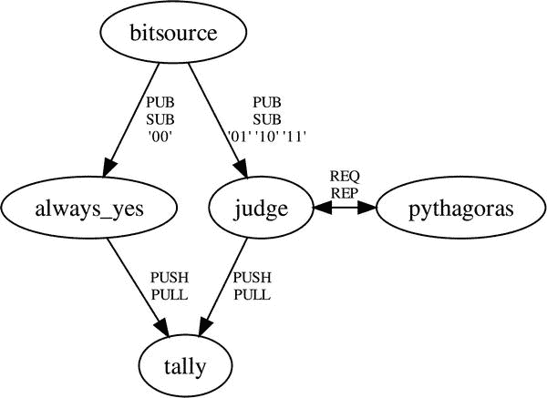

第八章


缓存和消息队列

这一章虽然简短，但可能是本书中最重要的一章。它调查了两种技术——缓存和消息队列——这两种技术已经成为高负载下服务的基本构件。这本书到了一个转折点。前面的章节已经探讨了 sockets API 以及 Python 如何使用原始的 IP 网络操作来构建通信通道。如果你提前看的话，你会发现接下来的所有章节都是关于建立在套接字上的特定协议——如何从万维网上获取文档，发送电子邮件，以及向远程服务器提交命令。

你将在本章中看到的这两个工具的区别是什么？他们有几个共同的特点。

*   这些技术都很受欢迎，因为它是一个强大的工具。使用 Memcached 或消息队列的意义在于，它是一个编写良好的服务，可以为您解决特定的问题，而不是因为它实现了一个有趣的协议，可以让您与任何其他工具进行互操作。
*   这些工具解决的问题往往是组织内部的问题。您通常无法从外部判断哪个缓存、队列和负载分布工具正被用于支持特定的网站或网络服务。
*   虽然 HTTP 和 SMTP 等协议是根据特定的有效负载(分别是超文本文档和电子邮件)构建的，但缓存和消息队列往往完全不知道它们为您传输的数据。

本章无意成为这些技术的手册。提到的每一个库都有大量的在线文档，对于更受欢迎的库，您甚至可以找到关于它们的整本书。相反，本章的目的是向您介绍每个工具解决的问题，解释如何使用服务来解决该问题，并给出一些使用 Python 工具的提示。

毕竟，程序员经常面临的最大挑战——除了学习编程本身的基本、终身过程之外——是识别存在快速预建解决方案的常见问题。程序员有一个令人遗憾的习惯，那就是费力地重新发明轮子。把这一章想象成给你两个成品轮子，希望你可以避免自己造轮子。

使用 Memcached

*Memcached* 是“内存缓存守护进程”它将安装它的服务器上的空闲内存合并到一个大型的最近最少使用(LRU)缓存中。据说，它对许多大型互联网服务的影响是革命性的。在看了如何从 Python 中使用它之后，我将讨论它的实现，这将教你一个重要的现代网络概念，叫做*分片* 。

使用 Memcached 的实际过程被设计得很简单。

*   您在每台有一些空闲内存的服务器上运行一个 Memcached 守护进程。
*   您可以列出新的 Memcached 守护进程的 IP 地址和端口号，并将这个列表分发给所有将使用缓存的客户机。
*   您的客户端程序现在可以访问组织范围内的、速度惊人的键值缓存，它的作用就像一个大的 Python 字典，所有服务器都可以共享。缓存在 LRU 的基础上运行，丢弃一段时间没有被访问的旧项目，以便它有空间接受新的条目并保留频繁访问的记录。

Memcached 当前列出了足够多的 Python 客户端，我最好将您发送到列出它们的页面，而不是尝试在这里查看它们。

首先列出的客户机是用纯 Python 编写的，因此不需要编译任何库。由于可以从 Python 包索引中获得，它应该可以非常干净地安装到虚拟环境中(参见第 1 章)。Python 3 的版本可以通过一个命令安装。

```py
$ pip install python3-memcached
```

这个包的 API 很简单。虽然您可能希望有一个更像 Python 字典的接口，带有像`__getitem__()`这样的本地方法，但是这个 API 的作者选择使用与 Memcached 支持的其他语言中使用的相同的方法名。这是一个很好的决定，因为它使得将 Memcached 示例翻译成 Python 变得更加容易。如果您在机器上安装了 Memcached 并运行在默认端口11211，那么 Python 提示符下的一个简单交互可能如下所示:

```py
>>> import memcache
>>> mc = memcache.Client(['127.0.0.1:11211'])
>>> mc.set('user:19', 'Simple is better than complex.')
True
>>> mc.get('user:19')
'Simple is better than complex.'
```

您可以看到这里的接口非常像 Python 字典。当你像这样提交一个字符串时，这个字符串会以 UTF-8 的形式直接写入 Memcached，然后在你以后获取它时再次被解码。除了一个简单的字符串之外，任何其他类型的 Python 对象都会触发`memcache`模块为您自动提取值(参见[第 5 章](05.html))并将二进制 pickle 存储在 Memcached 中。如果您编写的 Python 应用与用其他语言编写的客户端共享 Memcached 缓存，那么请记住这一点。对于用其他语言编写的客户端来说，只有保存为字符串的值才能被破译。

请记住，存储在 Memcached 中的数据可能会被服务器随意丢弃。缓存旨在通过记住重新计算代价高昂的结果来加速操作。它不是为存储无法从其他信息源重建的数据而设计的！如果前面的命令是针对足够繁忙的 Memcached 运行的，并且如果在`set()`和`get()`操作之间经过了足够长的时间，那么`get()`可以很容易地发现该字符串已经从缓存中过期并且不再存在。

清单 8-1 显示了从 Python 中使用 Memcached 的基本模式。在进行(人工)昂贵的整数平方运算之前，这段代码检查 Memcached，看答案是否已经存储在缓存中。如果是这样，那么答案可以立即返回，而不需要重新计算。如果不是，则在返回之前计算并存储在缓存中。

[***清单 8-1***](#_list1) 。使用 Memcached 加速昂贵的操作

```py
#!/usr/bin/env python3
# Foundations of Python Network Programming, Third Edition
# https://github.com/brandon-rhodes/fopnp/blob/m/py3/chapter08/squares.py
# Using memcached to cache expensive results.

import memcache, random, time, timeit

def compute_square(mc, n):
    value = mc.get('sq:%d' % n)
    if value is None:
        time.sleep(0.001)  # pretend that computing a square is expensive
        value = n * n
        mc.set('sq:%d' % n, value)
    return value

def main():
    mc = memcache.Client(['127.0.0.1:11211'])

    def make_request():
        compute_square(mc, random.randint(0, 5000))

    print('Ten successive runs:')
    for i in range(1, 11):
        print(' %.2fs' % timeit.timeit(make_request, number=2000), end='')
    print()

if __name__ == '__main__':
    main()
```

同样，Memcached 守护进程需要在您的机器上的端口 11211 上运行，这个例子才能成功。当然，对于最初的几百个请求，程序将以其通常的速度运行；每次它第一次询问一个特定整数的平方时，它会发现它在 RAM 缓存中丢失了，而不得不计算它。然而，当程序运行并开始一次又一次地遇到相同的整数时，它会开始加速，因为它会找到自上次看到特定整数以来仍然存在于缓存中的方块。

在从 5000 个可能的输入整数中提取出几千个请求后，程序应该显示出显著的加速。在我的机器上，第十批 2000 个方块的运行速度比第一批快了六倍多。

```py
$ python squares.py
Ten successive runs:
 2.87s 2.04s 1.50s 1.18s 0.95s 0.73s 0.64s 0.56s 0.48s 0.45s
```

这种模式通常是缓存的特征。随着缓存开始学习足够多的键和值，运行时逐渐提高，然后随着 Memcached 的填充以及输入域的百分比覆盖率达到最大值，提高的速度趋于平稳。

在实际的应用中，您希望将哪种数据写入缓存？

许多程序员只是缓存最低级别的高开销调用，比如对数据库的查询、对文件系统的读取或对外部服务的查询。在这个级别，通常很容易理解哪些项目可以缓存多长时间，而不会使信息太过时。如果数据库行发生变化，那么甚至可以先发制人地清除缓存中与变化值相关的过时项。但是有时在应用的更高层缓存中间结果会有很大的价值，比如数据结构、HTML 片段，甚至整个网页。这样，缓存命中不仅防止了数据库访问，还防止了将结果转换为数据结构，然后转换为呈现的 HTML 的成本。

从 Memcached 站点上可以链接到许多很好的介绍和深入的指南，以及令人惊讶的大量 FAQ 就好像 Memcached 的开发人员已经发现，教义问答是向人们介绍他们的服务的最佳方式。我将在这里提出一些一般性的观点。

首先，键必须是唯一的，因此开发人员倾向于使用前缀和编码来区分他们存储的各种类型的对象。您经常会看到像`user:19`、`mypage:/node/14`，甚至是一个 SQL 查询的整个文本被用作一个键。键的长度只能是 250 个字符，但是通过使用一个强大的散列函数，您可以进行支持更长字符串的查找。顺便说一下，存储在 Memcached 中的值可以比键长，但长度限制在 1MB 以内。

第二，你必须记住 Memcached 是一个缓存。它是短暂的，它使用 RAM 进行存储，如果重新启动，它不会记得你曾经存储过的任何东西！如果缓存消失，您的应用应该总是能够恢复和重建其所有数据。

第三，确保您的缓存不会返回太旧而无法准确呈现给用户的数据。“太老了”完全取决于你的问题领域。银行余额可能需要绝对最新，而“今日头条”在新闻网站的首页上可能是几分钟前的事了。

有三种方法可以解决陈旧数据的问题，并确保它得到清理，而不是永远超过其有用的保存期限。

*   Memcached 将允许您为放入缓存中的每个项目设置一个到期日期和时间，当到期时，它会自动删除这些项目。
*   如果您有办法从一条信息的标识映射到缓存中可能包含它的所有键，那么您可以在特定缓存条目失效时主动使它们失效。
*   您可以重写和替换无效的条目，而不是简单地删除它们，这对于每秒钟可能被点击几十次的条目很有效。不是所有这些客户端都找到丢失的条目并同时尝试重新计算它，而是在那里找到重写的条目。出于同样的原因，在应用首次启动时预填充缓存对于大型站点来说是一项至关重要的生存技能。

正如您可能猜到的，decorators 是在 Python 中添加缓存的一种流行方式，因为它们包装函数调用而不改变它们的名称或签名。如果您查看 Python 包索引，您会发现几个可以利用 Memcached 的装饰缓存库。

哈希和分片

Memcached 的设计说明了一个重要的原则，这个原则在其他几种数据库中使用，您可能想在自己的体系结构中使用它。当面对一个列表中的几个 Memcached 实例时，Memcached 客户机将通过散列每个键的字符串值来分割数据库，并让散列决定 Memcached 集群中的哪个服务器用于存储特定的键。

为了理解为什么这是有效的，考虑一个特殊的键-值对——比如键`sq:42`和值`1764`,它们可能被[清单 8-1](#list1) 存储。为了充分利用可用的 RAM，Memcached 集群希望将这个键和值存储一次。但是为了使服务更快，它希望避免重复，而不需要不同服务器之间的任何协调或所有客户机之间的通信。

这意味着，除了(a)密钥和(b)配置它们的 Memcached 服务器列表之外，没有任何其他信息的所有客户机都需要某种方案来确定这条信息属于哪里。如果他们不能做出相同的决定，那么不仅键和值可能被复制到几个服务器并减少可用的总内存，而且客户端试图删除无效条目可能会在其他地方留下其他无效副本。

解决方案是所有客户端都实现一个单一的、稳定的算法，该算法可以将一个密钥转换为整数 *n* ，从它们的列表中选择一个服务器。他们通过使用“哈希”算法来实现这一点，该算法在形成一个数字时混合一个字符串的各个位，这样字符串中的任何模式在理想情况下都会被删除。

要了解为什么键值中的模式必须被删除，考虑清单 8-2 中的[。它加载一个英语单词字典(您可能需要下载自己的字典或调整路径以使脚本在您自己的机器上运行),并探索如果这些单词被用作键，它们将如何分布在四个服务器上。第一种算法试图将字母表分成四个大致相等的部分，并使用它们的第一个字母来分配密钥；另外两种算法使用散列函数。](#list2)

[***清单 8-2***](#_list2) 。向服务器分配数据的两种方案:数据模式和来自散列的位

```py
#!/usr/bin/env python3
# Foundations of Python Network Programming, Third Edition
# https://github.com/brandon-rhodes/fopnp/blob/m/py3/chapter08/hashing.py
# Hashes are a great way to divide work.

import hashlib

def alpha_shard(word):
    """Do a poor job of assigning data to servers by using first letters."""
    if word[0] < 'g':           # abcdef
        return 'server0'
    elif word[0] < 'n':         # ghijklm
        return 'server1'
    elif word[0] < 't':         # nopqrs
        return 'server2'
    else:                       # tuvwxyz
        return 'server3'

def hash_shard(word):
    """Assign data to servers using Python's built-in hash() function."""
    return 'server%d' % (hash(word) % 4)

def md5_shard(word):
    """Assign data to servers using a public hash algorithm."""
    data = word.encode('utf-8')
    return 'server%d' % (hashlib.md5(data).digest()[-1] % 4)

if __name__ == '__main__':
    words = open('/usr/share/dict/words').read().split()
    for function in alpha_shard, hash_shard, md5_shard:
        d = {'server0': 0, 'server1': 0, 'server2': 0, 'server3': 0}
        for word in words:
            d[function(word.lower())] += 1
        print(function.__name__[:-6])
        for key, value in sorted(d.items()):
            print('   {} {} {:.2}'.format(key, value, value / len(words)))
        print()
```

`hash()`函数是 Python 自己的内置散列例程，它被设计得非常快，因为它在内部用于实现 Python 字典查找。MD5 算法要复杂得多，因为它实际上是作为加密散列而设计的。虽然它现在被认为太弱，不适合安全使用，但使用它来跨服务器分布负载是没问题的(尽管比 Python 的内置哈希慢)。

结果非常清楚地表明，试图使用任何可能直接暴露数据中模式的方法来分配负载是危险的。

```py
$ python hashing.py
alpha
   server0 35285 0.36
   server1 22674 0.23
   server2 29097 0.29
   server3 12115 0.12

hash
   server0 24768 0.25
   server1 25004 0.25
   server2 24713 0.25
   server3 24686 0.25

md5
   server0 24777 0.25
   server1 24820 0.25
   server2 24717 0.25
   server3 24857 0.25
```

您可以看到，按第一个字母分配负载，其中四个箱中的每一个都分配有大致相等数量的字母，导致服务器 0 的负载是服务器 3 的三倍以上，即使它只分配了六个字母而不是七个字母！然而，杂凑套路都表现得像冠军。尽管所有的强模式不仅表征了英文单词的首字母，还表征了整个结构和结尾，但是哈希函数将单词均匀地分布在这四台虚拟服务器上。

尽管许多数据集不像英语单词的字母分布那样偏斜，但像 Memcached 这样的分片数据库总是不得不应对输入数据中出现的模式。

例如，清单 8-1 在使用键的时候并不少见，这些键总是以一个公共前缀开始，然后是受限字母表中的字符:十进制数字。这些明显的模式就是为什么分片应该总是通过散列函数来执行。

当然，这是一个实现细节，当您使用 Memcached 这样的数据库系统(其客户端库在内部支持分片)时，您可能经常会忽略这个细节。但是，如果您需要设计一个自己的服务，自动将工作或数据分配给集群中的节点，并且需要在同一数据存储的几个客户端之间可重复，那么您会发现在您自己的代码中使用了相同的技术。

消息队列

消息队列协议让你发送可靠的数据块，协议称之为*消息*而不是*数据报*，因为正如你在[第 2 章](02.html)中看到的，数据报的概念是特定于不可靠的服务的，在不可靠的服务中，数据可能被底层网络丢失、复制或重新排序。通常，消息队列承诺可靠地传输消息，并以原子方式传递消息:消息要么完整无缺地到达，要么根本就没有到达。成帧是由消息队列协议本身执行的。使用消息队列的客户机永远不必循环并一直调用类似于`recv()`的东西，直到整个消息到达。

消息队列提供的另一个创新是，您可以在消息客户端之间建立各种拓扑，而不是仅支持像 TCP 这样的 IP 传输可能实现的点对点连接。消息队列有许多可能的用途。

*   当您使用您的电子邮件地址在一个新网站上注册一个帐户时，该网站通常会立即响应一个页面，上面写着“谢谢您，请注意您的收件箱，有一封确认电子邮件”，而不会让您等待几分钟，因为该网站可能会联系到您的电子邮件服务提供商来发送邮件。该网站通常通过将您的电子邮件地址放入消息队列来实现这一点，当后端服务器准备好尝试新的传出 SMTP 连接时，可以从消息队列中检索地址。如果传递尝试暂时失败，那么您的电子邮件地址可以简单地放回队列中，等待更长的超时时间，以便稍后重试。
*   消息队列可以用作定制*远程过程调用(RPC)* (参见[第 18 章](18.html))服务的基础，在这种模式下，繁忙的前端服务器可以通过将请求放在消息队列上来卸载困难的工作，该消息队列可能有数十或数百个后端服务器监听它，然后等待响应。
*   需要聚合或集中存储和分析的大量事件数据通常作为微小高效的消息通过消息队列传输。在某些站点上，这完全取代了本地硬盘上的机器日志和旧的日志传输机制，如 syslog。

消息队列应用设计的特点是能够混合和匹配所有的客户端和服务器，或者发布者和订阅者进程，方法是将它们都连接到同一个消息传递结构。

消息队列的使用可以给你写程序带来一点革命。典型的单片应用由一层又一层的 API 组成，通过这些 API，单个控制线程可以从从套接字读取 HTTP 数据到验证和解释请求，再到调用 API 来执行定制的图像处理，最后将结果写入磁盘。单个控制线程使用的每个 API 都必须存在于单个机器上，加载到 Python 运行时的单个实例中。但是，一旦消息队列成为您的工具包的一部分，您就会开始问，为什么像图像处理这样的密集型、专门化和与 web 无关的东西应该与您的前端 HTTP 服务共享 CPU 和磁盘驱动器。您不再从安装了几十个异构库的大型机器上构建服务，而是开始转向被分组到提供单一服务的集群中的专用机器。您的操作人员可以轻松地开始拆除、升级和重新连接图像处理服务器，甚至不需要接触位于您的消息队列前面的 HTTP 服务的负载平衡池，只要操作人员了解消息传递拓扑和用于分离服务器的协议，这样就不会丢失任何消息。

每个品牌的消息队列通常支持几种拓扑。

*   一个*管道*拓扑是这样一种模式，当你想到一个队列时，它可能最像你脑海中的画面:一个生产者创建消息并将它们提交给队列，然后消费者可以从队列中接收消息。例如，照片共享网站的前端 web 计算机可能接受来自最终用户的图像上传，并将传入的文件注册到内部队列中。然后，装满缩略图生成器的机房可以从队列中读取，每个代理一次接收一个包含图像的消息，它应该为该图像生成几个缩略图。当网站繁忙时，队列可能会变长，然后在使用率相对较低的时期变短或变空，但无论如何，前端 web 服务器都可以快速向等待的客户返回响应，告诉客户他们的上传成功，他们的图像将很快出现在他们的照片流中。
*   一个*发布者-订阅者*或*扇出*拓扑 看起来像一个管道，但有一个关键的区别。虽然管道确保每个排队的消息都被准确地传递给一个消费者——毕竟，为两个缩略图服务器分配相同的照片是一种浪费——但订阅者通常希望接收发布者排队的所有消息。或者，订阅者可以指定一个过滤器，将他们的兴趣缩小到具有特定格式的消息。这种队列可用于支持需要向外界推送事件的外部服务。它还可以形成一个结构，一个装满服务器的机房可以用来通告哪些系统正在运行，哪些系统正在进行维护，甚至可以在创建和销毁其他消息队列时发布它们的地址。
*   最后，*请求-回复*模式是最复杂的，因为消息必须往返。前面的两种模式都没有让消息的生产者承担什么责任:生产者连接到队列并传输它的消息，然后就完成了。但是发出请求的消息队列客户机必须保持连接，并等待收到回复。为了支持这一点，队列必须以某种寻址方案为特征，通过该方案，回复可以被定向到正确的客户端，可能是数千个连接的客户端中的一个，该客户端仍然在等待回复。但是尽管其潜在的复杂性，这可能是所有模式中最强大的。它允许数十或数百个客户端的负载平均分布在大量服务器上，除了设置消息队列之外，无需任何工作。因为一个好的消息队列将允许服务器在不丢失消息的情况下连接和分离，所以这种拓扑还允许服务器以一种客户机不可见的方式停止维护。

请求-应答队列是一种很好的方式，可以将可以在特定机器上一起运行的数百个轻量级工作线程(比如 web 服务器前端的线程)连接到数据库客户端或文件服务器，这些客户端或文件服务器有时需要被调用来代表前端执行更繁重的工作。请求-应答模式非常适合 RPC 机制，它还有一个更简单的 RPC 系统通常没有的好处；也就是说，在扇入或扇出工作模式中，许多消费者或生产者都可以连接到同一个队列，而任何一组客户端都不知道这种区别。

使用 Python 中的消息队列

最流行的消息队列被实现为独立的服务器。您选择用来构建应用的所有各种任务——生产者、消费者、过滤器和 RPC 服务——都可以附加到消息队列，而不必了解彼此的地址甚至身份。AMQP 协议是最广泛实现的语言无关的消息队列协议之一，它受到可以安装的开源服务器的支持，比如 RabbitMQ、Apache Qpid 服务器和许多其他项目。

许多程序员自己从来没有学习过消息协议。相反，他们依赖第三方库,这些库打包了消息队列的好处，以便通过 API 轻松使用。例如，许多使用 Django web 框架的 Python 程序员使用流行的 Celery 分布式任务队列，而不是自己学习 AMQP。库还可以通过支持其他后端服务来提供协议独立性。在 Celery 的例子中，您可以使用简单的 Redis 键值存储作为您的“消息队列”,而不是专用的消息传递设备。

然而，出于本书的目的，一个不需要安装完全独立的消息队列服务器的示例更方便，因此我将介绍 MQ，即由 AMQP 公司创建的*零消息队列* *，*，它将消息传递智能从一个集中的代理转移到您的每一个消息客户端程序中。换句话说，将 MQ 库嵌入到您的每个程序中，可以让您的代码自发地构建消息传递结构，而不需要集中的代理。这在方法上与基于中央代理的体系结构有一些不同，中央代理可以为磁盘提供可靠性、冗余、重传和持久性。MQ 网站:`www.zeromq.org/docs:welcome-from-amqp`提供了对优点和缺点的总结。

为了保持本节中的例子是独立的，[清单 8-3](#list3) 处理了一个简单的问题，它并不真正需要消息队列:通过使用一个简单的，虽然效率不高的蒙特卡罗方法 来计算π的值。重要的消息传递拓扑如图 8-1 所示。一个`bitsource`例程产生由 1 和 0 组成的长度为 2 *n* 的字符串。我将使用奇数位作为一个 *n* 位整数 *x* 坐标，偶数位作为一个 *n* 位整数 *y* 坐标。这个坐标是在以原点为圆心的四分之一圆的内部还是外部，这个圆的半径是这两个整数的最大值？



[图 8-1](#_Fig1) 。π的简单蒙特卡罗估计的拓扑

使用发布-订阅拓扑，您为这些二进制字符串构建了两个听众。`always_yes`监听器将只接收以`00`开头的数字串，因此总是可以推送答案`Y`,因为，如果你的两个坐标都以数字 0 开头，那么该点一定位于域的左下象限，因此安全地落在圆内。然而，前两位的其他三种可能的模式必须由进行真正测试的`judge`例程来处理。它必须要求`pythagoras`计算两个整数坐标的平方和，以确定它们指定的点是在圆内还是圆外，并相应地将`T`或`F`推入其输出队列。

拓扑底部的计数例程接收为每个生成的随机位模式产生的`T`或`F`，通过将 T 答案的数量与 T 和 F 答案的总数进行比较，它可以估计π的值。如果你对数学感兴趣，可以在网上搜索一下圆周率的蒙特卡罗估计值*。*

清单 8-3 实现了这种五个工人的拓扑结构，它让程序运行 30 秒后退出。它需要 MQ，您可以通过创建一个虚拟环境，然后键入以下内容，很容易地将 MQ 提供给 Python:

```py
$ pip install pyzmq
```

如果您使用的操作系统已经为您打包了 Python 或者像 Anaconda 这样的独立 Python 安装，那么这个包可能已经安装好了。在这两种情况下，[清单 8-3](#list3) 将能够在没有导入错误的情况下运行。

[***清单 8-3***](#_list3) 。MQ 消息传递结构连接五个不同的工作人员

```py
#!/usr/bin/env python3
# Foundations of Python Network Programming, Third Edition
# https://github.com/brandon-rhodes/fopnp/blob/m/py3/chapter08/queuecrazy.py
# Small application that uses several different message queues

import random, threading, time, zmq
B = 32  # number of bits of precision in each random integer

def ones_and_zeros(digits):
    """Express `n` in at least `d` binary digits, with no special prefix."""
    return bin(random.getrandbits(digits)).lstrip('0b').zfill(digits)

def bitsource(zcontext, url):
    """Produce random points in the unit square."""
    zsock = zcontext.socket(zmq.PUB)
    zsock.bind(url)
    while True:
        zsock.send_string(ones_and_zeros(B * 2))
        time.sleep(0.01)

def always_yes(zcontext, in_url, out_url):
    """Coordinates in the lower-left quadrant are inside the unit circle."""
    isock = zcontext.socket(zmq.SUB)
    isock.connect(in_url)
    isock.setsockopt(zmq.SUBSCRIBE, b'00')
    osock = zcontext.socket(zmq.PUSH)
    osock.connect(out_url)
    while True:
        isock.recv_string()
        osock.send_string('Y')

def judge(zcontext, in_url, pythagoras_url, out_url):
    """Determine whether each input coordinate is inside the unit circle."""
    isock = zcontext.socket(zmq.SUB)
    isock.connect(in_url)
    for prefix in b'01', b'10', b'11':
        isock.setsockopt(zmq.SUBSCRIBE, prefix)
    psock = zcontext.socket(zmq.REQ)
    psock.connect(pythagoras_url)
    osock = zcontext.socket(zmq.PUSH)
    osock.connect(out_url)
    unit = 2 ** (B * 2)
    while True:
        bits = isock.recv_string()
        n, m = int(bits[::2], 2), int(bits[1::2], 2)
        psock.send_json((n, m))
        sumsquares = psock.recv_json()
        osock.send_string('Y' if sumsquares < unit else 'N')

def pythagoras(zcontext, url):
    """Return the sum-of-squares of number sequences."""
    zsock = zcontext.socket(zmq.REP)
    zsock.bind(url)
    while True:
        numbers = zsock.recv_json()
        zsock.send_json(sum(n * n for n in numbers))

def tally(zcontext, url):
    """Tally how many points fall within the unit circle, and print pi."""
    zsock = zcontext.socket(zmq.PULL)
    zsock.bind(url)
    p = q = 0
    while True:
        decision = zsock.recv_string()
        q += 1
        if decision == 'Y':
            p += 4
        print(decision, p / q)

def start_thread(function, *args):
    thread = threading.Thread(target=function, args=args)
    thread.daemon = True  # so you can easily Ctrl-C the whole program
    thread.start()

def main(zcontext):
    pubsub = 'tcp://127.0.0.1:6700'
    reqrep = 'tcp://127.0.0.1:6701'
    pushpull = 'tcp://127.0.0.1:6702'
    start_thread(bitsource, zcontext, pubsub)
    start_thread(always_yes, zcontext, pubsub, pushpull)
    start_thread(judge, zcontext, pubsub, reqrep, pushpull)
    start_thread(pythagoras, zcontext, reqrep)
    start_thread(tally, zcontext, pushpull)
    time.sleep(30)

if __name__ == '__main__':
    main(zmq.Context())
```

这些线程中的每一个都小心翼翼地创建自己的通信套接字，因为两个线程试图共享一个消息套接字是不安全的。但是这些线程确实共享一个*上下文*对象，这确保它们都存在于您可能称之为 URL、消息和队列的共享竞技场中。您通常希望为每个进程只创建一个 MQ 上下文。

尽管这些套接字提供的方法名称类似于我们熟悉的套接字操作，比如`recv()`和`send()`，但是请记住它们具有不同的语义。消息按顺序保存，从不重复，但是它们被清晰地分隔为单独的消息，而不是在连续的流中丢失。

这个例子显然是人为设计的，这样，在几行代码中，您就有理由使用典型队列提供的大多数主要消息传递模式。`always_yes`和`judge`与`bitsource`建立的连接形成了一个发布-订阅系统，在这个系统中，每一个连接的客户端都会收到发布者发送的每一条消息的副本(在这个例子中，不包括任何被过滤掉的消息)。应用于 MQ 套接字的每个过滤器通过选择前几个数字与过滤器字符串匹配的每个消息来增加而不是减少所接收的消息总数。然后，你的用户对保证接收到由`bitsource`产生的每一个位串，因为在它们的四个过滤器中有两个领先二进制数字的每一种可能的组合。

`judge`和`pythagoras` 之间的关系是一个经典的 RPC 请求-应答关系，持有`REQ`套接字的客户端必须首先发言，以便将其消息分配给连接到其套接字的一个等待代理。(这种情况下当然只附带一个代理。)消息传递结构在后台自动将返回地址添加到请求中。一旦代理完成了它的工作和回复，返回地址可以用于通过`REP`套接字传输回复，这样它将到达正确的客户端，即使当前有几十个或几百个客户端。

最后，`tally` worker 说明了推拉式安排是如何保证每个被推的项目都将被一个且只有一个连接到套接字的代理接收；如果你要启动几个`tally`工人，那么来自上游的每个新数据将只到达其中一个，并且它们将分别在π上收敛。

注意，与本书中介绍的所有其他套接字编程不同，这个清单根本不需要注意是`bind()`还是`connect()`先出现！这是 MQ 的一个特性，它使用超时和轮询在后台不断重试失败的`connect()`，以防 URL 描述的端点稍后出现。这使得它能够在应用运行时抵御来来去去的代理。

当程序退出时，由此产生的工人系统在我的笔记本电脑上能够计算π到大约三位数。

```py
$ python queuepi.py
...
Y 3.1406089633937735
```

这个简单的例子可能会让 MQ 编程看起来过于简单。在现实生活中，您通常需要比这里提供的模式更复杂的模式，以确保消息的传递，在消息还不能被处理的情况下持久化它们，并进行流控制以确保缓慢的代理不会被最终排队等待的消息数量所淹没。有关如何为产品服务实现这些模式的详细讨论，请参阅官方文档。最后，许多程序员发现，芹菜后面的 RabbitMQ、Qpid 或 Redis 等成熟的消息代理以最少的工作量和最少的出错可能性向他们提供了他们想要的保证。

摘要

在现代社会，为成千上万的客户服务已经成为应用开发人员的日常任务。出现了几项关键技术来帮助他们满足这一规模，并且可以很容易地从 Python 访问它们。

一个流行的服务是 Memcached，它将安装它的所有服务器上的空闲 RAM 合并到一个大的 LRU 缓存中。只要您有一些过程来使过期的条目失效或替换这些条目，或者处理可能在固定的、可预测的时间表过期的数据，Memcached 就可以从您的数据库或其他后端存储中移除大量负载。它可以在加工过程中的几个不同点插入。例如，与其保存昂贵的数据库查询的结果，不如简单地缓存最终呈现的 web 小部件。

消息队列是另一种通用机制，它为应用的不同部分提供了一个协调和集成点，这可能需要不同的硬件、负载平衡技术、平台，甚至编程语言。它们可以负责在许多等待的消费者或服务器之间分发消息，这是普通 TCP 套接字提供的单一点对点链接所无法做到的，它们还可以使用数据库或其他持久存储来确保在服务器停机时消息不会丢失。消息队列还提供弹性和灵活性，因为如果系统的某个部分暂时成为瓶颈，消息队列可以通过允许许多消息排队等待该服务来吸收冲击。通过隐藏为特定类型的请求提供服务的服务器或进程，消息队列模式还使得断开、升级、重启和重新连接服务器变得容易，而不会被基础设施的其他部分察觉。

许多程序员在更友好的 API 后面使用消息队列，例如在 Django 社区中流行的 Celery 项目。它也可以使用 Redis 作为后端。虽然本章没有涉及，但 Redis 值得您关注。它在维护键和值方面类似于 Memcached，在将它们保存到存储器方面类似于数据库，在 FIFO 是它可以支持的可能值之一方面类似于消息队列。

如果这些模式中的任何一个听起来像是解决了您的问题，那么就在 Python 包索引中搜索可能实现它们的 Python 库的好线索。在本书出版期间，Python 社区中与这些通用工具和技术相关的最新技术将继续发展，并且可以通过博客、tweets 和特别是 Stack Overflow 来探索，因为那里有一种强大的文化，即随着解决方案的老化和新解决方案的出现，保持答案的更新。

在研究了这些建立在 IP/TCP 之上的简单而具体的技术之后，您将在接下来的三章中把注意力转向该协议，该协议已经变得如此占主导地位，以至于许多人认为它就是 Internet 本身的同义词:实现万维网的 HTTP 协议。