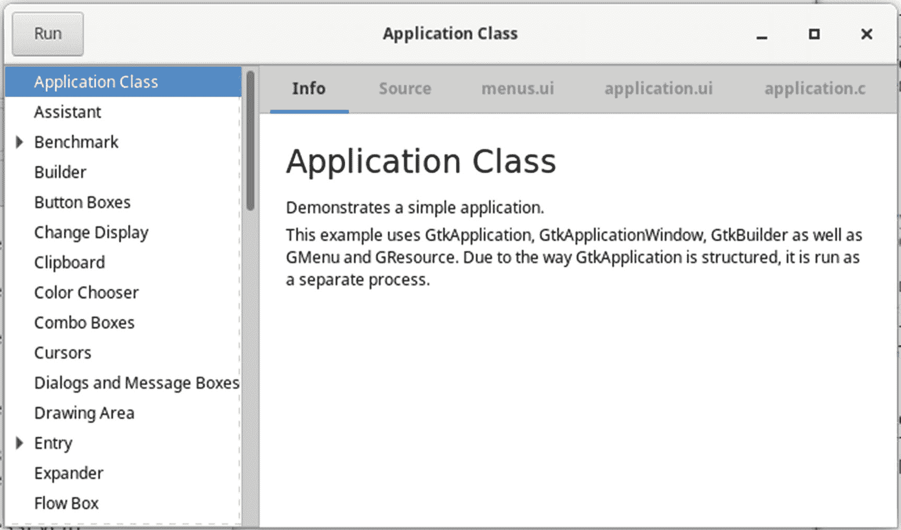

# 一、入门指南

欢迎来到*PyGTK 开发的基础*。在本书中，您将获得 GIMP Toolkit (GTK+)的全面知识，它允许您创建全面的图形程序。在继续之前，您应该知道这本书是针对 Python 程序员的，所以我们假设您已经很好地理解了 Python 语言，并且您可以直接使用 GTK+。时间不会花在让您熟悉 Python 上。

为了最大限度地利用这本书，你应该按顺序阅读每一章，并研究每一章中的所有例子。在 Linux 上开始使用 GTK+非常容易，因为大多数发行版都捆绑了创建和运行 Python/GTK+程序所需的一切。我们将在本章后面介绍 Windows 和 macOS 的安装过程。

有几个应该安装的工具可以让你在开始时不会遇到麻烦。首先要安装 Python 3.x。需要运行 GTK+ 3.x Python 程序。其次，应该安装 GTK+ 3.x 运行时库。这些库安装了许多依赖项，包括 GObject、Pango、GLib、GDK、GdkPixbuf 和 ATK。确保安装所有相关的库。

你不需要安装 GNU 编译器集合。在本书提供的例子中，你没有编译任何 C/C++程序。您只需要安装 Python 3.x 和 GTK+ 3.x 运行时库来运行示例程序。

## GTK+ 2.x 和 3.x 的区别

如果您精通 GTK+ 2.x，您可能会对 3.x 版本中的变化感到惊讶。GTK+ API 和包装这些库的 Python 类有大有小的变化。虽然大多数小部件的基础都没有改变，但是有很多小的“问题”会让你感到悲伤，直到你明白为什么以及哪里发生了变化。

大多数这些变化的原因是由于 GTK+理念的变化。GTK+ 2.x 库是围绕所有 GTK+程序之间的一致性而设计的，使用 GTK+主题作为一致性的基础。随着 GTK+库的出现，这种理念完全改变了。虽然主题仍然可用，但现在更容易创建 GTK+程序，它们有自己的外观和感觉，独立于当前的 GTK 主题。虽然这给了开发人员更大的控制权，但也需要一些额外的编程步骤来实现外观和感觉。它还删除了一些使小部件易于创建和控制的 API。

下面是 GTK+ 2.x 和 3.x 之间差异的部分列表。其中一些项目有简单的解决方法，但其他项目需要程序员做更多的工作，因为它们的差异足以导致源代码移植问题。

*   许多标准的股票图标已经被删除，主要是按钮和菜单项上使用的图标。如果您需要这些图标，您必须提供自己的图标集。

*   现在，所有 2.x 常量都作为属性分组到 3.x Python 类中。如果您正在移植源代码，这是一个需要解决的主要问题。

*   一些集装箱已经被淘汰。例如，`Gtk.Hbox`和`Gtk.Vbox`小部件已经被移除，现在您必须在创建新的`Gtk.Box`实例时通过参数指定`Gtk.Box`的方向。注意，`Gtk.Box`类现在是 GTK+ 3.x 中的一个真实类，而不是一个抽象类。

*   容器的默认包装已被删除；所有包装参数必须提供给 API。

*   一些标准对话框已被删除。您必须创建自己的对话框来替换它们。

*   有两个新的主要类对于大型和小型应用的整体控制非常有用:`Gtk.Application`类和`Gtk.ApplicationWindow`类。虽然简单的应用并不一定需要这些类，但是即使对于最简单的应用来说，它们仍然很有用。因此，我们将本书中的所有示例都基于这两个类来包装我们的小部件示例。

使用`Gtk.Application`和`Gtk.ApplicationWindow`类创建菜单要容易得多。这需要在 GTK+ 2.x 环境中进行复杂的编程，并简化为创建一个 XML 文件来表示您想要在 3.x 环境中创建的菜单。

## 安装 GTK+ 3.x

在创建程序之前，必须安装 Python、GTK+和所有相关的库。本节介绍在 Linux 和其他类似 Unix 的操作系统上安装 GTK+。它不包括如何在 macOS 或 Windows 上安装 GTK+。您需要研究在那些操作系统环境中安装 GTK+和 Python 的正确方法。

大多数现代 Linux 发行版都包含 Python 和 GTK+作为它们各自仓库的一部分。您只需要从您的 Linux 发行版的包安装程序中选择 Python 3(这有时是默认安装的)和 GTK+ 3.x(使用可用的最新版本，如图 [1-1](#Fig1) 所示),然后安装这些包以及所有依赖包。

要测试您的安装，请运行以下命令。



图 1-1

GTK+ 3 演示程序

```py
/usr/bin/gtk3-demo

```

如果程序存在并且小部件文档窗口出现，那么 GTK+安装成功。

## 摘要

本章介绍了 GTK+3 . x 版和 Python 3 以及一些安装先决条件。它展示了一些安装后测试，以确保 GTK+成功安装。并且讨论了 GTK+ 2.x 和 3.x 之间的一些差异。

成功安装 GTK+ 3.x 和 Python 3 之后，您的环境应该可以构建您的第一个 Python/GTK+程序了。

第 2 章[进一步讨论了`Gtk.Application`和`Gtk.ApplicationWindow`，所有 Python 3 GTK+ 3.x 程序都应该使用的基类。](02.html)