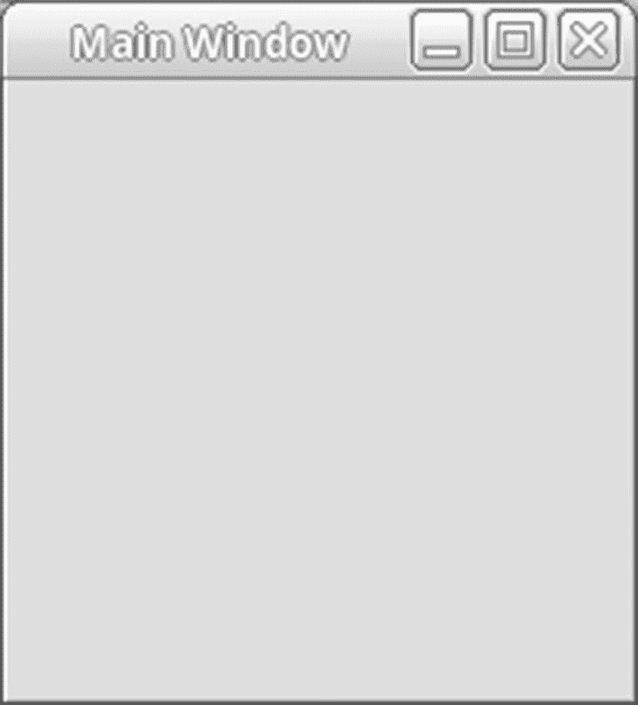
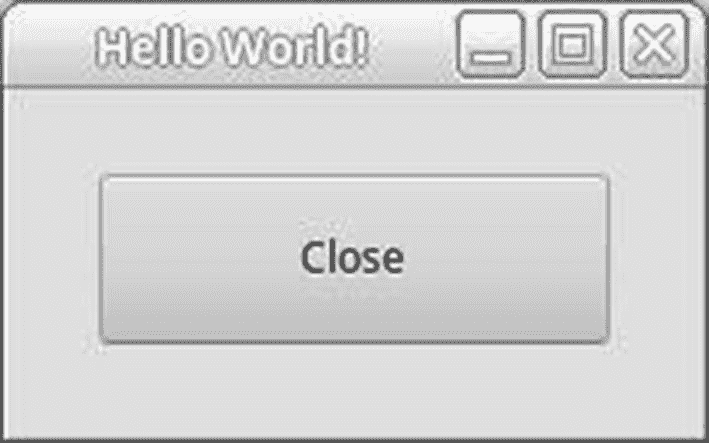

# 三、一些简单的 GTK+应用

本章介绍了一些简单的 GTK+应用和一些 GTK+小部件。我们涵盖了在接下来的章节和示例应用中使用的主题。

本章涵盖了以下概念。

*   所有 GTK+ Python 应用使用的基本函数和方法调用

*   GTK+ widget 系统的面向对象特性

*   信号、回调和事件在应用中扮演的角色

*   如何用 Pango 文本标记语言改变文本样式

*   小部件的一些有用的函数和方法

*   如何制作可点击的标签

*   如何使用小部件方法获取和设置属性

重要的是你要掌握这些概念，这样你就有了一个合适的基础。

## 你好世界

几乎世界上所有的编程语言书籍都是以 Hello World 示例开始的。虽然这本书没有什么不同，但它使用的例子比大多数其他语言的例子更复杂。这是因为我们的例子基于`Gtk.Application`和`Gtk.ApplicationWindow`类。这使得示例程序有点长，而且乍一看，对于这样一个简单的 GTK+窗口来说有些夸张。但是它也很好地解释了 GTK+是如何工作的，以及 Python 绑定是如何将 API 包装成一个非常好的面向对象系统的。

清单 [3-1](#PC1) 是本书中最简单的应用之一，但是它提供了解释 GTK+应用应该如何组织以及 GTK+小部件层次结构如何工作的基础。这是你用 Python 创建的每一个 GTK+应用都应该有的基本代码！

```py
#!/usr/bin/python3

import sys
import gi
gi.require_version('Gtk', '3.0')
from gi.repository import Gtk

class AppWindow(Gtk.ApplicationWindow):

    def __init__(self, *args, **kwargs):
        super().__init__(*args, **kwargs)

class Application(Gtk.Application):

    def __init__(self, *args, **kwargs):
        super().__init__(*args, application_id="org.example.myapp",
                         **kwargs)
        self.window = None

    def do_activate(self):
        if not self.window:
            self.window = AppWindow(application=self, title="Main Window")
        self.window.present()

if __name__ == "__main__":
    app = Application()
    app.run(sys.argv)

Listing 3-1HelloWorld.py

```

Figure [3-1](#Fig1) contains everything you need for a complete GTK+ 3.x Python program.



图 3-1

HelloWorld.py

如果您以前有过 GTK+的经验，您可能会注意到缺少一些 GTK+ 2.x 的通用元素。我们在第 1 行显式地将它设为 Python 3 程序。这是必要的，因为 GTK+ 3.x 模块仅在 Python 版本 3.x 中可用。该声明允许第 4–6 行正确地建立 GTK+ 3.x 环境。

第 8–11 行支持可见的 GTK+窗口。我们需要支持这个应用的唯一活动是调用`super`类来初始化它。但是好像少了一些活动！所有这些缺失的元素要么包含在`Gtk.ApplicationWindow`超类中，要么在`Gtk.Application`类中得到支持。一个默认的支持动作将`delete-event`连接到一个默认的方法来退出应用。

第 13–23 行支持应用逻辑。在我们的子类中定义了`Gtk.Application`类的四个默认方法之一。`do_activate`方法执行所需的激活活动。

当应用被激活时(启动后)调用`do_activate`。在这种情况下，需要两个函数。首先，我们检查这是否是对该方法的初始调用，如果是，我们创建`Application` GTK+ window 实例。其次，我们激活并显示(呈现)主应用窗口。

第 25–27 行是启动我们的应用所需的唯一 Python 语句。不需要其他陈述，事实上，也不应该添加任何陈述。所有的应用工作应该发生在`Gtk.Application`类或者`Gtk.ApplicationWindow`类或者它们的子类中。这可以防止试图启动另一个应用实例的“单实例”应用发生任何不必要的工作。

## GTK+小部件层次结构

GTK+应用编程接口实际上是一个 C 语言 API。然而，它是以这样一种方式组织的，像 Python 这样的面向对象语言可以包装 C API，这样整个 API 集就变成了一组以层次结构组织的类。

从 GTK+ 2.x 到 3.x 的转变有助于其他语言创建更易于维护和实现的面向对象的绑定。例如，虽然 Python 2.x 支持抽象类，但它们隐藏在集合类中，很难在您自己的代码中实现。Python 3.3 提供了`collections.abc`模块，这使得你可以很容易地在模块中子类化类来创建你自己的抽象类。此外，GTK+ 3.x API 极大地减少了抽象类的数量。未来很可能全部被淘汰。

GTK+ 3.x 对象层次结构由 PyGObject API 参考( [`http://lazka.github.io`](http://lazka.github.io) `/ pgi-docs/#Gtk-3.0`)文档记录。这是 Python GTK+ 3.x 参考文档。它涵盖了您需要了解的关于 Python 对象绑定到 GTK+的一切，包括对象层次结构、支持的类、接口、函数、方法和属性。虽然该文档基本上是全面的，但它缺少关于一些新类的信息。我们希望这本书能提供这些信息，以及如何使用所有小部件和类的优秀例子。

虽然理解 GTK+的层次结构很重要，但是如果只是肤浅地理解，仍然有可能创建良好的 GUI 应用。但是你越了解层次结构，你就能更好地控制你的应用。

## 扩展 HelloWorld.py

即使清单 [3-1](#PC1) 是一个完整的应用，但显然它不是很有用。因此，让我们添加有用的特性和方法调用，为我们的应用提供可视信息和视觉吸引力(参见清单 [3-2](#PC2) )。

```py
#!/usr/bin/python3

import sys
import gi
gi.require_version('Gtk', '3.0')
from gi.repository import Gtk

class AppWindow(Gtk.ApplicationWindow):

    def __init__(self, *args, **kwargs):
        super().__init__(*args, **kwargs)
        label = Gtk.Label.new("Hello World!")
        label.set_selectable(True)
        self.add(label)
        self.set_size_request(200, 100)

class Application(Gtk.Application):

    def __init__(self, *args, **kwargs):
        super().__init__(*args, application_id="org.example.myapp",
                         **kwargs)
        self.window = None

    def do_activate(self):
        if not self.window:
            self.window = AppWindow(application=self, title="Hello World!")
        self.window.show_all()
        self.window.present()

if __name__ == "__main__":
    app = Application()
    app.run(sys.argv)

Listing 3-2HelloWorld with Label

```

图 [3-2](#Fig2) 是运行清单 [3-2](#PC2) 的结果。请注意，标签已经突出显示。


图 3-2

带标签的 HelloWorld

我们现在有了一个显示数据的应用，因此更加有用。让我们来看看为了达到这个结果我们对程序所做的修改。

第 12–15 行是大部分修改的地方。在第 12 行，我们用文本“Hello World！”创建了`Gtk.Label`包含在其中。在第 13 行，我们使文本可选。这允许用户选择文本并将其复制到剪贴板。在第 14 行，我们将标签添加到默认容器中。GTK+中的所有主窗口都是从`Gtk.Container`派生出来的，所以可以向该容器添加小部件。第 15 行调整大小`Gtk.ApplicationWindow`。

第 27 行显示了`Gtk.ApplicationWindow`包含的所有小部件。我们需要这个方法调用，因为`present`方法不执行那个功能。它只显示主窗口。

这些是对清单 [3-1](#PC1) 所做的唯一更改。正如您所看到的，向 Python GTK+应用添加新功能并不费力。

### GTK。标签小部件

在清单 [3-2](#PC2) 中创建了一个`GTK.Label`小部件。这是通过以下调用完成的。

```py
label = Gtk.Label.new("Hello World!")

```

该调用创建一个包含指定文本的新标签。文本可能包含 Python 转义序列(比如`"\n"`)，GTK+用它来格式化屏幕上的文本。

`GTK.Label`支持许多有用的方法。以下是一些更有用的列表。

*   `set_selectable`:这个方法打开/关闭文本的选择性。默认为关闭。这对于像错误消息这样的事情非常有用，用户可能希望将文本复制到剪贴板。

*   `set_text`:该方法用指定的新文本替换当前标签文本。

*   `set_text_with_mnemonic`:该方法用指定的新文本替换当前标签文本。新文本中可能包含也可能不包含助记符。如果文本中的字符前面有一个下划线，它们就有下划线，这表明它们代表一个叫做*助记符*的键盘快捷键。助记键可用于激活另一个小部件，可以自动选择，也可以使用`Gtk.Label.set_mnemonic_widget`明确选择。

*   `get_text`:该方法获取当前标签文本。

### 布局容器

`Gtk.ApplicationWindow`和`Gtk.Window`类都是从`Gtk.Container`小部件间接派生的。这意味着`Gtk.Container`中的所有方法对于派生的窗口都是可用的。

通过使用`add`方法，可以将小部件或其他容器类型添加到主窗口中。这就是如何将`GTK.Label`添加到主窗口中。当您将一个小部件添加到一个容器中时，就会形成一种父/子关系；容器成为父容器，标签成为容器的子容器。

小部件之间的父/子关系在 GTK+中非常重要，原因有很多。例如，当一个父窗口小部件被销毁时，GTK+递归地销毁所有子窗口小部件，不管它们的嵌套有多深。

容器也有默认的大小调整算法。这可能是好消息，也可能是坏消息。在许多情况下，默认的大小正是您想要的；但很多时候，并不是这样。您可以通过调整主窗口的大小来覆盖默认大小。

容器的另一个调整助手是`set_border_width`方法。它允许您在文本周围创建一个边框，以便当用户手动缩小窗口时，窗口具有由文本大小和边框宽度决定的最小尺寸。

在第 [4](04.html) 章中有更多关于容器和布局的信息。

## 信号和回调

GTK+是一个依赖于信号和回调方法的系统。信号是通知你的应用用户已经执行了一些动作。您可以告诉 GTK+在发出信号时运行一个方法或函数。这些被称为*回调方法* / *函数*。

### 警告

GTK+信号与 POSIX 信号不同！GTK+中的信号通过来自 X 窗口系统的事件传播。每一个都提供了独立的方法。这两种信号类型不应互换使用。

初始化用户界面后，控制权通过`Gtk.Application`类实例交给`gtk_main()`函数，它会一直休眠，直到发出信号。此时，控制权被传递给其他方法/函数。

作为程序员，您将信号连接到它们的方法/回调函数。当动作已经发生并且发出信号时，或者当您已经显式发出信号时，回调方法/函数被调用。你也有能力阻止信号的发射。

### 注意

可以在应用中的任何点连接信号。例如，新信号可以在回调方法/函数中连接。然而，在调用`Gtk.Application`实例中的`gtk_main()`或`present()`方法之前，您应该尝试初始化关键任务回调。

信号有很多种类型，就像函数一样，它们是从父结构继承来的。许多信号是所有微件通用的，如`"hide"`和`"grab-focus"`，或者是微件专用的，如`Gtk.RadioButton`信号`"group-changed"`。在任何情况下，从一个类派生的小部件都可以使用它的所有祖先可以使用的所有信号。

### 连接信号

我们连接到信号的第一个例子是从主窗口截取`"destroy"`信号，这样我们可以选择如何处理该信号。我们自己处理这个信号的一个主要原因是在 GTK+系统自动破坏窗口之前执行一个动作。

```py
widget.connect("destroy", self.on_window_destroy, extra_param)

```

当`widget.destroy()`在小部件上被调用或者当`False`从`delete_event()`回调方法/函数返回时，GTK+发出`"destroy"`信号。如果您参考 API 文档，您会看到销毁信号属于`Gtk.Object`类。这意味着 GTK+中的每个类都继承了信号。任何 GTK+结构/实例的销毁都会通知你。

每个`connect()`调用都有两个必需的参数。第一个是您想要跟踪的信号的名称。每个小部件都有许多可能的信号，所有这些都可以在 API 文档中找到。请记住，小部件可以自由使用其祖先的信号，因为每个小部件实际上都是其祖先的实现。您可以使用 API 的“对象层次”部分来引用父类。

```py
widget.connect("signal_name", function_name, extra_param)

```

键入信号名称时，下划线和破折号字符可以互换。它们被解析为相同的字符，因此您选择哪一个都没有任何区别。我在本书的所有例子中都使用了下划线。

`connect()`方法中的第二个参数是发出信号时调用的回调方法/函数。回调方法/函数的格式取决于每个特定信号的函数原型要求。下一节将展示一个回调方法的例子。

`connect()`方法中的最后一个参数允许您向回调方法/函数发送额外的参数。与 C 版本的`g_signal_connect()`函数不同，Python 版本的`connect()`方法调用允许您为回调方法/函数传递任意多的额外参数。这非常有用，因为它防止了人为地创建一个单独的变量容器，该容器包装了许多您希望传递给回调/方法的变量/类。

在这个`connect()`实例中，一个标签被传递给回调方法。

```py
widget.connect("destroy", self.on_window_destroy, label)

```

`connect()`的返回值是信号的处理程序标识符。您可以将此与`GObject.signal_handler_block()`、`GObject.signal_handler_unblock()`和`GObject.signal_handler_disconnect()`一起使用。这些函数分别停止调用回调方法/函数，重新启用回调函数，以及从小部件的处理程序列表中删除信号处理程序。更多信息在 API 文档中。

### 回调方法/函数

在`connect()`中指定的回调方法/函数在信号被发送到它所连接的小工具时被调用。对于除事件之外的所有信号，回调方法/函数的形式如下。

```py
# a callback function
def on_window_destroy(widget, extra_arg)

# a callback method
def on_window_destroy(self, widget, extra_arg)

```

您可以在 API 文档中找到每个信号的回调方法/函数的示例格式，但这是通用格式。`widget`参数是执行`connect()`调用的对象。

其他可能的必需参数也可能出现在中间，尽管情况并不总是如此。对于这些参数，您需要参考您正在使用的信号的文档。

您的回调方法/函数的最后一个参数对应于`connect()`的最后一个参数。请记住，这些可选参数的数量可以根据您的需要而定，但是来自`connect()`调用的额外参数的数量和回调方法/函数定义中的额外参数的数量必须相同。

您还应该注意，回调的方法版本的第一个参数是 Python 在方法定义中所需的`self`参数；否则，函数和方法定义是相同的。

## 事件

事件是由 X 窗口系统发出的特殊类型的信号。它们最初由 X 窗口系统发出，然后从窗口管理器发送到您的应用，由 GLib 提供的信号系统进行解释。例如，`"destroy"`信号在小部件上发出，但是`"delete-event"`事件首先被小部件的底层`Gdk.Window`识别，然后作为小部件的信号发出。

您遇到的第一个事件实例是`"delete-event"`。当用户试图关闭窗口时，发出`"delete-event"`信号。可以通过单击标题栏上的关闭按钮、使用任务栏中的关闭弹出菜单项或通过窗口管理器提供的任何其他方式来退出窗口。

使用`connect()`将事件连接到回调函数的方式与其他 GTK +信号相同。但是，回调函数的设置略有不同。

```py
# an event callback function
def on_window_destroy(widget, event, extra_arg)

# an event callback method
def on_window_destroy(self, widget, event, extra_arg)

```

回调方法/函数的第一个区别是布尔返回值。如果从事件回调中返回`True`, GTK+假定事件已经被处理，它不会继续。通过返回`False`，您告诉 GTK+继续处理事件。`False`是函数的默认返回值，所以在大多数情况下不需要使用`"delete-event"`信号。这只有在您想要覆盖默认信号处理程序时才有用。

例如，在许多应用中，您可能希望确认程序的退出。通过使用下面的代码，如果用户不想退出，您可以阻止应用退出。

```py
# an event callback method
def on_delete_event(self, widget, event, extra_arg):
    answer = # Ask the user if exiting is desired.
    if answer:
        return False
    else:
        return True

```

通过从`"delete-event"`回调函数返回`False`，在小部件上自动调用`widget.destroy()`。这个信号会自动继续动作，所以不需要连接它，除非您想覆盖默认设置。

此外，回调函数包括`Gdk.Event`参数。`Gdk.Event`是`Gdk.EventType`枚举和所有可用事件结构的并集。我们先来看一下`Gdk.EventType`枚举。

### 事件类型

`Gdk.EventType`枚举提供了可用事件类型的列表。这些可以用来确定已经发生的事件的类型，因为您可能并不总是知道发生了什么。

例如，如果您将`"button-press-event"`信号连接到一个小部件，有三种不同类型的事件可以导致信号的回调函数运行:`Gdk.EventType.BUTTON_PRESS`、`Gdk.EventType.2BUTTON_PRESS`和`Gdk.EventType.3BUTTON_PRESS`。双击和三击也发出`Gdk.EventType.BUTTON_PRESS`作为第二个事件，所以能够区分不同类型的事件是必要的。

附录 B 提供了您可以参加的活动的完整列表。它显示了传递给`connect()`的信号名称、`Gdk.EventType`枚举值和事件描述。

我们来看一下`"delete-event"`回调函数。我们已经知道`"delete-event"`是`Gdk.EventType.DELETE`的类型，但是让我们假设我们不知道。我们可以通过使用下面的条件语句很容易地测试这一点。

```py
def delete_event(self, window, event, data):
    if event.type == Gdk.EventType.DELETE:
       return False
    return True

```

本例中，如果事件类型为`Gdk.EventType.DELETE`，则返回`False`，并在小部件上调用`widget.destroy()`；否则，返回`True`，不采取进一步的行动。

### 使用特定的事件结构

有时，您可能已经知道发出了哪种类型的事件。在下面的例子中，我们知道总是发出一个`"key-press-event"`。

```py
widget.connect("key-press-event", on_key_press)

```

在这种情况下，可以安全地假设事件的类型总是`Gdk.EventType.KEY_PRESS`，回调函数也可以这样声明。

```py
def on_key_press(widget, event):

```

因为我们知道事件的类型是一个`Gdk.EventType.KEY_PRESS`，我们不需要访问`Gdk.Event`中的所有结构。我们只使用了`Gdk.EventKey`，我们可以在回调方法/函数中使用它来代替`Gdk.Event`。由于事件已经被转换为`Gdk.EventKey`，我们只能直接访问该结构中的元素。

```py
Gdk.EventKey.type              # GDK_KEY_PRESS or GDK_KEY_RELEASE
Gdk.EventKey.window            # The window that received the event
Gdk.EventKey.send_event        # TRUE if the event used XSendEvent
Gdk.EventKey.time              # The length of the event in milliseconds
Gdk.EventKey.state             # The state of Control, Shift, and Alt
Gdk.EventKey.keyval            # The key that was pressed
Gdk.EventKey.length            # The length of string
Gdk.EventKey.string            # A string approximating the entered text
Gdk.EventKey.hardware_keycode  # Raw code of the key that was pressed or released
Gdk.EventKey.group             # The keyboard group
Gdk.EventKey.is_modifier       # Whether hardware_keycode was mapped

```

我们在整本书中使用的`Gdk.EventKey`结构中有许多有用的属性。在某些时候，浏览 API 文档中的一些`Gdk.Event`结构会很有用。我们涵盖了本书中一些最重要的结构，包括`Gdk.EventKey`和`Gdk.EventButton`。

所有事件结构中唯一可用的变量是事件类型，它定义了已发生事件的类型。总是检查事件类型以避免以错误的方式处理它是一个好主意。

## 其他 GTK+方法

在继续学习更多的例子之前，我想提醒您注意一些函数，这些函数将在后面的章节中以及在您创建自己的 GTK+应用时派上用场。

### Gtk。小部件方法

`Gtk.Widget`结构包含许多有用的函数，您可以将其用于任何小部件。这一部分概述了您在许多应用中需要的一些。

通过在对象上显式调用`widget.destroy()`可以销毁一个小部件。被调用时，`widget.destroy()`递归地删除小部件及其所有子部件上的引用计数。然后，小部件及其子部件被销毁，所有内存被释放。

```py
widget.destroy()

```

通常，这仅在顶级小部件上调用。它通常只用于销毁对话框窗口和实现退出应用的菜单项。在下一个示例中，它用于在单击按钮时退出应用。

您可以使用`widget.set_size_request()`来设置小部件的最小尺寸。它会强制小部件比正常情况下更小或更大。但是，它不会调整小部件的大小，使其太小而无法正常工作或在屏幕上自行绘制。

```py
widget.set_size_request(width, height)

```

通过向任一参数传递-1，您告诉 GTK+使用其自然大小，或者如果您没有定义自定义大小，则使用小部件通常被分配的大小。如果您只想指定高度或宽度参数，则使用此选项。它还允许您将小部件重置为其原始大小。

没有办法设置宽度或高度小于 1 个像素的小部件，但是通过向任一参数传递 0，GTK+使小部件尽可能小。同样，它不会被调整得太小，以至于不能正常工作或不能自己绘图。

由于国际化，设置任何小部件的大小都有危险。文本在您的计算机上可能看起来很棒，但是在使用应用德语翻译的计算机上，小部件对于文本来说可能太小或太大。主题也带来了小部件大小的问题，因为小部件默认为不同的大小，这取决于主题。所以大多数情况下最好允许 GTK+选择小部件和窗口的大小。

您可以使用`widget.grab_focus()`来强制小部件获取键盘焦点。这只适用于可以处理键盘交互小部件。使用`widget.grab_focus()`的一个例子是当搜索工具栏显示在 Firefox 中时，将光标发送到一个文本条目。它也可以用来给可选择的`Gtk.Label`一个焦点。

```py
widget.grab_focus()

```

通常，您希望将一个小部件设置为非活动的。通过调用`widget.set_sensitive()`，指定的小部件及其所有子部件被禁用或启用。通过将小部件设置为不活动，用户被阻止与小部件交互。大多数小部件在设置为非活动状态时也是灰色的。

```py
widget.set_sensitive(boolean)

```

如果您想要重新启用一个小部件及其子部件，您只需要在同一个小部件上调用这个方法。孩子受父母敏感程度的影响，只是反映了父母的设定，而不是改变他们的属性。

### Gtk。窗口方法

现在您已经看到了两个使用`Gtk.Window`类的例子。您了解了如何设置窗口标题和添加子窗口小部件。现在，让我们探索更多的功能，让您进一步定制窗口。

默认情况下，所有窗口都设置为可调整大小。这在大多数应用中都是可取的，因为每个用户都有不同的尺寸偏好。但是，如果有特殊的原因，你可以使用`window.set_resizable()`来阻止用户调整窗口的大小。

```py
window.set_resizable(boolean)

```

### 警告

你应该注意到调整大小的能力是由窗口管理器控制的，所以这个设置并不是在所有情况下都有效！

前面的警告引出了重要的一点。GTK+所做的大部分事情都与窗口管理器提供的功能相互作用。因此，并非所有窗口管理器都遵循您的所有窗口设置。这是因为您的设置仅仅是被使用或忽略的提示。您应该记住，在使用 GTK+设计应用时，您的请求可能会被接受，也可能不会被接受。

可以用`window.set_default_size()`设置`Gtk.Window`的默认大小，但是在使用这种方法时有一些事情需要注意。如果窗口的最小尺寸大于您指定的尺寸，GTK+会忽略这个方法。如果您之前设置了更大的请求，也会忽略该请求。

```py
window.set_default_size(width, height)

```

与`widget.set_size_request()`不同，`window.set_default_size()`只设置窗口的初始大小；这并不妨碍用户将其调整到更大或更小的尺寸。如果将高度或宽度参数设置为 0，则窗口的高度或宽度将设置为可能的最小尺寸。如果将–1 传递给任一参数，窗口将被设置为其自然大小。

您可以*用`window.move()`请求*窗口管理器将窗口移动到指定位置；但是，窗口管理器可以忽略这个请求。这适用于所有需要窗口管理器操作的功能。

```py
window.move(x, y)

```

默认情况下，窗口在屏幕上的位置是相对于屏幕的左上角计算的，但是您可以使用`window.set_gravity()`来改变这个假设。

```py
window.set_gravity(gravity)

```

这个函数定义了小部件的重心，这是布局计算考虑的点`(0, 0)`。`Gdk.Gravity`枚举的可能值包括`Gdk.Gravity.NORTH_WEST`、`Gdk.Gravity.NORTH`、`Gdk.Gravity.GRAVITY_NORTH_EAST`、`Gdk.Gravity.WEST`、`Gdk.Gravity.CENTER`、`Gdk.Gravity.EAST`、`Gdk.Gravity.SOUTH_WEST`、`Gdk.Gravity.SOUTH`、`Gdk.Gravity.SOUTH_EAST`和`Gdk.Gravity.STATIC`。

北、南、东和西指的是屏幕的上、下、右和左边缘。它们用于构造多种重力类型。`Gdk.Gravity.STATIC`指窗口本身的左上角，忽略窗口装饰。

如果您的应用有多个窗口，您可以用`window.set_transient_for()`将其中一个设置为父窗口。这允许窗口管理器做一些事情，比如将子窗口放在父窗口的中心，或者确保一个窗口总是在另一个窗口的上面。我们在第 6 章中讨论对话时会探讨多窗口和瞬时关系的概念。

```py
window.set_transient_for(parent)

```

你可以通过调用`window.set_icon_from_file()`来设置出现在窗口任务栏和标题栏的图标。图标的大小无关紧要，因为当所需的大小已知时，它会调整大小。这允许缩放图标具有最佳质量。

```py
window.set_icon_from_file(filename)

```

如果图标加载和设置成功，则返回`True`。

### 警告

图标是一个复杂的主题，有许多复杂的行为，包括图标集、缩放和与主题的交互。更多信息参见 GTK+文档。

### 处理待定事件

有时，您可能希望处理应用中的所有未决事件。当您运行一段需要长时间处理的代码时，这非常有用。这会导致您的应用看起来冻结，因为如果 CPU 被另一个进程占用，小部件不会被重绘。例如，在我创建的名为 OpenLDev 的集成开发环境中，我必须在处理构建命令的同时更新用户界面；否则，该窗口将被锁定，并且在构建完成之前不会显示任何构建输出。

下面的循环是这个问题的解决方案。它回答了新 GTK+程序员提出的大量问题。

```py
while Gtk.events_pending():
    Gtk.main_iteration()

```

该循环调用`Gtk.main_iteration()`，它为您的应用处理第一个未决事件。当`Gtk.events_pending()`返回`True`时，这个过程继续进行，告诉您是否有事件等待处理。

使用这个循环是解决冻结问题的简单方法，但是更好的方法是使用完全避免这个问题的编码策略。例如，只有当没有更重要的操作需要处理时，才可以使用 GLib 中的空闲函数来调用函数。

## 小跟班

`Gtk.Button`是一种特殊的容器，只能容纳一个孩子。然而，这个子控件本身可以是一个容器，因此允许一个按钮包含多个小部件。`Gtk.Button`类是可点击的实体。它可以连接到所属容器或窗口的已定义方法。

`Gtk.Button`是一个动作小部件。也就是说，当它被点击时，预期会采取一个动作。程序员通过处理点击按钮时发出的信号来完全控制这个动作。所以让我们看看另一个简单的例子中`Gtk.Button`是如何工作的(参见清单 [3-3](#PC25) )。

```py
#!/usr/bin/python3

import sys
import gi
gi.require_version('Gtk', '3.0')
from gi.repository import Gtk

class AppWindow(Gtk.ApplicationWindow):

    def __init__(self, *args, **kwargs):
        super().__init__(*args, **kwargs)
        self.set_border_width(25)
        button = Gtk.Button.new_with_mnemonic("_Close")
        button.connect("clicked", self.on_button_clicked)
        button.set_relief(Gtk.ReliefStyle.NORMAL)
        self.add(button)
        self.set_size_request(200, 100)

    def on_button_clicked(self, button):
        self.destroy()

class Application(Gtk.Application):

    def __init__(self, *args, **kwargs):
        super().__init__(*args, application_id="org.example.myapp",
                         **kwargs)
        self.window = None

    def do_activate(self):
        if not self.window:
            self.window = AppWindow(application=self,
                                     title="Hello World!")
        self.window.show_all()
        self.window.present()

if __name__ == "__main__":
    app = Application()
    app.run(sys.argv)

Listing 3-3HelloWorld with Button

```

图 [3-3](#Fig3) 显示了运行清单 [3-3](#PC25) 的结果。注意默认情况下按钮是如何居中的。



图 3-3

带按钮的 HelloWorld

那些有经验的 GTK+ 2.x 开发人员可能想知道为什么我们没有使用 stock 按钮。自 GTK+ 3.1 以来，Stock 按钮已被弃用，不应在新代码中使用。这可能会让人大吃一惊，因为在将 2.x 应用升级到 3.x 应用时，这会导致大量工作。但并非一切都像乍看起来那么糟糕。通过转换为非库存按钮，您的应用对于所有支持的平台变得更加可移植。

让我们详细看看按钮代码。有一些有趣的代码。

第 12 行设置稍后创建的按钮周围的边框宽度。第 13–16 行创建按钮，并将其连接到`Gtk.Application`实例中的一个方法。第 13 行创建了一个带有助记标签`"_Close"`的按钮。下划线表示字母 C 是助记符。当用户按 Alt+C 时，按钮发出`"clicked"`信号。

第 14 行将按钮产生的`"clicked"`信号连接到`Gtk.ApplicationWindow`实例中的`on_button_clicked`方法。它通过从`kwargs`参数中获取实例来实现这一点。字典名`application`在第 28 行被赋予一个值，该值在第 14 行被获取，指向正确的`Gtk.Application`实例方法。

您可能想知道为什么我们没有将按钮信号连接到`Gtk.ApplicationWindow`类的本地方法。这是因为退出应用的信号属于`Gtk.Application`类，而不是`Gtk.ApplicationWindow`类。这是很难理解和正确应用的“陷阱”之一。当将信号连接到方法时，您需要仔细考虑，以确保正确的类获得信号。这是一种处理`"clicked"`信号的迂回方法。正常的方法是在`Gtk.ApplicationWindow`类中创建自己的方法，比如`on_button_clicked`，并将信号连接到那个方法。我们展示这个例子只是为了说明您可以向`Gtk.ApplicationWindow`实例或`Gtk.Application`实例发送信号。

第 14 行设置按钮的浮雕样式。你应该总是使用 Gtk。正常风格，除非你有很好的理由不这样做。

第 16 行将按钮添加到`Gtk.ApplicationWindow`容器中。这就像添加一个标签，如清单 [3-2](#PC2) 所示。

第 19–20 行处理按钮发出的`"clicked"`信号。我们唯一的行动是销毁`Gtk.ApplicationWindow`实例。

我们应该注意，当最后一个`Gtk.ApplicationWindow`实例被销毁时，`Gtk.Application`会导致应用退出。

## 测试你的理解能力

在本章中，您了解了窗口、按钮和标签小部件。是时候将这些知识付诸实践了。在下面的练习中，您将运用 GTK+应用、信号和`GObject`属性系统的结构知识。

### 练习 1:使用事件和属性

本练习通过创建一个具有自我销毁能力的`Gtk.ApplicationWindow`类来扩展本章的前两个例子。您应该将您的名字设置为窗口的标题。应该添加一个以您的姓氏作为默认文本字符串的可选择的`Gtk.Label`作为窗口的子窗口。

让我们考虑一下这个窗口的其他属性:它不应该是可调整大小的，最小尺寸应该是 300×100 像素。本章讨论了执行这些任务的方法。

接下来，通过查看 API 文档，将`key-press-event`信号连接到窗口。在`"key-press-event"`回调函数中，切换窗口标题和标签文本。例如，第一次调用回调方法时，窗口标题应该设置为您的姓，标签文本应该设置为您的名。

完成练习 1 后，您可以在附录 d 中找到该解决方案的描述。该解决方案的完整源代码可从 [`www.gtkbook.com`](http://www.gtkbook.com) 下载。

一旦你完成了这个练习，你就可以进入下一章了，这一章将讨论容器部件。这些小部件允许你的主窗口包含不止一个小部件，这是本章所有例子的情况。

不过在继续之前，你要了解一下 [`www.gtkbook.com`](http://www.gtkbook.com) ，可以补充 PyGTK 开发的*基础。这个网站上有很多下载、GTK+信息的链接、C 和 Python 复习教程、API 文档等等。你可以在阅读这本书的时候使用它来帮助你学习 GTK+。*

## 摘要

在这一章中，我们介绍了一些简单的 GTK+ 3.x 应用，以及一些简单的小部件，这些小部件还介绍了一些概念，这些概念将在后面的章节中有所帮助。以下是你在本章中学到的一些概念。

*   用一个示例程序介绍了`Gtk.Label`类。

*   用一个示例程序介绍了`Gtk.Button`类。

*   介绍了信号和捕捉信号的方法。这个概念在后面的章节中有更深入的介绍。

*   引入了容器的概念。这一概念在第 [4](04.html) 章中有更深入的介绍。

在第 4 章中，我们将介绍`Gtk.Container`类和大量可用的集装箱类型。