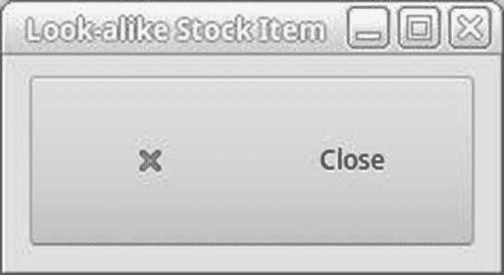
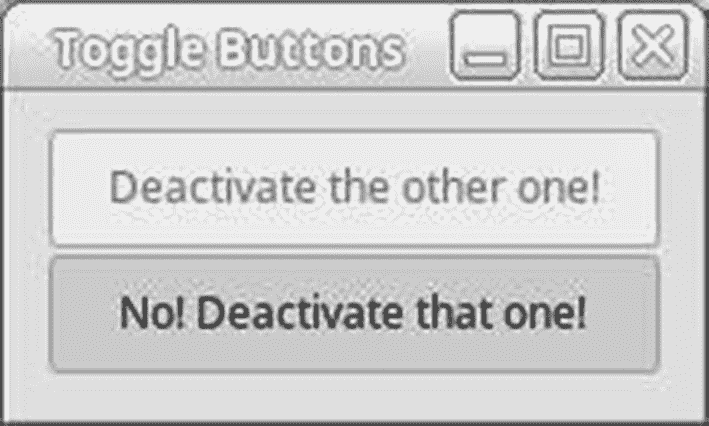
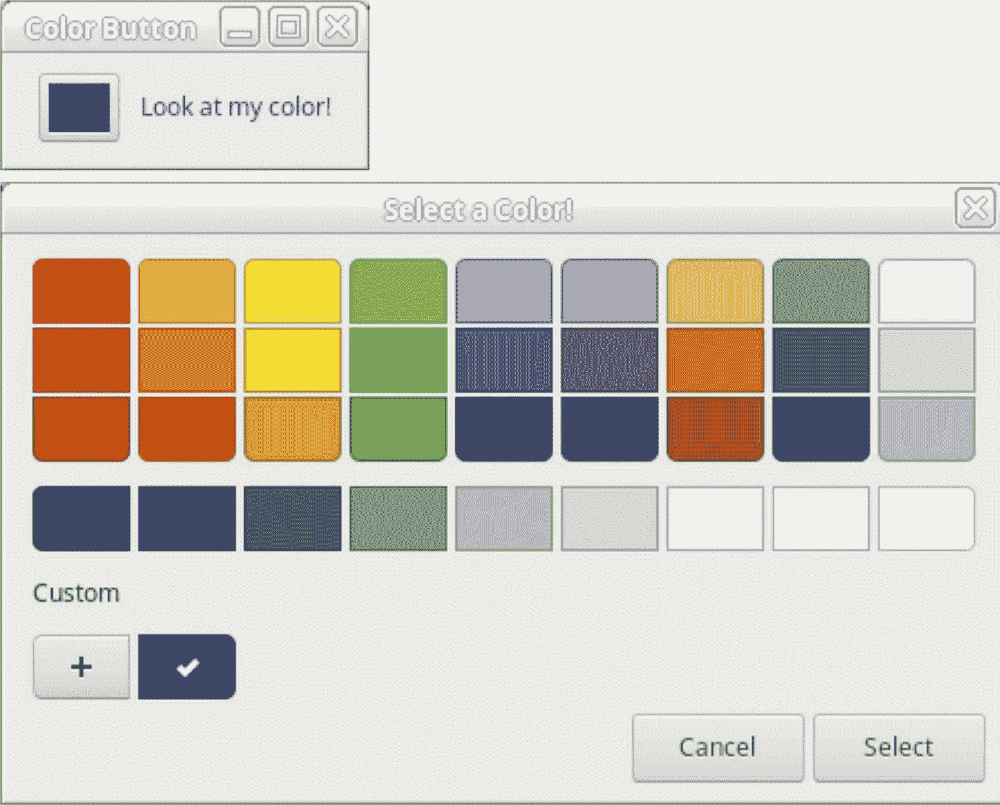
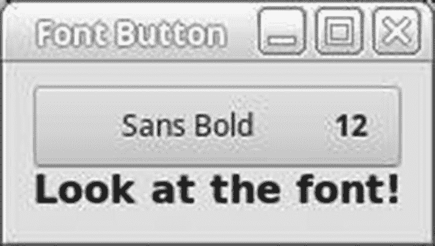

# 5.基本部件

到目前为止，除了`Gtk.Button`之外，您还没有学到任何旨在方便用户交互的小部件。这在本章中有所改变，因为我们将介绍允许用户做出选择、更改设置或输入信息的许多类型的小部件。

这些小部件包括按钮、切换按钮、复选按钮、单选按钮、颜色选择按钮、文件选择器按钮、字体选择按钮、文本输入和数字选择按钮。

在本章中，您将学习

*   如何使用股票项目的可点击按钮。

*   如何使用切换按钮的类型，包括复选按钮和单选按钮。

*   如何使用 entry 小部件进行一行自由格式的文本输入。

*   如何使用微调按钮小部件进行整数或浮点数选择。

*   有哪些专门的按钮。

## 使用按钮

以前，本节的标题是“使用库存项目”但是 GTK+ 3.x 库存物品已经被弃用，所以我将向您展示如何从标准物品中创建外观相似的库存物品。

图 [5-1](#Fig1) 显示了如何创建一个相似的股票关闭按钮。



图 5-1

外观相似的库存按钮

使用清单 [5-1](#PC1) 中的代码生成相似的股票按钮。

```py
#!/usr/bin/python3

import sys
import gi
gi.require_version('Gtk', '3.0')
from gi.repository import Gtk

class AppWindow(Gtk.ApplicationWindow):

    def __init__(self, *args, **kwargs):
        super().__init__(*args, **kwargs)
        self.set_border_width(10)
        button = Gtk.Button.new()
        hbox = Gtk.Box(orientation=Gtk.Orientation.HORIZONTAL, spacing=0)
        icon_theme = Gtk.IconTheme.get_default()
        icon = icon_theme.load_icon("window-close", -1,
                                    Gtk.IconLookupFlags.FORCE_SIZE)
        image = Gtk.Image.new_from_pixbuf(icon)
        hbox.add(image)
        label = Gtk.Label.new_with_mnemonic("_Close")
        hbox.add(label)
        hbox.set_homogeneous(True)
        button.add(hbox)
        button.connect("clicked", self.on_button_clicked)
        button.set_relief(Gtk.ReliefStyle.NORMAL)
        self.add(button)
        self.set_size_request(230, 100)

    def on_button_clicked(self, param):
        self.destroy()

class Application(Gtk.Application):

    def __init__(self, *args, **kwargs):
        super().__init__(*args, application_id="org.example.myapp",
                         **kwargs)
        self.window = None

    def do_activate(self):
        if not self.window:
            self.window = AppWindow(application=self,
                                    title="Look-alike Stock Item”)
        self.window.show_all()
        self.window.present()

if __name__ == "__main__":
    app = Application()
    app.run(sys.argv)

Listing 5-1Look-alike Stock Button

```

创建自定义按钮的第一个任务是制作一个标准按钮，然后制作一个水平框。下一个任务是为按钮创建一个图像。下面的语句完成了这项任务。

```py
icon_theme = Gtk.IconTheme.get_default()
icon = icon_theme.load_icon("window-close", -1,
Gtk.IconLookupFlags.FORCE_SIZE)

image = Gtk.Image.new_from_pixbuf(icon)
hbox.add(image)

```

第一条语句获得默认的 GTK+主题。接下来，我们通过名称从主题中加载 PixBuf 图标。

接下来，我们将 PixBuf 图标转换成图像，然后将其添加到水平框中。

现在我们创建一个标签，然后将它添加到水平框中。

```py
label = Gtk.Label.new_with_mnemonic("_Close")

hbox.add(label)

```

现在我们可以将按钮连接到我们的自定义方法，设置按钮的浮雕样式，然后将按钮添加到`Gtk.ApplicationWindow`。

```py
button.connect("clicked", self.on_button_clicked)
button.set_relief(Gtk.ReliefStyle.NORMAL)
self.add(button)

```

### 小费

您需要的图标图像可能在默认主题中，也可能不在默认主题中。您可能需要查看其他主题，以找到您可以使用的图像。您可能需要安装一个 GTK+主题，以便访问符合您的目的的主题。

## 切换按钮

`Gtk.ToggleButton`小部件是一种类型的`Gtk.Button`,它在被点击后保持活动或不活动状态。激活时显示为按下。单击激活的切换按钮会使其返回到正常状态。从`Gtk.ToggleButton`衍生出两个 widget:`Gtk.CheckButton`和`Gtk.RadioButton`。

您可以使用三种功能之一创建一个新的`Gtk.ToggleButton`。要创建一个空的切换按钮，使用`Gtk.ToggleButton.` `new()`。如果希望切换按钮默认包含标签，请使用`Gtk.ToggleButton.` `new_with_label()`。最后，`Gtk.ToggleButton`还支持带`Gtk.ToggleButton.` `new_with_mnemonic()`的助记标签。

图 [5-2](#Fig2) 显示了两个`Gtk.ToggleButton`窗口小部件，它们是通过调用`Gtk.ToggleButton.` `new_with_mnemonic()`初始化器用两个助记标签创建的。截图中的小部件是用清单 [5-2](#PC5) 中的代码创建的。



图 5-2

两个 Gtk。切换按钮小工具

在清单 [5-2](#PC5) 中，当一个切换按钮被激活时，另一个被禁用。使它变得敏感的唯一方法是取消原来的切换按钮。

```py
#!/usr/bin/python3

import sys
import gi
gi.require_version('Gtk', '3.0')
from gi.repository import Gtk

class AppWindow(Gtk.ApplicationWindow):

    def __init__(self, *args, **kwargs):
        super().__init__(*args, **kwargs)
        self.set_border_width(10)
        vbox = Gtk.Box.new(orientation=Gtk.Orientation.VERTICAL, spacing=0)
        toggle1 = Gtk.ToggleButton.new_with_mnemonic("_Deactivate the other one!")
        toggle2 = Gtk.ToggleButton.new_with_mnemonic("_No! Deactivate that one!")
        toggle1.connect("toggled", self.on_button_toggled, toggle2)
        toggle2.connect("toggled", self.on_button_toggled, toggle1)
        vbox.pack_start(toggle1, True, True, 1)
        vbox.pack_start(toggle2, True, True, 1)
        self.add(vbox)

    def on_button_toggled(self, toggle, other_toggle):
        if (Gtk.ToggleButton.get_active(toggle)):
            other_toggle.set_sensitive(False)
            else:
                other_toggle.set_sensitive(True)

class Application(Gtk.Application):

    def __init__(self, *args, **kwargs):
        super().__init__(*args, application_id="org.example.myapp",
                         **kwargs)
        self.window = None

    def do_activate(self):
        if not self.window:
            self.window = AppWindow(application=self, title="Toggle Buttons")
        self.window.show_all()
        self.window.present()

if __name__ == "__main__":
    app = Application()
    app.run(sys.argv)

Listing 5-2Two Gtk.ToggleButton Widgets

```

由`Gtk.ToggleButton`类添加的唯一信号是“`toggled"`，它在用户激活或停用按钮时发出。该信号在清单 [5-2](#PC5) 中由一个切换按钮触发，以禁用另一个。

在清单 [5-2](#PC5) 中，显示了另一条重要信息:多个小部件可以使用同一个回调方法。我们不需要为每个切换按钮创建单独的回调方法，因为每个按钮都需要相同的功能。也可以将一个信号连接到多个回调方法，尽管不建议这样做。相反，您应该只在一个回调方法中实现全部功能。

### 检查按钮

在大多数情况下，您不会想要使用`Gtk.ToggleButton`小部件，因为它看起来和普通的`Gtk.Button`完全一样。相反，GTK+提供了`Gtk.CheckButton`小部件，它在显示文本旁边放置了一个离散的开关。`Gtk.CheckButton`是从`Gtk.ToggleButton`类派生出来的。该小部件的两个实例如图 [5-3](#Fig3) 所示。


图 5-3

两个 Gtk。CheckButton 小工具

与切换按钮一样，为`Gtk.CheckButton`初始化提供了三个功能。其中包括`Gtk.CheckButton.``new()``Gtk.CheckButton.new_with_label()``Gtk.CheckButton.``new_with_mnemonic()`。`Gtk.CheckButton`也继承了清单 [5-3](#PC6) 中使用的重要的“切换”信号。

```py
#!/usr/bin/python3

import sys
import gi
gi.require_version('Gtk', '3.0')
from gi.repository import Gtk

class AppWindow(Gtk.ApplicationWindow):

    def __init__(self, *args, **kwargs):
        super().__init__(*args, **kwargs)
        self.set_border_width(10)
        check1 = Gtk.CheckButton.new_with_label("I am the main option.")
        check2 = Gtk.CheckButton.new_with_label("I rely on the other guy.")
        check2.set_sensitive(False)
        check1.connect("toggled", self.on_button_checked, check2)
        closebutton = Gtk.Button.new_with_mnemonic("_Close")
        closebutton.connect("clicked", self.on_button_close_clicked)
        vbox = Gtk.Box.new(orientation=Gtk.Orientation.VERTICAL, spacing=0)
        vbox.pack_start(check1, False, True, 0)
        vbox.pack_start(check2, False, True, 0)
        vbox.pack_start(closebutton, False, True, 0)
        self.add(vbox)

    def on_button_checked(self, check1, check2):
        if check1.get_active():
            check2.set_sensitive(True);
        else:
            check2.set_sensitive(False)

    def on_button_close_clicked(self, button):
        self.destroy()

class Application(Gtk.Application):

    def __init__(self, *args, **kwargs):
        super().__init__(*args, application_id="org.example.myapp",
                         **kwargs)
        self.window = None

def do_activate(self):
    if not self.window:
        self.window = AppWindow(application=self, title="Check Buttons")
    self.window.show_all()
    self.window.present()

if __name__ == "__main__":
    app = Application()
    app.run(sys.argv)

Listing 5-3
Gtk.CheckButtons

```

除了初始化方法，复选框的所有功能都在`Gtk.ToggleButton`类及其祖先中实现。`Gtk.CheckButton`仅仅是一个方便的小部件，它提供了与标准`Gtk.Button`小部件不同的图形。

### 单选按钮

从`Gtk.ToggleButton`派生的第二种小部件是单选按钮小部件。事实上，`Gtk.RadioButton`实际上是来源于`Gtk.CheckButton`。单选按钮是通常组合在一起的开关。

在一个组中，当一个单选按钮被选中时，所有其他单选按钮都被取消选中。该组禁止同时选择多个单选按钮。这使您可以向用户提供多个选项，但只能选择一个。

### 注意

GTK+没有提供取消选择单选按钮的方法，所以一个单选按钮是不可取的。用户不能取消选择该选项！如果你只需要一个按钮，你应该使用一个`Gtk.CheckButton`或者`Gtk.ToggleButton`控件。

单选按钮被绘制为 label 小部件侧面的离散圆形切换按钮，以便与其他类型的切换按钮区分开来。可以使用与`Gtk.CheckButton`相同的切换来绘制单选按钮，但是不应该这样做，因为这会使用户困惑和沮丧。垂直框中的一组四个单选按钮如图 [5-4](#Fig4) 所示。


图 5-4

四 Gtk。单选按钮小部件

要使单选按钮正常工作，它们必须都引用组中的另一个单选按钮。否则，所有按钮都将作为独立的切换按钮。清单 [5-4](#PC7) 显示了如何使用多个单选按钮的示例。

```py
#!/usr/bin/python3

import sys
import gi
gi.require_version('Gtk', '3.0')
from gi.repository import Gtk

class AppWindow(Gtk.ApplicationWindow):

    def __init__(self, *args, **kwargs):
        super().__init__(*args, **kwargs)
        self.set_border_width(10)

        radio1 = Gtk.RadioButton.new_with_label(None, "I want to be clicked!")
        radio2 = Gtk.RadioButton.new_with_label_from_widget(radio1,
                                                    "Click me instead!)
        radio3 = Gtk.RadioButton.new_with_label_from_widget(radio1,
                                                    "No! Click me!”)
        radio4 = Gtk.RadioButton.new_with_label_from_widget(radio3,
                                                    "No! Click me!”)
        vbox = Gtk.Box(orientation=Gtk.Orientation.VERTICAL,
        spacing=0) vbox.pack_start(radio1, False, False, 0)
        vbox.pack_start(radio2, False, False, 0)
        vbox.pack_start(radio3, False, False, 0)
        vbox.pack_start(radio4, False, False, 0)
        self.add(vbox)
        self.show_all()

class Application(Gtk.Application):

    def __init__(self, *args, **kwargs):
        super().__init__(*args, application_id="org.example.myapp",
                         **kwargs)
        self.window = None

    def do_activate(self):
        if not self.window:
            self.window = AppWindow(application=self, title="Radio Buttons")
        self.window.show_all()
        self.window.present()

if __name__ == "__main__":
    app = Application()
    app.run(sys.argv)

Listing 5-4
Gtk.RadioButton

```

组中的第一个单选按钮可以用以下三个函数中的任何一个来创建。但是，如果您想使用一个`Gtk.Label`小部件作为子部件，也可以使用一个助记小部件，这样就可以从键盘上激活切换。

```py
radiobutton = Gtk.RadioButton.new(list)

radiobutton = Gtk.RadioButton.new_with_label(list, "My label")

radiobutton = Gtk.RadioButton.new_with_mnemonic(list, "_My label")

```

然而，还有第四种方法可以同时创建多个单选按钮和一个列表。通过创建第一个单选按钮而不指定列表，可以做到这一点。后续的单选按钮是引用创建的第一个单选按钮或属于内部组的任何其他单选按钮创建的。

```py
radio1 = Gtk.RadioButton.new_with_label(None, "I want to be clicked!")
radio2 = Gtk.RadioButton.new_with_label_from_widget(radio1, "Click me instead!")

radio3 = Gtk.RadioButton.new_with_label_from_widget(radio1, "No! Click me!")
radio4 = Gtk.RadioButton.new_with_label_from_widget(radio3, "No! Click me instead!

```

在每个呼叫中为无线电组指定`None`。这是因为创建一组单选按钮的最简单方法是将它们与组中的另一个小部件相关联。通过使用这种方法，您可以避免对单链表使用`GLib`,因为链表是自动创建和管理的。

将初始化函数引用到一个已经存在的单选按钮会创建这些选项。GTK+将新的单选按钮从指定的小部件添加到组中。因此，您只需要引用所需单选按钮组中已经存在的任何小部件。

最后，组中的每个单选按钮必须连接到切换的信号。当一个单选按钮被选中时，正好有两个单选按钮发出切换信号，因为一个被选中，另一个被取消选中。如果不将每个单选按钮都连接到 toggled，您将无法捕捉所有单选按钮信号。

## 文本条目

`Gtk.Entry`小部件是一个单行的、自由格式的文本输入小部件。它是以一种通用的方式实现的，因此它可以被塑造成适合许多类型的解决方案。它可以用于文本输入、密码输入，甚至数字选择。

`Gtk.Entry`还实现了`Gtk.Editable`接口，该接口提供了大量用于处理文本选择的函数。图 [5-5](#Fig5) 中显示了一个`Gtk.Entry`小部件的例子。该文本条目用于输入密码。


图 5-5

Gtk。密码输入部件

### 注意

`Gtk.Editable`是一种特殊类型的对象，称为接口。接口是由多个小部件实现的一组 API，用于保持一致性。在第 12 章中，你将学习如何在你自己的小部件中实现和利用接口。

`Gtk.Entry`小部件认为所有文本都是标准字符串。它区分普通文本和密码的唯一方式是显示一种叫做*隐形字符*的特殊字符，而不是密码内容。清单 [5-5](#PC10) 向您展示了如何使用一个`Gtk.Entry`小部件来输入密码。如果你想使用一个`Gtk.Entry`小部件进行普通的文本输入，你只需要打开可见性。

```py
#!/usr/bin/python3

import sys
import gi
gi.require_version('Gtk', '3.0')
from gi.repository import Gtk
import os

class AppWindow(Gtk.ApplicationWindow):

    def __init__(self, *args, **kwargs):
        super().__init__(*args, **kwargs)
        self.set_border_width(10)
        prompt_str = "What is the password for " + os.getlogin() + "?"
        question = Gtk.Label(prompt_str)
        label = Gtk.Label("Password:")
        passwd = Gtk.Entry()
        passwd.set_visibility(False)
        passwd.set_invisible_char("*")
        hbox = Gtk.Box(orientation=Gtk.Orientation.HORIZONTAL, spacing=0)
        hbox.pack_start(label, False, False, 5)
        hbox.pack_start(passwd, False, False, 5)
        vbox = Gtk.Box(orientation=Gtk.Orientation.VERTICAL, spacing=0)
        vbox.pack_start(question, False, False, 0)
        vbox.pack_start(hbox, False, False, 0)
        self.add(vbox)

class Application(Gtk.Application):

    def __init__(self, *args, **kwargs):
        super().__init__(*args, application_id="org.example.myapp",
                         **kwargs)
        self.window = None

    def do_activate(self):
        if not self.window:
            self.window = AppWindow(application=self, title="Password")
        self.window.show_all()
        self.window.present()

if __name__ == "__main__":
    app = Application()
    app.run(sys.argv)

Listing 5-5
Gtk.Entry

```

### 条目属性

`Gtk.Entry`小部件是一个高度灵活的小部件，因为它被设计成在最大数量的实例中使用。这可以从类提供的大量属性中看出。本节包括了其中最重要的一些例子。有关属性的完整列表，请参考附录 a。

通常，由于值的字符串限制，您希望限制输入到入口小部件中的自由格式文本的长度。在下面的函数原型中，`entry.set_max_length()`将条目的文本限制为最大字符数。当您想要限制用户名、密码或其他长度敏感信息的长度时，这可能很有用。

```py
entry.set_max_length(max_chars)

```

不可见字符方便了 GTK+中的密码输入。不可见字符是替换条目中实际密码内容的字符，可以用`entry.` `set_invisible_char()`设置。条目的默认字符是星号。

```py
entry.set_invisible_char(single_char)
entry.set_visibility(boolean)

```

指定不可见字符后，您可以通过使用`entry.` `set_visibility()`将可见性设置为`False`来隐藏所有输入的文本。您仍然能够以编程方式检索条目的实际内容，即使它是隐藏的。

### 将文本插入 Gtk。入口小部件

在 GTK+ 3.x 中，只有一种方法可以替换`Gtk.Entry`小部件中的所有文本。方法`entry.` `set_text()`用给定的字符串覆盖文本条目的全部内容。但是，只有当您不再关心小部件显示的当前文本时，这才有用。

```py
entry.set_text(text)

```

用`entry.get_text()`可以检索到`Gtk.Entry`显示的当前文本。该字符串由小部件内部使用，不得以任何方式释放或修改。也可以使用`entry.` `insert_text()`将文本插入到`Gtk.Entry`小部件中。`entry.insert_text()`的参数指定了要插入的文本和要插入文本的字符位置。

## 微调按钮

`Gtk.SpinButton`小部件是一个数字选择小部件，能够处理整数和浮点数。它源于`Gtk.Entry`，因此`Gtk.SpinButton`继承了它的所有功能和信号。

### 调整

在介绍`Gtk.SpinButton`小部件之前，您必须了解`Gtk.Adjustment`类。`Gtk.Adjustment`是 GTK+中少数几个不被认为是小部件的类之一，因为它直接从`Gtk.Object`派生而来。它用于几个小部件，包括旋转按钮、视窗和从`Gtk.Range`派生的多个小部件。

使用`Gtk.Adjustment.`和`new()`创建新的调整。一旦添加到小部件，调整的内存管理由小部件处理，所以您不必担心对象的这一方面。

```py
Gtk.Adjustment.new(initial_value, lower_range, upper_range,
                   step_increment, page_increment, page_size)

```

新的调整用六个参数初始化。这些参数的列表如下。

*   `initial_value`:调整初始化时存储的值。这对应于`Gtk.Adjustment`类的`value`属性。

*   `lower_range`:调整允许保持的最小值。这对应于`Gtk.Adjustment`类的`lower`属性。

*   `lower_range`:允许调整的最大值。这对应于`Gtk.Adjustment`类的`upper`属性。

*   `step_increment`:使最小变化成为可能的增量。如果您想计算 1 到 10 之间的所有整数，增量将被设置为 1。

*   `page_increment`:按下 Page Up 或 Page Down 时的增量。这几乎总是大于 step_increment。

*   `page_size`:一页的大小。该值在`Gtk.SpinButton`中没有多大用处，所以应该设置为与`page_increment`相同的值或 0。

`Gtk.Adjustment`类提供了两个有用的信号:`changed`和`value-changed`。当调整的一个或多个属性被更改时，发出`"changed"`信号，不包括值属性。当调整的当前值改变时，发出`"value-changed"`信号。

### 微调按钮示例

微调按钮小部件允许用户通过向上或向下箭头递增或递减来选择整数或浮点数。用户仍然可以用键盘输入一个值，如果超出范围，它将显示为最接近的可接受值。图 [5-6](#Fig6) 显示了两个显示整数和浮点数的旋转按钮。


图 5-6

微调按钮

微调按钮显示整数或浮点数。实际上，数字存储为`double`值。微调按钮用于将数字四舍五入到正确的小数位数。清单 [5-6](#PC15) 是一个创建整数和浮点数调节按钮的简单例子。

```py
#!/usr/bin/python3

import sys
import gi
gi.require_version('Gtk', '3.0')
from gi.repository import Gtk

class AppWindow(Gtk.ApplicationWindow):

    def __init__(self, *args, **kwargs):
        super().__init__(*args, **kwargs)
        self.set_border_width(10)
        integer = Gtk.Adjustment(5.0, 0.0, 10.0, 1.0, 2.0, 2.0)
        float_pt = Gtk.Adjustment(5.0, 0.0, 1.0, 0.1, 0.5, 0.5)
        spin_int = Gtk.SpinButton()
        spin_int.set_adjustment(integer)
        spin_int.set_increments(1.0, 0)
        spin_int.set_digits(0)
        spin_float = Gtk.SpinButton()
        spin_float.set_adjustment(float_pt)
        spin_float.set_increments(0.1, 0)
        spin_float.set_digits(1)
        vbox = Gtk.Box(orientation=Gtk.Orientation.VERTICAL, spacing=0)
        vbox.pack_start(spin_int, False, False, 5)
        vbox.pack_start(spin_float, False, False, 5)
        self.add(vbox)
        self.set_size_request(180, 100)
        self.show_all()

class Application(Gtk.Application):

    def __init__(self, *args, **kwargs):
        super().__init__(*args, application_id="org.example.myapp",
                         **kwargs)
        self.window = None

    def do_activate(self):
        if not self.window:
            self.window = AppWindow(application=self, title="Spin Buttons")
        self.window.show_all()
        self.window.present()

if __name__ == "__main__":
    app = Application()
    app.run(sys.argv)

Listing 5-6Integer and Floating-Point Number Selection

```

在创建微调按钮之前，您应该创建调整。您也可以使用`None`调整来初始化微调按钮，但它被设置为不敏感。初始化调整后，您可以使用`Gtk.SpinButton.` `new()`创建新的微调按钮。初始化函数中的另外两个参数规定了旋钮的爬升率和要显示的小数位数。爬升率是当按下(+)或(-)符号时，该值应该增加或减少的量。

```py
Gtk.SpinButton.new(climb_rate, digits)

```

或者，您可以使用`Gtk.SpinButton.` `new_with_range()`创建一个新的微调按钮，它会根据您指定的最小值、最大值和步长值自动创建一个新的调整。初始值默认设置为最小值加上十倍于`step_increment`的页面增量。微件的精度自动设置为`step_increment`的值。

```py
Gtk.SpinButton.new_with_range (minimum_value, maximum_value, step_increment)

```

您可以调用`spinbutton.` `set_digits()`来设置微调按钮的新精度，并调用`spinbutton.set_value()`来设置新值。如果该值超出微调按钮的范围，它会自动改变。

```py
spin_button.set_value(value)

```

## 水平和垂直刻度

另一种称为 scale 的小部件允许您提供水平或垂直滑块，可以选择整数或浮点数。`Gtk.Scale`既是水平缩放小部件，也是垂直缩放小部件。在 GTK+ 2.x 中,`Gtk.Scale`是一个抽象类。两个子类`Gtk.HScale`和`Gtk.VScale`分别用于创建水平和垂直刻度。在 GTK+ 3.x 中，这两个类已经被弃用，而`Gtk.Scale`已经成为一个真正的类，可以用来创建水平和垂直的盒子。

`Gtk.Scale` widget 的功能和`Gtk.SpinButton`没有太大区别。当您想要限制用户输入值时，通常使用它，因为值是通过移动滑块来选择的。图 [5-7](#Fig7) 显示了两个水平标尺微件的截图。


图 5-7

水平缩放部件

刻度提供了与微调按钮基本相同的功能，只是使用滑块来选择数字。为了展示小部件之间的相似之处，清单 [5-7](#PC19) 实现了与清单 [5-6](#PC15) 相同的功能:两个滑块允许用户选择一个整数和一个浮点数。

```py
#!/usr/bin/python3

import sys
import gi
gi.require_version('Gtk', '3.0')
from gi.repository import Gtk

class AppWindow(Gtk.ApplicationWindow):

    def __init__(self, *args, **kwargs):
        super().__init__(*args, **kwargs)
        self.set_border_width(10)
        self.set_size_request(250, -1)
        scale_int = Gtk.Scale.new_with_range(Gtk.Orientation.HORIZONTAL, 0.0, 10.0, 1.0)
        scale_float = Gtk.Scale.new_with_range(Gtk.Orientation.HORIZONTAL, 0.0, 1.0, 0.1)
        scale_int.set_digits(0)
        scale_float.set_digits(1)
        scale_int.set_value_pos(Gtk.PositionType.RIGHT)
        scale_float.set_value_pos(Gtk.PositionType.LEFT)
        vbox = Gtk.Box(orientation=Gtk.Orientation.VERTICAL, spacing=0)
        vbox.pack_start(scale_int, False, False, 5)
        vbox.pack_start(scale_float, False, False, 5)
        self.add(vbox)

class Application(Gtk.Application):

    def __init__(self, *args, **kwargs):

        super().__init__(*args, application_id="org.example.myapp",
                         **kwargs)
        self.window = None

    def do_activate(self):
        if not self.window:
            self.window = AppWindow(application=self, title="Scales")
        self.window.show_all()
        self.window.present()

if __name__ == "__main__":
    app = Application()
    app.run(sys.argv)

Listing 5-7Integer and Floating-Point Number Selection

```

有多种方法可以创建新的缩放微件。第一个是使用`Gtk.Scale.` `new()`，它接受一个定义标尺如何工作的`Gtk.Adjustment`。

```py
Gtk.Scale.new(adjustment)

```

或者，您可以使用`Gtk.Scale.` `new_with_range()`创建刻度。该函数接受刻度的最小值、最大值和步长增量。

```py
Gtk.Scale.new_with_range(minimum, maximum, step)

```

由于标尺的值总是存储为`double`，如果默认值不是您想要的，您需要定义用`scale.` `set_digits()`显示的小数位数。默认的小数位数是根据为步长增量提供的小数位数计算的。例如，如果您提供的步长增量为 0.01，则默认情况下会显示两位小数。

```py
scale.set_digits (digits)

```

根据您正在使用的秤部件的类型，您可能希望使用`scale.` `set_value_pos()`更改值的显示位置。位置由`Gtk.PositionType`枚举定义，它们是`Gtk.PositionType.LEFT`、`Gtk.PositionType.RIGHT`。`Gtk.PositionType.TOP`和`Gtk.PositionType.BOTTOM`。您也可以使用`scale.` `set_draw_value()`对用户完全隐藏该值。

```py
scale.set_value_pos(pos)

```

`Gtk.Scale`源自一个名为`Gtk.Range`的小工具。这个小部件是一个抽象类型，提供处理调整的能力。你应该使用`scale.`和`get_value()`来获取当前的刻度值。`Gtk.Range`还提供“数值改变”信号，当用户改变刻度位置时发出。

`Gtk.Adjustment`小工具也可以与其他小工具共享。一个`Gtk.Adjustment`可以与`Gtk.SpinButton`和一个`Gtk.Scale`小部件共享。有关更多信息，请参见 GTK 文档。

## 附加按钮

虽然`Gtk.Button`小部件允许您创建自己的定制按钮，但是 GTK+提供了三个附加的按钮小部件供您使用:颜色选择按钮、文件选择器按钮和字体选择按钮。

涵盖这三个小部件的每一节还涵盖了其他重要的概念，比如`Gtk.Color`类、文件过滤器和 Pango 字体。这些概念将在后面的章节中用到，所以现在掌握它们是个好主意。

### 颜色按钮

`Gtk.ColorButton`小部件为您提供了一种简单的方法，允许您的用户选择特定的颜色。这些颜色可以指定为六位十六进制值或 RGB 值。颜色按钮本身在一个矩形块中显示选定的颜色，该矩形块被设置为按钮的子小部件。图 [5-8](#Fig8) 就是一个例子。



图 5-8

颜色选择对话框

#### 一辆 Gtk。ColorButton 示例

单击颜色按钮会打开一个对话框，允许用户输入颜色值或浏览色轮上的选项。提供色轮是为了使用户不需要知道颜色的数值。清单 [5-8](#PC24) 展示了如何在应用中使用`Gtk.ColorButton`小部件。

```py
#!/usr/bin/python3

import sys
import gi
gi.require_version('Gtk', '3.0')
from gi.repository import Gtk
from gi.repository import Gdk

class AppWindow(Gtk.ApplicationWindow):

    def __init__(self, *args, **kwargs):

        super().__init__(*args, **kwargs)
        self.set_border_width(10)
        color = Gdk.RGBA(red=0, green=.33, blue=.66, alpha=1.0)

        color = Gdk.RGBA.to_color(color)
        button = Gtk.ColorButton.new_with_color(color)
        button.set_title("Select a Color!")
        label = Gtk.Label("Look at my color!")
        label.modify_fg(Gtk.StateType.NORMAL, color)
        button.connect("color_set", self.on_color_changed, label)
        hbox = Gtk.Box(orientation=Gtk.Orientation.HORIZONTAL, spacing=0)
        hbox.pack_start(button, False, False, 5)
        hbox.pack_start(label, False, False, 5)
        self.add(hbox)

    def on_color_changed(self, button, label):
        color = button.get_color()
        label.modify_fg(Gtk.StateType.NORMAL, color)

class Application(Gtk.Application):

    def __init__(self, *args, **kwargs):
        super().__init__(*args, application_id="org.example.myapp",
                         **kwargs)
        self.window = None

    def do_activate(self):
        if not self.window:
            self.window = AppWindow(application=self, title="Color Button")
        self.window.show_all()
        self.window.present()

if __name__ == "__main__":
    app = Application()
    app.run(sys.argv)

Listing 5-8Gtk.ColorButton and Gdk.Color

```

在大多数情况下，你想要创建一个带有初始颜色值的`Gtk.ColorButton`，这是通过将一个`Gdk.Color`对象指定给`button = Gtk.ColorButton.` `new_with_color()`来完成的。如果没有提供颜色，默认颜色是禁用 alpha 选项的不透明黑色。

#### 在 Gdk 中存储颜色。颜色

`Gdk.Color`是存储颜色的红、绿、蓝值的类。这些值可以使用下面显示的方法来检索或设置。第四个可用值是像素对象。当颜色被分配到颜色映射中时，它会自动存储该颜色的索引，所以您通常不需要更改该值。

创建一个新的`Gdk.Color`对象后，如果你已经知道颜色的红色、绿色和蓝色值，你可以用下面的方式指定它们。红色、绿色和蓝色值存储为范围从 0 到 65，535 的无符号整数值，其中 65，535 表示全色强度。例如，下面的颜色指的是白色。

```py
mycolorobj = Gdk.Color.new()
mycolorobj.red = 65535
mycolorobj.green = 65535
mycolorobj.blue = 65535

```

#### 使用颜色按钮

设置初始颜色后，您可以使用`button.` `set_title()`选择颜色选择对话框的标题。默认情况下，标题是“选择一种颜色”，所以如果您对这个标题满意，就没有必要设置这个值。

```py
button.get_color()
label.modify_fg(Gtk.StateType.NORMAL, color)

```

在清单 [5-8](#PC24) 中，前景色被设置为正常的窗口小部件状态，这是所有标签的状态，除非它们是可选的。在`label.` `modify_fg()`中可以使用的`Gtk.StateType`枚举有五个选项。您可以通过传递一个`None`颜色将小部件的前景色重置为默认值。

### 文件选择器按钮

`Gtk.FileChooserButton`小部件为您提供了一个简单的方法，让您要求用户选择一个文件或文件夹。它实现了 GTK+提供的文件选择框架的功能。图 [5-9](#Fig9) 显示了选择文件夹的文件选择器按钮组和选择文件的按钮组。


图 5-9

文件选择器按钮

当用户单击一个`Gtk.FileChooserButton`时，会打开一个`Gtk.FileChooserDialog`实例，允许用户浏览并选择一个文件或一个文件夹，这取决于您创建的按钮的类型。

### 注意

直到第 6 章[的](06.html)你才学会如何使用`Gtk.FileChooserDialog`小部件，但是此时你不需要直接与它交互，因为`Gtk.FileChooserButton`处理所有与对话框的交互。

#### 一辆 Gtk。文件选择按钮示例

您可以更改基本设置，例如当前选定的文件、当前文件夹和文件选择窗口的标题。清单 [5-9](#PC27) 向您展示了如何使用这两种类型的文件选择器按钮。

```py
#!/usr/bin/python3

import sys
import gi
gi.require_version('Gtk', '3.0')
from gi.repository import Gtk
from pathlib import Path

class AppWindow(Gtk.ApplicationWindow):

    def __init__(self, *args, **kwargs):
        super().__init__(*args, **kwargs)
        self.set_border_width(10)
        label = Gtk.Label("")

        chooser1 = Gtk.FileChooserButton("Choose a Folder.",
                                         Gtk.FileChooserAction.SELECT_FOLDER)
        chooser2 = Gtk.FileChooserButton("Choose a Folder.",
                                         Gtk.FileChooserAction.OPEN)
        chooser1.connect("selection_changed",
                         self.on_folder_changed, chooser2)
        chooser2.connect("selection_changed",
                         self.on_file_changed, label)
        chooser1.set_current_folder(str(Path.home()))
        chooser2.set_current_folder(str(Path.home()))
        filter1 = Gtk.FileFilter()
        filter2 = Gtk.FileFilter()
        filter1.set_name("Image Files")
        filter2.set_name("All Files")
        filter1.add_pattern("*.png")
        filter1.add_pattern("*.jpg")
        filter1.add_pattern("*.gif")
        filter2.add_pattern("*")
        chooser2.add_filter(filter1)
        chooser2.add_filter(filter2)
        vbox = Gtk.Box(orientation=Gtk.Orientation.VERTICAL, spacing=0)

        vbox.pack_start(chooser1, False, False, 0)
        vbox.pack_start(chooser2, False, False, 0)
        vbox.pack_start(label, False, False, 0)
        self.add(vbox)
        self.set_size_request(240, -1)

    def on_folder_changed(self,
        chooser1, chooser2): folder =
        chooser1.get_filename()
        chooser2.set_current_folder(folder)

    def on_file_changed(self, chooser2, label):
        file = chooser2.get_filename()
        label.set_text(file)

class Application(Gtk.Application):

    def __init__(self, *args, **kwargs):
        super().__init__(*args, application_id="org.example.myapp",
                         **kwargs)
        self.window = None

    def do_activate(self):
        if not self.window:
            self.window = AppWindow(application=self, title="File Chooser Button")
        self.window.show_all()
        self.window.present()

if __name__ == "__main__":
    app = Application()
    app.run(sys.argv)

Listing 5-9Using the File Chooser Button

```

文件选择器按钮小部件是用`Gtk.FileChooserButton.` `new()`创建的。这个小部件有两个用途:选择单个文件或单个文件夹。可以创建四种类型的文件选择器(其余两种在第 [6](06.html) 章中介绍)，但是文件选择器按钮只支持`Gtk.FileChooserAction` `.OPEN`和`Gtk.FileChooserAction.SELECT_FOLDER`。

#### Gtk.FileChooser

`Gtk.FileChooserButton`小部件是由`Gtk.FileChooser`类提供的功能的实现。这意味着，尽管按钮不是从`Gtk.FileChooser`派生的，但它仍然可以利用`Gtk.FileChooser`定义的所有方法。清单 [5-9](#PC27) 中相当多的方法利用了`Gtk.FileChooser`提供的函数。

在清单 [5-9](#PC27) 中，`chooser1.` `set_current_folder()`用于将每个文件选择器按钮的当前文件夹设置为用户的主目录。当用户最初点击文件选择器按钮时，这个文件夹的内容被显示，除非它通过一些其他方式被改变。如果文件夹被成功修改，这个方法返回`True`。

```py
chooser1.set_current_folder(filename)

```

`Path.home()`方法是 Python 提供的一个实用模块，它返回当前用户的主目录。与`pathlib`中的大多数特性一样，这种方法是独立于平台的。

这带来了文件选择器界面的一个有用的特性；它可以用来浏览许多类型的文件结构，无论是在 UNIX 还是 Windows 机器上。如果您希望您的应用是为多个操作系统设计的，这一点尤其有用。

由于文件选择器按钮一次只允许选择一个文件，根据文件选择器按钮的类型，您可以使用`chooser1.get_filename()`检索当前选择的文件或文件夹。如果没有选择文件，该函数返回`None`。

```py
filename = chooser1.get_filename()

```

至此，您已经有了足够的关于`Gtk.FileChooser`类的信息来实现文件选择器按钮。在下一章中，当你学习`Gtk.FileChooserDialog`部件时，会更深入地讨论`Gtk.FileChooser`。

#### 文件过滤器

`Gtk.FileFilter`对象允许你限制文件选择器中显示的文件。例如，在清单 [5-9](#PC27) 中，当选择图像文件过滤器时，用户只能查看和选择 PNG、JPG 和 GIF 文件。

文件过滤器是用`Gtk.FileFilter.` `new()`创建的。因此，您需要使用`filefilter.`T3 来设置过滤器类型的显示名称。如果您提供多个过滤器，此名称允许用户在它们之间切换。

```py
filefilter = Gtk.FileFilter.new ();
filefilter.set_name (name)

```

最后，要完成过滤，您需要添加要显示的文件类型。这样做的标准方式是使用`filefilter.` `add_pattern()`，如下面的代码片段所示。此功能允许您指定要显示的文件名的格式。通常识别应该显示的文件扩展名可以做到这一点。您可以使用星号字符作为任何类型过滤函数的通配符。

```py
filefilter.add_pattern (pattern)

```

### 小费

如清单 [5-9](#PC27) 所示，您可能希望提供一个`All Files`过滤器来显示目录中的每个文件。为此，您应该创建一个仅将一个模式设置为通配符的过滤器。如果不提供此筛选器，用户将永远无法查看与另一个筛选器提供的模式不匹配的任何文件。

您还可以通过指定多用途互联网邮件扩展(MIME)类型，使用`filefilter.` `add_mime_type()`指定过滤模式。例如，`image/*`显示所有图像 MIME 类型的文件。这个函数的问题是您需要熟悉 MIME 类型。但是，使用 MIME 类型的优点是，您不需要为过滤器指定每个文件扩展名。它允许您归纳到特定 MIME 类别中的所有文件。

```py
filefilter.add_mime_type(mime_type)

```

创建过滤器后，需要将其添加到文件选择器中，这可以通过`filechooser.` `add_filter()`来完成。提供过滤器后，默认情况下会在文件选择器中使用第一个指定的过滤器。如果您指定了多个筛选器，用户可以在类型之间切换。

```py
filechooser.add_filter (filter)

```

### 字体按钮

`Gtk.FontButton`是另一种类型的专用按钮，允许用户选择与当前驻留在用户系统上的字体相对应的字体参数。字体选项是在用户单击按钮时显示的字体选择对话框中选择的。这些选项包括字体名称、样式选项和字体大小。图 [5-10](#Fig10) 中显示了一个示例`Gtk.FontButton`小部件。



图 5-10

字体选择按钮

字体按钮小工具用`Gtk.FontButton.` `new_with_font()`初始化，允许你指定初始字体。字体以字符串形式提供，格式如下:`Family Style Size`。每个参数都是可选的；`Gtk.FontButton`的默认字体是 Sans 12，它不提供样式参数。

“系列”是指正式的字体名称，如 Sans、Serif 或 Arial。样式选项因字体而异，但通常包括斜体、粗体和粗斜体。如果选择常规字体样式，则不指定字体样式。大小是文本的磅值，如 12 或 12.5。

#### 一辆 Gtk。FontButton 示例

清单 [5-10](#PC34) 创建一个用 Sans Bold 12 字体初始化的`Gtk.FontButton`小部件。当按钮中选择的字体改变时，新的字体应用于字体按钮下面的`Gtk.Label`小部件。

```py
#!/usr/bin/python3

import sys
import gi
gi.require_version('Gtk', '3.0')
from gi.repository import Gtk
from gi.repository import Pango

class AppWindow(Gtk.ApplicationWindow):

    def __init__(self, *args, **kwargs):
        super().__init__(*args, **kwargs)
        self.set_border_width(10)
        label = Gtk.Label("Look at the font!")
        initial_font = Pango.font_description_from_string("Sans Bold 12")
        label.modify_font(initial_font)
        button = Gtk.FontButton.new_with_font("Sans Bold 12")
        button.set_title("Choose a Font")
        button.connect("font_set", self.on_font_changed, label)

        vbox = Gtk.Box(orientation=Gtk.Orientation.VERTICAL, spacing=0)
        vbox.pack_start(button, False, False, 0)
        vbox.pack_start(label, False, False, 0)
        self.add(vbox)

    def on_font_changed(self, button, label):
        font = button.get_font()
        desc = Pango.font_description_from_string(font)
        buffer = "Font: " + font
        label.set_text(buffer)
        label.modify_font(desc)

class Application(Gtk.Application):

    def __init__(self, *args, **kwargs):
        super().__init__(*args, application_id="org.example.myapp",
                         **kwargs)
        self.window = None

    def do_activate(self):
        if not self.window:
            self.window = AppWindow(application=self, title="Font Button")

        self.window.show_all()
        self.window.present()

if __name__ == "__main__":
    app = Application()
    app.run(sys.argv)

Listing 5-10Using the Font Button

```

#### 使用字体选择按钮

清单 [5-10](#PC34) 中的代码给出了您遇到的`Pango.FontDescription`类的第一个样本。`Pango.FontDescription`类用于解析字体样式字符串。您可以通过调用如下`Pango.`T3，从字体字符串(如 Sans Bold 12)创建并使用新的字体描述。

```py
initial_font = Pango.font_description_from_string("Sans Bold 12")
label.modify_font(initial_font)

```

创建字体描述后，可以调用`modify_font()`来设置小部件文本的字体。这个函数编辑由小部件的`Gtk.StyleContext`属性存储的字体描述对象。

在清单 [5-10](#PC34) 中，当发出“字体设置”信号时，标签的文本被设置为由`Gtk.FontButton`存储的字体。使用`fontbutton.` `get_font_name()`可以检索字体按钮存储的整个字体描述字符串，用于检索标签显示的字体字符串。

```py
fontbutton.get_font_name()

```

在清单 [5-10](#PC34) 中，新的字体样式被应用于`Gtk.Label`。但是，如果您将`fontbutton.` `set_use_font()`和`fontbutton.` `set_use_size()`设置为`True`，字体按钮在呈现其文本时会使用字体系列和字体大小。这允许用户预览字体按钮中的文本。默认情况下，字体按钮是关闭的。

```py
fontbutton.set_use_font(boolean)
fontbutton.set_use_size(boolean)

```

## 测试你的理解能力

在这一章中，你学习了一些基本的部件，比如`Gtk.Entry`、`Gtk.SpinButton`，以及各种类型的开关和按钮。在下面的两个练习中，您将创建两个应用来练习使用这些小部件。

### 练习 1:重命名文件

在本练习中，使用一个`Gtk.FileChooserButton`小部件允许用户选择系统上的一个文件。接下来，使用一个允许用户为文件指定新名称的`Gtk.Entry`小部件。(请注意，您可以在 Python 文档中找到本练习所需的文件实用程序的函数。)

如果文件被成功重命名，您应该禁用`Gtk.Entry`小部件和按钮，直到用户选择一个新文件。如果用户没有重命名所选文件的权限，那么`Gtk.Entry`小部件和按钮也应该设置为不敏感。完成这个练习后，你可以在附录 d 中找到答案。

这个练习使用了本章中介绍的两个小部件:`Gtk.Entry`和`Gtk.FileChooserButton`。它还要求您使用 Python 提供的多个实用函数，包括重命名文件和检索现有文件权限信息的函数。

虽然您没有学习任何 Python 文件函数，但是您可能还想尝试一些其他与文件相关的实用函数，例如创建目录、更改文件权限和在整个目录结构中移动的能力。Python 提供了很多功能，值得您在空闲时间研究一下 API 文档。

### 练习 2:微调按钮和刻度

在本练习中，创建三个小部件:一个微调按钮、一个水平刻度和一个复选按钮。微调按钮和水平刻度应该设置为相同的初始值和界限。如果选择了 check 按钮，两个调整小部件应该同步到相同的值。这意味着当用户更改一个小部件的值时，另一个小部件也会更改为相同的值。

因为这两个小部件都支持整数和浮点数，所以您应该用不同的小数位数来实现这个练习。您还应该练习通过调整和使用方便的初始化器来创建微调按钮和刻度。

## 摘要

在本章中，您已经了解了以下九个新的小部件，它们为您提供了一种与用户进行交互的有意义的方式。

*   `Gtk.ToggleButton`:一种`Gtk.Button`小部件，在被点击后保持其活动或不活动状态。当它处于活动状态时，显示为按下。

*   `Gtk.CheckButton`:从`Gtk.ToggleButton`派生而来，这个小部件被绘制成一个离散的开关，紧挨着显示的文本。这使得它有别于`Gtk.Button`。

*   `Gtk.RadioButton`:你可以将多个单选按钮部件组合在一起，这样一次只能激活一个开关`in the group`。

*   这个小部件允许用户在一行中输入自由格式的文本。它还有助于密码输入。

*   `Gtk.SpinButton`:源自`Gtk.Entry`，微调按钮允许用户在预定义的范围内选择或输入整数或浮点数。

*   `Gtk.Scale`:类似于微调按钮，这个小部件允许用户通过移动垂直或水平滑块来选择整数或浮点数。

*   这种特殊类型的按钮允许用户选择一种特定的颜色和一个可选的 alpha 值。

*   `Gtk.FileChooserButton`:这种特殊类型的按钮允许用户选择系统中已经存在的单个文件或文件夹。

*   `Gtk.FontButton`:这种特殊类型的按钮允许用户选择字体系列、风格和大小。

在下一章，你将学习如何使用`Gtk.Dialog`类创建你自己的自定义对话框，以及 GTK+内置的一些对话框。到第 6 章结束时，你已经很好地掌握了 GTK+中最重要的简单部件。从那里，我们继续更复杂的话题。