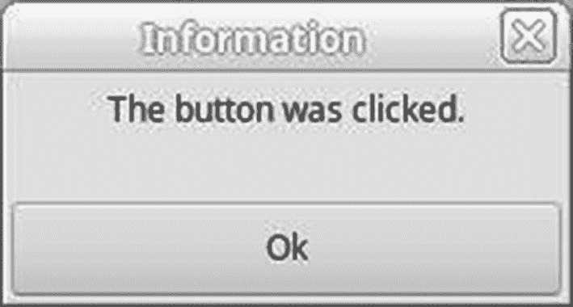
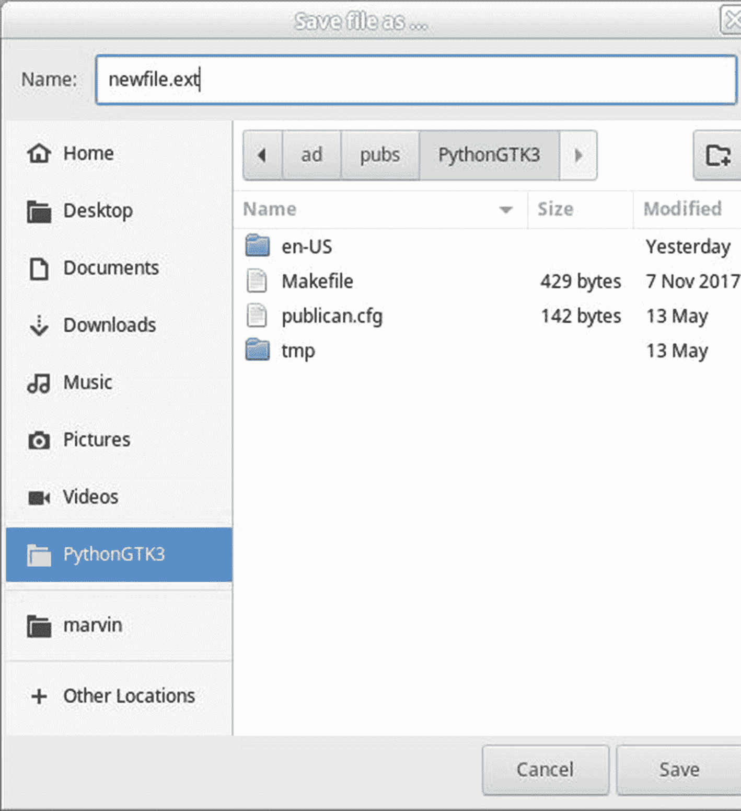
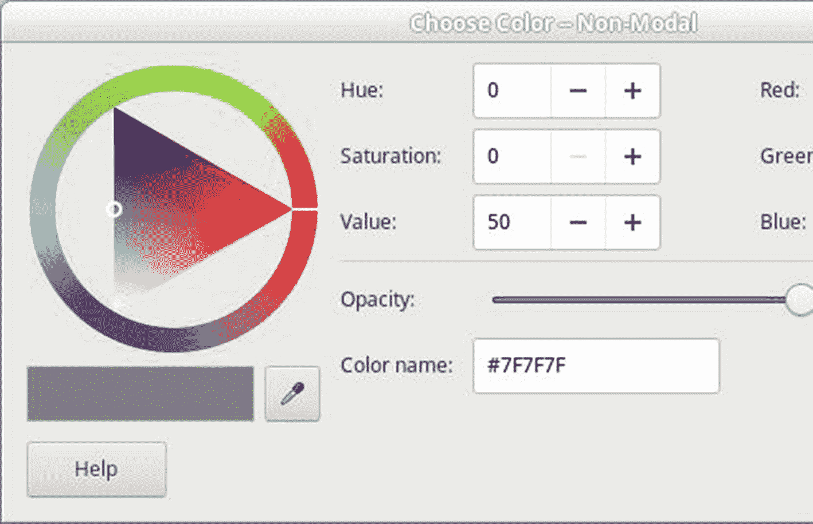
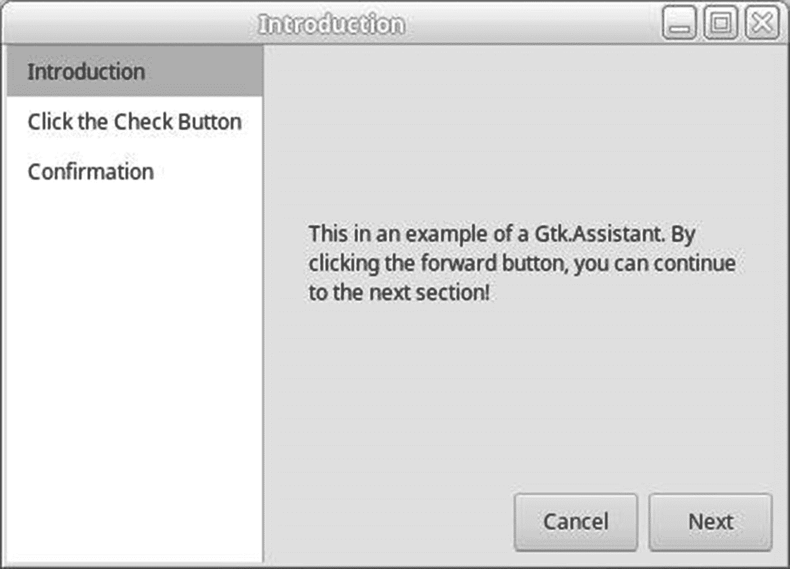

# 6.对话

本章向你介绍一种特殊类型的窗口，叫做*对话框*。对话框是对顶层窗口的补充。对话框由`Gtk.Window`的子类`Gtk.Dialog`提供，并扩展了附加功能。这意味着可以在一个或多个对话框中实现整个界面，同时隐藏主窗口。

您可以使用对话框做任何事情，比如显示消息或提示用户选择一个选项。它们的目的是通过提供某种类型的瞬时功能来增强用户体验。

在本章的第一部分，你将学习如何使用`Gtk.Dialog`来创建你自己的自定义对话框。下一节介绍 GTK+提供的大量内置对话框。最后，您了解了一个名为`Gtk.Assistant`的小部件，它允许您创建包含多个页面的对话框；助手旨在帮助用户完成一个多阶段的过程。

在本章中，您将学习以下内容。

*   如何使用`Gtk.Dialog`小部件创建你自己的自定义对话框

*   如何使用`Gtk.MessageDialog`小部件向用户提供一般信息、错误消息和警告

*   如何使用`Gtk.AboutDialog`提供您的申请信息

*   有哪些类型的文件选择器对话框可用

*   使用字体和颜色选择对话框收集信息的方法

*   如何使用`Gtk.Assistant`小部件创建多页面对话框

## 创建你自己的对话

对话框是一种特殊类型的`Gtk.Window`来补充顶层窗口。它可以给用户一个消息，从用户那里检索信息，或者提供一些其他瞬时类型的动作。

对话框小部件被一个不可见的水平分隔符分成两半。顶部是放置对话框用户界面主要部分的地方。下半部分被称为*动作区域*，它包含一组按钮。单击时，每个按钮都会发出一个唯一的响应标识符，告诉程序员单击了哪个按钮。

在大多数情况下，对话框小部件可以被视为一个窗口，因为它是从`Gtk.Window`类派生的。然而，当你有多个窗口时，当对话框是顶层窗口的补充时，应该在对话框和顶层窗口之间建立父子关系。

```py
vbox = mydialog.get_content_area()

```

`Gtk.Dialog`提供对垂直框的访问，该框的底部定义了动作区域。内容区域尚未定义。为了定义它，你从垂直框的开始处开始打包部件。因此你必须总是使用`pack_start()`来添加部件到`Gtk.Dialog`类中。通过`add_button(button_text, response_id)`方法调用，可以很容易地将按钮添加到操作区域。

### 注意

除了`Gtk.Window`提供的其他功能之外，还可以通过创建一个包含所有相同小部件的`Gtk.Window`并与`set_transient_for()`建立窗口关系来手动实现`Gtk.Dialog`的功能。`Gtk.Dialog`只是一个提供标准方法的便利小部件。

操作区域和分隔符都打包在对话框的垂直框的末尾。由`Gtk.Box` (vbox)提供的保存所有的对话框内容。因为动作区域是在最后打包的，所以您应该使用`pack_start()`向`Gtk.Dialog`添加小部件，如下所示。

```py
vbox = mydialog.get_ac_area()
vbox.pack_start (child, expand, fill, padding)

```

通过在框的开始打包部件，操作区域和分隔符总是保持在对话框的底部。

### 创建消息对话框

`Gtk.Dialog`的一个优点是，不管你的对话内容有多复杂，同样的基本概念可以应用于每一个对话。为了说明这一点，我们首先创建一个非常简单的对话框，向用户显示一条消息。图 [6-1](#Fig1) 是这个对话框的截图。


图 6-1

以编程方式创建的消息对话框

清单 [6-1](#PC3) 创建了一个简单的对话框，当按钮发出被点击的信号时通知用户。这个功能是由`Gtk.MessageDialog`小部件提供的，这将在本章后面的章节中介绍。

```py
#!/usr/bin/python3

import sys
import gi
gi.require_version('Gtk', '3.0')
from gi.repository import Gtk

class AppWindow(Gtk.ApplicationWindow):

    def __init__(self, *args, **kwargs):
        super().__init__(*args, **kwargs)
        self.set_border_width(10)
        button = Gtk.Button.new_with_mnemonic("_Click Me")
        button.connect("clicked", self.on_button_clicked, self)
        self.add(button)
        self.set_size_request(150, 50)

    def on_button_clicked(self, button, parent):
        dialog = Gtk.Dialog(title="Information", parent=parent,
                             flags=Gtk.DialogFlags.MODAL)
        dialog.add_button("Ok", Gtk.ResponseType.OK)
        label = Gtk.Label("The button was clicked.")
        image = Gtk.Image.new_from_icon_name("dialog-information",
                                             Gtk.IconSize.DIALOG)
        hbox = Gtk.Box(orientation=Gtk.Orientation.HORIZONTAL, spacing=0)
        hbox.pack_start(image, False, False, 0)
        hbox.pack_start(label, False, False, 0)
        dialog.vbox.pack_start(hbox, False, False, 0)
        dialog.show_all()
        dialog.run()
        dialog.destroy()

class Application(Gtk.Application):

    def __init__(self, *args, **kwargs):
        super().__init__(*args, application_id="org.example.myapp",
                         **kwargs)
        self.window = None

    def do_activate(self):
        if not self.window:
            self.window = AppWindow(application=self, title="Dialogs")
        self.window.show_all()
        self.window.present()

if __name__ == "__main__":
    app = Application()
    app.run(sys.argv)

Listing 6-1Your First Custom Dialog

```

#### 创建对话

当单击主窗口中的按钮时，您需要做的第一件事是用`Gtk.Dialog.new_with_buttons()`创建`Gtk.Dialog`小部件。该函数的前两个参数指定了对话框的标题、指向父窗口的指针和设备标志。

```py
dialog = Gtk.Dialog(title="Information", parent=parent, flags=Gtk.DialogFlags.MODA

```

该对话框被设置为父窗口的临时窗口，这允许窗口管理器将对话框置于主窗口的中心，并在必要时保持在顶部。这可以通过调用`window.set_transient_for()`对任意窗口实现。如果您不希望对话框拥有或识别父窗口，也可以提供`None`。

接下来，您可以指定一个或多个对话框标志。该参数的选项由`Gtk.DialogFlags`枚举给出。有三个可用值，如下表所示。

*   `Gtk.DialogFlags.MODAL`:强制对话框在父窗口顶部保持焦点直到关闭。用户被阻止与父母交互。

*   `Gtk.DialogFlags.DESTROY_WITH_PARENT`:当父对话框被销毁时，销毁对话框，但不要强制对话框成为焦点。这将创建一个非模态对话框，除非您调用`dialog.run()`。

*   `Gtk.DialogFlags.USE_HEADER_BAR`:在标题栏而不是动作区创建一个带有动作的对话框。

在清单 [6-1](#PC3) 中，指定`Gtk.DialogFlags.MODAL`创建了一个模态对话框。没有必要指定标题或父窗口；这些值可以设置为`None`。但是，您应该始终设置标题，以便它可以在窗口管理器中绘制；否则，用户很难选择想要的窗口。

在清单 [6-1](#PC3) 中，一个响应为`Gtk.ResponseType.OK`的 OK 按钮被添加到对话框中。

在 GTK+ 2.x 中，默认情况下，所有对话框都在对话框的主要内容和操作区域之间放置了一个水平分隔符。该分隔符在 GTK+ 3.x 中已被否决。

创建子部件后，需要将它们添加到对话框中。如前所述，通过调用`box.pack_start()`将子部件添加到对话框中。该对话框打包如下。

```py
image = Gtk.Image.new_from_icon_name("dialog-information", Gtk.IconSize.DIALOG)
hbox = Gtk.Box(orientation=Gtk.Orientation.HORIZONTAL, spacing=0)
hbox.pack_start(image, False, False, 0)
hbox.pack_start(label, False, False, 0)
dialog.vbox.pack_start(hbox, False, False, 0)

```

此时，您需要显示对话框及其子部件，因为`dialog.run()`只在对话框本身上调用`dialog.show()`。为此，调用对话框上的`dialog.show_all()`。如果不显示小部件，当调用`dialog.run()`时，只有分隔符和操作区域可见。

#### 响应标识符

当一个对话框被完全构建时，显示对话框的一种方法是调用`dialog.run()`。这个函数在完成时返回一个名为*响应标识符*的整数。它还可以防止用户与对话框之外的任何东西进行交互，直到对话框被破坏或操作区域按钮被单击。

```py
dialog.run()

```

在内部，`dialog.run()`为对话框创建一个新的主循环，它阻止你与它的父窗口交互，直到发出一个响应标识符或者用户关闭对话框。不管你设置了什么对话框标志，当你调用这个方法时，对话框总是模态的，因为它调用了`dialog.set_modal()`。

如果使用窗口管理器提供的方法手动销毁对话框，则返回`Gtk.ResponseType.NONE`；否则，`dialog.run()`返回引用被点击按钮的响应标识符。来自`Gtk.ResponseType`枚举的可用响应标识符的完整列表如表 [6-1](#Tab1) 所示。您应该总是使用标识符的可用值，而不是随机整数值，因为它们在 GTK+的未来版本中可能会改变。

表 6-1

Gtk。ResponseType 枚举值

<colgroup><col class="tcol1 align-left"> <col class="tcol2 align-left"> <col class="tcol3 align-left"></colgroup> 
| 

标识符

 | 

价值

 | 

描述

 |
| --- | --- | --- |
| `Gtk.ResponseType.NONE` | –1 | 如果操作小部件没有响应 ID，或者对话框以编程方式隐藏或破坏，则返回。 |
| `Gtk.ResponseType.APPLY` | –10 | 由 GTK+对话框中的应用按钮返回。 |
| `Gtk.ResponseType.HELP` | –11 | 由 GTK+对话框中的帮助按钮返回。 |
| `Gtk.ResponseType.REJECT` | –2 | 通用响应 ID，不被 GTK+对话框使用。 |
| `Gtk.ResponseType.ACCEPT` | –3 | 通用响应 ID，不被 GTK+对话框使用。 |
| `Gtk.ResponseType.DELETE_EVENT` | –4 | 如果对话框被删除，则返回。 |
| `Gtk.ResponseType.OK` | –5 | 由 GTK +对话框中的 OK 按钮返回。 |
| `Gtk.ResponseType.CANCEL` | –6 | 由 GTK+对话框中的取消按钮返回。 |
| `Gtk.ResponseType.CLOSE` | –7 | 由 GTK+对话框中的关闭按钮返回。 |
| `Gtk.ResponseType.YES` | –8 | 由 GTK +对话框中的 Yes 按钮返回。 |
| `Gtk.ResponseType.No` | –9 | GTK+对话框中没有按钮返回。 |

当然，当您创建自己的对话框以及使用接下来几页中介绍的许多内置对话框时，您可以自由选择使用哪个响应标识符。但是，您应该努力抵制将`Gtk.ResponseType.CANCEL`标识符应用到 OK 按钮的冲动，或者其他类似的荒谬行为。

### 注意

您可以自由地创建自己的响应标识符，但是您应该使用正数，因为所有的内置标识符都是负数。这允许您在 GTK+的未来版本中添加更多标识符时避免冲突。

对话框返回响应标识符后，需要确保调用`dialog.destroy()`，否则会导致内存泄漏。GTK+确保对话框的所有子对话框都被销毁，但是你需要记住启动这个过程。

通过调用`dialog.destroy()`，父节点的所有子节点都被销毁，其引用计数下降。当对象的引用计数达到零时，该对象被终结，其内存被释放。

#### Gtk。图像小部件

清单 [6-1](#PC3) 引入了另一个名为`Gtk.Image`的新部件。图像可以以多种方式加载，但`Gtk.Image`的一个优点是，如果加载失败，它会显示指定的图像“图像缺失”。它也是从`Gtk.Widget`派生出来的，所以不像其他图像对象，比如`Gdk.Pixbuf`，它可以作为容器的子对象添加。

在我们的例子中，`new_from_icon_name()`从一个命名的主题项目创建了`Gtk.Image`小部件。

```py
image = Gtk.Image.new_from_icon_name("dialog-information", Gtk.IconSize.DIALOG)

```

加载图像时，您还需要指定图像的大小。GTK+自动寻找给定尺寸的股票图标，如果找不到，就把图像调整到那个尺寸。可用的大小参数由`Gtk.IconTheme`枚举指定，如下表所示。

*   `Gtk.IconSize.INVALID`:未指定尺寸

*   `Gtk.IconSize.MENU`16×16 像素

*   `Gtk.IconSize.SMALL_TOOLBAR`18×18 像素

*   `Gtk.IconSize.LARGE_TOOLBAR` : 24×24 像素

*   `Gtk.IconSize.BUTTON` : 24×24 像素

*   `Gtk.IconSize.DND`32×32 像素

*   `Gtk.IconSize.DIALOG`48×48 像素

正如你所看到的，主题`Gtk.Image`对象通常用于较小的图像，比如那些出现在按钮、菜单和对话框中的图像，因为主题图像是以离散的标准尺寸提供的。在清单 [6-1](#PC3) 中，图像被设置为`Gtk.IconSize.DIALOG`或 48×48 像素。

为`Gtk.Image`提供了多个初始化函数，这些函数在 API 文档中有描述，但是`new_from_file()`和`new_from_pixbuf()`对本书后面的例子尤其重要。

```py
Gtk.Image.new_from_file(filename)

```

`Gtk.Image`自动检测指定给`new_from_file()`的文件的图像类型。如果图像无法加载，它会显示一个损坏的图像图标。因此，这个函数永远不会返回一个`None`对象。`Gtk.Image`还支持图像文件中出现的动画。

调用`new_from_pixbuf()`会在之前初始化的`Gdk.Pixbuf`中创建一个新的`Gtk.Image`小部件。与`new_from_file()`不同的是，您可以使用该函数轻松判断图像是否成功加载，因为您首先需要创建一个`Gdk.Pixbuf`。

```py
Gdk.Image.new_from_pixbuf(pixbuf)

```

您需要注意的是，`Gtk.Image`创建了它自己对`Gdk.Pixbuf`的引用，所以如果它应该被`Gtk.Image`销毁，您需要释放对该对象的引用。

### 非模态消息对话框

通过调用`dialog.run()`，你的对话框总是被设置为模态的，这并不总是令人满意的。要创建非模态对话框，您需要连接到`Gtk.Dialog`的响应信号。

在清单 [6-2](#PC10) 中，图 [6-1](#Fig1) 中的消息对话框被重新实现为非模态对话框。您应该尝试连续多次单击主窗口中的按钮。这展示了如何不仅可以创建同一个对话框的多个实例，还可以从非模态对话框访问主窗口。

```py
#!/usr/bin/python3

import sys
import gi
gi.require_version('Gtk', '3.0')
from gi.repository import Gtk

class AppWindow(Gtk.ApplicationWindow):

    def __init__(self, *args, **kwargs):
        super().__init__(*args, **kwargs)
        self.set_border_width(10)
        button = Gtk.Button.new_with_mnemonic("_Click Me")
        button.connect("clicked", self.on_button_clicked, self)
        self.add(button)
        self.set_size_request(150, 50)
        self.show_all()

    def on_button_clicked(self, button, parent):
        dialog = Gtk.Dialog(title="Information", parent=parent)
        dialog.add_button("Ok", Gtk.ResponseType.OK)
        label = Gtk.Label("The button was clicked.")
        image = Gtk.Image.new_from_icon_name("dialog-information",
                                               Gtk.IconSize.DIALOG)
        hbox = Gtk.Box(orientation=Gtk.Orientation.HORIZONTAL, spacing=0)
        hbox.pack_start(image, False, False, 0)
        hbox.pack_start(label, False, False, 0)
        dialog.vbox.pack_start(hbox, False, False, 0)
        dialog.connect("response", self.on_dialog_button_clicked)
        dialog.show_all()

    def on_dialog_button_clicked(self, dialog, response):
        dialog.destroy()

class Application(Gtk.Application):

    def __init__(self, *args, **kwargs):
        super().__init__(*args, application_id="org.example.myapp",
                         **kwargs)
        self.window = None

    def do_activate(self):
        if not self.window:
            self.window = AppWindow(application=self, title="Dialogs")
        self.window.show_all()
        self.window.present()

if __name__ == "__main__":
    app = Application()
    app.run(sys.argv)

Listing 6-2A Nonmodal Message Dialog

```

创建一个非模态对话框与前面的例子非常相似，除了你不想调用`dialog.run()`。通过调用这个函数，不管对话框标志是什么，都会通过阻塞父窗口的主循环来创建一个模态对话框。

### 小费

通过设置`Gtk.DialogFlags.MODAL`标志，你仍然可以创建一个不使用`dialog.run()`的模态对话框。然后，您可以连接到响应信号。这个函数只是提供了一种在一个函数中创建模态对话框和处理响应标识符的便捷方式。

通过连接到`Gtk.Dialog`的响应信号，您可以等待一个响应标识符被发出。通过使用此方法，当发出响应标识符时，对话框不会自动取消引用。响应回调方法接收对话框、发出的响应标识符和可选的数据参数。

设计对话框时，你必须做出的最重要的决定之一就是它是模态的还是非模态的。根据经验，如果动作需要在用户继续使用应用之前完成，那么对话框应该是模态的。例如消息对话框、向用户提问的对话框和打开文件的对话框。

如果在对话框打开时，用户没有理由不能继续工作，您应该使用非模态对话框。您还需要记住，可以创建非模态对话框的多个实例，除非您以编程方式阻止这种情况，因此必须只有一个实例的对话框应该创建为模态对话框。

### 另一个对话框示例

既然您已经从头开始创建了一个简单的消息对话框，那么是时候创建一个更复杂的对话框了。在清单 [6-3](#PC11) 中，使用 Python 的实用函数传播了一些关于用户的基本信息。如图 [6-2](#Fig2) 所示的对话框允许你编辑每条信息。


图 6-2

一个简单的 Gtk。对话框小部件

当然，这些信息在用户的系统中实际上并没有改变；新文本被简单地输出到屏幕上。这个例子说明了这样一个事实，不管对话有多复杂，如何处理响应标识符的基本原则仍然是唯一需要的。

您也可以很容易地将它实现为非模态对话框，尽管这没有多大用处，因为对话框本身就是应用的顶层窗口。

```py
#!/usr/bin/python3

import sys
import gi
gi.require_version('Gtk', '3.0')
from gi.repository import Gtk
import os
import getpass
import socket
import pwd

class AppWindow(Gtk.ApplicationWindow):

    def __init__(self, *args, **kwargs):
        super().__init__(*args, **kwargs)
        self.set_border_width(10)
        button = Gtk.Button.new_with_mnemonic("_Click Me")
        button.connect("clicked", self.on_button_clicked, self)
        self.add(button)
        self.set_size_request(180, 50)
        self.show_all()

    def on_button_clicked(self, button, parent):
        dialog = Gtk.Dialog(title="Edit User Information",
                            parent=parent, flags=Gtk.DialogFlags.MODAL)
        dialog.add_button("Ok", Gtk.ResponseType.OK)
        dialog.add_button("Cancel", Gtk.ResponseType.CANCEL)
        dialog.set_default_response(Gtk.ResponseType.OK)
        lbl1 = Gtk.Label("User Name:")
        lbl2 = Gtk.Label("Real Name:")
        lbl3 = Gtk.Label("Home Dir:")
        lbl4 = Gtk.Label("Host Name:")
        user = Gtk.Entry()
        real_name = Gtk.Entry()
        home = Gtk.Entry()
        host = Gtk.Entry()
        user.set_text(getpass.getuser())
        real_name.set_text(pwd.getpwuid(os.getuid())[4])
        home.set_text(os.environ['HOME'])
        host.set_text(socket.gethostname())
        grid = Gtk.Grid()
        grid.attach(lbl1, 0, 0, 1, 1)
        grid.attach(lbl2, 0, 1, 1, 1)
        grid.attach(lbl3, 0, 2, 1, 1)
        grid.attach(lbl4, 0, 3, 1, 1)
        grid.attach(user, 1, 0, 1, 1)
        grid.attach(real_name, 1, 1, 1, 1)
        grid.attach(home, 1, 2, 1, 1)
        grid.attach(host, 1, 3, 1, 1)
        dialog.vbox.pack_start(grid, False, False, 5)
        dialog.show_all()
        result = dialog.run()
        if result == Gtk.ResponseType.OK:
            print("User Name: " + user.get_text())
            print("Real Name: " +
            real_name.get_text()) print("Home: " +
            home.get_text()) print("Host: " +
            host.get_text())
        dialog.destroy()

class Application(Gtk.Application):

    def __init__(self, *args, **kwargs):
        super().__init__(*args, application_id="org.example.myapp",
                         **kwargs)
        self.window = None

    def do_activate(self):
        if not self.window:
            self.window = AppWindow(application=self, title="Simple Dialog")
        self.window.show_all()
        self.window.present()

if __name__ == "__main__":
    app = Application()
    app.run(sys.argv)

Listing 6-3Editing Information in a Dialog

```

处理任何模式对话框的正确方法是使用响应标识符，根据单击的按钮获得正确的响应。由于只需要故意检测一个响应，所以在清单 [6-3](#PC11) 中使用了一个条件 if 语句。

然而，让我们假设您需要处理多个响应标识符。在这种情况下，`if`语句将是一个更好的解决方案，因为创建它是为了比较单个变量和多个选择，如下面的代码片段所示。

```py
result = dialog.run()
if result == Gtk.ResponseType.OK:
    # ... Handle result ...
elif result == Gtk.ResponseType.APPLY:
    # ... Handle result ...
else:
    # ... Handle default result ...

dialog.destroy()

```

## 内置对话框

GTK+已经内置了许多类型的对话框。虽然本章没有涵盖所有可用的对话框，但是您可以很好地理解使用任何内置对话框所需的概念。本节包括`Gtk.MessageDialog`、`GtkAboutDialog`、`Gtk.FileChooserDialog`、`Gtk.FontChooserDialog`和`Gtk.ColorChooserDialog`。

### 消息对话框

消息对话框提供四种类型的信息性消息之一:一般信息、错误消息、警告和问题。这种类型的对话框决定了要显示的图标、对话框的标题和要添加的按钮。

还提供了一种通用类型，它对消息的内容不做任何假设。在大多数情况下，您不会想要使用它，因为所提供的四种类型可以满足您的大部分需求。

重新创建`Gtk.MessageDialog`小部件非常简单。前两个例子实现了一个简单的消息对话框，但是`Gtk.MessageDialog`已经提供了这个功能，所以您不需要重新创建这个小部件。使用`Gtk.MessageDialog`节省了输入时间，也避免了多次重新创建这个小部件的需要，因为大多数应用都会大量使用`Gtk.MessageDialog`。它还为所有 GTK+应用的消息对话框提供了统一的外观。

图 [6-3](#Fig3) 显示了一个`Gtk.MessageDialog`的例子(与图 [6-1](#Fig1) 比较)，它给用户一个按钮被点击信号的视觉通知。



图 6-3

在 Gtk.MessageDialog 小部件中

由于消息的内容并不重要，因此其类型被设置为一般消息。可以使用清单 [6-4](#PC13) 中所示的代码生成这个消息对话框。

```py
#!/usr/bin/python3

import sys
import gi
gi.require_version('Gtk', '3.0')
from gi.repository import Gtk

class AppWindow(Gtk.ApplicationWindow):

    def __init__(self, *args, **kwargs):
        super().__init__(*args, **kwargs)
        self.set_border_width(10)
        button = Gtk.Button.new_with_mnemonic("_Click Me")
        button.connect("clicked", self.on_button_clicked, self)
        self.add(button)
        self.set_size_request(150, 50)

    def on_button_clicked(self, button, parent):
        dialog = Gtk.MessageDialog(type=Gtk.MessageType.INFO, parent=parent,
                                    flags=Gtk.DialogFlags.MODAL,
                                    buttons=("Ok", Gtk.ResponseType.OK),
                                    text="The button was clicked.",
                                    title="Information")
        dialog.run()
        dialog.destroy()

class Application(Gtk.Application):

    def __init__(self, *args, **kwargs):
        super().__init__(*args, application_id="org.example.myapp",
                         **kwargs)
        self.window = None

    def do_activate(self):
        if not self.window:
            self.window = AppWindow(application=self, title="Dialogs")
        self.window.show_all()
        self.window.present()

if __name__ == "__main__":
    app = Application()
    app.run(sys.argv)

Listing 6-4Using a Gtk.MessageDialog

```

单击主窗口中的按钮后，该示例创建一个新的`Gtk.MessageDialog`。

如果需要，父窗口可以设置为`None`，但大多数情况下，应该建立父子关系。如果没有设置父窗口小部件，消息对话框将不会在父窗口上方居中。

用户应该立即处理消息对话框，因为它们呈现了某种需要用户注意的重要消息或关键问题。由于没有设置父窗口，消息对话框很容易被忽略，这在大多数情况下不是我们想要的。

```py
dialog = Gtk.MessageDialog.(type=Gtk.MessageType.INFO, parent=parent, \
                    flags=Gtk.DialogFlags.MODAL, \
                    buttons=("Ok", Gtk.ResponseType.OK), \
                    text="The button was clicked.", \
                    title="Information")

```

您可以指定一个或多个对话框标志。这个参数的选项由前面三个例子中创建定制对话框时使用的`Gtk.DialogFlags`枚举给出。

与 GTK+ 2.x 不同，3.x `Gtk.MessageDialog`不使用任何位置参数。相反，它专门使用关键字参数。还要注意，`Gtk.MessageDialog`没有使用`new`方法。这是因为`Gtk.MessageDialog`创建了`Gtk.MessageDialog`的子类，关键字决定了创建什么样的子类。

另请注意，消息对话框中缺少灯泡图标图像。这是因为 GTK+ 3.x 中的理念变化。如果你的对话框中必须有图标，那么你需要使用`Gtk.Dialog`来手工创建你的对话框。

通过使用`"buttons"`关键字包含一个逗号分隔的按钮/响应 id 列表，支持多个按钮。

您无法控制提供给`Gtk.MessageDialog`的消息的可视格式。如果您想使用 Pango 文本标记语言来格式化消息对话框的文本，您可以在`Gtk.MessageDialog`调用中省略“Text”关键字。然后用一串 Pango 标记调用`set_markup(str)`方法来设置消息的文本。

可以在消息对话框中添加第二个文本，这使得第一条消息用`format_secondary_text()`设置为粗体。提供给这个函数的文本字符串应该类似于 C `printf()`所支持的格式。

这个特性非常有用，因为它允许你在主要文本中给出一个快速的摘要，然后在次要文本中详细描述。

### 关于对话框

`Gtk.AboutDialog`小部件为您提供了一种向用户提供应用信息的简单方法。当选择帮助菜单中的项目时，通常会显示此对话框。然而，由于菜单直到第 [10 章](10.html)才被覆盖，我们的示例对话框被用作顶层窗口。

使用`Gtk.AboutDialog`显示各种类型的信息，包括应用的名称、版权、当前版本、许可内容、作者、文档编制者、艺术家和翻译人员。因为应用不会包含所有这些信息，所以每个属性都是可选的。主窗口仅显示基本信息，与图 [6-4](#Fig4) 中的作者名单一起显示。


图 6-4

一个关于信用对话框和作者信用

通过点击“演职员表”按钮，向用户呈现所提供的任何作者、文档编制者、翻译者和艺术家。许可证按钮弹出一个新的对话框，显示给定的许可证内容。

清单 [6-5](#PC15) 是一个简单的例子，展示了如何使用`Gtk.AboutDialog`小部件的每个可用属性。

```py
#!/usr/bin/python3

import sys
import gi
gi.require_version('Gtk', '3.0')
from gi.repository import Gtk, GdkPixbuf

class AppWindow(Gtk.ApplicationWindow):

    def __init__(self, *args, **kwargs):
        super().__init__(*args, **kwargs)
        self.set_border_width(10)
        button = Gtk.Button.new_with_mnemonic("_Click Me")
        button.connect("clicked", self.on_button_clicked, self)
        self.add(button)
        self.set_size_request(150, 50)
        self.show_all()

    def on_button_clicked(self, button, parent):
        authors = ["Author #1", "Author #2"]
        documenters = ["Documenter #1", "Documenter
        #2"] dialog = Gtk.AboutDialog(parent=parent)
        logo = GdkPixbuf.Pixbuf.new_from_file("./logo.png")
        if logo != None:
            dialog.set_logo(logo)
        else:
            print("A GdkPixbuf Error has occurred.")
        dialog.set_name("Gtk.AboutDialog")
        dialog.set_version("3.0")
        dialog.set_copyright("(C) 2007 Andrew Krause")
        dialog.set_comments("All about Gtk.AboutDialog")
        dialog.set_license("Free to all!")
        dialog.set_website("http://book.andrewKrause.net")
        dialog.set_website_label("book.andrewkrause.net")
        dialog.set_authors(authors)
        dialog.set_documenters(documenters)
        dialog.set_translator_credits("Translator #1\nTranslator #2")
        dialog.connect("response", self.on_dialog_button_clicked)
        dialog.run()

    def on_dialog_button_clicked(self, dialog, response):
        dialog.destroy()

class Application(Gtk.Application):

    def __init__(self, *args, **kwargs):
        super().__init__(*args, application_id="org.example.myapp",
                         **kwargs)
        self.window = None

    def do_activate(self):
        if not self.window:
            self.window = AppWindow(application=self, title="About Dialog")
        self.window.show_all()
        self.window.present()

if __name__ == "__main__":
    app = Application()
    app.run(sys.argv)

Listing 6-5Using a Gtk.AboutDialog

```

在创建自己的`Gtk.AboutDialog`实例时，您可以设置许多属性。表 [6-2](#Tab2) 总结了清单 [6-5](#PC15) 中使用的选项。如果未指定许可证，则许可证按钮不可见。如果没有演职员表，则演职员表按钮不可见。

表 6-2

Gtk。关于对话框选项值

<colgroup><col class="tcol1 align-left"> <col class="tcol2 align-left"></colgroup> 
| 

财产

 | 

描述

 |
| --- | --- |
| 程序名称 | 应用的名称。 |
| 版本 | 用户正在运行的应用的当前版本。 |
| 版权 | 不应超过一两行的短版权字符串。 |
| 评论 | 应用的简短描述，不应超过一两行。 |
| 许可证 | 在辅助对话框中显示的许可信息。将此项设置为`None`会隐藏许可证按钮。 |
| 网站 | 应用的主页 URL。 |
| 网站 _ 标签 | 代替 URL 显示的标签。 |
| 作者 | 为项目贡献代码的作者的 Python 列表。 |
| 艺术家 | 为项目创作图形的艺术家的 Python 列表。 |
| 资料员 | 为项目编写文档的文档人员的 Python 列表。 |
| 译者 _ 学分 | 一个字符串，它指定当前语言的翻译人员。 |
| 标志；徽标 | 这个`Gdk.Pixbuf`对象通常是从文件中加载的，是应用的徽标。 |

与作者、艺术家和文档制作者名单不同，译者名单只有一个字符串。这是因为翻译字符串应该设置为翻译当前使用的语言的人。国际化和`gettext`不是本书的主题。更多信息请访问 [`www.gnu.org/software/gettext`](http://www.gnu.org/software/gettext) 。

#### 皮克斯布夫足球俱乐部

`GdkPixbuf`是一个包含存储在内存中的图像信息的类。它允许您通过放置形状或像素来手动构建图像，或者从文件中加载预构建的图像。在大多数情况下，后者是首选，所以这就是本书所涵盖的内容。

由于`GdkPixbuf`来源于`GObject`，所以支持引用。这意味着通过使用`ref()`增加引用计数，可以在一个程序的多个位置使用同一个图像。几乎在所有情况下都会自动取消对`GdkPixbuf`对象(pixbufs)的引用。

要从文件中加载 pixbuf，可以使用清单 [6-5](#PC15) 中使用的`GdkPixbuf.new_from_file()`。该函数加载图像，初始尺寸设置为图像的实际尺寸。

```py
logo = GdkPixbuf.Pixbuf.new_from_file("./logo.png")

```

加载图像后，您可以使用`scale_simple()`调整其大小。该功能接受`Gdk.Pixbuf`的新尺寸参数和用于缩放的插值模式。

```py
pixbuf.scale_simple(dest_width, dest_height, interp_type)

```

以下是四种`GdkPixbuf.InterpType`模式。

*   `GdkPixbuf.InterpType.NEAREST`:对最近的相邻像素进行采样。这种模式非常快，但它产生的缩放质量最低。它不应该被用来缩小图像的尺寸！

*   `GdkPixbuf.InterpType.TILES`:此模式将每个像素渲染为一种颜色，并对边缘使用抗锯齿。这类似于使用`GdkPixbuf.InterpType.NEAREST`放大图像或使用`GdkPixbuf.InterpType.BILINEAR`缩小图像。

*   这种模式是在两个方向上调整图像大小的最佳模式，因为它在速度和图像质量之间取得了平衡。

*   虽然这种方法质量很高，但速度也很慢。它应该只在速度不是问题的时候使用。因此，它不应用于任何用户期望快速显示的应用。在一次函数调用中，`GdkPixbuf.new_from_file_at_size()`方便地在从文件中加载图像后立即调整其大小。

在`GdkPixbuf`类中提供了许多其他的特性，但是根据需要，只介绍了其中的一些。关于`GdkPixbuf`的更多信息，您应该参考 API 文档。

### Gtk.文件选择器对话框

在上一章中，您学习了`Gtk.FileChooser`和`Gtk.FileChooserButton`小部件。回想一下，`Gtk.FileChooser`不是一个小部件，而是一个抽象类。抽象类不同于真实类，因为它们可能不实现它们声明的方法。

GTK+提供了以下三个小部件，它们是`Gtk.FileChooser`类的子类。

*   `Gtk.FileChooserButton`:文件选择器按钮在前一章中已经介绍过了。它允许用户通过点击显示一个`Gtk.FileChooser`对话框来选择一个文件或文件夹。

*   `Gtk.FileChooserDialog`:这是允许用户选择文件夹的实际部件。它还可以帮助创建文件夹或保存文件。当您使用`Gtk.FileChooserDialog`时，您实际上是在使用一个打包到`Gtk.Dialog`中的文件选择器小部件。

*   `Gtk.FileChooserWidget`:这是允许用户选择文件夹的实际部件。它还可以帮助创建文件夹或保存文件。当您使用`Gtk.FileChooserDialog`时，您实际上是在使用一个打包到`Gtk.Dialog`中的文件选择器小部件。

你已经学习了`Gtk.FileChooserButton`并且使用了文件选择器来打开一个文件和选择一个目录。文件选择器小部件还提供了其他三种功能。在接下来的三个示例中，您将学习如何使用文件选择器对话框来保存文件、创建目录以及选择多个文件。

#### 保存文件

图 [6-5](#Fig5) 显示了一个正在保存文件的`Gtk.FileChooserDialog`小部件。你会注意到它也和下面的两个图相似，因为所有类型的文件选择对话框都有一致的外观，所以它对新用户来说是最小的混淆，对所有人来说是最大的效率。该小部件还使用相同的代码来实现每种对话框类型，以最大限度地减少必要的代码量。



图 6-5

用于保存的文件选择器对话框

文件选择器对话框的使用方式与本章前面两个对话框相同，除了你需要处理由`Gtk.Dialog.new()`返回的响应代码。清单 [6-6](#PC18) 允许用户选择一个文件名，如果返回正确的响应标识符，则将按钮的文本设置为该文件名。

```py
#!/usr/bin/python3

import sys
import gi
gi.require_version('Gtk', '3.0')
from gi.repository import Gtk

class AppWindow(Gtk.ApplicationWindow):

    def __init__(self, *args, **kwargs):
        super().__init__(*args, **kwargs)
        self.set_border_width(10)
        self.set_size_request(200, 100)
        button = Gtk.Button.new_with_label("Save as ...")
        button.connect("clicked", self.on_button_clicked, self)
        self.add(button)

    def on_button_clicked(self, button, parentwin):
        dialog = Gtk.FileChooserDialog(title="Save file as ...",
                                       parent=parentwin,
                                       action=Gtk.FileChooserAction.SAVE,
                                       buttons=("_Cancel",
                                                Gtk.ResponseType.CANCEL,
                                       "_Save", Gtk.ResponseType.ACCEPT))
        response = dialog.run()
        if response == Gtk.ResponseType.ACCEPT:
            filename = dialog.get_filename()
            button.set_label(filename)
        dialog.destroy()

class Application(Gtk.Application):

    def __init__(self, *args, **kwargs):
        super().__init__(*args, application_id="org.example.myapp",
                         **kwargs)
        self.window = None

    def do_activate(self):
        if not self.window:
            self.window = AppWindow(application=self, title="Save a File")
        self.window.show_all()
        self.window.present()

if __name__ == "__main__":
    app = Application()
    app.run(sys.argv)

Listing 6-6Using a Gtk.AboutDialog

```

无论您选择什么选项，所有文件选择器对话框都是用`Gtk.FileChooserDialog()`创建的。与其他对话框一样，首先要设置对话框的标题和父窗口。应该总是设置父窗口，因为文件选择对话框应该是模态的。

```py
dialog = Gtk.FileChooserDialog(title="Save file as ...", \
                           parent=parentwin, \
                           action=Gtk.FileChooserAction.SAVE, \
                           buttons=("_Cancel", Gtk.ResponseType.CANCEL, \
                           "_Save", Gtk.ResponseType.ACCEPT))

```

接下来，与文件选择器按钮一样，您必须选择创建的文件选择器的动作。由`Gtk.FileChooser`抽象类提供的所有四种动作类型对于`Gtk.FileChooserDialog`都是可用的。这些在下面的列表中描述。

*   `Gtk.FileChooserAction` `.SAVE`:提示用户输入文件名，并浏览整个文件系统寻找位置。返回的文件是所选择的路径，新文件名附加在末尾。`Gtk.FileChooser`提供了一些方法，允许您在用户输入一个已经存在的文件名时请求确认。

*   `Gtk.FileChooserAction` `.OPEN`:文件选择器只允许用户选择一个或多个已经存在于用户系统中的文件。用户能够浏览整个文件系统或选择一个书签位置。

*   `Gtk.FileChooserAction.SELECT_FOLDER`:这非常类似于保存动作，因为它允许用户选择一个位置并指定一个新的文件夹名。用户可以输入文件选择器返回时创建的新文件夹名，或者点击创建文件夹按钮，如图 [5-6](10.html#Fig6) 所示，在当前目录下创建一个新文件夹。

*   `Gtk.FileChooserAction` `.CREATE_FOLDER`:这非常类似于保存动作，因为它允许用户选择一个位置并指定一个新的文件夹名。用户可以输入文件选择器返回时创建的新文件夹名，或者点击【创建文件夹】按钮，如图 [5-6](10.html#Fig6) 所示，在当前目录下创建一个新文件夹。

最后，您必须提供按钮的名称/响应 ID 列表，以添加到操作区域。在清单 [6-6](#PC18) 中，当点击取消按钮时，发出`Gtk.ResponseType.CANCEL`，当点击保存按钮时，发出`GTK_RESPONSE_ACCEPT`。

#### 创建文件夹

GTK+不仅允许你选择一个文件夹，还允许你创建一个文件夹。使用这种类型的`Gtk.FileChooserDialog`小部件可以在图 [6-6](#Fig6) 中看到，这是清单 [6-7](#PC20) 的截图。


图 6-6

用于创建文件夹的文件选择器对话框

清单 [6-7](#PC20) 中的对话框在被用户接受时处理创建新文件夹，所以除了销毁对话框之外，你不需要采取任何进一步的行动。

```py
#!/usr/bin/python3

import sys
import gi
gi.require_version('Gtk', '3.0')
from gi.repository import Gtk

class AppWindow(Gtk.ApplicationWindow):

    def __init__(self, *args, **kwargs):
        super().__init__(*args, **kwargs)
        self.set_border_width(10)
        self.set_size_request(200, 100)
        button = Gtk.Button.new_with_label("Create a Folder ...")
        button.connect("clicked", self.on_button_clicked, self)
        self.add(button)

    def on_button_clicked(self, button, parentwin):
        dialog = Gtk.FileChooserDialog(title="Create a Folder ...",
                                       parent=parentwin,
                                       action=Gtk.FileChooserAction.SAVE,
                                       buttons=("_Cancel",
                                                Gtk.ResponseType.CANCEL,
                                        "_Ok", Gtk.ResponseType.OK))
        response = dialog.run()
        if response == Gtk.ResponseType.OK:
            filename = dialog.get_filename()
            print("Creating directory: %s\n" % filename)
        dialog.destroy()

class Application(Gtk.Application):

    def __init__(self, *args, **kwargs):
        super().__init__(*args, application_id="org.example.myapp",
                         **kwargs)
        self.window = None

    def do_activate(self):
        if not self.window:
            self.window = AppWindow(application=self, title="Create Folder")
        self.window.show_all()
        self.window.present()

if __name__ == "__main__":
    app = Application()
    app.run(sys.argv)

Listing 6-7Using a Gtk.AboutDialog

```

对话框的完整文件夹名可以通过使用与前面示例中检索文件名相同的函数`get_filename()`来检索。来自`os`模块的标准`os.mkdir()`方法在所有支持的操作系统上的指定位置创建一个文件夹。

#### 选择多个文件

图 [6-7](#Fig7) 显示了一个允许用户选择文件的标准文件选择器对话框。使用`Gtk.FileChooserAction` `.OPEN`类型的`Gtk.FileChooserDialog`和`Gtk.FileChooserButton`的区别在于对话框可以选择多个文件，而按钮只能选择一个文件。


图 6-7

用于选择多个文件的文件选择器对话框

清单 [6-8](#PC21) 向您展示了如何处理多个文件选择。除了选择在 Python 列表中返回这一事实之外，它与单个文件选择非常相似。

```py
#!/usr/bin/python3

import sys
import gi
gi.require_version('Gtk', '3.0')
from gi.repository import Gtk

class AppWindow(Gtk.ApplicationWindow):

    def __init__(self, *args, **kwargs):
        super().__init__(*args, **kwargs)
        self.set_border_width(10)
        self.set_size_request(200, 100)
        button = Gtk.Button.new_with_label("Open file(s) ...")
        button.connect("clicked", self.on_button_clicked, self)

        self.add(button)

    def on_button_clicked(self, button, parentwin):
        dialog = Gtk.FileChooserDialog(title="Open file(s) ...",
                                       parent=parentwin,
                                       action=Gtk.FileChooserAction.OPEN,
                                       buttons=("_Cancel",
                                                Gtk.ResponseType.CANCEL,
                                        "_Open", Gtk.ResponseType.ACCEPT))
        dialog.set_select_multiple(True)
        response = dialog.run()
        if response == Gtk.ResponseType.ACCEPT:
            filenames = dialog.get_filenames()
            i = 0
            while i < len(filenames):
                file = filenames[i]
                print(file + " was selected.")
                i += 1
        dialog.destroy()

class Application(Gtk.Application):

    def __init__(self, *args, **kwargs):
        super().__init__(*args, application_id="org.example.myapp",
                         **kwargs)
        self.window = None

    def do_activate(self):
        if not self.window:
            self.window = AppWindow(application=self, title="Open Nultiple Files")
        self.window.show_all()
        self.window.present()

if __name__ == "__main__":
    app = Application()
    app.run(sys.argv)

Listing 6-8Using A Gtk.FileChooserDialog to Select Multiple Files

```

函数的作用是:返回所选文件的 Python 列表。

```py
filenames = dialog.get_filenames()

```

### 颜色选择对话框

在前一章中，您了解了`Gtk.ColorButton`小部件，它允许用户选择一种颜色。单击该按钮后，用户会看到一个对话框。虽然当时没有指定，但是这个对话框是一个`Gtk.ColorSelectionDialog`小部件。

与`Gtk.FileChooserDialog`类似，颜色选择对话框实际上是一个`Gtk.Dialog`容器，其中一个`Gtk.ColorSelection`小部件被打包为其子小部件。`Gtk.ColorSelection`可轻松独立使用。然而，由于对话框是呈现小部件的自然方式，GTK+提供了`Gtk.ColorSelectionDialog`。颜色选择对话框如图 [6-8](#Fig8) 所示。



图 6-8

用于选择多个文件的文件选择器对话框

清单 [6-9](#PC23) 包含一个有两个按钮的顶层窗口。当第一个按钮被点击时，一个模态`Gtk.ColorSelectionDialog`被创建。另一个按钮创建一个非模态`Gtk.ColorSelectionDialog`。每个选项选择全局颜色和不透明度值。

此示例还循环遍历程序参数，设置初始颜色值(如果提供的话)。这允许您在启动应用时传递初始颜色。

```py
#!/usr/bin/python3

import sys
import gi
gi.require_version('Gtk', '3.0')
from gi.repository import Gtk, Gdk

global_color = Gdk.RGBA(red=.50, green=.50, blue=.50,
alpha=1.0).to_color() global_alpha = 65535

class AppWindow(Gtk.ApplicationWindow):

    def __init__(self, *args, **kwargs):
        super().__init__(*args, **kwargs)
        self.set_border_width(10)
        self.set_size_request(200, 100)
        modal = Gtk.Button.new_with_label("Modal")
        nonmodal = Gtk.Button.new_with_label("Non-Modal")
        modal.connect("clicked", self.on_run_color_selection_dialog,
                       self, True)
        nonmodal.connect("clicked", self.on_run_color_selection_dialog,
                          self, False)
        hbox = Gtk.Box(orientation=Gtk.Orientation.HORIZONTAL, spacing=0)
        hbox.pack_start(modal, False, False, 5)
        hbox.pack_start(nonmodal, False, False, 5)
        self.add(hbox)

    def on_dialog_response(self, dialog, result):
        if result == Gtk.ResponseType.OK:
            colorsel = dialog.get_color_selection()
            alpha = colorsel.get_current_alpha()
            color = colorsel.get_current_color()
            print(color.to_string())
            global_color = color
            global_alpha = alpha
        dialog.destroy()

    def on_run_color_selection_dialog(self, button, window, domodal):
        if domodal:
            title = ("Choose Color -- Modal")
        else:
            title = ("Choose Color -- Non-Modal")
        dialog = Gtk.ColorSelectionDialog(title=title, parent=window,
                                          modal=domodal)
        colorsel = dialog.get_color_selection()
        colorsel.set_has_opacity_control(True)
        colorsel.set_current_color(global_color)
        dialog.connect("response", self.on_dialog_response)
        dialog.show_all()

class Application(Gtk.Application):

    def __init__(self, *args, **kwargs):
        super().__init__(*args, application_id="org.example.myapp",
                         **kwargs)
        self.window = None

    def do_activate(self):
        if not self.window:
            self.window = AppWindow(application=self,
                                    title="Color Selection Dialog”)
            self.window.show_all()
            self.window.present()

if __name__ == "__main__":
    app = Application()
    app.run(sys.argv)

Listing 6-9Using a Gtk.ColorSelectionDialog

```

`Gtk.ColorSelectionDialog`类提供的唯一函数是`Gtk.ColorSelectionDialog()`。下面的代码可以得到选中的颜色。

```py
alpha = colorsel.get_current_alpha()
color = colorsel.get_current_color()
print(color.to_string())

```

`Gtk.ColorSelectionDialog`提供对其四个子部件的直接访问。首先，colorsel 是一个`Gtk.ColorSelection`小部件，它有助于颜色选择。另外三个是确定按钮、取消按钮和帮助按钮。默认情况下，帮助按钮是隐藏的。您可以使用`show()`或`show_all()`方法将其设置为可见。

和清单 [6-2](#PC10) 一样，这个例子连接到响应信号，该信号接收所有的响应标识符，不管对话框是模态的还是非模态的。在`Gtk.ColorSelectionDialog`类的不完整性上用“modal”关键字将对话框设置为模态或非模态。

```py
Gtk.ColorSelectionDialog(title=title, parent=window, modal=domodal)

```

清单 [6-9](#PC23) 显示了除了它的 RGB 值之外的第四个颜色属性，它的不透明度(alpha 值)。该值的范围在 0 到 65，535 之间，规定了颜色绘制的透明度，其中 0 表示完全透明，65，535 表示不透明。默认情况下，颜色选择小部件中的不透明度控制是关闭的。您可以调用方法`set_has_opacity_control()`来启用该特性。

```py
colorsel.set_has_opacity_control(boolean)

```

启用“不透明度”时，十六进制颜色值为十六位数字，每个值四位数字:红色、绿色、蓝色和 alpha。您必须使用`colorsel.get_current_alpha()`从颜色选择小部件中检索它的值。

### 字体选择对话框

字体选择对话框是一个允许用户选择字体的对话框，是点击`Gtk.FontButton`按钮时显示的对话框。与`Gtk.ColorSelectionDialog`一样，通过`Gtk.FontSelectionDialog`结构可以直接访问操作区域按钮。字体选择对话框的例子如图 [6-9](#Fig9) 所示，看起来应该和你在上一章看到的相似。


图 6-9

字体选择对话框

图 [6-9](#Fig9) 是运行清单 [6-10](#PC27) 的结果。

```py
#!/usr/bin/python3

import sys
import gi
gi.require_version('Gtk', '3.0')
from gi.repository import Gtk

class AppWindow(Gtk.ApplicationWindow):

    def __init__(self, *args, **kwargs):
        super().__init__(*args, **kwargs)
        self.set_border_width(10)
        self.set_size_request(200, 100)
        button = Gtk.Button.new_with_label("Run Font Selection Dialog")
        button.connect("clicked", self.on_run_font_selection_dialog)
        self.add(button)

    def on_run_font_selection_dialog(self, button):
        dialog = Gtk.FontSelectionDialog(title="Choose a Font",
                                         buttons=("Apply", Gtk.ResponseType.APPLY),
                                         parent=self)
        dialog.set_preview_text("GTK+ 3 Development With Python")
        dialog.connect("response", self.on_dialog_response)

      dialog.run()

    def on_dialog_response(self, dialog, response):
        if response == Gtk.ResponseType.OK or response == Gtk.ResponseType.APPLY:
            font = dialog.get_font_name()
            message = Gtk.MessageDialog(title="Selected Font",
                                        flags=Gtk.DialogFlags.MODAL,
                                        type=Gtk.MessageType.INFO,
                                        text=font,
                                        buttons=("Ok", Gtk.ResponseType.OK),
                                        parent=dialog);
            message.run()
            message.destroy()
            if response == Gtk.ResponseType.OK:
                dialog.destroy()
        else:
            dialog.destroy()

class Application(Gtk.Application):

    def __init__(self, *args, **kwargs):
        super().__init__(*args, application_id="org.example.myapp",
                         **kwargs)
        self.window = None

    def do_activate(self):
        if not self.window:
            self.window = AppWindow(application=self,
                                    title="Font Selection Dialog”)
        self.window.show_all()
        self.window.present()

if __name__ == "__main__":
    app = Application()
    app.run(sys.argv)

Listing 6-10Using a Gtk.FontSelectionDialog

```

字体选择对话框初始化函数`Gtk.FontSelectionDialog()`，返回一个指定标题的新`Gtk.FontSelectionDialog`小部件。

对话框本身包含三个按钮:确定、应用和取消。它们分别发出`Gtk.ResponseType.OK`、`Gtk.ResponseType.APPLY`和`Gtk.ResponseType.CANCEL`信号。

不需要创建模态对话框，因为字体选择对话框连接到响应信号。

如果用户单击 OK 按钮，将向用户显示选定的字体，并销毁对话框。通过单击“应用”,选定的字体将呈现给用户，但对话框不会被破坏。这允许您应用新字体，这样用户就可以在不关闭对话框的情况下查看更改。

字体选择小部件包含一个允许用户预览字体的`Gtk.Entry`小部件。默认情况下，预览文本设置为“abcdefghijk ABCDEFGHIJK”。这个有些枯燥，所以我决定重置为《用 Python 进行 GTK+ 3 开发》，这本书的书名。

`Gtk.FontSelectionDialog()`提供的最后一个方法允许你设置和获取当前的字体字符串。`dialog.set_font_name()`和`dialog.get_font_name()`使用的字体字符串与我们在上一章中用`Pango.FontDescription`解析的格式相同。

## 多页对话框

随着 GTK+ 2.10 的发布，引入了一个名为`Gtk.Assistant`的小部件。`Gtk.Assistant`使创建具有多个阶段的对话框变得更加容易，因为您不必以编程方式创建整个对话框。这允许你将原本复杂的对话框分解成指导用户的步骤。这个功能是由各种应用中通常被称为*向导*的东西来实现的。

图 [6-10](#Fig10) 显示了一个简单的`Gtk.Assistant`小部件的第一页，它是使用清单 [6-11](#PC28) 中的代码创建的。这个例子首先向用户提供一般信息。下一页不允许用户继续，直到文本输入到`Gtk.Entry`小部件中。第三页不允许用户继续，直到一个`Gtk.CheckButton`按钮被激活。第四页不会让你做任何事情，直到进度条被填满，最后一页给出了已经发生的事情的总结。这是每个`Gtk.Assistant` widget 应该遵循的一般流程。

```py
#!/usr/bin/python3

import sys
import gi
gi.require_version('Gtk', '3.0')
from gi.repository import Gtk
import time

class assistant(Gtk.Assistant):
    progress = None

    def __init__(self, *args, **kwargs):
        super().__init__(*args, **kwargs)
        self.set_size_request(450, 300)
        self.set_title("Gtk.Assistant Example")
        self.connect("destroy", Gtk.main_quit, None)
        # create page 0
        page0_widget = Gtk.Label("This in an example of a Gtk.Assistant. By\n"
                                 + "clicking the forward button, you can " +
                                 "continue\nto the next section!")
        self.append_page(page0_widget)
        self.set_page_title(page0_widget, "Introduction")
        self.set_page_type(page0_widget, Gtk.AssistantPageType.INTRO)
        self.set_page_complete(page0_widget, True)
        # create page 1
        page1_widget = Gtk.Box(orientation=Gtk.Orientation.HORIZONTAL, spacing=5)
        label = Gtk.Label("Your Name: ")
        entry = Gtk.Entry()
        page1_widget.pack_start(label, False, False, 5)
        page1_widget.pack_start(entry, False, False, 5)
        self.append_page(page1_widget)
        self.set_page_title(page1_widget, "")
        self.set_page_type(page1_widget, Gtk.AssistantPageType.CONTENT)
        self.set_page_complete(page1_widget, False)
        # create page 2
        page2_widget = Gtk.CheckButton.new_with_label("Click me to Continue!")
        self.append_page(page2_widget)
        self.set_page_title(page2_widget, "Click the Check Button")
        self.set_page_type(page2_widget, Gtk.AssistantPageType.CONTENT)
        self.set_page_complete(page2_widget, False)
        # create page 3
        page3_widget = Gtk.Alignment.new(0.5, 0.5, 0.0, 0.0)
        button = Gtk.Button.new_with_label("Click Me!")
        self.progress = Gtk.ProgressBar()
        hbox = Gtk.Box(orientation=Gtk.Orientation.HORIZONTAL, spacing=5)
        hbox.pack_start(self.progress, True, False, 5)
        hbox.pack_start(button, False, False, 5)
        page3_widget.add(hbox)
        self.append_page(page3_widget)
        self.set_page_title(page3_widget, "Click the Check Button")
        self.set_page_type(page3_widget, Gtk.AssistantPageType.PROGRESS)
        self.set_page_complete(page3_widget, False)
        # create page 4
        page4_widget = Gtk.Label("Text has been entered in the label and the\n" + "combo box is clicked. If you are done, then\n"
                                 + "it is time to leave!")
        self.append_page(page4_widget)
        self.set_page_title(page4_widget, "Confirmation")
        self.set_page_type(page4_widget, Gtk.AssistantPageType.CONFIRM)
        self.set_page_complete(page4_widget, True)
        # set up the callbacks
        entry.connect("changed",self.entry_changed)
        # page2_widget.connect("toggled",self.button_toggle)
        button.connect("clicked", self.button_clicked)
        self.connect("cancel", self.assistant_canceled)
        self.connect("close", self.assistant_close)

    def entry_changed(self, entry):
        text = entry.get_text()
        num = self.get_current_page()
        page = self.get_nth_page(num)
        self.set_page_complete(page, len(text) > 0)

    def button_toggled(self, toggle):
        active = toggle.get_active()
        self.set_page_complete(toggle, active)

    def button_clicked(self, button):
        percent = 0.0
        button.set_sensitive(False)
        page = self.get_nth_page(3)
        while (percent <= 100.0):
            message = str(percent) + " complete"
            print(message)
            self.progress.set_fraction(percent / 100.0)
            self.progress.set_text(message)
            while (Gtk.events_pending()):
                Gtk.main_iteration()
            time.sleep(1)
            percent += 5.0
        self.set_page_complete(page, True)

    def assistant_canceled(self, response):
        self.destroy()

    def assistant_close(self, response):
        print("You would apply your changes
        now!") self.destroy()

class AppWindow(Gtk.ApplicationWindow):
    def __init__(self, *args, **kwargs): super().__init__(*args, **kwargs)
        self.set_border_width(25)
        button = Gtk.Button.new_with_mnemonic("_Open Assistant")
        button.connect("clicked", self.on_start_button_clicked)
        button.set_relief(Gtk.ReliefStyle.NORMAL)
        self.add(button)
        self.set_size_request(200, 100)

    def on_start_button_clicked(self, button):
        assistant()

class Application(Gtk.Application):

    def __init__(self, *args, **kwargs):
        super().__init__(*args, application_id="org.example.myapp", **kwargs)
        self.window = None

def do_activate(self):
    if not self.window:
        self.window = AppWindow(application=self, title="Gtk.Assistant")
    self.window.show_all()
    self.window.present()

if __name__ == "__main__":
    app = Application()
    app.run(sys.argv)

Listing 6-11The Gtk.Assistant Widget

```



图 6-10

Gtk 的第一页。助手小工具

### 创建 Gtk。助理页面

一个`Gtk.Assistant`小部件是一个有多个页面的对话框，尽管它实际上不是从`Gtk.Dialog`派生出来的。通过调用`Gtk.Assistant()`，您创建了一个没有初始页面的新的`Gtk.Assistant`小部件。

```py
index = assistant.append_page(widget)

```

助手没有实际的页面小部件，因为每个页面实际上都是添加了`assistant.prepend_page()`、`assistant.append_page()`或`assistant.insert_page()`的子小部件。这些函数都接受子部件(作为页面内容添加)并返回新页面的索引。每个页面都有许多可以设置的属性，每个属性都是可选的。这些选项的列表如下。

*   *页面标题*:每个页面都应该有一个标题，这样用户就知道它是干什么用的了。你的首页应该是一个介绍性的页面，告诉用户关于助手的信息。最后一页必须是摘要或确认页，以确保用户准备好应用之前的更改。

*   *标题图像*:在顶部面板中，您可以在标题左侧显示一个可选图像。这通常是应用的徽标或补充助手用途的图像。

*   *侧边图片*:该可选图片放置在主页面内容旁边的助手左侧。这是为了美观。

*   *页面类型*:页面类型必须一直设置，否则默认为`Gtk.AssistantPageType.CONTENT`。最后一页必须始终是确认页或摘要页。您还应该使第一页成为介绍性页面，为用户提供有关助手执行什么任务的信息。

设置页面属性后，必须选择页面类型。有五种类型的页面。第一页应该总是`Gtk.AssistantPageType.INTRO`。最后一页应该总是`Gtk.AssistantPageType.CONFIRM`或`Gtk.AssistantPageType.SUMMARY`——如果你的助手没有以这两种类型的页面结束，它就不能正常工作。下表描述了所有可用的页面类型。

*   `Gtk.AssistantPageType.CONTENT`:这种类型的页面内容一般，也就是说在助手中几乎每个页面都会用到。它不应该用于助手的最后一页。

*   这种类型的页面为用户提供了介绍性信息。这应该只为助手中的第一页设置。虽然不是必需的，但介绍性页面给用户指明了方向；它们应该在大多数助手中使用。

*   `Gtk.AssistantPageType.CONFIRM`:该页面允许用户确认或拒绝一组更改。它通常用于无法撤消的更改，或者如果设置不正确，可能会导致损坏。这应该只为助手的最后一页设置。

*   该页面给出了已经发生的变化的摘要。这应该只为助手的最后一页设置。

*   `Gtk.AssistantPageType.PROGRESS`:当一项任务需要很长时间才能完成时，这将阻止助手，直到页面被标记为完成。此页面与普通内容页面的不同之处在于，所有按钮都被禁用，用户无法关闭助手。

### 警告

如果您没有将最后一个页面类型设置为`Gtk.AssistantPageType.CONFIRM`或`Gtk.AssistantPageType.SUMMARY`，当计算最后一个按钮状态时，您的应用将中止，并显示 GTK+错误。

因为`Gtk.Assistant`不是从`Gtk.Dialog`派生的，所以你不能在这个小部件上使用`dialog.run()`(或者任何其他的`Gtk.Dialog`方法)。相反，下面四个信号是为您提供的，用于处理按钮点击信号。

*   `"apply"`:当应用按钮或前进按钮点击任何助手页面时，发出该信号。

*   `"cancel"`:当取消按钮点击任一助手页面时，发出该信号。

*   `"close"`:当点击助手中最后一页的关闭按钮或应用按钮时，发出该信号。

*   在使一个新页面可见之前，这个信号被发出，这样你就可以在它对用户可见之前做任何准备工作。

您可以使用`assistant.connect()`或`GLib`提供的任何其他信号连接功能连接所有的`Gtk.Assistant`信号。不包括`"prepare"`，`Gtk.Assistant`信号的回调方法接收助手和用户数据参数。prepare 信号的回调方法也接受当前页面的子部件。

默认情况下，每个页面都被设置为不完整。您必须在时机成熟时用`assistant.set_page_complete()`手动将每一页设置为完成，否则`Gtk.Assistant`将无法进入下一页。

```py
assistant.set_page_complete(page, boolean)

```

在每一页上，除了其他几个按钮外，还会显示一个“取消”按钮。在第一页以外的页面上，会显示一个总是敏感的后退按钮。这允许您访问先前显示的页面并进行更改。

### 注意

根据页面索引，用户单击后退按钮时访问的页面并不总是上一页。这是先前显示的页面，根据您如何定义助手的页面流，该页面可能会有所不同。

除了最后一页，每一页都有一个前进按钮，允许用户移动到下一页。在最后一页，显示一个应用按钮，允许用户应用更改。但是，在页面设置为完整之前，助手会将“前进”或“应用”按钮设置为不敏感。这允许您阻止用户继续操作，直到采取某些操作。

在清单 [6-11](#PC28) 中，助手的第一页和最后一页被设置为完整的，因为它们仅仅是提供信息的页面。大多数助手都是这样，因为它们应该以介绍页开始，以确认页或摘要页结束。

另外两页是有趣的地方。在第二个页面上，我们希望确保用户在文本输入到`Gtk.Entry`小部件之前无法继续操作。看起来我们应该检查一下什么时候插入了文本，然后就完成了。

但是，如果用户删除了所有文本，会发生什么呢？在这种情况下，应该再次禁用前进按钮。要处理这两个动作，可以使用`Gtk.Editable`的 changed 信号。这允许您在每次更改时检查条目中文本的当前状态，如清单 [6-11](#PC28) 所示。

在第三页上，我们希望仅当 check 按钮处于活动状态时才启用 forward 按钮。为此，我们使用`Gtk.ToggleButton`的切换信号来检查检查按钮的当前状态。基于这种状态，前进按钮的灵敏度被设置。

第四个页面有一个类型`Gtk.AssistantPageType.PROGRESS`，它禁用所有动作，直到页面被设置为完成。用户被指示点击一个按钮，开始以每秒 10%的速度填充一个`Gtk.ProgressBar`小部件。当进度条被填充时，页面被设置为完成。

### Gtk.进度条

`Gtk.Assistant`示例引入了另一个名为`Gtk.ProgressBar`的新部件。进度条是一种简单的方式来显示一个进程已经完成了多少，对于需要很长时间处理的进程非常有用。进度条给用户一个视觉提示，告诉他们正在取得进展，所以他们不会认为程序已经冻结了。

用`Gtk.ProgressBar()`创建新的进度条。随着 GTK+ 2.0 的发布，`Gtk.ProgressBar`的实现变得简单了许多，所以在使用 API 文档时要小心，因为许多显示的函数和属性被贬低了。下面的两个例子向您展示了如何正确使用`Gtk.ProgressBar`小部件。

```py
percent = 0.0
button.set_sensitive(False)
page = self.get_nth_page(3)
while (percent <= 100.0):
    message = str(percent) + " complete"
    print(message)
    self.progress.set_fraction(percent / 100.0)
    self.progress.set_text(message)
    while (Gtk.events_pending()):
        Gtk.main_iteration()
    time.sleep(1)
    percent += 5.0

```

您可能还希望显示可以补充进度条的文本。在前面的示例中，`progress.set_text()`显示了完成百分比统计信息，该信息叠加在进度条小部件上。

如果你不能检测过程的进展，你可以使用脉冲。在前面的示例中，`progress.pulse()`针对每个已处理的未决事件将进度条移动一步。您可以使用`progress.set_pulse_step()`设置脉冲步长。

```py
progress.set_pulse_step(0.1)
while (Gtk.events_pending ()):
    Gtk.main_iteration()
    progress.pulse()

```

通过将脉冲步长设置为 0.1，进度条会在前十个步长中填满，并在接下来的十个步长中自动清除。只要你继续脉动进度条，这个过程就会继续。

### 页面转发方法

如果条件正确，有时您可能希望跳到特定的助手页面。例如，让我们假设您的应用正在创建一个新项目。根据所选择的语言，您可以跳到第三页或第四页。在这种情况下，您想要为前进运动定义自己的`Gtk.AssistantPageFunc`方法。

您可以使用`assistant.set_forward_page_func()`为助手定义新的页面前进功能。默认情况下，GTK+直接按顺序逐页递增，一次一页。通过定义一个新的转发函数，可以定义流。

```py
assistant.set_forward_page_func(page_func, data)

```

例如，`assistant_forward()`是一个简单的`Gtk.AssistantPageFunc`实现，根据`decide_next_page()`返回的条件，从第二页移动到第三页或第四页。

```py
def assistant_forward(self, current_page, data):
    next_page = 0;
    if current_page == 0:
        next_page = 1
    elif current_page == 1:
        next_page = (decide_next_page() ? 2 : 3)
    elif current_page == 2 or current_page == 3:
        next_page = 4
    else:
        next_page = -1
    return next_page

```

### 注意

通过从向前翻页功能返回–1，用户会看到一个严重错误，助手将不会转到另一页。严重错误消息将告诉用户页面流中断。

在`assistant.forward()`方法中，基于虚构函数`decide_next_page()`返回的布尔值来改变流。无论哪种情况，最后一页都是第 4 页。如果当前页面不在边界内，则返回–1，因此 GTK+会抛出一个异常。

虽然这个`Gtk.Assistant`示例非常简单，但是随着页面数量的增加，这个小部件的实现可能会变得非常复杂。这个小部件可以用一个对话框、一个带隐藏标签的`Gtk.Notebook`和几个按钮重新创建。(我不得不多次做同样的事情！)，但这让过程变得简单了很多。)

## 测试你的理解能力

在本章的练习中，您将创建自己的自定义对话框。每个对话框都是一种文件选择器对话框的实现。然而，您正在将一个`Gtk.FileChooserWidget`嵌入到一个`Gtk.Dialog`中，以重新创建内置对话框的功能。

### 练习 1:实现文件选择器对话框

在本练习中，您将创建一个带有四个按钮的窗口。每个按钮点击时都会打开不同的对话框，实现四个`Gtk.FileChooser`动作中的一个。你应该使用添加到`Gtk.Dialog`中的`Gtk.FileChooserWidget`而不是预建的`Gtk.FileChooserDialog`。

*   你的对话框实现了一个`Gtk.FileChooserAction` `.SAVE`文件选择对话框。选择的文件名应该打印到屏幕上。

*   你的对话框实现了一个`Gtk.FileChooserAction.CREATE_FOLDER`文件选择器对话框。新的文件夹名称应该打印到屏幕上。您必须使用 Python 函数手动创建新文件夹。

*   你的对话框实现了一个`Gtk.FileChooserAction.OPEN`文件选择器对话框。选择的文件名应该打印到屏幕上。

*   你的对话框实现了一个`Gtk.FileChooserAction` `.SELECT_FOLDER`文件选择对话框。选择的文件夹路径应该打印到屏幕上。

您需要将每个对话框设置为合适的大小，以便用户可以看到全部内容。如果你在这个练习中卡住了，你可以在附录 d 中找到解决方法。

## 摘要

在本章中，你学习了如何创建你自己的自定义对话框。为此，您需要首先初始化对话框。然后，需要将动作区域按钮以及主要内容添加到对话框的垂直位置`Gtk.Box`。

对话框可以被创建为模态或非模态的。用`dialog.run()`创建的模态对话框阻止用户与父窗口交互，直到它被对话框的主循环破坏。它还将对话框置于其父窗口的中央。非模态对话框允许用户与应用中的任何其他窗口进行交互，并且不会强制将焦点放在对话框上。

在了解了内置对话框之后，您了解了 GTK+提供的多种类型的内置对话框。

*   *消息对话框* ( `Gtk.MessageDialog`):向用户提供一般消息、错误消息、警告或简单的是/否问题。

*   *关于对话框* ( `Gtk.AboutDialog`):显示应用的信息，包括版本、版权、许可证、作者和其他信息。

*   *文件选择对话框* ( `Gtk.FileChooserDialog`):允许用户选择一个文件，选择多个文件，保存一个文件，选择一个目录，或者创建一个目录。

*   *颜色选择对话框* ( `Gtk.ColorSelectionDialog`):允许用户选择颜色以及可选的不透明度值。

*   *字体选择对话框* ( `Gtk.FontSelectionDialog`):允许用户选择字体及其大小和样式属性。

本章的最后一节向您展示了一个名为`Gtk.Assistant`的小部件，它是在 GTK+ 2.10 中引入的。它允许你创建具有多个阶段的对话框。需要注意的是，助手实际上不是一种`Gtk.Dialog`小部件，而是直接从`Gtk.Window`类派生而来。这意味着你必须通过连接主循环中的信号来处理这些，而不是调用`dialog.run()`。

您现在已经对 GTK+的许多重要方面有了坚定的理解。第 9 章[解释了名为`Gtk.TextView`的多行文本输入部件。其他主题包括剪贴板和`Gtk.SourceView`库。](09.html)